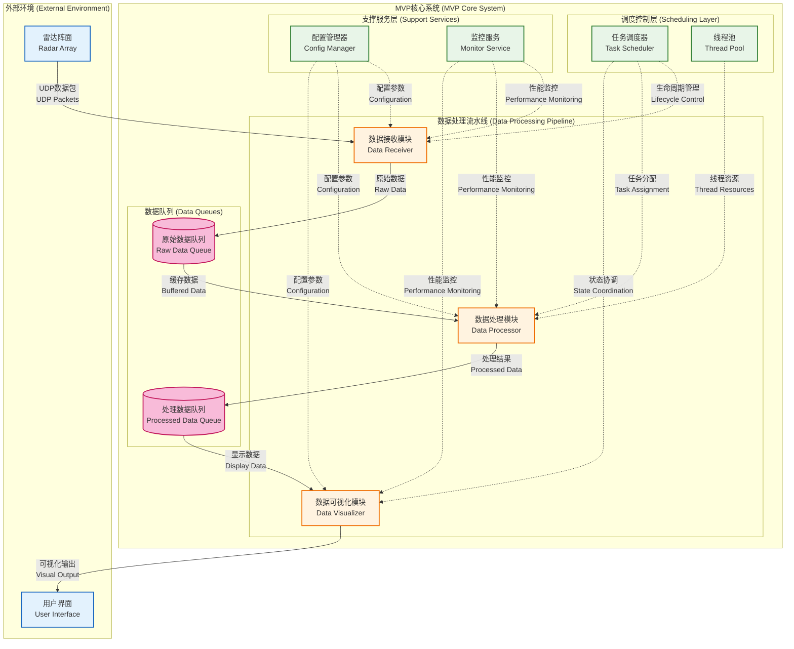

# Radar MVP - GPU加速相控阵雷达数据处理系统

[]()
[]()
[]()
[]()
[]()

一个高性能、模块化的GPU加速相控阵雷达数据处理系统，专为实时信号处理和数据分析而设计。

## 📋 快速导航

- 📁 **[完整文档](./docs/README.md)** - 系统设计、开发指南、技术规范
- 🚀 **[快速开始](#-快速开始)** - 安装和运行指南
- 🏗️ **[项目结构](#-项目结构)** - 代码组织和模块说明
- 🔧 **[开发指南](./docs/02_开发指南/)** - Git工作流、编码规范
- 📊 **[技术规范](./docs/03_技术规范/)** - 代码风格、架构设计

## 🎯 项目概述

### 核心特性
- **GPU加速处理**: 基于CUDA的高性能并行计算
- **实时数据流**: 支持连续高速雷达数据处理
- **模块化架构**: 松耦合设计，易于扩展和维护
- **跨平台支持**: Windows和Linux双平台兼容
- **高吞吐量**: 目标处理能力1GB/s数据流

### 系统架构


## 🚀 快速开始

### 系统要求
- **操作系统**: Windows 10+ 或 Ubuntu 20.04+
- **编译器**: GCC 9+ 或 MSVC 2019+
- **GPU**: NVIDIA GPU with CUDA 12.2+ 支持
- **内存**: 16GB+ RAM 推荐
- **存储**: 50GB+ 可用空间

### 安装依赖

#### Windows (PowerShell)
```powershell
# 自动安装所有依赖
.\scripts\setup_windows_dependencies.ps1

# 或者手动安装
choco install -y cmake ninja cuda visualstudio2022buildtools
```

#### Linux (Ubuntu)
```bash
# 自动安装所有依赖
./scripts/setup_linux_dependencies.sh

# 或者手动安装
sudo apt update
sudo apt install -y build-essential cmake ninja-build cuda-toolkit
```

### 构建项目

#### 快速构建
```bash
# Windows
.\scripts\build_windows.ps1

# Linux
./scripts/build_linux.sh
```

#### 手动构建
```bash
# 1. 创建构建目录
mkdir build && cd build

# 2. 配置CMake
cmake -G Ninja -DCMAKE_BUILD_TYPE=Release ..

# 3. 编译
ninja

# 4. 运行测试
ctest
```

### 运行系统
```bash
# 从构建目录运行
./bin/radar_mvp

# 或指定配置文件
./bin/radar_mvp --config ../configs/config.yaml
```

## 📁 项目结构

```
radar_mvp/
├── CMakeLists.txt              # 主构建配置
├── README.md                   # 本文件
├── configs/                    # 配置文件
│   └── config.yaml            # 主配置文件
├── include/                    # 头文件
│   ├── common/                # 公共接口和类型
│   │   ├── interfaces.h       # 基础接口定义
│   │   ├── types.h           # 数据类型定义
│   │   └── error_codes.h     # 错误代码定义
│   ├── modules/               # 模块接口
│   │   ├── data_receiver.h   # 数据接收接口
│   │   ├── data_processor.h  # 数据处理接口
│   │   ├── task_scheduler.h  # 任务调度接口
│   │   └── display_controller.h # 显示控制接口
│   └── application/           # 应用层接口
├── src/                       # 源代码
│   ├── main.cpp              # 程序入口点
│   ├── common/               # 公共实现
│   ├── modules/              # 模块实现
│   │   ├── data_receiver/    # 数据接收模块
│   │   ├── data_processor/   # 数据处理模块
│   │   ├── task_scheduler/   # 任务调度模块
│   │   └── display_controller/ # 显示控制模块
│   └── application/          # 应用层实现
├── tests/                    # 测试代码
│   ├── unit_tests/          # 单元测试
│   └── integration_tests/   # 集成测试
├── scripts/                 # 构建和部署脚本
├── third_party/            # 第三方库
│   ├── googletest/         # 测试框架
│   ├── spdlog/            # 日志库
│   └── yaml-cpp/          # YAML解析库
└── logs/                   # 运行日志
```

## 🔧 开发指南

### 模块开发流程
1. **接口定义**: 在 `include/modules/` 中定义模块接口
2. **实现模块**: 在 `src/modules/` 中实现具体功能
3. **编写测试**: 在 `tests/` 中添加单元测试和集成测试
4. **文档更新**: 更新相关文档和注释

### 代码规范
- **C++17标准**: 使用现代C++特性
- **命名约定**: 类名PascalCase，函数名camelCase，变量名snake_case
- **错误处理**: 使用ErrorCode返回值而非异常
- **内存管理**: 优先使用智能指针

### Git工作流
```bash
# 使用项目专用Git脚本
. ../scripts/git-radar-management.ps1

# 切换到功能分支
radar-switch data-processor

# 标准化提交
radar-commit feat data-processor "实现FFT加速算法"

# 同步远程
radar-sync
```

## 🧪 测试

### 运行测试
```bash
# 运行所有测试
ctest

# 运行特定测试
ctest -R unit_tests
ctest -R integration_tests

# 详细输出
ctest -V
```

### 测试覆盖率
```bash
# 生成覆盖率报告 (需要gcov)
cmake -DENABLE_COVERAGE=ON ..
make coverage
```

## 📊 性能指标

### 目标性能
- **数据吞吐量**: 1GB/s+
- **处理延迟**: <10ms (端到端)
- **GPU利用率**: 70-90%
- **CPU占用**: <60%

### 性能测试
```bash
# 运行性能基准测试
./bin/radar_mvp --benchmark

# 生成性能报告
./bin/radar_mvp --profile --output=performance.json
```

## 🔍 调试

### 调试构建
```bash
cmake -DCMAKE_BUILD_TYPE=Debug -DENABLE_DEBUG_LOGS=ON ..
ninja
```

### 日志级别
- `TRACE`: 详细调试信息
- `DEBUG`: 调试信息
- `INFO`: 一般信息 (默认)
- `WARN`: 警告信息
- `ERROR`: 错误信息

### 内存检查
```bash
# Valgrind (Linux)
valgrind --tool=memcheck --leak-check=full ./bin/radar_mvp

# Address Sanitizer
cmake -DENABLE_ASAN=ON ..
```

## 📚 文档

### API文档
```bash
# 生成Doxygen文档
doxygen Doxyfile
open docs/html/index.html
```

### 架构文档
- 详细设计文档请参考 `../docs/01_项目设计/MVP系统设计文档.md`
- 开发指南请参考 `../docs/02_开发指南/`
- 技术规范请参考 `../docs/03_技术规范/`

## 🤝 贡献指南

### 开发分支策略
- `main`: 生产稳定版本
- `develop`: 开发主分支
- `feature/*`: 功能开发分支
- `hotfix/*`: 紧急修复分支

### 提交规范
```
<type>(<scope>): <description>

[optional body]

[optional footer]
```

类型包括: `feat`, `fix`, `docs`, `style`, `refactor`, `perf`, `test`, `chore`

## 📄 许可证

本项目采用 MIT 许可证。详情请参考 [LICENSE](./LICENSE) 文件。

## 🆘 支持

### 常见问题
- 构建失败: 检查依赖安装和CUDA环境
- 性能问题: 验证GPU驱动和内存配置
- 运行时错误: 查看日志文件 `logs/radar_mvp.log`

### 联系方式
- 问题报告: [GitHub Issues](https://github.com/wendizhou99-cell/Radar/issues)
- 技术讨论: [GitHub Discussions](https://github.com/wendizhou99-cell/Radar/discussions)

---

**最后更新**: 2025年9月14日
**版本**: MVP v1.0
**维护者**: wendizhou99-cell
