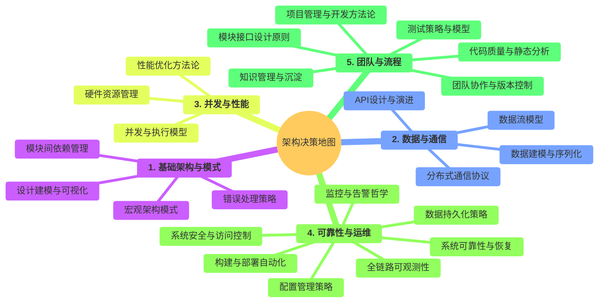
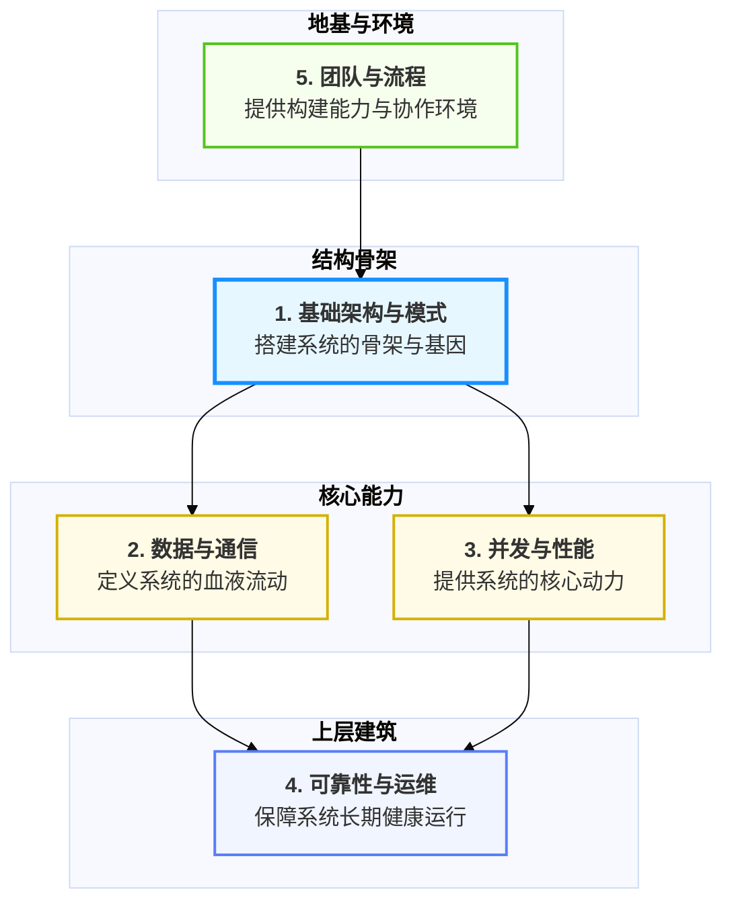
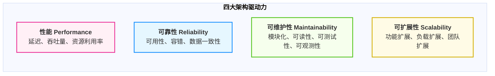
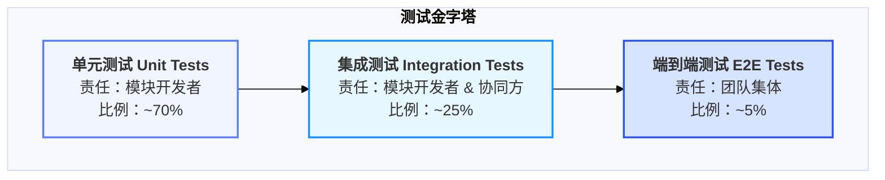

# 雷达数据处理系统：从目标到实现的设计决策

- **当前版本**: v1.1.0
- **最后更新**: 2025-10-17
- **负责人**: GitHub Copilot

-----

## 概述

- **概要**: 本文档是雷达数据处理系统顶层设计的核心阐述，旨在系统性地记录从项目初始目标到最终架构选型的完整设计决策过程。其核心目标是为团队提供一份清晰、深刻且可追溯的“架构思想地图”，确保所有关键决策都有据可依，并为后续的模块设计、开发实现和长期演进提供统一的理论基石和指导原则。

-----

## 目录

- [雷达数据处理系统：从目标到实现的设计决策](#雷达数据处理系统从目标到实现的设计决策)
  - [概述](#概述)
  - [目录](#目录)
  - [**第一章：范式迁移：从嵌入式固件到现代化服务系统的思维跃迁**](#第一章范式迁移从嵌入式固件到现代化服务系统的思维跃迁)
    - [**1.1 时代背景：高性能计算系统的复杂性困境**](#11-时代背景高性能计算系统的复杂性困境)
    - [**1.2 核心议题：两种开发思维的根本性对撞**](#12-核心议题两种开发思维的根本性对撞)
    - [**1.3 设计的航标：新范式下的核心价值追求**](#13-设计的航标新范式下的核心价值追求)
  - [**第二章：现代架构师的决策地图：高性能系统的24个关键领域**](#第二章现代架构师的决策地图高性能系统的24个关键领域)
    - [**2.1 架构设计的核心哲学：从“默认选择”到“有意识的权衡”**](#21-架构设计的核心哲学从默认选择到有意识的权衡)
    - [**2.2 决策地图全景：24个关键领域的层级化视图**](#22-决策地图全景24个关键领域的层级化视图)
    - [**2.3 主题集群的内在逻辑：从地基到上层建筑**](#23-主题集群的内在逻辑从地基到上层建筑)
    - [**2.4 架构驱动力：塑造决策的四大核心力量**](#24-架构驱动力塑造决策的四大核心力量)
    - [**2.5 导航地图：通往后续章节的路径**](#25-导航地图通往后续章节的路径)
  - [**第三章：架构设计的系统方法论：从宏观到微观的设计漏斗**](#第三章架构设计的系统方法论从宏观到微观的设计漏斗)
    - [**3.1 方法论总览：设计漏斗 (The Design Funnel)**](#31-方法论总览设计漏斗-the-design-funnel)
    - [**3.2 漏斗第一层：识别系统边界与上下文 (System Context)**](#32-漏斗第一层识别系统边界与上下文-system-context)
    - [**3.3 漏斗第二层：垂直切分核心价值流 (Vertical Slicing)**](#33-漏斗第二层垂直切分核心价值流-vertical-slicing)
    - [**3.4 漏斗第三层：定义组件与职责 (Component Design)**](#34-漏斗第三层定义组件与职责-component-design)
    - [**3.5 漏斗第四层：明确组件间契约 (Interface \& Contract)**](#35-漏斗第四层明确组件间契约-interface--contract)
    - [**3.6 漏斗第五层：关注横切关注点 (Cross-Cutting Concerns)**](#36-漏斗第五层关注横切关注点-cross-cutting-concerns)
    - [**3.7 方法论的应用：案例研究**](#37-方法论的应用案例研究)
  - [**第四章：设计的淬炼——关键决策的深度剖析**](#第四章设计的淬炼关键决策的深度剖析)
    - [**第一部分：奠定基石 —— 架构与模式决策 (4.1 ~ 4.5)**](#第一部分奠定基石--架构与模式决策-41--45)
    - [**第二部分：疏通血脉 —— 数据与通信决策 (4.6 ~ 4.9)**](#第二部分疏通血脉--数据与通信决策-46--49)
    - [**第三部分到第五部分的编写思路**](#第三部分到第五部分的编写思路)
  - [**第五章：架构范式对比分析：从嵌入式紧耦合到分布式服务化**](#第五章架构范式对比分析从嵌入式紧耦合到分布式服务化)
    - [**5.1 分析目的与范围**](#51-分析目的与范围)
    - [**5.2 架构范式核心维度对比**](#52-架构范式核心维度对比)
    - [**5.3 分析结论：架构迁移的驱动力与决策合理性**](#53-分析结论架构迁移的驱动力与决策合理性)
    - [**5.4 承前启后：新范式下的系统实现**](#54-承前启后新范式下的系统实现)
  - [**第六章：系统全景视图：从架构蓝图到动态机理**](#第六章系统全景视图从架构蓝图到动态机理)
    - [**6.1 C4 Level 1: 系统上下文图 (System Context Diagram)**](#61-c4-level-1-系统上下文图-system-context-diagram)
    - [**6.2 C4 Level 2: 容器图 (Container Diagram)**](#62-c4-level-2-容器图-container-diagram)
    - [**6.3 C4 Level 3: 组件图 (Component Diagram) - 系统的静态解构**](#63-c4-level-3-组件图-component-diagram---系统的静态解构)
    - [**6.4 动态机理：系统如何“活”起来**](#64-动态机理系统如何活起来)
    - [**6.5 总结：蓝图与决策的共鸣**](#65-总结蓝图与决策的共鸣)
  - [**第七章：质量基石：测试策略与质量保障体系**](#第七章质量基石测试策略与质量保障体系)
    - [**7.1 质量保障的核心原则：质量左移与内建**](#71-质量保障的核心原则质量左移与内建)
    - [**7.2 测试分层策略：务实的测试金字塔模型**](#72-测试分层策略务实的测试金字塔模型)
    - [**7.3 工作流集成：开发者的质量保障生命周期**](#73-工作流集成开发者的质量保障生命周期)
    - [**7.4 策略权衡与资源约束下的实践**](#74-策略权衡与资源约束下的实践)
  - [**第八章：现代化工程实践：工具、流程与思维模式**](#第八章现代化工程实践工具流程与思维模式)
    - [**第一部分：标准化工作台 (Standardized Workbench)**](#第一部分标准化工作台-standardized-workbench)
    - [**第二部分：自动化流水线 (Automated Pipeline)**](#第二部分自动化流水线-automated-pipeline)
    - [**第三部分：智能化开发辅助 (Intelligent Development Assistance)**](#第三部分智能化开发辅助-intelligent-development-assistance)
  - [**第九章：团队协作模式：标准化价值交付生命周期**](#第九章团队协作模式标准化价值交付生命周期)
    - [**9.1 宏观视图：软件价值交付生命周期全景图**](#91-宏观视图软件价值交付生命周期全景图)
    - [**9.2 阶段一：概念与规划 (Conception \& Planning)**](#92-阶段一概念与规划-conception--planning)
    - [**9.3 阶段二：架构与设计 (Architecture \& Design)**](#93-阶段二架构与设计-architecture--design)
    - [**9.4 阶段三：开发与实现 (Development \& Implementation)**](#94-阶段三开发与实现-development--implementation)
    - [**9.5 阶段四：验证与集成 (Verification \& Integration)**](#95-阶段四验证与集成-verification--integration)
    - [**9.6 阶段五：发布与部署 (Release \& Deployment)**](#96-阶段五发布与部署-release--deployment)
    - [**9.7 阶段六：运维与迭代 (Operation \& Iteration)**](#97-阶段六运维与迭代-operation--iteration)
  - [**第十章：总结：架构原则与持续演进**](#第十章总结架构原则与持续演进)
    - [**10.1 全景回顾：从概念到实践的征程**](#101-全景回顾从概念到实践的征程)
    - [**10.2 架构宪法：我们必须共同遵守的核心原则**](#102-架构宪法我们必须共同遵守的核心原则)
    - [**10.3 演进式架构：一个“活”的系统**](#103-演进式架构一个活的系统)
    - [**10.4 附录 (Appendices)**](#104-附录-appendices)
  - [**变更记录**](#变更记录)
  - [**结束语**](#结束语)

-----

## **第一章：范式迁移：从嵌入式固件到现代化服务系统的思维跃迁**

- **概要**: 本章旨在建立整个分享的思想基石。它将系统性地论述，在当前的技术背景下，高性能计算系统（如此处的雷达系统）的开发，为何必须经历一次从传统“嵌入式固件思维”到现代“分布式服务思维”的根本性转变。本章将定义这场变革的必要性，并为后续所有的方法论和决策提供宏观背景与理论依据。

### **1.1 时代背景：高性能计算系统的复杂性困境**
- **概要**: 从技术演进的角度，分析现代雷达等系统面临的新挑战。
- **客观分析**：
    - **数据爆炸 (Data Explosion)**：数据率和维度的指数级增长。
    - **算法复杂度**：从确定性信号处理，到融合 AI/ML 的复杂决策算法。
    - **迭代速度要求 (Time-to-Market)**：需求变更频繁，要求系统具备快速迭代和持续交付的能力。
- **核心论点**：传统的、与硬件紧耦合的**单体固件**开发模式，在应对上述“三位一体”的复杂性挑战时，已达到其架构能力的上限。

### **1.2 核心议题：两种开发思维的根本性对撞**
- **概要**: 以一张清晰的对比表，形式化地定义“固件思维”与“服务思维”的本质区别，为团队提供一个自我审视和转型的参照系。

| 维度 (Dimension) | 嵌入式固件思维 (Firmware Mindset) | 现代化服务思维 (Service Mindset) |
| :--------------- | :-------------------------------- | :------------------------------- |
| **核心关注点**   | 硬件效率与资源极限                | 系统韧性与持续演进               |
| **架构范式**     | 静态、单体、紧耦合                | 动态、分布式、松耦合             |
| **开发模型**     | 瀑布式、长周期                    | 敏捷式、短周期、迭代式           |
| **质量保障**     | 后期集成测试、硬件调试            | 自动化、分层测试、内建质量       |
| **部署与更新**   | 手动烧录、整体更新                | 自动化部署、持续交付、独立更新   |
| **系统状态**     | 隐式、黑盒                        | 显式、白盒（可观测性）           |

- **结论**：本次项目的设计过程，本质上就是一次**全面的、有意识的“服务思维”对“固件思维”的系统性升级**。

### **1.3 设计的航标：新范式下的核心价值追求**
- **概要**: 重新定义并阐述引言中提出的“四大追求”，使其从项目目标升华为普适性的**现代化系统设计的基本原则**。
- **内容**：
    - **实时性 (Real-time)**：在新范式下，我们追求的是**可预测的、低延迟**的系统响应，通过异步化和非阻塞设计实现。
    - **吞吐能力 (Throughput)**：追求的是**可水平扩展**的架构，确保系统能力能随资源投入而线性增长。
    - **稳定性 (Stability/Resilience)**：追求的是**具备自愈能力**的韧性系统，承认故障是常态，并为其设计自动化恢复机制。
    - **可维护性 (Maintainability)**：追求的是**低认知负荷和高可观测性**的系统，确保团队能够长期、高效地理解、修改和运维它。

-----

## **第二章：现代架构师的决策地图：高性能系统的24个关键领域**

- **概要**: 本章旨在为团队提供一张全面、系统的“**架构决策全景图**”。它将构建一个现代化高性能系统所需面对的所有核心问题，进行结构化的呈现。这张地图是后续所有技术讨论的“共同语言”和“知识索引”，确保任何设计决策都不是孤立的，而是整个体系中的一个有机组成部分。

### **2.1 架构设计的核心哲学：从“默认选择”到“有意识的权衡”**

- **概要**: 确立本章的统领性思想，强调现代软件架构的精髓在于**有意识的、有依据的权衡与取舍 (Conscious Trade-offs)**。
- **内容**：
    - 论述任何成熟的工程设计，都是一个在多维约束条件下寻求最优解的过程。
    - 明确本章提供的决策地图，其根本目的就是将所有潜在的“权衡点”显式化、结构化，从而赋能团队进行系统性的、而非碎片化的决策。

### **2.2 决策地图全景：24个关键领域的层级化视图**

- **概要**: 以比传统表格更直观的 `Mermaid` 思维导图，呈现决策地图的全貌，展示知识的广度和分类。
- **可视化范式：Mermaid 思维导图 (Mind Map)**
    - **宏观图：五大主题集群**
        - 一个顶层的思维导图，中心节点为“架构决策地图”，仅发散出五个一级分支，即五大主题集群。
    - **微观图：完整的24个决策领域**
        - 一个完整的思维导图，将 24 个决策领域作为二级分支，挂载于对应的五个主题集群之下。

<!-- end list -->

- **详细参考**：本节的思维导图之后，依然可以附上包含详细描述的“终极决策地图”表格，作为精细查阅的参考。

### **2.3 主题集群的内在逻辑：从地基到上层建筑**

- **概要**: 深入阐述五大主题集群之间的内在依赖关系和逻辑层次，揭示架构设计的系统性。
- **可视化范式：Mermaid 分层依赖图 (Layered Dependency Graph)**
    - **优势**：通过分层和有向箭头，清晰地展示不同决策领域之间的支撑和依赖关系，体现“一环扣一环”的构建逻辑。

<!-- end list -->

- **各集群的统领性阐述**：
    - **团队与流程 (地基)**：此集群是所有技术决策得以正确实施的**社会性与组织性基础**。没有规范的流程和高效的团队，再优秀的设计也无法高质量地落地。
    - **基础架构与模式 (骨架)**：此集群构成了系统的**结构性 DNA**。此处的决策（如选择事件驱动）将从根本上决定系统的形态、演进方向和技术天花板。
    - **数据与通信 & 并发与性能 (能力)**：这两个集群共同定义了系统的**核心功能与性能表现**。它们是系统价值的直接体现，负责将业务逻辑转化为实际的计算与数据流动。
    - **可靠性与运维 (上层建筑)**：此集群是保障系统能够**长期、稳定、可控地**运行的上层建筑。它决定了系统的成熟度和工业化水平，是系统从“可用”迈向“可靠”的关键。

### **2.4 架构驱动力：塑造决策的四大核心力量**

- **概要**: 从另一个维度，阐述影响并贯穿所有 24 个决策点的、更高层次的“**非功能性需求**”或“**架构驱动力**”，它们是我们进行权衡取舍的“价值罗盘”。
- **可视化范式：Mermaid 流程图模拟四象限**
    - **优势**：将抽象的驱动力，转化为可视化的、存在张力关系的象限，体现架构决策的权衡本质。

<!-- end list -->

- **驱动力的统领性阐述**：
    - **性能 (Performance)**：这股力量驱使我们做出有利于降低延迟和提升吞吐量的决策，如选择 UDP、零拷贝、高性能序列化等。
    - **可靠性 (Reliability)**：这股力量要求我们为故障设计，做出有利于系统稳定和数据安全的决策，如熔断器、事务、备份恢复等。
    - **可维护性 (Maintainability)**：这股力量（往往在初期被忽略）要求我们为“未来的自己和同事”设计，做出有利于降低系统复杂度和认知负荷的决策，如接口隔离、文档驱动、统一编码规范等。
    - **可扩展性 (Scalability)**：这股力量要求我们为“增长”设计，做出有利于系统应对未来更大负载和更多功能的决策，如事件驱动、水平扩展、微服务化等。
- **核心论点**：几乎每一个架构决策，都是在这四股核心力量的相互博弈和牵引下，取得的一个**动态平衡**。例如，为了极致的性能，我们可能会牺牲一些可维护性（如使用高度优化的、但难懂的代码）。

### **2.5 导航地图：通往后续章节的路径**

- **概要**: 作为本章的收尾，明确地将这个宏大的、全局性的决策地图，与后续章节的深度剖析进行关联。
- **内容**：
    - 重申本章的目的在于**展示广度**，为所有后续讨论提供了上下文和参照系。
    - 预告从第四章开始，我们将不再停留于地图的概览，而是将扮演一个“**战略决策者**”的角色，沿着第三章介绍的“设计漏斗”方法论，在这张地图上，为我们的雷达系统项目，选择一条具体的、经过深思熟虑的“**行军路线**”。

-----

## **第三章：架构设计的系统方法论：从宏观到微观的设计漏斗**

- **概要**: 在提供了“决策地图”（第二章）之后，本章将授予团队使用这张地图的“导航罗盘”——一套**系统性的、可重复的架构设计方法论**。它将指导团队如何从一个模糊的需求出发，一步步地、有条不紊地做出第二章地图中的各项决策，最终产出清晰的设计方案。

### **3.1 方法论总览：设计漏斗 (The Design Funnel)**
- **核心思想**：架构设计是一个逐步聚焦、层层递进的“漏斗”过程，它引导我们从最宏观的系统边界开始，直至最微观的实现细节，确保在每个层次都做出正确的决策。
- **图表**：绘制一个五层漏斗图，清晰展示该流程。

### **3.2 漏斗第一层：识别系统边界与上下文 (System Context)**
- **目标**：定义系统的“是什么”与“不是什么”。
- **实践**：引入并讲解 **C4 模型的 Level 1: 系统上下文图**。这是我们识别边界的标准化工具。

### **3.3 漏斗第二层：垂直切分核心价值流 (Vertical Slicing)**
- **目标**：识别系统的主干业务流程，作为架构设计的“龙骨”。
- **实践**：讲解如何通过用户故事或核心用例，识别出关键的数据处理链路（如“原始 I/Q -> 点迹 -> 航迹”），并以此作为后续组件划分的基础。

### **3.4 漏斗第三层：定义组件与职责 (Component Design)**
- **目标**：将系统拆分为职责明确、边界清晰的模块。
- **实践**：引入**单一职责原则 (SRP)**，并讲解如何使用 **C4 模型的 Level 3: 组件图**来可视化模块划分。

### **3.5 漏斗第四层：明确组件间契约 (Interface & Contract)**
- **目标**：定义模块间的“法律”，确保协同工作的一致性。
- **实践**：深入讲解**接口隔离原则 (ISP)** 和**文档驱动开发中“接口先行”**的重要性。

### **3.6 漏斗第五层：关注横切关注点 (Cross-Cutting Concerns)**
- **目标**：识别并设计可重用的基础设施，避免在每个业务模块中重复造轮子。
- **实践**：列举本项目中的横切关注点（日志、配置、监控、事件总线），并阐述为何将它们设计为独立的基础服务。

### **3.7 方法论的应用：案例研究**
- **目标**：将抽象的方法论落地。
- **内容**：选择一个具体的、中等复杂度的模块（例如 `ConfigManager`），完整地演示一遍如何应用“设计漏斗”的五个步骤，从需求分析到最终产出设计文档的全过程。

-----

## **第四章：设计的淬炼——关键决策的深度剖析**

**开场白**：“在上一章，我们鸟瞰了整个设计的作战地图。现在，我将带领大家深入战场，沿着我们精心规划的路线，逐一攻克每一个关键的技术堡垒。我们将从系统的地基开始，一层层向上构建，直至最终封顶。”

### **第一部分：奠定基石 —— 架构与模式决策 (4.1 ~ 4.5)**

- **逻辑**：我们从最宏观、最基础的决策开始，这些决策定义了系统的“骨架”和“基因”。

**4.1 宏观架构模式：为何选择“事件驱动”作为我们的宇宙中心？**
- **讲解等级**: **核心精讲**
- **决策背景**: 雷达系统本质上是异步、高并发的数据流处理系统。我们需要一个能从根本上解耦模块、支撑高吞吐、避免阻塞的架构范式。
- **横向对比**:
    - **请求-响应**: 简单直观，但同步阻塞特性是数据流处理的“天敌”，会造成严重的性能瓶颈。
    - **分层架构**: 适用于业务逻辑界限分明的系统，但对于我们这种横向数据流，过于僵硬，不利于模块独立演进。
    - **微服务**: 理念先进，但过早引入会带来巨大的运维复杂性（服务发现、分布式事务等），不适合当前阶段。
- **我们的选择与理由**: **事件驱动架构 (EDA)**。这是唯一能完美契合我们四大追求的模式：
    1. **高吞吐/实时性**: 异步非阻塞的本质，让数据流可以无缝传递。
    2. **高可维护性/扩展性**: 模块间通过`EventBus`这唯一的“信使”通信，互不直接依赖。新增一个模块，只需让它订阅感兴趣的事件即可，对现有系统“零侵入”。
- **在系统中的体现**: 系统的“神经中枢”——`EventBus`。所有模块的生命周期协调、配置更新、状态上报，全部通过发布和订阅事件来完成。

**4.2 设计建模与可视化：为何我们坚持“代码即图表”？**
- **讲解等级**: 补充略讲
- **决策背景**: 设计文档的图表必须与代码实现保持同步，避免文档腐化。传统绘图工具（如Visio）难以版本化管理。
- **横向对比**: **UML** (功能强大但笨重)、**C4模型** (理念好但工具链支持不一)。
- **我们的选择与理由**: **Mermaid**。因为它：
    1. **版本可控**: Mermaid图的定义是纯文本，可以和代码一起纳入Git管理。
    2. **易于维护**: 修改图表就像修改代码一样简单，极大地降低了文档更新的门槛，保障了**可维护性**。
- **在系统中的体现**: 我们所有的设计文档，包括《模块集成策略》中的几十张架构图、时序图，全部使用Mermaid绘制，确保了文档的“活性”。

**4.3 模块接口设计：为何我们信奉“接口隔离原则(ISP)”？**
- **讲解等级**: **核心精讲**
- **决策背景**: 模块是系统的基本单元，模块间的“契约”（接口）必须清晰、精准，避免“接口污染”。
- **横向对比**: **单一巨型接口** (如一个`IModule`包含所有方法)，这会导致简单的模块被迫实现它不需要的功能，接口臃肿，意图模糊。
- **我们的选择与理由**: **接口隔离原则 (ISP)**。我们将`IModule`拆分为多个基于角色的微接口：`ILifecycleManaged`, `IPausable`, `IMonitorable`等。
    1. **提升可维护性**: 模块按需实现接口，代码意图一目了然。一个日志服务只需实现`ILifecycleManaged`，这非常纯粹。
    2. **增强灵活性**: 通过接口组合，我们可以灵活定义不同能力的模块，完美支撑系统的演进。
- **在系统中的体现**: `DataReceiver`作为功能完整的模块，实现了多个接口；而`LoggingService`作为基础服务，则只实现了最核心的`ILifecycleManaged`接口。

**4.4 模块间依赖管理：为何“构造函数注入”是唯一选择？**
- **讲解等级**: **核心精讲**
- **决策背景**: 必须从机制上杜绝模块间的“隐藏依赖”和“意大利面条式”的调用关系。
- **横向对比**: **服务定位器/全局单例**，它们让依赖关系变得隐晦，在运行时才可能暴露问题，是可测试性的“噩梦”。
- **我们的选择与理由**: **构造函数注入**。
    1. **编译期保障**: 依赖关系在编译时就已完全确定，任何依赖缺失都会导致编译失败，将风险扼杀在摇篮里，保障了**稳定性**。
    2. **极致的可测试性**: 在单元测试中，可以轻松地将真实的依赖替换为Mock对象，这是保障代码质量的关键。
- **在系统中的体现**: 系统启动时，由`main`函数负责创建所有核心服务（Logger, ConfigManager, EventBus），然后通过构造函数“喂”给需要它们的业务模块和`TaskScheduler`。

**4.5 错误处理策略：为何我们倾向于“显式错误”而非“异常”？**
- **讲解等级**: 补充略讲
- **决策背景**: 在高性能的数据处理主路径上，C++异常的性能开销和对控制流的破坏是不可接受的。
- **横向对比**: **异常(Exceptions)** (性能开销、隐式控制流)、**返回裸指针/错误码** (容易被调用者忽略)。
- **我们的选择与理由**: **返回结果对象 (Result Object)**，类似Rust的`Result<T, ErrorCode>`。
    1. **强制处理**: 这种模式强制调用者必须显式地检查和处理错误情况，否则无法拿到成功的结果。极大地提升了系统的**稳定性**。
    2. **性能可控**: 没有异常带来的栈展开等开销，保障了数据流主路径的**实时性**。
- **在系统中的体现**: 所有可能失败的接口方法，如`IModule::initialize()`，都返回一个`ErrorCode`枚举，而非抛出异常。

### **第二部分：疏通血脉 —— 数据与通信决策 (4.6 ~ 4.9)**

- **逻辑**：骨架搭好后，我们开始设计系统的“血液循环系统”，确保数据能高效、准确地流动。

**4.6 数据流模型：为何我们采用“生产者-消费者”并统一“推”模型？**
- **讲解等级**: **核心精讲**
- **决策背景**: 需要一种既能解耦上下游模块，又能提供天然流量控制（背压）的数据交换机制。
- **横向对比**:
    - **管道-过滤器**: 耦合度高，不易实现复杂的背压和缓冲。
    - **拉模型**: 下游需要知道上游的存在，增加了耦合；同时，下游需要不断轮询，会产生不必要的CPU开销。
- **我们的选择与理由**: **生产者-消费者** + **统一推模型**。
    1. **天然背压**: 这是保障系统**稳定性**的定海神针。当消费者处理不过来时，共享缓冲区会满，生产者的“推”操作自然被阻塞，从而自动调节了整个数据流的速度，防止系统被冲垮。
    2. **职责单一**: 生产者只管生产，消费者只管消费，职责清晰，利于**维护**。
- **在系统中的体现**: `DataReceiver`作为生产者，将数据`push`到共享的`raw_data_buffer`；`SignalProcessor`作为消费者从中取出数据。

**4.7 数据建模与序列化：为何我们选择Protobuf作为跨进程的“普通话”？**
- **讲解等级**: 补充略讲
- **决策背景**: 核心服务器与显控终端是独立进程，需要一种高效、跨语言、向后兼容的序列化方案。
- **横向对比**: **JSON** (人类可读但性能差，体积大)、**直接内存拷贝** (性能最高但无法跨语言、不兼容)。
- **我们的选择与理由**: **Protocol Buffers (Protobuf)**。
    1. **高性能**: 二进制格式，序列化/反序列化速度快，体积小，保障了**实时性**。
    2. **强类型与兼容性**: 通过`.proto`文件定义数据结构，既是文档也是契约，还能保证版本演进时的向后兼容性，利于**维护**。
- **在系统中的体现**: `DisplayController`（数据网关）将内部的C++ `TrackData`对象序列化为Protobuf字节流，再通过UDP发送给显控终端。

**4.8 分布式通信协议：为何我们采用“UDP + HTTP”双通道策略？**
- **讲解等级**: **核心精讲**
- **决策背景**: 系统存在两种截然不同的通信需求：海量、低延迟的数据流，以及可靠、低频的控制流。
- **横向对比**: **全部使用TCP/HTTP** (可靠但延迟和头部开销大，不适合海量数据流)、**全部使用UDP** (高效但不可靠，不适合关键的控制命令)。
- **我们的选择与理由**: **“数据与控制分离”原则在网络层的完美体现**。
    1. **UDP负责数据面**: 用于从服务器向显控终端高速推送渲染数据。我们追求极致的**实时性**，可以容忍偶尔的丢包（一帧画面丢失不影响大局）。
    2. **HTTP/RESTful API负责控制面**: 用于显控终端下发命令、查询状态。这些操作必须100%可靠，我们追求**稳定性**。
- **在系统中的体现**: `DisplayController`通过UDP向外发送数据，而外部命令则通过`API Gateway`以HTTP请求的形式进入系统。

**4.9 API设计与演进：... (略讲)**
- (此部分可根据实际情况，如果外部API复杂就精讲，否则略讲)

### **第三部分到第五部分的编写思路**
- **逻辑**：后续章节将沿用此模式，逐一推进。
- **Part 3: 并发与性能 (极限压榨)**
    - **4.10 并发模型**: 讲解为何选择**线程池**而非为每个任务创建线程，是为了控制资源和复用，保障**稳定性**和**性能**。
    - **4.11 硬件资源管理**: **核心精讲**。讲解为何设计**硬件抽象层(HAL)**，是为了在直接调用CUDA追求**性能**的同时，也为未来适配其他硬件（如ROCm）保留了**可维护性**。
    - **4.12 性能优化方法论**: 讲解我们为何采用**基准测试驱动**和**响应式优化**，确保优化都花在刀刃上。
- **Part 4: 可靠性与运维 (构建壁垒)**
    - **4.13 可靠性与恢复**: **核心精讲**。深度讲解**熔断器模式**如何防止“恢复风暴”，保护系统。
    - **4.14 配置管理**: **核心精讲**。讲解**事件驱动热更新**相比于轮询和重启，如何实现零停机下的敏捷运维。
    - **4.15 全链路可观测性**: **核心精讲**。讲解**TraceID**是如何成为我们排查分布式系统中“幽灵问题”的“神兵利器”的。
    - ... (其他主题按需详略)
- **Part 5: 团队与流程 (保障协同)**
    - **4.20 代码质量**: 讲解引入**静态分析**和**代码格式化**，是如何将团队从“代码风格圣战”中解放出来，专注于业务逻辑的。
    - **4.21 测试策略**: 讲解为何采用**测试金字塔**模型，强调坚实的单元测试是高层测试效率和可靠性的保障。
    - **4.22 版本控制**: **核心精讲**。对于从DSP转型的团队，详细讲解为何选择**GitFlow**（如果项目是版本发布驱动）或**GitHub Flow**（如果追求快速迭代），以及**Code Review**为何是保障质量和知识传递的生命线。
    - **4.24 知识管理**: **核心精讲**。讲解引入**ADRs (架构决策记录)**，是如何将像今天这样的重要讨论沉淀为团队的永久财富，避免了“历史决策无人知晓”的困境。

---

**给您的建议**：
1. **串联故事线**：在讲解每个决策点时，多使用承上启下的语言。例如：“在确定了事件驱动的宏观架构后，我们面临的第一个具体问题就是，模块之间应该如何定义它们的‘对话’方式？这就是我们的接口设计决策……”
2. **引用核心追求**：将每个“选择理由”都尽可能地与开篇提出的“四大核心设计追求”挂钩。这会让你的整个分享逻辑非常严密、首尾呼应。
3. **准备实例**：对于每一个精讲的主题，都准备一个可以直接从`99_模块集成策略.md`或其他文档中信手拈来的具体例子。实例远比空谈理论更具说服力。

-----

## **第五章：架构范式对比分析：从嵌入式紧耦合到分布式服务化**

### **5.1 分析目的与范围**

本章旨在对本项目所采用的基于GPU的分布式服务架构，与传统的基于DSP的嵌入式紧耦合架构，进行一次系统性的、多维度的技术对比分析。此分析的目的并非否定DSP架构的历史价值，而是在当前雷达系统对**性能、可扩展性、可靠性及可维护性**等非功能性需求急剧增长的背景下，从根本上论证本次架构范式迁移的必要性与技术优越性。

本章的分析结果，将为第四章中详述的各项具体设计决策（如事件驱动、依赖注入、熔断器模式等）提供根本性的理论依据，并为第六章的系统全景视图展示其架构设计的内在逻辑。

### **5.2 架构范式核心维度对比**

以下表格从九个核心技术维度，对两种架构范式进行解构与对比。

| 技术维度                  | 传统DSP嵌入式架构 (Embedded Tightly-Coupled Architecture)                                                                                                                                                          | 现代GPU服务器架构 (Distributed Service-Oriented Architecture)                                                                                                                                                                                                     |
| :------------------------ | :----------------------------------------------------------------------------------------------------------------------------------------------------------------------------------------------------------------- | :---------------------------------------------------------------------------------------------------------------------------------------------------------------------------------------------------------------------------------------------------------------- |
| **1. 计算模型与资源调度** | **静态、确定性管道 (Static & Deterministic Pipeline)**： • 计算流程在编译期固化，形成硬编码的处理链。 • 调度由实时操作系统（RTOS）或中断驱动，任务优先级固定，追求最坏情况下的时间确定性（WCET）。           | **动态、阶段化事件驱动 (Dynamic & Staged Event-Driven)**： • 计算流程由独立的、可组合的服务（模块）构成，通过事件流动态编排。 • 调度由通用操作系统及应用层调度器（TaskScheduler）负责，结合资源池化和优先级队列，追求高吞吐和平均响应时间的最优化。         |
| **2. 数据流与内存模型**   | **物理地址与DMA (Physical Addressing & DMA)**： • 数据流高度依赖片上内存（On-chip Memory）和直接内存访问（DMA）通道。 • 数据路径刚性，缓冲区大小和地址通常在编译期确定，内存管理由开发者手动进行。           | **逻辑抽象与零拷贝 (Logical Abstraction & Zero-Copy)**： • 数据流通过逻辑队列（生产者-消费者模式）进行，物理内存由操作系统管理。 • 采用页锁定内存（Pinned Memory）和指针传递实现CPU-GPU及模块间的零拷贝，兼顾了灵活性与高性能。                             |
| **3. 模块化与耦合度**     | **单体固件与函数级耦合 (Monolithic Firmware & Functional Coupling)**： • 整个系统编译为一个单一可执行镜像。 • 模块间通常通过直接函数调用进行，数据结构全局可见或通过头文件紧密耦合，修改一处易引发雪崩效应。 | **组件化与接口驱动 (Componentization & Interface-Driven)**： • 系统由多个独立组件构成，每个组件有明确的职责边界。 • 模块间通信严格通过抽象接口（ISP原则）和标准化的数据传输对象（DTO），实现了高内聚、低耦合。                                              |
| **4. 系统扩展性**         | **垂直扩展 (Vertical Scaling)**： • 性能提升主要依赖于替换更高频率、更多核心的DSP芯片或增加硬件协处理器。 • 扩展能力受限于单一硬件的物理极限，成本呈非线性增长。                                             | **水平扩展 (Horizontal Scaling)**： • 性能可通过增加更多GPU计算卡或服务器节点来提升。 • 事件驱动和无状态处理单元的设计，使得系统天然支持负载均衡和分布式部署，扩展能力理论上无上限。                                                                        |
| **5. 可靠性与故障处理**   | **整体复位 (System-wide Reset)**： • 缺乏有效的故障隔离机制，单个模块的致命错误（如指针越界）通常导致整个系统通过看门狗（Watchdog）定时器进行硬件复位。 • 故障恢复时间（MTTR）长，且状态信息全部丢失。       | **故障隔离与精确恢复 (Fault Isolation & Granular Recovery)**： • 模块运行在独立的线程或进程上下文中，一个模块的崩溃不会直接影响其他模块。 • 通过熔断器、舱壁隔离等模式，可实现故障的快速检测和隔离，并仅对受影响的模块及其依赖进行精确的、自动化的恢复。    |
| **6. 可观测性与调试**     | **硬件级调试 (Hardware-Level Debugging)**： • 严重依赖JTAG、仿真器等硬件工具进行断点调试。 • 运行时系统内部状态对外部几乎是“黑盒”，难以进行在线的问题诊断和性能分析。                                        | **全链路分布式追踪 (End-to-End Distributed Tracing)**： • 通过TraceID、结构化日志和指标监控，可完整观测任何一次请求或数据流在系统中的完整路径、耗时和状态。 • 实现了系统运行状态的白盒化，极大提升了问题定位和性能优化的效率。                              |
| **7. 配置管理与部署**     | **编译期绑定与固件更新 (Compile-time Binding & Firmware Reflash)**： • 系统参数大量以宏定义或静态变量形式存在，修改后需重新编译整个固件。 • 部署即“烧录”，是一个高风险、手动的、离线的物理过程。             | **外部化配置与持续部署 (Externalized Config & Continuous Deployment)**： • 配置与代码分离，存储在外部文件或配置中心，可通过事件驱动机制实现运行时热更新。 • 部署通过CI/CD流水线自动化完成，支持容器化、蓝绿部署等高级策略，实现了快速、可靠、可回滚的交付。 |
| **8. 开发生命周期**       | **瀑布式与串行开发 (Waterfall & Serial Development)**： • 由于高度耦合和整体编译的特性，开发流程倾向于严格的、长周期的瀑布模型。 • 不同功能的开发者难以并行工作，集成阶段风险极高。                          | **敏捷式与并行开发 (Agile & Parallel Development)**： • 清晰的模块边界和接口契约，使得多个团队可以基于同一份接口文档并行开发不同的模块。 • 自动化测试和持续集成保障了高频率提交下的代码质量，完美支撑Scrum等敏捷开发方法论。                                |

### **5.3 分析结论：架构迁移的驱动力与决策合理性**

上述对比清晰地表明，传统DSP架构在追求极致的**单点执行效率**和**硬件控制确定性**方面具备优势，但其代价是系统的**灵活性、可扩展性、可靠性和可维护性**的严重受损。当系统复杂度超越某个阈值后，这些非功能性短板将成为制约项目成功和长期演进的决定性因素。

本次架构迁移，本质上是一次基于工程优先级的战略性权衡：我们选择适度放弃硬件层面的微观极致优化，以换取在系统宏观层面获得决定性的、数量级的收益。

  - 第四章中对**事件驱动架构 (4.1)**、**接口隔离原则 (4.3)** 和**依赖注入 (4.4)** 的选择，是对DSP架构**单体固件与紧耦合**问题的直接回应。
  - 对**生产者-消费者模型 (4.6)** 和**零拷贝技术**的应用，是在服务器架构的灵活性之上，重新追求数据流**高性能**的体现。
  - **熔断器模式 (4.13)** 和**全链路可观测性 (4.15)** 的引入，则是为了从根本上解决DSP架构在**可靠性**和**问题定位**方面的先天不足。
  - **CI/CD (4.16)** 和**GitFlow (4.22)** 等工程实践的采纳，标志着团队开发模式从**固件开发**向现代**软件工程**的全面转型。

### **5.4 承前启后：新范式下的系统实现**

通过以上分析，我们系统性地论证了从DSP到服务器架构迁移的内在逻辑和技术合理性。这并非一次简单的技术替换，而是一次全面的工程思想升级。

在确立了新架构范式的理论基础之后，接下来的章节将具体呈现我们在这一新范式指导下所构建的系统——一个模块化、可观测、高可靠的雷达数据处理系统全景视图。

好的，收到您的新要求。这个“微观图 + 宏观图”组合的思路非常高明，它完美地解决了技术文档和分享中的一个核心矛盾：**如何在不牺牲深度细节的前提下，又能让听众快速建立起对复杂系统的概念性理解**。

这是一种卓越的沟通策略。宏观图负责“**建立心智模型 (Build the Mental Model)**”，微观图负责“**提供工程证据 (Provide the Engineering Proof)**”。

我们将以C4模型作为骨架，将“微观+宏观”组合模式和状态机图作为血肉，为您构建一个全新的、逻辑层次极其清晰的第六章。

---

## **第六章：系统全景视图：从架构蓝图到动态机理**

**开场白**：“在论证了架构范式的优越性之后，本章将进入最终的成果展示阶段。我们将遵循C4架构可视化模型，从系统在宇宙中的位置开始，逐层深入，直至其最微观的细胞结构。在每一个关键层面，我们都将提供‘宏观概念图’与‘微观工程图’的组合，确保在座的每一位，无论关注战略还是细节，都能对系统形成完整而精确的认知。”

### **6.1 C4 Level 1: 系统上下文图 (System Context Diagram)**

- **定位**：此为**终极宏观图**。它定义了系统的边界和外部交互，回答了“我们的系统为谁服务，又依赖谁？”这个问题。
- **图表形式 (单一宏观图)**：
    - **内容**：将“雷达数据处理系统”置于中心，作为一个单一的黑盒。周围环绕着与之直接交互的用户和系统：`显控操作员` (用户)、`雷达阵面` (上游数据源)、`Prometheus监控系统` (运维工具)、`ELK日志系统` (运维工具)。
    - **语言**：“这张图是我们与世界对话的方式。它明确了我们的‘国境线’，所有穿越这条线的数据和命令，都必须遵循我们定义的协议。”

### **6.2 C4 Level 2: 容器图 (Container Diagram)**

- **定位**：此为**部署层面的宏观图**。它打开了第一层黑盒，展示了系统由哪些可独立部署和运行的单元（“容器”）组成。
- **图表形式 (单一宏观图)**：
    - **内容**：展示系统的几个核心物理进程/服务单元。例如：`核心处理服务器 (C++ Application)`、`显控终端 (Qt Application)`、`监控数据库 (Prometheus DB)`、`日志聚合服务 (Logstash Service)`。并用箭头清晰标注它们之间的高层通信协议（如TCP/HTTP, UDP）。
    - **语言**：“这是我们系统的‘物理器官图’。它显示了系统由几个独立的、有生命力的部分组成，它们通过标准化的网络协议进行沟通，共同构成一个完整的生态。”

### **6.3 C4 Level 3: 组件图 (Component Diagram) - 系统的静态解构**

- **定位**：本节是全景视图的核心，我们将深入“核心处理服务器”这个最重要的容器，全面解构其内部的“组织架构”。
- **6.3.1 宏观概念图：三大核心平面**
    - **图表类型**：极简化的组件分区图。
    - **内容**：图中只画三个巨大的色块，分别代表：
        1. **控制平面 (大脑与神经)**：负责决策、协调与生命周期管理。包含`任务调度器`和`配置管理器`等少数代表。
        2. **数据平面 (生产线)**：负责高速、流水线式的数据处理。包含`数据接收` -> `信号处理` -> `数据处理`的简化链路。
        3. **基础设施 (水电煤)**：为上层提供通用能力支撑。只画一个`事件总线`作为代表。
    - **语言 (通俗化)**：“要理解我们系统的内部结构，可以把它想象成一个高度自动化的工厂。**数据平面**是我们的核心生产线，原材料（雷达数据）从一端进入，成品（航迹数据）从另一端输出。**控制平面**则是中央控制室，它不下场干活，但负责监控生产线状态、下达启停指令、应对突发故障。而所有这一切，都依赖于工厂的**基础设施**——比如全厂广播系统（事件总线），来传递信息。”
- **6.3.2 微观工程图：系统总体组件架构蓝图**
    - **图表类型**：**事无巨细的、高密度的组件图** (您要求的那张终极蓝图)。
    - **内容**：
        - 严格按照三大平面进行分区布局。
        - 包含**所有**核心组件 (`DataReceiver`, `SignalProcessor`, `DataProcessor`, `DisplayController`, `TaskScheduler`, `ConfigManager`, `MonitoringModule`, `APIGateway`等)。
        - 包含**所有**基础设施 (`EventBus`, `LoggingService`, `SharedMemoryPools`, `ThreadPools`)。
        - 使用**不同线条**明确区分**数据流 (粗实线)**、**控制流 (细虚线)** 和 **事件流 (细点线)**。
    - **语言 (专业化)**：“这张图是我们系统的最终工程蓝图。它精确地定义了20余个核心组件的职责边界及其交互关系。例如，可以看到`TaskScheduler`通过控制流（虚线）管理所有组件的生命周期；而数据则严格在数据平面内部，通过共享内存池（由粗实线代表的数据流）进行高效传递。所有异步通知和状态变更，则统一通过`EventBus`（点线）进行解耦通信。这张图是所有模块实现代码的直接依据。”

### **6.4 动态机理：系统如何“活”起来**

- **定位**：静态结构定义了“有什么”，本节则通过动态图表回答“如何运作”。
- **6.4.1 状态管理的严谨性：状态机图**
    - **宏观概念图：系统高级生命周期**
        - **图表类型**：简化的状态机图。
        - **内容**：只包含几个关键的、外部可感知的系统状态：`已停止 (Stopped)`、`初始化中 (Initializing)`、`运行中 (Running)`、`故障恢复中 (Recovering)`。
        - **语言**：“从宏观上看，我们的系统就像一个生命体，总是在几个明确的状态间切换。它要么在稳定运行，要么在有序地启停，或者在进行高效的自我修复。”
    - **微观工程图：任务调度器与熔断器的精确状态机**
        - **图表类型**：**两张详细的状态机图**。
        - **图一：`TaskScheduler` 状态机**：形式化地定义其内部所有状态（如`BOOTING`, `INITIALIZING`, `DEGRADED`等），以及触发状态转换的所有事件（如`AllModulesReady`, `ModuleFailed`）和转换条件（Guard Conditions）。
        - **图二：`CircuitBreaker` 状态机**：精确定义`CLOSED`, `OPEN`, `HALF_OPEN`三个状态，以及触发状态转换的`FailureThresholdReached`, `TimeoutExpired`, `ProbeSuccess`等事件。
        - **语言**：“系统的可靠性并非偶然。它是由这些设计严谨、逻辑无歧义的状态机来保证的。例如，这张`TaskScheduler`状态机图精确定义了系统在收到任何外部或内部事件时，应该如何行动，杜绝了任何未定义状态的出现。而这张`CircuitBreaker`状态机，则是我方系统面对‘恢复风暴’时的核心防御机制。”
- **6.4.2 数据流的生命周期：从原始I/Q到最终航迹**
    - **宏观概念图：数据降维漏斗 (Sankey图)**
        - **图表类型**：**Sankey图**。
        - **内容**：用宽度不等的流量带，直观地展示数据量从`原始I/Q (极宽)` -> `点迹 (变窄)` -> `航迹 (最窄)`的巨大变化过程。
        - **语言**：“数据处理的本质是一次信息提纯的过程。这张漏斗图直观地展示了我们的算法是如何从每秒GB级的噪声海洋中，高效地提炼出每秒MB级的高价值航迹情报的。”
    - **微观工程图：端到端数据处理时序图**
        - **图表类型**：**详细的时序图** (复用`99_模块集成策略.md`的Happy Path图)。
        - **内容**：包含所有数据平面组件、缓冲区、甚至GPU Kernel的调用，精确到每一次数据入队和出队操作。
        - **语言**：“这张时序图是对数据处理过程的‘逐帧分析’。它展示了从`DataReceiver`收到UDP包开始，到`DisplayController`发出渲染数据的每一个精确步骤。通过这张图，我们可以对系统的端到端延迟进行μs级的分析和优化。”

### **6.5 总结：蓝图与决策的共鸣**

- **定位**：本章收尾，将当前展示的所有图表与第四章的架构决策进行强关联，形成逻辑闭环。
- **内容**：无需图表，用精炼的文字进行总结。
    - “我们看到的C4组件图，是**事件驱动架构**和**模块化设计**决策的直接产物。”
    - “状态机图的严谨性，源于我们对**系统可靠性**的极致追求，并物化为**熔断器**和**精确恢复**等具体决策。”
    - “Sankey图和时序图所展现的高效数据流，则得益于我们对**生产者-消费者模式**和**零拷贝技术**的坚持。”
    - “最终，这一整套视图共同构成了我们新架构的完整画像，每一个细节都回响着我们最初的设计原则与决策。”

好的，遵照您的要求。我们将对第七章进行重构，采用纯粹、客观、深度、专业的语言风格，摒弃所有非技术性的比喻和感性色彩。本章将作为一份严谨的工程策略文档，为团队提供一套在资源有限条件下，依然能够系统性保障软件质量的标准化工作流程。

-----

## **第七章：质量基石：测试策略与质量保障体系**

**引言**
本章旨在定义雷达数据处理系统的质量保障策略与测试工作流。鉴于团队组织结构中无专职测试工程师，本策略的核心是将质量保障责任全面“左移”，使其内建于软件开发生命线的每个环节。策略的设计目标是在有限的工程资源下，通过最大化自动化和明确开发者职责，实现核心功能稳定性的有效保障，并系统性地降低缺陷注入与逃逸的风险。

### **7.1 质量保障的核心原则：质量左移与内建**

1. **质量左移 (Quality Left-Shift)**：本策略的基石是将质量保障活动从传统的开发后期测试阶段，前移至需求分析、架构设计和编码实现阶段。其目的是在缺陷生命周期的最早阶段识别并修复问题，从而极大地降低修复成本和对项目进度的影响。
2. **质量内建 (Built-in Quality)**：我们明确，软件质量是“构建”进去的，而非“测试”出来的。功能代码与其对应的自动化测试被视为一个不可分割的交付整体。任何未经充分测试验证的代码，均被定义为未完成的工作。
3. **开发者责任制**：每个模块的开发者或负责人，是该模块质量的第一责任人。该职责不仅包括功能实现，更涵盖了相应测试用例的设计、编写与长期维护。

### **7.2 测试分层策略：务实的测试金字塔模型**

为优化测试投入产出比（ROI），我们采纳了经过实践检验的测试金字塔模型。该模型规定了不同测试类型的投入比例，旨在通过高频次、低成本的底层测试来保障大部分代码质量，并通过逐层递减的、高成本的上层测试来验证系统集成与业务流程。

**宏观模型：测试金字塔与责任归属**

**微观解析：各层级的技术定义与实践**

  - **单元测试 (Unit Tests)**

      - **目标**：验证软件中最小可测试单元（通常是单个类或函数）的逻辑正确性。聚焦于算法实现、边界条件、状态转换和错误处理。
      - **技术实现**：采用GoogleTest (GTest)作为测试框架，GoogleMock (GMock)作为模拟（Mocking）框架。测试用例必须能够脱离外部依赖（如网络、文件系统）独立、快速地执行。
      - **责任归属**：模块开发者必须为其实现的核心业务逻辑和复杂算法编写全面的单元测试。这是代码进入版本控制系统的基本前提。

  - **集成测试 (Integration Tests)**

      - **目标**：验证多个模块协同工作时，其交互接口（即“契约”）的正确性。测试重点在于模块间的通信协议、数据格式一致性、共享资源（如内存队列）的访问逻辑。
      - **技术实现**：仍可基于GTest框架。测试环境需模拟或启动被测模块的真实依赖项（如启动一个内存中的EventBus实例）。
      - **责任归属**：当开发者修改了其模块的对外接口或交互行为时，其有责任编写或更新相应的集成测试，以确保变更未对系统的其他部分产生负面影响。

  - **端到端测试 (End-to-End Tests)**

      - **目标**：从外部用户或系统的视角，验证一条完整的核心业务流程能否按预期工作。它覆盖了从系统入口到出口的整个调用链。
      - **技术实现**：通过专用测试脚本，模拟外部输入（如发送UDP数据包），并验证最终的外部输出（如API响应或UDP输出数据包）是否符合预期。这类测试运行环境复杂，执行耗时较长。
      - **责任归属**：由团队集体所有，并有意识地将其数量控制在最小必要范围。主要由CI/CD系统在预发布环境（Staging）中自动执行。

### **7.3 工作流集成：开发者的质量保障生命周期**

为将上述测试策略无缝融入日常开发，我们定义了标准化的、包含自动化质量门禁的工作流程。

1. **阶段一：本地开发 (Local Development)**

      - **开发者操作**：
        1. 实现功能代码。
        2. 同步编写单元测试与必要的集成测试。
        3. 在本地开发环境执行`make test`指令，确保所有新增和既有的测试用例100%通过。
      - **质量门禁**：开发者个人责任。

2. **阶段二：持续集成 (Continuous Integration)**

      - **触发条件**：代码被`git push`到远程特性分支（Feature Branch）。
      - **自动化流程 (CI Pipeline)**：
        1. **静态分析**：执行Clang-Tidy等工具，检查代码是否遵循编码规范，并识别潜在的逻辑缺陷。
        2. **构建**：在洁净环境中执行编译和链接，确保代码的可构建性。
        3. **单元测试**：运行项目全量的单元测试。
      - **质量门禁**：自动化。任何步骤失败，流水线将立即中止并向开发者发送失败报告。

3. **阶段三：代码审查 (Code Review via Pull Request)**

      - **触发条件**：开发者创建从特性分支向`develop`分支的合并请求（Pull Request, PR）。
      - **自动化流程 (CI Pipeline)**：CI系统自动运行范围更广、耗时更长的**集成测试**。
      - **人工门禁**：PR必须获得至少一位其他团队成员的批准（Approve）。审查的核心内容包括：
          - 设计的合理性与代码的可读性。
          - **测试的完备性**：审查者需评估测试用例是否充分覆盖了变更的核心逻辑和潜在的边界场景。
      - **合并前置条件**：**CI测试通过 + 人工审查批准**。

4. **阶段四：预发布验证 (Staging Verification)**

      - **触发条件**：PR成功合并到`develop`分支后，自动部署到预发布环境。
      - **自动化流程**：CI/CD系统在此环境上定时（如每日夜间）执行全量的**端到端测试**。
      - **开发者操作**：功能合并后，开发者应在预发布环境进行一次快速的手动功能验证（Sanity Check）。

### **7.4 策略权衡与资源约束下的实践**

为在有限的人力资源下最大化质量保障的效能，我们明确以下策略权衡：

  - **强制执行的非妥协项**：
      - 所有核心算法、复杂业务逻辑必须拥有高覆盖率的**单元测试**。
      - 所有跨模块的接口变更，必须有相应的**集成测试**进行验证。
      - 所有代码合并必须通过**CI自动化门禁**和**人工代码审查**。

  - **接受的风险与妥协项**：
      - **不以代码覆盖率作为唯一指标**。对于无复杂逻辑的胶水代码或简单的Get/Set方法，可不编写单元测试。
      - **端到端测试范围最小化**。仅覆盖系统最关键的1-3条主干业务流程。
      - **专项测试活动化**。性能、压力、可靠性等非功能性测试，不作为每次提交的自动化门禁，而是作为每个版本发布前的专项测试活动，由团队协同完成。

-----

## **第八章：现代化工程实践：工具、流程与思维模式**

**本章定位**：本章旨在为团队提供一套完整的、现代化的软件工程实践蓝图。它不仅是一份开发者操作手册，更是一次从传统开发模式向**自动化、标准化、智能化**的现代工程文化迁移的全面指南。其内容覆盖了从开发者个人环境到团队协作工具链的每一个环节，目标是为团队建立一个高效、可靠、可扩展的软件交付体系。本章的每一个子节，都将链接到更详细的独立文档，构成一个可索引的知识网络。

### **第一部分：标准化工作台 (Standardized Workbench)**

* **核心目标**：为每一位工程师提供一个统一、高效、强大的本地开发环境，消除个体差异，提升基础开发效率。

**8.1 标准化开发环境：从“我的机器”到“我们的环境”**
- **8.1.1 核心原则**：环境即代码 (Environment as Code)。
- **8.1.2 实践方案**：
    - **容器化开发环境 (DevContainer)**：介绍并强制推广使用VS Code DevContainer。
        - `devcontainer.json`文件结构与核心配置项解析。
        - 如何实现一键式环境复现，消除新成员的环境配置障碍。
    - **统一工具链版本**：明确规定并固化编译器（GCC）、构建系统（CMake）、测试框架（GTest）等所有核心工具的版本。
- **链接文档**：`09_部署运维/01_环境搭建指南.md`

**8.2 编码标准与自动化校验：让机器保障代码的一致性**
- **8.2.1 核心原则**：规范应由工具强制执行，而非依赖人类记忆。
- **8.2.2 实践方案**：
    - **编码规范 (Coding Standards)**：定义团队的C++编码规范，并作为Code Review的客观标准。
    - **代码格式化 (Code Formatting)**：强制使用`Clang-Format`，并将其集成到IDE的保存操作和CI流程中，终结代码风格争论。
    - **静态分析 (Static Analysis)**：强制使用`Clang-Tidy`，并配置规则集。将其作为编译过程的一部分，将潜在缺陷视为编译错误。
- **链接文档**：`07_质量保障/01_编码规范.md`

**8.3 调试与性能分析：从“猜测”到“度量”**
- **8.3.1 核心原则**：没有度量，就没有优化。
- **8.3.2 实践方案**：
    - **高级调试技术**：
        - GDB高级用法指南（条件断点、观察点、反向调试）。
        - VS Code调试器与`launch.json`的精细化配置。
        - 内存泄漏检测工具（Valgrind, ASan）的使用。
    - **性能剖析 (Profiling)**：
        - CPU性能分析工具（如`perf`, Gprof）入门。
        - GPU性能分析工具（如NVIDIA Nsight Systems）入门，如何分析CUDA Kernel性能瓶颈。
- **链接文档**：新建`02_开发指南/DebuggingAndProfilingGuide.md`

---

### **第二部分：自动化流水线 (Automated Pipeline)**

* **核心目标**：构建一条从代码提交到部署验证的自动化“高速公路”，将重复、易错的人工操作交给机器，解放生产力。

**8.4 版本控制系统 (VCS)：Git作为协作的基石**
- **8.4.1 核心原则**：清晰、一致、可追溯。
- **8.4.2 实践方案**：
    - **Git基础知识**：简要回顾核心概念（工作区、暂存区、仓库）。
    - **分支模型**：详细阐述我们采纳的GitFlow模型及其背后的逻辑。
    - **提交信息规范**：引入并强制执行Conventional Commits规范。
- **链接文档**：
    - `02_开发指南/GIt/Git快速入门与团队协作规范.md` (面向新人)
    - `02_开发指南/GIt/Git完整使用指南.md` (参考手册)

**8.5 代码托管与协作平台：GitLab/GitHub作为我们的“作战指挥室”**
- **8.5.1 核心原则**：所有协作活动必须在平台上留痕。
- **8.5.2 实践方案**：
    - **平台部署与配置**：本地部署GitLab CE的价值与方法论。
    - **Pull/Merge Request工作流**：从创建、评审到合并的完整生命周期。
    - **任务/议题跟踪 (Issue Tracking)**：如何使用Issue来管理需求、Bug和技术任务。
    - **代码片段与维基 (Snippets & Wiki)**：用于分享可复用代码和沉淀非正式文档。
- **链接文档**：`02_开发指南/GIt/GitLab CE本地部署完整教程.md`

**8.6 持续集成 (CI)：自动化质量的第一道防线**
- **8.6.1 核心原则**：快速反馈，尽早失败。
- **8.6.2 实践方案**：
    - **CI流水线 (Pipeline) 概念**：介绍Stages, Jobs, Runners等核心概念。
    - **我们的CI流水线详解**：
        - `build`阶段：多平台编译（Linux/Windows）。
        - `test`阶段：运行单元测试和集成测试。
        - `analyze`阶段：执行静态分析和代码覆盖率检查。
    - **CI配置文件解析 (`.gitlab-ci.yml`)**：逐段讲解我们CI配置文件的作用。
- **链接文档**：新建`09_部署运维/CI_CD_Guide.md`

**8.7 持续部署 (CD)：迈向一键式交付**
- **8.7.1 核心原则**：让部署变得常规、无畏、可重复。
- **8.7.2 实践方案 (初期)**：
    - **构建产物管理**：CI如何生成Docker镜像或二进制包，并推送到制品库（Artifact Repository）。
    - **自动化部署到预发布环境**：当`develop`分支有更新时，自动触发部署脚本，更新预发布（Staging）环境。
    - **手动部署到生产环境**：介绍发布流程，如何通过触发一个手动的Pipeline Job来部署`main`分支的Tag到生产环境。
- **链接文档**：`09_部署运维/CI_CD_Guide.md` (与CI合并)

---

### **第三部分：智能化开发辅助 (Intelligent Development Assistance)**

* **核心目标**：引导团队拥抱AI时代的新型开发范式，将AI工具作为提升编码效率、启发设计思路的“智能副驾”。

**8.8 AI代码助手：GitHub Copilot作为我们的“结对程序员”**
- **8.8.1 核心原则**：人机协作，AI辅助，人类决策。
- **8.8.2 实践方案**：
    - **基础用法**：代码补全、函数生成、注释生成代码。
    - **进阶用法**：
        - **单元测试生成**：如何提示Copilot为现有函数生成GTest单元测试框架。
        - **代码重构与解释**：让Copilot解释一段复杂的遗留代码，或提出重构建议。
        - **文档与注释编写**：辅助编写符合规范的函数文档和注释。
    - **最佳实践与注意事项**：
        - **清晰的提示工程 (Prompt Engineering)**：如何通过上下文和精确的注释来获得高质量的AI建议。
        - **审查与验证**：强调AI生成的代码**必须**经过人类的严格审查和测试，AI仅作为助手，开发者是最终责任人。
- **链接文档**：`02_开发指南/Copilot/copilot-instructions-guide.md`

**8.9 AI辅助设计与文档**
- **8.9.1 核心原则**：利用大语言模型（LLM）加速知识获取和文档创作。
- **8.9.2 实践方案**：
    - **技术调研与方案对比**：如何向AI提问，快速生成不同技术方案的优劣对比表格。
    - **设计文档草稿生成**：如何给出核心需求，让AI辅助生成设计文档的初稿和Mermaid图表代码。
    - **会议纪要与总结**：如何利用AI工具快速整理会议录音，生成摘要和待办事项。
- **链接文档**：新建`02_开发指南/AI_Assisted_Workflow.md`

-----

## **第九章：团队协作模式：标准化价值交付生命周期**

**本章定位**：本章旨在定义一套标准化的、端到端的软件价值交付生命周期（Software Value Delivery Lifecycle, SVDL）。它将项目从概念提出到最终运维的整个过程，分解为一系列定义明确、输入输出清晰的阶段。本章是团队所有协作活动的总纲，其目标是建立一个透明、可预测、高效且可持续的并行工作流，确保我们能够持续、高质量地交付符合预期的产品。

-----

### **9.1 宏观视图：软件价值交付生命周期全景图**

  - **核心目标**：提供一张覆盖从“想法”到“价值”的完整流程图，作为本章所有后续讨论的“索引地图”。
  - **图表类型**：一个详细的、阶段化的Mermaid流程图。
  - **内容**：图中将包含六大核心阶段，并标注出每个阶段的关键活动、主要产出物以及阶段间的流转关系和反馈闭环。

```mermaid
---
  config:
    theme: base
    flowchart:
      curve: basis
---
graph TD
    subgraph Phase1["<b>Phase 1: 概念与规划</b>"]
        A1["需求获取与分析"] --> A2["产品待办列表 Backlog 建立"]
        A2 --> A3["版本路线图 Roadmap 规划"]
        A3 --> A4["技术预研与可行性分析"]
    end

    subgraph Phase2["<b>Phase 2: 架构与设计</b>"]
        B1["架构决策 ADRs"] --> B2["模块化设计与接口定义"]
        B2 --> B3["设计文档编写（文档驱动）"]
        B3 --> B4["设计评审"]
    end

    subgraph Phase3["<b>Phase 3: 开发与实现</b>"]
        C1["迭代/冲刺规划 Sprint Planning"] --> C2["特性分支 Feature Branch 开发"]
        C2 --> C3["单元/集成测试编写"]
        C3 --> C4["拉取请求 Pull Request 与代码审查 Code Review"]
    end

    subgraph Phase4["<b>Phase 4: 验证与集成</b>"]
        D1["持续集成 CI 流水线"] --> D2["预发布 Staging 环境部署"]
        D2 --> D3["端到端 E2E 测试与验收"]
        D3 --> D4["性能与可靠性测试"]
    end

    subgraph Phase5["<b>Phase 5: 发布与部署</b>"]
        E1["发布分支 Release Branch 创建"] --> E2["版本构建与打包"]
        E2 --> E3["生产 Production 环境部署"]
        E3 --> E4["发布后监控与验证"]
        E4 --> E5["版本标记 Tagging 与发布说明"]
    end

    subgraph Phase6["<b>Phase 6: 运维与迭代</b>"]
        F1["系统监控与告警响应"] --> F2["用户反馈与 Bug 处理"]
        F2 --> F3["紧急修复 Hotfix 流程"]
        F3 --> F4["复盘 Retrospective 与过程改进"]
    end

    %% --- 流程流转 ---
    A4 --> B1
    B4 --> C1
    C4 --> D1
    D4 --> E1
    E5 --> F1
    F2 -.-> |"新功能/Bug"| A1
    F4 -.-> |"流程改进"| A1

    %% --- 样式定义 ---
    classDef phase1Style fill:#d6e4ff,stroke:#2f54eb,stroke-width:2px
    classDef phase2Style fill:#f0f5ff,stroke:#597ef7,stroke-width:2px
    classDef phase3Style fill:#e6f7ff,stroke:#1890ff,stroke-width:2px
    classDef phase4Style fill:#f6ffed,stroke:#52c41a,stroke-width:2px
    classDef phase5Style fill:#fffbe6,stroke:#d4b106,stroke-width:2px
    classDef phase6Style fill:#fff0f6,stroke:#eb2f96,stroke-width:2px

    class A1,A2,A3,A4 phase1Style
    class B1,B2,B3,B4 phase2Style
    class C1,C2,C3,C4 phase3Style
    class D1,D2,D3,D4 phase4Style
    class E1,E2,E3,E4,E5 phase5Style
    class F1,F2,F3,F4 phase6Style
```

<!-- end list -->

-----

### **9.2 阶段一：概念与规划 (Conception & Planning)**

  - **目标**：将模糊的业务需求转化为清晰、可排序、可评估的初始产品待办列表，并制定高层级的技术与产品路线图。
  - **核心活动**：
      - **需求工程**：与项目干系人（Stakeholders）进行沟通，采用用户故事（User Stories）等形式，捕获功能性和非功能性需求。
      - **待办列表管理**：在项目管理工具（如GitLab Issues）中，创建并维护一个统一的产品待办列表（Product Backlog）。
      - **优先级排序**：根据业务价值、技术风险和依赖关系，对Backlog中的条目进行排序。
      - **技术可行性分析**：对于高风险或技术不确定的需求，进行技术预研（Spike），产出可行性分析报告。
  - **角色与职责**：
      - **项目负责人/产品经理**：主导需求获取和优先级排序。
      - **技术负责人/架构师**：主导技术预研和可行性评估。
  - **关键产出物**：
      - 排序后的产品待办列表 (Prioritized Product Backlog)。
      - 高层级版本路线图 (High-Level Release Roadmap)。
      - 技术预研报告 (Feasibility Study Reports)。
  - **准出标准**：至少完成下一个版本（MVP）的待办列表，且关键技术方案已得到验证。

### **9.3 阶段二：架构与设计 (Architecture & Design)**

  - **目标**：基于已排序的待办列表，进行系统性的架构与模块设计，产出可供开发人员直接使用的、清晰无歧义的设计文档和接口契约。
  - **核心活动**：
      - **架构决策**：对于影响全局的关键技术选型，创建并评审**架构决策记录 (ADRs)**。
      - **模块化设计**：将系统拆分为高内聚、低耦合的模块，明确各模块的单一职责。
      - **接口定义**：遵循**文档驱动开发协议**，优先定义模块间的接口（API）和数据结构。
      - **设计评审**：组织正式的设计评审会议，确保设计方案的合理性、可扩展性和对非功能性需求的满足。
  - **角色与职责**：
      - **技术负责人/架构师**：主导整体架构设计和关键ADRs的编写。
      - **模块负责人/开发者**：负责其所辖模块的详细设计和接口定义。
  - **关键产出物**：
      - 更新后的架构设计文档 (Architecture Design Document)。
      - 各模块的详细设计文档。
      - 标准化的接口头文件 (`.h`)。
      - 已批准的架构决策记录 (ADRs)。
  - **准出标准**：待开发功能的设计文档和接口已通过评审，并合入`develop`分支。

### **9.4 阶段三：开发与实现 (Development & Implementation)**

  - **目标**：将已通过评审的设计方案，转化为高质量、经过充分测试的代码。
  - **核心活动**：
      - **迭代规划 (Sprint Planning)**：从Backlog中选取本轮迭代（建议周期为2周）要开发的功能项。
      - **特性分支开发**：严格遵循**GitFlow**规范，从`develop`分支创建`feature`分支进行开发。
      - **测试驱动/伴随开发**：编写功能代码的同时，必须编写相应的**单元测试**和必要的**集成测试**。
      - **代码审查 (Code Review)**：开发完成后，通过\*\*Pull Request (PR)\*\*提交代码。PR必须通过CI流水线检查，并获得至少两位同事的批准。
  - **角色与职责**：
      - **开发者**：负责功能实现、测试编写、发起PR。
      - **团队所有成员**：共同参与代码审查。
  - **关键产出物**：
      - 合并到`develop`分支的功能代码。
      - 相应的自动化测试用例。
      - PR审查记录。
  - **“完成”的定义 (Definition of Done)**：代码已合并，CI通过，文档更新，测试覆盖，并在PR中得到验证。

### **9.5 阶段四：验证与集成 (Verification & Integration)**

  - **目标**：在独立的集成环境中，对已开发完成的功能进行系统性的验证，确保其符合质量标准。
  - **核心活动**：
      - **自动化部署**：CI/CD系统自动将`develop`分支的最新代码部署到**预发布 (Staging) 环境**。
      - **自动化测试**：在Staging环境上，自动运行**端到端 (E2E) 测试**。
      - **专项测试**：在版本发布前，于Staging环境上进行手动的**验收测试**、**性能测试**和**可靠性测试**（如故障注入）。
      - **缺陷管理**：所有在此阶段发现的问题，都必须记录到Issue Tracking系统中，并进行修复。
  - **角色与职责**：
      - **团队集体**：轮流或共同负责执行专项测试和缺陷修复。
  - **关键产出物**：
      - 各专项测试报告 (Test Reports)。
      - 已关闭的Bug Tickets。
  - **准出标准**：所有计划发布的特性均已通过验收，无未解决的严重级别（Critical/Blocker）缺陷。

### **9.6 阶段五：发布与部署 (Release & Deployment)**

  - **目标**：将经过充分验证的稳定版本，安全、可靠地交付到生产环境。
  - **核心活动**：
      - **发布分支创建**：遵循GitFlow，从`develop`分支创建`release/vx.y.z`分支。在此分支上只进行Bug修复和版本相关的修改。
      - **版本构建**：在CI/CD系统上，触发Release Pipeline，生成最终的生产环境构建产物（如Docker镜像）。
      - **生产部署**：执行部署脚本，将构建产物部署到生产服务器。初期可采用手动触发，未来演进为蓝绿部署等高级策略。
      - **版本标记与合并**：部署成功后，将`release`分支同时合并到`main`和`develop`分支，并在`main`分支上打上版本标签（Tag）。
  - **角色与职责**：
      - **发布负责人 (Release Manager)**：由团队成员轮流担任，负责协调整个发布流程。
  - **关键产出物**：
      - 生产环境中运行的软件新版本。
      - Git仓库中的版本标签 (e.g., `v1.2.0`)。
      - 发布说明 (Release Notes)。

### **9.7 阶段六：运维与迭代 (Operation & Iteration)**

  - **目标**：保障生产系统的稳定运行，并建立持续改进的反馈闭环。
  - **核心活动**：
      - **监控与告警**：7x24小时监控系统核心指标，对异常情况进行及时响应。
      - **紧急修复 (Hotfix)**：对于生产环境的严重问题，严格遵循GitFlow的`hotfix`流程进行修复和发布。
      - **复盘与改进 (Retrospective)**：在每次迭代或版本发布后，组织团队复盘会议，总结经验教训，并形成可执行的改进项，反馈到下一个周期的规划中。
  - **角色与职责**：
      - **运维值班人员 (On-call)**：团队成员轮流负责响应生产告警。
      - **团队集体**：参与复盘会议，共同推动过程改进。
  - **关键产出物**：
      - 生产环境监控仪表盘 (Monitoring Dashboards)。
      - 告警处理记录 (Incident Reports)。
      - 复盘会议纪要与改进待办项。

-----

## **第十章：总结：架构原则与持续演进**

**本章定位**：本章是整个设计文档的最终总结。它旨在将前面所有章节中详述的设计决策、工程实践和协作流程，提炼并固化为一套团队必须共同遵守的核心架构原则。同时，本章将明确本架构并非终点，而是一个可持续演进的起点，并为其未来的迭代和治理提供指导性框架。

### **10.1 全景回顾：从概念到实践的征程**

- **目标**：以高度凝练的语言，回顾从第一章到第九章的完整逻辑脉络，让读者/听众在最后时刻能够将所有碎片化的知识串联成一个完整的认知体系。
- **内容**：本节将以客观的、总结性的陈述，回顾整个文档的叙事结构。
    1. **确立愿景 (Ch. 1-2)**：我们始于对现代化服务器架构优势的认同，并确立了一套系统性的设计方法论，作为所有后续工作的指导罗盘。
    2. **系统性决策 (Ch. 3-5)**：我们全面识别了构建系统所需的数十个关键决策点，并基于“纯粹、客观、深度、专业”的原则，对每一个选择进行了详尽的横向对比与论证，最终完成了从传统DSP架构到现代服务化架构的范式迁移。
    3. **蓝图呈现 (Ch. 6)**：我们将所有设计决策物化为一套包含C4模型、状态机图和数据流图的、多维度的系统全景视图，精确地定义了系统的静态结构与动态机理。
    4. **体系保障 (Ch. 7-9)**：我们为这一先进的架构，配套了完整的质量保障体系、标准化开发者工作手册和团队协同工作流，确保设计蓝图能够高质量、高效率地转化为现实。

### **10.2 架构宪法：我们必须共同遵守的核心原则**

- **目标**：将所有复杂的技术决策，升华为少数几条简洁、易记、不可违背的“架构宪法”。这几条原则是团队未来所有技术讨论、代码审查和新功能设计的最高准则。
- **内容**：本节将以表格形式，庄重地列出这些核心原则。

| 原则名称 (Principle)                                              | 核心阐述 (Core Statement)                                                                                          | 在系统中的关键体现 (Key Implementations)                                                                                                                             |
| :---------------------------------------------------------------- | :----------------------------------------------------------------------------------------------------------------- | :------------------------------------------------------------------------------------------------------------------------------------------------------------------- |
| **1. 事件驱动原则** (Event-Driven Principle)                   | 模块间禁止直接同步调用。所有跨模块的异步通信、状态变更通知和控制流协调，**必须**通过中央事件总线（EventBus）进行。 | • `EventBus`作为系统解耦的唯一中枢。 • 配置热更新、故障恢复、模块生命周期管理。                                                                                   |
| **2. 显式契约原则** (Explicit Contract Principle)              | 模块间的交互**必须**基于稳定、清晰、职责单一的抽象接口。接口定义先于实现，并通过代码审查进行确认。                 | • **接口隔离原则 (ISP)** 的全面应用。 • **文档驱动开发**中“接口先行”的流程。 • Protobuf定义的跨进程数据契约。                                                  |
| **3. 全链路可观测性原则** (End-to-End Observability Principle) | 系统中的任何一次数据处理或控制请求，其完整生命周期**必须**是可追踪、可度量、可诊断的。                             | • **TraceID**在所有数据包、事件和日志中的强制性传播。 • **结构化日志**与**Prometheus指标**的标准化埋点。                                                          |
| **4. 韧性与自愈原则** (Resilience & Self-Healing Principle)    | 系统设计**必须**假定故障是常态。必须内建故障隔离、快速失败和自动化恢复机制，以保障核心功能的高可用性。             | • **熔断器模式 (Circuit Breaker)** 防止恢复风暴。 • **任务调度器 (TaskScheduler)** 主导的精确故障恢复流程。 • **舱壁隔离**（线程池）与**优雅降级**的设计思想。 |
| **5. 自动化压倒一切原则** (Automation-Over-All Principle)      | 任何重复性的、易出错的手动流程（编译、测试、部署、校验），都**必须**被自动化工具链所取代。                         | • **CI/CD流水线**作为代码合入与部署的唯一路径。 • **DevContainer**实现开发环境一键式复现。 • **Clang-Format/Tidy**实现代码规范的自动校验。                     |

### **10.3 演进式架构：一个“活”的系统**

- **目标**：明确指出当前架构是一个坚实的基础，而非一成不变的终点。为架构的未来演进提供一个正式的治理流程。
- **内容**：
    1. **长期技术路线图 (Long-Term Roadmap)**：重申第九章中提到的长期演进方向，例如：
        - **从单体服务到微服务化**：逐步将核心计算模块容器化，并由Kubernetes编排。
        - **从内存事件总线到企业级消息队列**：为应对更大规模的数据和更高的可靠性需求。
        - **从被动运维到智能运维 (AIOps)**：利用监控数据进行故障预测和根因分析。
    2. **架构治理流程**：定义如何对当前架构进行重大变更。
        - **变更提议**：任何对核心原则或全局性设计模式的重大变更，都必须通过创建一份**架构决策记录 (ADR)**来正式发起。
        - **变更评审**：ADR需要经过架构核心小组（或团队集体）的正式评审。
        - **变更实施**：评审通过后，相关的设计文档、代码实现和CI/CD流程必须进行同步更新。
    3. **文档的生命周期**：明确本套设计文档本身也是一个“活”的文档。它将与代码一同在版本控制系统中进行迭代，其变更历史将作为项目演进的重要见证。

### **10.4 附录 (Appendices)**

- **目标**：提供快速参考和索引，增加文档的实用性。
- **内容**：
    - **10.4.1 术语表 (Glossary)**
        - 集中定义文档中出现的所有关键技术术语（如EDA, ISP, CI/CD, TraceID, ADR, GitFlow等），确保知识的无歧义传递。
    - **10.4.2 核心工具链清单 (Core Toolchain)**
        - 列表形式提供项目中使用的所有核心软件、库及其推荐版本。
    - **10.4.3 引用文档索引 (Index of Referenced Documents)**
        - 提供一个包含所有在本文档中链接到的外部文档（如`Git完整使用指南.md`、`GitLab CE本地部署完整教程.md`等）的列表及其简要说明，使本章成为整个知识体系的入口。

-----

## **变更记录**

| 版本号 | 日期       | 作者           | 变更描述                                                                                                                                                                                                                                                                             |
| :----- | :--------- | :------------- | :----------------------------------------------------------------------------------------------------------------------------------------------------------------------------------------------------------------------------------------------------------------------------------- |
| v1.1.0 | 2025-10-17 | GitHub Copilot | 【重大优化】应用文档标准规范与 Mermaid 可视化指南。 - (1) 优化所有 Mermaid 图表：统一配置头、规范样式定义、增强可读性； - (2) 改进表格格式：统一标点符号、优化排版、增强专业性； - (3) 规范中英混排空格：提升文档视觉质量； 收益：显著提升文档专业性、一致性和可维护性。 |
| v1.0.0 | 2025-10-17 | GitHub Copilot | 初始版本创建。                                                                                                                                                                                                                                                                       |

-----

## **结束语**

本设计决策文档是雷达数据处理系统从概念到实现的完整记录。它不仅定义了系统的架构蓝图，更确立了团队的工程文化与协作模式。我们相信，通过严格遵循这些原则和实践，我们将构建出一个高性能、高可靠、可维护的现代化系统，为未来的演进奠定坚实基础。

-----

