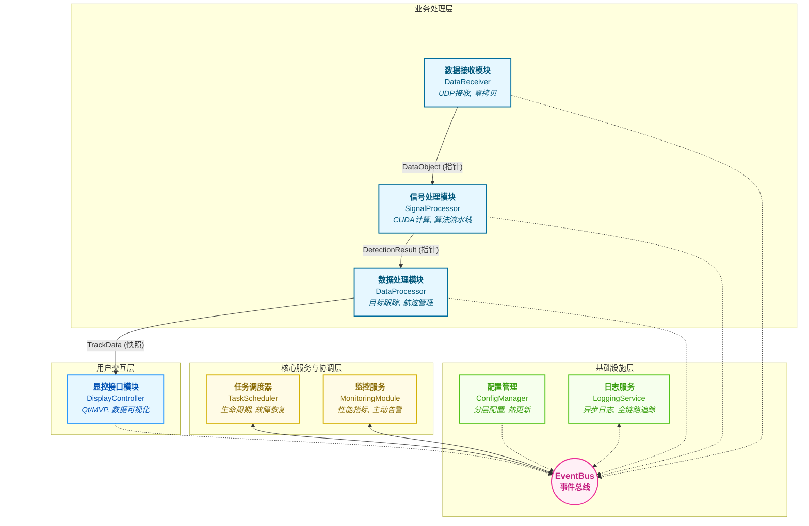
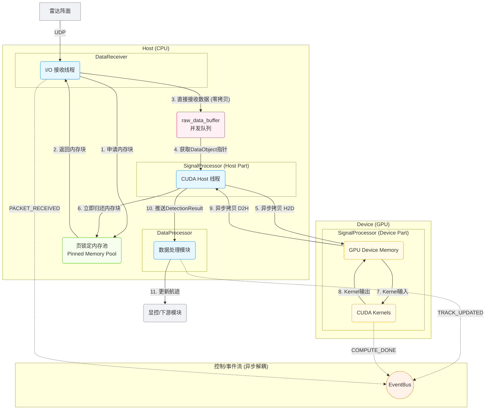
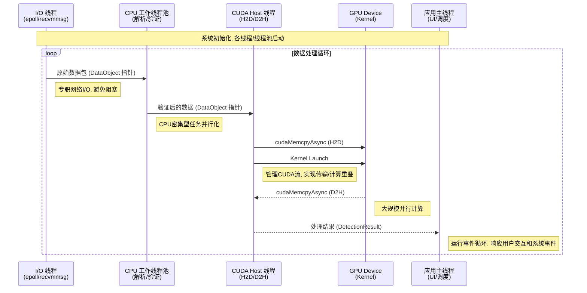
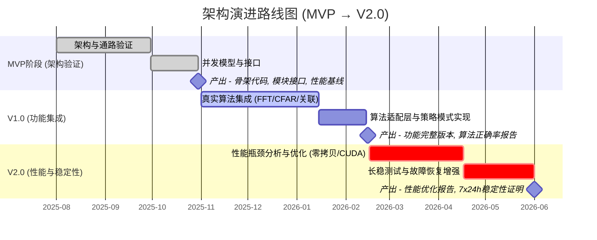

# 系统总体架构设计

**文档版本**: v1.2.0
**最后更新**: 2025-09-25
**负责人**: Klein
**适用阶段**: MVP及向 V2.0 性能优化过渡阶段
**来源依据**: 基于并扩展《[MVP系统设计文档](../MVP系统设计文档.md)》的总体抽象与约束细化

---

## 1 文档职责

本文件定义雷达数据处理系统（MVP → V2.0）的总体架构蓝图，覆盖：
1) 分层与模块边界
2) 数据/控制主通路
3) 并发执行与资源组织模型
4) 关键性能/可靠性/扩展/开发约束
5) 架构演进路径（仅限真实算法集成与性能优化阶段）
6) 决策记录与管控要点

已明确不在本文件范围内的内容：硬件/软件品牌或型号选型、供应链、预算、部署拓扑细节（这些在规划或运维类文档中维护）。

### 1.1 目录

- [系统总体架构设计](#系统总体架构设计)
  - [1 文档职责](#1-文档职责)
    - [1.1 目录](#11-目录)
  - [2 架构概述](#2-架构概述)
    - [2.1 核心设计理念](#21-核心设计理念)
  - [3 系统分层架构](#3-系统分层架构)
    - [3.1 分层职责说明](#31-分层职责说明)
  - [4 核心组件架构](#4-核心组件架构)
    - [4.1 数据流处理管道](#41-数据流处理管道)
      - [4.1.1 关键设计特点](#411-关键设计特点)
    - [4.2 并发执行模型](#42-并发执行模型)
  - [5 架构约束条件](#5-架构约束条件)
  - [架构约束条件](#架构约束条件)
    - [5.1 性能约束](#51-性能约束)
    - [5.2 可靠性约束](#52-可靠性约束)
    - [5.3 扩展性约束](#53-扩展性约束)
    - [5.4 开发约束](#54-开发约束)
  - [6 架构演进路径](#6-架构演进路径)
    - [6.1 MVP阶段目标](#61-mvp阶段目标)
    - [6.2 阶段性演进（聚焦真实算法与性能）](#62-阶段性演进聚焦真实算法与性能)
  - [7 架构决策记录](#7-架构决策记录)
  - [8 实施注意事项](#8-实施注意事项)
  - [9 相关文档](#9-相关文档)
  - [10 变更历史](#10-变更历史)

---

---

## 2 架构概述

基于GPU的相控阵雷达数据处理系统采用**分层模块化架构**，重点验证数据流转和任务调度机制。系统围绕**高性能实时处理**的核心目标，建立了清晰的组件边界和标准化接口。

### 2.1 核心设计理念

- **简化优先**：MVP阶段专注核心数据流验证，避免过度设计
- **模块化分离**：每个模块职责清晰，支持并行开发和独立测试
- **性能导向**：充分利用CPU多核和GPU并行计算能力
- **可扩展性**：为后续算法集成和功能扩展预留架构空间

---

---

## 3 系统分层架构

系统采用四层架构设计，从下到上分别为：基础设施层、核心服务层、业务处理层和用户交互层。

### 3.1 分层职责说明

| 层次                 | 主要职责                         | 关键组件                                           | 设计约束                          |
| :------------------- | :------------------------------- | :------------------------------------------------- | :-------------------------------- |
| **用户交互层**       | 数据可视化、用户控制、状态展示   | `DisplayController` (Qt/MVP)                       | 响应时间<100ms, 界面线程独立      |
| **业务处理层**       | 数据接收、信号处理、算法执行     | `DataReceiver`, `SignalProcessor`, `DataProcessor` | 处理延迟<10ms, 流水线并行, 零拷贝 |
| **核心服务与协调层** | 模块生命周期、故障恢复、性能监控 | `TaskScheduler`, `MonitoringModule`                | 事件驱动, 调度开销<1ms, 状态一致  |
| **基础设施层**       | 配置、日志、事件通信             | `ConfigManager`, `LoggingService`, `EventBus`      | 异步非阻塞, 服务注入, 全链路追踪  |

---

---

## 4 核心组件架构

### 4.1 数据流处理管道

系统的核心是一条高效的数据流处理管道，它与事件驱动的控制流分离，共同构成了系统的“双循环”模型。

#### 4.1.1 关键设计特点

| 目标           | 机制                        | 说明                                     |
| :------------- | :-------------------------- | :--------------------------------------- |
| **流水线并行** | 多阶段解耦 + 并发队列       | 保持处理连续性，避免全局锁等待           |
| **背压控制**   | 基于队列深度的隐式/显式背压 | 防止内存膨胀与下游模块过载               |
| **零拷贝优化** | 页锁定内存池 + 指针传递     | 彻底消除CPU侧内存拷贝，降低PCIe传输开销  |
| **事件驱动**   | 控制流与数据流分离          | 模块间通过事件总线异步通信，实现高度解耦 |
| **可观测性**   | 全链路Trace ID + 结构化日志 | 支撑性能调优与复杂问题定位               |

### 4.2 并发执行模型

系统采用多种并发模式的组合，将I/O、CPU计算和GPU计算置于不同的执行上下文中，最大化利用硬件资源。

---

---

## 5 架构约束条件

---

## 架构约束条件

### 5.1 性能约束

- **数据处理延迟**：端到端处理延迟 ≤ 10ms
- **数据吞吐量**：支持 ≥ 1GB/s 的数据处理能力
- **资源利用率**：CPU利用率 ≤ 70%，GPU利用率 ≥ 80%
- **内存使用**：系统内存使用率 ≤ 80%

### 5.2 可靠性约束

- **系统可用性**：≥ 99.9%的运行时间
- **数据完整性**：≥ 99.99%的数据包完整处理
- **错误恢复**：≤ 5分钟的故障恢复时间
- **故障间隔**：≥ 1000小时的平均故障间隔

### 5.3 扩展性约束

- **模块独立性**：模块间通过标准接口通信，支持独立升级
- **算法可替换**：信号处理算法支持插件化替换
- **硬件扩展性**：支持多GPU配置和分布式部署
- **配置驱动**：关键参数通过配置文件控制，支持运行时调整

### 5.4 开发约束

- **代码质量**：单元测试覆盖率 ≥ 90%
- **接口稳定性**：公共接口向后兼容，版本化管理
- **文档同步**：代码变更必须同步更新设计文档
- **评审机制**：关键代码变更必须经过同行评审

---

---

## 6 架构演进路径

### 6.1 MVP阶段目标

- ✅ **核心架构验证**：验证分层架构和模块化设计的可行性
- ✅ **数据流验证**：验证端到端数据流处理的正确性和性能
- ✅ **并发模型验证**：验证多线程调度和GPU计算的协调机制
- ✅ **接口规范建立**：建立标准化的模块间通信协议

### 6.2 阶段性演进（聚焦真实算法与性能）

| 阶段     | 目标聚焦                          | 成功判据                             | 关键输出                 | 风险缓解                         |
| :------- | :-------------------------------- | :----------------------------------- | :----------------------- | :------------------------------- |
| **MVP**  | 架构与数据/控制通路正确性         | 端到端延迟≤规划值 + 模块生命周期稳定 | 骨架代码/模块接口清单    | 限制范围，使用模拟器代替复杂算法 |
| **V1.0** | 引入真实信号/检测/关联核心算法    | 功能正确 + 正确率指标基线就绪        | 算法适配层、性能基准初稿 | GPU内核审计，建立最小可剖析用例  |
| **V2.0** | 性能与稳定性强化（低延迟/高吞吐） | 关键性能≥目标；7x24h稳定运行         | 优化报告、瓶颈闭环矩阵   | 分阶段压测，指标看板实时预警     |

阶段性优化主线：数据局部复制减少 → GPU/CPU 并行度提升 → 队列水位与调度策略协同 → 热点函数向量化 / CUDA kernel 调整 → 全流程观测指标闭环。

---

---

## 7 架构决策记录

| 决策ID     | 决策内容              | 理由                         | 影响                         | 状态    |
| ---------- | --------------------- | ---------------------------- | ---------------------------- | ------- |
| **AD-001** | 采用分层模块化架构    | 支持并行开发，便于测试和维护 | 增加接口复杂度，提升可维护性 | ✅已确认 |
| **AD-002** | 使用Qt作为GUI框架     | 跨平台支持，图表组件丰富     | 增加包大小，提供完整UI功能   | ✅已确认 |
| **AD-003** | GPU计算采用CUDA       | 生态成熟，性能优秀           | 绑定NVIDIA平台，获得最佳性能 | ✅已确认 |
| **AD-004** | MVP阶段使用算法模拟器 | 降低开发复杂度，专注架构验证 | 不能验证真实算法性能         | ✅已确认 |

---

---

## 8 实施注意事项

> ⚠️ **架构实施要点**：
> - 严格遵循分层原则，避免跨层直接调用
> - 接口设计必须考虑向后兼容性
> - 性能关键路径需要特别关注线程安全和内存管理
> - 模块间通信必须通过标准化接口，避免紧耦合

---

---

## 9 相关文档

- [需求分析与MVP目标](01_需求分析与目标.md)
- [技术选型与硬件平台](02_技术选型与平台.md)
- [系统架构总览](03_系统架构总览.md)
- [核心设计原则](04_核心设计原则.md)

---

---

## 10 变更历史

| 版本   | 日期       | 作者    | 变更描述                                                                                              |
| ------ | ---------- | ------- | ----------------------------------------------------------------------------------------------------- |
| v1.0.0 | 2025-09-22 | Klein   | 基于MVP设计文档创建总体架构设计                                                                       |
| v1.1.0 | 2025-09-22 | Copilot | 标题编号化；移除技术选型内容；重构演进路径（至V2.0）；补充数据流/并发细化；增强约束表达；更新范围声明 |
| v1.2.0 | 2025-09-25 | Copilot | **完全重构所有Mermaid架构图**，提升图表的美观性、清晰度和准确性，使其更好地反映系统设计。             |

---

*本架构设计为雷达数据处理系统MVP的技术实施提供顶层指导，确保系统设计的一致性和可扩展性。*
