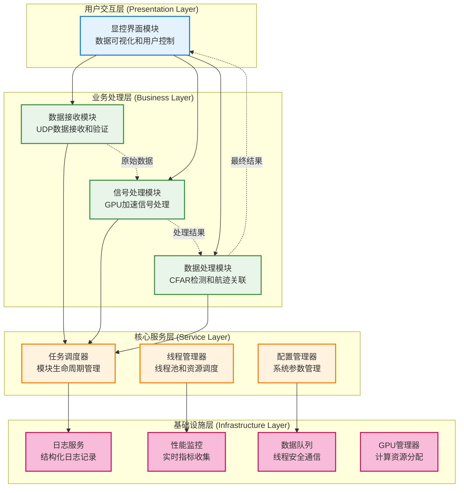
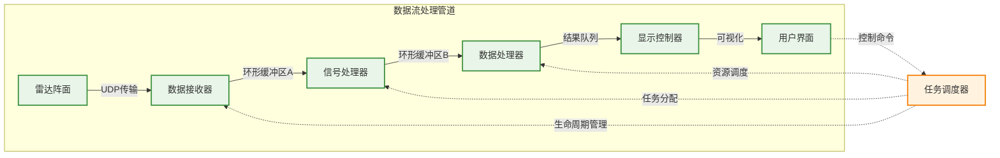
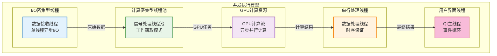
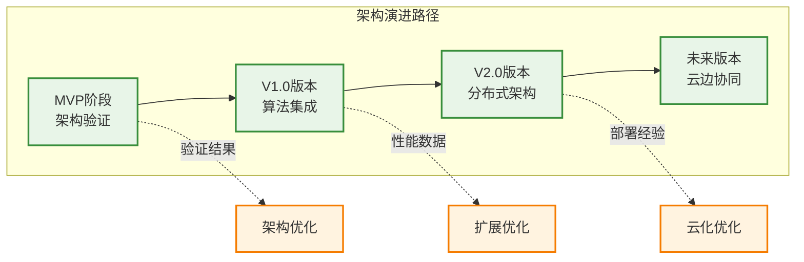

# 系统总体架构设计

**文档版本**: v1.0.0
**最后更新**: 2025-09-22
**负责人**: Kelin

---

## 文档职责

这个文档主要负责定义整个雷达MVP系统的总体架构，包括系统的分层设计、核心组件划分、技术选型原则和架构约束条件，为整个系统的详细设计提供顶层指导。

---

## 架构概述

基于GPU的相控阵雷达数据处理系统采用**分层模块化架构**，重点验证数据流转和任务调度机制。系统围绕**高性能实时处理**的核心目标，建立了清晰的组件边界和标准化接口。

### 核心设计理念

- **简化优先**：MVP阶段专注核心数据流验证，避免过度设计
- **模块化分离**：每个模块职责清晰，支持并行开发和独立测试
- **性能导向**：充分利用CPU多核和GPU并行计算能力
- **可扩展性**：为后续算法集成和功能扩展预留架构空间

---

## 系统分层架构

系统采用四层架构设计，从下到上分别为：基础设施层、核心服务层、业务处理层和用户交互层。

### 分层职责说明

| 层次 | 主要职责 | 关键组件 | 设计约束 |
|------|----------|----------|----------|
| **用户交互层** | 数据可视化、用户控制、状态展示 | Qt图形界面、图表渲染器 | 响应时间<16ms，界面线程独立 |
| **业务处理层** | 数据接收、信号处理、算法执行 | UDP接收器、GPU计算单元、算法模拟器 | 处理延迟<10ms，支持流水线并行 |
| **核心服务层** | 任务调度、资源管理、配置服务 | 调度器、线程池、配置加载器 | 调度开销<1ms，资源利用率>80% |
| **基础设施层** | 日志记录、性能监控、通信支持 | 日志系统、监控组件、数据队列 | 异步处理，不阻塞业务流程 |

---

## 核心组件架构

### 数据流处理管道

系统的核心是一条高效的数据流处理管道，实现从雷达原始数据到可视化结果的端到端处理：

**关键设计特点**：
- **流水线并行**：各阶段可以并行处理不同批次的数据
- **背压控制**：下游处理速度控制上游数据生产速度
- **零拷贝优化**：数据在管道中尽量避免不必要的内存拷贝

### 并发执行模型

系统采用多种并发模式的组合，最大化利用硬件资源：

---

## 技术选型原则

### 硬件平台原则

| 组件类型 | 选型原则 | MVP配置 | 扩展考虑 |
|----------|----------|---------|----------|
| **CPU** | 高核心数，支持并发 | 24核心/48线程 | 支持NUMA架构扩展 |
| **GPU** | CUDA生态，开发成熟 | RTX 4090/Tesla V100 | 多GPU扩展槽位预留 |
| **内存** | 大容量，ECC支持 | 128GB DDR4 | 内存槽位预留 |
| **网络** | 高带宽，低延迟 | 10Gbps光纤接口 | 支持带宽升级 |

### 软件技术栈原则

| 技术领域 | 选型原则 | 具体选择 | 理由说明 |
|----------|----------|----------|----------|
| **编程语言** | 性能优先，生态成熟 | C++17 + CUDA | 高性能，GPU支持完善 |
| **GUI框架** | 跨平台，组件丰富 | Qt 6.5 | 成熟稳定，图表组件丰富 |
| **构建系统** | 跨平台，灵活配置 | CMake 3.20+ | 广泛支持，模块化构建 |
| **第三方库** | 性能导向，文档完善 | Boost、spdlog、yaml-cpp | 经过验证，性能优秀 |

---

## 架构约束条件

### 性能约束

- **数据处理延迟**：端到端处理延迟 ≤ 10ms
- **数据吞吐量**：支持 ≥ 1GB/s 的数据处理能力
- **资源利用率**：CPU利用率 ≤ 70%，GPU利用率 ≥ 80%
- **内存使用**：系统内存使用率 ≤ 80%

### 可靠性约束

- **系统可用性**：≥ 99.9%的运行时间
- **数据完整性**：≥ 99.99%的数据包完整处理
- **错误恢复**：≤ 5分钟的故障恢复时间
- **故障间隔**：≥ 1000小时的平均故障间隔

### 扩展性约束

- **模块独立性**：模块间通过标准接口通信，支持独立升级
- **算法可替换**：信号处理算法支持插件化替换
- **硬件扩展性**：支持多GPU配置和分布式部署
- **配置驱动**：关键参数通过配置文件控制，支持运行时调整

### 开发约束

- **代码质量**：单元测试覆盖率 ≥ 90%
- **接口稳定性**：公共接口向后兼容，版本化管理
- **文档同步**：代码变更必须同步更新设计文档
- **评审机制**：关键代码变更必须经过同行评审

---

## 架构演进路径

### MVP阶段目标

- ✅ **核心架构验证**：验证分层架构和模块化设计的可行性
- ✅ **数据流验证**：验证端到端数据流处理的正确性和性能
- ✅ **并发模型验证**：验证多线程调度和GPU计算的协调机制
- ✅ **接口规范建立**：建立标准化的模块间通信协议

### 后续演进方向

**演进策略**：
1. **MVP→V1.0**：集成真实雷达算法，优化GPU计算性能

---

## 架构决策记录

| 决策ID | 决策内容 | 理由 | 影响 | 状态 |
|--------|----------|------|------|------|
| **AD-001** | 采用分层模块化架构 | 支持并行开发，便于测试和维护 | 增加接口复杂度，提升可维护性 | ✅已确认 |
| **AD-002** | 使用Qt作为GUI框架 | 跨平台支持，图表组件丰富 | 增加包大小，提供完整UI功能 | ✅已确认 |
| **AD-003** | GPU计算采用CUDA | 生态成熟，性能优秀 | 绑定NVIDIA平台，获得最佳性能 | ✅已确认 |
| **AD-004** | MVP阶段使用算法模拟器 | 降低开发复杂度，专注架构验证 | 不能验证真实算法性能 | ✅已确认 |

---

## 注意事项

> ⚠️ **架构实施要点**：
> - 严格遵循分层原则，避免跨层直接调用
> - 接口设计必须考虑向后兼容性
> - 性能关键路径需要特别关注线程安全和内存管理
> - 模块间通信必须通过标准化接口，避免紧耦合

---

## 相关文档

- [需求分析与MVP目标](01_需求分析与目标.md)
- [技术选型与硬件平台](02_技术选型与平台.md)
- [系统架构总览](03_系统架构总览.md)
- [核心设计原则](04_核心设计原则.md)

---

## 变更历史

| 版本 | 日期 | 作者 | 变更描述 |
|------|------|------|----------|
| v1.0.0 | 2025-09-22 | Kelin | 基于MVP设计文档创建总体架构设计 |

---

*本架构设计为雷达数据处理系统MVP的技术实施提供顶层指导，确保系统设计的一致性和可扩展性。*
