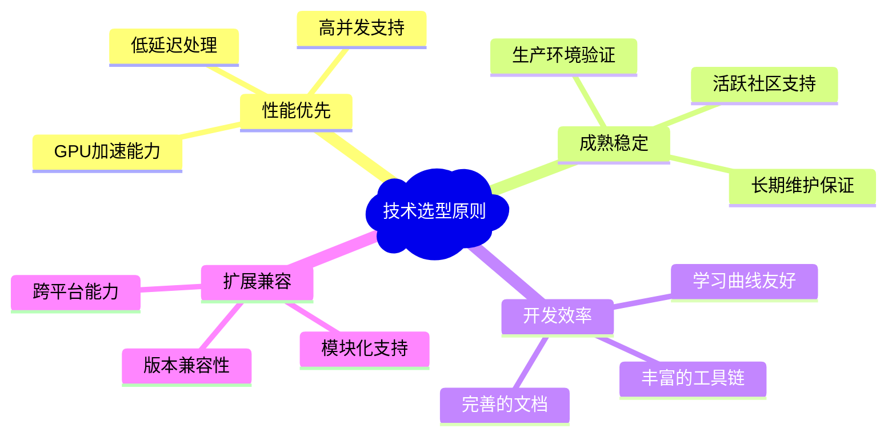
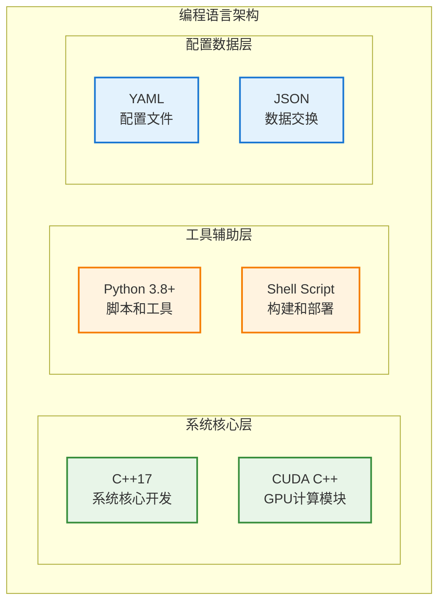
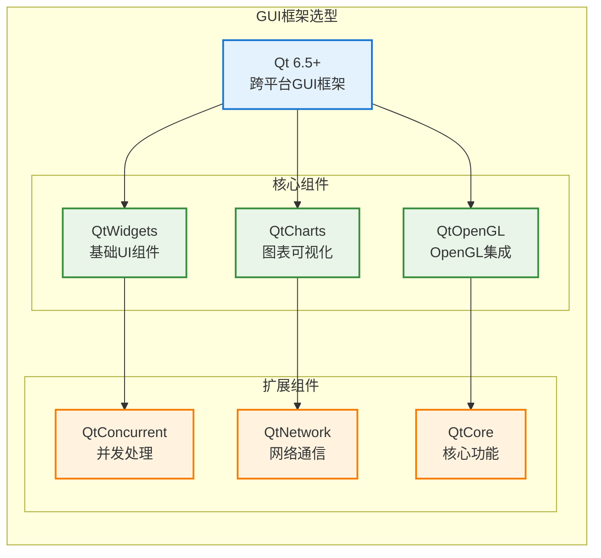
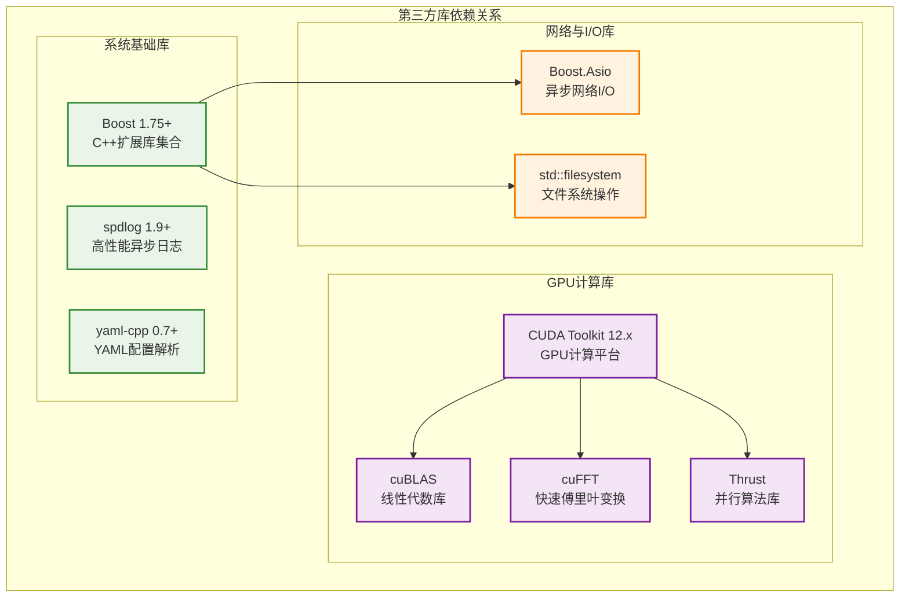
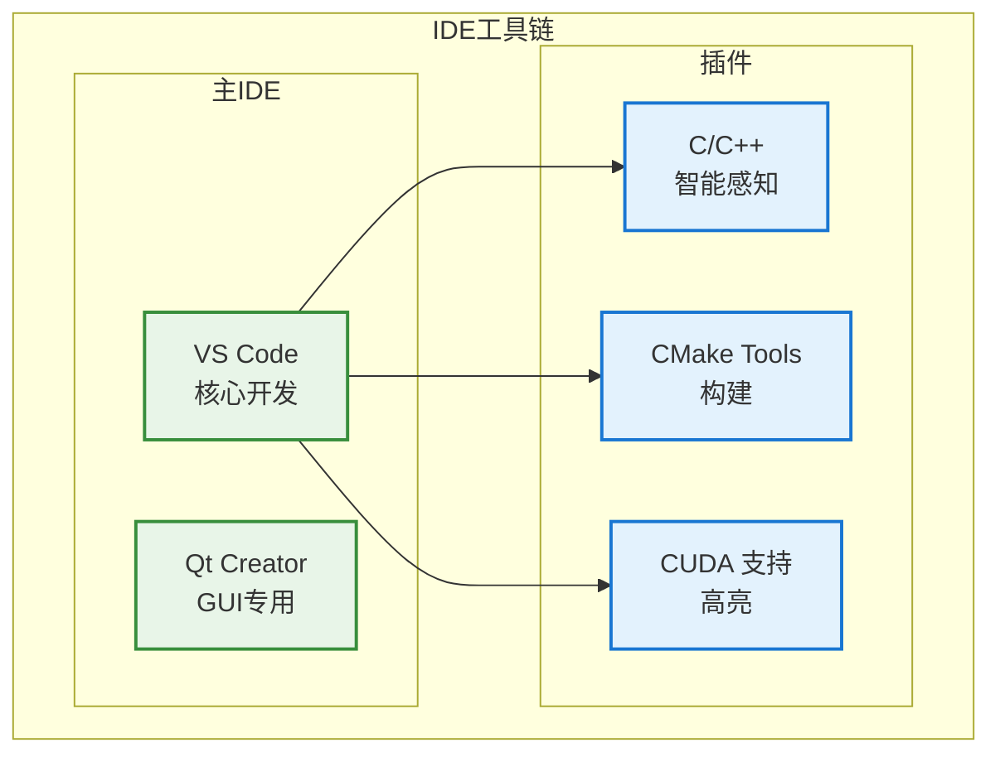
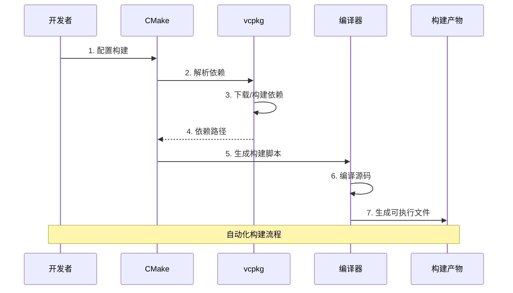
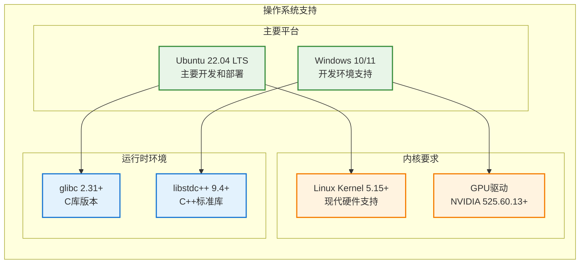
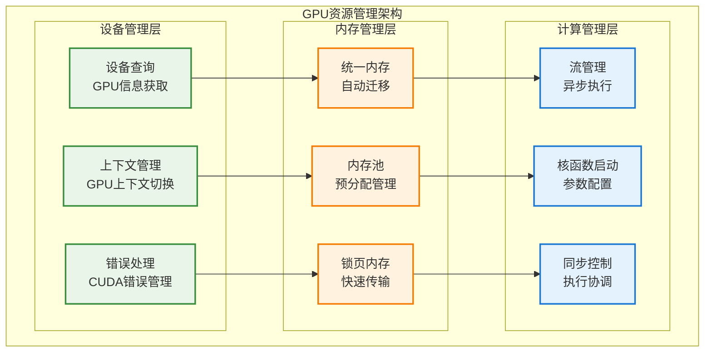
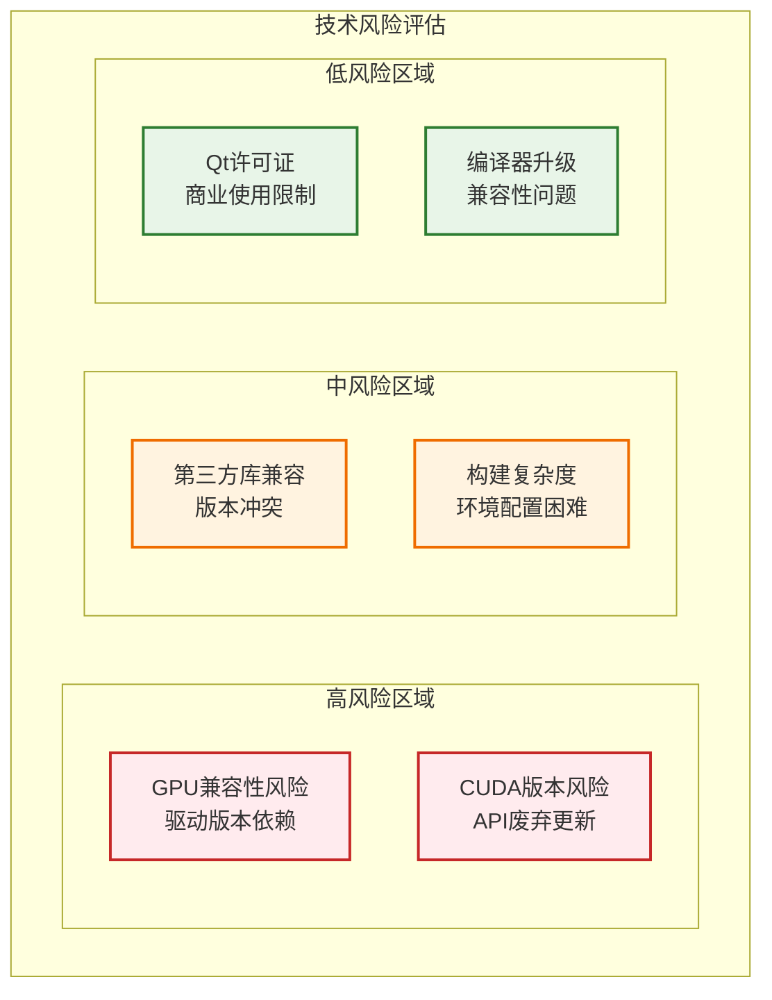
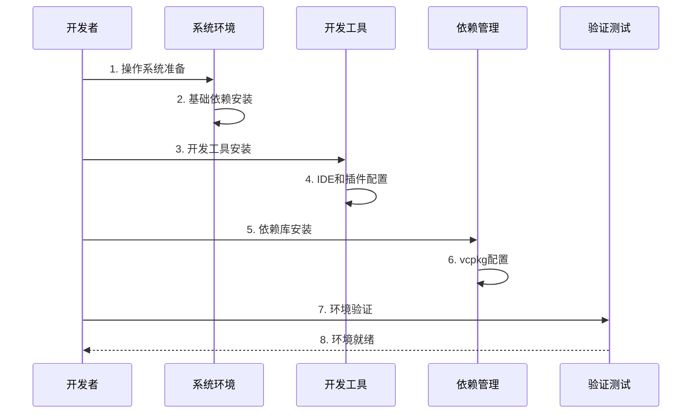

# 技术选型与平台

**文档版本**: v1.1.0
**最后更新**: 2025-09-22
**负责人**: Kelin
**适用阶段**: MVP及向 V2.0 性能优化过渡阶段
**来源依据**: 基于《[MVP系统设计文档](../MVP系统设计文档.md)》第8章技术选型和第9章非功能需求

---

## 1 文档职责

本文件定义雷达数据处理系统的技术选型决策和平台配置方案，覆盖：
1) 软件技术栈选择与理由
2) 开发工具链配置
3) 第三方库依赖管理
4) 构建和部署环境
5) 性能基准与平台要求
6) 技术选型的风险评估与缓解策略

已明确不在本文件范围内的内容：具体硬件型号采购、供应商选择、商务谈判等采购相关内容。

### 1.1 目录

- [技术选型与平台](#技术选型与平台)
  - [1 文档职责](#1-文档职责)
    - [1.1 目录](#11-目录)
  - [2 技术选型概述](#2-技术选型概述)
    - [2.1 选型原则](#21-选型原则)
  - [3 核心技术栈](#3-核心技术栈)
    - [3.1 编程语言选型](#31-编程语言选型)
    - [3.1.1 主要编程语言](#311-主要编程语言)
    - [3.1.2 语言使用策略](#312-语言使用策略)
    - [3.2 开发框架选型](#32-开发框架选型)
    - [3.2.1 GUI框架](#321-gui框架)
    - [3.2.2 构建框架](#322-构建框架)
    - [3.2.3 测试框架](#323-测试框架)
    - [3.3 第三方库选型](#33-第三方库选型)
    - [3.3.1 核心依赖库](#331-核心依赖库)
    - [3.3.2 依赖说明](#332-依赖说明)
  - [4 开发工具链](#4-开发工具链)
    - [4.1 集成开发环境](#41-集成开发环境)
    - [4.1.1 IDE选择策略](#411-ide选择策略)
    - [4.2 构建系统](#42-构建系统)
    - [4.2.1 构建工具配置](#421-构建工具配置)
    - [4.3 版本控制与协作](#43-版本控制与协作)
    - [4.3.1 Git工作流](#431-git工作流)
  - [5 运行环境平台](#5-运行环境平台)
    - [5.1 操作系统选择](#51-操作系统选择)
    - [5.1.1 平台支持策略](#511-平台支持策略)
    - [5.2 GPU计算平台](#52-gpu计算平台)
    - [5.2.1 CUDA环境配置](#521-cuda环境配置)
    - [5.2.2 GPU资源管理](#522-gpu资源管理)
    - [5.3 依赖环境配置](#53-依赖环境配置)
    - [5.3.1 系统依赖](#531-系统依赖)
    - [5.3.2 开发环境配置](#532-开发环境配置)
  - [6 技术选型决策记录](#6-技术选型决策记录)
  - [7 风险评估与缓解](#7-风险评估与缓解)
    - [7.1 技术风险矩阵](#71-技术风险矩阵)
    - [7.2 风险缓解策略](#72-风险缓解策略)
  - [8 实施指导](#8-实施指导)
    - [8.1 环境搭建步骤](#81-环境搭建步骤)
    - [8.2 快速开始指南](#82-快速开始指南)
  - [9 相关文档](#9-相关文档)
  - [10 变更历史](#10-变更历史)

---

## 2 技术选型概述

基于MVP阶段的技术需求和性能目标，本系统采用现代C++为核心的技术栈，充分利用GPU并行计算能力，确保系统的高性能和可扩展性。

### 2.1 选型原则



---

## 3 核心技术栈

### 3.1 编程语言选型

### 3.1.1 主要编程语言



**C++17选型理由**：
- **性能保证**：零开销抽象，编译时优化，内存精确控制
- **现代特性**：智能指针、并发支持、STL容器、移动语义
- **GPU互操作**：与CUDA无缝集成，支持异构计算
- **生态成熟**：丰富的第三方库，完善的工具链支持

**CUDA C++选型理由**：
- **官方支持**：NVIDIA官方GPU编程平台，性能最优
- **生态完善**：cuBLAS、cuFFT、Thrust等丰富库支持
- **开发效率**：统一内存管理，流水线并行，调试工具完善
- **版本兼容**：向后兼容性好，升级路径清晰

### 3.1.2 语言使用策略

| 语言             | 应用场景                         | 特点                       | 性能要求 |
| ---------------- | -------------------------------- | -------------------------- | -------- |
| **C++17**        | 系统核心模块、数据处理、任务调度 | 高性能、内存可控、并发支持 | 极高     |
| **CUDA C++**     | GPU算法实现、并行计算加速        | 并行计算、GPU优化          | 极高     |
| **Python 3.8+**  | 配置生成、测试脚本、数据分析     | 开发快速、生态丰富         | 中等     |
| **Shell Script** | 构建脚本、部署自动化、系统管理   | 系统集成、自动化           | 低       |

### 3.2 开发框架选型

### 3.2.1 GUI框架



**Qt 6.5+选型理由**：
- **成熟稳定**：20+年发展历史，生产环境验证充分
- **跨平台**：Linux/Windows统一API，减少平台相关代码
- **现代设计**：C++17支持，信号槽机制，事件驱动架构
- **图表丰富**：QtCharts提供专业图表组件，满足雷达数据可视化需求

### 3.2.2 构建框架

**CMake 3.20+选型理由**：
- **跨平台构建**：统一构建脚本，支持多种编译器和IDE
- **依赖管理**：find_package机制，第三方库集成简便
- **现代语法**：target-based设计，接口传递，配置清晰
- **工具集成**：与vcpkg、Conan等包管理器无缝集成

### 3.2.3 测试框架

```yaml
Google Test (gtest) 1.12+:
  选型理由:
    - C++原生测试框架，与项目语言一致
    - 丰富的断言宏和匹配器
    - 参数化测试和类型测试支持
    - Mock框架(gmock)集成
  应用场景:
    - 单元测试覆盖率 ≥ 90%
    - 模块接口测试
    - 性能基准测试
    - 集成测试支持
```

### 3.3 第三方库选型

### 3.3.1 核心依赖库



### 3.3.2 依赖说明

| 组件           | 版本策略   | 作用             | 要点                                 |
| -------------- | ---------- | ---------------- | ------------------------------------ |
| Boost          | 1.75+      | 扩展库/并发/异步 | 精选必要模块：asio、lockfree、system |
| spdlog         | 1.9+       | 高性能日志       | 异步模式 + 环形队列，格式化低开销    |
| yaml-cpp       | 0.7+       | 配置解析         | 统一配置入口，加载后转内部结构       |
| CUDA Toolkit   | 12.8.1     | GPU计算平台      | 启用多流与统一内存策略               |
| cuBLAS / cuFFT | 与CUDA匹配 | 数学/频谱        | 只封装必要算子，避免过度抽象         |
| Thrust         | 随Toolkit  | 并行算法模板     | 适度使用，防止模版膨胀扩大编译时间   |
| Qt             | 6.5+       | GUI/可视化       | UI线程隔离，数据经只读缓冲传递       |
| GoogleTest     | 1.12+      | 测试框架         | 覆盖率指标驱动补齐边界用例           |
| vcpkg          | Manifest   | 统一依赖管理     | 锁定版本，CI 冷缓存加速              |

---

## 4 开发工具链

### 4.1 集成开发环境

### 4.1.1 IDE选择策略



**Visual Studio Code配置**：
- **C/C++ Extension**：Microsoft官方扩展，提供智能感知、调试、重构
- **CMake Tools**：CMake集成，支持配置、构建、调试一体化
- **GitLens**：Git可视化，代码历史追踪
- **CUDA支持**：语法高亮、错误检查、自动补全

### 4.2 构建系统

### 4.2.1 构建工具配置



**构建配置详情**：
```yaml
CMake配置:
  最低版本: 3.20
  C++标准: 17
  编译器要求:
    - GCC 9.4+ (Linux)
    - MSVC 19.29+ (Windows)
    - NVCC 12.x (CUDA)

vcpkg依赖管理:
  配置文件: vcpkg.json
  依赖解析: 自动下载和构建
  版本控制: 精确版本锁定
  平台支持: x64-linux, x64-windows

构建模式:
  Debug: 调试符号，断言启用
  Release: 优化启用，NDEBUG宏
  RelWithDebInfo: 发布+调试信息
  MinSizeRel: 最小体积优化
```

### 4.3 版本控制与协作

### 4.3.1 Git工作流

```mermaid
gitgraph
    commit id: "初始提交"

    branch develop
    checkout develop
    commit id: "开发分支"

    branch feature/data-receiver
    checkout feature/data-receiver
    commit id: "数据接收模块"
    commit id: "单元测试"

    checkout develop
    merge feature/data-receiver
    commit id: "集成测试"

    branch feature/signal-processor
    checkout feature/signal-processor
    commit id: "信号处理模块"

    checkout develop
    merge feature/signal-processor

    checkout main
    merge develop
    commit id: "MVP版本发布"
```

**Git策略配置**：
- **主分支(main)**：稳定发布版本，受保护
- **开发分支(develop)**：集成开发，持续构建
- **功能分支(feature/)**：模块开发，代码评审
- **修复分支(hotfix/)**：紧急修复，快速合并

---

## 5 运行环境平台

### 5.1 操作系统选择

### 5.1.1 平台支持策略



**Ubuntu 22.04 LTS选型理由**：
- **长期支持**：5年LTS支持，稳定性和安全性保证
- **GPU支持**：CUDA工具链完整支持，驱动兼容性好
- **开发生态**：丰富的开发工具和库支持
- **部署友好**：服务器环境标准选择，运维工具完善

### 5.2 GPU计算平台

### 5.2.1 CUDA环境配置

```yaml
CUDA Toolkit 12.8.1:
  组件: Runtime, Driver API, cuBLAS, cuFFT, Thrust, NVCC
  支持计算能力: 6.0+ (建议≥8.0以发挥新特性)
  驱动要求: NVIDIA Driver ≥ 560.xx
  优化策略:
    - 多流并发: 计算/传输重叠
    - 统一内存 + 显式Pinned内存混合
    - 核函数占用率剖析 (nsight compute)
    - FFT计划缓存 / 内存池复用
```

### 5.2.2 GPU资源管理



### 5.3 依赖环境配置

### 5.3.1 系统依赖

```bash
# Ubuntu 22.04 系统依赖安装
sudo apt update && sudo apt install -y \
    build-essential \
    cmake \
    git \
    pkg-config \
    libssl-dev \
    libglu1-mesa-dev \
    freeglut3-dev \
    mesa-common-dev \
    qtbase5-dev \
    qtcharts5-dev \
    libyaml-cpp-dev
```

### 5.3.2 开发环境配置

```yaml
环境变量配置:
  CUDA_HOME: /usr/local/cuda
  PATH: $PATH:$CUDA_HOME/bin
  LD_LIBRARY_PATH: $LD_LIBRARY_PATH:$CUDA_HOME/lib64

编译器配置:
  GCC: 9.4+
  NVCC: 12.x
  CMAKE: 3.20+

库路径配置:
  系统库: /usr/lib/x86_64-linux-gnu
  CUDA库: /usr/local/cuda/lib64
  Qt库: /usr/lib/x86_64-linux-gnu/qt5
```

---

## 6 技术选型决策记录

| 决策ID     | 技术选择           | 选型理由                      | 考虑的替代方案   | 风险缓解             | 状态    |
| ---------- | ------------------ | ----------------------------- | ---------------- | -------------------- | ------- |
| **TS-001** | C++17作为主要语言  | 性能优秀，GPU集成好，生态成熟 | Rust, C++20      | 团队培训，编码规范   | ✅已确认 |
| **TS-002** | Qt 6.5+作为GUI框架 | 跨平台，图表丰富，社区活跃    | Dear ImGui, GTK  | 学习成本，许可证考虑 | ✅已确认 |
| **TS-003** | CUDA作为GPU平台    | 生态最完善，性能最优          | OpenCL, ROCm     | 供应商绑定，备用方案 | ✅已确认 |
| **TS-004** | CMake作为构建系统  | 跨平台，依赖管理好            | Bazel, Meson     | 学习曲线，构建复杂度 | ✅已确认 |
| **TS-005** | vcpkg管理第三方库  | Microsoft维护，CMake集成      | Conan, Spack     | 依赖解析，构建时间   | ✅已确认 |
| **TS-006** | spdlog作为日志库   | 高性能，现代C++设计           | glog, boost::log | 功能覆盖，稳定性验证 | ✅已确认 |

---

## 7 风险评估与缓解

### 7.1 技术风险矩阵



### 7.2 风险缓解策略

| 风险     | 等级 | 主要成因          | 监控指标           | 缓解策略                       | 兜底措施                 |
| -------- | ---- | ----------------- | ------------------ | ------------------------------ | ------------------------ |
| GPU兼容  | 高   | 新驱动/旧卡差异   | 初始化失败率       | 能力查询 + 条件降级            | 回退受支持驱动版本       |
| CUDA版本 | 高   | API弃用/行为变化  | 构建警告/弃用API数 | 固定主版本 + 提前试用 Beta     | 维持上一稳定分支并行构建 |
| 依赖冲突 | 中   | 库间版本链不一致  | CI依赖解析时间     | manifest 锁定 + 周期性升级窗口 | 引入隔离镜像层           |
| 构建时长 | 中   | 模板/优化级别过高 | 全量构建耗时       | 预编译Headers + 分层Cache      | 关键目标单独增量流水线   |
| Qt许可   | 低   | 商用发行合规风险  | 发行清单审核       | 明确使用 LGPL 组件             | 法务复核清单             |

---

## 8 实施指导

### 8.1 环境搭建步骤



### 8.2 快速开始指南

**第一步：系统环境准备**
```bash
# Ubuntu 22.04 LTS
sudo apt update && sudo apt upgrade -y
sudo apt install -y curl wget git build-essential

# NVIDIA驱动安装（如有GPU）
sudo apt install -y nvidia-driver-525
sudo reboot
```

**第二步：CUDA工具链安装（12.8.1）**（参考官方仓库快速脚本，内部镜像可替换）
```bash
# 示例：添加仓库并安装（Ubuntu 22.04）
sudo apt update && sudo apt install -y cuda-toolkit-12-8
```

**第三步：开发工具安装**
```bash
# CMake最新版本
sudo snap install cmake --classic

# vcpkg包管理器
git clone https://github.com/Microsoft/vcpkg.git
cd vcpkg
./bootstrap-vcpkg.sh
export VCPKG_ROOT=$PWD
export PATH=$PATH:$VCPKG_ROOT
```

**第四步：项目环境验证**
```bash
# 编译环境测试
nvcc --version
cmake --version
gcc --version

# GPU设备检查
nvidia-smi
```

<!-- 常见问题解决部分按需求移除，避免与内部运维手册重复 -->

---

## 9 相关文档

- [系统总体架构设计](00_总体架构设计.md)
- [需求分析与MVP目标](01_需求分析与目标.md)
- [系统架构总览](03_系统架构总览.md)
- [核心设计原则](04_核心设计原则.md)

---

## 10 变更历史

| 版本   | 日期       | 作者    | 变更描述                                                                                                                     |
| ------ | ---------- | ------- | ---------------------------------------------------------------------------------------------------------------------------- |
| v1.0.0 | 2025-09-22 | Kelin   | 初始创建，完整技术栈与平台配置                                                                                               |
| v1.1.0 | 2025-09-22 | Copilot | 调整结构对齐架构文档；标题编号重排；精简依赖与风险内容；更新Ubuntu 22.04 / CUDA 12.8.1；移除常见问题重复段落；新增依赖精要表 |

---

*本技术选型文档为雷达数据处理系统MVP的技术实施提供具体指导，确保技术方案的可行性和一致性。*
