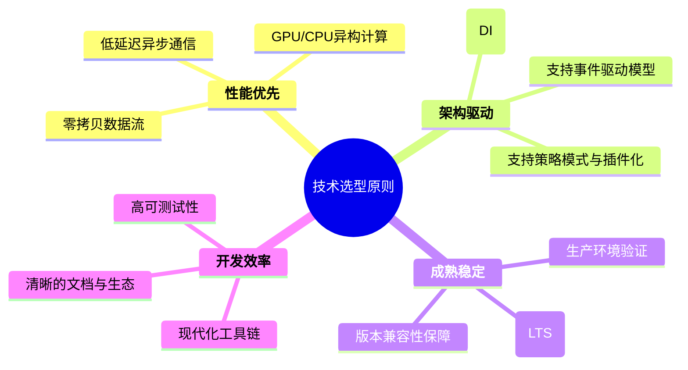
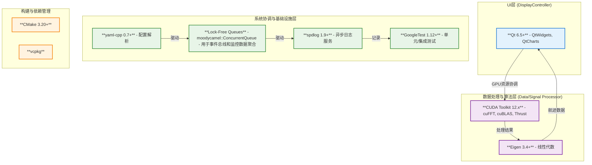
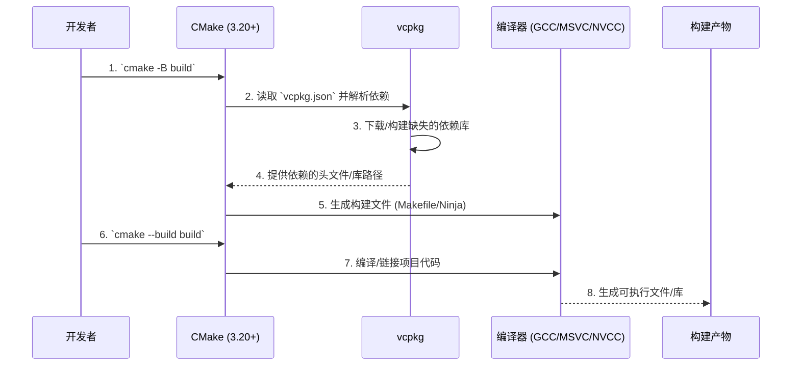

# 技术选型与平台

**文档版本**: v2.0.0
**最后更新**: 2025年9月25日
**负责人**: Klein
**适用阶段**: MVP及向 V2.0 性能优化过渡阶段
**来源依据**: 基于项目整体架构设计和所有模块的详细设计文档

---

## 1 文档职责

本文件定义雷达数据处理系统的技术选型决策和平台配置方案，确保所有技术选择都服务于系统的高性能、高可靠性和高可维护性目标。本文档是所有模块开发和环境部署的权威技术指南。

### 1.1 目录
- [技术选型与平台](#技术选型与平台)
  - [1 文档职责](#1-文档职责)
    - [1.1 目录](#11-目录)
  - [2 选型原则与核心架构对齐](#2-选型原则与核心架构对齐)
  - [3 核心技术栈](#3-核心技术栈)
    - [3.1 编程语言](#31-编程语言)
    - [3.2 核心依赖库与框架](#32-核心依赖库与框架)
  - [4 开发与构建工具链](#4-开发与构建工具链)
    - [4.1 集成开发环境 (IDE)](#41-集成开发环境-ide)
    - [4.2 构建系统与依赖管理](#42-构建系统与依赖管理)
    - [4.3 版本控制](#43-版本控制)
  - [5 运行平台与环境](#5-运行平台与环境)
    - [5.1 操作系统](#51-操作系统)
    - [5.2 GPU 计算平台](#52-gpu-计算平台)
  - [6 技术选型决策记录](#6-技术选型决策记录)
  - [7 风险评估与缓解](#7-风险评估与缓解)
  - [8 变更历史](#8-变更历史)

---

## 2 选型原则与核心架构对齐

技术选型严格遵循项目核心架构原则，确保工具链和依赖库能够支撑事件驱动、零拷贝、策略模式等关键设计。

---

## 3 核心技术栈

技术栈围绕C++17和CUDA构建，并根据系统分层架构（数据流、控制流、UI）选择最合适的库。

### 3.1 编程语言

| 语言         | 版本     | 核心职责                     | 关键应用场景                                                               |
| :----------- | :------- | :--------------------------- | :------------------------------------------------------------------------- |
| **C++**      | **17**   | **系统核心逻辑与高性能计算** | 实现`IModule`接口、`ExecutionEngine`、数据处理算法、任务调度、基础设施服务 |
| **CUDA C++** | **12.x** | **GPU并行计算加速**          | `SignalProcessor`中的信号处理算法（FFT、滤波等）、实现可抢占的CUDA流       |
| **Python**   | 3.8+     | 辅助工具与自动化脚本         | 测试数据生成、CI/CD脚本、数据后处理与分析                                  |
| **YAML**     | 1.2      | **系统配置**                 | `ConfigManager`的配置源，定义模块参数、算法流水线、日志级别等              |

### 3.2 核心依赖库与框架

下图展示了核心依赖库在系统架构中的角色和位置。

**依赖库选型理由**:

| 库/框架                         | 版本策略 | 作用           | 选型理由与集成要点                                                                       |
| :------------------------------ | :------- | :------------- | :--------------------------------------------------------------------------------------- |
| **Qt**                          | 6.5+     | GUI框架        | 成熟的跨平台UI库，提供丰富的图表组件。与系统通过`GpuResourceCoordinator`和事件总线解耦。 |
| **CUDA Toolkit**                | 12.x     | GPU计算平台    | NVIDIA官方平台，性能最优。重点使用多流、页锁定内存、`cudaEvent`同步和抢占式优先级控制。  |
| **spdlog**                      | 1.9+     | 高性能日志     | 提供异步日志记录，通过宏实现零开销。与`TraceContext`集成，自动附加Trace ID。             |
| **yaml-cpp**                    | 0.7+     | 配置解析       | `ConfigManager`的核心依赖，支持分层加载和热更新所需的解析能力。                          |
| **GoogleTest**                  | 1.12+    | 单元/集成测试  | C++社区标准，支持Mock（`gmock`），与CMake集成良好，便于实现测试驱动开发（TDD）。         |
| **moodycamel::ConcurrentQueue** | 最新     | 高性能无锁队列 | 作为`EventBus`和`MonitoringModule`中MPSC队列的底层实现，满足高性能、跨线程通信的需求。   |

---

## 4 开发与构建工具链

### 4.1 集成开发环境 (IDE)

- **主要推荐**: **Visual Studio Code**
  - **核心插件**: `C/C++`, `CMake Tools`, `CUDA`, `GitLens`。
  - **优势**: 轻量、跨平台，通过插件能很好地支持C++/CMake/CUDA开发流程。
- **GUI开发**: **Qt Creator**
  - **优势**: 专为Qt设计，提供UI可视化设计、信号槽连接和QML调试等强大功能。

### 4.2 构建系统与依赖管理

- **构建系统**: **CMake 3.20+**，采用现代`target_*`语法，实现跨平台构建。
- **依赖管理**: **vcpkg**，通过`vcpkg.json`清单文件声明依赖，实现版本锁定和自动集成。

### 4.3 版本控制

- **工具**: **Git**
- **工作流**: **Git Flow** 的简化版
  - `main`: 稳定的发布分支，受保护。
  - `develop`: 开发主干，集成各功能。
  - `feature/*`: 具体功能或模块开发分支，完成后合并到`develop`。
  - `hotfix/*`: 紧急线上问题修复分支。

---

## 5 运行平台与环境

### 5.1 操作系统

| 平台              | 版本          | 角色              | 选型理由                                         |
| :---------------- | :------------ | :---------------- | :----------------------------------------------- |
| **Ubuntu Server** | **22.04 LTS** | **主要开发/部署** | 长期支持，与CUDA和驱动兼容性最佳，社区生态完善。 |
| **Windows**       | 10 / 11       | 开发环境支持      | 方便开发者使用Windows原生工具链和IDE。           |

### 5.2 GPU 计算平台

- **硬件**: NVIDIA GPU，**计算能力 (Compute Capability) 6.0+**。推荐 **8.0+** 以获得最佳性能和特性支持。
- **驱动**: NVIDIA 驱动版本需与CUDA Toolkit 12.x兼容（例如 `525.x` 或更高）。
- **核心策略**:
  - **资源协调**: 通过`GpuResourceCoordinator`在`SignalProcessor`(CUDA)和`DisplayController`(OpenGL)间协调资源，避免UI卡顿。
  - **内存管理**: 混合使用页锁定内存（用于H2D快速传输）和设备内存池，实现零拷贝和高效显存复用。
  - **并行模型**: 采用多CUDA流实现数据传输与计算的重叠（三重缓冲模型）。

---

## 6 技术选型决策记录

| 决策ID     | 技术选择                     | 选型理由                          | 考虑的替代方案   | 状态    |
| :--------- | :--------------------------- | :-------------------------------- | :--------------- | :------ |
| **TS-001** | C++17 作为主要语言           | 性能、现代特性、与CUDA无缝集成    | Rust, C++20      | ✅已确认 |
| **TS-002** | Qt 6.5+ 作为GUI框架          | 跨平台、图表丰富、成熟稳定        | Dear ImGui, GTK  | ✅已确认 |
| **TS-003** | CUDA 12.x 作为GPU平台        | 性能最优、生态最完善              | OpenCL, ROCm     | ✅已确认 |
| **TS-004** | CMake + vcpkg 构建与依赖管理 | 社区标准，与IDE集成好，版本可控   | Bazel, Conan     | ✅已确认 |
| **TS-005** | spdlog 作为日志库            | 高性能异步、零开销宏、现代C++设计 | glog, boost::log | ✅已确认 |
| **TS-006** | moodycamel::ConcurrentQueue  | 经过验证的高性能无锁队列实现      | TBB, 自研队列    | ✅已确认 |

---

## 7 风险评估与缓解

| 风险等级 | 风险项           | 主要成因与影响                                          | 缓解策略                                                                     |
| :------- | :--------------- | :------------------------------------------------------ | :--------------------------------------------------------------------------- |
| **高**   | GPU驱动/CUDA版本 | 驱动不兼容或CUDA API变更可能导致构建失败或运行时错误。  | 在CI中建立针对特定驱动和CUDA版本的测试矩阵；固定CUDA主版本，小版本谨慎升级。 |
| **中**   | 第三方库版本冲突 | vcpkg中不同库可能依赖同一库的不同版本，导致解析失败。   | 严格锁定`vcpkg.json`中的版本号；定期规划窗口进行依赖库的统一升级。           |
| **中**   | 构建复杂度与时长 | 依赖增多和模板滥用可能导致CMake配置复杂和编译时间过长。 | 使用预编译头文件（PCH）；优化CMake脚本；在CI中启用缓存（ccache）。           |
| **低**   | Qt许可证合规     | 错误使用商业版组件可能带来法律风险。                    | 明确项目仅使用LGPLv3协议下的组件，并在发布前进行法务审核。                   |

---

## 8 变更历史

| 版本   | 日期       | 作者  | 变更描述                                                                                                                       |
| :----- | :--------- | :---- | :----------------------------------------------------------------------------------------------------------------------------- |
| v1.1.0 | 2025-09-22 | Klein | 调整结构对齐架构文档；标题编号重排；精简依赖与风险内容；更新Ubuntu 22.04 / CUDA 12.8.1；移除常见问题重复段落；新增依赖精要表。 |
| v2.0.0 | 2025-09-25 | Klein | **完全重构**。基于所有模块设计文档，更新技术栈图表和内容，使其与事件驱动、零拷贝、模块化等核心架构深度对齐。更新版本号和日期。 |

---
*本技术选型文档为雷达数据处理系统MVP的技术实施提供具体指导，确保技术方案的可行性和一致性。*
