# 系统架构总览

**文档版本**: v3.1.0
**最后更新**: 2025-09-25
**负责人**: Kelin
**适用阶段**: MVP至生产级系统架构指南

---

## 1 文档职责

### 1.1 文档范围
本文档提供雷达数据处理系统的顶层架构视图，作为所有模块设计的统一蓝图：
1) 系统整体架构设计和模块关系定义
2) 事件驱动架构和数据流设计
3) 技术栈选型和关键技术决策
4) 系统质量属性和架构约束
5) 部署架构和运维策略
6) 架构演进路线和扩展规划

### 1.2 目录
- 系统架构总览
  - 1 文档职责
    - 1.1 文档范围
    - 1.2 目录
  - 2 架构原则与理念
    - 2.1 核心设计原则
    - 2.2 架构设计理念
  - 3 系统整体架构
    - 3.1 逻辑架构视图
    - 3.2 模块依赖关系
    - 3.3 架构层次说明
  - 4 事件驱动架构
    - 4.1 事件总线架构
    - 4.2 事件类型体系
    - 4.3 端到端追踪机制
  - 5 数据流与处理链路
    - 5.1 零拷贝数据流设计
    - 5.2 高性能处理管道
    - 5.3 GPU计算协调机制
  - 6 并发与资源管理
    - 6.1 统一线程模型
    - 6.2 GPU资源协调策略
    - 6.3 内存管理体系
  - 7 配置与监控体系
    - 7.1 统一配置管理
    - 7.2 全面监控架构
    - 7.3 日志与追踪系统
  - 8 错误处理与容错
    - 8.1 分级错误处理
    - 8.2 故障恢复策略
    - 8.3 系统健康管理
  - 9 技术栈与工具链
    - 9.1 核心技术选型
    - 9.2 开发工具链
    - 9.3 部署技术栈
  - 10 质量属性设计
    - 10.1 性能指标
    - 10.2 可靠性保障
    - 10.3 可扩展性设计
  - 11 部署架构
    - 11.1 单机部署架构
    - 11.2 分布式部署规划
    - 11.3 容器化策略
  - 12 安全架构
    - 12.1 访问控制模型
    - 12.2 数据安全策略
  - 13 架构演进规划
    - 13.1 MVP到生产的演进路线
    - 13.2 技术演进规划
  - 14 相关文档
  - 15 变更历史

---

## 2 架构原则与理念

### 2.1 核心设计原则

基于模块设计文档总结的统一架构原则：

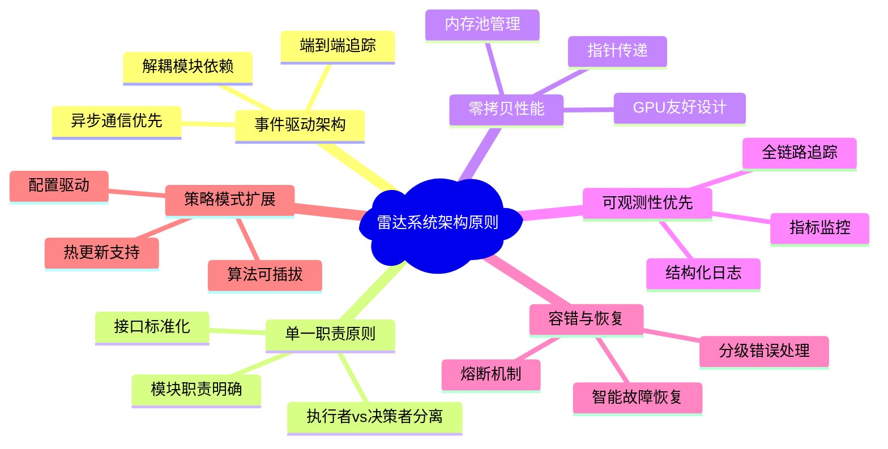
```mermaid
mindmap
  root)雷达系统架构原则(
    事件驱动架构
      异步通信优先
      解耦模块依赖
      端到端追踪
    单一职责原则
      执行者vs决策者分离
      模块职责明确
      接口标准化
    零拷贝性能
      内存池管理
      指针传递
      GPU友好设计
    可观测性优先
      全链路追踪
      结构化日志
      指标监控
    容错与恢复
      分级错误处理
      智能故障恢复
      熔断机制
    策略模式扩展
      算法可插拔
      配置驱动
      热更新支持
```

### 2.2 架构设计理念

**事件驱动优先**：
- 所有模块间通信通过系统事件总线进行
- 彻底避免直接方法调用和同步阻塞
- 支持完整的Trace ID传递链

**性能与可观测性并重**：
- 零拷贝数据流设计，从网络到GPU全程无拷贝
- 完整的性能监控和端到端追踪能力
- 实时错误检测和智能恢复机制

**模块化与可扩展**：
- 严格的模块边界和依赖注入
- 策略模式支持算法和策略的运行时替换
- 配置驱动的系统行为控制

---

## 3 系统整体架构

### 3.1 逻辑架构视图

系统采用分层事件驱动架构，通过统一的事件总线实现模块解耦：

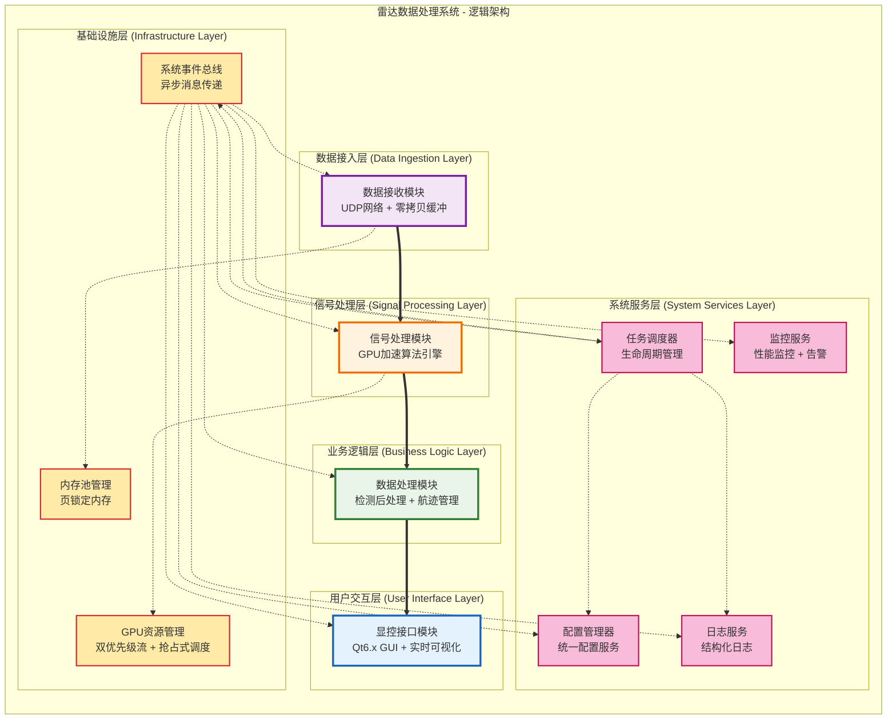
```mermaid
graph TB
    subgraph "雷达数据处理系统 - 逻辑架构"
        direction TB

        subgraph "用户交互层 (User Interface Layer)"
            DisplayController[显控接口模块<br/>Qt6.x GUI + 实时可视化]
        end

        subgraph "业务逻辑层 (Business Logic Layer)"
            DataProcessor[数据处理模块<br/>检测后处理 + 航迹管理]
        end

        subgraph "信号处理层 (Signal Processing Layer)"
            SignalProcessor[信号处理模块<br/>GPU加速算法引擎]
        end

        subgraph "数据接入层 (Data Ingestion Layer)"
            DataReceiver[数据接收模块<br/>UDP网络 + 零拷贝缓冲]
        end

        subgraph "系统服务层 (System Services Layer)"
            direction LR
            TaskScheduler[任务调度器<br/>生命周期管理]
            ConfigManager[配置管理器<br/>统一配置服务]
            LoggingService[日志服务<br/>结构化日志]
            MonitoringModule[监控服务<br/>性能监控 + 告警]
        end

        subgraph "基础设施层 (Infrastructure Layer)"
            direction LR
            EventBus[系统事件总线<br/>异步消息传递]
            MemoryPool[内存池管理<br/>页锁定内存]
            GpuResourceMgr[GPU资源管理<br/>双优先级流 + 抢占式调度]
        end

        %% 数据流（实线）
        DataReceiver ==> SignalProcessor
        SignalProcessor ==> DataProcessor
        DataProcessor ==> DisplayController

        %% 事件流（虚线）
        EventBus -.-> TaskScheduler
        EventBus -.-> ConfigManager
        EventBus -.-> LoggingService
        EventBus -.-> MonitoringModule
        EventBus -.-> DisplayController
        EventBus -.-> DataProcessor
        EventBus -.-> SignalProcessor
        EventBus -.-> DataReceiver

        %% 依赖注入（点线）
        TaskScheduler ..-> ConfigManager
        TaskScheduler ..-> LoggingService
        TaskScheduler ..-> EventBus

        SignalProcessor ..-> GpuResourceMgr
        DataReceiver ..-> MemoryPool
    end

    classDef ui fill:#e3f2fd,stroke:#1565c0,stroke-width:3px
    classDef business fill:#e8f5e8,stroke:#2e7d32,stroke-width:3px
    classDef processing fill:#fff3e0,stroke:#ef6c00,stroke-width:3px
    classDef ingestion fill:#f3e5f5,stroke:#7b1fa2,stroke-width:3px
    classDef system fill:#f8bbd9,stroke:#c2185b,stroke-width:2px
    classDef infra fill:#ffeaa7,stroke:#d63031,stroke-width:2px

    class DisplayController ui
    class DataProcessor business
    class SignalProcessor processing
    class DataReceiver ingestion
    class TaskScheduler,ConfigManager,LoggingService,MonitoringModule system
    class EventBus,MemoryPool,GpuResourceMgr infra
```

### 3.2 模块依赖关系

基于依赖注入的清晰模块依赖关系：

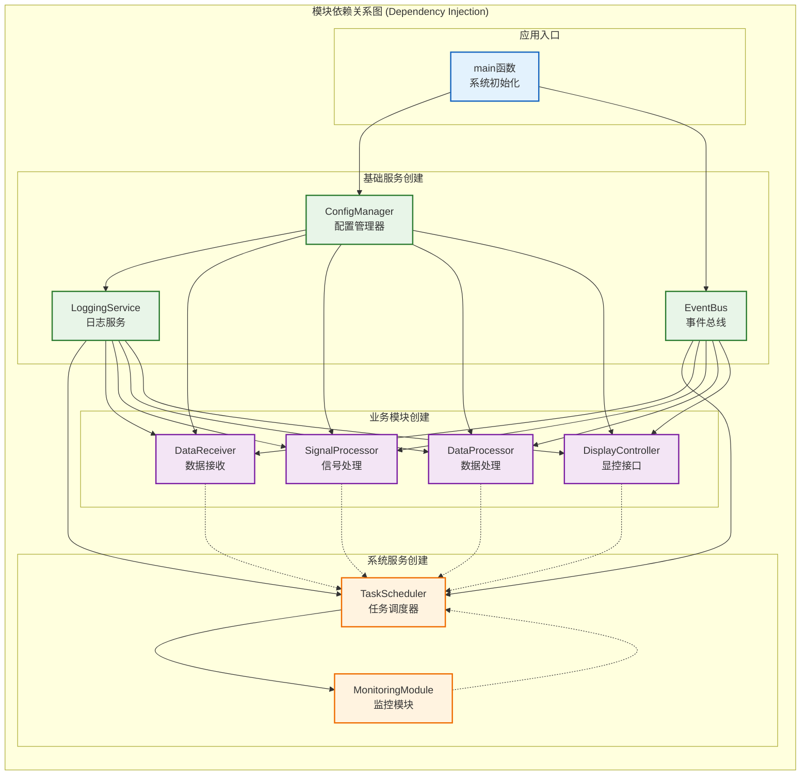
```mermaid
graph TD
    subgraph "模块依赖关系图 (Dependency Injection)"
        direction TB

        subgraph "应用入口"
            Main[main函数<br/>系统初始化]
        end

        subgraph "基础服务创建"
            ConfigMgr[ConfigManager<br/>配置管理器]
            EventBusImpl[EventBus<br/>事件总线]
            LogSvc[LoggingService<br/>日志服务]
        end

        subgraph "系统服务创建"
            TaskSched[TaskScheduler<br/>任务调度器]
            Monitor[MonitoringModule<br/>监控模块]
        end

        subgraph "业务模块创建"
            DataRec[DataReceiver<br/>数据接收]
            SigProc[SignalProcessor<br/>信号处理]
            DataProc[DataProcessor<br/>数据处理]
            Display[DisplayController<br/>显控接口]
        end

        %% 创建与依赖流（实线：创建顺序和构造函数注入）
        Main --> ConfigMgr
        Main --> EventBusImpl
        ConfigMgr --> LogSvc

        LogSvc --> TaskSched
        EventBusImpl --> TaskSched

        TaskSched --> Monitor

        %% 业务模块创建和依赖注入（实线：所有依赖均通过构造函数注入）
        ConfigMgr --> DataRec
        EventBusImpl --> DataRec
        LogSvc --> DataRec

        ConfigMgr --> SigProc
        EventBusImpl --> SigProc
        LogSvc --> SigProc

        ConfigMgr --> DataProc
        EventBusImpl --> DataProc
        LogSvc --> DataProc

        ConfigMgr --> Display
        EventBusImpl --> Display
        LogSvc --> Display

        %% 模块注册（虚线：注册到调度器）
        DataRec -.-> TaskSched
        SigProc -.-> TaskSched
        DataProc -.-> TaskSched
        Display -.-> TaskSched
        Monitor -.-> TaskSched
    end

    classDef entry fill:#e3f2fd,stroke:#1565c0,stroke-width:2px
    classDef base fill:#e8f5e8,stroke:#2e7d32,stroke-width:2px
    classDef system fill:#fff3e0,stroke:#ef6c00,stroke-width:2px
    classDef business fill:#f3e5f5,stroke:#7b1fa2,stroke-width:2px

    class Main entry
    class ConfigMgr,EventBusImpl,LogSvc base
    class TaskSched,Monitor system
    class DataRec,SigProc,DataProc,Display business
```

**图表说明**：
- **实线箭头**：表示创建顺序和依赖关系，所有依赖均通过构造函数注入实现
- **虚线箭头**：表示模块注册到TaskScheduler的关系，用于生命周期管理

### 3.3 架构层次说明

**用户交互层**：
- 基于Qt6.x的专业雷达显控界面
- 实时数据可视化和用户交互处理
- 抢占式GPU资源协调，避免渲染阻塞

**业务逻辑层**：
- 目标检测后处理和航迹管理
- 策略模式支持算法可插拔
- 事件驱动的业务流程控制

**信号处理层**：
- GPU加速的信号处理算法
- 双优先级CUDA流支持抢占式调度
- 零拷贝数据流和高性能计算

**数据接入层**：
- 高性能UDP网络数据接收
- 多级流水线并发处理
- 页锁定内存池管理

**系统服务层**：
- 任务调度器统一管理模块生命周期
- 配置管理器提供热更新能力
- 日志和监控服务保障系统可观测性

**基础设施层**：
- 事件总线实现异步解耦通信
- 内存池和GPU资源管理器
- 统一的错误处理和恢复机制

---

## 4 事件驱动架构

### 4.1 事件总线架构

系统采用统一的事件总线实现模块间异步通信：

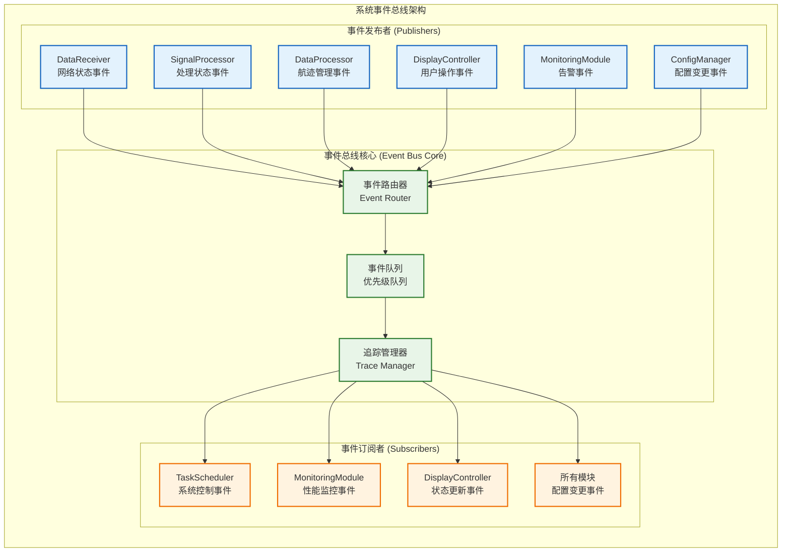
```mermaid
graph TB
    subgraph "系统事件总线架构"
        direction TB

        subgraph "事件发布者 (Publishers)"
            direction LR
            PUB_DR[DataReceiver<br/>网络状态事件]
            PUB_SP[SignalProcessor<br/>处理状态事件]
            PUB_DP[DataProcessor<br/>航迹管理事件]
            PUB_DC[DisplayController<br/>用户操作事件]
            PUB_MON[MonitoringModule<br/>告警事件]
            PUB_CFG[ConfigManager<br/>配置变更事件]
        end

        subgraph "事件总线核心 (Event Bus Core)"
            direction TB
            EVENT_ROUTER[事件路由器<br/>Event Router]
            EVENT_QUEUE[事件队列<br/>优先级队列]
            TRACE_MGR[追踪管理器<br/>Trace Manager]

            EVENT_ROUTER --> EVENT_QUEUE
            EVENT_QUEUE --> TRACE_MGR
        end

        subgraph "事件订阅者 (Subscribers)"
            direction LR
            SUB_TS[TaskScheduler<br/>系统控制事件]
            SUB_MON[MonitoringModule<br/>性能监控事件]
            SUB_DC[DisplayController<br/>状态更新事件]
            SUB_ALL[所有模块<br/>配置变更事件]
        end

        %% 事件发布流
        PUB_DR --> EVENT_ROUTER
        PUB_SP --> EVENT_ROUTER
        PUB_DP --> EVENT_ROUTER
        PUB_DC --> EVENT_ROUTER
        PUB_MON --> EVENT_ROUTER
        PUB_CFG --> EVENT_ROUTER

        %% 事件订阅流
        TRACE_MGR --> SUB_TS
        TRACE_MGR --> SUB_MON
        TRACE_MGR --> SUB_DC
        TRACE_MGR --> SUB_ALL
    end

    classDef publisher fill:#e3f2fd,stroke:#1565c0,stroke-width:2px
    classDef core fill:#e8f5e8,stroke:#2e7d32,stroke-width:2px
    classDef subscriber fill:#fff3e0,stroke:#ef6c00,stroke-width:2px

    class PUB_DR,PUB_SP,PUB_DP,PUB_DC,PUB_MON,PUB_CFG publisher
    class EVENT_ROUTER,EVENT_QUEUE,TRACE_MGR core
    class SUB_TS,SUB_MON,SUB_DC,SUB_ALL subscriber
```

### 4.2 事件类型体系

标准化的事件类型体系，支持类型安全和优先级控制：

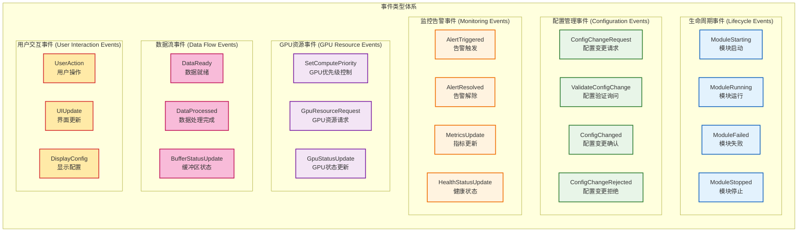
```mermaid
graph TB
    subgraph "事件类型体系"
        direction TB

        subgraph "生命周期事件 (Lifecycle Events)"
            LC_START[ModuleStarting<br/>模块启动]
            LC_RUNNING[ModuleRunning<br/>模块运行]
            LC_FAILED[ModuleFailed<br/>模块失败]
            LC_STOPPED[ModuleStopped<br/>模块停止]
        end

        subgraph "配置管理事件 (Configuration Events)"
            CFG_CHANGE_REQ[ConfigChangeRequest<br/>配置变更请求]
            CFG_VALIDATE[ValidateConfigChange<br/>配置验证询问]
            CFG_CHANGED[ConfigChanged<br/>配置变更确认]
            CFG_REJECTED[ConfigChangeRejected<br/>配置变更拒绝]
        end

        subgraph "监控告警事件 (Monitoring Events)"
            ALERT_TRIGGER[AlertTriggered<br/>告警触发]
            ALERT_RESOLVED[AlertResolved<br/>告警解除]
            METRICS_UPDATE[MetricsUpdate<br/>指标更新]
            HEALTH_STATUS[HealthStatusUpdate<br/>健康状态]
        end

        subgraph "GPU资源事件 (GPU Resource Events)"
            GPU_PRIORITY[SetComputePriority<br/>GPU优先级控制]
            GPU_RESOURCE[GpuResourceRequest<br/>GPU资源请求]
            GPU_STATUS[GpuStatusUpdate<br/>GPU状态更新]
        end

        subgraph "数据流事件 (Data Flow Events)"
            DATA_READY[DataReady<br/>数据就绪]
            DATA_PROCESSED[DataProcessed<br/>数据处理完成]
            BUFFER_STATUS[BufferStatusUpdate<br/>缓冲区状态]
        end

        subgraph "用户交互事件 (User Interaction Events)"
            USER_ACTION[UserAction<br/>用户操作]
            UI_UPDATE[UIUpdate<br/>界面更新]
            DISPLAY_CONFIG[DisplayConfig<br/>显示配置]
        end
    end

    classDef lifecycle fill:#e3f2fd,stroke:#1565c0,stroke-width:2px
    classDef config fill:#e8f5e8,stroke:#2e7d32,stroke-width:2px
    classDef monitoring fill:#fff3e0,stroke:#ef6c00,stroke-width:2px
    classDef gpu fill:#f3e5f5,stroke:#7b1fa2,stroke-width:2px
    classDef data fill:#f8bbd9,stroke:#c2185b,stroke-width:2px
    classDef user fill:#ffeaa7,stroke:#d63031,stroke-width:2px

    class LC_START,LC_RUNNING,LC_FAILED,LC_STOPPED lifecycle
    class CFG_CHANGE_REQ,CFG_VALIDATE,CFG_CHANGED,CFG_REJECTED config
    class ALERT_TRIGGER,ALERT_RESOLVED,METRICS_UPDATE,HEALTH_STATUS monitoring
    class GPU_PRIORITY,GPU_RESOURCE,GPU_STATUS gpu
    class DATA_READY,DATA_PROCESSED,BUFFER_STATUS data
    class USER_ACTION,UI_UPDATE,DISPLAY_CONFIG user
```

### 4.3 端到端追踪机制

基于Trace ID的全链路追踪系统：

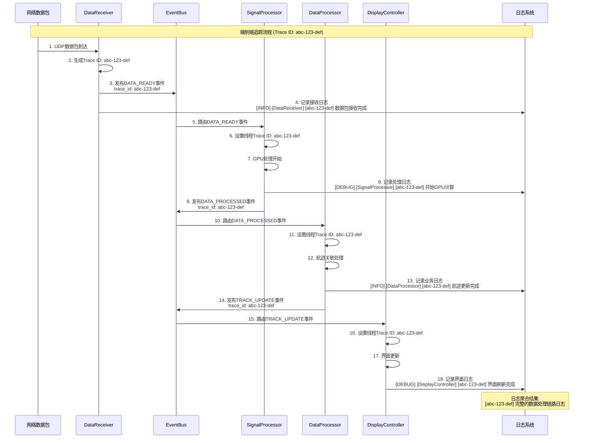
```mermaid
sequenceDiagram
    participant Network as 网络数据包
    participant DataReceiver as DataReceiver
    participant EventBus as EventBus
    participant SignalProcessor as SignalProcessor
    participant DataProcessor as DataProcessor
    participant DisplayController as DisplayController
    participant LogSystem as 日志系统

    Note over Network,LogSystem: 端到端追踪流程 (Trace ID: abc-123-def)

    Network->>DataReceiver: 1. UDP数据包到达
    DataReceiver->>DataReceiver: 2. 生成Trace ID: abc-123-def
    DataReceiver->>EventBus: 3. 发布DATA_READY事件<br/>trace_id: abc-123-def
    DataReceiver->>LogSystem: 4. 记录接收日志<br/>[INFO] [DataReceiver] [abc-123-def] 数据包接收完成

    EventBus->>SignalProcessor: 5. 路由DATA_READY事件
    SignalProcessor->>SignalProcessor: 6. 设置线程Trace ID: abc-123-def
    SignalProcessor->>SignalProcessor: 7. GPU处理开始
    SignalProcessor->>LogSystem: 8. 记录处理日志<br/>[DEBUG] [SignalProcessor] [abc-123-def] 开始GPU计算
    SignalProcessor->>EventBus: 9. 发布DATA_PROCESSED事件<br/>trace_id: abc-123-def

    EventBus->>DataProcessor: 10. 路由DATA_PROCESSED事件
    DataProcessor->>DataProcessor: 11. 设置线程Trace ID: abc-123-def
    DataProcessor->>DataProcessor: 12. 航迹关联处理
    DataProcessor->>LogSystem: 13. 记录业务日志<br/>[INFO] [DataProcessor] [abc-123-def] 航迹更新完成
    DataProcessor->>EventBus: 14. 发布TRACK_UPDATE事件<br/>trace_id: abc-123-def

    EventBus->>DisplayController: 15. 路由TRACK_UPDATE事件
    DisplayController->>DisplayController: 16. 设置线程Trace ID: abc-123-def
    DisplayController->>DisplayController: 17. 界面更新
    DisplayController->>LogSystem: 18. 记录界面日志<br/>[DEBUG] [DisplayController] [abc-123-def] 界面刷新完成

    Note over LogSystem: 日志聚合结果:<br/>[abc-123-def] 完整的数据处理链路日志
```

---

## 5 数据流与处理链路

### 5.1 零拷贝数据流设计

系统核心的零拷贝数据流架构，从网络到GPU全程无数据拷贝：

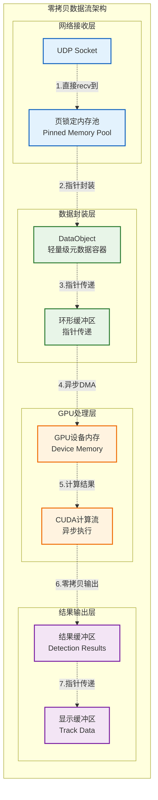
```mermaid
graph LR
    subgraph "零拷贝数据流架构"
        direction TB

        subgraph "网络接收层"
            NET[UDP Socket]
            PINNED_MEM[页锁定内存池<br/>Pinned Memory Pool]
        end

        subgraph "数据封装层"
            DATA_OBJ[DataObject<br/>轻量级元数据容器]
            RING_BUF[环形缓冲区<br/>指针传递]
        end

        subgraph "GPU处理层"
            GPU_MEM[GPU设备内存<br/>Device Memory]
            CUDA_STREAM[CUDA计算流<br/>异步执行]
        end

        subgraph "结果输出层"
            RESULT_BUF[结果缓冲区<br/>Detection Results]
            DISPLAY_BUF[显示缓冲区<br/>Track Data]
        end

        %% 零拷贝数据流路径
        NET -.->|1.直接recv到| PINNED_MEM
        PINNED_MEM -.->|2.指针封装| DATA_OBJ
        DATA_OBJ -.->|3.指针传递| RING_BUF
        RING_BUF -.->|4.异步DMA| GPU_MEM
        GPU_MEM -.->|5.计算结果| CUDA_STREAM
        CUDA_STREAM -.->|6.零拷贝输出| RESULT_BUF
        RESULT_BUF -.->|7.指针传递| DISPLAY_BUF
    end

    classDef network fill:#e3f2fd,stroke:#1565c0,stroke-width:2px
    classDef encap fill:#e8f5e8,stroke:#2e7d32,stroke-width:2px
    classDef gpu fill:#fff3e0,stroke:#ef6c00,stroke-width:2px
    classDef result fill:#f3e5f5,stroke:#7b1fa2,stroke-width:2px

    class NET,PINNED_MEM network
    class DATA_OBJ,RING_BUF encap
    class GPU_MEM,CUDA_STREAM gpu
    class RESULT_BUF,DISPLAY_BUF result
```

### 5.2 高性能处理管道

多级流水线处理架构，实现最优的吞吐量和延迟：


```mermaid
graph TD
    subgraph "高性能处理管道"
        direction TB

        subgraph "Stage 1: 数据接收管道"
            S1_IO[I/O接收线程<br/>专职网络接收]
            S1_PARSE[解析工作线程池<br/>CPU密集型处理]
            S1_QUEUE[SPSC无锁队列<br/>解耦I/O与计算]

            S1_IO --> S1_QUEUE
            S1_QUEUE --> S1_PARSE
        end

        subgraph "Stage 2: 信号处理管道"
            S2_H2D[H2D传输流<br/>主机到设备]
            S2_COMPUTE[计算流<br/>GPU核函数执行]
            S2_D2H[D2H传输流<br/>设备到主机]

            S2_H2D --> S2_COMPUTE
            S2_COMPUTE --> S2_D2H
        end

        subgraph "Stage 3: 数据处理管道"
            S3_CLUSTER[检测后处理<br/>并行聚类算法]
            S3_ASSOC[数据关联<br/>航迹匹配]
            S3_FILTER[状态估计<br/>卡尔曼滤波]

            S3_CLUSTER --> S3_ASSOC
            S3_ASSOC --> S3_FILTER
        end

        subgraph "Stage 4: 显示管道"
            S4_RENDER[渲染准备<br/>空间索引构建]
            S4_DRAW[渲染执行<br/>GPU图形管道]
            S4_PRESENT[显示输出<br/>垂直同步]

            S4_RENDER --> S4_DRAW
            S4_DRAW --> S4_PRESENT
        end

        %% 管道间数据流
        S1_PARSE ==> S2_H2D
        S2_D2H ==> S3_CLUSTER
        S3_FILTER ==> S4_RENDER
    end

    classDef stage1 fill:#e3f2fd,stroke:#1565c0,stroke-width:2px
    classDef stage2 fill:#e8f5e8,stroke:#2e7d32,stroke-width:2px
    classDef stage3 fill:#fff3e0,stroke:#ef6c00,stroke-width:2px
    classDef stage4 fill:#f3e5f5,stroke:#7b1fa2,stroke-width:2px

    class S1_IO,S1_PARSE,S1_QUEUE stage1
    class S2_H2D,S2_COMPUTE,S2_D2H stage2
    class S3_CLUSTER,S3_ASSOC,S3_FILTER stage3
    class S4_RENDER,S4_DRAW,S4_PRESENT stage4
```

**重要说明**：Stage 3中的各步骤（检测后处理、数据关联、状态估计）是在数据处理模块的`AlgorithmPipeline`中，由其`ExecutionEngine`在CPU工作线程池上串行或并行执行的可配置算法策略，而非独立的进程管道。

### 5.3 GPU计算协调机制

抢占式GPU资源协调，平衡计算性能与界面响应：

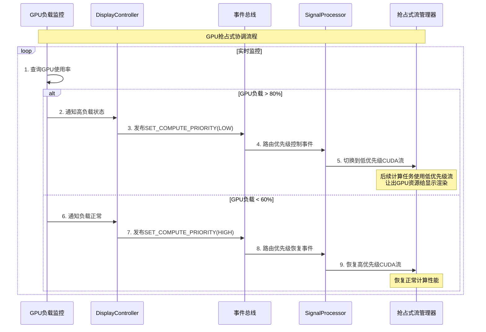
```mermaid
sequenceDiagram
    participant Monitor as GPU负载监控
    participant DisplayCtrl as DisplayController
    participant EventBus as 事件总线
    participant SignalProc as SignalProcessor
    participant StreamMgr as 抢占式流管理器

    Note over Monitor,StreamMgr: GPU抢占式协调流程

    loop 实时监控
        Monitor->>Monitor: 1. 查询GPU使用率
        alt GPU负载 > 80%
            Monitor->>DisplayCtrl: 2. 通知高负载状态
            DisplayCtrl->>EventBus: 3. 发布SET_COMPUTE_PRIORITY(LOW)
            EventBus->>SignalProc: 4. 路由优先级控制事件
            SignalProc->>StreamMgr: 5. 切换到低优先级CUDA流
            Note over StreamMgr: 后续计算任务使用低优先级流<br/>让出GPU资源给显示渲染
        else GPU负载 < 60%
            Monitor->>DisplayCtrl: 6. 通知负载正常
            DisplayCtrl->>EventBus: 7. 发布SET_COMPUTE_PRIORITY(HIGH)
            EventBus->>SignalProc: 8. 路由优先级恢复事件
            SignalProc->>StreamMgr: 9. 恢复高优先级CUDA流
            Note over StreamMgr: 恢复正常计算性能
        end
    end
```

---

## 6 并发与资源管理

### 6.1 统一线程模型

系统采用角色明确的线程模型，最大化并发性能：

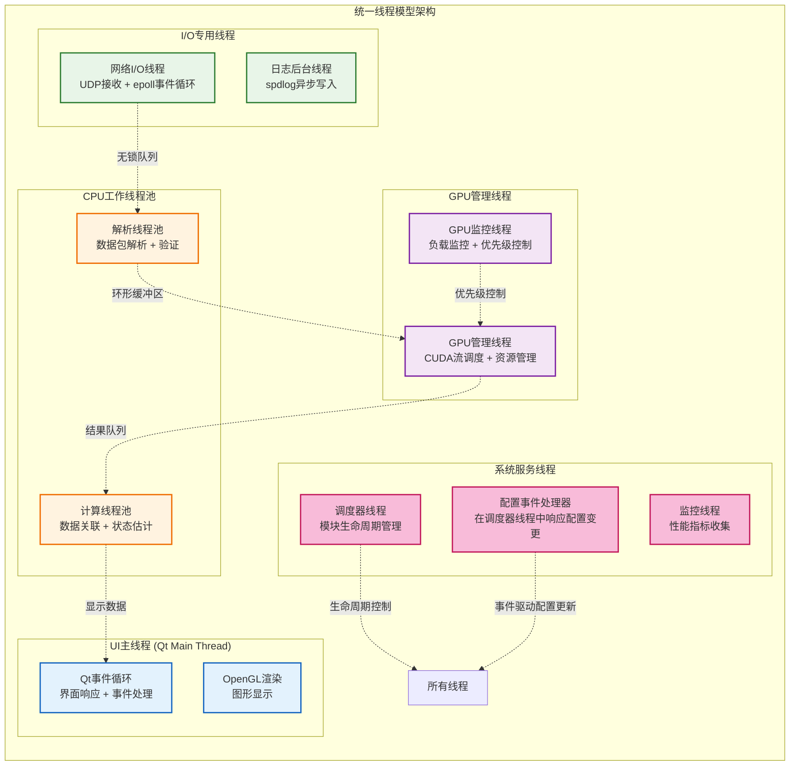
```mermaid
graph TB
    subgraph "统一线程模型架构"
        direction TB

        subgraph "UI主线程 (Qt Main Thread)"
            QT_MAIN[Qt事件循环<br/>界面响应 + 事件处理]
            QT_RENDER[OpenGL渲染<br/>图形显示]
        end

        subgraph "I/O专用线程"
            NET_IO[网络I/O线程<br/>UDP接收 + epoll事件循环]
            LOG_BACKEND[日志后台线程<br/>spdlog异步写入]
        end

        subgraph "CPU工作线程池"
            PARSE_POOL[解析线程池<br/>数据包解析 + 验证]
            COMPUTE_POOL[计算线程池<br/>数据关联 + 状态估计]
        end

        subgraph "GPU管理线程"
            GPU_MGR[GPU管理线程<br/>CUDA流调度 + 资源管理]
            GPU_MONITOR[GPU监控线程<br/>负载监控 + 优先级控制]
        end

        subgraph "系统服务线程"
            SCHEDULER[调度器线程<br/>模块生命周期管理]
            MONITOR[监控线程<br/>性能指标收集]
            CONFIG_HANDLER[配置事件处理器<br/>在调度器线程中响应配置变更]
        end

        %% 线程间通信
        NET_IO -.->|无锁队列| PARSE_POOL
        PARSE_POOL -.->|环形缓冲区| GPU_MGR
        GPU_MGR -.->|结果队列| COMPUTE_POOL
        COMPUTE_POOL -.->|显示数据| QT_MAIN

        %% 控制信号
        GPU_MONITOR -.->|优先级控制| GPU_MGR
        SCHEDULER -.->|生命周期控制| 所有线程
        CONFIG_HANDLER -.->|事件驱动配置更新| 所有线程
    end

    classDef ui fill:#e3f2fd,stroke:#1565c0,stroke-width:2px
    classDef io fill:#e8f5e8,stroke:#2e7d32,stroke-width:2px
    classDef compute fill:#fff3e0,stroke:#ef6c00,stroke-width:2px
    classDef gpu fill:#f3e5f5,stroke:#7b1fa2,stroke-width:2px
    classDef system fill:#f8bbd9,stroke:#c2185b,stroke-width:2px

    class QT_MAIN,QT_RENDER ui
    class NET_IO,LOG_BACKEND io
    class PARSE_POOL,COMPUTE_POOL compute
    class GPU_MGR,GPU_MONITOR gpu
    class SCHEDULER,MONITOR,CONFIG_HANDLER system
```

**线程模型说明**：
- **日志后台线程**：由spdlog内部线程池管理，负责异步日志写入，非独立的应用线程
- **配置事件处理器**：基于事件驱动模式，在调度器线程上下文中响应配置变更事件，非常驻独立线程
- **系统服务线程**：调度器和监控模块作为独立的`IModule`运行，拥有各自的执行线程

---

### 6.2 GPU资源协调策略

双优先级CUDA流架构，支持抢占式GPU资源调度：

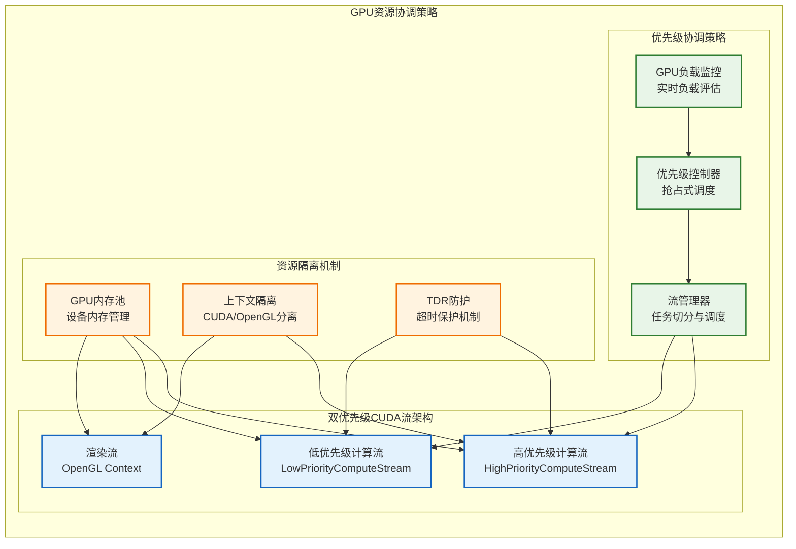
```mermaid
graph TB
    subgraph "GPU资源协调策略"
        direction TB

        subgraph "双优先级CUDA流架构"
            HIGH_STREAM[高优先级计算流<br/>HighPriorityComputeStream]
            LOW_STREAM[低优先级计算流<br/>LowPriorityComputeStream]
            RENDER_STREAM[渲染流<br/>OpenGL Context]
        end

        subgraph "优先级协调策略"
            LOAD_MONITOR[GPU负载监控<br/>实时负载评估]
            PRIORITY_CTRL[优先级控制器<br/>抢占式调度]
            STREAM_MGR[流管理器<br/>任务切分与调度]
        end

        subgraph "资源隔离机制"
            MEMORY_POOL[GPU内存池<br/>设备内存管理]
            CONTEXT_ISOLATION[上下文隔离<br/>CUDA/OpenGL分离]
            TDR_PROTECTION[TDR防护<br/>超时保护机制]
        end

        %% 协调流程
        LOAD_MONITOR --> PRIORITY_CTRL
        PRIORITY_CTRL --> STREAM_MGR
        STREAM_MGR --> HIGH_STREAM
        STREAM_MGR --> LOW_STREAM

        %% 资源管理
        MEMORY_POOL --> HIGH_STREAM
        MEMORY_POOL --> LOW_STREAM
        MEMORY_POOL --> RENDER_STREAM

        CONTEXT_ISOLATION --> HIGH_STREAM
        CONTEXT_ISOLATION --> RENDER_STREAM

        TDR_PROTECTION --> HIGH_STREAM
        TDR_PROTECTION --> LOW_STREAM
    end

    classDef stream fill:#e3f2fd,stroke:#1565c0,stroke-width:2px
    classDef control fill:#e8f5e8,stroke:#2e7d32,stroke-width:2px
    classDef isolation fill:#fff3e0,stroke:#ef6c00,stroke-width:2px

    class HIGH_STREAM,LOW_STREAM,RENDER_STREAM stream
    class LOAD_MONITOR,PRIORITY_CTRL,STREAM_MGR control
    class MEMORY_POOL,CONTEXT_ISOLATION,TDR_PROTECTION isolation
```

### 6.3 内存管理体系

统一的内存管理体系，支持零拷贝和高性能数据传输：

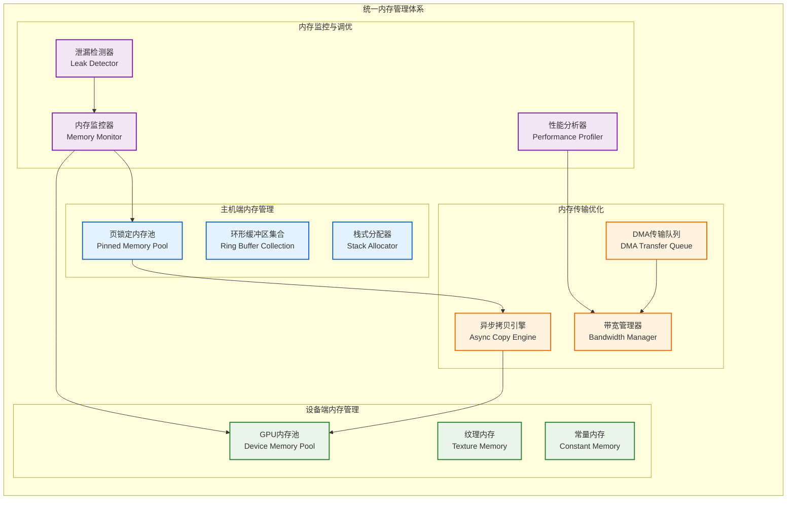
```mermaid
graph TB
    subgraph "统一内存管理体系"
        direction TB

        subgraph "主机端内存管理"
            PINNED_POOL[页锁定内存池<br/>Pinned Memory Pool]
            RING_BUFFERS[环形缓冲区集合<br/>Ring Buffer Collection]
            STACK_ALLOCATOR[栈式分配器<br/>Stack Allocator]
        end

        subgraph "设备端内存管理"
            GPU_POOL[GPU内存池<br/>Device Memory Pool]
            TEXTURE_MEM[纹理内存<br/>Texture Memory]
            CONSTANT_MEM[常量内存<br/>Constant Memory]
        end

        subgraph "内存传输优化"
            ASYNC_COPY[异步拷贝引擎<br/>Async Copy Engine]
            DMA_QUEUE[DMA传输队列<br/>DMA Transfer Queue]
            BANDWIDTH_MGR[带宽管理器<br/>Bandwidth Manager]
        end

        subgraph "内存监控与调优"
            MEM_MONITOR[内存监控器<br/>Memory Monitor]
            LEAK_DETECTOR[泄漏检测器<br/>Leak Detector]
            PERF_PROFILER[性能分析器<br/>Performance Profiler]
        end

        %% 内存管理流程
        PINNED_POOL --> ASYNC_COPY
        ASYNC_COPY --> GPU_POOL
        DMA_QUEUE --> BANDWIDTH_MGR

        %% 监控反馈
        MEM_MONITOR --> PINNED_POOL
        MEM_MONITOR --> GPU_POOL
        LEAK_DETECTOR --> MEM_MONITOR
        PERF_PROFILER --> BANDWIDTH_MGR
    end

    classDef host fill:#e3f2fd,stroke:#1565c0,stroke-width:2px
    classDef device fill:#e8f5e8,stroke:#2e7d32,stroke-width:2px
    classDef transfer fill:#fff3e0,stroke:#ef6c00,stroke-width:2px
    classDef monitor fill:#f3e5f5,stroke:#7b1fa2,stroke-width:2px

    class PINNED_POOL,RING_BUFFERS,STACK_ALLOCATOR host
    class GPU_POOL,TEXTURE_MEM,CONSTANT_MEM device
    class ASYNC_COPY,DMA_QUEUE,BANDWIDTH_MGR transfer
    class MEM_MONITOR,LEAK_DETECTOR,PERF_PROFILER monitor
```

---

## 7 配置与监控体系

### 7.1 统一配置管理

事件驱动的配置管理体系，支持热更新和多环境部署：

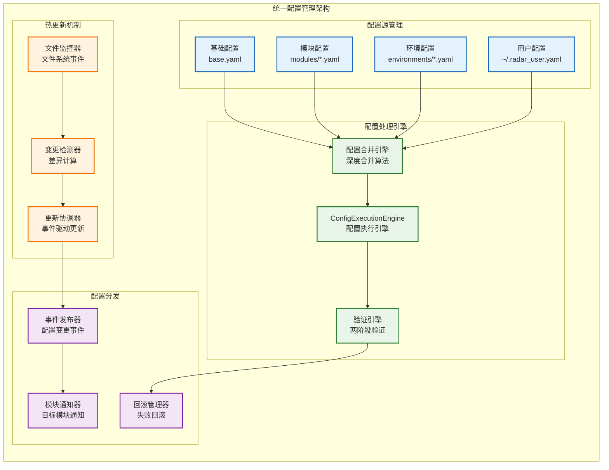
```mermaid
graph TB
    subgraph "统一配置管理架构"
        direction TB

        subgraph "配置源管理"
            BASE_CONFIG[基础配置<br/>base.yaml]
            MODULE_CONFIGS[模块配置<br/>modules/*.yaml]
            ENV_CONFIGS[环境配置<br/>environments/*.yaml]
            USER_CONFIGS[用户配置<br/>~/.radar_user.yaml]
        end

        subgraph "配置处理引擎"
            CONFIG_ENGINE[ConfigExecutionEngine<br/>配置执行引擎]
            MERGE_ENGINE[配置合并引擎<br/>深度合并算法]
            VALIDATION_ENGINE[验证引擎<br/>两阶段验证]
        end

        subgraph "热更新机制"
            FILE_WATCHER[文件监控器<br/>文件系统事件]
            CHANGE_DETECTOR[变更检测器<br/>差异计算]
            UPDATE_COORDINATOR[更新协调器<br/>事件驱动更新]
        end

        subgraph "配置分发"
            EVENT_PUBLISHER[事件发布器<br/>配置变更事件]
            MODULE_NOTIFIER[模块通知器<br/>目标模块通知]
            ROLLBACK_MGR[回滚管理器<br/>失败回滚]
        end

        %% 配置流程
        BASE_CONFIG --> MERGE_ENGINE
        MODULE_CONFIGS --> MERGE_ENGINE
        ENV_CONFIGS --> MERGE_ENGINE
        USER_CONFIGS --> MERGE_ENGINE

        MERGE_ENGINE --> CONFIG_ENGINE
        CONFIG_ENGINE --> VALIDATION_ENGINE

        FILE_WATCHER --> CHANGE_DETECTOR
        CHANGE_DETECTOR --> UPDATE_COORDINATOR
        UPDATE_COORDINATOR --> EVENT_PUBLISHER

        EVENT_PUBLISHER --> MODULE_NOTIFIER
        VALIDATION_ENGINE --> ROLLBACK_MGR
    end

    classDef source fill:#e3f2fd,stroke:#1565c0,stroke-width:2px
    classDef engine fill:#e8f5e8,stroke:#2e7d32,stroke-width:2px
    classDef hotupdate fill:#fff3e0,stroke:#ef6c00,stroke-width:2px
    classDef distribute fill:#f3e5f5,stroke:#7b1fa2,stroke-width:2px

    class BASE_CONFIG,MODULE_CONFIGS,ENV_CONFIGS,USER_CONFIGS source
    class CONFIG_ENGINE,MERGE_ENGINE,VALIDATION_ENGINE engine
    class FILE_WATCHER,CHANGE_DETECTOR,UPDATE_COORDINATOR hotupdate
    class EVENT_PUBLISHER,MODULE_NOTIFIER,ROLLBACK_MGR distribute
```

### 7.2 全面监控架构

多层次的监控体系，实现系统全面可观测性：

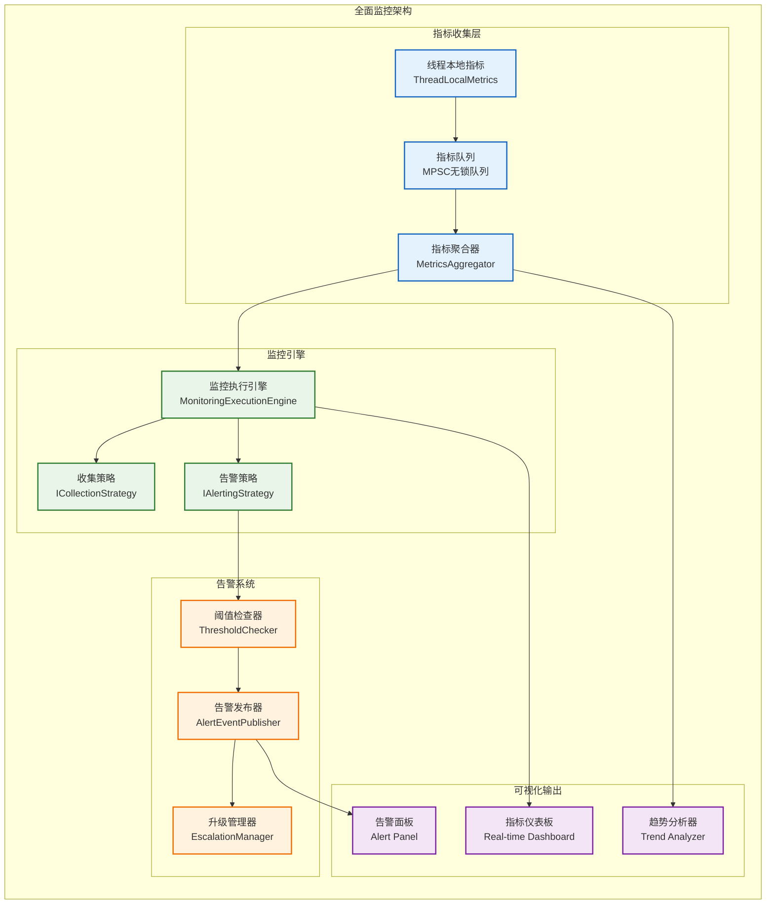
```mermaid
graph TB
    subgraph "全面监控架构"
        direction TB

        subgraph "指标收集层"
            THREAD_LOCAL[线程本地指标<br/>ThreadLocalMetrics]
            METRICS_QUEUE[指标队列<br/>MPSC无锁队列]
            AGGREGATOR[指标聚合器<br/>MetricsAggregator]
        end

        subgraph "监控引擎"
            MONITORING_ENGINE[监控执行引擎<br/>MonitoringExecutionEngine]
            COLLECTION_STRATEGY[收集策略<br/>ICollectionStrategy]
            ALERTING_STRATEGY[告警策略<br/>IAlertingStrategy]
        end

        subgraph "告警系统"
            THRESHOLD_CHECKER[阈值检查器<br/>ThresholdChecker]
            ALERT_PUBLISHER[告警发布器<br/>AlertEventPublisher]
            ESCALATION_MGR[升级管理器<br/>EscalationManager]
        end

        subgraph "可视化输出"
            METRICS_DASHBOARD[指标仪表板<br/>Real-time Dashboard]
            ALERT_PANEL[告警面板<br/>Alert Panel]
            TREND_ANALYZER[趋势分析器<br/>Trend Analyzer]
        end

        %% 监控流程
        THREAD_LOCAL --> METRICS_QUEUE
        METRICS_QUEUE --> AGGREGATOR
        AGGREGATOR --> MONITORING_ENGINE

        MONITORING_ENGINE --> COLLECTION_STRATEGY
        MONITORING_ENGINE --> ALERTING_STRATEGY

        ALERTING_STRATEGY --> THRESHOLD_CHECKER
        THRESHOLD_CHECKER --> ALERT_PUBLISHER
        ALERT_PUBLISHER --> ESCALATION_MGR

        MONITORING_ENGINE --> METRICS_DASHBOARD
        ALERT_PUBLISHER --> ALERT_PANEL
        AGGREGATOR --> TREND_ANALYZER
    end

    classDef collect fill:#e3f2fd,stroke:#1565c0,stroke-width:2px
    classDef engine fill:#e8f5e8,stroke:#2e7d32,stroke-width:2px
    classDef alert fill:#fff3e0,stroke:#ef6c00,stroke-width:2px
    classDef visual fill:#f3e5f5,stroke:#7b1fa2,stroke-width:2px

    class THREAD_LOCAL,METRICS_QUEUE,AGGREGATOR collect
    class MONITORING_ENGINE,COLLECTION_STRATEGY,ALERTING_STRATEGY engine
    class THRESHOLD_CHECKER,ALERT_PUBLISHER,ESCALATION_MGR alert
    class METRICS_DASHBOARD,ALERT_PANEL,TREND_ANALYZER visual
```

### 7.3 日志与追踪系统

结构化日志与分布式追踪的统一系统：

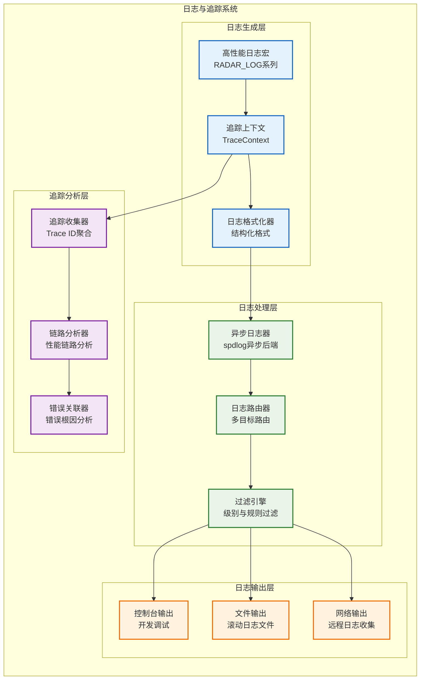
```mermaid
graph TB
    subgraph "日志与追踪系统"
        direction TB

        subgraph "日志生成层"
            LOG_MACROS[高性能日志宏<br/>RADAR_LOG系列]
            TRACE_CONTEXT[追踪上下文<br/>TraceContext]
            LOG_FORMATTER[日志格式化器<br/>结构化格式]
        end

        subgraph "日志处理层"
            ASYNC_LOGGER[异步日志器<br/>spdlog异步后端]
            LOG_ROUTER[日志路由器<br/>多目标路由]
            FILTER_ENGINE[过滤引擎<br/>级别与规则过滤]
        end

        subgraph "日志输出层"
            CONSOLE_SINK[控制台输出<br/>开发调试]
            FILE_SINK[文件输出<br/>滚动日志文件]
            NETWORK_SINK[网络输出<br/>远程日志收集]
        end

        subgraph "追踪分析层"
            TRACE_COLLECTOR[追踪收集器<br/>Trace ID聚合]
            SPAN_ANALYZER[链路分析器<br/>性能链路分析]
            ERROR_CORRELATOR[错误关联器<br/>错误根因分析]
        end

        %% 日志流程
        LOG_MACROS --> TRACE_CONTEXT
        TRACE_CONTEXT --> LOG_FORMATTER
        LOG_FORMATTER --> ASYNC_LOGGER

        ASYNC_LOGGER --> LOG_ROUTER
        LOG_ROUTER --> FILTER_ENGINE

        FILTER_ENGINE --> CONSOLE_SINK
        FILTER_ENGINE --> FILE_SINK
        FILTER_ENGINE --> NETWORK_SINK

        %% 追踪流程
        TRACE_CONTEXT --> TRACE_COLLECTOR
        TRACE_COLLECTOR --> SPAN_ANALYZER
        SPAN_ANALYZER --> ERROR_CORRELATOR
    end

    classDef generate fill:#e3f2fd,stroke:#1565c0,stroke-width:2px
    classDef process fill:#e8f5e8,stroke:#2e7d32,stroke-width:2px
    classDef output fill:#fff3e0,stroke:#ef6c00,stroke-width:2px
    classDef trace fill:#f3e5f5,stroke:#7b1fa2,stroke-width:2px

    class LOG_MACROS,TRACE_CONTEXT,LOG_FORMATTER generate
    class ASYNC_LOGGER,LOG_ROUTER,FILTER_ENGINE process
    class CONSOLE_SINK,FILE_SINK,NETWORK_SINK output
    class TRACE_COLLECTOR,SPAN_ANALYZER,ERROR_CORRELATOR trace
```

---

## 8 错误处理与容错

### 8.1 分级错误处理

统一的错误分类和处理体系：

```mermaid
graph TB
    subgraph "分级错误处理体系"
        direction TB

        subgraph "错误分类 (Error Classification)"
            NETWORK_ERRORS[网络错误 (100-199)<br/>Socket/UDP/连接]
            DATA_ERRORS[数据错误 (200-299)<br/>格式/校验/序列]
            BUFFER_ERRORS[缓冲区错误 (300-399)<br/>内存/溢出/分配]
            SYSTEM_ERRORS[系统错误 (400-499)<br/>资源/配置/状态]
            GPU_ERRORS[GPU错误 (500-599)<br/>CUDA/内存/计算]
        end

        subgraph "处理策略 (Handling Strategy)"
            LOCAL_RECOVERY[本地恢复<br/>模块内自处理]
            COORDINATION_RECOVERY[协调恢复<br/>事件上报协调]
            SYSTEM_RECOVERY[系统恢复<br/>调度器决策]
            EMERGENCY_SHUTDOWN[紧急关闭<br/>安全停机]
        end

        subgraph "恢复机制 (Recovery Mechanism)"
            RETRY_BACKOFF[重试退避<br/>指数退避策略]
            CIRCUIT_BREAKER[熔断机制<br/>防止故障传播]
            DEGRADED_MODE[降级模式<br/>功能降级运行]
            GRACEFUL_SHUTDOWN[优雅关闭<br/>安全清理资源]
        end

        %% 错误处理流程
        NETWORK_ERRORS --> LOCAL_RECOVERY
        DATA_ERRORS --> LOCAL_RECOVERY
        BUFFER_ERRORS --> COORDINATION_RECOVERY
        SYSTEM_ERRORS --> SYSTEM_RECOVERY
        GPU_ERRORS --> EMERGENCY_SHUTDOWN

        LOCAL_RECOVERY --> RETRY_BACKOFF
        COORDINATION_RECOVERY --> CIRCUIT_BREAKER
        SYSTEM_RECOVERY --> DEGRADED_MODE
        EMERGENCY_SHUTDOWN --> GRACEFUL_SHUTDOWN
    end

    classDef classification fill:#e3f2fd,stroke:#1565c0,stroke-width:2px
    classDef strategy fill:#e8f5e8,stroke:#2e7d32,stroke-width:2px
    classDef mechanism fill:#fff3e0,stroke:#ef6c00,stroke-width:2px

    class NETWORK_ERRORS,DATA_ERRORS,BUFFER_ERRORS,SYSTEM_ERRORS,GPU_ERRORS classification
    class LOCAL_RECOVERY,COORDINATION_RECOVERY,SYSTEM_RECOVERY,EMERGENCY_SHUTDOWN strategy
    class RETRY_BACKOFF,CIRCUIT_BREAKER,DEGRADED_MODE,GRACEFUL_SHUTDOWN mechanism
```

### 8.2 故障恢复策略

智能的故障恢复策略引擎：

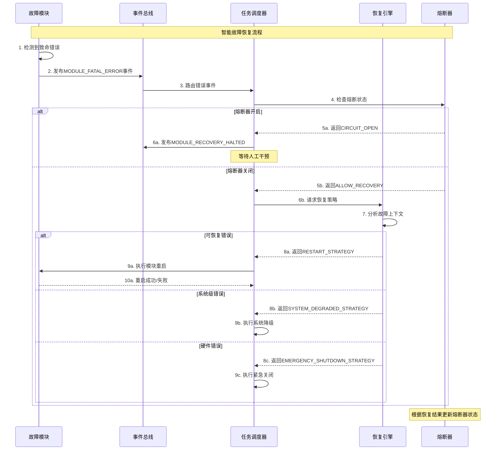
```mermaid
sequenceDiagram
    participant Module as 故障模块
    participant EventBus as 事件总线
    participant TaskScheduler as 任务调度器
    participant RecoveryEngine as 恢复引擎
    participant CircuitBreaker as 熔断器

    Note over Module,CircuitBreaker: 智能故障恢复流程

    Module->>Module: 1. 检测到致命错误
    Module->>EventBus: 2. 发布MODULE_FATAL_ERROR事件
    EventBus->>TaskScheduler: 3. 路由错误事件

    TaskScheduler->>CircuitBreaker: 4. 检查熔断状态
    alt 熔断器开启
        CircuitBreaker-->>TaskScheduler: 5a. 返回CIRCUIT_OPEN
        TaskScheduler->>EventBus: 6a. 发布MODULE_RECOVERY_HALTED
        Note over TaskScheduler: 等待人工干预
    else 熔断器关闭
        CircuitBreaker-->>TaskScheduler: 5b. 返回ALLOW_RECOVERY
        TaskScheduler->>RecoveryEngine: 6b. 请求恢复策略

        RecoveryEngine->>RecoveryEngine: 7. 分析故障上下文
        alt 可恢复错误
            RecoveryEngine-->>TaskScheduler: 8a. 返回RESTART_STRATEGY
            TaskScheduler->>Module: 9a. 执行模块重启
            Module-->>TaskScheduler: 10a. 重启成功/失败
        else 系统级错误
            RecoveryEngine-->>TaskScheduler: 8b. 返回SYSTEM_DEGRADED_STRATEGY
            TaskScheduler->>TaskScheduler: 9b. 执行系统降级
        else 硬件错误
            RecoveryEngine-->>TaskScheduler: 8c. 返回EMERGENCY_SHUTDOWN_STRATEGY
            TaskScheduler->>TaskScheduler: 9c. 执行紧急关闭
        end
    end

    Note over CircuitBreaker: 根据恢复结果更新熔断器状态
```

### 8.3 系统健康管理

全面的系统健康评估和管理机制：

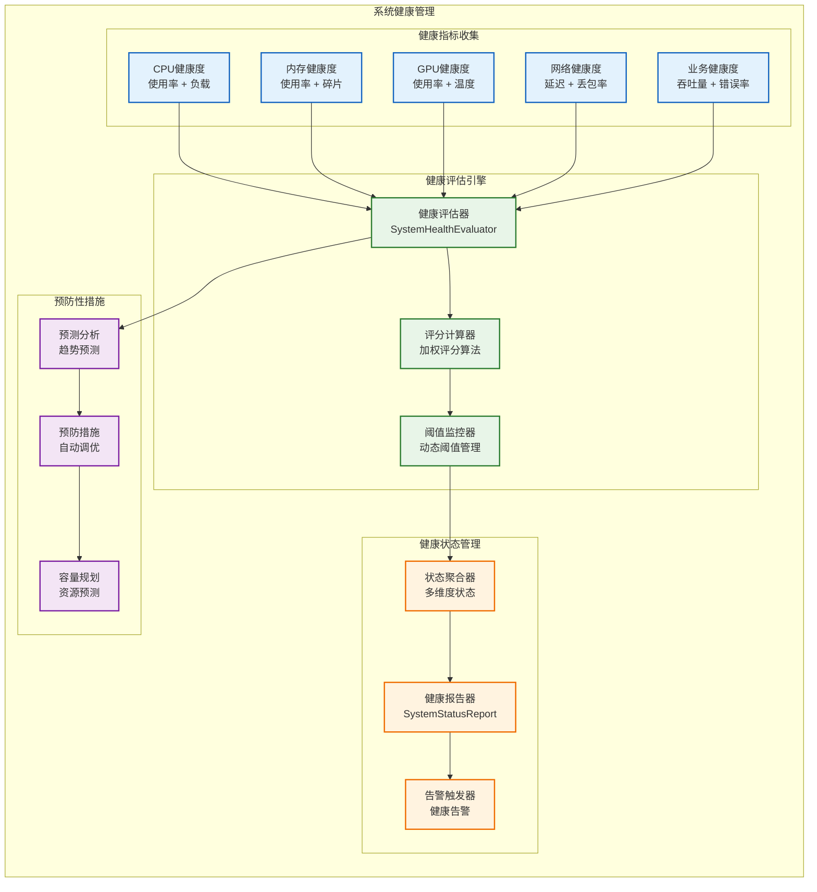
```mermaid
graph TB
    subgraph "系统健康管理"
        direction TB

        subgraph "健康指标收集"
            CPU_HEALTH[CPU健康度<br/>使用率 + 负载]
            MEMORY_HEALTH[内存健康度<br/>使用率 + 碎片]
            GPU_HEALTH[GPU健康度<br/>使用率 + 温度]
            NETWORK_HEALTH[网络健康度<br/>延迟 + 丢包率]
            BUSINESS_HEALTH[业务健康度<br/>吞吐量 + 错误率]
        end

        subgraph "健康评估引擎"
            HEALTH_EVALUATOR[健康评估器<br/>SystemHealthEvaluator]
            SCORE_CALCULATOR[评分计算器<br/>加权评分算法]
            THRESHOLD_MONITOR[阈值监控器<br/>动态阈值管理]
        end

        subgraph "健康状态管理"
            STATUS_AGGREGATOR[状态聚合器<br/>多维度状态]
            HEALTH_REPORTER[健康报告器<br/>SystemStatusReport]
            ALERT_TRIGGER[告警触发器<br/>健康告警]
        end

        subgraph "预防性措施"
            PREDICTIVE_ANALYSIS[预测分析<br/>趋势预测]
            PREVENTIVE_ACTION[预防措施<br/>自动调优]
            CAPACITY_PLANNING[容量规划<br/>资源预测]
        end

        %% 健康管理流程
        CPU_HEALTH --> HEALTH_EVALUATOR
        MEMORY_HEALTH --> HEALTH_EVALUATOR
        GPU_HEALTH --> HEALTH_EVALUATOR
        NETWORK_HEALTH --> HEALTH_EVALUATOR
        BUSINESS_HEALTH --> HEALTH_EVALUATOR

        HEALTH_EVALUATOR --> SCORE_CALCULATOR
        SCORE_CALCULATOR --> THRESHOLD_MONITOR
        THRESHOLD_MONITOR --> STATUS_AGGREGATOR

        STATUS_AGGREGATOR --> HEALTH_REPORTER
        HEALTH_REPORTER --> ALERT_TRIGGER

        HEALTH_EVALUATOR --> PREDICTIVE_ANALYSIS
        PREDICTIVE_ANALYSIS --> PREVENTIVE_ACTION
        PREVENTIVE_ACTION --> CAPACITY_PLANNING
    end

    classDef collect fill:#e3f2fd,stroke:#1565c0,stroke-width:2px
    classDef evaluate fill:#e8f5e8,stroke:#2e7d32,stroke-width:2px
    classDef manage fill:#fff3e0,stroke:#ef6c00,stroke-width:2px
    classDef prevent fill:#f3e5f5,stroke:#7b1fa2,stroke-width:2px

    class CPU_HEALTH,MEMORY_HEALTH,GPU_HEALTH,NETWORK_HEALTH,BUSINESS_HEALTH collect
    class HEALTH_EVALUATOR,SCORE_CALCULATOR,THRESHOLD_MONITOR evaluate
    class STATUS_AGGREGATOR,HEALTH_REPORTER,ALERT_TRIGGER manage
    class PREDICTIVE_ANALYSIS,PREVENTIVE_ACTION,CAPACITY_PLANNING prevent
```

---

## 9 技术栈与工具链

### 9.1 核心技术选型

基于性能、稳定性和生态系统考虑的技术选型：

| 技术领域     | 技术选择    | 版本要求     | 选择理由                        |
| ------------ | ----------- | ------------ | ------------------------------- |
| **编程语言** | C++17       | >= C++17     | 现代C++特性，性能与可维护性平衡 |
| **GUI框架**  | Qt6.x       | >= 6.5       | 专业桌面应用，丰富的图形组件    |
| **GPU计算**  | CUDA        | >= 12.0      | NVIDIA GPU生态，成熟的并行计算  |
| **日志库**   | spdlog      | >= 1.9.0     | 高性能异步日志，丰富的输出格式  |
| **配置解析** | yaml-cpp    | >= 0.7.0     | 人类友好的配置格式，层次化支持  |
| **网络库**   | 系统原生    | POSIX Socket | 最佳性能，直接系统调用          |
| **线程库**   | std::thread | C++17标准    | 标准库，跨平台兼容性好          |
| **数学库**   | Eigen3      | >= 3.4       | 高性能矩阵运算，SIMD优化        |
| **测试框架** | Google Test | >= 1.12.0    | 完整的单元测试和Mock支持        |

### 9.2 开发工具链

现代化的开发工具链，支持高效开发和持续集成：

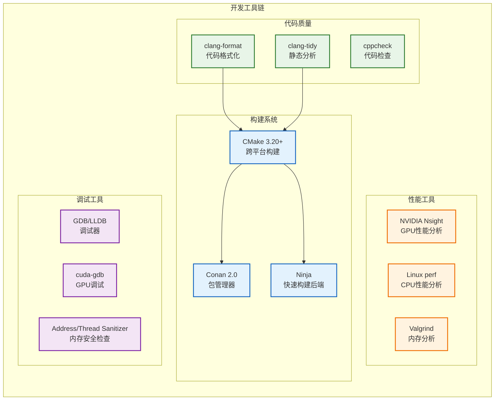
```mermaid
graph TB
    subgraph "开发工具链"
        direction TB

        subgraph "构建系统"
            CMAKE[CMake 3.20+<br/>跨平台构建]
            CONAN[Conan 2.0<br/>包管理器]
            NINJA[Ninja<br/>快速构建后端]
        end

        subgraph "代码质量"
            CLANG_FORMAT[clang-format<br/>代码格式化]
            CLANG_TIDY[clang-tidy<br/>静态分析]
            CPPCHECK[cppcheck<br/>代码检查]
        end

        subgraph "性能工具"
            NVIDIA_NSIGHT[NVIDIA Nsight<br/>GPU性能分析]
            PERF[Linux perf<br/>CPU性能分析]
            VALGRIND[Valgrind<br/>内存分析]
        end

        subgraph "调试工具"
            GDB[GDB/LLDB<br/>调试器]
            CUDA_GDB[cuda-gdb<br/>GPU调试]
            SANITIZERS[Address/Thread Sanitizer<br/>内存安全检查]
        end

        %% 工具链集成
        CMAKE --> CONAN
        CMAKE --> NINJA
        CLANG_FORMAT --> CMAKE
        CLANG_TIDY --> CMAKE
    end

    classDef build fill:#e3f2fd,stroke:#1565c0,stroke-width:2px
    classDef quality fill:#e8f5e8,stroke:#2e7d32,stroke-width:2px
    classDef perf fill:#fff3e0,stroke:#ef6c00,stroke-width:2px
    classDef debug fill:#f3e5f5,stroke:#7b1fa2,stroke-width:2px

    class CMAKE,CONAN,NINJA build
    class CLANG_FORMAT,CLANG_TIDY,CPPCHECK quality
    class NVIDIA_NSIGHT,PERF,VALGRIND perf
    class GDB,CUDA_GDB,SANITIZERS debug
```

### 9.3 部署技术栈

支持现代化部署和运维管理的技术栈：

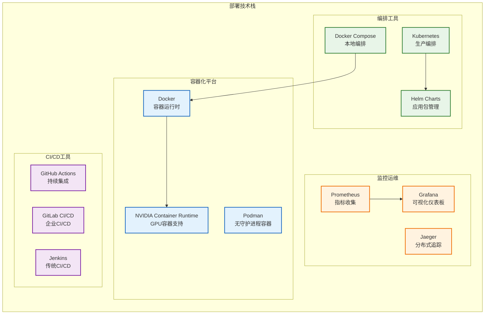
```mermaid
graph TB
    subgraph "部署技术栈"
        direction TB

        subgraph "容器化平台"
            DOCKER[Docker<br/>容器运行时]
            PODMAN[Podman<br/>无守护进程容器]
            NVIDIA_RUNTIME[NVIDIA Container Runtime<br/>GPU容器支持]
        end

        subgraph "编排工具"
            DOCKER_COMPOSE[Docker Compose<br/>本地编排]
            KUBERNETES[Kubernetes<br/>生产编排]
            HELM[Helm Charts<br/>应用包管理]
        end

        subgraph "监控运维"
            PROMETHEUS[Prometheus<br/>指标收集]
            GRAFANA[Grafana<br/>可视化仪表板]
            JAEGER[Jaeger<br/>分布式追踪]
        end

        subgraph "CI/CD工具"
            GITHUB_ACTIONS[GitHub Actions<br/>持续集成]
            GITLAB_CI[GitLab CI/CD<br/>企业CI/CD]
            JENKINS[Jenkins<br/>传统CI/CD]
        end

        %% 集成关系
        DOCKER --> NVIDIA_RUNTIME
        DOCKER_COMPOSE --> DOCKER
        KUBERNETES --> HELM
        PROMETHEUS --> GRAFANA
    end

    classDef container fill:#e3f2fd,stroke:#1565c0,stroke-width:2px
    classDef orchestration fill:#e8f5e8,stroke:#2e7d32,stroke-width:2px
    classDef monitoring fill:#fff3e0,stroke:#ef6c00,stroke-width:2px
    classDef cicd fill:#f3e5f5,stroke:#7b1fa2,stroke-width:2px

    class DOCKER,PODMAN,NVIDIA_RUNTIME container
    class DOCKER_COMPOSE,KUBERNETES,HELM orchestration
    class PROMETHEUS,GRAFANA,JAEGER monitoring
    class GITHUB_ACTIONS,GITLAB_CI,JENKINS cicd
```

---

## 10 质量属性设计

### 10.1 性能指标

系统关键性能指标和设计目标：

| 性能维度     | 指标项目       | MVP目标  | 生产目标  | 测量方法         |
| ------------ | -------------- | -------- | --------- | ---------------- |
| **延迟性能** | 端到端处理延迟 | < 50ms   | < 20ms    | Trace ID链路追踪 |
|              | 单模块处理延迟 | < 10ms   | < 5ms     | 模块内性能计数器 |
| **吞吐性能** | 数据包处理能力 | 1000 pps | 10000 pps | 网络接收统计     |
|              | GPU计算吞吐量  | 500 MB/s | 2000 MB/s | CUDA性能分析器   |
| **资源利用** | CPU利用率      | < 60%    | < 80%     | 系统监控服务     |
|              | GPU利用率      | < 70%    | < 90%     | NVIDIA-SMI监控   |
|              | 内存使用率     | < 4GB    | < 8GB     | 内存池监控器     |
| **可靠性**   | 系统可用性     | > 99.0%  | > 99.9%   | 运行时间统计     |
|              | 数据处理成功率 | > 95%    | > 99%     | 业务指标监控     |

### 10.2 可靠性保障

多层次的可靠性保障机制：

```mermaid
graph TB
    subgraph "可靠性保障体系"
        direction TB

        subgraph "故障预防 (Fault Prevention)"
            INPUT_VALIDATION[输入验证<br/>数据完整性检查]
            RESOURCE_LIMITS[资源限制<br/>内存/CPU/GPU边界]
            CONFIG_VALIDATION[配置验证<br/>参数合法性检查]
        end

        subgraph "故障检测 (Fault Detection)"
            HEALTH_CHECKS[健康检查<br/>模块心跳监控]
            ANOMALY_DETECTION[异常检测<br/>性能指标异常]
            CONSISTENCY_CHECKS[一致性检查<br/>数据状态验证]
        end

        subgraph "故障隔离 (Fault Isolation)"
            MODULE_ISOLATION[模块隔离<br/>故障模块隔离]
            RESOURCE_ISOLATION[资源隔离<br/>GPU/内存隔离]
            ERROR_BOUNDARIES[错误边界<br/>异常传播控制]
        end

        subgraph "故障恢复 (Fault Recovery)"
            AUTO_RECOVERY[自动恢复<br/>重启/重置机制]
            GRACEFUL_DEGRADATION[优雅降级<br/>功能降级运行]
            BACKUP_MECHANISMS[备份机制<br/>数据/状态备份]
        end

        %% 可靠性流程
        INPUT_VALIDATION --> HEALTH_CHECKS
        RESOURCE_LIMITS --> ANOMALY_DETECTION
        CONFIG_VALIDATION --> CONSISTENCY_CHECKS

        HEALTH_CHECKS --> MODULE_ISOLATION
        ANOMALY_DETECTION --> RESOURCE_ISOLATION
        CONSISTENCY_CHECKS --> ERROR_BOUNDARIES

        MODULE_ISOLATION --> AUTO_RECOVERY
        RESOURCE_ISOLATION --> GRACEFUL_DEGRADATION
        ERROR_BOUNDARIES --> BACKUP_MECHANISMS
    end

    classDef prevention fill:#e3f2fd,stroke:#1565c0,stroke-width:2px
    classDef detection fill:#e8f5e8,stroke:#2e7d32,stroke-width:2px
    classDef isolation fill:#fff3e0,stroke:#ef6c00,stroke-width:2px
    classDef recovery fill:#f3e5f5,stroke:#7b1fa2,stroke-width:2px

    class INPUT_VALIDATION,RESOURCE_LIMITS,CONFIG_VALIDATION prevention
    class HEALTH_CHECKS,ANOMALY_DETECTION,CONSISTENCY_CHECKS detection
    class MODULE_ISOLATION,RESOURCE_ISOLATION,ERROR_BOUNDARIES isolation
    class AUTO_RECOVERY,GRACEFUL_DEGRADATION,BACKUP_MECHANISMS recovery
```

### 10.3 可扩展性设计

面向未来的可扩展性架构设计：

```mermaid
graph TB
    subgraph "可扩展性设计架构"
        direction TB

        subgraph "水平扩展 (Horizontal Scaling)"
            MODULE_REPLICATION[模块复制<br/>多实例部署]
            LOAD_BALANCING[负载均衡<br/>请求分发]
            DATA_PARTITIONING[数据分片<br/>空间/时间分片]
        end

        subgraph "垂直扩展 (Vertical Scaling)"
            MULTI_GPU[多GPU支持<br/>GPU集群计算]
            NUMA_OPTIMIZATION[NUMA优化<br/>CPU亲和性]
            MEMORY_SCALING[内存扩展<br/>大容量内存池]
        end

        subgraph "功能扩展 (Functional Scaling)"
            PLUGIN_ARCHITECTURE[插件架构<br/>算法插件化]
            STRATEGY_PATTERNS[策略模式<br/>可插拔策略]
            API_EXTENSIBILITY[API扩展<br/>开放接口]
        end

        subgraph "协议扩展 (Protocol Scaling)"
            MULTI_PROTOCOL[多协议支持<br/>UDP/TCP/共享内存]
            DATA_FORMAT[数据格式<br/>多种雷达格式]
            INTERFACE_ADAPTATION[接口适配<br/>第三方系统]
        end

        %% 扩展能力关系
        MODULE_REPLICATION --> LOAD_BALANCING
        LOAD_BALANCING --> DATA_PARTITIONING

        MULTI_GPU --> NUMA_OPTIMIZATION
        NUMA_OPTIMIZATION --> MEMORY_SCALING

        PLUGIN_ARCHITECTURE --> STRATEGY_PATTERNS
        STRATEGY_PATTERNS --> API_EXTENSIBILITY

        MULTI_PROTOCOL --> DATA_FORMAT
        DATA_FORMAT --> INTERFACE_ADAPTATION
    end

    classDef horizontal fill:#e3f2fd,stroke:#1565c0,stroke-width:2px
    classDef vertical fill:#e8f5e8,stroke:#2e7d32,stroke-width:2px
    classDef functional fill:#fff3e0,stroke:#ef6c00,stroke-width:2px
    classDef protocol fill:#f3e5f5,stroke:#7b1fa2,stroke-width:2px

    class MODULE_REPLICATION,LOAD_BALANCING,DATA_PARTITIONING horizontal
    class MULTI_GPU,NUMA_OPTIMIZATION,MEMORY_SCALING vertical
    class PLUGIN_ARCHITECTURE,STRATEGY_PATTERNS,API_EXTENSIBILITY functional
    class MULTI_PROTOCOL,DATA_FORMAT,INTERFACE_ADAPTATION protocol
```

---

## 11 部署架构

### 11.1 单机部署架构

MVP阶段的单机部署架构，适合开发和小型部署：

```mermaid
graph TB
    subgraph "单机部署架构"
        direction TB

        subgraph "主机环境 (Host Environment)"
            HOST_OS[Ubuntu 20.04+ / Windows 10+<br/>主机操作系统]
            NVIDIA_DRIVER[NVIDIA Driver 535+<br/>GPU驱动程序]
            DOCKER_ENGINE[Docker Engine 24+<br/>容器运行时]
        end

        subgraph "系统容器 (System Containers)"
            RADAR_APP[雷达应用容器<br/>radar-app:latest]
            CONFIG_VOLUME[配置卷<br/>/opt/radar/configs]
            LOG_VOLUME[日志卷<br/>/opt/radar/logs]
            DATA_VOLUME[数据卷<br/>/opt/radar/data]
        end

        subgraph "监控容器 (Monitoring Containers)"
            PROMETHEUS[Prometheus<br/>指标收集]
            GRAFANA[Grafana<br/>监控面板]
            JAEGER[Jaeger<br/>链路追踪]
        end

        subgraph "网络配置 (Network Configuration)"
            HOST_NETWORK[主机网络模式<br/>直接访问网络接口]
            UDP_PORTS[UDP端口映射<br/>12000-12999]
            WEB_PORTS[Web端口映射<br/>3000,9090,16686]
        end

        %% 部署关系
        HOST_OS --> DOCKER_ENGINE
        NVIDIA_DRIVER --> DOCKER_ENGINE
        DOCKER_ENGINE --> RADAR_APP
        DOCKER_ENGINE --> PROMETHEUS
        DOCKER_ENGINE --> GRAFANA
        DOCKER_ENGINE --> JAEGER

        RADAR_APP --> CONFIG_VOLUME
        RADAR_APP --> LOG_VOLUME
        RADAR_APP --> DATA_VOLUME

        RADAR_APP --> HOST_NETWORK
        PROMETHEUS --> WEB_PORTS
        GRAFANA --> WEB_PORTS
        JAEGER --> WEB_PORTS
    end

    classDef host fill:#e3f2fd,stroke:#1565c0,stroke-width:2px
    classDef system fill:#e8f5e8,stroke:#2e7d32,stroke-width:2px
    classDef monitoring fill:#fff3e0,stroke:#ef6c00,stroke-width:2px
    classDef network fill:#f3e5f5,stroke:#7b1fa2,stroke-width:2px

    class HOST_OS,NVIDIA_DRIVER,DOCKER_ENGINE host
    class RADAR_APP,CONFIG_VOLUME,LOG_VOLUME,DATA_VOLUME system
    class PROMETHEUS,GRAFANA,JAEGER monitoring
    class HOST_NETWORK,UDP_PORTS,WEB_PORTS network
```

### 11.2 分布式部署规划

面向生产环境的分布式部署架构规划：

```mermaid
graph TB
    subgraph "分布式部署架构（未来规划）"
        direction TB

        subgraph "控制平面 (Control Plane)"
            K8S_MASTER[Kubernetes Master<br/>集群控制节点]
            ETCD[etcd<br/>配置存储]
            ISTIO_CP[Istio Control Plane<br/>服务网格控制]
        end

        subgraph "数据平面 (Data Plane)"
            COMPUTE_NODES[计算节点<br/>GPU工作节点]
            STORAGE_NODES[存储节点<br/>持久化存储]
            NETWORK_NODES[网络节点<br/>数据接入节点]
        end

        subgraph "服务发现 (Service Discovery)"
            DNS_SERVICE[DNS服务<br/>服务解析]
            SERVICE_MESH[服务网格<br/>Istio Sidecar]
            LOAD_BALANCER[负载均衡<br/>Ingress Gateway]
        end

        subgraph "可观测性平台 (Observability Platform)"
            CENTRALIZED_LOGGING[集中日志<br/>ELK Stack]
            METRICS_PLATFORM[指标平台<br/>Prometheus Federation]
            TRACING_PLATFORM[追踪平台<br/>Jaeger Collector]
        end

        %% 分布式架构关系
        K8S_MASTER --> COMPUTE_NODES
        K8S_MASTER --> STORAGE_NODES
        K8S_MASTER --> NETWORK_NODES

        ETCD --> K8S_MASTER
        ISTIO_CP --> SERVICE_MESH

        DNS_SERVICE --> LOAD_BALANCER
        SERVICE_MESH --> LOAD_BALANCER

        CENTRALIZED_LOGGING --> METRICS_PLATFORM
        METRICS_PLATFORM --> TRACING_PLATFORM
    end

    classDef control fill:#e3f2fd,stroke:#1565c0,stroke-width:2px
    classDef data fill:#e8f5e8,stroke:#2e7d32,stroke-width:2px
    classDef discovery fill:#fff3e0,stroke:#ef6c00,stroke-width:2px
    classDef observability fill:#f3e5f5,stroke:#7b1fa2,stroke-width:2px

    class K8S_MASTER,ETCD,ISTIO_CP control
    class COMPUTE_NODES,STORAGE_NODES,NETWORK_NODES data
    class DNS_SERVICE,SERVICE_MESH,LOAD_BALANCER discovery
    class CENTRALIZED_LOGGING,METRICS_PLATFORM,TRACING_PLATFORM observability
```

### 11.3 容器化策略

完整的容器化部署和管理策略：

**容器镜像设计**：
```dockerfile
# 多阶段构建示例
FROM nvidia/cuda:12.0-devel-ubuntu22.04 AS builder
# 构建阶段：编译应用程序

FROM nvidia/cuda:12.0-runtime-ubuntu22.04 AS runtime
# 运行阶段：最小化运行时镜像
COPY --from=builder /opt/radar/bin/radar-app /usr/local/bin/
EXPOSE 12000-12999/udp 8080/tcp
ENTRYPOINT ["/usr/local/bin/radar-app"]
```

**Docker Compose配置**：
```yaml
version: '3.8'
services:
  radar-app:
    image: radar:latest
    runtime: nvidia
    environment:
      - NVIDIA_VISIBLE_DEVICES=all
    volumes:
      - ./configs:/opt/radar/configs:ro
      - radar-logs:/opt/radar/logs
    networks:
      - radar-network

  prometheus:
    image: prom/prometheus:latest
    ports:
      - "9090:9090"
    volumes:
      - ./monitoring/prometheus.yml:/etc/prometheus/prometheus.yml:ro
```

---

## 12 安全架构

### 12.1 访问控制模型

基于角色的访问控制和安全隔离机制：

```mermaid
graph TB
    subgraph "安全架构设计"
        direction TB

        subgraph "身份认证 (Authentication)"
            USER_AUTH[用户认证<br/>本地/LDAP认证]
            CERT_AUTH[证书认证<br/>X.509证书]
            API_AUTH[API认证<br/>Token/JWT]
        end

        subgraph "访问控制 (Access Control)"
            RBAC[基于角色访问控制<br/>Role-Based Access Control]
            PERMISSION_MODEL[权限模型<br/>操作权限矩阵]
            RESOURCE_ISOLATION[资源隔离<br/>进程/内存隔离]
        end

        subgraph "数据安全 (Data Security)"
            DATA_ENCRYPTION[数据加密<br/>静态/传输加密]
            ACCESS_LOGGING[访问审计<br/>操作日志记录]
            DATA_INTEGRITY[数据完整性<br/>校验和验证]
        end

        subgraph "网络安全 (Network Security)"
            FIREWALL_RULES[防火墙规则<br/>端口访问控制]
            NETWORK_ISOLATION[网络隔离<br/>VLAN/子网隔离]
            SECURE_PROTOCOLS[安全协议<br/>TLS/SSH加密]
        end

        %% 安全关系
        USER_AUTH --> RBAC
        CERT_AUTH --> PERMISSION_MODEL
        API_AUTH --> RESOURCE_ISOLATION

        RBAC --> DATA_ENCRYPTION
        PERMISSION_MODEL --> ACCESS_LOGGING
        RESOURCE_ISOLATION --> DATA_INTEGRITY

        DATA_ENCRYPTION --> FIREWALL_RULES
        ACCESS_LOGGING --> NETWORK_ISOLATION
        DATA_INTEGRITY --> SECURE_PROTOCOLS
    end

    classDef auth fill:#e3f2fd,stroke:#1565c0,stroke-width:2px
    classDef control fill:#e8f5e8,stroke:#2e7d32,stroke-width:2px
    classDef data fill:#fff3e0,stroke:#ef6c00,stroke-width:2px
    classDef network fill:#f3e5f5,stroke:#7b1fa2,stroke-width:2px

    class USER_AUTH,CERT_AUTH,API_AUTH auth
    class RBAC,PERMISSION_MODEL,RESOURCE_ISOLATION control
    class DATA_ENCRYPTION,ACCESS_LOGGING,DATA_INTEGRITY data
    class FIREWALL_RULES,NETWORK_ISOLATION,SECURE_PROTOCOLS network
```

### 12.2 数据安全策略

全方位的数据安全保护策略：

| 安全层面     | 保护措施      | 实现技术     | 应用场景          |
| ------------ | ------------- | ------------ | ----------------- |
| **传输安全** | 网络数据加密  | TLS 1.3      | Web接口，远程管理 |
|              | UDP数据完整性 | 自定义校验   | 雷达数据传输      |
| **存储安全** | 配置文件加密  | AES-256      | 敏感配置存储      |
|              | 日志文件保护  | 文件权限控制 | 系统日志访问      |
| **内存安全** | 敏感数据清零  | 显式内存清理 | 密钥，认证信息    |
|              | 内存访问控制  | MPU/SMEP保护 | 内核级保护        |
| **访问安全** | 操作审计      | 审计日志     | 所有关键操作      |
|              | 权限最小化    | 最小权限原则 | 模块间访问        |

---

## 13 架构演进规划

### 13.1 MVP到生产的演进路线

系统架构的分阶段演进计划：

```mermaid
gantt
    title 雷达系统架构演进路线图
    dateFormat  YYYY-MM-DD
    section MVP阶段 (2025 Q1-Q2)
    单机部署架构          :mvp1, 2025-01-01, 90d
    基础监控体系          :mvp2, 2025-02-01, 60d
    核心功能实现          :mvp3, 2025-01-15, 105d

    section 增强阶段 (2025 Q3)
    性能优化             :enh1, after mvp3, 45d
    可靠性增强           :enh2, after mvp3, 45d
    监控完善             :enh3, after mvp2, 75d

    section 生产阶段 (2025 Q4-2026 Q1)
    分布式架构           :prod1, after enh1, 90d
    容器编排             :prod2, after enh2, 60d
    安全加固             :prod3, after enh3, 75d

    section 扩展阶段 (2026 Q2+)
    多GPU集群            :scale1, after prod1, 120d
    AI算法集成           :scale2, after prod2, 150d
    边缘计算支持         :scale3, after prod3, 90d
```

### 13.2 技术演进规划

关键技术组件的演进路线：

| 技术组件     | MVP阶段    | 增强阶段   | 生产阶段   | 扩展阶段 |
| ------------ | ---------- | ---------- | ---------- | -------- |
| **GPU计算**  | 单GPU CUDA | 多流优化   | GPU集群    | 异构计算 |
| **网络通信** | UDP单播    | UDP多播    | RDMA支持   | 5G/边缘  |
| **数据处理** | 基础算法   | 优化算法   | AI增强     | 深度学习 |
| **存储系统** | 本地文件   | 内存数据库 | 分布式存储 | 对象存储 |
| **监控系统** | 基础指标   | 高级分析   | 智能运维   | 预测维护 |
| **用户界面** | 基础GUI    | 响应式UI   | Web界面    | 移动端   |

---

## 14 相关文档

本架构设计基于以下详细模块设计文档，建议结合阅读：

**核心模块设计**：
- [数据接收模块设计](../02_模块设计/01_数据接收模块设计.md) - 网络数据接收和零拷贝缓冲设计
- [信号处理模块设计](../02_模块设计/02_信号处理模块设计.md) - GPU加速信号处理架构
- [数据处理模块设计](../02_模块设计/03_数据处理模块设计.md) - 航迹管理和业务逻辑处理
- [显控接口模块设计](../02_模块设计/04_显控接口模块设计.md) - Qt6可视化界面设计

**系统服务设计**：
- [任务调度器设计](../02_模块设计/05_任务调度器设计.md) - 事件驱动协调中枢
- [配置管理模块设计](../02_模块设计/06_配置管理模块设计.md) - 统一配置管理服务
- [日志服务设计](../02_模块设计/07_日志服务设计.md) - 高性能结构化日志
- [监控服务设计](../02_模块设计/08_监控服务设计.md) - 全面监控和告警系统

**集成策略**：
- [模块集成策略](../02_模块设计/99_模块集成策略.md) - 事件驱动集成架构和依赖注入
- [模块设计总览](../02_模块设计/README.md) - 所有模块的概览和关系说明

**开发规范**：
- [编码规范](../../规范文档/编码规范.md) - C++编码标准和最佳实践
- [文档规范](../../规范文档/文档规范.md) - 技术文档编写规范

---

## 15 变更历史

| 版本   | 日期       | 修改人       | 变更摘要                                                                                          |
| :----- | :--------- | :----------- | :------------------------------------------------------------------------------------------------ |
| v1.0.0 | 2025-01-20 | Kelin        | 创建初始架构文档                                                                                  |
| v2.0.0 | 2025-09-24 | Kelin        | 基于模块设计重构架构                                                                              |
| v3.0.0 | 2025-12-28 | Kelin | 基于详细模块设计完全重构，添加事件驱动架构、零拷贝数据流、GPU协调机制等核心设计                   |
| v3.1.0 | 2025-09-25 | Kelin | 优化可读性：修正线程模型描述、简化依赖关系图箭头语义、更新GPU资源管理描述、为处理管道添加详细说明 |

---

*本系统架构总览文档是基于详细模块设计文档的综合总结，旨在为开发团队提供清晰的架构视图和实施指南。*
