# 系统架构总览

**文档版本**: v1.1.0
**最后更新**: 2025-09-22
**负责人**: Kelin
**适用阶段**: MVP及向 V2.0 性能优化过渡阶段
**来源依据**: 基于《[MVP系统设计文档](../MVP系统设计文档.md)》第2章系统概述和第5章核心模块设计

---

## 1 文档职责

本文件提供雷达数据处理系统的详细架构视图，覆盖：
1) 系统整体架构和模块组织
2) 模块间依赖关系和交互模式
3) 数据流向和控制流程设计
4) 接口规范和通信协议
5) 部署架构和运行时组织
6) 架构质量属性和约束条件

已明确不在本文件范围内的内容：具体的技术实现细节、代码级别的接口定义、性能调优参数等（这些在各专项设计文档中维护）。

### 1.1 目录

- [系统架构总览](#系统架构总览)
  - [1 文档职责](#1-文档职责)
    - [1.1 目录](#11-目录)
  - [2 架构总体视图](#2-架构总体视图)
    - [2.1 系统上下文图](#21-系统上下文图)
    - [2.2 架构分层视图](#22-架构分层视图)
  - [3 模块架构设计](#3-模块架构设计)
    - [3.1 核心模块组织](#31-核心模块组织)
    - [3.2 模块职责矩阵](#32-模块职责矩阵)
    - [3.3 模块依赖关系](#33-模块依赖关系)
  - [4 数据流架构](#4-数据流架构)
    - [4.1 数据流总览](#41-数据流总览)
    - [4.2 数据处理管道](#42-数据处理管道)
    - [4.3 控制流设计](#43-控制流设计)
  - [5 接口架构设计](#5-接口架构设计)
    - [5.1 接口层次模型](#51-接口层次模型)
    - [5.2 通信协议架构](#52-通信协议架构)
  - [6 部署架构视图](#6-部署架构视图)
    - [6.1 物理部署架构](#61-物理部署架构)
    - [6.2 进程组织架构](#62-进程组织架构)
  - [7 质量属性架构](#7-质量属性架构)
  - [8 架构约束说明](#8-架构约束说明)
  - [9 相关文档](#9-相关文档)
  - [10 变更历史](#10-变更历史)

---

## 2 架构总体视图

### 2.1 系统上下文图

系统在整体环境中的位置和外部交互关系：

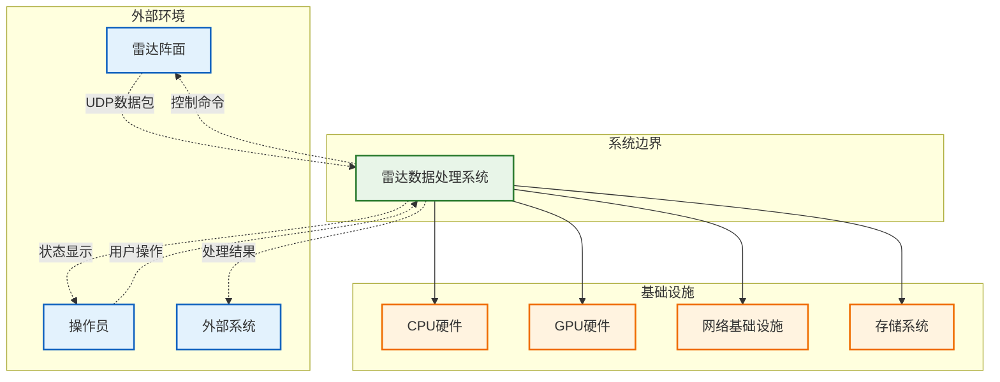

### 2.2 架构分层视图

系统内部的分层组织和层间关系：

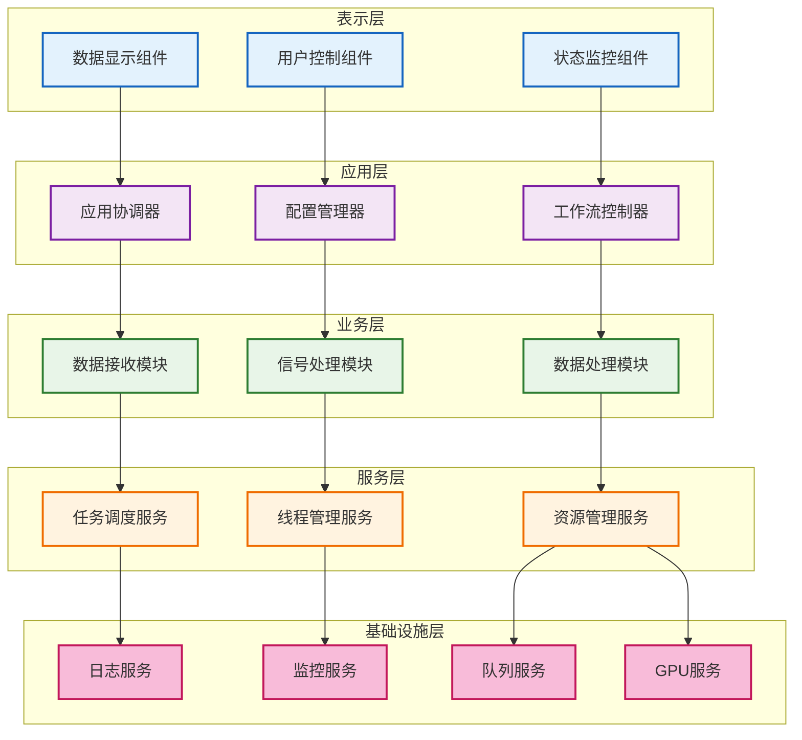

---

## 3 模块架构设计

### 3.1 核心模块组织

系统核心模块的组织结构和内部组件：

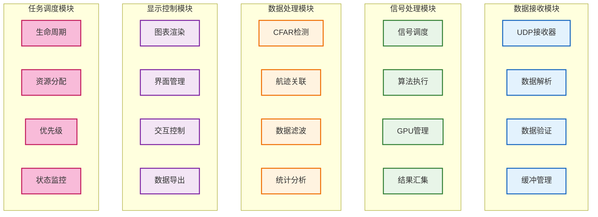

### 3.2 模块职责矩阵

| 模块             | 主要职责               | 输入数据          | 输出数据           | 依赖服务            |
| ---------------- | ---------------------- | ----------------- | ------------------ | ------------------- |
| **数据接收模块** | UDP数据接收和预处理    | 雷达UDP数据包     | 验证后的原始数据   | 网络服务、日志服务  |
| **信号处理模块** | GPU加速信号处理算法    | 原始雷达数据      | 信号处理结果       | GPU服务、线程池服务 |
| **数据处理模块** | CFAR检测和航迹关联     | 信号处理结果      | 目标检测结果       | 算法库、配置服务    |
| **显示控制模块** | 数据可视化和用户交互   | 处理结果数据      | 用户界面显示       | Qt服务、图形服务    |
| **任务调度器**   | 系统生命周期和资源管理 | 系统状态信息      | 调度决策和控制命令 | 监控服务、配置服务  |
| **配置管理模块** | 配置加载、校验、热更新 | 配置文件/更新请求 | 标准化配置对象     | 文件系统、日志服务  |

### 3.3 模块依赖关系

模块间的静态依赖和运行时交互关系：

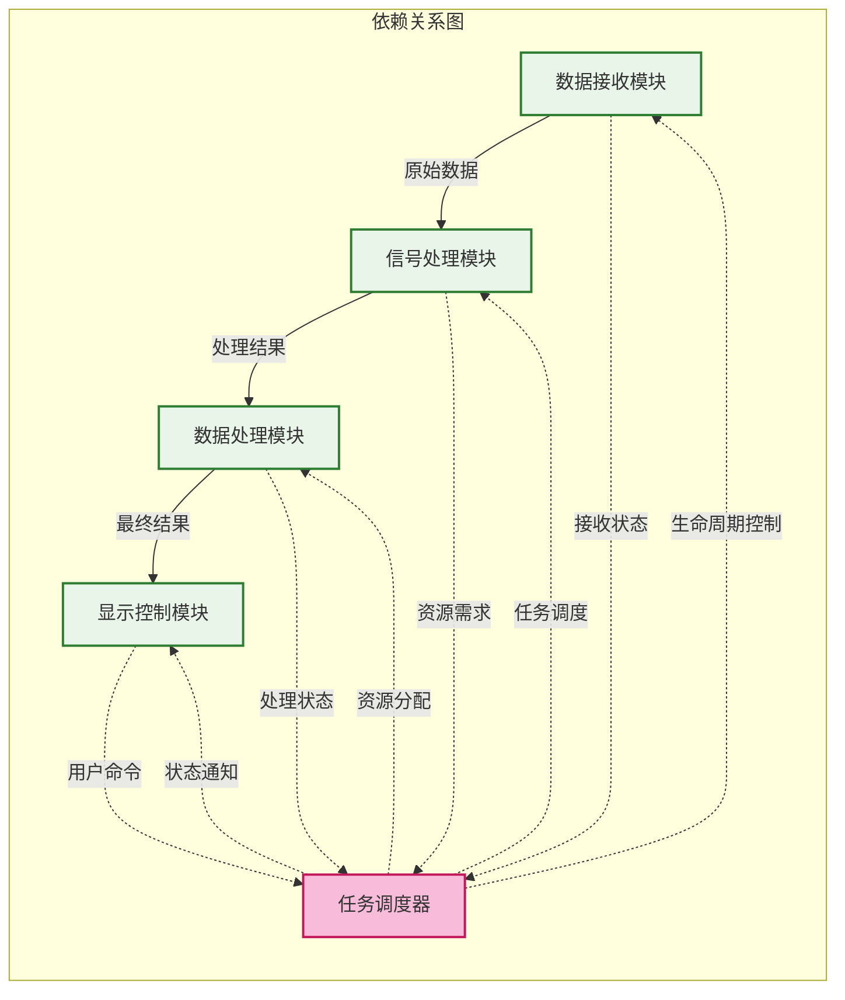

---

## 4 数据流架构

### 4.1 数据流总览

系统中数据的完整流动路径和处理阶段：

```mermaid
flowchart LR
    subgraph "数据流处理架构"
        direction LR

        subgraph "数据输入"
            RADAR_INPUT[雷达阵面数据<br/>UDP Packets]
        end

        subgraph "数据接收阶段"
            RECEIVE_STAGE[接收处理<br/>UDP → Raw Data]
            BUFFER_A[环形缓冲区A<br/>Raw Data Buffer]
        end

        subgraph "信号处理阶段"
            SIGNAL_STAGE[信号处理<br/>Raw Data → Signals]
            BUFFER_B[环形缓冲区B<br/>Signal Buffer]
        end

        subgraph "数据处理阶段"
            DATA_STAGE[数据处理<br/>Signals → Targets]
            RESULT_QUEUE[结果队列<br/>Target Queue]
        end

        subgraph "数据输出"
            DISPLAY_OUTPUT[用户界面<br/>Visualization]
        end

        %% 数据流向
        RADAR_INPUT --> RECEIVE_STAGE
        RECEIVE_STAGE --> BUFFER_A
        BUFFER_A --> SIGNAL_STAGE
        SIGNAL_STAGE --> BUFFER_B
        BUFFER_B --> DATA_STAGE
        DATA_STAGE --> RESULT_QUEUE
        RESULT_QUEUE --> DISPLAY_OUTPUT
    end

    classDef input fill:#e3f2fd,stroke:#1565c0,stroke-width:2px
    classDef process fill:#e8f5e8,stroke:#2e7d32,stroke-width:2px
    classDef buffer fill:#fff3e0,stroke:#ef6c00,stroke-width:2px
    classDef output fill:#f8bbd9,stroke:#c2185b,stroke-width:2px

    class RADAR_INPUT input
    class RECEIVE_STAGE,SIGNAL_STAGE,DATA_STAGE process
    class BUFFER_A,BUFFER_B,RESULT_QUEUE buffer
    class DISPLAY_OUTPUT output
```

### 4.2 数据处理管道

详细的数据处理管道设计和阶段特征：

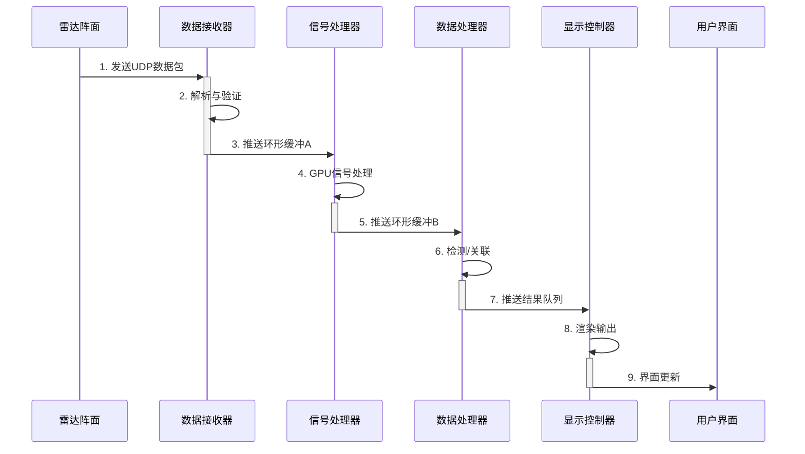

### 4.3 控制流设计

系统控制流和命令传递机制：

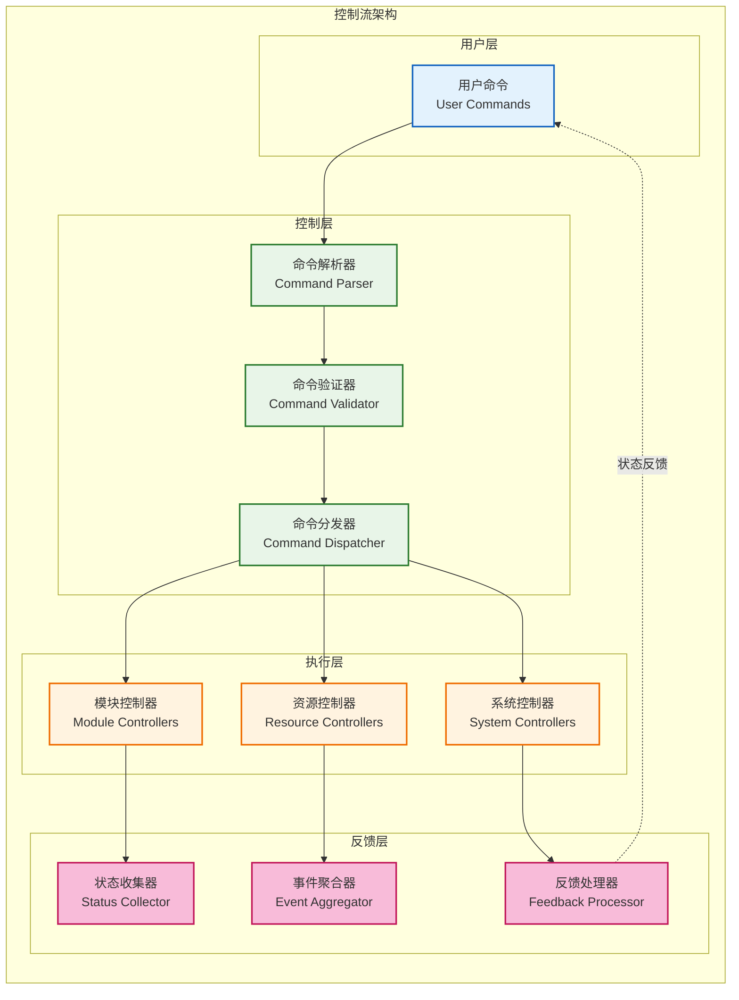

---

## 5 接口架构设计

### 5.1 接口层次模型

系统接口的分层组织和继承关系：

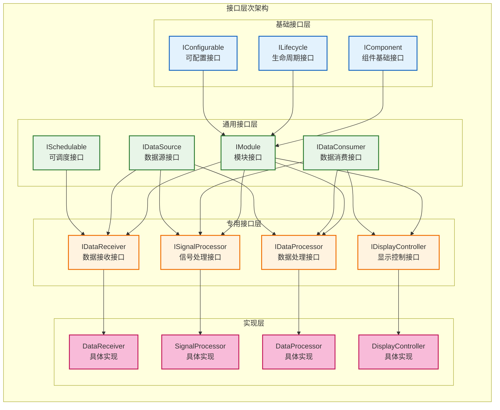

### 5.2 通信协议架构

模块间通信协议和消息传递机制：

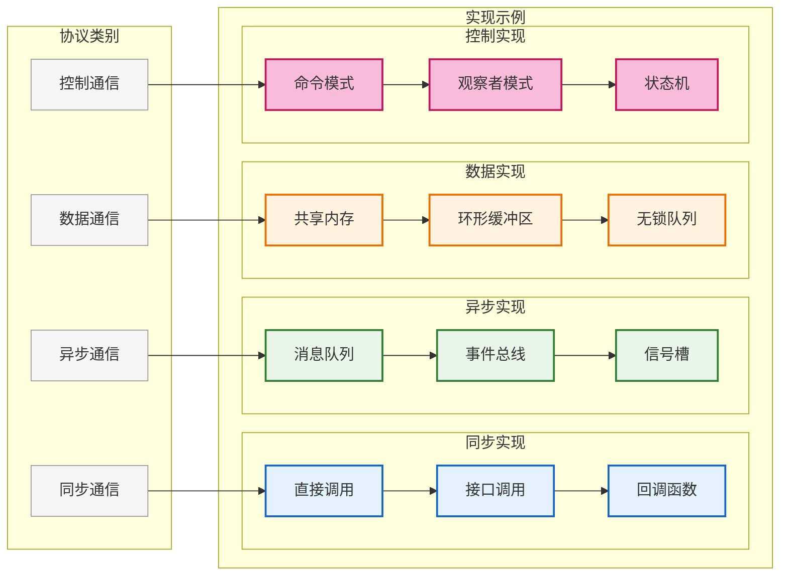

---

## 6 部署架构视图

### 6.1 物理部署架构

系统的物理部署和硬件组织：

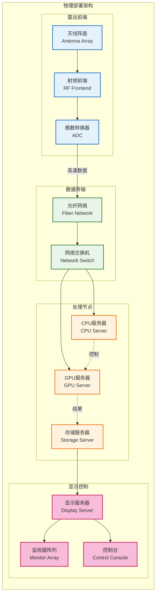

### 6.2 进程组织架构

系统进程和线程的组织结构：

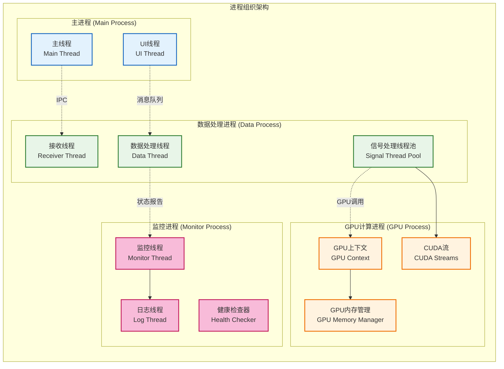

---

## 7 质量属性架构

| 质量属性     | 架构策略              | 关键机制             |
| ------------ | --------------------- | -------------------- |
| **性能**     | 流水线并行 + GPU加速  | 无锁队列、零拷贝     |
| **可靠性**   | 模块隔离 + 错误恢复   | 异常处理、健康检查   |
| **可扩展性** | 插件化架构 + 接口抽象 | 工厂模式、依赖注入   |
| **可维护性** | 分层设计 + 职责分离   | 标准接口、配置外部化 |
| **可测试性** | 模块解耦 + 依赖注入   | Mock对象、接口隔离   |
| **安全性**   | 数据验证 + 权限控制   | 输入验证、访问控制   |

---

## 8 架构约束说明

**设计约束**：
- 必须支持实时数据处理，端到端延迟不超过10ms
- 必须充分利用GPU并行计算能力，GPU利用率>80%
- 必须采用模块化设计，支持独立开发和测试
- 必须支持跨平台部署（Linux/Windows）

**技术约束**：
- 编程语言限定为C++17和CUDA C++
- GUI框架限定为Qt 6.5+
- GPU计算平台限定为NVIDIA CUDA
- 构建系统限定为CMake 3.20+

**资源约束**：
- 系统内存使用率不超过80%
- CPU使用率不超过70%
- 网络带宽需求不超过10Gbps
- 存储空间需求不超过1TB

**运行环境约束**：
- 支持Ubuntu 22.04 LTS和Windows 10/11
- 需要NVIDIA GPU（计算能力6.0+）
- 需要CUDA Toolkit 12.8.1环境
- 需要网络连接支持UDP协议

---

## 9 相关文档

- [系统总体架构设计](00_总体架构设计.md)
- [技术选型与平台](02_技术选型与平台.md)
- [需求分析与MVP目标](01_需求分析与目标.md)
- [核心设计原则](04_核心设计原则.md)

---

## 10 变更历史

| 版本   | 日期       | 作者    | 变更描述                                                                                                                              |
| ------ | ---------- | ------- | ------------------------------------------------------------------------------------------------------------------------------------- |
| v1.0.0 | 2025-09-22 | Copilot | 基于MVP设计文档创建系统架构总览，包含完整的架构视图和设计说明                                                                         |
| v1.1.0 | 2025-09-22 | Copilot | 增加CPU节点；移除层英文标签；垂直化模块布局；补充配置管理模块；去除延迟注释；通信协议改纵向；重构物理部署图；精简质量属性表；版本升级 |

---

*本系统架构总览为雷达数据处理系统的详细设计和实施提供架构指导，确保系统设计的一致性和完整性。*
