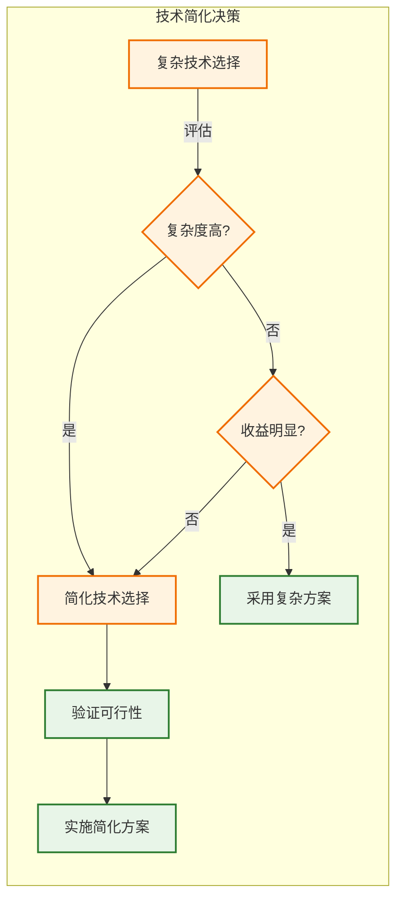
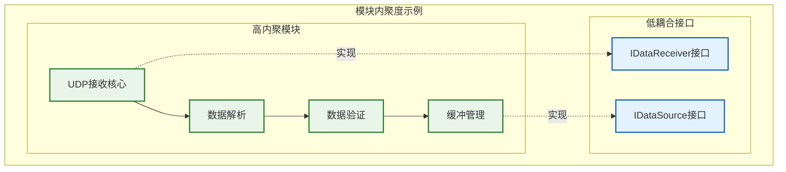
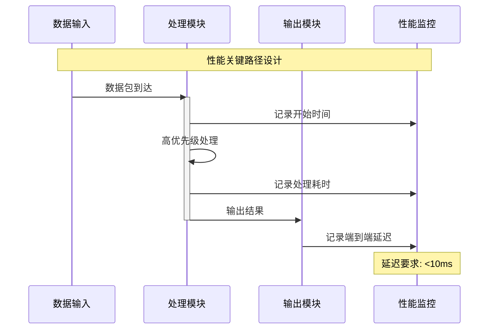
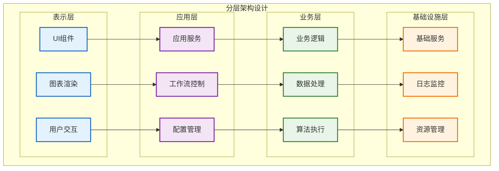
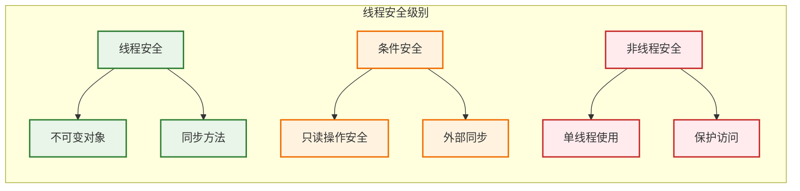
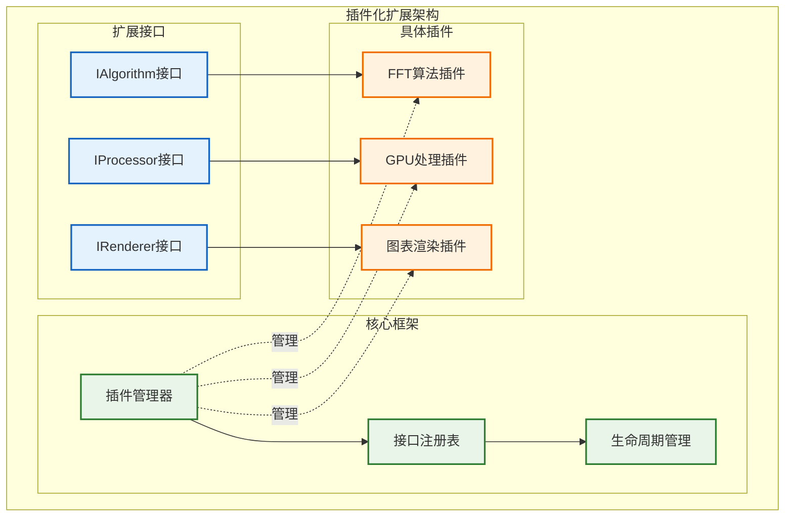
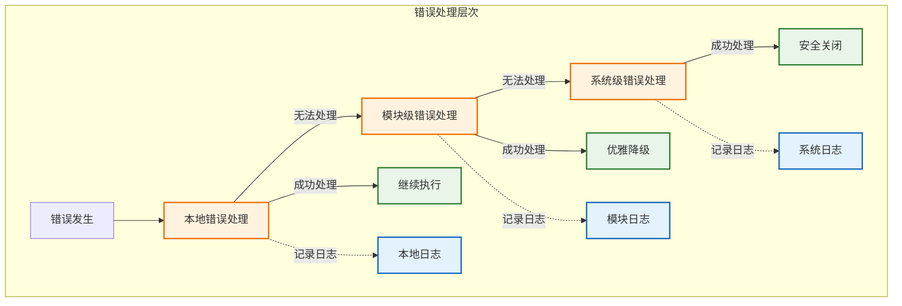
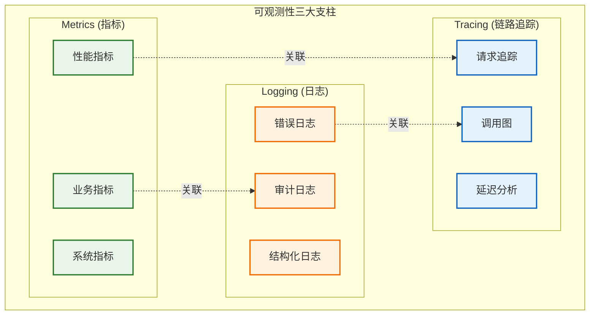
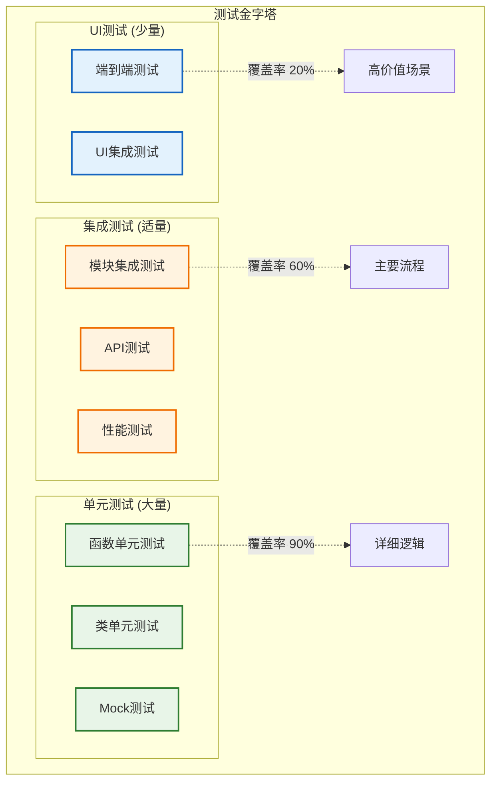
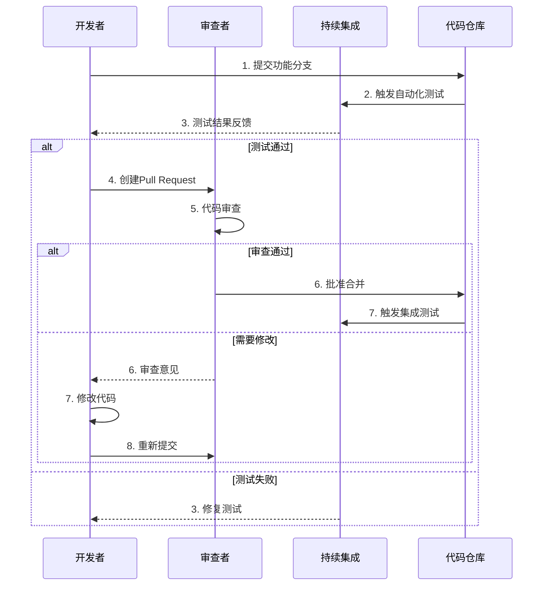

# 核心设计原则

**文档版本**: v1.1.0
**最后更新**: 2025-09-22
**负责人**: Kelin
**适用阶段**: MVP及向 V2.0 性能优化过渡阶段
**来源依据**: 基于《[MVP系统设计文档](../MVP系统设计文档.md)》第3章核心设计原则和相关技术规范

---

## 1 文档职责

本文件定义雷达数据处理系统的核心设计原则和实施准则，覆盖：
1) 软件设计的基本原则和约束
2) 模块化设计的具体实践指南
3) 性能和可靠性设计准则
4) 接口设计和演进策略
5) 代码质量和可维护性要求
6) 团队协作和开发流程原则

已明确不在本文件范围内的内容：具体的编码实现细节、技术选型决策、硬件配置等（这些在相应的专项文档中维护）。

### 1.1 目录

- [核心设计原则](#核心设计原则)
  - [1 文档职责](#1-文档职责)
    - [1.1 目录](#11-目录)
  - [2 设计原则概述](#2-设计原则概述)
    - [2.1 原则体系结构](#21-原则体系结构)
  - [3 核心设计原则](#3-核心设计原则)
    - [3.1 简化优先原则](#31-简化优先原则)
    - [3.1.1 简化策略](#311-简化策略)
    - [3.2 模块化设计原则](#32-模块化设计原则)
    - [3.2.1 模块分离策略](#321-模块分离策略)
    - [3.2.2 接口设计准则](#322-接口设计准则)
    - [3.3 性能导向原则](#33-性能导向原则)
    - [3.3.1 性能设计策略](#331-性能设计策略)
    - [3.3.2 资源优化方针](#332-资源优化方针)
  - [4 架构设计原则](#4-架构设计原则)
    - [4.1 分层架构原则](#41-分层架构原则)
    - [4.1.1 层次职责分工](#411-层次职责分工)
    - [4.1.2 层间通信规范](#412-层间通信规范)
    - [4.2 并发设计原则](#42-并发设计原则)
    - [4.2.1 线程安全策略](#421-线程安全策略)
    - [4.2.2 并发模式选择](#422-并发模式选择)
    - [4.3 可扩展性原则](#43-可扩展性原则)
    - [4.3.1 扩展点设计](#431-扩展点设计)
    - [4.3.2 兼容性保证](#432-兼容性保证)
  - [5 质量保证原则](#5-质量保证原则)
    - [5.1 可靠性设计原则](#51-可靠性设计原则)
    - [5.1.1 错误处理策略](#511-错误处理策略)
    - [5.1.2 容错机制设计](#512-容错机制设计)
    - [5.2 可观测性原则](#52-可观测性原则)
    - [5.2.1 监控设计策略](#521-监控设计策略)
    - [5.2.2 日志记录规范](#522-日志记录规范)
    - [5.3 可维护性原则](#53-可维护性原则)
    - [5.3.1 代码组织策略](#531-代码组织策略)
    - [5.3.2 文档同步要求](#532-文档同步要求)
  - [6 开发实践原则](#6-开发实践原则)
    - [6.1 代码质量原则](#61-代码质量原则)
    - [6.1.1 编码标准](#611-编码标准)
    - [6.1.2 测试策略](#612-测试策略)
    - [6.2 团队协作原则](#62-团队协作原则)
    - [6.2.1 协作流程](#621-协作流程)
    - [6.2.2 知识共享](#622-知识共享)
  - [7 原则实施与冲突处理](#7-原则实施与冲突处理)
  - [8 相关文档](#8-相关文档)
  - [9 变更历史](#9-变更历史)

---

## 2 设计原则概述

### 2.1 原则体系结构

雷达数据处理系统的设计原则形成了一个层次化的体系，确保从宏观架构到微观实现的一致性。
    root)核心设计原则体系(
        基础原则
            简化优先
                MVP导向
                渐进式复杂化id
                核心功能优先
            模块化设计体系(
                单一职责
                高内聚低耦合
                接口驱动导向
            性能导向杂化
                实时处理优先
                资源高效利用
                并行计算充分利用职责
        架构原则
            分层架构
                职责清晰
                依赖单向实时处理优先
                接口标准化高效利用
            并发设计充分利用
                线程安全
                无锁优化
                异步处理清晰
            可扩展性
                插件化架构化
                配置驱动
                版本兼容安全
        质量原则
            可靠性
                错误处理
                容错恢复插件化架构
                数据完整性置驱动
            可观测性
                全面监控
                结构化日志
                性能度量处理
            可维护性
                代码清晰
      可观测性
                文档同步
                标准化流程化日志
```

### 2.2 原则优先级
     文档同步
当设计原则之间发生冲突时，按照以下优先级进行决策：        标准化流程

```mermaid
flowchart TB
        subgraph "原则优先级决策树"
                SAFETY[安全性和正确性<br/>最高优先级]突时，按照以下优先级进行决策：
                PERFORMANCE[性能要求<br/>高优先级]
                MAINTAINABILITY[可维护性<br/>中等优先级]
                DEVELOPMENT_SPEED[开发速度<br/>较低优先级]

                SAFETY --> PERFORMANCE
        PERFORMANCE[性能要求<br/>高优先级]
        MAINTAINABILITY[可维护性<br/>中等优先级]
        DEVELOPMENT_SPEED[开发速度<br/>较低优先级]

        SAFETY --> PERFORMANCE
        PERFORMANCE --> MAINTAINABILITY
        MAINTAINABILITY --> DEVELOPMENT_SPEED

        SAFETY -.->|如果冲突| DECISION_SAFETY[优先保证系统安全]
        PERFORMANCE -.->|如果冲突| DECISION_PERF[性能关键路径优先]
        MAINTAINABILITY -.->|如果冲突| DECISION_MAINTAIN[长期维护性优先]
    end

    classDef highest fill:#ffebee,stroke:#c62828,stroke-width:2px
    classDef high fill:#fff3e0,stroke:#ef6c00,stroke-width:2px
    classDef medium fill:#e8f5e8,stroke:#2e7d32,stroke-width:2px
    classDef lower fill:#e3f2fd,stroke:#1565c0,stroke-width:2px

    class SAFETY,DECISION_SAFETY highest
    class PERFORMANCE,DECISION_PERF high
    class MAINTAINABILITY,DECISION_MAINTAIN medium
    class DEVELOPMENT_SPEED lower
```

---

## 3 核心设计原则

### 3.1 简化优先原则

简化优先是MVP阶段的核心指导思想，通过有意识地限制复杂度来确保项目的成功交付。

### 3.1.1 简化策略

**功能简化策略**：
- **核心功能优先**：专注于数据流转和任务调度的核心验证
- **算法模拟**：使用简化的算法模拟器代替复杂的信号处理算法
- **界面精简**：提供基本的数据可视化，暂不实现复杂的交互功能
- **配置简化**：使用静态配置文件，避免动态配置界面的复杂性

**技术简化策略**：


### 3.2 模块化设计原则

模块化设计是系统可维护性和可扩展性的基础，通过清晰的模块边界和标准化接口实现。

### 3.2.1 模块分离策略

**单一职责原则实施**：
```cpp
/**
 * @brief 数据接收模块（示例）
 * @details 该类示例展示如何实现单一职责的模块：只负责接收与初步解析数据。
 *
 * @note 这是一个接口/示例，真实实现应使用项目中定义的 `IModule` 接口和项目特定类型（如 RawDataPacket 等）。
 */
class DataReceiver : public IModule {
public:
    /**
     * @brief 接收数据包并写入到提供的 packet 对象
     *
     * @param[out] packet 用于返回接收到的原始数据包（按项目类型定义）
     * @return ErrorCode 返回错误码；SystemErrors::SUCCESS 表示成功
     */
    ErrorCode receiveData(RawDataPacket& packet);

    /**
     * @brief 配置网络相关参数（如绑定端口、缓冲大小等）
     *
     * @param[in] config 网络配置结构体（NetworkConfig）
     * @return ErrorCode 返回错误码；SystemErrors::SUCCESS 表示成功
     */
    ErrorCode configureNetwork(const NetworkConfig& config);

    /**
     * @brief 获取网络/接收统计信息
     *
     * @return NetworkStatistics 返回统计信息快照（按值或 const 引用，视实际实现而定）
     */
    NetworkStatistics getStatistics() const;
};

/**
 * 错误示例：请避免将接收、处理和显示混合在一个类中。
 */
class DataHandler {
public:
    // 不推荐：职责混合导致难以测试与维护
    ErrorCode receiveData();        // 接收职责
    ErrorCode processData();        // 处理职责
    ErrorCode displayResults();     // 显示职责 - 职责过多
};
```

**高内聚低耦合实现**：


### 3.2.2 接口设计准则

**接口设计标准**：
- **稳定性优先**：接口一旦发布，保持向后兼容
- **最小化原则**：接口只暴露必要的功能
- **一致性要求**：相似功能使用相似的接口模式
- **异常安全**：所有接口都要有明确的错误处理机制

**接口演进策略**：
```cpp
namespace radar::v1 {
/**
 * @brief v1 版本的数据处理器接口
 *
 * @details 该接口定义了最小的单数据处理方法，所有实现应返回 ErrorCode 并使用项目统一的 ErrorCode 定义。
 */
class IDataProcessor {
public:
    /**
     * @brief 处理单个输入数据并写出处理结果
     *
     * @param[in] input 输入数据（RawData 类型，由项目统一定义）
     * @param[out] output 处理结果（ProcessedData 类型，由项目统一定义）
     * @return ErrorCode 返回错误码；SystemErrors::SUCCESS 表示成功
     */
    virtual ErrorCode processData(const RawData& input, ProcessedData& output) = 0;
    virtual ~IDataProcessor() = default;
};
}

namespace radar::v2 {
/**
 * @brief v2 版本的数据处理器接口，向后兼容 v1
 *
 * @details 继承自 v1::IDataProcessor，新增批量处理接口以提高吞吐量。
 */
class IDataProcessor : public radar::v1::IDataProcessor {
public:
    /**
     * @brief 批量处理多个输入并返回对应输出集合
     *
     * @param[in] inputs 输入数据集合
     * @param[out] outputs 输出结果集合，长度应与 inputs 对应
     * @return ErrorCode 返回错误码；SystemErrors::SUCCESS 表示成功
     */
    virtual ErrorCode processBatch(
        const std::vector<RawData>& inputs,
        std::vector<ProcessedData>& outputs) = 0;
    virtual ~IDataProcessor() = default;
};
}
```

### 3.3 性能导向原则

性能导向原则确保系统能够满足实时处理的严格要求。

### 3.3.1 性能设计策略

**实时性保证策略**：


**内存效率策略**：
- **预分配策略**：关键路径上避免动态内存分配
- **对象池模式**：重用昂贵对象，减少创建销毁开销
- **零拷贝设计**：数据在模块间传递时避免不必要的拷贝
- **内存对齐**：利用CPU缓存行对齐优化内存访问

### 3.3.2 资源优化方针

**CPU资源优化**：
```yaml
并行化策略:
  数据并行: 将大数据集分块并行处理
  任务并行: 不同处理阶段流水线并行
  线程池管理: 避免线程创建销毁开销
  CPU亲和性: 绑定关键线程到特定核心

缓存优化:
  数据局部性: 优化数据结构布局
  指令局部性: 减少分支预测失败
  缓存友好: 顺序访问内存模式
```

**GPU资源优化**：
```yaml
GPU计算优化:
  内存合并: 确保内存访问模式优化
  占用率最大化: 平衡线程块大小和寄存器使用
  流水线并行: 计算与数据传输重叠
  统一内存: 简化内存管理同时保持性能
```

---

## 4 架构设计原则

### 4.1 分层架构原则

分层架构通过明确的层次划分实现系统的可理解性和可维护性。

### 4.1.1 层次职责分工

**分层设计模型**：


### 4.1.2 层间通信规范

**通信约束规则**：
- **单向依赖**：上层可以依赖下层，下层不能依赖上层
- **跨层禁止**：不允许跨层直接调用，必须通过相邻层
- **接口抽象**：层间通信必须通过抽象接口
- **依赖注入**：使用依赖注入减少层间耦合

### 4.2 并发设计原则

并发设计确保系统能够充分利用多核和GPU资源。

### 4.2.1 线程安全策略

**线程安全级别定义**：


**无锁编程指导**：
```cpp
/**
 * @brief 一个轻量级的无锁环形缓冲区示例（演示目的）
 *
 * @tparam T 存储类型
 * @tparam Capacity 环形缓冲区容量（必须大于 1）
 *
 * @note 该示例仅用于说明无锁思路，真实生产环境需考虑 ABA 问题、内存屏障和内存模型、以及多生产者/多消费者的扩展性等。
 */
template<typename T, size_t Capacity>
class LockFreeRingBuffer {
private:
    alignas(64) std::array<T, Capacity> buffer_; ///< 内部缓冲区，缓存行对齐以减少伪共享
    alignas(64) std::atomic<size_t> head_{0};  ///< 生产者索引（下一个写入位置）
    alignas(64) std::atomic<size_t> tail_{0};  ///< 消费者索引（下一个读取位置）

public:
    /**
     * @brief 尝试将一项压入环形缓冲区
     *
     * @param[in] item 要写入的项（按 const 引用传递以避免拷贝开销）
     * @return true 表示成功写入；false 表示缓冲区已满且写入失败
     */
    bool try_push(const T& item) {
        const size_t current_head = head_.load(std::memory_order_relaxed);
        const size_t next_head = (current_head + 1) % Capacity;

        if (next_head == tail_.load(std::memory_order_acquire)) {
            return false; // 缓冲区满
        }

        buffer_[current_head] = item; // 赋值/拷贝（生产者语义）
        head_.store(next_head, std::memory_order_release);
        return true;
    }
};
```

### 4.2.2 并发模式选择

**并发模式决策矩阵**：

| 场景类型     | 推荐模式  | 适用条件          | 注意事项                |
| ------------ | --------- | ----------------- | ----------------------- |
| **I/O密集**  | 异步I/O   | 网络/文件操作频繁 | 避免阻塞主线程          |
| **CPU密集**  | 线程池    | 可并行计算任务    | 控制线程数量避免过载    |
| **生产消费** | 无锁队列  | 高频数据传输      | 内存序约束，避免ABA问题 |
| **协调控制** | Actor模型 | 复杂状态管理      | 消息传递开销            |
| **GPU计算**  | 异步流    | 大规模并行计算    | 内存传输与计算重叠      |

### 4.3 可扩展性原则

可扩展性设计为系统的长期演进提供支撑。

### 4.3.1 扩展点设计

**插件化架构设计**：


### 4.3.2 兼容性保证

**版本兼容性策略**：
- **语义化版本**：遵循SemVer规范进行版本管理
- **废弃策略**：功能废弃前至少保留两个版本周期
- **迁移指导**：提供详细的版本升级指导文档
- **兼容性测试**：建立自动化的兼容性测试套件

---

## 5 质量保证原则

### 5.1 可靠性设计原则

可靠性是雷达系统的生命线，必须从设计阶段就充分考虑。

### 5.1.1 错误处理策略

**分层错误处理模型**：


**错误码设计规范**：
```cpp
/**
 * @brief 全局错误码定义（示例）
 *
 * @note 实际项目中请使用 `include/common/error_codes.h` 中定义的 ErrorCode ，
 * 这里为文档示例展示常用分组和范围。
 */
enum class ErrorCode : int {
    /** 成功状态 */
    SUCCESS = 0,

    /**
     * 系统级错误 (1-99)
     * @note 系统级错误通常表示需要全局或启动级别处理
     */
    SYSTEM_INITIALIZATION_FAILED = 1, ///< 系统初始化失败
    SYSTEM_SHUTDOWN_FAILED = 2,       ///< 系统关闭失败
    SYSTEM_OUT_OF_MEMORY = 3,         ///< 系统内存不足

    /**
     * 模块级错误 (100-999)
     * 数据接收模块错误 (100-199)
     */
    DATA_RECEIVER_NETWORK_ERROR = 100, ///< 网络错误
    DATA_RECEIVER_PARSE_ERROR = 101,   ///< 数据解析错误
    DATA_RECEIVER_BUFFER_FULL = 102,   ///< 缓冲区已满

    /** 信号处理模块错误 (200-299) */
    SIGNAL_PROCESSOR_GPU_ERROR = 200,      ///< GPU 错误
    SIGNAL_PROCESSOR_ALGORITHM_ERROR = 201,///< 算法执行错误

    /** 本地操作错误 (1000+) */
    INVALID_PARAMETER = 1000, ///< 参数错误
    TIMEOUT = 1001,           ///< 操作超时
    RESOURCE_BUSY = 1002      ///< 资源被占用
};
```

### 5.1.2 容错机制设计

**容错策略实现**：
- **超时机制**：所有异步操作都必须有超时保护
- **重试策略**：对可恢复错误实施指数退避重试
- **断路器模式**：防止级联故障的快速失败机制
- **健康检查**：定期检查系统组件健康状态

### 5.2 可观测性原则

可观测性使系统的运行状态透明化，便于问题诊断和性能优化。

### 5.2.1 监控设计策略

**三大支柱监控架构**：


### 5.2.2 日志记录规范

**结构化日志设计**：
```cpp
/**
 * @brief 日志宏封装（文档示例）
 *
 * @note 实际实现应使用 spdlog 或项目封装，宏仅为示例；
 *       保证传入的 format 与参数类型在编译期/运行期匹配。
 */
#define RADAR_LOG(level, format, ...) \
    Logger::getInstance().log(level, __FILE__, __LINE__, format, ##__VA_ARGS__)

/**
 * @brief 信息级别日志
 * @param format printf 风格格式串
 */
#define RADAR_INFO(format, ...) RADAR_LOG(LogLevel::INFO, format, ##__VA_ARGS__)

/**
 * @brief 警告级别日志
 */
#define RADAR_WARN(format, ...) RADAR_LOG(LogLevel::WARN, format, ##__VA_ARGS__)

/**
 * @brief 错误级别日志
 */
#define RADAR_ERROR(format, ...) RADAR_LOG(LogLevel::ERROR, format, ##__VA_ARGS__)

// 使用示例（文档）
// RADAR_INFO("Data processing completed: packets={}, duration={}ms", packet_count, duration_ms);
```

### 5.3 可维护性原则

可维护性确保系统在长期演进过程中保持健康状态。

### 5.3.1 代码组织策略

**代码组织层次**：
- **命名空间管理**：使用有意义的命名空间避免命名冲突
- **文件组织**：按功能模块组织文件，保持目录结构清晰
- **依赖管理**：明确模块间依赖关系，避免循环依赖
- **接口隔离**：使用小而专门的接口，而非大而全的接口

### 5.3.2 文档同步要求

**文档维护策略**：
- **代码即文档**：重要的设计决策在代码中用注释说明
- **API文档自动化**：使用Doxygen等工具自动生成API文档
- **设计文档同步**：架构变更必须同步更新设计文档
- **变更记录维护**：每次重要变更都要记录在CHANGELOG中

---

## 6 开发实践原则

### 6.1 代码质量原则

代码质量是系统长期健康的基础保障。

### 6.1.1 编码标准

**核心编码要求**：
- **一致性**：整个项目使用统一的编码风格
- **可读性**：代码应该是自说明的，减少理解成本
- **简洁性**：避免不必要的复杂性和冗余代码
- **健壮性**：充分考虑边界条件和异常情况

### 6.1.2 测试策略

**测试金字塔实践**：


### 6.2 团队协作原则

有效的团队协作是项目成功的关键因素。

### 6.2.1 协作流程

**代码审查流程**：


### 6.2.2 知识共享

**知识共享机制**：
- **技术分享会**：定期举行技术分享，传播最佳实践
- **代码评审**：通过代码评审进行知识传递和经验分享
- **文档维护**：建立完善的技术文档库和知识库
- **结对编程**：在关键模块开发中使用结对编程

---

## 7 原则实施与冲突处理

**原则落地检查清单**：

- [ ] **设计阶段**：每个设计决策都有明确的原则依据
- [ ] **编码阶段**：代码实现遵循编码规范和设计原则
- [ ] **审查阶段**：代码审查时检查原则遵循情况
- [ ] **测试阶段**：测试用例覆盖原则要求的场景
- [ ] **部署阶段**：部署配置符合可观测性要求
- [ ] **运维阶段**：监控指标能够反映原则执行情况

**原则培训要求**：
- 新团队成员必须接受设计原则培训
- 定期组织设计原则的讨论和更新
- 在项目关键节点进行原则遵循情况回顾

**原则冲突处理**：
当多个原则发生冲突时按照以下步骤进行处理：

1. **明确冲突原因**：分析造成原则冲突的根本原因
2. **评估影响范围**：评估不同选择对系统的长远影响
3. **参考优先级**：按照文档中定义的原则优先级进行决策
4. **寻求平衡方案**：尽可能找到满足多个原则的平衡方案
5. **记录决策过程**：将决策过程和理由记录在架构决策记录（ADR）中
6. **定期评估**：在后续迭代中重新评估决策的合理性

---

## 8 相关文档

- [系统总体架构设计](00_总体架构设计.md)
- [技术选型与平台](02_技术选型与平台.md)
- [系统架构总览](03_系统架构总览.md)
- [编码规范与代码风格指南](../../03_技术规范/编码规范与代码风格指南.md)
- [架构与模块化开发规范](../../03_技术规范/架构与模块化开发规范.md)

---

## 9 变更历史

| 版本   | 日期       | 作者    | 变更描述                                                                    |
| ------ | ---------- | ------- | --------------------------------------------------------------------------- |
| v1.0.0 | 2025-09-22 | Copilot | 基于MVP设计文档和技术规范创建核心设计原则，包含完整的原则体系和实施指导     |
| v1.1.0 | 2025-09-22 | Copilot | 更新：移除部分章节、合并实施与冲突处理章节；为文中示例代码添加 Doxygen 注释 |

---

*本核心设计原则文档为雷达数据处理系统的设计和开发提供根本指导，确保系统架构的一致性和代码质量的可持续性。*
