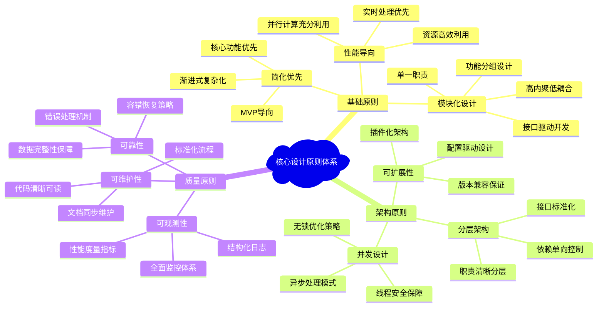
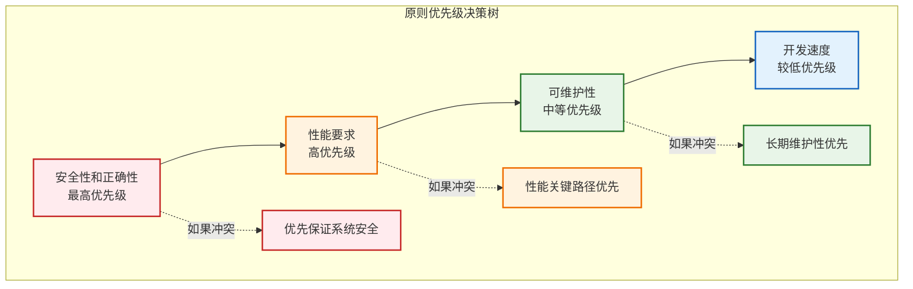
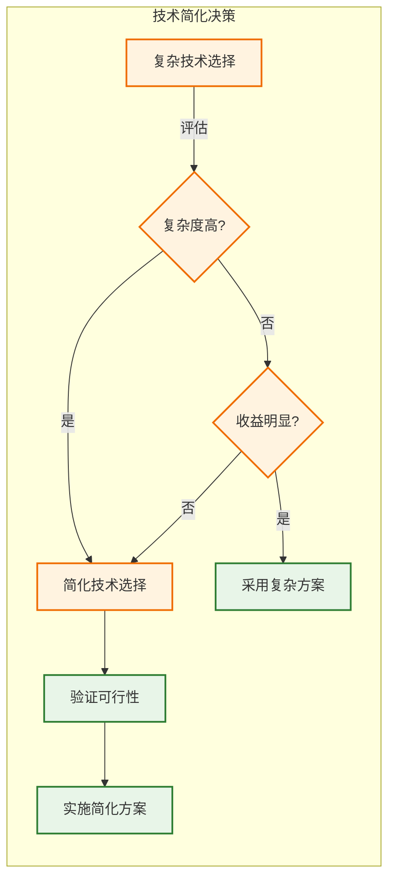
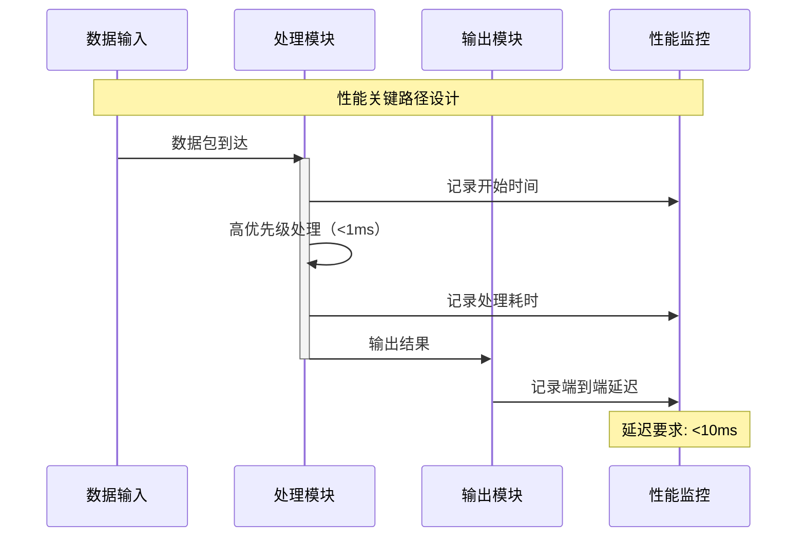
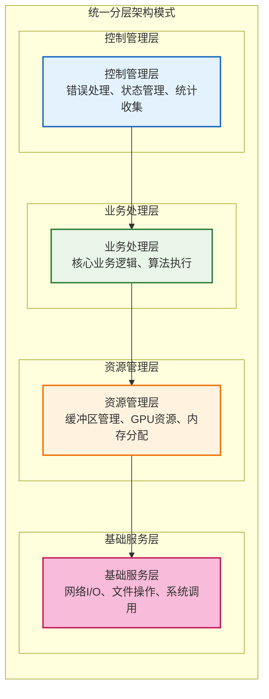
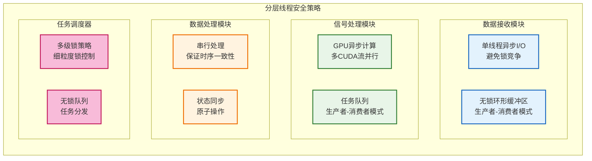
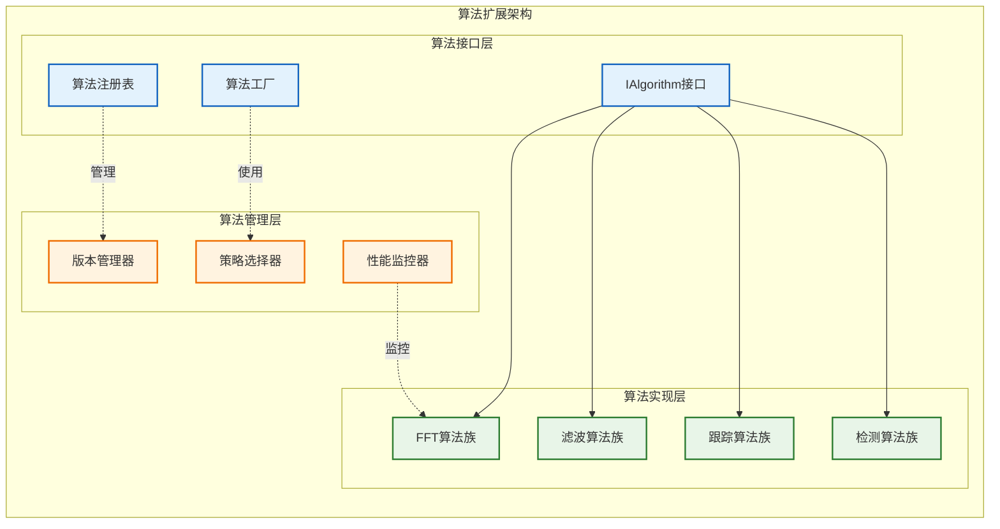
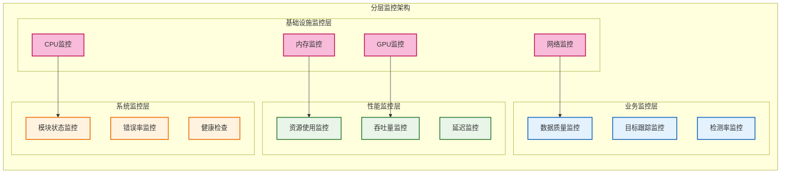
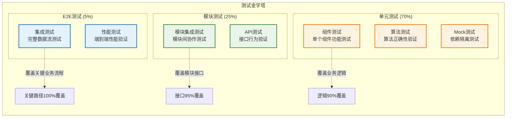
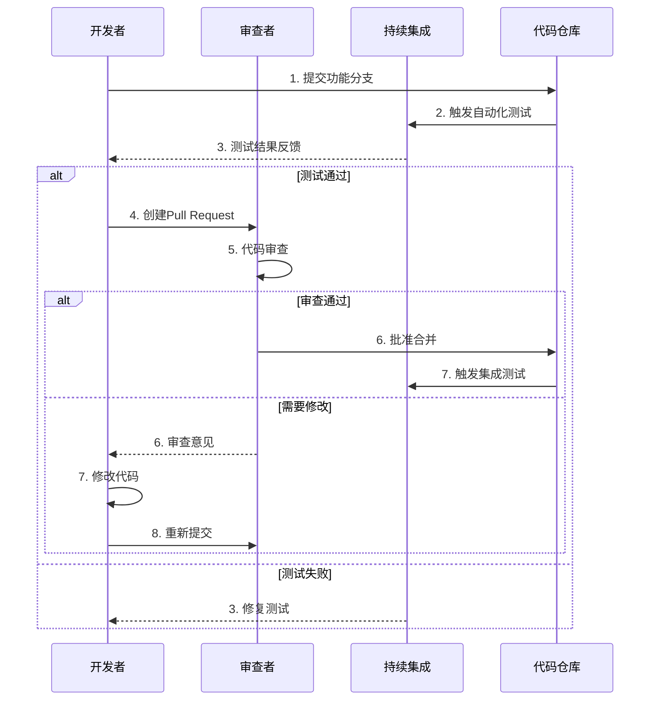

# 核心设计原则

**文档版本**: v1.2.0
**最后更新**: 2025-09-23
**负责人**: Klein
**适用阶段**: MVP及向 V2.0 性能优化过渡阶段
**来源依据**: 基于《[MVP系统设计文档](../MVP系统设计文档.md)》第3章核心设计原则和相关技术规范，结合实际模块设计实践

---

## 1 文档职责

本文件定义雷达数据处理系统的核心设计原则和实施准则，覆盖：
1) 软件设计的基本原则和约束
2) 模块化设计的具体实践指南
3) 性能和可靠性设计准则
4) 接口设计和演进策略
5) 代码质量和可维护性要求
6) 团队协作和开发流程原则

已明确不在本文件范围内的内容：具体的编码实现细节、技术选型决策、硬件配置等（这些在相应的专项文档中维护）。

### 1.1 目录

- [核心设计原则](#核心设计原则)
  - [1 文档职责](#1-文档职责)
    - [1.1 目录](#11-目录)
  - [2 设计原则概述](#2-设计原则概述)
    - [2.1 原则体系结构](#21-原则体系结构)
    - [2.2 原则优先级](#22-原则优先级)
  - [3 核心设计原则](#3-核心设计原则)
    - [3.1 简化优先原则](#31-简化优先原则)
    - [3.1.1 简化策略](#311-简化策略)
    - [3.2 模块化设计原则](#32-模块化设计原则)
    - [3.2.1 模块分离策略](#321-模块分离策略)
    - [3.2.2 接口设计准则](#322-接口设计准则)
    - [3.3 性能导向原则](#33-性能导向原则)
    - [3.3.1 性能设计策略](#331-性能设计策略)
    - [3.3.2 资源优化方针](#332-资源优化方针)
  - [4 架构设计原则](#4-架构设计原则)
    - [4.1 分层架构原则](#41-分层架构原则)
    - [4.1.1 层次职责分工](#411-层次职责分工)
    - [4.1.2 层间通信规范](#412-层间通信规范)
    - [4.2 并发设计原则](#42-并发设计原则)
    - [4.2.1 线程安全策略](#421-线程安全策略)
    - [4.2.2 并发模式选择](#422-并发模式选择)
    - [4.3 可扩展性原则](#43-可扩展性原则)
    - [4.3.1 扩展点设计](#431-扩展点设计)
    - [4.3.2 兼容性保证](#432-兼容性保证)
  - [5 质量保证原则](#5-质量保证原则)
    - [5.1 可靠性设计原则](#51-可靠性设计原则)
    - [5.1.1 错误处理策略](#511-错误处理策略)
    - [5.1.2 容错机制设计](#512-容错机制设计)
    - [5.2 可观测性原则](#52-可观测性原则)
    - [5.2.1 监控设计策略](#521-监控设计策略)
    - [5.2.2 日志记录规范](#522-日志记录规范)
    - [5.3 可维护性原则](#53-可维护性原则)
    - [5.3.1 代码组织策略](#531-代码组织策略)
    - [5.3.2 文档同步要求](#532-文档同步要求)
  - [6 开发实践原则](#6-开发实践原则)
    - [6.1 代码质量原则](#61-代码质量原则)
    - [6.1.1 编码标准](#611-编码标准)
    - [6.1.2 测试策略](#612-测试策略)
    - [6.2 团队协作原则](#62-团队协作原则)
    - [6.2.1 协作流程](#621-协作流程)
    - [6.2.2 知识共享](#622-知识共享)
  - [7 原则实施与冲突处理](#7-原则实施与冲突处理)
  - [8 相关文档](#8-相关文档)
  - [9 变更历史](#9-变更历史)

---

## 2 设计原则概述

### 2.1 原则体系结构

雷达数据处理系统的设计原则形成了一个层次化的体系，确保从宏观架构到微观实现的一致性。



### 2.2 原则优先级

当设计原则之间发生冲突时，按照以下优先级进行决策：



---

## 3 核心设计原则

### 3.1 简化优先原则

简化优先是MVP阶段的核心指导思想，通过有意识地限制复杂度来确保项目的成功交付。

### 3.1.1 简化策略

**功能简化策略**：
- **核心功能优先**：专注于数据流转和任务调度的核心验证
- **算法模拟**：使用简化的算法模拟器代替复杂的信号处理算法
- **界面精简**：提供基本的数据可视化，暂不实现复杂的交互功能
- **配置简化**：使用静态配置文件，避免动态配置界面的复杂性

**技术简化策略**：


### 3.2 模块化设计原则

模块化设计是系统可维护性和可扩展性的基础，通过清晰的模块边界和标准化接口实现。

### 3.2.1 模块分离策略

**功能分组设计原则**：
基于实际模块设计，采用功能分组的方式组织模块内部组件，确保职责清晰：

```cpp
/**
 * @brief 数据接收模块示例（功能分组设计）
 * @details 该类示例展示功能分组的模块设计：按职责将组件归类到不同功能层
 *
 * @note 使用项目中定义的 `IModule` 接口和项目特定类型
 */
class DataReceiver : public IModule {
public:
    /**
     * @brief 网络接收层组件
     * @details 负责UDP网络数据接收和Socket管理
     */
    struct NetworkLayer {
        std::unique_ptr<UDPListener> listener;       ///< UDP监听器
        std::unique_ptr<PacketReceiver> receiver;    ///< 数据包接收器
        std::unique_ptr<NetworkBuffer> buffer;       ///< 网络缓冲区
    };

    /**
     * @brief 数据处理层组件
     * @details 负责数据包解析、验证和格式转换
     */
    struct ProcessingLayer {
        std::unique_ptr<PacketParser> parser;        ///< 数据包解析器
        std::unique_ptr<DataValidator> validator;    ///< 数据验证器
        std::unique_ptr<FormatConverter> converter;  ///< 格式转换器
    };

    /**
     * @brief 缓冲管理层组件
     * @details 负责环形缓冲区管理和流量控制
     */
    struct BufferLayer {
        std::unique_ptr<RingBuffer> ring_buffer;     ///< 环形缓冲区
        std::unique_ptr<FlowController> flow_ctrl;   ///< 流量控制器
        std::unique_ptr<MemoryManager> mem_mgr;      ///< 内存管理器
    };

    /**
     * @brief 控制管理层组件
     * @details 负责错误处理、统计收集和状态管理
     */
    struct ControlLayer {
        std::unique_ptr<ErrorHandler> error_handler; ///< 错误处理器
        std::unique_ptr<StatsCollector> stats;       ///< 统计收集器
        std::unique_ptr<StateManager> state_mgr;     ///< 状态管理器
    };

private:
    NetworkLayer network_;
    ProcessingLayer processing_;
    BufferLayer buffer_;
    ControlLayer control_;
};
```

**单一职责原则实施**：
每个组件都有明确的单一职责，避免功能混合：

```cpp
/**
 * 正确示例：单一职责的任务调度器设计
 */
class TaskScheduler : public IModule {
public:
    /**
     * @brief 决策控制层 - 负责调度核心逻辑
     */
    struct DecisionLayer {
        std::unique_ptr<SchedulerCore> core;         ///< 调度核心
        std::unique_ptr<DecisionEngine> engine;      ///< 决策引擎
        std::unique_ptr<PolicyManager> policy_mgr;   ///< 策略管理器
    };

    /**
     * @brief 资源管理层 - 负责系统资源分配
     */
    struct ResourceLayer {
        std::unique_ptr<ResourceAllocator> allocator; ///< 资源分配器
        std::unique_ptr<LoadBalancer> balancer;       ///< 负载均衡器
        std::unique_ptr<CapacityPlanner> planner;     ///< 容量规划器
    };

    /**
     * @brief 生命周期层 - 负责模块生命周期管理
     */
    struct LifecycleLayer {
        std::unique_ptr<LifecycleManager> manager;   ///< 生命周期管理器
        std::unique_ptr<StateMachine> state_machine; ///< 状态机引擎
        std::unique_ptr<TransitionController> ctrl;  ///< 转换控制器
    };
};

/**
 * 错误示例：请避免将不同职责混合在一个类中
 */
class BadDesignHandler {
public:
    // 不推荐：职责混合导致难以测试与维护
    ErrorCode receiveData();        // 接收职责
    ErrorCode processData();        // 处理职责
    ErrorCode displayResults();     // 显示职责 - 职责过多
    ErrorCode manageResources();    // 资源管理职责
};
```

### 3.2.2 接口设计准则

**分层接口设计标准**：
基于实际模块设计，采用分层接口设计模式：

```cpp
namespace radar::interfaces {

/**
 * @brief 模块基础接口
 * @details 所有业务模块必须实现的基础接口
 */
class IModule {
public:
    /**
     * @brief 初始化模块
     * @param[in] config 模块配置对象
     * @return ErrorCode 初始化结果状态码
     */
    virtual ErrorCode initialize(const ModuleConfig& config) = 0;

    /**
     * @brief 启动模块运行
     * @return ErrorCode 启动结果状态码
     */
    virtual ErrorCode start() = 0;

    /**
     * @brief 停止模块运行
     * @return ErrorCode 停止结果状态码
     */
    virtual ErrorCode stop() = 0;

    /**
     * @brief 获取模块状态
     * @return ModuleStatus 当前模块状态
     */
    virtual ModuleStatus getStatus() const = 0;

    virtual ~IModule() = default;
};

/**
 * @brief 算法接口（策略模式支持）
 * @details 支持算法的动态切换和扩展
 */
class IAlgorithm {
public:
    /**
     * @brief 算法执行接口
     * @param[in] input 输入数据
     * @param[out] output 输出结果
     * @return ErrorCode 执行结果状态码
     */
    virtual ErrorCode execute(const AlgorithmInput& input, AlgorithmOutput& output) = 0;

    /**
     * @brief 获取算法配置
     * @return AlgorithmConfig 算法配置信息
     */
    virtual AlgorithmConfig getConfig() const = 0;

    /**
     * @brief 设置算法参数
     * @param[in] params 算法参数
     * @return ErrorCode 设置结果状态码
     */
    virtual ErrorCode setParameters(const AlgorithmParams& params) = 0;

    virtual ~IAlgorithm() = default;
};

/**
 * @brief 配置管理接口
 * @details 支持运行时配置管理和热更新
 */
class IConfigurable {
public:
    /**
     * @brief 应用配置更新
     * @param[in] config 新配置对象
     * @return ErrorCode 应用结果状态码
     */
    virtual ErrorCode applyConfig(const ConfigSection& config) = 0;

    /**
     * @brief 配置变更通知
     * @param[in] key 配置键
     * @param[in] old_value 旧值
     * @param[in] new_value 新值
     */
    virtual void onConfigChanged(const std::string& key,
                                const ConfigValue& old_value,
                                const ConfigValue& new_value) = 0;

    virtual ~IConfigurable() = default;
};

} // namespace radar::interfaces
```

**接口演进策略**：
基于模块设计实践，支持接口的渐进演进：

```cpp
namespace radar::v1 {
/**
 * @brief v1 版本的信号处理器接口
 * @details MVP阶段的基础信号处理接口
 */
class ISignalProcessor {
public:
    /**
     * @brief 处理单批次信号数据
     * @param[in] input 输入信号数据
     * @param[out] output 处理结果
     * @return ErrorCode 处理结果状态码
     */
    virtual ErrorCode processSignal(const SignalData& input, ProcessedSignal& output) = 0;
    virtual ~ISignalProcessor() = default;
};
}

namespace radar::v2 {
/**
 * @brief v2 版本的信号处理器接口，向后兼容 v1
 * @details 增加GPU加速和批量处理支持
 */
class ISignalProcessor : public radar::v1::ISignalProcessor {
public:
    /**
     * @brief GPU加速信号处理
     * @param[in] input 输入信号数据
     * @param[out] output 处理结果
     * @param[in] gpu_config GPU配置参数
     * @return ErrorCode 处理结果状态码
     */
    virtual ErrorCode processSignalGPU(const SignalData& input,
                                      ProcessedSignal& output,
                                      const GPUConfig& gpu_config) = 0;

    /**
     * @brief 批量信号处理
     * @param[in] inputs 输入信号数据批次
     * @param[out] outputs 处理结果批次
     * @return ErrorCode 处理结果状态码
     */
    virtual ErrorCode processBatch(const std::vector<SignalData>& inputs,
                                  std::vector<ProcessedSignal>& outputs) = 0;
    virtual ~ISignalProcessor() = default;
};
}
```

### 3.3 性能导向原则

性能导向原则确保系统能够满足实时处理的严格要求。

### 3.3.1 性能设计策略

**实时性保证策略**：
基于模块设计实践，确立明确的性能目标：



**分层性能目标**：
- **数据接收模块**：单包处理延迟 < 1ms，支持 10,000 packets/sec
- **信号处理模块**：单批次处理延迟 < 5ms，GPU利用率 > 80%
- **数据处理模块**：单帧数据处理延迟 < 10ms，关联准确率 > 95%
- **任务调度器**：调度决策延迟 < 1ms，资源分配响应 < 5ms
- **显控接口模块**：界面刷新频率 ≥ 30 FPS，交互响应 < 100ms

### 3.3.2 资源优化方针

**内存效率策略**：
基于实际模块设计，实施以下内存优化策略：

```cpp
/**
 * @brief 高性能环形缓冲区示例
 * @details 基于实际模块设计的内存优化实践
 */
template<typename T, size_t Capacity>
class OptimizedRingBuffer {
private:
    // 缓存行对齐，避免伪共享
    alignas(64) std::array<T, Capacity> buffer_;
    alignas(64) std::atomic<size_t> head_{0};
    alignas(64) std::atomic<size_t> tail_{0};

    // 预分配内存池
    static thread_local std::unique_ptr<MemoryPool> memory_pool_;

public:
    /**
     * @brief 无锁写入操作
     * @param[in] item 要写入的数据项
     * @return bool 写入是否成功
     */
    bool try_push(const T& item) noexcept {
        const size_t current_head = head_.load(std::memory_order_relaxed);
        const size_t next_head = (current_head + 1) % Capacity;

        // 使用acquire内存序检查空间
        if (next_head == tail_.load(std::memory_order_acquire)) {
            return false; // 缓冲区满
        }

        // 零拷贝写入
        buffer_[current_head] = std::move(item);

        // 使用release内存序发布数据
        head_.store(next_head, std::memory_order_release);
        return true;
    }

    /**
     * @brief 无锁读取操作
     * @param[out] item 读取的数据项
     * @return bool 读取是否成功
     */
    bool try_pop(T& item) noexcept {
        const size_t current_tail = tail_.load(std::memory_order_relaxed);

        // 使用acquire内存序检查数据
        if (current_tail == head_.load(std::memory_order_acquire)) {
            return false; // 缓冲区空
        }

        // 零拷贝读取
        item = std::move(buffer_[current_tail]);

        // 使用release内存序释放空间
        tail_.store((current_tail + 1) % Capacity, std::memory_order_release);
        return true;
    }
};
```

**GPU资源优化**：
基于信号处理模块设计，实施GPU资源优化：

```yaml
GPU计算优化策略:
  内存管理:
    统一内存: 简化CPU-GPU数据传输
    内存池: 预分配GPU内存，减少分配开销
    内存合并: 确保内存访问模式优化

  计算优化:
    占用率最大化: 平衡线程块大小和寄存器使用
    流水线并行: 计算与数据传输重叠
    多流并行: 不同算法使用不同CUDA流

  算法优化:
    批量处理: 合并小计算任务
    融合核函数: 减少内存访问次数
    异步执行: CPU-GPU异步协作
```

---

## 4 架构设计原则

### 4.1 分层架构原则

分层架构通过明确的层次划分实现系统的可理解性和可维护性。

### 4.1.1 层次职责分工

**模块内分层设计模型**：
基于实际模块设计，采用统一的分层模式：



### 4.1.2 层间通信规范

**通信约束规则**：
- **单向依赖**：上层可以依赖下层，下层不能依赖上层
- **跨层禁止**：不允许跨层直接调用，必须通过相邻层
- **接口抽象**：层间通信必须通过抽象接口
- **依赖注入**：使用依赖注入减少层间耦合

### 4.2 并发设计原则

并发设计确保系统能够充分利用多核和GPU资源。

### 4.2.1 线程安全策略

**分层线程安全设计**：
基于实际模块设计，采用不同的线程安全策略：



### 4.2.2 并发模式选择

**并发模式决策矩阵**：
基于实际模块实践，明确不同场景的并发模式选择：

| 模块类型     | 推荐并发模式  | 适用条件            | 实际应用                |
| ------------ | ------------- | ------------------- | ----------------------- |
| **数据接收** | 单线程异步I/O | 高频I/O操作，低延迟 | UDP数据包接收，事件循环 |
| **信号处理** | GPU异步并行   | 计算密集，大数据量  | CUDA流并行，算法流水线  |
| **数据处理** | 串行处理      | 时序敏感，状态依赖  | 目标跟踪，航迹关联      |
| **任务调度** | 多线程协调    | 复杂调度，资源管理  | 优先级调度，负载均衡    |
| **显控接口** | 异步更新      | 用户交互，界面响应  | Qt事件循环，数据绑定    |
| **配置管理** | 读写分离      | 频繁读取，偶尔写入  | 配置缓存，热更新通知    |

### 4.3 可扩展性原则

可扩展性设计为系统的长期演进提供支撑。

### 4.3.1 扩展点设计

**算法扩展架构设计**：
基于信号处理和数据处理模块设计，支持算法的灵活扩展：



### 4.3.2 兼容性保证

**版本兼容性策略**：
基于实际模块设计实践，建立版本兼容性保证机制：

- **接口版本化**：使用命名空间区分不同版本的接口
- **渐进式演进**：新版本保持对旧版本的兼容性支持
- **配置兼容**：配置文件格式向前兼容，支持版本迁移
- **算法兼容**：算法接口保持稳定，实现可以优化升级

---

## 5 质量保证原则

### 5.1 可靠性设计原则

可靠性是雷达系统的生命线，必须从设计阶段就充分考虑。

### 5.1.1 错误处理策略

**统一错误处理架构**：
基于实际模块设计，建立统一的错误处理体系：

```cpp
/**
 * @brief 统一错误处理架构示例
 * @details 基于实际模块设计的错误处理实践
 */
namespace radar::error {

/**
 * @brief 分层错误处理模型
 * @details 错误按模块和严重性分级处理
 */
class ErrorHandler {
public:
    /**
     * @brief 处理数据接收模块错误
     * @param[in] error_code 错误码（100-199网络错误，200-299数据错误等）
     * @param[in] context 错误上下文信息
     * @return ErrorCode 处理结果
     */
    ErrorCode handleDataReceiverError(int error_code, const ErrorContext& context);

    /**
     * @brief 处理信号处理模块错误
     * @param[in] error_code 错误码（GPU错误、算法错误等）
     * @param[in] context 错误上下文信息
     * @return ErrorCode 处理结果
     */
    ErrorCode handleSignalProcessorError(int error_code, const ErrorContext& context);

    /**
     * @brief 处理数据处理模块错误
     * @param[in] error_code 错误码（关联错误、跟踪错误等）
     * @param[in] context 错误上下文信息
     * @return ErrorCode 处理结果
     */
    ErrorCode handleDataProcessorError(int error_code, const ErrorContext& context);

private:
    /**
     * @brief 错误恢复策略映射
     */
    std::unordered_map<int, RecoveryStrategy> recovery_strategies_;

    /**
     * @brief 错误统计收集器
     */
    std::unique_ptr<ErrorStatistics> stats_collector_;
};

} // namespace radar::error
```

**分模块错误处理策略**：

| 模块类型     | 错误类型            | 处理策略            | 恢复时间 |
| ------------ | ------------------- | ------------------- | -------- |
| **数据接收** | 网络错误(100-199)   | 重连+指数退避       | 1-10秒   |
|              | 数据错误(200-299)   | 丢弃+统计记录       | 立即     |
|              | 缓冲区错误(300-399) | 背压+流量控制       | 毫秒级   |
| **信号处理** | GPU错误             | 重试+降级到CPU      | 1-5秒    |
|              | 算法错误            | 切换备用算法        | 毫秒级   |
| **数据处理** | 关联错误            | 跳过当前帧+继续处理 | 立即     |
|              | 跟踪错误            | 航迹降级+重新初始化 | 秒级     |
| **任务调度** | 资源不足            | 任务降级+资源回收   | 秒级     |
|              | 调度错误            | 重新调度+优先级调整 | 毫秒级   |

### 5.1.2 容错机制设计

**多层容错架构**：
基于模块设计实践，建立多层容错机制：

- **模块级容错**：每个模块内部实现错误检测和本地恢复
- **系统级容错**：任务调度器协调全局错误处理和资源重分配
- **业务级容错**：关键业务流程的降级和备用策略
- **硬件级容错**：GPU故障时的CPU备用处理机制

### 5.2 可观测性原则

可观测性使系统的运行状态透明化，便于问题诊断和性能优化。

### 5.2.1 监控设计策略

**分层监控架构**：
基于日志监控模块设计，建立全面的监控体系：



### 5.2.2 日志记录规范

**统一日志框架**：
基于日志监控模块设计，使用spdlog实现统一日志记录：

```cpp
/**
 * @brief 统一日志记录框架
 * @details 基于spdlog的异步日志系统
 */
namespace radar::logging {

/**
 * @brief 结构化日志记录宏
 * @details 提供统一的日志记录接口，支持格式化和异步写入
 */
#define RADAR_TRACE(fmt, ...) \
    radar::logging::LogManager::getInstance().log(LogLevel::TRACE, __FILE__, __LINE__, fmt, ##__VA_ARGS__)

#define RADAR_DEBUG(fmt, ...) \
    radar::logging::LogManager::getInstance().log(LogLevel::DEBUG, __FILE__, __LINE__, fmt, ##__VA_ARGS__)

#define RADAR_INFO(fmt, ...) \
    radar::logging::LogManager::getInstance().log(LogLevel::INFO, __FILE__, __LINE__, fmt, ##__VA_ARGS__)

#define RADAR_WARN(fmt, ...) \
    radar::logging::LogManager::getInstance().log(LogLevel::WARN, __FILE__, __LINE__, fmt, ##__VA_ARGS__)

#define RADAR_ERROR(fmt, ...) \
    radar::logging::LogManager::getInstance().log(LogLevel::ERROR, __FILE__, __LINE__, fmt, ##__VA_ARGS__)

/**
 * @brief 模块特定日志宏
 * @details 为每个模块提供专门的日志记录宏
 */
#define DATA_RECEIVER_INFO(fmt, ...) \
    RADAR_INFO("[DataReceiver] " fmt, ##__VA_ARGS__)

#define SIGNAL_PROCESSOR_INFO(fmt, ...) \
    RADAR_INFO("[SignalProcessor] " fmt, ##__VA_ARGS__)

#define DATA_PROCESSOR_INFO(fmt, ...) \
    RADAR_INFO("[DataProcessor] " fmt, ##__VA_ARGS__)

#define TASK_SCHEDULER_INFO(fmt, ...) \
    RADAR_INFO("[TaskScheduler] " fmt, ##__VA_ARGS__)

} // namespace radar::logging
```

**日志格式标准**：
```
[2025-09-23 10:30:45.123] [INFO] [DataReceiver] Packet received: id=12345, size=1024 bytes, latency=0.5ms
[2025-09-23 10:30:45.124] [WARN] [SignalProcessor] GPU memory usage high: 85%, threshold=80%
[2025-09-23 10:30:45.125] [ERROR] [DataProcessor] Target association failed: target_id=67890, error_code=201
```

### 5.3 可维护性原则

可维护性确保系统在长期演进过程中保持健康状态。

### 5.3.1 代码组织策略

**模块化代码组织**：
基于实际项目结构，采用清晰的代码组织策略：

```
src/
├── modules/
│   ├── data_receiver/          # 数据接收模块
│   │   ├── udp_listener.cpp
│   │   ├── packet_receiver.cpp
│   │   └── ring_buffer.cpp
│   ├── signal_processor/       # 信号处理模块
│   │   ├── gpu_manager.cpp
│   │   ├── algorithm_factory.cpp
│   │   └── cuda_kernels.cu
│   ├── data_processor/         # 数据处理模块
│   │   ├── detection_processor.cpp
│   │   ├── association_engine.cpp
│   │   └── track_manager.cpp
│   ├── task_scheduler/         # 任务调度器
│   │   ├── scheduler_core.cpp
│   │   ├── resource_allocator.cpp
│   │   └── lifecycle_manager.cpp
│   ├── display_controller/     # 显控接口模块
│   │   ├── main_window.cpp
│   │   ├── radar_display.cpp
│   │   └── control_panel.cpp
│   ├── config_manager/         # 配置管理模块
│   │   ├── config_loader.cpp
│   │   ├── config_validator.cpp
│   │   └── hot_reload.cpp
│   └── logging_monitor/        # 日志监控模块
│       ├── log_manager.cpp
│       ├── metrics_collector.cpp
│       └── alert_manager.cpp
├── common/
│   ├── interfaces.h            # 统一接口定义
│   ├── types.h                 # 通用数据类型
│   ├── error_codes.h           # 错误码定义
│   └── utils/                  # 通用工具类
└── application/
    └── radar_application.cpp   # 主应用程序
```

### 5.3.2 文档同步要求

**文档维护策略**：
- **模块设计文档**：每个模块都有详细的设计文档，与代码实现保持同步
- **接口文档自动化**：使用Doxygen自动生成API文档
- **架构决策记录**：重要的设计决策记录在ADR中
- **配置文档**：配置项说明和示例保持实时更新

---

## 6 开发实践原则

### 6.1 代码质量原则

代码质量是系统长期健康的基础保障。

### 6.1.1 编码标准

**核心编码要求**：
基于实际开发实践，制定统一编码标准：

```cpp
/**
 * @brief 编码标准示例
 * @details 基于Google C++风格指南和项目实践
 */
namespace radar::examples {

/**
 * @brief 命名约定示例类
 * @details 展示项目统一的命名约定
 */
class NamingConventionExample {
public:
    /**
     * @brief 构造函数
     * @param[in] initial_value 初始值
     * @param[in] config_params 配置参数
     */
    NamingConventionExample(int initial_value, const ConfigParams& config_params);

    /**
     * @brief 获取处理结果
     * @param[in] input_data 输入数据
     * @param[out] output_result 输出结果
     * @return ErrorCode 处理结果状态码
     */
    ErrorCode getProcessingResult(const InputData& input_data, OutputResult& output_result) const;

    /**
     * @brief 设置配置参数
     * @param[in] new_config 新配置参数
     */
    void setConfigParameters(const ConfigParams& new_config);

private:
    // 成员变量使用下划线后缀
    int processing_count_;
    std::string module_name_;
    std::unique_ptr<ProcessorImpl> processor_impl_;

    // 常量使用全大写下划线分隔
    static constexpr int MAX_RETRY_COUNT = 3;
    static constexpr double DEFAULT_THRESHOLD = 0.95;

    /**
     * @brief 私有辅助方法
     * @param[in] data 待处理数据
     * @return bool 处理是否成功
     */
    bool validateInputData(const InputData& data) const;
};

} // namespace radar::examples
```

### 6.1.2 测试策略

**测试金字塔实践**：
基于实际模块设计，建立完整的测试体系：



### 6.2 团队协作原则

有效的团队协作是项目成功的关键因素。

### 6.2.1 协作流程

**代码审查流程**：
基于实际开发实践，建立标准化协作流程：



### 6.2.2 知识共享

**知识共享机制**：
- **模块设计文档**：每个模块维护详细的设计文档和实现说明
- **技术分享会**：定期举行技术分享，传播最佳实践和设计经验
- **代码评审**：通过代码评审进行知识传递和经验分享
- **架构决策记录**：重要技术决策的背景、过程和结果记录

---

## 7 原则实施与冲突处理

**原则落地检查清单**：

- [ ] **模块设计阶段**：每个模块设计都遵循分层架构和功能分组原则
- [ ] **接口设计阶段**：所有接口都遵循IModule、IAlgorithm等标准接口规范
- [ ] **编码实现阶段**：代码实现遵循编码规范和性能设计原则
- [ ] **错误处理阶段**：使用统一的ErrorCode体系和分层错误处理策略
- [ ] **测试验证阶段**：测试用例覆盖原则要求的性能和质量指标
- [ ] **部署配置阶段**：配置管理符合可观测性和热更新要求
- [ ] **运维监控阶段**：监控指标能够反映原则执行情况和系统健康状态

**原则培训要求**：
- 新团队成员必须学习模块设计文档和核心设计原则
- 定期组织设计原则的讨论和实践经验分享
- 在项目关键里程碑进行原则遵循情况回顾和改进

**原则冲突处理**：
当多个原则发生冲突时按照以下步骤进行处理：

1. **明确冲突原因**：分析造成原则冲突的根本原因和具体场景
2. **评估影响范围**：评估不同选择对系统性能、可维护性的长远影响
3. **参考优先级**：按照文档中定义的原则优先级进行决策
4. **寻求平衡方案**：尽可能找到满足多个原则的平衡方案
5. **记录决策过程**：将决策过程和理由记录在架构决策记录（ADR）中
6. **定期评估**：在后续迭代中重新评估决策的合理性和有效性

---

## 8 相关文档

- [数据接收模块设计](../02_模块设计/01_数据接收模块设计.md) — 描述UDP/网络层、缓冲与流控、接口与性能目标。
- [信号处理模块设计](../02_模块设计/02_信号处理模块设计.md) — 包含GPU加速策略、核函数架构、算法工厂与接口规范。
- [数据处理模块设计](../02_模块设计/03_数据处理模块设计.md) — 目标检测、关联与跟踪流程，状态管理与降级策略。
- [显控接口模块设计](../02_模块设计/04_显控接口模块设计.md) — UI 架构、数据绑定、刷新与性能要求（Qt/前端约定）。
- [任务调度器设计](../02_模块设计/05_任务调度器设计.md) — 调度层次、资源分配、优先级与容错机制。
- [配置管理模块设计](../02_模块设计/06_配置管理模块设计.md) — ConfigManager 规范、yaml 约定、热更新与验证流程。
- [日志监控模块设计](../02_模块设计/07_日志监控模块设计.md) — spdlog 配置、指标采集、告警与可观测性方案。
- [总体架构设计](00_总体架构设计.md) — 分层架构图、模块依赖关系与部署拓扑。
- [技术选型与平台](02_技术选型与平台.md) — C++17/CMake/CUDA 等技术栈及关键库（spdlog、yaml-cpp、Eigen 等）。
- [系统架构总览](03_系统架构总览.md) — 高层架构摘要、关键流程图与非功能性要求。

---

## 9 变更历史

| 版本   | 日期       | 作者  | 变更描述                                                                                                         |
| ------ | ---------- | ----- | ---------------------------------------------------------------------------------------------------------------- |
| v1.2.0 | 2025-09-23 | Klein | 基于实际模块设计反向修改：更新模块化设计原则、性能目标、错误处理策略、监控架构等，确保原则与实际设计实践完全一致 |
| v1.1.0 | 2025-09-22 | Klein | 更新：移除部分章节、合并实施与冲突处理章节；为文中示例代码添加 Doxygen 注释                                      |
| v1.0.0 | 2025-09-22 | Klein | 基于MVP设计文档和技术规范创建核心设计原则，包含完整的原则体系和实施指导                                          |

---

*本核心设计原则文档为雷达数据处理系统的设计和开发提供根本指导，确保系统架构的一致性和代码质量的可持续性，并与实际模块设计实践保持完全一致。*
