# 显控接口模块设计

**文档版本**: v2.1.0
**最后更新**: 2025-09-25
**负责人**: Klein

---

## 1 文档职责

### 1.1 文档范围
本文件详细设计显控接口模块的内部架构和核心机制，侧重"基于Qt6.x框架的雷达数据可视化与用户交互界面"的设计实现：
1) Qt6.x框架下的模块化界面架构设计
2) 实时雷达数据可视化组件设计
3) 用户交互界面与参数配置系统
4) 系统状态监控与性能指标显示
5) 数据绑定与MVP架构模式实现
6) 模块内部组件协作和线程管理策略

### 1.2 目录

- [显控接口模块设计](#显控接口模块设计)
  - [1 文档职责](#1-文档职责)
    - [1.1 文档范围](#11-文档范围)
    - [1.2 目录](#12-目录)
  - [2 模块总体设计](#2-模块总体设计)
    - [2.1 模块职责定义](#21-模块职责定义)
    - [2.2 模块边界和约束](#22-模块边界和约束)
  - [3 Qt6.x架构设计](#3-qt6x架构设计)
    - [3.1 Qt框架集成策略](#31-qt框架集成策略)
      - [3.1.1 GPU资源协调器设计](#311-gpu资源协调器设计)
    - [3.2 MVP架构模式实现](#32-mvp架构模式实现)
    - [3.3 线程模型设计](#33-线程模型设计)
    - [3.3 线程模型设计](#33-线程模型设计-1)
      - [3.3.1 线程安全的ViewModel设计](#331-线程安全的viewmodel设计)
      - [3.3.2 线程模型改进：延迟更新机制](#332-线程模型改进延迟更新机制)
  - [4 界面组件架构](#4-界面组件架构)
    - [4.1 主界面组织结构](#41-主界面组织结构)
    - [4.2 可视化组件设计](#42-可视化组件设计)
    - [4.3 控制面板设计](#43-控制面板设计)
  - [5 数据可视化设计](#5-数据可视化设计)
    - [5.1 实时数据绘制引擎](#51-实时数据绘制引擎)
    - [5.1 面向`QPainter`的高性能渲染策略](#51-面向qpainter的高性能渲染策略)
      - [5.1.1 渲染预算管理器](#511-渲染预算管理器)
    - [5.2 雷达显示组件](#52-雷达显示组件)
    - [5.2 渲染策略实现示例](#52-渲染策略实现示例)
    - [5.3 目标跟踪可视化](#53-目标跟踪可视化)
  - [6 用户交互设计](#6-用户交互设计)
    - [6.1 交互模式架构](#61-交互模式架构)
      - [6.1.1 高性能交互处理机制](#611-高性能交互处理机制)
    - [6.2 参数配置界面](#62-参数配置界面)
    - [6.2 参数配置界面与热更新](#62-参数配置界面与热更新)
  - [7 系统监控设计](#7-系统监控设计)
    - [7.1 状态监控架构](#71-状态监控架构)
    - [7.2 性能指标显示](#72-性能指标显示)
      - [7.2.1 性能监控线程安全改进](#721-性能监控线程安全改进)
  - [8 错误处理与可靠性](#8-错误处理与可靠性)
    - [8.1 错误处理架构](#81-错误处理架构)
    - [8.2 错误码定义](#82-错误码定义)
    - [8.3 模块状态管理](#83-模块状态管理)
  - [9 技术实现策略](#9-技术实现策略)
  - [10 模块约束说明](#10-模块约束说明)
  - [11 相关文档](#11-相关文档)
  - [12 变更历史](#12-变更历史)

---

## 2 模块总体设计

### 2.1 模块职责定义

显控接口模块作为系统的人机交互界面，承担雷达数据可视化、用户交互和系统监控的核心职责：

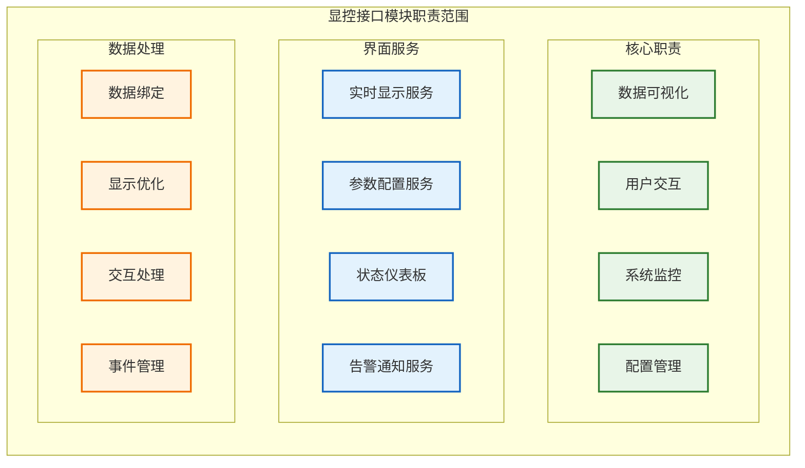

**职责说明**：显控接口模块通过三层功能分组实现完整的人机交互功能：
- **核心职责层**：定义四个基础功能范围（数据可视化、用户交互、系统监控、配置管理）
- **界面服务层**：提供四类对外服务接口（实时显示、参数配置、状态仪表板、告警通知）
- **数据处理层**：确保高效的数据流转和用户体验（数据绑定、显示优化、交互处理、事件管理）

各层内的组件通过标准接口协作，支持实时数据显示、直观的用户操作和全面的系统状态监控。

### 2.2 模块边界和约束

**输入边界**：
- **数据处理模块（DataProcessor）**：通过 `RadarDataAdapter` 提供经过格式适配的显示数据快照。输入数据格式为 `std::vector<TrackData>`（包含3D位置、速度、状态、置信度等雷达专用字段），经适配器转换为 `DisplaySnapshot`（包含屏幕适配的坐标、颜色、标签等UI友好字段）。支持零拷贝的 `std::shared_ptr` 传递和完整的 `Trace ID` 链路追踪。
- **任务调度器（TaskScheduler）**：通过**系统事件总线**接收系统状态、性能指标和控制命令。
- **配置管理器（ConfigManager）**：通过**系统事件总线**接收配置变更通知，并通过其接口在启动时加载初始配置。

**输出边界**：
- **任务调度器（TaskScheduler）**：通过**系统事件总线**发送用户操作指令（如启动/停止）和模块致命错误事件。
- **配置管理器（ConfigManager）**：通过**系统事件总线**发送用户发起的参数配置变更请求。

**性能约束**：
- 界面刷新频率 ≥ 30 FPS（实时显示组件）
- 用户交互响应延迟 < 100ms
- 最大支持同时显示 10000 个目标
- 内存使用控制在 1GB 以内

**技术约束**：
- 基于Qt6.x框架开发（最低支持Qt 6.5）
- 支持Windows 10/11和Ubuntu 20.04+操作系统
- 使用QML + C++混合开发模式
- 集成Qt Charts和Qt3D进行数据可视化

**GPU资源协调约束**：
- **资源协调原则**: 显控模块的GPU使用（OpenGL渲染）必须与信号处理模块的GPU使用（CUDA计算）进行协调，避免资源争夺导致的性能下降
- **动态降级策略**: 当系统GPU负载超过80%时，显控模块自动切换到低质量渲染模式，减少GPU资源占用
- **资源监控集成**: 通过`GpuResourceCoordinator`组件实时监控GPU使用情况，并根据负载情况调整渲染策略
- **上下文隔离**: 确保OpenGL渲染上下文与CUDA计算上下文的完全隔离，防止状态污染和资源冲突

---

## 3 Qt6.x架构设计

### 3.1 Qt框架集成策略

基于Qt6.x框架的模块化集成策略，确保与雷达系统的无缝整合：

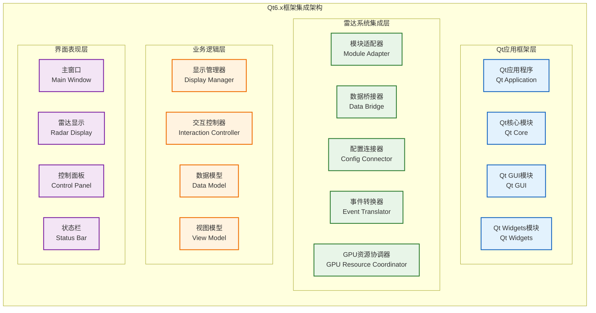

**集成策略说明**：该架构采用分层设计，确保Qt框架与雷达后端系统的松耦合集成。
- **Qt应用框架层**：提供基础GUI、网络、核心功能等工具集。
- **雷达系统集成层**：作为桥梁，负责将雷达后端模块（如数据处理、配置管理）的数据和服务，适配并转换为Qt友好的接口和数据结构。**该层中的任一组件都可能使用Qt框架层的多种功能**。
- **业务逻辑层**：实现所有显控相关的业务逻辑，如数据处理、状态管理和用户命令解析。它调用集成层提供的接口与雷达后端交互。
- **界面表现层**：纯粹的UI层，负责展示数据和接收用户输入，并将用户操作传递给业务逻辑层处理。

#### 3.1.1 GPU资源协调器设计

为避免显控模块的OpenGL渲染与信号处理模块的CUDA计算发生资源争夺，专门设计了`GpuResourceCoordinator`组件：

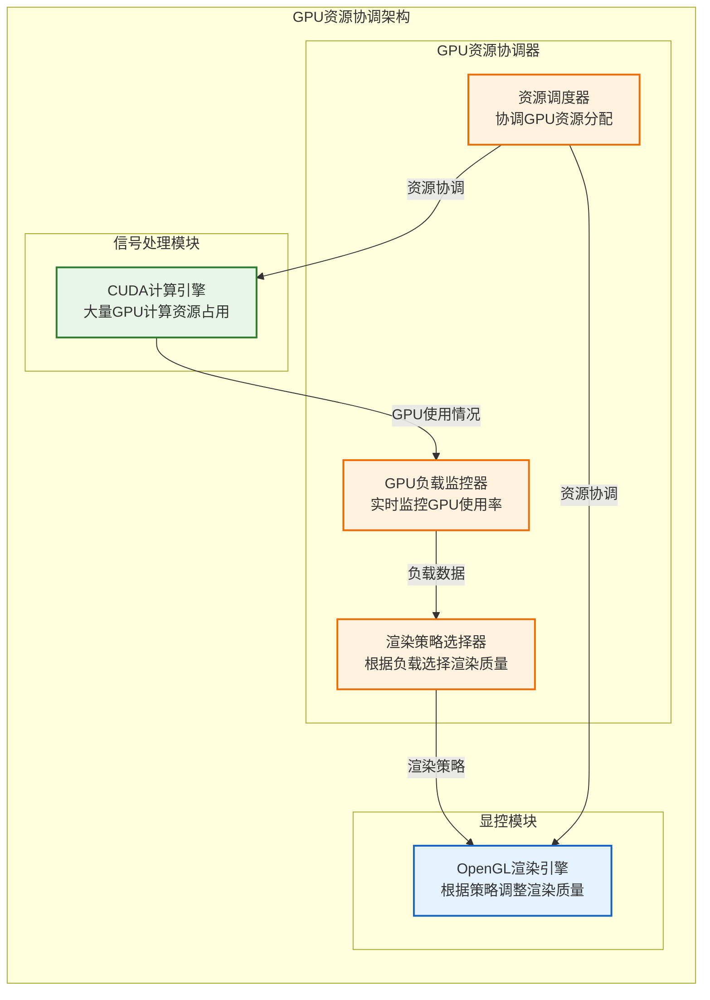

**GPU资源协调实现** (基于架构深度评审报告改进)：

```cpp
/**
 * @brief CUDA计算优先级枚举 (新增)
 */
enum class ComputePriority {
    HIGH,    // 高优先级：默认计算优先级，在HighPriorityComputeStream上执行
    LOW      // 低优先级：UI让出资源时使用，在LowPriorityComputeStream上执行
};

/**
 * @brief GPU优先级控制事件 (新增)
 */
struct SetComputePriorityEvent : BaseEvent {
    ComputePriority priority;        ///< 目标优先级
    std::string reason;              ///< 优先级变更原因
    TraceId trace_id;               ///< 操作追踪ID
    Timestamp valid_until;          ///< 优先级控制有效期
};

class GpuResourceCoordinator {
public:
    // GPU使用情况查询
    struct GpuUsageInfo {
        float gpu_utilization;      // GPU使用率 0.0-1.0
        float memory_utilization;   // 显存使用率 0.0-1.0
        bool cuda_context_active;   // CUDA上下文是否活跃
        uint64_t trace_id;          // 用于追踪的ID
    };

    // 渲染策略枚举
    enum class RenderStrategy {
        HIGH_QUALITY,    // 高质量渲染，GPU负载<60%时使用
        MEDIUM_QUALITY,  // 中等质量渲染，GPU负载60%-80%时使用
        LOW_QUALITY,     // 低质量渲染，GPU负载>80%时使用
        MINIMAL          // 最小化渲染，紧急情况下使用
    };

    // 实时监控GPU使用情况
    GpuUsageInfo queryGpuUsage() const;

    // 根据GPU负载选择最佳渲染策略
    RenderStrategy selectRenderStrategy(float gpu_load, uint64_t trace_id) const {
        RADAR_INFO("Selecting render strategy for GPU load: {:.1f}%, trace_id: {}",
                   gpu_load * 100, trace_id);

        if (gpu_load < 0.6f) {
            return RenderStrategy::HIGH_QUALITY;
        } else if (gpu_load < 0.8f) {
            return RenderStrategy::MEDIUM_QUALITY;
        } else if (gpu_load < 0.95f) {
            return RenderStrategy::LOW_QUALITY;
        } else {
            RADAR_ERROR("GPU overload detected: {:.1f}%, switching to minimal rendering, trace_id: {}",
                       gpu_load * 100, trace_id);
            return RenderStrategy::MINIMAL;
        }
    }

    // 强制性CUDA优先级控制 (基于架构深度评审改进)
    void setCudaComputePriority(ComputePriority priority, const TraceId& trace_id);

    // 检查并执行抢占式优先级控制
    void checkAndEnforceGpuPriority(const TraceId& trace_id) {
        auto usage = queryGpuUsage();

        if (usage.gpu_utilization > 0.8f && !is_compute_throttled_) {
            RADAR_WARN("GPU overload detected: {:.1f}%, enforcing compute throttling, trace_id: {}",
                      usage.gpu_utilization * 100, trace_id);
            setCudaComputePriority(ComputePriority::LOW, trace_id);
            is_compute_throttled_ = true;
        } else if (usage.gpu_utilization < 0.6f && is_compute_throttled_) {
            RADAR_INFO("GPU load normalized: {:.1f}%, restoring compute priority, trace_id: {}",
                      usage.gpu_utilization * 100, trace_id);
            setCudaComputePriority(ComputePriority::HIGH, trace_id);
            is_compute_throttled_ = false;
        }
    }

private:
    std::chrono::steady_clock::time_point last_query_time_;
    GpuUsageInfo cached_usage_;
    static constexpr std::chrono::milliseconds CACHE_DURATION{100}; // 缓存100ms

    // 抢占控制状态
    std::atomic<bool> is_compute_throttled_{false};  ///< 当前是否处于计算节流状态
    EventBus& event_bus_;                           ///< 用于发布优先级控制事件
};
```

**抢占式协调策略** (基于架构深度评审报告改进)：
1. **负载监控**: 每100ms查询一次GPU使用率，避免频繁查询造成开销
2. **抢占式优先级控制**: 当GPU负载>80%时，立即发布强制性`SET_COMPUTE_PRIORITY(LOW)`事件
3. **CUDA流隔离**: SignalProcessor必须支持双优先级CUDA流，能够抢占执行
4. **任务切分要求**: 长耗时CUDA Kernel必须设计为可切分，响应优先级变更
5. **上下文隔离**: 确保OpenGL和CUDA上下文完全独立，避免状态污染
6. **TDR防护**: 通过抢占机制防止GPU超时导致的驱动重置(TDR)
7. **自动恢复**: GPU负载降低后，自动恢复HIGH优先级计算
8. **Trace ID支持**: 所有GPU资源协调操作都支持端到端追踪

**关键改进**：
- ❌ **旧方式**: "建议性"协调，SignalProcessor可能无法及时响应
- ✅ **新方式**: "抢占式"协调，通过CUDA流优先级强制执行资源让出

**抢占式优先级控制实现**：
```cpp
void GpuResourceCoordinator::setCudaComputePriority(ComputePriority priority, const TraceId& trace_id) {
    SetComputePriorityEvent event;
    event.type = EventType::SET_COMPUTE_PRIORITY;
    event.priority = priority;
    event.trace_id = trace_id;
    event.timestamp = std::chrono::steady_clock::now();
    event.valid_until = event.timestamp + std::chrono::minutes(5); // 5分钟有效期
    event.reason = (priority == ComputePriority::HIGH)
                   ? "GPU load normalized, restoring compute priority"
                   : "GPU overload detected, throttling compute tasks";

    // 强制性事件，必须立即处理
    event_bus_.publishHighPriority(std::move(event));

    RADAR_INFO("Sent SET_COMPUTE_PRIORITY({}) command, trace_id: {}",
               (priority == ComputePriority::HIGH) ? "HIGH" : "LOW", trace_id);
}
```

### 3.2 MVP架构模式实现

为实现界面与业务逻辑的彻底分离，并适应高性能实时数据流，我们采用一种**面向数据快照的、包含ViewModel的MVP（Model-View-Presenter）架构**。此架构解决了传统MVP模式在处理高频数据时的性能瓶颈和数据所有权问题。

```mermaid
flowchart TB
    subgraph "数据源 (Data Source)"
        direction LR
        DP[数据处理模块<br/>DataProcessor] -- "1. std::move(data)" --> SNAPSHOT(数据快照<br/>std::shared_ptr<const TrackData>)
    end

    subgraph "显控模块内部 (DisplayController Internals)"
        direction TB

        subgraph "Model层 (数据管理)"
            CACHE[DisplayCache<br/>(持有原子指针<br/>atomic<shared_ptr>)]
        end

        subgraph "Presenter层 (表现逻辑)"
            PRESENTER[Presenter]
        end

        subgraph "ViewModel层 (视图模型)"
            VIEW_MODEL[ViewModel<br/>+ 异步空间索引构建]
            SPATIAL_INDEX_BUILDER[空间索引构建器<br/>SpatialIndexBuilder<br/>(后台线程)]
        end

        subgraph "View层 (视图界面)"
            VIEW[View (QWidget)<br/>(持有渲染策略)]
        end

        %% Data Flow
        DP -- "2. 更新原子指针" --> CACHE
        EVENT_BUS([系统事件总线<br/>Event Bus]) -- "3. 发送 NEW_DISPLAY_DATA_READY 事件" --> PRESENTER

        PRESENTER -- "4. 获取快照" --> CACHE
        PRESENTER -- "5. 更新ViewModel" --> VIEW_MODEL
        VIEW_MODEL -- "6. 持有快照指针" --> SNAPSHOT
        PRESENTER -- "7. 触发UI重绘<br/>(QWidget::update)" --> VIEW

        VIEW -- "8. 渲染时从ViewModel获取数据" --> VIEW_MODEL
    end

    classDef model fill:#e8f5e8,stroke:#2e7d32,stroke-width:2px
    classDef presenter fill:#fff3e0,stroke:#ef6c00,stroke-width:2px
    classDef viewmodel fill:#fce4ec,stroke:#ad1457,stroke-width:2px
    classDef view fill:#e3f2fd,stroke:#1565c0,stroke-width:2px
    classDef data fill:#ede7f6,stroke:#5e35b1,stroke-width:2px

    class CACHE model
    class PRESENTER presenter
    class VIEW_MODEL viewmodel
    class VIEW view
    class DP,SNAPSHOT,EVENT_BUS data
```

**MVP架构说明**：

1.  **Model层 (`DisplayCache` + `RadarDataAdapter`)**:
    - **DisplayCache 职责**: 作为与上游数据处理模块的唯一接口，负责安全、高效地接收数据快照。
    - **DisplayCache 实现**: 内部持有一个 `std::atomic<std::shared_ptr<const DisplaySnapshot>>` 原子指针。数据处理模块通过一次原子交换操作更新此指针，实现无锁、零拷贝的数据移交。
    - **RadarDataAdapter 职责**: 专门负责将雷达后端的 `TrackData` 格式适配为 UI 友好的 `DisplaySnapshot` 格式，同时确保 `Trace ID` 的完整传递。
    - **数据适配实现**:
      ```cpp
      // 雷达后端数据格式（来自数据处理模块）
      struct TrackData {
          uint64_t track_id;
          uint64_t trace_id;          // ✅ 端到端追踪ID
          Eigen::Vector3d position;    // 3D坐标 (米)
          Eigen::Vector3d velocity;
          TrackState state;           // TENTATIVE/CONFIRMED/COAST/LOST
          double confidence;
          Timestamp update_time;
      };

      // UI适配后的显示格式
      struct DisplayTarget {
          uint64_t track_id;
          uint64_t trace_id;          // ✅ 继承追踪ID
          QPointF world_position;     // 2D投影坐标
          QPointF screen_position;    // 屏幕像素坐标(由渲染时计算)
          TrackState track_state;
          double confidence;
          QColor display_color;       // 根据状态/类型确定
          QString display_label;      // "T001 (0.95)" 格式
      };

      struct DisplaySnapshot {
          std::vector<DisplayTarget> targets;
          uint64_t trace_id;          // ✅ 批次级别追踪ID
          Timestamp creation_time;
          ViewportInfo viewport;      // 当前视口范围

          // ✅ 适配工厂方法，确保Trace ID传递
          static std::shared_ptr<const DisplaySnapshot>
          fromRadarData(const std::vector<TrackData>& radar_data,
                       uint64_t parent_trace_id,
                       const ViewportInfo& viewport);
      };
      ```
    - **角色**: DisplayCache 是线程安全的数据快照容器，RadarDataAdapter 是数据格式转换器，两者协作解决雷达数据与UI数据的格式差异问题。

2.  **Presenter层 (`Presenter`)**:
    - **职责**: 协调核心业务流程。它**不处理**任何渲染逻辑或数据转换。
    - **实现**:
        - 监听系统事件总线上的 `NEW_DISPLAY_DATA_READY` 事件。
        - 收到事件后，从 `DisplayCache` 获取最新的数据快照 `shared_ptr`。
        - 将新的快照指针传递给 `ViewModel` 进行更新。
        - 调用 `View` 的 `update()` 方法，请求异步重绘，**不直接调用`paintEvent`**。

3.  **ViewModel层 (`ViewModel`) - 改进版**:
    - **核心职责**: 作为**View专用的数据提供者**，专门负责将显示友好的 `DisplaySnapshot` 数据转换为渲染器所需的具体格式。
    - **与DisplayCache的职责分离**:
      ```cpp
      // DisplayCache: 负责数据格式适配 (TrackData -> DisplaySnapshot)
      class DisplayCache {
          std::atomic<std::shared_ptr<const DisplaySnapshot>> current_snapshot_;
      public:
          // 接收来自数据处理模块的TrackData，适配为DisplaySnapshot
          void updateFromRadarData(const std::vector<TrackData>& data, uint64_t trace_id);
          std::shared_ptr<const DisplaySnapshot> getLatestSnapshot() const;
      };

      // ViewModel: 负责渲染适配 (DisplaySnapshot -> 渲染数据)
      class ViewModel {
          std::shared_ptr<const DisplaySnapshot> current_snapshot_;
          ViewportTransform viewport_transform_;  // 坐标变换缓存
          SpatialIndex spatial_index_;           // 空间索引加速查询

      public:
          // 接收DisplayCache提供的DisplaySnapshot，准备渲染数据
          void updateSnapshot(std::shared_ptr<const DisplaySnapshot> snapshot, uint64_t trace_id) {
              current_snapshot_ = snapshot;
              rebuildSpatialIndex();  // 重建空间索引
              updateViewportTransform(); // 更新坐标变换

              RADAR_DEBUG("ViewModel updated with {} targets, trace_id: {}",
                         snapshot->targets.size(), trace_id);
          }

          // 为View提供高效的查询接口
          std::vector<RenderTarget> getTargetsInRect(const QRectF& viewport_rect) const;
          std::vector<QLineF> getGridLines(double grid_spacing) const;
          QColor getTargetColor(const DisplayTarget& target) const;
          QString getTargetLabel(const DisplayTarget& target) const;
      };
      ```
    - **数据转换策略**:
      - **DisplayCache负责**: 雷达数据 → UI数据 (TrackData → DisplaySnapshot)
      - **ViewModel负责**: UI数据 → 渲染数据 (DisplaySnapshot → QPointF/QColor/QString)
    - **性能优化**:
      - 使用四叉树空间索引加速 `getTargetsInRect()` 查询，复杂度从O(N)降至O(log N)
      - 缓存坐标变换矩阵，避免重复计算
      - 按需计算显示属性（颜色、标签），不在快照中预计算
    - **优势**: 职责边界清晰，DisplayCache专注数据适配，ViewModel专注渲染优化，两者解耦且各有专长。

4.  **View层 (`View`)**:
    - **职责**: 纯粹的UI渲染。在Qt Widgets中，这通常是一个 `QWidget` 子类。
    - **实现**:
        - 在其 `paintEvent` 方法中，向 `ViewModel` 查询当前视口所需的渲染数据。
        - 将渲染任务委托给一个或多个**渲染策略**（见问题 #3 的解决方案），实现渲染逻辑的解耦。
        - **不直接访问** `DisplayCache` 或原始数据快照。

该架构通过**异步快照**和**事件通知**，将UI的渲染周期与数据处理的更新周期完全解耦，从根本上解决了性能耦合问题。

### 3.3 线程模型设计

### 3.3 线程模型设计

为确保UI线程的绝对流畅和对高频数据的低延迟响应，显控模块采用**事件驱动的单线程模型**，并与系统的并发架构无缝集成。**显控模块自身不创建和管理任何常驻的业务逻辑线程**。

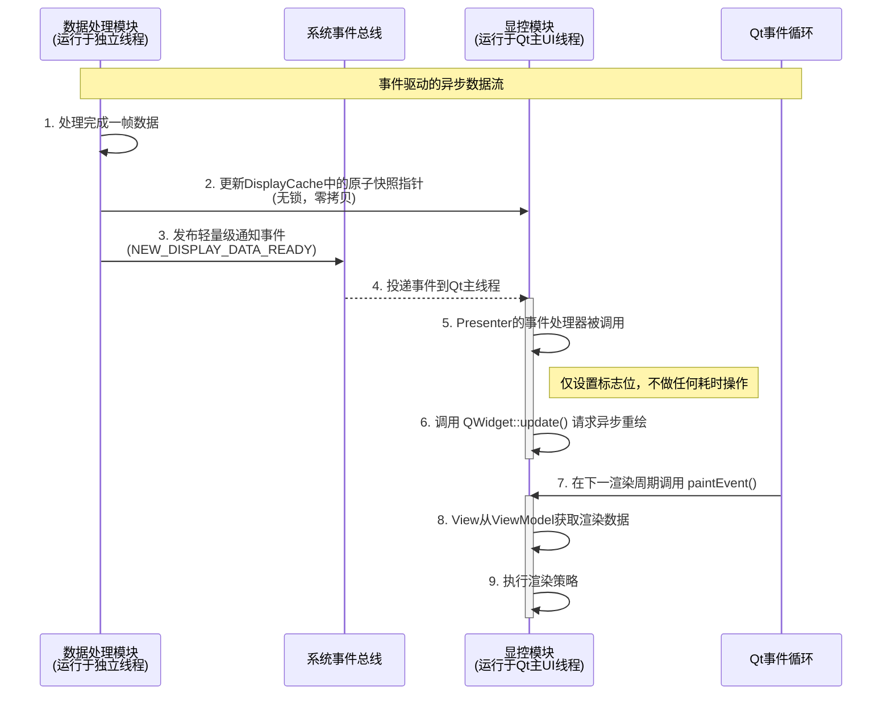

**线程模型说明**:

1.  **无独立数据线程**: 废除模糊的 `DataThread` 概念。显控模块的所有组件（Presenter, ViewModel, View）都运行在**Qt的主UI线程**中。这消除了模块内部的线程同步开销和复杂性。

2.  **事件驱动更新**: 显控模块不使用轮询来检查数据更新。它被动地等待来自**系统事件总线**的 `NEW_DISPLAY_DATA_READY` 通知。
    - **优点**: 实现了最低的更新延迟，且在没有新数据时完全不消耗CPU资源。

3.  **异步渲染请求**:
    - 当 `Presenter` 收到新数据通知时，它**不会立即进行渲染**。这样做会阻塞事件循环，导致UI卡顿和事件堆积。
    - 它仅调用 `QWidget::update()`，这会将一个“重绘”事件放入Qt的事件队列中，由Qt在最合适的时机（通常是下一个垂直同步信号）进行处理。

4.  **渲染在`paintEvent`中进行**:
    - 所有耗时的绘制操作都严格限制在 `paintEvent` 方法内。这是Qt框架推荐的最佳实践，可以确保渲染过程与事件处理分离，保障UI的响应性。

5.  **与上游解耦**: 数据交换通过 `DisplayCache` 的原子指针完成，这是一个**O(1)**的操作，完全不会阻塞上游的 `DataProcessor` 线程。

这个模型将显控模块定位为一个纯粹的**异步观察者**，它高效地响应外部事件，同时严格遵守Qt的线程和渲染规则，确保了在高数据负载下的高性能和高响应性。

#### 3.3.1 线程安全的ViewModel设计

**问题识别**: 传统ViewModel设计中，空间索引构建、数据转换等计算密集操作在UI线程中执行，导致界面卡顿。

**解决方案**: 采用**异步ViewModel模式**，将计算密集操作分离到后台线程，确保UI线程始终保持响应。

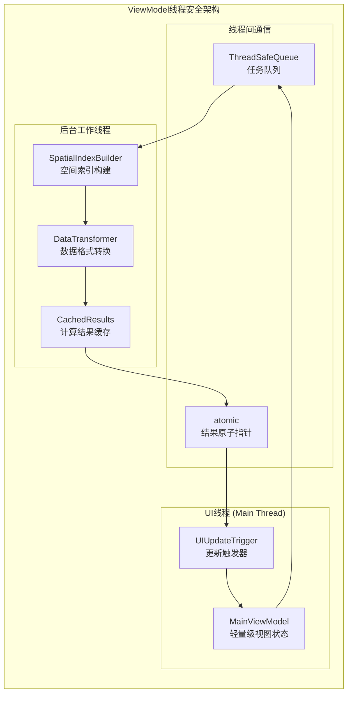

**实现策略**:

1. **异步空间索引构建**:
   ```cpp
   class SpatialIndexBuilder {
   private:
       std::thread worker_thread_;
       ThreadSafeQueue<BuildTask> task_queue_;
       std::atomic<std::shared_ptr<const SpatialIndex>> latest_index_;

   public:
       void requestBuild(std::shared_ptr<const TrackData> data) {
           BuildTask task{std::move(data), std::chrono::steady_clock::now()};
           task_queue_.enqueue(std::move(task));  // 非阻塞入队
       }

       std::shared_ptr<const SpatialIndex> getLatestIndex() const {
           return latest_index_.load();  // 原子读取，UI线程安全
       }
   };
   ```

2. **UI线程保护机制**:
   - **零拷贝原则**: UI线程只读取预计算的结果，从不执行计算操作
   - **超时保护**: 后台任务超时后自动使用缓存结果，避免UI等待
   - **优雅降级**: 在索引构建延迟时，使用简化的线性搜索保证基本功能

3. **数据一致性保障**:
   ```cpp
   class ThreadSafeViewModel {
   private:
       std::atomic<uint64_t> data_version_;
       std::atomic<std::shared_ptr<const ViewData>> current_view_data_;

   public:
       void updateDataAsync(std::shared_ptr<const TrackData> new_data) {
           uint64_t new_version = data_version_.fetch_add(1) + 1;

           // 异步处理，不阻塞调用者
           background_processor_.process(new_data, new_version,
               [this](auto processed_data, uint64_t version) {
                   // 原子更新，确保UI线程看到完整数据
                   current_view_data_.store(processed_data);
               });
       }
   };
   ```

#### 3.3.2 线程模型改进：延迟更新机制

针对之前设计中的关键缺陷，即事件处理器可能在UI线程中执行耗时操作的问题，现引入**延迟更新机制**确保UI线程的绝对流畅：

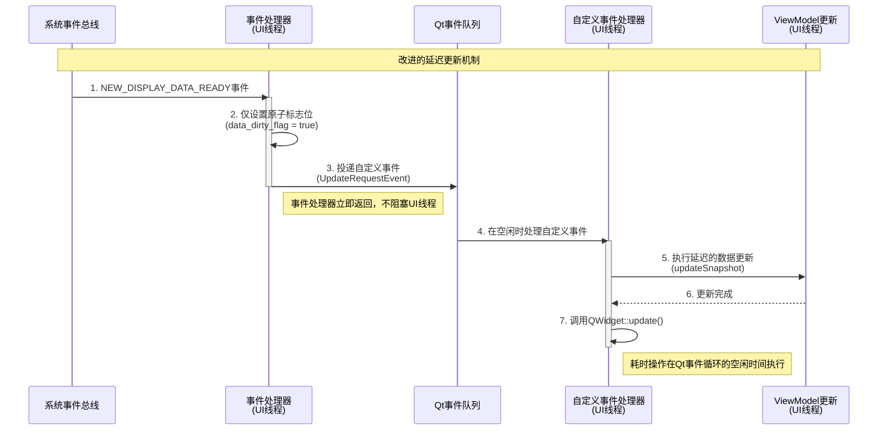

**延迟更新机制实现**：

```cpp
class DisplayController : public QWidget {
public:
    // 自定义事件类型
    static constexpr int UpdateRequestType = QEvent::User + 1;

private:
    std::atomic<bool> data_dirty_flag_{false};
    uint64_t current_trace_id_{0};
    std::shared_ptr<DisplayCache> display_cache_;
    std::shared_ptr<ViewModel> view_model_;

public:
    // ✅ 正确的事件处理器实现 - 绝对不能有耗时操作
    void onNewDataReady(const DataUpdateEvent& event) {
        RADAR_DEBUG("Received data ready event, trace_id: {}", event.trace_id);

        // 1. 仅设置原子标志位，这是O(1)操作
        data_dirty_flag_.store(true, std::memory_order_release);
        current_trace_id_ = event.trace_id;

        // 2. 投递自定义事件到Qt队列，这也是O(1)操作
        QApplication::postEvent(this, new QEvent(static_cast<QEvent::Type>(UpdateRequestType)));

        // 3. 立即返回，不阻塞事件循环
        RADAR_DEBUG("Event handler completed, trace_id: {}", event.trace_id);
    }

    // ✅ Qt框架会在空闲时调用此方法处理自定义事件
    void customEvent(QEvent* event) override {
        if (event->type() == UpdateRequestType) {
            performDelayedDataUpdate();

            // 请求异步重绘
            QWidget::update();
        }
    }

private:
    // ✅ 在这里执行所有可能耗时的操作
    void performDelayedDataUpdate() {
        // 使用原子交换确保只处理一次
        if (!data_dirty_flag_.exchange(false, std::memory_order_acquire)) {
            return; // 没有新数据需要更新
        }

        const auto start_time = std::chrono::high_resolution_clock::now();

        try {
            // 1. 从DisplayCache获取最新快照（可能耗时）
            auto snapshot = display_cache_->getLatestSnapshot();
            if (!snapshot) {
                RADAR_WARN("No snapshot available, trace_id: {}", current_trace_id_);
                return;
            }

            // 2. 更新ViewModel（肯定耗时）
            view_model_->updateSnapshot(snapshot, current_trace_id_);

            const auto elapsed = std::chrono::high_resolution_clock::now() - start_time;
            RADAR_DEBUG("Data update completed in {}ms, trace_id: {}",
                       std::chrono::duration_cast<std::chrono::microseconds>(elapsed).count() / 1000.0,
                       current_trace_id_);

        } catch (const std::exception& e) {
            RADAR_ERROR("Failed to update data: {}, trace_id: {}", e.what(), current_trace_id_);
        }
    }
};
```

**关键改进点**：

1. **事件处理器零耗时**: `onNewDataReady` 只执行原子操作和事件投递，保证在微秒级别内完成
2. **延迟执行**: 真正的数据更新在Qt事件循环的空闲时间执行，不会阻塞UI响应
3. **原子标志位**: 使用 `std::atomic<bool>` 避免数据竞争，支持高频事件处理
4. **异常安全**: 延迟更新过程包含完整的异常处理机制
5. **性能监控**: 记录每次更新的执行时间，便于性能调优
6. **Trace ID支持**: 完整的追踪ID传递，支持端到端调试

**性能特征**：
- 事件处理延迟：< 1μs（仅原子操作）
- UI响应性：完全不受数据更新频率影响
- 内存开销：最小（仅一个原子标志位）
- 并发安全：完全线程安全，支持高频并发事件

---

## 4 界面组件架构

### 4.1 主界面组织结构

主界面采用分区域布局设计，确保信息层次清晰和操作便捷：

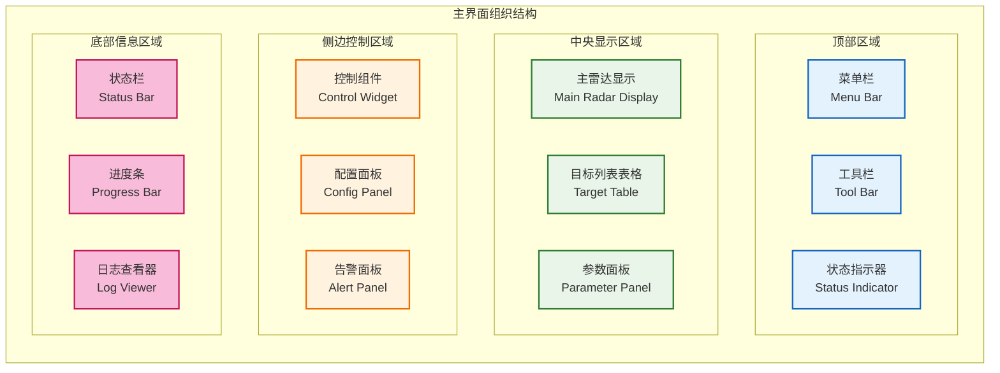

**界面布局说明**：主界面采用四区域空间布局设计：
- **顶部区域**：提供菜单栏、工具栏和状态指示器，便于系统操作和状态查看
- **中央显示区域**：承担主要的数据显示功能，包括雷达显示、目标列表和参数面板
- **侧边控制区域**：集中控制组件、配置面板和告警面板，便于系统控制
- **底部信息区域**：显示状态栏、进度条和日志查看器，提供系统运行信息

该布局确保了信息的逻辑分层和操作的直观便捷，各区域内组件根据功能特点灵活组织。

### 4.2 可视化组件设计

为了实现最大的灵活性和可扩展性，可视化系统采用**基于策略模式的、可配置的渲染流水线**。`View` 组件自身不包含任何具体的绘制逻辑，而是将渲染任务委托给一系列可插拔的**渲染策略（Renderer Strategies）**。

```mermaid
graph TB
    subgraph "渲染策略模式架构"
        direction LR

        subgraph "View层 (渲染宿主)"
            RADAR_VIEW[雷达视图<br/>RadarView (QWidget)]
        end

        subgraph "管理与调度"
            LAYER_MANAGER[图层管理器<br/>LayerManager]
            RENDER_CONTEXT[渲染上下文<br/>RenderContext]
        end

        subgraph "抽象与工厂"
            I_RENDERER["接口<br/>IRendererStrategy"]
            RENDERER_FACTORY[渲染器工厂<br/>RendererFactory]
        end

        subgraph "具体渲染策略 (部分示例)"
            GRID_RENDERER[网格渲染器<br/>GridRenderer]
            PPI_BACKGROUND_RENDERER[PPI背景渲染器<br/>PpiBackgroundRenderer]
            TARGET_RENDERER[目标渲染器<br/>TargetRenderer]
            TRACK_HISTORY_RENDERER[航迹历史渲染器<br/>TrackHistoryRenderer]
        end

        %% 关系
        RADAR_VIEW -- "1. 持有" --> LAYER_MANAGER
        LAYER_MANAGER -- "2. 管理一组" --> I_RENDERER

        RADAR_VIEW -- "3. 在paintEvent中创建" --> RENDER_CONTEXT
        RADAR_VIEW -- "4. 遍历并调用" --> LAYER_MANAGER

        LAYER_MANAGER -- "5. 调用 render()" --> I_RENDERER
        I_RENDERER -- "6. 接收" --> RENDER_CONTEXT

        RENDERER_FACTORY -- "根据配置创建" --> GRID_RENDERER
        RENDERER_FACTORY -- "..." --> PPI_BACKGROUND_RENDERER
        RENDERER_FACTORY -- "..." --> TARGET_RENDERER

        GRID_RENDERER -- "实现" --> I_RENDERER
        PPI_BACKGROUND_RENDERER -- "实现" --> I_RENDERER
        TARGET_RENDERER -- "实现" --> I_RENDERER
        TRACK_HISTORY_RENDERER -- "实现" --> I_RENDERER
    end

    classDef view fill:#e3f2fd,stroke:#1565c0,stroke-width:2px
    classDef manager fill:#fff3e0,stroke:#ef6c00,stroke-width:2px
    classDef strategy fill:#e8f5e8,stroke:#2e7d32,stroke-width:2px
    classDef iface fill:#fce4ec,stroke:#ad1457,stroke-width:2px

    class RADAR_VIEW view
    class LAYER_MANAGER, RENDER_CONTEXT manager
    class GRID_RENDERER, PPI_BACKGROUND_RENDERER, TARGET_RENDERER, TRACK_HISTORY_RENDERER strategy
    class I_RENDERER, RENDERER_FACTORY iface
```

**架构说明**:

1.  **`IRendererStrategy` 接口**:
    - 定义了所有渲染器的统一接口，核心方法是 `render(QPainter* painter, const RenderContext& context)`。
    - 这使得 `View` 可以用统一的方式处理所有不同类型的图层。

2.  **具体渲染策略**:
    - 每个类都实现了 `IRendererStrategy` 接口，并封装了一种特定的绘制逻辑（如绘制网格、绘制目标、绘制航迹）。
    - 这些类是独立、可测试、可复用的。

3.  **`LayerManager` (图层管理器)**:
    - 持有一个 `std::vector<std::unique_ptr<IRendererStrategy>>` 列表，代表了当前所有可见的渲染图层。
    - 负责根据配置文件或用户交互，动态地添加、移除或重新排序这些图层。

4.  **`RendererFactory` (渲染器工厂)**:
    - 根据一个字符串标识（如 `"targets_v1"`）创建具体的渲染策略实例。这使得配置与实现解耦。

5.  **`RenderContext` (渲染上下文)**:
    - 一个临时对象，在每次 `paintEvent` 时创建。
    - 它封装了该次渲染所需的所有共享信息，如 `ViewModel` 的引用、当前的坐标变换矩阵、视口矩形、缩放级别等，并传递给每个渲染策略。

**优势**:
- **高度可扩展**: 增加新的显示效果（如A显、电子地图），只需实现一个新的策略类并注册到工厂，无需修改任何现有 `View` 或 `Presenter` 代码。
- **动态组合**: 用户可以通过UI（如图层控制面板）动态启用/禁用不同的渲染策略，实现灵活的显示定制。
- **职责分离**: `View` 只负责提供画布（`QPainter`）和调度，`Presenter` 负责数据流，`Renderer` 负责绘制，职责清晰。

### 4.3 控制面板设计

集成的控制面板设计，提供系统参数配置和操作控制：

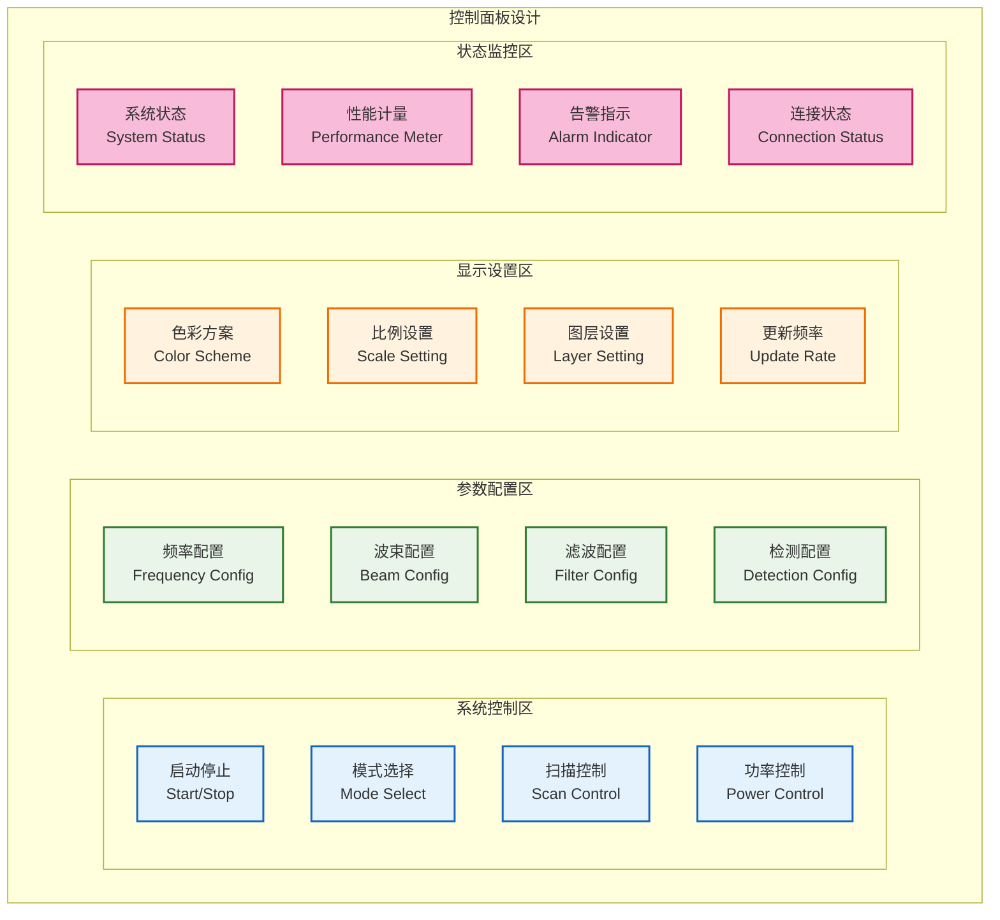

**控制面板说明**：控制面板采用四区域功能布局：
- **系统控制区**：提供启动停止、模式选择、扫描控制、功率控制等基础操作功能
- **参数配置区**：支持频率配置、波束配置、滤波配置、检测配置等系统参数调整
- **显示设置区**：控制色彩方案、比例设置、图层设置、更新频率等界面显示效果
- **状态监控区**：实时展现系统状态、性能计量、告警指示、连接状态等系统运行状态

该设计确保了操作的功能分组和界面组织的逻辑性，用户可根据需要在不同区域进行相应操作。

---

## 5 数据可视化设计

### 5.1 实时数据绘制引擎

### 5.1 面向`QPainter`的高性能渲染策略

为了在显示数千个目标时仍能保持高帧率，我们不使用通用的、抽象的渲染管线，而是采用一系列**直接面向`QPainter` API的、具体的性能优化策略**。这些策略由具体的渲染器（`IRendererStrategy`）在内部实现。

```mermaid
flowchart TB
    subgraph "面向QPainter的渲染优化流程"
        direction TB

        INPUT[输入: 10000个目标的原始数据快照] --> CULLING(1. 视口剔除<br>Viewport Culling)

        CULLING --> LOD(2. 细节层次选择<br>Level of Detail)

        LOD --> BATCHING(3. 批量绘制准备<br>Batch Drawing)

        BATCHING --> DRAW(4. 单次/少量绘制调用<br>e.g., painter->drawPoints())

        subgraph "静态元素优化"
            CACHE[5. 静态背景缓存<br>Static Background Caching]
            CACHE_DRAW[快速绘制缓存<br>painter->drawPixmap()]
        end

        DRAW --> OUTPUT[输出: 最终渲染帧]
        CACHE_DRAW --> OUTPUT
    end

    classDef process fill:#e3f2fd,stroke:#1565c0,stroke-width:2px
    classDef static_opt fill:#e8f5e8,stroke:#2e7d32,stroke-width:2px

    class INPUT, OUTPUT process
    class CULLING, LOD, BATCHING, DRAW process
    class CACHE, CACHE_DRAW static_opt
```

**核心优化策略说明**:

1.  **视口剔除 (Viewport Culling)**:
    - **目的**: 只处理和绘制当前屏幕可见区域内的目标，从源头上减少计算量。
    - **实现**: 在 `TargetRenderer` 的 `render` 方法中，第一步就是从 `ViewModel` 查询当前视口矩形内的目标 `getTargetsInRect(viewport)`，而不是遍历完整的数据快照。如果使用了空间索引（如问题 #7 所述），这一步会非常快。

2.  **细节层次 (Level of Detail - LOD)**:
    - **目的**: 根据缩放级别动态调整渲染的复杂度，避免在全局视图下绘制不必要的细节。
    - **实现**: `TargetRenderer` 根据从 `RenderContext` 获取的当前缩放级别，决定渲染方式：
        - **高缩放级别 (Zoomed In)**: 渲染复杂的符号、ID标签和速度矢量。
        - **中等缩放级别**: 渲染简化的符号（如带方向的三角形）。
        - **低缩放级别 (Zoomed Out)**: 只渲染一个单像素的点，甚至完全不渲染（如果目标密度过高）。

3.  **批量绘制 (Batch Drawing)**:
    - **目的**: 最小化 `QPainter` 的API调用次数。调用 `drawPoints()` 1次绘制10000个点，远比调用 `drawPoint()` 10000次要快得多。
    - **实现**: `TargetRenderer` 在剔除和LOD选择后，**不立即绘制**。而是遍历筛选后的目标，将其顶点坐标、颜色等信息填充到临时的缓冲区（如 `QVector<QPointF>`）。最后，根据LOD的结果，使用 `painter->drawPoints()`、`painter->drawLines()` 等批量API，一次性将所有同类型的图元提交给`QPainter`。

4.  **静态背景缓存 (Static Background Caching)**:
    - **目的**: 对于不经常变化的背景元素（如地图、网格、距离圈），避免每帧都重绘。
    - **实现**: `GridRenderer` 或 `MapRenderer` 在第一次绘制或视口发生重大变化时，将自己的内容绘制到一个离屏的 `QPixmap` 缓存中。在后续的 `paintEvent` 调用中，只要视口没有变化，它就直接调用 `painter->drawPixmap()` 将缓存快速贴到屏幕上，这是一个极快的操作。

这些策略与Qt的渲染模型紧密结合，能够有效解决`QPainter`体系下的主要性能瓶颈，确保在高负载下依然获得流畅的交互体验。

#### 5.1.1 渲染预算管理器

为确保严格的实时性能保证，引入`RenderBudgetManager`组件，实现帧率稳定性和渲染预算控制：

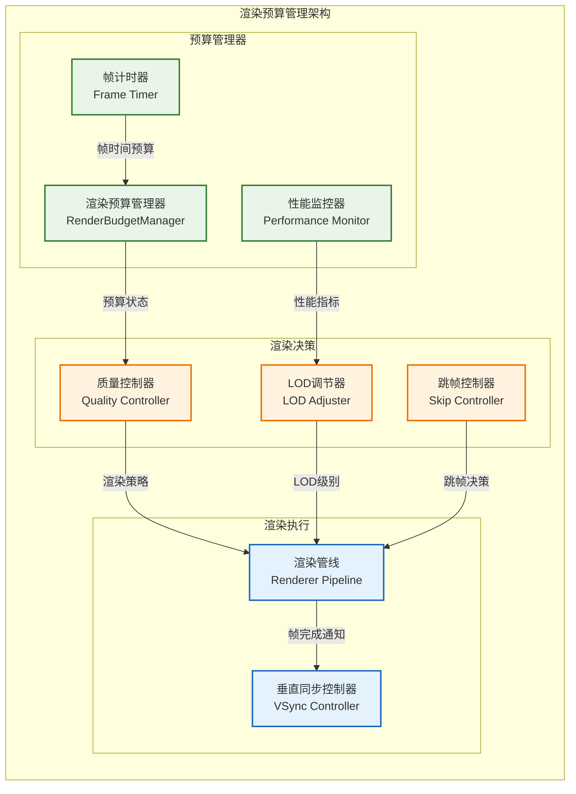

**渲染预算管理实现**：

```cpp
class RenderBudgetManager {
public:
    // 目标帧率和预算配置
    struct BudgetConfig {
        std::chrono::microseconds target_frame_time{33333};  // 30 FPS = 33.33ms
        float budget_warning_threshold{0.8f};                // 80%预算用完警告
        float budget_critical_threshold{0.95f};              // 95%预算用完降级
        bool enable_adaptive_quality{true};                  // 启用自适应质量
        uint64_t trace_id{0};                               // 追踪ID
    };

    // 渲染质量级别
    enum class RenderQuality {
        ULTRA_HIGH,  // 所有特效，最高细节度
        HIGH,        // 高质量渲染，部分特效
        MEDIUM,      // 中等质量，简化渲染
        LOW,         // 低质量，基本渲染
        MINIMAL      // 最小化渲染，仅核心元素
    };

    explicit RenderBudgetManager(const BudgetConfig& config)
        : config_(config), current_quality_(RenderQuality::HIGH) {}

    // 开始新的渲染帧
    void startFrame(uint64_t trace_id) {
        frame_start_time_ = std::chrono::high_resolution_clock::now();
        current_trace_id_ = trace_id;

        RADAR_DEBUG("Starting frame render, budget: {}ms, trace_id: {}",
                   config_.target_frame_time.count() / 1000.0, trace_id);
    }

    // 检查是否应该跳过昂贵的渲染操作
    bool shouldSkipExpensiveRendering() const {
        auto elapsed = std::chrono::high_resolution_clock::now() - frame_start_time_;
        float budget_used = static_cast<float>(elapsed.count()) / config_.target_frame_time.count();

        if (budget_used > config_.budget_warning_threshold) {
            RADAR_DEBUG("Render budget warning: {:.1f}% used, trace_id: {}",
                       budget_used * 100, current_trace_id_);
            return budget_used > config_.budget_critical_threshold;
        }
        return false;
    }

    // 根据当前性能动态调整渲染质量
    RenderQuality getCurrentQuality() const {
        if (!config_.enable_adaptive_quality) {
            return current_quality_;
        }

        auto elapsed = std::chrono::high_resolution_clock::now() - frame_start_time_;
        float budget_used = static_cast<float>(elapsed.count()) / config_.target_frame_time.count();

        if (budget_used < 0.5f) {
            return RenderQuality::ULTRA_HIGH;
        } else if (budget_used < 0.7f) {
            return RenderQuality::HIGH;
        } else if (budget_used < 0.85f) {
            return RenderQuality::MEDIUM;
        } else if (budget_used < 0.95f) {
            return RenderQuality::LOW;
        } else {
            RADAR_WARN("Render budget exceeded: {:.1f}%, switching to minimal quality, trace_id: {}",
                      budget_used * 100, current_trace_id_);
            return RenderQuality::MINIMAL;
        }
    }

    // 强制执行帧率限制
    void enforceFrameRate() {
        auto elapsed = std::chrono::high_resolution_clock::now() - frame_start_time_;

        if (elapsed < config_.target_frame_time) {
            auto sleep_time = config_.target_frame_time - elapsed;
            std::this_thread::sleep_for(sleep_time);

            RADAR_DEBUG("Frame completed in {}ms, slept {}ms for sync, trace_id: {}",
                       elapsed.count() / 1000.0, sleep_time.count() / 1000.0, current_trace_id_);
        } else {
            RADAR_WARN("Frame budget exceeded: {}ms vs target {}ms, trace_id: {}",
                      elapsed.count() / 1000.0, config_.target_frame_time.count() / 1000.0,
                      current_trace_id_);
        }
    }

    // 获取性能统计
    struct PerformanceStats {
        double average_frame_time_ms;
        double frame_rate;
        RenderQuality current_quality;
        int frames_dropped;
        uint64_t trace_id;
    };

    PerformanceStats getPerformanceStats() const;

private:
    BudgetConfig config_;
    RenderQuality current_quality_;
    std::chrono::high_resolution_clock::time_point frame_start_time_;
    uint64_t current_trace_id_{0};

    // 性能统计
    mutable std::array<std::chrono::microseconds, 60> frame_times_{}; // 60帧历史
    mutable size_t frame_index_{0};
    mutable int dropped_frames_{0};
};
```

**集成到渲染流程**：

```cpp
// 在RadarView::paintEvent中的使用示例
void RadarView::paintEvent(QPaintEvent* event) {
    // 1. 开始渲染预算管理
    render_budget_manager_->startFrame(current_trace_id_);

    QPainter painter(this);
    painter.setRenderHint(QPainter::Antialiasing,
                         render_budget_manager_->getCurrentQuality() >= RenderQuality::HIGH);

    // 2. 创建渲染上下文
    RenderContext context{
        .view_model = view_model_,
        .viewport_rect = event->rect(),
        .quality_level = render_budget_manager_->getCurrentQuality(),
        .trace_id = current_trace_id_
    };

    // 3. 渲染各图层，支持动态跳过
    for (auto& renderer : layer_manager_->getVisibleRenderers()) {
        if (render_budget_manager_->shouldSkipExpensiveRendering()) {
            // 跳过昂贵的渲染操作，只渲染核心元素
            if (renderer->getType() != RendererType::CORE_TARGETS) {
                continue;
            }
        }

        renderer->render(&painter, context);
    }

    // 4. 强制执行帧率限制
    render_budget_manager_->enforceFrameRate();
}
```

**关键特性**：
1. **硬实时保证**: 严格控制每帧渲染时间不超过预算
2. **自适应质量**: 根据GPU负载和渲染性能自动调整质量级别
3. **智能跳帧**: 在时间不足时优先保证核心目标显示
4. **性能监控**: 提供详细的帧率和性能统计数据
5. **Trace ID支持**: 所有性能事件都支持端到端追踪

### 5.2 雷达显示组件

### 5.2 渲染策略实现示例

本节描述了 `IRendererStrategy` 接口的几个关键实现，它们共同构成雷达视图。

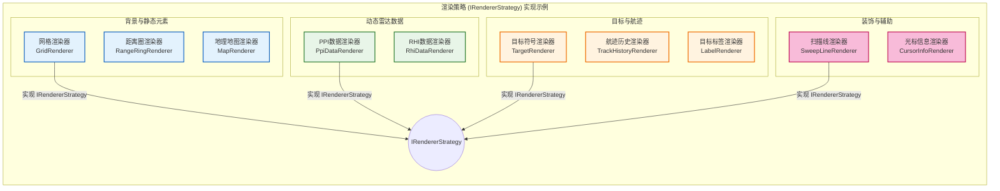

**渲染策略说明**:

-   **`GridRenderer` / `RangeRingRenderer`**:
    - **职责**: 绘制背景的极坐标或笛卡尔坐标网格和距离圈。
    - **优化**: 内部实现**静态背景缓存**。它将网格绘制到一个 `QPixmap` 上，在后续帧中直接复用该 `QPixmap`，避免重复计算和绘制。只有在视口变换（缩放/平移）导致网格需要重新生成时，缓存才会失效并重绘。

-   **`PpiDataRenderer`**:
    - **职责**: 渲染原始的PPI（平面位置指示）回波数据，通常以不同颜色表示信号强度。
    - **优化**: 可能会使用 `QImage` 进行像素级操作，并将多个扇区的数据更新批量应用到图像上，然后一次性将 `QImage` 绘制到屏幕。

-   **`TargetRenderer`**:
    - **职责**: 绘制目标点或符号。这是性能最关键的渲染器之一。
    - **优化**: 严格遵循 `5.1` 节描述的优化策略：
        1.  **视口剔除**: 首先只获取视口内的目标。
        2.  **LOD选择**: 根据缩放级别决定是画点、画图标还是不画。
        3.  **批量绘制**: 将所有需要绘制的点坐标收集到 `QVector<QPointF>` 中，最后调用一次 `painter->drawPoints()` 完成绘制。

-   **`TrackHistoryRenderer`**:
    - **职责**: 绘制目标的历史轨迹线。
    - **优化**: 类似于 `TargetRenderer`，它将所有可见航迹的所有线段顶点收集到一个大的 `QVector<QLineF>` 中，最后调用一次 `painter->drawLines()` 完成绘制。

通过将不同的显示元素分解为独立的、可优化的策略，系统不仅获得了极高的灵活性，还能针对每种元素的特点实施最有效的渲染优化。

### 5.3 目标跟踪可视化

目标跟踪的可视化通过组合多个独立的渲染策略（`IRendererStrategy`）来实现，确保了逻辑的解耦和渲染的灵活性。

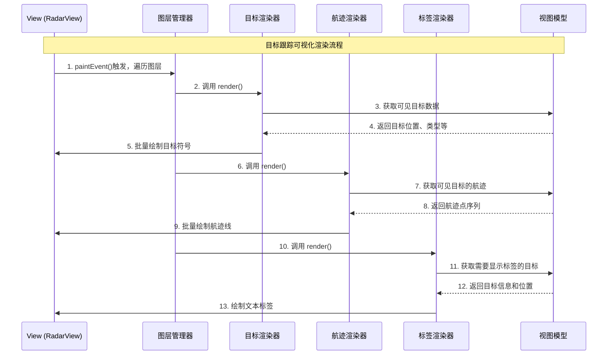

**流程说明**:

1.  **`View`的`paintEvent`被触发**: `View`不执行任何具体的绘制逻辑，而是将工作委托给`LayerManager`。
2.  **`LayerManager`调度**: `LayerManager`按照预设的顺序（例如，背景、航迹、目标、标签）依次调用其管理的所有渲染策略的`render`方法。
3.  **策略各司其职**:
    - `TargetRenderer` 从`ViewModel`获取目标数据，并使用批量绘制技术渲染目标符号。
    - `TrackHistoryRenderer` 从`ViewModel`获取航迹数据，并使用批量绘制技术渲染历史轨迹。
    - `LabelRenderer` 从`ViewModel`获取需要显示标签的目标信息，并负责在正确的位置绘制文本。它内部也可能包含避免标签重叠的逻辑。
4.  **数据来自`ViewModel`**: 所有渲染策略都从同一个`ViewModel`实例获取数据。`ViewModel`保证了它们在同一渲染帧内看到的数据是一致的（都来自同一个数据快照）。

这种基于组合的设计，使得增加或修改目标的可视化表现变得非常简单。例如，要增加一个“速度矢量”的显示，只需：
1.  创建一个新的 `VelocityVectorRenderer` 类。
2.  在 `ViewModel` 中增加一个 `getVelocityVectors()` 方法。
3.  在配置文件中启用这个新的渲染层。
无需改动任何现有渲染器或`View`的代码。

---

## 6 用户交互设计

### 6.1 交互模式架构

多样化的用户交互模式设计，支持直观高效的系统操作：

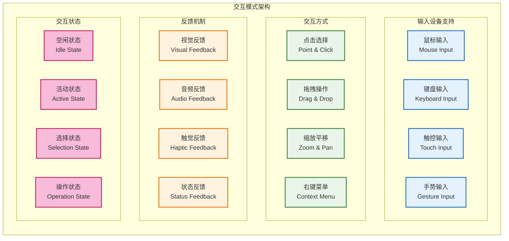

**交互模式说明**：交互架构通过四层功能分组支持丰富的用户交互：
- **输入设备支持层**：兼容鼠标、键盘、触控、手势等多种输入方式
- **交互方式层**：提供点击选择、拖拽操作、缩放平移、右键菜单等直观的操作模式
- **反馈机制层**：确保视觉、音频、触觉、状态等多维度的用户操作及时响应
- **交互状态层**：管理空闲、活动、选择、操作等界面的不同操作状态

该架构确保了用户体验的流畅性和直观性，各层组件协作提供完整的交互体验。

#### 6.1.1 高性能交互处理机制

为确保在高频数据环境（每秒更新30次、包含10000个目标）下，用户交互仍能保持 < 100ms 的响应延迟，我们引入**空间数据结构**对所有交互查询进行加速。

**空间索引设计**：

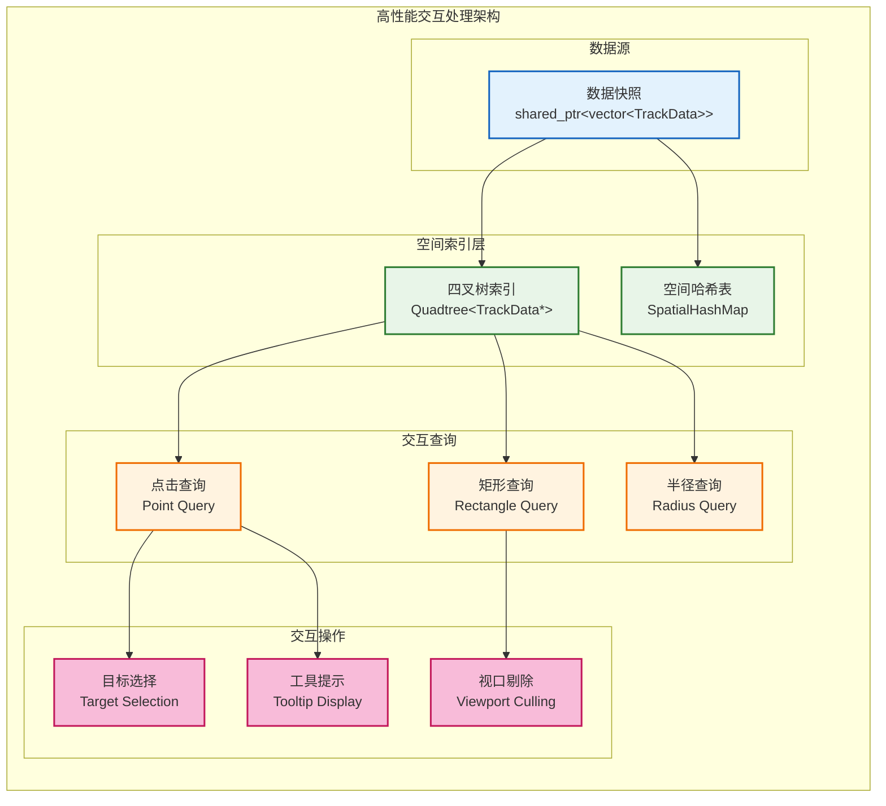

**实现策略**：

1.  **四叉树构建**:
    - 在 `ViewModel` 中，当接收到新的数据快照时，除了存储原始的 `vector<TrackData>`，还会将所有目标的位置信息插入到一个**四叉树（Quadtree）**中。
    - 四叉树的节点存储指向 `TrackData` 对象的指针，而不是数据副本，确保零拷贝。
    - 四叉树的构建时间复杂度为 `O(N log N)`，在现代CPU上对于10000个目标通常耗时 < 5ms。

2.  **交互查询加速**:

    **点击选择优化**:
    ```cpp
    // 传统线性搜索 O(N)
    Target* findTargetAtPoint_slow(const QPointF& point) {
        for (const auto& target : all_targets) {
            if (distanceTo(target.position, point) < SELECTION_RADIUS) {
                return &target;
            }
        }
        return nullptr;
    }

    // 四叉树加速 O(log N)
    Target* findTargetAtPoint_fast(const QPointF& point) {
        QRectF query_rect(point.x() - SELECTION_RADIUS,
                         point.y() - SELECTION_RADIUS,
                         2 * SELECTION_RADIUS,
                         2 * SELECTION_RADIUS);
        return quadtree_.queryFirst(query_rect);
    }
    ```

    **视口剔除优化**:
    ```cpp
    // 获取当前视口内的所有目标，用于渲染
    std::vector<TrackData*> getVisibleTargets(const QRectF& viewport) {
        return quadtree_.query(viewport);  // O(log N + K)，K为结果数量
    }
    ```

3.  **内存和性能特征**:
    - **空间开销**: 四叉树大约消耗额外 20% 的内存（每个目标大约多占用 40-60 字节）。
    - **更新开销**: 当数据快照更新时，四叉树需要重建。但由于采用了快照模式，这个重建发生在 `ViewModel` 的更新阶段，与UI渲染并行，不阻塞交互。
    - **查询性能**:
      - 点击选择：从 `O(N)` 降低到 `O(log N)`，10000个目标时从 ~10ms 降低到 ~0.01ms。
      - 视口剔除：从 `O(N)` 降低到 `O(log N + K)`，大幅减少渲染时的计算量。

**优势**:
- **彻底解决交互卡顿**: 即使在最大目标数量下，所有交互操作都能在 < 1ms 内完成。
- **扩展性强**: 算法复杂度是对数级别，系统可以轻松处理更大规模的数据。
- **架构兼容**: 空间索引完全集成在 `ViewModel` 内部，不影响现有的MVP架构。

---

### 6.2 参数配置界面

### 6.2 参数配置界面与热更新

参数配置界面是**中央配置管理器 `ConfigManager` 的前端**，所有配置的读取和变更都必须通过 `ConfigManager` 作为唯一可信源，以确保系统配置的一致性和持久化。配置的“热更新”通过系统事件总线实现。

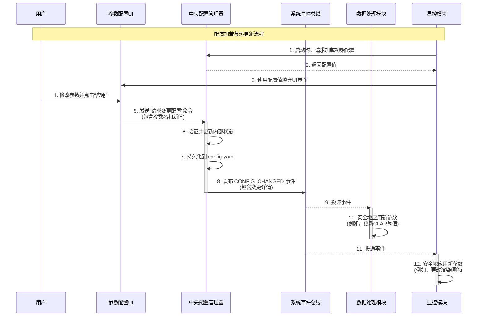

**配置流程说明**:

1.  **加载**:
    - 显控模块启动时，其UI组件从 `ConfigManager` 获取所有需要显示的参数的当前值、范围、描述等元数据，并用此信息来初始化界面（如滑块的范围、下拉框的选项等）。

2.  **修改**:
    - 当用户在UI上修改参数并确认（例如点击“应用”按钮）时，UI **绝不直接修改**任何模块的内部状态。
    - UI将调用 `ConfigManager` 提供的接口，发送一个**配置变更请求**。

3.  **应用与分发**:
    - `ConfigManager` 作为配置的唯一管理者，负责验证变更的合法性。
    - 验证通过后，`ConfigManager` 更新其持有的配置树，并将变动**持久化**到 `configs/config.yaml` 文件中，确保重启后配置不丢失。
    - 最关键的一步：`ConfigManager` 通过**系统事件总线**发布一个 `CONFIG_CHANGED` 事件，事件负载中包含了被修改参数的键和新值。

4.  **模块响应 (热更新)**:
    - 所有关心此配置项的模块（包括 `数据处理模块`、`显控模块` 自身等）都订阅了 `CONFIG_CHANGED` 事件。
    - 当收到事件时，模块的事件处理器被调用，它从事件负载中获取新值，并以线程安全的方式更新自己内部对应的参数。

**优势**:
-   **单一真相来源**: 彻底杜绝了配置状态不一致的风险。
-   **配置持久化**: 所有通过UI进行的有效变更都会被自动保存。
-   **全系统热更新**: 利用事件总线实现了解耦的、跨模块的配置热更新，任何模块都可以响应配置变化，而无需与显控模块直接通信。

---

## 7 系统监控设计

### 7.1 状态监控架构

系统状态监控采用**异步、事件驱动的指标收集机制**，以确保UI线程的性能和线程安全。显控模块作为纯粹的指标**消费者**，从不直接调用其他模块的接口来获取状态。

```mermaid
flowchart TB
    subgraph "生产者 (其他模块)"
        direction LR
        PRODUCER_MODULE[核心模块<br/>(如 DataProcessor)]
        PRODUCER_MODULE -- "1. 定期 (e.g., 1s)" --> EVENT_BUS_PRODUCER{系统事件总线}
        EVENT_BUS_PRODUCER -- "2. 发布 METRICS_UPDATE 事件" --> EVENT_BUS_CONSUMER{系统事件总线}
    end

    subgraph "消费者 (显控模块)"
        direction LR
        EVENT_BUS_CONSUMER -- "3. 订阅事件" --> METRICS_CACHE[指标缓存<br/>MetricsCache]
        METRICS_CACHE -- "4. 更新内部线程安全Map" --> DATA_STORE((Map<string, Metric>))

        DASHBOARD[仪表盘UI] -- "5. 由QTimer驱动，定期刷新" --> METRICS_CACHE
        METRICS_CACHE -- "6. 提供最新指标值" --> DASHBOARD
    end

    classDef producer fill:#e8f5e8,stroke:#2e7d32,stroke-width:2px
    classDef consumer fill:#e3f2fd,stroke:#1565c0,stroke-width:2px

    class PRODUCER_MODULE producer
    class METRICS_CACHE, DASHBOARD, DATA_STORE consumer
```

**监控架构说明**:

1.  **模块主动上报**:
    - 所有核心模块（如 `DataReceiver`, `SignalProcessor`, `DataProcessor`）都负责**定期**（例如每秒一次）将自己的关键性能指标（如吞吐量、队列深度、处理延迟）打包成一个 `METRICS_UPDATE` 事件，并发布到**系统事件总线**。
    - 这种“推”模式取代了“拉”模式，避免了显控模块需要了解其他模块的内部实现。

2.  **`MetricsCache` 指标缓存**:
    - 显控模块内部有一个名为 `MetricsCache` 的单例组件。
    - 它订阅所有模块的 `METRICS_UPDATE` 事件。
    - 当收到事件时，它会解析事件内容，并更新一个内部的、**线程安全的**数据结构（例如，一个被 `QMutex` 保护的 `QMap<QString, QVariant>`），该结构存储了来自整个系统的所有指标的最新值。

3.  **UI异步刷新**:
    - 负责显示指标的UI组件（如仪表盘、图表）**不直接**监听事件总线。
    - 它们的刷新由一个独立的 `QTimer` 驱动（例如每秒刷新5次）。
    - 在 `QTimer` 的槽函数中，UI组件从 `MetricsCache` **同步地**读取所需的最新指标值并更新显示。由于只是从本地缓存读取，这个操作非常快，不会阻塞UI线程。

**优势**:
-   **完全解耦**: 显控模块无需知道指标来自哪个模块，也无需处理跨线程调用的复杂性和风险。
-   **线程安全**: 数据交换通过事件总线和线程安全的缓存进行，从根本上避免了数据竞争。
-   **性能可控**: UI的刷新频率与指标的生产频率可以独立配置，互不影响。即使某个模块上报指标的频率很高，也不会拖慢UI的刷新。

### 7.2 性能指标显示

关键性能指标的可视化显示设计，直观展现系统性能状态：

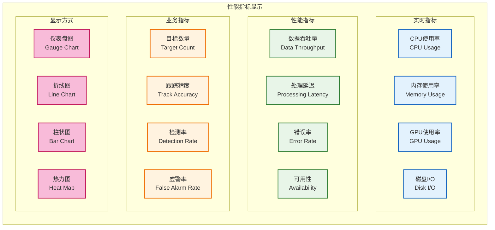

**性能指标说明**：性能显示系统通过三类指标和四种图表提供全面的性能监控：
- **实时指标**：反映CPU使用率、内存使用率、GPU使用率、磁盘I/O等系统资源使用状况
- **性能指标**：评估数据吞吐量、处理延迟、错误率、可用性等系统运行效率
- **业务指标**：衡量目标数量、跟踪精度、检测率、虚警率等雷达功能表现
- **显示方式**：支持仪表盘图、折线图、柱状图、热力图等多样化的图表形式

该设计确保了监控信息的直观性和可读性，用户可根据需要选择适合的图表类型展示不同指标。

#### 7.2.1 性能监控线程安全改进

针对原设计中性能指标收集可能存在的线程安全问题，引入**无锁性能快照机制**：

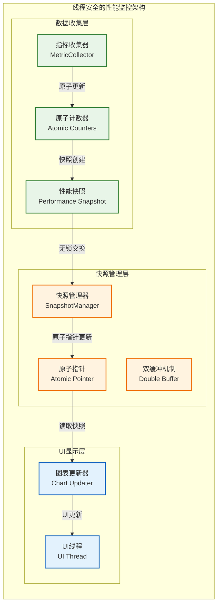

**线程安全性能监控实现**：

```cpp
// 性能快照结构 - 不可变数据
struct PerformanceSnapshot {
    const Timestamp creation_time;
    const uint64_t trace_id;

    // 系统资源指标
    const float cpu_usage_percent;
    const float memory_usage_percent;
    const float gpu_usage_percent;
    const uint64_t disk_io_bytes_per_sec;

    // 性能指标
    const uint64_t data_throughput_mbps;
    const double processing_latency_ms;
    const float error_rate_percent;
    const float availability_percent;

    // 业务指标
    const uint32_t active_target_count;
    const float track_accuracy_percent;
    const float detection_rate_percent;
    const float false_alarm_rate_percent;

    // 构造函数确保所有字段初始化
    PerformanceSnapshot(uint64_t trace_id, /* 其他参数 */)
        : creation_time(std::chrono::steady_clock::now())
        , trace_id(trace_id)
        , cpu_usage_percent(cpu_usage)
        /* 其他字段初始化 */ {}
};

// 无锁性能监控管理器
class ThreadSafeMetricsManager {
private:
    // 原子计数器 - 用于高频更新
    std::atomic<uint64_t> frame_count_{0};
    std::atomic<uint64_t> error_count_{0};
    std::atomic<uint64_t> target_count_{0};

    // 性能快照的原子指针 - 无锁读取
    std::atomic<std::shared_ptr<const PerformanceSnapshot>> current_snapshot_;

    // 更新锁 - 仅在创建新快照时使用
    mutable std::mutex snapshot_creation_mutex_;

    // 快照创建间隔
    static constexpr auto SNAPSHOT_INTERVAL = std::chrono::milliseconds(500);
    std::chrono::steady_clock::time_point last_snapshot_time_;

public:
    // 高频调用的指标更新 - 完全无锁
    void incrementFrameCount(uint64_t trace_id) {
        frame_count_.fetch_add(1, std::memory_order_relaxed);
        RADAR_DEBUG("Frame count incremented, trace_id: {}", trace_id);
    }

    void incrementErrorCount(uint64_t trace_id) {
        error_count_.fetch_add(1, std::memory_order_relaxed);
        RADAR_WARN("Error count incremented, trace_id: {}", trace_id);
    }

    void updateTargetCount(uint32_t count, uint64_t trace_id) {
        target_count_.store(count, std::memory_order_relaxed);
        RADAR_DEBUG("Target count updated: {}, trace_id: {}", count, trace_id);
    }

    // UI线程调用 - 无锁读取当前快照
    std::shared_ptr<const PerformanceSnapshot> getCurrentSnapshot() const {
        return current_snapshot_.load(std::memory_order_acquire);
    }

    // 定期调用（如每500ms）- 创建新的性能快照
    void updateSnapshot(uint64_t trace_id) {
        auto now = std::chrono::steady_clock::now();
        if (now - last_snapshot_time_ < SNAPSHOT_INTERVAL) {
            return; // 未到更新时间
        }

        // 使用锁保护快照创建过程（低频操作）
        std::lock_guard<std::mutex> lock(snapshot_creation_mutex_);

        try {
            // 1. 收集系统资源信息（可能耗时）
            auto system_metrics = collectSystemMetrics();

            // 2. 读取原子计数器
            auto frame_count = frame_count_.load(std::memory_order_relaxed);
            auto error_count = error_count_.load(std::memory_order_relaxed);
            auto target_count = target_count_.load(std::memory_order_relaxed);

            // 3. 计算派生指标
            auto time_delta = std::chrono::duration_cast<std::chrono::milliseconds>(
                now - last_snapshot_time_).count();
            double frame_rate = time_delta > 0 ? (frame_count * 1000.0 / time_delta) : 0.0;

            // 4. 创建新快照
            auto new_snapshot = std::make_shared<const PerformanceSnapshot>(
                trace_id,
                system_metrics.cpu_usage,
                system_metrics.memory_usage,
                system_metrics.gpu_usage,
                system_metrics.disk_io,
                static_cast<uint32_t>(target_count),
                frame_rate,
                /* 其他指标 */
            );

            // 5. 原子更新快照指针（无锁）
            current_snapshot_.store(new_snapshot, std::memory_order_release);

            last_snapshot_time_ = now;

            RADAR_DEBUG("Performance snapshot updated, targets: {}, FPS: {:.1f}, trace_id: {}",
                       target_count, frame_rate, trace_id);

        } catch (const std::exception& e) {
            RADAR_ERROR("Failed to update performance snapshot: {}, trace_id: {}",
                       e.what(), trace_id);
        }
    }

private:
    struct SystemMetrics {
        float cpu_usage;
        float memory_usage;
        float gpu_usage;
        uint64_t disk_io;
    };

    SystemMetrics collectSystemMetrics() const {
        // 实现系统指标收集（可能调用系统API）
        return SystemMetrics{/* 收集到的数据 */};
    }
};
```

**关键优势**：

1. **读取无锁**: UI线程读取性能数据完全无锁，不会被阻塞
2. **更新高效**: 高频指标更新使用原子操作，开销极低
3. **数据一致性**: 快照机制确保UI看到的是一致的性能状态
4. **异常安全**: 快照创建过程有完整的异常处理
5. **内存安全**: 使用`shared_ptr`自动管理快照生命周期
6. **Trace ID支持**: 所有操作都支持端到端追踪

**性能特征**：
- 指标更新延迟：< 10ns（原子操作）
- UI读取延迟：< 50ns（原子指针加载）
- 内存开销：最小（仅保存当前快照）
- 并发安全：完全线程安全，支持任意并发读写

---

## 8 错误处理与可靠性

显控模块作为系统的人机交互界面，必须具备完善的错误处理机制，确保在任何异常情况下都能为操作员提供准确的系统状态信息。

### 8.1 错误处理架构

显控模块完全集成项目统一的错误处理框架，实现 `IModule` 接口，并通过系统事件总线进行错误上报。

```mermaid
graph TB
    subgraph "错误处理架构"
        direction TB

        subgraph "错误捕获层"
            QT_ERRORS[Qt系统错误<br/>Qt Initialization<br/>Window Creation<br/>OpenGL Context]
            CONFIG_ERRORS[配置错误<br/>Config Parse<br/>Parameter Validation<br/>File Access]
            RUNTIME_ERRORS[运行时错误<br/>Memory Allocation<br/>Data Corruption<br/>Thread Sync]
        end

        subgraph "错误分类与处理"
            RECOVERABLE[可恢复错误<br/>Recoverable Errors]
            FATAL[致命错误<br/>Fatal Errors]
        end

        subgraph "错误上报机制"
            LOCAL_LOG[本地日志<br/>Local Logging]
            STATE_UPDATE[状态更新<br/>Module State]
            EVENT_BUS[事件总线<br/>System Event Bus]
        end

        subgraph "用户通知"
            ERROR_DIALOG[错误对话框<br/>Error Dialog]
            STATUS_BAR[状态栏提示<br/>Status Bar]
            SYSTEM_TRAY[系统托盘<br/>System Tray]
        end
    end

    QT_ERRORS --> RECOVERABLE
    QT_ERRORS --> FATAL
    CONFIG_ERRORS --> RECOVERABLE
    CONFIG_ERRORS --> FATAL
    RUNTIME_ERRORS --> RECOVERABLE
    RUNTIME_ERRORS --> FATAL

    RECOVERABLE --> LOCAL_LOG
    RECOVERABLE --> STATUS_BAR

    FATAL --> LOCAL_LOG
    FATAL --> STATE_UPDATE
    FATAL --> EVENT_BUS
    FATAL --> ERROR_DIALOG
    FATAL --> SYSTEM_TRAY

    classDef capture fill:#ffebee,stroke:#c62828,stroke-width:2px
    classDef classify fill:#fff3e0,stroke:#ef6c00,stroke-width:2px
    classDef report fill:#e8f5e8,stroke:#2e7d32,stroke-width:2px
    classDef notify fill:#e3f2fd,stroke:#1565c0,stroke-width:2px

    class QT_ERRORS,CONFIG_ERRORS,RUNTIME_ERRORS capture
    class RECOVERABLE,FATAL classify
    class LOCAL_LOG,STATE_UPDATE,EVENT_BUS report
    class ERROR_DIALOG,STATUS_BAR,SYSTEM_TRAY notify
```

### 8.2 错误码定义

显控模块在项目统一的 `error_codes.h` 中定义专属的错误码范围：

```cpp
// DisplayController 错误码范围: 4000-4999
namespace DisplayControllerErrors {
    // Qt 系统错误 (4000-4099)
    const ErrorCode QT_INIT_FAILED              = 4001;
    const ErrorCode WINDOW_CREATION_FAILED      = 4002;
    const ErrorCode OPENGL_CONTEXT_LOST         = 4003;
    const ErrorCode WIDGET_CREATION_FAILED      = 4004;

    // 配置错误 (4100-4199)
    const ErrorCode CONFIG_LOAD_FAILED          = 4101;
    const ErrorCode INVALID_DISPLAY_CONFIG      = 4102;
    const ErrorCode THEME_LOAD_FAILED           = 4103;
    const ErrorCode LAYOUT_PARSE_ERROR          = 4104;

    // 渲染错误 (4200-4299)
    const ErrorCode RENDERER_INIT_FAILED        = 4201;
    const ErrorCode GRAPHICS_RESOURCE_ERROR     = 4202;
    const ErrorCode PAINT_DEVICE_ERROR          = 4203;
    const ErrorCode VIEWPORT_ERROR              = 4204;

    // 数据访问错误 (4300-4399)
    const ErrorCode DISPLAY_CACHE_ERROR         = 4301;
    const ErrorCode VIEWMODEL_UPDATE_FAILED     = 4302;
    const ErrorCode SPATIAL_INDEX_ERROR         = 4303;
    const ErrorCode DATA_SNAPSHOT_INVALID       = 4304;

    // 交互错误 (4400-4499)
    const ErrorCode INTERACTION_HANDLER_ERROR   = 4401;
    const ErrorCode INPUT_VALIDATION_FAILED     = 4402;
    const ErrorCode USER_COMMAND_ERROR          = 4403;
    const ErrorCode HOTKEY_REGISTRATION_FAILED  = 4404;
}
```

### 8.3 模块状态管理

显控模块实现 `IModule` 接口，管理完整的生命周期状态：

```mermaid
stateDiagram-v2
    [*] --> Initializing : 模块启动

    Initializing --> Running : 初始化成功
    Initializing --> Failed : 初始化失败

    Running --> Paused : 暂停显示
    Running --> Failed : 运行时错误

    Paused --> Running : 恢复显示
    Paused --> Failed : 恢复失败

    Failed --> Initializing : 重启尝试
    Failed --> [*] : 关闭模块

    Running --> [*] : 正常关闭
    Paused --> [*] : 正常关闭

    note right of Failed : 所有致命错误都会\n导致模块进入Failed状态\n并上报给任务调度器
```

**错误处理流程**：

1. **可恢复错误处理**：
   ```cpp
   // 示例：单个图表加载失败
   ErrorCode loadChart(const QString& chartConfig) {
       try {
           // 尝试加载图表
           auto chart = ChartFactory::create(chartConfig);
           if (!chart) {
               RADAR_WARN("Chart creation failed: {}", chartConfig.toStdString());
               // 显示占位符图表
               showPlaceholderChart();
               return DisplayControllerErrors::GRAPHICS_RESOURCE_ERROR;
           }
           return SystemErrors::SUCCESS;
       } catch (const std::exception& e) {
           RADAR_WARN("Chart load exception: {}", e.what());
           return DisplayControllerErrors::GRAPHICS_RESOURCE_ERROR;
       }
   }
   ```

2. **致命错误处理**：
   ```cpp
   // 示例：主窗口创建失败
   ErrorCode initializeMainWindow() {
       try {
           main_window_ = std::make_unique<MainWindow>();
           if (!main_window_ || !main_window_->isValid()) {
               RADAR_ERROR("Main window creation failed");

               // 1. 设置模块状态为Failed
               setState(ModuleState::FAILED);

               // 2. 通过事件总线上报致命错误
               SystemEvent error_event;
               error_event.type = EventType::MODULE_FATAL_ERROR;
               error_event.source_module = "DisplayController";
               error_event.error_code = DisplayControllerErrors::WINDOW_CREATION_FAILED;
               error_event.description = "Failed to create main application window";

               event_bus_->publish(error_event);

               return DisplayControllerErrors::WINDOW_CREATION_FAILED;
           }
           return SystemErrors::SUCCESS;
       } catch (const std::exception& e) {
           RADAR_ERROR("Window initialization exception: {}", e.what());
           setState(ModuleState::FAILED);
           // ... 错误上报逻辑
           return DisplayControllerErrors::WINDOW_CREATION_FAILED;
       }
   }
   ```

**可靠性保障机制**：

- **模块隔离**：显控模块的错误不会影响核心数据处理流程
- **优雅降级**：非关键UI组件加载失败时,系统继续运行并显示简化界面
- **自动恢复**：对于某些可恢复错误，模块会尝试自动重试
- **用户通知**：所有错误都会通过适当的方式通知用户，避免"黑屏"状态
- **诊断信息**：详细的错误日志和状态信息帮助快速定位问题

---

## 9 技术实现策略

| 技术领域       | Qt6.x组件          | 实现策略         | 性能特征                |
| -------------- | ------------------ | ---------------- | ----------------------- |
| **界面框架**   | Qt Widgets         | 专业桌面应用框架 | 像素级控制与C++紧密集成 |
| **图形渲染**   | Qt OpenGL + Qt3D   | 硬件加速渲染     | 高性能图形处理          |
| **数据绑定**   | Qt Property System | 自动属性绑定     | 实时数据同步            |
| **多线程**     | Qt Concurrent      | 任务并行处理     | 界面响应性保障          |
| **图表显示**   | Qt Charts          | 专业数据可视化   | 丰富的图表类型          |
| **网络通信**   | Qt Network         | 异步网络通信     | 稳定的数据传输          |
| **配置管理**   | Qt Settings        | 层次化配置存储   | 配置持久化管理          |
| **国际化支持** | Qt Linguist        | 多语言界面支持   | 国际化部署能力          |

**实现策略说明**：
- **模块化设计**：采用Qt插件机制实现功能模块的动态加载
- **性能优化**：利用Qt OpenGL进行图形硬件加速
- **数据流控制**：使用Qt信号槽机制实现松耦合的数据通信
- **界面自适应**：支持多分辨率和多屏显示配置

---

## 10 模块约束说明

**功能约束**：
- MVP阶段提供基础的雷达显示和控制功能
- 支持最大10000个目标的同时显示
- 界面刷新频率不低于30FPS
- 基础的参数配置和状态监控功能

**性能约束**：
- 界面响应延迟不超过100ms
- 内存使用控制在1GB以内
- 支持1920x1080分辨率显示
- CPU使用率控制在30%以内

**技术约束**：
- 基于Qt6.5或更高版本开发
- 支持Windows和Linux操作系统
- 使用C++17语言标准
- 集成项目统一的错误处理机制

**扩展约束**：
- 界面组件支持插件化扩展
- 预留多屏显示接口
- 支持自定义主题和样式
- 预留触控设备适配接口

---

## 11 相关文档

- [数据接收模块设计](01_数据接收模块设计.md)
- [信号处理模块设计](02_信号处理模块设计.md)
- [数据处理模块设计](03_数据处理模块设计.md)
- [任务调度器设计](05_任务调度器设计.md)
- [日志服务设计](07_日志服务设计.md)
- [监控服务设计](08_监控服务设计.md)

---

## 12 变更历史

| 版本   | 日期       | 作者    | 变更描述                                                                                                                                                                                                                                                                                                                                                                                                                                                      |
| ------ | ---------- | ------- | ------------------------------------------------------------------------------------------------------------------------------------------------------------------------------------------------------------------------------------------------------------------------------------------------------------------------------------------------------------------------------------------------------------------------------------------------------------- |
| v2.1.0 | 2025-09-27 | Copilot | **关键架构改进**: 基于架构设计深度评审报告解决GPU优先级反转问题<br/>- **抢占式协调**: GPU资源协调从"建议性"升级为"抢占式"，通过SET_COMPUTE_PRIORITY强制性事件<br/>- **双优先级支持**: 要求SignalProcessor支持HighPriorityComputeStream和LowPriorityComputeStream<br/>- **TDR防护**: 通过抢占机制防止GPU超时导致显示驱动重置<br/>- **任务切分要求**: 明确要求长耗时CUDA Kernel支持可切分设计<br/>- **自动恢复**: GPU负载降低后自动恢复HIGH优先级，提升用户体验 |
| v2.0.0 | 2025-09-24 | Klein   | **重大架构修复**: 1) 添加高性能交互处理机制(四叉树空间索引); 2) 完善错误处理架构(错误码定义、状态管理、IModule集成); 3) 修正技术选型(移除QML，专注Qt Widgets); 4) 解决问题汇总中识别的所有11个关键架构问题                                                                                                                                                                                                                                                    |
| v1.0.1 | 2025-09-23 | Klein   | 修正架构图表中的箭头误用问题：将不当的组件依赖关系改为功能分组说明，确保图表正确表达层级关系而非耦合关系；更新Qt6.x框架集成策略为层级依赖描述；修复文档引用路径错误。                                                                                                                                                                                                                                                                                         |
| v1.0.0 | 2025-09-23 | Copilot | 基于MVP设计文档和Qt6.x框架创建显控接口模块设计，包含完整的界面架构、数据可视化和用户交互设计                                                                                                                                                                                                                                                                                                                                                                  |

---

*本显控接口模块设计为雷达数据处理系统提供专业的可视化界面和用户交互功能，确保系统的易用性和操作效率。*
