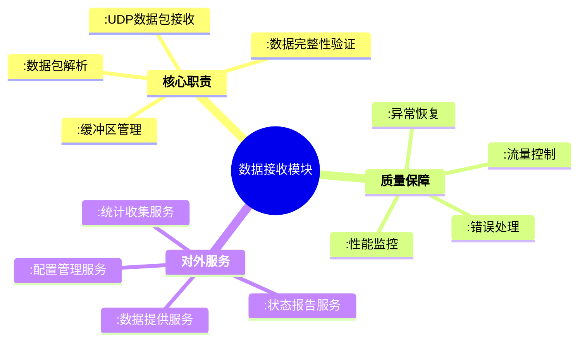
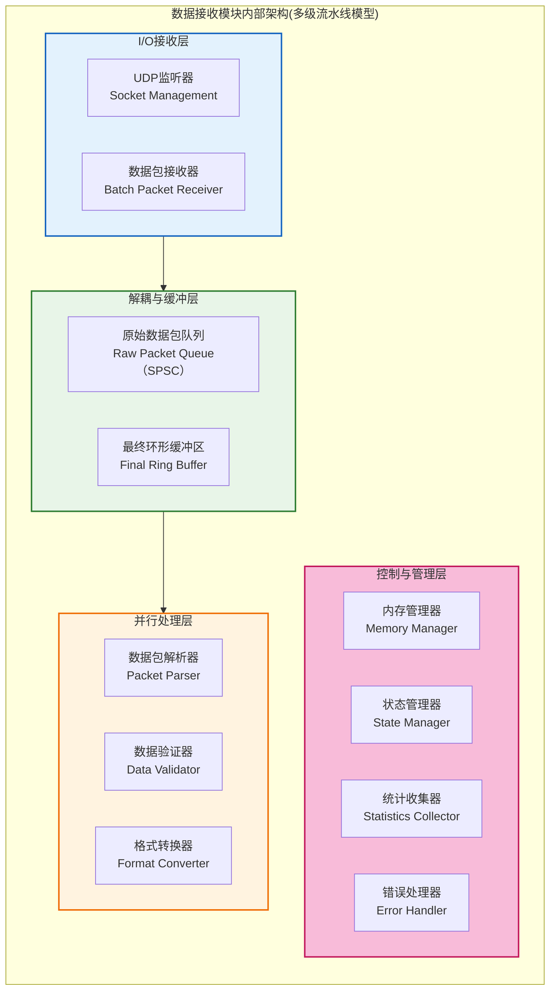
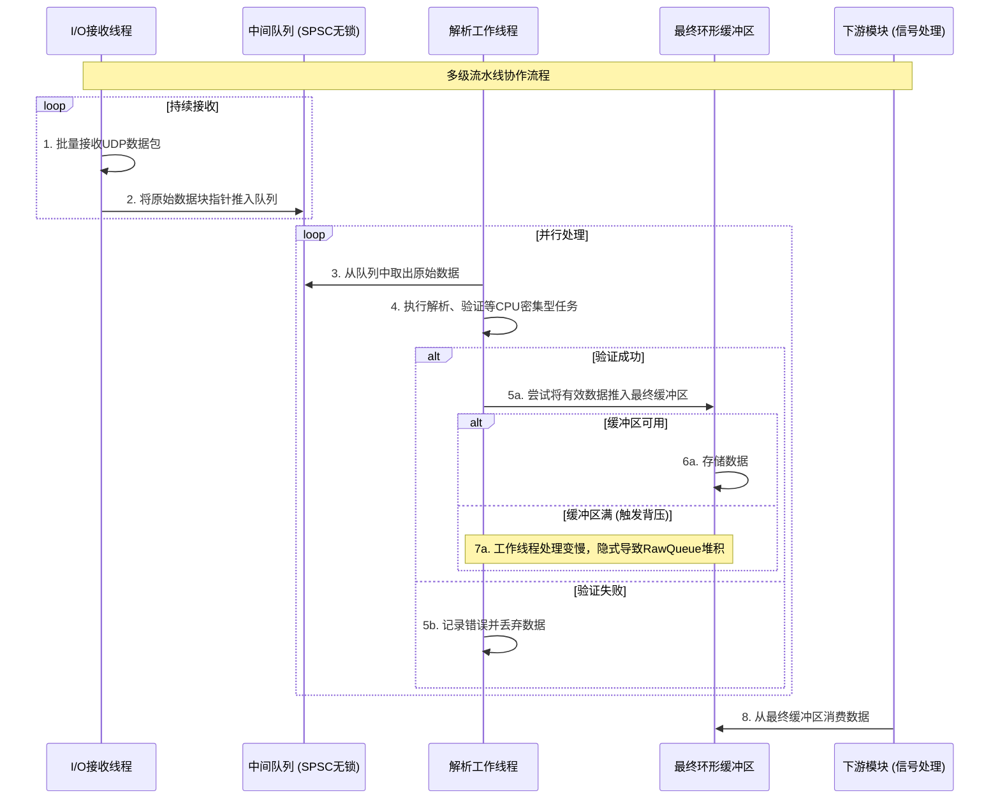
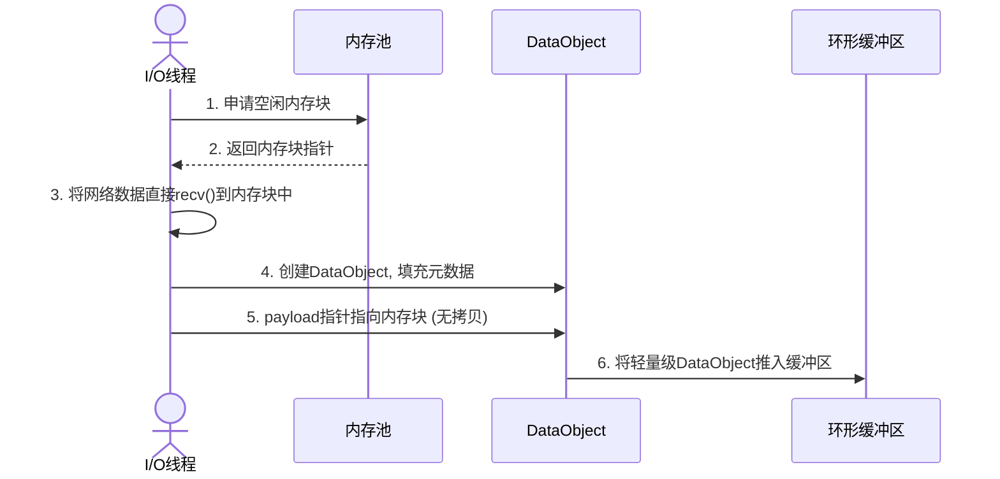
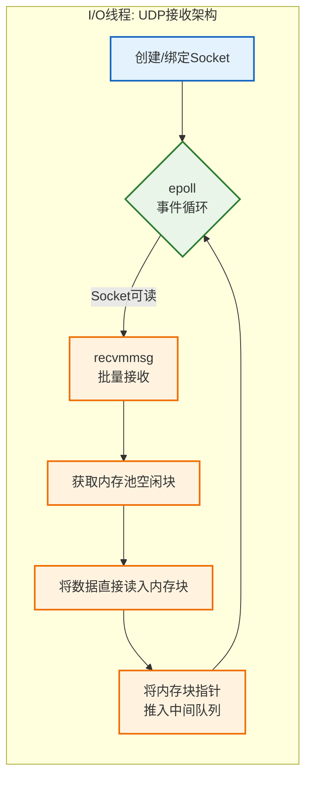
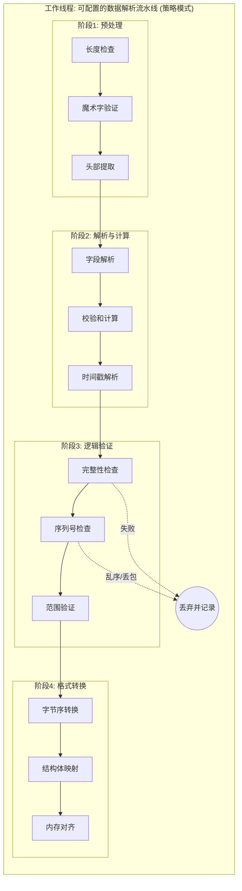
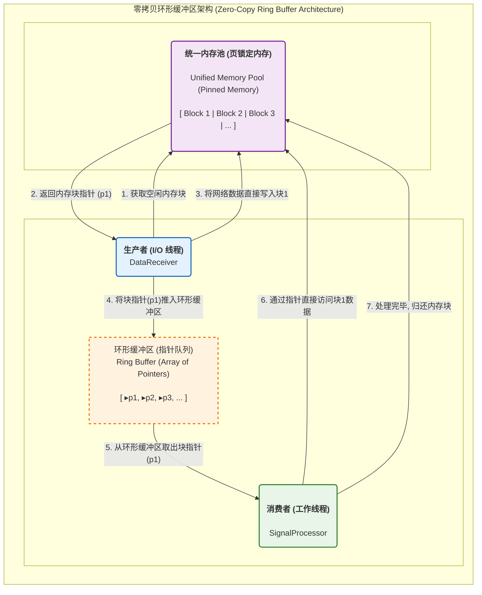
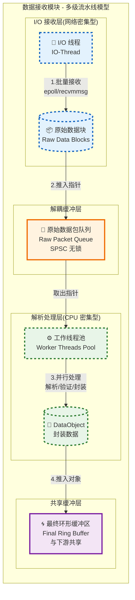
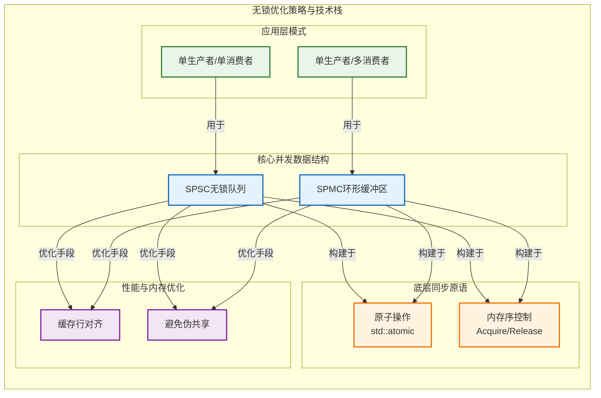

# 数据接收模块设计

**文档版本**: v1.2.0
**最后更新**: 2025-09-24
**负责人**: Kelin
**适用阶段**: MVP及向 V2.0 性能优化过渡阶段
**来源依据**: 基于《MVP系统设计文档》第5.1章数据接收模块和第2.2.1章详细组件架构

---

## 1 文档职责

### 1.1 文档范围
本文件详细设计数据接收模块的内部架构和核心机制，覆盖：
1) UDP网络数据接收和解析机制
2) 数据包验证和完整性保障策略
3) 环形缓冲区管理和流量控制设计
4) 错误处理和异常恢复机制
5) 性能优化和资源管理策略
6) 模块内部组件协作和状态管理

### 1.2 目录
- [数据接收模块设计](#数据接收模块设计)
  - [1 文档职责](#1-文档职责)
    - [1.1 文档范围](#11-文档范围)
    - [1.2 目录](#12-目录)
  - [2 模块总体设计](#2-模块总体设计)
    - [2.1 模块职责定义](#21-模块职责定义)
    - [2.2 模块边界和约束](#22-模块边界和约束)
  - [3 内部架构设计](#3-内部架构设计)
    - [3.1 组件组织结构](#31-组件组织结构)
    - [3.2 组件职责分工](#32-组件职责分工)
    - [3.3 组件协作机制](#33-组件协作机制)
      - [3.3.1 多级流水线协作流程](#331-多级流水线协作流程)
      - [3.3.2 数据封装 (零拷贝实现)](#332-数据封装-零拷贝实现)
  - [4 数据接收机制](#4-数据接收机制)
    - [4.1 UDP接收架构](#41-udp接收架构)
      - [4.1.1 基础架构](#411-基础架构)
      - [4.1.2 端口动态发现与自动选择机制](#412-端口动态发现与自动选择机制)
      - [4.1.3 网络接口就绪等待与重试](#413-网络接口就绪等待与重试)
      - [4.1.4 热更新与软重启接口](#414-热更新与软重启接口)
    - [4.2 数据解析流程](#42-数据解析流程)
    - [4.3 数据验证策略](#43-数据验证策略)
  - [5 缓冲区管理设计](#5-缓冲区管理设计)
    - [5.1 环形缓冲区架构](#51-环形缓冲区架构)
    - [5.2 流量控制机制](#52-流量控制机制)
  - [6 并发处理设计](#6-并发处理设计)
    - [6.1 多级流水线并发模型](#61-多级流水线并发模型)
    - [6.2 无锁优化策略](#62-无锁优化策略)
  - [7 错误处理设计](#7-错误处理设计)
    - [7.1 异常分类体系](#71-异常分类体系)
    - [7.2 恢复机制设计](#72-恢复机制设计)
      - [7.2.1 模块事件总线 (Module Event Bus)](#721-模块事件总线-module-event-bus)
      - [7.2.2 分级错误处理策略](#722-分级错误处理策略)
      - [7.2.3 任务调度器的决策逻辑](#723-任务调度器的决策逻辑)
      - [7.2.4 优势与设计原则](#724-优势与设计原则)
  - [8 性能优化策略](#8-性能优化策略)
    - [8.1 零拷贝数据流架构](#81-零拷贝数据流架构)
    - [8.2 网络I/O优化](#82-网络io优化)
    - [8.3 CPU与内存优化](#83-cpu与内存优化)
  - [9 模块约束说明](#9-模块约束说明)
  - [10 相关文档](#10-相关文档)
  - [11 变更历史](#11-变更历史)


## 2 模块总体设计

### 2.1 模块职责定义

数据接收模块的主要职责包括：

1. **数据接收**：通过UDP协议接收来自雷达阵面的数据包。
2. **数据解析**：对接收到的数据包进行解析，提取有效信息。
3. **数据验证**：对解析后的数据进行完整性和有效性验证。
4. **缓冲区管理**：对接收到的数据进行缓冲和管理，确保数据的高效处理。
5. **错误处理**：对接收和解析过程中出现的错误进行处理和恢复。
6. **性能监控**：对模块的性能进行监控和统计，确保满足性能要求。



### 2.2 模块边界和约束

**输入边界**：
- 雷达阵面发送的UDP数据包（符合项目定义的数据包格式）
- 任务调度器的控制命令（启动、停止、配置更新）
- 配置管理器的参数配置（网络参数、缓冲区配置）

**输出边界**：
- 验证后的原始数据包（推送到信号处理模块）
- 模块运行状态信息（报告给任务调度器）
- 接收统计和性能指标（提供给监控系统）

**性能约束**：
- 单个数据包处理延迟 < 1ms
- 数据包接收成功率 > 99.9%
- 系统资源占用率 < 10%（CPU/内存）
- 支持 10,000 packets/sec 的吞吐量

---

## 3 内部架构设计

### 3.1 组件组织结构

数据接收模块内部采用**多级流水线并发模型**，以分离I/O与计算任务，满足低延迟和高吞吐的需求。下图展示了模块内的组件功能分组。


> 注：本图展示了按线程角色划分的功能分组。I/O接收层运行在专用I/O线程，并行处理层运行在工作线程池。具体协作流程参见 3.3 序列图。

### 3.2 组件职责分工

| 组件名称           | 主要职责                    | 关键功能                                                           | 性能特征               |
| ------------------ | --------------------------- | ------------------------------------------------------------------ | ---------------------- |
| **I/O接收线程**    | 专职网络I/O                 | `epoll`事件循环, `recvmmsg`批量接收                                | 确保最大网络吞吐       |
| **中间队列**       | I/O与工作线程解耦           | SPSC/MPSC无锁队列                                                  | 高效的跨线程数据传递   |
| **解析工作线程池** | CPU密集型任务               | 并行执行可插拔的解析/验证策略                                      | 负载均衡与弹性伸缩     |
| **数据包解析器**   | **策略接口** 原始数据包解析 | 实现`IPacketParser`接口，支持多种数据格式                          | 快速、可扩展的解析算法 |
| **数据验证器**     | **策略接口** 数据完整性检查 | 实现`IPacketValidator`接口，支持多种验证逻辑                       | 错误检测和过滤         |
| **格式转换器**     | 数据格式标准化              | 字节序转换、结构体映射                                             | 零拷贝转换             |
| **环形缓冲区**     | 高效数据缓存                | 无锁读写、内存对齐                                                 | 高吞吐量缓存           |
| **流量控制器**     | 背压和流量管理              | 阻塞队列实现隐式背压                                               | 系统稳定性保障         |
| **错误处理器**     | 异常处理和恢复              | 错误分类、恢复策略                                                 | 系统健壮性             |
| **统计收集器**     | 性能指标收集                | **多维度分类错误计数**、**错误率计算与阈值监控**、吞吐量、延迟统计 | 实时性能监控           |

### 3.3 组件协作机制

#### 3.3.1 多级流水线协作流程

组件间通过多级流水线并发模型实现高效的数据处理流程，将I/O与计算分离：



#### 3.3.2 数据封装 (零拷贝实现)
为实现极致性能并遵循零拷贝原则，验证通过的数据将通过引用而非拷贝的方式进行封装。此过程与内存管理器紧密协作。

- **1. 申请内存块**：在接收数据前，从一个大型、预分配的**页锁定内存池 (Pinned Memory Pool)** 中获取一个固定大小的内存块 (`PacketBlock`)。
- **2. 直接接收数据**：网络数据包被直接 `recv` 到这个内存块中。
- **3. 封装`DataObject`**：
  - 创建 `DataObject` 实例。
  - 其 `payload` 字段**不再是数据容器**，而是存储一个指向该 `PacketBlock` 的**非持有指针或带有自定义删除器的智能指针**。
  - **此过程无任何内存拷贝**。
- **4. 生成元数据**：
  - 设置时间戳、序列号等基本信息。
  - **生成全局唯一的 `Trace ID`**：调用 `TraceIdGenerator` 生成一个高性能、低碰撞率的ID（如 **UUID v7** 格式）。此ID用于贯穿整个系统的分布式追踪，确保日志链的完整性和可观测性。ID生成必须是线程安全的，且单次调用开销在纳秒或低微秒级别。
  - 设置数据类型为 `DataType::RawData`。
- **5. 放入缓冲区**：将封装好的 `DataObject`（它本身很小，仅包含指针和元数据）放入与信号处理模块共享的 `raw_data_buffer` 环形缓冲区中。



---

## 4 数据接收机制

### 4.1 UDP接收架构

I/O接收层采用专用的单线程异步模型，作为多级流水线并发架构的第一级，专职负责网络I/O以最大化网络吞吐量。通过事件驱动机制实现高效的UDP数据包接收，并将后续的CPU密集型处理任务完全交由工作线程池处理。架构设计具备高度的动态适应性和容错能力，支持端口自动选择、网络接口延迟就绪和热更新。

#### 4.1.1 基础架构



**关键设计决策**：
- **I/O专用单线程**：避免在网络接收路径上引入多线程同步开销，将CPU密集型任务完全剥离到工作线程池
- **异步I/O**：使用epoll（Linux）/select（跨平台）实现非阻塞接收
- **事件驱动**：基于回调机制处理socket事件，减少轮询开销

#### 4.1.2 端口动态发现与自动选择机制

为增强部署灵活性和容错能力，模块支持动态端口配置：

- **配置选项**：
  - `port: 0`：让操作系统自动选择可用临时端口
  - `port: "12000-12100"`：指定端口范围，模块依次尝试绑定
  - `port: 12000`：传统固定端口（向后兼容）

- **自动选择流程**：
  1. 模块尝试绑定配置的端口/IP
  2. 若失败且配置为范围，依次尝试下一端口
  3. 若成功，获取实际绑定的端口号（`getsockname`）
  4. 通过事件总线向任务调度器上报实际端口（`MODULE_STATUS_UPDATE`事件）
  5. 记录到日志，便于监控和调试

- **优势**：避免端口冲突导致启动失败，支持容器化部署和动态环境。

#### 4.1.3 网络接口就绪等待与重试

适应网络接口延迟就绪的场景（如DHCP或容器网络）：

- **重试机制**：
  - 在`initialize`阶段，若绑定失败，进入重试循环
  - 每5秒尝试一次，最多持续1分钟
  - 期间状态报告为`INITIALIZING_WAIT_FOR_NETWORK`

- **任务调度器集成**：
  - 调度器识别`INITIALIZING_WAIT_FOR_NETWORK`状态，等待模块就绪
  - 超时后触发告警或降级策略

- **优势**：支持现代云环境和嵌入式系统，减少部署失败率。

#### 4.1.4 热更新与软重启接口

支持在线网络参数变更，通过`restart_network()`私有接口实现：

- **接口设计**：
  ```cpp
  ErrorCode restart_network(const NetworkConfig& new_config);
  ```

- **软重启流程**（考虑背压和状态同步）：
  1. **请求暂停与状态确认**：调度器调用`restart_network()`后，模块向所有工作线程发出"暂停处理新数据"信号，并等待它们完成当前任务进入空闲状态
  2. **清空中间队列**：I/O线程停止从网络读取新数据，等待工作线程将`raw_packet_queue`（中间队列）彻底清空，确保旧Socket数据被完全处理
  3. **执行网络切换**：在确认中间队列为空后，安全执行"创建新Socket → 切换事件循环监听 → 关闭旧Socket"流程
  4. **恢复处理**：切换完成后，释放工作线程的"暂停"信号，恢复整个多级流水线
  5. **超时保护**：整个过程设置超时机制（如30秒），若长时间无法完成则转为更激进的恢复策略（模块重启）

- **调用时机**：任务调度器响应配置变更事件时调用

- **优势**：提供风险可控的在线变更路径，支持高级运维，并妥善处理背压状态下的网络参数变更。

### 4.2 数据解析流程

数据包解析采用流水线处理模式，支持增量解析和快速验证。**关键在于，此流水线并非硬编码实现，而是通过策略模式动态构建**。`DataReceiver`在初始化时，会根据配置，通过工厂模式创建一系列具体的解析和验证策略（如`StandardV1Parser`, `ChecksumValidator`），并将它们串联起来。工作线程在处理数据时，会依次调用这些策略的接口。

这种设计完全遵循了项目核心架构原则，将“如何解析”的算法逻辑与“接收数据”的核心流程完全解耦，保证了系统的可扩展性和可测试性。



### 4.3 数据验证策略

采用多层次验证机制，确保数据包的完整性和有效性：

**验证层次设计**：
- **L1 基础验证**：长度、魔术字、基本格式检查
- **L2 完整性验证**：校验和、CRC、数据一致性检查
- **L3 逻辑验证**：序列号、时间戳、业务逻辑检查
- **L4 质量验证**：数据质量、异常值、统计特征检查

---

## 5 缓冲区管理设计

### 5.1 环形缓冲区架构

为实现生产者-消费者模式下的最高效率和最低延迟，系统采用基于**统一内存池**的无锁环形缓冲区设计。此架构是实现零拷贝数据流的核心。



**架构说明**:
- **统一内存池 (`MEM_POOL`)**: 模块初始化时，会创建一个大型、连续的内存池，专门用于存储网络接收到的原始数据包负载。如果系统使用GPU，此内存池应直接分配为**页锁定内存 (Pinned Memory)**，为后续的GPU DMA操作做好准备。
- **数据对象 (`DataObject`)**: 环形缓冲区中存储的`DataObject`本身不包含数据负载。它的`payload`字段是一个指向内存池中某个数据块的**指针或句柄**。
- **零拷贝流程**:
    1.  **生产者（数据接收模块）**: 从内存池获取一个空闲块，将网络数据直接读入。然后，将该块的指针封装进一个`DataObject`，并将此`DataObject`放入环形缓冲区。
    2.  **消费者（信号处理模块）**: 从环形缓冲区取出一个`DataObject`。通过其`payload`指针直接访问位于页锁定内存中的原始数据，可以直接发起异步`cudaMemcpyAsync`操作到GPU。
    3.  **内存归还**: 当消费者处理完数据后，通过`DataObject`的析构机制（如自定义删除器）将内存块归还给内存池，以供循环使用。

这种设计将内存分配和数据拷贝的开销降至最低，是整个系统高性能的基石。

### 5.2 流量控制机制

为防止下游阻塞导致的数据丢失，系统采用基于多级流水线架构的、清晰可实现的跨线程背压机制。

```mermaid
flowchart LR
    subgraph "多级流水线背压机制"
        direction TB

        subgraph "下游消费端"
            A[最终环形缓冲区<br/>raw_data_buffer]
            B{达到高水位线?}
            A --> B
        end

        subgraph "CPU处理端 (工作线程池)"
            C[解析工作线程]
            D{处理速度减慢}
            E[中间无锁队列<br/>raw_packet_queue]
            F{被动填满}
            B -- "1.是, 写入阻塞" --> C
            C --> D
            D -- "2.从中间队列取数据变慢" --> E
            E --> F
        end

        subgraph "I/O接收端 (I/O线程)"
            G[I/O接收线程]
            H{写入中间队列阻塞?}
            I[暂停从Socket读取]
            J[数据暂存于内核缓冲区]
            F -- "3.是, 写入阻塞" --> G
            G --> H
            H -- "4.是" --> I
            I -- "5.压力传导至内核" --> J
        end
    end

    subgraph "背压解除 (反向流程)"
        direction BT
        A_low[最终环形缓冲区<br/>低于低水位线]
        C_fast[工作线程加速消费]
        E_empty[中间队列变空]
        G_resume[I/O线程恢复读取]
        A_low --> C_fast --> E_empty --> G_resume
    end

    classDef consumer fill:#e3f2fd,stroke:#1565c0,stroke-width:2px
    classDef worker fill:#e8f5e8,stroke:#2e7d32,stroke-width:2px
    classDef io fill:#fff3e0,stroke:#ef6c00,stroke-width:2px
    classDef A_low fill:#d1e7dd,stroke:#0f5132,stroke-width:2px
    classDef C_fast fill:#d1e7dd,stroke:#0f5132,stroke-width:2px
    classDef E_empty fill:#d1e7dd,stroke:#0f5132,stroke-width:2px
    classDef G_resume fill:#d1e7dd,stroke:#0f5132,stroke-width:2px

    class A,B,A_low consumer
    class C,D,E,F,C_fast,E_empty worker
    class G,H,I,J,G_resume io
```



**机制详解**:

1.  **主要触发点**: 当**解析工作线程**尝试向最终的`raw_data_buffer`（与信号处理模块共享）写入但发现其已满（或达到高水位阈值）时，背压被触发。

2.  **背压信号传递 (隐式传递)**:
    *   背压的核心实现依赖于连接**I/O线程**和**工作线程池**的`raw_packet_queue`（中间队列）的阻塞特性。
    *   当工作线程因下游`raw_data_buffer`满而处理变慢时，它们从`raw_packet_queue`中消费数据的速度自然会下降。
    *   这会导致`raw_packet_queue`被逐渐填满，从而将压力**隐式地、反向传递**给上游的I/O线程。

3.  **I/O线程的响应**:
    *   I/O线程的职责是循环地从网络接收数据，并尝试将数据推入`raw_packet_queue`。
    *   当`raw_packet_queue`已满时，I/O线程的推入操作将被**阻塞**。
    *   由于I/O线程被阻塞在写入中间队列的操作上，它会**自动地暂停调用`recvfrom`等函数从Socket读取新数据**。
    *   此时，网络流量压力被安全地传导至操作系统内核的Socket接收缓冲区，利用其作为最后一级缓冲。这是最有效、最简单的暂停方式。

4.  **背压解除**:
    *   当下游模块（如信号处理）消费了`raw_data_buffer`中的数据，使其占用率低于某个低水位阈值时，工作线程便可以成功写入，处理速度恢复。
    *   工作线程加速消费`raw_packet_queue`中的数据，使其脱离满载状态。
    *   I/O线程的写入操作不再阻塞，自动恢复从Socket读取数据，整个流水线恢复正常吞吐。

**优势**:
- **逻辑可行**: 彻底解决了单线程模型下的逻辑悖论，信令在不同职责的线程间通过阻塞队列自然传递。
- **实现简单且高效**: 无需复杂的原子标志位或跨线程信令，仅利用有界阻塞队列的天然属性即可实现，无性能开销。
- **防止内核丢包**: 通过主动阻塞应用层I/O线程，有效减缓了数据进入内核Socket缓冲区的速度，最大限度地避免了因内核缓冲区溢出造成的静默丢包。

---

## 6 并发处理设计

### 6.1 多级流水线并发模型

为彻底解决单线程模型的性能瓶颈，满足高吞吐、低延迟的目标，数据接收模块采用**多级流水线并发模型**，将I/O密集型任务与CPU密集型任务彻底分离。




**模型构成与职责**:

1.  **第一级：I/O接收线程 (IO-Thread)**
    *   **核心职责**: 专职负责网络I/O，确保最大化网络吞吐能力。
    *   **操作**:
        *   运行一个独立的事件循环（如`epoll`）。
        *   使用`recvmmsg`等技术批量接收UDP数据包到预分配的内存块中。
        *   **不执行任何解析或验证**，仅将指向这些原始数据块的指针或句柄推入一个专用的、线程安全的中间队列 (`raw_packet_queue`)。
    *   **特点**: 此线程几乎完全是I/O绑定，CPU开销极低，避免了被计算任务阻塞的风险。

2.  **第二级：解析工作线程池 (Worker-Threads)**
    *   **核心职责**: 专职负责所有CPU密集型任务，实现计算负载的并行化。
    *   **操作**:
        *   一个或多个工作线程竞争性地从`raw_packet_queue`中取出原始数据包指针。
        *   执行所有CPU密集型工作，包括：数据包解析、格式验证、校验和计算、数据封装等。
        *   将验证通过的数据封装成项目统一的`DataObject`格式，并推入与信号处理模块共享的最终环形缓冲区 (`raw_data_buffer`)。
    *   **特点**: 将计算负载分摊到独立的CPU核心上，其线程数量可根据解析任务的复杂度和系统CPU核心数进行灵活配置，具备良好的弹性伸缩能力。

**模型优势**:
-   **职责分离与瓶颈隔离**: I/O与计算的彻底分离，遵循了高性能服务设计的核心原则。单个复杂数据包的处理耗时只会影响一个工作线程，不会阻塞整个数据接收链路。
-   **弹性伸缩**: 可以独立调整工作线程的数量来应对不同复杂度的解析任务或更高的吞吐量需求，而无需改动I/O部分。
-   **高吞吐与低延迟**: I/O线程可以不受干扰地持续从网络接收数据，而工作线程池则保证了数据处理的及时性，从而在整体上实现高吞吐和可控的低延迟。

### 6.2 无锁优化策略

采用无锁编程技术实现高性能的并发数据访问：



**无锁优化架构说明**：此图展示了一个按技术类型划分的"无锁优化工具箱"，开发者应根据具体的并发场景选择合适的技术组合：
- **原子操作技术**：提供基础的无锁同步原语，用于索引更新、状态管理和条件操作
- **内存序控制**：确保多线程环境下的内存访问顺序，保证数据一致性和可见性
- **缓存优化**：优化内存访问模式，减少缓存未命中和伪共享问题
- **并发模式**：提供经过验证的无锁并发设计模式，适用于不同的数据访问场景

**关键优化技术**：
- **原子操作**：使用`std::atomic`实现无锁的索引更新
- **内存序**：合理使用内存序约束保证数据一致性
- **缓存行对齐**：避免伪共享（false sharing）问题
- **单写多读**：生产者单线程写入，支持多消费者读取

---

## 7 错误处理设计

### 7.1 异常分类体系

建立分层的错误分类体系，支持精确的错误处理和恢复策略。**该体系是“主动诊断”而非“被动防御”的核心**，通过多维度统计、错误率监控和智能采样，实现快速的问题定位与预警。

**网络错误（100–199）**
- 101 NET_SOCKET_ERROR：Socket错误
    - 描述：底层socket操作失败（创建/读写等）。
    - 处理：记录日志（RADAR_ERROR）；尝试短时重试；重试失败则重建socket并报警。
- 102 NET_BIND_ERROR：绑定失败
    - 描述：端口/地址绑定失败（权限或地址被占用）。
    - 处理：记录并上报配置/环境异常；若为临时冲突，尝试退避重试；不可恢复则进入降级。
- 103 NET_RECV_ERROR：接收失败
    - 描述：recv/recvfrom等系统调用返回错误。
    - 处理：统计并短时重试；必要时回收并重置接收资源。
- 104 NET_TIMEOUT：接收超时
    - 描述：未在期望时间内收到数据。
    - 处理：记录统计指标；根据策略触发重试或报告链路问题。

**数据错误（200–299）**
- 201 DATA_FORMAT_ERROR：格式错误
    - 描述：报文格式不符合协议（魔术字/字段缺失等），可能意味着**发送端软件存在缺陷**。
    - 处理：丢弃包，**进行分类计数**。**按预设策略（如每100次）采样**错误的原始数据包，保存至诊断目录供事后分析。
- 202 DATA_CHECKSUM_ERROR：校验错误
    - 描述：校验和/CRC 校验失败，通常意味着**网络链路存在干扰**。
    - 处理：丢弃包，**进行分类计数**。`StatsCollector` **实时计算错误率**，若超过配置阈值（如 `checksum_error_rate: 0.01`），则触发**高优先级告警**。
- 203 DATA_SEQUENCE_ERROR：序列错误
    - 描述：序号不连续或重复（乱序/丢包）。
    - 处理：按策略重组或丢弃；**分类计数**丢包和乱序事件。`StatsCollector` **实时计算丢包/乱序率**，若超过配置阈值（如 `sequence_error_rate: 0.05`），触发告警。
- 204 DATA_SIZE_ERROR：大小错误
    - 描述：包长度超出或小于预期。
    - 处理：丢弃包，**进行分类计数**，并记录样本；如为配置误差，触发配置检查。

**缓冲区错误（300–399）**
- 301 BUFFER_FULL：缓冲区满
    - 描述：环形缓冲区无法写入新数据。
    - 处理：启动背压/速率限制；根据策略丢弃低优先级数据；记录并上报。
- 302 BUFFER_CORRUPTED：缓冲区损坏
    - 描述：内存损坏或数据结构异常。
    - 处理：立即记录并尝试回收/重建缓冲区；若不可恢复，进入降级或重启流程。
- 303 BUFFER_ALLOC_FAILED：分配失败
    - 描述：内存分配失败（内存耗尽或碎片）。
    - 处理：释放可回收资源并重试分配；若持续失败，触发内存不足处理路径。
- 304 BUFFER_OVERFLOW：缓冲区溢出
    - 描述：写入超出预期边界（逻辑错误）。
    - 处理：记录并修正写入逻辑；做防护性边界检查避免重复发生。

**系统错误（400–499）**
- 401 SYSTEM_MEMORY_ERROR：内存不足
    - 描述：系统可用内存不足影响模块运行。
    - 处理：尝试回收缓存/降级策略；记录并触发资源告警；必要时安全降级或重启。
- 402 SYSTEM_RESOURCE_ERROR：资源不足
    - 描述：句柄/线程/文件描述符等资源耗尽。
    - 处理：回收闲置资源并上报；调整资源配额或触发重启策略。
- 403 SYSTEM_CONFIG_ERROR：配置错误
    - 描述：运行时配置项缺失或不合法。
    - 处理：拒绝应用非法配置并回滚到最近有效配置；记录并提示运维修正。
- 404 SYSTEM_STATE_ERROR：状态异常
    - 描述：模块内部状态不一致或进入非法状态。
    - 处理：执行自检与回滚操作；必要时重启模块并上报详细诊断信息。

**错误处理约定**
- **分类计数**: `StatsCollector` 必须维护一个按错误类型分类的计数器（如 `std::map<ErrorCode, std::atomic<uint64_t>>`），以实现多维度错误统计。
- **阈值告警**: `StatsCollector` 应周期性计算关键错误类型的发生率，并与 `config.yaml` 中定义的阈值比较。一旦超过阈值，立即发送高优先级告警事件。
- **错误采样**: 对 `DATA_FORMAT_ERROR` 等关键错误实现采样机制，既能获取分析样本，又避免了记录所有错误包的性能开销。
- 所有可失败路径应返回统一 ErrorCode（避免在关键路径抛出异常）。
- 日志使用项目宏（RADAR_INFO / RADAR_ERROR）并包含错误码及简要上下文信息。
- 恢复优先级：本地快速恢复 → 资源回收/降级 → 重启/报警。

（本节列举为建议性错误分类与处理流程。具体错误码命名和数值需与项目中的定义保持一致。）

### 7.2 恢复机制设计

为实现从“执行者”到“决策者”的错误上报和协同恢复通道，数据接收模块采用分级错误上报与协同恢复机制。该机制建立在系统级模块事件总线之上，确保模块内部错误处理与任务调度器的系统级决策紧密联动。

#### 7.2.1 模块事件总线 (Module Event Bus)

系统层面（由任务调度器提供）建立一个轻量级的事件总线或消息队列，用于模块向任务调度器异步上报关键状态和错误事件。事件总线支持以下事件类型：
- `MODULE_STATUS_UPDATE`: 模块状态变更（如从`Running`到`Degraded`）。
- `MODULE_FATAL_ERROR`: 致命错误事件，包含错误码、描述和上下文。
- `ERROR_RATE_UPDATE`: 聚合的错误率统计，用于监控和预警。

事件总线采用异步通信模式，确保模块上报不会阻塞核心数据处理路径。

#### 7.2.2 分级错误处理策略

错误处理分为两级：**本地可恢复错误**和**需要外部协调的严重错误**。

**本地可恢复的错误**：
- **适用场景**: `DATA_FORMAT_ERROR`、`DATA_CHECKSUM_ERROR`、`DATA_SEQUENCE_ERROR`、`DATA_SIZE_ERROR`、`BUFFER_FULL`等不影响模块核心功能的错误。
- **处理流程**:
  1. 模块自行处理（如丢弃数据包、增加统计计数）。
  2. 通过事件总线**定期上报聚合统计信息**（`ERROR_RATE_UPDATE`事件），包含错误类型、计数和发生率。
  3. 若错误率超过配置阈值，触发本地预警（如日志记录），但不中断服务。

**需要外部协调的严重错误**：
- **适用场景**: `NET_BIND_ERROR`、`BUFFER_CORRUPTED`、`SYSTEM_MEMORY_ERROR`、`SYSTEM_RESOURCE_ERROR`等模块自身无法解决的致命或半致命错误。
- **处理流程**:
  1. **停止服务**: 模块立即进入`Degraded`或`Failed`状态，停止处理新数据（例如，暂停I/O线程和工作线程）。
  2. **记录上下文**: 记录详细的错误日志（使用`RADAR_ERROR`宏），包含`Trace ID`（如果适用）、现场快照和错误上下文。
  3. **立即上报事件**: 通过事件总线向任务调度器发送`MODULE_FATAL_ERROR`事件。事件负载包含：
     - 模块ID（`DataReceiver`）
     - 错误码（如`DataReceiverErrors::BIND_FAILED`）
     - 详细错误描述和上下文信息
     - 时间戳和Trace ID

#### 7.2.3 任务调度器的决策逻辑

任务调度器作为“决策者”，监听来自事件总线的模块事件，并根据预设的系统级策略执行恢复操作。

- **收到`MODULE_FATAL_ERROR`事件时**:
  - **对于`NET_BIND_ERROR`**:
    - 调度器尝试在短暂延迟（指数退避）后**重启**该模块。
    - 如果多次重启失败，将整个系统置于安全停止状态，并发出高优先级告警。
  - **对于`BUFFER_CORRUPTED`**:
    - 这是一个涉及多模块的严重问题。调度器**协调性地停止**所有共享该缓冲区的模块（生产者和消费者，如信号处理模块）。
    - 尝试重建缓冲区（分配新内存、重新初始化数据结构）。
    - 最后重启相关模块，并验证数据流恢复。
  - **对于`SYSTEM_MEMORY_ERROR`或`SYSTEM_RESOURCE_ERROR`**:
    - 调度器执行系统级降级策略，如减少并发线程数、释放非关键资源。
    - 若无法恢复，安全停止系统并通知操作员。
- **收到`ERROR_RATE_UPDATE`事件时**:
  - 调度器更新全局监控指标，若错误率持续升高，触发预防性措施（如增加冗余或告警）。

**系统状态更新**: 调度器在执行任何恢复操作时，都会更新全局系统状态，并通过UI或其他方式通知操作员。

#### 7.2.4 优势与设计原则

- **职责清晰**: 模块（执行者）负责检测和报告，调度器（决策者）负责决策和恢复，符合单一职责原则。
- **解耦设计**: 通过异步事件总线通信，模块与调度器之间没有紧密的编译时依赖。
- **系统级恢复**: 将错误处理从孤立的模块行为提升到系统级的协同动作，能够处理涉及多个模块的复杂故障场景，极大地增强了系统的鲁棒性。
- **性能保障**: 错误上报异步进行，不阻塞核心数据路径；本地恢复优先，减少对调度器的压力。

---

## 8 性能优化策略

### 8.1 零拷贝数据流架构

| 优化策略   | 技术实现               | 性能收益              |
| ---------- | ---------------------- | --------------------- |
| 统一内存池 | 预分配固定大小内存块   | 消除动态分配开销      |
| 页锁定内存 | GPU友好的Pinned Memory | 支持高速异步DMA传输   |
| 指针传递   | `DataObject`仅存储指针 | 从网卡到GPU全程零拷贝 |

### 8.2 网络I/O优化

| 优化技术         | 实现方式           | 性能提升             |
| ---------------- | ------------------ | -------------------- |
| 异步事件通知     | epoll/kqueue机制   | 避免轮询开销         |
| Socket缓冲区调优 | 匹配带宽和处理能力 | 减少丢包率           |
| 批量数据接收     | `recvmmsg`系统调用 | 大幅减少系统调用开销 |

### 8.3 CPU与内存优化

| 优化领域      | 关键技术                | 应用场景                 |
| ------------- | ----------------------- | ------------------------ |
| 分支预测优化  | 友好的代码结构设计      | 数据解析和验证热点路径   |
| SIMD并行计算  | AVX/NEON指令集          | 数据解析与校验和计算     |
| CPU亲和性绑定 | 线程绑定到特定CPU核心   | 减少上下文切换和缓存失效 |
| 内存对齐策略  | 符合CPU缓存行大小的对齐 | 提高缓存命中率           |
| 伪共享避免    | 原子变量位于不同缓存行  | 优化并发数据结构性能     |

---

## 9 模块约束说明

**功能约束**：
- 只支持IPv4 UDP协议，不支持IPv6和TCP
- 数据包大小限制在64KB以内
- 缓冲区大小固定，不支持运行时动态调整
- 错误恢复策略预定义，不支持自定义策略

**性能约束**：
- 内存使用不超过512MB
- CPU使用率不超过5%（单核）
- 最大支持丢包率5%的网络环境
- 缓冲区延迟不超过10ms

**平台约束**：
- 依赖Linux epoll或通用select机制
- 需要支持C++17标准的原子操作
- 依赖POSIX socket API
- 需要支持64位系统架构

**集成约束**：
- 必须实现IModule基础接口
- 必须使用项目统一的错误码体系
- 必须使用项目统一的日志框架
- 必须支持项目配置管理器

---

## 10 相关文档

- [系统架构总览](../MVP系统设计文档.md)
- [信号处理模块设计](02_信号处理模块设计.md)
- [数据处理模块设计](03_数据处理模块设计.md)
- [任务调度器设计](05_任务调度器设计.md)
- [日志服务设计](07_日志服务设计.md)
- [监控服务设计](08_监控服务设计.md)
- [数据流设计](../04_数据架构/01_数据流设计.md)
- [缓冲区管理](../04_数据架构/04_缓冲区管理.md)

---

## 11 变更历史

| 版本   | 日期       | 作者  | 变更描述                                                                                                                                                                                                                                                       |
| ------ | ---------- | ----- | -------------------------------------------------------------------------------------------------------------------------------------------------------------------------------------------------------------------------------------------------------------- |
| v1.2.0 | 2025-09-24 | Kelin | **重大架构升级**：基于问题汇总文档深度修复8个核心架构问题，实现从基础设计到工业级组件的全面跃升。修复UDP接收架构逻辑矛盾、完善热更新软重启流程、统一格式与术语规范、重构错误处理机制、建立分级错误上报体系、引入网络端点管理策略、优化文档结构层次与性能表达。 |
| v1.1.1 | 2025-09-23 | Kelin | 3.1 组件组织结构图改为纯功能分组视图，移除同层箭头与控制虚线，补充说明文字，统一图表语义以符合模块分离与层次职责原则。                                                                                                                                         |
| v1.0.1 | 2025-09-23 | Kelin | 修正模块职责架构图表：将不合理的组件箭头关系改为功能分组说明，确保图表正确表达分层设计而非直接依赖关系。                                                                                                                                                       |
| v1.0.0 | 2025-09-23 | Kelin | 基于MVP设计文档创建数据接收模块设计，包含完整的内部架构和机制设计                                                                                                                                                                                              |

---

*本数据接收模块设计为雷达数据处理系统的数据入口提供详细的架构指导，确保高效可靠的数据接收和处理能力。*
