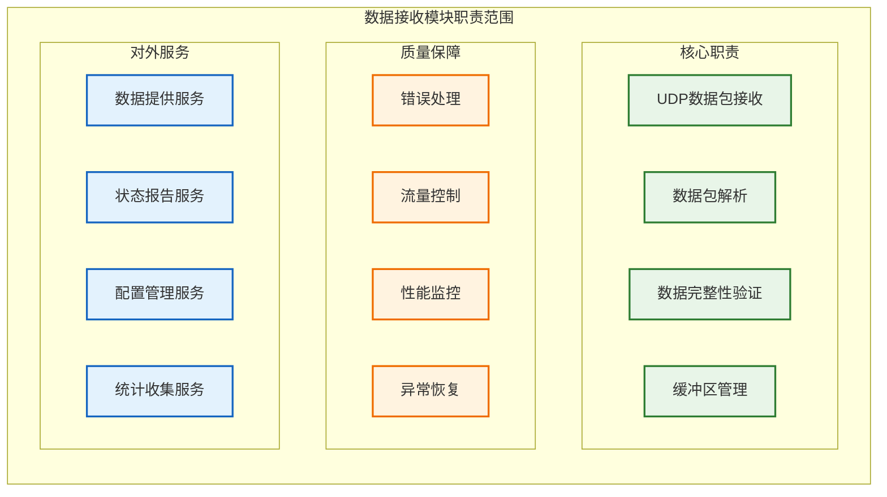
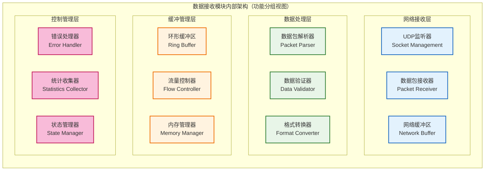
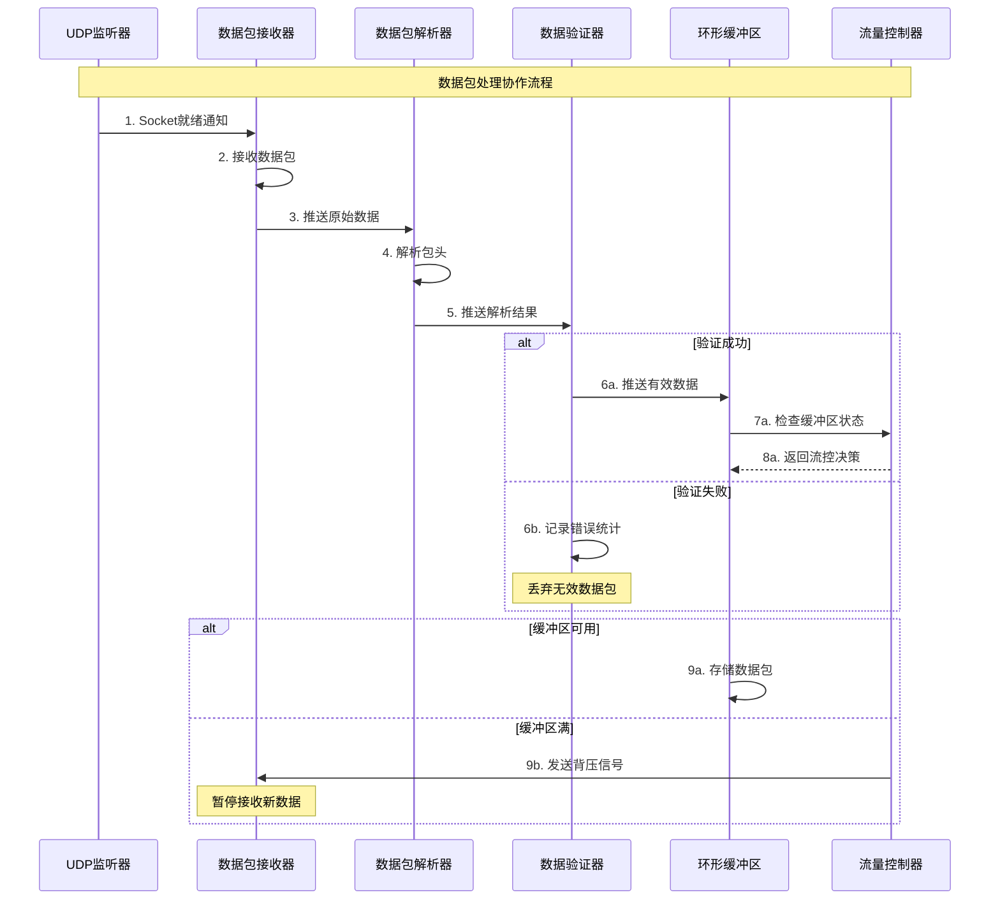
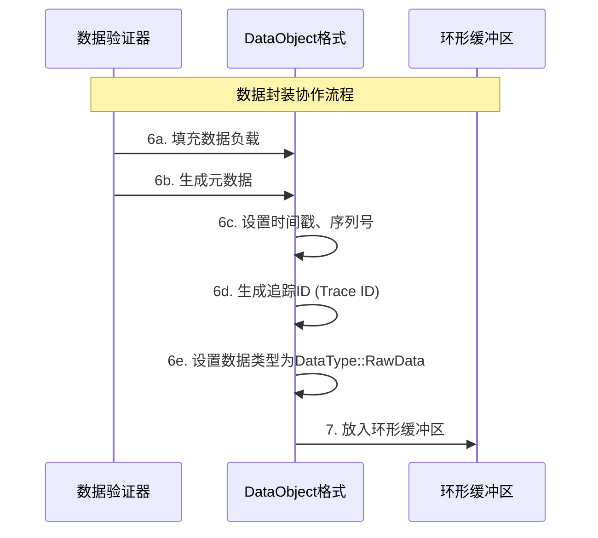
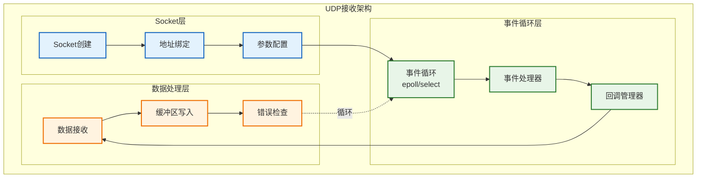
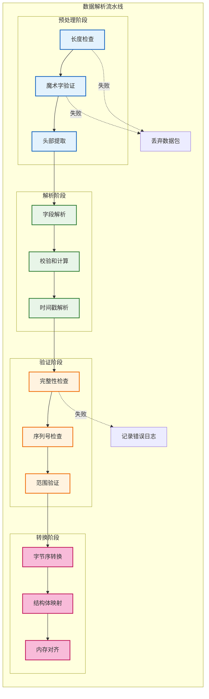
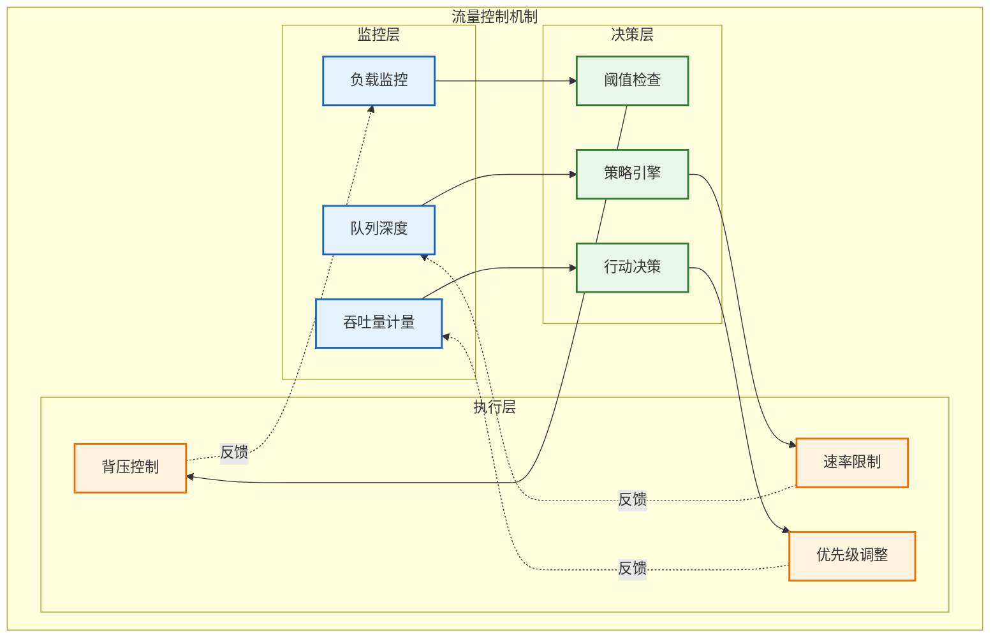
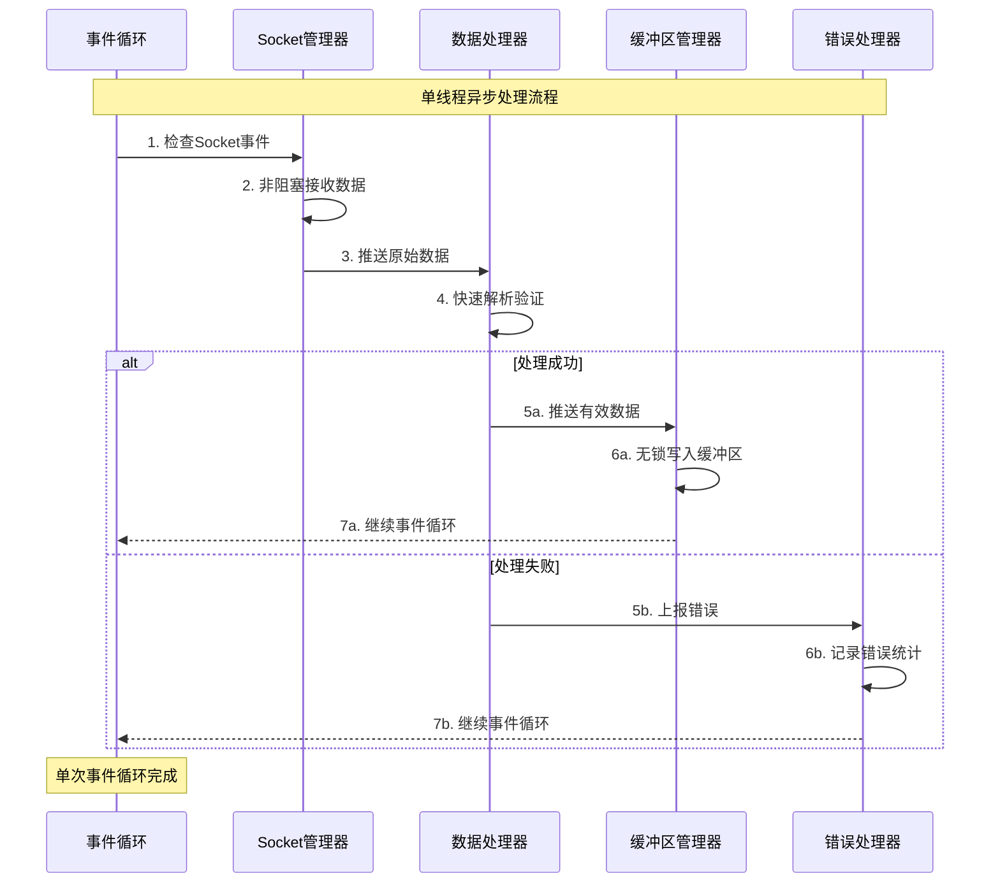
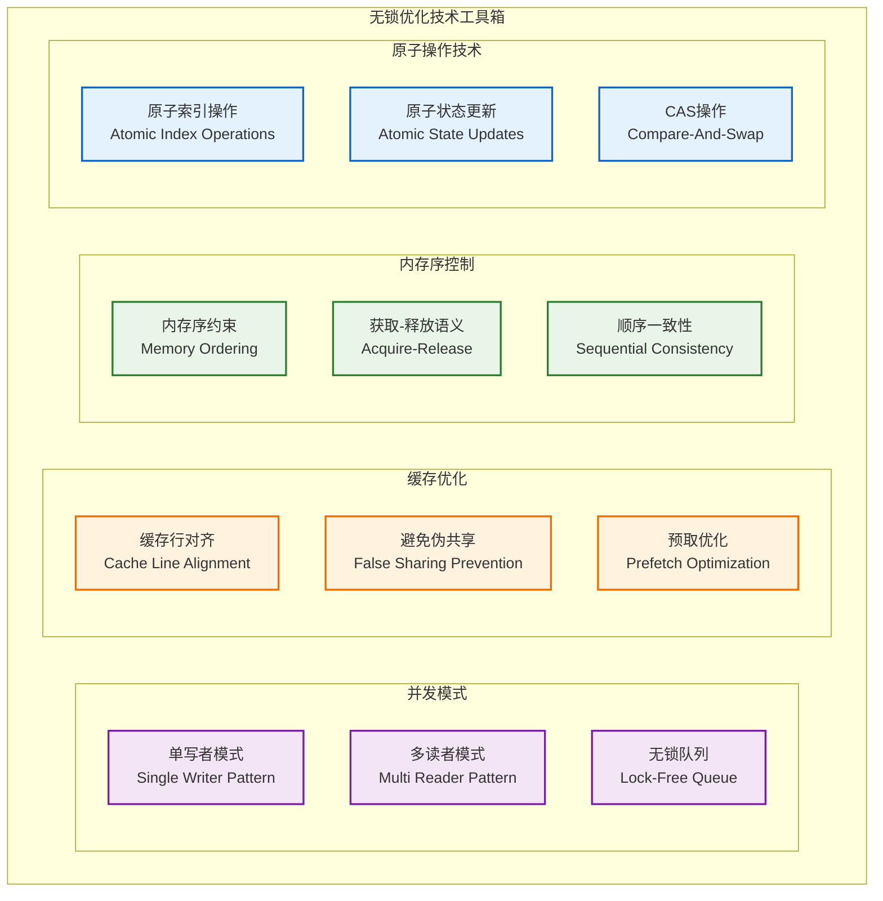

# 数据接收模块设计

**文档版本**: v1.1.1
**最后更新**: 2025-09-23
**负责人**: Kelin
**适用阶段**: MVP及向 V2.0 性能优化过渡阶段
**来源依据**: 基于《MVP系统设计文档》第5.1章数据接收模块和第2.2.1章详细组件架构

---

## 1 文档职责

本文件详细设计数据接收模块的内部架构和核心机制，覆盖：
1) UDP网络数据接收和解析机制
2) 数据包验证和完整性保障策略
3) 环形缓冲区管理和流量控制设计
4) 错误处理和异常恢复机制
5) 性能优化和资源管理策略
6) 模块内部组件协作和状态管理

已明确不在本文件范围内的内容：具体的代码实现、接口定义、网络协议细节、外部系统集成等（这些在相应的专项文档中维护）。

### 1.1 目录
- [数据接收模块设计](#数据接收模块设计)
  - [1 文档职责](#1-文档职责)
    - [1.1 目录](#11-目录)
    - [2.2 模块边界和约束](#22-模块边界和约束)
  - [3 内部架构设计](#3-内部架构设计)
    - [3.1 组件组织结构](#31-组件组织结构)
    - [3.2 组件职责分工](#32-组件职责分工)
    - [3.3 组件协作机制](#33-组件协作机制)
      - [3.3.2 数据封装](#332-数据封装)
  - [4 数据接收机制](#4-数据接收机制)
    - [4.1 UDP接收架构](#41-udp接收架构)
    - [4.2 数据解析流程](#42-数据解析流程)
    - [4.3 数据验证策略](#43-数据验证策略)
  - [5 缓冲区管理设计](#5-缓冲区管理设计)
    - [5.1 环形缓冲区架构](#51-环形缓冲区架构)
    - [5.2 流量控制机制](#52-流量控制机制)
  - [6 并发处理设计](#6-并发处理设计)
    - [6.1 单线程异步模型](#61-单线程异步模型)
    - [6.2 无锁优化策略](#62-无锁优化策略)
  - [7 错误处理设计](#7-错误处理设计)
    - [7.1 异常分类体系](#71-异常分类体系)
    - [7.2 恢复机制设计](#72-恢复机制设计)
  - [8 性能优化策略](#8-性能优化策略)
  - [9 模块约束说明](#9-模块约束说明)
  - [10 相关文档](#10-相关文档)
  - [11 变更历史](#11-变更历史)

### 2.2 模块边界和约束

**输入边界**：
- 雷达阵面发送的UDP数据包（符合项目定义的数据包格式）
- 任务调度器的控制命令（启动、停止、配置更新）
- 配置管理器的参数配置（网络参数、缓冲区配置）

**输出边界**：
- 验证后的原始数据包（推送到信号处理模块）
- 模块运行状态信息（报告给任务调度器）
- 接收统计和性能指标（提供给监控系统）

**性能约束**：
- 单个数据包处理延迟 < 1ms
- 数据包接收成功率 > 99.9%
- 系统资源占用率 < 10%（CPU/内存）
- 支持 10,000 packets/sec 的吞吐量

---

## 3 内部架构设计

### 3.1 组件组织结构

数据接收模块内部采用单线程流水线架构以满足低延迟处理需求。下图（功能分组视图）仅说明模块内的职责分层与组件归属，而不表示组件间存在直接调用顺序或数据流；具体处理协作/时序请参见 3.3 序列图。

> 注：本图仅展示功能分组，不表示组件间的直接调用或严格处理顺序。处理顺序/数据流参见 3.3 协作序列图。

### 3.2 组件职责分工

| 组件名称         | 主要职责           | 关键功能                 | 性能特征         |
| ---------------- | ------------------ | ------------------------ | ---------------- |
| **UDP监听器**    | Socket生命周期管理 | 创建、绑定、关闭socket   | 低延迟初始化     |
| **数据包接收器** | 异步数据包接收     | epoll/select事件循环     | 高并发I/O处理    |
| **网络缓冲区**   | 临时数据存储       | 数据包暂存和批量处理     | 减少系统调用开销 |
| **数据包解析器** | 数据包头部解析     | 协议解析、字段提取       | 快速解析算法     |
| **数据验证器**   | 数据完整性检查     | 校验和验证、格式检查     | 错误检测和过滤   |
| **格式转换器**   | 数据格式标准化     | 字节序转换、结构体映射   | 零拷贝转换       |
| **环形缓冲区**   | 高效数据缓存       | 无锁读写、内存对齐       | 高吞吐量缓存     |
| **流量控制器**   | 背压和流量管理     | 过载检测、流量调节       | 系统稳定性保障   |
| **错误处理器**   | 异常处理和恢复     | 错误分类、恢复策略       | 系统健壮性       |
| **统计收集器**   | 性能指标收集       | 吞吐量、延迟、错误率统计 | 实时性能监控     |

### 3.3 组件协作机制

组件间通过明确的协作模式实现高效的数据处理流程：

#### 3.3.2 数据封装
验证通过的原始数据将被封装成项目统一的`DataObject`格式，以便在后续模块中流转。封装过程包括：
- **填充数据负载**：将原始I/Q数据块存入`DataObject`的`payload`字段。
- **生成元数据**：
  - 设置时间戳、序列号等基本信息。
  - **生成追踪ID (Trace ID)**：为每个新进入系统的数据包生成一个全局唯一的`trace_id`，并存入`Metadata`。这是实现全链路日志追踪和问题定位的核心步骤。
  - 设置数据类型为`DataType::RawData`。
- **放入缓冲区**：将封装好的`DataObject`放入与信号处理模块共享的`raw_data_buffer`环形缓冲区中。

---

## 4 数据接收机制

### 4.1 UDP接收架构

采用单线程异步I/O模型，通过事件驱动机制实现高效的UDP数据包接收：

**关键设计决策**：
- **单线程模型**：避免线程同步开销，简化错误处理逻辑
- **异步I/O**：使用epoll（Linux）/select（跨平台）实现非阻塞接收
- **事件驱动**：基于回调机制处理socket事件，减少轮询开销

### 4.2 数据解析流程

数据包解析采用流水线处理模式，支持增量解析和快速验证：

### 4.3 数据验证策略

采用多层次验证机制，确保数据包的完整性和有效性：

**验证层次设计**：
- **L1 基础验证**：长度、魔术字、基本格式检查
- **L2 完整性验证**：校验和、CRC、数据一致性检查
- **L3 逻辑验证**：序列号、时间戳、业务逻辑检查
- **L4 质量验证**：数据质量、异常值、统计特征检查

---

## 5 缓冲区管理设计

### 5.1 环形缓冲区架构

采用无锁环形缓冲区设计，支持高效的生产者-消费者模式：

```mermaid
graph TB
    subgraph "环形缓冲区架构"
        direction TB

        subgraph "内存组织"
            BUFFER_ARRAY[缓冲区数组<br/>Fixed Size Array]
            CACHE_ALIGNED[缓存行对齐<br/>Cache Alignment]
            MEMORY_POOL[内存池<br/>Memory Pool]
        end

        subgraph "索引管理"
            HEAD_INDEX[头部索引<br/>Producer Index]
            TAIL_INDEX[尾部索引<br/>Consumer Index]
            ATOMIC_OPS[原子操作<br/>Atomic Operations]
        end

        subgraph "访问控制"
            WRITE_ACCESS[写入访问<br/>Write Access]
            READ_ACCESS[读取访问<br/>Read Access]
            CONFLICT_DETECT[冲突检测<br/>Conflict Detection]
        end

        subgraph "状态监控"
            USAGE_MONITOR[使用率监控<br/>Usage Monitor]
            OVERFLOW_DETECT[溢出检测<br/>Overflow Detection]
            PERF_COUNTER[性能计数器<br/>Performance Counter]
        end

        %% 关联关系
        BUFFER_ARRAY --> CACHE_ALIGNED
        CACHE_ALIGNED --> MEMORY_POOL

        HEAD_INDEX --> ATOMIC_OPS
        TAIL_INDEX --> ATOMIC_OPS

        WRITE_ACCESS --> CONFLICT_DETECT
        READ_ACCESS --> CONFLICT_DETECT

        USAGE_MONITOR --> OVERFLOW_DETECT
        OVERFLOW_DETECT --> PERF_COUNTER
    end

    classDef memory fill:#e3f2fd,stroke:#1565c0,stroke-width:2px
    classDef index fill:#e8f5e8,stroke:#2e7d32,stroke-width:2px
    classDef access fill:#fff3e0,stroke:#ef6c00,stroke-width:2px
    classDef monitor fill:#f8bbd9,stroke:#c2185b,stroke-width:2px

    class BUFFER_ARRAY,CACHE_ALIGNED,MEMORY_POOL memory
    class HEAD_INDEX,TAIL_INDEX,ATOMIC_OPS index
    class WRITE_ACCESS,read_ACCESS,CONFLICT_DETECT access
    class USAGE_MONITOR,OVERFLOW_DETECT,PERF_COUNTER monitor
```

### 5.2 流量控制机制

实现自适应流量控制，防止系统过载并保证数据处理的平滑性：

---

## 6 并发处理设计

### 6.1 单线程异步模型

采用单线程异步I/O模型，避免线程同步开销的同时保证高性能处理：

### 6.2 无锁优化策略

采用无锁编程技术实现高性能的并发数据访问：

**无锁优化架构说明**：此图展示了一个按技术类型划分的"无锁优化工具箱"，开发者应根据具体的并发场景选择合适的技术组合：
- **原子操作技术**：提供基础的无锁同步原语，用于索引更新、状态管理和条件操作
- **内存序控制**：确保多线程环境下的内存访问顺序，保证数据一致性和可见性
- **缓存优化**：优化内存访问模式，减少缓存未命中和伪共享问题
- **并发模式**：提供经过验证的无锁并发设计模式，适用于不同的数据访问场景

**关键优化技术**：
- **原子操作**：使用`std::atomic`实现无锁的索引更新
- **内存序**：合理使用内存序约束保证数据一致性
- **缓存行对齐**：避免伪共享（false sharing）问题
- **单写多读**：生产者单线程写入，支持多消费者读取

---

## 7 错误处理设计

### 7.1 异常分类体系

建立分层的错误分类体系，支持精确的错误处理和恢复策略：

**网络错误（100–199）**
- 101 NET_SOCKET_ERROR：Socket错误
    - 描述：底层socket操作失败（创建/读写等）。
    - 处理：记录日志（RADAR_ERROR）；尝试短时重试；重试失败则重建socket并报警。
- 102 NET_BIND_ERROR：绑定失败
    - 描述：端口/地址绑定失败（权限或地址被占用）。
    - 处理：记录并上报配置/环境异常；若为临时冲突，尝试退避重试；不可恢复则进入降级。
- 103 NET_RECV_ERROR：接收失败
    - 描述：recv/recvfrom等系统调用返回错误。
    - 处理：统计并短时重试；必要时回收并重置接收资源。
- 104 NET_TIMEOUT：接收超时
    - 描述：未在期望时间内收到数据。
    - 处理：记录统计指标；根据策略触发重试或报告链路问题。

**数据错误（200–299）**
- 201 DATA_FORMAT_ERROR：格式错误
    - 描述：报文格式不符合协议（魔术字/字段缺失等）。
    - 处理：丢弃包并计数；记录样本用于离线分析；不影响运行流程。
- 202 DATA_CHECKSUM_ERROR：校验错误
    - 描述：校验和/CRC 校验失败。
    - 处理：丢弃并上报统计；若出现率异常升高，触发链路/发送端排查。
- 203 DATA_SEQUENCE_ERROR：序列错误
    - 描述：序号不连续或重复（乱序/丢包）。
    - 处理：按策略重组或丢弃；更新丢包/乱序统计，并根据阈值触发告警。
- 204 DATA_SIZE_ERROR：大小错误
    - 描述：包长度超出或小于预期。
    - 处理：丢弃并记录样本；如为配置误差，触发配置检查。

**缓冲区错误（300–399）**
- 301 BUFFER_FULL：缓冲区满
    - 描述：环形缓冲区无法写入新数据。
    - 处理：启动背压/速率限制；根据策略丢弃低优先级数据；记录并上报。
- 302 BUFFER_CORRUPTED：缓冲区损坏
    - 描述：内存损坏或数据结构异常。
    - 处理：立即记录并尝试回收/重建缓冲区；若不可恢复，进入降级或重启流程。
- 303 BUFFER_ALLOC_FAILED：分配失败
    - 描述：内存分配失败（内存耗尽或碎片）。
    - 处理：释放可回收资源并重试分配；若持续失败，触发内存不足处理路径。
- 304 BUFFER_OVERFLOW：缓冲区溢出
    - 描述：写入超出预期边界（逻辑错误）。
    - 处理：记录并修正写入逻辑；做防护性边界检查避免重复发生。

**系统错误（400–499）**
- 401 SYSTEM_MEMORY_ERROR：内存不足
    - 描述：系统可用内存不足影响模块运行。
    - 处理：尝试回收缓存/降级策略；记录并触发资源告警；必要时安全降级或重启。
- 402 SYSTEM_RESOURCE_ERROR：资源不足
    - 描述：句柄/线程/文件描述符等资源耗尽。
    - 处理：回收闲置资源并上报；调整资源配额或触发重启策略。
- 403 SYSTEM_CONFIG_ERROR：配置错误
    - 描述：运行时配置项缺失或不合法。
    - 处理：拒绝应用非法配置并回滚到最近有效配置；记录并提示运维修正。
- 404 SYSTEM_STATE_ERROR：状态异常
    - 描述：模块内部状态不一致或进入非法状态。
    - 处理：执行自检与回滚操作；必要时重启模块并上报详细诊断信息。

**错误处理约定**
- 所有可失败路径应返回统一 ErrorCode（避免在关键路径抛出异常）。
- 记录关键事件和聚合统计（供统计收集器上报）。
- 严重性分为：Info/Warning/Critical，超阈值事件应触发告警和自动恢复策略。
- 在实现中为临时假设使用 // TODO 标注并说明修复步骤（遵循 AI 协作规则）。
- 日志使用项目宏（RADAR_INFO / RADAR_ERROR）并包含错误码及简要上下文信息。
- 恢复优先级：本地快速恢复 → 资源回收/降级 → 重启/报警。

（本节列举为建议性错误分类与处理流程。具体错误码命名和数值需与项目中的定义保持一致。）

### 7.2 恢复机制设计

针对不同类型的错误实施相应的恢复策略：

**恢复策略矩阵**：

| 错误类型     | 恢复策略        | 恢复时间 | 影响范围     |
| ------------ | --------------- | -------- | ------------ |
| **网络错误** | 重连 + 指数退避 | 1-10秒   | 数据接收中断 |
| **数据错误** | 丢弃 + 统计记录 | 立即     | 单个数据包   |
| **缓冲区满** | 背压 + 流量控制 | 毫秒级   | 接收速率     |
| **系统错误** | 降级 + 告警上报 | 分钟级   | 模块功能     |

---

## 8 性能优化策略

**内存优化**：
- 预分配缓冲区池，减少动态内存分配开销
- 使用内存映射（mmap）优化大块数据的处理
- 实施内存对齐策略，提高CPU缓存命中率

**网络优化**：
- 调整Socket缓冲区大小，匹配网络带宽
- 使用批量接收技术，减少系统调用次数
- 实施零拷贝技术，避免不必要的数据拷贝

**CPU优化**：
- 使用分支预测友好的代码结构
- 实施SIMD指令优化数据解析过程
- 利用CPU亲和性绑定关键处理到特定核心

**I/O优化**：
- 使用高效的事件通知机制（epoll/kqueue）
- 实施异步I/O避免阻塞等待
- 合理设置事件循环的超时参数

---

## 9 模块约束说明

**功能约束**：
- 只支持IPv4 UDP协议，不支持IPv6和TCP
- 数据包大小限制在64KB以内
- 缓冲区大小固定，不支持运行时动态调整
- 错误恢复策略预定义，不支持自定义策略

**性能约束**：
- 内存使用不超过512MB
- CPU使用率不超过5%（单核）
- 最大支持丢包率5%的网络环境
- 缓冲区延迟不超过10ms

**平台约束**：
- 依赖Linux epoll或通用select机制
- 需要支持C++17标准的原子操作
- 依赖POSIX socket API
- 需要支持64位系统架构

**集成约束**：
- 必须实现IModule基础接口
- 必须使用项目统一的错误码体系
- 必须使用项目统一的日志框架
- 必须支持项目配置管理器

---

## 10 相关文档

- [系统架构总览](../MVP系统设计文档.md)
- [信号处理模块设计](02_信号处理模块设计.md)
- [数据处理模块设计](03_数据处理模块设计.md)
- [任务调度器设计](05_任务调度器设计.md)
- [数据流设计](../04_数据架构/01_数据流设计.md)
- [缓冲区管理](../04_数据架构/04_缓冲区管理.md)

---

## 11 变更历史

| 版本   | 日期       | 作者    | 变更描述                                                                                                                   |
| ------ | ---------- | ------- | -------------------------------------------------------------------------------------------------------------------------- |
| v1.1.1 | 2025-09-23 | Copilot | 3.1 组件组织结构图改为纯功能分组视图，移除同层箭头与控制虚线，补充说明文字，统一图表语义以符合模块分离与层次职责原则。     |
| v1.1.0 | 2025-09-23 | Kelin   | 优化并发处理设计图表：采用任务调度器的分组表示法重构无锁优化策略架构，增强图表清晰度和可读性，修改错误码体系展示方式为文字 |
| v1.0.1 | 2025-09-23 | Kelin   | 修正模块职责架构图表：将不合理的组件箭头关系改为功能分组说明，确保图表正确表达分层设计而非直接依赖关系。                   |
| v1.0.0 | 2025-09-23 | Copilot | 基于MVP设计文档创建数据接收模块设计，包含完整的内部架构和机制设计                                                          |

---

*本数据接收模块设计为雷达数据处理系统的数据入口提供详细的架构指导，确保高效可靠的数据接收和处理能力。*
