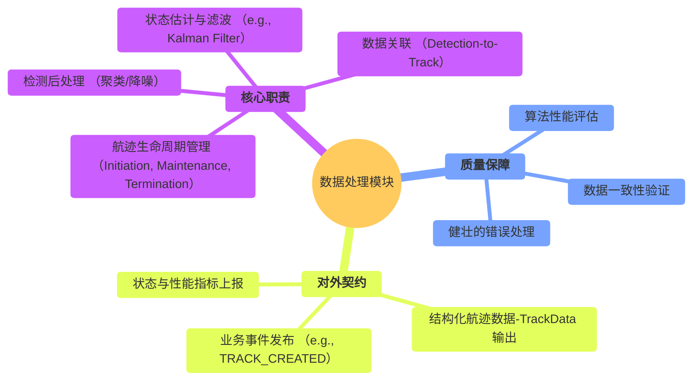
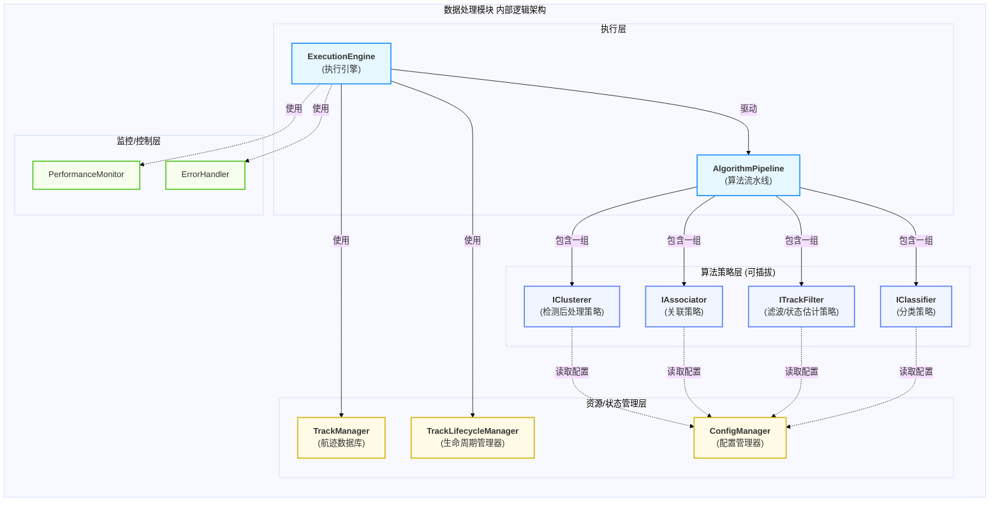
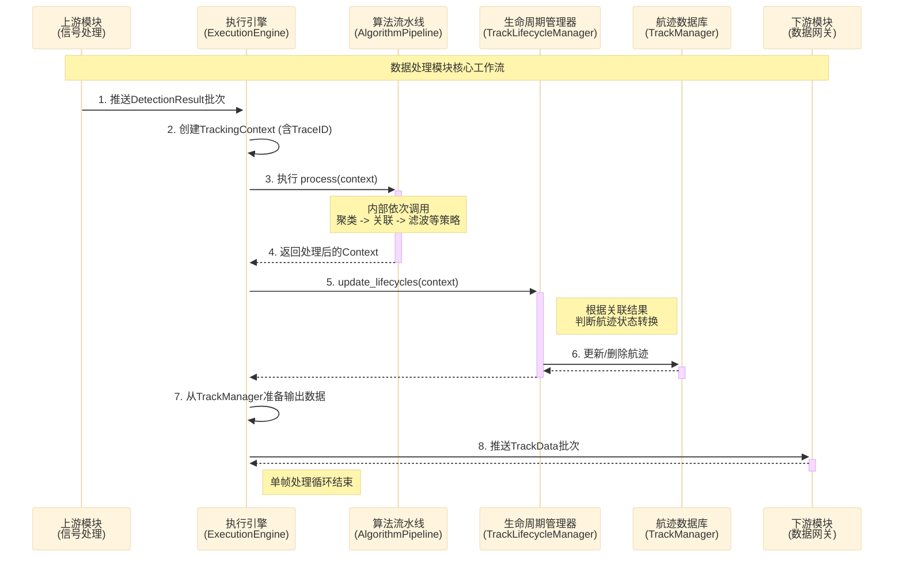
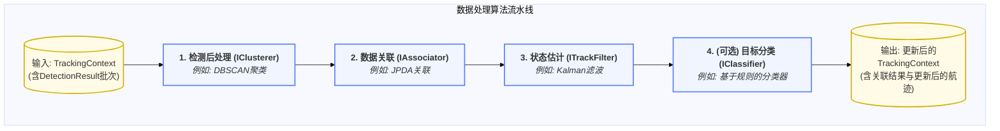
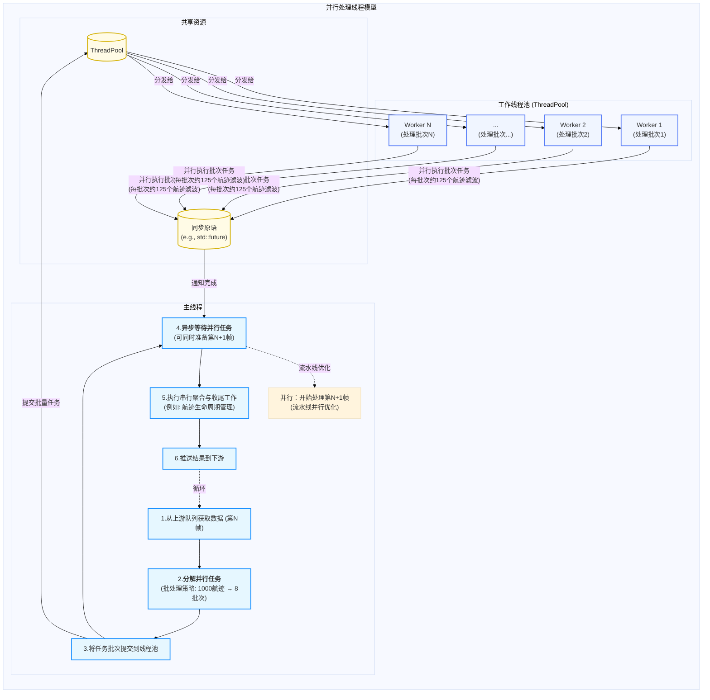
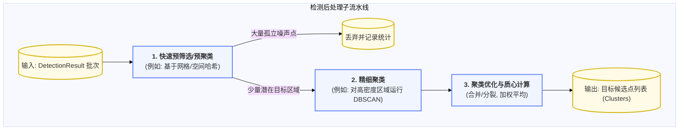
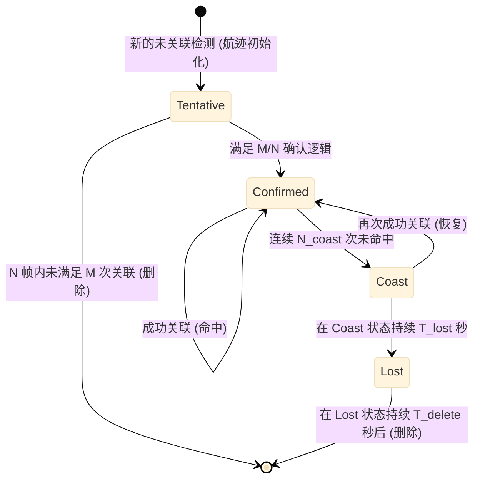
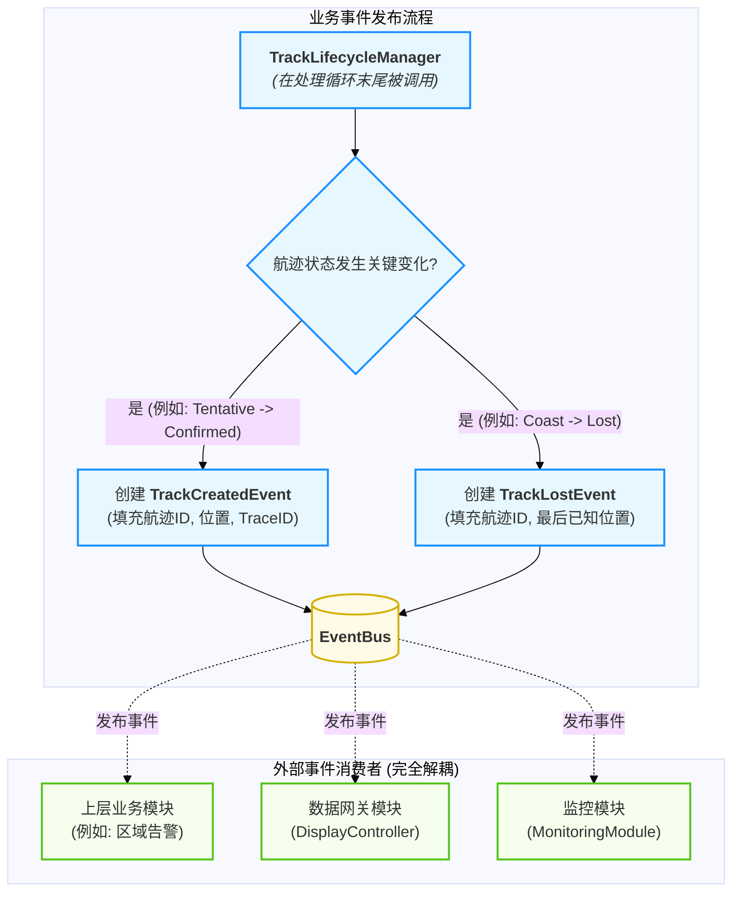
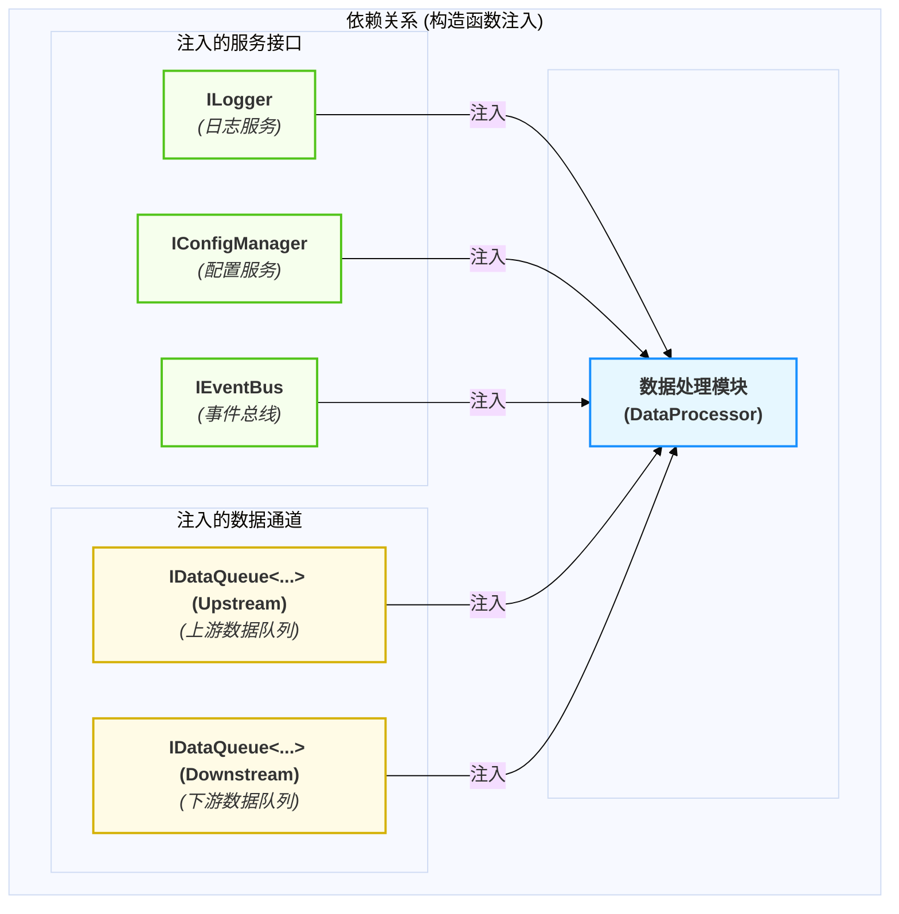

# 数据处理模块设计

  - **当前版本**: v2.0.0
  - **最后更新**: 2025-10-14
  - **负责人**: Klein

-----

## 概述

  - **概要**: 本文件是雷达数据处理系统中 **数据处理模块** 的详细设计规格说明。其核心目标是提供一个清晰、完整、可执行的设计蓝图，用以指导该模块的开发、测试与维护。作为系统的**业务智能核心**，本模块承接了来自信号处理模块的结构化检测结果（`DetectionResult`），负责执行目标跟踪流程中的一系列高级算法，包括检测后处理、数据关联、状态估计（滤波）和目标分类。其最终产出是高价值的目标航迹数据（`TrackData`），为系统的态势感知和决策提供基础。本文档将从模块的顶层职责与边界定义开始，深入其内部可配置的算法流水线架构，详述核心组件的职责与协作方式，并涵盖关键的横切关注点如错误处理和业务事件发布。通过系统化地阐述这些设计细节，本文档旨在确保数据处理模块不仅满足当前的功能需求，还具备良好的可扩展性和维护性，以适应未来业务和技术的演进。

-----

## 目录

- [数据处理模块设计](#数据处理模块设计)
  - [概述](#概述)
  - [目录](#目录)
  - [1 文档职责](#1-文档职责)
    - [1.1 文档目标与范围](#11-文档目标与范围)
    - [1.2 核心原则对齐](#12-核心原则对齐)
  - [2 模块总体设计](#2-模块总体设计)
    - [2.1 模块职责定义](#21-模块职责定义)
    - [2.2 模块边界与接口](#22-模块边界与接口)
    - [2.3 关键性能指标 (KPIs)](#23-关键性能指标-kpis)
  - [3 内部架构设计](#3-内部架构设计)
    - [3.1 逻辑架构与组件划分](#31-逻辑架构与组件划分)
    - [3.2 核心组件职责](#32-核心组件职责)
    - [3.3 核心数据流与协作](#33-核心数据流与协作)
  - [4 核心机制深度设计](#4-核心机制深度设计)
    - [4.1 机制一：分阶段并行处理与算法流水线](#41-机制一分阶段并行处理与算法流水线)
      - [4.1.1 可配置的算法流水线架构](#411-可配置的算法流水线架构)
      - [4.1.2 追踪上下文 (`TrackingContext`) 设计](#412-追踪上下文-trackingcontext-设计)
      - [4.1.3 并行处理策略与线程模型](#413-并行处理策略与线程模型)
    - [4.2 机制二：数据关联与状态估计算法架构](#42-机制二数据关联与状态估计算法架构)
      - [4.2.1 检测后处理与聚类策略 (`IClusterer`)](#421-检测后处理与聚类策略-iclusterer)
      - [4.2.2 数据关联策略 (`IAssociator`)](#422-数据关联策略-iassociator)
      - [4.2.3 状态估计/滤波策略 (`ITrackFilter`)](#423-状态估计滤波策略-itrackfilter)
      - [4.2.4 (可选) 目标分类策略 (`IClassifier`)](#424-可选-目标分类策略-iclassifier)
    - [4.3 机制三：航迹生命周期管理](#43-机制三航迹生命周期管理)
      - [4.3.1 `TrackManager` (数据库) vs `TrackLifecycleManager` (逻辑)的职责分离](#431-trackmanager-数据库-vs-tracklifecyclemanager-逻辑的职责分离)
      - [4.3.2 航迹生命周期状态机](#432-航迹生命周期状态机)
      - [4.3.3 M/N航迹初始化与确认逻辑](#433-mn航迹初始化与确认逻辑)
      - [4.3.4 可配置的生命周期参数](#434-可配置的生命周期参数)
  - [5 关键横切关注点](#5-关键横切关注点)
    - [5.1 错误处理与恢复策略](#51-错误处理与恢复策略)
      - [5.1.1 算法级错误分类与处理](#511-算法级错误分类与处理)
      - [5.1.2 协同恢复：紧急停止与事件上报](#512-协同恢复紧急停止与事件上报)
    - [5.2 业务事件发布](#52-业务事件发布)
  - [6 模块集成与配置](#6-模块集成与配置)
    - [6.1 生命周期管理](#61-生命周期管理)
    - [6.2 依赖关系](#62-依赖关系)
    - [6.3 模块配置项 (`config.yaml`)](#63-模块配置项-configyaml)
  - [7 算法演进规划](#7-算法演进规划)
    - [7.1 算法演进路线表](#71-算法演进路线表)
    - [7.2 算法演进策略](#72-算法演进策略)
  - [8 术语表](#8-术语表)
  - [9 相关文档](#9-相关文档)
  - [10 变更历史](#10-变更历史)

-----

## 1 文档职责

  - **概要**: 本章定义了本文档自身的“使命”，明确其目标、范围以及设计所遵循的“技术宪法”——项目的核心架构原则。这确保了所有设计决策都有据可依。

### 1.1 文档目标与范围

  - **概要**: 本节旨在清晰界定本文档要讲什么、不讲什么，为读者设定正确的预期。
      - **目标**: 本文档的核心目标是为数据处理模块提供一个健壮、高性能且可扩展的设计蓝图。它将详细定义模块的算法架构、并行处理模型、与系统其他部分的交互契约，以及错误处理和业务事件发布机制。
      - **范围**: 本文档覆盖从消费上游的`DetectionResult`，到执行可配置的跟踪算法流水线，最终将`TrackData`推送到下游数据网关模块的完整流程。文档不涉及底层滤波算法或关联算法的数学实现细节，也不包含上游信号处理或下游数据分发的内部设计。

### 1.2 核心原则对齐

  - **概要**: 本节是设计的基石，旨在确保本模块的设计决策与项目已确立的架构原则完全对齐，保证系统整体的一致性。

| 核心原则           | 在本模块设计中的具体体现                                                                                                                                                                                                            |
| :----------------- | :---------------------------------------------------------------------------------------------------------------------------------------------------------------------------------------------------------------------------------- |
| **可扩展性原则**   | **算法的策略化**是本模块设计的核心。所有核心算法（如聚类、关联、滤波、分类）都被抽象为`IAlgorithm`的派生策略接口（如`IAssociator`），通过**自注册的算法工厂**和配置文件动态构建成一个**算法流水线**，实现了极高的灵活性和可扩展性。 |
| **数据与控制分离** | 本模块是数据处理流水线中的一个关键**数据面处理单元**。它通过`IDataQueue`消费上游数据并向下游推送处理结果。所有对该模块的控制（如启停、配置变更）都通过**控制面**的事件总线进行。                                                    |
| **事件驱动架构**   | 模块的生命周期由`TaskScheduler`通过事件驱动。此外，本模块作为**业务事件的生产者**，会主动发布`TRACK_CREATED`、`TRACK_LOST`等高价值事件，驱动上层应用逻辑，实现与消费者的解耦。                                                      |
| **依赖注入**       | 本模块的所有外部服务依赖（`ILogger`, `IConfigManager`, `IEventBus`）以及上下游的数据队列接口，都**必须**通过构造函数注入。这确保了模块与具体实现解耦，并具备高度的可测试性。                                                        |
| **全链路可观测性** | 模块在消费的`DetectionResult`中**继承`TraceID`**，并在内部的`TrackingContext`中全程传递。当生成`TrackData`或发布业务事件时，**必须**将此`TraceID`继续传递下去，确保了任何一个检测点到最终航迹的完整生命周期都是可追溯的。           |

-----

## 2 模块总体设计

  - **概要**: 本章从“黑盒”视角描绘数据处理模块的蓝图，定义其在系统生态中的角色、输入输出以及必须达成的性能目标。作为连接结构化检测结果与高价值业务洞察的桥梁，本模块是系统实现“态势感知”的智能核心，其设计的精确性和实时性对整个系统的业务价值至关重要。

### 2.1 模块职责定义

  - **概要**: 本节使用思维导图的方式，直观地展示数据处理模块作为系统“业务智能核心”的完整职责范围。其核心使命是将离散的、无历史关联的检测点（`DetectionResult`），通过一系列高级算法，转化为具有连续性、可预测性的目标航迹（`TrackData`）。

<!-- end list -->



### 2.2 模块边界与接口

  - **概要**: 本节明确定义模块的输入（Inputs）和输出（Outputs），以及它与系统其他部分交互的正式契约。本模块是数据处理流水线中，从“检测”到“跟踪”的关键转换环节。

| 边界类型           | 交互对象                       | 交互接口 / 数据格式                       | 核心契约与说明                                                                                                                                     |
| :----------------- | :----------------------------- | :---------------------------------------- | :------------------------------------------------------------------------------------------------------------------------------------------------- |
| **输入 (Inputs)**  | `SignalProcessor`              | `IDataQueue<DataPacket<DetectionResult>>` | **零拷贝消费**: 从上游队列获取封装了`DetectionResult`的`DataPacket`。数据以智能指针形式传递，模块**必须**高效处理，避免阻塞上游。                  |
|                    | `TaskScheduler`                | `IModule` (实现)                          | 响应`start()`, `stop()`等生命周期指令。                                                                                                            |
|                    | `ConfigManager`                | `IConfigManager` (注入)                   | 初始化时获取算法流水线定义、关联门限、滤波参数等所有业务相关配置。                                                                                 |
| **输出 (Outputs)** | `DisplayController` (数据网关) | `IDataQueue<DataPacket<TrackData>>`       | 将处理完成、包含`TraceID`的`TrackData`封装成`DataPacket`，并将其指针推送到下游模块的输入队列。                                                     |
|                    | `EventBus`                     | `TrackCreatedEvent`, `TrackLostEvent`     | **业务事件生产者**: 当航迹的生命周期发生关键变化时（如新航迹确认、目标丢失），**必须**通过事件总线发布相应的业务事件，以驱动上层应用逻辑和UI更新。 |
|                    | `MonitoringModule`             | `MetricsUpdateEvent`                      | 定期发布自身的业务性能指标（如活动航迹数、关联成功率、平均滤波残差）。                                                                             |

### 2.3 关键性能指标 (KPIs)

  - **概要**: 本节定义衡量本模块性能是否达标的可量化指标。作为CPU密集型业务处理核心，这些KPI是确保系统决策实时性和准确性的基础。

| KPI 指标           | 目标值(示例)       | 测量方法                                                                     | 重要性与说明                                                                          |
| :----------------- | :----------------- | :--------------------------------------------------------------------------- | :------------------------------------------------------------------------------------ |
| **单帧处理延迟**   | **P99 \< 10ms**    | 内部计时器，测量从`DetectionResult`批次进入，到`TrackData`批次输出的总耗时。 | **极高**<br>这是模块最核心的实时性能要求，直接决定了系统态势更新的延迟。              |
| **最大跟踪容量**   | **\> 1000 个目标** | 在模拟测试环境下，持续注入目标直至处理延迟超出阈值，记录此时的稳定航迹数量。 | **高**<br>定义了系统的处理容量上限，是衡量系统在复杂场景下能力的关键。                |
| **关联准确率**     | **\> 95%**         | 在带有真值（Ground Truth）的测试数据集中，统计正确关联数与总检测数的比率。   | **高**<br>保证航迹的连续性和稳定性，是跟踪质量的核心评价指标。                        |
| **CPU 资源占用率** | **\< 50% (4核)**   | 通过`htop`或`perf`工具监控模块各线程的总CPU占用。                            | **中**<br>模块作为CPU密集型任务，必须高效运行，为系统其他任务和未来扩展预留计算资源。 |

-----

## 3 内部架构设计

  - **概要**: 本章“打开黑盒”，深入数据处理模块内部，展示其核心组件的划分、职责以及它们之间的协作方式。为遵循项目统一的设计原则并与 `数据接收`、`信号处理` 等模块保持架构一致性，本模块内部采用职责清晰的三层逻辑模型：**执行层**、**算法策略层** 和 **资源/状态管理层**，共同构成一个灵活、高性能的目标跟踪框架。

### 3.1 逻辑架构与组件划分

  - **概要**: 本节使用 `graph` 图，展示模块内部的逻辑分层和核心组件构成。该架构以`ExecutionEngine`为核心驱动，动态执行一个由可插拔算法策略构成的流水线，并通过独立的管理层组件维护航迹数据的状态与生命周期。

<!-- end list -->



### 3.2 核心组件职责

  - **概要**: 本节用表格详细说明 `3.1` 图中每个核心组件的具体职责、关键实现技术和设计决策。

| 组件名称                                        | 主要职责             | 关键设计点与实现策略                                                                                                                                                                                                                  | 接口/交互           |
| :---------------------------------------------- | :------------------- | :------------------------------------------------------------------------------------------------------------------------------------------------------------------------------------------------------------------------------------ | :------------------ |
| **`ExecutionEngine`**<br>(执行引擎)             | **核心驱动与编排**   | 1. 模块主循环，从上游队列获取`DetectionResult`批次。<br>2. 创建并管理`TrackingContext`，作为单帧处理的数据载体。<br>3. 驱动`AlgorithmPipeline`执行，并调用`TrackLifecycleManager`更新航迹状态。<br>4. 将最终的`TrackData`推送到下游。 | `IModule` (实现)    |
| **`AlgorithmPipeline`**<br>(算法流水线)         | **业务逻辑编排**     | 1. 在初始化时根据配置，使用`AlgorithmFactory`动态构建一个由算法策略实例组成的有序列表。<br>2. 依次执行各算法策略的`process()`方法，在`TrackingContext`中传递中间结果。                                                                | `IAlgorithm` (使用) |
| **`I...` (策略接口)**<br>(e.g., `IAssociator`)  | **算法策略抽象**     | 1. 定义了各类算法（聚类、关联、滤波等）的统一接口，如 `process(context)`。<br>2. **完全基于策略模式**，所有具体实现（如`NearestNeighborAssociator`, `KalmanFilter`）都是可替换、可配置的插件。                                        | `<<Interface>>`     |
| **`TrackManager`**<br>(航迹管理器)              | **航迹数据库**       | 1. 核心职责是高效地存储、索引和查询`TrackData`。<br>2. 提供`add/remove/get_track`等线程安全的原子操作接口。<br>3. **不包含**任何生命周期判断逻辑，职责单一。                                                                          | `(内部接口)`        |
| **`TrackLifecycleManager`**<br>(生命周期管理器) | **航迹生命周期策略** | 1. 包含航迹`Tentative` -\> `Confirmed` -\> `Coast` -\> `Lost`的状态机逻辑。<br>2. 根据关联结果和可配置的参数（如M/N逻辑），判断航迹状态变更。<br>3. 调用`TrackManager`执行最终的删除或状态更新操作。                                  | `(内部接口)`        |
| **`TrackingContext`**<br>(追踪上下文)           | **帧级数据载体**     | 1. 携带单帧处理所需的所有数据（检测、航迹、配置、Trace ID）。<br>2. 在流水线各阶段间传递，避免全局状态和重复参数。                                                                                                                    | `(内部数据结构)`    |

### 3.3 核心数据流与协作

  - **概要**: 本节使用 `sequenceDiagram`，展示在一个核心处理周期中，数据如何在内部各组件间流转和处理。该流程由`ExecutionEngine`统一驱动，清晰地展示了从接收检测点到输出航迹的线性化、解耦的协作方式。

<!-- end list -->



-----

## 4 核心机制深度设计

  - **概要**: 本章是文档的技术核心，旨在针对该模块 **三个最关键、最具挑战性** 的技术点进行深度剖析。它们共同构成了数据处理模块作为系统“决策智能核心”的基础：首先是作为性能保障的**分阶段并行处理与算法流水线**；其次是定义其核心业务逻辑的**数据关联与状态估计算法架构**；最后是确保航迹数据一致性和可靠性的**航迹生命周期管理**。

### 4.1 机制一：分阶段并行处理与算法流水线

  - **概要**: 阐述模块如何将复杂的跟踪流程分解为多个可独立优化的阶段（如检测后处理、关联、滤波），并将这些阶段组织成一个由可插拔算法策略构成的、可配置的流水线。同时，明确哪些计算密集型阶段（如代价矩阵计算）将被并行化以满足低延迟要求。

#### 4.1.1 可配置的算法流水线架构

  - **概要**: 目标跟踪是一个复杂的多阶段过程，而非单一的原子操作。为实现高度的灵活性、可扩展性和可测试性，我们将整个跟踪流程建模为一个**可配置的算法流水线**。该流水线由`ExecutionEngine`驱动，其构成完全由`config.yaml`文件定义，允许在不修改核心代码的情况下，轻松地增加、替换或重排算法处理步骤。

  - **实现策略**:
    `ExecutionEngine`在处理每一帧数据时，都会驱动一个`AlgorithmPipeline`实例。该实例在模块初始化时，根据配置文件中的`pipeline`列表，通过`AlgorithmFactory`动态创建并组装一系列实现了标准策略接口（如`IClusterer`, `IAssociator`, `ITrackFilter`）的算法对象。

    下面的`flowchart`图展示了这一流水线的典型构成和数据在其中的处理流程。

<!-- end list -->



#### 4.1.2 追踪上下文 (`TrackingContext`) 设计

  - **概要**: `TrackingContext`是在算法流水线中流动的核心数据结构。它本身不拥有资源，而是作为单次处理循环（一帧数据）所需的所有信息的**视图或句柄**，由`ExecutionEngine`在每个循环开始时创建，并在循环结束时销毁。这种设计避免了全局状态和冗长的函数参数，使得算法策略无状态且易于测试。

  - **核心设计原则**:

      - **非所有权**: `TrackingContext`不负责分配或释放其引用的数据（如航迹列表）。所有权归属于`TrackManager`等管理组件。
      - **生命周期短暂**: 每个`TrackingContext`实例的生命周期与一次主循环（即处理一个`DetectionResult`批次）绑定。
      - **强类型设计**: 采用专用的强类型结构体，将所有中间结果作为具体的成员变量，避免`std::any`的运行时开销和类型风险。

  - **建议的数据结构**:

    ```cpp
    // 概念性结构，非完整头文件
    struct TrackingContext {
        // --- 核心资源 (由 ExecutionEngine 提供) ---
        const std::vector<DetectionResult>& detections; // 本帧的检测点
        TrackManager& track_manager;                      // 航迹数据库的引用

        // --- 元数据 ---
        Timestamp timestamp;
        TraceId trace_id; // 必须继承和传递

        // --- 流水线中间结果 (强类型成员变量) ---
        // 优势：编译期类型检查、零运行时开销、IDE友好、易于调试
        std::vector<Cluster> clusters;                     // 聚类结果
        Eigen::MatrixXd association_matrix;                // 关联代价矩阵
        std::map<TrackID, std::vector<DetID>> gating_results; // 门控结果
        std::vector<AssociationPair> association_pairs;    // 关联对
        // 可根据算法需求扩展更多强类型成员
    };
    ```

  - **设计说明**:
      - **性能优势**: 消除了`std::any`的类型擦除和动态内存分配开销，在高频处理场景下（每秒数千帧）性能提升显著。
      - **类型安全**: 所有数据访问在编译期完成类型检查，避免了字符串键拼写错误和运行时类型转换失败。
      - **可维护性**: 代码更清晰，IDE可以提供完整的自动补全和类型提示，重构更安全。

#### 4.1.3 并行处理策略与线程模型

  - **概要**: 为达成`P99 < 10ms`的严苛延迟指标，串行处理整个算法流水线是不可接受的。与信号处理模块的GPU并行计算不同，本模块作为CPU密集型业务核心，采用**"主线程协调 + 工作线程池计算"的混合并行策略**，结合**数据并行**和**流水线并行**两种模式，以最大化利用多核CPU资源并消除同步瓶颈。

  - **实现策略**:

    **1. 数据并行（单帧内的并行计算）**

    `ExecutionEngine`在主循环中，识别出可并行的计算阶段（如代价矩阵计算、独立航迹的滤波更新），将这些任务分解后提交给内部的`ThreadPool`。为避免任务粒度过细导致的调度开销，采用**任务批处理策略**：

    - **任务批处理**: 将大量小任务（如1000个航迹的滤波更新）打包成与CPU核心数相当的批次（如8个批次对应8核），每个批次包含约125个航迹的处理任务。这显著降低了任务创建和调度的开销。
    - **同步优化**: 主线程通过`std::future`或屏障（`std::barrier`）等待所有批次任务完成。

    **2. 流水线并行（跨帧的流水线处理）**

    为进一步提升吞吐量和CPU利用率，当工作线程池在为第N帧执行并行计算时（如滤波更新），主线程无需完全阻塞，而是可以：

    - **提前准备下一帧**: 从上游队列拉取第N+1帧数据，并开始执行纯串行的预处理工作（如关联门计算、任务分解）。
    - **异步推送结果**: 第N帧的并行任务完成后，主线程立即将结果推送到下游队列，无需等待第N+1帧的处理启动。

    这种**深度流水线模式**使得多个帧可以同时处于处理流程的不同阶段，从而实现更高的系统吞吐量和更低的整体延迟。

    **3. 负载均衡与任务窃取（可选增强）**

    如果并行任务的耗时不均（如某些航迹的滤波计算更复杂），可引入**工作窃取（Work Stealing）**机制：空闲的工作线程可以从其他线程的任务队列中"窃取"未完成的任务，从而避免部分核心空闲等待的情况。

    下面的`graph`图展示了这种"主线程协调 + 工作线程池计算"的混合并发模型。行处理模型和航迹生命周期管理等核心机制，确保模块的设计与项目的总体架构原则保持高度一致。

<!-- end list -->



### 4.2 机制二：数据关联与状态估计算法架构

  - **概要**: 详细设计目标跟踪流程中最核心的两个算法阶段：数据关联和状态估计。这是模块的“智能”所在，负责将离散的、匿名的检测点转化为具有身份和历史轨迹的连续目标。本节将阐述其内部的子流水线、关键策略选项（如NN/JPDA, Kalman/EKF）以及性能考量，确保算法架构的灵活性与高性能。

#### 4.2.1 检测后处理与聚类策略 (`IClusterer`)

  - **概要**: 这是算法流水线的**第一个关键阶段**，作为数据关联的预处理器。其核心职责是将来自`信号处理模块`的、可能包含数千个点的原始、密集的`DetectionResult`批次，通过聚类和降噪，转换为数量显著减少、信噪比更高的目标候选点（`Cluster`），极大地降低后续关联和滤波阶段的计算复杂度。

  - **实现策略**:
    直接对大规模原始检测点运行复杂聚类算法（如DBSCAN，复杂度为O(N log N)或更高）会造成严重的性能瓶C颈。因此，我们采用**分阶段、性能感知的处理策略**，将该过程实现为一个`IClusterer`策略接口。

    下面的`flowchart`图展示了该策略内部推荐的子流水线。

<!-- end list -->



#### 4.2.2 数据关联策略 (`IAssociator`)

  - **概要**: 数据关联是跟踪系统的**核心**，负责回答“哪个新检测点属于哪个已知航迹？”的问题。它将`IClusterer`输出的目标候选点与`TrackManager`中已有的航迹进行匹配。该过程被抽象为`IAssociator`策略接口，以支持在不同场景下切换不同的关联算法。

  - **实现策略**:
    数据关联本身也是一个微型流水线，包含航迹预测、关联门、代价计算和分配四个步骤。

<!-- end list -->


  - **并行化考量**: **代价矩阵计算**是极佳的并行计算点。由于每个`<航迹, 检测>`对的代价值计算是相互独立的，这个步骤可以被`ExecutionEngine`分解为大量微任务，并分发到线程池中并行执行，从而显著缩短处理延迟。

  - **可配置的分配策略**:

      - **最近邻 (NN)**: 最简单，贪心算法，适用于稀疏场景。
      - **全局最近邻 (GNN)**: 使用匈牙利算法或类似方法寻找全局最优解。
      - **联合概率数据关联 (JPDA)**: 适用于密集目标场景，一个检测可以概率性地关联到多个航迹。
      - **多假设跟踪 (MHT)**: 最复杂但最强大，维护多个关联假设树。

#### 4.2.3 状态估计/滤波策略 (`ITrackFilter`)

  - **概要**: 对于成功关联的航迹，需要使用新的检测信息来更新其状态（位置、速度、加速度等），并平滑其轨迹。这个过程即为状态估计或滤波，被抽象为`ITrackFilter`策略接口。

  - **实现策略**:
    `ExecutionEngine`会遍历所有成功关联的`<航迹, 检测>`对，并为每个航迹调用其绑定的`ITrackFilter`实例的`update()`方法。

  - **可配置的滤波器类型**:

      - **卡尔曼滤波器 (Kalman Filter, KF)**: 适用于线性运动模型。
      - **扩展卡尔曼滤波器 (Extended Kalman Filter, EKF)**: 适用于非线性模型（通过雅可比矩阵线性化）。
      - **无迹卡尔曼滤波器 (Unscented Kalman Filter, UKF)**: 同样适用于非线性模型，通过无迹变换逼近，精度通常比EKF高。
      - **交互式多模型 (Interacting Multiple Model, IMM)**: 结合多种运动模型（如匀速、恒定转弯），并行运行多个滤波器，并根据概率进行融合，以适应高机动目标。

  - **并行化考量**: 对于**相互独立**的航迹（即它们没有共享关联的检测点），它们的滤波更新过程可以**并行执行**。`ExecutionEngine`可以将这些独立的更新任务分发到线程池中。

#### 4.2.4 (可选) 目标分类策略 (`IClassifier`)

  - **概要**: 目标分类是算法流水线中的一个可选高级阶段，其职责是为已确认的航迹赋予语义标签（如“飞机”、“车辆”等）。该功能同样遵循**策略模式**，被抽象为`IClassifier`接口。

  - **实现策略**:
    分类器通常在状态估计之后执行，因为它可能需要使用平滑后的运动学特征。

<!-- end list -->


  - **可配置的分类器类型**:
      - **MVP实现**: 可以是简单的基于规则的分类器（例如，速度 \> 200 m/s -\> "快速空中目标"）。
      - **未来实现**: 可以是更复杂的机器学习模型，如决策树、支持向量机（SVM）或轻量级神经网络。

### 4.3 机制三：航迹生命周期管理

  - **概要**: 阐述模块如何通过一个独立的、职责清晰的`TrackLifecycleManager`组件，基于一个明确定义的状态机和可配置的参数，来管理航迹从“试探性”到“已确认”再到“丢失”和“删除”的完整生命周期。这是确保航迹数据库的质量、防止虚假航迹持续存在、并及时清理陈旧数据的核心机制。

#### 4.3.1 `TrackManager` (数据库) vs `TrackLifecycleManager` (逻辑)的职责分离

  - **概要**: 为遵循单一职责原则，我们将航迹的管理分解为两个独立的组件：`TrackManager` 扮演 **“航迹数据库”** 的角色，而 `TrackLifecycleManager` 则扮演 **“生命周期策略引擎”** 的角色。

  - **实现策略**:

      - **`TrackManager`**:
          - **职责**: 专注于航迹数据的**高效、线程安全地存储与检索**。
          - **接口**: 提供原子性的`add_track()`, `update_track()`, `remove_track()`, `get_track_by_id()`等操作。
          - **实现**: 内部可使用`std::unordered_map`或其他高性能数据结构，并通过读写锁`std::shared_mutex`保证并发安全。
          - **无业务逻辑**: 它不包含任何关于航迹状态如何转换的业务逻辑。
      - **`TrackLifecycleManager`**:
          - **职责**: 在每个处理周期结束时被`ExecutionEngine`调用，根据最新的关联结果和配置规则，**对状态可能发生变化的航迹做出转换决策**。
          - **决策依据**: `IAssociator`的关联结果（航迹是否被命中）、航迹的当前状态、以及未命中计数等。
          - **执行动作**: 当它决定一个航迹需要被删除或更新状态时，它会**调用**`TrackManager`提供的接口来执行最终的操作。
          - **增量式管理优化**: 为避免在大规模航迹场景下（> 1000航迹）的全量遍历开销，`TrackLifecycleManager`的输入应聚焦于**本轮处理中状态可能发生变化的航迹**。具体实现：
              - `IAssociator`的输出应包含三个列表：`成功关联的航迹ID`、`未关联的航迹ID` 和 `新生的检测`。
              - `TrackLifecycleManager`只处理这三个列表，其计算复杂度从O(N_total)降低到O(N_active)。
              - 稳定的`Confirmed`状态航迹如果本轮被成功关联，只需简单重置其未命中计数器，无需额外处理。

这种职责分离使得数据存储的实现可以独立优化，而生命周期管理的复杂逻辑也得以清晰地封装，极大地提升了系统的可维护性和可测试性。

#### 4.3.2 航迹生命周期状态机

  - **概要**: 航迹的生命周期由一个明确定义的状态机驱动。每个航迹对象都包含一个状态字段，`TrackLifecycleManager`根据外部事件（关联成功/失败）和内部计时器来驱动其状态转换。

<!-- end list -->



#### 4.3.3 M/N航迹初始化与确认逻辑

  - **概要**: 为抑制由噪声或杂波引起的虚假航迹，新航迹的“确认”过程采用经典的**M/N逻辑**。
  - **实现策略**:
    1.  **初始化 (Initiation)**: 当`IAssociator`处理完毕后，任何一个未被关联到现有航迹的高质量“目标候选点”，都会被用来创建一个新的、状态为`Tentative`（试探性）的航迹。
    2.  **确认 (Confirmation)**: 对于每个`Tentative`航迹，`TrackLifecycleManager`会维护两个计数器：`history_frames`（经历的总帧数）和`hit_count`（被成功关联的次数）。
    3.  **决策**:
          - 如果`hit_count` \>= `M` 且 `history_frames` \<= `N`，则该航迹的状态被提升为`Confirmed`（已确认），并**发布`TRACK_CREATED`业务事件**。
          - 如果`history_frames` \> `N` 但`hit_count` \< `M`，则认为该航迹是由噪声引起的，`TrackLifecycleManager`将调用`TrackManager`将其从数据库中删除。

    **注意事项（针对评审意见）**:

    为避免在密集场景下创建大量冗余临时航迹，建议引入**预确认聚类机制**：

    - **策略**: 在创建`Tentative`航迹之前，对所有"未关联的高质量检测点"进行一次**独立的轻量级聚类**（可复用`IClusterer`策略或使用更简单的基于距离的快速聚类）。
    - **执行**: 只为每个聚类的中心点创建一个`Tentative`航迹，而非为每个原始检测点都创建。
    - **收益**: 在密集目标场景下，将可能创建的临时航迹数量从数十个降低到数个，避免多个冗余航迹对同一目标的关联歧义，提高资源利用率。
    - **逻辑位置**: 航迹初始化逻辑应在**数据关联之后、生命周期管理之前**，作为一个独立的"新生目标检测"阶段存在。

#### 4.3.4 可配置的生命周期参数

  - **概要**: 为适应不同场景（如高杂波、稀疏目标）下的跟踪需求，航迹生命周期状态机的所有关键阈值都**必须**是可在`config.yaml`中配置的参数。

| 配置路径                         | 类型      | 默认值 | 描述                                                                     |
| :------------------------------- | :-------- | :----- | :----------------------------------------------------------------------- |
| `lifecycle.confirmation_m`       | `integer` | `3`    | 在`N`帧内，需要至少`M`次命中才能确认为稳定航迹。                         |
| `lifecycle.confirmation_n`       | `integer` | `5`    | M/N逻辑中的观测窗口大小（帧数）。                                        |
| `lifecycle.coast_after_misses`   | `integer` | `5`    | `Confirmed`状态的航迹在连续`N`次未命中后，进入`Coast`（惯性）状态。      |
| `lifecycle.lost_after_seconds`   | `float`   | `10.0` | `Coast`状态的航迹如果持续`T`秒仍未被再次关联，则进入`Lost`（丢失）状态。 |
| `lifecycle.delete_after_seconds` | `float`   | `60.0` | `Lost`状态的航迹在被标记为丢失`T`秒后，将被从数据库中永久删除。          |

-----

## 5 关键横切关注点

  - **概要**: 本章讨论贯穿于模块多个组件的通用设计问题，如错误处理和事件发布。系统性地阐述这些方案，可以避免在多个地方重复描述，并确保模块的健壮性、可维护性以及与系统其他部分的顺畅集成。

### 5.1 错误处理与恢复策略

  - **概要**: 描述针对数据处理算法（如滤波器发散、关联失败）的错误处理哲学，以及模块如何与`TaskScheduler`协同进行故障上报和恢复。本模块的错误处理严格遵循系统统一的规范：**本地处理算法级可恢复错误，向上报送模块级致命错误**。

#### 5.1.1 算法级错误分类与处理

  - **概要**: 数据处理模块中的错误多为算法层面的逻辑问题，而非硬件故障。因此，处理策略更侧重于**隔离、记录和降级**，而非简单的“重试”。

| 类别                 | 错误示例                                             | 描述                                                         | **模块内部处理策略**                                                                                                                                                                                                                                                                                                                                                                                                                                                                                                                                                                                        |
| :------------------- | :--------------------------------------------------- | :----------------------------------------------------------- | :---------------------------------------------------------------------------------------------------------------------------------------------------------------------------------------------------------------------------------------------------------------------------------------------------------------------------------------------------------------------------------------------------------------------------------------------------------------------------------------------------------------------------------------------------------------------------------------------------------- |
| **可恢复的计算错误** | **单个航迹滤波器发散** (协方差矩阵变为非正定)        | 这是最常见的算法错误，通常由非线性、模型失配或异常测量引起。 | **细化策略**（根据航迹状态和重要性差异化处理）：<br>1.  **对于`Confirmed`航迹**: 尝试滤波器状态重置（使用最近3-5次有效观测的均值），或临时降级为`Coast`状态并增加测量噪声协方差，**避免立即删除高价值目标**。最多重试2次。<br>2.  **对于`Tentative`航迹**: 直接删除，因为其可靠性本身就低。<br>3.  **记录与监控**: 记录`WARN`级别日志（包含航迹ID、状态、TraceID）。**增加专用性能计数器**`filter_divergence_count`。若该值在短时间内（如5秒）异常增高，触发系统级告警`FILTER_DIVERGENCE_ALERT`，表明上游数据质量或系统参数可能存在问题。<br>4.  **继续处理**: **不中断**当前帧处理，继续处理其他正常航迹。 |
| **关联逻辑错误**     | **关联代价矩阵计算溢出** (NaN/Inf)                   | 在密集目标或高机动场景下，距离计算可能导致数值不稳定。       | 1.  **跳过当前帧**: 放弃本帧的关联和更新，防止错误数据污染整个航迹数据库。<br>2.  **航迹维持**: 所有航迹在本帧进入`Coast`（惯性外推）状态。<br>3.  **记录**: 记录`ERROR`级别日志，并触发性能计数器。<br>4.  **阈值告警**: 若连续多帧发生此问题，应升级为致命错误上报。                                                                                                                                                                                                                                                                                                                                      |
| **配置错误**         | `config.yaml`中算法参数无效 (e.g., M/N逻辑配置为0/0) | 模块初始化时发现配置不合法。                                 | **致命错误**: 模块初始化失败，上报`CONFIG_ERROR`，终止启动。                                                                                                                                                                                                                                                                                                                                                                                                                                                                                                                                                |
| **资源/状态错误**    | **航迹数据库损坏** (e.g., 内部数据结构不一致)        | 极罕见的、由内存踩踏或逻辑缺陷导致的内部状态错误。           | **致命错误**: 这是无法自我恢复的模块级故障，必须立即停止并上报。                                                                                                                                                                                                                                                                                                                                                                                                                                                                                                                                            |

#### 5.1.2 协同恢复：紧急停止与事件上报

  - **概要**: 当模块捕获到任何被判定为致命的错误时（如航迹数据库损坏），会立即启动一个标准化的“紧急停止与上报”流程，将控制权完全交由`TaskScheduler`。

  - **执行流程**:

    1.  **捕获与包装 (Catch & Wrap)**: 模块内部的关键逻辑（如数据库操作）应被置于`try-catch`块中，以捕获意外的异常。
    2.  **紧急停止 (Stop)**: `ExecutionEngine`收到致命错误后，立即停止主循环，不再从上游拉取新数据。
    3.  **设置状态 (Set State)**: 将模块内部状态原子地设置为 `State::FAILED`。
    4.  **记录日志 (Log)**: 记录一条`FATAL`级别的日志，包含完整的错误信息、`TraceID`和上下文。
    5.  **发布事件 (Publish Event)**: 通过系统的**事件总线**，发布一个 `ModuleFailedEvent`。事件负载**必须**包含：
          * `module_name`: "DataProcessor"
          * `error_code`: 具体的 `ErrorCode` (e.g., `TRACK_DB_CORRUPTED`)
          * `details`: 详细的错误描述字符串。
    6.  **等待指令 (Wait)**: 模块进入失败状态后，放弃所有活动，等待`TaskScheduler`通过其`IModule`接口下达`stop()`或`cleanup()`指令。

### 5.2 业务事件发布

  - **概要**: 明确本模块作为业务事件的“生产者”，如何通过系统事件总线发布`TRACK_CREATED`, `TRACK_LOST`等高价值业务事件，以驱动上层应用逻辑，并与下游模块解耦。

  - **实现策略**:
    本模块**不直接**与任何上层业务应用或UI模块通信。它唯一的对外信息出口是**系统事件总线 (`EventBus`)**。`TrackLifecycleManager`在执行航迹状态转换决策后，负责创建并发布相应的业务事件。

    下面的`flowchart`图展示了事件发布的完整流程。

<!-- end list -->



  - **发布的关键业务事件**:
      - `TrackCreatedEvent`: 当一个航迹首次被确认为稳定目标时发布。
      - `TrackLostEvent`: 当一个稳定航迹长时间未被关联，被判定为丢失时发布。
      - `TrackUpdatedEvent`: （可选，高频）每次航迹状态更新时发布，可用于实时性要求极高的场景。
      - `TrackDeletedEvent`: 当航迹被从数据库中永久移除时发布。
  - **架构收益**: 这种基于事件的发布/订阅模式，将数据处理的核心逻辑与多变的上层应用需求**完全解耦**。未来增加新的应用（如数据记录服务、威胁评估模块）时，只需让新模块订阅相关事件即可，**无需对数据处理模块进行任何修改**，实现了极高的系统可扩展性。

-----

## 6 模块集成与配置

  - **概要**: 本章阐述该模块如何作为一个标准化的“零件”，无缝地“安装”到整个系统框架中。内容涵盖其如何响应`TaskScheduler`的生命周期管理、如何通过依赖注入获取所需的服务与数据通道，以及所有可由`config.yaml`文件驱动的行为参数。这为模块的正确集成、部署和运维提供了清晰的指导。

### 6.1 生命周期管理

  - **概要**: 本模块作为一个标准的业务模块，将完整实现`IModule`接口（通过组合`ILifecycleManaged`等角色接口实现），其生命周期完全由`TaskScheduler`通过事件和直接调用进行管理。

| 生命周期方法       | 核心执行动作                                                                                                                                                                                           | 状态转换                          | 备注                                                                     |
| :----------------- | :----------------------------------------------------------------------------------------------------------------------------------------------------------------------------------------------------- | :-------------------------------- | :----------------------------------------------------------------------- |
| **`initialize()`** | 1. 从`ConfigManager`加载并验证配置。<br>2. 初始化`TrackManager`和`TrackLifecycleManager`。<br>3. 创建工作线程池 (`ThreadPool`)。<br>4. 根据配置，使用`AlgorithmFactory`创建并构建`AlgorithmPipeline`。 | `UNINITIALIZED` -\> `INITIALIZED` | 如果配置中的算法类型不存在或参数无效，将返回错误并直接进入`FAILED`状态。 |
| **`start()`**      | 1. 创建并启动`ExecutionEngine`的专用工作线程。<br>2. 开始从上游队列消费数据并驱动算法流水线。                                                                                                          | `INITIALIZED` -\> `RUNNING`       | `start()`方法本身是非阻塞的，它会立即返回，而实际工作在后台线程中进行。  |
| **`stop()`**       | 1. 向`ExecutionEngine`发送停止信号。<br>2. 优雅地等待当前正在处理的数据帧完成，并停止所有线程。                                                                                                        | `RUNNING` -\> `STOPPED`           | 必须在`TaskScheduler`规定的超时时间内完成，以响应系统快速关闭的要求。    |
| **`cleanup()`**    | 1. 确保所有线程已完全退出。<br>2. 清理`TrackManager`中的所有航迹数据。<br>3. 释放所有内部组件和资源。                                                                                                  | `STOPPED` -\> `UNINITIALIZED`     | 确保无任何资源泄露。                                                     |

### 6.2 依赖关系

  - **概要**: 遵循**依赖注入**原则，本模块的所有外部依赖都在系统启动时，由`main`函数通过构造函数注入。这种方式将模块与具体服务的实现完全解耦，增强了可测试性和灵活性。

<!-- end list -->



  * **服务依赖**: `ILogger`用于记录日志，`IConfigManager`用于获取配置，`IEventBus`用于发布业务事件和故障事件。
  * **数据依赖**: 模块通过`IDataQueue`接口与上下游模块进行数据交换，实现了数据流的解耦。它既是上游`SignalProcessor`队列的**消费者**，也是下游`DisplayController`队列的**生产者**。

### 6.3 模块配置项 (`config.yaml`)

  - **概要**: 本模块的所有行为，特别是其核心的算法流水线和航迹生命周期，都由配置文件驱动。以下是其在`config.yaml`中专属命名空间 `DataProcessor:` 下的所有配置项。

| 配置键                           | 数据类型           | 默认值 | 描述                                                                                     | 是否支持热更新 |
| :------------------------------- | :----------------- | :----- | :--------------------------------------------------------------------------------------- | :------------- |
| `enabled`                        | `boolean`          | `true` | 是否启用本模块。                                                                         | 否 (需重启)    |
| `threads.worker_count`           | `integer`          | `4`    | 用于并行计算的工作线程数量。                                                             | 否 (需重启)    |
| `pipeline`                       | `list` of `object` | `[]`   | **核心配置**: 定义算法流水线的构成。每个对象包含`type`(算法类型名)和`params`(算法参数)。 | 否 (需重启)    |
| `lifecycle.confirmation_m`       | `integer`          | `3`    | M/N逻辑：在`N`帧内需要`M`次命中才能确认航迹。                                            | **是**         |
| `lifecycle.confirmation_n`       | `integer`          | `5`    | M/N逻辑中的观测窗口大小（帧数）。                                                        | **是**         |
| `lifecycle.coast_after_misses`   | `integer`          | `5`    | `Confirmed`状态的航迹在连续`N`次未命中后，进入`Coast`状态。                              | **是**         |
| `lifecycle.lost_after_seconds`   | `float`            | `10.0` | `Coast`状态的航迹如果持续`T`秒仍未被再次关联，则进入`Lost`状态。                         | **是**         |
| `lifecycle.delete_after_seconds` | `float`            | `60.0` | `Lost`状态的航迹在被标记为丢失`T`秒后，将被永久删除。                                    | **是**         |

**YAML 示例 (`configs/modules/data_processor.yaml`)**:

```yaml
DataProcessor:
  enabled: true

  threads:
    worker_count: 4  # 工作线程池大小，建议设置为CPU核心数

  # 定义数据处理的算法流水线，按顺序执行
  pipeline:
    # 阶段1：检测后处理与聚类
    - type: "dbscan_clusterer"  # 算法策略类型名（需与工厂注册名一致）
      params:
        epsilon: 50.0         # DBSCAN聚类半径（米），相关章节：4.2.1
        min_points: 3         # 最小聚类点数，相关章节：4.2.1
        # 说明：epsilon决定了多近的检测点会被聚为一类，需根据目标密度调整

    # 阶段2：数据关联
    - type: "gnn_associator"    # 全局最近邻关联算法
      params:
        gating_threshold: 9.21  # 马氏距离门限（对应99%置信度），相关章节：4.2.2
        max_cost: 100.0         # 关联代价矩阵的最大值，超过视为无法关联
        # 说明：gating_threshold越大，关联越宽松（适合高噪声环境）
        #       越小则越严格（适合低杂波场景）

    # 阶段3：状态估计/滤波
    - type: "kalman_filter_cv"  # 恒速(CV)模型卡尔曼滤波器
      params:
        process_noise: 0.1      # 过程噪声协方差Q，相关章节：4.2.3
        measurement_noise: 0.5  # 测量噪声协方差R，相关章节：4.2.3
        # 说明：process_noise越大，滤波器越信任新测量（跟踪机动目标时增大）
        #       measurement_noise越大，滤波器越依赖模型预测

  # 航迹生命周期参数（相关章节：4.3）
  lifecycle:
    confirmation_m: 3           # M/N逻辑：需要M次命中
    confirmation_n: 5           # M/N逻辑：在N帧内
    coast_after_misses: 5       # 连续未命中次数后进入惯性状态
    lost_after_seconds: 10.0    # Coast状态持续时间后标记为Lost
    delete_after_seconds: 60.0  # Lost状态持续时间后删除
```

  - **配置说明**:
      - **算法参数映射**: 每个算法策略的`params`结构应与其`configure()`方法期望的参数完全一致。
      - **参数调优指导**: 上述注释中标注了各参数的相关章节，开发者可参考相应章节进行参数调优。
      - **版本兼容性**: 当算法策略升级时（如从v1升级到v2），应确保配置参数的向后兼容性，或在配置校验阶段提供清晰的迁移提示。

-----

## 7 算法演进规划

  - **概要**: 本章为数据处理模块的算法实现和长期演进提供一个清晰、分阶段的路线图。它首先定义了MVP阶段必须完成的核心算法，然后规划了一条从经典跟踪算法逐步迈向更高级、更智能化处理能力的演进路径。

### 7.1 算法演进路线表

  - **概要**: 数据处理模块的算法演进将分阶段进行，从MVP的基础功能验证开始，逐步引入更复杂的算法以应对更具挑战性的场景，最终实现AI增强的智能处理能力。

| 阶段         | 版本 | 主要算法                              | 实现特征           | 适用场景           |
| :----------- | :--- | :------------------------------------ | :----------------- | :----------------- |
| **MVP验证**  | v1.0 | NMS后处理、最近邻关联、线性卡尔曼滤波 | 基础实现、功能验证 | 系统验证、概念证明 |
| **基础功能** | v2.0 | 自适应后处理、匈牙利算法、扩展卡尔曼  | 标准算法、性能优化 | 基本业务需求       |
| **增强处理** | v3.0 | 智能聚类、JPDA关联、IMM滤波           | 鲁棒算法、复杂场景 | 复杂环境、多目标   |
| **智能处理** | v4.0 | 机器学习后处理、深度关联、智能分类    | AI增强、自适应学习 | 智能化应用         |
| **完整系统** | v5.0 | 端到端深度学习、强化学习优化          | 全栈AI、生产级性能 | 生产部署、商业应用 |

### 7.2 算法演进策略

  - **概要**: 为确保算法的长期、平滑演进，所有算法的升级和替换都必须遵循严格的接口兼容性和渐进式部署策略，以保护系统的稳定性和已有的开发投资。

* **接口兼容**: 新版本的算法实现必须保持与现有策略接口（如`IAssociator`, `ITrackFilter`）的向后兼容性。
* **渐进替换**: 系统应支持新旧算法的并存和通过配置进行切换，允许逐步、可控地推广新算法。
* **性能对比**: 必须建立一套完整的算法性能与精度基准测试框架，用于量化评估新算法带来的改进。
* **A/B测试**: (未来演进) 支持在线上环境中，对一小部分数据流采用新算法进行测试，以在真实场景下验证其效果和稳定性。

-----

## 8 术语表

  - **概要**: 本章旨在为文档中出现的特定术语、缩写提供一个集中的、明确的定义，以消除歧义，确保所有读者拥有一致的理解。

| 术语           | 英文全称 / 缩写    | 定义与说明                                                                                                                     |
| :------------- | :----------------- | :----------------------------------------------------------------------------------------------------------------------------- |
| **航迹**       | Track              | 对一个物理目标随时间变化的运动状态（如位置、速度）的估计序列。是本模块最核心的输出数据。                                       |
| **数据关联**   | Data Association   | 将新的传感器检测（Detection）与已有的航迹（Track）进行匹配，以判断“谁是谁”的过程。                                             |
| **状态估计**   | State Estimation   | 利用一系列带有噪声的测量（检测），通过滤波算法（如卡尔曼滤波）来估计一个系统（航迹）真实状态的过程。                           |
| **卡尔曼滤波** | Kalman Filter (KF) | 一种高效的递归滤波器，能够从一系列不完全和包含噪声的测量中，估计出动态系统的状态。是目标跟踪中最基础的状态估计算法。           |
| **关联门**     | Gating             | 一种在数据关联前的快速筛选技术。通过在航迹的预测位置周围创建一个“门”，只将落入此门内的检测作为候选，从而大幅减少后续的计算量。 |
| **M/N逻辑**    | M/N Logic          | 一种航迹初始化和确认的规则。指在连续N次观测中，如果一个潜在目标被成功检测到M次，则将其确认为一个稳定的航迹。                   |

-----

## 9 相关文档

  - **概要**: 本章提供了与本文档紧密相关的其他设计文档的链接，为读者提供进一步研究的入口。

  - [01\_数据接收模块设计.md](../02_模块设计/01_数据接收模块设计.md)

  - [02\_信号处理模块设计.md](../02_模块设计/02_信号处理模块设计.md)

  - [04\_数据网关模块设计.md](../02_模块设计/04_数据网关模块设计.md)

  - [05\_任务调度器设计.md](../02_模块设计/05_任务调度器设计.md)

  - [99\_模块集成策略.md](../02_模块设计/99_模块集成策略.md)

  - [01\_模块接口规范.md](../05_接口设计/01_模块接口规范.md)

-----

## 10 变更历史

  - **概要**: 本章记录了本文档自创建以来的所有重要修订历史，是文档版本管理和追溯变更的关键。

| 版本号 | 日期       | 作者           | 变更描述                                                                                                                                                                    |
| :----- | :--------- | :------------- | :-------------------------------------------------------------------------------------------------------------------------------------------------------------------------- |
| v2.0.0 | 2025-10-14 | Gemini & Klein | **重大重构**: 迁移至“新风格”文档结构。将旧有内容重组到`核心机制深度设计`和`关键横切关注点`等新章节，并补充了`核心原则对齐`等标准化内容。所有Mermaid图表已按照最新指南更新。 |
| v1.2.0 | 2025-09-24 | Klein          | **架构重构**: 根据问题汇总文档进行全面重构，引入三层逻辑架构，强制算法策略模式，明确并发模型，分离`TrackManager`与`TrackLifecycleManager`职责。                             |
| v1.0.0 | 2025-09-23 | Klein          | **初始版本创建**。                                                                                                                                                          |
