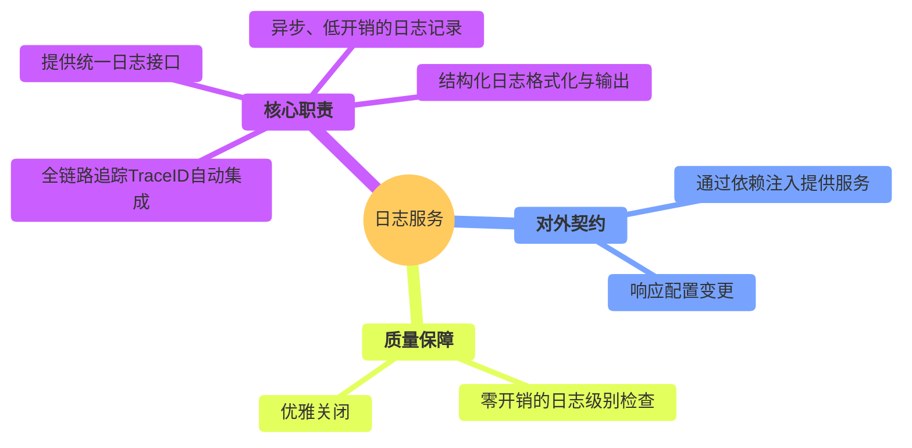
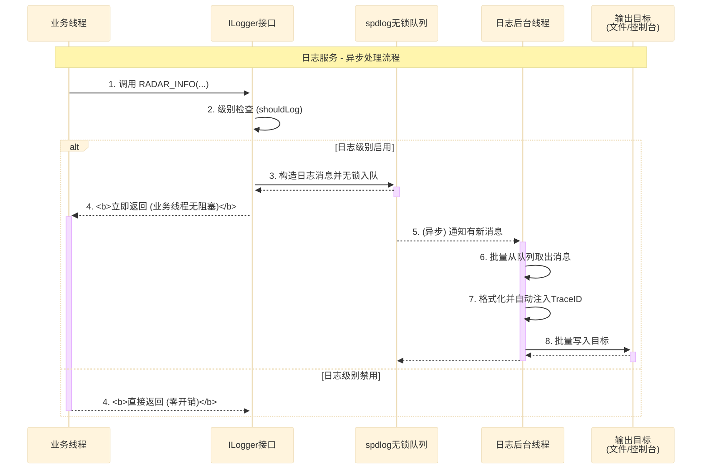
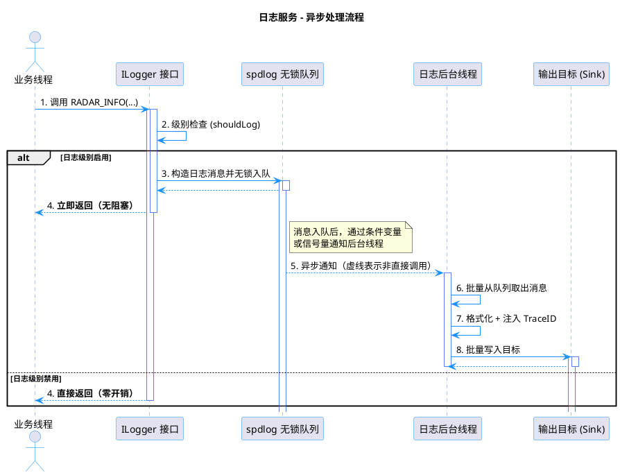
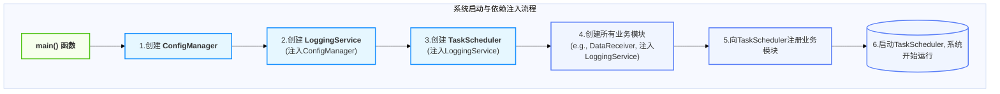

# 日志服务设计

  - **当前版本**: v3.0.0
  - **最后更新**: 2025-10-14
  - **负责人**: Klein

-----

## 概述

  - **概要**: 本文件是雷达数据处理系统中 **日志服务 (`LoggingService`)** 的详细设计规格说明。其核心目标是为整个系统提供一个统一的、高性能的、可观测的日志记录基础设施。作为一项被动的基础服务，本模块的使命是为系统中的所有其他模块提供可靠、低开销的日志记录能力。本文档将从服务的对外契约（如何使用）开始，深入其内部实现（如何工作），并最终阐明其如何被集成到系统中，确保其设计与项目的总体架构原则保持高度一致。

-----

## 目录

- [日志服务设计](#日志服务设计)
  - [概述](#概述)
  - [目录](#目录)
  - [1 文档职责](#1-文档职责)
    - [1.1 文档目标与范围](#11-文档目标与范围)
    - [1.2 核心原则对齐](#12-核心原则对齐)
  - [2 模块总体设计](#2-模块总体设计)
    - [2.1 模块职责定义](#21-模块职责定义)
    - [2.2 模块边界与接口](#22-模块边界与接口)
    - [2.3 关键性能指标 (KPIs)](#23-关键性能指标-kpis)
  - [3 服务接口与使用模式 (对外契约)](#3-服务接口与使用模式-对外契约)
    - [3.1 核心服务接口 (`ILogger`)](#31-核心服务接口-ilogger)
    - [3.2 推荐使用模式 (最佳实践)](#32-推荐使用模式-最佳实践)
    - [3.3 全链路可观测性集成 (`TraceID`)](#33-全链路可观测性集成-traceid)
  - [4 内部实现与核心机制 (对内实现)](#4-内部实现与核心机制-对内实现)
    - [4.1 机制一：异步处理与高性能设计](#41-机制一异步处理与高性能设计)
    - [4.2 机制二：配置驱动与动态性](#42-机制二配置驱动与动态性)
  - [5 集成与生命周期 (系统装配)](#5-集成与生命周期-系统装配)
    - [5.1 依赖注入与初始化顺序](#51-依赖注入与初始化顺序)
    - [5.2 生命周期管理策略](#52-生命周期管理策略)
  - [6 性能优化策略](#6-性能优化策略)
  - [7 术语表](#7-术语表)
  - [8 相关文档](#8-相关文档)
  - [9 变更历史](#9-变更历史)

-----

## 1 文档职责

  - **概要**: 本章定义了本文档自身的“使命”，明确其目标、范围以及设计所遵循的“技术宪法”——项目的核心架构原则。这确保了所有设计决策都有据可依。

### 1.1 文档目标与范围

  - **概要**: 本节旨在清晰界定本文档要讲什么、不讲什么，为读者设定正确的预期。
      - **目标**: 本文档的核心目标是为`LoggingService`提供一个健壮、高性能且可扩展的设计蓝图。它将详细定义服务的公开接口、核心实现机制（如异步写入、TraceID集成）、配置方法以及生命周期管理。
      - **范围**: 本文档覆盖从日志消息的产生（通过日志宏），到其被异步处理、格式化并最终输出到指定目标（控制台、文件等）的完整流程。文档**不包含**日志内容的分析、监控告警或日志数据的长期存储与检索策略，这些由`MonitoringModule`或外部日志聚合系统负责。

### 1.2 核心原则对齐

  - **概要**: 本节是设计的基石，旨在确保本服务的设计决策与项目已确立的架构原则完全对齐，保证系统整体的一致性。

| 核心原则           | 在本模块设计中的具体体现                                                                                                                                                      |
| :----------------- | :---------------------------------------------------------------------------------------------------------------------------------------------------------------------------- |
| **数据与控制分离** | **本服务是纯粹的控制面基础设施**。它不参与任何业务数据流的处理。其唯一的“数据”就是从系统各处收集而来的、描述系统行为的元数据——日志消息。                                      |
| **事件驱动架构**   | **本服务是事件的被动消费者，而非驱动者**。它通过订阅`ConfigManager`发布的`ConfigChangedEvent`来实现配置的热更新。它自身不发布任何驱动业务流程的事件。                         |
| **依赖注入**       | **这是本服务被消费的唯一方式**。`LoggingService`的`ILogger`接口实例在系统启动的最早期被创建，并通过**构造函数注入**到需要日志记录功能的所有模块和服务中，彻底杜绝了全局单例。 |
| **全链路可观测性** | **这是本服务的核心设计目标之一**。服务与`TraceContext`深度集成，能够**自动捕获**当前线程的`TraceID`并将其附加到每一条日志消息中，是实现端到端追踪、快速定位问题的关键基础。   |

-----

## 2 模块总体设计

  - **概要**: 本章从“黑盒”视角描绘日志服务的蓝图，定义其在系统生态中的角色、输入输出以及必须达成的性能目标。作为保障系统可观测性的基石，其设计的可靠性和低开销特性至关重要。

### 2.1 模块职责定义

  - **概要**: 本节使用思维导图的方式，直观地展示日志服务作为系统“记录员”的完整职责范围。

<!-- end list -->



### 2.2 模块边界与接口

  - **概要**: 本节明确定义本服务与系统其他部分的交互契约。作为一个基础服务，它被广泛依赖，但自身依赖极少。

| 边界类型           | 交互对象            | 交互接口 / 数据格式           | 核心契约与说明                                                                     |
| :----------------- | :------------------ | :---------------------------- | :--------------------------------------------------------------------------------- |
| **输入 (Inputs)**  | **所有模块/服务**   | `ILogger` 接口 / `RADAR_*` 宏 | **日志记录请求**: 接收来自系统各处的、任意级别的日志记录请求。                     |
|                    | `ConfigManager`     | `IConfigManager` (注入)       | **配置源**: 从配置管理器获取日志级别、输出格式、文件路径等配置，并订阅其变更事件。 |
| **输出 (Outputs)** | **文件系统/控制台** | 文本日志流                    | **日志产物**: 将格式化后的结构化日志写入到配置文件中指定的目标（Sinks）。          |

### 2.3 关键性能指标 (KPIs)

  - **概要**: 本节定义衡量本服务性能是否达标的可量化指标。对于日志服务，核心KPI在于**对业务线程的性能影响要尽可能小**。

| KPI 指标                    | 目标值(示例)                         | 测量方法                                                                    | 重要性与说明                                                                                                         |
| :-------------------------- | :----------------------------------- | :-------------------------------------------------------------------------- | :------------------------------------------------------------------------------------------------------------------- |
| **日志调用开销 (启用级别)** | **P99 \< 100ns**                     | 微基准测试 (Micro-benchmarking)，测量从调用`RADAR_INFO`到函数返回的总耗时。 | **极高**<br>这是衡量异步日志性能的核心。业务线程只需将日志消息入队即可立即返回，不能有任何阻塞。                     |
| **日志调用开销 (禁用级别)** | **\< 10ns**                          | 微基准测试，测量在日志级别被禁用时，调用`RADAR_DEBUG`的耗时。               | **极高**<br>通过宏实现的编译期级别检查，必须确保在禁用时接近**零开销**，允许开发者在代码中无顾虑地保留大量调试日志。 |
| **CPU / 内存占用**          | **CPU \< 0.1%**<br>**内存 \< 20 MB** | 在高日志负载下，通过`htop`等工具监控日志后台线程的资源占用。                | **中**<br>作为基础服务，必须保持轻量，不能成为系统本身的性能负担。                                                   |

-----

## 3 服务接口与使用模式 (对外契约)

  - **概要**: **本章是“服务消费者”最关心的部分**。它详细定义了服务的公开契约和最佳使用实践，回答了“如何正确、高效地使用我？”这个问题。本章将完全屏蔽内部实现细节，只关注服务的调用方式与核心保证。

### 3.1 核心服务接口 (`ILogger`)

  - **概要**: `ILogger`是日志服务对外暴露的唯一C++接口。系统中的任何模块或组件都通过持有该接口的共享指针（`std::shared_ptr<ILogger>`）来获得日志记录能力。该接口定义了日志服务的核心功能契约，并通过依赖注入的方式提供给消费者。

  - **C++ 接口定义**:

    ```cpp
    namespace radar::logging {

    /**
     * @brief 日志记录接口
     * @details 所有模块通过此接口进行日志记录，以支持依赖注入和统一管理。
     */
    class ILogger {
    public:
        virtual ~ILogger() = default;

        /**
         * @brief 检查指定级别是否已启用。
         * @details 这是实现零开销日志宏的关键，允许在调用重量级日志函数前进行快速检查。
         * @param level 日志级别
         * @return 如果该级别及更高级别的日志已启用，则返回true。
         */
        virtual bool shouldLog(LogLevel level) const = 0;

        /**
         * @brief (模板方法) 记录一条结构化日志消息。
         * @details 此方法通常不直接调用，而是通过下述的RADAR_*宏进行封装。
         * @tparam Args 可变参数类型
         * @param level 日志级别
         * @param format 类fmt::format的格式化字符串
         * @param args 格式化参数
         */
        template<typename... Args>
        void log(LogLevel level, const std::string& format, Args&&... args);

        /**
         * @brief 立即将缓冲区中的所有日志消息刷入目标（如文件）。
         * @details 主要用于程序优雅退出时，确保所有日志都被完整记录。
         */
        virtual void flush() = 0;

        /**
         * @brief 动态设置日志记录的最低级别。
         * @details 支持运行时热更新日志级别。
         * @param level 新的日志级别
         */
        virtual void setLevel(LogLevel level) = 0;
    };

    } // namespace radar::logging
    ```

### 3.2 推荐使用模式 (最佳实践)

  - **概要**: 为实现极致的性能，日志服务的直接使用者并非`ILogger`接口本身，而是一组精心设计的**高性能日志宏**（`RADAR_*`系列）。这些宏通过在编译期进行日志级别检查，实现了在日志级别被禁用时**接近零的性能开销**，允许开发者在代码中无顾虑地保留大量的调试和追踪日志，而无需在发布版本中手动移除它们。

  - **高性能宏定义**:

    ```cpp
    #define RADAR_DEBUG(logger, ...) \
        do { \
            if ((logger) && (logger)->shouldLog(radar::logging::LogLevel::DEBUG)) { \
                (logger)->log(radar::logging::LogLevel::DEBUG, __VA_ARGS__); \
            } \
        } while(0)

    // ... RADAR_TRACE, RADAR_INFO, RADAR_WARN, RADAR_ERROR 宏定义类似
    ```

  - **使用示例**:

    ```cpp
    // 在模块的构造函数中注入logger
    class DataProcessor {
    public:
        DataProcessor(std::shared_ptr<ILogger> logger) : logger_(logger) {}

        void processData(const DataObject& data) {
            // 当DEBUG级别被禁用时，这一行代码在编译后等同于空操作，完全零开销。
            // `data.toString()` 和格式化操作都不会被执行。
            RADAR_DEBUG(logger_, "Data details for diagnostics: {}", data.toString());

            // 结构化日志记录，便于后续的机器解析和分析。
            RADAR_INFO(logger_, "Processing completed - {duration_ms={}, size={}}",
                       getDuration(), data.size());
        }

    private:
        std::shared_ptr<ILogger> logger_;
    };
    ```

### 3.3 全链路可观测性集成 (`TraceID`)

  - **概要**: 日志服务的核心价值之一是支撑全链路可观测性。`LoggingService`与系统的`TraceContext`机制深度集成，能够**自动、隐式地**捕获当前线程的`TraceID`，并将其作为结构化日志的一部分进行记录。开发者在调用日志宏时，**无需也禁止**手动传递`TraceID`，从而实现了日志记录与追踪上下文的完全解耦。

  - **实现策略**:

    1.  **`TraceContext`**: 系统通过`thread_local`变量维护每个线程的`TraceID`上下文。当一个请求或数据流进入系统时（如`DataReceiver`），会为其生成一个`TraceID`并设置到当前线程。
    2.  **`TraceContextGuard`**: 通过RAII模式，确保`TraceID`在跨越函数调用和异步边界时能够被正确设置和恢复。
    3.  **日志服务集成**: `LoggingService`的`log()`方法在内部会调用`TraceContext::getCurrentTraceId()`来获取当前线程的`TraceID`，并将其自动填入日志消息的`[TraceID]`字段中。

  - **日志输出示例**:

    ```
    // 以下日志由不同模块、不同线程产生，但由于共享相同的TraceID，可以被轻松关联起来
    [2025-09-25T10:30:05.123Z] [INFO] [DataRecv] [a1b2c3d4] Packet received: size=4096
    [2025-09-25T10:30:05.124Z] [DEBUG] [SigProc] [a1b2c3d4] Starting FFT processing...
    [2025-09-25T10:30:05.126Z] [ERROR] [DataProc] [a1b2c3d4] Processing failed: timeout
    ```

-----

## 4 内部实现与核心机制 (对内实现)

  - **概要**: **本章是“服务维护者”最关心的部分**。它“打开黑盒”，深入剖析支撑服务运行的核心技术机制，回答了“我是如何高效、可靠地工作的？”这个问题。

### 4.1 机制一：异步处理与高性能设计

  - **概要**: 阐述服务高性能的基石。为确保在任何负载下，对业务线程的性能影响都降至最低（P99 \< 100ns），`LoggingService`的核心实现是一个**完全异步的、生产者-消费者模型**。业务线程（生产者）在调用日志宏后，仅需执行一次轻量级的、无锁的消息入队操作即可立即返回。所有重量级的I/O操作（格式化、文件写入）都由一个专用的后台工作线程（消费者）批量处理，从而将业务线程的日志记录开销降至纳秒级别。

  - **实现策略**:
    `LoggingService`的内部实现深度集成了业界标准的`spdlog`库，并利用其强大的异步日志记录功能。

    1.  **无锁队列 (`spdlog::async_logger`)**: `spdlog`的异步日志器内部使用一个高性能的、多生产者单消费者的无锁环形缓冲区作为核心。当业务线程调用日志宏时，日志消息被快速地封装并推入此队列。
    2.  **后台工作线程**: `LoggingService`在初始化时，会创建一个专用的后台工作线程。该线程是队列的唯一消费者，它在循环中等待队列中有新的日志消息，然后批量地从中取出，进行格式化，并写入到最终的输出目标（Sinks）。
    3.  **批量刷盘**: 为进一步优化I/O性能，后台线程并非每条消息都执行一次文件写入，而是将多条消息聚合后，周期性地（或当缓冲区满时）执行一次批量刷盘操作。

    下面的`sequenceDiagram`图详细展示了从业务线程调用日志宏到日志被写入磁盘的完整异步流程。

<!-- end list -->





### 4.2 机制二：配置驱动与动态性

  - **概要**: 阐述服务的灵活性来源。日志服务的所有行为，包括**日志级别、输出格式、文件轮转策略**等，都**必须**由外部配置文件驱动，而非在代码中硬编码。通过与`ConfigManager`的深度集成，`LoggingService`能够响应运行时的配置变更，实现例如“在线动态调整日志级别以进行问题排查”等高级运维能力，而无需重启整个系统。

  - **实现策略**:

    1.  **启动时加载**: `LoggingService`在`initialize()`阶段，会从注入的`IConfigManager`中获取`logging:`命名空间下的所有配置，并据此构建其内部的`spdlog`日志器实例，包括设置初始的日志级别、创建和配置一个或多个Sinks（如控制台Sink、文件Sink）。
    2.  **订阅变更**: 同时，`LoggingService`会向`ConfigManager`**订阅**`logging.*`模式的配置变更事件。
    3.  **热更新处理**: 当`ConfigManager`发布`ConfigChangedEvent`且`key`匹配`logging.*`时，`LoggingService`内部的`onConfigChanged`事件处理器会被调用。该处理器会解析变更内容，并安全地更新内部日志器的状态。

  - **配置示例 (`configs/modules/logging.yaml`)**:

    ```yaml
    # configs/modules/logging.yaml

    logging:
      # 全局日志级别: TRACE, DEBUG, INFO, WARN, ERROR
      level: "INFO"

      # 异步日志队列大小
      queue_size: 8192

      # 控制台输出 (Sink 1)
      console:
        enabled: true
        pattern: "[%Y-%m-%d %H:%M:%S.%e] [%^%l%$] [%t] [%s:%#] %v"

      # 轮转文件输出 (Sink 2)
      file:
        enabled: true
        path: "logs/radar_system.log"
        pattern: "[%Y-%m-%d %H:%M:%S.%e] [%l] [%t] [%s:%#] [%-i] %v"
        max_size_mb: 100
        max_files: 5
    ```

  - **热更新处理示例**:

    ```cpp
    // LoggingService内部的事件处理器
    void LoggingService::onConfigChanged(const ConfigChangedEvent& event) {
        // 确保所有操作可追踪
        TraceContextGuard guard(event.trace_id);

        RADAR_INFO(logger_, "Logging configuration change detected for key: {}", event.key);

        if (event.key == "logging.level") {
            try {
                auto new_level_str = event.new_value.as<std::string>();
                auto new_level = parseLogLevel(new_level_str); // 转换为内部枚举

                // 原子地更新日志级别
                this->setLevel(new_level);

                RADAR_WARN(logger_, "Log level dynamically updated to '{}'", new_level_str);
            } catch (const std::exception& e) {
                RADAR_ERROR(logger_, "Failed to apply new log level: {}", e.what());
            }
        }
        // else if (event.key == "logging.file.path") { ... }
        // 注意: 更改文件路径等需要重新创建Sink的复杂操作，需要更复杂的同步机制，
        // 在MVP阶段可能仅支持日志级别等简单参数的热更新。
    }
    ```

-----

## 5 集成与生命周期 (系统装配)

  - **概要**: **本章是“系统集成者”最关心的部分**。它阐述了本服务作为一个基础组件，是如何被“安装”到整个系统框架中，并确保其在整个系统生命周期内正确、可靠地运行。对于日志服务而言，其特殊的“最早创建、最晚销毁”的生命周期要求，是本章讨论的核心。

### 5.1 依赖注入与初始化顺序

  - **概要**: `LoggingService`是系统的核心基础设施，它几乎被所有其他模块和组件所依赖。为确保在任何组件需要记录日志时服务都已就绪，它**必须**在应用程序的`main`函数中，在绝大多数其他对象（包括`TaskScheduler`和所有业务模块）之前被创建和初始化。

  - **实现策略**:
    `main`函数负责系统的“装配”过程。`LoggingService`的创建和注入遵循一个严格的顺序，以确保依赖关系的正确解析。

    下面的`graph`图清晰地展示了在系统启动时，`LoggingService`是如何被创建，并作为依赖项被注入到其他核心组件中的。

<!-- end list -->



### 5.2 生命周期管理策略

  - **概要**: 描述本服务的生命周期管理特殊性。由于日志服务必须保证在系统关闭的最后一刻依然可用（例如，用于记录其他模块析构时产生的日志），其清理和销毁**必须**晚于所有依赖它的模块。为确保这一点，我们引入了**RAII（资源获取即初始化）包装器**模式，来自动、可靠地管理其生命周期。
  - **接口实现**: 本服务实现了 `ILifecycleManaged` 接口以融入系统生命周期管理框架。作为基础服务，本服务不需要实现 `IPausable` 或 `IMonitorable` 接口，其可用性通过成功的日志输出本身来体现。

  - **实现策略**:

    1.  **`LoggingServiceRAII`包装器**: 我们创建一个`LoggingServiceRAII`类。在`main`函数的开头，该类的一个实例在栈上被创建。
    2.  **构造时初始化**: `LoggingServiceRAII`的**构造函数**负责创建`LoggingService`实例，并完成所有`spdlog`的初始化工作。
    3.  **析构时清理**: 当`main`函数结束，`LoggingServiceRAII`实例即将被销毁时，其**析构函数**会被自动调用。该析构函数将负责执行`logger->flush()`和关闭`spdlog`等关键的清理操作。
    4.  **架构收益**: 这种基于RAII的模式，利用了C++的语言特性，**保证了即使在发生异常导致程序提前退出时，日志服务的清理逻辑也能够被可靠地执行**，从而最大限度地避免了日志数据的丢失。

    下面的`flowchart`图展示了RAII包装器在系统整个生命周期中的作用。

```mermaid
---
  config:
    theme: base
    flowchart:
      curve: basis
---
flowchart TD
    %% --- 图例 (上下文颜色语义) ---
    %% 系统流程 (浅蓝)
    %% RAII包装器 (淡紫)
    %% 日志服务 (浅黄)

    subgraph "RAII驱动日志服务生命周期"
        A["main() 函数开始"] --> B["<b>创建 LoggingServiceRAII 实例</b>"];

        subgraph "LoggingServiceRAII 构造函数"
            B --> C["1.初始化spdlog基础设施"];
            C --> D["2.创建LoggingService实例"];
            D --> E["3.注入ConfigManager"];
        end

        E --> F["系统正常运行<br/>(所有模块安全地使用日志服务)"];
        F --> G["main() 函数即将结束"];

        subgraph "LoggingServiceRAII 析构函数 (自动调用)"
            G --> H["1.<b>调用 flush() 确保所有日志写入磁盘</b>"];
            H --> I["2.等待异步队列清空"];
            I --> J["3.安全关闭spdlog"];
        end

        J --> K["main() 函数结束"];
    end

    %% --- 标准 classDef 模板 ---
    classDef role_A fill:#e6f7ff,stroke:#1890ff,stroke-width:2px
    classDef role_D fill:#f0f5ff,stroke:#597ef7,stroke-width:2px
    classDef role_C fill:#fffbe6,stroke:#d4b106,stroke-width:2px

    %% --- 样式应用 ---
    class A,F,G,K role_A
    class B,H,I,J role_D
    class C,D,E role_C
```

<!-- end list -->



## 6 性能优化策略

- **概要**: 本章的角色是**“总结与承诺”**。它将本服务为达成其核心性能指标（KPIs）所采用的关键技术进行集中呈现，为实现者、测试者和消费者提供一份清晰、可量化的性能规格书。本服务的核心高性能设计（如异步处理、零开销宏）已在第四章深入阐述，本章旨在将其汇总为一份“性能速查表”。

- **关键性能优化技术**:

| 优化技术               | 实现方式                                                                                   | 性能收益/承诺                                                                                                            | 适用场景                                                   |
| :--------------------- | :----------------------------------------------------------------------------------------- | :----------------------------------------------------------------------------------------------------------------------- | :--------------------------------------------------------- |
| **零开销日志级别检查** | 在日志宏 (`RADAR_*`) 中使用 `if` 语句，在调用 `log()` 函数前先检查日志级别。               | **禁用时接近零开销 (<10ns)**。当日志级别被禁用时，相关的参数求值（如 `data.toString()`）和函数调用在编译后被完全优化掉。 | 所有级别的日志，特别是 `TRACE` 和 `DEBUG` 级别的详细日志。 |
| **异步写入**           | 使用 `spdlog` 的异步日志器，将日志消息放入一个高性能的**无锁队列**中。                     | **业务线程无阻塞**，日志调用开销稳定在 **P99 < 100ns**。所有I/O操作都在专用的后台线程中进行。                            | 所有日志记录，尤其适用于需要高频记录日志的热点代码路径。   |
| **延迟格式化**         | 日志消息的格式化操作（包括`TraceID`的注入和`fmt::format`的执行）完全在**后台线程**中进行。 | **不阻塞业务线程**。将CPU密集型的字符串格式化操作从业务线程的关键路径中移除。                                            | 所有包含复杂格式化或多个参数的日志记录。                   |
| **批量I/O**            | 后台线程会从队列中一次性取出多个日志消息，并在内存中格式化后，进行一次**批量写入**操作。   | **大幅减少系统调用次数**，降低I/O开销，提升整体日志吞吐量。                                                              | 主要针对文件输出（File Sink），在高日志负载下效果显著。    |

-----

## 7 术语表

  - **概要**: 本章旨在为文档中出现的特定术语、缩写提供一个集中的、明确的定义，以消除歧义。

| 术语           | 英文全称 / 缩写                        | 定义与说明                                                                                                                         |
| :------------- | :------------------------------------- | :--------------------------------------------------------------------------------------------------------------------------------- |
| **异步日志**   | Asynchronous Logging                   | 一种高性能日志记录模式。业务线程只负责将日志消息放入内存队列，由一个专用的后台线程负责实际的I/O写入操作，从而避免阻塞业务线程。    |
| **零开销日志** | Zero-Cost / Zero-Overhead Logging      | 指通过宏或编译器优化，使得在日志级别被禁用时，相关的日志代码（包括参数求值）在最终的二进制文件中被完全移除，不产生任何运行时开销。 |
| **Sink**       | Sink                                   | 在日志库（如`spdlog`）中，指日志消息的最终输出目标，例如控制台（Console）、文件（File Sink）、轮转文件（Rotating File Sink）等。   |
| **RAII**       | Resource Acquisition Is Initialization | C++中的一种核心编程范式。通过将资源的生命周期与对象的生命周期绑定（在构造函数中获取，在析构函数中释放），来保证资源的正确释放。    |

-----

## 8 相关文档

  - **概要**: 本章提供了与本文档紧密相关的其他设计文档的链接，为读者提供进一步研究的入口。

  - [08\_监控服务设计.md](https://www.google.com/search?q=08_%E7%9B%91%E6%8E%A7%E6%9C%8D%E5%8A%A1%E8%AE%BE%E8%AE%A1.md)

  - [06\_配置管理模块设计.md](https://www.google.com/search?q=06_%E9%85%8D%E7%BD%AE%E7%AE%A1%E7%90%86%E6%A8%A1%E5%9D%97%E8%AE%BE%E8%AE%A1.md)

  - [05\_任务调度器设计.md](https://www.google.com/search?q=05_%E4%BB%BB%E5%8A%A1%E8%B0%83%E5%BA%A6%E5%99%A8%E8%AE%BE%E8%AE%A1.md)

  - [99\_模块集成策略.md](https://www.google.com/search?q=99_%E6%A8%A1%E5%9D%97%E9%9B%86%E6%88%90%E7%AD%96%E7%95%A5.md)

-----

## 9 变更历史

  - **概要**: 本章记录了本文档自创建以来的所有重要修订历史，是文档版本管理和追溯变更的关键。

| 版本   | 日期       | 作者           | 变更描述                                                                                                                                                               |
| :----- | :--------- | :------------- | :--------------------------------------------------------------------------------------------------------------------------------------------------------------------- |
| v3.0.0 | 2025-10-14 | Gemini & Klein | **重大重构**: 迁移至“服务型模块”新文档结构。将旧有内容重组到`服务接口`、`内部实现`和`集成与生命周期`等新章节，使文档叙事逻辑更贴合基础服务模块的特性。所有图表已更新。 |
| v2.1.0 | 2025-09-25 | Klein          | **文档拆分**: 将原“日志监控模块”拆分为独立的`日志服务`和`监控服务`设计，优化了职责定义和架构描述。                                                                     |
| v2.0.0 | 2025-09-25 | Klein          | **架构重构**: 移除全局单例，全面采用依赖注入；与`ConfigManager`深度集成；完善`TraceID`追踪机制。                                                                       |
| v1.0.0 | 2025-09-23 | Klein          | **初始版本创建**。                                                                                                                                                     |
