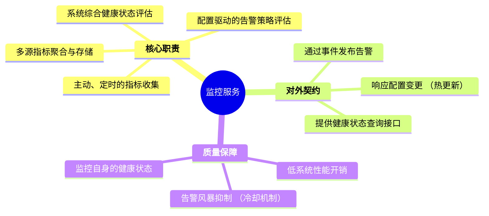

# 监控服务设计

  - **当前版本**: v3.0.0
  - **最后更新**: 2025-10-14
  - **负责人**: Klein

-----

## 概述

  - **概要**: 本文件是雷达数据处理系统中 **监控服务 (`MonitoringModule`)** 的详细设计规格说明。其核心目标是为整个系统提供一个统一的、主动的、可观测的监控与告警基础设施。作为系统的“哨兵”，本模块的使命是持续收集系统健康状态、聚合性能指标，并在发现异常时通过事件总线发出预警，为系统的稳定性、性能优化和故障诊断提供关键数据支持。

-----

## 目录

- [监控服务设计](#监控服务设计)
  - [概述](#概述)
  - [目录](#目录)
  - [1 文档职责](#1-文档职责)
    - [1.1 文档目标与范围](#11-文档目标与范围)
    - [1.2 核心原则对齐](#12-核心原则对齐)
  - [2 模块总体设计](#2-模块总体设计)
    - [2.1 模块职责定义](#21-模块职责定义)
    - [2.2 模块边界与接口](#22-模块边界与接口)
    - [2.3 关键性能指标 (KPIs)](#23-关键性能指标-kpis)
  - [3 服务接口与使用模式 (对外契约)](#3-服务接口与使用模式-对外契约)
    - [3.1 模式一：业务指标的主动发布 (`MetricsUpdateEvent`)](#31-模式一业务指标的主动发布-metricsupdateevent)
    - [3.2 模式二：告警事件的订阅与消费](#32-模式二告警事件的订阅与消费)
    - [3.3 模式三：系统健康状态的API查询](#33-模式三系统健康状态的api查询)
  - [4 内部实现与核心机制 (对内实现)](#4-内部实现与核心机制-对内实现)
    - [4.1 机制一：主动、定时驱动的监控循环](#41-机制一主动定时驱动的监控循环)
    - [4.2 机制二：高性能指标聚合架构 (MPSC模型)](#42-机制二高性能指标聚合架构-mpsc模型)
    - [4.3 机制三：配置驱动的事件告警引擎](#43-机制三配置驱动的事件告警引擎)
  - [5 集成与生命周期 (系统装配)](#5-集成与生命周期-系统装配)
    - [5.1 依赖注入与初始化顺序](#51-依赖注入与初始化顺序)
    - [5.2 生命周期管理](#52-生命周期管理)
    - [5.3 模块配置项 (`config.yaml`)](#53-模块配置项-configyaml)
  - [6 关键横切关注点](#6-关键横切关注点)
    - [6.1 错误处理 (针对监控服务自身)](#61-错误处理-针对监控服务自身)
    - [6.2 全链路可观测性 (TraceID的应用)](#62-全链路可观测性-traceid的应用)
  - [7 术语表](#7-术语表)
  - [8 相关文档](#8-相关文档)
  - [9 变更历史](#9-变更历史)

-----

## 1 文档职责

  - **概要**: 本章定义了本文档自身的“使命”，明确其目标、范围以及设计所遵循的“技术宪法”——项目的核心架构原则。这确保了所有设计决策都有据可依。

### 1.1 文档目标与范围

  - **概要**: 本节旨在清晰界定本文档要讲什么、不讲什么，为读者设定正确的预期。
      - **目标**: 本文档的核心目标是为`MonitoringModule`提供一个健壮、低开销且可扩展的设计蓝图。它将详细定义服务的监控机制、指标聚合模型、事件驱动的告警策略、配置方法以及其作为标准`IModule`的生命周期管理。
      - **范围**: 本文档覆盖从系统资源与业务性能指标的主动收集，到指标的聚合与评估，最终将`AlertTriggeredEvent`等告警事件发布至事件总线的完整流程。文档**不包含**告警事件的具体消费方（如UI、`TaskScheduler`）如何响应告警的内部逻辑。

### 1.2 核心原则对齐

  - **概要**: 本节是设计的基石，旨在确保本服务的设计决策与项目已确立的架构原则完全对齐，保证系统整体的一致性。

| 核心原则           | 在本模块设计中的具体体现                                                                                                                                                                                                                          |
| :----------------- | :------------------------------------------------------------------------------------------------------------------------------------------------------------------------------------------------------------------------------------------------ |
| **数据与控制分离** | **本服务是纯粹的控制面基础设施**。它不参与任何业务数据流的处理，其唯一的“数据”是从系统各处收集而来的、描述系统行为的元数据——性能指标。                                                                                                            |
| **事件驱动架构**   | **本服务既是事件的消费者，也是关键的生产者**。它通过**订阅**`MetricsUpdateEvent`来被动收集业务指标，并通过**发布**`AlertTriggeredEvent`来主动驱动系统的告警和恢复流程，实现了与所有模块的完全解耦。                                               |
| **依赖注入**       | 本模块作为一个标准的`IModule`，其所有外部服务依赖（如`ILogger`, `IConfigManager`, `IEventBus`）都**必须**通过构造函数注入，确保了模块的高度可测试性和灵活性。                                                                                     |
| **全链路可观测性** | **这是本服务的核心使命之一**。本模块在处理任何传入事件（如`MetricsUpdateEvent`）时，都会继承其`TraceID`。在发布`AlertTriggeredEvent`时，**必须**将此`TraceID`继续传递下去，使得我们可以将一个性能异常与其触发的告警和后续恢复动作完整地关联起来。 |

-----

## 2 模块总体设计

  - **概要**: 本章从“黑盒”视角描绘监控服务的蓝图，定义其在系统生态中的角色、输入输出以及必须达成的性能目标。作为保障系统可观测性的基石，其设计的可靠性和低开销特性至关重要。

### 2.1 模块职责定义

  - **概要**: 本节使用思维导图的方式，直观地展示监控服务作为系统“健康状态监护人”的完整职责范围。

<!-- end list -->



### 2.2 模块边界与接口

  - **概要**: 本节明确定义本服务与系统其他部分的交互契约。作为一个主动的监控模块，它广泛地观察系统，并通过事件总线向外发布其洞察。

| 边界类型           | 交互对象            | 交互接口 / 数据格式                                   | 核心契约与说明                                                                                                               |
| :----------------- | :------------------ | :---------------------------------------------------- | :--------------------------------------------------------------------------------------------------------------------------- |
| **输入 (Inputs)**  | **所有业务模块**    | `MetricsUpdateEvent` (订阅)                           | **业务指标来源**: 通过订阅事件总线上的`MetricsUpdateEvent`，被动地、非侵入式地收集来自各业务模块的性能指标。                 |
|                    | **操作系统/硬件**   | 专用库 (e.g., NVML, a C++ system information library) | **系统资源来源**: 主动调用底层API，定时获取CPU、内存、GPU等系统级资源使用情况。                                              |
|                    | `ConfigManager`     | `IConfigManager` (注入)                               | **配置源**: 从配置管理器获取监控周期、告警阈值等所有可配置参数，并订阅其变更事件以支持热更新。                               |
| **输出 (Outputs)** | **EventBus** (广播) | `AlertTriggeredEvent`, `AlertResolvedEvent`           | **告警发布**: 当检测到指标异常或恢复正常时，向整个系统广播标准化的告警事件。**这是本模块最主要的输出**。                     |
|                    | **API网关/CLI**     | `ISystemQuery` (内部服务接口)                         | **状态查询服务**: 向API网关或命令行工具提供一个内部查询接口，使其能够响应外部对`GET /api/v1/system/health`等状态查询的请求。 |

### 2.3 关键性能指标 (KPIs)

  - **概要**: 本节定义衡量本服务性能是否达标的可量化指标。对于监控服务，核心KPI在于**对系统的性能影响要尽可能小**，同时保证**告警的及时性**。

| KPI 指标           | 目标值(示例)     | 测量方法                                                                     | 重要性与说明                                                             |
| :----------------- | :--------------- | :--------------------------------------------------------------------------- | :----------------------------------------------------------------------- |
| **监控开销 (CPU)** | **\< 1% (平均)** | 在正常负载下，通过`htop`等工具监控`MonitoringModule`进程或线程的CPU占用率。  | **极高**<br>监控服务绝不能成为被监控系统的性能瓶颈。这是设计的首要前提。 |
| **告警检测延迟**   | **P99 \< 10ms**  | 内部计时器，测量从指标数据进入模块到评估完成并决定是否生成告警事件的总耗时。 | **高**<br>确保系统能在异常发生后尽快发出预警，是实现快速故障恢复的基础。 |
| **内存占用**       | **\< 32 MB**     | 测量模块在运行时，特别是其内部`MetricsStore`历史数据缓存所占用的内存大小。   | **中**<br>作为常驻核心服务，必须保持轻量，不能过度消耗系统内存资源。     |

-----

## 3 服务接口与使用模式 (对外契约)

  - **概要**: **本章是“服务消费者”最关心的部分**。它详细定义了监控服务的公开契约和交互模式，回答了“系统其他部分如何与我（监控服务）协作？”这个问题。本章将完全屏蔽内部实现细节，只关注服务的调用方式与核心保证。监控服务与其他模块的交互是完全解耦的，主要通过以下三种标准化的异步模式进行。

### 3.1 模式一：业务指标的主动发布 (`MetricsUpdateEvent`)

  - **概要**: 监控服务通过**被动订阅**事件总线上的 `MetricsUpdateEvent` 事件来收集业务指标。任何业务模块（如`数据处理模块`、`信号处理模块`）都可以作为**生产者**，在完成其核心业务逻辑后，主动将自身的性能指标封装成一个标准的 `MetricsUpdateEvent` 事件并发布。这种“发布-订阅”模式确保了监控服务与业务模块之间的完全解耦，业务模块无需知道监控服务的存在。

  - **协作流程**:
    下图展示了一个业务模块（以`DataProcessor`为例）在完成一帧数据处理后，如何将处理耗时、当前航迹数等关键性能指标发布到事件总线，并最终被`MonitoringModule`异步消费。

    ```mermaid
    ---
      config:
        theme: base
        flowchart:
          curve: basis
    ---
    sequenceDiagram
        participant BizModule as 业务模块<br/>(e.g., DataProcessor)
        participant EventBus as 事件总线
        participant MonitorModule as 监控模块

        Note over BizModule, MonitorModule: 业务指标的发布与订阅流程

        BizModule->>BizModule: 1. 完成核心业务处理 (e.g., 航迹更新)
        BizModule->>BizModule: 2. 聚合本周期的性能指标<br/>(处理耗时, 航迹数等)
        BizModule->>EventBus: 3. 创建并发布 MetricsUpdateEvent<br/>(含TraceID)

        Note right of EventBus: (异步)
        EventBus->>MonitorModule: 4. 将事件路由给所有订阅者
        activate MonitorModule
        MonitorModule->>MonitorModule: 5. 在内部事件处理器中<br/>接收并聚合指标
        deactivate MonitorModule

    ```

  - **`MetricsUpdateEvent` 事件定义 (概念性)**:

    ```cpp
    struct MetricsUpdateEvent : public BaseEvent {
        // 事件类型
        static constexpr const char* EVENT_TYPE = "MetricsUpdate";

        // 指标来源模块
        std::string source_module;

        // 包含的指标键值对
        // e.g., {"processing_latency_ms": 12.5, "active_tracks": 150}
        std::map<std::string, double> metrics;

        const char* getEventType() const override { return EVENT_TYPE; }
    };
    ```

### 3.2 模式二：告警事件的订阅与消费

  - **概要**: `MonitoringModule` 最核心的对外服务是**发布告警**。当其内部的告警策略引擎检测到异常时，会创建标准化的 `AlertTriggeredEvent` 或 `AlertResolvedEvent` 事件，并通过 `EventBus` 向全系统广播。任何关心系统状态的模块都可以作为**消费者**订阅这些事件，并根据自身职责做出响应。

  - **协作架构**:
    下图展示了`MonitoringModule`作为告警事件的唯一生产者，以及多个不同职责的消费者（如`TaskScheduler`、`数据网关`、`日志服务`）如何独立地订阅和响应这些告警。

    ```mermaid
    ---
      config:
        theme: base
        flowchart:
          curve: basis
    ---
    graph TD
        %% --- 图例 (上下文颜色语义) ---
        %% 生产者 (浅蓝): 告警事件的唯一来源。
        %% 消息总线 (浅黄): 系统事件通信的中枢。
        %% 消费者 (浅绿): 订阅并响应告警的模块。

        subgraph "事件驱动告警架构"
            A[("<b>MonitoringModule</b><br/>告警事件生产者")] -- "发布" --> B(("<b>EventBus</b>"))

            subgraph "告警事件消费者 (完全解耦)"
                direction LR
                C["<b>TaskScheduler</b><br/>(决策是否需要执行恢复动作)"]
                D["<b>数据网关模块</b><br/>(更新API状态, 通知外部客户端)"]
                E["<b>日志服务</b><br/>(记录详细的告警审计日志)"]
            end

            B -.->|"路由"| C
            B -.->|"路由"| D
            B -.->|"路由"| E
        end


        %% --- 标准 classDef 模板 ---
        classDef role_A fill:#e6f7ff,stroke:#1890ff,stroke-width:2px
        classDef role_C fill:#fffbe6,stroke:#d4b106,stroke-width:2px
        classDef role_B fill:#f6ffed,stroke:#52c41a,stroke-width:2px

        %% --- 样式应用 ---
        class A role_A
        class B role_C
        class C,D,E role_B
    ```

  - **架构收益**: 这种模式将“**检测异常**”的职责（由`MonitoringModule`承担）与“**响应异常**”的职责（由各个消费者承担）**完全分离**，实现了极高的灵活性和可扩展性。

### 3.3 模式三：系统健康状态的API查询

  - **概要**: 为了服务于那些位于系统外部、无法直接订阅`EventBus`的客户端（特别是独立的**显控终端**），`MonitoringModule`还提供了一种**基于拉取（Pull）模式**的查询接口。它会持续计算和维护一个系统综合健康状态报告 (`SystemStatusReport`)，并通过内部服务接口将其暴露给`API网关`模块，最终由`API网关`通过RESTful API提供给外部查询。

  - **协作流程**:

    ```mermaid
    ---
      config:
        theme: base
        flowchart:
          curve: basis
    ---
    sequenceDiagram
        participant ClientApp as 显控终端 (外部)
        participant ApiGateway as API网关模块
        participant MonitorModule as 监控模块

        Note over ClientApp, MonitorModule: 系统健康状态的外部查询流程 (轮询)

        loop 定期轮询 (e.g., 每5秒)
            ClientApp->>ApiGateway: 1. 发起HTTP GET /api/v1/system/health
            activate ApiGateway
            ApiGateway->>MonitorModule: 2. 调用内部服务接口<br/>getSystemStatusReport()
            activate MonitorModule
            MonitorModule->>MonitorModule: 3. 返回当前缓存的<br/>SystemStatusReport
            MonitorModule-->>ApiGateway: 4.
            deactivate MonitorModule
            ApiGateway->>ClientApp: 5. 返回HTTP 200 OK<br/>(Body: JSON格式的健康报告)
            deactivate ApiGateway
        end

    ```

  - **`SystemStatusReport` 数据结构 (概念性)**:

    ```cpp
    struct SystemStatusReport {
        // 系统综合健康状态: HEALTHY, WARNING, CRITICAL
        SystemHealthStatus overall_status;

        // 各子系统健康评分 (0.0 - 1.0)
        float cpu_health_score;
        float memory_health_score;
        float gpu_health_score;

        // 当前活跃的告警列表
        std::vector<ActiveAlert> active_alerts;

        // 最后更新时间戳
        Timestamp last_updated;
    };
    ```

-----

## 4 内部实现与核心机制 (对内实现)

  - **概要**: **本章是“服务维护者”最关心的部分**。它“打开黑盒”，深入剖析支撑服务运行的三大核心技术机制，回答了“我是如何高效、可靠地工作的？”这个问题。这些机制共同构成了监控服务作为系统“哨兵”的基础：首先是其作为主动模块的**定时驱动监控循环**；其次是保障其低开销的**高性能指标聚合架构**；最后是定义其“智能”的**配置驱动的事件告警引擎**。

### 4.1 机制一：主动、定时驱动的监控循环

  - **概要**: 阐述本模块作为**主动模块**的核心——`ExecutionEngine`。它在一个独立的专用工作线程中运行，通过一个由可配置定时器驱动的主循环，来周期性地触发“**收集 -\> 聚合 -\> 评估**”的完整监控流程。这种主动、独立的运行模式确保了监控服务与业务模块的执行完全解耦，其自身的运行不会阻塞或影响任何数据处理流水线。

  - **实现策略**:
    `MonitoringModule`在`start()`阶段会创建并启动其内部的`ExecutionEngine`。该引擎随即进入一个由定时器控制的主循环，该循环是监控服务所有行为的起点。

    下面的`sequenceDiagram`图详细展示了在一个典型的监控周期中，`ExecutionEngine`如何编排内部组件完成一次完整的监控与告警评估。

    ```mermaid
    ---
      config:
        theme: base
        flowchart:
          curve: basis
    ---
    sequenceDiagram
        participant Engine as ExecutionEngine<br/>(监控主循环)
        participant SysCollector as 系统资源收集器
        participant MetricsStore as 指标聚合存储器
        participant AlertEngine as 告警策略引擎
        participant EventBus as 事件总线

        Note over Engine, EventBus: 监控服务 - 内部核心工作流

        loop 定时触发 (e.g., 每秒一次)
            Engine->>Engine: 1. 监控周期开始

            par "并行/顺序收集"
                Engine->>+SysCollector: 2a. 主动收集系统资源<br/>(CPU, 内存, GPU)
                SysCollector-->>-Engine:
            and
                Engine->>+MetricsStore: 2b. 从MPSC队列拉取并聚合<br/>所有业务模块指标
                MetricsStore-->>-Engine: 3. 返回聚合后的系统总指标
            end

            Engine->>+AlertEngine: 4. evaluate(聚合指标)
            AlertEngine->>AlertEngine: 5. 根据配置规则检查阈值

            alt 发现异常
                AlertEngine->>+EventBus: 6. 发布 AlertTriggeredEvent
                EventBus-->>-AlertEngine:
            end
            AlertEngine-->>-Engine: 7. 评估完成

            Engine->>Engine: 8. 更新健康状态报告<br/>(供API查询)
        end
    ```

### 4.2 机制二：高性能指标聚合架构 (MPSC模型)

  - **概要**: 深度剖析为解决多线程指标收集的性能瓶颈而设计的\*\*“线程本地缓存 + 多生产者单消费者（MPSC）无锁队列”**模型。业务线程在更新指标时，只操作无锁的线程本地缓存，几乎零开销；当缓存满或超时后，才会将聚合后的指标块（`MetricsBlock`）一次性推送到全局的MPSC队列。监控模块作为唯一的消费者，从队列中批量拉取并完成最终聚合。这是确保监控服务对业务系统**性能影响降至最低\*\*的关键设计。

  - **实现策略**:
    该模型将指标的“生产”与“消费”彻底解耦，并通过批量处理大幅降低了跨线程通信的频率和开销。

    下面的`flowchart`图清晰地展示了从业务线程产生指标到监控模块最终聚合的完整数据路径。

    ```mermaid
    ---
      config:
        theme: base
        flowchart:
          curve: basis
    ---
    graph TD
        %% --- 图例 (上下文颜色语义) ---
        %% 业务线程 (淡紫): 性能指标的生产者。
        %% 监控线程 (浅蓝): 性能指标的唯一消费者。
        %% 共享资源 (浅黄): 跨线程通信的核心数据结构。

        subgraph "高性能指标聚合架构"
            direction TB

            subgraph "业务线程 (多个生产者)"
                A["<b>业务逻辑执行</b><br/>(e.g., DataProcessor)"] -- "调用" --> B["<b>ThreadLocalMetrics::increment()</b><br/>(线程本地缓存, 无锁)"]
                B -- "缓存满或超时" --> C[("<b>MetricsBlock</b><br/>(聚合后的指标块)")]
            end

            subgraph "共享的并发数据结构"
                D[("<b>MPSC无锁队列</b><br/>(全局唯一的指标队列)")]
            end

            subgraph "监控服务线程 (单个消费者)"
                E["<b>MetricsStore::aggregateFromQueue()</b><br/>(批量拉取)"] --> F["<b>最终聚合与评估</b><br/>(生成系统总指标快照)"]
            end
        end

        %% --- 流程定义 ---
        C -- "推送" --> D
        D -- "拉取" --> E

        %% --- 标准 classDef 模板 ---
        classDef role_D fill:#f0f5ff,stroke:#597ef7,stroke-width:2px
        classDef role_A fill:#e6f7ff,stroke:#1890ff,stroke-width:2px
        classDef role_C fill:#fffbe6,stroke:#d4b106,stroke-width:2px

        %% --- 样式应用 ---
        class A,B,C role_D
        class E,F role_A
        class D role_C
    ```

  - **架构收益**:

      - **极致性能**: 业务线程更新指标的操作在绝大部分时间内都是无锁的本地内存访问。
      - **无锁通信**: MPSC队列专为多生产者单消费者的场景优化，避免了锁竞争。
      - **数据完整性**: `ThreadLocalMetrics`的析构函数会确保在线程退出时，将剩余的本地缓存指标全部刷入队列，保证数据不丢失。

### 4.3 机制三：配置驱动的事件告警引擎

  - **概要**: 阐述本模块的“智能”所在。它通过一个可插拔的**告警策略引擎 (`IAlertingStrategy`)**，根据外部配置文件中定义的、支持热更新的告警规则，对聚合后的指标进行评估，并最终生成标准化的告警事件。告警规则不仅包含简单的阈值，还支持更复杂的条件，如“连续N次超出阈值”和“告警冷却时间（Cooldown）”，以有效抑制“告警风暴”。

  - **实现策略**:
    `ExecutionEngine`在每个监控周期的末尾，都会调用`IAlertingStrategy`的`checkThresholds()`方法。该策略的实现类（如`ThresholdAlertingStrategy`）会加载并解析`monitoring.thresholds`配置节，并据此对传入的聚合指标进行逐一检查。

  - **配置示例 (`configs/modules/monitoring.yaml`)**:

    ```yaml
    # configs/modules/monitoring.yaml

    monitoring:
      # ...
      thresholds:
        cpu_usage:
          warning: 80.0                # CPU使用率警告阈值(%)
          critical: 95.0               # CPU使用率严重阈值(%)
          consecutive_count: 3         # 必须连续3次超出阈值才触发告警
          cooldown_s: 60                 # 告警触发后，60秒内不再重复触发同级别告警

        gpu_usage:
          warning: 90.0
          critical: 98.0
          consecutive_count: 2
          cooldown_s: 30
    ```

  - **告警决策流程**:
    下面的`flowchart`图描绘了`ThresholdAlertingStrategy`在处理单个指标（如`cpu_usage`）时的内部决策逻辑。

    ```mermaid
    ---
      config:
        theme: base
        flowchart:
          curve: basis
    ---
    flowchart TD
        %% --- 图例 (上下文颜色语义) ---
        %% 输入 (浅黄): 流程的起点。
        %% 决策点 (淡紫): 流程中的判断逻辑。
        %% 状态变更 (浅绿): 内部状态的更新。
        %% 输出 (浅蓝): 最终产生的动作。

        A[("输入: 聚合后的CPU使用率")] --> B{"是否超出阈值?"};
        B -- "否" --> C["重置连续违规计数器<br/>检查是否需要发送'恢复'事件"];
        B -- "是" --> D{"是否在冷却期内?"};
        D -- "是" --> E[("忽略本次超标")];
        D -- "否" --> F["增加连续违规计数器"];
        F --> G{"计数器 >= consecutive_count?"};
        G -- "否" --> H[("等待下个周期")];
        G -- "是" --> I["发布 <b>AlertTriggeredEvent</b>"];
        I --> J["重置计数器 & 启动冷却计时器"];

        %% --- 标准 classDef 模板 ---
        classDef role_C fill:#fffbe6,stroke:#d4b106,stroke-width:2px
        classDef role_D fill:#f0f5ff,stroke:#597ef7,stroke-width:2px
        classDef role_B fill:#f6ffed,stroke:#52c41a,stroke-width:2px
        classDef role_A fill:#e6f7ff,stroke:#1890ff,stroke-width:2px

        %% --- 样式应用 ---
        class A,E,H role_C
        class B,D,G role_D
        class C,F,J role_B
        class I role_A
    ```

-----

## 5 集成与生命周期 (系统装配)

  - **概要**: **本章是“系统集成者”最关心的部分**。它阐述了本模块作为一个标准的`IModule`，是如何被“安装”到整个系统框架中，并由`TaskScheduler`管理其生命周期。对于一个主动运行的监控服务，明确其在系统启动顺序中的位置和生命周期内的核心动作至关重要。

### 5.1 依赖注入与初始化顺序

  - **概要**: `MonitoringModule`作为一个标准的业务模块，遵循\*\*基石二（接口注入，依赖倒置）\*\*原则。其所有外部服务依赖都在系统启动时，由应用程序的`main`函数通过构造函数注入。它在初始化顺序上位于所有核心基础服务（日志、配置、事件总线）之后，并与其他业务模块并行创建。

  - **实现策略**:
    `main`函数负责系统的“装配”过程。`MonitoringModule`与其他业务模块一同被创建，并注入所需的基础服务，然后统一注册到`TaskScheduler`进行管理。

    下面的`graph`图清晰地展示了在系统启动时，`MonitoringModule`是如何被创建，并接收其依赖项的。

    ```mermaid
    ---
      config:
        theme: base
        flowchart:
          curve: basis
    ---
    graph TD
        %% --- 图例 (上下文颜色语义) ---
        %% 应用入口 (浅绿): main函数, 系统启动的起点。
        %% 核心服务 (浅蓝): 系统级的基础服务。
        %% 业务模块 (淡紫): 执行具体业务逻辑的模块, 包括监控模块。

        subgraph "系统启动与依赖注入流程"
            A["<b>main() 函数</b>"] --> B["1.创建核心基础服务<br/>(Config, Logging, EventBus)"]
            B --> C["2.创建 <b>TaskScheduler</b><br/>(注入核心服务)"]
            C --> D["3.创建所有业务模块<br/>(注入核心服务)"]

            subgraph " "
                direction LR
                M1["DataReceiver"]
                M2["SignalProcessor"]
                M3["..."]
                MONITOR["<b>MonitoringModule</b>"]
            end

            D --> M1 & M2 & M3 & MONITOR

            M1 & M2 & M3 & MONITOR --> E["4.向TaskScheduler注册所有模块"]
            E --> F[("5.启动TaskScheduler, 系统开始运行")]
        end

        %% --- 标准 classDef 模板 ---
        classDef role_B fill:#f6ffed,stroke:#52c41a,stroke-width:2px
        classDef role_A fill:#e6f7ff,stroke:#1890ff,stroke-width:2px
        classDef role_D fill:#f0f5ff,stroke:#597ef7,stroke-width:2px

        %% --- 样式应用 ---
        class A,B role_B
        class C role_A
        class D,M1,M2,M3,MONITOR,E,F role_D
    ```

### 5.2 生命周期管理

  - **概要**: `MonitoringModule`作为一个标准的`IModule`，其生命周期完全由`TaskScheduler`通过事件和直接调用进行管理。
  - **接口实现**: 本模块实现了 `ILifecycleManaged` 接口以融入系统生命周期管理，实现了 `IPausable` 接口以支持监控暂停与恢复，以及 `IMonitorable` 接口以提供自身的健康状态和性能指标（监控者本身也被监控）。

| 生命周期方法       | 核心执行动作                                                                                                                                               | 状态转换                          | 备注                                                                        |
| :----------------- | :--------------------------------------------------------------------------------------------------------------------------------------------------------- | :-------------------------------- | :-------------------------------------------------------------------------- |
| **`initialize()`** | 1. 从`ConfigManager`加载并验证配置。<br>2. 初始化`MetricsStore`、告警策略引擎等内部组件。<br>3. 向`EventBus`注册，订阅`MetricsUpdateEvent`和配置变更事件。 | `UNINITIALIZED` -\> `INITIALIZED` | 如果告警规则配置不合法，将返回错误并直接进入`FAILED`状态。                  |
| **`start()`**      | 1. 创建并启动`ExecutionEngine`的专用监控工作线程。<br>2. 开始定时的监控主循环。                                                                            | `INITIALIZED` -\> `RUNNING`       | `start()`方法本身是非阻塞的，它会立即返回，而实际监控工作在后台线程中进行。 |
| **`stop()`**       | 1. 向`ExecutionEngine`发送停止信号。<br>2. 优雅地等待当前监控周期完成，并停止工作线程。                                                                    | `RUNNING` -\> `STOPPED`           | 这是一个阻塞操作，以确保在模块停止前，所有状态都被正确处理。                |
| **`cleanup()`**    | 1. 确保所有线程已完全退出。<br>2. 清理`MetricsStore`中的历史数据。<br>3. 释放所有内部组件和资源。                                                          | `STOPPED` -\> `UNINITIALIZED`     | 确保无任何资源泄露。                                                        |

### 5.3 模块配置项 (`config.yaml`)

  - **概要**: 本模块的所有行为，包括监控频率和告警规则，都由配置文件驱动，确保了高度的灵活性和可维护性。以下是其在`config.yaml`中专属命名空间 `monitoring:` 下的所有配置项。

| 配置路径                                     | 类型      | 默认值 | 描述                                                     | 是否支持热更新 |
| :------------------------------------------- | :-------- | :----- | :------------------------------------------------------- | :------------- |
| `enabled`                                    | `boolean` | `true` | 是否启用本模块。                                         | 否 (需重启)    |
| `collection_interval_ms`                     | `integer` | `1000` | 监控指标收集和告警评估的周期（毫秒）。                   | **是**         |
| `thresholds.<metric_name>.warning`           | `float`   | `N/A`  | 某个指标的警告阈值。                                     | **是**         |
| `thresholds.<metric_name>.critical`          | `float`   | `N/A`  | 某个指标的严重告警阈值。                                 | **是**         |
| `thresholds.<metric_name>.consecutive_count` | `integer` | `1`    | 触发告警需要连续超出阈值的次数。                         | **是**         |
| `thresholds.<metric_name>.cooldown_s`        | `integer` | `60`   | 同一告警触发后，进入冷却状态的时间（秒），防止告警风暴。 | **是**         |

**YAML 示例 (`configs/modules/monitoring.yaml`)**:

```yaml
# configs/modules/monitoring.yaml

monitoring:
  enabled: true

  # 监控主循环的执行周期（毫秒）
  collection_interval_ms: 1000

  # 告警规则定义
  thresholds:
    cpu_usage:
      warning: 80.0                # CPU使用率 > 80% 触发警告
      critical: 95.0               # CPU使用率 > 95% 触发严重告警
      consecutive_count: 3         # 必须连续3次超出阈值才触发
      cooldown_s: 60                 # 告警触发后，60秒内不再重复上报

    gpu_usage:
      warning: 90.0
      critical: 98.0
      consecutive_count: 2
      cooldown_s: 30

    # 针对业务模块发布的自定义指标
    DataProcessor.processing_latency_ms:
      warning: 20.0                # 数据处理延迟 > 20ms 触发警告
      critical: 50.0
      consecutive_count: 5
      cooldown_s: 120
```

-----

## 6 关键横切关注点

  - **概要**: 本章讨论那些贯穿于监控服务多个组件的通用设计问题。对于监控服务而言，最重要的横切关注点是其自身的健壮性——即如何处理内部错误，以及它如何支撑整个系统的核心原则——全链路可观测性。

### 6.1 错误处理 (针对监控服务自身)

  - **概要**: 监控服务作为系统的“哨兵”，其自身的稳定性至关重要。本节描述针对监控服务内部（而非它所监控的业务模块）可能发生的错误的处理哲学。策略核心是：**内部状态自愈，对外透明上报**。

| 类别                 | 错误示例               | 描述                                                             | **内部处理与恢复策略**                                                                                                                                                                                                                             |
| :------------------- | :--------------------- | :--------------------------------------------------------------- | :------------------------------------------------------------------------------------------------------------------------------------------------------------------------------------------------------------------------------------------------- |
| **可恢复的配置错误** | **告警规则解析失败**   | `config.yaml`中的某个告警规则格式不正确，导致无法加载。          | 1.  **隔离**: 仅跳过加载失败的规则，继续加载其他有效规则。 <br>2.  **记录**: 记录`ERROR`级别日志，包含错误的配置键和原因。 <br>3.  **告警**: 发布一个`AlertTriggeredEvent`，来源为`MonitoringModule`自身，内容为“配置加载失败”，通知运维人员修复。 |
| **资源/状态错误**    | **指标队列溢出**       | 业务模块产生指标的速度远超监控服务的处理能力，导致MPSC队列已满。 | 1.  **记录**: 记录`WARN`级别日志，这是一个严重的系统性能失衡信号。 <br>2.  **丢弃**: 暂时丢弃新的指标块，优先保证队列可用性。 <br>3.  **告警**: 立即发布一个`CRITICAL`级别的`AlertTriggeredEvent`，告警“监控系统过载”，并上报队列溢出率。          |
| **致命错误**         | **监控主线程意外退出** | `ExecutionEngine`的后台工作线程因未捕获的异常而崩溃。            | **模块级故障上报**: 这是无法自我恢复的模块级故障。 <br>1. **停止**: 立即停止所有活动。 <br>2. **记录**: 尝试记录`FATAL`日志。 <br>3. **上报**: 发布`ModuleFailedEvent`，将控制权完全交由`TaskScheduler`进行系统级恢复决策（如重启本模块）。        |

### 6.2 全链路可观测性 (TraceID的应用)

  - **概要**: 监控服务是系统中`TraceID`传递链的**关键参与者与新起点**。它不仅需要忠实地传递来自其他模块的`TraceID`，还负责为由它自身发起的、无上游来源的协调动作（如定时监控循环）生成新的“根`TraceID`”。

  - **实现策略**:

    1.  **TraceID继承 (Inheritance)**: 当监控服务的事件处理器（如处理`MetricsUpdateEvent`）被调用时，处理器**必须**在执行任何操作之前，从传入的事件中提取`TraceID`，并将其设置到当前线程的`TraceContext`中。
        ```cpp
        void MonitoringModule::onMetricsUpdate(const MetricsUpdateEvent& event) {
            // 关键第一步: 继承并设置TraceID上下文
            TraceContextGuard guard(event.trace_id);

            // 后续所有日志和新发布的告警事件都将自动携带此TraceID
            RADAR_DEBUG(logger_, "Metrics received from module: {}", event.source_module);
            // ...
        }
        ```
    2.  **TraceID生成 (Generation)**: 对于由监控服务内部逻辑（如定时器）发起的新动作链，它**必须**调用`TraceContext::generateTraceId()`来创建一个新的根`TraceID`，并以此为起点。
        ```cpp
        void ExecutionEngine::workerLoop() {
            while (running_) {
                // 关键第一步: 为新的监控周期生成根TraceID
                TraceContextGuard guard(TraceContext::generateTraceId());

                RADAR_TRACE(logger_, "Starting new monitoring cycle.");
                collectAndProcess(); // 此流程中发布的所有告警都将携带新的TraceID

                // ...
            }
        }
        ```

    **架构收益**: 通过严格遵循这一模式，确保了任何一个性能问题，无论其在哪个业务模块被检测到，其最终触发的告警事件以及可能引发的系统恢复动作，都可以在聚合日志中被完整地追踪和审计。

-----

## 7 术语表

  - **概要**: 本章旨在为文档中出现的特定术语、缩写提供一个集中的、明确的定义，以消除歧义，确保所有读者拥有一致的理解。

| 术语         | 英文全称 / 缩写                       | 定义与说明                                                                                                                               |
| :----------- | :------------------------------------ | :--------------------------------------------------------------------------------------------------------------------------------------- |
| **指标**     | Metric                                | 用于量化系统某个方面状态的数值。例如CPU使用率、处理延迟等。                                                                              |
| **告警**     | Alert                                 | 当某个或某些指标满足预定义的异常规则时，由监控服务发出的事件通知。                                                                       |
| **阈值**     | Threshold                             | 在告警规则中定义的、用于判断指标是否异常的边界值。                                                                                       |
| **冷却时间** | Cooldown                              | 一种告警抑制策略。在一次告警被触发后的一段时间内，即使条件仍然满足，也不会重复发送相同的告警，以防止“告警风暴”。                         |
| **MPSC队列** | Multi-Producer, Single-Consumer Queue | 一种并发数据结构，专为多个生产者线程和一个消费者线程的场景优化，通常可以实现极高效率的无锁操作。在本设计中用于聚合来自多业务线程的指标。 |

-----

## 8 相关文档

  - **概要**: 本章提供了与本文档紧密相关的其他设计文档的链接，为读者提供进一步研究的入口。

  - [07\_日志服务设计.md](https://www.google.com/search?q=./07_%E6%97%A5%E5%BF%97%E6%9C%8D%E5%8A%A1%E8%AE%BE%E8%AE%A1.md)

  - [06\_配置管理模块设计.md](https://www.google.com/search?q=./06_%E9%85%8D%E7%BD%AE%E7%AE%A1%E7%90%86%E6%A8%A1%E5%9D%97%E8%AE%BE%E8%AE%A1.md)

  - [05\_任务调度器设计.md](https://www.google.com/search?q=./05_%E4%BB%BB%E5%8A%A1%E8%B0%83%E5%BA%A6%E5%99%A8%E8%AE%BE%E8%AE%A1.md)

  - [04\_核心设计原则.md](https://www.google.com/search?q=../01_%E9%A1%B9%E7%9B%AE%E8%AE%BE%E8%AE%A1/04_%E6%A0%B8%E5%BF%83%E8%AE%BE%E8%AE%A1%E5%8E%9F%E5%88%99.md)

  - [99\_模块集成策略.md](https://www.google.com/search?q=./99_%E6%A8%A1%E5%9D%97%E9%9B%86%E6%88%90%E7%AD%96%E7%95%A5.md)

-----

## 9 变更历史

  - **概要**: 本章记录了本文档自创建以来的所有重要修订历史，是文档版本管理和追溯变更的关键。

| 版本号 | 日期       | 作者           | 变更描述                                                                                                                                                                                |
| :----- | :--------- | :------------- | :-------------------------------------------------------------------------------------------------------------------------------------------------------------------------------------- |
| v3.0.0 | 2025-10-14 | Gemini & Klein | **重大重构**: 迁移至“服务型模块”新文档结构。将旧有内容重组到`服务接口`、`内部实现`和`集成与生命周期`等新章节，突出服务的三种交互模式和三大核心机制。所有Mermaid图表已按照最新指南更新。 |
| v2.3.0 | 2025-09-28 | Copilot        | **分布式架构适配**: 更新告警机制以支持通过API网关向外部客户端暴露告警状态。                                                                                                             |
| v2.2.0 | 2025-09-27 | Copilot        | **关键架构改进**: 基于架构评审报告，引入MPSC队列和主动推送模型，解决`ThreadLocalMetrics`的聚合难题，大幅提升性能和可扩展性。                                                            |
| v2.1.0 | 2025-09-25 | GitHub Copilot | **文档拆分**: 将原“日志监控模块”拆分为独立的`日志服务`和`监控服务`设计，优化了职责定义和架构描述。                                                                                      |
| v2.0.0 | 2025-09-25 | GitHub Copilot | **重大重构**: 基于问题汇总全面重构。拆分日志/监控职责，移除全局单例，采用依赖注入，集成`ConfigManager`，实现事件驱动告警，完善追踪机制。                                                |
| v1.0.0 | 2025-09-23 | Klein          | **初始版本创建**。                                                                                                                                                                      |
