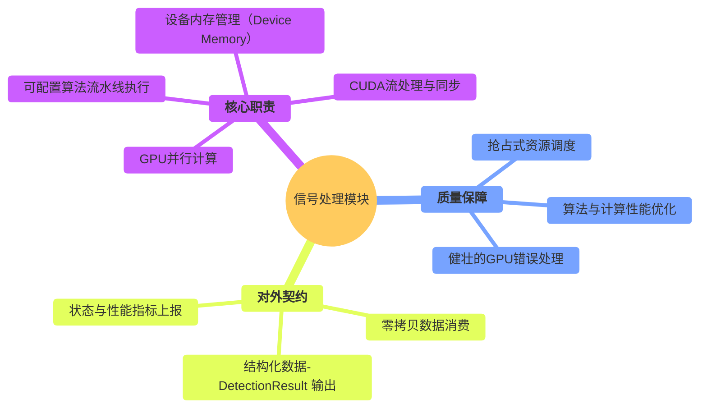
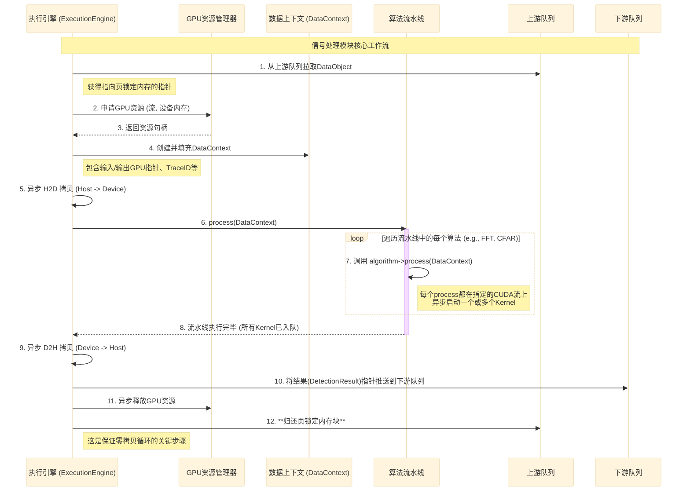
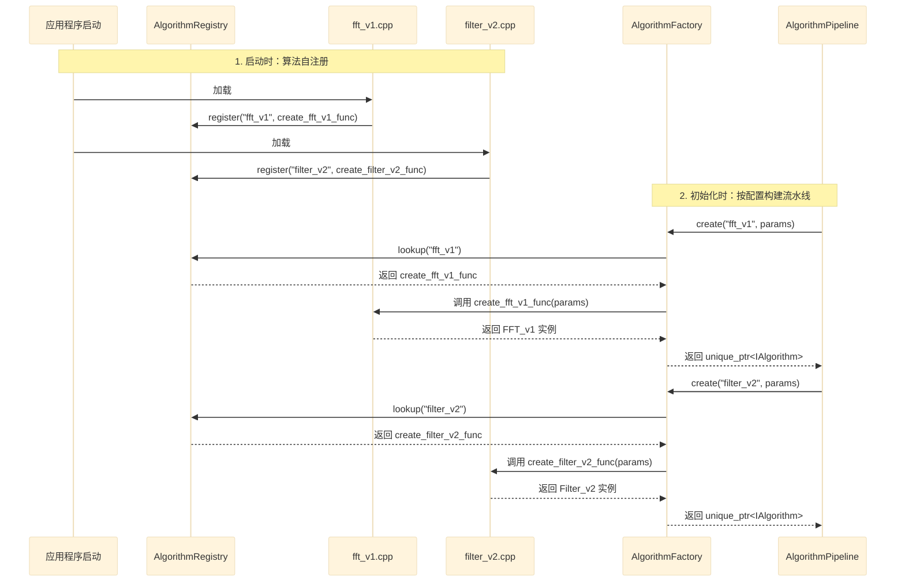
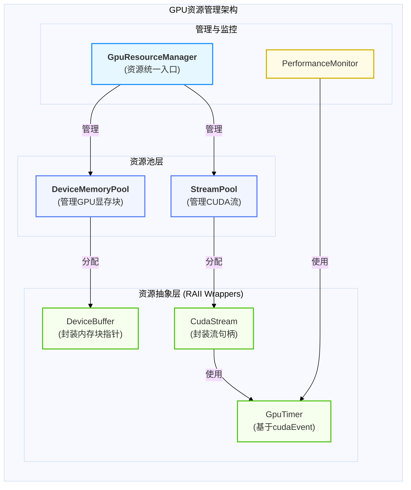
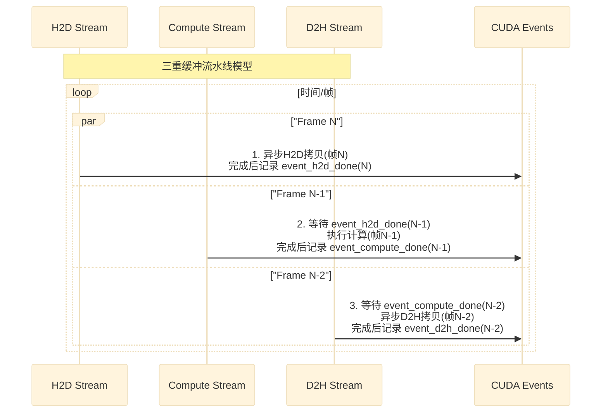
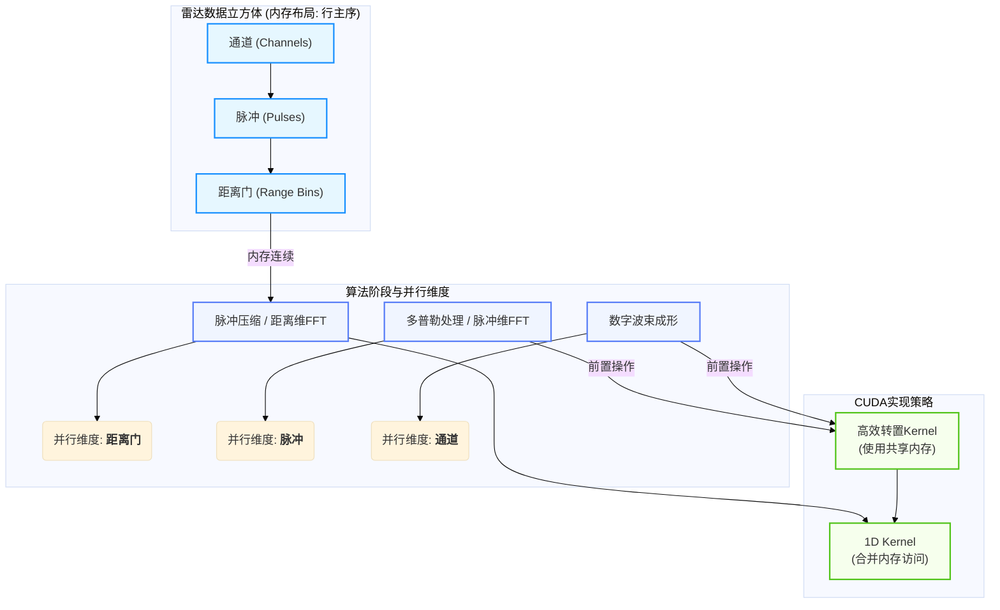
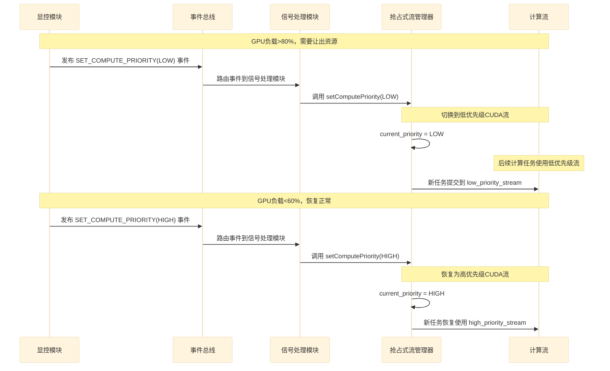
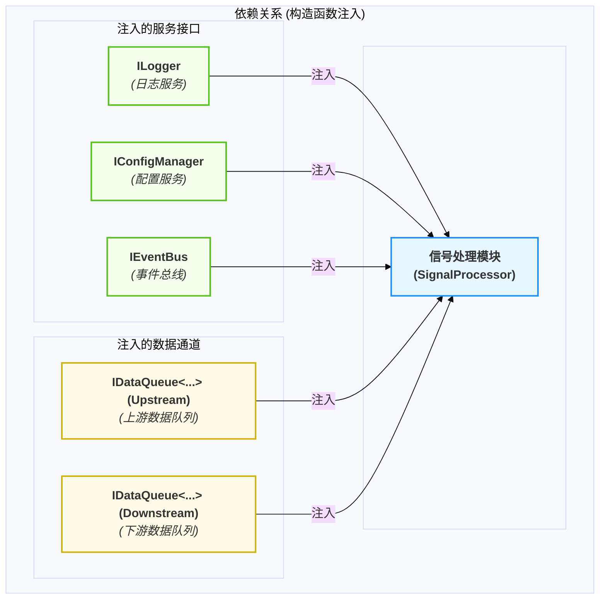
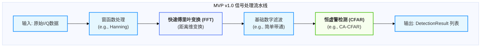

# 信号处理模块设计

  - **当前版本**: v2.0.0
  - **最后更新**: 2025-10-13
  - **负责人**: Klein

-----

## 概述

  - **概要**: 本文件是雷达数据处理系统中 **信号处理模块** 的详细设计规格说明。其核心目标是提供一个清晰、完整、可执行的设计蓝图，用以指导该模块的开发、测试与维护。作为系统的**核心计算引擎**，本模块的使命是利用GPU（NVIDIA CUDA）的强大并行计算能力，对来自数据接收模块的原始数据执行一系列高性能的信号处理算法（如FFT、脉冲压缩、CFAR检测等），并将处理后的结构化检测结果高效、可靠地传递给下游的数据处理模块。本文档将从模块的顶层职责与边界定义开始，深入其内部的GPU计算架构、可配置算法流水线、抢占式资源协调等核心机制，最终确保模块的设计与项目的总体架构原则保持高度一致。

-----

## 目录

- [信号处理模块设计](#信号处理模块设计)
  - [概述](#概述)
  - [目录](#目录)
  - [1 文档职责](#1-文档职责)
    - [1.1 文档目标与范围](#11-文档目标与范围)
    - [1.2 核心原则对齐](#12-核心原则对齐)
  - [2 模块总体设计](#2-模块总体设计)
    - [2.1 模块职责定义](#21-模块职责定义)
    - [2.2 模块边界与接口](#22-模块边界与接口)
    - [2.3 关键性能指标 (KPIs)](#23-关键性能指标-kpis)
  - [3 内部架构设计](#3-内部架构设计)
    - [3.1 逻辑架构与组件划分](#31-逻辑架构与组件划分)
    - [3.2 核心组件职责](#32-核心组件职责)
    - [3.3 核心数据流与协作](#33-核心数据流与协作)
  - [4 核心机制深度设计](#4-核心机制深度设计)
    - [4.1 机制一：可配置的GPU算法流水线](#41-机制一可配置的gpu算法流水线)
      - [4.1.1 算法策略接口 (`IAlgorithm`)](#411-算法策略接口-ialgorithm)
      - [4.1.2 自注册算法工厂 (`AlgorithmFactory`)](#412-自注册算法工厂-algorithmfactory)
      - [4.1.3 流水线配置与构建 (`config.yaml`)](#413-流水线配置与构建-configyaml)
      - [4.1.4 数据上下文 (`DataContext`) 设计](#414-数据上下文-datacontext-设计)
    - [4.2 机制二：高性能CUDA计算架构](#42-机制二高性能cuda计算架构)
      - [4.2.1 GPU资源池化管理 (内存池与流池)](#421-gpu资源池化管理-内存池与流池)
      - [4.2.2 三重缓冲与异步计算流水线](#422-三重缓冲与异步计算流水线)
      - [4.2.3 多维数据并行策略 (基于雷达数据立方体)](#423-多维数据并行策略-基于雷达数据立方体)
    - [4.3 机制三：抢占式GPU资源协调](#43-机制三抢占式gpu资源协调)
      - [4.3.1 双优先级CUDA流架构](#431-双优先级cuda流架构)
      - [4.3.2 事件驱动的优先级切换](#432-事件驱动的优先级切换)
      - [4.3.3 可切分任务 (`ISegmentableTask`) 与抢占响应](#433-可切分任务-isegmentabletask-与抢占响应)
  - [5 关键横切关注点](#5-关键横切关注点)
    - [5.1 错误处理与恢复策略](#51-错误处理与恢复策略)
      - [5.1.1 GPU错误分类与处理策略 (严禁重试)](#511-gpu错误分类与处理策略-严禁重试)
      - [5.1.2 协同恢复：紧急停止与事件上报](#512-协同恢复紧急停止与事件上报)
    - [5.2 性能优化考量](#52-性能优化考量)
      - [5.2.1 计算优化策略](#521-计算优化策略)
      - [5.2.2 数据传输优化](#522-数据传输优化)
  - [6 模块集成与配置](#6-模块集成与配置)
    - [6.1 生命周期管理](#61-生命周期管理)
    - [6.2 依赖关系](#62-依赖关系)
    - [6.3 模块配置项 (`config.yaml`)](#63-模块配置项-configyaml)
  - [7 算法实现规划](#7-算法实现规划)
    - [7.1 MVP v1.0算法范围](#71-mvp-v10算法范围)
    - [7.2 算法演进与兼容性策略](#72-算法演进与兼容性策略)
    - [7.3 算法演进路线表](#73-算法演进路线表)
  - [8 术语表](#8-术语表)
  - [9 相关文档](#9-相关文档)
  - [10 变更历史](#10-变更历史)

-----

## 1 文档职责

  - **概要**: 本章定义了本文档自身的“使命”，明确其目标、范围以及设计所遵循的“技术宪法”——项目的核心架构原则。这确保了所有设计决策都有据可依。

### 1.1 文档目标与范围

  - **概要**: 本节旨在清晰界定本文档要讲什么、不讲什么，为读者设定正确的预期。
      - **目标**: 本文档的核心目标是为信号处理模块提供一个健壮、高性能且可扩展的设计蓝图。它将详细定义模块的GPU加速策略、CUDA并行计算架构、算法的动态配置与集成机制、与系统其他部分的交互契约，以及性能监控和错误处理方案。
      - **范围**: 本文档覆盖从消费上游的`DataObject`（包含指向页锁定内存的指针），到执行可配置的GPU算法流水线，最终将`DetectionResult`推送至下游模块的完整流程。文档不涉及具体CUDA核函数（Kernel）的微观实现细节，也不包含上游数据接收或下游目标跟踪的内部设计。

### 1.2 核心原则对齐

  - **概要**: 本节是设计的基石，旨在确保本模块的设计决策与项目已确立的架构原则完全对齐，保证系统整体的一致性。

| 核心原则           | 在本模块设计中的具体体现                                                                                                                                                                                                                    |
| :----------------- | :------------------------------------------------------------------------------------------------------------------------------------------------------------------------------------------------------------------------------------------ |
| **可扩展性原则**   | **算法的策略化**是本模块设计的核心。所有计算单元（FFT, 滤波, CFAR等）都被抽象为`IAlgorithm`策略接口，通过**自注册的算法工厂**和配置文件动态构建成一个**算法流水线**，实现了极高的灵活性和可扩展性。                                         |
| **数据与控制分离** | 本模块是纯粹的**数据面处理单元**。它通过`IDataQueue`消费上游的`DataObject`，并通过`IDataQueue`将处理后的`DetectionResult`推送到下游，构成了高性能数据流的关键一环。所有对该模块的控制（如启停、优先级调整）都通过**控制面**的事件总线进行。 |
| **事件驱动架构**   | 模块的生命周期由`TaskScheduler`通过事件驱动。在遇到无法自我恢复的GPU致命错误时，模块会**主动发布**`ModuleFailedEvent`事件。此外，它还**订阅**`SetComputePriorityEvent`事件，以响应系统级的抢占式资源协调，体现了双向的事件交互。            |
| **依赖注入**       | 本模块的所有外部服务依赖（`ILogger`, `IConfigManager`, `IEventBus`）以及上下游的数据队列接口，都**必须**通过构造函数注入。这确保了模块与具体实现解耦，并具备高度的可测试性。                                                                |
| **全链路可观测性** | 模块在消费的`DataObject`中**继承`TraceID`**，并在内部的`DataContext`中全程传递。当生成`DetectionResult`时，**必须**将此`TraceID`继续传递下去，确保了任何一帧数据在计算密集型处理阶段的可追溯性。                                            |

-----

## 2 模块总体设计

  - **概要**: 本章从“黑盒”视角描绘信号处理模块的蓝图，定义其在系统生态中的角色、输入输出以及必须达成的严苛性能目标。作为系统的计算核心，本模块的设计直接决定了整个数据处理链路的吞吐量和实时性。

### 2.1 模块职责定义

  - **概要**: 本节使用思维导图的方式，直观地展示信号处理模块作为系统“计算心脏”的完整职责范围，涵盖了从核心算法执行到资源协调与质量保障的各个方面。

<!-- end list -->



### 2.2 模块边界与接口

  - **概要**: 本节明确定义模块的输入（Inputs）和输出（Outputs），以及它与系统其他部分交互的正式契约。本模块是连接原始数据与结构化检测结果的关键桥梁。

| 边界类型           | 交互对象           | 交互接口 / 数据格式         | 核心契约与说明                                                                                                                                                                                                                                                                                                                                                                                                                            |
| :----------------- | :----------------- | :-------------------------- | :---------------------------------------------------------------------------------------------------------------------------------------------------------------------------------------------------------------------------------------------------------------------------------------------------------------------------------------------------------------------------------------------------------------------------------------- |
| **输入 (Inputs)**  | `DataReceiver`     | `IDataQueue<DataPacket<T>>` | **零拷贝消费**: 从上游队列获取封装了**页锁定内存指针**的`DataPacket`。**严禁**对数据内容进行任何CPU侧拷贝，必须直接使用指针发起异步`cudaMemcpyAsync`。                                                                                                                                                                                                                                                                                    |
|                    | `TaskScheduler`    | `IModule` (实现)            | 响应`start()`, `stop()`等生命周期指令，并订阅`SetComputePriorityEvent`以支持抢占式资源协调。                                                                                                                                                                                                                                                                                                                                              |
|                    | `ConfigManager`    | `IConfigManager` (注入)     | 初始化时获取算法流水线定义、算法参数、GPU设备ID等配置。                                                                                                                                                                                                                                                                                                                                                                                   |
| **输出 (Outputs)** | `DataProcessor`    | `IDataQueue<DataPacket<T>>` | 将GPU计算完成的`DetectionResult`封装成`DataPacket`，并将其指针推送到下游模块的输入队列。                                                                                                                                                                                                                                                                                                                                                  |
|                    | `DataReceiver`     | `MemoryPool` API            | **内存归还**: 在H2D异步拷贝**操作入队后**，应通过CUDA事件机制（`cudaEventRecord` / `cudaStreamWaitEvent`）或在确认该流上的相关操作已完成后，再将内存块归还给上游的内存池。**推荐实现模式**：维护一个"待归还队列"，其中每个元素包含内存块指针和一个关联的CUDA事件。由一个专门的后台任务或在`ExecutionEngine`的循环末尾，检查这些事件是否完成，一旦完成，便安全地通过`DataPacket`的自定义删除器归还内存块。这是保证零拷贝数据流循环的关键。 |
|                    | `TaskScheduler`    | `ModuleFailedEvent`         | 当发生无法恢复的GPU致命错误时（如硬件故障、驱动错误），通过事件总线上报故障。                                                                                                                                                                                                                                                                                                                                                             |
|                    | `MonitoringModule` | `MetricsUpdateEvent`        | 定期发布自身的GPU性能指标（如Kernel延迟、H2D/D2H带宽、GPU利用率）。                                                                                                                                                                                                                                                                                                                                                                       |

### 2.3 关键性能指标 (KPIs)

  - **概要**: 本节定义衡量本模块性能是否达标的可量化指标。作为系统的计算核心，这些KPI是保证整个系统实时性要求能否满足的关键。

| KPI 指标             | 目标值(示例)                  | 测量方法                                                                             | 重要性与说明                                                                                            |
| :------------------- | :---------------------------- | :----------------------------------------------------------------------------------- | :------------------------------------------------------------------------------------------------------ |
| **端到端处理延迟**   | **P99 \< 5ms**                | 使用`cudaEvent`精确测量，从`DataObject`进入模块到`DetectionResult`离开模块的总耗时。 | **极高**<br>这是模块最核心的性能承诺，直接决定了系统的数据处理延迟。                                    |
| **数据吞吐量**       | **\> 1 GB/s**                 | 内部计数器，测量每秒成功处理的原始数据字节数。                                       | **高**<br>衡量模块的最大处理能力，确保不会成为数据处理流水线的瓶颈。                                    |
| **GPU 利用率**       | **稳定 \> 80%**               | 通过NVIDIA Management Library (NVML) API 或 `nvidia-smi` 工具在满负载下持续测量。    | **高**<br>确保昂贵的GPU资源得到充分利用。通过三重缓冲和多流技术实现计算与传输的重叠是达成此目标的关键。 |
| **H2D/D2H 内存带宽** | **\> 70% of theoretical max** | 使用`cudaEvent`测量`cudaMemcpyAsync`的耗时，并结合传输数据量计算实际带宽。           | **中**<br>衡量数据传入和传出GPU效率。高效的带宽利用依赖于页锁定内存和合并内存访问。                     |

-----

## 3 内部架构设计

  - **概要**: 本章“打开黑盒”，深入信号处理模块内部，展示其核心组件的划分、职责以及它们之间的协作方式。为遵循项目统一的设计原则并与`数据接收`等模块保持架构一致性，本模块内部同样采用职责清晰的三层逻辑模型：**执行层**、**算法策略层**和**资源管理层**，共同构成一个高性能、可扩展的GPU计算框架。

### 3.1 逻辑架构与组件划分

  - **概要**: 本节使用 `graph` 图，展示模块内部的逻辑分层和核心组件构成，清晰表达组件间的静态关系。该架构以`ExecutionEngine`为核心，驱动一个由可插拔算法策略构成的流水线，并通过`GpuResourceManager`与底层硬件交互。

```mermaid
---
config:
  theme: base
  flowchart:
    curve: basis
---
graph TD
    %% --- 图例 (上下文颜色语义) ---
    %% 执行层 (浅蓝): 模块的核心驱动与编排组件。
    %% 算法策略层 (淡紫): 所有可插拔的、实现具体业务逻辑的算法。
    %% GPU资源管理层 (浅黄): 封装底层CUDA操作，提供GPU资源。
    %% 监控与支持层 (浅绿): 提供性能监控、错误处理等横切关注点功能。

    subgraph "信号处理模块 内部逻辑架构"
        direction TB

        subgraph "执行层"
            EXEC_ENGINE["<b>ExecutionEngine</b><br/>(执行引擎)"]
            ALGO_PIPELINE["<b>AlgorithmPipeline</b><br/>(算法流水线)"]
        end

        subgraph "算法策略层 (可插拔)"
            direction LR
            ALGO_FACTORY["<b>AlgorithmFactory</b><br/>(自注册工厂)"]
            IALGORITHM["<<Interface>><br/><b>IAlgorithm</b>"]
            FFT_ALGO["FFT_v1"]
            FILTER_ALGO["Filter_v2"]
            CFAR_ALGO["CFAR_v1"]
        end

        subgraph "GPU资源管理层"
            direction LR
            GPU_MGR["<b>GpuResourceManager</b><br/>(资源统一入口)"]
            MEM_POOL["DeviceMemoryPool"]
            STREAM_POOL["StreamPool"]
        end

        subgraph "监控与支持层"
            direction LR
            PERF_MONITOR["PerformanceMonitor"]
            ERROR_HANDLER["ErrorHandler"]
        end
    end

    %% --- 关系定义 ---
    %% 实线箭头 (-->) 表示控制流或强所属关系
    %% 虚线箭头 (-..->) 表示服务依赖关系
    EXEC_ENGINE -- "驱动" --> ALGO_PIPELINE
    EXEC_ENGINE -.->|使用| GPU_MGR
    EXEC_ENGINE -.->|使用| PERF_MONITOR
    EXEC_ENGINE -.->|使用| ERROR_HANDLER

    ALGO_PIPELINE -- "包含一组" --> IALGORITHM
    ALGO_FACTORY -- "创建" --> IALGORITHM

    FFT_ALGO -- "实现" --> IALGORITHM
    FILTER_ALGO -- "实现" --> IALGORITHM
    CFAR_ALGO -- "实现" --> IALGORITHM

    GPU_MGR -- "管理" --> MEM_POOL
    GPU_MGR -- "管理" --> STREAM_POOL


    %% --- 标准 classDef 模板 ---
    classDef role_A fill:#e6f7ff,stroke:#1890ff,stroke-width:2px
    classDef role_B fill:#f0f5ff,stroke:#597ef7,stroke-width:2px
    classDef role_C fill:#fffbe6,stroke:#d4b106,stroke-width:2px
    classDef role_D fill:#f6ffed,stroke:#52c41a,stroke-width:2px

    %% --- 样式应用 ---
    class EXEC_ENGINE,ALGO_PIPELINE role_A
    class ALGO_FACTORY,IALGORITHM,FFT_ALGO,FILTER_ALGO,CFAR_ALGO role_B
    class GPU_MGR,MEM_POOL,STREAM_POOL role_C
    class PERF_MONITOR,ERROR_HANDLER role_D
```

<!-- end list -->



### 3.2 核心组件职责

  - **概要**: 本节用表格详细说明 `3.1` 图中每个核心组件的具体职责、关键实现技术和设计决策。

| 组件名称                 | 主要职责            | 关键设计点与实现策略                                                                                                                                                                                           | 接口/交互                                    |
| :----------------------- | :------------------ | :------------------------------------------------------------------------------------------------------------------------------------------------------------------------------------------------------------- | :------------------------------------------- |
| **`ExecutionEngine`**    | **核心驱动与编排**  | 1. 模块主循环，从上游获取`DataObject`，将结果`DetectionResult`送往下游。<br>2. 管理`DataContext`的生命周期。<br>3. 调用`GpuResourceManager`申请和释放GPU资源（内存、流）。<br>4. 驱动`AlgorithmPipeline`执行。 | `IModule` (实现)                             |
| **`AlgorithmPipeline`**  | **业务逻辑编排**    | 1. 在初始化时根据配置，使用`AlgorithmFactory`动态构建一个由`IAlgorithm`实例组成的有序列表。<br>2. 提供`process(DataContext&)`方法，按顺序执行算法链。                                                          | `IAlgorithm` (使用)                          |
| **`AlgorithmFactory`**   | **策略实例化**      | 1. 采用**自注册机制**，允许新的算法实现无需修改工厂代码即可被发现。<br>2. `create(type, params)`接口根据类型名和YAML配置节点创建并配置算法实例。                                                               | `IAlgorithm` (创建)                          |
| **`IAlgorithm`**         | **算法策略接口**    | 1. 所有具体算法（FFT, CFAR等）的统一接口。<br>2. 定义`configure(params)`和`process(context)`等核心方法。                                                                                                       | `<<Interface>>`                              |
| **`GpuResourceManager`** | **GPU资源统一入口** | 1. 封装底层CUDA API，提供`DeviceMemoryPool`和`StreamPool`。<br>2. **支持抢占式优先级**：管理高/低两个优先级的CUDA流，并响应外部事件进行切换。                                                                  | `IMemoryPool` (提供)<br>`IStreamPool` (提供) |
| **`PerformanceMonitor`** | **性能可观测性**    | 1. 使用`cudaEvent`精确测量GPU Kernel执行耗时和数据传输时间。<br>2. 定期聚合性能指标，并通过`EventBus`发布`MetricsUpdateEvent`。                                                                                | `EventBus` (注入)                            |

### 3.3 核心数据流与协作

  - **概要**: 本节使用 `sequenceDiagram`，展示一个`DataObject`在模块内部从被消费到最终生成`DetectionResult`的完整“Happy Path”生命周期。它清晰地揭示了流水线各组件之间如何通过`ExecutionEngine`进行异步、高效的协作。

<!-- end list -->



-----

## 4 核心机制深度设计

  - **概要**: 本章将深入剖析本模块三个最关键、最具挑战性的技术机制。它们共同构成了信号处理模块作为系统“计算心脏”的基础：首先是定义其灵活性的**可配置算法流水线**；其次是保障其高性能的**CUDA计算架构**；最后是确保其在复杂系统中稳定运行的**抢占式资源协调**。

### 4.1 机制一：可配置的GPU算法流水线

  - **概要**: 阐述模块如何通过策略模式、自注册工厂和配置文件，动态构建和执行一个由多个独立算法（如FFT, 滤波, CFAR）组成的GPU计算流水线。这是模块可扩展性和灵活性的核心，确保了在不修改核心代码的情况下，能够轻松地增加、替换或重排算法处理步骤。

#### 4.1.1 算法策略接口 (`IAlgorithm`)

  - **概要**: 为实现算法的可插拔性，所有信号处理算法（无论是FFT、滤波还是CFAR）都**必须**实现统一的 `IAlgorithm` 接口。这个接口定义了所有算法策略必须遵守的契约，包括配置和执行两个核心方法。

  - **C++ 接口定义**:

    ```cpp
    // In "include/modules/signal_processor/ialgorithm.h"

    class DataContext; // Forward declaration

    /**
     * @brief 所有信号处理算法策略的统一接口。
     */
    class IAlgorithm {
    public:
        virtual ~IAlgorithm() = default;

        /**
         * @brief 使用来自YAML节点的参数配置算法实例。
         * @param params 包含此实例参数的YAML节点。
         * @return 成功时返回 SystemErrors::SUCCESS。
         */
        virtual ErrorCode configure(const YAML::Node& params) = 0;

        /**
         * @brief 在给定的上下文中处理数据。
         * @param context 包含输入/输出GPU缓冲区和元数据的数据上下文。
         * @return 成功时返回 SystemErrors::SUCCESS。
         */
        virtual ErrorCode process(DataContext& context) = 0;

        /**
         * @brief 返回算法策略的名称。
         * @return 算法策略的名称字符串。
         */
        virtual const char* getName() const = 0;
    };
    ```

#### 4.1.2 自注册算法工厂 (`AlgorithmFactory`)

  - **概要**: 算法工厂采用**自注册机制**，允许新的算法实现在不修改工厂代码的情况下被系统发现和使用。每个算法的实现文件通过一个宏，在程序启动时自动将自己的类型名和创建函数注册到一个全局注册表中。这彻底解决了硬编码带来的扩展性问题。

  - **协作流程**:
    下面的 `sequenceDiagram` 展示了算法自注册和工厂按配置创建实例的完整流程。

<!-- end list -->



#### 4.1.3 流水线配置与构建 (`config.yaml`)

  - **概要**: `ExecutionEngine` 在初始化时，会读取配置文件中 `pipeline` 列表。然后，它遍历这个列表，使用 `AlgorithmFactory` 逐一创建和配置每个算法策略的实例，最终构建出完整的 `AlgorithmPipeline`。这个配置直观地定义了数据处理的顺序和每个步骤的参数。

  - **配置示例**:

    ```yaml
    # In configs/modules/signal_processor.yaml
    signal_processor:
      # ... other settings
      pipeline:
        - type: fft_v1
          name: "MainFFT"
          params:
            size: 4096
            direction: "forward"
            window: "hanning"

        - type: bandpass_filter_v2
          name: "ClutterFilter"
          params:
            low_cutoff: 100.0
            high_cutoff: 5000.0
            order: 5

        - type: cfar_ca_v1
          name: "PrimaryDetector"
          params:
            guard_cells: 4
            training_cells: 16
            pfa: 1.0e-6
    ```

#### 4.1.4 数据上下文 (`DataContext`) 设计

  - **概要**: `DataContext` 是在算法流水线中流动的核心数据结构。它本身不拥有资源，而是作为GPU资源（内存、流）和元数据的**视图或句柄**，由 `ExecutionEngine` 在每个处理循环开始时创建，并在循环结束时销毁。

  - **核心设计原则**:

      - **非所有权**: `DataContext` 不负责分配或释放GPU内存。所有权归属于 `ExecutionEngine` 和 `DeviceMemoryPool`。
      - **生命周期短暂**: 每个 `DataContext` 实例的生命周期与一次主循环（即处理一个数据批次）绑定。
      - **可扩展**: 设计为可扩展的结构体，便于未来算法增加新的上下文信息。

  - **建议的数据结构**:

    ```cpp
    // 概念性结构，非完整头文件
    struct DataContext {
        // --- 核心资源 (由 ExecutionEngine 提供) ---
        cudaStream_t stream;                // 本次流水线执行所用的CUDA流

        // --- 数据指针 (指向DeviceMemoryPool中内存的非所有权指针) ---
        const void* d_input_data;           // 指向设备上的输入数据
        void* d_output_data;                // 指向设备上的输出缓冲区
        void* d_intermediate_buffer_1;      // 用于多阶段算法的临时缓冲区
        void* d_intermediate_buffer_2;

        // --- 元数据 ---
        size_t input_data_size;
        size_t output_data_size;
        Timestamp timestamp;
        TraceId trace_id; // 必须继承和传递

        // --- 可扩展性设计 ---
        // 用于存储命名中间结果，使用std::any实现类型安全的扩展机制
        // e.g., {"fft_output": ptr, "filtered_output": ptr2}
        // 优势: std::any是C++17标准类型安全容器，通过std::any_cast进行安全的类型检查
        // 如果类型不匹配会抛出异常，避免void*的类型转换错误导致未定义行为
        std::map<std::string, std::any> named_buffers;
    };
    ```

### 4.2 机制二：高性能CUDA计算架构

  - **概要**: 详细设计为实现极致性能而采用的CUDA并行计算模型，包括如何管理GPU资源、如何通过多流技术重叠数据传输与计算，以及针对雷达数据的多维并行策略。这是将模块的性能潜力转化为现实的关键。

#### 4.2.1 GPU资源池化管理 (内存池与流池)

  - **概要**: 为支持高性能的算法流水线并避免CUDA API调用带来的开销，GPU资源（如设备内存和CUDA流）必须采用池化管理。`GpuResourceManager`作为统一入口，负责初始化和管理这些资源池。

  - **实现策略**:

      * **`DeviceMemoryPool`**: 在模块初始化时，通过`cudaMalloc`预先分配一大块GPU显存，并将其分割成固定大小的块进行管理。提供`acquire()`和`release()`方法，供`ExecutionEngine`在每个处理循环中获取和归还用于中间计算的临时缓冲区。这彻底避免了在热点路径上频繁调用`cudaMalloc`带来的巨大性能开销。
      * **`StreamPool`**: 预先创建一组（例如3-8个）可复用的CUDA流。`ExecutionEngine`根据算法流水线的并行需求，从中获取独立的流来执行数据传输和计算任务。

<!-- end list -->



#### 4.2.2 三重缓冲与异步计算流水线

  - **概要**: 为最大化GPU利用率（KPI \> 80%），系统采用**三重缓冲（Triple Buffering）模型，利用多个独立的CUDA流来并行化数据传输（Host-to-Device）**、**核函数计算（Kernel Execution）和结果回传（Device-to-Host）**，实现三者之间的流水线式重叠执行。

  - **协作流程**:
    下面的 `sequenceDiagram` 展示了三重缓冲模型在三个连续数据帧（N, N-1, N-2）上的并行工作方式。

<!-- end list -->



  - **实现策略**:
    1.  **独立CUDA流**: 从`StreamPool`中获取至少三个独立的CUDA流，分别用于H2D、计算和D2H。
    2.  **CUDA事件同步**: 使用`cudaEvent`在不同流之间创建精确的依赖关系。例如，计算流必须`cudaStreamWaitEvent`等待H2D流的完成事件，D2H流必须等待计算流的完成事件。
    3.  **页锁定内存**: 此模型**强依赖**上游`DataReceiver`模块提供位于\*\*页锁定内存（Pinned Memory）\*\*中的数据，这是实现高效异步H2D传输的前提。

#### 4.2.3 多维数据并行策略 (基于雷达数据立方体)

  - **概要**: 数据并行策略必须紧密结合雷达数据立方体（通常维度为 `[通道][脉冲][距离门]`）的物理含义和算法特性，以实现最优的GPU性能。必须在正确的维度上进行并行化，以确保合并的内存访问和高效的计算。

  - **核心原则**：并行化的维度选择取决于当前算法阶段正在处理的数据维度。

<!-- end list -->



  - **各阶段并行策略详解**:
    1.  **脉冲压缩 / 距离维FFT**:

          * **并行维度**: **距离门 (Range Bins)**。
          * **原因**: 在内存布局中，一个脉冲内的所有距离门数据是**连续存储**的。
          * **CUDA实现**: 启动一个1D的CUDA Kernel，每个线程处理一个或多个距离门。这种方式可以实现完美的**合并内存访问 (Coalesced Memory Access)**，最大化利用内存带宽。

    2.  **多普勒处理 / 脉冲维FFT**:

          * **并行维度**: **脉冲 (Pulses)**。
          * **挑战**: 在原始数据布局中，一个距离门对应的所有脉冲数据是**非连续的（跨步的）**。直接在此维度上并行会导致极差的内存访问性能。
          * **CUDA实现**: 在计算前，**必须**先执行一次高效的**数据转置 (Transpose)**。这个转置操作本身是一个并行的CUDA Kernel，它利用**共享内存 (Shared Memory)** 将数据块重排。在转置后的数据上，再次使用1D Kernel即可实现合并访问。

    3.  **数据转置的重要性**: 数据转置**不是**一个可选的优化，而是保证高性能的**必要步骤**。它应作为算法流水线中的一个标准、可配置的`IAlgorithm`策略，在需要改变并行维度的计算阶段前调用。

-----

### 4.3 机制三：抢占式GPU资源协调

  - **概要**: 阐述模块如何参与系统级的GPU资源调度，以解决UI渲染（OpenGL）与科学计算（CUDA）争抢同一物理GPU资源的潜在冲突。本机制通过响应外部（如显控模块）的优先级控制事件，动态调整自身计算任务的优先级，从而在保证UI界面流畅响应的同时，防止因GPU长时间无响应导致的驱动崩溃（TDR - Timeout Detection and Recovery），是保障系统整体稳定性和用户体验的关键设计。

  - **协作流程**:
    当系统GPU总负载过高时（通常由`显控终端应用`或`监控模块`检测），会通过`EventBus`发布一个强制性的`SetCompute-Priority(LOW)`事件。本模块作为订阅者，必须立即响应，将计算任务切换到低优先级CUDA流执行，为高优先级的UI渲染任务让出GPU时间片。当负载恢复正常后，系统会发布`SetCompute-Priority(HIGH)`事件，使本模块恢复最大计算性能。

<!-- end list -->



#### 4.3.1 双优先级CUDA流架构

  - **概要**: `GpuResourceManager`内部包含一个专用的`PreemptiveStreamManager`组件，负责创建和管理两个不同优先级的CUDA流。

  - **实现策略**:

      * **`HighPriorityComputeStream`**: 默认使用的CUDA流，拥有正常的调度优先级。
      * **`LowPriorityComputeStream`**: 在GPU资源紧张时使用的CUDA流，拥有较低的调度优先级。NVIDIA驱动会确保高优先级的任务（如UI渲染）能够抢占或优先获得执行机会。
      * **`PreemptiveStreamManager`** 维护一个原子变量`current_priority_`，供`ExecutionEngine`在提交计算任务前查询，以决定应将任务提交到哪个流。

  - **C++ 接口定义**:

    ```cpp
    /**
     * @brief 抢占式CUDA流管理器
     */
    class PreemptiveStreamManager {
    public:
        enum class StreamPriority { HIGH, LOW };

        ErrorCode initialize();

        // 获取指定优先级的CUDA流
        cudaStream_t getStream(StreamPriority priority);

        // 设置当前计算优先级 (响应事件)
        void setComputePriority(StreamPriority priority);

        // 获取当前应使用的CUDA流
        cudaStream_t getCurrentStream() const;

    private:
        cudaStream_t high_priority_stream_;
        cudaStream_t low_priority_stream_;
        std::atomic<StreamPriority> current_priority_{StreamPriority::HIGH};
    };
    ```

#### 4.3.2 事件驱动的优先级切换

  - **概要**: 本模块通过订阅`SetComputePriorityEvent`事件，实现与系统其他部分的解耦。事件处理器负责调用`PreemptiveStreamManager`更新当前优先级。

  - **实现策略**:

      * 在模块的`initialize()`方法中，向`EventBus`订阅`SetComputePriorityEvent`事件。
      * 事件处理器`onSetComputePriorityEvent()`必须是线程安全的，它将收到的新优先级原子地更新到`PreemptiveStreamManager`中。

  - **C++ 事件处理示例**:

    ```cpp
    void SignalProcessor::onSetComputePriorityEvent(const SetComputePriorityEvent& event) {
        TraceContextGuard guard(event.trace_id); // 确保日志可追踪

        auto old_priority = preemptive_stream_manager_->getCurrentPriority();
        auto new_priority = event.priority;

        if (old_priority != new_priority) {
            preemptive_stream_manager_->setComputePriority(new_priority);
            RADAR_INFO(logger_, "GPU compute priority changed from {} to {} due to: {}",
                       toString(old_priority), toString(new_priority), event.reason);
        }
    }
    ```

#### 4.3.3 可切分任务 (`ISegmentableTask`) 与抢占响应

  - **概要**: 为实现真正的“抢占式”效果，仅仅切换后续任务的优先级是不够的。对于已经提交的、长耗时的CUDA Kernel，必须将其设计为**可切分的（Segmentable）**，以便在任务执行的中途能有机会响应优先级变更。

  - **实现策略**:

    1.  **定义`ISegmentableTask`接口**: 所有可能耗时较长（例如 \> 2ms）的`IAlgorithm`策略，都应额外实现此接口。
    2.  **任务分解**: `segmentTask()`方法将一个大的计算任务（如对整个数据立方体的处理）分解为一系列小的、独立的任务段（`TaskSegment`）。
    3.  **`ExecutionEngine`的调度改进**:
          * `ExecutionEngine`在执行`ISegmentableTask`时，不会一次性提交所有任务段。
          * 它会以循环方式，一次只向CUDA流提交一个`TaskSegment`。
          * 在**每个任务段提交之间**，插入一个检查点，查询`PreemptiveStreamManager`的当前优先级是否发生变化。如果发生变化，`ExecutionEngine`可以立即将后续的任务段提交到新的、正确的优先级流上。
    4.  **调度契约明确**: `ExecutionEngine` 负责调用 `segmentTask()` 并迭代返回的任务段列表。在每个任务段提交的间隙，`ExecutionEngine` **必须**执行优先级检查。`IAlgorithm` 的 `process()` 方法在面对可切分任务时，其实现应委托给这个新的切分调度逻辑，而不是自行管理任务段的调度。

  - **C++ 接口定义**:

    ```cpp
    /**
     * @brief 可切分CUDA任务接口，用于长耗时计算。
     */
    class ISegmentableTask {
    public:
        // 定义一个任务段
        using TaskSegment = std::function<void(cudaStream_t)>;

        /**
         * @brief 将大任务分解为多个可在CUDA流上执行的小任务段。
         * @return 任务段列表。
         */
        virtual std::vector<TaskSegment> segmentTask() = 0;
    };
    ```

-----

## 5 关键横切关注点

  - **概要**: 本章讨论那些贯穿于模块多个组件的通用设计问题，如并发、错误处理和性能优化。系统性地阐述这些方案，可以避免在多个地方重复描述，并确保模块的健壮性和可维护性。

### 5.1 错误处理与恢复策略

  - **概要**: 描述针对GPU计算的、现实且健壮的错误处理哲学。模块的恢复策略严格遵循单一职责原则：**模块自身不进行复杂的恢复决策，只负责精确地执行和上报**。所有系统级的恢复决策由`任务调度器`根据上报的事件统一做出。

#### 5.1.1 GPU错误分类与处理策略 (严禁重试)

  - **概要**: GPU编程中的错误通常是确定性的而非瞬时的。因此，本模块对所有CUDA API错误采取**零重试**策略，以避免无效操作加剧问题或导致系统长时间停滞。所有错误都会被立即分类并上报。

| 类别               | 错误码示例                     | 描述                           | **V2.0 恢复策略 (严禁重试)**                                                            |
| :----------------- | :----------------------------- | :----------------------------- | :-------------------------------------------------------------------------------------- |
| **配置错误**       | (自定义)                       | `config.yaml`中参数无效        | 模块初始化失败，上报`CONFIG_ERROR`，终止启动。                                          |
| **资源分配失败**   | `CUDA_ERROR_OUT_OF_MEMORY`     | GPU显存不足                    | **致命错误**。立即停止模块，上报`GPU_FATAL_ERROR`，附带内存申请大小和当前已用内存信息。 |
| **Kernel执行错误** | `CUDA_ERROR_LAUNCH_TIMEOUT`    | Kernel执行超时（可能死循环）   | **致命错误**。立即停止模块，上报`GPU_FATAL_ERROR`，附带Kernel名称。                     |
|                    | `CUDA_ERROR_ILLEGAL_ADDRESS`   | Kernel访问了无效内存地址       | **致命错误**。典型的段错误。立即停止模块，上报`GPU_FATAL_ERROR`，附带Kernel名称。       |
| **硬件/驱动错误**  | `CUDA_ERROR_ECC_UNCORRECTABLE` | GPU硬件ECC校验发现不可恢复错误 | **最高级别致命错误**。立即停止模块，上报`GPU_FATAL_ERROR`，建议系统安全关闭。           |
|                    | `CUDA_ERROR_UNKNOWN`           | 未知的驱动/硬件错误            | **最高级别致命错误**。同上，立即停止并上报，建议系统安全关闭。                          |

#### 5.1.2 协同恢复：紧急停止与事件上报

  - **概要**: 当模块捕获到任何被判定为致命的GPU错误时，会立即启动一个标准化的“紧急停止与上报”流程，将控制权交由`任务调度器`。

  - **执行流程**:

    1.  **捕获与包装 (Catch & Wrap)**: 所有调用CUDA API的地方都必须用一个宏 `CHECK_CUDA_ERROR(...)` 来包装。该宏一旦检测到非 `cudaSuccess` 的返回码，会立即将错误转换为系统统一的 `ErrorCode` 并附加上下文（文件名、行号）。
    2.  **紧急停止 (Stop)**: `ExecutionEngine`或任何组件收到致命的`ErrorCode`后，立即停止主循环，不再从上游拉取新数据，并取消所有在途的GPU任务。
    3.  **设置状态 (Set State)**: 将模块内部状态原子地设置为 `State::FAILED`。
    4.  **记录日志 (Log)**: 记录一条`FATAL`级别的日志，包含完整的错误信息、`TraceID`和上下文。
    5.  **发布事件 (Publish Event)**: 通过系统的**事件总线**，发布一个 `ModuleFailedEvent`。事件负载**必须**包含：
          * `module_name`: "SignalProcessor"
          * `error_code`: 具体的 `ErrorCode`
          * `details`: 详细的错误描述字符串。
    6.  **等待指令 (Wait)**: 模块进入失败状态后，放弃所有活动，等待`任务调度器`通过其`IModule`接口下达`stop()`或`cleanup()`指令。

### 5.2 性能优化考量

  - **概要**: 总结为达成KPI而采用的关键性能优化技术，这些技术贯穿于模块的各个组件和算法策略中。

#### 5.2.1 计算优化策略

| 优化策略                       | 描述与应用                                                                                                                   |
| :----------------------------- | :--------------------------------------------------------------------------------------------------------------------------- |
| **线程块大小优化**             | 根据目标GPU架构的特性（如每SM的最大线程数、Warp大小），精心调整CUDA Kernel的线程块大小，以最大化SM的占用率（Occupancy）。    |
| **共享内存优化**               | 对于需要在线程块内进行数据重用或交换的算法（如矩阵转置、卷积），优先使用高速的片上共享内存，以替代对慢速全局内存的重复访问。 |
| **融合核函数 (Kernel Fusion)** | 将多个连续的、对数据进行逐点操作的Kernel合并为一个单一的Kernel。这可以显著减少全局内存的读写次数和Kernel启动的开销。         |
| **分支发散优化**               | 在编写Kernel代码时，尽量避免在同一个Warp（32个线程）内出现严重的分支发散，确保线程执行路径的一致性，以最大化SIMT效率。       |

#### 5.2.2 数据传输优化

  - **概要**: 数据在主机内存(Host)与GPU设备内存(Device)之间的传输是常见的性能瓶颈。本模块通过以下策略优化数据传输效率。


| 优化策略                            | 描述与应用                                                                                                                                              |
| :---------------------------------- | :------------------------------------------------------------------------------------------------------------------------------------------------------ |
| **锁页内存 (Pinned Memory)**        | **强制要求**。本模块消费的数据必须来自上游`DataReceiver`提供的页锁定内存。这是实现高效异步数据传输的**前提**。                                          |
| **异步传输 (`cudaMemcpyAsync`)**    | **核心传输方式**。所有H2D和D2H的数据传输都必须使用异步拷贝，并与计算任务在不同的CUDA流上执行，以实现**传输与计算的重叠**（参见4.2.2节）。               |
| **合并内存访问 (Coalesced Access)** | **强制要求**。所有CUDA Kernel在访问全局内存时，必须确保同一Warp内的线程访问的是连续的、对齐的内存地址。这是最大化内存带宽利用率的**最重要**的优化技巧。 |
| **纹理/只读缓存**                   | 对于在计算过程中多次读取且不改变的数据（如滤波器系数、窗函数表），可以将其绑定到GPU的纹理内存或只读数据缓存中，利用其专用的高速缓存来提升访存性能。     |

-----

## 6 模块集成与配置

  - **概要**: 本章阐述该模块如何作为一个标准化的“零件”，无缝地“安装”到整个系统框架中。内容涵盖其如何响应`TaskScheduler`的生命周期管理、如何通过依赖注入获取所需的服务与数据通道，以及所有可由`config.yaml`文件驱动的行为参数。这为模块的正确集成、部署和运维提供了清晰的指导。

### 6.1 生命周期管理

  - **概要**: 本模块作为一个标准的业务模块，将完整实现`IModule`接口（通过组合`ILifecycleManaged`等角色接口实现），其生命周期完全由`TaskScheduler`通过事件和直接调用进行管理。

| 生命周期方法       | 核心执行动作                                                                                                                                                                   | 状态转换                          | 备注                                                                          |
| :----------------- | :----------------------------------------------------------------------------------------------------------------------------------------------------------------------------- | :-------------------------------- | :---------------------------------------------------------------------------- |
| **`initialize()`** | 1. 从`ConfigManager`加载并验证配置。<br>2. 初始化`GpuResourceManager`，包括创建GPU设备内存池和CUDA流池。<br>3. 根据配置，使用`AlgorithmFactory`创建并构建`AlgorithmPipeline`。 | `UNINITIALIZED` -\> `INITIALIZED` | 如果GPU设备初始化失败或CUDA上下文无法创建，将返回错误并直接进入`FAILED`状态。 |
| **`start()`**      | 1. 创建并启动`ExecutionEngine`的专用工作线程。<br>2. 开始从上游队列消费数据并驱动GPU计算流水线。                                                                               | `INITIALIZED` -\> `RUNNING`       | `start()`方法本身是非阻塞的，它会立即返回，而实际工作在后台线程中进行。       |
| **`stop()`**       | 1. 向`ExecutionEngine`发送停止信号。<br>2. 优雅地等待当前正在处理的数据帧完成，并停止所有线程。<br>3. 调用`GpuResourceManager`释放所有GPU资源。                                | `RUNNING` -\> `STOPPED`           | 必须在`TaskScheduler`规定的超时时间内完成，以响应系统快速关闭的要求。         |
| **`cleanup()`**    | 1. 确保所有GPU资源（内存、流、事件）已完全释放。<br>2. 清理所有内部组件。                                                                                                      | `STOPPED` -\> `UNINITIALIZED`     | 确保无任何资源泄露。                                                          |

### 6.2 依赖关系

  - **概要**: 遵循**依赖注入**原则，本模块的所有外部依赖都在系统启动时，由`main`函数通过构造函数注入。这种方式将模块与具体服务的实现完全解耦，增强了可测试性和灵活性。

<!-- end list -->



  * **服务依赖**: `ILogger`用于记录日志，`IConfigManager`用于获取配置，`IEventBus`用于发布性能指标、故障事件以及订阅系统控制事件（如优先级变更）。
  * **数据依赖**: 模块通过`IDataQueue`接口与上下游模块进行数据交换，实现了数据流的解耦。它既是上游`DataReceiver`队列的**消费者**，也是下游`DataProcessor`队列的**生产者**。

### 6.3 模块配置项 (`config.yaml`)

  - **概要**: 本模块的所有行为，特别是其核心的算法流水线，都由配置文件驱动。以下是其在`config.yaml`中专属命名空间 `SignalProcessor:` 下的所有配置项。

| 配置键                                   | 数据类型           | 默认值 | 描述                                                                                                     | 是否支持热更新 |
| :--------------------------------------- | :----------------- | :----- | :------------------------------------------------------------------------------------------------------- | :------------- |
| `enabled`                                | `boolean`          | `true` | 是否启用本模块。                                                                                         | 否 (需重启)    |
| `gpu_device_id`                          | `integer`          | `0`    | 指定用于计算的GPU设备ID。                                                                                | 否 (需重启)    |
| `gpu_resources.device_memory_mb`         | `integer`          | `1024` | 预分配的GPU设备内存池大小 (MB)。                                                                         | 否 (需重启)    |
| `gpu_resources.stream_count`             | `integer`          | `3`    | CUDA流的数量，至少为3以支持三重缓冲。                                                                    | 否 (需重启)    |
| `pipeline`                               | `list` of `object` | `[]`   | **核心配置**: 定义算法流水线的构成。每个对象包含`type`(算法类型名)、`name`(实例名)和`params`(算法参数)。 | 否 (需重启)    |
| `performance.metrics_publish_interval_s` | `float`            | `1.0`  | 向`MonitoringModule`发布性能指标的间隔时间（秒）。                                                       | **是**         |

**YAML 示例 (`configs/modules/signal_processor.yaml`)**:

```yaml
SignalProcessor:
  enabled: true
  gpu_device_id: 0

  gpu_resources:
    device_memory_mb: 1024
    stream_count: 3

  # 定义信号处理的算法流水线，按顺序执行
  pipeline:
    - type: "fft_v1"
      name: "MainFFT"
      params:
        size: 4096
        window: "hanning"

    - type: "bandpass_filter_v2"
      name: "ClutterFilter"
      params:
        low_cutoff: 100.0
        high_cutoff: 5000.0
        order: 5

    - type: "cfar_ca_v1"
      name: "PrimaryDetector"
      params:
        guard_cells: 4
        training_cells: 16
        pfa: 1.0e-6

  performance:
    metrics_publish_interval_s: 1.0
```

-----

## 7 算法实现规划

  - **概要**: 本章为信号处理模块的算法实现和长期演进提供一个清晰、分阶段的路线图。它首先定义了MVP阶段必须完成的核心算法范围，以快速验证系统架构；然后，基于对当前行业前沿技术的调研，规划了一条从传统信号处理逐步迈向 **人工智能增强（AI-Enhanced）** 和 **认知处理（Cognitive Processing）** 的演进路径。

### 7.1 MVP v1.0算法范围

  - **概要**: MVP v1.0阶段聚焦于搭建和验证一个完整的、基于GPU的信号处理基础流水线。此阶段的算法以功能模拟和架构验证为主要目的，不追求极致的性能优化或复杂的场景适应性。

<!-- end list -->



### 7.2 算法演进与兼容性策略

  - **概要**: 为确保算法的长期、平滑演进，所有算法的升级和替换都必须遵循严格的接口和配置兼容性策略。

  - **核心策略**:

    1.  **接口稳定性**: `IAlgorithm`的核心接口`process(DataContext& context)`在主版本内保持稳定。新功能通过扩展`DataContext`或使用可选接口（可通过`dynamic_cast`查询）来添加。
    2.  **配置向后兼容**: 新版本的算法实现**必须**能处理旧版本的配置文件。新增参数必须在代码中提供合理的默认值。
    3.  **严格语义化版本**: 所有算法模块遵循`vMAJOR.MINOR.PATCH`版本规范。任何不兼容的API变更都必须提升主版本号。

### 7.3 算法演进路线表

  - **概要**: 结合当前前沿技术趋势，特别是**深度学习**在雷达信号处理领域的应用，我们将原有的演进路线图优化为更具前瞻性的五个阶段。该路线图从传统模型驱动的方法平滑过渡到数据驱动的智能处理方法。

| 阶段                      | 版本  | 核心算法与技术                                                       | 实现特征与目标                                                                                                                              | 前沿技术结合点                                   |
| :------------------------ | :---- | :------------------------------------------------------------------- | :------------------------------------------------------------------------------------------------------------------------------------------ | :----------------------------------------------- |
| **I. 基础架构验证**       | v1.0  | 基础FFT、简单滤波、CA-CFAR                                           | **功能模拟**，验证GPU计算架构和零拷贝数据流的正确性。                                                                                       | -                                                |
| **II. 核心功能完备**      | v2.0  | 脉冲压缩、多普勒处理 (MTD)、自适应滤波 (LMS/RLS)                     | **完整实现经典算法**，注重性能优化，满足核心业务需求。                                                                                      | **MIMO雷达**信号处理基础。                       |
| **III. 高级处理与抗干扰** | v3.0  | **空时自适应处理 (STAP)**、高级CFAR (e.g., OS-CFAR)、干扰对消算法    | 引入**抗干扰和杂波抑制**能力，适应更复杂的电磁环境。                                                                                        | **自适应波束形成**。                             |
| **IV. AI增强处理**        | v4.0  | **基于AI的杂波/干扰抑制**、**基于CNN的目标检测**                     | 将雷达数据（如距离-多普勒图）转换为图像格式，**使用深度学习模型替代或增强**传统检测算法，提升在低信噪比和复杂杂波下的检测性能。             | **CycleGAN**用于杂波抑制，**CNN**用于目标检测。  |
| **V. 认知与智能处理**     | v5.0+ | **认知雷达**：基于环境感知的波形设计与参数自适应、**端到端深度学习** | **数据驱动的闭环系统**：系统能根据环境和任务目标，**自主优化**其发射波形和处理参数。探索使用神经网络直接从原始I/Q数据中进行检测和参数估计。 | **信息论驱动的波形设计**，**神经网络波形优化**。 |

-----

## 8 术语表

  - **概要**: 本章旨在为文档中出现的特定术语、缩写提供一个集中的、明确的定义，以消除歧义，确保所有读者拥有一致的理解。

| 术语          | 英文全称 / 缩写                     | 定义与说明                                                                                                                                         |
| :------------ | :---------------------------------- | :------------------------------------------------------------------------------------------------------------------------------------------------- |
| **CUDA**      | Compute Unified Device Architecture | NVIDIA推出的并行计算平台和编程模型，允许开发者使用C++等语言利用GPU进行通用计算。                                                                   |
| **Kernel**    | CUDA Kernel                         | 一个在GPU上并行执行的函数。一个Kernel会被成千上万个GPU线程同时执行。                                                                               |
| **CUDA流**    | CUDA Stream                         | 一个GPU操作的队列，队列内的操作按顺序执行。使用多个独立的流可以实现不同操作（如数据传输和计算）的并行执行。                                        |
| **H2D / D2H** | Host-to-Device / Device-to-Host     | 分别指代从CPU内存（主机）到GPU显存（设备）的数据传输，以及从设备到主机的反向传输。                                                                 |
| **三重缓冲**  | Triple Buffering                    | 一种经典的性能优化技术，使用三个缓冲区通过流水线方式重叠I/O和计算，以隐藏数据传输延迟。                                                            |
| **策略模式**  | Strategy Pattern                    | 一种行为设计模式，它将一组算法封装到独立的类中，使得它们可以相互替换。本模块用此模式实现算法的可插拔性。                                           |
| **TDR**       | Timeout Detection and Recovery      | 操作系统（特别是Windows）的一种机制。当GPU执行任务长时间无响应时，系统会重置显卡驱动，可能导致应用程序崩溃。本模块的抢占式协调机制旨在避免此问题。 |

-----

## 9 相关文档

  - **概要**: 本章提供了与本文档紧密相关的其他设计文档的链接，为读者提供进一步研究的入口。

  - [01\_数据接收模块设计.md](../02_模块设计/01_数据接收模块设计.md)

  - [03\_数据处理模块设计.md](../02_模块设计/03_数据处理模块设计.md)

  - [05\_任务调度器设计.md](../02_模块设计/05_任务调度器设计.md)

  - [04\_核心设计原则.md](../01_项目设计/04_核心设计原则.md)

  - [01\_模块接口规范.md](../05_接口设计/01_模块接口规范.md)

-----

## 10 变更历史

  - **概要**: 本章记录了本文档自创建以来的所有重要修订历史，是文档版本管理和追溯变更的关键。

| 版本号 | 日期       | 作者    | 变更描述                                                                                                                                                                                                        |
| :----- | :--------- | :------ | :-------------------------------------------------------------------------------------------------------------------------------------------------------------------------------------------------------------- |
| v2.0.0 | 2025-10-14 | Gemini  | **重大重构**: 迁移至“新风格”文档结构。将旧有内容重组到`核心机制深度设计`和`关键横切关注点`章节，补充了`核心原则对齐`等标准化内容，并基于对前沿技术的调研优化了算法演进路线。所有Mermaid图表已按照最新指南更新。 |
| v1.2.0 | 2025-09-27 | Copilot | **关键架构改进**: 基于架构设计深度评审报告支持抢占式GPU优先级控制，引入双优先级CUDA流和事件响应机制。                                                                                                           |
| v1.1.0 | 2025-09-24 | Copilot | **重大重构**: 根据问题汇总进行全面修复，统一设计语言，解决了算法固化、资源管理抽象、错误处理不完备等核心架构问题。                                                                                              |
| v1.0.0 | 2025-09-23 | Klein   | **初始版本创建**，基于MVP设计文档创建信号处理模块设计。                                                                                                                                                         |
