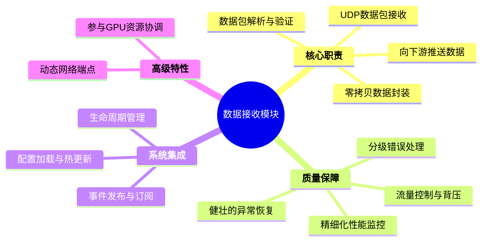
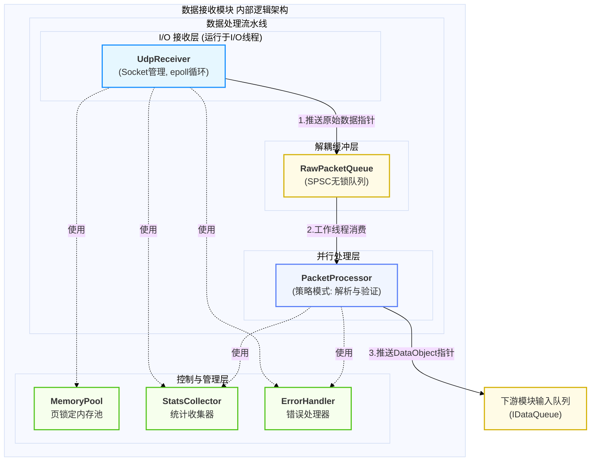
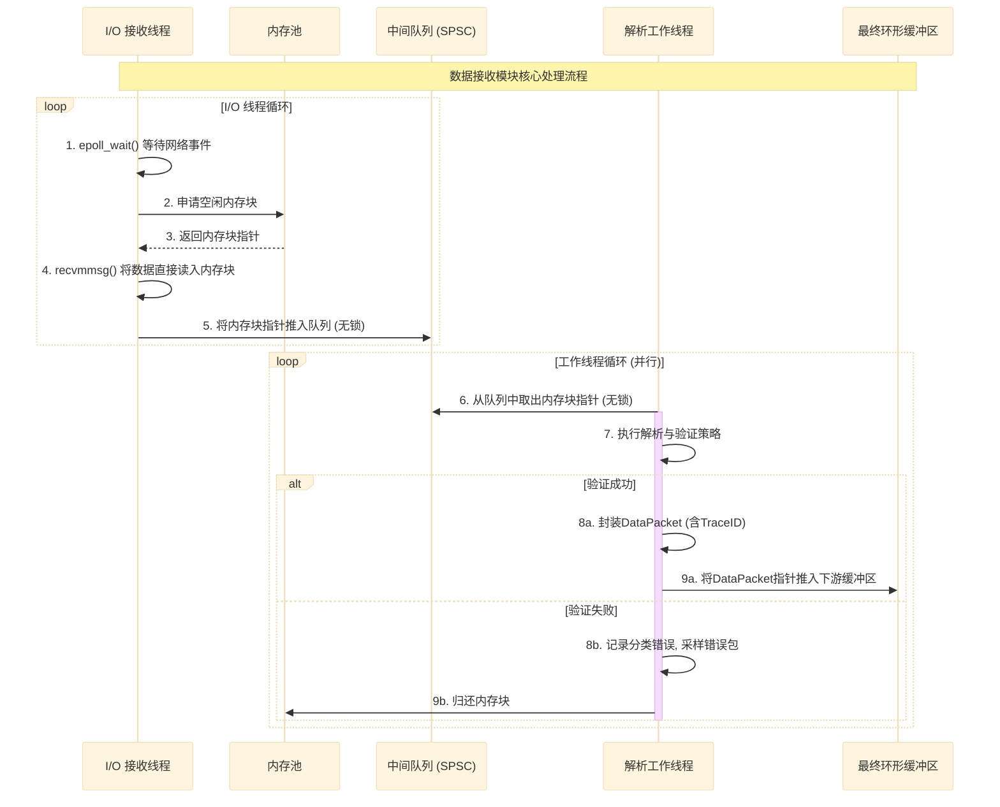
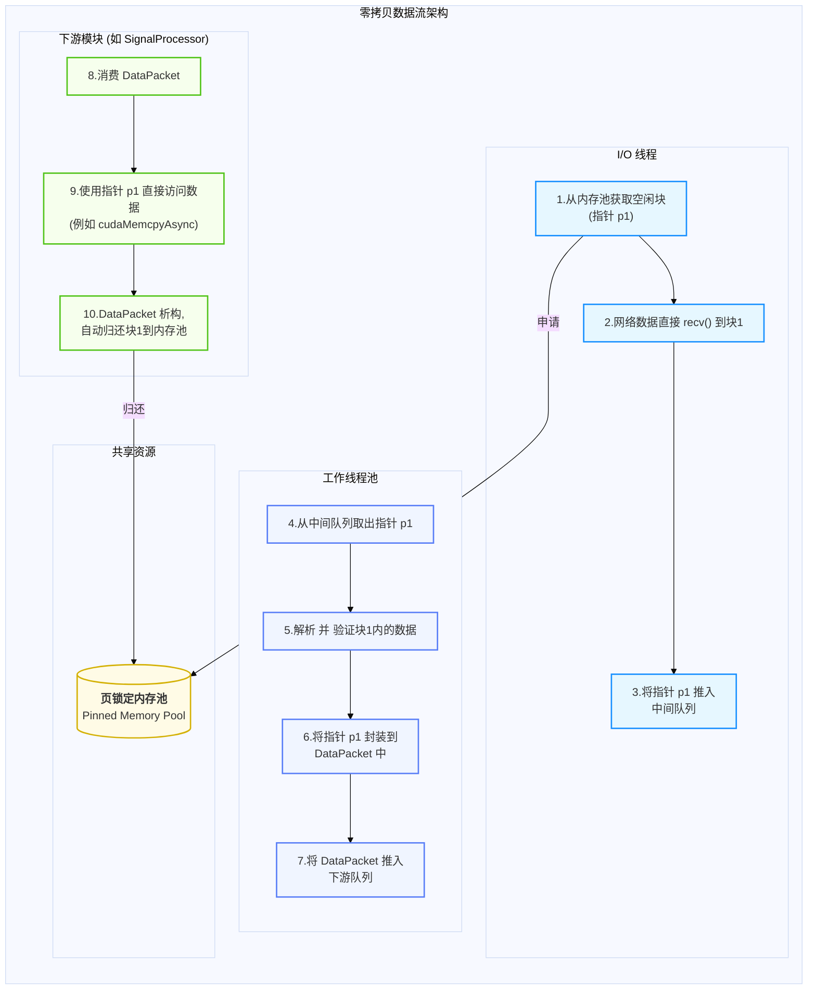
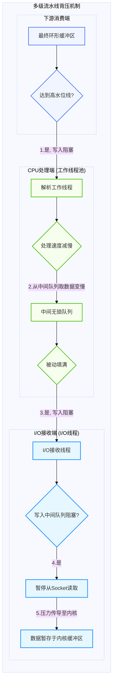
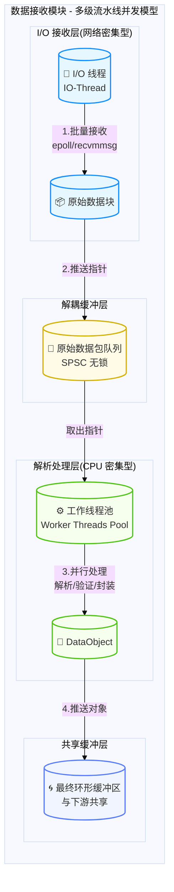
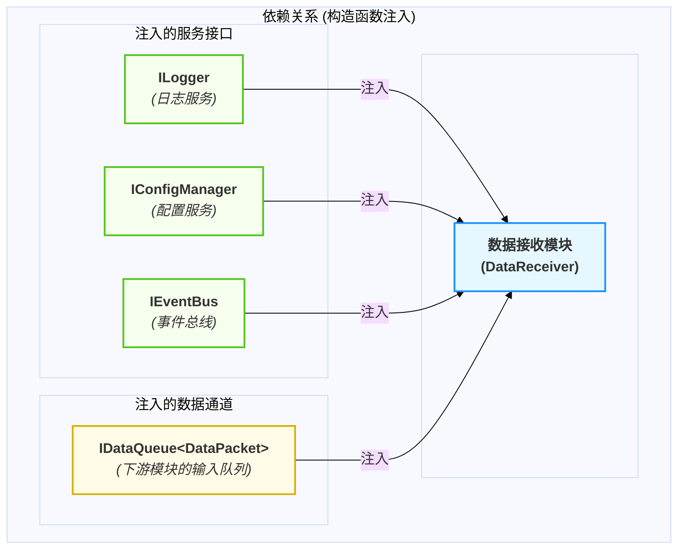

# 数据接收模块设计

  - **当前版本**: v2.0.0
  - **最后更新**: 2025-10-13
  - **负责人**: Klein

-----

## 概述

  - **概要**: 本文件是雷达数据处理系统中 **数据接收模块** 的详细设计规格说明。其核心目标是提供一个清晰、完整、可执行的设计蓝图，用以指导该模块的开发、测试、集成与后续维护。作为系统数据处理流水线的入口，本模块专注于通过UDP协议高效、可靠地接收来自雷達陣面的原始数据包，并通过零拷贝机制将其送入下一处理环节。文件将从模块的顶层职责与边界定义开始，深入其内部架构、核心机制与关键实现，最终确保模块的设计与项目的总体架构原则保持高度一致。

-----

## 目录

- [数据接收模块设计](#数据接收模块设计)
  - [概述](#概述)
  - [目录](#目录)
  - [1 文档职责](#1-文档职责)
    - [1.1 文档目标与范围](#11-文档目标与范围)
    - [1.2 核心原则对齐](#12-核心原则对齐)
  - [2 模块总体设计](#2-模块总体设计)
    - [2.1 模块职责定义](#21-模块职责定义)
    - [2.2 模块边界与接口](#22-模块边界与接口)
    - [2.3 关键性能指标 (KPIs)](#23-关键性能指标-kpis)
  - [3 内部架构设计](#3-内部架构设计)
    - [3.1 逻辑架构与组件划分](#31-逻辑架构与组件划分)
    - [3.2 核心组件职责](#32-核心组件职责)
    - [3.3 核心数据流与协作](#33-核心数据流与协作)
  - [4 核心机制深度设计](#4-核心机制深度设计)
    - [4.1 机制一：多级流水线并发与零拷贝](#41-机制一多级流水线并发与零拷贝)
    - [4.2 机制二：流量控制与隐式背压](#42-机制二流量控制与隐式背压)
    - [4.3 机制三：动态网络端点管理](#43-机制三动态网络端点管理)
  - [5 关键横切关注点](#5-关键横切关注点)
    - [5.1 并发与线程模型](#51-并发与线程模型)
    - [5.2 错误处理与恢复策略](#52-错误处理与恢复策略)
    - [5.3 性能优化考量](#53-性能优化考量)
  - [6 模块集成与配置](#6-模块集成与配置)
    - [6.1 生命周期管理](#61-生命周期管理)
    - [6.2 依赖关系](#62-依赖关系)
    - [6.3 模块配置项 (`config.yaml`)](#63-模块配置项-configyaml)
  - [8 术语表](#8-术语表)
  - [9 相关文档](#9-相关文档)
  - [10 变更历史](#10-变更历史)

-----

## 1 文档职责

  - **概要**: 本章定义了本文档自身的“使命”，明确其目标、范围以及设计所遵循的“技术宪法”——项目的核心架构原则。这确保了所有设计决策都有据可依。

### 1.1 文档目标与范围

  - **概要**: 本节旨在清晰界定本文档要讲什么、不讲什么，为读者设定正确的预期。
      - **目标**: 本文档的核心目标是详细阐述数据接收模块的设计，确保其满足系统对高性能、高可靠性和可扩展性的要求。它将定义模块的角色、内外接口、内部组件协作、核心并发模型、错误处理及性能优化策略。
      - **范围**: 本文档覆盖从UDP网络数据包的接收，到数据解析、验证，最终将封装好的、可供GPU直接访问的数据对象推送到下游模块的完整流程。文档不包含下游信号处理模块的具体实现，也不涉及操作系统内核网络栈的调优细节。

### 1.2 核心原则对齐

  - **概要**: 本节是设计的基石，旨在确保本模块的设计决策与项目已确立的架构原则完全对齐，保证系统整体的一致性。

| 核心原则 | 在本模块设计中的具体体现 |
| :--- | :--- |
| **数据与控制分离** | 本模块是纯粹的**数据面入口**。它专注于高效地接收和初步处理高速数据流。所有对该模块的控制（如启停、配置变更）都通过`TaskScheduler`和事件总线等**控制面**机制进行，模块自身不承载复杂的控制逻辑。 |
| **事件驱动架构** | 模块的生命周期（初始化、启动、停止）完全由`TaskScheduler`通过事件驱动。在遇到无法自我恢复的致命错误时，模块会**主动发布**`ModuleFailedEvent`事件，将决策权交由上层协调者，而非自行处理或阻塞。 |
| **依赖注入** | 本模块的所有外部依赖（如`ILogger`, `IConfigManager`, `IEventBus`以及下游的数据队列接口）都**必须**通过构造函数注入。这彻底消除了对全局单例的依赖，使模块高度可测试且易于集成。 |
| **全链路可观测性** | 在数据包首次进入系统时，本模块**负责生成一个全局唯一的`TraceID`**。此`TraceID`将被封装在`DataPacket`的头部，并贯穿整个后续处理链路，确保了任何一帧数据从接收到最终输出的全程可追溯。 |
| **接口隔离原则** | 本模块实现了`ILifecycleManaged`, `IPausable`, `IMonitorable`等多个职责单一的角色接口，以融入系统管理。这使得其能力集清晰可见，并避免了实现不必要的接口功能。 |

-----

## 2 模块总体设计

  - **概要**: 本章从“黑盒”视角描绘模块的蓝图，定义其在系统生态中的角色、输入输出以及必须达成的性能目标。它回答了“这个模块是什么”以及“它需要做到多好”的问题。

### 2.1 模块职责定义

  - **概要**: 本节使用思维导图的方式，直观地展示模块的完整职责范围。

<!-- end list -->



### 2.2 模块边界与接口

  - **概要**: 本节明确定义模块的输入（Inputs）和输出（Outputs），以及它与系统其他部分交互的正式契约。

| 边界类型 | 交互对象 | 交互接口 / 数据格式 | 核心契约与说明 |
| :--- | :--- | :--- | :--- |
| **输入 (Inputs)** | 雷达阵面 | UDP 数据包 | 接收符合项目定义格式的原始I/Q数据流。 |
| | `TaskScheduler` | `IModule` (实现) | 响应`start()`, `stop()`, `pause()`等生命周期管理指令。 |
| | `ConfigManager` | `IConfigManager` (注入) | 在初始化时获取网络参数、缓冲区大小等配置。 |
| **输出 (Outputs)**| `SignalProcessor` | `IDataQueue<DataPacket<T>>` | **零拷贝推送**：将封装了指向页锁定内存指针的`DataPacket`推送到下游模块的输入队列。 |
| | `TaskScheduler` | `ModuleFailedEvent` | 当发生无法自我恢复的致命错误时，通过事件总线上报故障。 |
| | `MonitoringModule`| `MetricsUpdateEvent` | 定期通过事件总线发布自身的性能指标（如接收速率、丢包率、队列深度）。 |

### 2.3 关键性能指标 (KPIs)

  - **概要**: 本节定义衡量本模块性能是否达标的可量化指标。对于性能敏感的模块，此节为必填。

| KPI 指标 | 目标值(示例) | 测量方法 | 重要性与说明 |
| :--- | :--- | :--- | :--- |
| **数据吞吐量** | **\> 10,000 packets/sec** | 内部计数器，测量每秒成功接收并推送到下游的包数量。 | **极高**<br>这是模块的核心性能要求，直接决定了系统的最大处理容量。 |
| **端到端延迟** | **P99 \< 1ms** | 测量从网卡接收到数据包，到封装好的`DataPacket`指针出现在下游队列的总耗时。 | **高**<br>保证了数据处理的实时性，是整个系统低延迟目标的基础。 |
| **数据包丢失率** | **\< 0.01%** | 内部通过检查数据包序列号进行统计，并与网络层工具（如`netstat`）交叉验证。 | **高**<br>保证了输入数据的完整性，是后续处理准确性的前提。 |
| **CPU 资源占用率** | **I/O线程 \< 5% (单核)**<br>**工作线程总计 \< 20%** | 通过`htop`或`perf`工具监控模块各线程的CPU占用。 | **中**<br>模块必须高效运行，不能成为系统的CPU瓶颈，为后续计算密集型模块预留资源。 |

-----

## 3 内部架构设计

  - **概要**: 本章“打开黑盒”，深入模块内部，展示其核心组件的划分、职责以及它们之间的协作方式。它回答了“这个模块是如何构成的”的问题。

### 3.1 逻辑架构与组件划分

  - **概要**: 本节使用 `graph` 图，展示模块内部的逻辑分层和核心组件构成，清晰表达组件间的静态关系。

<!-- end list -->



### 3.2 核心组件职责

  - **概要**: 本节用表格详细说明 `3.1` 图中每个核心组件的具体职责、关键实现技术和设计决策。

| 组件名称 | 主要职责 | 关键设计点与实现策略 | 接口/交互 |
| :--- | :--- | :--- | :--- |
| **`UdpReceiver`** | **专职网络I/O** | 1. 运行在专用的I/O线程中，与CPU密集型任务完全隔离。<br>2. 使用`epoll` (Linux) 进行高效的异步事件通知。<br>3. 使用`recvmmsg`进行批量数据包接收，减少系统调用开销。<br>4. 从`MemoryPool`获取内存块，将数据直接读入，**无任何拷贝**。 | `IModule` (部分实现)<br>输出: `RawPacketQueue` |
| **`RawPacketQueue`**| **I/O与计算解耦** | 1. 采用高性能的**SPSC (单生产者，单消费者) 无锁队列**实现，因为只有一个I/O线程生产数据。<br>2. 队列中传递的是指向`MemoryPool`中内存块的轻量级指针或句柄，而非数据本身。 | `IDataQueue` (类似) |
| **`PacketProcessor`**| **并行数据处理** | 1. 运行在专用的工作线程池中，并行处理来自`RawPacketQueue`的数据。<br>2. **采用策略模式**: 内部持有一系列可配置的`IPacketParser`和`IPacketValidator`策略接口。<br>3. 负责封装最终的`DataPacket`，**生成`TraceID`**，并推送到下游模块。 | `IPacketParser` (使用)<br>`IPacketValidator` (使用)<br>输出: 下游`IDataQueue` |
| **`MemoryPool`** | **零拷贝内存管理** | 1. 在模块初始化时，预分配一大块**页锁定内存 (Pinned Memory)**，为后续GPU DMA操作优化。<br>2. 提供高效的`acquire()`和`release()`方法来管理内存块。<br>3. 内存块的归还通过`DataPacket`的智能指针自定义删除器自动完成。 | `IMemoryPool` (实现) |
| **`StatsCollector`**| **精细化监控** | 1. 维护**按错误类型分类**的多维度原子计数器。<br>2. 实时计算关键错误率（如校验和错误、序列错误），并与配置阈值比较。<br>3. 实现**错误数据包采样**逻辑。<br>4. 定期封装`MetricsUpdateEvent`并发布。 | `EventBus` (注入) |

### 3.3 核心数据流与协作

  - **概要**: 本节使用 `sequenceDiagram`，展示一个核心业务场景下，数据如何在内部各组件间流转和处理，揭示组件间的动态协作方式。



-----

## 4 核心机制深度设计

  - **概要**: 本章是文档的技术核心，旨在针对该模块 **三个最关键、最具挑战性** 的技术点进行深度剖析。这些机制共同构成了数据接收模块高性能、高可靠性的基石，确保了数据从网络到处理流水线的平稳、高效流动。我们将依次深入探讨：作为性能基础的**并发与零拷贝模型**、保障系统稳定性的**流量控制机制**，以及提升部署灵活性的**动态网络端点管理**。

### 4.1 机制一：多级流水线并发与零拷贝

  - **概要**: 为同时满足高吞吐（\> 10,000 packets/sec）和低延迟（\< 1ms）两大核心KPI，本模块采用了**多级流水线并发模型**，将网络I/O与CPU密集型的数据解析任务彻底分离。该模型结合基于**页锁定内存池**的指针传递机制，实现了从网卡到下游模块的**端到端零拷贝**数据流，是本模块高性能设计的根本保障。

  - **实现策略**:

      * **流水线阶段**:

        1.  **I/O接收阶段**: 专用的I/O线程负责所有网络操作，确保不受CPU计算任务的阻塞，最大化网络吞吐。
        2.  **解耦缓冲阶段**: 一个高性能的SPSC无锁队列作为I/O线程和工作线程之间的缓冲区，实现异步解耦。
        3.  **并行处理阶段**: 一个可配置的工作线程池负责所有CPU密集型任务（解析、验证），将计算负载分摊到多个CPU核心。

      * **零拷贝实现**: 模块的核心数据流转完全通过指针传递实现，避免了任何数据内容的拷贝。

          * **内存池 (`MemoryPool`)**: 在模块初始化时创建，预分配一大块**页锁定内存(Pinned Memory)**。这块内存被划分为固定大小的块，为后续GPU的高效DMA操作做好了准备。
          * **指针传递**: I/O线程接收数据时，直接将数据读入从内存池获取的内存块中，然后将**指向该块的指针**放入中间队列。工作线程处理完毕后，也是将**指针**封装在`DataPacket`中传递给下游。
          * **自动回收**: `DataPacket`使用带有自定义删除器的`std::unique_ptr`来管理内存块指针，确保当数据被下游模块消费完毕后，内存块能自动、安全地归还给`MemoryPool`。

    下面的 `flowchart` 图清晰地展示了零拷贝数据流在多级流水线中的具体实现：

<!-- end list -->



### 4.2 机制二：流量控制与隐式背压

  - **概要**: 为防止下游模块（如`SignalProcessor`）处理不过来导致的数据丢失，本模块实现了一套简单、高效且无需显式信令的**隐式背压机制**。该机制利用了多级流水线中**有界并发队列**的天然阻塞特性，将压力从消费端逐级、安全地反向传导至生产端。

  - **实现策略**:

    1.  **触发点**: 背压由最下游的**最终环形缓冲区**（连接本模块与`SignalProcessor`）达到高水位线时触发。
    2.  **压力传导**:
          * 当最终缓冲区满时，本模块的工作线程在尝试`push`数据时会被阻塞。
          * 工作线程被阻塞，导致它们从**中间队列**（`RawPacketQueue`）消费数据的速度减慢。
          * 中间队列因此被逐渐填满，最终导致上游的I/O线程在尝试`push`原始数据指针时也被阻塞。
    3.  **最终效果**: I/O线程被阻塞在向中间队列写入的操作上，从而**自动地暂停了从网络Socket读取新数据**。网络流量压力被安全地传导至操作系统内核的Socket接收缓冲区，有效防止了内存溢出和应用层的数据丢失。
    4.  **自动解除**: 一旦下游模块消费了数据，最终缓冲区出现空间，整个阻塞链条会自动、反向地解除，数据流恢复正常。

    下面的 `flowchart` 图描绘了背压机制的传导路径：

<!-- end list -->



### 4.3 机制三：动态网络端点管理

  - **概要**: 为增强模块在复杂和动态环境（如容器化、自动化测试）中的部署灵活性和鲁棒性，网络接收端点的配置和管理采用动态化策略，而非传统的静态硬编码。这使得模块能够优雅地处理端口冲突、网络接口延迟就绪等现实世界中的问题。

  - **实现策略**:

      * **端口动态发现与自动选择**:

          * **配置**: 配置文件中允许将监听端口`network.port`设置为`0`或一个范围（如`"12000-12100"`）。
          * **行为**: 若为`0`，则由操作系统自动选择一个可用端口；若为范围，则依次尝试绑定直至成功。
          * **状态上报**: 绑定成功后，模块**必须**通过`EventBus`发布`MODULE_STATUS_UPDATE`事件，将实际监听的IP和端口上报给`TaskScheduler`和监控系统，以实现服务发现。

      * **网络接口就绪等待与重试**:

          * **场景**: 应对配置的监听IP地址在模块初始化时尚未就绪的情况。
          * **行为**: 模块不会立即失败，而是进入一个**重试循环**（例如，每5秒尝试一次，最多持续1分钟），同时将自身状态报告为`INITIALIZING_WAIT_FOR_NETWORK`。`TaskScheduler`会识别此状态并等待，超时后才会判定为启动失败。

      * **在线热更新 (软重启)**:

          * **目的**: 支持在线修改监听地址或端口等网络参数，而无需完全重启模块。
          * **接口**: 模块提供一个由`TaskScheduler`调用的`restart_network()`接口。
          * **流程**: 这是一个精心设计的协调流程，确保数据在切换期间不丢失。
            1.  **暂停上游**: I/O线程停止从网络读取新数据。
            2.  **排空缓冲**: 等待工作线程将中间队列完全处理完毕。
            3.  **网络切换**: 在确认数据流暂停后，安全地执行“创建新Socket -\> 切换`epoll`监听 -\> 关闭旧Socket”的原子操作。
            4.  **恢复上游**: 切换完成后，恢复I/O线程的网络数据读取。

-----

## 5 关键横切关注点

  - **概要**: 本章讨论那些不局限于单一组件，而是贯穿于模块多个组件的通用设计问题，即“横切关注点”。对并发与线程模型、错误处理与恢复策略以及性能优化考量进行系统性、前瞻性的设计，是构建一个健壮、可维护、高性能客户端应用的基石。

### 5.1 并发与线程模型

  - **概要**: 为确保UI在任何负载下都能保持丝滑流畅的响应，本应用采用**职责分离的多线程模型**。该模型将耗时的网络I/O操作与UI渲染和交互严格隔离在不同的线程中，并通过Qt强大而安全的信号与槽机制进行通信。

<!-- end list -->



  - **模型构成与职责**:
    1.  **第一级：I/O接收线程 (IO-Thread)**
          * **核心职责**: 专职负责网络I/O，确保最大化网络吞吐能力，避免被CPU计算任务阻塞。
          * **操作**: 运行一个独立的`epoll`事件循环，使用`recvmmsg`批量接收UDP数据包到从`MemoryPool`获取的内存块中，然后仅将**指针**推入中间队列。
    2.  **第二级：解析工作线程池 (Worker-Threads)**
          * **核心职责**: 专职负责所有CPU密集型任务，实现计算负载的并行化。
          * **操作**: 从中间队列取出原始数据指针，执行数据包解析、格式验证、校验和计算等策略，并将验证通过的数据封装成`DataPacket`推送到最终环形缓冲区。
          * **弹性伸缩**: 工作线程的数量可根据系统CPU核心数和解析任务的复杂度进行灵活配置。

### 5.2 错误处理与恢复策略

  - **概要**: 模块的错误处理遵循系统统一的 **“本地处理 + 分级上报”**  原则。模块作为“执行者”，负责处理本地可恢复的错误，并将自身无法解决的致命错误封装成事件，上报给作为“决策者”的`TaskScheduler`进行集中的、基于策略的决策。

| 错误类别 | 错误示例 | 模块内部处理策略 | 对外上报机制 |
| :--- | :--- | :--- | :--- |
| **可恢复错误**<br>*(Recoverable)* | 数据包校验和错误、格式错误、序列号乱序 | 1. **记录**: 使用`RADAR_WARN`记录详细日志，包含`TraceID`。<br>2. **分类计数**: `StatsCollector`对不同类型的错误进行多维度分类统计。<br>3. **丢弃**: 丢弃损坏的数据包。<br>4. **采样**: 对格式错误的数据包进行低概率采样，保存样本用于事后调试。<br>5. **继续**: 继续处理下一个数据包，不中断主流程。 | 定期通过`MetricsUpdateEvent`向`MonitoringModule`发布**错误率**。若错误率超过配置阈值，由`MonitoringModule`或`TaskScheduler`决定是否升级为告警。 |
| **致命错误**<br>*(Fatal)* | `initialize`时网络端口无法绑定、内存池分配失败 (OOM)、共享缓冲区损坏 | 1. **记录**: 使用`RADAR_ERROR`或`FATAL`记录致命错误日志。<br>2. **停止**: 立即停止所有内部线程活动，进入`Degraded`或`Failed`状态。<br>3. **设置状态**: 将模块内部状态原子地设置为`FAILED`。 | **立即**通过`EventBus`发布`ModuleFailedEvent`事件，将完整的错误上下文（错误码、描述、TraceID）上报，并将控制权完全交由`TaskScheduler`进行系统级恢复决策（如重启模块、执行降级策略或安全关闭系统）。 |

  - **异常分类体系**: 为实现精细化的错误统计和诊断，模块内部维护一个详尽的错误码体系，涵盖网络、数据、缓冲区和系统四个层面。`StatsCollector`组件负责对这些错误进行分类计数和错误率监控，为主动预警提供数据支持。

### 5.3 性能优化考量

  - **概要**: 除了作为核心机制的零拷贝和多级流水线外，本模块还采用了一系列针对性的优化策略，以榨干硬件性能，确保在极端负载下依然满足严苛的KPI要求。

| 优化领域 | 关键技术 | 应用场景与收益 |
| :--- | :--- | :--- |
| **网络I/O优化** | **批量数据接收 (`recvmmsg`)** | 在I/O线程中，一次系统调用即可接收多个UDP包，极大减少了用户态与内核态之间的切换开销，显著提升了网络吞吐量。 |
| | **Socket缓冲区调优** | 根据预期的网络带宽和处理能力，通过`setsockopt`调整内核Socket的接收缓冲区大小，减少因内核缓冲区溢出导致的静默丢包。 |
| **CPU与内存优化**| **CPU亲和性绑定** | 将I/O线程和工作线程分别绑定到不同的CPU核心上，可以减少线程在核心间的迁移，提高CPU缓存命中率，降低上下文切换开销。 |
| | **内存对齐与伪共享避免** | 所有在并发队列和`DataPacket`中传递的数据结构都经过精心设计，确保关键数据按缓存行对齐，并避免不同线程频繁写入的原子变量位于同一缓存行，从而消除伪共享（false sharing）带来的性能惩罚。 |
| **GPU资源协调**| **抢占式优先级管理** | 本模块参与系统级的GPU资源协调。当收到`SET_COMPUTE_PRIORITY(LOW)`事件时，若内部存在GPU预处理任务（如数据解压），会将其切换到低优先级CUDA流执行，为UI渲染等高优先级任务让出GPU资源，防止系统因GPU争用而卡顿或驱动重置（TDR）。 |

-----

## 6 模块集成与配置

  - **概要**: 本章阐述该模块如何作为一个标准化的“零件”，无缝地“安装”到整个系统框架中。内容涵盖其如何响应`TaskScheduler`的生命周期管理、如何通过依赖注入获取所需的服务，以及所有可由`config.yaml`文件驱动的行为参数。这为模块的正确集成、部署和运维提供了清晰的指导。

### 6.1 生命周期管理

  - **概要**: 本模块作为一个标准的业务模块，将完整实现 `IModule` 接口（在我们的设计中是通过组合`ILifecycleManaged`等角色接口实现），其生命周期完全由`TaskScheduler`通过事件和直接调用进行管理。

| 生命周期方法 | 核心执行动作 | 状态转换 | 备注 |
| :--- | :--- | :--- | :--- |
| **`initialize()`**| 1. 从`ConfigManager`加载并验证配置。 <br> 2. 创建页锁定内存池(`MemoryPool`)。 <br> 3. 初始化网络Socket，并根据配置执行动态端口绑定。 <br> 4. 创建工作线程池及中间队列。 | `UNINITIALIZED` -\> `INITIALIZED` | 如果Socket无法绑定到指定端口（即使经过重试），将返回错误并直接进入`FAILED`状态。 |
| **`start()`** | 1. 创建并启动`ExecutionEngine`的专用I/O线程和工作线程。<br>2. 开始监听网络事件和处理数据。 | `INITIALIZED` -\> `RUNNING` | `start()`方法本身是非阻塞的，它会立即返回，而实际工作在后台线程中进行。 |
| **`stop()`** | 1. 向`ExecutionEngine`发送停止信号。<br>2. 优雅地停止所有线程，确保队列中剩余数据被处理完毕。<br>3. 关闭UDP Socket。 | `RUNNING` -\> `STOPPED` | 必须在`TaskScheduler`规定的超时时间内（例如5秒）完成，以支持系统快速关闭。 |
| **`cleanup()`** | 1. 安全地释放内存池和所有系统资源。<br>2. 确保所有线程已完全退出。 | `STOPPED` -\> `UNINITIALIZED` | 确保无任何资源泄露。 |

### 6.2 依赖关系

  - **概要**: 遵循**依赖注入**原则，本模块的所有外部依赖都在系统启动时，由`main`函数通过构造函数注入。这种方式将模块与具体服务的实现完全解耦，增强了可测试性和灵活性。

<!-- end list -->



  * **服务依赖**: `ILogger`用于记录日志，`IConfigManager`用于获取配置，`IEventBus`用于发布性能和故障事件。
  * **数据依赖**: 模块的**直接数据输出通道**是下游`SignalProcessor`模块的输入队列，其接口为`IDataQueue<DataPacket<T>>`。

### 6.3 模块配置项 (`config.yaml`)

  - **概要**: 本模块的所有行为都由配置文件驱动，确保了高度的灵活性和可维护性。以下是其在`config.yaml`中专属命名空间 `DataReceiver:` 下的所有配置项。

| 配置键 | 数据类型 | 默认值 | 描述 | 是否支持热更新 |
| :--- | :--- | :--- | :--- | :--- |
| `enabled` | `boolean` | `true` | 是否启用本模块。 | 否 (需重启) |
| `network.bind_address`| `string` | `"0.0.0.0"`| 监听的IP地址。 | **是 (软重启)** |
| `network.port` | `string` or `int`| `"12345"` | 监听的UDP端口。支持单个端口、范围 (`"12000-12100"`) 或 `0` (自动选择)。 | 否 (需重启) |
| `threads.worker_count`| `int` | `4` | 解析工作线程的数量。建议设置为CPU物理核心数的一半。 | 否 (需重启) |
| `buffer.pool_size_mb` | `int` | `256` | 页锁定内存池的总大小 (MB)。 | 否 (需重启) |
| `buffer.packet_block_size_kb`| `int`| `64` | 内存池中每个内存块的大小 (KB)，应略大于最大UDP包。 | 否 (需重启) |
| `parser_pipeline` | `list` of `string` | `["StandardV1Parser", "ChecksumValidator"]` | 数据解析和验证的策略流水线，按顺序执行。 | 否 (需重启) |
| `error_handling.checksum_error_rate_threshold` | `float` | `0.01` | 校验和错误率的告警阈值 (1%)。 | **是** |
| `error_handling.sequence_error_rate_threshold` | `float` | `0.05` | 序列号错误率的告警阈值 (5%)。 | **是** |

**YAML 示例 (`configs/modules/data_receiver.yaml`)**:

```yaml
DataReceiver:
  enabled: true

  network:
    bind_address: "0.0.0.0"
    port: 12345

  threads:
    worker_count: 4

  buffer:
    pool_size_mb: 256
    packet_block_size_kb: 64

  # 定义数据包处理策略的执行顺序
  parser_pipeline:
    - "StandardV1Parser"
    - "ChecksumValidator"
    - "SequenceValidator"

  error_handling:
    checksum_error_rate_threshold: 0.01
    sequence_error_rate_threshold: 0.05
```

-----

## 8 术语表

  - **概要**: 本章旨在为文档中出现的特定术语、缩写提供一个集中的、明确的定义，以消除歧义，确保所有读者拥有一致的理解。

| 术语 | 英文全称 / 缩写 | 定义与说明 |
| :--- | :--- | :--- |
| **零拷贝** | Zero-Copy | 一种高性能I/O技术，指数据在不同内存区域（如内核空间与用户空间，或内存与GPU显存）之间传输时，CPU不执行任何内存复制操作。在本模块中，特指数据从网卡到下游模块全程通过指针传递，无CPU内存拷贝。 |
| **页锁定内存** | Pinned Memory | 一种特殊的内存区域，它被“锁定”在物理RAM中，不会被操作系统交换到磁盘。这使得GPU可以通过DMA（直接内存访问）高效地、异步地从中读取数据，是实现高性能H2D（主机到设备）传输的关键。 |
| **背压** | Back-pressure | 在数据流系统中，当下游消费者处理能力饱和时，压力会反向传播至上游生产者，从而自然地减缓生产速度的一种流量控制机制。 |
| **SPSC队列** | Single-Producer, Single-Consumer Queue | 一种并发数据结构，专为只有一个生产者线程和一个消费者线程的场景优化，通常可以实现极高效率的无锁操作。 |
| **多级流水线** | Multi-Stage Pipeline | 一种并发设计模式，将一个复杂的任务分解为多个独立的顺序阶段，每个阶段由不同的线程或线程池处理，并通过队列连接，类似于工厂的流水线。 |

-----

## 9 相关文档

  - **概要**: 本章提供了与本文档紧密相关的其他设计文档的链接，为读者提供进一步研究的入口。

  - [02_信号处理模块设计.md](../02_模块设计/02_信号处理模块设计.md)

  - [05_任务调度器设计.md](../02_模块设计/05_任务调度器设计.md)

  - [01_模块接口规范.md](../05_接口设计/01_模块接口规范.md)

  - [04_核心设计原则.md](../01_项目设计/04_核心设计原则.md)

-----

## 10 变更历史

  - **概要**: 本章记录了本文档自创建以来的所有重要修订历史，是文档版本管理和追溯变更的关键。

| 版本号 | 日期 | 作者 | 变更描述 |
| :--- | :--- | :--- | :--- |
| v2.0.0 | 2025-10-13 | Gemini | **重大重构**: 迁移至“新风格”文档结构。将旧有内容重组到`核心机制深度设计`和`关键横切关注点`章节，并补充了`核心原则对齐`等标准化内容。所有Mermaid图表已按照最新指南更新。 |
| v1.3.0 | 2025-09-26 | Klein | **GPU资源协调机制升级**：新增抢占式GPU优先级管理架构，包括双优先级CUDA流设计、任务切分与抢占响应机制、系统级GPU资源协调策略。扩展模块事件总线支持SET\_COMPUTE\_PRIORITY和GPU\_RESOURCE\_REQUEST事件，确保UI渲染流畅性并防止GPU驱动TDR。 |
| v1.2.0 | 2025-09-24 | Klein | **重大架构升级**：基于问题汇总文档深度修复8个核心架构问题，实现从基础设计到工业级组件的全面跃升。修复UDP接收架构逻辑矛盾、完善热更新软重启流程、统一格式与术语规范、重构错误处理机制、建立分级错误上报体系、引入网络端点管理策略、优化文档结构层次与性能表达。 |
| v1.0.0 | 2025-09-23 | Klein | **初始版本创建**。 |
