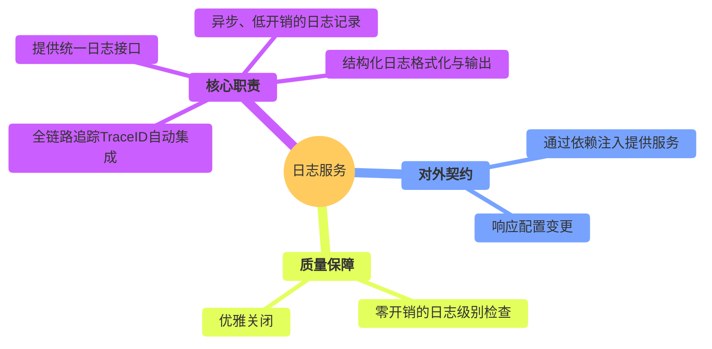

# 日志服务设计

  - **当前版本**: v3.0.0
  - **最后更新**: 2025-10-14
  - **负责人**: Klein

-----

## 概述

  - **概要**: 本文件是雷达数据处理系统中 **日志服务 (`LoggingService`)** 的详细设计规格说明。其核心目标是为整个系统提供一个统一的、高性能的、可观测的日志记录基础设施。作为一项被动的基础服务，本模块的使命是为系统中的所有其他模块提供可靠、低开销的日志记录能力。本文档将从服务的对外契约（如何使用）开始，深入其内部实现（如何工作），并最终阐明其如何被集成到系统中，确保其设计与项目的总体架构原则保持高度一致。

-----

## 目录

...

-----

## 1 文档职责

  - **概要**: 本章定义了本文档自身的“使命”，明确其目标、范围以及设计所遵循的“技术宪法”——项目的核心架构原则。这确保了所有设计决策都有据可依。

### 1.1 文档目标与范围

  - **概要**: 本节旨在清晰界定本文档要讲什么、不讲什么，为读者设定正确的预期。
      - **目标**: 本文档的核心目标是为`LoggingService`提供一个健壮、高性能且可扩展的设计蓝图。它将详细定义服务的公开接口、核心实现机制（如异步写入、TraceID集成）、配置方法以及生命周期管理。
      - **范围**: 本文档覆盖从日志消息的产生（通过日志宏），到其被异步处理、格式化并最终输出到指定目标（控制台、文件等）的完整流程。文档**不包含**日志内容的分析、监控告警或日志数据的长期存储与检索策略，这些由`MonitoringModule`或外部日志聚合系统负责。

### 1.2 核心原则对齐

  - **概要**: 本节是设计的基石，旨在确保本服务的设计决策与项目已确立的架构原则完全对齐，保证系统整体的一致性。

| 核心原则 | 在本模块设计中的具体体现 |
| :--- | :--- |
| **数据与控制分离** | **本服务是纯粹的控制面基础设施**。它不参与任何业务数据流的处理。其唯一的“数据”就是从系统各处收集而来的、描述系统行为的元数据——日志消息。 |
| **事件驱动架构** | **本服务是事件的被动消费者，而非驱动者**。它通过订阅`ConfigManager`发布的`ConfigChangedEvent`来实现配置的热更新。它自身不发布任何驱动业务流程的事件。 |
| **依赖注入** | **这是本服务被消费的唯一方式**。`LoggingService`的`ILogger`接口实例在系统启动的最早期被创建，并通过**构造函数注入**到需要日志记录功能的所有模块和服务中，彻底杜绝了全局单例。 |
| **全链路可观测性** | **这是本服务的核心设计目标之一**。服务与`TraceContext`深度集成，能够**自动捕获**当前线程的`TraceID`并将其附加到每一条日志消息中，是实现端到端追踪、快速定位问题的关键基础。 |

-----

## 2 模块总体设计

  - **概要**: 本章从“黑盒”视角描绘日志服务的蓝图，定义其在系统生态中的角色、输入输出以及必须达成的性能目标。作为保障系统可观测性的基石，其设计的可靠性和低开销特性至关重要。

### 2.1 模块职责定义

  - **概要**: 本节使用思维导图的方式，直观地展示日志服务作为系统“记录员”的完整职责范围。

<!-- end list -->



### 2.2 模块边界与接口

  - **概要**: 本节明确定义本服务与系统其他部分的交互契约。作为一个基础服务，它被广泛依赖，但自身依赖极少。

| 边界类型 | 交互对象 | 交互接口 / 数据格式 | 核心契约与说明 |
| :--- | :--- | :--- | :--- |
| **输入 (Inputs)** | **所有模块/服务** | `ILogger` 接口 / `RADAR_*` 宏 | **日志记录请求**: 接收来自系统各处的、任意级别的日志记录请求。 |
| | `ConfigManager` | `IConfigManager` (注入) | **配置源**: 从配置管理器获取日志级别、输出格式、文件路径等配置，并订阅其变更事件。 |
| **输出 (Outputs)**| **文件系统/控制台** | 文本日志流 | **日志产物**: 将格式化后的结构化日志写入到配置文件中指定的目标（Sinks）。 |

### 2.3 关键性能指标 (KPIs)

  - **概要**: 本节定义衡量本服务性能是否达标的可量化指标。对于日志服务，核心KPI在于**对业务线程的性能影响要尽可能小**。

| KPI 指标 | 目标值(示例) | 测量方法 | 重要性与说明 |
| :--- | :--- | :--- | :--- |
| **日志调用开销 (启用级别)** | **P99 \< 100ns** | 微基准测试 (Micro-benchmarking)，测量从调用`RADAR_INFO`到函数返回的总耗时。 | **极高**<br>这是衡量异步日志性能的核心。业务线程只需将日志消息入队即可立即返回，不能有任何阻塞。 |
| **日志调用开销 (禁用级别)** | **\< 10ns** | 微基准测试，测量在日志级别被禁用时，调用`RADAR_DEBUG`的耗时。 | **极高**<br>通过宏实现的编译期级别检查，必须确保在禁用时接近**零开销**，允许开发者在代码中无顾虑地保留大量调试日志。 |
| **CPU / 内存占用** | **CPU \< 0.1%**<br>**内存 \< 20 MB** | 在高日志负载下，通过`htop`等工具监控日志后台线程的资源占用。 | **中**<br>作为基础服务，必须保持轻量，不能成为系统本身的性能负担。 |

-----

## 3 服务接口与使用模式 (对外契约)

  - **概要**: **本章是“服务消费者”最关心的部分**。它详细定义了服务的公开契约和最佳使用实践，回答了“如何正确、高效地使用我？”这个问题。本章将完全屏蔽内部实现细节，只关注服务的调用方式与核心保证。

### 3.1 核心服务接口 (`ILogger`)

  - **概要**: `ILogger`是日志服务对外暴露的唯一C++接口。系统中的任何模块或组件都通过持有该接口的共享指针（`std::shared_ptr<ILogger>`）来获得日志记录能力。该接口定义了日志服务的核心功能契约，并通过依赖注入的方式提供给消费者。

  - **C++ 接口定义**:

    ```cpp
    namespace radar::logging {

    /**
     * @brief 日志记录接口
     * @details 所有模块通过此接口进行日志记录，以支持依赖注入和统一管理。
     */
    class ILogger {
    public:
        virtual ~ILogger() = default;

        /**
         * @brief 检查指定级别是否已启用。
         * @details 这是实现零开销日志宏的关键，允许在调用重量级日志函数前进行快速检查。
         * @param level 日志级别
         * @return 如果该级别及更高级别的日志已启用，则返回true。
         */
        virtual bool shouldLog(LogLevel level) const = 0;

        /**
         * @brief (模板方法) 记录一条结构化日志消息。
         * @details 此方法通常不直接调用，而是通过下述的RADAR_*宏进行封装。
         * @tparam Args 可变参数类型
         * @param level 日志级别
         * @param format 类fmt::format的格式化字符串
         * @param args 格式化参数
         */
        template<typename... Args>
        void log(LogLevel level, const std::string& format, Args&&... args);

        /**
         * @brief 立即将缓冲区中的所有日志消息刷入目标（如文件）。
         * @details 主要用于程序优雅退出时，确保所有日志都被完整记录。
         */
        virtual void flush() = 0;

        /**
         * @brief 动态设置日志记录的最低级别。
         * @details 支持运行时热更新日志级别。
         * @param level 新的日志级别
         */
        virtual void setLevel(LogLevel level) = 0;
    };

    } // namespace radar::logging
    ```

### 3.2 推荐使用模式 (最佳实践)

  - **概要**: 为实现极致的性能，日志服务的直接使用者并非`ILogger`接口本身，而是一组精心设计的**高性能日志宏**（`RADAR_*`系列）。这些宏通过在编译期进行日志级别检查，实现了在日志级别被禁用时**接近零的性能开销**，允许开发者在代码中无顾虑地保留大量的调试和追踪日志，而无需在发布版本中手动移除它们。

  - **高性能宏定义**:

    ```cpp
    #define RADAR_DEBUG(logger, ...) \
        do { \
            if ((logger) && (logger)->shouldLog(radar::logging::LogLevel::DEBUG)) { \
                (logger)->log(radar::logging::LogLevel::DEBUG, __VA_ARGS__); \
            } \
        } while(0)

    // ... RADAR_TRACE, RADAR_INFO, RADAR_WARN, RADAR_ERROR 宏定义类似
    ```

  - **使用示例**:

    ```cpp
    // 在模块的构造函数中注入logger
    class DataProcessor {
    public:
        DataProcessor(std::shared_ptr<ILogger> logger) : logger_(logger) {}

        void processData(const DataObject& data) {
            // 当DEBUG级别被禁用时，这一行代码在编译后等同于空操作，完全零开销。
            // `data.toString()` 和格式化操作都不会被执行。
            RADAR_DEBUG(logger_, "Data details for diagnostics: {}", data.toString());

            // 结构化日志记录，便于后续的机器解析和分析。
            RADAR_INFO(logger_, "Processing completed - {duration_ms={}, size={}}",
                       getDuration(), data.size());
        }

    private:
        std::shared_ptr<ILogger> logger_;
    };
    ```

### 3.3 全链路可观测性集成 (`TraceID`)

  - **概要**: 日志服务的核心价值之一是支撑全链路可观测性。`LoggingService`与系统的`TraceContext`机制深度集成，能够**自动、隐式地**捕获当前线程的`TraceID`，并将其作为结构化日志的一部分进行记录。开发者在调用日志宏时，**无需也禁止**手动传递`TraceID`，从而实现了日志记录与追踪上下文的完全解耦。

  - **实现策略**:

    1.  **`TraceContext`**: 系统通过`thread_local`变量维护每个线程的`TraceID`上下文。当一个请求或数据流进入系统时（如`DataReceiver`），会为其生成一个`TraceID`并设置到当前线程。
    2.  **`TraceContextGuard`**: 通过RAII模式，确保`TraceID`在跨越函数调用和异步边界时能够被正确设置和恢复。
    3.  **日志服务集成**: `LoggingService`的`log()`方法在内部会调用`TraceContext::getCurrentTraceId()`来获取当前线程的`TraceID`，并将其自动填入日志消息的`[TraceID]`字段中。

  - **日志输出示例**:

    ```
    // 以下日志由不同模块、不同线程产生，但由于共享相同的TraceID，可以被轻松关联起来
    [2025-09-25T10:30:05.123Z] [INFO] [DataRecv] [a1b2c3d4] Packet received: size=4096
    [2025-09-25T10:30:05.124Z] [DEBUG] [SigProc] [a1b2c3d4] Starting FFT processing...
    [2025-09-25T10:30:05.126Z] [ERROR] [DataProc] [a1b2c3d4] Processing failed: timeout
    ```

