# 信号处理模块设计

**文档版本**: v1.0.3
**最后更新**: 2025-09-23
**负责人**: Kelin
**适用阶段**: MVP及向 V2.0 性能优化过渡阶段
**来源依据**: 基于《MVP系统设计文档》第5.2章信号处理模块和第2.2.1章详细组件架构

---

## 1 文档职责

本文件详细设计信号处理模块的内部架构和核心机制，侧重“把原始 I/Q → 低阶信号特征/检测结果/参数估计”（FFT、滤波、波束成形、CFAR、脉冲压缩、DOA、Doppler 处理 等）：
1) GPU加速的信号处理算法实现策略
2) CUDA并行计算的架构设计和资源管理
3) 算法模拟器的设计原理和扩展机制
4) 数据并行和任务并行的协调策略
5) GPU内存管理和数据传输优化
6) 模块内部组件协作和性能监控

已明确不在本文件范围内的内容：具体的CUDA代码实现、算法数学公式、GPU驱动配置、外部算法库集成等（这些在相应的专项文档中维护）。

### 1.1 目录
- [信号处理模块设计](#信号处理模块设计)
  - [1 文档职责](#1-文档职责)
    - [1.1 目录](#11-目录)
  - [2 模块总体设计](#2-模块总体设计)
    - [2.1 模块职责定义](#21-模块职责定义)
    - [2.2 模块边界和约束](#22-模块边界和约束)
    - [2.3 职责原则](#23-职责原则)
  - [3 内部架构设计](#3-内部架构设计)
    - [3.1 组件组织结构](#31-组件组织结构)
    - [3.2 组件职责分工](#32-组件职责分工)
    - [3.3 组件协作机制](#33-组件协作机制)
  - [4 GPU计算架构](#4-gpu计算架构)
    - [4.1 GPU资源管理架构](#41-gpu资源管理架构)
    - [4.2 CUDA计算流水线](#42-cuda计算流水线)
    - [4.3 内存管理策略](#43-内存管理策略)
  - [5 算法实现规划](#5-算法实现规划)
    - [5.1 MVP v1.0算法范围](#51-mvp-v10算法范围)
    - [5.2 完整算法总览](#52-完整算法总览)
    - [5.3 算法演进路线表](#53-算法演进路线表)
  - [6 算法处理设计](#6-算法处理设计)
    - [6.1 算法模拟器架构](#61-算法模拟器架构)
    - [5.2 算法执行引擎](#52-算法执行引擎)
  - [7 并行计算设计](#7-并行计算设计)
    - [7.1 数据并行策略](#71-数据并行策略)
    - [7.2 任务并行协调](#72-任务并行协调)
  - [8 性能优化设计](#8-性能优化设计)
    - [8.1 计算优化策略](#81-计算优化策略)
    - [8.2 数据传输优化](#82-数据传输优化)
  - [9 错误处理设计](#9-错误处理设计)
    - [9.1 错误分类](#91-错误分类)
    - [9.2 恢复策略](#92-恢复策略)
  - [10 模块约束说明](#10-模块约束说明)
  - [11 相关文档](#11-相关文档)
  - [12 变更历史](#12-变更历史)

---

## 2 模块总体设计

### 2.1 模块职责定义

信号处理模块作为系统的计算核心，承担高性能信号处理算法的执行和GPU资源的管理职责：

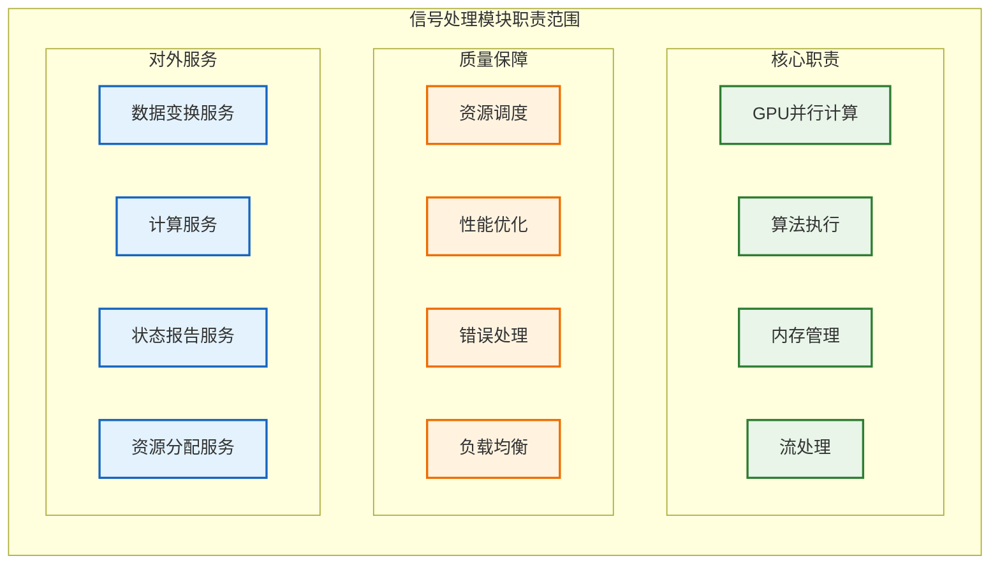

### 2.2 模块边界和约束

**输入边界**：
- 数据接收模块传输的原始雷达数据包（通过 `raw_data_buffer`）
- 任务调度器的计算任务分配和优先级指令
- 配置管理器的算法参数和GPU配置

**输出边界**：
- 检测结果（`DetectionResult` 结构体），推送到 `detection_result_buffer`
- GPU资源使用状态和性能指标
- 算法执行结果和统计信息

**性能约束**：
- 单批次数据处理延迟 < 5ms
- GPU利用率保持在 80% 以上
- 内存带宽利用率 > 70%
- 支持 1000 MB/s 的数据吞吐量

**技术约束**：
- 仅支持NVIDIA CUDA计算平台
- 需要GPU计算能力 6.0 或更高版本
- 依赖CUDA Toolkit 12.x运行环境
- 单GPU配置，预留多GPU扩展接口

### 2.3 职责原则
作为“执行者”角色，信号处理模块的核心职责是高效、准确地完成信号处理任务。它**不参与系统级的决策**。

- **执行**:
  - 从上游模块获取原始数据。
  - 执行配置好的信号处理算法链（如脉冲压缩、FFT、CFAR等）。
  - 将处理结果（如`DetectionResult`）输出到下游模块。
- **报告**:
  - **状态报告**: 定期向`任务调度器`报告自身运行状态和关键性能指标。
  - **事件上报**: 当发生无法在模块内部恢复的严重错误时（如GPU致命错误），必须立即将事件上报给`任务调度器`，由其决定后续处理策略。

---

## 3 内部架构设计

### 3.1 组件组织结构

信号处理模块内部采用分层计算架构。下图为“功能分组视图”，仅展示层次与组件归属，不表示组件之间的直接调用、依赖或数据流；实际处理/调度与数据流请参考 3.3 协作时序图及 4.x GPU 架构章节：

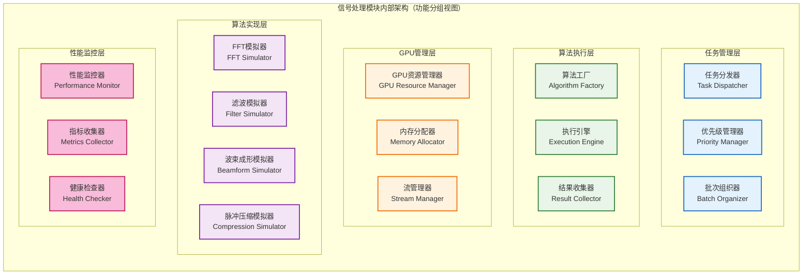
> 注：本图不表示执行顺序、资源调度或数据流向；执行/数据流参考 3.3、4.2、7.x 相关时序与流水线图。

### 3.2 组件职责分工

| 组件名称          | 主要职责             | 关键功能               | 性能特征       |
| ----------------- | -------------------- | ---------------------- | -------------- |
| **任务分发器**    | 计算任务的分发和调度 | 任务队列管理、负载均衡 | 高并发、低延迟 |
| **优先级管理器**  | 任务优先级控制和抢占 | 优先级算法、任务抢占   | 实时响应       |
| **批次组织器**    | 数据批次组织和缓存   | 批量处理、数据对齐     | 高吞吐量       |
| **算法工厂**      | 算法实例创建和管理   | 策略模式、工厂模式     | 灵活扩展       |
| **执行引擎**      | 算法执行和结果管理   | 异步执行、状态跟踪     | 高效执行       |
| **结果收集器**    | 处理结果汇总和输出   | 结果聚合、格式转换     | 数据一致性     |
| **GPU资源管理器** | GPU设备和资源管理    | 设备选择、资源分配     | 资源优化       |
| **内存分配器**    | GPU内存分配和回收    | 内存池、碎片整理       | 内存效率       |
| **流管理器**      | CUDA流创建和调度     | 异步执行、流同步       | 并行计算       |
| **算法模拟器组**  | 具体算法的模拟实现   | 数学运算、并行算法     | 计算密集型     |

### 3.3 组件协作机制

组件间通过明确的协作模式实现高效的GPU计算流程：

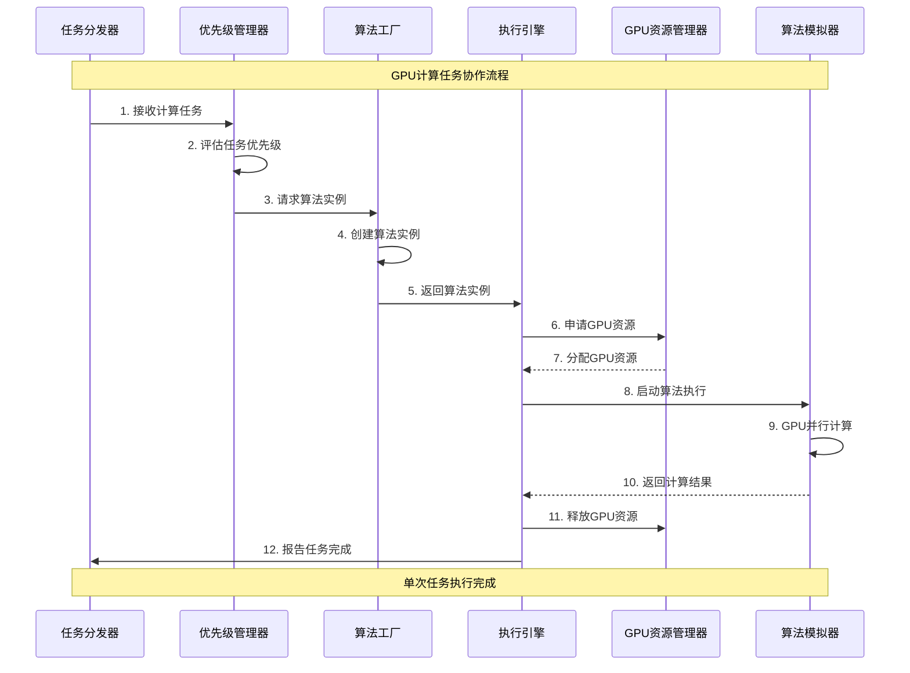

---

## 4 GPU计算架构

### 4.1 GPU资源管理架构

采用分层GPU资源管理模型，确保计算资源的高效分配和利用：

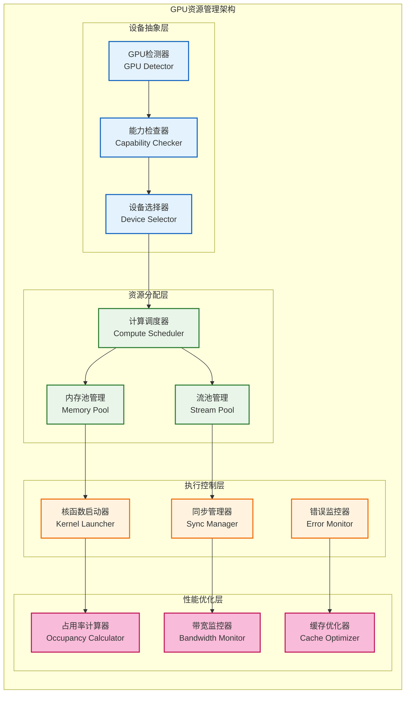

### 4.2 CUDA计算流水线

CUDA计算流水线设计实现计算与数据传输的重叠，最大化GPU利用率：

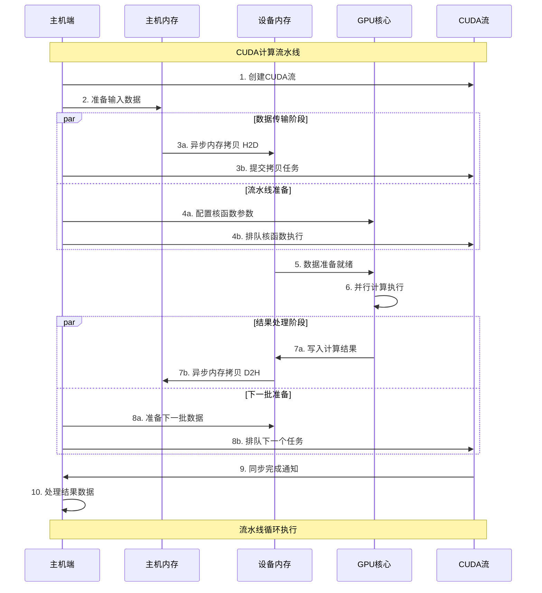

### 4.3 内存管理策略

GPU内存管理采用分级策略，支持高效的内存分配和数据传输：

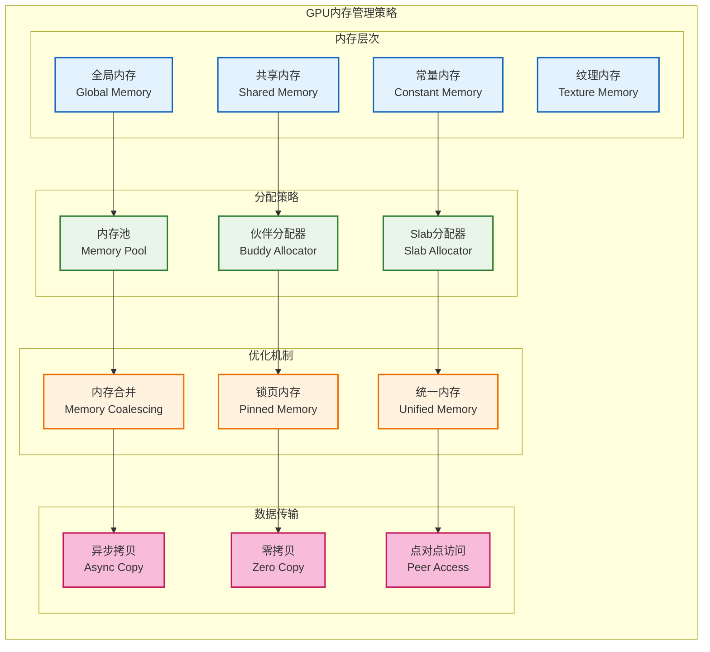

---

## 5 算法实现规划

### 5.1 MVP v1.0算法范围

MVP v1.0阶段聚焦于核心信号处理算法的模拟实现，验证GPU计算架构的可行性：

**基础信号处理算法**
用于将原始 I/Q 数据转换到频域并做窗口与插值等预处理，作为后续处理输入。

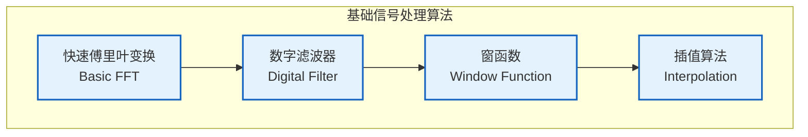

**波束成形算法**
基于相位移位与幅度加权构造方向性波束，用于空间滤波与增益控制。

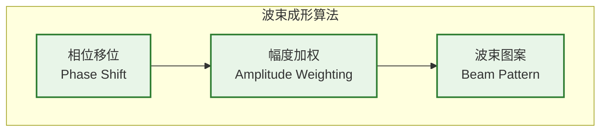

**脉冲压缩算法**
通过匹配滤波和脉冲压缩提升距离分辨率并改善目标检测性能。

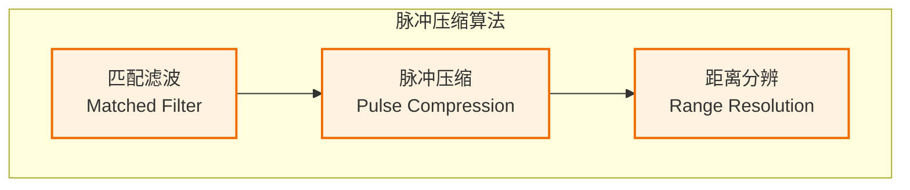

**数据预处理**
噪声抑制、增益控制与校准保证输入数据质量和算法稳定性。

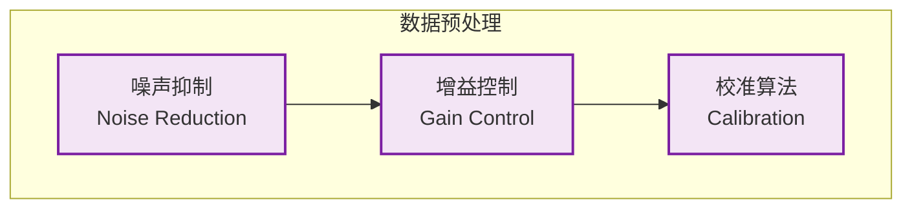

**MVP v1.0 算法特征**：
- **简化实现**：采用基础算法模拟，避免复杂的优化策略
- **验证性质**：重点验证GPU计算架构和数据流转机制
- **模块化设计**：每个算法都实现为独立的策略组件
- **性能基线**：建立性能测试基线，为后续优化提供参考

### 5.2 完整算法总览

完整的雷达信号处理算法体系，为后续版本演进提供路线图：

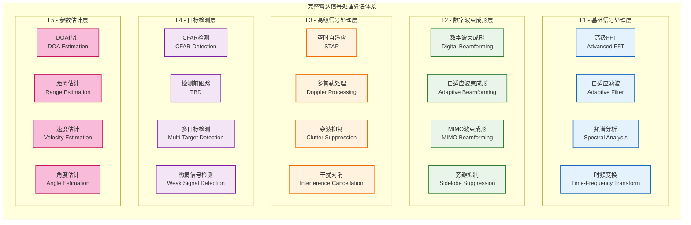

### 5.3 算法演进路线表

分阶段的算法实现和优化路线表：

| 阶段         | 版本 | 主要算法                         | 实现特征               | GPU优化程度  |
| ------------ | ---- | -------------------------------- | ---------------------- | ------------ |
| **MVP验证**  | v1.0 | 基础FFT、简单滤波、相位波束成形  | 模拟实现、架构验证     | 基础CUDA     |
| **核心功能** | v2.0 | 匹配滤波、脉冲压缩、多通道处理   | 完整实现、性能优化     | 中级CUDA优化 |
| **高级处理** | v3.0 | 自适应滤波、CFAR检测、杂波抑制   | 实用算法、实时处理     | 高级GPU优化  |
| **智能处理** | v4.0 | 空时自适应、干扰对消、弱信号检测 | 智能算法、自适应优化   | 专家级优化   |
| **完整系统** | v5.0 | DOA估计、多目标跟踪、参数估计    | 完整算法体系、生产就绪 | 极致性能优化 |

**算法实现策略**：
- **渐进式演进**：每个版本在前一版本基础上增加新算法
- **向后兼容**：新版本算法保持与旧版本接口的兼容性
- **性能优化**：随版本演进持续优化GPU计算性能
- **模块化扩展**：支持算法模块的独立升级和替换

---

## 6 算法处理设计

### 6.1 算法模拟器架构

算法模拟器采用策略模式设计，支持灵活的算法切换和扩展：

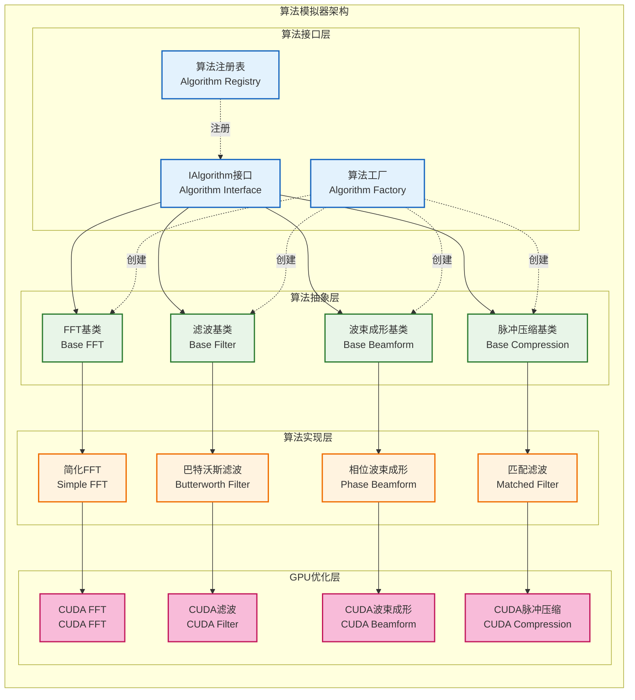

### 5.2 算法执行引擎

算法执行引擎负责算法的调度执行和结果管理：

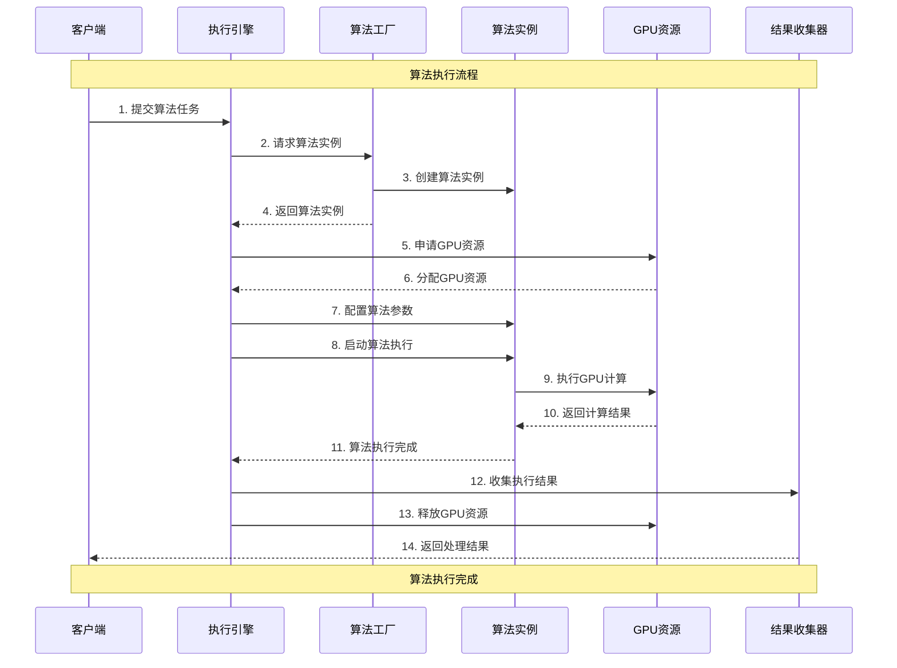

---

## 7 并行计算设计

### 7.1 数据并行策略

数据并行通过将大数据集分解为小块，在GPU上并行处理：

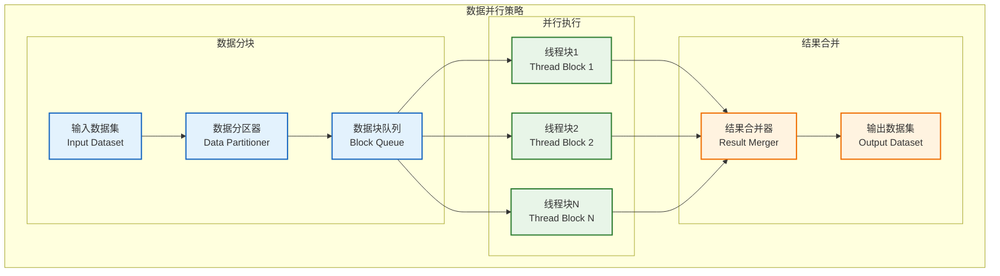

### 7.2 任务并行协调

任务并行通过多个CUDA流实现不同算法的并行执行：

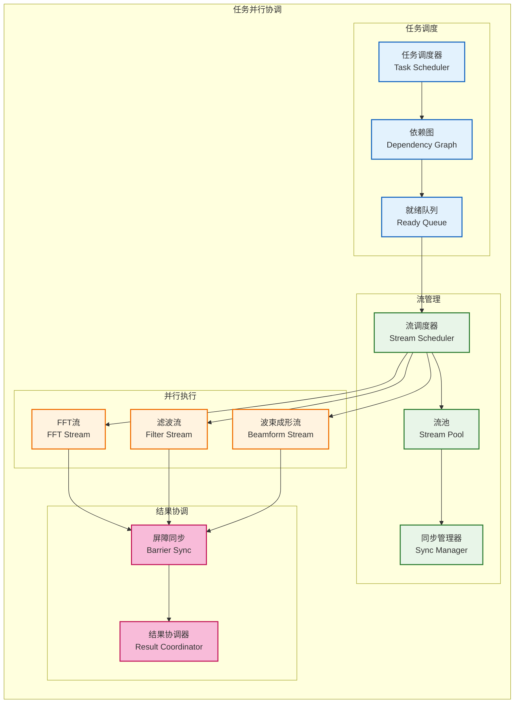

---

## 8 性能优化设计

### 8.1 计算优化策略

**GPU占用率优化**：
- **线程块大小优化**：根据GPU架构调整线程块大小，最大化占用率
- **寄存器使用优化**：平衡寄存器使用和线程并行度
- **共享内存优化**：合理使用共享内存减少全局内存访问
- **分支发散优化**：减少线程束内的分支发散

**算法优化策略**：
- **数据重用**：最大化数据在缓存中的重用
- **计算强度优化**：提高计算与内存访问的比率
- **融合核函数**：合并相关计算减少数据传输
- **异步执行**：重叠计算和数据传输

### 8.2 数据传输优化

**内存访问优化**：
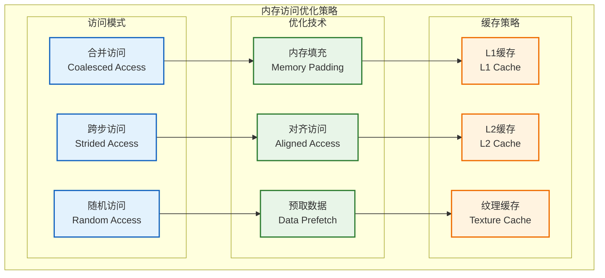

**数据传输流水线**：
- **双缓冲机制**：在GPU计算时准备下一批数据
- **异步传输**：使用异步内存拷贝重叠传输和计算
- **批量传输**：合并小数据传输减少调用开销
- **零拷贝优化**：对于频繁访问的数据使用零拷贝技术

---

## 9 错误处理设计

### 9.1 错误分类

| 类别           | 错误码示例                     | 描述                           | 恢复建议                                      |
| :------------- | :----------------------------- | :----------------------------- | :-------------------------------------------- |
| **可恢复错误** | `CUDA_ERROR_OUT_OF_MEMORY`     | GPU显存不足                    | 等待并重试、释放部分缓存、降低批处理大小      |
|                | `CUDA_ERROR_LAUNCH_TIMEOUT`    | Kernel执行超时                 | 检查是否存在死循环、减小计算负载后重试        |
| **致命错误**   | `CUDA_ERROR_UNKNOWN`           | 未知的驱动/硬件错误            | **上报`GPU_FATAL_ERROR`事件**，停止模块       |
|                | `CUDA_ERROR_ECC_UNCORRECTABLE` | GPU硬件ECC校验发现不可恢复错误 | **上报`GPU_FATAL_ERROR`事件**，停止模块并告警 |

### 9.2 恢复策略
模块的恢复策略遵循分级处理原则，以应对不同严重程度的错误。

1.  **内部恢复 (针对可恢复错误)**:
    *   当发生如`CUDA_ERROR_OUT_OF_MEMORY`等可恢复错误时，模块应尝试在内部解决。
    *   **策略**: 实现一个带退避机制的重试循环（e.g., 尝试3次，每次等待时间加倍）。若重试成功，则记录警告日志后继续运行。若重试全部失败，则将错误升级，按致命错误处理。

2.  **上报与关闭 (针对致命错误 - MVP核心策略)**:
    *   **适用场景**: 当发生无法通过内部重试解决的错误，或发生如`CUDA_ERROR_UNKNOWN`之类的硬件/驱动级别故障时。
    *   **策略**:
        1.  **立即停止**: 模块应立即停止接收和处理新的数据，以防数据损坏或产生连锁故障。
        2.  **记录上下文**: 记录包含当前`Trace ID`、模块状态和详细GPU错误信息的`FATAL`级别日志。
        3.  **上报事件**: 通过系统的事件总线，发布一个`GPU_FATAL_ERROR`事件。此事件应包含模块名称、错误码和时间戳。
        4.  **进入`Error`状态**: 模块将自身状态设置为`Error`，等待`任务调度器`的进一步指令（通常是关闭或重启）。
    *   **设计目标**: 这是**MVP阶段必须实现的核心策略**，确保单个模块的硬件故障不会导致整个系统崩溃。CPU降级等更复杂的策略作为远期规划。

3.  **降级处理 (远期规划)**:
    *   **适用场景**: V2.0及以后版本，当系统具备CPU备用算法时。
    *   **策略**: `任务调度器`在收到`GPU_FATAL_ERROR`事件后，可尝试将系统切换到“降级模式”，调度CPU资源来执行信号处理任务，同时向用户显示性能降级警告。

---

## 10 模块约束说明

**硬件约束**：
- 仅支持NVIDIA GPU，计算能力6.0或更高
- 最大GPU内存使用不超过75%
- CUDA核心使用率保持在80%以上
- 支持单GPU配置，预留多GPU扩展

**软件约束**：
- 依赖CUDA Toolkit 12.x环境
- 使用cuBLAS、cuFFT等CUDA库
- 算法实现限制在模拟级别
- 不支持动态算法加载

**性能约束**：
- 单次算法调用延迟 < 5ms
- 数据传输带宽利用率 > 70%
- GPU内存带宽利用率 > 80%
- 支持最大1GB/s数据吞吐量

**扩展约束**：
- 算法接口支持策略模式扩展
- GPU资源管理支持多设备扩展
- 内存管理器支持不同分配策略
- 不支持运行时算法热插拔

---

## 11 相关文档

- [数据接收模块设计](01_数据接收模块设计.md)
- [数据处理模块设计](03_数据处理模块设计.md)
- [任务调度器设计](05_任务调度器设计.md)
- [GPU资源管理](../03_并发与调度/05_GPU资源管理.md)
- [性能优化策略](../03_并发与调度/06_性能优化策略.md)

---

## 12 变更历史

| 版本   | 日期       | 作者    | 变更描述                                                                                                 |
| ------ | ---------- | ------- | -------------------------------------------------------------------------------------------------------- |
| v1.0.3 | 2025-09-23 | Copilot | 3.1 组件组织结构图改为纯功能分组视图，移除箭头/监控虚线；补充说明文字以统一图表语义。                    |
| v1.0.2 | 2025-09-23 | Kelin   | 增加了相关文档的链接和说明。                                                                             |
| v1.0.1 | 2025-09-23 | Kelin   | 修正模块职责架构图表：将不合理的组件箭头关系改为功能分组说明，确保图表正确表达分层设计而非直接依赖关系。 |
| v1.0.0 | 2025-09-23 | Kelin   | 基于MVP设计文档创建信号处理模块设计，包含完整的GPU计算架构和算法模拟器设计                               |

---

*本信号处理模块设计为雷达数据处理系统的高性能计算核心提供详细的架构指导，确保GPU资源的高效利用和算法的灵活扩展。*

