# 数据处理模块设计

**文档版本**: v1.1.1
**最后更新**: 2025-09-23
**负责人**: Kelin
**适用阶段**: MVP及向 V2.0 性能优化过渡阶段
**来源依据**: 基于《MVP系统设计文档》第5.3章数据处理模块和第2.2.1章详细组件架构

---

## 1 文档职责

本文件详细设计数据处理模块的内部架构和核心机制，侧重"基于信号处理输出进行目标级、轨迹级与多源融合、业务推断与管理"的高阶处理：
1) 检测后处理与目标聚合算法设计
2) 数据关联与跟踪算法架构
3) 目标分类识别与特征提取
4) 航迹管理与轨迹融合机制
5) 业务逻辑处理和决策支持
6) 模块内部组件协作和状态管理

已明确不在本文件范围内的内容：具体的算法实现代码、数学公式推导、外部接口定义、信号处理相关算法（如CFAR检测、FFT、滤波等）等（这些在相应的专项文档中维护）。

### 1.1 目录

- [数据处理模块设计](#数据处理模块设计)
  - [1 文档职责](#1-文档职责)
    - [1.1 目录](#11-目录)
  - [2 模块总体设计](#2-模块总体设计)
    - [2.1 模块职责定义](#21-模块职责定义)
    - [2.2 模块边界和约束](#22-模块边界和约束)
  - [3 内部架构设计](#3-内部架构设计)
    - [3.1 组件组织结构](#31-组件组织结构)
    - [3.2 组件职责分工](#32-组件职责分工)
    - [3.3 组件协作机制](#33-组件协作机制)
  - [4 检测后处理架构](#4-检测后处理架构)
    - [4.1 检测数据接收架构](#41-检测数据接收架构)
    - [4.2 检测后处理流程](#42-检测后处理流程)
    - [4.3 目标聚类策略](#43-目标聚类策略)
  - [5 数据关联设计](#5-数据关联设计)
    - [5.1 关联算法架构](#51-关联算法架构)
    - [5.2 航迹初始化策略](#52-航迹初始化策略)
  - [6 跟踪管理设计](#6-跟踪管理设计)
    - [6.1 状态估计架构](#61-状态估计架构)
    - [6.2 航迹生命周期管理](#62-航迹生命周期管理)
  - [7 业务处理设计](#7-业务处理设计)
    - [7.1 目标分类架构](#71-目标分类架构)
    - [7.2 事件处理机制](#72-事件处理机制)
  - [8 算法演进规划](#8-算法演进规划)
  - [9 模块约束说明](#9-模块约束说明)
  - [10 相关文档](#10-相关文档)
  - [11 变更历史](#11-变更历史)

---

## 2 模块总体设计

### 2.1 模块职责定义

数据处理模块作为系统的业务核心，承担从信号特征到目标轨迹的高级数据处理职责：

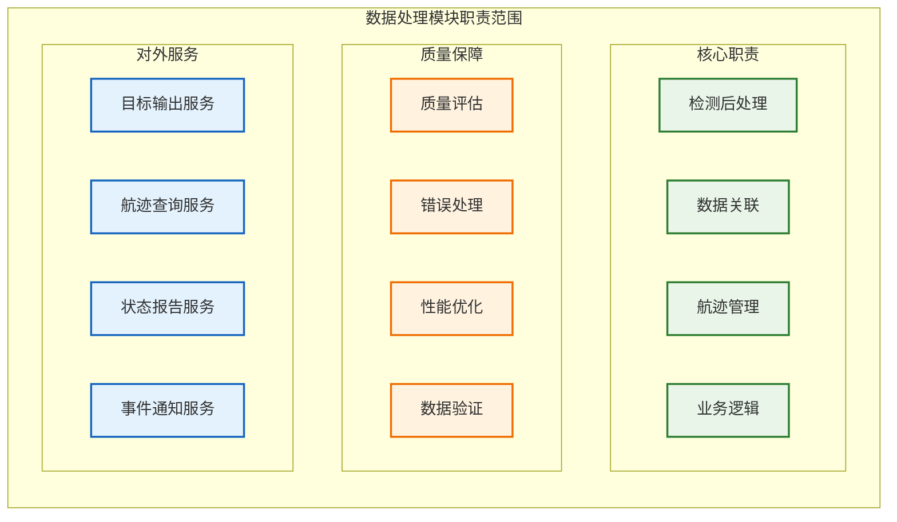

### 2.2 模块边界和约束

**输入边界**：
- 信号处理模块传输的CFAR检测结果（通过环形缓冲区B）
- 任务调度器的处理任务和优先级指令
- 配置管理器的算法参数和业务规则

**输出边界**：
- 目标轨迹和状态信息（推送到显示控制模块）
- 业务事件和告警信息
- 处理统计和质量指标

**性能约束**：
- 单帧数据处理延迟 < 10ms
- 最大支持同时跟踪 1000 个目标
- 数据关联准确率 > 95%
- 航迹连续性保持率 > 90%

**技术约束**：
- 采用串行处理保证时序一致性
- 支持多种跟踪算法的策略切换
- 内存使用不超过2GB
- 支持历史数据回溯分析

---

## 3 内部架构设计

### 3.1 组件组织结构

数据处理模块采用五层分层处理架构。下图为“功能分组视图”，仅表达层次与职责集合，不代表严格调用顺序或数据流；处理协作、时序与算法流水线请参见 3.3、4.x、5.x 相关序列与流程图：

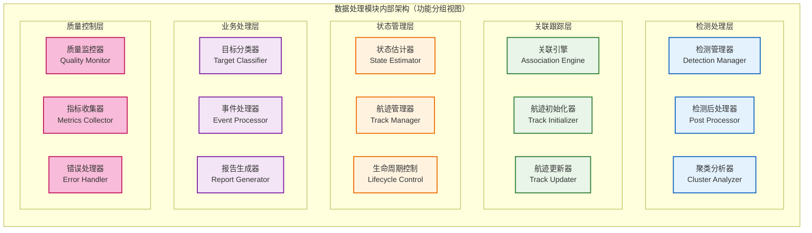
> 注：执行/数据流顺序详见 3.3 协作序列及 4.x、5.x 流程/架构章节

**组件架构说明**：数据处理模块采用五层处理架构，按照数据流向组织：
- **检测处理层**：负责原始检测数据的后处理、噪声滤除和聚类分析
- **关联跟踪层**：执行数据关联算法、航迹初始化和状态更新
- **状态管理层**：进行目标状态估计、航迹管理和生命周期控制
- **业务处理层**：执行目标分类、事件处理和报告生成
- **质量控制层**：提供全流程的质量监控、指标收集和错误处理

各层之间通过标准化的数据接口进行交互，确保处理流程的模块化和可扩展性。

### 3.2 组件职责分工

| 组件名称         | 主要职责             | 关键功能               | 性能特征       |
| ---------------- | -------------------- | ---------------------- | -------------- |
| **检测管理器**   | 检测数据接收和分发   | 数据预处理、质量筛选   | 高吞吐量处理   |
| **检测后处理器** | 检测数据后处理和优化 | NMS滤波、质量评估      | 实时后处理算法 |
| **聚类分析器**   | 检测点聚类和合并     | 空间聚类、时间关联     | 几何计算优化   |
| **关联引擎**     | 检测与航迹数据关联   | 最近邻算法、全局关联   | 复杂度优化     |
| **航迹初始化器** | 新航迹的创建和初始化 | 多点初始化、可信度评估 | 快速响应       |
| **航迹更新器**   | 既有航迹的状态更新   | 卡尔曼滤波、状态预测   | 数值稳定性     |
| **状态估计器**   | 目标状态估计和预测   | 滤波算法、不确定性处理 | 估计精度       |
| **航迹管理器**   | 航迹生命周期管理     | 航迹维护、存储管理     | 内存效率       |
| **目标分类器**   | 目标类型识别和分类   | 特征提取、分类决策     | 分类准确率     |
| **事件处理器**   | 业务事件检测和处理   | 规则引擎、事件触发     | 实时事件响应   |

### 3.3 组件协作机制

组件间通过明确的协作模式实现高效的数据处理流程：

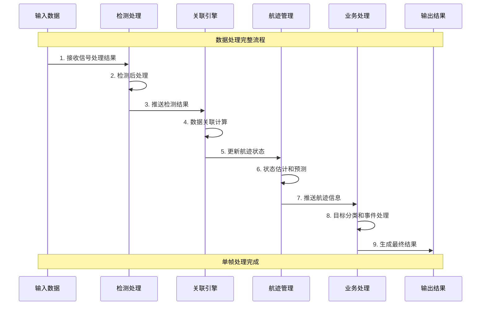

---

## 4 检测后处理架构

### 4.1 检测数据接收架构

检测数据接收是数据处理模块的第一个环节，负责从信号处理模块接收CFAR检测结果并进行初步处理：

```mermaid
flowchart TB
    subgraph "检测数据接收架构"
        direction TB

        subgraph "数据接收层"
            SIGNAL_INPUT[检测结果输入<br/>Detection Input]
            DATA_VALIDATE[数据验证<br/>Data Validation]
            FORMAT_CONVERT[格式转换<br/>Format Conversion]
        end

        subgraph "质量评估层"
            SNR_CHECK[信噪比检查<br/>SNR Check]
            CONFIDENCE_EVAL[置信度评估<br/>Confidence Evaluation]
            OUTLIER_FILTER[异常值滤波<br/>Outlier Filter]
        end

        subgraph "数据增强层"
            COORD_TRANSFORM[坐标变换<br/>Coordinate Transform]
            TIME_SYNC[时间同步<br/>Time Synchronization]
            DATA_NORMALIZE[数据归一化<br/>Data Normalization]
        end

        subgraph "输出缓存层"
            BUFFER_MANAGE[缓存管理<br/>Buffer Management]
            PRIORITY_QUEUE[优先级队列<br/>Priority Queue]
            BATCH_PREPARE[批次准备<br/>Batch Preparation]
        end

        %% 处理流程
        SIGNAL_INPUT --> DATA_VALIDATE
        DATA_VALIDATE --> FORMAT_CONVERT
        FORMAT_CONVERT --> SNR_CHECK

        SNR_CHECK --> CONFIDENCE_EVAL
        CONFIDENCE_EVAL --> OUTLIER_FILTER
        OUTLIER_FILTER --> COORD_TRANSFORM

        COORD_TRANSFORM --> TIME_SYNC
        TIME_SYNC --> DATA_NORMALIZE
        DATA_NORMALIZE --> BUFFER_MANAGE

        BUFFER_MANAGE --> PRIORITY_QUEUE
        PRIORITY_QUEUE --> BATCH_PREPARE
    end

    classDef receive fill:#e3f2fd,stroke:#1565c0,stroke-width:2px
    classDef quality fill:#e8f5e8,stroke:#2e7d32,stroke-width:2px
    classDef enhance fill:#fff3e0,stroke:#ef6c00,stroke-width:2px
    classDef output fill:#f8bbd9,stroke:#c2185b,stroke-width:2px

    class SIGNAL_INPUT,DATA_VALIDATE,FORMAT_CONVERT receive
    class SNR_CHECK,CONFIDENCE_EVAL,OUTLIER_FILTER quality
    class COORD_TRANSFORM,TIME_SYNC,DATA_NORMALIZE enhance
    class BUFFER_MANAGE,PRIORITY_QUEUE,BATCH_PREPARE output
```

**架构说明**：该架构接收信号处理模块输出的CFAR检测结果，通过四层处理确保数据质量：数据接收层负责基础验证和格式转换，质量评估层过滤低质量检测，数据增强层进行坐标和时间标准化，输出缓存层为后续处理准备数据批次。

### 4.2 检测后处理流程

检测后处理确保从信号处理模块接收的检测结果的质量和可靠性：

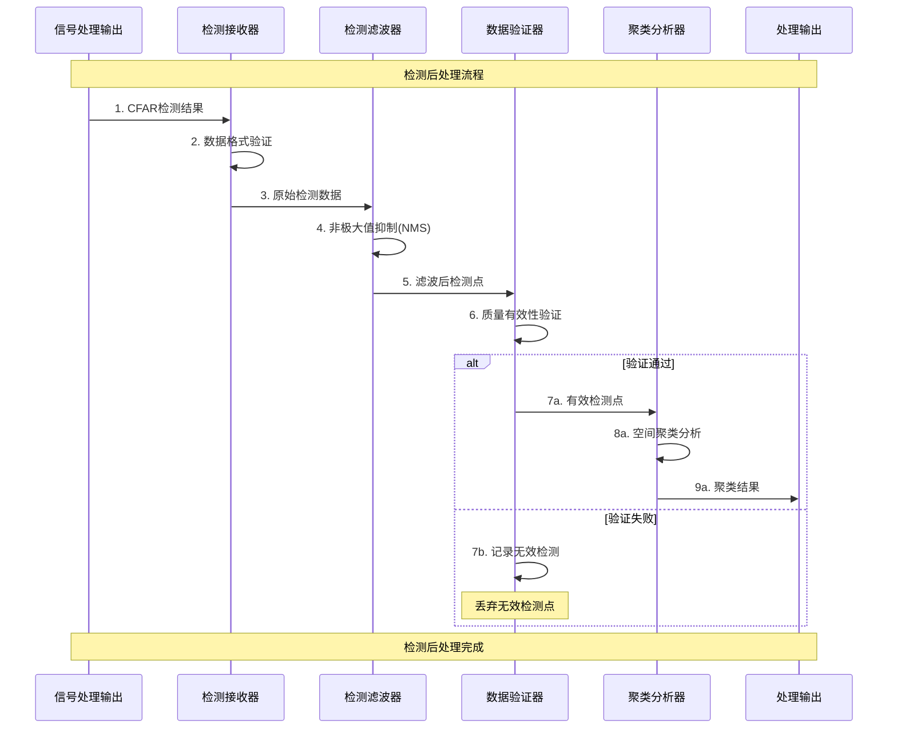

**流程说明**：该流程接收信号处理模块的CFAR检测结果，通过接收验证、NMS滤波、质量验证和空间聚类四个阶段，将原始检测点转换为高质量的目标候选，为后续数据关联提供可靠输入。

### 4.3 目标聚类策略

目标聚类将分散的检测点合并为连贯的目标候选，是检测后处理的关键环节：

```mermaid
graph TB
    subgraph "目标聚类策略"
        direction TB

        subgraph "空间聚类"
            SPATIAL_DISTANCE[空间距离<br/>Spatial Distance]
            DENSITY_CLUSTER[密度聚类<br/>Density Clustering]
            GEOMETRIC_CONSTRAINT[几何约束<br/>Geometric Constraint]
        end

        subgraph "时间关联"
            TEMPORAL_WINDOW[时间窗口<br/>Temporal Window]
            MOTION_PREDICT[运动预测<br/>Motion Prediction]
            VELOCITY_CONSTRAINT[速度约束<br/>Velocity Constraint]
        end

        subgraph "聚类优化"
            CLUSTER_MERGE[聚类合并<br/>Cluster Merge]
            CLUSTER_SPLIT[聚类分割<br/>Cluster Split]
            CENTROID_CALC[质心计算<br/>Centroid Calculation]
        end

        subgraph "质量评估"
            CLUSTER_QUALITY[聚类质量<br/>Cluster Quality]
            CONFIDENCE_SCORE[置信度评分<br/>Confidence Score]
            OUTLIER_DETECT[异常点检测<br/>Outlier Detection]
        end

        %% 聚类流程
        SPATIAL_DISTANCE --> DENSITY_CLUSTER
        DENSITY_CLUSTER --> GEOMETRIC_CONSTRAINT
        GEOMETRIC_CONSTRAINT --> TEMPORAL_WINDOW

        TEMPORAL_WINDOW --> MOTION_PREDICT
        MOTION_PREDICT --> VELOCITY_CONSTRAINT
        VELOCITY_CONSTRAINT --> CLUSTER_MERGE

        CLUSTER_MERGE --> CLUSTER_SPLIT
        CLUSTER_SPLIT --> CENTROID_CALC
        CENTROID_CALC --> CLUSTER_QUALITY

        CLUSTER_QUALITY --> CONFIDENCE_SCORE
        CONFIDENCE_SCORE --> OUTLIER_DETECT
    end

    classDef spatial fill:#e3f2fd,stroke:#1565c0,stroke-width:2px
    classDef temporal fill:#e8f5e8,stroke:#2e7d32,stroke-width:2px
    classDef optimize fill:#fff3e0,stroke:#ef6c00,stroke-width:2px
    classDef quality fill:#f8bbd9,stroke:#c2185b,stroke-width:2px

    class SPATIAL_DISTANCE,DENSITY_CLUSTER,GEOMETRIC_CONSTRAINT spatial
    class TEMPORAL_WINDOW,MOTION_PREDICT,VELOCITY_CONSTRAINT temporal
    class CLUSTER_MERGE,CLUSTER_SPLIT,CENTROID_CALC optimize
    class CLUSTER_QUALITY,CONFIDENCE_SCORE,OUTLIER_DETECT quality
```

**策略说明**：该聚类策略采用四层处理架构：空间聚类基于距离和密度进行初步聚合，时间关联考虑目标运动特性，聚类优化处理边界情况和质心计算，质量评估确保聚类结果的可靠性和置信度。

---

## 5 数据关联设计

### 5.1 关联算法架构

数据关联是连接检测和航迹的关键环节，采用多层次关联策略：

```mermaid
flowchart TB
    subgraph "关联算法架构"
        direction TB

        subgraph "预处理层"
            DETECTION_INPUT[检测输入<br/>Detection Input]
            TRACK_PREDICTION[航迹预测<br/>Track Prediction]
            GATING_TEST[波门测试<br/>Gating Test]
        end

        subgraph "关联计算层"
            DISTANCE_CALC[距离计算<br/>Distance Calculation]
            COST_MATRIX[代价矩阵<br/>Cost Matrix]
            ASSIGNMENT_ALGO[分配算法<br/>Assignment Algorithm]
        end

        subgraph "决策优化层"
            GLOBAL_OPTIMIZE[全局优化<br/>Global Optimization]
            CONFLICT_RESOLVE[冲突解决<br/>Conflict Resolution]
            ASSOCIATION_RESULT[关联结果<br/>Association Result]
        end

        subgraph "质量控制层"
            ASSOCIATION_VALID[关联验证<br/>Association Validation]
            UNCERTAINTY_HANDLE[不确定性处理<br/>Uncertainty Handling]
            FEEDBACK_UPDATE[反馈更新<br/>Feedback Update]
        end

        %% 关联流程
        DETECTION_INPUT --> TRACK_PREDICTION
        TRACK_PREDICTION --> GATING_TEST
        GATING_TEST --> DISTANCE_CALC

        DISTANCE_CALC --> COST_MATRIX
        COST_MATRIX --> ASSIGNMENT_ALGO
        ASSIGNMENT_ALGO --> GLOBAL_OPTIMIZE

        GLOBAL_OPTIMIZE --> CONFLICT_RESOLVE
        CONFLICT_RESOLVE --> ASSOCIATION_RESULT
        ASSOCIATION_RESULT --> ASSOCIATION_VALID

        ASSOCIATION_VALID --> UNCERTAINTY_HANDLE
        UNCERTAINTY_HANDLE --> FEEDBACK_UPDATE
    end

    classDef preprocess fill:#e3f2fd,stroke:#1565c0,stroke-width:2px
    classDef calculation fill:#e8f5e8,stroke:#2e7d32,stroke-width:2px
    classDef optimization fill:#fff3e0,stroke:#ef6c00,stroke-width:2px
    classDef quality fill:#f8bbd9,stroke:#c2185b,stroke-width:2px

    class DETECTION_INPUT,TRACK_PREDICTION,GATING_TEST preprocess
    class DISTANCE_CALC,COST_MATRIX,ASSIGNMENT_ALGO calculation
    class GLOBAL_OPTIMIZE,CONFLICT_RESOLVE,ASSOCIATION_RESULT optimization
    class ASSOCIATION_VALID,UNCERTAINTY_HANDLE,FEEDBACK_UPDATE quality
```

**架构说明**：关联算法采用分层处理策略：预处理层进行检测预测和波门筛选，关联计算层构建代价矩阵并执行分配算法，决策优化层进行全局优化和冲突解决，质量控制层验证关联结果并处理不确定性。

### 5.2 航迹初始化策略

航迹初始化处理新目标的发现和航迹建立：

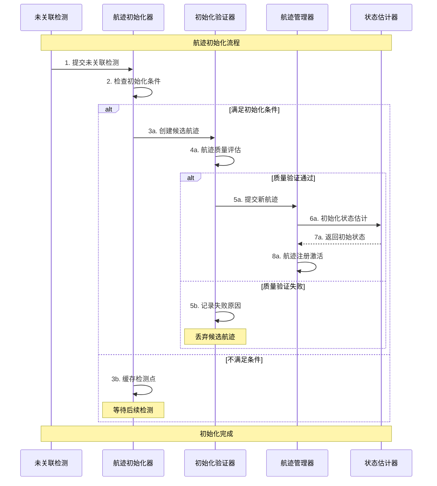

---

## 6 跟踪管理设计

### 6.1 状态估计架构

状态估计是跟踪算法的核心，采用多模型滤波架构：

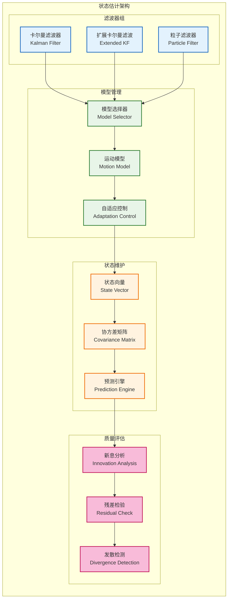

**架构说明**：状态估计采用多模型滤波架构：滤波器组提供不同复杂度的估计算法，模型管理处理运动模型选择和自适应控制，状态维护管理状态向量和协方差矩阵，质量评估通过新息分析和残差检验确保估计质量。

### 6.2 航迹生命周期管理

航迹生命周期管理控制航迹从创建到删除的完整过程：

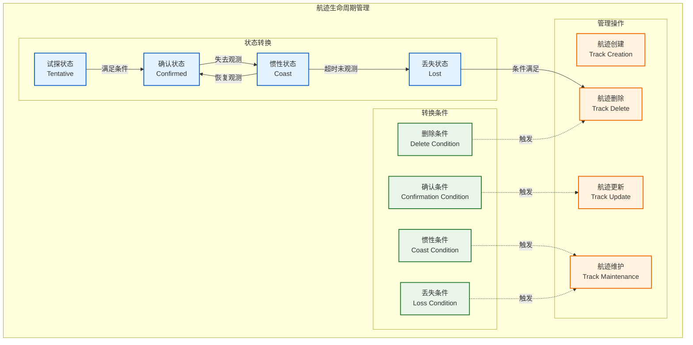

**管理说明**：航迹生命周期管理通过状态机模式控制航迹从创建到删除的完整过程：试探状态用于新航迹验证，确认状态表示稳定跟踪，惯性状态处理临时丢失，丢失状态等待删除条件。各状态间的转换由明确的条件触发，确保航迹管理的规范性和可靠性。

---

## 7 业务处理设计

### 7.1 目标分类架构

目标分类为航迹添加语义信息，支持业务决策：

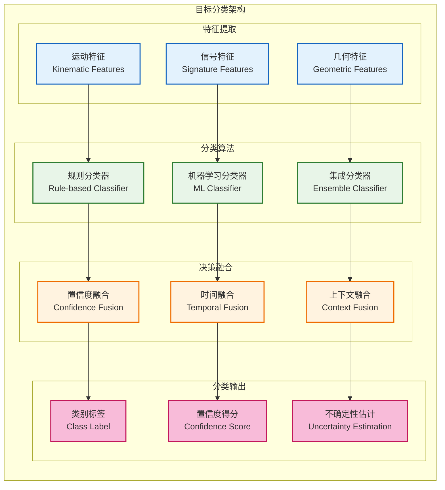

**架构说明**：目标分类采用多维特征融合架构：特征提取层从多个维度提取目标特征，分类算法层使用不同算法进行分类决策，决策融合层综合多种信息源提高分类准确性，分类输出层提供分类标签、置信度和不确定性评估。该架构支持从简单规则到复杂机器学习的渐进式算法演进。

### 7.2 事件处理机制

事件处理机制检测和响应重要的业务事件：

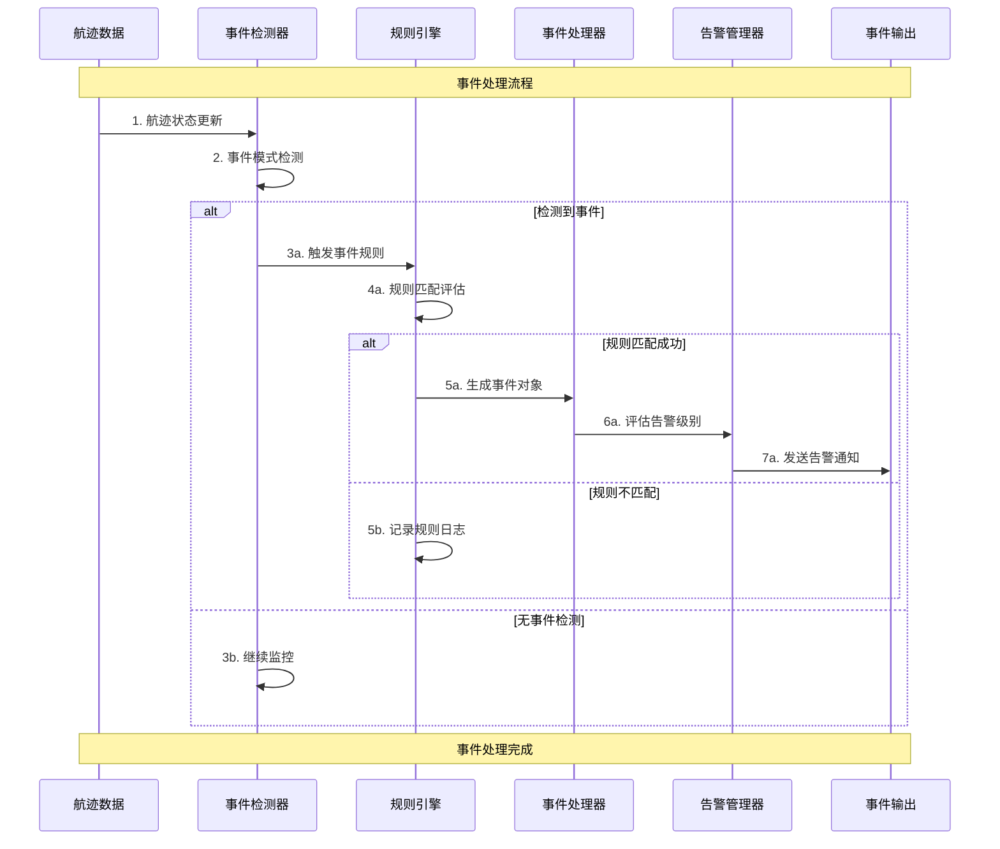

---

## 8 算法演进规划

数据处理模块的算法演进路线图，从MVP验证到生产就绪：

| 阶段         | 版本 | 主要算法                              | 实现特征           | 适用场景           |
| ------------ | ---- | ------------------------------------- | ------------------ | ------------------ |
| **MVP验证**  | v1.0 | NMS后处理、最近邻关联、线性卡尔曼滤波 | 基础实现、功能验证 | 系统验证、概念证明 |
| **基础功能** | v2.0 | 自适应后处理、匈牙利算法、扩展卡尔曼  | 标准算法、性能优化 | 基本业务需求       |
| **增强处理** | v3.0 | 智能聚类、JPDA关联、IMM滤波           | 鲁棒算法、复杂场景 | 复杂环境、多目标   |
| **智能处理** | v4.0 | 机器学习后处理、深度关联、智能分类    | AI增强、自适应学习 | 智能化应用         |
| **完整系统** | v5.0 | 端到端深度学习、强化学习优化          | 全栈AI、生产级性能 | 生产部署、商业应用 |

**算法演进策略**：
- **接口兼容**：新版本算法保持接口向后兼容
- **渐进替换**：支持新旧算法并存和逐步切换
- **性能对比**：建立算法性能基准和对比机制
- **A/B测试**：支持不同算法的并行测试和评估

---

## 9 模块约束说明

**功能约束**：
- MVP阶段采用简化算法，重点验证架构可行性
- 支持最大1000个同时跟踪目标
- 航迹历史数据保留时间限制为1小时
- 目标分类限制为基本类型（飞机、船舶、车辆等）

**性能约束**：
- 单帧处理延迟不超过10ms
- 内存使用不超过2GB
- 数据关联准确率目标为95%
- 航迹连续性保持率目标为90%

**算法约束**：
- 后处理算法限制为NMS和简单聚类
- 关联算法限制为最近邻和匈牙利算法
- 滤波算法限制为线性和扩展卡尔曼滤波
- 分类算法限制为基于规则的简单分类

**扩展约束**：
- 算法接口支持策略模式替换
- 支持多种运动模型的灵活配置
- 预留机器学习算法集成接口
- 支持分布式处理架构扩展

---

## 10 相关文档

- [数据接收模块设计](01_数据接收模块设计.md)
- [信号处理模块设计](02_信号处理模块设计.md)
- [显控接口模块设计](04_显控接口模块设计.md)
- [任务调度器设计](05_任务调度器设计.md)
- [数据流设计](../04_数据架构/01_数据流设计.md)

---

## 11 变更历史

| 版本   | 日期       | 作者    | 变更描述                                                                                                                                             |
| ------ | ---------- | ------- | ---------------------------------------------------------------------------------------------------------------------------------------------------- |
| v1.1.1 | 2025-09-23 | Copilot | 3.1 图添加功能分组视图说明与注释，统一图表语义（不表示调用/数据流）。                                                                                |
| v1.1.0 | 2025-09-23 | Kelin   | 优化算法架构图表：采用任务调度器的分组表示法重构组件组织结构图，移除箭头关系，增强架构清晰度和可读性                                                 |
| v1.0.2 | 2025-09-23 | Kelin   | 修正模块职责架构图表：将不合理的组件箭头关系改为功能分组说明，确保图表正确表达分层设计而非直接依赖关系。                                             |
| v1.0.1 | 2025-09-23 | Kelin   | 修正模块职责边界：将CFAR实现从数据处理移除并作为信号处理输入；更新检测后处理说明、目录锚点与图示说明；调整算法演进版本编号并修正文档内部引用一致性。 |
| v1.0.0 | 2025-09-23 | Copilot | 基于MVP设计文档创建数据处理模块设计，包含完整的目标检测、关联跟踪和业务处理架构                                                                      |

---

*本数据处理模块设计为雷达数据处理系统的业务核心提供详细的架构指导，确保从CFAR检测结果到目标轨迹的高效转换和业务价值实现。*
