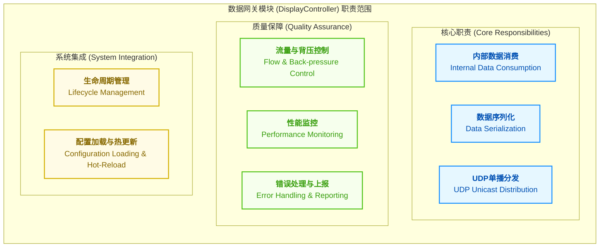
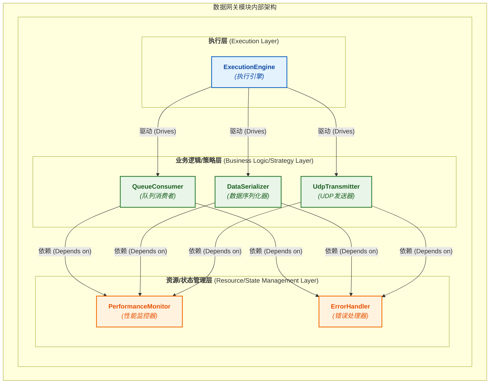
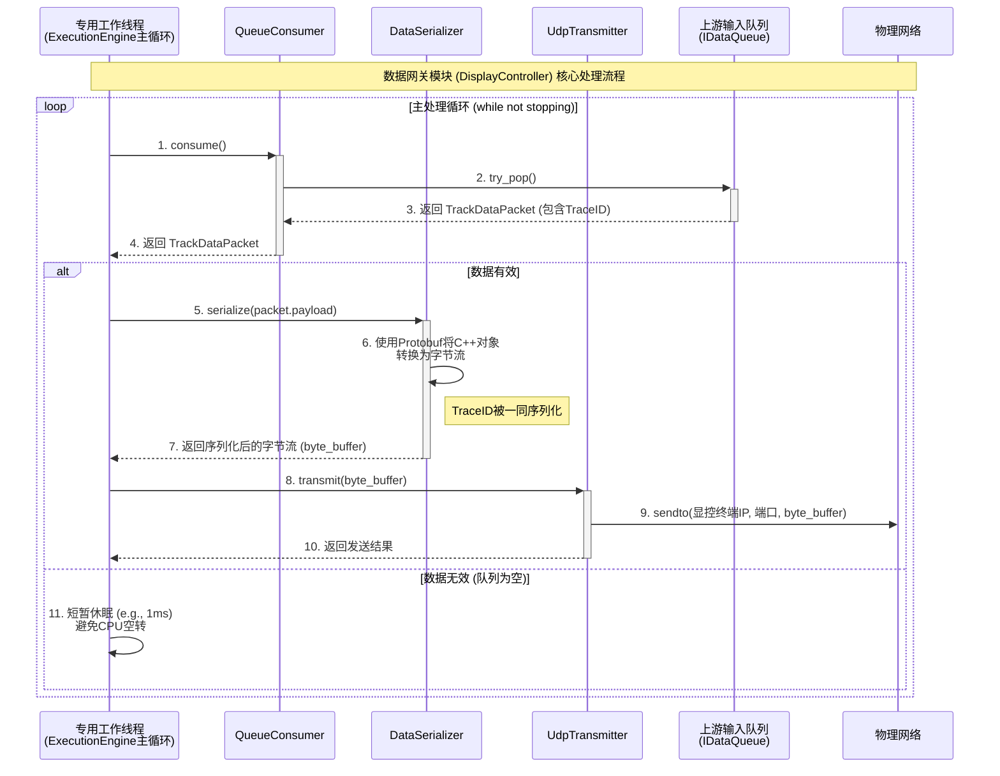
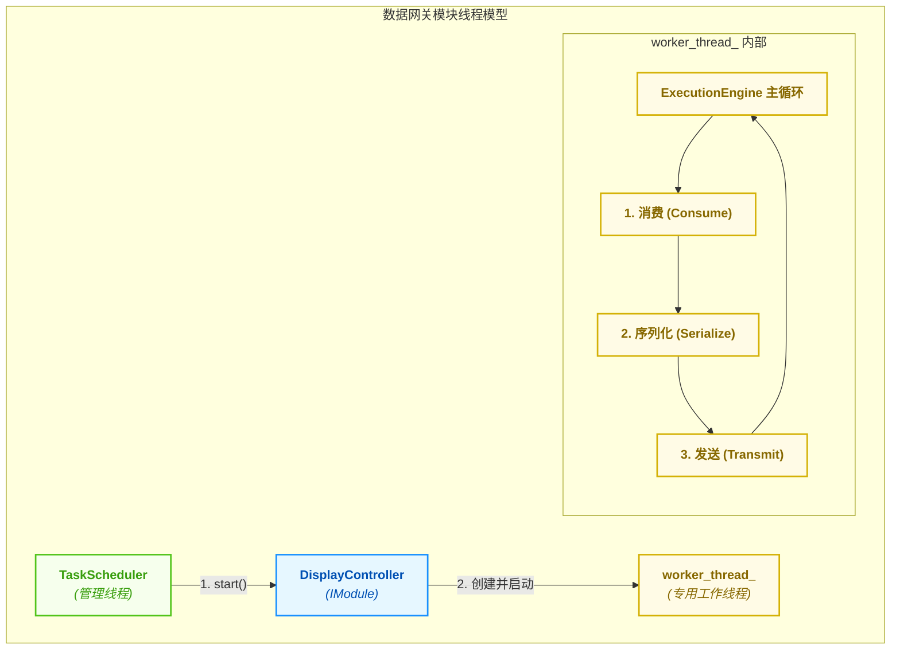
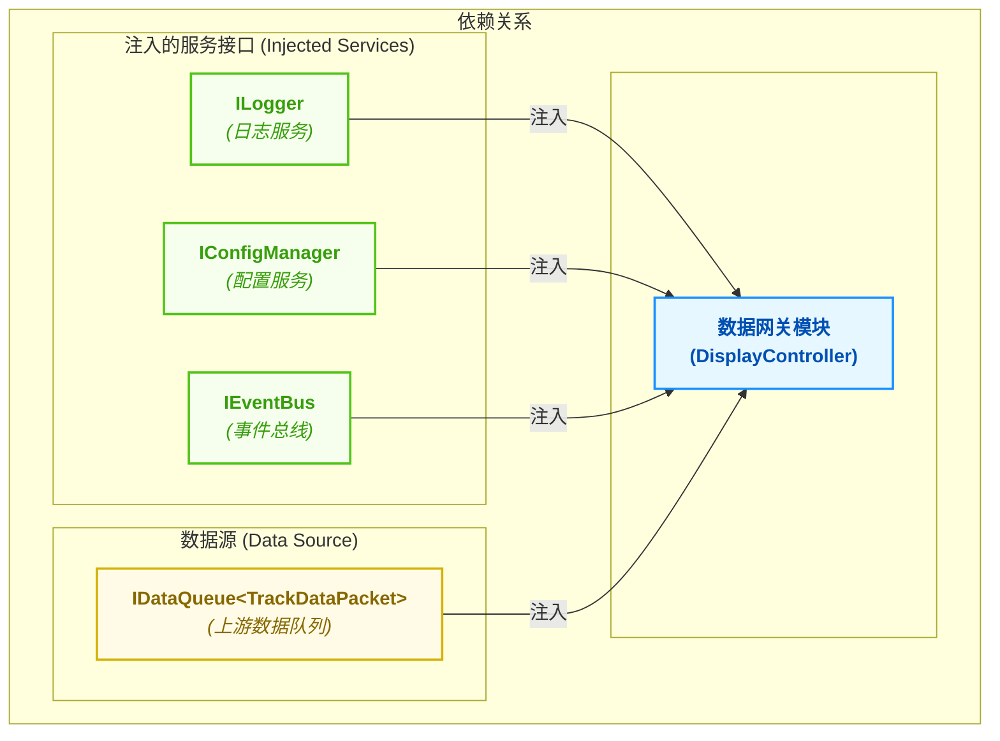

# 04_数据网关模块 (DisplayController) 设计.md

**文档版本**: v3.0.0
**最后更新**: 2025-09-28
**负责人**: Klein

---

## 0\. 目录 (Table of Contents)

- [04\_数据网关模块 (DisplayController) 设计.md](#04_数据网关模块-displaycontroller-设计md)
  - [0. 目录 (Table of Contents)](#0-目录-table-of-contents)
  - [1. 文档职责](#1-文档职责)
    - [1.1. 文档目标与范围](#11-文档目标与范围)
    - [1.2. 核心原则对齐](#12-核心原则对齐)
  - [2. 模块总体设计](#2-模块总体设计)
    - [2.1. 模块职责定义](#21-模块职责定义)
    - [2.2. 模块边界与接口](#22-模块边界与接口)
    - [2.3. 关键性能指标 (Key Performance Indicators - KPIs)](#23-关键性能指标-key-performance-indicators---kpis)
  - [3. 内部架构设计](#3-内部架构设计)
    - [3.1. 逻辑架构与组件划分](#31-逻辑架构与组件划分)
    - [3.2. 核心组件职责](#32-核心组件职责)
    - [3.3. 核心数据流与协作](#33-核心数据流与协作)
  - [4. 核心机制深度设计](#4-核心机制深度设计)
    - [4.1. 数据序列化机制](#41-数据序列化机制)
      - [4.1.1. 序列化格式选型](#411-序列化格式选型)
      - [4.1.2. 数据模式定义 (Schema Definition)](#412-数据模式定义-schema-definition)
    - [4.2. UDP 单播通信机制](#42-udp-单播通信机制)
      - [4.2.1. 套接字管理与配置](#421-套接字管理与配置)
      - [4.2.2. 发送逻辑与错误处理](#422-发送逻辑与错误处理)
    - [4.3. 流量与背压控制](#43-流量与背压控制)
  - [5. 关键横切关注点](#5-关键横切关注点)
    - [5.1. 并发与线程模型](#51-并发与线程模型)
    - [5.2. 错误处理与恢复策略](#52-错误处理与恢复策略)
    - [5.3. 性能优化考量](#53-性能优化考量)
  - [6. 模块集成与配置](#6-模块集成与配置)
    - [6.1. 生命周期管理](#61-生命周期管理)
    - [6.2. 依赖关系](#62-依赖关系)
    - [6.3. 模块配置项 (`config.yaml`)](#63-模块配置项-configyaml)
  - [7. 模块约束与未来演进](#7-模块约束与未来演进)
    - [7.1. 实现约束](#71-实现约束)
    - [7.2. MVP功能范围](#72-mvp功能范围)
    - [7.3. 未来演进规划](#73-未来演进规划)
  - [8. 术语表](#8-术语表)
  - [9. 相关文档](#9-相关文档)
  - [10. 变更历史](#10-变更历史)

-----

## 1\. 文档职责

### 1.1. 文档目标与范围

  - **概要**: 本文件旨在详细设计**数据网关模块** (`DisplayController`) 的内部架构和核心机制。在系统最新的分布式架构下，该模块的角色已从一个集成UI的组件，演变为一个纯粹的\*\*“无头”后端服务\*\*。其核心使命是作为核心处理服务器的**数据出口**，负责将内部处理完成的高价值数据（如`TrackData`），安全、高效地通过网络分发给外部的独立显控终端。本文档是实现服务器与客户端物理分离部署的关键技术规范。

本文件的核心目标在于：

  * **定义角色**: 明确`DisplayController`作为“数据网关”的新角色，它连接了系统内部的**数据面**与外部世界的**展示层**。
  * **规范协议**: 详细定义模块向外分发数据所使用的**网络协议**（UDP单播）和**数据序列化格式**。
  * **设计实现**: 提供一个健壮、高性能的内部实现蓝图，确保模块能够稳定地处理高吞吐量的数据流。
  * **阐明边界**: 清晰界定模块的职责范围，它**只负责数据的“发送”**，而不关心“显示”，后者完全由独立的显控终端应用负责。

### 1.2. 核心原则对齐

  - **概要**: 本模块的设计是**数据与控制分离**原则的典范。它作为**数据面**的最后一环，专注于高效的数据序列化和网络传输；而与之配套的**控制面**交互（如启动/停止、配置下发）则完全由`02_外部接口设计.md`中定义的RESTful API负责。

| 核心原则 | 在本规范中的具体体现 |
| :--- | :--- |
| **数据与控制分离**<br>*(Data/Control Plane Separation)* | **本模块是纯粹的数据面出口**。它从内部数据缓冲区（`IDataQueue`）消费`TrackData`，并通过UDP网络将其发送出去。所有对该模块的控制（如启停、获取其状态）都必须通过**控制面**的`TaskScheduler`或RESTful API进行，模块自身不承载任何控制逻辑。 |
| **事件驱动架构**<br>*(Event-Driven Architecture)* | **模块由事件驱动，但不直接处理业务事件**。`DisplayController`作为一个标准的`IModule`，其生命周期（启动/停止）完全由`TaskScheduler`通过事件协调。但它**不订阅**任何业务相关的事件（如`TrackCreatedEvent`），其数据源是上游模块推送的数据队列，保证了其职责的纯粹性。 |
| **接口隔离原则**<br>*(Interface Segregation Principle)* | **实现最小化接口集合**。本模块将实现`ILifecycleManaged` 和`IMonitorable` 等核心接口以融入系统管理。但它**不包含**任何与UI、用户交互相关的接口，其“显示”功能已被完全剥离。 |
| **全链路可观测性**<br>*(End-to-End Observability)* | **TraceID的终点站与新起点**。本模块消费的每一个`TrackDataPacket`都携带`TraceID`，使得我们可以追踪数据直至其离开服务器前的最后一刻。在将数据序列化并通过UDP发送时，`TraceID`也**必须**被包含在网络数据包中，从而将追踪链延伸至外部的显控终端。 |

---

## 2\. 模块总体设计

  - **概要**: 本章从最高层次描绘模块的蓝图，定义其在系统生态中的角色、输入输出和必须达成的性能目标。`DisplayController`作为连接内部处理核心与外部显示终端的桥梁，其设计的健壮性和高性能对整个系统的端到端表现至关重要。

### 2.1. 模块职责定义

  - **概要**: 数据网关模块的核心职责可以概括为“**承内启外**”，它扮演着内部数据格式与外部网络协议之间的“翻译官”和“快递员”。

<!-- end list -->



  * **内部数据消费**: 作为数据处理流水线的最后一环，它**消费**来自上游`DataProcessor`模块的`TrackDataPacket`。
  * **数据序列化**: 将内存中的C++ `TrackData`对象，**翻译**成适合网络传输的、平台无关的字节流格式（如Protobuf）。
  * **UDP单播分发**: 将序列化后的数据包，通过UDP**快递**到配置文件中指定的唯一显控终端地址。
  * **质量与集成**: 同时，它必须有效地处理流量控制，监控自身性能，并作为一个标准的`IModule` 融入系统的生命周期和配置管理体系。

### 2.2. 模块边界与接口

  - **概要**: 本节明确定义模块的输入、输出以及它在系统中的交互契约。

| 边界类型 | 交互对象 | 交互接口/数据 | 核心契约与说明 |
| :--- | :--- | :--- | :--- |
| **输入 (Inputs)** | `DataProcessor` | `IDataQueue<TrackDataPacket>` | **数据源**: 接收经过完整处理的`TrackDataPacket`。必须通过依赖注入获取此队列的消费者接口。 |
| | `TaskScheduler` | `IModule` (实现) | **生命周期控制**: 模块的`initialize`, `start`, `stop`等生命周期完全由`TaskScheduler`通过此接口进行管理。 |
| | `ConfigManager` | `IConfigManager` (注入) | **配置源**: 通过此接口获取自身的运行参数，如目标显控终端的IP和端口、序列化格式等。 |
| **输出 (Outputs)**| **独立显控终端** | UDP Socket | **数据出口**: 将序列化后的数据包通过UDP单播发送到指定网络地址。这是模块最核心的输出。 |
| | `MonitoringModule`| `MetricsUpdateEvent` | **性能上报**: 定期通过事件总线发布自身的性能指标（如发送速率、序列化延迟），以实现解耦的性能监控。 |
| | `TaskScheduler` | `ModuleFailedEvent` | **故障上报**: 当发生无法自我恢复的致命错误时（如网络端口无法绑定），通过事件总线向`TaskScheduler`上报故障。 |

### 2.3. 关键性能指标 (Key Performance Indicators - KPIs)

  - **概要**: 为确保数据网关模块不会成为系统瓶颈，并满足实时分发的需求，我们定义以下可量化的关键性能指标。

| KPI 指标 | 目标值 | 测量方法 | 重要性 |
| :--- | :--- | :--- | :--- |
| **序列化延迟** | **P99 \< 1ms** | 使用`cudaEvent`或高精度时钟，测量从接收`TrackData`到完成序列化的时间。 | **极高** |
| **网络发送吞吐量** | **\> 5000 packets/sec** | 内部计数器，测量每秒成功发送的UDP包数量。 | **高** |
| **端到端延迟** | **\< 2ms** | 测量从`IDataQueue`中取出数据包到数据通过Socket成功发出的总耗时。 | **高** |
| **CPU 资源占用率**| **\< 5% (单核)** | 通过`htop`或`perf`工具监控模块主线程的CPU占用。 | **中** |
| **内存占用** | **\< 128 MB** | 监控模块的常驻内存大小。 | **中** |

-----

## 3\. 内部架构设计

  - **概要**: 本章深入模块内部，展示其“五脏腑”——核心组件的划分、职责以及它们之间的协作方式。为满足高吞吐、低延迟的KPI要求，本模块采用**单向流水线 (Unidirectional Pipeline)** 并发模型，由一个专用的`ExecutionEngine`驱动，将数据消费、序列化和网络发送三个核心步骤彻底解耦。

### 3.1. 逻辑架构与组件划分

  - **概要**: 模块内部逻辑架构遵循项目统一的三层模型：**执行层**、**业务逻辑/策略层** 和 **资源/状态管理层**。这种分层确保了职责的清晰分离和模块的可扩展性。



  * **执行层 (Execution Layer)**: 模块的心脏。`ExecutionEngine`负责驱动整个数据处理流水线，管理模块的内部线程和主循环。
  * **业务逻辑/策略层 (Business Logic Layer)**: 模块的核心功能实现。它由三个松耦合的组件构成一条清晰的流水线：
    1.  `QueueConsumer`: 从上游`DataProcessor`的缓冲区**消费**`TrackDataPacket`。
    2.  `DataSerializer`: 将C++对象**序列化**为网络字节流。
    3.  `UdpTransmitter`: 将字节流通过UDP**发送**出去。
  * **资源/状态管理层 (Resource/State Management Layer)**: 提供横切关注点功能。`PerformanceMonitor`负责收集KPI指标，`ErrorHandler`负责统一的错误处理。

### 3.2. 核心组件职责

  - **概要**: 下表详细说明了`3.1`图中每个核心组件的具体职责、关键实现技术和设计决策，为开发人员提供清晰的实现指南。

| 组件名称 | 主要职责 | 关键设计点与实现策略 | 接口/交互 |
| :--- | :--- | :--- | :--- |
| **`ExecutionEngine`**<br>(执行引擎) | **流水线驱动器** | 1.  实现`IModule`接口，响应`TaskScheduler`的生命周期调用。<br>2.  内部维护一个**专用工作线程 (`worker_thread_`)**，运行主处理循环。<br>3.  在主循环中，依次调用`QueueConsumer`, `DataSerializer`, `UdpTransmitter`，形成单向数据流水线。<br>4.  负责所有组件的创建、配置和销毁。 | `IModule` (实现)<br>`ILogger` (注入)<br>`IConfigManager` (注入) |
| **`QueueConsumer`**<br>(队列消费者) | **数据源接入** | 1.  持有对上游`IDataQueue<TrackDataPacket>`的引用。<br>2.  在其`consume()`方法中，执行**非阻塞的`try_pop()`**，避免在队列为空时阻塞整个流水线。<br>3.  处理空数据情况（返回`std::nullopt`），让`ExecutionEngine`可以决定是短暂休眠还是继续循环（`spin-wait`）。 | `IDataQueue` (注入)<br>返回 `std::optional<TrackDataPacket>` |
| **`DataSerializer`**<br>(数据序列化器) | **数据格式翻译** | 1.  实现`ISerializer`策略接口，支持未来替换不同的序列化格式。<br>2.  **MVP阶段**：使用**Google Protobuf**作为序列化库，因其高性能和跨语言特性。<br>3.  `serialize()`方法接收`TrackData`对象，返回一个包含字节流的`std::vector<uint8_t>`或类似容器。<br>4.  **必须**将`TraceID`作为元数据的一部分序列化到数据包中。 | `ISerializer` (实现)<br>输入`TrackData`，输出字节流 |
| **`UdpTransmitter`**<br>(UDP发送器) | **网络数据发送** | 1.  在`initialize()`阶段创建并绑定UDP Socket。<br>2.  从配置中读取目标显控终端的IP地址和端口号。<br>3.  `transmit()`方法接收序列化后的字节流，并通过`sendto()`系统调用将其发送出去。<br>4.  处理网络发送错误（如`EPIPE`, `EAGAIN`），并记录统计信息。 | POSIX Socket API<br>输入字节流，无返回值 |
| **`PerformanceMonitor`**<br>(性能监控器) | **KPI测量** | 1.  使用高精度时钟 (`std::chrono::high_resolution_clock`) 测量流水线各阶段的耗时。<br>2.  维护原子计数器 (`std::atomic`)，用于统计发送包数、字节数和错误数。<br>3.  定期（如每秒）聚合这些指标，并封装成`MetricsUpdateEvent`发布到`EventBus`。 | `EventBus` (注入)<br>`ILogger` (注入) |

### 3.3. 核心数据流与协作

  - **概要**: 下面的序列图详细展示了一个`TrackDataPacket`在模块内部从被消费到被发送至网络的完整“Happy Path”生命周期。它清晰地揭示了流水线各组件之间如何通过`ExecutionEngine`进行协作。



**核心流程详解**:

1.  **消费 (Consume)**: `ExecutionEngine`在其工作线程的主循环中，首先调用`QueueConsumer::consume()`。`QueueConsumer`通过非阻塞的`try_pop()`从上游的`InputQueue`中尝试获取一个`TrackDataPacket`。
2.  **数据有效性判断**:
      * **如果成功获取**，数据包被返回给`ExecutionEngine`。
      * **如果队列为空**，`consume()`返回`std::nullopt`。`ExecutionEngine`会选择短暂休眠（例如1毫秒），以让出CPU，避免在空闲时产生不必要的资源消耗。
3.  **序列化 (Serialize)**: `ExecutionEngine`将有效的数据包负载（即`TrackData`对象）传递给`DataSerializer::serialize()`。`DataSerializer`使用Protobuf库将C++对象转换为紧凑的二进制字节流。**`TraceID`在此阶段被一同打包**，确保追踪链的延续。
4.  **传输 (Transmit)**: `ExecutionEngine`将序列化后的字节流交给`UdpTransmitter::transmit()`。`UdpTransmitter`通过操作系统底层的Socket API，将数据包作为一个UDP数据报发送到预先配置好的显控终端IP地址和端口。
5.  **循环**: 完成一次发送后，`ExecutionEngine`立即开始下一次循环，从第一步重新开始，从而形成一个持续不断的数据处理与分发流水线。

这个设计确保了每个组件职责单一，并通过`ExecutionEngine`这个中央协调者将它们高效地串联起来，形成了一个健壮、高性能的数据网关。

## 4\. 核心机制深度设计

  - **概要**: 本章是文档的**技术核心**，将针对该模块最关键、最复杂的两个技术点——**数据序列化**和**UDP网络通信**——进行深度剖析。这些机制的设计直接决定了模块能否达成其设定的KPI。

### 4.1. 数据序列化机制

  - **概要**: 这是本模块的核心“翻译”功能。本节将详细定义数据在跨越进程边界前，如何从C++内存对象高效、可靠地转换为与平台无关的网络字节流。

#### 4.1.1. 序列化格式选型

  - **概要**: 序列化格式的选择是一个关键的技术决策，它直接影响**性能、跨语言能力和未来的可扩展性**。我们对几种主流方案进行评估和对比。

| 评估维度 | Google Protobuf (推荐) | JSON | 自定义二进制 |
| :--- | :--- | :--- | :--- |
| **性能/效率** | **极高** (二进制编码, 紧凑) | **低** (文本格式, 冗余) | **最高** (理论最优) |
| **跨语言支持** | **优秀** (官方支持 C++, Python, C\# 等) | **极好** (所有语言都支持) | **差** (需为每种语言手写解析器) |
| **模式演进 (Schema)**| **优秀** (向后兼容的字段增删) | **一般** (无内置模式, 需外部约定) | **差** (模式变更极其脆弱) |
| **开发与维护成本**| **低** (自动生成代码, 格式清晰) | **极低** (可读性好) | **极高** (需要手写和维护解析代码) |

> **设计决策**:
> 综合考虑，**最终选择 Google Protobuf** 作为序列化格式。它在性能、跨语言支持和模式演进能力上取得了最佳平衡，完美契合我们高性能、可扩展的系统需求。虽然自定义二进制理论性能最高，但其带来的巨大开发和维护成本在本项目中是不可接受的。

#### 4.1.2. 数据模式定义 (Schema Definition)

  - **概要**: 以下是用于网络传输的`TrackData`消息的`.proto`文件定义。这份文件是服务器（数据网关）与客户端（显控终端）之间的**数据契约**。

```protobuf
// File: track_data.proto
syntax = "proto3";

package radar.ipc;

// 用于网络传输的单个航迹对象
message TrackDataMessage {
  // 核心标识符
  uint64 track_id = 1;
  string trace_id = 2; // 全链路追踪ID，必须传递

  // 航迹状态
  enum TrackStatus {
    TENTATIVE = 0;
    CONFIRMED = 1;
    COAST = 2;
  }
  TrackStatus status = 3;

  // 运动学信息
  message Position {
    double x = 1; // X坐标 (米)
    double y = 2; // Y坐标 (米)
    double z = 3; // Z坐标 (米)
  }
  Position position = 4;

  message Velocity {
    double vx = 1; // X方向速度 (米/秒)
    double vy = 2; // Y方向速度 (米/秒)
    double vz = 3; // Z方向速度 (米/秒)
  }
  Velocity velocity = 5;

  // 预留字段，用于未来扩展
  // ...
}

// UDP数据包中包含的航迹批次
message TrackDataBatch {
  uint64 batch_sequence_id = 1; // 批次序列号，用于客户端检测丢包
  uint64 timestamp_ns = 2;      // 批次生成时间戳 (纳秒, UTC)

  repeated TrackDataMessage tracks = 3; // 包含零个或多个航迹
}
```

### 4.2. UDP 单播通信机制

  - **概要**: 本节详细描述模块如何管理网络通信，确保数据发送的高效性。

#### 4.2.1. 套接字管理与配置

  - **概要**: `UdpTransmitter`组件负责UDP套接字的完整生命周期管理。
    1.  **初始化 (`initialize`)**:
          * 从`ConfigManager`获取目标显控终端的IP地址 (`target_ip`) 和端口 (`target_port`)。
          * 创建UDP套接字 (`socket(AF_INET, SOCK_DGRAM, 0)`)。
          * **关键**: 设置套接字为**非阻塞模式**，以避免`sendto`调用意外阻塞`ExecutionEngine`的工作线程。
          * (可选优化) 调用`setsockopt`调整内核发送缓冲区大小 (`SO_SNDBUF`)，以匹配我们的高吞吐量需求。
    2.  **清理 (`cleanup`)**:
          * 安全地关闭套接字句柄 (`close(socket_fd)`)。

#### 4.2.2. 发送逻辑与错误处理

  - **概要**: `UdpTransmitter::transmit()`方法是网络发送的核心。
      * **调用**: 接收`DataSerializer`生成的字节流。
      * **执行**: 调用`sendto()`将字节流作为单个UDP数据报发送到配置的目标地址。
      * **错误处理**:
          * **正常情况**: `sendto`返回发送的字节数。
          * **非阻塞错误**: 如果`sendto`返回-1且`errno`为`EAGAIN`或`EWOULDBLOCK`，表示内核发送缓冲区已满。这是一个**正常的、可恢复的**情况。模块应：
            1.  记录一个`WARN`级别的日志。
            2.  递增一个`network_would_block`的性能计数器。
            3.  **丢弃当前数据包**，并立即返回，以继续处理下一个数据包。不能在此处等待或重试，否则会违反非阻塞原则。
          * **其他错误**: 对于其他严重网络错误（如`EPIPE`），应记录`ERROR`日志并上报。

### 4.3. 流量与背压控制

  - **概要**: 作为一个数据管道的末端，本模块是系统**隐式背压机制**的最终体现。它不主动产生背压，但它的处理能力决定了上游的流速。
      * **工作机制**:
        1.  本模块的处理速率上限 (`max_rate`) 由其最慢的环节决定（通常是序列化或网络发送）。
        2.  `ExecutionEngine`的主循环以`max_rate`的速率从上游`IDataQueue`消费数据。
        3.  如果上游`DataProcessor`的生产速率**高于**`max_rate`，数据将会在`IDataQueue`中逐渐积压。
        4.  当`IDataQueue`满时，`DataProcessor`的`push`操作将被阻塞，从而将压力**反向传播**至`SignalProcessor`，乃至`DataReceiver`，最终形成一个完整的、端到端的、由消费者驱动的流量控制体系。

-----

## 5\. 关键横切关注点

  - **概要**: 本章将之前散落在各处的并发、错误、性能等通用问题，集中进行系统性阐述，因为它们贯穿于模块的所有组件。

### 5.1. 并发与线程模型

  - **概要**: 为保证数据处理的严格顺序性和实现的简洁性，本模块采用**单工作线程的流水线模型**。

<!-- end list -->



  * **模型选择理由**:
      * **顺序性保证**: 序列化和UDP发送是强顺序依赖的。使用单线程可以天然地保证数据包按其在内部队列中的顺序被处理和发送，避免了在多线程模型下处理乱序问题的复杂性。
      * **避免同步开销**: 流水线的三个阶段（消费、序列化、发送）之间传递的是唯一数据，无需使用互斥锁或其他同步原语，性能开销最小。
      * **资源友好**: 仅创建一个线程，减少了操作系统的调度开销和上下文切换。
  * **实现**: `ExecutionEngine::start()`方法会创建一个`std::thread`并将其赋给`worker_thread_`成员。`stop()`方法会设置一个原子标志位，然后`join()`该线程，确保优雅退出。

### 5.2. 错误处理与恢复策略

  - **概要**: 模块的错误处理遵循系统统一的规范：**本地处理可恢复错误，向上报送致命错误**。

| 错误类别 | 错误示例 | 模块内部处理策略 | 对外上报机制 |
| :--- | :--- | :--- | :--- |
| **可恢复错误**<br>*(Recoverable)* | UDP发送缓冲区满 (`EAGAIN`)<br>单个数据包序列化失败 | 1.  **记录**`WARN`级别日志，包含`TraceID`。<br>2.  **计数**: 递增相应的性能指标计数器。<br>3.  **丢弃**: 丢弃当前数据包。<br>4.  **继续**: 立即处理下一个数据包，不中断主循环。 | 定期通过`MetricsUpdateEvent`上报错误率。 |
| **致命错误**<br>*(Fatal)* | `initialize`时UDP端口无法绑定<br>Protobuf库初始化失败 | 1.  **记录**`FATAL`级别日志。<br>2.  **停止**: 立即停止`ExecutionEngine`的主循环。<br>3.  **设置状态**: 将模块状态原子地设置为`FAILED`。 | 立即通过`EventBus`发布`ModuleFailedEvent`，通知`TaskScheduler`进行系统级恢复。 |

### 5.3. 性能优化考量

  - **概要**: 为达成`2.3`节定义的KPI，将采用以下关键性能优化技术。
    1.  **序列化优化**:
          * **选择二进制格式**: Protobuf本身就是高性能的二进制格式。
          * **Arena Allocation**: (高级优化) 对于极高频的序列化场景，可以使用Protobuf的Arena Allocation，在预分配的内存块上创建消息，避免每次都进行`new/delete`，进一步减少内存分配开销。
    2.  **网络优化**:
          * **内核缓冲区调优**: 在`initialize`阶段，通过`setsockopt`适当增大UDP套接字的发送缓冲区(`SO_SNDBUF`)，可以减少因内核缓冲区满而导致的`EAGAIN`错误，提升在高网络负载下的发送成功率。
    3.  **内存优化**:
          * **零拷贝消费**: 模块从上游`IDataQueue`消费`TrackDataPacket`的`std::unique_ptr`，在序列化后即销毁，全程无数据拷贝。
          * **对象复用**: `DataSerializer`内部可以复用Protobuf的Message对象，避免在每次`serialize`调用中都重新构造。

## 6\. 模块集成与配置

  - **概要**: 本章阐述该模块如何作为一个标准化的“零件”，无缝地“安装”到整个系统框架中，涵盖其生命周期管理、服务依赖和配置项。

### 6.1. 生命周期管理

  - **概要**: 本模块作为一个标准的业务模块，将完整实现`IModule`接口，其生命周期完全由`TaskScheduler`通过事件和直接调用进行管理。

| 生命周期方法 | 核心执行动作 | 状态转换 | 备注 |
| :--- | :--- | :--- | :--- |
| **`initialize()`**| 1.  从`ConfigManager`加载并验证配置。 <br> 2.  创建并配置UDP Socket。 <br> 3.  初始化内部组件（`QueueConsumer`, `DataSerializer`等）。 | `UNINITIALIZED` -\> `INITIALIZED` | 如果Socket无法绑定到指定端口，将返回错误并进入`FAILED`状态。 |
| **`start()`** | 1.  创建并启动`ExecutionEngine`的专用工作线程。 | `INITIALIZED` -\> `RUNNING` | `start()`方法本身是非阻塞的，它会立即返回，而实际工作在后台线程中进行。 |
| **`stop()`** | 1.  向`ExecutionEngine`发送停止信号。 <br> 2.  等待（`join()`）工作线程优雅退出。 | `RUNNING` -\> `STOPPED` | 必须在有限时间内完成，以响应`TaskScheduler`的超时约束。 |
| **`cleanup()`** | 1.  安全关闭UDP Socket。 <br> 2.  释放所有内部组件和资源。 | `STOPPED` -\> `UNINITIALIZED` | 确保无任何资源泄露。 |

### 6.2. 依赖关系

  - **概要**: 遵循**依赖注入**原则，本模块的所有外部依赖都在系统启动时，由`main`函数通过构造函数注入。

<!-- end list -->



  * **服务依赖**: `ILogger`用于记录日志，`IConfigManager`用于获取配置，`IEventBus`用于发布性能和故障事件。
  * **数据依赖**: 模块的**直接数据源**是上游`DataProcessor`模块的输出队列，其接口为`IDataQueue<TrackDataPacket>`。

### 6.3. 模块配置项 (`config.yaml`)

  - **概要**: 本模块的所有行为都由配置文件驱动，确保了高度的灵活性和可维护性。以下是其在`config.yaml`中专属命名空间下的所有配置项。

| 配置键 | 数据类型 | 默认值 | 描述 | 是否支持热更新 |
| :--- | :--- | :--- | :--- | :--- |
| `enabled` | boolean | `true` | 是否启用本模块。 | 否 (需重启) |
| `target_ip` | string | `"127.0.0.1"`| 目标显控终端的IP地址。 | **是** |
| `target_port` | integer | `9090` | 目标显控终端的UDP端口。 | 否 (需重启) |
| `serialization_format`| string | `"protobuf"`| 使用的数据序列化格式。目前仅支持`protobuf`。 | 否 (需重启) |
| `worker_thread` | object | - | 工作线程相关配置。 | 否 (需重启) |
| `worker_thread.spin_sleep_ms`| integer | `1` | 当输入队列为空时，工作线程的休眠时间（毫秒）。 | **是** |

**YAML 示例**:

```yaml
# configs/modules/display_controller.yaml

DisplayController:
  # 是否启用本模块
  enabled: true

  # 目标显控终端的网络地址
  target_ip: "192.168.1.102"
  target_port: 9090

  # 使用的数据序列化格式
  serialization_format: "protobuf"

  # 工作线程配置
  worker_thread:
    # 当输入队列为空时，工作线程的休眠时间（毫秒）
    # 较小的值会降低延迟但增加CPU占用，较大的值则相反
    spin_sleep_ms: 1
```

-----

## 7\. 模块约束与未来演进

### 7.1. 实现约束

  * **技术栈**: 必须使用C++17标准。序列化必须使用Google Protobuf v3.x库。
  * **网络**: Socket操作必须使用平台原生的非阻塞API。
  * **依赖**: 严禁引入任何UI相关的库（如Qt），本模块必须是纯后端的、无界面的服务。

### 7.2. MVP功能范围

  * **核心功能**: 实现从`IDataQueue`消费`TrackDataPacket`，通过Protobuf序列化，并经由UDP单播发送的完整数据流。
  * **支持的协议**: 仅支持UDP单播。
  * **序列化**: 仅支持Protobuf格式。
  * **配置**: 支持`target_ip`的热更新。

**暂不包含的功能**:

  * 多客户端分发（多播或广播）。
  * 数据加密传输。
  * TCP等可靠传输协议。
  * 发送失败后的重传机制。

### 7.3. 未来演进规划

  * **多客户端支持**: 引入UDP多播 (Multicast) 支持，允许将数据同时分发给多个客户端（如一个主显控、一个数据记录服务、一个性能分析终端）。
  * **传输层安全 (TLS)**: 引入DTLS (Datagram TLS) 协议，为UDP数据传输提供加密和认证，增强数据安全性。
  * **协议可插拔**: 将`UdpTransmitter`重构为`ITransmitter`策略接口，未来可以方便地增加`TcpTransmitter`或`WebSocketTransmitter`等实现，以适应不同的客户端需求。

-----

## 8\. 术语表

| 术语 | 英文全称 / 缩写 | 定义 |
| :--- | :--- | :--- |
| **数据网关** | Data Gateway | 指一个在系统内部和外部网络之间，负责数据格式转换和协议适配的组件或服务。 |
| **无头服务** | Headless Service | 指一个没有图形用户界面（GUI）的纯后端应用程序或服务。 |
| **序列化** | Serialization | 将内存中的数据结构（如C++对象）转换为可以存储或传输的字节流的过程。 |
| **反序列化**| Deserialization | 序列化的逆过程，将字节流还原为内存中的数据结构。 |
| **Protobuf** | Protocol Buffers | Google开发的一种高效、平台无关、可扩展的数据序列化格式。 |
| **单播** | Unicast | 一种网络通信方式，指从一个源地址发送数据到一个唯一的目标地址（一对一）。 |
| **进程间通信**| Inter-Process Communication (IPC) | 指的是在同一台计算机上，两个或多个独立进程之间进行数据交换的过程。 | 

-----

## 9\. 相关文档

  * [03\_数据处理模块设计.md](03_数据处理模块设计.md)
  * [99\_模块集成策略.md](99_模块集成策略.md)
  * [02\_外部接口设计.md](../05_接口设计/02_外部接口设计.md)

-----

## 10\. 变更历史

| 版本号 | 日期 | 作者 | 变更描述 |
| :--- | :--- | :--- | :--- |
| v3.0.0 | 2025-09-28 | Klein | **初始版本创建**。本文档是基于分布式部署方案，将原`04_显控接口模块设计.md`重构为纯后端的“数据网关模块”设计。 |
|v1, v2|X|Klein|构建了单机系统的显控模块。|
