# 显控接口模块设计

**文档版本**: v1.0.1
**最后更新**: 2025-09-23
**负责人**: Kelin
**适用阶段**: MVP及向 V2.0 性能优化过渡阶段
**来源依据**: 基于《[MVP系统设计文档](../MVP系统设计文档.md)》第5.4章显控接口模块和第2.2.1章详细组件架构

---

## 1 文档职责

本文件详细设计显控接口模块的内部架构和核心机制，侧重"基于Qt6.x框架的雷达数据可视化与用户交互界面"的设计实现：
1) Qt6.x框架下的模块化界面架构设计
2) 实时雷达数据可视化组件设计
3) 用户交互界面与参数配置系统
4) 系统状态监控与性能指标显示
5) 数据绑定与MVP架构模式实现
6) 模块内部组件协作和线程管理策略

已明确不在本文件范围内的内容：具体的Qt Widget实现代码、UI设计细节、第三方图表库集成、外部数据接口协议等（这些在相应的专项文档中维护）。

### 1.1 目录

- [显控接口模块设计](#显控接口模块设计)
  - [1 文档职责](#1-文档职责)
    - [1.1 目录](#11-目录)
  - [2 模块总体设计](#2-模块总体设计)
    - [2.1 模块职责定义](#21-模块职责定义)
    - [2.2 模块边界和约束](#22-模块边界和约束)
  - [3 Qt6.x架构设计](#3-qt6x架构设计)
    - [3.1 Qt框架集成策略](#31-qt框架集成策略)
    - [3.2 MVP架构模式实现](#32-mvp架构模式实现)
    - [3.3 线程模型设计](#33-线程模型设计)
  - [4 界面组件架构](#4-界面组件架构)
    - [4.1 主界面组织结构](#41-主界面组织结构)
    - [4.2 可视化组件设计](#42-可视化组件设计)
    - [4.3 控制面板设计](#43-控制面板设计)
  - [5 数据可视化设计](#5-数据可视化设计)
    - [5.1 实时数据绘制引擎](#51-实时数据绘制引擎)
    - [5.2 雷达显示组件](#52-雷达显示组件)
    - [5.3 目标跟踪可视化](#53-目标跟踪可视化)
  - [6 用户交互设计](#6-用户交互设计)
    - [6.1 交互模式架构](#61-交互模式架构)
    - [6.2 参数配置界面](#62-参数配置界面)
  - [7 系统监控设计](#7-系统监控设计)
    - [7.1 状态监控架构](#71-状态监控架构)
    - [7.2 性能指标显示](#72-性能指标显示)
  - [8 技术实现策略](#8-技术实现策略)
  - [9 模块约束说明](#9-模块约束说明)
  - [10 相关文档](#10-相关文档)
  - [11 变更历史](#11-变更历史)

---

## 2 模块总体设计

### 2.1 模块职责定义

显控接口模块作为系统的人机交互界面，承担雷达数据可视化、用户交互和系统监控的核心职责：

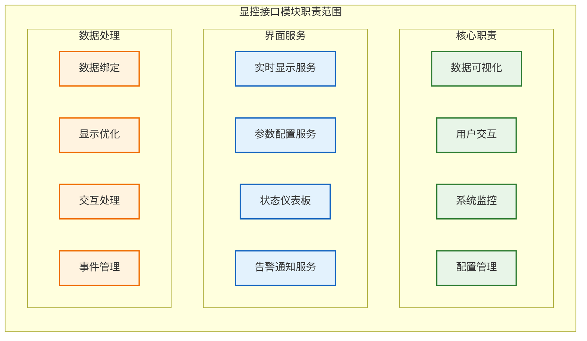

**职责说明**：显控接口模块通过三层功能分组实现完整的人机交互功能：
- **核心职责层**：定义四个基础功能范围（数据可视化、用户交互、系统监控、配置管理）
- **界面服务层**：提供四类对外服务接口（实时显示、参数配置、状态仪表板、告警通知）
- **数据处理层**：确保高效的数据流转和用户体验（数据绑定、显示优化、交互处理、事件管理）

各层内的组件通过标准接口协作，支持实时数据显示、直观的用户操作和全面的系统状态监控。

### 2.2 模块边界和约束

**输入边界**：
- 数据处理模块传输的目标轨迹和状态信息（通过环形缓冲区C）
- 任务调度器的系统状态和性能指标
- 配置管理器的界面配置和显示参数

**输出边界**：
- 用户操作指令和参数配置更新
- 界面交互事件和用户反馈
- 系统控制命令和配置变更请求

**性能约束**：
- 界面刷新频率 ≥ 30 FPS（实时显示组件）
- 用户交互响应延迟 < 100ms
- 最大支持同时显示 10000 个目标
- 内存使用控制在 1GB 以内

**技术约束**：
- 基于Qt6.x框架开发（最低支持Qt 6.5）
- 支持Windows 10/11和Ubuntu 20.04+操作系统
- 使用QML + C++混合开发模式
- 集成Qt Charts和Qt3D进行数据可视化

---

## 3 Qt6.x架构设计

### 3.1 Qt框架集成策略

基于Qt6.x框架的模块化集成策略，确保与雷达系统的无缝整合：

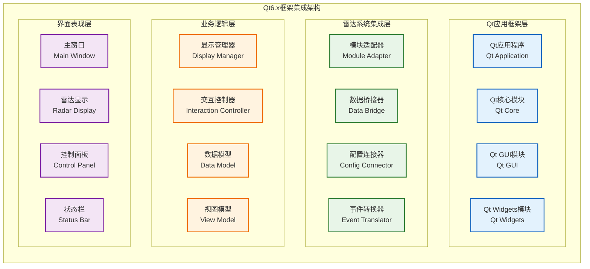

**集成策略说明**：该架构采用分层设计，确保Qt框架与雷达后端系统的松耦合集成。
- **Qt应用框架层**：提供基础GUI、网络、核心功能等工具集。
- **雷达系统集成层**：作为桥梁，负责将雷达后端模块（如数据处理、配置管理）的数据和服务，适配并转换为Qt友好的接口和数据结构。**该层中的任一组件都可能使用Qt框架层的多种功能**。
- **业务逻辑层**：实现所有显控相关的业务逻辑，如数据处理、状态管理和用户命令解析。它调用集成层提供的接口与雷达后端交互。
- **界面表现层**：纯粹的UI层，负责展示数据和接收用户输入，并将用户操作传递给业务逻辑层处理。

### 3.2 MVP架构模式实现

采用MVP（Model-View-Presenter）架构模式实现界面与业务逻辑的分离：

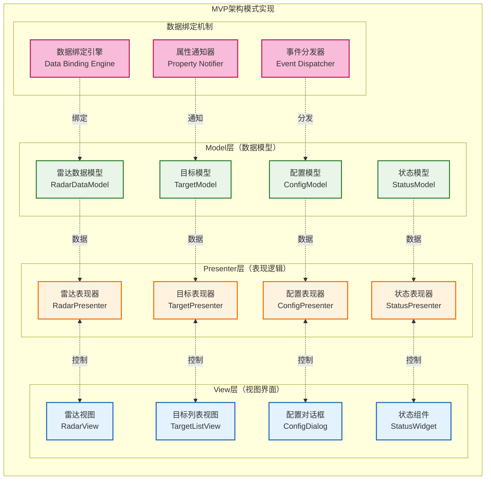

**MVP模式说明**：该架构通过MVP模式实现关注点分离：Model层管理业务数据和状态，View层处理用户界面显示，Presenter层协调数据和界面的交互。数据绑定机制确保数据变更的自动同步，提高开发效率和代码可维护性。

### 3.3 线程模型设计

Qt6.x环境下的多线程模型设计，确保界面响应性和数据处理性能：

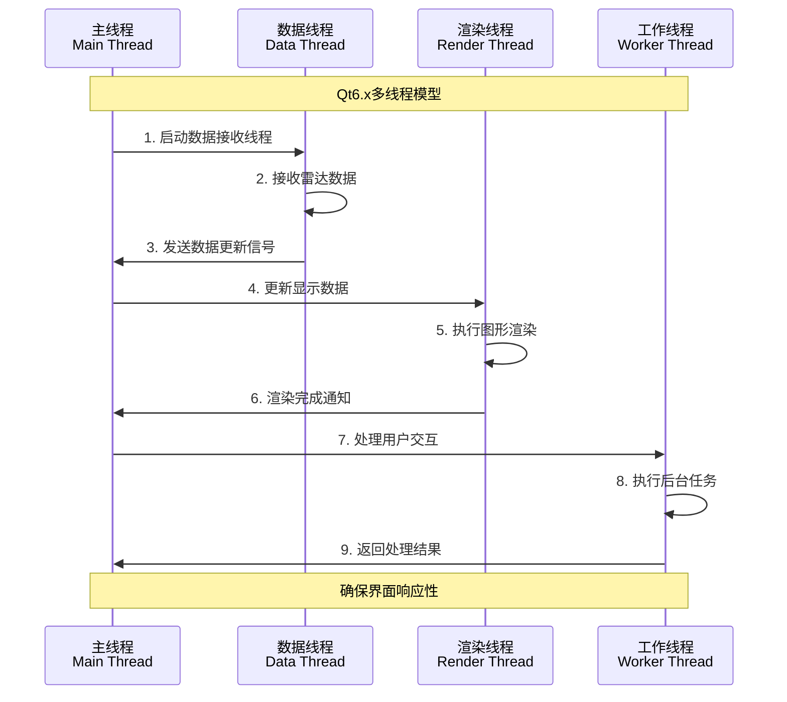

---

## 4 界面组件架构

### 4.1 主界面组织结构

主界面采用分区域布局设计，确保信息层次清晰和操作便捷：

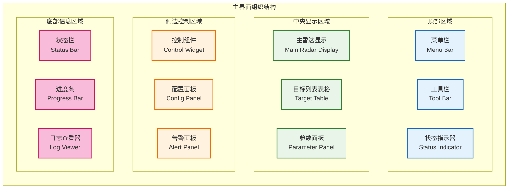

**界面布局说明**：主界面采用四区域空间布局设计：
- **顶部区域**：提供菜单栏、工具栏和状态指示器，便于系统操作和状态查看
- **中央显示区域**：承担主要的数据显示功能，包括雷达显示、目标列表和参数面板
- **侧边控制区域**：集中控制组件、配置面板和告警面板，便于系统控制
- **底部信息区域**：显示状态栏、进度条和日志查看器，提供系统运行信息

该布局确保了信息的逻辑分层和操作的直观便捷，各区域内组件根据功能特点灵活组织。

### 4.2 可视化组件设计

专业的雷达数据可视化组件设计，支持多种显示模式：

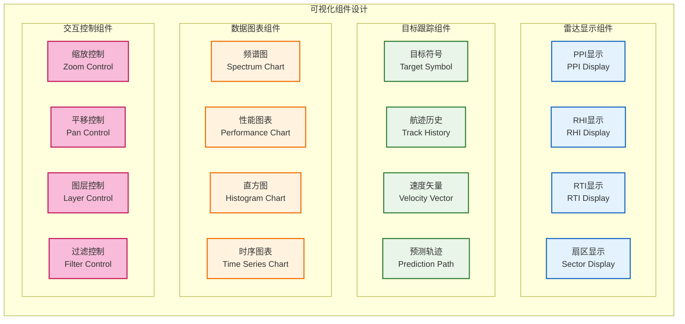

**可视化组件说明**：可视化系统采用四类组件分组：
- **雷达显示组件**：提供PPI、RHI、RTI、扇区等专业雷达显示模式
- **目标跟踪组件**：展现目标符号、航迹历史、速度矢量、预测轨迹等动态信息
- **数据图表组件**：支持频谱图、性能图表、直方图、时序图表等多维数据分析
- **交互控制组件**：提供缩放、平移、图层、过滤等灵活的用户操作控制

各组件通过标准接口实现数据交换和协同工作，支持灵活的显示配置和功能扩展。

### 4.3 控制面板设计

集成的控制面板设计，提供系统参数配置和操作控制：

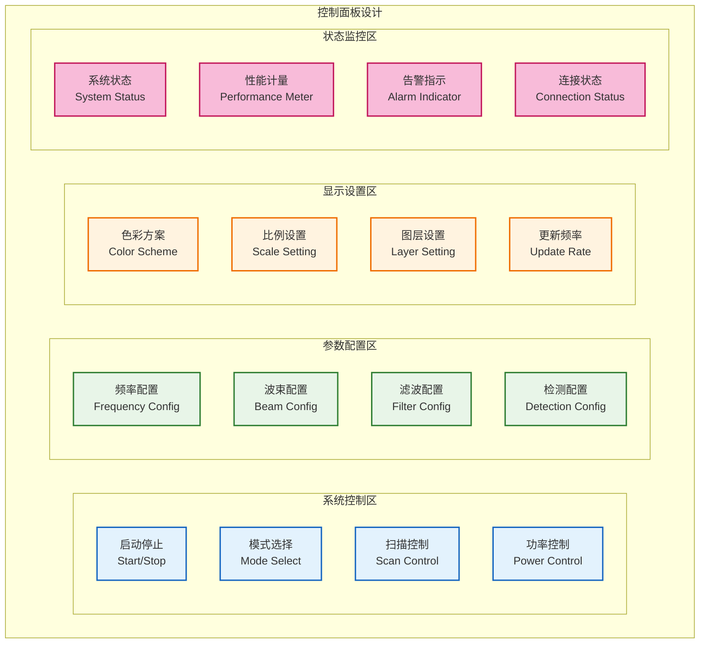

**控制面板说明**：控制面板采用四区域功能布局：
- **系统控制区**：提供启动停止、模式选择、扫描控制、功率控制等基础操作功能
- **参数配置区**：支持频率配置、波束配置、滤波配置、检测配置等系统参数调整
- **显示设置区**：控制色彩方案、比例设置、图层设置、更新频率等界面显示效果
- **状态监控区**：实时展现系统状态、性能计量、告警指示、连接状态等系统运行状态

该设计确保了操作的功能分组和界面组织的逻辑性，用户可根据需要在不同区域进行相应操作。

---

## 5 数据可视化设计

### 5.1 实时数据绘制引擎

高性能的实时数据绘制引擎设计，支持大数据量的流畅显示：

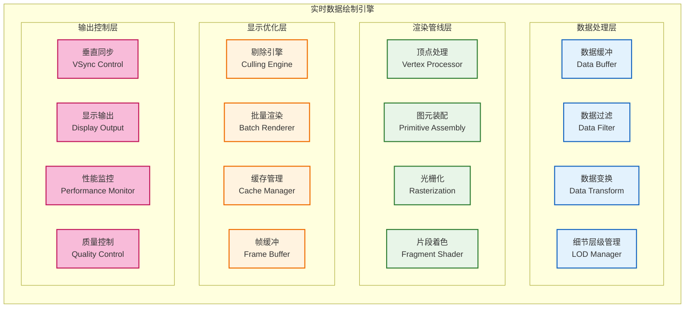

**绘制引擎说明**：实时绘制引擎采用四层管线架构：数据处理层负责数据预处理和优化，渲染管线层执行标准图形渲染流程，显示优化层提供性能优化策略，输出控制层确保显示质量和同步。该架构支持高频数据更新和流畅的视觉体验。

### 5.2 雷达显示组件

专业的雷达显示组件，支持多种雷达显示模式：

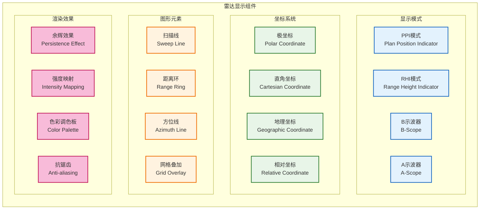

**雷达显示说明**：雷达显示组件通过四层功能分类实现专业的雷达显示：
- **显示模式层**：支持PPI、RHI、B示波器、A示波器等多种雷达显示标准
- **坐标系统层**：提供极坐标、直角坐标、地理坐标、相对坐标等灵活的坐标变换
- **图形元素层**：绘制扫描线、距离环、方位线、网格叠加等雷达特有的界面元素
- **渲染效果层**：提供余辉效果、强度映射、色彩调色板、抗锯齿等专业的视觉效果

该分层设计确保了雷达显示的专业性和可配置性，各层组件可根据显示需求灵活组合。

### 5.3 目标跟踪可视化

动态的目标跟踪可视化设计，直观展现目标运动状态：

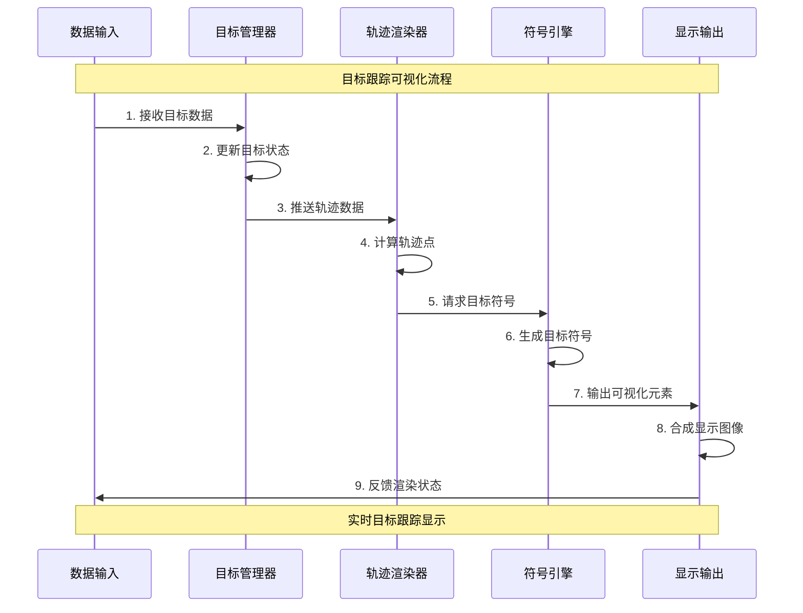

---

## 6 用户交互设计

### 6.1 交互模式架构

多样化的用户交互模式设计，支持直观高效的系统操作：

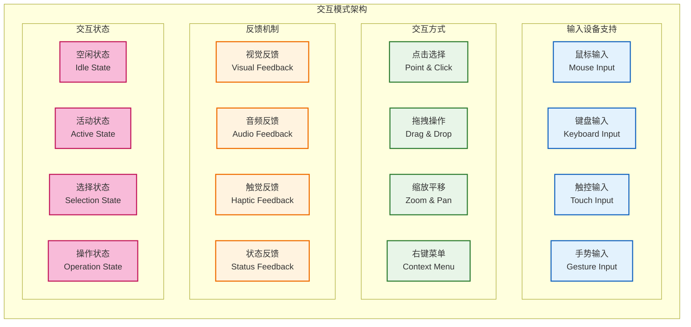

**交互模式说明**：交互架构通过四层功能分组支持丰富的用户交互：
- **输入设备支持层**：兼容鼠标、键盘、触控、手势等多种输入方式
- **交互方式层**：提供点击选择、拖拽操作、缩放平移、右键菜单等直观的操作模式
- **反馈机制层**：确保视觉、音频、触觉、状态等多维度的用户操作及时响应
- **交互状态层**：管理空闲、活动、选择、操作等界面的不同操作状态

该架构确保了用户体验的流畅性和直观性，各层组件协作提供完整的交互体验。

### 6.2 参数配置界面

结构化的参数配置界面设计，支持系统参数的灵活调整：

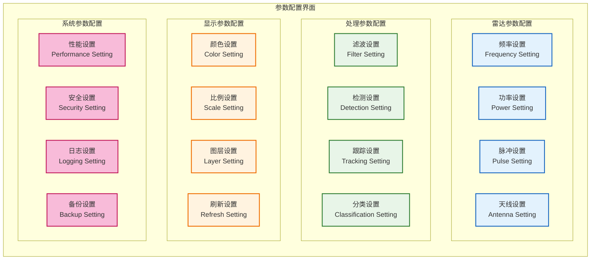

**配置界面说明**：参数配置界面采用四类参数分组：
- **雷达参数配置**：控制频率设置、功率设置、脉冲设置、天线设置等硬件设备参数
- **处理参数配置**：调整滤波设置、检测设置、跟踪设置、分类设置等算法参数
- **显示参数配置**：优化颜色设置、比例设置、图层设置、刷新设置等界面显示参数
- **系统参数配置**：管理性能设置、安全设置、日志设置、备份设置等系统运行参数

该分类确保了参数配置的功能逻辑性和界面易用性，用户可根据需要在不同类别中进行参数调整。

---

## 7 系统监控设计

### 7.1 状态监控架构

全面的系统状态监控架构，实时掌握系统运行状态：

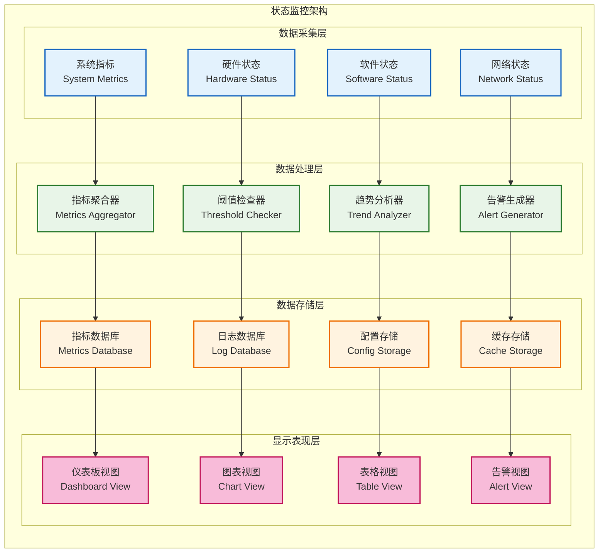

**监控架构说明**：状态监控架构采用四层设计确保全面的系统监控：数据采集层收集各类系统指标，数据处理层进行指标分析和告警判断，数据存储层管理监控数据的持久化，显示表现层提供直观的监控界面。该架构支持实时监控和历史分析。

### 7.2 性能指标显示

关键性能指标的可视化显示设计，直观展现系统性能状态：

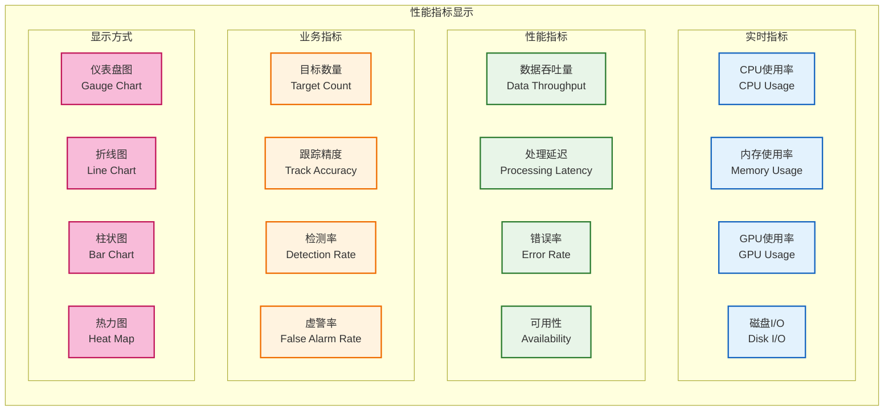

**性能指标说明**：性能显示系统通过三类指标和四种图表提供全面的性能监控：
- **实时指标**：反映CPU使用率、内存使用率、GPU使用率、磁盘I/O等系统资源使用状况
- **性能指标**：评估数据吞吐量、处理延迟、错误率、可用性等系统运行效率
- **业务指标**：衡量目标数量、跟踪精度、检测率、虚警率等雷达功能表现
- **显示方式**：支持仪表盘图、折线图、柱状图、热力图等多样化的图表形式

该设计确保了监控信息的直观性和可读性，用户可根据需要选择适合的图表类型展示不同指标。

---

## 8 技术实现策略

| 技术领域       | Qt6.x组件          | 实现策略       | 性能特征         |
| -------------- | ------------------ | -------------- | ---------------- |
| **界面框架**   | Qt Widgets + QML   | 混合开发模式   | 灵活性与性能平衡 |
| **图形渲染**   | Qt OpenGL + Qt3D   | 硬件加速渲染   | 高性能图形处理   |
| **数据绑定**   | Qt Property System | 自动属性绑定   | 实时数据同步     |
| **多线程**     | Qt Concurrent      | 任务并行处理   | 界面响应性保障   |
| **图表显示**   | Qt Charts          | 专业数据可视化 | 丰富的图表类型   |
| **网络通信**   | Qt Network         | 异步网络通信   | 稳定的数据传输   |
| **配置管理**   | Qt Settings        | 层次化配置存储 | 配置持久化管理   |
| **国际化支持** | Qt Linguist        | 多语言界面支持 | 国际化部署能力   |

**实现策略说明**：
- **模块化设计**：采用Qt插件机制实现功能模块的动态加载
- **性能优化**：利用Qt OpenGL进行图形硬件加速
- **数据流控制**：使用Qt信号槽机制实现松耦合的数据通信
- **界面自适应**：支持多分辨率和多屏显示配置

---

## 9 模块约束说明

**功能约束**：
- MVP阶段提供基础的雷达显示和控制功能
- 支持最大10000个目标的同时显示
- 界面刷新频率不低于30FPS
- 基础的参数配置和状态监控功能

**性能约束**：
- 界面响应延迟不超过100ms
- 内存使用控制在1GB以内
- 支持1920x1080分辨率显示
- CPU使用率控制在30%以内

**技术约束**：
- 基于Qt6.5或更高版本开发
- 支持Windows和Linux操作系统
- 使用C++17语言标准
- 集成项目统一的错误处理机制

**扩展约束**：
- 界面组件支持插件化扩展
- 预留多屏显示接口
- 支持自定义主题和样式
- 预留触控设备适配接口

---

## 10 相关文档

- [数据接收模块设计](01_数据接收模块设计.md)
- [信号处理模块设计](02_信号处理模块设计.md)
- [数据处理模块设计](03_数据处理模块设计.md)
- [任务调度器设计](05_任务调度器设计.md)

---

## 11 变更历史

| 版本   | 日期       | 作者    | 变更描述                                                                                                                                                              |
| ------ | ---------- | ------- | --------------------------------------------------------------------------------------------------------------------------------------------------------------------- |
| v1.0.1 | 2025-09-23 | Kelin   | 修正架构图表中的箭头误用问题：将不当的组件依赖关系改为功能分组说明，确保图表正确表达层级关系而非耦合关系；更新Qt6.x框架集成策略为层级依赖描述；修复文档引用路径错误。 |
| v1.0.0 | 2025-09-23 | Copilot | 基于MVP设计文档和Qt6.x框架创建显控接口模块设计，包含完整的界面架构、数据可视化和用户交互设计                                                                          |

---

*本显控接口模块设计为雷达数据处理系统提供专业的可视化界面和用户交互功能，确保系统的易用性和操作效率。*
