# 任务调度器设计

**文档版本**: v2.1.0
**最后更新**: 2025-09-25
**负责人**: Kelin

---

## 1 概述

任务调度器是系统的**事件驱动协调中枢**，负责统一管理系统生命周期、协调模块间合作，并提供统一的系统可观测性。

### 1.1 核心职责

任务调度器采用**纯事件驱动架构**，作为系统的"决策者"而非"执行者"：

1. **系统生命周期管理**: 基于事件驱动的模块状态协调与转换控制
2. **事件路由与协调**: 提供统一的系统事件总线，实现模块间解耦通信
3. **故障恢复协调**: 基于依赖关系的智能恢复策略执行
4. **资源协调管理**: 跨模块的CPU/GPU/内存资源协调（非直接管理）
5. **系统可观测性**: 提供端到端追踪和调度器自身监控能力

### 1.2 设计原则对齐

本设计严格遵循项目统一的架构原则，与数据接收、信号处理、数据处理模块保持设计语言一致：
- **事件驱动架构**: 完全基于异步事件，避免轮询和同步调用
- **决策者vs执行者分离**: 调度器负责决策，各模块负责执行
- **端到端追踪**: 完整的Trace ID传递链，支持全链路可观测性
- **统一错误处理**: 采用项目标准ErrorCode机制
- **统一组件命名**: 采用ExecutionEngine等标准化组件名称

### 1.3 文档范围

**包含内容**:
- 事件驱动架构设计与系统事件总线
- 模块协调机制与状态管理
- 故障检测与智能恢复策略
- 系统资源协调机制
- 调度器自身可观测性设计

**不包含内容**:
- 具体算法实现细节（由策略接口抽象）
- 底层线程池管理（由执行引擎封装）
- 硬件驱动接口（由资源协调器抽象）

### 1.4 目录

- [任务调度器设计](#任务调度器设计)
  - [1 概述](#1-概述)
    - [1.1 核心职责](#11-核心职责)
    - [1.2 设计原则对齐](#12-设计原则对齐)
    - [1.3 文档范围](#13-文档范围)
    - [1.4 目录](#14-目录)
  - [2 事件驱动架构设计](#2-事件驱动架构设计)
    - [2.1 系统事件总线](#21-系统事件总线)
    - [2.2 事件类型与分类](#22-事件类型与分类)
    - [2.3 事件处理机制](#23-事件处理机制)
  - [3 核心组件架构](#3-核心组件架构)
    - [3.1 统一分层架构](#31-统一分层架构)
    - [3.2 核心组件设计](#32-核心组件设计)
      - [ExecutionEngine (执行引擎)](#executionengine-执行引擎)
      - [RecoveryEngine (恢复引擎)](#recoveryengine-恢复引擎)
      - [SystemResourceCoordinator (系统资源协调器)](#systemresourcecoordinator-系统资源协调器)
    - [3.3 组件协作流程](#33-组件协作流程)
  - [4 系统生命周期管理](#4-系统生命周期管理)
    - [4.1 统一状态机设计](#41-统一状态机设计)
    - [4.2 生命周期事件流](#42-生命周期事件流)
    - [4.3 状态协调策略](#43-状态协调策略)
  - [5 故障恢复与容错](#5-故障恢复与容错)
    - [5.1 智能故障检测](#51-智能故障检测)
    - [5.2 熔断机制与指数退避](#52-熔断机制与指数退避)
    - [5.3 依赖感知恢复](#53-依赖感知恢复)
    - [5.4 恢复策略引擎](#54-恢复策略引擎)
  - [6 系统资源协调](#6-系统资源协调)
    - [6.1 资源协调模型](#61-资源协调模型)
    - [6.2 跨模块资源管理](#62-跨模块资源管理)
    - [6.3 资源冲突解决](#63-资源冲突解决)
  - [7 可观测性设计](#7-可观测性设计)
    - [7.1 端到端追踪](#71-端到端追踪)
    - [7.2 调度器自监控](#72-调度器自监控)
    - [7.3 系统状态透明化](#73-系统状态透明化)
  - [8 接口设计规范](#8-接口设计规范)
    - [8.1 事件接口定义](#81-事件接口定义)
    - [8.2 模块集成接口](#82-模块集成接口)
    - [8.3 监控查询接口](#83-监控查询接口)
  - [9 实现约束与限制](#9-实现约束与限制)
    - [9.1 技术约束](#91-技术约束)
    - [9.2 架构约束](#92-架构约束)
    - [9.3 部署约束](#93-部署约束)
  - [10 相关文档](#10-相关文档)
  - [11 变更历史](#11-变更历史)

---

## 2 事件驱动架构设计

任务调度器采用**纯事件驱动架构**，通过统一的系统事件总线实现模块间的解耦通信和状态协调，完全避免轮询和同步调用。

### 2.1 系统事件总线

系统事件总线是任务调度器的核心基础设施，提供模块间的异步通信能力：

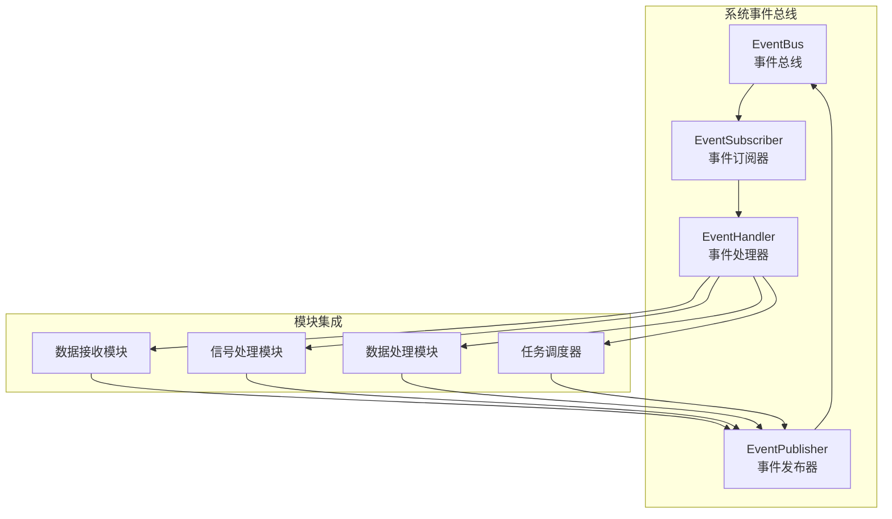

**核心特性**:
- **异步通信**: 所有模块间通信通过事件异步进行，无阻塞等待
- **类型安全**: 基于模板的事件类型系统，确保编译时类型检查
- **优先级支持**: 事件可携带优先级信息，支持紧急事件插队处理
- **Trace ID传递**: 每个事件必须包含Trace ID，支持端到端追踪
- **事件过滤**: 订阅者可基于事件类型和来源进行过滤订阅

### 2.2 事件类型与分类

系统定义标准的事件类型体系，所有模块必须使用这些标准事件进行通信：

**生命周期事件**:
- `ModuleStarting`: 模块开始启动
- `ModuleRunning`: 模块成功启动并运行
- `ModuleStopping`: 模块开始停止
- `ModuleStopped`: 模块已完全停止
- `ModuleFailed`: 模块发生致命错误

**状态报告事件**:
- `Heartbeat`: 模块心跳报告（包含性能指标）
- `ResourceUsage`: 资源使用情况报告
- `ProcessingStats`: 处理统计信息

**控制命令事件**:
- `StartModule`: 启动指定模块
- `StopModule`: 停止指定模块
- `RestartModule`: 重启指定模块
- `UpdateConfig`: 配置更新命令

**故障与恢复事件**:
- `FaultDetected`: 故障检测到
- `RecoveryStarted`: 恢复流程开始
- `RecoveryCompleted`: 恢复流程完成
- `RecoveryFailed`: 恢复流程失败

**每个事件的数据结构**:
```cpp
struct BaseEvent {
    EventType type;
    std::string source_module;
    Timestamp timestamp;
    TraceId trace_id;  // 强制要求
    EventPriority priority;
};

struct ModuleFailedEvent : BaseEvent {
    ErrorCode error_code;
    std::string error_message;
    std::vector<std::string> affected_modules;

    // 新增：故障上下文增强 (基于深度架构评审)
    bool is_transient;                    // 是否为临时错误
    ErrorSourceCategory source_category;  // 错误根源分类
    std::string stack_trace;              // 错误堆栈信息
    std::map<std::string, std::string> context_data; // 附加上下文
};
```

### 2.3 事件处理机制

任务调度器的事件处理采用**责任链模式**，确保事件得到有序处理：

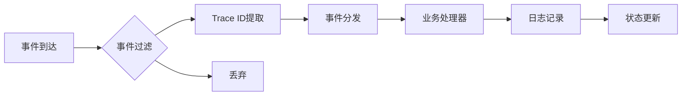

**处理流程**:
1. **事件过滤**: 基于订阅规则过滤无关事件
2. **Trace ID提取**: 从事件中提取Trace ID并设置到线程局部存储
3. **事件分发**: 根据事件类型路由到对应的业务处理器
4. **业务处理**: 执行具体的业务逻辑（如状态转换、恢复策略）
5. **日志记录**: 使用Trace ID记录详细的处理日志
6. **状态更新**: 更新系统状态机和模块状态视图

**关键设计点**:
- **线程安全**: 事件总线支持多线程并发发布和处理
- **处理顺序**: 同一模块的事件保证顺序处理，不同模块可并发
- **错误隔离**: 单个事件处理失败不影响其他事件处理
- **性能监控**: 记录事件处理延迟和队列深度

---

## 3 核心组件架构

任务调度器采用统一的**三层架构模式**，与项目中其他模块保持一致的设计语言。

### 3.1 统一分层架构

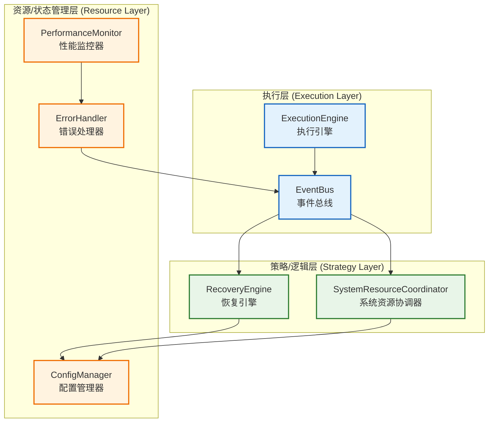

**分层说明**:
- **执行层**: 负责事件驱动的主循环和系统状态机
- **策略/逻辑层**: 实现具体的业务逻辑，如恢复策略和资源协调
- **资源/状态管理层**: 管理配置、监控和错误处理

### 3.2 核心组件设计

#### ExecutionEngine (执行引擎)
任务调度器的核心驱动组件，负责：
- 系统状态机管理和生命周期控制
- 事件总线的驱动和事件分发
- 模块状态视图的维护
- 执行令牌的分发和协调

**关键接口**:
```cpp
class ExecutionEngine {
public:
    ErrorCode initialize(const Config& config);
    ErrorCode run();
    ErrorCode stop();

    ErrorCode dispatchExecutionToken(const std::string& module_id,
                                   ExecutionToken token);
    SystemState getCurrentState() const;
};
```

#### RecoveryEngine (恢复引擎)
智能故障恢复策略的执行者，基于依赖关系图执行恢复工作流：

**核心职责**:
- 故障模式识别和分类
- 依赖感知的恢复策略选择
- 恢复工作流的编排和执行
- 恢复效果验证

**策略接口设计**:
```cpp
class IRecoveryStrategy {
public:
    virtual ErrorCode execute(const FaultContext& context,
                            RecoveryWorkflow& workflow) = 0;
};

class RestartModuleStrategy : public IRecoveryStrategy {
    // 实现重启模块策略
};
```

#### SystemResourceCoordinator (系统资源协调器)
跨模块的资源协调管理器，负责：
- CPU/GPU/内存的全局视图维护
- 跨模块资源冲突检测和解决
- 资源分配建议的生成
- 资源使用模式的监控

**关键特性**:
- **非直接管理**: 不直接分配资源，只提供协调建议
- **预测性协调**: 基于历史数据预测资源需求
- **公平性保证**: 确保各模块获得公平的资源分配

### 3.3 组件协作流程

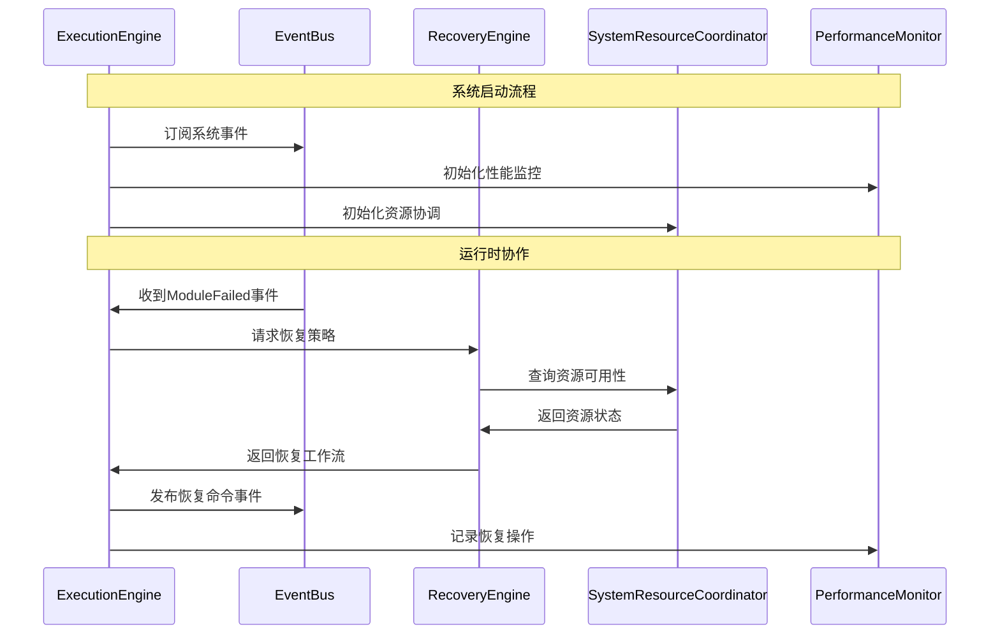

**协作原则**:
- **事件驱动**: 所有组件间通信通过事件总线
- **松耦合**: 组件通过接口协作，支持独立测试和替换
- **错误隔离**: 单个组件失败不影响整体系统运行
- **性能透明**: 所有操作都有性能监控和日志记录

---

## 4 系统生命周期管理

任务调度器通过**事件驱动的统一状态机**管理整个系统的生命周期，所有模块状态转换都通过事件总线协调进行。

### 4.1 统一状态机设计

系统采用层次化的状态机设计：系统级状态机协调各模块状态，确保全局一致性。

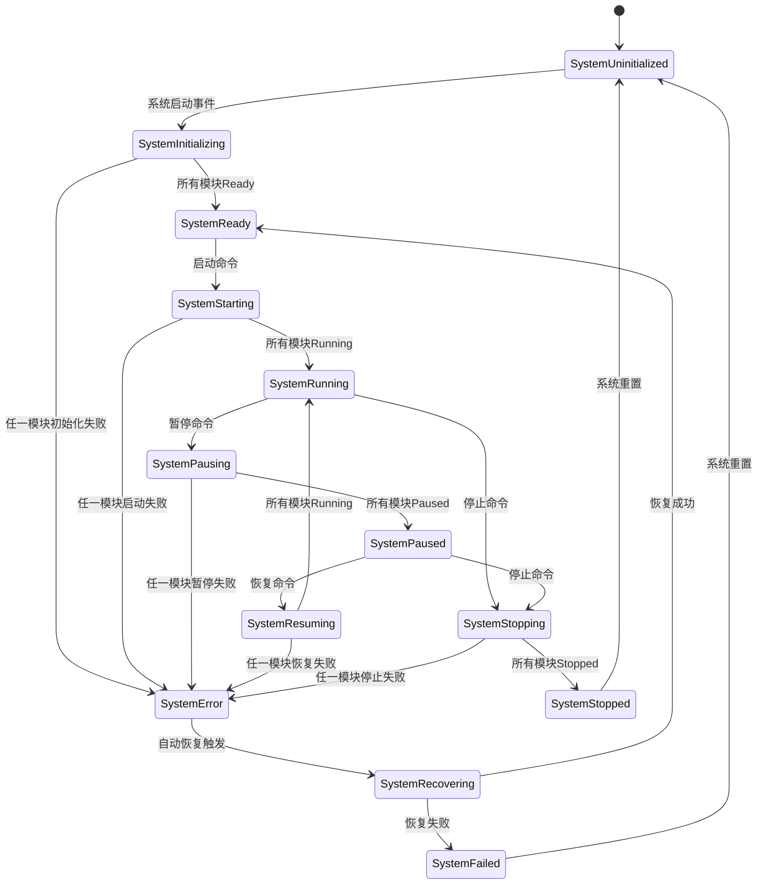

**状态定义**:
- **SystemUninitialized**: 系统未初始化，所有模块处于Uninitialized状态
- **SystemInitializing**: 系统正在初始化，模块依次进入Initializing状态
- **SystemReady**: 所有模块已初始化完成，处于Ready状态
- **SystemRunning**: 系统正常运行，所有模块处于Running状态
- **SystemPaused**: 系统已暂停，所有模块处于Paused状态
- **SystemError**: 系统发生错误，部分模块处于Error状态
- **SystemRecovering**: 系统正在执行恢复流程
- **SystemFailed**: 系统恢复失败，处于失败状态
- **SystemStopped**: 系统已完全停止

### 4.2 生命周期事件流

系统生命周期通过标准事件流进行管理，所有状态转换都有对应的事件：

**启动事件流**:
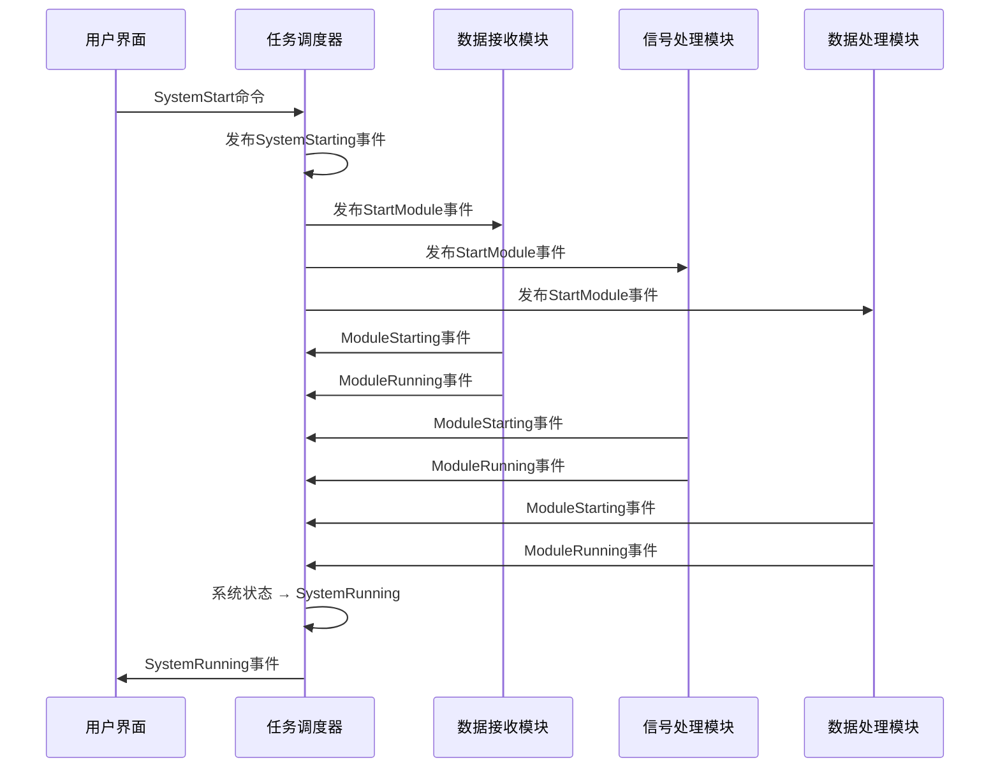

**故障恢复事件流**:
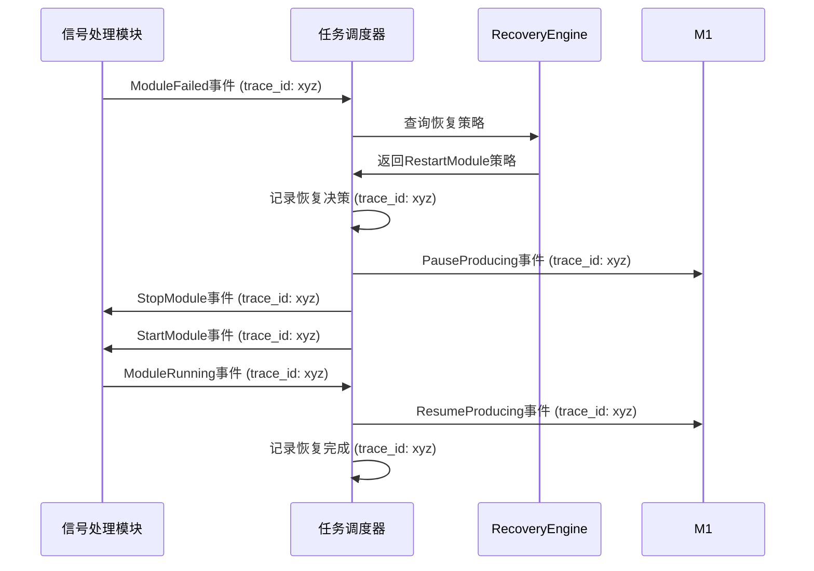

### 4.3 状态协调策略

**依赖关系管理**:
系统维护模块间的依赖关系图，确保状态转换的顺序正确：

```cpp
struct ModuleDependency {
    std::string module_id;
    std::vector<std::string> dependencies;  // 前置依赖模块
    std::vector<std::string> dependents;    // 依赖此模块的其他模块
};

class DependencyGraph {
public:
    ErrorCode addDependency(const std::string& module,
                          const std::vector<std::string>& deps);
    std::vector<std::string> getStartupOrder() const;
    std::vector<std::string> getShutdownOrder() const;
    std::vector<std::string> getAffectedModules(const std::string& failed_module) const;
};
```

**状态一致性保证**:
- **原子性**: 状态转换要么完全成功，要么完全回滚
- **超时控制**: 每个状态转换都有超时限制，防止无限等待
- **回滚机制**: 状态转换失败时，自动回滚到之前的一致状态
- **并发安全**: 多模块并发状态转换时的竞态条件处理

**关键策略**:
- **优雅降级**: 单个模块失败时，系统可选择降级运行模式
- **热切换**: 支持模块的热替换和版本升级
- **资源预留**: 状态转换过程中预留必要的系统资源

---

## 5 故障恢复与容错

任务调度器提供**智能的、依赖感知的故障恢复机制**，基于模块间的依赖关系图执行精确的恢复策略，完全避免简单的重启所有模块的粗暴做法。

### 5.1 智能故障检测

故障检测采用多层次的检测机制，确保故障能够被及时发现和分类：

**检测层次**:
1. **模块自报告**: 模块主动上报的故障事件（ModuleFailed、ResourceExhausted等）
2. **心跳超时**: 模块心跳超时的被动检测
3. **性能异常**: 通过PerformanceMonitor检测的性能异常（如处理延迟激增）
4. **资源异常**: SystemResourceCoordinator检测的资源异常（如GPU内存泄漏）

**故障分类**:
```cpp
enum class FaultType {
    MODULE_CRASH,           // 模块崩溃
    RESOURCE_EXHAUSTION,    // 资源耗尽
    PROCESSING_ERROR,       // 处理错误
    CONFIGURATION_ERROR,    // 配置错误
    NETWORK_FAILURE,        // 网络故障
    HARDWARE_FAILURE,       // 硬件故障
    DEPENDENCY_FAILURE      // 依赖故障
};

struct FaultContext {
    FaultType type;
    std::string failed_module;
    TraceId trace_id;
    Timestamp detected_time;
    std::string error_details;
    std::vector<std::string> affected_modules;
};
```

### 5.2 熔断机制与指数退避

**关键改进**: 基于深度架构评审，引入熔断机制防止"恢复风暴"：

**熔断器状态机**:
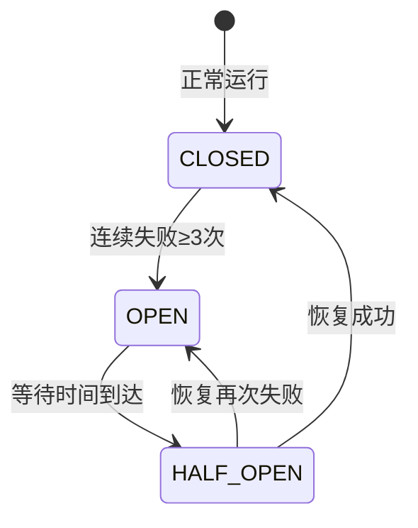

**模块故障计数器**:
```cpp
struct ModuleFailureContext {
    std::string module_id;
    uint32_t failure_count;           // 连续失败次数
    Timestamp first_failure_time;     // 首次失败时间
    Timestamp last_failure_time;      // 最近失败时间
    CircuitBreakerState state;        // 熔断器状态
    Duration backoff_duration;        // 当前退避时间

    // 错误上下文增强
    bool is_transient;               // 是否为临时错误
    ErrorSourceCategory source_category; // 错误根源分类
};

enum class ErrorSourceCategory {
    CONFIG,      // 配置错误 - 立即熔断
    HARDWARE,    // 硬件错误 - 立即停止
    RUNTIME,     // 运行时错误 - 允许重试
    NETWORK,     // 网络错误 - 指数退避
    UNKNOWN      // 未知错误 - 谨慎重试
};
```

**熔断与退避策略**:
```cpp
class CircuitBreakerManager {
private:
    static constexpr uint32_t MAX_FAILURES = 3;          // 最大连续失败次数
    static constexpr Duration FAILURE_WINDOW = 60s;      // 失败时间窗口
    static constexpr Duration BASE_BACKOFF = 5s;         // 基础退避时间
    static constexpr Duration MAX_BACKOFF = 300s;        // 最大退避时间

public:
    // 记录模块失败，返回是否应继续恢复
    bool recordFailure(const std::string& module_id,
                      const ModuleFailedEvent& failure_event);

    // 检查模块是否处于熔断状态
    bool isCircuitOpen(const std::string& module_id) const;

    // 计算下次重试时间
    Duration calculateBackoffDuration(const std::string& module_id) const;

    // 重置熔断器（人工干预）
    void resetCircuitBreaker(const std::string& module_id);
};
```

### 5.3 依赖感知恢复

恢复策略基于模块依赖关系图进行精确计算，同时考虑熔断状态：

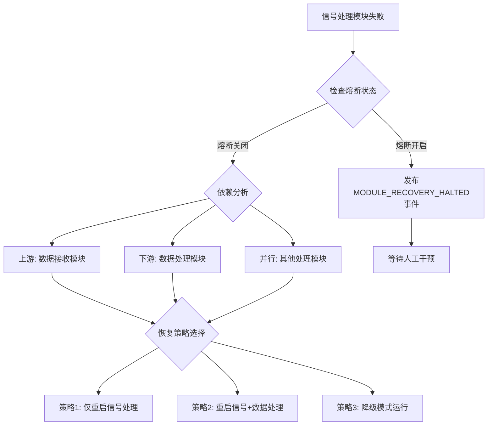

**依赖关系建模**:
```cpp
class DependencyGraph {
public:
    // 故障影响范围计算
    std::vector<std::string> getAffectedModules(const std::string& failed_module) const;

    // 恢复策略评估
    RecoveryStrategy evaluateStrategy(const FaultContext& fault,
                                    const SystemState& current_state) const;

    // 恢复执行顺序
    std::vector<std::string> getRecoveryOrder(const RecoveryStrategy& strategy) const;
};
```

**恢复策略类型**:
- **最小影响恢复**: 只重启故障模块，保持其他模块运行
- **级联恢复**: 重启故障模块及其直接下游模块
- **系统级恢复**: 重启整个处理链
- **降级恢复**: 切换到降级模式，减少功能但保持基本运行

### 5.4 恢复策略引擎

RecoveryEngine采用策略模式，支持动态加载和切换恢复策略，同时集成熔断机制：

```cpp
class IRecoveryStrategy {
public:
    virtual ~IRecoveryStrategy() = default;

    virtual ErrorCode canHandle(const FaultContext& fault) const = 0;
    virtual RecoveryWorkflow createWorkflow(const FaultContext& fault,
                                          const DependencyGraph& deps) const = 0;
    virtual ErrorCode validateWorkflow(const RecoveryWorkflow& workflow) const = 0;
};

class RestartModuleStrategy : public IRecoveryStrategy {
private:
    CircuitBreakerManager& circuit_breaker_manager_;

public:
    RestartModuleStrategy(CircuitBreakerManager& cbm) : circuit_breaker_manager_(cbm) {}

    ErrorCode canHandle(const FaultContext& fault) const override {
        // 检查熔断状态
        if (circuit_breaker_manager_.isCircuitOpen(fault.failed_module)) {
            return ERROR_CIRCUIT_BREAKER_OPEN;
        }
        return fault.type == FaultType::MODULE_CRASH ? SUCCESS : ERROR_INVALID_FAULT;
    }

    RecoveryWorkflow createWorkflow(const FaultContext& fault,
                                  const DependencyGraph& deps) const override {
        RecoveryWorkflow workflow;

        // 根据错误源分类调整策略
        switch (fault.source_category) {
            case ErrorSourceCategory::CONFIG:
                // 配置错误：立即熔断，需要人工干预
                workflow.addStep(RecoveryStep::TRIGGER_CIRCUIT_BREAKER, fault.failed_module);
                workflow.addStep(RecoveryStep::PUBLISH_MANUAL_INTERVENTION_ALERT, fault.failed_module);
                break;

            case ErrorSourceCategory::HARDWARE:
                // 硬件错误：停止服务，告警
                workflow.addStep(RecoveryStep::STOP_MODULE, fault.failed_module);
                workflow.addStep(RecoveryStep::PUBLISH_HARDWARE_FAILURE_ALERT, fault.failed_module);
                break;

            default:
                // 运行时错误：传统重启流程，但有退避时间
                auto backoff = circuit_breaker_manager_.calculateBackoffDuration(fault.failed_module);
                workflow.addStep(RecoveryStep::WAIT_BACKOFF, fault.failed_module, backoff);
                workflow.addStep(RecoveryStep::PAUSE_UPSTREAM, fault.failed_module);
                workflow.addStep(RecoveryStep::STOP_MODULE, fault.failed_module);
                workflow.addStep(RecoveryStep::START_MODULE, fault.failed_module);
                workflow.addStep(RecoveryStep::RESUME_UPSTREAM, fault.failed_module);
                break;
        }
        return workflow;
    }
};
```

**恢复工作流执行**:
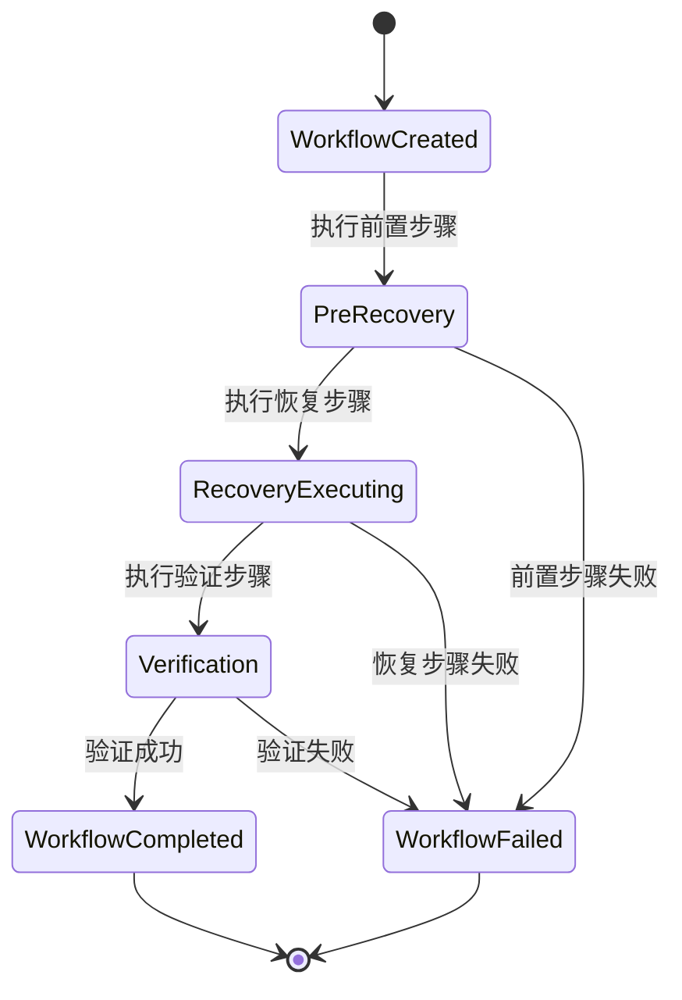

**关键特性**:
- **回滚支持**: 恢复失败时自动回滚到原始状态
- **超时控制**: 每个恢复步骤都有超时限制
- **资源预留**: 恢复过程中预留必要的系统资源
- **并发安全**: 支持多个恢复工作流并发执行
- **效果验证**: 恢复完成后验证系统状态是否恢复正常

---

## 6 系统资源协调

SystemResourceCoordinator提供**跨模块的资源协调服务**，维护全局资源视图，检测和解决资源冲突，但不直接管理底层资源分配。

### 6.1 资源协调模型

资源协调器维护多维度的资源视图，支持预测性和实时协调：

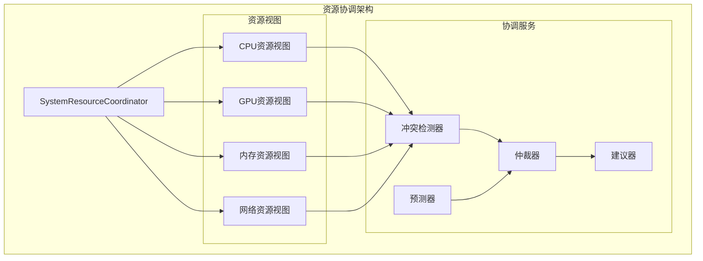

**资源视图数据结构**:
```cpp
struct ResourceView {
    std::string resource_type;  // CPU, GPU, MEMORY, NETWORK
    double total_capacity;
    double allocated_capacity;
    double reserved_capacity;
    std::map<std::string, double> module_allocation;  // 模块 -> 分配量
    std::vector<ResourceRequest> pending_requests;
};

struct ResourceRequest {
    std::string module_id;
    std::string resource_type;
    double requested_amount;
    RequestPriority priority;
    Timestamp request_time;
};
```

### 6.2 跨模块资源管理

资源协调器通过事件总线收集各模块的资源使用信息，构建全局视图：

**资源信息收集**:
```cpp
class SystemResourceCoordinator {
public:
    ErrorCode updateResourceView(const ResourceUsageEvent& event);
    ErrorCode processResourceRequest(const ResourceRequestEvent& event);

    ResourceView getResourceView(const std::string& resource_type) const;
    std::vector<ResourceConflict> detectConflicts() const;
    ResourceAllocation suggestAllocation(const std::string& module_id,
                                      const ResourceRequest& request) const;
};
```

**跨模块协调策略**:
- **公平分配**: 确保各模块获得相对公平的资源份额
- **优先级保障**: 高优先级模块的资源需求优先满足
- **预测性协调**: 基于历史数据预测资源需求，避免资源短缺
- **动态调整**: 根据系统负载动态调整资源分配

### 6.3 资源冲突解决

当检测到资源冲突时，协调器提供多种解决策略：

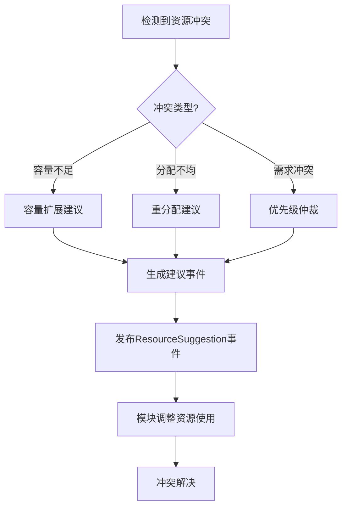

**冲突解决策略**:
1. **协商式解决**: 向相关模块发送资源调整建议，由模块自主调整
2. **强制式解决**: 在紧急情况下，通过调度器强制调整模块资源分配
3. **降级解决**: 建议系统进入降级模式，减少整体资源需求
4. **扩展解决**: 建议增加系统资源容量（如添加更多GPU）

**关键特性**:
- **非阻塞协调**: 协调过程不阻塞正常的数据处理流程
- **渐进式调整**: 资源调整采用渐进式策略，避免突变
- **回滚支持**: 支持资源调整的回滚操作
- **效果监控**: 监控资源调整的效果，持续优化协调策略

---

## 7 可观测性设计

任务调度器提供完整的**端到端可观测性**，包括Trace ID传递链、调度器自监控和系统状态透明化，确保系统行为完全可追踪和诊断。

### 7.1 端到端追踪

Trace ID在任务调度器中扮演关键角色，确保从故障发生到恢复完成的完整追踪链：

**Trace ID生命周期**:
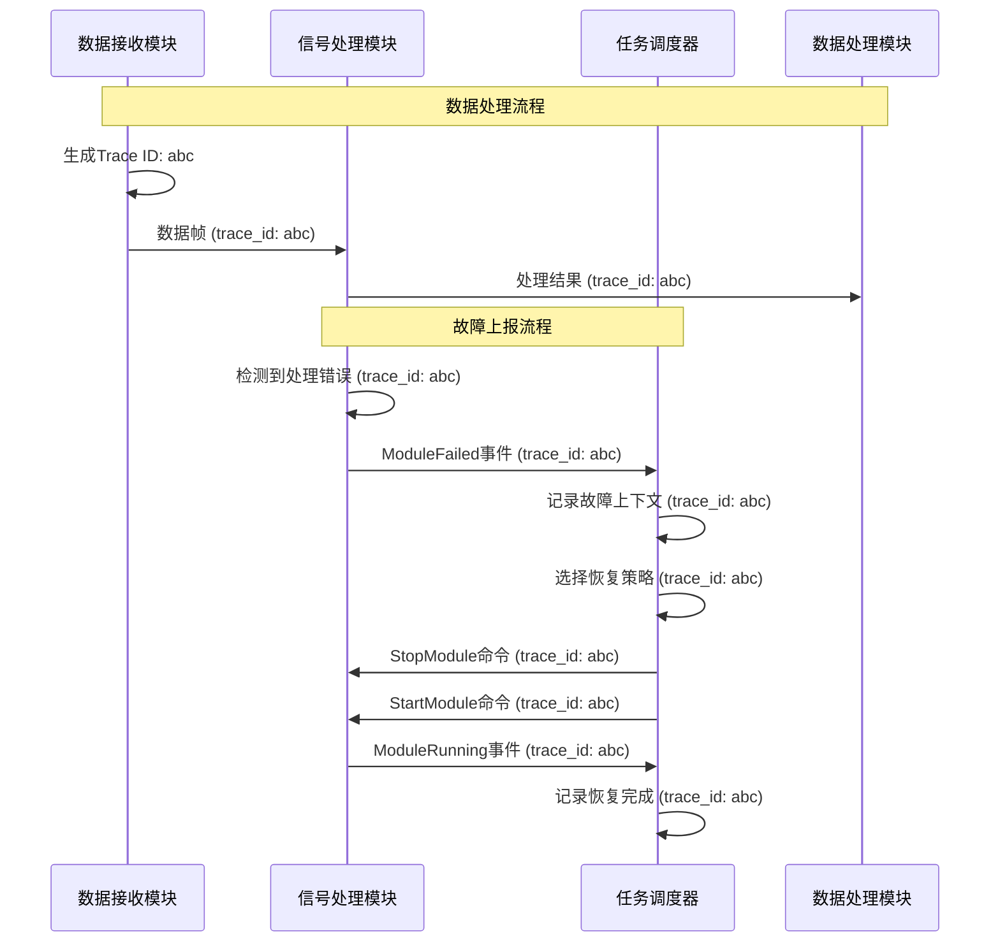

**Trace ID传递机制**:
```cpp
class TraceContext {
public:
    static TraceId getCurrentTraceId();
    static void setCurrentTraceId(TraceId trace_id);

    // 线程局部存储，确保Trace ID在线程间正确传递
    static thread_local TraceId current_trace_id_;
};

// 在事件处理器中使用
void TaskScheduler::onModuleFailed(const ModuleFailedEvent& event) {
    TraceContext::setCurrentTraceId(event.trace_id);

    RADAR_INFO("收到模块故障事件, module: {}, error: {}",
               event.source_module, event.error_message);

    // 后续所有日志都会自动包含此Trace ID
    auto strategy = recovery_engine_->selectStrategy(event);
    RADAR_INFO("选择恢复策略: {}", strategy.name);

    // 创建新事件时传递Trace ID
    auto stop_event = std::make_shared<StopModuleEvent>(
        event.source_module, event.trace_id);
    event_bus_->publish(stop_event);
}
```

**日志聚合效果**:
```
[INFO] [DataReceiver] 开始处理数据帧, trace_id: abc-123
[INFO] [SignalProcessor] 接收到数据帧, trace_id: abc-123
[ERROR] [SignalProcessor] 滤波器发散错误, trace_id: abc-123
[INFO] [TaskScheduler] 收到模块故障事件, module: SignalProcessor, trace_id: abc-123
[INFO] [TaskScheduler] 选择恢复策略: RESTART_MODULE, trace_id: abc-123
[INFO] [TaskScheduler] 执行恢复步骤: 停止模块, trace_id: abc-123
[INFO] [TaskScheduler] 执行恢复步骤: 重启模块, trace_id: abc-123
[INFO] [TaskScheduler] 恢复工作流完成, trace_id: abc-123
```

### 7.2 调度器自监控

PerformanceMonitor组件提供对调度器自身的全面监控：

**监控指标**:
```cpp
struct SchedulerMetrics {
    // 事件处理性能
    Histogram event_processing_latency_;      // 事件处理延迟分布
    Counter events_processed_total_;          // 总事件处理数
    Gauge event_queue_depth_;                 // 事件队列深度

    // 状态机性能
    Histogram state_transition_latency_;      // 状态转换延迟
    Counter state_transitions_total_;         // 状态转换总数

    // 恢复操作监控
    Histogram recovery_workflow_duration_;    // 恢复工作流持续时间
    Counter recovery_operations_total_;       // 恢复操作总数
    Gauge active_workflows_;                  // 活跃恢复工作流数

    // 资源协调监控
    Histogram resource_negotiation_latency_;  // 资源协商延迟
    Counter resource_conflicts_detected_;     // 检测到的资源冲突数
};
```

**自监控架构**:
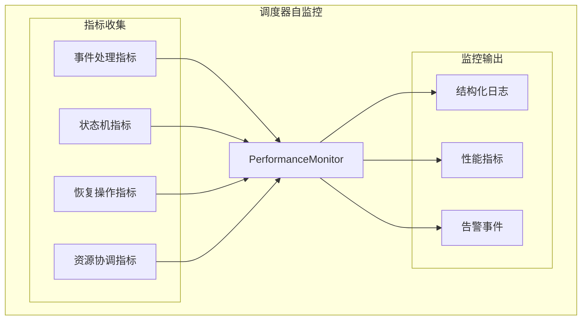

**关键监控点**:
- **事件处理延迟**: 监控每个事件类型的处理延迟分布
- **队列深度**: 监控事件队列的积压情况
- **状态转换**: 监控状态机转换的成功率和延迟
- **恢复效果**: 监控恢复操作的成功率和耗时
- **资源协调**: 监控资源冲突的检测和解决效率

### 7.3 系统状态透明化

系统提供多层次的状态查询接口，确保系统状态完全透明：

**状态查询接口**:
```cpp
class SystemStateQuery {
public:
    // 系统级状态查询
    SystemState getSystemState() const;
    std::vector<ModuleState> getAllModuleStates() const;

    // 模块级状态查询
    ModuleState getModuleState(const std::string& module_id) const;
    std::vector<std::string> getModuleDependencies(const std::string& module_id) const;

    // 运行时状态查询
    std::vector<ActiveWorkflow> getActiveWorkflows() const;
    ResourceUsage getCurrentResourceUsage() const;
    std::vector<PendingEvent> getPendingEvents() const;
};
```

**状态发布机制**:
系统状态变化通过事件总线实时发布，支持外部监控系统订阅：

```cpp
// 状态变化事件
struct SystemStateChangedEvent : BaseEvent {
    SystemState old_state;
    SystemState new_state;
    std::string reason;
};

struct ModuleStateChangedEvent : BaseEvent {
    std::string module_id;
    ModuleState old_state;
    ModuleState new_state;
    std::string reason;
};
```

**透明化特性**:
- **实时状态**: 所有状态变化实时发布，无延迟
- **历史追溯**: 支持查询状态变化历史
- **多视角查看**: 支持从不同视角查看系统状态
- **外部集成**: 标准接口支持外部监控系统集成

---

## 8 接口设计规范

任务调度器提供标准化的接口规范，确保与各模块和外部系统的无缝集成。

### 8.1 事件接口定义

所有事件必须继承BaseEvent，并遵循统一的接口约定：

**BaseEvent接口**:
```cpp
struct BaseEvent {
    EventType type;
    std::string source_module;
    Timestamp timestamp;
    TraceId trace_id;              // 强制要求
    EventPriority priority;        // 事件优先级

    // 序列化支持
    virtual std::string toJson() const = 0;
    virtual ErrorCode fromJson(const std::string& json) = 0;

    // 事件路由
    virtual std::vector<std::string> getTargetModules() const = 0;
};
```

**核心事件类型**:
```cpp
// 生命周期事件
struct ModuleStartingEvent : BaseEvent {
    std::string module_id;
    std::vector<std::string> dependencies;
};

struct ModuleRunningEvent : BaseEvent {
    std::string module_id;
    std::map<std::string, std::string> capabilities;  // 模块能力声明
};

// 故障事件
struct ModuleFailedEvent : BaseEvent {
    std::string module_id;
    ErrorCode error_code;
    std::string error_message;
    std::map<std::string, std::string> context;  // 故障上下文
};

// 控制事件
struct StartModuleEvent : BaseEvent {
    std::string module_id;
    Config module_config;
    Timeout start_timeout;
};

struct StopModuleEvent : BaseEvent {
    std::string module_id;
    Timeout stop_timeout;
    bool graceful;  // 是否优雅关闭
};
```

### 8.2 模块集成接口

模块需要实现的标准化接口，确保与调度器的无缝集成：

**IModule接口**:
```cpp
class IModule {
public:
    virtual ~IModule() = default;

    // 生命周期管理
    virtual ErrorCode initialize(const Config& config) = 0;
    virtual ErrorCode start() = 0;
    virtual ErrorCode stop() = 0;
    virtual ModuleState getState() const = 0;

    // 事件处理
    virtual ErrorCode handleEvent(std::shared_ptr<BaseEvent> event) = 0;

    // 能力声明
    virtual ModuleInfo getModuleInfo() const = 0;
    virtual std::vector<std::string> getDependencies() const = 0;

    // 健康检查
    virtual HealthStatus healthCheck() const = 0;
};
```

**模块注册流程**:
```cpp
class ModuleRegistry {
public:
    ErrorCode registerModule(std::unique_ptr<IModule> module);
    ErrorCode unregisterModule(const std::string& module_id);

    std::vector<std::string> getRegisteredModules() const;
    std::shared_ptr<IModule> getModule(const std::string& module_id) const;
};
```

### 8.3 监控查询接口

提供标准化的监控和查询接口，支持外部系统集成：

**状态查询接口**:
```cpp
class ISystemQuery {
public:
    virtual SystemState getSystemState() const = 0;
    virtual ModuleState getModuleState(const std::string& module_id) const = 0;
    virtual std::vector<ActiveWorkflow> getActiveWorkflows() const = 0;

    // 性能指标查询
    virtual SchedulerMetrics getSchedulerMetrics() const = 0;
    virtual ResourceUsage getResourceUsage() const = 0;

    // 历史查询
    virtual std::vector<SystemEvent> getEventHistory(
        Timestamp start, Timestamp end) const = 0;
    virtual std::vector<StateTransition> getStateHistory(
        const std::string& module_id, Timestamp start, Timestamp end) const = 0;
};
```

**事件订阅接口**:
```cpp
class IEventSubscription {
public:
    virtual SubscriptionId subscribe(
        const EventFilter& filter,
        std::function<void(std::shared_ptr<BaseEvent>)> callback) = 0;

    virtual ErrorCode unsubscribe(SubscriptionId id) = 0;

    // 批量订阅
    virtual std::vector<SubscriptionId> subscribeBatch(
        const std::vector<EventFilter>& filters,
        std::function<void(std::shared_ptr<BaseEvent>)> callback) = 0;
};
```

**配置接口**:
```cpp
class IConfigProvider {
public:
    virtual Config getModuleConfig(const std::string& module_id) const = 0;
    virtual ErrorCode updateModuleConfig(const std::string& module_id,
                                       const Config& config) = 0;

    // 热更新支持
    virtual ErrorCode validateConfig(const Config& config) const = 0;
    virtual ErrorCode applyConfigUpdate(const ConfigUpdate& update) = 0;
};
```

**接口设计原则**:
- **版本兼容**: 接口支持版本演进，向后兼容
- **错误处理**: 所有接口返回ErrorCode，不抛出异常
- **线程安全**: 接口保证线程安全，支持并发调用
- **性能保证**: 接口提供性能保证，避免阻塞调用
- **监控集成**: 所有接口调用自动生成监控指标

---

## 9 实现约束与限制

### 9.1 技术约束

**编程语言与标准**:
- C++17标准，必须使用项目统一的编译配置
- 遵循Google C++ Style Guide，clang-format自动格式化
- 禁止使用异常，全部使用ErrorCode错误处理

**依赖约束**:
- 必须使用项目标准的spdlog日志库
- 配置管理必须使用yaml-cpp
- 事件总线实现必须支持多线程并发

**性能约束**:
- 事件处理延迟 < 1ms (P99)
- 系统状态转换时间 < 100ms
- 内存使用 < 500MB (调度器自身)
- CPU使用率 < 5% (平均负载)

### 9.2 架构约束

**设计模式约束**:
- 严格遵循事件驱动架构，禁止轮询和同步调用
- 所有算法组件必须实现抽象接口，支持策略模式
- 组件间通信必须通过事件总线，禁止直接调用

**模块职责约束**:
- 调度器只能作为决策者，不能执行具体业务逻辑
- 各模块必须自主管理内部状态，只上报关键事件
- 资源协调器只能提供建议，不能直接分配资源

**可观测性约束**:
- 所有事件必须包含Trace ID
- 关键操作必须记录结构化日志
- 性能指标必须实时收集和发布

### 9.3 部署约束

**平台支持**:
- Linux (Ubuntu 20.04+)
- Windows (Windows 10+)
- 必须支持跨平台部署

**运行时约束**:
- 必须在专用线程中运行，不阻塞主线程
- 支持优雅关闭，处理SIGTERM信号
- 配置文件热更新，无需重启

---

## 10 相关文档

- [MVP系统设计文档](../MVP系统设计文档.md) - 总体系统架构
- [01_数据接收模块设计.md](./01_数据接收模块设计.md) - 数据接收模块设计
- [02_信号处理模块设计.md](./02_信号处理模块设计.md) - 信号处理模块设计
- [03_数据处理模块设计.md](./03_数据处理模块设计.md) - 数据处理模块设计
- [04_显控接口模块设计.md](./04_显控接口模块设计.md) - 显控接口模块设计
- [07_日志服务设计.md](./07_日志服务设计.md) - 日志服务设计
- [08_监控服务设计.md](./08_监控服务设计.md) - 监控服务设计
- [06_配置管理模块设计.md](./06_配置管理模块设计.md) - 配置管理模块设计

---

## 11 变更历史

| 版本   | 日期       | 变更人  | 主要变更                                                                                                                                                                                                                                                                                               |
| ------ | ---------- | ------- | ------------------------------------------------------------------------------------------------------------------------------------------------------------------------------------------------------------------------------------------------------------------------------------------------------ |
| v2.1.0 | 2025-09-27 | Copilot | 基于架构设计深度评审报告重大改进：<br/>- 引入熔断机制与指数退避，防止恢复风暴<br/>- 增强ModuleFailedEvent错误上下文(is_transient, source_category)<br/>- 实现智能恢复策略，根据错误类型调整恢复行为<br/>- 添加CircuitBreakerManager组件，管理模块故障状态<br/>- 支持人工干预重置熔断器，提升运维友好性 |
| v2.0.0 | 2025-09-24 | Kelin   | 基于《05_Task问题汇总.md》全面重构：<br/>- 引入事件驱动架构，统一系统事件总线<br/>- 重构为ExecutionEngine等标准化组件<br/>- 实现依赖感知的智能故障恢复<br/>- 增强端到端可观测性和Trace ID传递<br/>- 统一设计语言，与其他模块保持一致                                                                   |
| v1.1.0 | 2025-09-23 | Kelin   | 初始执行令牌机制，移除自主调度模式                                                                                                                                                                                                                                                                     |
| v1.0.0 | 2025-09-20 | Kelin   | 初始版本，基于四层架构模型                                                                                                                                                                                                                                                                             |
