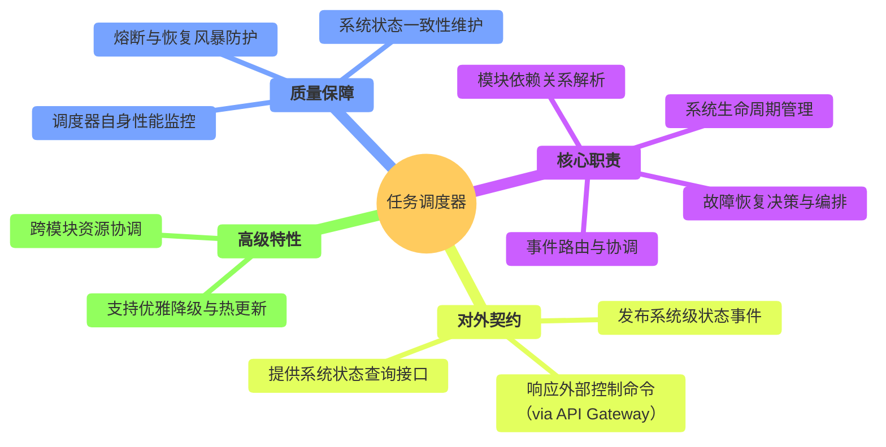
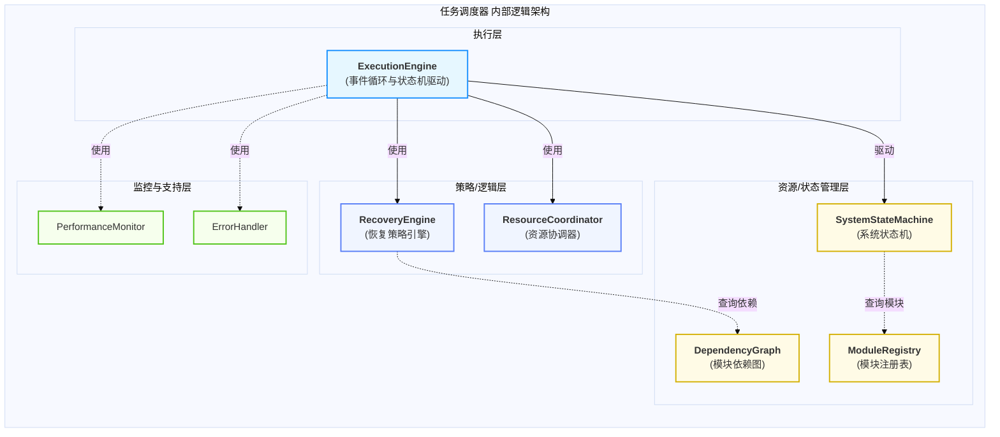
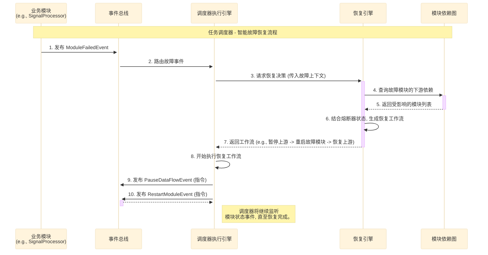
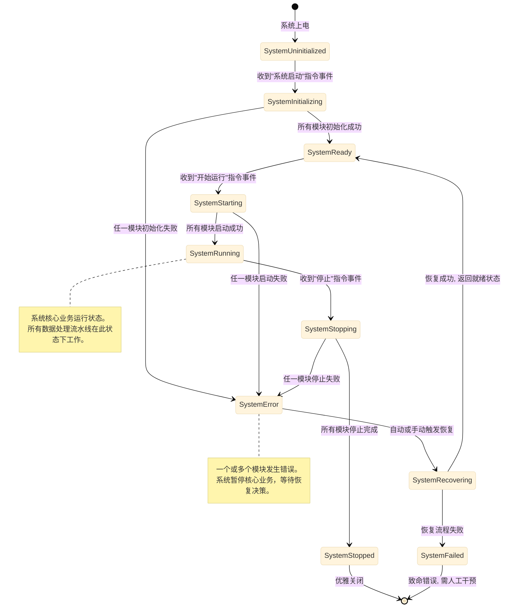
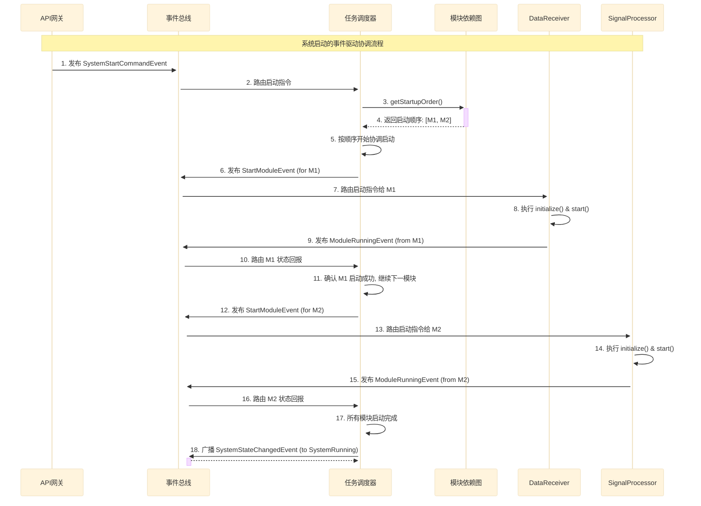
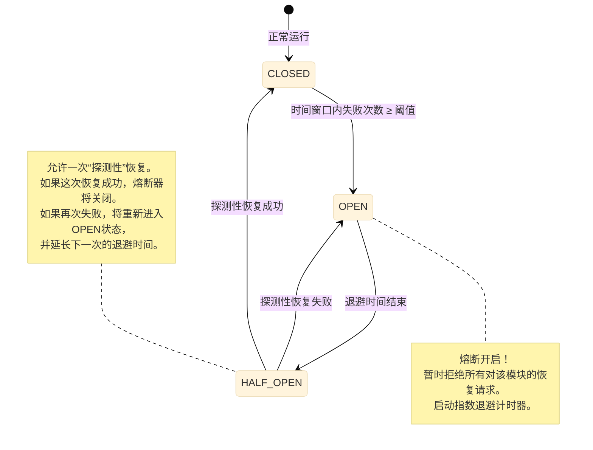
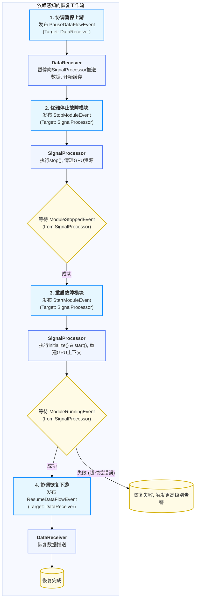
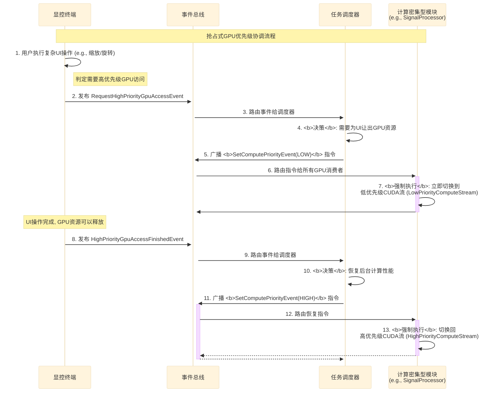
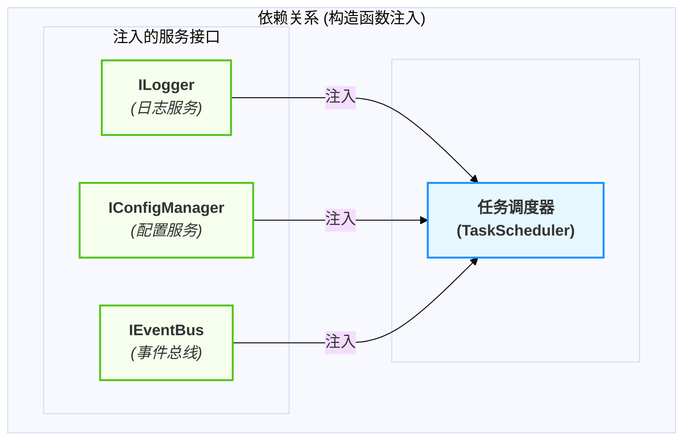

# 任务调度器设计

  - **当前版本**: v3.0.0
  - **最后更新**: 2025-10-14
  - **负责人**: Klein

-----

## 概述

  - **概要**: 本文件是雷达数据处理系统中 **任务调度器模块** 的详细设计规格说明。其核心目标是提供一个清晰、完整、可执行的设计蓝图。作为系统的**事件驱动协调中枢**与**最高决策者**，本模块不参与具体的数据处理，而是专注于管理所有业务模块的生命周期、协调模块间的复杂交互、执行系统级的故障恢复策略，并对系统资源进行宏观协调。本文档将详细阐述其作为系统“大脑”的设计哲学与核心实现机制。

-----

## 目录

- [任务调度器设计](#任务调度器设计)
  - [概述](#概述)
  - [目录](#目录)
  - [1 文档职责](#1-文档职责)
    - [1.1 文档目标与范围](#11-文档目标与范围)
    - [1.2 核心原则对齐](#12-核心原则对齐)
  - [2 模块总体设计](#2-模块总体设计)
    - [2.1 模块职责定义](#21-模块职责定义)
    - [2.2 模块边界与接口](#22-模块边界与接口)
    - [2.3 关键性能指标 (KPIs)](#23-关键性能指标-kpis)
  - [3 内部架构设计](#3-内部架构设计)
    - [3.1 逻辑架构与组件划分](#31-逻辑架构与组件划分)
    - [3.2 核心组件职责](#32-核心组件职责)
    - [3.3 核心交互流程 (以故障恢复为例)](#33-核心交互流程-以故障恢复为例)
  - [4 核心机制深度设计](#4-核心机制深度设计)
    - [4.1 机制一：事件驱动的系统生命周期管理](#41-机制一事件驱动的系统生命周期管理)
      - [4.1.1 系统顶层状态机 (`stateDiagram-v2`)](#411-系统顶层状态机-statediagram-v2)
      - [4.1.2 模块依赖图与启动/关闭顺序](#412-模块依赖图与启动关闭顺序)
      - [4.1.3 生命周期协调事件流 (`sequenceDiagram`)](#413-生命周期协调事件流-sequencediagram)
    - [4.2 机制二：依赖感知的智能故障恢复](#42-机制二依赖感知的智能故障恢复)
      - [4.2.1 故障检测与事件上报](#421-故障检测与事件上报)
      - [4.2.2 熔断器模式与指数退避策略](#422-熔断器模式与指数退避策略)
      - [4.2.3 依赖感知恢复工作流 (`flowchart`)](#423-依赖感知恢复工作流-flowchart)
      - [4.2.4 恢复策略引擎 (`IRecoveryStrategy`)](#424-恢复策略引擎-irecoverystrategy)
    - [4.3 机制三：跨模块资源协调](#43-机制三跨模块资源协调)
      - [4.3.1 资源协调模型 (指令模式)](#431-资源协调模型-指令模式)
      - [4.3.2 抢占式GPU优先级协调流程 (`sequenceDiagram`)](#432-抢占式gpu优先级协调流程-sequencediagram)
  - [5 关键横切关注点](#5-关键横切关注点)
    - [5.1 错误处理 (针对调度器自身)](#51-错误处理-针对调度器自身)
    - [5.2 全链路可观测性 (TraceID的生成与传递)](#52-全链路可观测性-traceid的生成与传递)
  - [6 模块集成与配置](#6-模块集成与配置)
    - [6.1 生命周期管理 (调度器自身的生命周期)](#61-生命周期管理-调度器自身的生命周期)
    - [6.2 依赖关系](#62-依赖关系)
    - [6.3 模块配置项 (`config.yaml`)](#63-模块配置项-configyaml)
  - [7 术语表](#7-术语表)
  - [8 相关文档](#8-相关文档)
  - [9 变更历史](#9-变更历史)

-----

## 1 文档职责

  - **概要**: 本章定义了本文档自身的“使命”，明确其目标、范围以及设计所遵循的“技术宪法”——项目的核心架构原则。这确保了所有设计决策都有据可依。

### 1.1 文档目标与范围

  - **概要**: 本节旨在清晰界定本文档要讲什么、不讲什么，为读者设定正确的预期。
      - **目标**: 本文档的核心目标是详细阐述任务调度器作为系统“大脑”的设计，确保其能够可靠、高效地管理和协调整个分布式系统。它将定义模块的协调机制、状态管理、故障恢复以及资源协调策略。
      - **范围**: 本文档覆盖系统级的生命周期管理、事件驱动的协调架构、依赖感知的故障恢复和宏观资源协调机制。文档**不包含**任何具体业务模块（如信号处理）的内部实现细节，也不涉及底层操作系统线程调度或硬件驱动接口。

### 1.2 核心原则对齐

  - **概要**: 本节是设计的基石，旨在确保本模块的设计决策与项目已确立的架构原则完全对齐，保证系统整体的一致性。

| 核心原则           | 在本模块设计中的具体体现                                                                                                                                                                                                                                         |
| :----------------- | :--------------------------------------------------------------------------------------------------------------------------------------------------------------------------------------------------------------------------------------------------------------- |
| **数据与控制分离** | **本模块是纯粹的控制面核心**。它不接触任何高速数据流，其所有输入和输出都是控制事件或状态信息。它通过发布事件来**指挥**数据面模块（如`DataReceiver`），但绝不参与数据本身的传输或处理。                                                                           |
| **事件驱动架构**   | **这是本模块存在的基石**。调度器的所有决策都是由接收到的事件（如`ModuleFailedEvent`, `SystemStartCommandEvent`）触发的。它自身也通过发布事件（如`StartModuleEvent`）来执行其决策，实现了与所有业务模块的完全异步解耦。                                           |
| **依赖注入**       | 本模块的所有外部服务依赖（如`ILogger`, `IConfigManager`, `IEventBus`）都**必须**通过构造函数注入。此外，它还扮演着**依赖注入协调者**的角色，在系统启动时负责解析模块依赖图，并协调`main`函数完成对业务模块的依赖注入。                                           |
| **全链路可观测性** | **TraceID的汇聚点与决策链核心**。调度器在处理任何传入事件时，都会继承其`TraceID`。在做出决策并发布新的控制事件时，**必须**将此`TraceID`继续传递下去。这使得我们可以将一个外部API请求或一个底层模块故障，与其在调度器中引发的一系列决策和恢复动作完整地关联起来。 |

-----

## 2 模块总体设计

  - **概要**: 本章从“黑盒”视角描绘任务调度器模块的蓝图，定义其在系统生态中的角色、输入输出以及必须达成的性能目标。作为系统的“指挥官”，其设计的可靠性和响应性是系统稳定运行的根本保障。

### 2.1 模块职责定义

  - **概要**: 本节使用思维导图的方式，直观地展示任务调度器作为系统“事件驱动协调中枢”的完整职责范围。

<!-- end list -->



### 2.2 模块边界与接口

  - **概要**: 本节明确定义模块的输入（Inputs）和输出（Outputs），以及它与系统其他部分交互的正式契约。

| 边界类型           | 交互对象            | 交互接口 / 数据格式                                            | 核心契约与说明                                                                                                   |
| :----------------- | :------------------ | :------------------------------------------------------------- | :--------------------------------------------------------------------------------------------------------------- |
| **输入 (Inputs)**  | **API网关**         | `SystemControlEvent` (内部)                                    | **控制命令入口**: 接收由API网关转换而来的外部控制命令（如启动/停止系统）。                                       |
|                    | **所有业务模块**    | `ModuleFailedEvent`, `ModuleStateChangedEvent` 等              | **状态反馈**: 接收所有被管理模块上报的状态变更和致命错误事件，这是其做出决策的核心依据。                         |
|                    | `MonitoringModule`  | `MetricsUpdateEvent`, `AlertTriggeredEvent`                    | **性能与告警**: 接收来自监控模块的性能指标和告警事件，用于健康评估和恢复决策。                                   |
| **输出 (Outputs)** | **所有业务模块**    | `StartModuleEvent`, `StopModuleEvent`, `PauseDataFlowEvent` 等 | **指挥与协调**: 向具体业务模块发布生命周期管理和协调指令事件。                                                   |
|                    | **EventBus** (广播) | `SystemStateChangedEvent`, `RecoveryCompletedEvent`            | **系统状态广播**: 向整个系统广播全局状态的变更，供所有关心系统状态的模块（如API网关、监控模块）订阅。            |
|                    | **API网关**         | `ISystemQuery` (内部服务接口)                                  | **状态查询服务**: 向API网关提供一个内部查询接口，使其能够响应外部对`GET /api/v1/system/status`等状态查询的请求。 |

### 2.3 关键性能指标 (KPIs)

  - **概要**: 本节定义衡量本模块性能是否达标的可量化指标。作为控制面核心，其KPI不关注数据吞吐量，而聚焦于**决策与响应的及时性和准确性**。

| KPI 指标             | 目标值(示例)                               | 测量方法                                                                                                        | 重要性与说明                                                                 |
| :------------------- | :----------------------------------------- | :-------------------------------------------------------------------------------------------------------------- | :--------------------------------------------------------------------------- |
| **事件处理延迟**     | **P99 \< 1ms**                             | 内部计时器，测量从事件进入`EventBus`到被调度器相应处理器开始处理的耗时。                                        | **高**<br>保证了调度器对系统变化的快速响应，是实现低延迟控制的基础。         |
| **系统状态转换延迟** | **P99 \< 100ms**                           | 测量从发布一个系统级命令（如`SystemStartCommand`）到系统状态机最终稳定到目标状态（如`SystemRunning`）的总耗时。 | **高**<br>衡量了整个系统启停、恢复等大规模协调操作的效率。                   |
| **故障恢复决策时间** | **\< 10ms**                                | 测量从收到`ModuleFailedEvent`到选定恢复策略并发出第一条恢复指令的耗时。                                         | **极高**<br>这是系统“自愈”能力的核心指标，直接决定了故障恢复的启动速度。     |
| **CPU / 内存占用**   | **CPU \< 5% (平均)**<br>**内存 \< 256 MB** | 通过`htop`或`perf`工具监控调度器进程的资源占用。                                                                | **中**<br>作为常驻核心服务，必须保持轻量和高效，不能成为系统本身的性能负担。 |

-----

## 3 内部架构设计

  - **概要**: 本章“打开黑盒”，深入任务调度器模块内部，展示其核心组件的划分、职责以及它们之间的协作方式。为遵循项目统一的设计原则，本模块内部同样采用职责清晰的三层逻辑模型：**执行层**、**策略/逻辑层** 和 **资源/状态管理层**，共同构成一个健壮、智能的系统协调核心。

### 3.1 逻辑架构与组件划分

  - **概要**: 本节使用 `graph` 图，展示模块内部的逻辑分层和核心组件构成。该架构以`ExecutionEngine`为核心，通过`EventBus`驱动，并依赖于专门的策略引擎（如`RecoveryEngine`）和协调器（如`ResourceCoordinator`）来执行其决策。

<!-- end list -->



### 3.2 核心组件职责

  - **概要**: 本节用表格详细说明 `3.1` 图中每个核心组件的具体职责、关键实现技术和设计决策。

| 组件名称                                  | 主要职责           | 关键设计点与实现策略                                                                                                                                                                                                                        |
| :---------------------------------------- | :----------------- | :------------------------------------------------------------------------------------------------------------------------------------------------------------------------------------------------------------------------------------------ |
| **`ExecutionEngine`**<br>(执行引擎)       | **事件驱动核心**   | 1. 运行模块主事件循环，从`EventBus`消费系统级事件。<br>2. 作为“决策者”，根据事件内容，调用不同的策略引擎（如`RecoveryEngine`）获取决策方案。<br>3. 作为“执行者”，将决策方案转化为具体的控制事件（如`StartModuleEvent`），发布回`EventBus`。 |
| **`RecoveryEngine`**<br>(恢复引擎)        | **故障恢复决策**   | 1. 实现`IRecoveryStrategy`策略接口，封装不同的恢复逻辑（如重启、降级）。<br>2. 在决策时，**必须**查询`DependencyGraph`来评估故障的连锁影响范围。<br>3. 集成**熔断器**机制，防止对频繁失败的模块进行无效的重复恢复。                         |
| **`ResourceCoordinator`**<br>(资源协调器) | **资源冲突仲裁**   | 1. 监听`SetComputePriorityEvent`等资源相关的事件。<br>2. 维护一个简化的系统资源视图。<br>3. 负责向计算密集型模块（如`SignalProcessor`）发布强制性的优先级控制指令，为UI渲染等高优任务让路。                                                 |
| **`DependencyGraph`**<br>(模块依赖图)     | **管理模块间关系** | 1. 在系统启动时，根据各模块的声明构建一个有向无环图（DAG）。<br>2. 提供**拓扑排序**功能，用于计算正确的模块**启动和关闭顺序**。<br>3. 在故障恢复时，提供**下游依赖查询**功能，用于精确评估故障影响范围。                                    |

### 3.3 核心交互流程 (以故障恢复为例)

  - **概要**: 本节使用 `sequenceDiagram`，展示一个最能体现任务调度器核心价值的场景：当一个业务模块发生致命错误时，调度器如何通过内部组件协作，完成一次智能的、依赖感知的故障恢复。

<!-- end list -->



-----

## 4 核心机制深度设计

  - **概要**: 本章是文档的技术核心，旨在针对该模块 **三个最关键、最具代表性** 的技术机制进行深度剖析。这些机制共同构成了任务调度器作为系统“指挥中心”的基础：首先是定义其核心角色的**事件驱动的系统生命周期管理**；其次是保障系统鲁棒性的**依赖感知的智能故障恢复**；最后是确保系统资源高效利用的**跨模块资源协调**。

### 4.1 机制一：事件驱动的系统生命周期管理

  - **概要**: 阐述任务调度器如何通过一个统一的系统级状态机，响应外部命令和内部事件，精确地协调所有业务模块（`IModule`）从初始化、运行到最终关闭的完整生命周期。此机制的核心在于，任务调度器作为“决策者”，通过发布**指令事件**来启动状态转换，并通过监听各模块的**状态回报事件**来确认转换完成，从而形成一个可靠、可观测的异步闭环控制系统。

#### 4.1.1 系统顶层状态机 (`stateDiagram-v2`)

  - **概要**: 任务调度器内部维护一个严格的、代表整个系统宏观状态的顶层状态机。所有对系统生命周期的重大操作，本质上都是在驱动这个状态机进行转换。该状态机不仅定义了正常的启停路径，更重要的是为所有异常情况（如初始化失败、运行中出错）提供了明确的、可预测的“逃逸路径”，是系统稳定性的模型基础。

<!-- end list -->



#### 4.1.2 模块依赖图与启动/关闭顺序

  - **概要**: 任务调度器在系统初始化阶段的核心任务之一，是构建一个**模块依赖的有向无环图（DAG）**。这个图是所有生命周期协调操作的基础，它决定了模块启动必须遵循**拓扑排序**的正序，而关闭则必须遵循其逆序，以确保没有任何模块在其依赖项尚未就绪时启动，或在其依赖项仍然需要它时关闭。

  - **实现策略**:

    1.  **注册与声明**: 每个`IModule`实现都必须提供一个`getDependencies()`方法，声明其强依赖（启动时必须存在）的模块列表。
    2.  **图构建**: `TaskScheduler`在`initialize()`阶段，收集所有已注册模块的依赖声明，并构建出`DependencyGraph`的内存表示。
    3.  **顺序计算**:
          - **启动顺序**: `DependencyGraph`提供一个`getStartupOrder()`方法，通过拓扑排序算法（如Kahn算法）计算出一个安全的启动序列。
          - **关闭顺序**: `getShutdownOrder()`方法简单地将启动顺序反转即可。
    4.  **循环依赖检测**: 如果在构建图或拓扑排序过程中发现循环，系统将立即初始化失败，并报告致命的`CONFIG_ERROR`，防止系统进入不确定状态。

#### 4.1.3 生命周期协调事件流 (`sequenceDiagram`)

  - **概要**: 下图详细展示了当任务调度器收到一个外部“启动系统”的指令后，如何通过一系列的事件发布与监听，来精确、有序地启动两个有依赖关系的模块（`DataReceiver` -\> `SignalProcessor`）。这个流程完美地体现了其作为“决策者”与“协调者”的角色。

<!-- end list -->



-----

### 4.2 机制二：依赖感知的智能故障恢复

  - **概要**: 详细设计本模块作为系统“主治医生”的故障恢复能力。简单的“全部重启”策略在复杂的分布式系统中是不可接受的，因为它会造成不必要的服务中断。本机制的核心在于**精确**与**智能**：通过分析模块依赖图，任务调度器能够精确评估故障的连锁影响范围，并结合熔断器模式与指数退避策略，执行对系统影响最小、最安全的恢复工作流，从而在不中断非相关服务的情况下，快速、自动地“治愈”故障。

#### 4.2.1 故障检测与事件上报

  - **概要**: 任务调度器的恢复流程完全由事件驱动。它不主动轮询模块状态，而是依赖于各业务模块的**主动故障上报**，以及监控模块的**被动异常检测**。
  - **故障来源**:
    1.  **模块自报告 (最主要)**: 当业务模块内部发生无法自我恢复的致命错误时（如GPU硬件错误、数据库损坏），它会立即停止工作，并向`EventBus`发布一个`ModuleFailedEvent`。这是触发恢复流程最直接、最常见的来源。
    2.  **监控模块告警**: 当`MonitoringModule`检测到某个模块的性能指标持续异常（如心跳超时、处理延迟无限增大）并超出预设阈值时，它会发布`AlertTriggeredEvent`。调度器会订阅高优先级的此类告警，并将其作为触发恢复的依据。

#### 4.2.2 熔断器模式与指数退避策略

  - **概要**: 为防止因某个模块持续、快速地失败而导致调度器反复尝试无效的恢复操作（即“恢复风暴”），`RecoveryEngine`内部集成了\*\*熔断器（Circuit Breaker）\*\*模式。它像一个电路保险丝，当检测到某个模块在短时间内连续失败次数过多时，会自动“熔断”，在一段时间内拒绝为该模块执行恢复操作，从而保护系统资源，并为人工介入争取时间。

  - **熔断器状态机**:
    每个被管理的模块在`RecoveryEngine`中都有一个与之关联的熔断器状态机。

<!-- end list -->



  - **实现策略**:
      - **故障计数**: `RecoveryEngine`为每个模块维护一个在固定时间窗口内（如60秒）的失败计数器。
      - **触发熔断**: 当计数器超过阈值（如3次），熔断器状态切换为`OPEN`，并开始**指数退避**计时（如首次等待5秒，第二次10秒，以此类推，直至上限）。
      - **探测恢复**: 退避时间结束后，状态切换为`HALF_OPEN`，允许`TaskScheduler`执行一次恢复操作。
      - **状态重置/延长**: 如果探测恢复成功，状态重置为`CLOSED`。如果失败，则状态立即返回`OPEN`，并加倍下一次的退避时间。

#### 4.2.3 依赖感知恢复工作流 (`flowchart`)

  - **概要**: 当`RecoveryEngine`决定执行一次恢复操作时，它不会简单地重启故障模块。它会首先查询`DependencyGraph`，分析故障的潜在影响，并生成一个精确、有序的**恢复工作流**。这个工作流的目标是，在恢复故障的同时，最大程度地减少对系统其他部分的影响。

  - **恢复工作流示例 (当`SignalProcessor`失败时)**:

<!-- end list -->



#### 4.2.4 恢复策略引擎 (`IRecoveryStrategy`)

  - **概要**: 为支持未来更复杂的恢复场景（如服务降级、主备切换），`RecoveryEngine`内部的恢复逻辑本身也采用**策略模式**。`RecoveryEngine`根据故障的类型和上下文，从一个策略集合中选择最合适的`IRecoveryStrategy`来生成恢复工作流。

  - **实现策略**:

      - **`IRecoveryStrategy`接口**: 定义一个标准接口，包含`canHandle(faultContext)`和`createWorkflow(faultContext, depGraph)`等方法。
      - **具体策略实现**:
          - `RestartModuleStrategy`: 实现上图所示的重启工作流。这是最常用的策略。
          - `DegradationStrategy` (未来演进): 当某个非核心模块（如性能监控）失败时，该策略可能只选择将其禁用，并让系统在降级模式下继续运行。
          - `FailoverStrategy` (未来演进): 在高可用部署中，当主模块失败时，该策略会生成一个将流量切换到备用模块的工作流。
      - **策略选择**: `RecoveryEngine`会按优先级顺序遍历所有已注册的恢复策略，选择第一个声明`canHandle()`该故障的策略来执行。

-----

### 4.3 机制三：跨模块资源协调

  - **概要**: 阐述任务调度器作为系统“资源仲裁者”的角色。在现代高性能计算系统中，CPU、GPU等核心资源是有限且宝贵的。当多个模块（如`SignalProcessor`的科学计算和`DisplayController`的UI渲染）同时竞争这些资源时，若无有效的协调机制，极易导致性能瓶颈甚至系统崩溃（如GPU驱动TDR）。任务调度器不直接管理底层资源分配，而是通过监听全局资源负载和响应高优先级事件，向相关模块发布**强制性的资源调整指令**，以解决资源争抢，确保系统整体的稳定性和关键任务（如用户交互）的响应性。

#### 4.3.1 资源协调模型 (指令模式)

  - **概要**: 任务调度器的资源协调采用**中心化的指令模式**。它不与业务模块“协商”，而是作为最高决策者，直接发布具有强制执行力的指令事件。这种模式确保了在资源紧张的关键时刻，能够快速、确定性地执行资源让渡，避免了分布式协商带来的延迟和不确定性。

  - **实现策略**:

    1.  **事件监听**: 任务调度器订阅特定的高优先级系统事件，这些事件是触发资源协调的唯一来源。
          - `RequestHighPriorityGpuAccessEvent`: 通常由`DisplayController`或独立的`显控终端`在需要执行流畅的UI渲染或用户交互时发布。
          - `GpuOverloadAlertEvent`: 由`MonitoringModule`在检测到GPU利用率持续超高、濒临驱动重置风险时发布。
    2.  **决策与指令发布**: 收到上述事件后，`ResourceCoordinator`组件会立即做出决策，并通过`EventBus`向所有已注册的、声明自己是“可被协调的资源消费者”（如`SignalProcessor`, `DataReceiver`）的模块，广播一个强制性的指令事件。
          - `SetComputePriorityEvent(LOW)`: 指令计算密集型模块立即切换到低优先级模式。
          - `SetComputePriorityEvent(HIGH)`: 在高优先级需求结束后，发布此事件，指令计算模块恢复正常性能。
    3.  **模块遵从**: 所有接收到`SetComputePriorityEvent`指令的模块，**必须**无条件遵从。它们内部需要实现相应的优先级切换逻辑（如切换到低优先级CUDA流），这是`IModule`接口契约的一部分。

#### 4.3.2 抢占式GPU优先级协调流程 (`sequenceDiagram`)

  - **概要**: 下图详细展示了一个典型的、由UI渲染需求触发的抢占式GPU资源协调的完整端到端流程。这个流程清晰地揭示了任务调度器如何作为仲裁者，在UI流畅性与后台计算吞吐量之间做出动态平衡。

<!-- end list -->



-----

## 5 关键横切关注点

  - **概要**: 本章讨论那些贯穿于任务调度器模块多个组件的通用设计问题。对于调度器而言，最重要的横切关注点是其自身的健壮性——即如何处理内部错误，以及它如何支撑整个系统的核心原则——全链路可观测性。

### 5.1 错误处理 (针对调度器自身)

  - **概要**: 任务调度器作为系统的“大脑”，其自身的稳定性至关重要。本节描述针对调度器内部（而非它所管理的模块）可能发生的错误的\`处理哲学。策略核心是：**内部状态自愈，对外透明上报**。

| 类别              | 错误示例               | 描述                                                                      | **内部处理与恢复策略**                                                                                                                                                                                                                                                               |
| :---------------- | :--------------------- | :------------------------------------------------------------------------ | :----------------------------------------------------------------------------------------------------------------------------------------------------------------------------------------------------------------------------------------------------------------------------------- |
| **逻辑/状态错误** | **状态机进入非法状态** | 例如，在`SystemRunning`状态下收到了一个本不应出现的`ModuleRunningEvent`。 | 1.  **记录**: 记录`ERROR`级别日志，包含事件类型、当前系统状态和`TraceID`。<br>2.  **忽略**: 忽略该事件，防止状态机被污染。<br>3.  **自检**: （未来演进）触发一次后台的系统状态一致性自检，以确认所有模块的真实状态。                                                                 |
| **资源错误**      | **事件总线队列溢出**   | `EventBus`的内部队列已满，无法接收新的事件。                              | 1.  **记录**: 记录`FATAL`级别日志，这是一个严重的系统性能问题。<br>2.  **背压/丢弃**: `EventBus`应采取背压或丢弃策略，并发布`SystemOverloadEvent`。<br>3.  **调度器响应**: 调度器监听到`SystemOverloadEvent`后，应立即将系统切换到`Degraded`状态，并可能暂停一些非核心的事件发布源。 |
| **致命错误**      | **依赖图存在循环**     | 在初始化阶段进行拓扑排序时发现循环依赖。                                  | **终止启动**: 这是不可恢复的配置错误。调度器将立即停止启动流程，记录`FATAL`日志，并通过标准错误输出打印清晰的错误信息，然后退出程序。                                                                                                                                                |

### 5.2 全链路可观测性 (TraceID的生成与传递)

  - **概要**: 任务调度器是系统中`TraceID`传递链的**核心汇聚点与新起点**。它不仅需要忠实地传递来自其他模块的`TraceID`，还负责为由它自身发起的、无上游来源的协调动作（如定时健康检查）生成新的“根`TraceID`”。

  - **实现策略**:

    1.  **TraceID继承 (Inheritance)**: 当调度器的事件处理器`onEvent()`被调用时，处理器**必须**在执行任何操作之前，从传入的事件中提取`TraceID`，并将其设置到当前线程的`TraceContext`中。
        ```cpp
        void TaskScheduler::onModuleFailed(const ModuleFailedEvent& event) {
            // 关键第一步: 继承并设置TraceID上下文
            TraceContextGuard guard(event.trace_id);

            // 后续所有日志和新发布的事件都将自动携带此TraceID
            RADAR_ERROR(logger_, "Module '{}' reported a fatal error.", event.source_module);
            auto workflow = recovery_engine_->createWorkflow(event);
            // ...
        }
        ```
    2.  **TraceID生成 (Generation)**: 对于由调度器内部逻辑（如定时器）发起的新动作链，它**必须**调用`TraceContext::generateTraceId()`来创建一个新的根`TraceID`，并以此为起点。
        ```cpp
        void TaskScheduler::performPeriodicHealthCheck() {
            // 关键第一步: 为新动作链生成根TraceID
            TraceContextGuard guard(TraceContext::generateTraceId());

            RADAR_INFO(logger_, "Starting periodic system health check.");
            // ...发布健康检查相关的事件，这些事件将携带新的TraceID
        }
        ```

    **架构收益**: 通过严格遵循这一模式，确保了任何一个系统级的协调动作，无论其起点在何处，其完整的因果链和决策过程都可以在聚合日志中被完整地追踪和审计。

-----

## 6 模块集成与配置

  - **概要**: 本章阐述该模块如何作为一个标准化的“零件”，无缝地“安装”到整个系统框架中。与其他业务模块不同，任务调度器本身也是系统框架的一部分，本章将重点描述其自身的生命周期、依赖关系和配置项。

### 6.1 生命周期管理 (调度器自身的生命周期)

  - **概要**: 任务调度器自身也实现`ILifecycleManaged`接口，但它的生命周期由应用程序的`main`函数直接管理，而非由自己管理自己。它是第一个被初始化、最后一个被清理的核心服务之一。

| 生命周期方法       | 核心执行动作                                                                                                                                                                             | 状态转换                          | 备注                                                     |
| :----------------- | :--------------------------------------------------------------------------------------------------------------------------------------------------------------------------------------- | :-------------------------------- | :------------------------------------------------------- |
| **`initialize()`** | 1. 从`ConfigManager`加载并验证自身配置。<br>2. 初始化内部所有组件（`RecoveryEngine`, `DependencyGraph`等）。<br>3. 扫描并注册所有待管理的业务模块。<br>4. 构建模块依赖图并检测循环依赖。 | `UNINITIALIZED` -\> `INITIALIZED` | 如果检测到循环依赖，将返回`CONFIG_ERROR`并终止系统启动。 |
| **`start()`**      | 1. 启动`ExecutionEngine`的主事件循环线程。<br>2. 发布`SystemStartCommandEvent`，开始驱动整个系统的启动流程。                                                                             | `INITIALIZED` -\> `RUNNING`       | `start()`方法本身是非阻塞的。                            |
| **`stop()`**       | 1. 发布`SystemStopCommandEvent`，开始驱动整个系统的关闭流程。<br>2. 等待所有业务模块优雅关闭。<br>3. 停止`ExecutionEngine`的事件循环线程。                                               | `RUNNING` -\> `STOPPED`           | 这是一个阻塞操作，会等待系统完全关闭。                   |

### 6.2 依赖关系

  - **概要**: 任务调度器作为核心服务，其依赖项由`main`函数在系统启动的最早期通过构造函数注入。

<!-- end list -->



### 6.3 模块配置项 (`config.yaml`)

  - **概要**: 本节列出任务调度器自身在`config.yaml`中的专属配置项。

| 配置路径                                   | 类型      | 默认值 | 描述                                                               | 是否支持热更新 |
| :----------------------------------------- | :-------- | :----- | :----------------------------------------------------------------- | :------------- |
| `TaskScheduler.enabled`                    | `boolean` | `true` | 是否启用任务调度器（通常应为true）。                               | 否 (需重启)    |
| `TaskScheduler.recovery.failure_window_s`  | `integer` | `60`   | 熔断器：用于计算失败次数的时间窗口（秒）。                         | **是**         |
| `TaskScheduler.recovery.failure_threshold` | `integer` | `3`    | 熔断器：在时间窗口内触发熔断的失败次数阈值。                       | **是**         |
| `TaskScheduler.recovery.base_backoff_s`    | `integer` | `5`    | 熔断器：首次熔断后的基础退避时间（秒）。                           | **是**         |
| `TaskScheduler.lifecycle.stop_timeout_s`   | `integer` | `5`    | 协调模块关闭时，等待每个模块`stop()`方法完成的默认超时时间（秒）。 | **是**         |

**YAML 示例**:`(configs/modules/task_scheduler.yaml)`:

```yaml
# configs/modules/task_scheduler.yaml

TaskScheduler:
  enabled: true

  # 故障恢复与熔断器相关配置
  recovery:
    # 熔断器：用于计算失败次数的时间窗口（秒）
    failure_window_s: 60

    # 熔断器：在时间窗口内触发熔断的失败次数阈值
    failure_threshold: 3

    # 熔断器：首次熔断后的基础退避时间（秒），后续会指数级增长
    base_backoff_s: 5

  # 生命周期管理相关配置
  lifecycle:
    # 协调模块关闭时，等待每个模块stop()方法完成的默认超时时间（秒）
    stop_timeout_s: 5
```

-----

## 7 术语表

  - **概要**: 本章旨在为文档中出现的特定术语、缩写提供一个集中的、明确的定义，以消除歧义，确保所有读者拥有一致的理解。

| 术语             | 英文全称 / 缩写                 | 定义与说明                                                                                                                       |
| :--------------- | :------------------------------ | :------------------------------------------------------------------------------------------------------------------------------- |
| **事件驱动架构** | Event-Driven Architecture (EDA) | 一种软件架构模式，其中系统的行为由事件的产生、检测和消费来驱动。任务调度器是本系统EDA的核心。                                    |
| **控制面**       | Control Plane                   | 系统中负责管理、配置和协调的部分。任务调度器是控制面的核心组件，与之相对的是处理高速数据流的数据面。                             |
| **模块依赖图**   | Dependency Graph                | 一个有向无环图（DAG），用于表示系统中各个模块之间的启动和运行依赖关系。任务调度器用它来决定模块的启停顺序和评估故障影响。        |
| **熔断器**       | Circuit Breaker                 | 一种容错设计模式。当检测到某个组件连续失败时，它会暂时“熔断”（停止对其的调用），防止连锁故障和资源浪费，并在一段时间后尝试恢复。 |
| **指数退避**     | Exponential Backoff             | 一种重试策略。在每次重试失败后，以指数级增加等待时间，以避免在系统故障时“轰击”失败的服务。通常与熔断器模式结合使用。             |
| **工作流**       | Workflow                        | 在本设计中，指由任务调度器编排的一系列有序的、为达成特定目标（如恢复模块）而执行的指令事件。                                     |

-----

## 8 相关文档

  - **概要**: 本章提供了与本文档紧密相关的其他设计文档的链接，为读者提供进一步研究的入口。

  - [99\_模块集成策略.md](../02_模块设计/99_模块集成策略.md)

  - [01\_数据接收模块设计.md](../02_模块设计/01_数据接收模块设计.md)

  - [02\_信号处理模块设计.md](../02_模块设计/02_信号处理模块设计.md)

  - [03\_数据处理模块设计.md](../02_模块设计/03_数据处理模块设计.md)

  - [04\_数据网关模块设计.md](../02_模块设计/04_数据网关模块设计.md)

  - [06\_配置管理模块设计.md](../02_模块设计/06_配置管理模块设计.md)

  - [07\_日志服务设计.md](../02_模块设计/07_日志服务设计.md)

  - [08\_监控服务设计.md](../02_模块设计/08_监控服务设计.md)

-----

## 9 变更历史

  - **概要**: 本章记录了本文档自创建以来的所有重要修订历史，是文档版本管理和追溯变更的关键。

| 版本号 | 日期       | 作者           | 变更描述                                                                                                                                                                                        |
| :----- | :--------- | :------------- | :---------------------------------------------------------------------------------------------------------------------------------------------------------------------------------------------- |
| v3.0.0 | 2025-10-14 | Gemini & Klein | **重大重构**: 迁移至“新风格”文档结构。将旧有内容重组到`核心机制深度设计`和`关键横切关注点`章节，突出调度器三大核心职能，并补充了`核心原则对齐`等标准化内容。所有Mermaid图表已按照最新指南更新。 |
| v2.1.0 | 2025-09-27 | Copilot        | **关键架构改进**: 基于架构设计深度评审报告，引入熔断机制与指数退避，增强`ModuleFailedEvent`上下文，实现基于错误类型的智能恢复策略，并添加`CircuitBreakerManager`组件。                          |
| v2.0.0 | 2025-09-24 | Klein          | **全面重构**: 基于问题汇总，引入事件驱动架构，重构为ExecutionEngine等标准化组件，实现依赖感知的智能故障恢复，增强端到端可观测性。                                                               |
| v1.0.0 | 2025-09-20 | Klein          | **初始版本创建**。                                                                                                                                                                              |
