# 任务调度器设计

**文档版本**: v1.1.0
**最后更新**: 2025-09-23
**负责人**: Kelin
**适用阶段**: MVP及向 V2.0 性能优化过渡阶段
**来源依据**: 基于《[MVP系统设计文档](../MVP系统设计文档.md)》第5.5章任务调度器和第2.2.1章详细组件架构

---

## 1 文档职责

本文件详细设计任务调度器的内部架构和核心机制，侧重"系统协调中枢与资源管理核心"的设计实现：
1) 模块生命周期管理和状态机设计
2) 任务优先级调度和负载均衡策略
3) 系统资源分配和监控机制
4) 并发控制和同步协调设计
5) 系统启停流程和异常恢复策略
6) 性能监控和自适应调优机制

已明确不在本文件范围内的内容：具体的调度算法实现、线程池内部机制、GPU驱动接口、外部监控系统集成等（这些在相应的专项文档中维护）。

### 1.1 目录

- [任务调度器设计](#任务调度器设计)
  - [1 文档职责](#1-文档职责)
    - [1.1 目录](#11-目录)
  - [2 模块总体设计](#2-模块总体设计)
    - [2.1 模块职责定义](#21-模块职责定义)
    - [2.2 模块边界和约束](#22-模块边界和约束)
  - [3 核心架构设计](#3-核心架构设计)
    - [3.1 调度器架构组织](#31-调度器架构组织)
    - [3.2 组件职责分工](#32-组件职责分工)
    - [3.3 调度执行模型](#33-调度执行模型)
  - [4 生命周期管理设计](#4-生命周期管理设计)
    - [4.1 模块状态机设计](#41-模块状态机设计)
    - [4.2 生命周期控制流程](#42-生命周期控制流程)
    - [4.3 状态转换策略](#43-状态转换策略)
  - [5 任务调度策略](#5-任务调度策略)
    - [5.1 优先级调度机制](#51-优先级调度机制)
    - [5.2 负载均衡算法](#52-负载均衡算法)
    - [5.3 调度决策引擎](#53-调度决策引擎)
  - [6 资源管理设计](#6-资源管理设计)
    - [6.1 资源分配策略](#61-资源分配策略)
    - [6.2 资源监控机制](#62-资源监控机制)
    - [6.3 资源回收与优化](#63-资源回收与优化)
  - [7 并发控制设计](#7-并发控制设计)
    - [7.1 同步协调机制](#71-同步协调机制)
    - [7.2 死锁预防策略](#72-死锁预防策略)
  - [8 系统启停控制](#8-系统启停控制)
    - [8.1 系统启动流程](#81-系统启动流程)
    - [8.2 优雅关闭机制](#82-优雅关闭机制)
    - [8.3 启停状态管理](#83-启停状态管理)
  - [9 异常处理与恢复](#9-异常处理与恢复)
    - [9.1 故障检测机制](#91-故障检测机制)
    - [9.2 自动恢复策略](#92-自动恢复策略)
  - [10 性能监控与调优](#10-性能监控与调优)
  - [11 模块约束说明](#11-模块约束说明)
  - [12 相关文档](#12-相关文档)
  - [13 变更历史](#13-变更历史)

---

## 2 模块总体设计

### 2.1 模块职责定义

任务调度器作为系统的协调中枢，承担模块生命周期管理、资源调度和系统协调的核心职责：

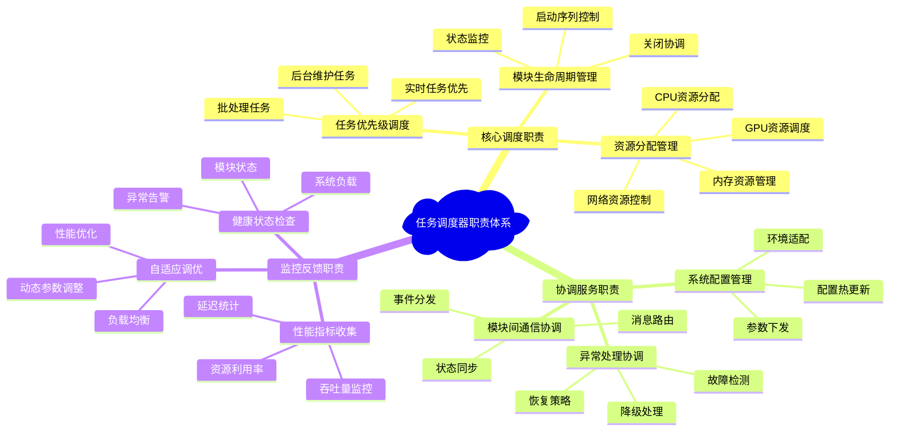

**职责边界说明**：任务调度器通过三大职责类别实现系统协调：核心调度职责负责基础的任务和资源管理，协调服务职责处理模块间协作和配置管理，监控反馈职责提供系统观测和自动优化能力。

### 2.2 模块边界和约束

**输入边界**：
- 各业务模块的生命周期事件和状态报告
- 用户通过显控接口发出的控制命令
- 配置管理器的系统配置和参数更新
- 资源监控器的实时资源使用情况

**输出边界**：
- 向各模块发出的启动、停止、配置更新命令
- 资源分配决策和调度指令
- 系统状态和性能指标报告
- 异常告警和恢复建议

**性能约束**：
- 调度决策延迟 < 1ms（关键路径）
- 模块状态检查频率 ≥ 100Hz
- 资源分配调整响应时间 < 5ms
- 系统启动时间 < 30秒

**技术约束**：
- 基于C++17实现，使用现代并发编程技术
- 支持跨平台部署（Linux/Windows）
- 依赖项目统一的错误处理和日志框架
- 集成Qt的信号槽机制进行事件通信

---

## 3 核心架构设计

### 3.1 调度器架构组织

任务调度器内部采用分层协作架构，确保高效的调度决策和可靠的系统协调：

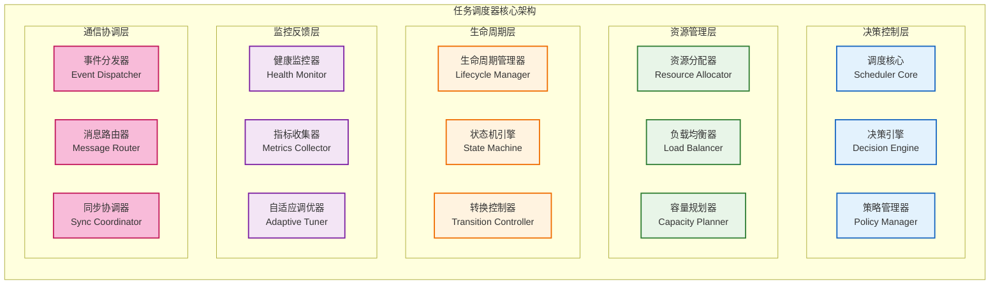

**架构说明**：任务调度器采用五层协作架构：决策控制层提供调度核心逻辑，资源管理层负责资源分配和负载均衡，生命周期层管理模块状态转换，监控反馈层提供系统观测和自动调优，通信协调层处理模块间通信和同步。各层通过清晰的接口协作，确保调度器的高效运行。

### 3.2 组件职责分工

| 组件名称           | 主要职责         | 关键功能             | 性能特征       |
| ------------------ | ---------------- | -------------------- | -------------- |
| **调度核心**       | 总体调度逻辑控制 | 任务分发、优先级管理 | 低延迟决策     |
| **决策引擎**       | 调度决策算法执行 | 负载分析、资源匹配   | 智能化调度     |
| **策略管理器**     | 调度策略配置管理 | 策略加载、动态调整   | 灵活配置       |
| **资源分配器**     | 系统资源分配决策 | CPU/GPU/内存分配     | 高效资源利用   |
| **负载均衡器**     | 负载分布优化     | 任务重分配、热点消除 | 均衡负载分布   |
| **容量规划器**     | 资源容量规划预测 | 容量预估、扩展建议   | 前瞻性规划     |
| **生命周期管理器** | 模块生命周期控制 | 启动序列、状态监控   | 可靠状态管理   |
| **状态机引擎**     | 状态转换逻辑执行 | 状态验证、转换控制   | 严格状态一致性 |
| **转换控制器**     | 状态转换过程控制 | 转换顺序、依赖检查   | 安全状态转换   |
| **健康监控器**     | 系统健康状态监控 | 异常检测、健康评估   | 实时健康感知   |
| **指标收集器**     | 性能指标数据收集 | 指标聚合、统计分析   | 全面性能洞察   |
| **自适应调优器**   | 系统参数自动调优 | 参数优化、性能提升   | 智能性能优化   |

### 3.3 调度执行模型

任务调度器的核心执行模型基于事件驱动和优先级队列的混合架构：

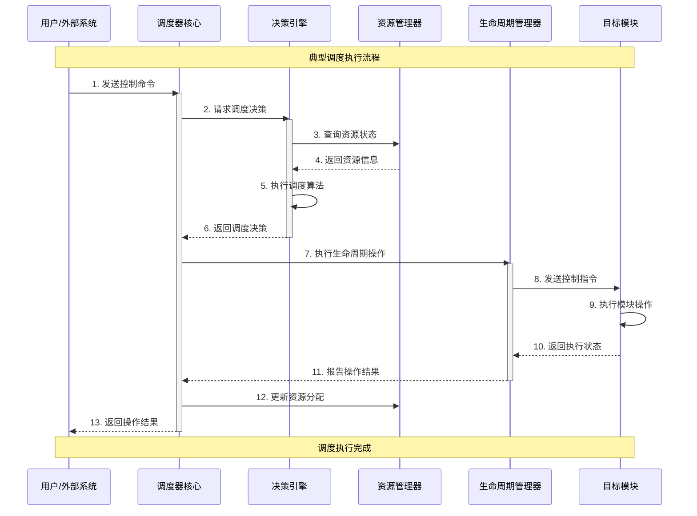

---

## 4 生命周期管理设计

### 4.1 模块状态机设计

系统中每个模块都遵循统一的状态机模型，确保生命周期管理的一致性：

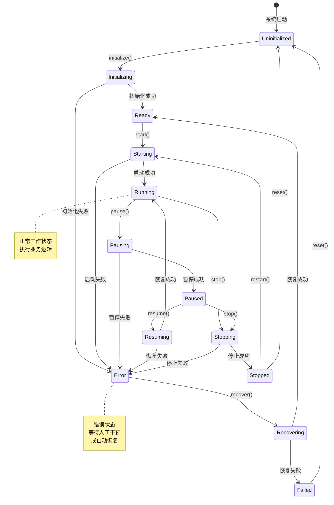

**状态定义说明**：
- **Uninitialized**：模块未初始化，等待系统启动
- **Initializing**：正在执行初始化过程
- **Ready**：初始化完成，准备启动
- **Starting**：正在启动模块
- **Running**：正常运行状态，执行业务功能
- **Pausing/Paused**：暂停状态，保持资源但停止处理
- **Stopping**：正在停止模块
- **Stopped**：已停止，资源已释放
- **Error**：错误状态，需要恢复或重置
- **Recovering**：正在执行错误恢复
- **Failed**：恢复失败，需要人工干预

### 4.2 生命周期控制流程

模块生命周期控制遵循严格的依赖顺序和超时机制：

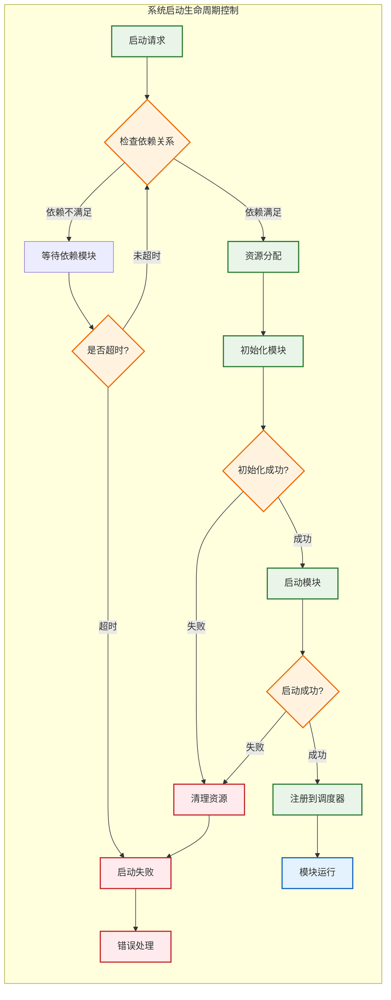

### 4.3 状态转换策略

状态转换采用基于规则的策略引擎，确保转换的安全性和一致性：

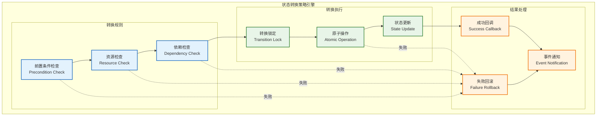

---

## 5 任务调度策略

### 5.1 优先级调度机制

系统采用多级优先级调度机制，确保关键任务的实时性：

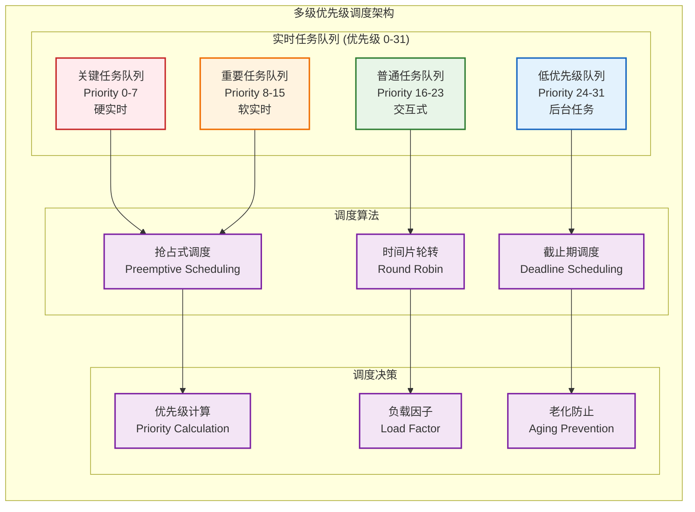

**优先级分配策略**：

| 优先级范围 | 任务类型           | 调度策略   | 典型用例              |
| ---------- | ------------------ | ---------- | --------------------- |
| **0-7**    | 关键任务（硬实时） | 抢占式调度 | 数据接收、GPU任务提交 |
| **8-15**   | 重要任务（软实时） | 抢占式调度 | 信号处理、检测算法    |
| **16-23**  | 普通任务（交互式） | 时间片轮转 | 界面更新、用户交互    |
| **24-31**  | 后台任务（批处理） | 截止期调度 | 日志处理、统计分析    |

### 5.2 负载均衡算法

负载均衡器采用多种算法的组合策略，实现最优的资源利用：

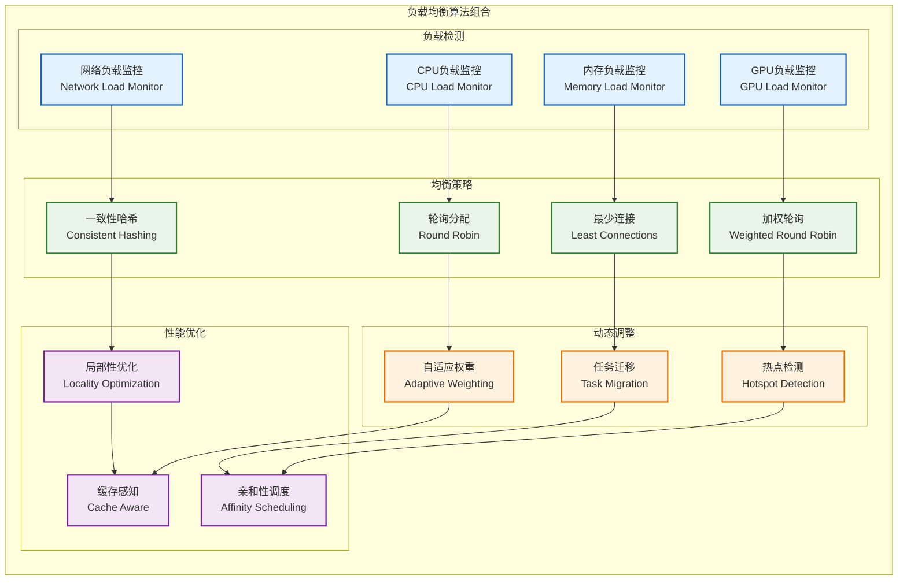

### 5.3 调度决策引擎

调度决策引擎基于规则引擎和机器学习的混合架构：

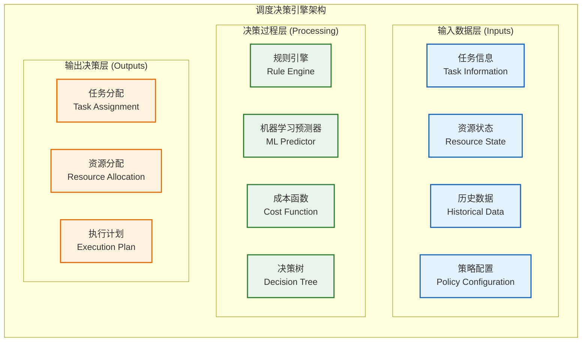

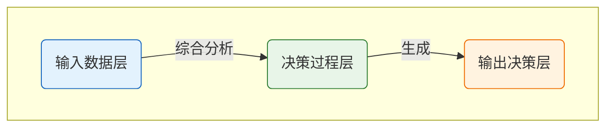

**决策引擎架构说明**：调度决策引擎采用三层数据流处理架构：
- **输入数据层**：收集任务信息、资源状态、历史数据和策略配置四类关键输入
- **决策过程层**：通过规则引擎处理确定性逻辑，机器学习预测器处理模式识别，成本函数优化资源分配，决策树处理复杂决策场景
- **输出决策层**：生成任务分配方案、资源分配策略、执行计划和备用策略四类决策输出

整个引擎支持实时决策和批量优化两种模式，确保在不同负载下的高效调度。

---

## 6 资源管理设计

### 6.1 资源分配策略

系统资源分配采用分层预留和动态调整相结合的策略：

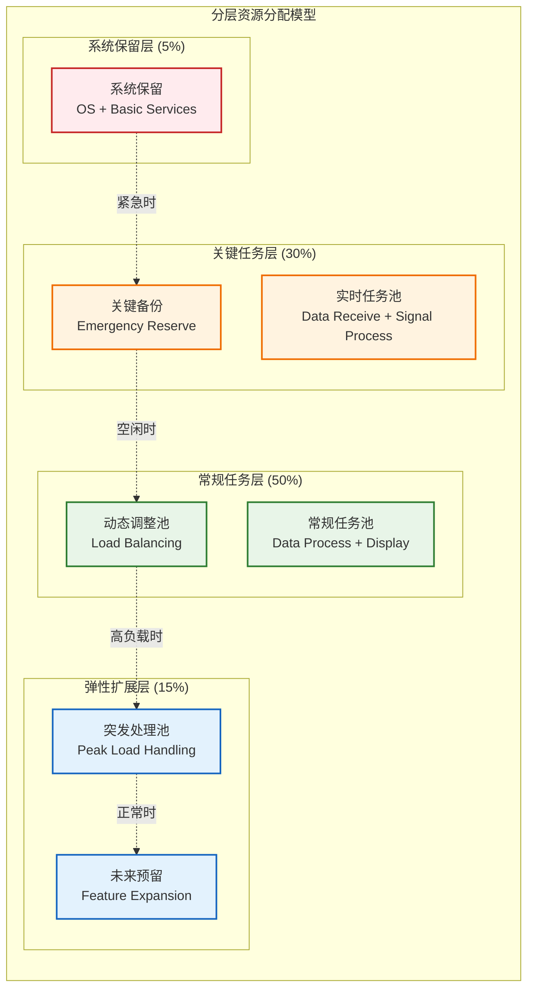

**资源分配算法**：
```cpp
/**
 * @brief 资源分配决策算法（示例框架）
 * @note 实际实现需使用项目中定义的 ResourcePool、TaskRequest 等类型
 */
class ResourceAllocator {
public:
    /**
     * @brief 根据任务请求分配资源
     * @param[in] request 任务资源请求
     * @param[out] allocation 分配结果
     * @return ErrorCode 分配结果状态
     */
    ErrorCode allocateResources(const TaskRequest& request, ResourceAllocation& allocation) {
        // 1. 检查资源可用性
        if (!checkResourceAvailability(request)) {
            return ResourceErrors::INSUFFICIENT_RESOURCES;
        }

        // 2. 计算分配策略
        AllocationStrategy strategy = calculateAllocationStrategy(request);

        // 3. 执行资源分配
        return executeAllocation(strategy, allocation);
    }

private:
    /**
     * @brief 检查资源可用性
     */
    bool checkResourceAvailability(const TaskRequest& request) const;

    /**
     * @brief 计算分配策略
     */
    AllocationStrategy calculateAllocationStrategy(const TaskRequest& request) const;

    /**
     * @brief 执行资源分配
     */
    ErrorCode executeAllocation(const AllocationStrategy& strategy, ResourceAllocation& allocation);
};
```

### 6.2 资源监控机制

实时资源监控系统提供全面的资源可视性：

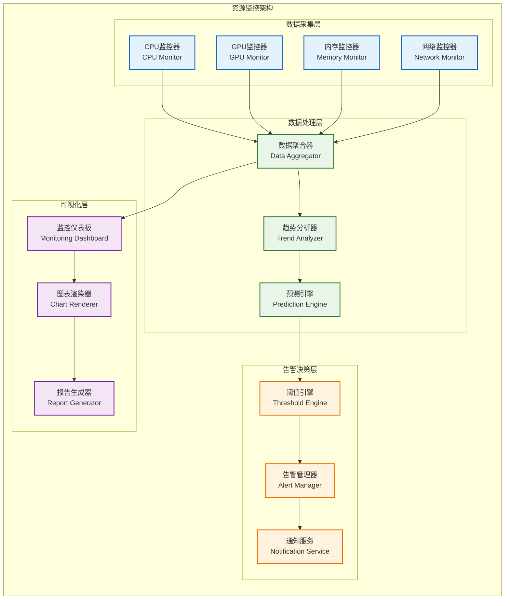

### 6.3 资源回收与优化

智能资源回收机制确保资源的高效利用：

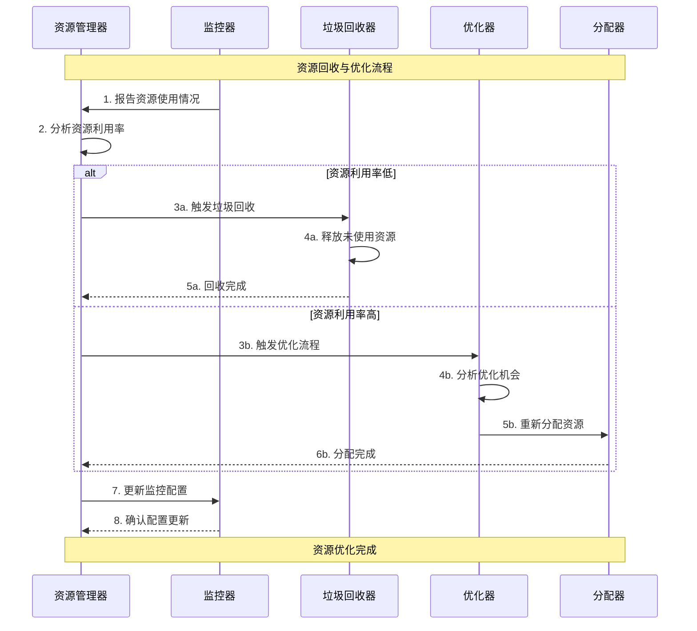

---

## 7 并发控制设计

### 7.1 同步协调机制

任务调度器采用多层次的同步协调机制确保系统的一致性：

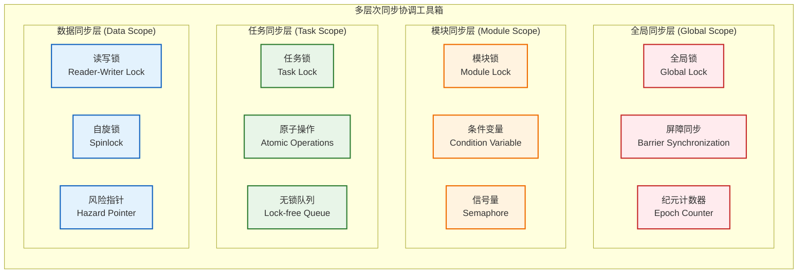

**同步协调架构说明**：此图展示了一个按作用范围划分的“同步工具箱”，而非组件间的依赖关系。开发者应根据并发场景选择合适的工具：
-   **全局同步层**：提供用于系统级、粗粒度同步的工具，如系统启停时使用全局锁和屏障同步，纪元计数器提供全局时序保证。
-   **模块同步层**：提供用于模块间协作的同步原语，如通过条件变量实现生产者-消费者模式，使用信号量控制模块资源访问。
-   **任务同步层**：提供用于任务级别的并发控制工具，任务锁保护任务状态，原子操作实现无锁的快速同步，无锁队列提供高性能任务传递。
-   **数据同步层**：提供用于共享数据保护的同步机制，读写锁优化读多写少场景，自旋锁适用于短期锁定，风险指针实现安全的内存回收。

每个层次的同步机制都针对特定的并发场景优化，开发者可以根据具体需求组合使用这些工具。


**同步原语选择策略**：

| 场景类型         | 推荐同步原语        | 适用条件           | 性能特征           |
| ---------------- | ------------------- | ------------------ | ------------------ |
| **全局状态变更** | 全局锁 + 屏障       | 系统启停、配置更新 | 低频、高一致性     |
| **模块间协调**   | 条件变量 + 信号量   | 模块启停、状态同步 | 中频、可等待       |
| **任务队列操作** | 无锁队列 + 原子操作 | 高频任务分发       | 高频、低延迟       |
| **共享数据访问** | 读写锁 + 风险指针   | 配置读取、状态查询 | 读多写少、安全回收 |

### 7.2 死锁预防策略

采用静态预防和动态检测相结合的死锁预防机制：

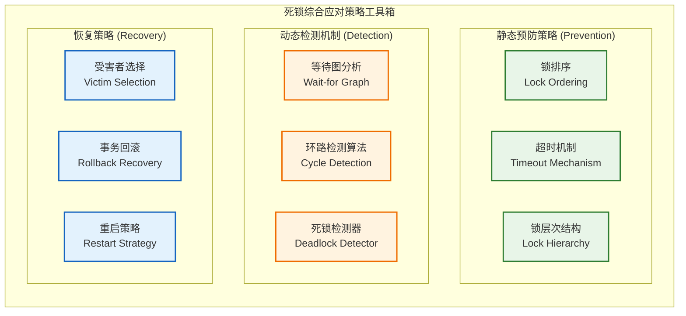


**死锁应对策略说明**：系统采用三类策略共同防治死锁，形成完整的死锁解决方案：
-   **静态预防策略**：在编码阶段通过强制的规范来避免死锁的产生。锁排序确保所有线程按照相同的顺序获取锁；超时机制防止线程无限等待；锁层次结构通过分层访问规则避免循环等待。这是最主要的防线。
-   **动态检测机制**：在系统运行时，后台的死锁检测器通过分析线程等待关系来发现已经形成的死锁。等待图分析构建线程间的等待关系图；环路检测算法识别等待图中的循环；检测器协调整个检测过程。
-   **恢复策略**：一旦检测到死锁，系统将采取预设策略来解除死锁。受害者选择算法确定需要中断的线程；事务回滚机制恢复被中断线程的状态；重启策略处理恢复失败的情况。

这三类策略是相互补充的，共同确保系统在复杂并发环境下的稳定运行。


---

## 8 系统启停控制

### 8.1 系统启动流程

系统启动采用分阶段依赖驱动的启动流程：

**启动时序规划**：

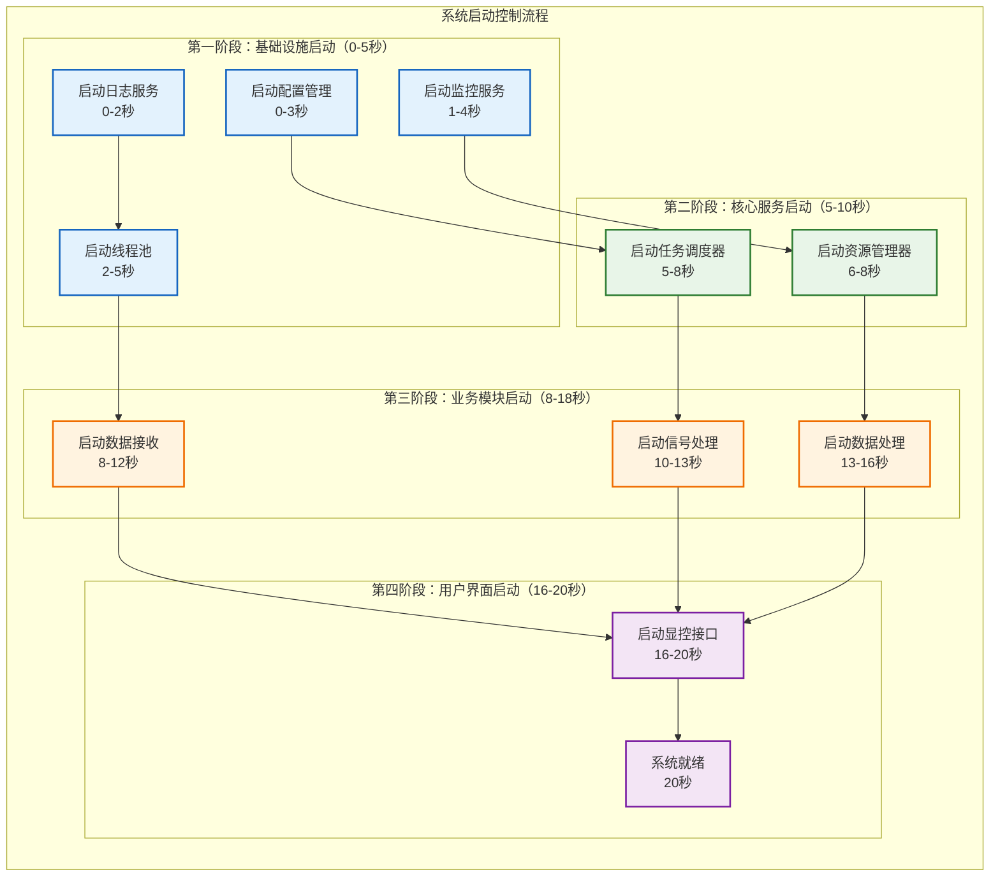

**启动流程说明**：系统启动采用四阶段分层启动策略，确保依赖关系的正确性。基础设施层提供日志、配置、监控等基础服务；核心服务层建立调度和资源管理能力；业务模块层启动数据处理功能；用户界面层最后启动确保所有后端服务可用。每个阶段都有明确的时间窗口和检查点。

### 8.2 优雅关闭机制

系统关闭采用反向依赖的优雅关闭流程：

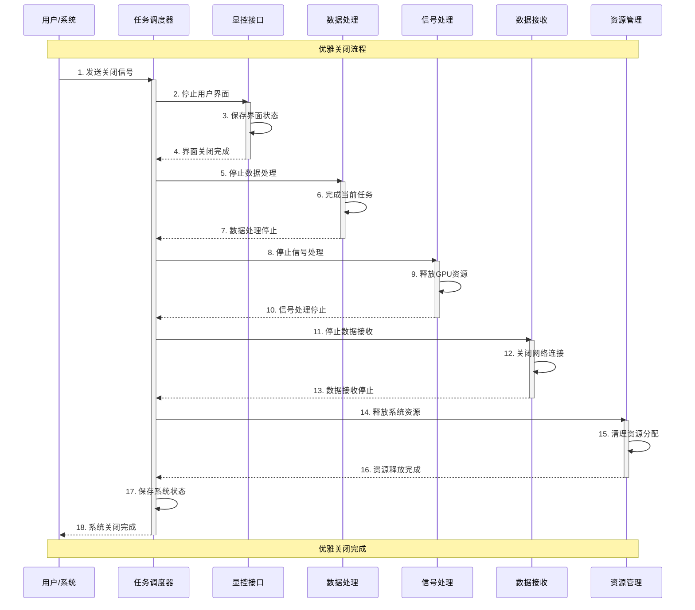

**关闭流程说明**：优雅关闭采用由上到下的逐层停止策略，确保数据完整性和资源正确释放。用户界面首先停止避免新的操作请求；数据处理模块完成当前任务后停止；信号处理模块释放GPU资源；数据接收模块关闭网络连接；最后释放系统资源并保存状态。整个过程提供超时保护避免无限等待。

### 8.3 启停状态管理

```mermaid
stateDiagram-v2
    [*] --> Initializing : 系统启动请求

    Initializing --> ConfigLoading : 开始配置加载
    ConfigLoading --> ModuleCreating : 配置验证成功
    ConfigLoading --> StartupFailed : 配置验证失败

    ModuleCreating --> ModuleInitializing : 模块创建完成
    ModuleCreating --> StartupFailed : 模块创建失败

    ModuleInitializing --> SystemRunning : 所有模块初始化成功
    ModuleInitializing --> StartupFailed : 模块初始化失败

    SystemRunning --> ShuttingDown : 接收关闭信号

    ShuttingDown --> ModuleStopping : 开始停止模块
    ModuleStopping --> ResourceCleaning : 模块停止完成
    ResourceCleaning --> SystemStopped : 资源清理完成

    StartupFailed --> SystemStopped : 启动失败处理

    SystemStopped --> [*] : 系统完全停止

    note right of SystemRunning : 正常运行状态
    note right of ShuttingDown : 优雅关闭状态
    note right of StartupFailed : 启动失败状态
```

**状态管理说明**：启停状态管理提供清晰的状态转换控制，每个状态都有明确的进入条件和退出条件。启动过程包括配置加载、模块创建、模块初始化三个关键阶段；关闭过程包括模块停止、资源清理两个主要阶段。失败状态提供错误恢复和清理机制。

---

## 9 异常处理与恢复

### 9.1 故障检测机制

多层次的故障检测机制确保系统异常的及时发现：

```mermaid
graph TB
    subgraph "分层故障检测架构"
        direction TB

        subgraph "应用层检测"
            HEARTBEAT[心跳检测<br/>Heartbeat Monitor]
            WATCHDOG[看门狗<br/>Watchdog Timer]
            HEALTH_CHECK[健康检查<br/>Health Check]
        end

        subgraph "系统层检测"
            RESOURCE_MONITOR[资源监控<br/>Resource Monitor]
            PERFORMANCE_GUARD[性能守护<br/>Performance Guard]
            EXCEPTION_HANDLER[异常处理器<br/>Exception Handler]
        end

        subgraph "硬件层检测"
            HARDWARE_MONITOR[硬件监控<br/>Hardware Monitor]
            SENSOR_CHECK[传感器检查<br/>Sensor Check]
            THERMAL_GUARD[温度保护<br/>Thermal Guard]
        end

        subgraph "检测策略"
            PROACTIVE_DETECT[主动检测<br/>Proactive Detection]
            REACTIVE_DETECT[被动检测<br/>Reactive Detection]
            PREDICTIVE_DETECT[预测检测<br/>Predictive Detection]
        end

        %% 检测流程
        HEARTBEAT --> PROACTIVE_DETECT
        WATCHDOG --> REACTIVE_DETECT
        HEALTH_CHECK --> PREDICTIVE_DETECT

        RESOURCE_MONITOR --> PROACTIVE_DETECT
        PERFORMANCE_GUARD --> REACTIVE_DETECT
        EXCEPTION_HANDLER --> PREDICTIVE_DETECT

        HARDWARE_MONITOR --> PROACTIVE_DETECT
        SENSOR_CHECK --> REACTIVE_DETECT
        THERMAL_GUARD --> PREDICTIVE_DETECT
    end

    classDef app fill:#e3f2fd,stroke:#1565c0,stroke-width:2px
    classDef system fill:#e8f5e8,stroke:#2e7d32,stroke-width:2px
    classDef hardware fill:#fff3e0,stroke:#ef6c00,stroke-width:2px
    classDef strategy fill:#f3e5f5,stroke:#7b1fa2,stroke-width:2px

    class HEARTBEAT,WATCHDOG,HEALTH_CHECK app
    class RESOURCE_MONITOR,PERFORMANCE_GUARD,EXCEPTION_HANDLER system
    class HARDWARE_MONITOR,SENSOR_CHECK,THERMAL_GUARD hardware
    class PROACTIVE_DETECT,REACTIVE_DETECT,PREDICTIVE_DETECT strategy
```

### 9.2 自动恢复策略

基于故障类型和严重程度的分级恢复策略：

```mermaid
flowchart TD
    subgraph "自动恢复决策树"
        FAULT_DETECTED[检测到故障] --> FAULT_CLASSIFY{故障分类}

        FAULT_CLASSIFY -->|轻微故障| SOFT_RECOVERY[软恢复策略]
        FAULT_CLASSIFY -->|中等故障| MODERATE_RECOVERY[中等恢复策略]
        FAULT_CLASSIFY -->|严重故障| HARD_RECOVERY[硬恢复策略]
        FAULT_CLASSIFY -->|致命故障| EMERGENCY_SHUTDOWN[紧急关闭]

        SOFT_RECOVERY --> RETRY_OPERATION[重试操作]
        RETRY_OPERATION --> RETRY_SUCCESS{重试成功?}
        RETRY_SUCCESS -->|是| RESUME_NORMAL[恢复正常]
        RETRY_SUCCESS -->|否| LOG_WARNING[记录警告]

        MODERATE_RECOVERY --> RESET_MODULE[重置模块]
        RESET_MODULE --> RESET_SUCCESS{重置成功?}
        RESET_SUCCESS -->|是| RESUME_NORMAL
        RESET_SUCCESS -->|否| ESCALATE_RECOVERY[升级恢复]

        HARD_RECOVERY --> RESTART_SERVICE[重启服务]
        RESTART_SERVICE --> RESTART_SUCCESS{重启成功?}
        RESTART_SUCCESS -->|是| RESUME_NORMAL
        RESTART_SUCCESS -->|否| EMERGENCY_SHUTDOWN

        EMERGENCY_SHUTDOWN --> SAVE_STATE[保存状态]
        SAVE_STATE --> SAFE_SHUTDOWN[安全关闭]

        LOG_WARNING --> CONTINUE_MONITOR[继续监控]
        ESCALATE_RECOVERY --> HARD_RECOVERY
        RESUME_NORMAL --> CONTINUE_MONITOR
    end

    classDef detection fill:#fff3e0,stroke:#ef6c00,stroke-width:2px
    classDef decision fill:#e3f2fd,stroke:#1565c0,stroke-width:2px
    classDef recovery fill:#e8f5e8,stroke:#2e7d32,stroke-width:2px
    classDef emergency fill:#ffebee,stroke:#c62828,stroke-width:2px

    class FAULT_DETECTED detection
    class FAULT_CLASSIFY,RETRY_SUCCESS,RESET_SUCCESS,RESTART_SUCCESS decision
    class SOFT_RECOVERY,MODERATE_RECOVERY,HARD_RECOVERY,RETRY_OPERATION,RESET_MODULE,RESTART_SERVICE recovery
    class EMERGENCY_SHUTDOWN,SAVE_STATE,SAFE_SHUTDOWN emergency
```

---

## 10 性能监控与调优

**关键性能指标（KPI）监控**：

| 指标类别       | 具体指标               | 目标值            | 监控频率 |
| -------------- | ---------------------- | ----------------- | -------- |
| **调度性能**   | 调度决策延迟           | < 1ms             | 实时     |
|                | 任务排队时间           | < 5ms             | 实时     |
|                | 调度吞吐量             | > 10000 tasks/sec | 每秒     |
| **资源利用率** | CPU利用率              | 60%-80%           | 每秒     |
|                | GPU利用率              | > 80%             | 每秒     |
|                | 内存利用率             | < 80%             | 每秒     |
| **系统稳定性** | 平均故障间隔时间(MTBF) | > 1000小时        | 每小时   |
|                | 平均修复时间(MTTR)     | < 5分钟           | 每次故障 |
|                | 系统可用性             | > 99.9%           | 每天     |
| **响应性能**   | 模块启动时间           | < 10秒            | 每次启动 |
|                | 状态转换时间           | < 100ms           | 每次转换 |

**自适应调优机制**：
- **动态优先级调整**：根据任务完成情况和资源使用率自动调整任务优先级
- **负载预测**：基于历史数据预测系统负载，提前进行资源调配
- **热点检测**：自动检测系统瓶颈和热点，触发负载重分配
- **参数自优化**：使用强化学习算法自动优化调度参数

---

## 11 模块约束说明

**功能约束**：
- MVP阶段提供基础的任务调度和生命周期管理功能
- 支持最大64个并发任务的调度管理
- 支持4级优先级的任务调度策略
- 提供基本的故障检测和自动恢复机制

**性能约束**：
- 调度决策延迟不超过1ms
- 支持10000任务/秒的调度吞吐量
- 内存使用控制在256MB以内
- CPU使用率控制在15%以内

**技术约束**：
- 基于C++17标准开发
- 使用项目统一的IModule接口规范
- 集成项目统一的错误处理和日志框架
- 支持Linux和Windows跨平台部署

**扩展约束**：
- 调度策略支持插件化扩展
- 预留分布式调度接口
- 支持自定义资源类型和分配策略
- 预留机器学习调度算法接口

---

## 12 相关文档

- [数据接收模块设计](01_数据接收模块设计.md)
- [信号处理模块设计](02_信号处理模块设计.md)
- [数据处理模块设计](03_数据处理模块设计.md)
- [显控接口模块设计](04_显控接口模块设计.md)
- [MVP系统设计文档](../MVP系统设计文档.md)
- [模块集成策略](99_模块集成策略.md)

---

## 13 变更历史

| 版本   | 日期       | 作者  | 变更描述                                                                                                                                               |
| ------ | ---------- | ----- | ------------------------------------------------------------------------------------------------------------------------------------------------------ |
| v1.1.0 | 2025-09-23 | Kelin | 修复调度决策引擎、同步协调机制、系统启停控制等图表的语义问题；移除误导性箭头关系；为所有复杂图表添加详细文字说明；统一图表规范以区分功能分组与逻辑流程 |
| v1.0.0 | 2025-09-23 | Kelin | 基于MVP设计文档和系统架构创建任务调度器设计，包含完整的调度机制、生命周期管理、资源分配和异常处理设计                                                  |

---

*本任务调度器设计为雷达数据处理系统的核心协调模块提供详细的架构指导，确保系统的高效协调和可靠运行。*
