# 配置管理模块设计

**文档版本**: v1.0.0
**最后更新**: 2025-09-23
**负责人**: Kelin
**适用阶段**: MVP及向 V2.0 性能优化过渡阶段
**来源依据**: 基于《MVP系统设计文档》第5.4章配置管理模块和第2.2.1章详细组件架构

---

## 1 文档职责

本文件详细设计配置管理模块的内部架构和核心机制，侧重"统一配置服务与参数管理中枢"的设计实现：
1) 分层配置架构和配置源管理策略
2) YAML配置文件解析和验证机制
3) 运行时配置热更新和变更通知
4) 配置缓存和性能优化设计
5) 配置安全和访问控制策略
6) 配置版本管理和回滚机制

已明确不在本文件范围内的内容：具体的配置文件格式定义、配置编辑器UI实现、外部配置中心集成、配置加密算法实现等（这些在相应的专项文档中维护）。

### 1.1 目录
- [配置管理模块设计](#配置管理模块设计)
  - [1 文档职责](#1-文档职责)
    - [1.1 目录](#11-目录)
  - [2 模块总体设计](#2-模块总体设计)
    - [2.1 模块职责定义](#21-模块职责定义)
    - [2.2 模块边界和约束](#22-模块边界和约束)
  - [3 配置架构设计](#3-配置架构设计)
    - [3.1 分层配置模型](#31-分层配置模型)
    - [3.2 配置源管理](#32-配置源管理)
    - [3.3 配置生命周期](#33-配置生命周期)
  - [4 配置解析与验证](#4-配置解析与验证)
    - [4.1 YAML解析引擎](#41-yaml解析引擎)
    - [4.2 配置验证框架](#42-配置验证框架)
    - [4.3 配置格式定义](#43-配置格式定义)
  - [5 配置服务设计](#5-配置服务设计)
    - [5.1 配置访问接口](#51-配置访问接口)
    - [5.2 配置缓存机制](#52-配置缓存机制)
    - [5.3 配置变更通知](#53-配置变更通知)
  - [6 运行时配置管理](#6-运行时配置管理)
    - [6.1 热更新机制](#61-热更新机制)
    - [6.2 配置版本控制](#62-配置版本控制)
    - [6.3 配置回滚策略](#63-配置回滚策略)
  - [7 配置安全设计](#7-配置安全设计)
    - [7.1 访问控制模型](#71-访问控制模型)
    - [7.2 配置加密保护](#72-配置加密保护)
  - [8 性能优化设计](#8-性能优化设计)
  - [9 模块约束说明](#9-模块约束说明)
  - [10 相关文档](#10-相关文档)
  - [11 变更历史](#11-变更历史)

---

## 2 模块总体设计

### 2.1 模块职责定义

配置管理模块作为系统的配置服务中枢，承担配置加载、验证、分发和管理的核心职责：

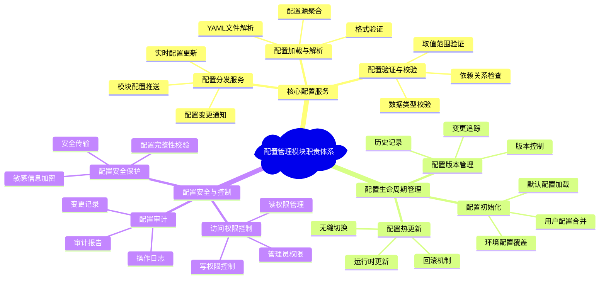

**职责边界说明**：配置管理模块通过三大职责类别实现完整的配置服务：核心配置服务提供基础的配置处理能力，配置生命周期管理确保配置的动态管理，配置安全与控制保障配置的安全性和可控性。

### 2.2 模块边界和约束

**输入边界**：
- 系统配置文件（YAML格式的多层配置文件）
- 环境变量和命令行参数覆盖
- 运行时配置更新请求（来自管理员或外部系统）
- 模块配置查询和订阅请求

**输出边界**：
- 向各模块提供标准化的配置对象
- 配置变更事件和通知消息
- 配置状态和健康检查报告
- 配置审计日志和变更记录

**性能约束**：
- 配置查询响应时间 < 1ms（缓存命中）
- 配置文件加载时间 < 5秒（最大10MB配置文件）
- 配置变更通知延迟 < 100ms
- 支持1000+并发配置查询请求

**技术约束**：
- 基于yaml-cpp库进行YAML解析
- 支持UTF-8编码的配置文件
- 集成项目统一的错误处理和日志框架
- 实现IModule接口和IConfigurable接口

---

## 3 配置架构设计

### 3.1 分层配置模型

配置管理采用分层覆盖模型，支持配置的继承和覆盖：

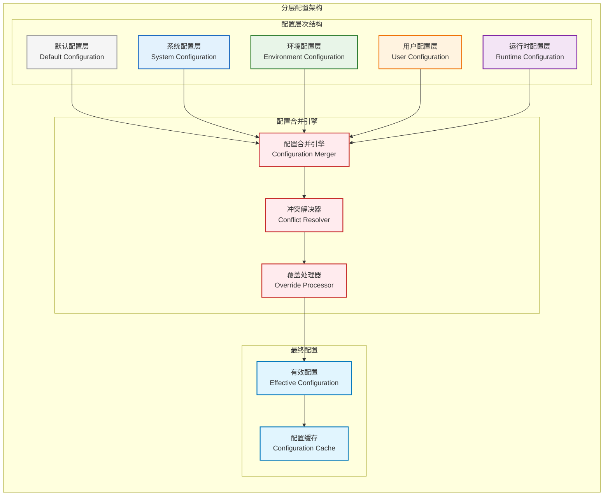

**配置层次说明**：
- **默认配置层**：编译时嵌入的默认配置，提供系统基本运行参数
- **系统配置层**：系统级配置文件，包含硬件和平台相关配置
- **环境配置层**：环境变量和部署环境特定配置
- **用户配置层**：用户自定义配置，包含个性化设置
- **运行时配置层**：运行时动态修改的配置，优先级最高

### 3.2 配置源管理

多种配置源的统一管理和优先级控制：

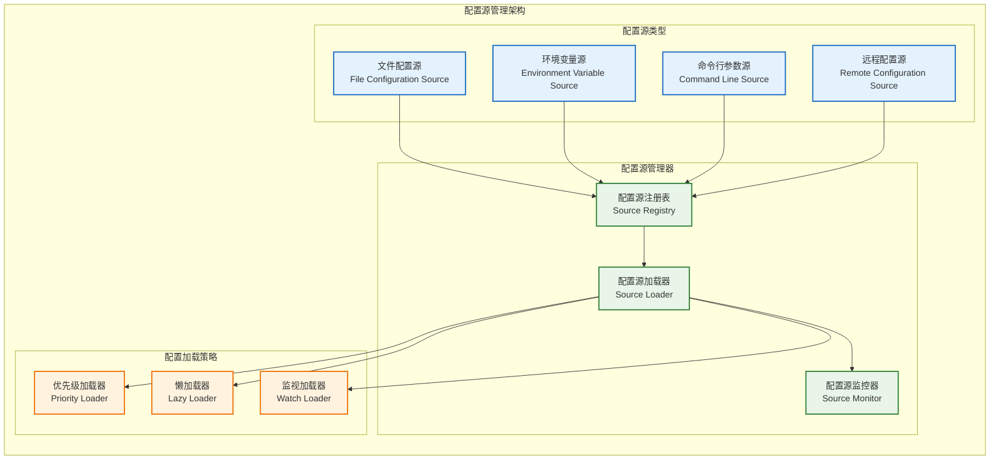

### 3.3 配置生命周期

配置从加载到销毁的完整生命周期管理：

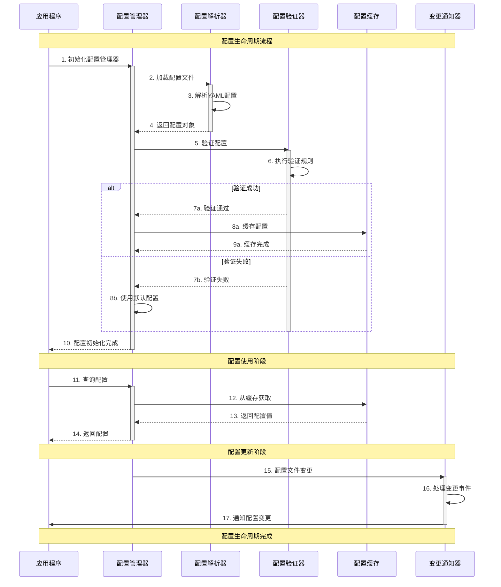

---

## 4 配置解析与验证

### 4.1 YAML解析引擎

基于yaml-cpp的高效YAML解析引擎：

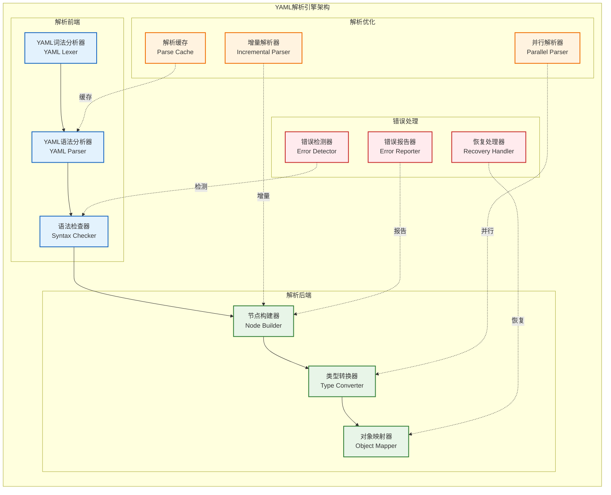

### 4.2 配置验证框架

多层次的配置验证框架确保配置的正确性：

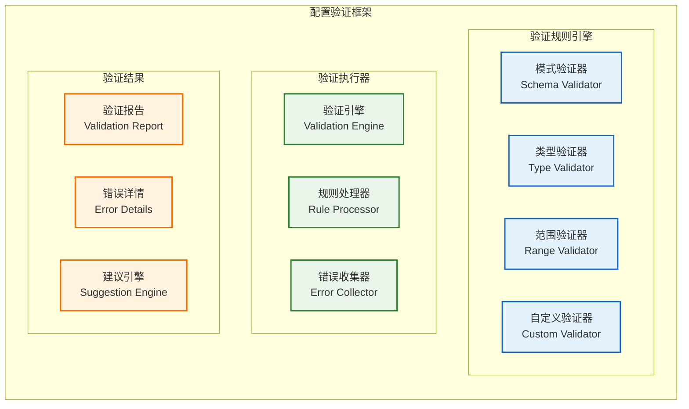

### 4.3 配置格式定义

标准化的配置文件格式和结构定义：

**主配置文件结构**：
```yaml
# 系统基础配置
system:
  name: "Radar Data Processing System"
  version: "1.0.0"
  log_level: "INFO"
  max_threads: 8

# 数据接收模块配置
data_receiver:
  network:
    bind_address: "0.0.0.0"
    port: 12345
    buffer_size: 65536
    timeout_ms: 1000
  processing:
    max_packet_rate: 10000
    validation_enabled: true
    error_threshold: 0.001

# 信号处理模块配置
signal_processor:
  gpu:
    device_id: 0
    memory_pool_size: "1GB"
    compute_capability: "6.0"
  algorithms:
    fft_size: 1024
    filter_type: "butterworth"
    thread_pool_size: 4

# 数据处理模块配置
data_processor:
  cfar:
    threshold: 0.5
    guard_cells: 4
    reference_cells: 16
  tracking:
    max_targets: 1000
    prediction_time: 0.1
    association_gate: 0.95

# 显控接口模块配置
display_controller:
  ui:
    theme: "dark"
    refresh_rate: 30
    max_chart_points: 10000
  charts:
    enable_antialiasing: true
    color_scheme: "spectrum"

# 任务调度器配置
task_scheduler:
  scheduling:
    algorithm: "priority_based"
    time_slice_ms: 10
    max_queue_size: 1000
  resource_management:
    cpu_affinity_enabled: true
    gpu_scheduling_enabled: true
```

---

## 5 配置服务设计

### 5.1 配置访问接口

标准化的配置访问接口设计：

```cpp
/**
 * @brief 配置管理器接口
 * @note 提供统一的配置访问和管理服务
 */
class IConfigurationManager : public IModule, public IService {
public:
    /**
     * @brief 获取服务名称
     */
    const char* getServiceName() const override { return "ConfigurationManager"; }

    /**
     * @brief 获取配置值（模板方法）
     * @tparam T 配置值类型
     * @param[in] key 配置键路径（如 "data_receiver.network.port"）
     * @param[in] default_value 默认值
     * @return T 配置值
     */
    template<typename T>
    T getValue(const std::string& key, const T& default_value = T{}) const;

    /**
     * @brief 设置配置值
     * @tparam T 配置值类型
     * @param[in] key 配置键路径
     * @param[in] value 配置值
     * @return ErrorCode 操作结果
     */
    template<typename T>
    ErrorCode setValue(const std::string& key, const T& value);

    /**
     * @brief 获取模块配置对象
     * @param[in] module_name 模块名称
     * @return ModuleConfig 模块配置对象
     */
    virtual ModuleConfig getModuleConfig(const std::string& module_name) const = 0;

    /**
     * @brief 订阅配置变更通知
     * @param[in] key 配置键路径（支持通配符）
     * @param[in] callback 变更回调函数
     * @return ErrorCode 订阅结果
     */
    virtual ErrorCode subscribe(const std::string& key,
                               ConfigChangeCallback callback) = 0;

    /**
     * @brief 重新加载配置
     * @return ErrorCode 重新加载结果
     */
    virtual ErrorCode reload() = 0;

    /**
     * @brief 验证配置完整性
     * @return ValidationResult 验证结果
     */
    virtual ValidationResult validate() const = 0;
};

/**
 * @brief 配置变更回调函数类型
 */
using ConfigChangeCallback = std::function<void(const std::string& key,
                                               const ConfigValue& old_value,
                                               const ConfigValue& new_value)>;

/**
 * @brief 模块配置基类
 */
class ModuleConfig {
public:
    /**
     * @brief 获取模块名称
     */
    virtual std::string getModuleName() const = 0;

    /**
     * @brief 配置是否有效
     */
    virtual bool isValid() const = 0;

    /**
     * @brief 获取配置版本
     */
    virtual std::string getVersion() const = 0;

    virtual ~ModuleConfig() = default;
};
```

### 5.2 配置缓存机制

高效的配置缓存机制减少配置查询开销：

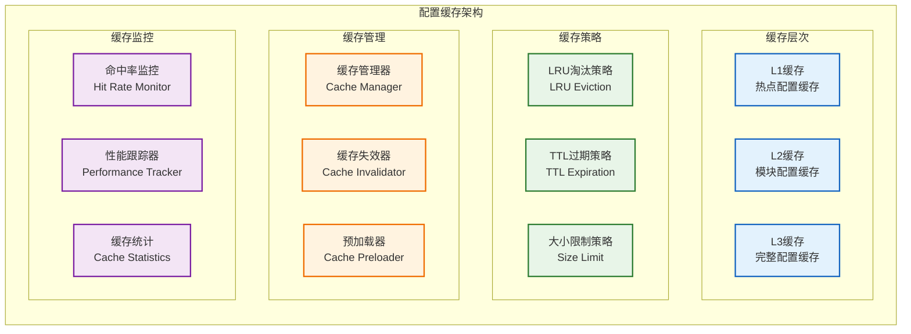

### 5.3 配置变更通知

实时的配置变更通知机制：

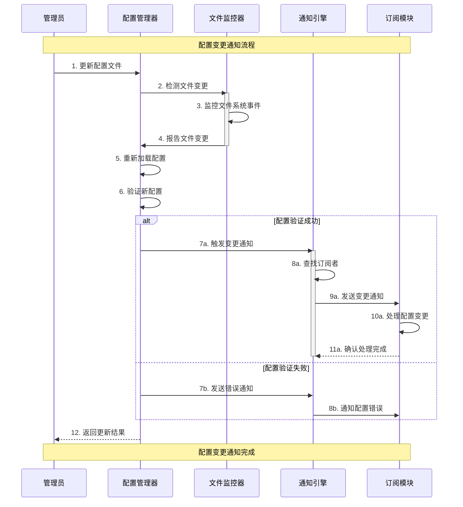

---

## 6 运行时配置管理

### 6.1 热更新机制

为支持系统在不中断服务的情况下动态调整参数，配置管理器提供热更新能力。

#### 6.1.1 配置变更等级
为了确保热更新的安全性与稳定性，所有受管理的配置项必须根据其对系统的影响，划分为以下三个等级之一：

| 等级  | 名称                            | 描述                                                                         | 典型示例                               | 生效方式                                                                                  |
| :---- | :------------------------------ | :--------------------------------------------------------------------------- | :------------------------------------- | :---------------------------------------------------------------------------------------- |
| **1** | **动态配置 (Dynamic)**          | 可在模块运行时安全地立即应用，不影响模块状态和数据流。                       | 日志级别、UI主题、监控指标阈值         | 模块通过回调函数或轮询直接应用新值。                                                      |
| **2** | **重载配置 (Reloadable)**       | 需要模块执行一个特定的重载逻辑来应用，通常不中断服务，但可能有短暂性能影响。 | 算法参数（如滤波器系数）、处理策略开关 | `ConfigManager` 通知 `TaskScheduler`，由调度器调用模块的 `IConfigurable::reload()` 接口。 |
| **3** | **重启配置 (Restart-Required)** | 变更会影响模块的基础结构，必须先停止模块，应用新配置后，再重新启动。         | 监听端口、线程池大小、GPU设备ID        | `ConfigManager` 通知 `TaskScheduler`，由调度器负责目标模块的优雅停止、重新配置和启动。    |

#### 6.1.2 热更新流程
热更新流程由配置管理器发起，但由任务调度器协调执行，以保证模块状态的一致性。

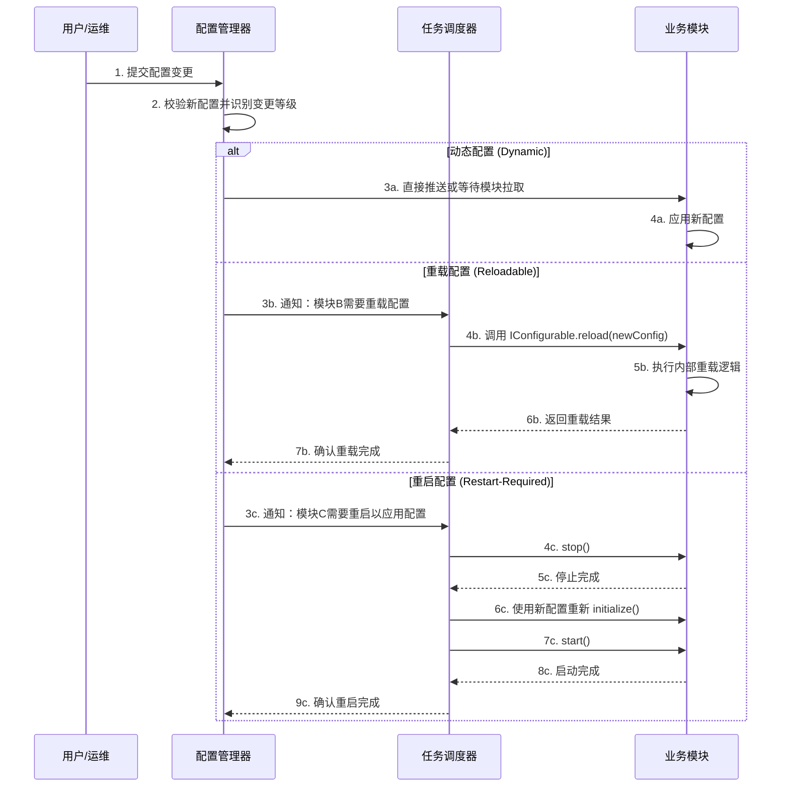
**流程说明**：
1.  **变更识别**：`ConfigManager` 在接收到变更后，首先根据预设的规则判断每个变更项的等级。
2.  **分级处理**：
    *   对于**动态配置**，直接由模块自行处理。
    *   对于**重载**和**重启**配置，`ConfigManager` 将变更通知和相关信息发送给 `TaskScheduler`。
3.  **调度器协调**：`TaskScheduler` 作为系统状态的维护者，负责调用目标模块的相应接口（`reload()` 或 `stop`/`start`），确保配置变更在正确的时机和状态下被安全应用。

这种设计将配置变更的**决策权**（识别等级）保留在 `ConfigManager`，而将**执行权**（协调模块状态）赋予 `TaskScheduler`，实现了职责分离，保证了系统的稳定性。

### 6.2 配置持久化

配置变更可选的持久化到磁盘：

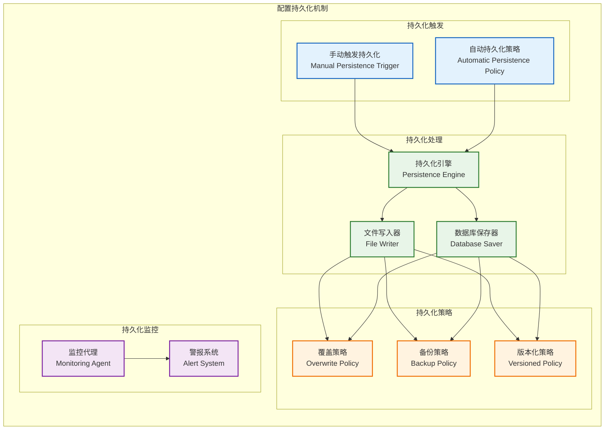

---

## 7 配置安全设计

### 7.1 访问控制模型

基于角色的配置访问控制：

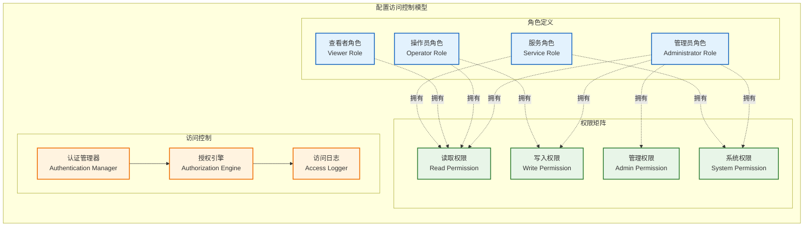

### 7.2 配置加密保护

敏感配置信息的加密保护机制：

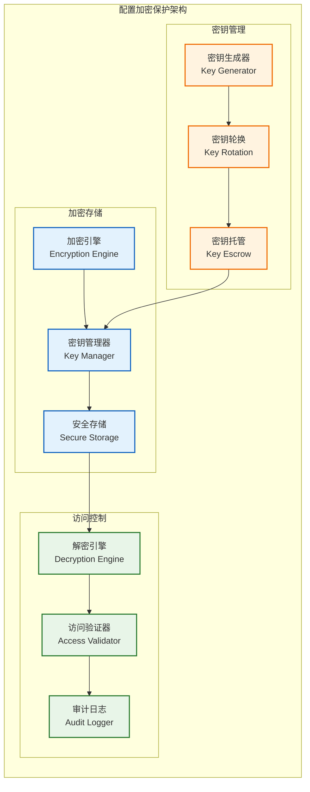

---

## 8 性能优化设计

**配置访问性能优化策略**：

| 优化技术       | 实现方式         | 性能提升       | 适用场景       |
| -------------- | ---------------- | -------------- | -------------- |
| **多级缓存**   | L1/L2/L3缓存架构 | 查询延迟<1ms   | 热点配置访问   |
| **预编译配置** | 编译时配置常量化 | 零运行时开销   | 静态配置项     |
| **配置压缩**   | YAML压缩存储     | 内存减少60%    | 大型配置文件   |
| **延迟加载**   | 按需加载配置模块 | 启动时间减半   | 复杂配置结构   |
| **并行解析**   | 多线程YAML解析   | 解析速度提升3x | 大配置文件解析 |
| **配置预取**   | 智能预取热点配置 | 缓存命中率98%  | 可预测访问模式 |
| **增量更新**   | 差异化配置更新   | 更新速度提升5x | 频繁配置变更   |
| **内存映射**   | 配置文件内存映射 | I/O减少80%     | 超大配置文件   |

**缓存优化参数**：
```yaml
cache_config:
  l1_cache:
    size: 1024      # 热点配置项数量
    ttl_seconds: 300 # 5分钟TTL
    max_memory: "10MB"

  l2_cache:
    size: 8192      # 模块配置缓存
    ttl_seconds: 600 # 10分钟TTL
    max_memory: "50MB"

  l3_cache:
    size: 32768     # 完整配置缓存
    ttl_seconds: 1800 # 30分钟TTL
    max_memory: "200MB"

  preload_patterns:
    - "*.network.*"     # 预载网络配置
    - "*.gpu.*"         # 预载GPU配置
    - "system.*"        # 预载系统配置
```

---

## 9 模块约束说明

**功能约束**：
- MVP阶段提供基础的YAML配置解析和管理功能
- 支持最大100MB的配置文件大小
- 支持5级嵌套的配置结构深度
- 提供基本的配置验证和热更新机制

**性能约束**：
- 配置查询响应时间不超过1ms（缓存命中）
- 配置文件加载时间不超过5秒
- 配置变更通知延迟不超过100ms
- 内存使用控制在128MB以内

**技术约束**：
- 基于yaml-cpp 0.7+库进行YAML解析
- 使用C++17标准实现配置管理逻辑
- 集成项目统一的IModule接口
- 支持UTF-8编码的配置文件

**扩展约束**：
- 配置源支持插件化扩展
- 预留远程配置中心接口
- 支持自定义验证规则扩展
- 预留配置加密和安全认证接口

---

## 10 相关文档

- [数据接收模块设计](01_数据接收模块设计.md)
- [信号处理模块设计](02_信号处理模块设计.md)
- [数据处理模块设计](03_数据处理模块设计.md)
- [显控接口模块设计](04_显控接口模块设计.md)
- [任务调度器设计](05_任务调度器设计.md)
- [MVP系统设计文档](../MVP系统设计文档.md)

---

## 11 变更历史

| 版本   | 日期       | 作者  | 变更描述                                                                          |
| ------ | ---------- | ----- | --------------------------------------------------------------------------------- |
| v1.0.0 | 2025-09-23 | Kelin | 基于MVP设计文档创建配置管理模块设计，包含完整的配置架构、解析验证、服务和安全设计 |

---

*本配置管理模块设计为雷达数据处理系统提供统一的配置服务，确保系统配置的集中管理、安全保护和高效访问。*
