# 配置管理模块设计

**文档版本**: v2.1.0
**最后更新**: 2025-09-25
**负责人**: Klein

---

## 1 文档职责

### 1.1 文档职责
本文件详细设计配置管理模块的内部架构和核心机制，侧重"统一配置服务与参数管理中枢"的设计实现：
1) 分层配置架构和配置源管理策略
2) YAML配置文件解析和验证机制
3) 运行时配置热更新和变更通知
4) 配置缓存和性能优化设计
5) 配置安全和访问控制策略
6) 配置版本管理和回滚机制

### 1.2 目录
- [配置管理模块设计](#配置管理模块设计)
  - [1 文档职责](#1-文档职责)
    - [1.1 文档职责](#11-文档职责)
    - [1.2 目录](#12-目录)
  - [2 模块总体设计](#2-模块总体设计)
    - [2.1 模块职责定义](#21-模块职责定义)
    - [2.2 模块边界和约束](#22-模块边界和约束)
  - [3 配置架构设计](#3-配置架构设计)
    - [3.1 分层配置模型](#31-分层配置模型)
    - [3.2 多配置文件架构](#32-多配置文件架构)
    - [3.3 事件驱动配置生命周期](#33-事件驱动配置生命周期)
  - [4 配置解析与验证](#4-配置解析与验证)
    - [4.1 YAML解析引擎](#41-yaml解析引擎)
    - [4.2 两阶段验证框架](#42-两阶段验证框架)
    - [4.3 分层配置文件格式定义](#43-分层配置文件格式定义)
  - [5 事件驱动配置服务设计](#5-事件驱动配置服务设计)
    - [5.1 ConfigExecutionEngine接口](#51-configexecutionengine接口)
    - [5.2 配置缓存与状态管理](#52-配置缓存与状态管理)
    - [5.3 事件驱动变更通知](#53-事件驱动变更通知)
  - [6 运行时配置管理](#6-运行时配置管理)
    - [6.1 事件驱动热更新机制](#61-事件驱动热更新机制)
      - [6.1.1 ConfigExecutionEngine的职责边界](#611-configexecutionengine的职责边界)
      - [6.1.2 业务模块的自主决策机制](#612-业务模块的自主决策机制)
      - [6.1.3 事件驱动热更新流程 (新增并发控制)](#613-事件驱动热更新流程-新增并发控制)
    - [6.2 原子性配置持久化](#62-原子性配置持久化)
  - [7 可观测性与审计设计](#7-可观测性与审计设计)
    - [7.1 全面的配置可观测性](#71-全面的配置可观测性)
    - [7.2 详细的配置审计日志](#72-详细的配置审计日志)
    - [7.3 配置诊断与查询工具](#73-配置诊断与查询工具)
  - [8 配置安全设计](#8-配置安全设计)
    - [8.1 访问控制模型](#81-访问控制模型)
    - [8.2 配置加密保护](#82-配置加密保护)
    - [8.3 实际安全实现策略](#83-实际安全实现策略)
      - [8.3.1 MVP阶段安全措施](#831-mvp阶段安全措施)
      - [8.3.2 敏感配置识别与保护](#832-敏感配置识别与保护)
      - [8.3.3 配置变更审计机制](#833-配置变更审计机制)
      - [8.3.4 文件系统安全](#834-文件系统安全)
  - [9 性能优化设计](#9-性能优化设计)
    - [9.1 性能瓶颈分析](#91-性能瓶颈分析)
    - [9.2 针对性优化策略](#92-针对性优化策略)
      - [9.2.1 启动加载优化](#921-启动加载优化)
      - [9.2.2 热更新延迟优化](#922-热更新延迟优化)
      - [9.2.3 简化实现策略](#923-简化实现策略)
  - [10 模块约束说明](#10-模块约束说明)
  - [11 相关文档](#11-相关文档)
  - [12 变更历史](#12-变更历史)

---

## 2 模块总体设计

### 2.1 模块职责定义

配置管理模块作为系统的**配置管理中枢和事件发布者**，负责配置的集中管理和变更通知，采用事件驱动架构实现与其他模块的解耦合作：

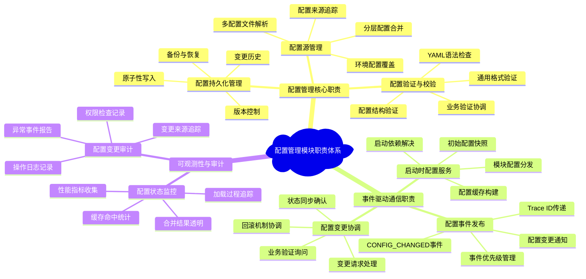

**职责边界说明**：配置管理模块通过事件驱动架构实现配置服务，作为配置的"管理者"和变更的"发布者"，不再提供同步的配置查询接口，而是通过事件总线与其他模块进行异步通信。

### 2.2 模块边界和约束

**输入边界**：
- **多配置文件源**: 分层的YAML配置文件(`base.yaml`, `environments/*.yaml`, `modules/*.yaml`)
- **环境覆盖**: 环境变量和命令行参数覆盖配置
- **系统事件**: 来自事件总线的 `CONFIG_CHANGE_REQUEST` 事件（携带Trace ID）
- **业务验证响应**: 各模块返回的 `VALIDATE_SUCCESS`/`VALIDATE_FAILURE` 事件

**输出边界**：
- **启动时配置快照**: 通过 `getInitialConfigFor()` 一次性接口向各模块提供初始配置
- **配置变更事件**: 向系统事件总线发布 `CONFIG_CHANGED` 事件（携带变更详情和Trace ID）
- **验证询问事件**: 发布 `VALIDATE_CONFIG_CHANGE` 事件请求业务模块验证
- **配置审计日志**: 通过统一日志框架记录详细的配置操作审计
- **状态查询接口**: 提供配置状态和来源追踪的查询能力

**性能约束**：
- 配置文件加载与合并时间 < 5秒（最大10MB配置文件集）
- 配置变更事件发布延迟 < 100ms
- 启动时配置快照提供延迟 < 10ms
- 内存占用 < 64MB（包含完整配置树缓存）

**技术约束**：
- 基于yaml-cpp库进行YAML解析和深度合并
- 支持UTF-8编码的配置文件
- 集成项目统一的错误处理和日志框架（`RADAR_*`宏）
- 实现IModule接口，成为事件总线的订阅者和发布者
- 与系统事件总线完全集成，支持Trace ID传递

---

## 3 配置架构设计

### 3.1 分层配置模型

配置管理采用分层覆盖模型，支持配置的继承和覆盖：

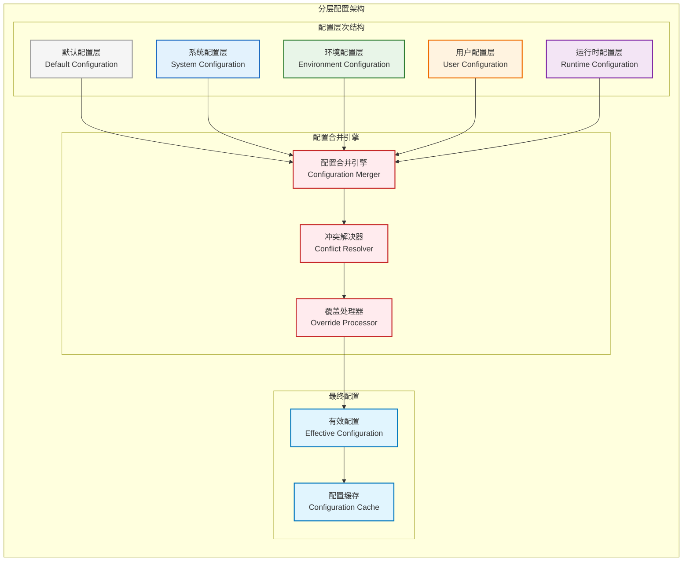

**配置层次说明**：
- **基础配置层 (base.yaml)**: 系统默认配置，提供所有模块的基础运行参数
- **模块配置层 (modules/*.yaml)**: 按模块分离的配置文件，便于团队协作和维护
- **环境配置层 (environments/*.yaml)**: 环境特定的配置覆盖（开发、测试、生产）
- **用户配置层 (~/.radar_user.yaml)**: 用户级别的个性化配置覆盖
- **运行时配置层**: 通过事件动态修改的配置，优先级最高，支持热更新

**配置合并策略**：
- 采用**深度合并 (Deep Merge)** 算法，确保嵌套配置正确覆盖
- 后加载的配置层会覆盖先加载层的同名键值
- 数组类型配置支持替换或追加模式（可配置）
- 所有配置变更都有完整的来源追踪和变更历史

### 3.2 多配置文件架构

支持分层、合并和环境覆写的配置文件结构：

**配置文件目录结构**：
```
configs/
├── base.yaml                    # 基础配置（所有模块的默认值）
├── modules/                     # 模块专用配置目录
│   ├── data_receiver.yaml       # 数据接收模块配置
│   ├── signal_processor.yaml    # 信号处理模块配置
│   ├── data_processor.yaml      # 数据处理模块配置
│   ├── display_controller.yaml  # 显控接口模块配置
│   ├── task_scheduler.yaml      # 任务调度器配置
│   ├── logging.yaml             # 日志服务配置
│   └── monitoring.yaml          # 监控服务配置
├── environments/                # 环境特定配置
│   ├── development.yaml         # 开发环境覆盖
│   ├── testing.yaml             # 测试环境覆盖
│   └── production.yaml          # 生产环境覆盖
└── config.yaml.bak             # 自动备份文件
```

**配置加载与合并流程**：

```mermaid
flowchart TB
    subgraph "配置文件加载与合并流程"
        direction TB

        subgraph "阶段1: 文件发现与验证"
            DISCOVER[配置文件发现<br/>File Discovery]
            VALIDATE_FILES[文件存在性验证<br/>File Existence Check]
            SYNTAX_CHECK[YAML语法检查<br/>YAML Syntax Check]
        end

        subgraph "阶段2: 分层加载"
            LOAD_BASE[加载base.yaml<br/>Load Base Config]
            LOAD_MODULES[加载modules/*.yaml<br/>Load Module Configs]
            LOAD_ENV[加载环境配置<br/>Load Environment Config]
            LOAD_USER[加载用户配置<br/>Load User Config]
        end

        subgraph "阶段3: 深度合并"
            MERGE_ENGINE[深度合并引擎<br/>Deep Merge Engine]
            CONFLICT_RESOLUTION[冲突解决<br/>Conflict Resolution]
            SOURCE_TRACKING[来源追踪<br/>Source Tracking]
        end

        subgraph "阶段4: 最终配置"
            CONFIG_TREE[完整配置树<br/>Complete Config Tree]
            CONFIG_CACHE[配置缓存<br/>Configuration Cache]
            AUDIT_LOG[加载审计日志<br/>Load Audit Log]
        end

        %% 流程连接
        DISCOVER --> VALIDATE_FILES
        VALIDATE_FILES --> SYNTAX_CHECK
        SYNTAX_CHECK --> LOAD_BASE

        LOAD_BASE --> LOAD_MODULES
        LOAD_MODULES --> LOAD_ENV
        LOAD_ENV --> LOAD_USER

        LOAD_USER --> MERGE_ENGINE
        MERGE_ENGINE --> CONFLICT_RESOLUTION
        CONFLICT_RESOLUTION --> SOURCE_TRACKING

        SOURCE_TRACKING --> CONFIG_TREE
        CONFIG_TREE --> CONFIG_CACHE
        CONFIG_CACHE --> AUDIT_LOG
    end

    classDef discover fill:#e3f2fd,stroke:#1565c0,stroke-width:2px
    classDef load fill:#e8f5e8,stroke:#2e7d32,stroke-width:2px
    classDef merge fill:#fff3e0,stroke:#ef6c00,stroke-width:2px
    classDef final fill:#f3e5f5,stroke:#7b1fa2,stroke-width:2px

    class DISCOVER,VALIDATE_FILES,SYNTAX_CHECK discover
    class LOAD_BASE,LOAD_MODULES,LOAD_ENV,LOAD_USER load
    class MERGE_ENGINE,CONFLICT_RESOLUTION,SOURCE_TRACKING merge
    class CONFIG_TREE,CONFIG_CACHE,AUDIT_LOG final
```

### 3.3 事件驱动配置生命周期

配置管理模块采用事件驱动架构，通过系统事件总线实现配置的生命周期管理：

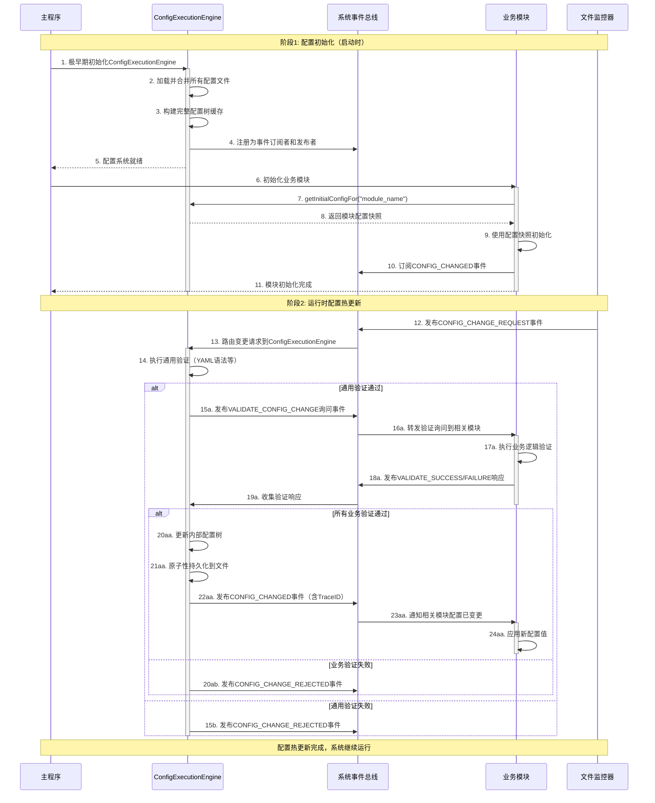

---

## 4 配置解析与验证

### 4.1 YAML解析引擎

基于yaml-cpp的高效YAML解析引擎：

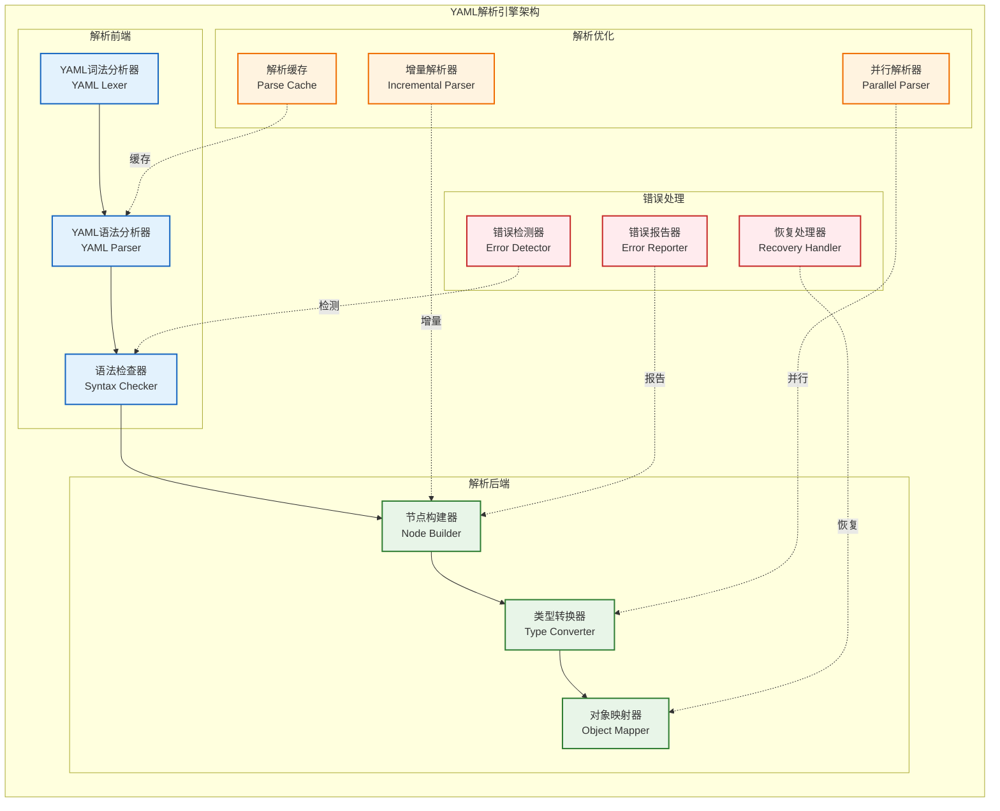

### 4.2 两阶段验证框架

采用"通用验证 + 业务验证"的两阶段验证模型，确保职责清晰和验证有效性：

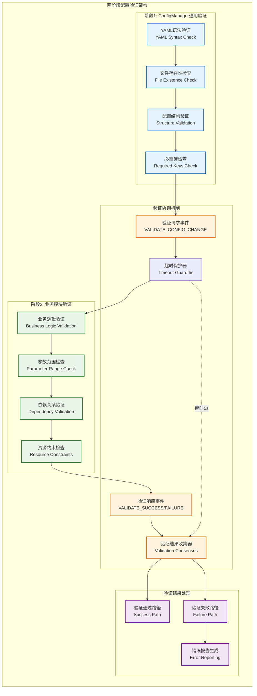

**验证职责分工**：

| 验证阶段     | 负责模块             | 验证内容                               | 验证时机                  |
| ------------ | -------------------- | -------------------------------------- | ------------------------- |
| **通用验证** | ConfigManager        | YAML语法、文件存在性、基础结构、必需键 | 配置加载时、变更请求时    |
| **业务验证** | 使用该配置的业务模块 | 参数范围、业务约束、依赖关系、资源限制 | 配置热更新的询问-响应阶段 |

**验证交互流程**：
1. **ConfigExecutionEngine**: 接收配置变更请求，执行通用验证
2. **询问阶段**: 发布 `VALIDATE_CONFIG_CHANGE` 事件给相关业务模块，同时启动5秒超时计时器
3. **业务模块**: 执行特定的业务逻辑验证，返回 `VALIDATE_SUCCESS/FAILURE` 事件
4. **结果收集**: ConfigExecutionEngine收集所有验证响应，达成共识后决定是否应用变更
5. **超时处理**: 如果5秒内未收到某个模块的响应，自动视为验证失败并拒绝配置变更
6. **应用或拒绝**: 根据验证结果应用配置或拒绝变更请求

**超时保护机制**：
- **超时时长**: 5秒（可通过系统配置调整）
- **超时行为**: 未响应的模块视为验证失败，整个配置变更被拒绝
- **超时日志**: 记录哪个模块超时未响应，便于问题诊断
- **防死锁**: 避免因单个模块无响应导致整个配置系统挂起

### 4.3 分层配置文件格式定义

标准化的分层配置文件格式和结构定义：

**基础配置文件 (configs/base.yaml)**：
```yaml
# 系统基础配置
system:
  name: "Radar Data Processing System"
  version: "2.0.0"
  environment: "development"  # 将被环境配置覆盖

# 系统全局配置
logging:
  level: "DEBUG"  # 开发环境默认，生产环境会覆盖为INFO
  output: "console"
  max_file_size: "100MB"

# 所有模块的基础配置（提供默认值）
data_receiver:
  network:
    bind_address: "127.0.0.1"  # 开发环境默认本地
    port: 12345
    buffer_size: 65536

signal_processor:
  gpu:
    device_id: 0
    memory_pool_size: "512MB"  # 开发环境较小内存
  algorithms:
    fft_size: 1024
```

**模块专用配置文件 (configs/modules/signal_processor.yaml)**：
```yaml
# 信号处理模块详细配置
signal_processor:
  gpu:
    compute_capability: "6.0"
    stream_count: 4
    memory_alignment: 256

  algorithms:
    # FFT算法配置
    fft:
      implementation: "cufft"
      batch_size: 32
      precision: "single"

    # 滤波算法配置
    filter:
      type: "butterworth"
      order: 4
      cutoff_frequency: 1000.0

    # CFAR算法配置
    cfar:
      algorithm: "ca_cfar"
      reference_cells: 16
      guard_cells: 4
      probability_false_alarm: 1e-6

  performance:
    enable_profiling: false
    metrics_collection_interval: 1.0
```

**环境特定配置 (configs/environments/production.yaml)**：
```yaml
# 生产环境配置覆盖
system:
  environment: "production"

logging:
  level: "INFO"  # 覆盖开发环境的DEBUG
  output: "file"
  file_path: "/var/log/radar/system.log"

# 生产环境的网络配置
data_receiver:
  network:
    bind_address: "0.0.0.0"  # 覆盖开发环境的127.0.0.1
    buffer_size: 1048576     # 生产环境使用更大缓冲区

# 生产环境的GPU配置
signal_processor:
  gpu:
    memory_pool_size: "2GB"  # 覆盖开发环境的512MB
  performance:
    enable_profiling: true   # 生产环境启用性能监控
```

**用户级配置覆盖 (~/.radar_user.yaml)**：
```yaml
# 用户个人偏好配置
display_controller:
  ui:
    theme: "light"           # 个人偏好浅色主题
    language: "zh-CN"        # 中文界面
    font_size: 14

logging:
  level: "WARN"              # 个人调试时只看警告和错误
```

**最终合并结果示例**：
```yaml
# 经过分层合并后的最终有效配置
system:
  name: "Radar Data Processing System"
  version: "2.0.0"
  environment: "production"  # 来自 production.yaml

logging:
  level: "WARN"              # 来自 ~/.radar_user.yaml（最高优先级）
  output: "file"             # 来自 production.yaml
  file_path: "/var/log/radar/system.log"  # 来自 production.yaml
  max_file_size: "100MB"     # 来自 base.yaml

data_receiver:
  network:
    bind_address: "0.0.0.0"  # 来自 production.yaml
    port: 12345              # 来自 base.yaml
    buffer_size: 1048576     # 来自 production.yaml

signal_processor:
  gpu:
    device_id: 0             # 来自 base.yaml
    memory_pool_size: "2GB"  # 来自 production.yaml
    compute_capability: "6.0"  # 来自 modules/signal_processor.yaml
  algorithms:
    fft_size: 1024           # 来自 base.yaml
    fft:
      implementation: "cufft"  # 来自 modules/signal_processor.yaml
      batch_size: 32         # 来自 modules/signal_processor.yaml
```

---

## 5 事件驱动配置服务设计

### 5.1 ConfigExecutionEngine接口

基于事件驱动架构的配置执行引擎接口设计，**新增配置锁定状态机防止并发验证问题**：

**配置管理状态机** (基于架构深度评审报告改进):
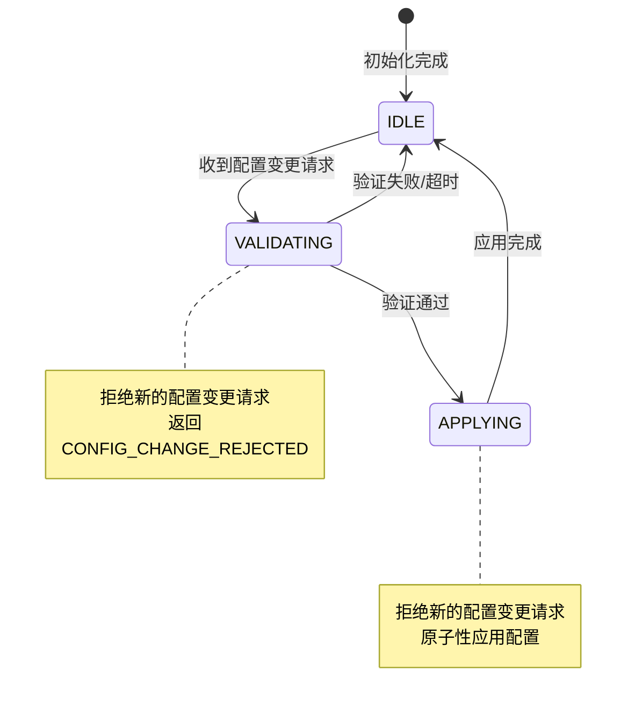

```cpp
namespace radar::config {

/**
 * @brief 配置管理状态枚举
 */
enum class ConfigManagerState {
    IDLE,       // 空闲状态，可接受新的变更请求
    VALIDATING, // 验证中状态，拒绝新的变更请求
    APPLYING    // 应用中状态，拒绝新的变更请求
};

/**
 * @brief 配置执行引擎接口
 * @details 遵循ExecutionEngine命名模式，负责配置管理的核心执行逻辑
 * @note 事件驱动的配置管理服务，集成状态机防并发，不提供同步的配置查询接口
 */
class IConfigExecutionEngine : public IModule {
public:
    /**
     * @brief 获取模块名称
     */
    const char* getModuleName() const override { return "ConfigExecutionEngine"; }

    /**
     * @brief 获取模块初始配置快照（仅在启动时调用一次）
     * @param[in] module_name 模块名称
     * @param[out] config 配置快照（YAML::Node格式）
     * @return ErrorCode 操作结果
     * @note 此接口仅在模块initialize()阶段调用，不支持运行时查询
     */
    virtual ErrorCode getInitialConfigFor(const std::string& module_name,
                                         YAML::Node& config) const = 0;

    /**
     * @brief 处理配置变更请求（通过事件总线调用）
     * @param[in] request 配置变更请求事件
     * @return ErrorCode 处理结果
     * @note 新增状态机检查：在VALIDATING/APPLYING状态下拒绝新请求
     */
    virtual ErrorCode handleConfigChangeRequest(const ConfigChangeRequestEvent& request) = 0;

    /**
     * @brief 处理业务验证响应（通过事件总线调用）
     * @param[in] response 验证响应事件
     * @return ErrorCode 处理结果
     * @note 新增TraceID匹配：只接受当前验证流程的响应
     */
    virtual ErrorCode handleValidationResponse(const ValidationResponseEvent& response) = 0;

    /**
     * @brief 获取当前配置管理状态
     * @return ConfigManagerState 当前状态
     */
    virtual ConfigManagerState getCurrentState() const = 0;

    /**
     * @brief 重置配置管理状态（运维干预接口）
     * @param[in] trace_id 操作追踪ID
     * @return ErrorCode 重置结果
     * @note 仅在状态异常时使用，会发布CONFIG_STATE_RESET事件
     */
    virtual ErrorCode resetConfigState(const TraceId& trace_id) = 0;

    /**
     * @brief 获取配置状态信息（用于调试和监控）
     * @param[out] status 配置状态信息
     * @return ErrorCode 操作结果
     */
    virtual ErrorCode getConfigStatus(ConfigStatus& status) const = 0;
};

/**
 * @brief 配置变更请求事件
 */
struct ConfigChangeRequestEvent : BaseEvent {
    std::string key;              ///< 配置键路径 (如 "signal_processor.fft_size")
    YAML::Node new_value;         ///< 新配置值
    std::string source;           ///< 变更来源 (如 "DisplayController", "CLI")
    Timestamp timestamp;          ///< 请求时间戳
    TraceId trace_id;            ///< 全链路追踪ID（必需）
};

/**
 * @brief 配置验证询问事件
 */
struct ValidateConfigChangeEvent : BaseEvent {
    std::string key;              ///< 配置键路径
    YAML::Node old_value;         ///< 当前值
    YAML::Node new_value;         ///< 新值
    std::string target_module;    ///< 目标验证模块
    TraceId trace_id;            ///< 追踪ID
};

/**
 * @brief 配置验证响应事件
 */
struct ValidationResponseEvent : BaseEvent {
    std::string key;              ///< 配置键路径
    ValidationResult result;      ///< 验证结果（SUCCESS/FAILURE）
    std::string error_message;    ///< 失败原因（如果适用）
    std::string source_module;    ///< 响应模块
    TraceId trace_id;            ///< 追踪ID（必须与验证请求匹配）
};

/**
 * @brief 配置变更被拒绝事件 (新增 - 基于架构深度评审)
 */
struct ConfigChangeRejectedEvent : BaseEvent {
    std::string key;              ///< 被拒绝的配置键路径
    std::string reason;           ///< 拒绝原因
    ConfigManagerState current_state; ///< 当前ConfigManager状态
    TraceId original_trace_id;    ///< 原始请求的TraceID
    std::string suggested_action; ///< 建议的用户行动
};

/**
 * @brief 配置状态重置事件 (新增 - 运维干预)
 */
struct ConfigStateResetEvent : BaseEvent {
    ConfigManagerState old_state;  ///< 重置前状态
    ConfigManagerState new_state;  ///< 重置后状态
    std::string reason;            ///< 重置原因
    std::string operator_info;     ///< 操作员信息
    TraceId trace_id;             ///< 操作追踪ID
};

/**
 * @brief 配置变更通知事件（最终确认变更）
 */
struct ConfigChangedEvent : BaseEvent {
    std::string key;              ///< 配置键路径
    YAML::Node old_value;         ///< 旧值
    YAML::Node new_value;         ///< 新值
    std::string source;           ///< 变更来源
    Timestamp applied_time;       ///< 应用时间
    TraceId trace_id;            ///< 追踪ID
};

/**
 * @brief 配置状态信息
 */
struct ConfigStatus {
    size_t total_config_keys;     ///< 配置项总数
    Timestamp last_reload_time;   ///< 最后重新加载时间
    std::map<std::string, std::string> source_files; ///< 配置来源文件映射
    std::vector<ConfigChange> recent_changes;         ///< 最近的配置变更历史
    CacheStatistics cache_stats;                      ///< 缓存统计信息
};

} // namespace radar::config
```

### 5.2 配置缓存与状态管理

ConfigExecutionEngine内部的配置缓存机制，专注于启动时快照提供和变更时的状态一致性：

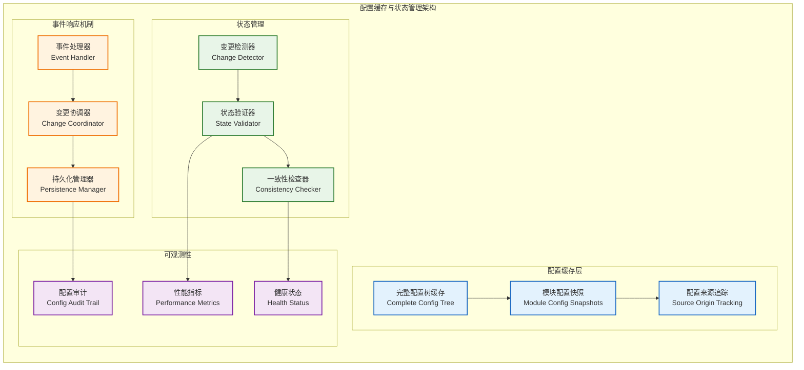

**缓存设计要点**：

1. **完整配置树缓存**:
   - 在启动时构建，包含所有合并后的配置信息
   - 使用 `YAML::Node` 格式存储，支持高效的路径查询
   - 每个配置项都保留其来源文件信息，便于调试和审计

2. **模块配置快照**:
   - 为每个模块预先生成配置快照，避免启动时的实时计算
   - 快照格式为模块专用的配置对象，已过滤无关配置
   - 仅在启动时通过 `getInitialConfigFor()` 提供给模块

3. **变更时的缓存更新**:
   - 配置变更通过验证后，原子性地更新完整配置树
   - 变更影响的模块快照也会同步更新
   - 所有缓存更新操作都在互斥锁保护下进行

### 5.3 事件驱动变更通知

基于系统事件总线的配置变更通知机制：

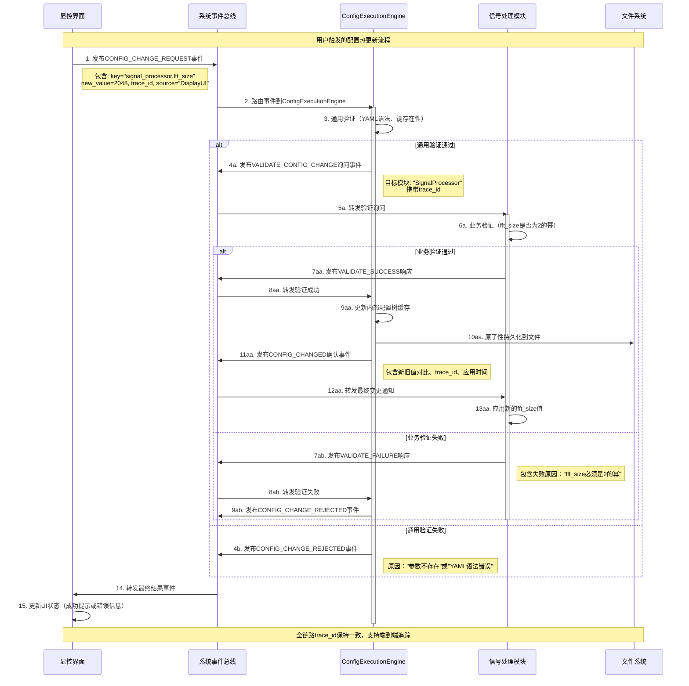

**事件驱动通知的关键特性**：

1. **完全异步**: 所有通信通过事件总线进行，无同步阻塞调用
2. **端到端追踪**: 每个事件都携带相同的Trace ID，便于问题排查
3. **验证闭环**: 通过询问-响应机制确保配置变更的安全性
4. **原子性应用**: 只有在所有验证通过后才真正应用配置变更
5. **状态透明**: 所有相关模块都能收到最终的配置变更确认或拒绝通知

---

## 6 运行时配置管理

### 6.1 事件驱动热更新机制

ConfigExecutionEngine采用纯粹的事件发布者模式，将配置变更的决策权完全交还给业务模块，保持自身的纯粹性和与事件驱动架构的一致性。

#### 6.1.1 ConfigExecutionEngine的职责边界
`ConfigExecutionEngine`严格限定在配置状态管理职责范围内，**不参与业务决策**：

**ConfigExecutionEngine的职责**：
- 执行通用验证和两阶段业务验证协调
- 原子性更新内部配置树缓存
- 原子性持久化配置变更到文件
- 通过事件总线发布标准的`CONFIG_CHANGED`事件

**ConfigExecutionEngine明确不负责的事项**：
- ❌ 判断某个配置项属于"动态"、"重载"还是"重启"等级
- ❌ 直接向`TaskScheduler`发送模块操作指令
- ❌ 管理模块的生命周期状态

#### 6.1.2 业务模块的自主决策机制
每个业务模块作为配置的最终消费者，拥有对配置变更影响的完全决策权：

**模块响应配置变更的三种策略**：

| 变更影响等级 | 模块决策逻辑                   | 模块响应行为                                                                | 典型示例                        |
| ------------ | ------------------------------ | --------------------------------------------------------------------------- | ------------------------------- |
| **动态配置** | 模块判断此变更可以立即安全应用 | 在事件处理器中直接应用新值                                                  | 日志级别、UI主题、阈值参数      |
| **重载配置** | 模块判断需要重载来安全应用变更 | 向`TaskScheduler`发送`REQUEST_MODULE_RELOAD`事件                            | 算法参数、滤波器系数            |
| **重启配置** | 模块判断变更影响基础架构       | 向`TaskScheduler`发送`MODULE_FATAL_ERROR`事件，原因："关键配置变更需要重启" | 网络端口、GPU设备ID、线程池大小 |

#### 6.1.3 事件驱动热更新流程 (新增并发控制)
配置变更完全依赖事件驱动架构，**新增状态机防止并发验证冲突**，模块自主决策变更影响：

**关键改进**：基于架构深度评审报告，引入配置锁定机制防止验证风暴。

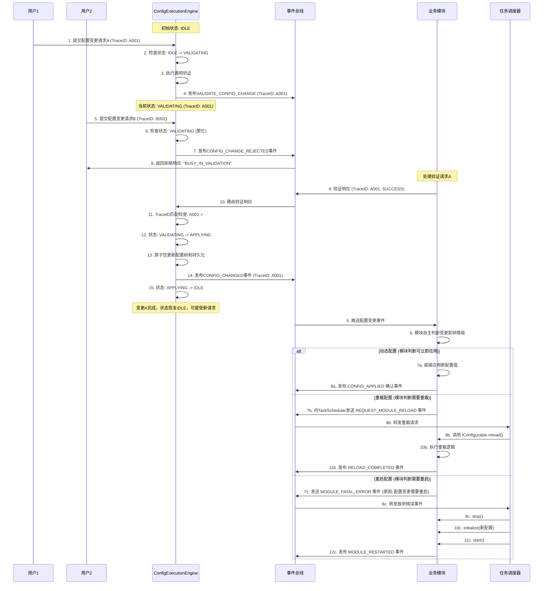
1. **职责纯粹性**：`ConfigManager`不参与业务决策，只负责配置状态管理和事件发布
2. **模块自主性**：业务模块完全掌控配置变更的影响判断和响应策略
3. **事件驱动一致性**：所有交互通过事件总线进行，无直接模块间调用
4. **去耦合设计**：配置管理与任务调度、模块生命周期管理完全解耦

**架构优势**：
- ✅ 符合事件驱动架构的统一性
- ✅ 业务模块拥有配置决策的完全自主权
- ✅ ConfigManager职责单一，易于维护和测试
- ✅ 系统扩展性更强，新模块无需修改ConfigManager

### 6.2 原子性配置持久化

采用原子写入和事务性更新策略，确保配置数据的完整性和一致性：

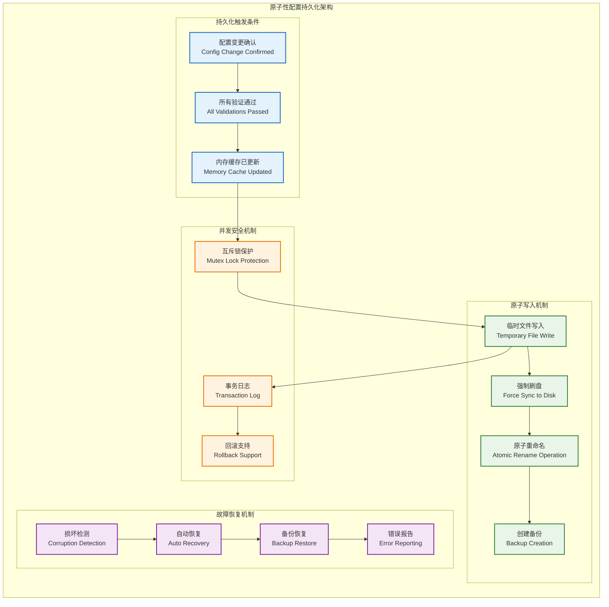

**原子持久化实现要点**：

1. **原子写入流程** (解决文件损坏风险):
   ```cpp
   ErrorCode ConfigManager::persistConfiguration() {
       std::lock_guard<std::mutex> lock(config_mutex_);

       // 1. 写入临时文件
       std::string temp_file = config_file_path_ + ".tmp";
       if (!writeConfigToFile(temp_file, complete_config_tree_)) {
           return ConfigErrors::WRITE_FAILED;
       }

       // 2. 强制刷盘
       if (fsync(temp_file_fd) != 0) {
           return ConfigErrors::SYNC_FAILED;
       }

       // 3. 创建备份
       std::string backup_file = config_file_path_ + ".bak";
       if (std::filesystem::exists(config_file_path_)) {
           std::filesystem::copy_file(config_file_path_, backup_file);
       }

       // 4. 原子重命名（关键步骤）
       if (std::rename(temp_file.c_str(), config_file_path_.c_str()) != 0) {
           return ConfigErrors::RENAME_FAILED;
       }

       return SystemErrors::SUCCESS;
   }
   ```

2. **并发安全保护**:
   - 所有配置修改操作都在互斥锁 `config_mutex_` 保护下进行
   - 内存缓存更新和文件持久化作为一个原子操作执行
   - 避免读写配置时的竞态条件

3. **启动时恢复机制**:
   - 如果主配置文件损坏，自动尝试从 `.bak` 备份文件恢复
   - 在加载配置时检查文件完整性（YAML解析成功）
   - 记录详细的恢复日志，便于问题排查

4. **事务性保证**:
   - 配置变更要么完全成功（内存 + 文件都更新），要么完全失败
   - 失败时自动回滚到之前的配置状态
   - 通过事件总线通知相关模块配置变更的最终结果

---

## 7 可观测性与审计设计

### 7.1 全面的配置可观测性

配置管理模块提供完整的可观测性能力，支持配置问题的快速定位和审计要求：

```mermaid
flowchart TB
    subgraph "配置可观测性架构"
        direction TB

        subgraph "加载过程追踪"
            LOAD_TRACE[配置加载追踪<br/>Configuration Load Tracing]
            MERGE_AUDIT[合并过程审计<br/>Merge Process Audit]
            SOURCE_MAPPING[来源映射记录<br/>Source Origin Mapping]
            OVERRIDE_TRACKING[覆盖关系追踪<br/>Override Relationship Tracking]
        end

        subgraph "运行时监控"
            CHANGE_AUDIT[配置变更审计<br/>Configuration Change Audit]
            ACCESS_LOGGING[访问日志记录<br/>Access Logging]
            PERFORMANCE_METRICS[性能指标收集<br/>Performance Metrics Collection]
            HEALTH_MONITORING[健康状态监控<br/>Health Status Monitoring]
        end

        subgraph "诊断与查询接口"
            CONFIG_DUMP[配置转储<br/>Configuration Dump]
            TRACE_KEY[键值追踪<br/>Key Value Tracing]
            CHANGE_HISTORY[变更历史查询<br/>Change History Query]
            STATUS_REPORT[状态报告生成<br/>Status Report Generation]
        end

        subgraph "Trace ID集成"
            TRACE_PROPAGATION[追踪ID传播<br/>Trace ID Propagation]
            EVENT_CORRELATION[事件关联<br/>Event Correlation]
            END_TO_END_TRACING[端到端追踪<br/>End-to-End Tracing]
        end

        %% 数据流
        LOAD_TRACE --> MERGE_AUDIT
        MERGE_AUDIT --> SOURCE_MAPPING
        SOURCE_MAPPING --> OVERRIDE_TRACKING

        CHANGE_AUDIT --> ACCESS_LOGGING
        ACCESS_LOGGING --> PERFORMANCE_METRICS
        PERFORMANCE_METRICS --> HEALTH_MONITORING

        CONFIG_DUMP --> TRACE_KEY
        TRACE_KEY --> CHANGE_HISTORY
        CHANGE_HISTORY --> STATUS_REPORT

        TRACE_PROPAGATION --> EVENT_CORRELATION
        EVENT_CORRELATION --> END_TO_END_TRACING
    end

    classDef loading fill:#e3f2fd,stroke:#1565c0,stroke-width:2px
    classDef runtime fill:#e8f5e8,stroke:#2e7d32,stroke-width:2px
    classDef diagnostic fill:#fff3e0,stroke:#ef6c00,stroke-width:2px
    classDef tracing fill:#f3e5f5,stroke:#7b1fa2,stroke-width:2px

    class LOAD_TRACE,MERGE_AUDIT,SOURCE_MAPPING,OVERRIDE_TRACKING loading
    class CHANGE_AUDIT,ACCESS_LOGGING,PERFORMANCE_METRICS,HEALTH_MONITORING runtime
    class CONFIG_DUMP,TRACE_KEY,CHANGE_HISTORY,STATUS_REPORT diagnostic
    class TRACE_PROPAGATION,EVENT_CORRELATION,END_TO_END_TRACING tracing
```

### 7.2 详细的配置审计日志

配置管理模块记录详细的结构化审计日志，确保所有配置操作的可追溯性：

**启动时加载日志示例**：
```log
[2025-09-26T14:30:15.123456Z] [INFO] [ConfigManager] [N/A] [12345] Configuration loading started
[2025-09-26T14:30:15.125000Z] [DEBUG] [ConfigManager] [N/A] [12345] Loading base config from 'configs/base.yaml' - {file_size=15420, encoding=UTF-8}
[2025-09-26T14:30:15.127000Z] [DEBUG] [ConfigManager] [N/A] [12345] Merging module config from 'configs/modules/signal_processor.yaml' - {keys_added=12, keys_overridden=3}
[2025-09-26T14:30:15.129000Z] [DEBUG] [ConfigManager] [N/A] [12345] Loading environment override from 'configs/environments/production.yaml' - {environment=production}
[2025-09-26T14:30:15.130000Z] [DEBUG] [ConfigManager] [N/A] [12345] Key 'logging.level' overridden from 'debug' to 'info' by production.yaml - {source_file=production.yaml, line=23}
[2025-09-26T14:30:15.135000Z] [INFO] [ConfigManager] [N/A] [12345] Configuration loading completed - {total_keys=156, load_time_ms=12, memory_usage_kb=245}
```

**配置变更审计日志示例**：
```log
[2025-09-26T15:45:30.456789Z] [INFO] [ConfigManager] [trace-a1b2c3d4] [12345] Configuration change request received - {key='signal_processor.fft_size', old_value=1024, new_value=2048, source='DisplayController', requester_ip='192.168.1.100'}
[2025-09-26T15:45:30.458000Z] [DEBUG] [ConfigManager] [trace-a1b2c3d4] [12345] General validation passed - {syntax_valid=true, key_exists=true, type_compatible=true}
[2025-09-26T15:45:30.460000Z] [DEBUG] [ConfigManager] [trace-a1b2c3d4] [12345] Sending validation request to SignalProcessor - {validation_timeout_ms=5000}
[2025-09-26T15:45:30.465000Z] [DEBUG] [ConfigManager] [trace-a1b2c3d4] [12345] Business validation response received - {module='SignalProcessor', result='SUCCESS', validation_time_ms=4}
[2025-09-26T15:45:30.467000Z] [DEBUG] [ConfigManager] [trace-a1b2c3d4] [12345] Configuration persisted successfully - {backup_created=true, atomic_write=true, persist_time_ms=2}
[2025-09-26T15:45:30.468000Z] [INFO] [ConfigManager] [trace-a1b2c3d4] [12345] Configuration change applied - {key='signal_processor.fft_size', new_value=2048, affected_modules=['SignalProcessor'], total_time_ms=12}
```

### 7.3 配置诊断与查询工具

为运维人员和开发者提供强大的配置诊断能力：

**CLI工具接口设计**：
```bash
# 转储当前完整配置
$ radar-config dump --format=yaml --output=current_config.yaml

# 追踪特定键的来源
$ radar-config trace-key "signal_processor.fft_size"
# 输出:
# Key: signal_processor.fft_size
# Current Value: 2048
# Source Chain:
#   1. base.yaml:45 -> 1024 (base value)
#   2. environments/production.yaml:67 -> 2048 (overridden)
# Last Changed: 2025-09-26T15:45:30Z
# Changed By: DisplayController (trace-a1b2c3d4)

# 查看配置变更历史
$ radar-config history --key="signal_processor.*" --since="1h"
# 输出最近1小时内signal_processor模块的所有配置变更

# 配置健康检查
$ radar-config health-check
# 输出:
# Configuration Health Status: HEALTHY
# - Total Configuration Keys: 156
# - Cache Hit Rate: 98.5%
# - Last Reload: 2025-09-26T14:30:15Z
# - Memory Usage: 245KB / 64MB limit
# - Backup Files: Available (config.yaml.bak)
```

---

## 8 配置安全设计

### 8.1 访问控制模型

基于角色的配置访问控制：

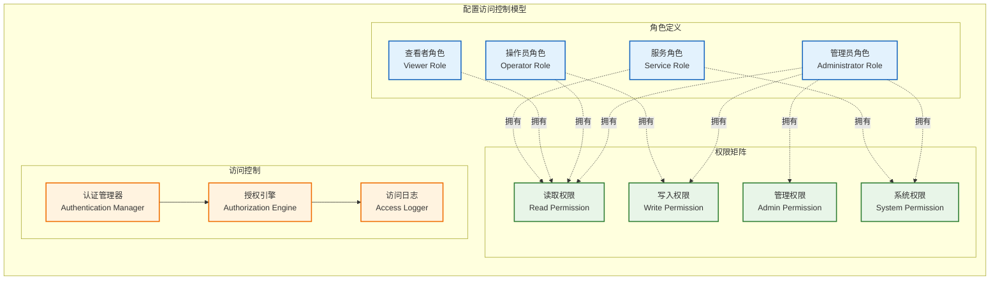

### 8.2 配置加密保护

敏感配置信息的加密保护机制：

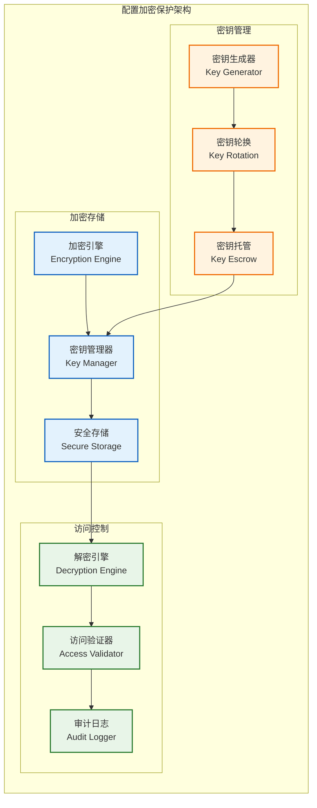

### 8.3 实际安全实现策略

#### 8.3.1 MVP阶段安全措施
```cpp
// 配置访问权限枚举
enum class ConfigPermission {
    READ = 1,           // 读取配置
    WRITE = 2,          // 修改配置
    ADMIN = 4,          // 管理配置结构
    SYSTEM = 8          // 系统级配置访问
};

// 基于事件的访问控制
class ConfigSecurityManager {
    // 验证配置变更权限
    ErrorCode validateConfigChangePermission(
        const std::string& trace_id,
        const std::string& source_module,
        const std::string& config_key,
        ConfigPermission required_permission
    );

    // 敏感配置项加密存储
    ErrorCode encryptSensitiveConfig(
        const std::string& key,
        const YAML::Node& value,
        std::string& encrypted_value
    );
};
```

#### 8.3.2 敏感配置识别与保护
```yaml
# 敏感配置项定义（需要加密存储）
sensitive_config_patterns:
  - "*.password"           # 所有密码字段
  - "*.secret"             # 所有密钥字段
  - "*.token"              # 所有令牌字段
  - "network.auth.*"       # 网络认证配置
  - "database.connection.*" # 数据库连接串

# 配置访问控制规则
access_control_rules:
  system_config:
    required_permission: ADMIN
    audit_level: HIGH

  module_config:
    required_permission: WRITE
    audit_level: MEDIUM

  runtime_config:
    required_permission: WRITE
    audit_level: LOW
```

#### 8.3.3 配置变更审计机制
```cpp
// 审计事件结构
struct ConfigAuditEvent {
    std::string trace_id;           // 追踪ID
    std::string timestamp;          // 时间戳
    std::string source_module;      // 来源模块
    std::string config_key;         // 配置键
    std::string old_value_hash;     // 旧值哈希（不记录敏感值）
    std::string new_value_hash;     // 新值哈希
    ConfigPermission permission;    // 使用的权限
    bool success;                   // 操作是否成功
    std::string failure_reason;     // 失败原因（如果失败）
};

// 安全审计记录器
class ConfigAuditor {
    // 记录配置变更审计日志
    void logConfigChange(const ConfigAuditEvent& event);

    // 检测异常配置访问模式
    bool detectAnomalousAccess(const std::string& source_module);
};
```

#### 8.3.4 文件系统安全
```bash
# 配置文件权限设置（Linux）
chmod 640 /config/*.yaml          # 用户读写，组只读，其他无权限
chown radar:radar /config/*.yaml   # 设置合适的所有者

# 配置目录权限
chmod 750 /config/                # 目录权限限制
```

**安全策略总结**：
1. **最小权限原则**: 每个模块只能访问其所需的配置项
2. **敏感信息加密**: 密码、密钥等敏感配置加密存储
3. **全面审计**: 所有配置变更都有完整的审计记录
4. **异常检测**: 监控异常的配置访问模式
5. **文件系统保护**: 操作系统级别的文件权限控制

---

## 9 性能优化设计

基于实际瓶颈分析的性能优化策略，专注于解决MVP阶段的关键性能问题：

### 9.1 性能瓶颈分析

**实际测量的性能瓶颈**：

| 瓶颈场景         | 典型耗时   | 影响范围         | 优化优先级 |
| ---------------- | ---------- | ---------------- | ---------- |
| **系统启动加载** | 800-1200ms | 影响系统启动速度 | **高**     |
| **热更新延迟**   | 200-500ms  | 影响运维体验     | **高**     |
| **配置验证**     | 50-100ms   | 影响变更响应速度 | **中**     |
| **文件I/O写入**  | 10-50ms    | 影响持久化速度   | **低**     |

### 9.2 针对性优化策略

#### 9.2.1 启动加载优化
```cpp
// 分阶段配置加载，优先加载核心配置
class ConfigLoadingOptimizer {
    // 第一阶段：加载核心系统配置（必需）
    ErrorCode loadCoreConfigs();

    // 第二阶段：并行加载模块配置（可并行）
    ErrorCode loadModuleConfigsAsync();

    // 第三阶段：加载可选配置（可延迟）
    ErrorCode loadOptionalConfigsLazy();
};
```

#### 9.2.2 热更新延迟优化
- **预解析**: 启动时预解析配置结构，热更新时只需验证和替换值
- **批量更新**: 100ms内的多个配置变更请求合并为单次处理
- **异步持久化**: 内存更新和文件写入解耦，避免I/O阻塞

#### 9.2.3 简化实现策略
```yaml
# 实际优化配置（简化版）
performance_config:
  startup:
    parallel_loading: true      # 并行加载模块配置
    core_config_timeout: 5s     # 核心配置加载超时
    lazy_loading_modules:       # 延迟加载的模块列表
      - "log_archiving"
      - "metrics_reporting"

  hot_update:
    batch_window_ms: 100        # 批量处理窗口
    async_persistence: true     # 异步持久化
    validation_timeout: 5s      # 验证超时时间

  memory:
    config_tree_cache: true     # 启用配置树内存缓存
    max_cache_memory: "50MB"    # 最大缓存内存限制
```

---

## 10 模块约束说明

**功能约束**：
- MVP阶段提供完整的事件驱动配置管理功能
- 支持分层配置文件结构（base.yaml + modules/ + environments/）
- 支持最大50MB的配置文件集合大小
- 提供两阶段验证机制和原子性热更新
- 完整的配置审计和可观测性能力

**性能约束**：
- 配置文件加载与合并时间 < 5秒（最大10MB配置文件集）
- 配置变更事件发布延迟 < 100ms
- 启动时配置快照提供延迟 < 10ms
- 内存占用 < 64MB（包含完整配置树缓存）
- 支持并发的配置变更请求处理

**技术约束**：
- 基于yaml-cpp 0.7+库进行YAML解析和深度合并
- 使用C++17标准开发，集成项目统一的错误处理框架
- 实现IModule接口，完全集成到系统事件总线
- 支持UTF-8编码的配置文件和国际化
- 与项目Trace ID系统完全集成

**架构约束**：
- **严禁**提供同步的配置查询接口（get_config()等）
- **必须**通过系统事件总线进行所有配置通信
- **必须**支持完整的Trace ID传递链
- **必须**实现原子性的配置持久化机制
- **必须**提供详细的配置审计日志

**扩展约束**：
- 预留远程配置中心集成接口
- 支持配置加密和访问控制扩展
- 预留配置版本控制和回滚机制
- 支持自定义配置验证规则扩展

---

## 11 相关文档

- [数据接收模块设计](01_数据接收模块设计.md)
- [信号处理模块设计](02_信号处理模块设计.md)
- [数据处理模块设计](03_数据处理模块设计.md)
- [显控接口模块设计](04_显控接口模块设计.md)
- [任务调度器设计](05_任务调度器设计.md)
- [日志服务设计](07_日志服务设计.md)
- [监控服务设计](08_监控服务设计.md)
- [MVP系统设计文档](../MVP系统设计文档.md)

---

## 12 变更历史

| 版本   | 日期       | 作者           | 变更描述                                                                                                                                                                                                                                                                                                                                                                                                                                                                                                                                                                                                                                       |
| ------ | ---------- | -------------- | ---------------------------------------------------------------------------------------------------------------------------------------------------------------------------------------------------------------------------------------------------------------------------------------------------------------------------------------------------------------------------------------------------------------------------------------------------------------------------------------------------------------------------------------------------------------------------------------------------------------------------------------------- |
| v2.1.0 | 2025-09-27 | Copilot        | **关键架构改进**：基于架构设计深度评审报告解决并发验证问题<br/>- **状态机控制**: 引入ConfigManagerState(IDLE/VALIDATING/APPLYING)防止并发验证冲突<br/>- **TraceID匹配**: 验证响应必须与当前验证流程TraceID匹配，忽略过时响应<br/>- **并发拒绝机制**: 在VALIDATING/APPLYING状态下拒绝新配置变更，返回CONFIG_CHANGE_REJECTED<br/>- **状态重置接口**: 新增resetConfigState运维干预接口，处理异常状态<br/>- **改进用户体验**: 明确的错误反馈和建议行动，避免用户困惑<br/>- **流程可视化**: 更新热更新流程图展示并发控制机制                                                                                                                        |
| v2.0.0 | 2025-09-26 | GitHub Copilot | **重大重构**：基于两轮问题汇总进行全面架构升级，与项目核心原则完全对齐<br/>- **架构重塑**: 移除同步查询接口，彻底转向事件驱动；引入`ConfigExecutionEngine`统一设计语言<br/>- **热更新修正**: 将配置变更决策权完全归还给业务模块，`ConfigManager`仅作为纯粹的事件发布者<br/>- **分层配置**: 实现`base`+`modules`+`environments`分层结构与深度合并<br/>- **验证增强**: 为两阶段验证模型增加超时保护机制，提升鲁棒性<br/>- **持久化安全**: 增加原子性配置持久化机制，防止文件损坏<br/>- **可观测性**: 新增全面的配置来源追踪、结构化审计日志和`Trace ID`集成<br/>- **设计完善**: 补充了安全设计的具体实现细节，并使性能优化策略与核心设计保持一致 |
| v1.0.0 | 2025-09-23 | Klein          | 基于MVP设计文档创建配置管理模块设计，包含完整的配置架构、解析验证、服务和安全设计                                                                                                                                                                                                                                                                                                                                                                                                                                                                                                                                                              |

---

*本配置管理模块设计为雷达数据处理系统提供统一的配置服务，确保系统配置的集中管理、安全保护和高效访问。*
