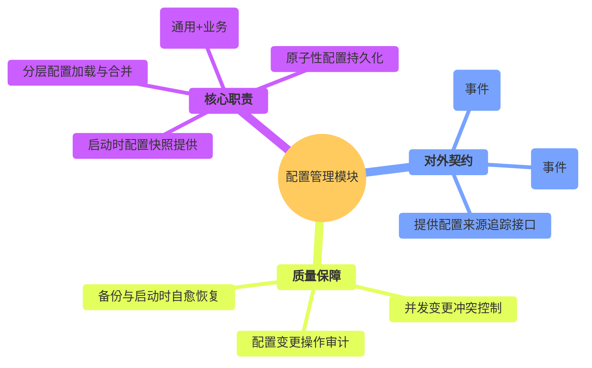
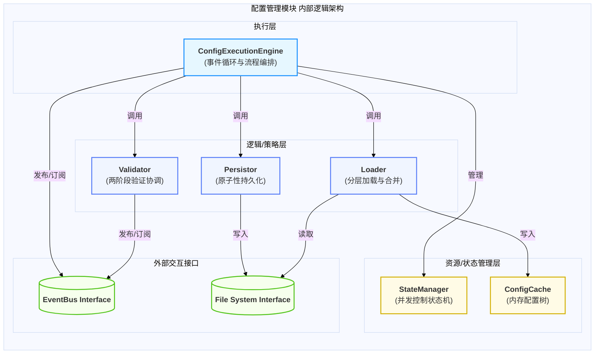
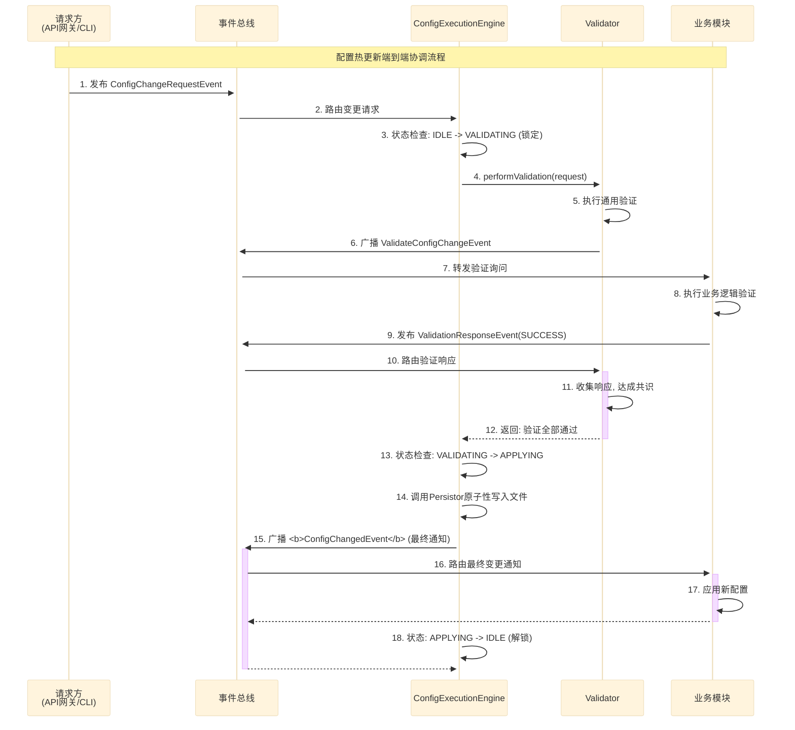
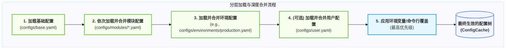
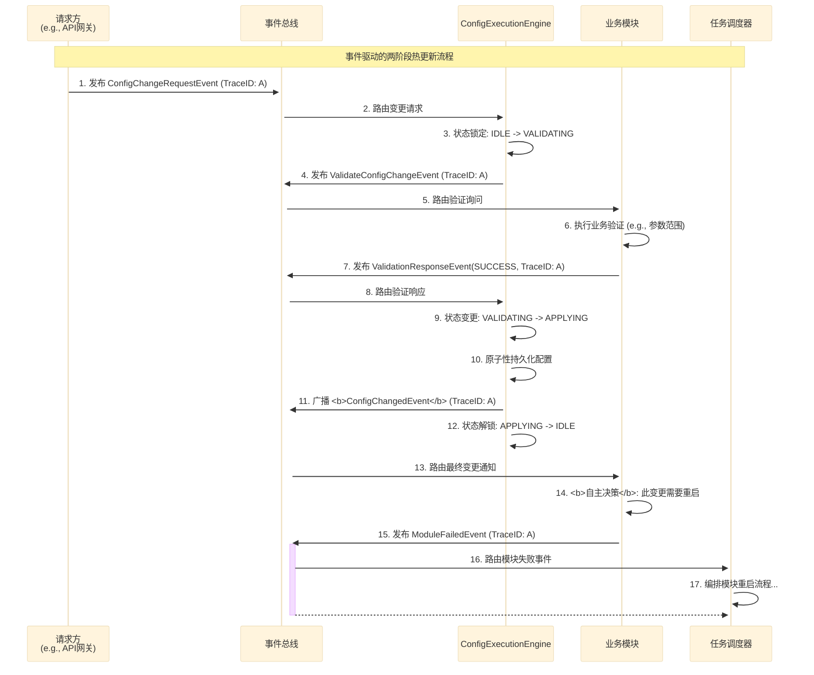
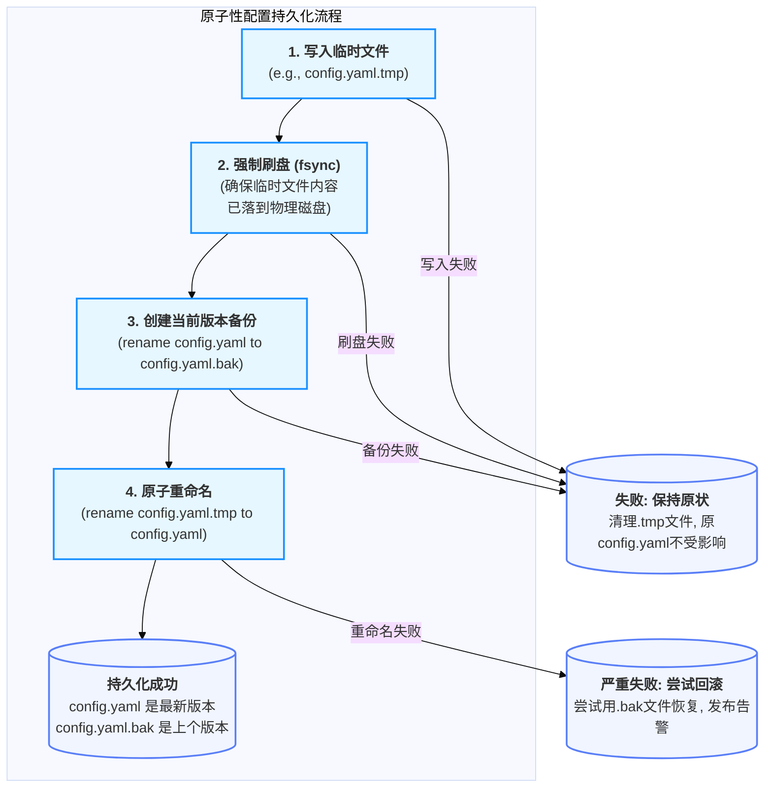
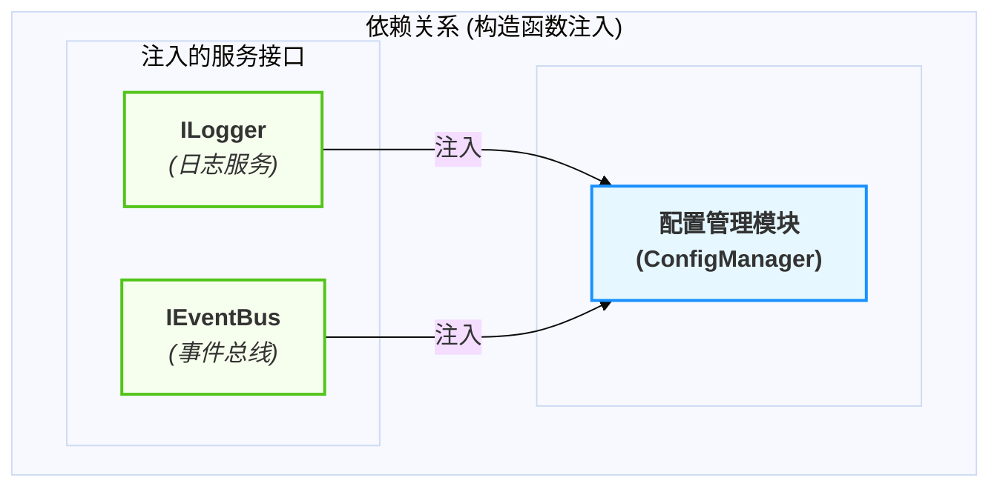

# 配置管理模块设计

  - **当前版本**: v3.0.0
  - **最后更新**: 2025-10-14
  - **负责人**: Klein

-----

## 概述

  - **概要**: 本文件是雷达数据处理系统中 **配置管理模块** 的详细设计规格说明。其核心目标是提供一个清晰、完整、可执行的设计蓝图。作为系统的**统一配置中枢**与**变更事件的唯一发布者**，本模块负责从多个来源加载、合并、验证配置，并通过事件驱动机制，安全、可靠地将配置变更通知给系统的所有其他部分。

-----

## 目录

- [配置管理模块设计](#配置管理模块设计)
  - [概述](#概述)
  - [目录](#目录)
  - [1 文档职责](#1-文档职责)
    - [1.1 文档目标与范围](#11-文档目标与范围)
    - [1.2 核心原则对齐](#12-核心原则对齐)
  - [2 模块总体设计](#2-模块总体设计)
    - [2.1 模块职责定义](#21-模块职责定义)
    - [2.2 模块边界与接口](#22-模块边界与接口)
    - [2.3 关键性能指标 (KPIs)](#23-关键性能指标-kpis)
  - [3 内部架构设计](#3-内部架构设计)
    - [3.1 逻辑架构与组件划分](#31-逻辑架构与组件划分)
    - [3.2 核心组件职责](#32-核心组件职责)
    - [3.3 核心交互流程 (以热更新为例)](#33-核心交互流程-以热更新为例)
  - [4 核心机制深度设计](#4-核心机制深度设计)
    - [4.1 机制一：分层加载与深度合并机制](#41-机制一分层加载与深度合并机制)
      - [4.1.1 多配置文件架构与加载顺序](#411-多配置文件架构与加载顺序)
      - [4.1.2 深度合并（Deep Merge）策略](#412-深度合并deep-merge策略)
      - [4.1.3 配置来源追踪与可观测性](#413-配置来源追踪与可观测性)
    - [4.2 机制二：事件驱动的两阶段热更新机制](#42-机制二事件驱动的两阶段热更新机制)
      - [4.2.1 模块自主决策模型（动态/重载/重启）](#421-模块自主决策模型动态重载重启)
      - [4.2.2 两阶段验证与超时保护](#422-两阶段验证与超时保护)
      - [4.2.3 并发控制状态机 (`stateDiagram-v2`)](#423-并发控制状态机-statediagram-v2)
      - [4.2.4 端到端热更新事件流 (`sequenceDiagram`)](#424-端到端热更新事件流-sequencediagram)
    - [4.3 机制三：原子性持久化与完整性保障机制](#43-机制三原子性持久化与完整性保障机制)
      - [4.3.1 安全写入流程 (`flowchart`)](#431-安全写入流程-flowchart)
      - [4.3.2 备份与启动时自愈恢复](#432-备份与启动时自愈恢复)
  - [5 关键横切关注点](#5-关键横切关注点)
    - [5.1 全链路可观测性与审计](#51-全链路可观测性与审计)
    - [5.2 配置安全设计 (访问控制与敏感信息)](#52-配置安全设计-访问控制与敏感信息)
    - [5.3 性能优化考量](#53-性能优化考量)
  - [6 模块集成与配置](#6-模块集成与配置)
    - [6.1 生命周期管理](#61-生命周期管理)
    - [6.2 依赖关系](#62-依赖关系)
    - [6.3 模块配置项 (`config.yaml`)](#63-模块配置项-configyaml)
  - [7 术语表](#7-术语表)
  - [8 相关文档](#8-相关文档)
  - [9 变更历史](#9-变更历史)

-----

## 1 文档职责

  - **概要**: 本章定义了本文档自身的“使命”，明确其目标、范围以及设计所遵循的“技术宪法”——项目的核心架构原则。这确保了所有设计决策都有据可依。

### 1.1 文档目标与范围

  - **概要**: 本节旨在清晰界定本文档要讲什么、不讲什么，为读者设定正确的预期。
      - **目标**: 本文档的核心目标是详细阐述配置管理模块作为系统“单一事实来源（Single Source of Truth）”的设计，确保其能够为整个系统提供统一、可靠、可动态更新的配置服务。
      - **范围**: 本文档覆盖从多源文件加载、分层合并、两阶段验证到事件驱动的热更新协调和原子性持久化的完整配置生命周期。文档**不包含**任何具体业务模块如何消费或响应配置变更的内部逻辑。

### 1.2 核心原则对齐

  - **概要**: 本节是设计的基石，旨在确保本模块的设计决策与项目已确立的架构原则完全对齐，保证系统整体的一致性。

| 核心原则           | 在本模块设计中的具体体现                                                                                                                                                                                                                     |
| :----------------- | :------------------------------------------------------------------------------------------------------------------------------------------------------------------------------------------------------------------------------------------- |
| **数据与控制分离** | **本模块是纯粹的控制面服务**。它不处理任何业务数据流，其唯一的“数据”就是系统的配置信息。它通过发布事件来影响数据面模块的行为，但自身完全独立于数据处理流水线之外。                                                                           |
| **事件驱动架构**   | **这是本模块与其他模块交互的唯一方式**。模块通过监听`CONFIG_CHANGE_REQUEST`事件来启动变更流程，并通过发布`CONFIG_CHANGED`事件来通知系统。它**严禁**提供任何同步的`get_config()`接口，确保了系统的完全异步和解耦。                            |
| **依赖注入**       | 本模块作为核心基础服务，其`IConfigManager`接口的实例在系统启动的最早期被创建，并通过**构造函数注入**到`TaskScheduler`和所有需要它的业务模块中。                                                                                              |
| **全链路可观测性** | **TraceID是所有配置变更操作的强制要求**。任何配置变更请求都必须携带一个`TraceID`，该ID会在随后的验证、应用和通知事件中被全程传递。这使得任何一次配置变更的完整生命周期，包括其在所有模块中引发的响应，都可以在聚合日志中被完整地追踪和审计。 |

-----

## 2 模块总体设计

  - **概要**: 本章从“黑盒”视角描绘配置管理模块的蓝图，定义其在系统生态中的角色、输入输出以及关键性能目标。作为所有模块行为的“指挥手册”，其设计的可靠性和响应性对整个系统的正确运行至关重要。

### 2.1 模块职责定义

  - **概要**: 本节使用思维导图的方式，直观地展示配置管理模块作为系统“配置管理中枢”的完整职责范围。

<!-- end list -->



### 2.2 模块边界与接口

  - **概要**: 本节明确定义模块的输入（Inputs）和输出（Outputs），以及它与系统其他部分交互的正式契约。

| 边界类型           | 交互对象        | 交互接口 / 数据格式                     | 核心契约与说明                                                                                         |
| :----------------- | :-------------- | :-------------------------------------- | :----------------------------------------------------------------------------------------------------- |
| **输入 (Inputs)**  | **文件系统**    | YAML 配置文件                           | **配置源**: 从`configs/`目录下加载`base.yaml`, `modules/*.yaml`, `environments/*.yaml`等分层配置文件。 |
|                    | **API网关/CLI** | `ConfigChangeRequestEvent`              | **变更请求**: 接收启动配置热更新流程的指令事件，必须包含`TraceID`。                                    |
|                    | **业务模块**    | `ValidationResponseEvent`               | **验证反馈**: 在两阶段验证流程中，接收业务模块对配置变更的验证结果（成功或失败）。                     |
| **输出 (Outputs)** | **所有模块**    | `IConfigManager::getInitialConfigFor()` | **启动时快照**: 在系统启动阶段，为每个模块提供一次性的、仅供读取的初始配置快照。                       |
|                    | **业务模块**    | `ValidateConfigChangeEvent`             | **验证询问**: 在热更新流程中，向相关业务模块发布“询问”事件，请求其对变更进行业务逻辑验证。             |
|                    | **所有模块**    | `ConfigChangedEvent`                    | **变更通知**: 在配置变更成功应用并持久化后，向整个系统广播此事件，通知所有模块新的配置已生效。         |

### 2.3 关键性能指标 (KPIs)

  - **概要**: 本节定义衡量本模块性能是否达标的可量化指标。配置模块的性能关键在于启动速度和热更新的响应延迟。

| KPI 指标             | 目标值(示例)     | 测量方法                                                                                         | 重要性与说明                                       |
| :------------------- | :--------------- | :----------------------------------------------------------------------------------------------- | :------------------------------------------------- |
| **启动加载时间**     | **\< 1 秒**      | 测量从模块`initialize()`开始到所有配置文件加载、合并、验证完成的总耗时。                         | **高**<br>直接影响整个系统的启动速度。             |
| **热更新端到端延迟** | **P99 \< 200ms** | 测量从收到`ConfigChangeRequestEvent`到发布`ConfigChangedEvent`的总耗时（不含业务模块验证时间）。 | **高**<br>确保系统配置变更的敏捷性和快速响应能力。 |
| **内存占用**         | **\< 64 MB**     | 测量模块在加载完所有配置后，其内部配置树缓存所占用的内存大小。                                   | **中**<br>作为核心服务，必须控制资源消耗。         |

-----

## 3 内部架构设计

  - **概要**: 本章“打开黑盒”，深入配置管理模块内部，展示其核心组件的划分、职责以及它们之间的协作方式。模块采用事件驱动的单线程执行模型，确保了配置变更流程的严格顺序性和状态一致性。

### 3.1 逻辑架构与组件划分

  - **概要**: 本节使用 `graph` 图，展示模块内部的逻辑分层。架构以`ConfigExecutionEngine`为核心，负责编排配置加载、验证、持久化和通知的完整生命周期。

<!-- end list -->



### 3.2 核心组件职责

  - **概要**: 本节用表格详细说明 `3.1` 图中每个核心组件的具体职责。

| 组件名称                    | 主要职责         | 关键设计点与实现策略                                                                                                                                                                                                  |
| :-------------------------- | :--------------- | :-------------------------------------------------------------------------------------------------------------------------------------------------------------------------------------------------------------------- |
| **`ConfigExecutionEngine`** | **核心流程编排** | 1. 运行模块主事件循环，消费`ConfigChangeRequestEvent`等事件。<br>2. 驱动`Loader`, `Validator`, `Persistor`按顺序执行。<br>3. 管理`StateManager`，在热更新期间进行状态锁定，防止并发冲突。                             |
| **`Loader`**                | **加载与合并**   | 1. 实现分层配置文件的发现和加载逻辑。<br>2. 内置**深度合并（Deep Merge）算法，按优先级规则合并多个`YAML::Node`对象。<br>3. 将最终合并的配置树存入`ConfigCache`。                                                      |
| `Validator`                 | 两阶段验证       | 1. 执行YAML语法、必需键等通用验证**。<br>2. 通过`EventBus`发布`ValidateConfigChangeEvent`，**协调业务模块**进行业务验证，并设置超时保护。<br>3. 收集所有`ValidationResponseEvent`，达成共识后向上层报告最终验证结果。 |
| **`Persistor`**             | **原子性持久化** | 实现\*\*“写入临时文件 -\> 强制刷盘 -\> 原子重命名”\*\*的安全写入流程，确保配置文件永不损坏。同时负责创建备份文件。                                                                                                    |
| **`StateManager`**          | **并发控制**     | 内部维护一个简单的状态机(`IDLE`, `VALIDATING`, `APPLYING`)。在`VALIDATING`或`APPLYING`状态下，会拒绝新的配置变更请求，确保任何时候只有一个变更流程在执行。                                                            |

### 3.3 核心交互流程 (以热更新为例)

  - **概要**: 本节使用 `sequenceDiagram`，详细展示本模块最核心、最复杂的交互——事件驱动的两阶段热更新流程。它清晰地揭示了`ConfigExecutionEngine`如何协调内部组件、`EventBus`和外部业务模块，共同完成一次安全、可靠的配置变更。

<!-- end list -->



-----

## 4 核心机制深度设计

  - **概要**: 本章是文档的技术核心，旨在针对该模块 **三个最关键、最具代表性** 的流程机制进行深度剖析。这些机制共同构成了配置管理模块作为系统“单一事实来源（Single Source of Truth）”的基石：首先是定义其配置来源的**分层加载与深度合并机制**；其次是保障其动态性的**事件驱动的两阶段热更新机制**；最后是确保其可靠性的**原子性持久化与完整性保障机制**。

### 4.1 机制一：分层加载与深度合并机制

  - **概要**: 阐述模块如何在系统启动时，从多个文件源（`base.yaml`, `modules/*.yaml`, `environments/*.yaml`）读取配置，并按照明确的优先级规则，通过“深度合并”算法，构建出最终唯一的、在内存中生效的配置树。这一机制是系统灵活性的基础，它允许我们在不同部署环境、不同模块甚至不同用户之间，实现配置的精细化覆盖和管理。

#### 4.1.1 多配置文件架构与加载顺序

  - **概要**: 为兼顾通用性、模块化和环境特异性，配置被分散在`configs/`目录下的多个结构化文件中。`Loader`组件在初始化时，会按照严格的、**优先级由低到高**的顺序依次加载这些文件。

  - **文件目录结构**:

    ```
    configs/
    ├── base.yaml                    # 基础配置（所有模块的默认值,优先级最低）
    ├── modules/                     # 模块专用配置目录
    │   ├── data_receiver.yaml       # 数据接收模块配置
    │   ├── signal_processor.yaml    # 信号处理模块配置
    │   ├── data_processor.yaml      # 数据处理模块配置
    │   ├── display_controller.yaml  # 数据网关模块配置
    │   ├── task_scheduler.yaml      # 任务调度器配置
    │   ├── logging.yaml             # 日志服务配置
    │   └── monitoring.yaml          # 监控服务配置
    ├── environments/                # 环境特定配置
    │   ├── development.yaml         # 开发环境覆盖
    │   ├── testing.yaml             # 测试环境覆盖
    │   └── production.yaml          # 生产环境覆盖
    └── user.yaml                    # (可选) 用户个人偏好设置（优先级最高）
    ```

  - **加载与合并流程**:

<!-- end list -->



#### 4.1.2 深度合并（Deep Merge）策略

  - **概要**: 简单的“覆盖”无法处理嵌套的配置结构。因此，`Loader`组件的核心是实现一个 **“深度合并”** 算法。当后加载的配置文件中包含与已加载配置树中相同的键时，合并策略如下：

| 数据类型                                              | 合并行为     | 示例                                                                       |
| :---------------------------------------------------- | :----------- | :------------------------------------------------------------------------- |
| **标量 (Scalar)**<br>(e.g., `string`, `int`, `float`) | **直接覆盖** | `level: "DEBUG"` 被 `level: "INFO"` 覆盖。                                 |
| **映射 (Map/Object)**                                 | **递归合并** | `Loader`会深入到`Map`的下一层，逐个键进行比较和合并/覆盖，而不是整个替换。 |
| **序列 (Sequence/Array)**                             | **默认替换** | 为保持行为的简单和可预测性，数组的默认合并行为是**完全替换**，而非追加。   |

#### 4.1.3 配置来源追踪与可观测性

  - **概要**: 为解决“这个配置值到底是从哪个文件来的？”这一常见的运维难题，`ConfigCache`在存储最终配置值的同时，**必须**为每个键值对额外存储其**来源元数据**。
  - **实现策略**:
    `ConfigCache`的内部数据结构并非简单的`YAML::Node`，而是一个更复杂的结构，例如：
    ```cpp
    struct ConfigNode {
        YAML::Node value;
        SourceInfo source;
    };

    struct SourceInfo {
        std::string file_path;
        int line_number;
    };

    // 内部缓存
    std::map<std::string, ConfigNode> config_tree_;
    ```
  - **架构收益**: 这一设计使得我们可以轻松实现强大的诊断功能，如`radar-config trace-key <key>`命令，从而极大地提升系统的可维护性和透明度。

-----

### 4.2 机制二：事件驱动的两阶段热更新机制

  - **概要**: 详细设计本模块最复杂的交互流程。阐述一个外部配置变更请求，如何通过“通用验证”和“业务验证”两个阶段，在多个模块之间通过事件进行异步协调，并最终达成“应用”或“拒绝”的共识。为防止因多个并发变更请求导致的竞态条件和状态不一致，该机制引入了**状态机锁定**，确保任何时候系统中只有一个配置变更流程在执行，是保障系统动态配置能力既敏捷又安全的核心设计。

#### 4.2.1 模块自主决策模型（动态/重载/重启）

  - **概要**: 为遵循“决策者 vs 执行者分离”的核心原则，配置管理模块本身**不决定**一个配置变更的影响等级。它只负责安全地验证、持久化并发布“配置已变更”这一事实。**如何响应**这个变更，完全由消费该配置的**业务模块自主决策**。
  - **实现策略**: 业务模块在监听到`ConfigChangedEvent`后，会根据变更的`key`，自行判断该变更对其影响的严重程度，并采取三种响应策略之一：
    1.  **动态应用**: 对于不影响核心结构和资源的参数（如日志级别、告警阈值），模块直接在事件处理器中更新其内部成员变量。
    2.  **请求重载**: 对于需要重新初始化部分组件的参数（如算法参数），模块会向`TaskScheduler`发布一个`RequestModuleReloadEvent`，请求调度器在合适的时机调用其`reload()`方法。
    3.  **请求重启**: 对于影响基础架构的参数（如网络端口、线程池大小），模块会发布一个`ModuleFailedEvent`（原因为“关键配置变更”），请求`TaskScheduler`对其执行完整的“停止-\>启动”生命周期。

#### 4.2.2 两阶段验证与超时保护

  - **概要**: 为确保任何配置变更既符合通用规范，又满足特定业务约束，所有热更新都必须经过一个严格的两阶段验证流程。
  - **流程**:
    1.  **阶段一：通用验证**: `ConfigExecutionEngine`在收到`ConfigChangeRequestEvent`后，立即执行通用验证，包括YAML语法、必需键存在性、数据类型匹配等。
    2.  **阶段二：业务验证**: 通用验证通过后，`Validator`组件向所有可能受影响的业务模块广播`ValidateConfigChangeEvent`“询问”事件。业务模块必须在\*\*严格的超时（例如5秒）\*\*内，执行其内部的业务逻辑验证（如参数范围、依赖关系），并回复`ValidationResponseEvent`。
  - **超时保护**: 如果任何一个被询问的模块在超时时间内没有响应，`Validator`会立即将整个变更流程判定为**失败**，并拒绝此次变更。这可以有效防止因某个模块无响应而导致整个配置系统被永久锁定的问题。

#### 4.2.3 并发控制状态机 (`stateDiagram-v2`)

  - **概要**: 为防止多个用户或系统同时发起配置变更请求而导致的“验证风暴”和状态不一致，`ConfigExecutionEngine`内部由一个严格的状态机控制。在进入`VALIDATING`或`APPLYING`状态后，它会暂时“锁定”自身，拒绝任何新的变更请求，直到当前流程完成或失败。

```mermaid
---
  config:
    theme: base
    flowchart:
      curve: basis
---
stateDiagram-v2
    %% --- 图例 (上下文颜色语义) ---
    %% 状态节点: 配置管理模块在处理变更时的内部状态。
    %% 转换箭头: 触发状态变化的事件或条件。

    [*] --> IDLE : 初始化完成
    IDLE --> VALIDATING : 收到 ConfigChangeRequestEvent
    note right of VALIDATING
        <b>状态: 验证中 (Locked)</b>
        - 开始通用验证
        - 发布验证询问事件
        - 启动超时计时器
        - <b>拒绝</b>任何新的变更请求
    end note

    VALIDATING --> APPLYING : 所有业务模块验证通过
    note right of APPLYING
        <b>状态: 应用中 (Locked)</b>
        - 原子性更新内存缓存
        - 原子性持久化到文件
        - <b>拒绝</b>任何新的变更请求
    end note

    VALIDATING --> IDLE : 任何验证失败或超时
    APPLYING --> IDLE : 发布 ConfigChangedEvent 后 (解锁)

```

<!-- end list -->



#### 4.2.4 端到端热更新事件流 (`sequenceDiagram`)

  - **概要**: 下图完整地展示了从用户发起请求，到配置被安全应用，再到业务模块最终响应的端到端事件流。它清晰地体现了两阶段验证、并发锁定和模块自主决策的完整协作过程。

<!-- end list -->



-----

### 4.3 机制三：原子性持久化与完整性保障机制

  - **概要**: 阐述在配置变更被最终确认后，模块如何通过\*\*“写入临时文件 -\> 强制刷盘 -\> 原子重命名”\*\*的安全写入模式，确保配置文件在任何情况下（即使在写入过程中系统崩溃或断电）都不会被损坏。此机制是配置管理模块可靠性的基石，它保证了系统的“指挥手册”永远处于一个已知的、一致的、可用的状态。

#### 4.3.1 安全写入流程 (`flowchart`)

  - **概要**: 为杜绝在文件写入过程中因意外中断（如进程崩溃、断电）而导致主配置文件内容损坏或不完整的风险，`Persistor`组件不直接修改原始配置文件。它采用一个多步的、事务性的安全写入流程。

<!-- end list -->



  - **实现策略**:
    1.  **写入临时文件**: `Persistor`将完整的、合并后的新配置内容写入一个与主配置文件在同一文件系统下的临时文件（如 `config.yaml.tmp`）。
    2.  **强制刷盘**: 调用`fsync()`（或平台等效API），强制操作系统将文件内容从内存缓冲区写入物理存储设备。这是防止断电后数据丢失的关键一步。
    3.  **创建备份**: 将当前的主配置文件（`config.yaml`）重命名为备份文件（`config.yaml.bak`）。这是一个快速的元数据操作。
    4.  **原子重命名**: 将临时文件（`config.yaml.tmp`）重命名为主配置文件（`config.yaml`）。在大多数现代文件系统中，`rename`操作是**原子性**的。这意味着它要么瞬间成功，要么完全失败，绝不会出现一个“半写入”状态的`config.yaml`文件。

#### 4.3.2 备份与启动时自愈恢复

  - **概要**: 原子写入流程为我们提供了一个可靠的“后悔药”——`.bak`备份文件。`Loader`组件在系统启动时，会利用这个备份文件实现一个简单的自愈恢复机制，以应对主配置文件损坏的极端情况。

  - **启动时恢复流程**:

    1.  **加载主配置**: `Loader`首先尝试加载主配置文件 `config.yaml`。
    2.  **完整性检查**:
          - **成功**: 如果文件存在且YAML解析成功，则正常继续。
          - **失败**: 如果文件不存在，或文件存在但YAML解析失败（意味着文件已损坏），则进入恢复流程。
    3.  **尝试从备份恢复**:
          - `Loader`会检查是否存在`config.yaml.bak`文件。
          - **备份存在**: 尝试加载`.bak`文件。如果加载和解析成功，系统将使用这份备份的配置启动，并记录一条`CRITICAL`级别的日志，告警操作员主配置文件已损坏，系统正在使用上一个已知良好版本运行。
          - **备份不存在或也损坏**: 如果备份文件也不存在或同样无法解析，说明发生了不可恢复的配置丢失。
    4.  **最终失败**: `Loader`将向`ConfigExecutionEngine`报告致命错误，导致系统启动失败，并打印清晰的错误信息到控制台，指示操作员必须手动恢复配置文件。

-----

## 5 关键横切关注点

  - **概要**: 本章讨论那些贯穿于配置管理模块多个组件的通用设计问题。对于配置模块而言，核心的横切关注点在于**可观测性**——确保每一次配置变更都可被追踪和审计，以及**安全性**——确保配置信息，特别是敏感信息的安全。

### 5.1 全链路可观测性与审计

  - **概要**: 为支持配置问题的快速定位和满足严格的审计要求，本模块提供了全面的可观测性能力。核心在于，**所有配置变更操作都必须与一个`TraceID`绑定**，并记录详细的结构化审计日志。

  - **实现策略**:

    1.  **TraceID 传递链**:
          - `ConfigChangeRequestEvent`事件**必须**携带一个`TraceID`。
          - 在随后的两阶段验证、持久化和最终通知的整个流程中，所有相关的事件和日志都**必须**继承并传递这同一个`TraceID`。
    2.  **结构化审计日志**: 模块会记录详细的结构化审计日志，涵盖配置加载、合并、覆盖和每一次热更新的完整生命周期。
    3.  **配置来源追踪**: `ConfigCache`不仅存储配置值，还存储其来源元数据（文件名、行号）。这使得运维人员可以通过`radar-config trace-key <key>`等诊断工具，精确追溯任何一个配置项的最终值是如何形成的。

### 5.2 配置安全设计 (访问控制与敏感信息)

  - **概要**: 尽管在MVP阶段我们采用简化的安全策略，但整体架构必须为未来的精细化访问控制和敏感信息加密预留接口。
  - **实现策略**:
    1.  **文件系统级安全 (MVP阶段)**: 依赖操作系统的文件权限来控制对`configs/`目录的访问。例如，在生产环境中，配置文件应设置为只有特定的服务账户才有权读取。
    2.  **敏感信息识别**: 在配置中（例如`base.yaml`），可以定义一个`sensitive_config_patterns`列表，用于标记哪些配置键（如`*.password`, `*.secret`）包含敏感信息。
    3.  **日志脱敏**: 在记录配置变更的审计日志时，对于被标记为敏感的键，其值**必须**被脱敏处理（例如，替换为` "***"  `或只记录其哈希值），绝不能将明文密码或密钥写入日志文件。
    4.  **加密扩展 (未来演进)**: 预留接口，未来可以集成一个加密服务（如Vault），在加载配置时自动解密敏感字段，并在持久化时自动加密。

### 5.3 性能优化考量

  - **概要**: 虽然配置管理不是一个典型的高性能模块，但在系统启动和热更新响应上仍有优化空间。
  - **实现策略**:
    1.  **启动加载优化**: 采用**并行加载**策略，`Loader`可以并发地读取`modules/*.yaml`目录下的多个文件，然后进行串行合并，以缩短启动时的I/O时间。
    2.  **热更新延迟优化**:
          - **批量更新**: `ConfigExecutionEngine`可以设置一个小的批处理窗口（如100ms），将在此窗口内收到的多个对不同键的变更请求，合并为一次验证和应用流程。
          - **异步持久化**: 在`APPLYING`状态下，可以在发布`ConfigChangedEvent`通知业务模块的同时，异步地执行文件持久化操作，从而降低感知的响应延迟。

-----

## 6 模块集成与配置

  - **概要**: 本章阐述该模块如何作为一个核心基础服务，“安装”到整个系统框架中，涵盖其生命周期管理、服务依赖和配置项。

### 6.1 生命周期管理

  - **概要**: 配置管理模块作为系统的核心基础服务之一，由应用程序的`main`函数直接管理其生命周期。它**必须**在所有其他业务模块之前被初始化，以确保在其他模块需要配置时，它已经准备就绪。
  - **接口实现**: 本模块实现了 `ILifecycleManaged` 接口以融入系统生命周期管理，并实现了 `IMonitorable` 接口以提供配置系统的健康状态和性能指标。作为核心控制面服务，本模块不需要实现 `IPausable` 接口。

| 生命周期方法       | 核心执行动作                                                                                                                      | 状态转换                          | 备注                                                                         |
| :----------------- | :-------------------------------------------------------------------------------------------------------------------------------- | :-------------------------------- | :--------------------------------------------------------------------------- |
| **`initialize()`** | 1.  调用`Loader`加载并合并所有配置文件，构建初始的`ConfigCache`。<br>2.  向`EventBus`注册，订阅`ConfigChangeRequestEvent`等事件。 | `UNINITIALIZED` -\> `INITIALIZED` | 如果任何配置文件加载失败或YAML解析错误，将返回`CONFIG_ERROR`并终止系统启动。 |
| **`start()`**      | 1.  启动`ConfigExecutionEngine`的主事件循环。<br>2.  (可选) 启动文件系统监视器，以支持通过修改文件触发热更新。                    | `INITIALIZED` -\> `RUNNING`       | `start()`方法本身是非阻塞的。                                                |
| **`stop()`**       | 1.  停止`ConfigExecutionEngine`的事件循环。<br>2.  确保所有挂起的配置持久化操作都已完成。                                         | `RUNNING` -\> `STOPPED`           | 这是一个阻塞操作，以确保配置状态在系统关闭前是一致的。                       |

### 6.2 依赖关系

  - **概要**: 配置管理模块是系统的“零依赖”基础服务之一（除了更底层的日志服务）。它通过构造函数注入其所需的`ILogger`和`IEventBus`。

<!-- end list -->



### 6.3 模块配置项 (`config.yaml`)

  - **概要**: 配置管理模块本身也有少量配置，用于控制其自身行为。这些配置通常放在`base.yaml`中。

| 配置路径                                        | 类型      | 默认值 | 描述                             | 是否支持热更新 |
| :---------------------------------------------- | :-------- | :----- | :------------------------------- | :------------- |
| `ConfigManager.enabled`                         | `boolean` | `true` | 是否启用本模块（通常应为true）。 | 否 (需重启)    |
| `ConfigManager.hot_reload.enabled`              | `boolean` | `true` | 是否启用运行时配置热更新功能。   | **是**         |
| `ConfigManager.hot_reload.validation_timeout_s` | `integer` | `5`    | 两阶段业务验证的超时时间（秒）。 | **是**         |

**YAML 示例 (`configs/modules/config_manager.yaml`)**:

```yaml
# configs/modules/config_manager.yaml

ConfigManager:
  # 是否启用配置管理模块。作为核心基础服务，通常应设置为true。
  enabled: true

  # 热更新相关配置
  hot_reload:
    # 是否启用运行时配置热更新功能。
    enabled: true

    # 在执行两阶段业务验证时，等待业务模块响应的超时时间（秒）。
    # 如果模块在此时间内未响应，则变更被拒绝。
    validation_timeout_s: 5
```

-----

## 7 术语表

  - **概要**: 本章旨在为文档中出现的特定术语、缩写提供一个集中的、明确的定义，以消除歧义，确保所有读者拥有一致的理解。

| 术语               | 英文全称 / 缩写                   | 定义与说明                                                                                                                                     |
| :----------------- | :-------------------------------- | :--------------------------------------------------------------------------------------------------------------------------------------------- |
| **分层配置**       | Layered Configuration             | 一种配置管理策略，将配置信息分散在多个文件中，并按预定优先级顺序进行加载和合并。后加载的配置会覆盖先加载的同名配置。                           |
| **深度合并**       | Deep Merge                        | 一种合并嵌套数据结构（如YAML中的Map）的算法。与简单替换不同，它会递归地进入内部层级，逐个键进行合并或覆盖。                                    |
| **两阶段验证**     | Two-Phase Validation              | 一种配置热更新的安全机制。第一阶段由配置模块自身进行通用验证，第二阶段通过事件协调相关业务模块进行领域特定的业务逻辑验证。                     |
| **原子性持久化**   | Atomic Persistence                | 一种确保文件写入操作要么完全成功，要么完全失败（保持原状）的技术。本设计通过“写入临时文件-\>刷盘-\>原子重命名”的模式实现，可防止配置文件损坏。 |
| **并发控制状态机** | Concurrency Control State Machine | 用于防止多个配置变更请求同时执行而导致冲突的内部机制。通过锁定状态（`VALIDATING`, `APPLYING`），确保任一时刻只有一个变更流程在进行中。         |

-----

## 8 相关文档

  - **概要**: 本章提供了与本文档紧密相关的其他设计文档的链接，为读者提供进一步研究的入口。

  - [01\_数据接收模块设计.md](../02_模块设计/01_数据接收模块设计.md)

  - [02\_信号处理模块设计.md](../02_模块设计/02_信号处理模块设计.md)

  - [03\_数据处理模块设计.md](../02_模块设计/03_数据处理模块设计.md)

  - [04\_数据网关模块设计.md](../02_模块设计/04_数据网关模块设计.md)

  - [06\_配置管理模块设计.md](../02_模块设计/06_配置管理模块设计.md)

  - [07\_日志服务设计.md](../02_模块设计/07_日志服务设计.md)

  - [08\_监控服务设计.md](../02_模块设计/08_监控服务设计.md)

  - [99\_模块集成策略.md](../02_模块设计/99_模块集成策略.md)

-----

## 9 变更历史

  - **概要**: 本章记录了本文档自创建以来的所有重要修订历史，是文档版本管理和追溯变更的关键。

| 版本   | 日期       | 作者           | 变更描述                                                                                                                                                            |
| :----- | :--------- | :------------- | :------------------------------------------------------------------------------------------------------------------------------------------------------------------ |
| v3.0.0 | 2025-10-14 | Gemini & Klein | **重大重构**: 迁移至“新风格”文档结构。将旧有内容无损地重组到`核心机制深度设计`和`关键横切关注点`等新章节，突出三大核心流程机制。所有Mermaid图表已按照最新指南更新。 |
| v2.1.0 | 2025-09-27 | Copilot        | **关键架构改进**: 引入并发控制状态机，解决并发验证冲突问题；增强了`TraceID`匹配和并发拒绝机制。                                                                     |
| v2.0.0 | 2025-09-26 | GitHub Copilot | **重大架构升级**: 全面转向事件驱动模型，移除同步查询接口；将配置变更决策权归还给业务模块；实现分层配置与深度合并；增强验证、持久化和可观测性。                      |
| v1.0.0 | 2025-09-23 | Klein          | **初始版本创建**。                                                                                                                                                  |
