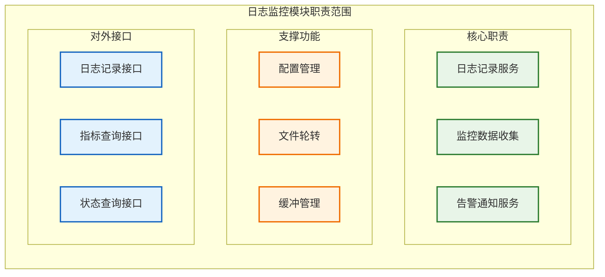
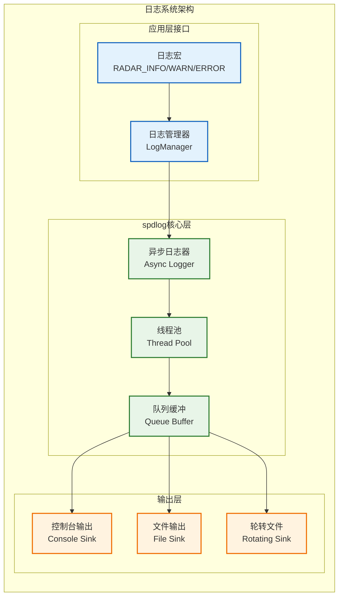
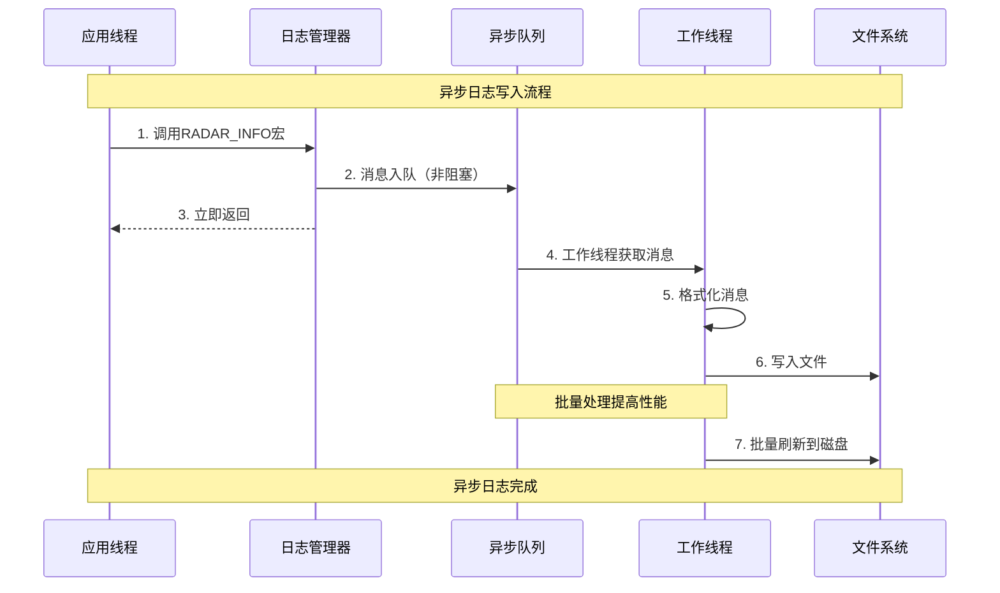
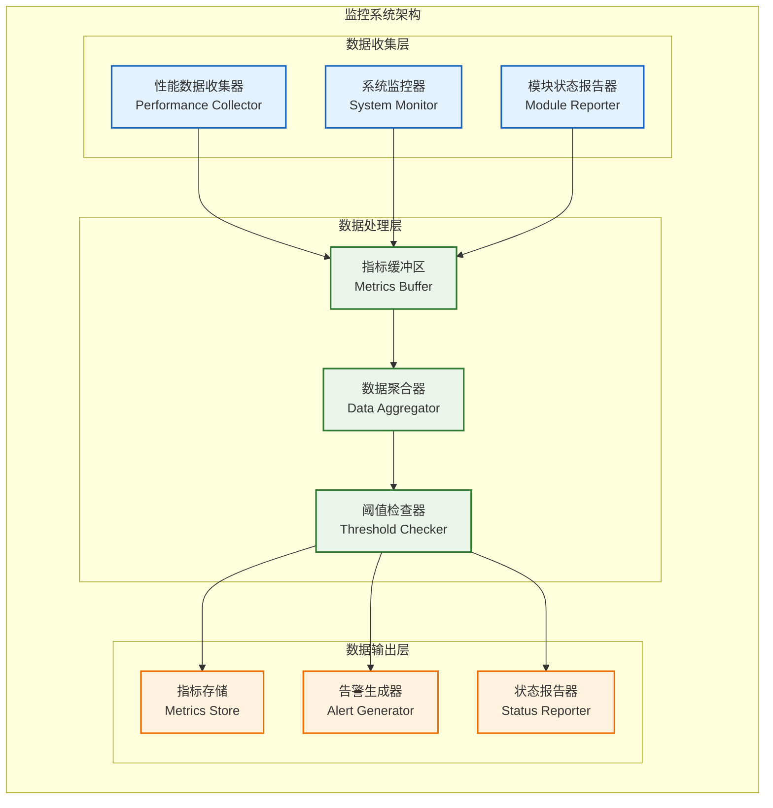
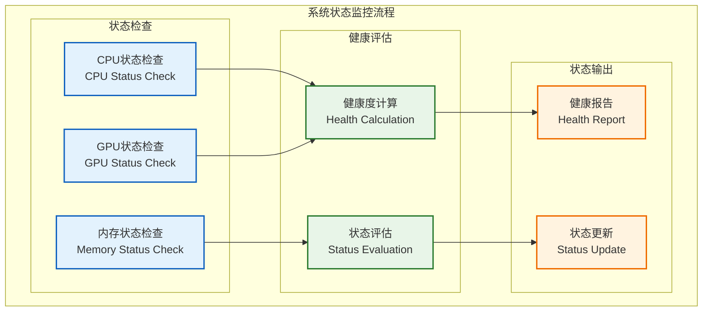
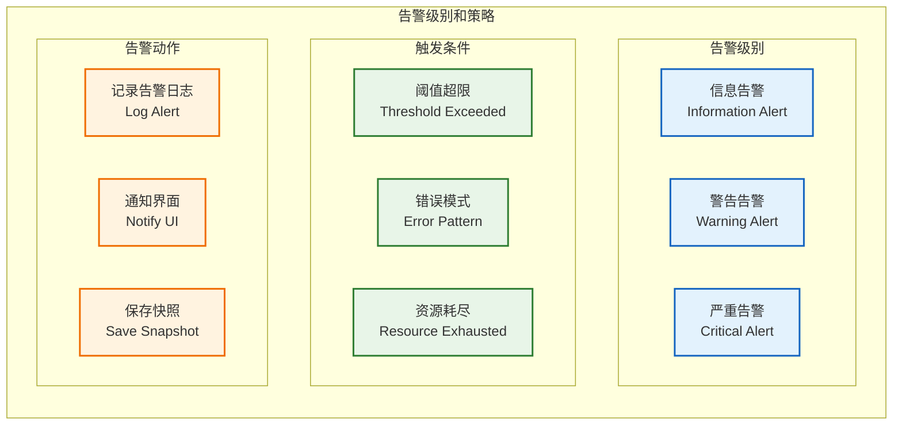

# 日志监控模块设计

**文档版本**: v1.0.1
**最后更新**: 2025-09-23
**负责人**: Kelin
**适用阶段**: MVP及向 V2.0 性能优化过渡阶段
**来源依据**: 基于《[MVP系统设计文档](../MVP系统设计文档.md)》第5.6章日志监控模块和第2.2.1章详细组件架构

---

## 1 文档职责

本文件详细设计日志监控模块的内部架构和核心机制，侧重"结构化日志记录与系统监控"的简化实现：
1) 基于spdlog的高性能异步日志系统
2) 简化的性能指标收集和展示
3) 基础的系统状态监控机制
4) 轻量级异常告警和诊断信息输出
5) 与其他模块的解耦集成方式

已明确不在本文件范围内的内容：复杂的日志分析算法、外部监控系统集成、高级数据可视化、分布式日志聚合等（这些在相应的专项文档中维护）。

### 1.1 目录

- [日志监控模块设计](#日志监控模块设计)
  - [1 文档职责](#1-文档职责)
    - [1.1 目录](#11-目录)
  - [2 模块总体设计](#2-模块总体设计)
    - [2.1 模块职责定义](#21-模块职责定义)
    - [2.2 模块边界和约束](#22-模块边界和约束)
  - [3 日志系统设计](#3-日志系统设计)
    - [3.1 日志架构设计](#31-日志架构设计)
    - [3.2 日志级别和格式](#32-日志级别和格式)
    - [3.3 异步日志机制](#33-异步日志机制)
  - [4 监控系统设计](#4-监控系统设计)
    - [4.1 监控架构设计](#41-监控架构设计)
    - [4.2 性能指标收集](#42-性能指标收集)
    - [4.3 系统状态监控](#43-系统状态监控)
  - [5 告警机制设计](#5-告警机制设计)
    - [5.1 告警级别和策略](#51-告警级别和策略)
    - [5.2 告警触发机制](#52-告警触发机制)
  - [6 配置管理](#6-配置管理)
  - [7 性能优化](#7-性能优化)
  - [8 模块约束说明](#8-模块约束说明)
  - [9 相关文档](#9-相关文档)
  - [10 变更历史](#10-变更历史)

---

## 2 模块总体设计

### 2.1 模块职责定义

日志监控模块作为系统的观测基础设施，承担日志记录、性能监控和异常告警的核心职责：



### 2.2 模块边界和约束

**输入边界**：
- 各模块通过统一宏接口产生的日志消息
- 系统资源使用情况（CPU、内存、GPU等）
- 业务模块的性能指标和状态信息
- 配置管理器的日志配置参数

**输出边界**：
- 结构化日志文件（本地存储）
- 实时性能指标数据
- 系统状态和健康报告
- 异常告警和诊断信息

**性能约束**：
- 日志写入延迟 < 100μs（异步模式）
- 监控数据收集频率 ≤ 1Hz（避免性能影响）
- 日志文件大小 ≤ 100MB（自动轮转）
- 内存占用 ≤ 50MB

**技术约束**：
- 基于spdlog 1.9+实现异步日志
- 使用C++17标准开发
- 集成项目统一的错误处理框架
- 支持Linux和Windows平台

---

## 3 日志系统设计

### 3.1 日志架构设计

基于spdlog的简化日志架构，注重性能和易用性：



### 3.2 日志级别和格式

采用标准的5级日志级别，格式简洁明了：

**日志级别定义**：
```cpp
namespace radar::logging {

/**
 * @brief 日志级别枚举
 * @details 定义系统支持的5个日志级别，从最详细的TRACE到最严重的ERROR
 */
enum class LogLevel {
    TRACE = 0,  ///< 详细跟踪信息，仅用于调试
    DEBUG = 1,  ///< 调试信息
    INFO  = 2,  ///< 一般信息
    WARN  = 3,  ///< 警告信息
    ERROR = 4   ///< 错误信息
};

/**
 * @brief 记录TRACE级别日志
 * @param[in] fmt 格式字符串
 * @param[in] ... 可变参数列表
 */
#define RADAR_TRACE(fmt, ...) radar::logging::LogManager::getInstance().log(LogLevel::TRACE, fmt, ##__VA_ARGS__)

/**
 * @brief 记录DEBUG级别日志
 * @param[in] fmt 格式字符串
 * @param[in] ... 可变参数列表
 */
#define RADAR_DEBUG(fmt, ...) radar::logging::LogManager::getInstance().log(LogLevel::DEBUG, fmt, ##__VA_ARGS__)

/**
 * @brief 记录INFO级别日志
 * @param[in] fmt 格式字符串
 * @param[in] ... 可变参数列表
 */
#define RADAR_INFO(fmt, ...)  radar::logging::LogManager::getInstance().log(LogLevel::INFO, fmt, ##__VA_ARGS__)

/**
 * @brief 记录WARN级别日志
 * @param[in] fmt 格式字符串
 * @param[in] ... 可变参数列表
 */
#define RADAR_WARN(fmt, ...)  radar::logging::LogManager::getInstance().log(LogLevel::WARN, fmt, ##__VA_ARGS__)

/**
 * @brief 记录ERROR级别日志
 * @param[in] fmt 格式字符串
 * @param[in] ... 可变参数列表
 */
#define RADAR_ERROR(fmt, ...) radar::logging::LogManager::getInstance().log(LogLevel::ERROR, fmt, ##__VA_ARGS__)

} // namespace radar::logging
```

**日志格式设计**：
```
[2025-09-23 10:30:45.123] [INFO] [DataReceiver] Packet received: id=12345, size=1024 bytes
[2025-09-23 10:30:45.124] [WARN] [SignalProcessor] GPU memory usage high: 85%
[2025-09-23 10:30:45.125] [ERROR] [DataProcessor] Processing failed: timeout after 5000ms
```

格式说明：`[时间戳] [级别] [模块名] 消息内容`

### 3.3 异步日志机制

利用spdlog的异步特性实现高性能日志记录：



**日志管理器实现**：
```cpp
namespace radar::logging {

/**
 * @brief 日志管理器类
 * @details 提供全局单例的日志记录服务，基于spdlog实现异步日志
 */
class LogManager {
public:
    /**
     * @brief 获取单例实例
     * @return LogManager& 日志管理器实例引用
     */
    static LogManager& getInstance();

    /**
     * @brief 初始化日志系统
     * @param[in] config 日志配置对象
     * @return ErrorCode 初始化结果状态码
     */
    ErrorCode initialize(const LogConfig& config);

    /**
     * @brief 记录指定级别的日志消息
     * @tparam Args 可变参数类型包
     * @param[in] level 日志级别
     * @param[in] format 格式化字符串
     * @param[in] args 格式化参数
     */
    template<typename... Args>
    void log(LogLevel level, const std::string& format, Args&&... args);

    /**
     * @brief 立即刷新所有待写入的日志
     * @details 强制将缓冲区中的日志立即写入到目标输出
     */
    void flush();

    /**
     * @brief 设置当前日志级别
     * @param[in] level 要设置的日志级别
     */
    void setLevel(LogLevel level);

private:
    std::shared_ptr<spdlog::async_logger> async_logger_;  ///< spdlog异步日志器
    spdlog::level::level_enum current_level_;             ///< 当前日志级别

    LogManager() = default;
    ~LogManager();
};

} // namespace radar::logging
```

---

## 4 监控系统设计

### 4.1 监控架构设计

简化的监控架构，专注于核心指标收集：



### 4.2 性能指标收集

收集关键的系统和业务性能指标：

**核心指标定义**：
```cpp
namespace radar::monitoring {

// 性能指标结构
struct PerformanceMetrics {
    // 系统指标
    float cpu_usage_percent;       // CPU使用率
    float memory_usage_percent;    // 内存使用率
    float gpu_usage_percent;       // GPU使用率

    // 业务指标
    uint64_t packets_received;     // 接收数据包数
    uint64_t packets_processed;    // 处理数据包数
    uint64_t processing_latency_ms; // 处理延迟(毫秒)

    // 错误指标
    uint32_t error_count;          // 错误计数
    uint32_t warning_count;        // 警告计数

    std::chrono::steady_clock::time_point timestamp;
};

// 监控管理器
class MonitoringManager {
public:
    static MonitoringManager& getInstance();

    // 初始化监控系统
    ErrorCode initialize(const MonitorConfig& config);

    // 更新指标
    void updateMetric(const std::string& name, double value);

    // 获取当前指标
    PerformanceMetrics getCurrentMetrics() const;

    // 检查系统健康状态
    SystemHealthStatus getHealthStatus() const;

private:
    std::mutex metrics_mutex_;
    PerformanceMetrics current_metrics_;
    std::unordered_map<std::string, double> custom_metrics_;
};

} // namespace radar::monitoring
```

### 4.3 系统状态监控

简化的系统状态监控机制：



**系统健康状态定义**：
```cpp
namespace radar::monitoring {

enum class SystemHealthStatus {
    HEALTHY = 0,    // 系统健康
    WARNING = 1,    // 系统警告
    CRITICAL = 2,   // 系统严重
    UNKNOWN = 3     // 状态未知
};

struct SystemStatus {
    SystemHealthStatus overall_health;
    float cpu_health_score;        // 0.0 - 1.0
    float memory_health_score;     // 0.0 - 1.0
    float gpu_health_score;        // 0.0 - 1.0
    std::string status_message;
    std::chrono::steady_clock::time_point last_update;
};

} // namespace radar::monitoring
```

---

## 5 告警机制设计

### 5.1 告警级别和策略

简化的三级告警机制：



### 5.2 告警触发机制

基于阈值的简单告警触发机制：

**告警配置定义**：
```cpp
namespace radar::monitoring {

struct AlertThreshold {
    std::string metric_name;
    double warning_threshold;
    double critical_threshold;
    uint32_t consecutive_count;    // 连续超限次数
    std::chrono::seconds cooldown; // 告警冷却时间
};

struct AlertConfig {
    std::vector<AlertThreshold> thresholds = {
        {"cpu_usage", 80.0, 95.0, 3, std::chrono::seconds(60)},
        {"memory_usage", 85.0, 95.0, 3, std::chrono::seconds(60)},
        {"gpu_usage", 90.0, 98.0, 2, std::chrono::seconds(30)},
        {"error_rate", 5.0, 10.0, 2, std::chrono::seconds(30)}
    };
    bool enable_console_output = true;
    bool enable_file_output = true;
    std::string alert_log_path = "logs/alerts.log";
};

} // namespace radar::monitoring
```

---

## 6 配置管理

**日志配置结构**：
```yaml
# 日志监控配置 (config/logging.yaml)
logging:
  level: "INFO"                    # 日志级别: TRACE, DEBUG, INFO, WARN, ERROR
  async_mode: true                 # 启用异步模式
  queue_size: 8192                 # 异步队列大小
  thread_count: 1                  # 后台线程数

  console:
    enabled: true                  # 控制台输出
    pattern: "[%Y-%m-%d %H:%M:%S.%e] [%l] [%n] %v"

  file:
    enabled: true                  # 文件输出
    path: "logs/radar.log"         # 日志文件路径
    max_size: "100MB"              # 单文件最大大小
    max_files: 5                   # 保留文件数量
    pattern: "[%Y-%m-%d %H:%M:%S.%e] [%l] [%n] %v"

monitoring:
  enabled: true                    # 启用监控
  collection_interval: 1000        # 数据收集间隔(毫秒)

  alerts:
    cpu_warning: 80.0              # CPU警告阈值(%)
    cpu_critical: 95.0             # CPU严重阈值(%)
    memory_warning: 85.0           # 内存警告阈值(%)
    memory_critical: 95.0          # 内存严重阈值(%)

  storage:
    enabled: false                 # 暂不启用历史数据存储
    retention_days: 7              # 数据保留天数
```

---

## 7 性能优化

**关键优化策略**：

| 优化技术     | 实现方式            | 性能提升        | 适用场景     |
| ------------ | ------------------- | --------------- | ------------ |
| **异步日志** | spdlog异步模式      | 写入延迟降低90% | 高频日志记录 |
| **批量写入** | 缓冲区批量刷新      | I/O操作减少80%  | 大量日志输出 |
| **内存池**   | 预分配消息缓冲区    | 内存分配减少70% | 频繁消息创建 |
| **无锁队列** | lock-free环形缓冲区 | 并发性能提升50% | 多线程日志   |
| **延迟监控** | 降低监控采样频率    | CPU占用减少60%  | 系统资源监控 |
| **条件编译** | DEBUG级别条件编译   | 发布版本零开销  | 调试日志     |

**性能监控开销控制**：
```cpp
// 监控数据收集频率控制
constexpr std::chrono::milliseconds MONITOR_INTERVAL{1000}; // 1秒
constexpr size_t MAX_METRICS_BUFFER_SIZE = 1000;           // 最大缓冲区大小

// 低开销的指标更新
inline void updateMetricFast(const std::string& name, double value) {
    static thread_local std::unordered_map<std::string, double> local_cache;
    local_cache[name] = value;

    // 批量更新，减少锁竞争
    static thread_local size_t update_count = 0;
    if (++update_count % 100 == 0) {
        flushLocalCache(local_cache);
    }
}
```

---

## 8 模块约束说明

**功能约束**：
- MVP阶段提供基础的异步日志和简单监控功能
- 支持5级日志级别，文件大小限制100MB
- 支持基本的CPU、内存、GPU使用率监控
- 提供简单的阈值告警机制

**性能约束**：
- 异步日志写入延迟不超过100μs
- 监控数据收集不超过1% CPU使用率
- 内存占用控制在50MB以内
- 日志文件自动轮转，避免磁盘空间问题

**技术约束**：
- 基于spdlog 1.9+实现日志功能
- 使用C++17标准开发
- 集成项目统一的IModule接口
- 支持YAML配置文件

**扩展约束**：
- 日志输出支持多种sink扩展
- 监控指标支持自定义指标类型
- 告警机制支持自定义告警规则
- 预留外部监控系统集成接口

---

## 9 相关文档

- [数据接收模块设计](01_数据接收模块设计.md)
- [信号处理模块设计](02_信号处理模块设计.md)
- [数据处理模块设计](03_数据处理模块设计.md)
- [显控接口模块设计](04_显控接口模块设计.md)
- [任务调度器设计](05_任务调度器设计.md)
- [配置管理模块设计](06_配置管理模块设计.md)
- [MVP系统设计文档](../MVP系统设计文档.md)

---

## 10 变更历史

| 版本   | 日期       | 作者  | 变更描述                                                                            |
| ------ | ---------- | ----- | ----------------------------------------------------------------------------------- |
| v1.0.1 | 2025-09-23 | Kelin | 去掉了接口设计部分的内容，简化了文档结构。                                        |
| v1.0.0 | 2025-09-23 | Kelin | 基于MVP设计文档创建日志监控模块设计，采用spdlog实现简化的异步日志和基础监控告警功能。 |

---

*本日志监控模块设计为雷达数据处理系统提供高性能的日志记录和基础监控功能，确保系统的可观测性和问题诊断能力。*
