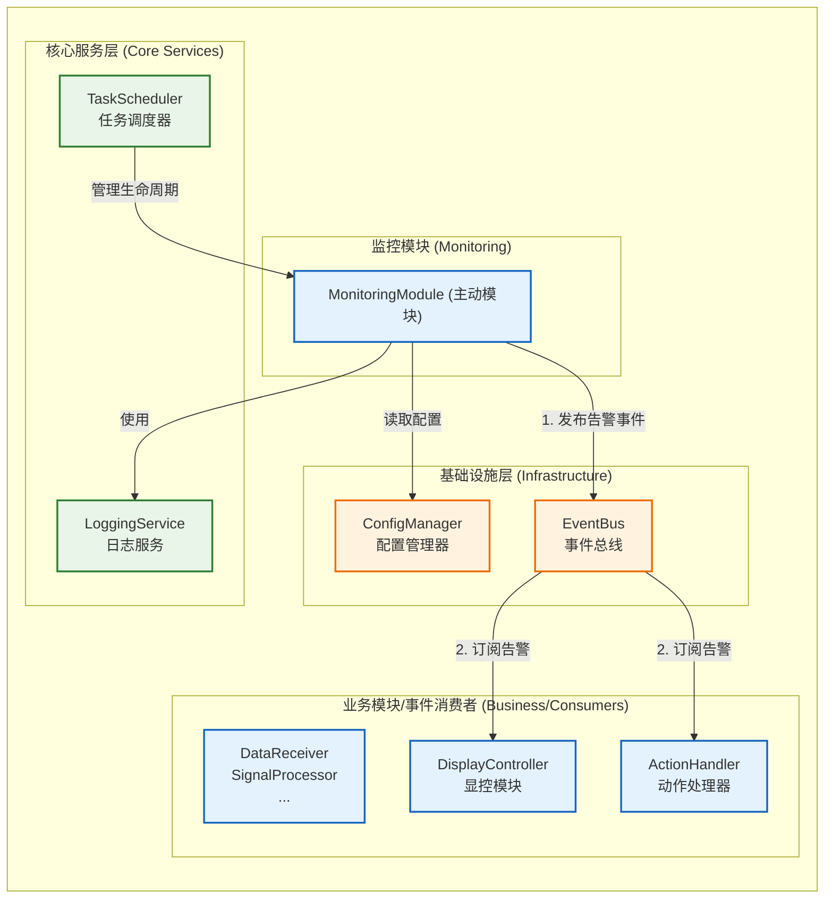
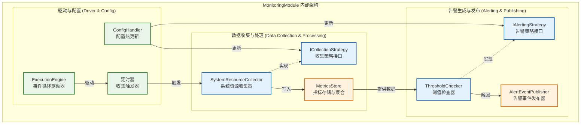
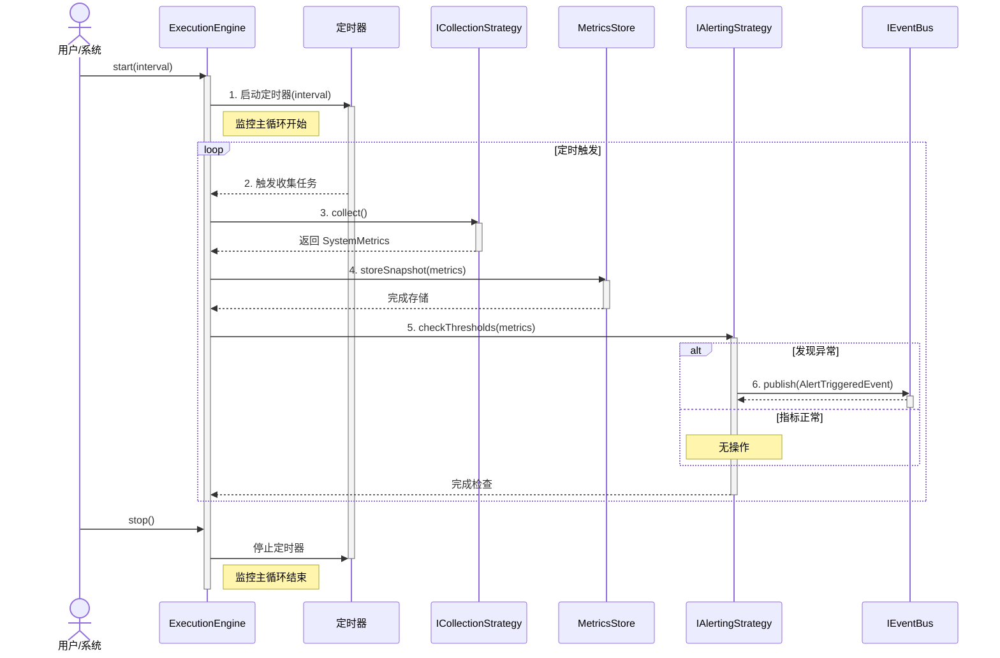
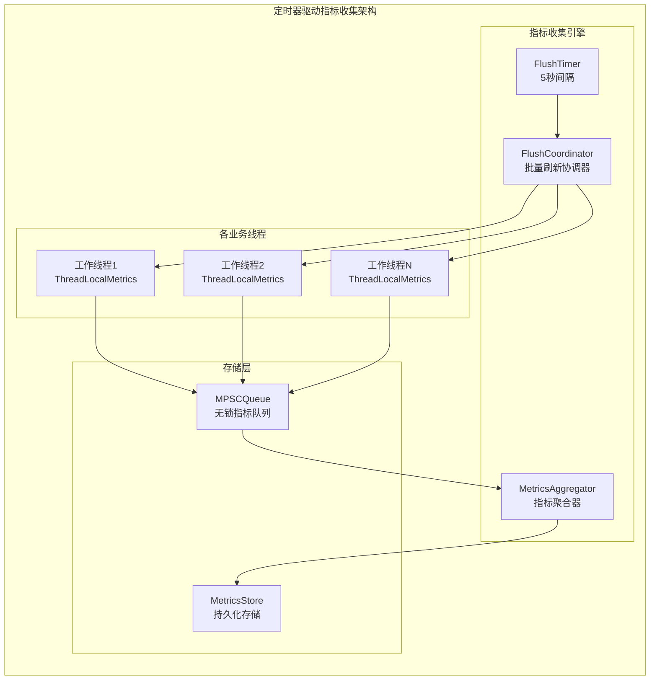
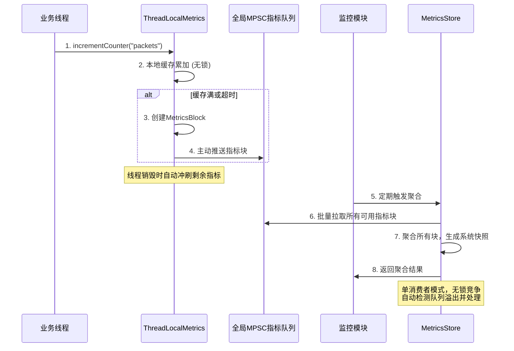
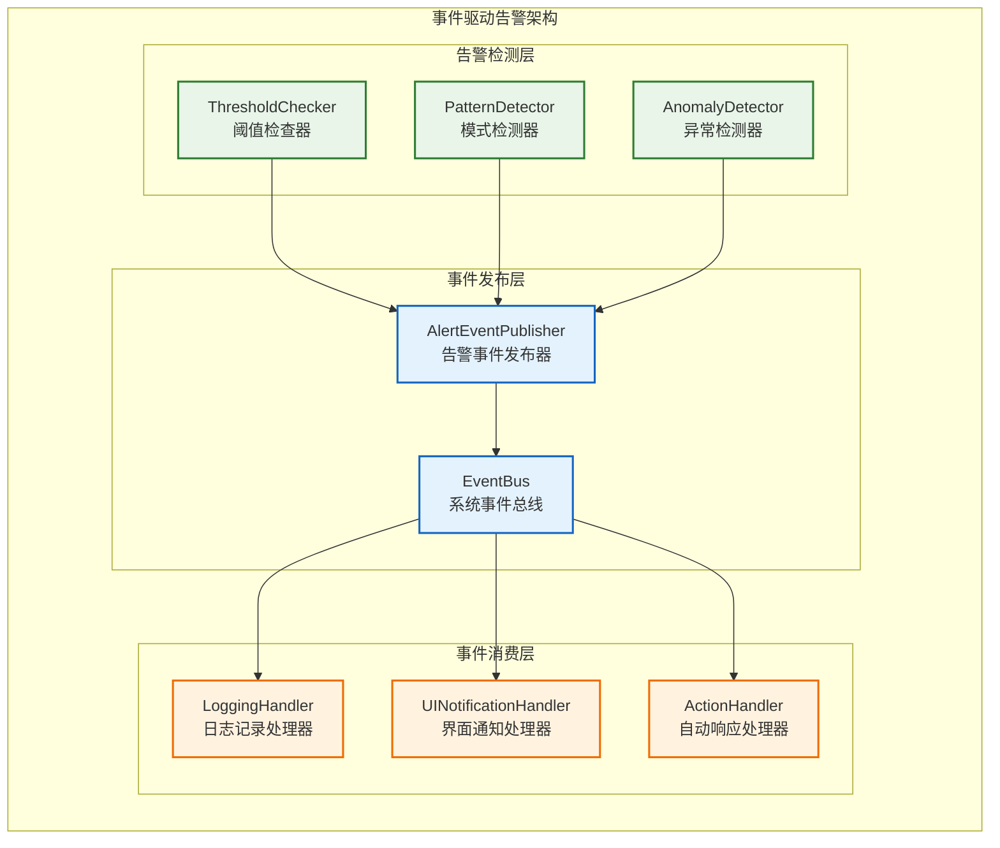
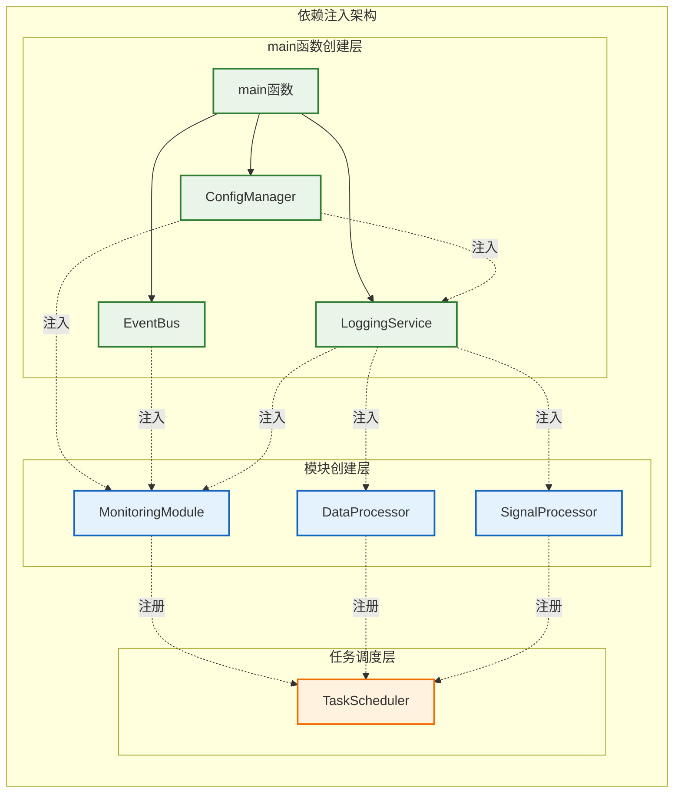

# 监控服务设计

**文档版本**: v2.2.0
**最后更新**: 2025-09-25
**编写人员**: Kelin

---

## 1 文档职责

本文件设计`MonitoringModule`，一个独立的、主动的系统监控与告警模块。它遵循`IModule`接口，并与系统的其他部分通过明确定义的接口和事件进行交互。

**核心设计目标**：
1. **独立模块**: 作为一个标准的`IModule`运行，拥有自己的生命周期和执行引擎。
2. **主动监控**: 定期收集系统资源（CPU、内存、GPU）和业务性能指标。
3. **事件驱动告警**: 基于可配置的策略评估指标，通过`EventBus`发布告警事件，实现与消费者的完全解耦。
4. **健康状态评估**: 提供一个综合的系统健康状态评分模型。

### 1.1 目录

- [监控服务设计](#监控服务设计)
  - [1 文档职责](#1-文档职责)
    - [1.1 目录](#11-目录)
  - [2 架构总览与职责](#2-架构总览与职责)
    - [2.1 架构边界](#21-架构边界)
    - [2.2 职责定义](#22-职责定义)
    - [2.3 集成模式](#23-集成模式)
  - [3 MonitoringModule设计](#3-monitoringmodule设计)
    - [3.1 模块架构与组件](#31-模块架构与组件)
    - [3.2 ExecutionEngine驱动](#32-executionengine驱动)
    - [3.3 性能指标收集](#33-性能指标收集)
    - [3.4 系统状态监控](#34-系统状态监控)
  - [4 事件驱动告警机制](#4-事件驱动告警机制)
    - [4.1 告警事件定义](#41-告警事件定义)
    - [4.2 告警策略引擎](#42-告警策略引擎)
    - [4.3 事件总线集成](#43-事件总线集成)
  - [5 配置管理集成](#5-配置管理集成)
    - [5.1 ConfigManager集成](#51-configmanager集成)
    - [5.2 配置热更新支持](#52-配置热更新支持)
  - [6 依赖注入与生命周期](#6-依赖注入与生命周期)
    - [6.1 依赖关系设计](#61-依赖关系设计)
    - [6.2 初始化与启动序列](#62-初始化与启动序列)
  - [7 性能优化策略](#7-性能优化策略)
  - [8 实现约束与限制](#8-实现约束与限制)
    - [8.1 技术约束](#81-技术约束)
    - [8.2 架构约束](#82-架构约束)
    - [8.3 性能约束](#83-性能约束)
    - [8.4 MVP功能范围](#84-mvp功能范围)
  - [9 相关文档](#9-相关文档)
  - [10 变更历史](#10-变更历史)

---

## 2 架构总览与职责

### 2.1 架构边界

`MonitoringModule` 是一个**主动的标准模块**，它拥有自己的执行线程和生命周期，由 `TaskScheduler` 管理。它通过 `ConfigManager` 获取配置，通过 `EventBus` 发布告警，并通过注入的 `ILogger` 记录自身日志。



### 2.2 职责定义

**`MonitoringModule` 的核心职责**:
- **主动数据收集**: 内部有一个由 `ExecutionEngine` 驱动的定时循环，主动收集以下数据：
  - **系统资源**: CPU、内存、GPU使用率。
  - **业务指标**: 从其他模块获取或聚合的性能数据（如吞吐量、延迟）。
- **指标聚合与存储**: 将收集到的瞬时数据聚合为有意义的指标，并存储在内部的 `MetricsStore` 中，以供历史查询和状态评估。
- **告警策略评估**: 基于从 `ConfigManager` 加载的告警规则（如阈值、连续违规次数），评估当前指标是否触发告警条件。
- **事件发布**: 当告警条件满足时，创建 `AlertTriggeredEvent` 或 `AlertResolvedEvent`，并通过 `EventBus` 发布。它不关心谁会消费这些事件。
- **健康状态报告**: 综合各项指标，计算系统整体健康评分，并提供 `SystemStatusReport`。

**`MonitoringModule` 不负责**:
- **日志记录**: 它自身使用 `LoggingService` 来记录日志，但不提供日志服务。
- **告警响应**: 它只负责发布告警事件。具体的响应措施（如UI提示、自动降级）由其他订阅了告警事件的模块负责。
- **业务决策**: 它提供数据和状态，但不做出业务层面的决策。

### 2.3 集成模式

- **生命周期管理**: 作为 `IModule`，其 `initialize`, `start`, `stop` 等生命周期方法由 `TaskScheduler` 统一调用。
- **依赖注入**: 通过构造函数注入 `IConfigManager`, `IEventBus`, `ILogger` 等依赖。
- **事件驱动通信**: 与系统其他部分的主要交互方式是通过 `EventBus`。这是实现高度解耦的关键。
- **配置协同**: 订阅 `monitoring.*` 配置项的变更，实现监控间隔、告警阈值等参数的热更新。

---

## 3 MonitoringModule设计

### 3.1 模块架构与组件

基于`IModule`接口的标准监控模块，采用`ExecutionEngine`驱动模式：



**核心接口定义**：
```cpp
namespace radar::monitoring {

/**
 * @brief 监控模块主类
 * @details 实现IModule接口，提供系统监控和告警功能
 */
class MonitoringModule : public IModule {
public:
    /**
     * @brief 构造函数 - 依赖注入
     * @param config_manager 配置管理器
     * @param event_bus 事件总线
     * @param logger 日志服务
     */
    MonitoringModule(
        std::shared_ptr<IConfigManager> config_manager,
        std::shared_ptr<IEventBus> event_bus,
        std::shared_ptr<ILogger> logger);

    // IModule接口实现
    ErrorCode initialize() override;
    ErrorCode start() override;
    ErrorCode stop() override;
    ErrorCode pause() override;
    ErrorCode resume() override;
    ErrorCode cleanup() override;

    ModuleState getState() const override;
    const std::string& getModuleName() const override;

    void setStateChangeCallback(StateChangeCallback callback) override;
    void setErrorCallback(ErrorCallback callback) override;
    PerformanceMetricsPtr getPerformanceMetrics() const override;

    /**
     * @brief 获取当前系统指标快照
     * @return 系统性能指标
     */
    SystemMetrics getCurrentMetrics() const;

    /**
     * @brief 获取系统健康状态
     * @return 健康状态枚举
     */
    SystemHealthStatus getHealthStatus() const;

private:
    std::shared_ptr<IConfigManager> config_manager_;
    std::shared_ptr<IEventBus> event_bus_;
    std::shared_ptr<ILogger> logger_;

    std::unique_ptr<ExecutionEngine> execution_engine_;
    std::unique_ptr<ICollectionStrategy> collection_strategy_;
    std::unique_ptr<IAlertingStrategy> alerting_strategy_;
    std::unique_ptr<MetricsStore> metrics_store_;

    ModuleState current_state_{ModuleState::UNINITIALIZED};
    mutable std::mutex state_mutex_;

    void onCollectionTimer();
    void onConfigChanged(const std::string& key, const YAML::Node& value);
    void publishAlert(const AlertEvent& alert);
};

} // namespace radar::monitoring
```

### 3.2 ExecutionEngine驱动

采用标准的`ExecutionEngine`模式，通过定时器驱动监控数据收集和处理：



**ExecutionEngine实现**：
```cpp
namespace radar::monitoring {

/**
 * @brief 监控模块执行引擎
 * @details 驱动监控数据收集和告警检查的主循环
 */
class ExecutionEngine {
public:
    ExecutionEngine(
        std::shared_ptr<ICollectionStrategy> collector,
        std::shared_ptr<IAlertingStrategy> alerter,
        std::shared_ptr<MetricsStore> store,
        std::shared_ptr<ILogger> logger);

    /**
     * @brief 启动执行引擎
     * @param interval 收集间隔（默认1秒）
     */
    void start(std::chrono::milliseconds interval = std::chrono::milliseconds(1000));

    /**
     * @brief 停止执行引擎
     */
    void stop();

    /**
     * @brief 暂停监控
     */
    void pause();

    /**
     * @brief 恢复监控
     */
    void resume();

    /**
     * @brief 获取引擎状态
     */
    bool isRunning() const;

private:
    std::shared_ptr<ICollectionStrategy> collector_;
    std::shared_ptr<IAlertingStrategy> alerter_;
    std::shared_ptr<MetricsStore> store_;
    std::shared_ptr<ILogger> logger_;

    std::unique_ptr<std::thread> worker_thread_;
    std::atomic<bool> running_{false};
    std::atomic<bool> paused_{false};
    std::condition_variable cv_;
    std::mutex mutex_;

    void workerLoop(std::chrono::milliseconds interval);
    void collectAndProcess();
};

/**
 * @brief 收集策略接口
 */
class ICollectionStrategy {
public:
    virtual ~ICollectionStrategy() = default;

    /**
     * @brief 收集系统指标
     * @return 收集到的指标数据
     */
    virtual SystemMetrics collect() = 0;

    /**
     * @brief 配置更新通知
     * @param config 新的配置
     */
    virtual void updateConfig(const YAML::Node& config) = 0;
};

/**
 * @brief 系统资源收集器
 */
class SystemResourceCollector : public ICollectionStrategy {
public:
    SystemMetrics collect() override;
    void updateConfig(const YAML::Node& config) override;

private:
    float getCpuUsage();
    float getMemoryUsage();
    float getGpuUsage();
    uint64_t getProcessingLatency();
};

} // namespace radar::monitoring
```

### 3.3 性能指标收集

基于线程局部存储的高性能指标收集机制，避免锁竞争：

#### 3.3.1 定时器驱动的指标刷新机制

**问题识别**: 原设计中ThreadLocalMetrics仅依赖线程析构触发指标刷新，在线程池场景下工作线程长期存活，导致指标数据延迟上报。

**解决方案**: 引入**定时器驱动的批量刷新机制**，确保指标数据的及时性。



**实现策略**:

1. **定时刷新触发器**:
   ```cpp
   class FlushCoordinator {
   private:
       std::chrono::steady_clock timer_;
       std::vector<std::weak_ptr<ThreadLocalMetrics>> registered_threads_;
       std::atomic<bool> running_{false};

   public:
       void startPeriodicFlush(std::chrono::seconds interval = std::chrono::seconds(5)) {
           running_ = true;
           flush_thread_ = std::thread([this, interval]() {
               while (running_) {
                   std::this_thread::sleep_for(interval);
                   triggerBatchFlush();
               }
           });
       }

   private:
       void triggerBatchFlush() {
           // 遍历所有注册的线程本地指标实例
           for (auto& weak_metrics : registered_threads_) {
               if (auto metrics = weak_metrics.lock()) {
                   metrics->flushToQueue();  // 非阻塞刷新
               }
           }
       }
   };
   ```

2. **优化的ThreadLocalMetrics**:
   ```cpp
   class ThreadLocalMetrics {
   private:
       thread_local static MetricsBuffer local_buffer_;
       std::atomic<std::chrono::steady_clock::time_point> last_flush_;

   public:
       void flushToQueue() {
           auto now = std::chrono::steady_clock::now();
           auto last = last_flush_.load();

           // 避免频繁刷新，最小间隔1秒
           if (std::chrono::duration_cast<std::chrono::seconds>(now - last).count() < 1) {
               return;
           }

           if (last_flush_.compare_exchange_weak(last, now)) {
               // 原子交换缓冲区，避免数据丢失
               auto snapshot = local_buffer_.takeSnapshot();
               metrics_queue_.enqueue(std::move(snapshot));
           }
       }
   };
   ```

**指标数据结构**：
```cpp
namespace radar::monitoring {

/**
 * @brief 系统性能指标
 */
struct SystemMetrics {
    // 系统资源指标
    float cpu_usage_percent{0.0f};
    float memory_usage_percent{0.0f};
    float gpu_usage_percent{0.0f};

    // 业务性能指标
    uint64_t packets_received{0};
    uint64_t packets_processed{0};
    uint64_t packets_dropped{0};
    double avg_processing_latency_ms{0.0};

    // 错误统计
    uint32_t error_count{0};
    uint32_t warning_count{0};

    std::chrono::steady_clock::time_point timestamp;
};

/**
 * @brief 多生产者单消费者无锁队列 (新增 - 基于架构深度评审)
 * @details 高性能的线程安全队列，支持多个业务线程同时推送指标块
 */
template<typename T>
class MPSCQueue {
public:
    /**
     * @brief 推送元素到队列 (多生产者)
     * @param item 要推送的元素
     * @return 是否成功推送
     */
    bool push(T&& item);

    /**
     * @brief 批量拉取元素 (单消费者)
     * @param items 输出容器
     * @param max_items 最大拉取数量
     * @return 实际拉取的数量
     */
    size_t popBatch(std::vector<T>& items, size_t max_items);

    /**
     * @brief 获取队列大小估计值
     * @return 队列中元素的近似数量
     */
    size_t sizeEstimate() const;

private:
    // 使用无锁数据结构实现，具体实现依赖平台
    // 可以基于std::atomic和CAS操作实现
};

/**
 * @brief 队列统计信息
 */
struct QueueStats {
    uint64_t blocks_processed;    ///< 已处理的指标块总数
    uint64_t queue_overruns;      ///< 队列溢出次数
    size_t current_queue_size;    ///< 当前队列大小
    double processing_rate;       ///< 处理速率 (blocks/sec)
};

/**
 * @brief 指标块结构体 (新增 - 基于架构深度评审)
 * @details 线程本地指标的聚合单元，用于推送到全局队列
 */
struct MetricsBlock {
    std::thread::id thread_id;                           ///< 线程标识
    Timestamp collection_time;                           ///< 收集时间
    std::unordered_map<std::string, double> aggregated_metrics; ///< 聚合后的指标
    uint32_t update_count;                              ///< 包含的更新次数
};

/**
 * @brief 线程局部指标收集器 (改进版本)
 * @details 每个线程独立收集指标，当缓存满或超时时主动推送到全局队列
 */
class ThreadLocalMetrics {
public:
    /**
     * @brief 更新指标值
     * @param name 指标名称
     * @param value 指标值
     */
    static void updateMetric(const std::string& name, double value);

    /**
     * @brief 增加计数器
     * @param name 计数器名称
     * @param delta 增量（默认1）
     */
    static void incrementCounter(const std::string& name, uint64_t delta = 1);

    /**
     * @brief 记录延迟
     * @param name 延迟指标名称
     * @param latency_ms 延迟值（毫秒）
     */
    static void recordLatency(const std::string& name, double latency_ms);

    /**
     * @brief 强制冲刷本地指标到全局队列
     * @note 线程销毁时自动调用，也可手动调用
     */
    static void flushMetrics();

private:
    static thread_local std::unordered_map<std::string, double> local_metrics_;
    static thread_local uint32_t update_counter_;
    static thread_local Timestamp last_flush_time_;

    // 推送配置
    static constexpr uint32_t FLUSH_THRESHOLD = 100;     // 100次更新后推送
    static constexpr auto FLUSH_INTERVAL = 100ms;        // 100ms超时推送

    static void checkAndFlush();
    static void pushMetricsBlock();
};

/**
 * @brief 指标存储和聚合器 (改进版本 - 基于架构深度评审)
 * @details 作为MPSC队列的唯一消费者，从队列中批量拉取指标块进行聚合
 */
class MetricsStore {
public:
    /**
     * @brief 初始化指标存储
     * @param global_queue 全局MPSC指标队列的引用
     */
    explicit MetricsStore(MPSCQueue<MetricsBlock>& global_queue);

    /**
     * @brief 从全局队列聚合指标 (新方法)
     * @return 聚合后的系统指标
     * @note 批量拉取所有可用的MetricsBlock进行聚合
     */
    SystemMetrics aggregateFromQueue();

    /**
     * @brief 存储指标快照
     * @param metrics 要存储的指标
     */
    void storeSnapshot(const SystemMetrics& metrics);

    /**
     * @brief 获取历史指标
     * @param duration 查询时间范围
     * @return 指定时间范围内的指标历史
     */
    std::vector<SystemMetrics> getHistoricalMetrics(
        std::chrono::minutes duration) const;

    /**
     * @brief 获取队列统计信息
     * @return 队列大小、处理速率等统计
     */
    QueueStats getQueueStats() const;

private:
    MPSCQueue<MetricsBlock>& global_metrics_queue_;  ///< 全局指标队列引用
    mutable std::shared_mutex metrics_mutex_;
    SystemMetrics current_snapshot_;
    std::deque<SystemMetrics> historical_data_;
    static constexpr size_t MAX_HISTORY_SIZE = 3600; // 1小时历史

    // 队列处理统计
    mutable std::atomic<uint64_t> blocks_processed_{0};
    mutable std::atomic<uint64_t> queue_overruns_{0};

    SystemMetrics calculateAggregates(const std::vector<MetricsBlock>& blocks);
    void handleQueueOverrun();
};

} // namespace radar::monitoring
```

**使用示例**：
```cpp
// 在业务模块中更新指标 - 零锁开销
void DataProcessor::processPacket(const Packet& packet) {
    auto start_time = std::chrono::steady_clock::now();

    // 处理逻辑...

    auto end_time = std::chrono::steady_clock::now();
    auto duration = std::chrono::duration_cast<std::chrono::milliseconds>(
        end_time - start_time).count();

    // 更新线程本地指标
    ThreadLocalMetrics::incrementCounter("packets_processed");
    ThreadLocalMetrics::recordLatency("processing_latency_ms", duration);
}

// 监控模块定期聚合 (改进版本)
void MonitoringModule::onCollectionTimer() {
    TraceContextGuard guard(TraceContext::generateTraceId());

    RADAR_DEBUG(logger_, "Starting metrics collection cycle");

    // 从全局队列批量拉取指标块进行聚合
    auto metrics = metrics_store_->aggregateFromQueue();

    RADAR_INFO(logger_, "Metrics collected - {cpu_usage={:.1f}%, memory_usage={:.1f}%, packets_processed={}}",
               metrics.cpu_usage_percent, metrics.memory_usage_percent, metrics.packets_processed);

    // 存储快照
    metrics_store_->storeSnapshot(metrics);

    // 检查告警
    alerting_strategy_->checkThresholds(metrics);

    // 监控队列健康状况
    auto queue_stats = metrics_store_->getQueueStats();
    if (queue_stats.queue_overruns > 0) {
        RADAR_WARN(logger_, "Metrics queue overruns detected: {}", queue_stats.queue_overruns);
    }
}
```

**改进后的指标聚合流程** (基于架构深度评审报告):



**架构优势**：
- ✅ **无跨线程访问**: 业务线程主动推送，监控线程被动拉取，彻底避免`thread_local`访问难题
- ✅ **性能优化**: 业务线程更新指标时仍然是无锁操作，只有在推送时才有轻微开销
- ✅ **数据完整性**: 线程销毁时自动冲刷机制确保不会丢失指标数据
- ✅ **可观测性**: 队列统计信息提供聚合过程的健康监控
- ✅ **扩展性**: MPSC队列能有效处理大量业务线程同时推送的情况


### 3.4 系统状态监控

基于健康评分的系统状态评估机制：

```cpp
namespace radar::monitoring {

/**
 * @brief 系统健康状态枚举
 */
enum class SystemHealthStatus {
    HEALTHY = 0,    // 系统健康：所有指标正常
    WARNING = 1,    // 系统警告：部分指标超出正常范围
    CRITICAL = 2,   // 系统严重：关键指标达到危险水平
    UNKNOWN = 3     // 状态未知：无法获取足够的监控数据
};

/**
 * @brief 系统状态报告
 */
struct SystemStatusReport {
    SystemHealthStatus overall_health;

    // 各子系统健康评分 (0.0 - 1.0)
    float cpu_health_score{1.0f};
    float memory_health_score{1.0f};
    float gpu_health_score{1.0f};
    float network_health_score{1.0f};

    // 业务健康评分
    float processing_health_score{1.0f};
    float throughput_health_score{1.0f};

    std::string status_message;
    std::chrono::steady_clock::time_point last_update;
    std::vector<std::string> active_issues; // 当前活跃的问题列表
};

/**
 * @brief 健康状态评估器
 */
class SystemHealthEvaluator {
public:
    /**
     * @brief 评估系统健康状态
     * @param metrics 当前系统指标
     * @return 系统状态报告
     */
    SystemStatusReport evaluateHealth(const SystemMetrics& metrics);

    /**
     * @brief 更新健康评估配置
     * @param config 健康评估配置
     */
    void updateConfig(const YAML::Node& config);

private:
    struct HealthThresholds {
        float warning_threshold{0.8f};    // 警告阈值
        float critical_threshold{0.95f};  // 严重阈值
        float recovery_threshold{0.7f};   // 恢复阈值
    };

    std::unordered_map<std::string, HealthThresholds> thresholds_;

    float calculateCpuHealth(float cpu_usage);
    float calculateMemoryHealth(float memory_usage);
    float calculateGpuHealth(float gpu_usage);
    float calculateProcessingHealth(const SystemMetrics& metrics);

    SystemHealthStatus determineOverallHealth(
        const std::vector<float>& health_scores);
    std::string generateStatusMessage(const SystemStatusReport& report);
};

} // namespace radar::monitoring
```

---

## 4 事件驱动告警机制

### 4.1 告警事件定义

基于事件总线的完全解耦告警机制，替代直接模块间调用：



**告警事件结构定义**：
```cpp
namespace radar::events {

/**
 * @brief 告警级别枚举
 */
enum class AlertLevel {
    INFO = 0,       // 信息级别：一般性通知
    WARNING = 1,    // 警告级别：需要关注的问题
    CRITICAL = 2,   // 严重级别：需要立即处理的问题
    FATAL = 3       // 致命级别：系统可能无法继续运行
};

/**
 * @brief 告警事件
 * @details 所有告警通过此事件在系统中传递
 */
struct AlertTriggeredEvent : public SystemEvent {
    AlertLevel level;                    // 告警级别
    std::string source_module;          // 告警来源模块
    std::string metric_name;            // 相关指标名称
    double current_value;               // 当前值
    double threshold_value;             // 阈值
    std::string message;                // 告警描述
    std::chrono::steady_clock::time_point trigger_time; // 触发时间
    std::unordered_map<std::string, std::string> context; // 上下文信息

    // 继承自SystemEvent
    TraceId trace_id;                   // 追踪ID
    EventPriority priority{EventPriority::NORMAL}; // 事件优先级

    static constexpr const char* EVENT_TYPE = "AlertTriggered";

    const char* getEventType() const override { return EVENT_TYPE; }
};

/**
 * @brief 告警恢复事件
 * @details 当问题解决时发布此事件
 */
struct AlertResolvedEvent : public SystemEvent {
    std::string source_module;
    std::string metric_name;
    double resolved_value;
    std::chrono::steady_clock::time_point resolve_time;
    std::chrono::milliseconds duration; // 告警持续时间

    TraceId trace_id;

    static constexpr const char* EVENT_TYPE = "AlertResolved";
    const char* getEventType() const override { return EVENT_TYPE; }
};

} // namespace radar::events
```

### 4.2 告警策略引擎

基于可扩展策略的告警检测机制：

```cpp
namespace radar::monitoring {

/**
 * @brief 告警策略接口
 */
class IAlertingStrategy {
public:
    virtual ~IAlertingStrategy() = default;

    /**
     * @brief 检查指标并触发告警
     * @param metrics 当前系统指标
     * @return 生成的告警事件列表
     */
    virtual std::vector<AlertTriggeredEvent> checkThresholds(
        const SystemMetrics& metrics) = 0;

    /**
     * @brief 更新告警配置
     * @param config 新的告警配置
     */
    virtual void updateConfig(const YAML::Node& config) = 0;
};

/**
 * @brief 阈值检查策略
 * @details 基于配置阈值的告警检查实现
 */
class ThresholdAlertingStrategy : public IAlertingStrategy {
public:
    ThresholdAlertingStrategy(
        std::shared_ptr<IEventBus> event_bus,
        std::shared_ptr<ILogger> logger);

    std::vector<AlertTriggeredEvent> checkThresholds(
        const SystemMetrics& metrics) override;

    void updateConfig(const YAML::Node& config) override;

private:
    struct AlertRule {
        std::string metric_name;
        double warning_threshold;
        double critical_threshold;
        uint32_t consecutive_count{1};
        std::chrono::seconds cooldown{std::chrono::seconds(60)};

        // 状态跟踪
        uint32_t current_violations{0};
        AlertLevel current_level{AlertLevel::INFO};
        std::chrono::steady_clock::time_point last_alert_time;
    };

    std::shared_ptr<IEventBus> event_bus_;
    std::shared_ptr<ILogger> logger_;

    std::vector<AlertRule> alert_rules_;
    mutable std::mutex rules_mutex_;

    bool checkSingleRule(AlertRule& rule, double current_value);
    AlertTriggeredEvent createAlertEvent(
        const AlertRule& rule, double current_value, AlertLevel level);
    bool isInCooldown(const AlertRule& rule) const;
};

} // namespace radar::monitoring
```

### 4.3 事件总线集成

告警事件通过统一的事件总线发布，实现完全解耦：

```cpp
namespace radar::monitoring {

/**
 * @brief 告警事件发布器
 * @details 负责将检测到的告警转换为事件并发布
 */
class AlertEventPublisher {
public:
    AlertEventPublisher(
        std::shared_ptr<IEventBus> event_bus,
        std::shared_ptr<ILogger> logger);

    /**
     * @brief 发布告警事件
     * @param alert 告警事件
     */
    void publishAlert(const AlertTriggeredEvent& alert);

    /**
     * @brief 发布告警恢复事件
     * @param resolved 恢复事件
     */
    void publishResolved(const AlertResolvedEvent& resolved);

private:
    std::shared_ptr<IEventBus> event_bus_;
    std::shared_ptr<ILogger> logger_;

    void logAlertPublication(const AlertTriggeredEvent& alert);
};

// 在MonitoringModule中的使用
void MonitoringModule::onCollectionTimer() {
    TraceContextGuard guard(TraceContext::generateTraceId());

    // 收集指标
    auto metrics = metrics_store_->aggregateMetrics();

    // 检查告警 - 策略模式
    auto alerts = alerting_strategy_->checkThresholds(metrics);

    // 发布告警事件 - 事件驱动
    for (const auto& alert : alerts) {
        alert_publisher_->publishAlert(alert);

        RADAR_WARN(logger_, "Alert triggered: {} - {metric={}, current={:.2f}, threshold={:.2f}}",
                   alert.message, alert.metric_name, alert.current_value, alert.threshold_value);
    }
}

} // namespace radar::monitoring
```

**事件消费示例**：
```cpp
// 显控模块 - 订阅告警事件进行UI通知
class DisplayController : public IModule {
public:
    void initialize() override {
        // 订阅告警事件
        event_bus_->subscribe<AlertTriggeredEvent>(
            [this](const AlertTriggeredEvent& alert) {
                this->onAlertReceived(alert);
            });
    }

private:
    void onAlertReceived(const AlertTriggeredEvent& alert) {
        TraceContextGuard guard(alert.trace_id);

        RADAR_INFO(logger_, "Received alert notification: {}", alert.message);

        // 更新UI显示
        updateAlertIndicator(alert.level, alert.message);

        // 播放告警声音（如果是严重告警）
        if (alert.level >= AlertLevel::CRITICAL) {
            playAlertSound();
        }
    }
};
```

---

## 5 配置管理集成

### 5.1 ConfigManager集成

MonitoringModule通过`ConfigManager`获取配置，支持热更新：

**配置结构设计**：
```yaml
# configs/config.yaml - 统一配置文件
monitoring:
  enabled: true                    # 启用监控
  collection_interval: 1000        # 收集间隔(ms)

  thresholds:
    cpu_usage:
      warning: 80.0                # CPU警告阈值(%)
      critical: 95.0               # CPU严重阈值(%)
      consecutive_count: 3         # 连续违规次数
      cooldown: 60                 # 冷却时间(秒)

    memory_usage:
      warning: 85.0
      critical: 95.0
      consecutive_count: 3
      cooldown: 60

    gpu_usage:
      warning: 90.0
      critical: 98.0
      consecutive_count: 2
      cooldown: 30
```

### 5.2 配置热更新支持

MonitoringModule支持配置的实时热更新：

```cpp
namespace radar::monitoring {

/**
 * @brief MonitoringModule配置热更新
 */
class MonitoringModule : public IModule {
private:
    void onConfigChanged(const std::string& key, const YAML::Node& value) {
        TraceContextGuard guard(TraceContext::generateTraceId());

        RADAR_INFO(logger_, "Monitoring configuration changed: {}", key);

        if (key.starts_with("monitoring.collection_interval")) {
            auto new_interval = value.as<int>();
            execution_engine_->updateInterval(std::chrono::milliseconds(new_interval));
        }
        else if (key.starts_with("monitoring.thresholds")) {
            // 更新告警阈值
            auto threshold_config = config_manager_->getSection("monitoring.thresholds");
            alerting_strategy_->updateConfig(threshold_config);
        }
    }
};

} // namespace radar::monitoring
```

---

## 6 依赖注入与生命周期

### 6.1 依赖关系设计

基于依赖注入的清晰依赖关系图：



### 6.2 初始化与启动序列

清晰的组件创建和启动顺序：

```cpp
// main.cpp - 系统入口点
int main(int argc, char* argv[]) {
    try {
        // 第1步：创建核心基础设施
        auto config_manager = std::make_shared<ConfigManager>();
        config_manager->initialize("configs/config.yaml");

        auto event_bus = std::make_shared<EventBus>();
        event_bus->initialize();

        // 第2步：创建日志服务（最早创建，最晚销毁）
        auto logging_service = std::make_shared<LoggingService>(config_manager);
        logging_service->initialize();

        // 第3步：创建任务调度器
        auto task_scheduler = std::make_shared<TaskScheduler>(
            config_manager, event_bus, logging_service);
        task_scheduler->initialize();

        // 第4步：创建业务模块（注入日志服务）
        auto data_receiver = std::make_shared<DataReceiver>(
            config_manager, event_bus, logging_service);

        auto signal_processor = std::make_shared<SignalProcessor>(
            config_manager, event_bus, logging_service);

        auto data_processor = std::make_shared<DataProcessor>(
            config_manager, event_bus, logging_service);

        // 第5步：创建监控模块（依赖日志服务）
        auto monitoring_module = std::make_shared<MonitoringModule>(
            config_manager, event_bus, logging_service);

        // 第6步：注册所有模块到任务调度器
        task_scheduler->registerModule(data_receiver);
        task_scheduler->registerModule(signal_processor);
        task_scheduler->registerModule(data_processor);
        task_scheduler->registerModule(monitoring_module);

        // 第7步：启动系统
        task_scheduler->start();

        // 第8步：等待系统运行
        waitForShutdownSignal();

        // 第9步：优雅关闭（顺序与创建相反）
        task_scheduler->stop();
        task_scheduler->cleanup();

        monitoring_module->cleanup();
        data_processor->cleanup();
        signal_processor->cleanup();
        data_receiver->cleanup();

        event_bus->cleanup();
        logging_service->cleanup(); // 最后清理日志服务
        config_manager->cleanup();

        return 0;
    }
    catch (const std::exception& e) {
        std::cerr << "System initialization failed: " << e.what() << std::endl;
        return 1;
    }
}
```

**生命周期管理原则**：
1. **日志服务最早创建，最晚销毁**：确保所有组件都能记录日志
2. **配置管理器紧随其后**：为所有组件提供配置支持
3. **事件总线早期创建**：支持模块间通信
4. **业务模块按依赖顺序创建**：避免初始化时的依赖问题
5. **任务调度器统一管理模块生命周期**：标准化启动/停止流程

---

## 7 性能优化策略

**关键性能优化技术**：

| 优化技术       | 实现方式         | 性能提升     | 适用场景       |
| -------------- | ---------------- | ------------ | -------------- |
| **TLS指标**    | 线程局部存储     | 消除锁竞争   | 多线程指标更新 |
| **批量聚合**   | 定时批量处理     | 减少系统调用 | 指标收集和存储 |
| **事件异步**   | 事件总线异步分发 | 解耦处理延迟 | 告警通知       |
| **内存预分配** | 预分配缓冲区     | 减少动态分配 | 频繁对象创建   |

**具体优化实现**：
```cpp
// 1. 高性能指标更新
class ThreadLocalMetrics {
    static thread_local std::unordered_map<std::string, double> local_cache_;
    static thread_local uint32_t batch_counter_;

public:
    static void updateMetric(const std::string& name, double value) {
        local_cache_[name] = value;

        // 每100次更新批量刷新一次
        if (++batch_counter_ % 100 == 0) {
            MetricsAggregator::flushThreadMetrics(local_cache_);
            local_cache_.clear();
        }
    }
};

// 2. 事件异步发布
class AlertEventPublisher {
    void publishAlert(const AlertTriggeredEvent& alert) {
        // 异步发布，不阻塞监控主循环
        event_bus_->publishAsync(alert);
    }
};

// 3. 预分配内存池
class MetricsPool {
    static constexpr size_t POOL_SIZE = 1000;
    std::array<SystemMetrics, POOL_SIZE> metrics_pool_;
    std::atomic<size_t> next_index_{0};

public:
    SystemMetrics* acquireMetrics() {
        size_t index = next_index_.fetch_add(1) % POOL_SIZE;
        return &metrics_pool_[index];
    }
};
```

**性能目标**：
- **监控CPU开销**: < 0.5% (在1Hz收集频率下)
- **内存占用**: MonitoringModule < 20MB
- **事件发布延迟**: < 1ms (异步发布到事件总线)

---

## 8 实现约束与限制

### 8.1 技术约束

**依赖库版本**：
- `spdlog`: >= 1.9.0 (支持异步日志和自定义格式)
- `yaml-cpp`: >= 0.7.0 (ConfigManager依赖)
- `fmt`: >= 8.0.0 (现代C++格式化支持)

**编译器要求**：
- C++17标准 (thread_local, structured binding等特性)
- GCC >= 9.0 或 MSVC >= 19.20
- 支持原子操作和线程安全特性

**平台支持**：
- Linux: 完全支持，包括系统资源监控
- Windows: 完全支持，包括Performance Counter集成
- 其他平台: 日志功能全支持，监控功能有限

### 8.2 架构约束

**接口一致性**：
- `MonitoringModule`必须继承`IModule`接口
- 所有策略类必须实现对应的策略接口

**依赖关系**：
- 严禁全局单例和静态依赖
- 所有依赖必须通过构造函数注入
- 模块间通信只能通过事件总线

**生命周期管理**：
- `MonitoringModule`生命周期由`TaskScheduler`管理
- 组件销毁顺序必须与创建顺序相反

### 8.3 性能约束

**实时性要求**：
- 日志记录不得阻塞业务线程超过1ms
- 监控数据收集不得影响数据处理性能
- 告警事件发布必须异步进行

**资源使用限制**：
- 日志服务总内存占用 < 50MB
- 监控模块CPU使用率 < 1%
- 事件队列长度 < 10000个事件

**可扩展性要求**：
- 支持运行时添加新的监控指标
- 支持热插拔告警策略
- 预留外部监控系统集成接口

### 8.4 MVP功能范围

**包含功能**：
- 系统资源监控（CPU、内存、GPU）
- 阈值基础告警
- 配置热更新
- 事件驱动告警通知

**暂不包含**：
- 复杂的机器学习异常检测
- 分布式监控聚合
- 外部监控系统集成（Prometheus等）
- 高级可视化界面

---

## 9 相关文档

- [数据接收模块设计](01_数据接收模块设计.md)
- [信号处理模块设计](02_信号处理模块设计.md)
- [数据处理模块设计](03_数据处理模块设计.md)
- [显控接口模块设计](04_显控接口模块设计.md)
- [任务调度器设计](05_任务调度器设计.md)
- [配置管理模块设计](06_配置管理模块设计.md)
- [日志服务设计](07_日志服务设计.md)
- [MVP系统设计文档](../MVP系统设计文档.md)

---

## 10 变更历史

| 版本   | 日期       | 作者           | 变更描述                                                                                                                                                                                                                                                                                                                                                                                                                                                                       |
| ------ | ---------- | -------------- | ------------------------------------------------------------------------------------------------------------------------------------------------------------------------------------------------------------------------------------------------------------------------------------------------------------------------------------------------------------------------------------------------------------------------------------------------------------------------------ |
| v2.2.0 | 2025-09-27 | Copilot        | **关键架构改进**：基于架构设计深度评审报告解决ThreadLocalMetrics聚合难题<br/>- **推送模式聚合**: 从"拉取所有线程"改为"线程主动推送"，解决thread_local跨线程访问问题<br/>- **MPSC队列**: 引入高性能多生产者单消费者无锁队列<br/>- **MetricsBlock设计**: 指标聚合单元，支持批量推送和处理<br/>- **自动冲刷机制**: 线程销毁时自动推送剩余指标，确保数据完整性<br/>- **队列监控**: 新增队列统计和溢出检测，提升系统可观测性<br/>- **流程优化**: 更新聚合流程图展示新的推送架构优势 |
| v2.1.0 | 2025-09-25 | GitHub Copilot | **文档拆分**：将原日志监控模块设计文档拆分为独立的日志服务设计和监控服务设计文档，优化职责定义和架构描述。                                                                                                                                                                                                                                                                                                                                                                     |
| v2.0.0 | 2025-09-25 | GitHub Copilot | **重大重构**：基于问题汇总全面重构。拆分日志/监控职责，移除全局单例，采用依赖注入，集成ConfigManager，实现事件驱动告警，完善追踪机制。                                                                                                                                                                                                                                                                                                                                         |
| v1.0.1 | 2025-09-23 | Kelin          | 去掉了接口设计部分的内容，简化了文档结构。                                                                                                                                                                                                                                                                                                                                                                                                                                     |
| v1.0.0 | 2025-09-23 | Kelin          | 基于MVP设计文档创建日志监控模块设计，采用spdlog实现简化的异步日志和基础监控告警功能。                                                                                                                                                                                                                                                                                                                                                                                          |

---

*本设计完全符合项目架构原则，提供独立的系统监控模块，支持完整的可观测性和事件驱动告警能力。*
