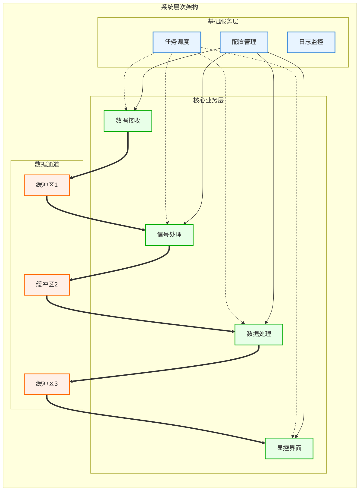
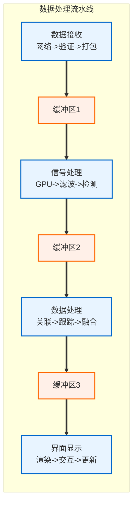
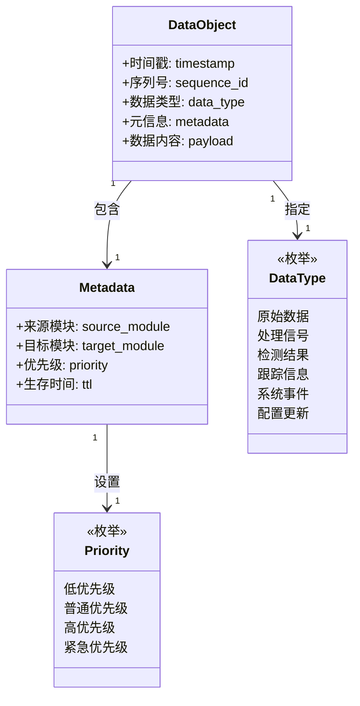
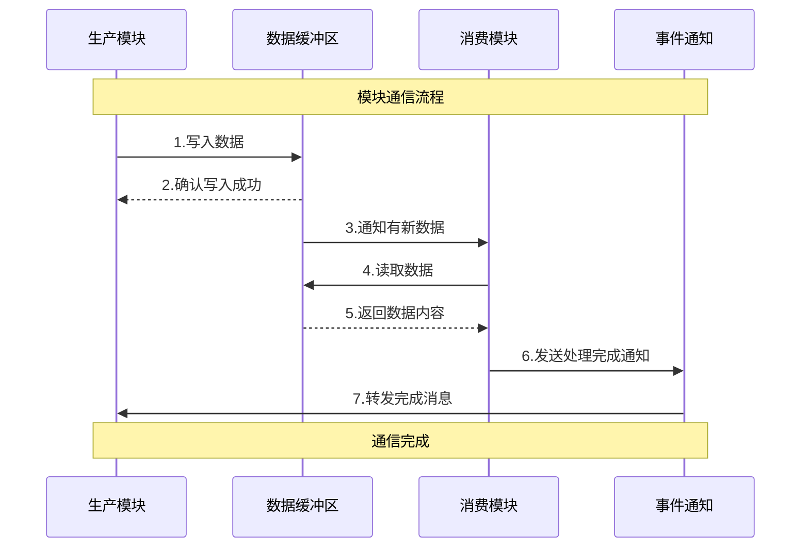
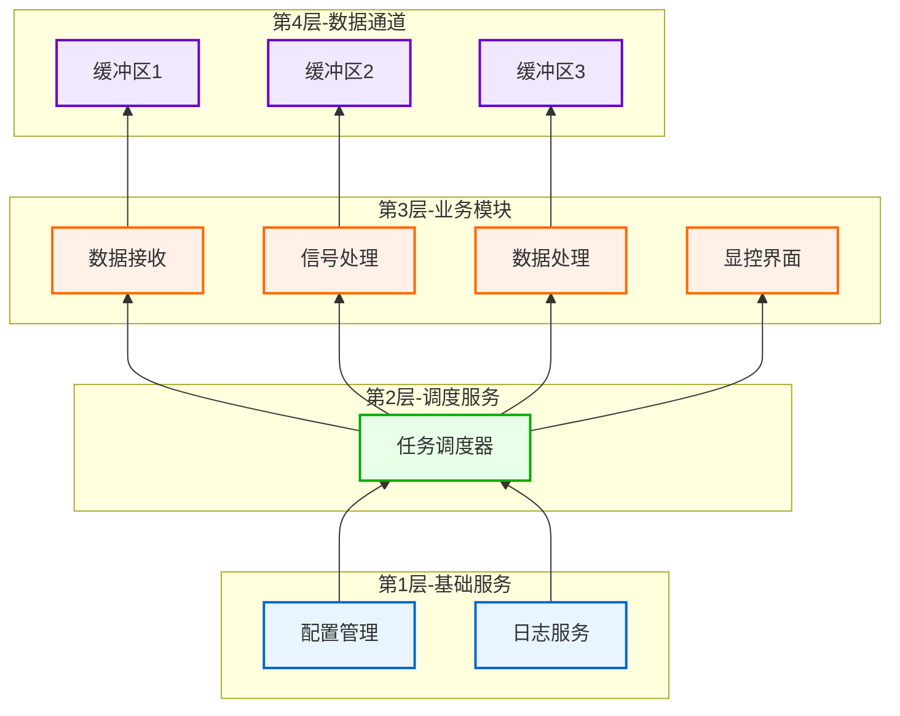
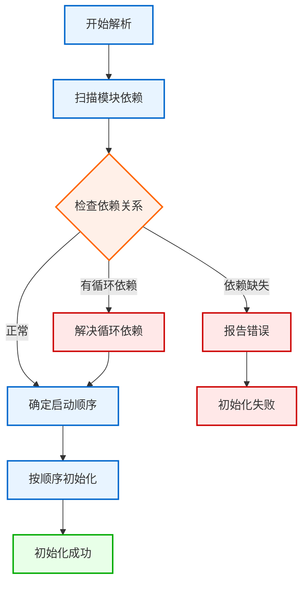
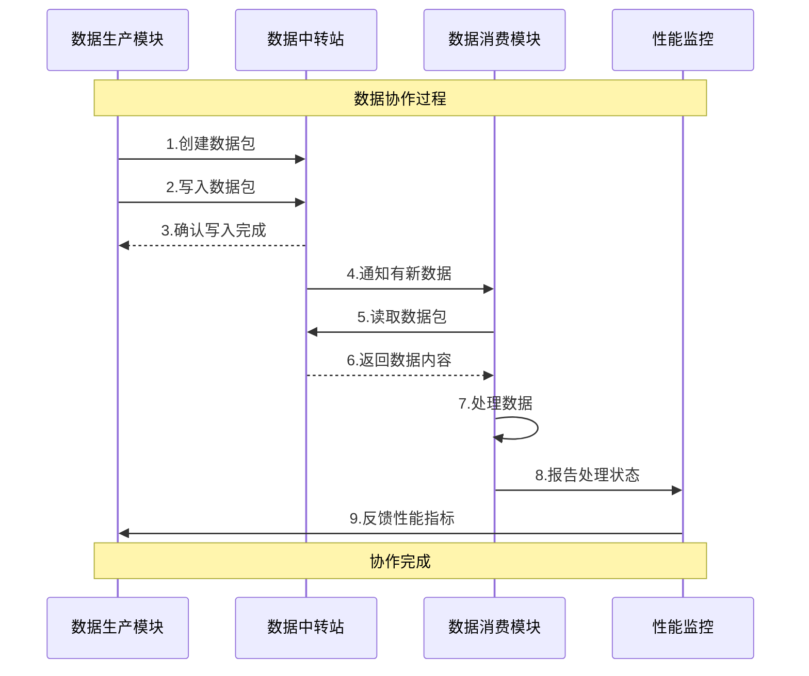
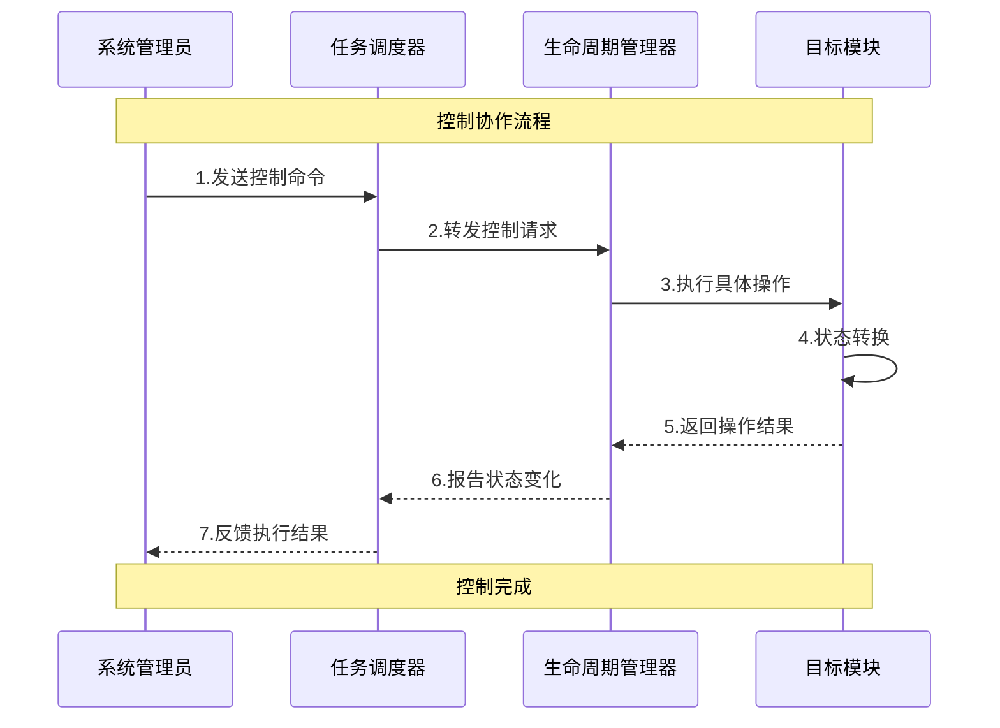
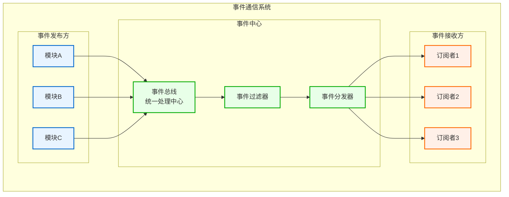
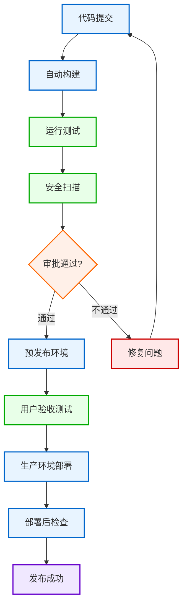


# 模块集成策略设计
**文档版本**: v1.2.0
**最后更新**: 2025-09-23
**负责人**: Kelin
**适用阶段**: MVP及向 V2.0 性能优化过渡阶段

---
## 1 文档职责
本文件详细设计雷达数据处理系统中各模块的集成策略，侧重"模块间协作与系统级集成"的设计实现：
1) 模块集成总体架构和数据流设计
2) 模块间接口规范和通信协议
3) 模块依赖关系管理和生命周期协调
4) 集成测试策略和质量保障机制
5) 系统级部署和发布流程
6) 模块协作异常处理和恢复策略

已明确不在本文件范围内的内容：单个模块的内部实现细节、算法设计、UI界面设计、外部系统集成等（这些在相应的专项文档中维护）。

### 1.1 目录
- [模块集成策略设计](#模块集成策略设计)
  - [1 文档职责](#1-文档职责)
    - [1.1 目录](#11-目录)
  - [2 模块集成总体设计](#2-模块集成总体设计)
    - [2.1 集成架构设计](#21-集成架构设计)
    - [2.2 数据流设计](#22-数据流设计)
    - [2.3 模块交互模式](#23-模块交互模式)
  - [3 模块接口设计](#3-模块接口设计)
    - [3.1 接口规范定义](#31-接口规范定义)
    - [3.2 数据交换格式](#32-数据交换格式)
    - [3.3 通信协议](#33-通信协议)
  - [4 依赖关系管理](#4-依赖关系管理)
    - [4.1 模块依赖图](#41-模块依赖图)
    - [4.2 依赖解析策略](#42-依赖解析策略)
    - [4.3 循环依赖处理](#43-循环依赖处理)
      - [处理方案分类](#处理方案分类)
  - [5 集成测试方案](#5-集成测试方案)
    - [5.1 测试策略](#51-测试策略)
      - [测试金字塔结构](#测试金字塔结构)
    - [5.2 测试环境](#52-测试环境)
      - [测试环境组成](#测试环境组成)
    - [5.3 测试用例](#53-测试用例)
      - [核心测试场景](#核心测试场景)
  - [6 模块协作机制](#6-模块协作机制)
    - [6.1 数据协作](#61-数据协作)
    - [6.2 控制协作](#62-控制协作)
    - [6.3 事件协作](#63-事件协作)
  - [7 部署与发布](#7-部署与发布)
    - [7.1 部署架构](#71-部署架构)
      - [部署层次架构](#部署层次架构)
    - [7.2 发布流程](#72-发布流程)
    - [7.3 回滚策略](#73-回滚策略)
      - [回滚策略体系](#回滚策略体系)
      - [回滚机制](#回滚机制)
      - [验证步骤](#验证步骤)
  - [8 模块约束说明](#8-模块约束说明)
  - [9 相关文档](#9-相关文档)
  - [10 变更历史](#10-变更历史)

---

## 2 模块集成总体设计

### 2.1 集成架构设计
模块集成采用分层解耦的架构，确保各模块职责清晰且协作高效：

**架构说明**：系统分为三个主要层次：基础服务层负责配置、日志和调度等支撑功能；核心业务层实现雷达数据的接收、处理和显示；数据通道作为各模块间的数据传输桥梁。数据按照固定路径流动（粗实线），控制命令由调度器统一管理（虚线），配置信息从配置中心分发到各模块（点线）。这种设计让系统结构清晰，各部分职责分明。
### 2.2 数据流设计
系统数据流采用生产者-消费者模式，通过环形缓冲区实现高效传递：

**数据流说明**：数据在系统中按照固定的流水线方向传递。原始数据从网络接收开始，经过验证和打包后存入第一个缓冲区；信号处理模块取出数据进行GPU加速处理，完成滤波和检测后存入第二个缓冲区；数据处理模块进行目标关联和航迹跟踪，最后存入第三个缓冲区供界面显示。每个缓冲区都像一个"中转站"，让前后模块可以独立工作，提高整体效率。
### 2.3 模块交互模式
模块间采用多种交互模式，满足不同场景的协作需求：

| 交互类型     | 具体模式     | 应用场景       | 特点           |
| ------------ | ------------ | -------------- | -------------- |
| **数据交互** | 生产消费模式 | 数据流水线传递 | 高效、解耦     |
|              | 发布订阅模式 | 数据广播分发   | 灵活、多对多   |
| **控制交互** | 命令控制模式 | 模块启停管理   | 统一、可靠     |
|              | 状态同步模式 | 状态信息同步   | 实时、一致     |
| **事件交互** | 事件通知模式 | 异步事件处理   | 松耦合、响应式 |
|              | 回调响应模式 | 操作完成通知   | 及时、准确     |
| **服务交互** | 服务注册模式 | 服务发现管理   | 动态、自适应   |
|              | 依赖注入模式 | 依赖关系管理   | 灵活、可测试   |

**交互模式说明**：系统提供四大类交互方式来应对不同的协作需求。数据交互主要用于传递处理数据，就像工厂流水线一样；控制交互用于管理模块的启动、停止等操作，就像遥控器控制电器；事件交互用于通知重要事件的发生，就像火警报警器；服务交互用于模块间互相提供功能服务，就像不同部门间的协作。每种方式都有其适用的场景，组合使用可以构建灵活高效的系统。

---
## 3 模块接口设计

### 3.1 接口规范定义
系统采用统一的接口规范，确保模块间的标准化交互：
```cpp
/**
 * @brief 模块基础接口
 * @details 所有模块必须实现此接口，提供标准化的生命周期管理
 */
class IModule {
public:
    virtual ~IModule() = default;
    /**
     * @brief 初始化模块
     * @param[in] config 配置对象
     * @return ErrorCode 初始化结果
     */
    virtual ErrorCode initialize(const ModuleConfig& config) = 0;
    /**
     * @brief 启动模块
     * @return ErrorCode 启动结果
     */
    virtual ErrorCode start() = 0;
    /**
     * @brief 停止模块
     * @return ErrorCode 停止结果
     */
    virtual ErrorCode stop() = 0;
    /**
     * @brief 暂停模块
     * @return ErrorCode 暂停结果
     */
    virtual ErrorCode pause() = 0;
    /**
     * @brief 恢复模块
     * @return ErrorCode 恢复结果
     */
    virtual ErrorCode resume() = 0;
    /**
     * @brief 获取模块状态
     * @return ModuleState 当前状态
     */
    virtual ModuleState getState() const = 0;
    /**
     * @brief 获取模块名称
     * @return std::string 模块名称
     */
    virtual std::string getName() const = 0;
};
/**
 * @brief 可配置模块接口
 * @details 支持运行时配置更新的模块实现此接口
 */
class IConfigurable {
public:
    virtual ~IConfigurable() = default;
    /**
     * @brief 更新模块配置
     * @param[in] config 新配置对象
     * @return ErrorCode 更新结果
     */
    virtual ErrorCode updateConfig(const ModuleConfig& config) = 0;
    /**
     * @brief 获取当前配置
     * @return ModuleConfig 当前配置
     */
    virtual ModuleConfig getCurrentConfig() const = 0;
};
/**
 * @brief 数据生产者接口
 * @details 数据生产模块实现此接口，提供数据写入能力
 */
class IDataProducer {
public:
    virtual ~IDataProducer() = default;
    /**
     * @brief 写入数据到缓冲区
     * @param[in] buffer 目标缓冲区
     * @param[in] data 数据对象
     * @return ErrorCode 写入结果
     */
    virtual ErrorCode writeData(CircularBuffer& buffer, const DataObject& data) = 0;
    /**
     * @brief 获取数据生产统计
     * @return ProducerStats 生产统计信息
     */
    virtual ProducerStats getStats() const = 0;
};
/**
 * @brief 数据消费者接口
 * @details 数据消费模块实现此接口，提供数据读取能力
 */
class IDataConsumer {
public:
    virtual ~IDataConsumer() = default;
    /**
     * @brief 从缓冲区读取数据
     * @param[in] buffer 源缓冲区
     * @param[out] data 数据对象
     * @return ErrorCode 读取结果
     */
    virtual ErrorCode readData(CircularBuffer& buffer, DataObject& data) = 0;
    /**
     * @brief 获取数据消费统计
     * @return ConsumerStats 消费统计信息
     */
    virtual ConsumerStats getStats() const = 0;
};
```
### 3.2 数据交换格式
系统采用统一的数据交换格式，确保模块间数据的一致性：

**数据格式说明**：系统中所有模块间传递的数据都使用统一的"数据包"格式。每个数据包就像一个快递包裹，有时间戳（什么时候发的）、序列号（第几个包裹）、数据类型（包裹里是什么）、元信息（从哪来到哪去，有多急）和数据内容（实际的货物）。这样设计让所有模块都能看懂数据包，方便传递和处理。
### 3.3 通信协议
模块间通信采用基于消息的协议，支持同步和异步交互：

**协议说明**：模块间的通信就像邮递系统一样简单明了。生产模块把数据放到"邮箱"（缓冲区）里，系统确认收到；当有新数据时，系统会通知消费模块去取；消费模块取到数据处理完后，会发送一个"已处理"的回执。整个过程是异步的，不会相互阻塞，保证了系统的高效运行。

---
## 4 依赖关系管理
### 4.1 模块依赖图
系统模块间的依赖关系清晰定义，确保正确的启动顺序和资源分配：

**依赖说明**：系统按照"先基础后应用"的原则分为四个依赖层次。就像盖房子一样，必须先打地基（基础服务），再搭框架（调度服务），然后建房间（业务模块），最后安装管道（数据通道）。每一层都依赖于下面的层，这样确保了系统启动时的正确顺序，也保证了各模块能够正常工作。
### 4.2 依赖解析策略
系统采用多阶段依赖解析策略，确保模块的正确初始化：

**解析策略说明**：依赖解析就像排队买票一样，需要按照正确的顺序来。系统首先检查所有模块的依赖关系，就像看看谁需要排在谁前面；然后检查是否有"循环排队"的情况（A依赖B，B又依赖A）；如果发现问题就先解决，最后按照正确的顺序启动各个模块。这样确保每个模块启动时，它需要的其他模块都已经准备好了。
### 4.3 循环依赖处理
系统采用多种策略处理循环依赖，确保模块的正常运行：

#### 处理方案分类

| 策略类型     | 具体方法   | 适用场景   | 优缺点         |
| ------------ | ---------- | ---------- | -------------- |
| **预防措施** | 接口分离   | 设计阶段   | 从根源避免问题 |
|              | 依赖倒置   | 架构设计   | 降低耦合度     |
| **检测方法** | 依赖分析   | 编译时检查 | 早期发现问题   |
|              | 运行时检测 | 动态监控   | 实时发现问题   |
| **解决策略** | 延迟初始化 | 运行时处理 | 临时解决方案   |
|              | 代理模式   | 间接访问   | 打破直接依赖   |
| **重构方案** | 模块拆分   | 架构调整   | 根本解决问题   |
|              | 增加中间层 | 解耦设计   | 完全消除循环   |

**处理策略说明**：循环依赖就像"先有鸡还是先有蛋"的问题。系统提供四套解决方案：预防措施就像提前规划，避免出现这种问题；检测方法帮助及时发现问题；解决策略是临时处理方法，比如让一个模块先启动一部分功能；重构方案是根本解决办法，通过调整模块结构来彻底消除循环依赖。不同情况采用不同的处理方式。

---
## 5 集成测试方案
### 5.1 测试策略
模块集成测试采用分层策略，确保系统各层面的质量：

#### 测试金字塔结构

| 测试层级             | 测试类型   | 测试重点     | 测试特点           |
| -------------------- | ---------- | ------------ | ------------------ |
| **第1层 - 单元测试** | 接口测试   | 接口功能验证 | 快速执行，覆盖全面 |
|                      | 功能测试   | 模块内部逻辑 | 逻辑正确，边界处理 |
| **第2层 - 集成测试** | 模块协作   | 模块间配合   | 接口兼容，数据一致 |
|                      | 数据流测试 | 数据传递验证 | 流程正确，格式统一 |
| **第3层 - 系统测试** | 端到端测试 | 完整流程验证 | 全链路，真实数据   |
|                      | 性能测试   | 系统性能指标 | 高负载，压力测试   |
| **第4层 - 验收测试** | 功能验收   | 业务需求验证 | 用户视角，真实场景 |
|                      | 用户体验   | 易用性检查   | 交互流畅，操作简便 |

**测试策略说明**：测试就像质量检查流水线，分为四个层次。最底层是单元测试，检查每个小零件是否合格；第二层是集成测试，检查零件组装后是否配合良好；第三层是系统测试，检查整个产品是否按设计工作；最高层是验收测试，检查产品是否满足用户需求。越往上测试越复杂，但越能发现实际使用中的问题。
### 5.2 测试环境
集成测试环境模拟真实部署场景，提供全面的测试支持：

#### 测试环境组成

| 环境类型       | 具体组件   | 主要功能       | 配置要求             |
| -------------- | ---------- | -------------- | -------------------- |
| **硬件支持**   | 测试服务器 | 提供计算资源   | 多核CPU，大内存      |
|                | GPU设备    | 加速计算支持   | CUDA兼容显卡         |
| **软件工具**   | 测试框架   | 自动化测试执行 | GoogleTest, pytest   |
|                | 模拟服务   | 外部依赖模拟   | Mock服务，桩程序     |
| **监控分析**   | 性能监控   | 运行时指标收集 | 实时监控，告警机制   |
|                | 覆盖率分析 | 代码覆盖率统计 | 行覆盖率，分支覆盖率 |
| **自动化支持** | 自动测试   | 持续集成执行   | CI/CD流水线集成      |
|                | 报告生成   | 测试结果汇总   | HTML报告，趋势分析   |

**环境说明**：测试环境就像一个完整的实验室，包含四个关键部分。硬件支持提供真实的运行环境，就像产品最终使用的环境；软件工具提供测试所需的各种程序和模拟器；监控分析帮助观察测试过程和结果；自动化系统让测试可以自动进行，提高效率。这样的环境确保测试结果真实可靠。
### 5.3 测试用例
关键集成测试用例覆盖系统核心功能：

#### 核心测试场景

| 测试分类         | 具体测试项   | 测试目标         | 验证重点               |
| ---------------- | ------------ | ---------------- | ---------------------- |
| **数据传输测试** | 数据接收验证 | 网络数据正确接收 | 数据完整性，格式正确性 |
|                  | 缓冲区流转   | 模块间数据传递   | 流转效率，无数据丢失   |
| **模块协作测试** | 启动停止测试 | 模块生命周期管理 | 启动顺序，优雅关闭     |
|                  | 配置更新测试 | 运行时配置变更   | 热更新，配置生效       |
| **性能压力测试** | 高负载测试   | 系统极限性能     | 吞吐量，响应时间       |
|                  | 并发处理测试 | 多线程安全性     | 数据一致性，无死锁     |
| **异常恢复测试** | 故障注入测试 | 异常情况处理     | 错误检测，优雅降级     |
|                  | 系统恢复测试 | 故障后恢复能力   | 自动恢复，数据保护     |

**用例说明**：测试用例覆盖四个重要方面，就像全方位体检一样。数据传输测试检查"血液循环"是否畅通；模块协作测试检查各个"器官"是否配合良好；性能压力测试检查系统在高负荷下是否正常工作；异常恢复测试检查系统遇到问题时是否能自我修复。这些测试确保系统在各种情况下都能稳定运行。

---
## 6 模块协作机制
### 6.1 数据协作
模块间数据协作通过环形缓冲区和标准数据格式实现：

**协作说明**：数据协作就像接力赛跑一样，每个模块都有自己的职责。生产模块创建数据包并放到"中转站"，系统确认收到后通知下一个模块来取数据。消费模块取到数据后进行处理，处理完成后向监控系统报告。监控系统会把性能信息反馈给生产模块，帮助它调整工作节奏。这样形成了一个高效的数据传递链条。
### 6.2 控制协作
模块间控制协作通过任务调度器和生命周期管理器实现：

**协作说明**：控制协作就像公司的管理层级一样。系统管理员是最高领导，发出指令给任务调度器（中层管理）；调度器再把指令传达给生命周期管理器（直接主管）；管理器负责具体执行，让目标模块进行相应的操作。执行结果逐级上报，让管理员知道操作是否成功。这种层级管理确保了控制命令的有序执行。
### 6.3 事件协作
模块间事件协作通过事件总线和观察者模式实现：

**协作说明**：事件协作就像广播电台一样工作。各个模块可以向"电台"（事件总线）发送消息，电台收到消息后通过过滤器筛选，再通过分发器把消息送到感兴趣的"听众"（订阅者）那里。这种方式让模块之间不需要直接联系，就能互相通知重要事情的发生，特别适合处理突发事件和状态通知。

---
## 7 部署与发布
### 7.1 部署架构
系统部署采用分层架构，支持灵活的部署配置：

#### 部署层次架构

| 层次                   | 组件     | 主要功能           | 部署要求                |
| ---------------------- | -------- | ------------------ | ----------------------- |
| **第1层 - 基础设施层** | 硬件平台 | 计算和存储资源     | 高性能服务器，GPU支持   |
|                        | 操作系统 | 系统底层支撑       | Linux/Windows，稳定版本 |
| **第2层 - 中间件层**   | 消息队列 | 异步消息处理       | 高吞吐，持久化          |
|                        | 缓存系统 | 数据缓存加速       | 内存型，高速访问        |
| **第3层 - 应用层**     | Web服务  | 用户界面和API服务  | 负载均衡，高并发        |
|                        | 应用服务 | 核心业务逻辑处理   | 高性能，可扩展          |
| **第4层 - 监控层**     | 日志系统 | 系统日志收集和分析 | 高可用，大存储          |
|                        | 监控系统 | 实时监控和告警     | 7x24小时运行            |

**部署说明**：系统部署就像建造大楼一样分为四层。最底层是基础设施（硬件和操作系统），就像大楼的地基；第二层是中间件（消息队列和缓存），就像大楼的水电管道；第三层是应用服务，就像各个功能房间；最顶层是监控系统，就像大楼的安保和监控设备。每一层都为上层提供支撑，形成稳定的整体架构。
### 7.2 发布流程
系统发布采用标准化的CI/CD流程，确保发布的质量和可靠性：

**流程说明**：发布流程就像产品出厂检验一样严格。从代码提交开始，经过自动构建、测试和安全检查，需要通过审批才能进入预发布环境。在预发布环境通过用户验收测试后，才能部署到正式的生产环境。部署完成后还要进行检查确认。如果任何环节发现问题，都要返回修复后重新开始。这样确保每次发布都是高质量的。
### 7.3 回滚策略
系统提供多种回滚策略，确保发布失败时的快速恢复：

#### 回滚策略体系

| 策略类型     | 触发方式     | 具体场景                 | 响应时间 |
| ------------ | ------------ | ------------------------ | -------- |
| **自动触发** | 健康检查失败 | 系统响应超时、服务不可用 | < 30秒   |
|              | 性能指标异常 | CPU/内存使用率过高       | < 60秒   |
| **手动触发** | 用户反馈问题 | 功能异常、界面错误       | < 5分钟  |
|              | 业务影响评估 | 业务指标下降、用户投诉   | < 10分钟 |

#### 回滚机制

| 回滚方式     | 技术原理           | 适用场景     | 恢复时间 |
| ------------ | ------------------ | ------------ | -------- |
| **蓝绿切换** | 两套环境快速切换   | 完整版本回滚 | < 2分钟  |
| **版本回退** | 代码版本回退重部署 | 代码层面问题 | < 10分钟 |

#### 验证步骤

| 验证类型           | 检查内容           | 验证标准         | 通过条件       |
| ------------------ | ------------------ | ---------------- | -------------- |
| **功能验证**       | 核心功能可用性     | 主要业务流程正常 | 100%功能可用   |
| **数据完整性检查** | 数据一致性和完整性 | 无数据丢失或损坏 | 数据一致性100% |

**策略说明**：回滚策略就像应急预案一样重要。系统既可以根据监控指标自动触发回滚（比如发现系统异常），也可以根据人工判断手动触发（比如用户反馈问题）。回滚的方式有两种：蓝绿切换就像有两套设备，随时可以切换；版本回退就像时光倒流，回到之前稳定的版本。回滚完成后还要验证系统功能和数据完整性，确保恢复成功。

---

## 8 模块约束说明
**功能约束**：
- MVP阶段支持7个核心模块的集成
- 模块间通信必须通过标准接口
- 数据交换必须使用统一格式
- 生命周期管理必须由任务调度器统一控制
**性能约束**：
- 模块间通信延迟不超过5ms
- 环形缓冲区容量不超过100MB
- 系统启动时间不超过30秒
- 模块状态转换时间不超过1秒
**技术约束**：
- 所有模块必须实现IModule接口
- 必须使用项目统一的错误处理框架
- 必须支持YAML配置文件
- 必须集成项目统一的日志系统
**扩展约束**：
- 支持模块的热插拔和动态加载
- 预留外部系统集成接口
- 支持分布式部署扩展
- 支持自定义模块和插件

---

## 9 相关文档
- [数据接收模块设计](01_数据接收模块设计.md)
- [信号处理模块设计](02_信号处理模块设计.md)
- [数据处理模块设计](03_数据处理模块设计.md)
- [显控接口模块设计](04_显控接口模块设计.md)
- [任务调度器设计](05_任务调度器设计.md)
- [配置管理模块设计](06_配置管理模块设计.md)
- [日志监控模块设计](07_日志监控模块设计.md)
- [MVP系统设计文档](../MVP系统设计文档.md)

---

## 10 变更历史

| 版本   | 日期       | 作者  | 变更描述                                                                                              |
| ------ | ---------- | ----- | ----------------------------------------------------------------------------------------------------- |
| v1.2.0 | 2025-09-23 | Kelin | 优化Mermaid图表布局，将部分复杂图表改为更直观的表格形式，修正依赖图显示顺序，提升文档可读性           |
| v1.1.0 | 2025-09-23 | Kelin | 重构所有Mermaid图表，优化图表结构和线条分类，简化文字说明使其更通俗易懂，提升文档可读性和理解性       |
| v1.0.0 | 2025-09-23 | Kelin | 基于MVP设计文档和各模块设计文档创建模块集成策略设计，包含完整的集成架构、接口规范、依赖管理和测试方案 |

---

*本模块集成策略设计为雷达数据处理系统提供全面的模块协作指导，确保各模块能够高效、可靠地集成运行，实现系统的整体功能和性能目标。*
