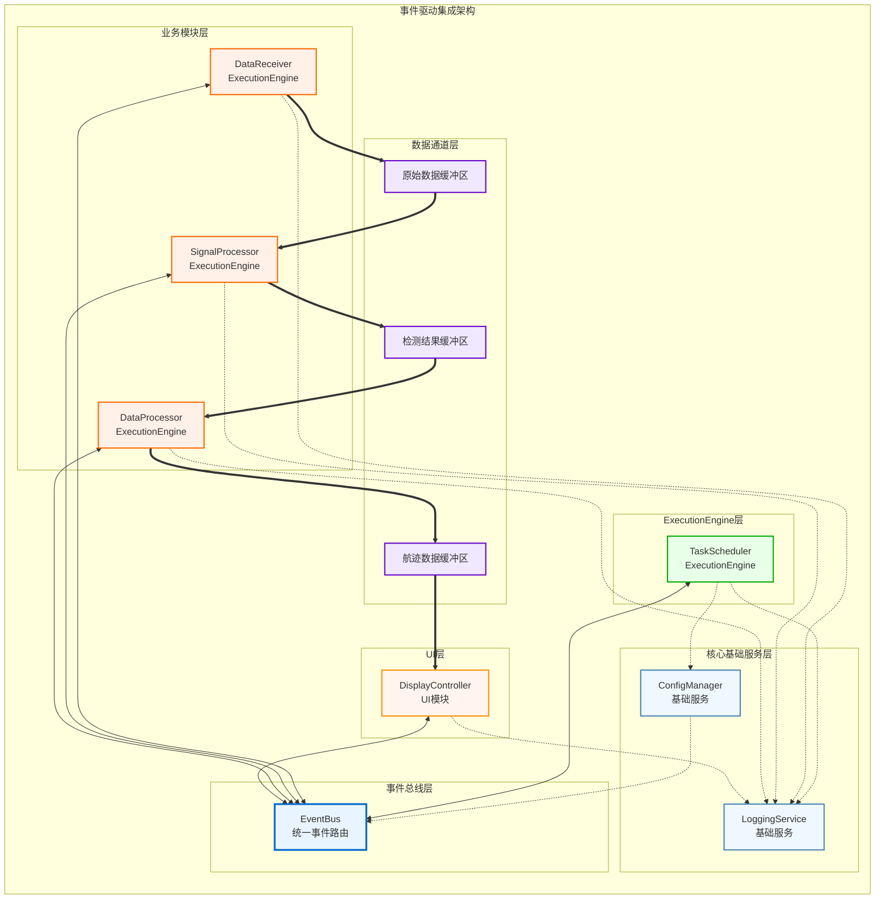
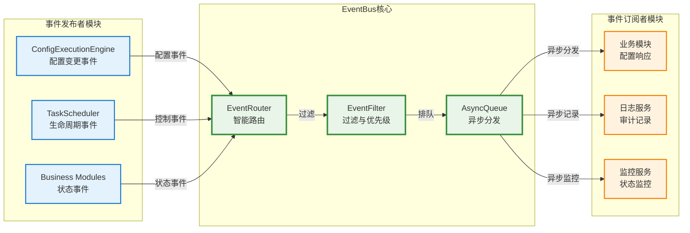
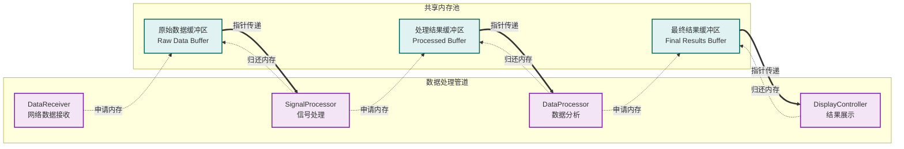
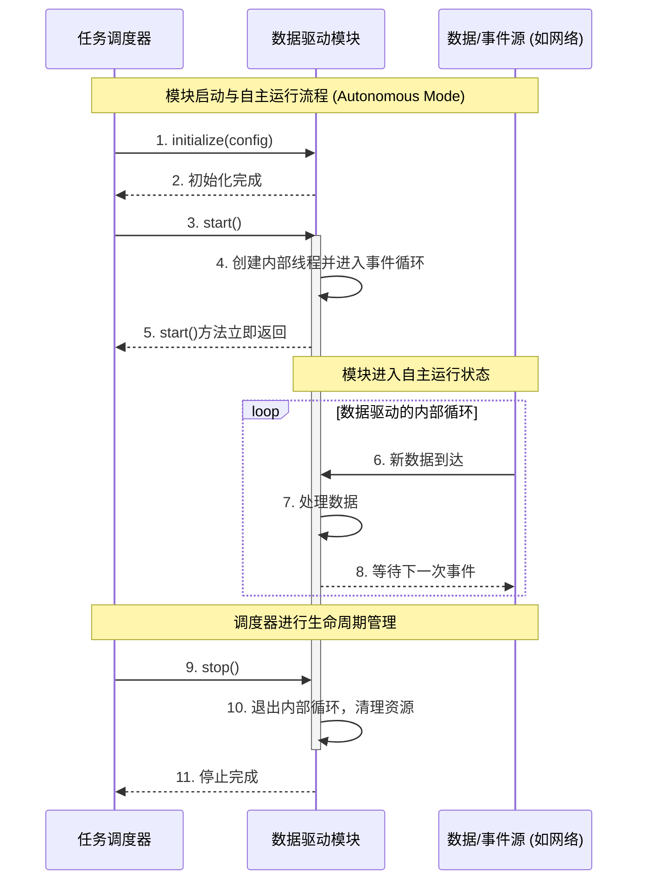
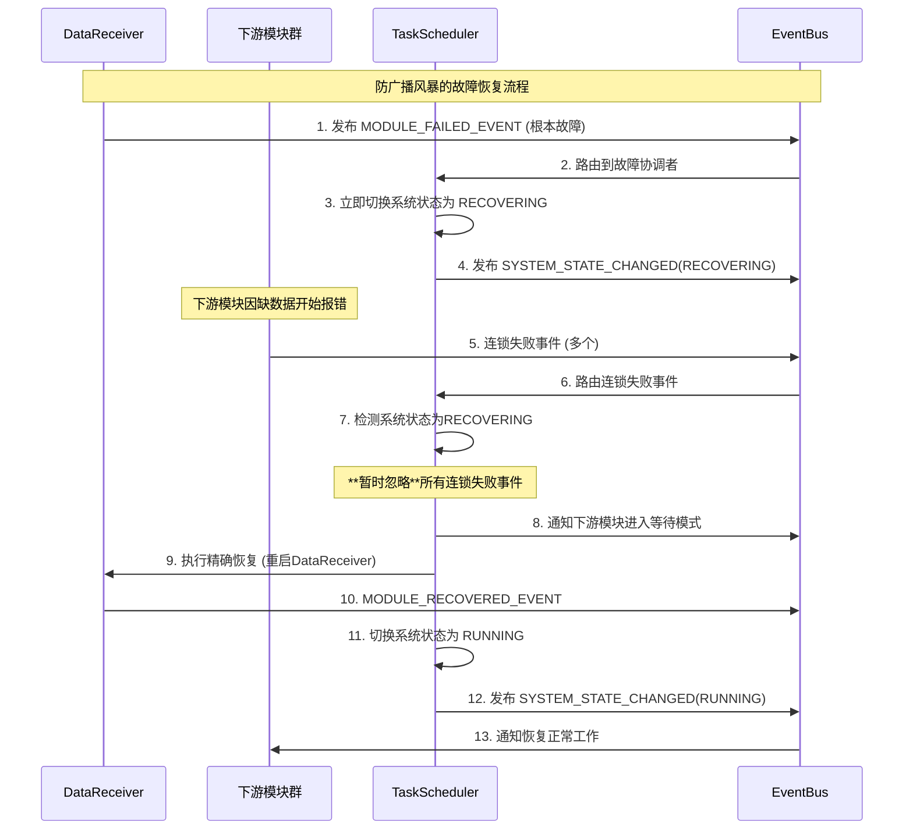

# 模块集成策略设计
**文档版本**: v3.0.0
**最后更新**: 2025-09-26
**负责人**: Kelin

---
## 1 文档职责

### 1.1 文档职责
本文件详细设计雷达数据处理系统的**模块集成策略**，侧重"事件驱动架构下的模块协调与系统级集成"的设计实现：

1) **事件驱动集成架构**：基于统一事件总线的模块协调机制，定义模块间如何通过事件进行解耦通信
2) **标准化接口规范**：遵循项目接口规范的模块间通信协议，确保模块集成的一致性
3) **依赖注入与服务管理**：基于构造函数注入的模块依赖解析策略，实现服务的松耦合集成
4) **生命周期协调**：事件驱动的模块状态管理和启停协调，确保系统整体的可靠运行
5) **故障恢复机制**：智能化的系统级异常处理和恢复策略，保障系统的稳定性
6) **全链路可观测性**：基于TraceID的端到端监控和追踪，支持系统运行状态的全面观测

**集成策略重点**：
- **模块角色清晰**：明确区分主动执行引擎、被动服务和UI模块的不同集成方式
- **通信机制统一**：通过EventBus实现异步解耦通信，通过构造函数注入实现服务依赖
- **零拷贝数据流**：基于共享内存池和指针队列的高性能数据传递机制
- **配置驱动集成**：通过ConfigManager统一管理模块配置，支持运行时热更新

**设计原则对齐**：本设计严格遵循项目统一的架构原则，与各模块设计保持一致：
- **事件驱动架构**：完全基于异步事件，避免轮询和同步调用
- **ExecutionEngine模式**：统一的执行引擎接口和组件命名
- **依赖注入**：通过服务提供者模式实现松耦合
- **接口驱动开发**：所有交互基于标准接口，支持策略模式

已明确不在本文件范围内的内容：单个模块的内部实现细节、具体算法策略、UI界面设计、外部系统集成等（这些在相应的专项文档中维护）。

### 1.2 目录
- [模块集成策略设计](#模块集成策略设计)
  - [1 文档职责](#1-文档职责)
    - [1.1 文档职责](#11-文档职责)
    - [1.2 目录](#12-目录)
  - [2 事件驱动集成架构](#2-事件驱动集成架构)
    - [2.1 整体架构设计](#21-整体架构设计)
    - [2.2 事件总线设计](#22-事件总线设计)
      - [2.2.1 事件流架构图](#221-事件流架构图)
      - [2.2.2 数据流架构图](#222-数据流架构图)
      - [2.2.3 EventBus实现约束与线程模型](#223-eventbus实现约束与线程模型)
    - [2.3 ExecutionEngine协调机制](#23-executionengine协调机制)
    - [2.4 服务依赖注入模式](#24-服务依赖注入模式)
    - [2.5 模块交互模式](#25-模块交互模式)
    - [2.6 模块调度协调机制](#26-模块调度协调机制)
  - [3 标准化接口规范](#3-标准化接口规范)
    - [3.1 IModule基础接口](#31-imodule基础接口)
    - [3.2 ExecutionEngine接口](#32-executionengine接口)
    - [3.3 事件接口规范](#33-事件接口规范)
    - [3.4 数据交换格式](#34-数据交换格式)
    - [3.5 通信协议](#35-通信协议)
  - [4 生命周期协调策略](#4-生命周期协调策略)
    - [4.1 事件驱动启动流程](#41-事件驱动启动流程)
      - [4.1.1 优雅关闭与超时处理机制](#411-优雅关闭与超时处理机制)
    - [4.2 故障恢复机制](#42-故障恢复机制)
      - [4.2.1 双重依赖类型定义](#421-双重依赖类型定义)
    - [4.3 配置热更新协调](#43-配置热更新协调)
      - [4.3.1 配置原子性应用机制](#431-配置原子性应用机制)
  - [5 集成测试方案](#5-集成测试方案)
    - [5.1 测试策略](#51-测试策略)
      - [测试金字塔结构](#测试金字塔结构)
    - [5.2 测试环境](#52-测试环境)
      - [测试环境组成](#测试环境组成)
    - [5.3 测试用例](#53-测试用例)
      - [核心测试场景](#核心测试场景)
  - [6 模块协作机制](#6-模块协作机制)
    - [6.1 数据协作](#61-数据协作)
    - [6.2 控制协作](#62-控制协作)
    - [6.3 事件协作](#63-事件协作)
  - [7 部署与发布](#7-部署与发布)
    - [7.1 部署架构](#71-部署架构)
      - [部署层次架构](#部署层次架构)
    - [7.2 发布流程](#72-发布流程)
    - [7.3 回滚策略](#73-回滚策略)
      - [回滚策略体系](#回滚策略体系)
      - [回滚机制](#回滚机制)
      - [验证步骤](#验证步骤)
  - [8 模块约束说明](#8-模块约束说明)
  - [9 相关文档](#9-相关文档)
  - [10 变更历史](#10-变更历史)

---

## 2 事件驱动集成架构

### 2.1 整体架构设计
系统采用**事件驱动架构**实现模块集成，通过统一的事件总线和ExecutionEngine模式确保模块间的松耦合协作：


**架构核心特点**：
1. **事件总线作为通信中枢**：ExecutionEngine模块和UI模块通过统一的EventBus进行异步通信
2. **模块角色分层清晰，避免循环依赖**：
   - **核心基础服务层**：ConfigManager、LoggingService作为纯粹的基础服务，无生命周期管理需求
   - **ExecutionEngine层**：TaskScheduler作为唯一的执行引擎调度器，负责管理所有业务模块生命周期
   - **业务模块层**：DataReceiver、SignalProcessor、DataProcessor等数据处理执行引擎
   - **UI层**：DisplayController等用户界面模块
3. **数据通道独立**：数据流通过专用缓冲区传递，与控制流完全分离
4. **服务依赖解耦**：基础服务通过构造函数注入，在main函数中显式创建和管理
5. **启动顺序明确**：基础服务 → EventBus → TaskScheduler → 业务模块，彻底解决循环依赖

**重要说明**：
- **LoggingService**是被动基础服务，不遵循ExecutionEngine模式，通过ILogger接口提供服务
- **DisplayController**是UI模块，采用Qt事件循环驱动，与ExecutionEngine模式不同
- **数据通道层的零拷贝机制**：
  - 数据流（实线箭头）表示**数据对象指针**的流动，而非数据内容的拷贝
  - 原始数据存储在**页锁定内存池**中，各模块间通过**指针队列**传递数据块引用
  - 存在双向的内存管理：数据块的申请与归还流程确保内存池的高效复用
  - 这种设计实现了真正的零拷贝数据传递，最大化了系统性能

### 2.2 事件总线设计
EventBus作为系统通信的核心中枢，提供统一的事件路由和分发机制。为了清晰展示不同类型的交互，我们将事件流和数据流分别展示：

#### 2.2.1 事件流架构图
展示控制事件在系统中的流动：



#### 2.2.2 数据流架构图
展示数据在处理管道中的流动：


**协作流程说明**：
1.  **变更通知**：`配置管理器`检测到配置变更后，将变更内容和变更等级封装成一个事件，通知`任务调度器`。
2.  **调度器决策与执行**：`任务调度器`是唯一有权改变模块状态的角色。它根据收到的变更等级执行相应操作：
    *   **重载等级**：调用目标模块的`reload()`方法，让模块自行处理更新，期间模块服务不中断。
    *   **重启等级**：执行“停止 -> 重新初始化 -> 启动”的完整生命周期管理，确保模块在全新配置下安全重启。
3.  **状态反馈**：模块执行完操作后，将结果返回给调度器，调度器再将最终状态报告给配置管理器。

这个流程确保了配置更新操作的原子性和安全性，避免了数据不一致和模块状态错乱的风险。

#### 2.2.3 EventBus实现约束与线程模型

为确保系统的一致性和性能，EventBus必须遵循以下实现约束：

**核心实现模型**：
```cpp
/**
 * @brief EventBus实现要求
 * @details 系统对EventBus实现的强制性约束
 */
class EventBus : public IEventBus {
private:
    // 必须：异步事件队列
    ConcurrentQueue<std::shared_ptr<BaseEvent>> event_queue_;

    // 必须：工作线程池（建议2-4个线程）
    ThreadPool worker_threads_;

    // 订阅者管理
    std::unordered_map<std::string, std::vector<EventHandler>> subscribers_;

public:
    /**
     * @brief 发布事件 - 必须非阻塞
     * @details publish()方法必须立即返回，不能等待事件处理完成
     */
    void publish(std::shared_ptr<BaseEvent> event) override {
        // 1. 验证事件有效性
        if (!event || event->trace_id.empty()) {
            logger_->error("Invalid event: missing trace_id");
            return;
        }

        // 2. 非阻塞入队（必须立即返回）
        if (!event_queue_.try_push(event)) {
            logger_->warn("Event queue full, dropping event: {}", event->getEventType());
            // 可选：触发背压处理
        }

        // 3. 立即返回，不等待处理
    }

private:
    /**
     * @brief 工作线程处理循环
     * @details 在工作线程池中执行，负责事件分发
     */
    void workerThreadLoop() {
        while (running_) {
            std::shared_ptr<BaseEvent> event;
            if (event_queue_.wait_and_pop(event)) {
                // 在工作线程中调用订阅者回调
                dispatchEvent(event);
            }
        }
    }

    void dispatchEvent(std::shared_ptr<BaseEvent> event) {
        auto subscribers = getSubscribers(event->getEventType());

        for (auto& handler : subscribers) {
            try {
                // 关键：设置TraceID上下文
                TraceContextGuard guard(event->trace_id);

                // 调用订阅者回调（在EventBus工作线程中）
                handler(event);

            } catch (const std::exception& e) {
                logger_->error("Event handler failed: {}", e.what());
                // 错误隔离：单个订阅者失败不影响其他订阅者
            }
        }
    }
};
```

**强制性约束**：
1. **异步非阻塞**：`publish()`方法必须立即返回，不能等待事件处理完成
2. **工作线程池**：EventBus内部维护独立的工作线程池（建议2-4个线程）
3. **错误隔离**：单个订阅者的异常不能影响其他订阅者接收事件
4. **TraceID传播**：工作线程在调用订阅者回调前必须设置正确的TraceID上下文
5. **背压处理**：当事件队列满时应有合理的处理策略（丢弃、告警等）

**对订阅者的要求**：
- **线程安全**：回调函数将在EventBus工作线程中执行，必须是线程安全的
- **非阻塞操作**：回调函数不能执行长时间阻塞操作（如同步I/O、长时间计算）
- **异常安全**：回调函数必须妥善处理异常，不能让异常逃逸到EventBus
- **耗时操作分离**：如需执行耗时操作，应派发到模块自己的工作线程

```cpp
// 正确的订阅者实现示例
void DataReceiver::onSystemStateChanged(const SystemStateChangedEvent& event) {
    TraceContextGuard guard(event.trace_id); // 已由EventBus设置，此处可选

    // 快速状态检查和决策
    if (event.new_state == SystemState::RECOVERING) {
        // 轻量级操作：设置标志位
        should_pause_processing_ = true;
        logger_->info("Data processing paused due to system recovery");
    } else {
        // 耗时操作：派发到模块自己的线程池
        module_thread_pool_->submit([this, event]() {
            TraceContextGuard thread_guard(event.trace_id);
            resumeProcessing();
        });
    }
}
```

### 2.3 ExecutionEngine协调机制
系统采用统一的ExecutionEngine模式，每个核心模块都包含一个执行引擎来管理内部状态和对外协调：


**ExecutionEngine协调特点**：
- **事件驱动生命周期**：所有状态变更通过事件触发，确保操作的可追踪性
- **自主决策机制**：各ExecutionEngine根据事件内容自主决策如何响应
- **统一接口规范**：所有ExecutionEngine实现相同的IModule接口，保证一致性
- **状态同步**：通过事件机制自动同步模块状态到TaskScheduler

### 2.4 服务依赖注入模式
系统采用构造函数注入的方式消除模块间的硬依赖，在main函数中显式创建服务实例并注入到各模块：


**构造函数注入示例**：
```cpp
// 典型的业务模块构造函数
class DataReceiver : public IModule {
private:
    std::shared_ptr<ILogger> logger_;
    std::shared_ptr<IEventBus> event_bus_;

public:
    DataReceiver(std::shared_ptr<ILogger> logger,
                 std::shared_ptr<IEventBus> event_bus)
        : logger_(logger), event_bus_(event_bus) {}

    ErrorCode initialize() override {
        logger_->info("DataReceiver initializing...");
        // 初始化逻辑
        return ErrorCode::SUCCESS;
    }
};

// main函数中解决循环依赖的正确启动顺序
int main() {
    // 1. 创建并初始化核心基础服务 (不由TaskScheduler管理)
    auto config_manager = std::make_shared<ConfigManager>();
    config_manager->initialize("config.yaml"); // 直接加载配置文件

    auto logging_service = std::make_shared<LoggingService>(config_manager);
    logging_service->initialize(); // 初始化日志系统

    auto event_bus = std::make_shared<EventBus>(logging_service);
    event_bus->initialize(); // 初始化事件总线

    // 2. 创建TaskScheduler (注入已就绪的基础服务)
    auto task_scheduler = std::make_shared<TaskScheduler>(
        config_manager, event_bus, logging_service);
    task_scheduler->initialize();

    // 3. 创建并注册所有真正的"业务模块" (注入基础服务)
    auto data_receiver = std::make_shared<DataReceiver>(
        logging_service, event_bus, config_manager);
    auto signal_processor = std::make_shared<SignalProcessor>(
        logging_service, event_bus, config_manager);

    // 4. 将业务模块注册到TaskScheduler进行生命周期管理
    task_scheduler->registerModule(data_receiver);
    task_scheduler->registerModule(signal_processor);

    // 5. 启动系统 (TaskScheduler根据依赖图启动所有业务模块)
    task_scheduler->start();

    // 6. 运行主循环...
    // 7. 优雅关闭
    task_scheduler->stop();
    return 0;
}
```

**构造函数注入优势**：
- **依赖关系显式**：在编译时就明确了模块的依赖关系
- **无运行时查找**：避免了服务定位器模式的运行时开销
- **测试友好**：可以轻松注入Mock服务进行单元测试
- **简单可靠**：无需额外的服务注册表或依赖注入框架
- **类型安全**：编译期即可发现依赖类型错误

### 2.5 模块交互模式
模块间采用多种交互模式，满足不同场景的协作需求：

| 交互类型     | 具体模式         | 应用场景         | 特点                     | 实现方式            |
| ------------ | ---------------- | ---------------- | ------------------------ | ------------------- |
| **数据交互** | 生产消费模式     | 数据流水线传递   | 高效、解耦               | 共享内存池+指针队列 |
|              | 发布订阅模式     | 数据广播分发     | 灵活、多对多             | 事件总线机制        |
| **控制交互** | 命令控制模式     | 模块启停管理     | 统一、可靠               | TaskScheduler协调   |
|              | 状态同步模式     | 状态信息同步     | 实时、一致               | 事件驱动状态机      |
| **事件交互** | 事件通知模式     | 异步事件处理     | 松耦合、响应式           | EventBus异步分发    |
|              | 回调响应模式     | 操作完成通知     | 及时、准确               | 事件回调机制        |
| **服务交互** | **构造函数注入** | **基础服务访问** | **编译期依赖、类型安全** | **直接接口注入**    |

**交互模式详细说明**：

1. **数据交互 - 统一"推"模式**：为避免"推拉"混用导致的责任不清和竞态条件，系统统一采用"推"模式：
   ```cpp
   // 统一的数据队列接口
   template<typename T>
   class IDataQueue {
   public:
       virtual ErrorCode push(std::shared_ptr<T> data) = 0;
       virtual bool isFull() const = 0;
       virtual size_t size() const = 0;
   };

   // 模块构造时注入下游队列
   class DataReceiver : public IModule {
   private:
       std::shared_ptr<IDataQueue<RawDataPacket>> downstream_queue_;
   public:
       DataReceiver(std::shared_ptr<IDataQueue<RawDataPacket>> downstream)
           : downstream_queue_(downstream) {}

       void processData() {
           auto processed_data = processRawData();
           downstream_queue_->push(processed_data); // 统一推送
       }
   };
   ```
   **优势**：数据流向清晰、责任单一、背压机制直观、缓冲区所有权明确

2. **事件交互**：所有模块通过统一的EventBus进行异步事件通信，支持事件过滤、优先级管理和TraceID传播。

3. **服务交互**：基础服务（如LoggingService、ConfigManager）通过构造函数注入的方式提供给业务模块，在main函数中显式创建服务实例并注入，无需运行时服务查找。

4. **缓冲区所有权管理**：所有模块间的共享数据队列由main函数或专门的ConnectionManager创建，通过依赖注入分别传给生产者和消费者，避免所有权模糊。

### 2.6 模块调度协调机制
任务调度器与数据驱动模块的协调遵循明确的模式，以平衡控制和性能。


**协调机制说明**：
对于数据驱动的模块（如数据接收、信号处理），任务调度器采用“启动后放手”(Fire-and-Forget)的策略。
1.  **启动阶段**：调度器调用模块的`start()`方法。
2.  **自主运行**：模块内部会自行创建一个或多个线程，并进入一个由外部事件（如网络数据到达）或内部状态（如缓冲区非空）驱动的循环。`start()`方法会立即返回，告知调度器它已开始独立运行。
3.  **生命周期管理**：调度器不再干预模块的单次运行，只在需要时通过`stop()`或`pause()`等方法来管理其生命周期。这种模式最大化了数据驱动模块的响应性能和独立性，符合系统的高性能要求。

---
## 3 标准化接口规范

### 3.1 IModule基础接口
所有模块都必须实现统一的IModule接口，确保生命周期管理的一致性：

```cpp
/**
 * @brief 生命周期管理接口 - 应用接口分离原则(ISP)
 * @details 所有由TaskScheduler管理的模块都实现此接口
 */
class ILifecycleManaged {
public:
    virtual ~ILifecycleManaged() = default;

    /**
     * @brief 初始化模块
     * @return 操作结果错误码
     */
    virtual ErrorCode initialize() = 0;

    /**
     * @brief 启动模块运行
     * @return 操作结果错误码
     */
    virtual ErrorCode start() = 0;

    /**
     * @brief 停止模块运行
     * @return 操作结果错误码
     */
    virtual ErrorCode stop() = 0;

    /**
     * @brief 清理模块资源
     * @return 操作结果错误码
     */
    virtual ErrorCode cleanup() = 0;

    /**
     * @brief 获取模块当前状态
     * @return 模块状态枚举
     */
    virtual ModuleState getState() const = 0;

    /**
     * @brief 获取模块名称
     * @return 模块名称字符串
     */
    virtual const std::string& getModuleName() const = 0;
};

/**
 * @brief 可暂停接口 - 只有支持暂停/恢复的模块才实现
 * @details 数据处理流模块等需要暂停恢复功能的模块实现此接口
 */
class IPausable {
public:
    virtual ~IPausable() = default;

    /**
     * @brief 暂停模块运行
     * @return 操作结果错误码
     */
    virtual ErrorCode pause() = 0;

    /**
     * @brief 恢复模块运行
     * @return 操作结果错误码
     */
    virtual ErrorCode resume() = 0;

    /**
     * @brief 检查是否处于暂停状态
     * @return true if paused
     */
    virtual bool isPaused() const = 0;
};

/**
 * @brief 可监控接口 - 需要健康状态监控的模块实现
 * @details 业务模块实现此接口提供健康状态，不再主动查询性能指标
 */
class IMonitorable {
public:
    virtual ~IMonitorable() = default;

    /**
     * @brief 获取模块健康状态
     * @return 健康状态信息
     */
    virtual HealthStatus getHealthStatus() const = 0;

    /**
     * @brief 设置健康状态变更回调
     * @param callback 状态变更回调函数
     */
    virtual void setHealthStatusCallback(HealthStatusCallback callback) = 0;
};

/**
 * @brief 模块依赖管理接口
 * @details 用于定义模块间的依赖关系，支持依赖注入和启动顺序管理
 */
class IDependencyManaged {
public:
    virtual ~IDependencyManaged() = default;

    /**
     * @brief 声明模块依赖
     * @param dependency_name 依赖模块名称
     * @param type 依赖类型（强依赖/弱依赖）
     * @param optional 是否为可选依赖
     */
    virtual void declareDependency(const std::string& dependency_name,
                                   DependencyType type,
                                   bool optional = false) = 0;

    /**
     * @brief 注入依赖模块
     * @param dependency_name 依赖名称
     * @param dependency 依赖模块实例
     * @return ErrorCode 注入结果
     */
    virtual ErrorCode injectDependency(const std::string& dependency_name,
                                       std::shared_ptr<IModule> dependency) = 0;

    /**
     * @brief 检查依赖是否满足
     * @return ErrorCode 检查结果，SUCCESS表示所有必需依赖已满足
     */
    virtual ErrorCode validateDependencies() const = 0;

    /**
     * @brief 获取模块依赖列表
     * @return 依赖关系映射表
     */
    virtual std::map<std::string, ModuleDependency> getDependencies() const = 0;
};

/**
 * @brief 标准模块接口 - 组合基础接口
 * @details 大多数业务模块实现此接口，组合了生命周期管理、暂停恢复、监控、依赖管理等功能
 */
class IModule : public ILifecycleManaged, public IPausable, public IMonitorable, public IDependencyManaged {
public:
    virtual ~IModule() = default;

    // 继承所有基础接口的方法
    // 模块可以选择性实现需要的功能
};
```

### 3.2 ExecutionEngine接口
每个核心模块的ExecutionEngine都遵循统一的接口规范：
```cpp
/**
 * @brief ExecutionEngine基础接口
 * @details 所有ExecutionEngine都必须实现此接口，提供统一的执行模式
 */
template<typename ContextType>
class IExecutionEngine : public IModule {
public:
    /**
     * @brief 处理事件
     * @param event 事件对象
     * @return ErrorCode 处理结果
     */
    virtual ErrorCode handleEvent(std::shared_ptr<BaseEvent> event) = 0;

    /**
     * @brief 获取执行上下文
     * @return 执行上下文的共享指针
     */
    virtual std::shared_ptr<ContextType> getContext() const = 0;

    /**
     * @brief 设置事件总线
     * @param event_bus 事件总线接口
     */
    virtual void setEventBus(std::shared_ptr<IEventBus> event_bus) = 0;

    /**
     * @brief 获取模块健康状态
     * @return HealthStatus 健康状态信息
     */
    virtual HealthStatus getHealthStatus() const = 0;
};

/**
 * @brief 服务注册中心接口
 * @details 实现依赖注入的核心接口
 */
class IServiceRegistry {
public:
    virtual ~IServiceRegistry() = default;

    /**
     * @brief 注册服务
     * @tparam T 服务类型
     * @param service 服务实例
     * @return 注册成功返回true
     */
    template<typename T>
    bool registerService(std::shared_ptr<T> service) = 0;

    /**
     * @brief 获取服务
     * @tparam T 服务接口类型
     * @return 服务实例，未找到返回nullptr
     */
    template<typename T>
    std::shared_ptr<T> getService() const = 0;

    /**
     * @brief 检查服务是否已注册
     * @tparam T 服务类型
     * @return 已注册返回true
     */
    template<typename T>
    bool hasService() const = 0;
};
```
### 3.3 事件接口规范
系统采用统一的事件接口，支持类型安全的事件处理：

```cpp
/**
 * @brief 基础事件接口
 * @details 所有事件都必须继承此接口，并强制携带TraceID确保全链路追踪
 */
struct BaseEvent {
    std::string event_type;         ///< 事件类型标识
    Timestamp timestamp;            ///< 事件时间戳
    TraceId trace_id;              ///< 追踪ID (必须！用于跨线程、异步场景的上下文传递)
    std::string source_module;      ///< 源模块名称
    Priority priority;              ///< 事件优先级

    virtual ~BaseEvent() = default;
    virtual std::string getEventType() const = 0;

    /**
     * @brief 构造函数自动获取当前TraceID
     * @details 如果当前线程有TraceID，自动继承；否则生成新的根TraceID
     */
    BaseEvent() : trace_id(TraceContext::getCurrentOrGenerate()) {}
};

/**
 * @brief 配置变更事件
 */
struct ConfigChangedEvent : BaseEvent {
    std::string key;                ///< 配置键路径
    YAML::Node old_value;          ///< 旧值
    YAML::Node new_value;          ///< 新值
    ChangeLevel change_level;       ///< 变更等级

    std::string getEventType() const override { return "CONFIG_CHANGED"; }
};

/**
 * @brief 模块状态变更事件
 */
struct ModuleStateChangedEvent : BaseEvent {
    std::string module_id;          ///< 模块ID
    ModuleState old_state;          ///< 旧状态
    ModuleState new_state;          ///< 新状态

    std::string getEventType() const override { return "MODULE_STATE_CHANGED"; }
};

/**
 * @brief 事件总线接口
 */
class IEventBus {
public:
    virtual ~IEventBus() = default;

    /**
     * @brief 发布事件
     * @param event 事件对象
     */
    virtual void publish(std::shared_ptr<BaseEvent> event) = 0;

    /**
     * @brief 订阅事件
     * @tparam T 事件类型
     * @param handler 事件处理函数
     * @return 订阅ID
     */
    template<typename T>
    virtual SubscriptionId subscribe(std::function<void(std::shared_ptr<T>)> handler) = 0;

    /**
     * @brief 取消订阅
     * @param subscription_id 订阅ID
     */
    virtual void unsubscribe(SubscriptionId subscription_id) = 0;
};

/**
 * @brief TraceID上下文守护类 (RAII)
 * @details 用于在异步事件处理和线程池任务中恢复TraceID上下文
 */
class TraceContextGuard {
private:
    TraceId previous_trace_id_;
public:
    explicit TraceContextGuard(const TraceId& trace_id)
        : previous_trace_id_(TraceContext::getCurrent()) {
        TraceContext::setCurrent(trace_id);
    }

    ~TraceContextGuard() {
        TraceContext::setCurrent(previous_trace_id_);
    }
};

/**
 * @brief 事件处理器的TraceID恢复模式
 * @details 所有事件处理器必须遵循此模式确保TraceID传递不断裂
 */
/*
使用示例：
void DataProcessor::onNewDataEvent(const NewDataEvent& event) {
    // 关键！事件处理器第一行必须恢复TraceID上下文
    TraceContextGuard guard(event.trace_id);

    // 后续所有日志和操作都会自动带上正确的Trace ID
    logger_->info("Processing new data batch");

    // 提交任务到线程池时也需要传递TraceID
    auto current_trace_id = TraceContext::getCurrent();
    thread_pool_->submit([this, data, current_trace_id]() {
        TraceContextGuard thread_guard(current_trace_id); // 工作线程中恢复
        processDataInBackground(data);
    });
}

void MonitoringModule::periodicTask() {
    // 对于定时任务等无上游TraceID的场景，生成新的根TraceID
    TraceContextGuard guard(TraceContext::generateRootTraceId());

    logger_->info("Starting periodic health check");
    collectSystemMetrics();
}
*/

/**
 * @brief 抽象服务提供者接口
 * @details 虽然实际实现使用构造函数注入，但定义抽象接口体现面向接口编程原则
 */
class IServiceProvider {
public:
    virtual ~IServiceProvider() = default;

    /**
     * @brief 获取服务实例
     * @tparam T 服务接口类型
     * @return 服务实例的共享指针
     * @note 实际实现中，这通常在main函数中直接创建和注入
     */
    template<typename T>
    virtual std::shared_ptr<T> getService() const = 0;

    /**
     * @brief 检查服务是否可用
     * @tparam T 服务接口类型
     * @return 服务可用性
     */
    template<typename T>
    virtual bool hasService() const = 0;
};

/**
 * @brief 基础服务接口定义
 * @details 定义系统中关键基础服务的抽象接口
 */

// 日志服务接口
class ILogger {
public:
    virtual ~ILogger() = default;
    virtual void info(const std::string& message, const TraceId& trace_id = TraceId::current()) = 0;
    virtual void warn(const std::string& message, const TraceId& trace_id = TraceId::current()) = 0;
    virtual void error(const std::string& message, const TraceId& trace_id = TraceId::current()) = 0;
    virtual void debug(const std::string& message, const TraceId& trace_id = TraceId::current()) = 0;
};

// 配置管理服务接口
class IConfigManager {
public:
    virtual ~IConfigManager() = default;
    virtual ErrorCode getInitialConfigFor(const std::string& module_name, YAML::Node& config) = 0;
    virtual void subscribeToConfigChanges(const std::string& key_pattern, std::function<void(const ConfigChangedEvent&)> callback) = 0;
};
```

### 3.4 数据交换格式
系统采用统一的数据交换格式，确保模块间数据的一致性和可追踪性：

```cpp
/**
 * @brief 统一数据包装器
 * @details 所有模块间传递的数据都使用此包装格式
 */
template<typename PayloadType>
struct DataPacket {
    // 包头信息
    struct Header {
        Timestamp timestamp;        ///< 数据时间戳
        uint64_t sequence_id;      ///< 序列号
        std::string data_type;     ///< 数据类型标识
        TraceId trace_id;          ///< 全链路追踪ID
        std::string source_module; ///< 源模块名称
        Priority priority;         ///< 数据优先级
        uint32_t payload_size;     ///< 负载大小
    } header;

    // 负载数据
    PayloadType payload;

    /**
     * @brief 创建数据包
     * @param data 负载数据
     * @param source 源模块名称
     * @param trace_id 追踪ID
     * @return 数据包实例
     */
    static DataPacket<PayloadType> create(
        const PayloadType& data,
        const std::string& source,
        const TraceId& trace_id = TraceId::generate()) {

        DataPacket<PayloadType> packet;
        packet.header.timestamp = Timestamp::now();
        packet.header.sequence_id = generateSequenceId();
        packet.header.data_type = typeid(PayloadType).name();
        packet.header.trace_id = trace_id;
        packet.header.source_module = source;
        packet.header.priority = Priority::NORMAL;
        packet.header.payload_size = sizeof(PayloadType);
        packet.payload = data;

        return packet;
    }
};

// 核心数据类型定义
using RawDataPacket = DataPacket<RawIQData>;
using DetectionPacket = DataPacket<DetectionResult>;
using TrackDataPacket = DataPacket<TrackData>;
```

**数据格式特点**：
- **统一包装**：所有数据都使用DataPacket模板进行包装，确保格式一致
- **全链路追踪**：每个数据包都携带TraceID，支持端到端追踪
- **类型安全**：使用模板确保编译时类型检查
- **性能优化**：头部信息紧凑，减少序列化开销
- **可扩展性**：支持任意类型的负载数据
### 3.5 通信协议
模块间通信采用基于消息的协议，支持同步和异步交互：

**协议说明**：模块间的通信就像邮递系统一样简单明了。生产模块把数据放到"邮箱"（缓冲区）里，系统确认收到；当有新数据时，系统会通知消费模块去取；消费模块取到数据处理完后，会发送一个"已处理"的回执。整个过程是异步的，不会相互阻塞，保证了系统的高效运行。

---
## 4 生命周期协调策略

### 4.1 事件驱动启动流程
系统采用事件驱动的模块启动流程，通过TaskScheduler统一协调各模块的生命周期：


**启动流程特点**：
- **分阶段启动**：基础服务 → 事件总线 → 任务调度器 → 业务模块
- **事件驱动**：所有启动操作通过事件触发，确保可追踪性
- **依赖解析**：TaskScheduler根据预定义的模块依赖图来决定启动顺序，确保前置模块已就绪
- **故障处理**：任何模块启动失败都会触发相应的恢复策略

**模块依赖启动顺序**：
1. **无依赖基础服务**：LoggingService（被动服务，无需启动流程）
2. **配置服务层**：ConfigExecutionEngine（依赖LoggingService接口注入）
3. **通信基础设施**：EventBus（依赖LoggingService接口注入）
4. **任务调度层**：TaskScheduler（依赖LoggingService、EventBus、ConfigManager接口注入）
5. **业务模块层**：DataReceiver → SignalProcessor → DataProcessor → DisplayController

**重要说明**：TaskScheduler在发布`StartModuleEvent`之前，会先检查模块依赖图，确保所有前置模块已经处于`READY`状态。例如，DataReceiver的启动需要等待EventBus和ConfigManager都已就绪。

#### 4.1.1 优雅关闭与超时处理机制

系统提供带超时保护的优雅关闭机制，避免关闭过程卡死：

```cpp
/**
 * @brief TaskScheduler的超时关闭实现
 */
class TaskScheduler {
private:
    static constexpr std::chrono::seconds DEFAULT_STOP_TIMEOUT{5};

public:
    ErrorCode stopAllModules() {
        logger_->info("Starting graceful shutdown sequence");

        auto modules_to_stop = getModulesInReverseStartupOrder();

        for (auto& module : modules_to_stop) {
            ErrorCode result = stopModuleWithTimeout(module, DEFAULT_STOP_TIMEOUT);

            if (result != ErrorCode::SUCCESS) {
                logger_->fatal("Module {} failed to stop gracefully within timeout",
                              module->getModuleName());

                // 记录超时模块，但继续关闭其他模块
                recordFailedShutdown(module->getModuleName());

                // 尝试强制中断（如果安全且可能）
                attemptForceTermination(module);
            }
        }

        // 检查是否有模块关闭失败
        if (!failed_shutdowns_.empty()) {
            logger_->fatal("Shutdown completed with {} failed modules",
                          failed_shutdowns_.size());
            return ErrorCode::PARTIAL_FAILURE;
        }

        return ErrorCode::SUCCESS;
    }

private:
    ErrorCode stopModuleWithTimeout(std::shared_ptr<IModule> module,
                                   std::chrono::seconds timeout) {
        std::promise<ErrorCode> promise;
        auto future = promise.get_future();

        // 在独立线程中执行stop()
        std::thread stop_thread([&promise, module]() {
            try {
                ErrorCode result = module->stop();
                promise.set_value(result);
            } catch (...) {
                promise.set_value(ErrorCode::FATAL_ERROR);
            }
        });

        // 等待超时
        if (future.wait_for(timeout) == std::future_status::timeout) {
            // 超时处理：分离线程，记录错误，继续执行
            stop_thread.detach();
            return ErrorCode::TIMEOUT;
        }

        stop_thread.join();
        return future.get();
    }

    void attemptForceTermination(std::shared_ptr<IModule> module) {
        // 实现平台相关的线程中断逻辑
        // 注意：这是最后手段，需要非常小心
        logger_->warn("Attempting force termination of module {}",
                     module->getModuleName());
    }
};
```

**超时关闭策略**：
1. **超时时间配置**：每个模块可配置独立的关闭超时时间（默认5秒）
2. **渐进式关闭**：按启动顺序逆序关闭，确保依赖关系的完整性
3. **超时后继续**：单个模块超时不阻塞整体关闭流程
4. **状态记录**：记录关闭异常，向外部系统（如systemd）报告非正常退出
5. **资源清理**：即使强制终止也要尽力清理关键资源（如文件句柄、网络连接）
### 4.2 故障恢复机制
系统提供防"广播风暴"的智能故障恢复策略，通过系统状态管理避免连锁错误事件：



**防广播风暴机制**：
1. **系统状态管理**：TaskScheduler维护全局状态（RUNNING、RECOVERING、DEGRADED）
2. **单一故障协调者**：TaskScheduler是唯一的错误处理协调者，避免多点恢复冲突
3. **连锁事件抑制**：在RECOVERING状态下暂时忽略连锁失败事件，专注根本原因
4. **精确恢复策略**：基于依赖图分析，只恢复根本故障模块，避免大规模重启
5. **协调式恢复**：通过SystemStateChanged事件协调所有模块的恢复行为

**依赖关系驱动的恢复策略**：

#### 4.2.1 双重依赖类型定义

为解决静态启动依赖与动态恢复策略的矛盾，系统定义两种依赖类型：

```cpp
/**
 * @brief 模块依赖关系定义
 */
enum class DependencyType {
    STRONG_DEPENDENCY,    // 强依赖：启动/关闭依赖，影响生命周期顺序
    WEAK_DEPENDENCY      // 弱依赖：数据流依赖，仅影响故障恢复策略
};

struct ModuleDependency {
    std::string target_module;      // 依赖的目标模块
    DependencyType type;           // 依赖类型
    bool required_for_startup;     // 是否启动必需
    bool critical_for_operation;   // 是否运行关键
};
```

#### 4.2.2 依赖管理系统实现

为支持上述依赖驱动的恢复策略，TaskScheduler内置依赖管理系统：


**依赖管理系统实现**:
```cpp
namespace radar::integration {

/**
 * @brief 模块依赖管理器
 * @details 负责依赖注入、启动顺序计算、故障恢复协调
 */
class DependencyManager {
public:
    /**
     * @brief 注册模块及其依赖声明
     * @param module_name 模块名称
     * @param module 模块实例
     * @return ErrorCode 注册结果
     */
    ErrorCode registerModule(const std::string& module_name,
                             std::shared_ptr<IModule> module) {
        // 1. 获取模块的依赖声明
        auto dependencies = module->getDependencies();

        // 2. 存储模块信息
        registered_modules_[module_name] = {module, dependencies};

        // 3. 更新依赖图
        dependency_graph_.addNode(module_name, dependencies);

        return ErrorCode::SUCCESS;
    }

    /**
     * @brief 解析所有依赖并执行注入
     * @return ErrorCode 解析结果
     */
    ErrorCode resolveDependencies() {
        for (auto& [module_name, module_info] : registered_modules_) {
            auto& module = module_info.module;
            auto& dependencies = module_info.dependencies;

            for (auto& [dep_name, dep_info] : dependencies) {
                auto dep_it = registered_modules_.find(dep_name);
                if (dep_it == registered_modules_.end()) {
                    if (!dep_info.optional) {
                        return ErrorCode::DEPENDENCY_NOT_FOUND;
                    }
                    continue;
                }

                // 执行依赖注入
                ErrorCode result = module->injectDependency(dep_name, dep_it->second.module);
                if (result != ErrorCode::SUCCESS) {
                    return result;
                }
            }
        }

        return ErrorCode::SUCCESS;
    }

    /**
     * @brief 计算启动顺序
     * @return 按依赖关系排序的模块启动列表
     */
    std::vector<std::string> calculateStartupOrder() {
        return dependency_graph_.topologicalSort();
    }

    /**
     * @brief 计算模块故障的影响范围
     * @param failed_module 故障模块名称
     * @return 受影响的模块列表
     */
    std::vector<std::string> calculateImpactScope(const std::string& failed_module) {
        return dependency_graph_.getDownstreamDependents(failed_module);
    }

private:
    struct ModuleInfo {
        std::shared_ptr<IModule> module;
        std::map<std::string, ModuleDependency> dependencies;
    };

    std::map<std::string, ModuleInfo> registered_modules_;
    DependencyGraph dependency_graph_;
};

} // namespace radar::integration
```

**恢复策略矩阵**：

| 故障模块            | 依赖类型分析               | 恢复策略                                          | 影响范围       |
| ------------------- | -------------------------- | ------------------------------------------------- | -------------- |
| **DataReceiver**    | 下游对其为强依赖           | 暂停下游→重启DataReceiver→恢复下游                | 整个数据处理链 |
| **SignalProcessor** | 上游为弱依赖，下游为强依赖 | 只重启SignalProcessor，上游继续工作但临时缓存输出 | 中段模块       |
| **DataProcessor**   | 上游为弱依赖，下游为弱依赖 | 只重启DataProcessor，其他模块不受影响             | 单个模块       |
| **LoggingService**  | 所有模块对其为弱依赖       | 启动日志降级模式，数据流不中断                    | 仅日志功能     |
| **ConfigManager**   | 所有模块对其为弱依赖       | 冻结配置更新，模块用当前配置继续工作              | 仅配置热更新   |

**精确恢复流程**：
1. **根因分析**：TaskScheduler根据依赖图分析故障的根本原因和传播路径
2. **影响评估**：基于弱依赖关系评估实际影响范围，避免过度恢复
3. **最小干预**：优先选择影响最小的恢复策略
4. **协调恢复**：通过SystemStateChanged事件协调相关模块的暂停/恢复
### 4.3 配置热更新协调
系统采用完全事件驱动的配置热更新机制，**ConfigManager只负责配置管理和变更通知，业务模块完全自主决策变更响应**：


**模块响应配置变更的三种策略**：

| 变更影响等级 | 模块决策逻辑                   | 模块响应行为                                                                | 典型示例                        |
| ------------ | ------------------------------ | --------------------------------------------------------------------------- | ------------------------------- |
| **动态配置** | 模块判断此变更可以立即安全应用 | 在事件处理器中直接应用新值                                                  | 日志级别、UI主题、阈值参数      |
| **重载配置** | 模块判断需要重载来安全应用变更 | 向`TaskScheduler`发送`REQUEST_MODULE_RELOAD`事件                            | 算法参数、滤波器系数            |
| **重启配置** | 模块判断变更影响基础架构       | 向`TaskScheduler`发送`MODULE_FATAL_ERROR`事件，原因："关键配置变更需要重启" | 网络端口、GPU设备ID、线程池大小 |

**配置热更新架构优势**：
- ✅ **职责纯粹性**：`ConfigManager`不参与业务决策，只负责配置状态管理和事件发布
- ✅ **模块自主性**：业务模块完全掌控配置变更的影响判断和响应策略
- ✅ **事件驱动一致性**：所有交互通过事件总线进行，无直接模块间调用
- ✅ **去耦合设计**：配置管理与任务调度、模块生命周期管理完全解耦
- ✅ **系统扩展性**：新模块无需修改ConfigManager，只需订阅CONFIG_CHANGED事件

#### 4.3.1 配置原子性应用机制

为避免配置变更在数据处理过程中造成不一致，系统引入"配置暂存与帧边界应用"机制：

```cpp
/**
 * @brief 配置暂存与原子切换示例
 */
class SignalProcessor : public IModule {
private:
    // 当前生效配置
    SignalProcessorConfig current_config_;

    // 待应用配置暂存区
    std::optional<SignalProcessorConfig> pending_config_;
    std::mutex config_mutex_;

public:
    // 事件处理器：收到配置变更时不立即应用
    void onConfigChanged(const ConfigChangedEvent& event) {
        TraceContextGuard guard(event.trace_id);

        if (event.key.starts_with("signal_processor.")) {
            std::lock_guard<std::mutex> lock(config_mutex_);

            // 解析新配置并存入暂存区，不立即应用
            SignalProcessorConfig new_config = parseConfig(event.new_value);
            pending_config_ = new_config;

            logger_->info("Configuration staged for next frame boundary");
        }
    }

    // 主处理循环：在帧边界检查并原子应用配置
    void processDataFrame() {
        // 1. 帧边界检查配置更新
        {
            std::lock_guard<std::mutex> lock(config_mutex_);
            if (pending_config_.has_value()) {
                // 原子地切换配置
                current_config_ = pending_config_.value();
                pending_config_.reset();

                logger_->info("Configuration applied atomically at frame boundary");

                // 发布应用确认事件
                auto applied_event = std::make_shared<ConfigAppliedEvent>();
                applied_event->module_name = getModuleName();
                event_bus_->publish(applied_event);
            }
        }

        // 2. 使用稳定的配置处理整帧数据
        processFrameWithConfig(current_config_);
    }
};
```

**批量配置事件处理**：
对于相互依赖的配置变更（如FFT尺寸和窗函数类型），`ConfigManager`发布包含所有相关变更的单个事件：

```cpp
struct BatchConfigChangedEvent : BaseEvent {
    std::map<std::string, ConfigChange> related_changes;  // 批量变更
    std::string batch_id;  // 批次标识

    std::string getEventType() const override { return "BATCH_CONFIG_CHANGED"; }
};
```

这确保模块能原子地应用一组相关配置，避免无效的中间状态。

---
## 5 集成测试方案
### 5.1 测试策略
模块集成测试采用分层策略，确保系统各层面的质量：

#### 测试金字塔结构

| 测试层级             | 测试类型   | 测试重点     | 测试特点           |
| -------------------- | ---------- | ------------ | ------------------ |
| **第1层 - 单元测试** | 接口测试   | 接口功能验证 | 快速执行，覆盖全面 |
|                      | 功能测试   | 模块内部逻辑 | 逻辑正确，边界处理 |
| **第2层 - 集成测试** | 模块协作   | 模块间配合   | 接口兼容，数据一致 |
|                      | 数据流测试 | 数据传递验证 | 流程正确，格式统一 |
| **第3层 - 系统测试** | 端到端测试 | 完整流程验证 | 全链路，真实数据   |
|                      | 性能测试   | 系统性能指标 | 高负载，压力测试   |
| **第4层 - 验收测试** | 功能验收   | 业务需求验证 | 用户视角，真实场景 |
|                      | 用户体验   | 易用性检查   | 交互流畅，操作简便 |

**测试策略说明**：测试就像质量检查流水线，分为四个层次。最底层是单元测试，检查每个小零件是否合格；第二层是集成测试，检查零件组装后是否配合良好；第三层是系统测试，检查整个产品是否按设计工作；最高层是验收测试，检查产品是否满足用户需求。越往上测试越复杂，但越能发现实际使用中的问题。
### 5.2 测试环境
集成测试环境模拟真实部署场景，提供全面的测试支持：

#### 测试环境组成

| 环境类型       | 具体组件   | 主要功能       | 配置要求             |
| -------------- | ---------- | -------------- | -------------------- |
| **硬件支持**   | 测试服务器 | 提供计算资源   | 多核CPU，大内存      |
|                | GPU设备    | 加速计算支持   | CUDA兼容显卡         |
| **软件工具**   | 测试框架   | 自动化测试执行 | GoogleTest, pytest   |
|                | 模拟服务   | 外部依赖模拟   | Mock服务，桩程序     |
| **监控分析**   | 性能监控   | 运行时指标收集 | 实时监控，告警机制   |
|                | 覆盖率分析 | 代码覆盖率统计 | 行覆盖率，分支覆盖率 |
| **自动化支持** | 自动测试   | 持续集成执行   | CI/CD流水线集成      |
|                | 报告生成   | 测试结果汇总   | HTML报告，趋势分析   |

**环境说明**：测试环境就像一个完整的实验室，包含四个关键部分。硬件支持提供真实的运行环境，就像产品最终使用的环境；软件工具提供测试所需的各种程序和模拟器；监控分析帮助观察测试过程和结果；自动化系统让测试可以自动进行，提高效率。这样的环境确保测试结果真实可靠。
### 5.3 测试用例
关键集成测试用例覆盖系统核心功能：

#### 核心测试场景

| 测试分类         | 具体测试项   | 测试目标         | 验证重点               |
| ---------------- | ------------ | ---------------- | ---------------------- |
| **数据传输测试** | 数据接收验证 | 网络数据正确接收 | 数据完整性，格式正确性 |
|                  | 缓冲区流转   | 模块间数据传递   | 流转效率，无数据丢失   |
| **模块协作测试** | 启动停止测试 | 模块生命周期管理 | 启动顺序，优雅关闭     |
|                  | 配置更新测试 | 运行时配置变更   | 热更新，配置生效       |
| **性能压力测试** | 高负载测试   | 系统极限性能     | 吞吐量，响应时间       |
|                  | 并发处理测试 | 多线程安全性     | 数据一致性，无死锁     |
| **异常恢复测试** | 故障注入测试 | 异常情况处理     | 错误检测，优雅降级     |
|                  | 系统恢复测试 | 故障后恢复能力   | 自动恢复，数据保护     |

**用例说明**：测试用例覆盖四个重要方面，就像全方位体检一样。数据传输测试检查"血液循环"是否畅通；模块协作测试检查各个"器官"是否配合良好；性能压力测试检查系统在高负荷下是否正常工作；异常恢复测试检查系统遇到问题时是否能自我修复。这些测试确保系统在各种情况下都能稳定运行。

---
## 6 模块协作机制
### 6.1 数据协作
模块间数据协作通过环形缓冲区和标准数据格式实现：

**协作说明**：数据协作就像接力赛跑一样，每个模块都有自己的职责。生产模块创建数据包并放到"中转站"，系统确认收到后通知下一个模块来取数据。消费模块取到数据后进行处理，处理完成后向监控系统报告。监控系统会把性能信息反馈给生产模块，帮助它调整工作节奏。这样形成了一个高效的数据传递链条。
### 6.2 控制协作
模块间控制协作通过任务调度器和生命周期管理器实现：

**协作说明**：控制协作就像公司的管理层级一样。系统管理员是最高领导，发出指令给任务调度器（中层管理）；调度器再把指令传达给生命周期管理器（直接主管）；管理器负责具体执行，让目标模块进行相应的操作。执行结果逐级上报，让管理员知道操作是否成功。这种层级管理确保了控制命令的有序执行。
### 6.3 事件协作
模块间事件协作通过事件总线和观察者模式实现：

**协作说明**：事件协作就像广播电台一样工作。各个模块可以向"电台"（事件总线）发送消息，电台收到消息后通过过滤器筛选，再通过分发器把消息送到感兴趣的"听众"（订阅者）那里。这种方式让模块之间不需要直接联系，就能互相通知重要事情的发生，特别适合处理突发事件和状态通知。

---
## 7 部署与发布
### 7.1 部署架构
系统部署采用分层架构，支持灵活的部署配置：

#### 部署层次架构

| 层次                   | 组件     | 主要功能           | 部署要求                |
| ---------------------- | -------- | ------------------ | ----------------------- |
| **第1层 - 基础设施层** | 硬件平台 | 计算和存储资源     | 高性能服务器，GPU支持   |
|                        | 操作系统 | 系统底层支撑       | Linux/Windows，稳定版本 |
| **第2层 - 中间件层**   | 消息队列 | 异步消息处理       | 高吞吐，持久化          |
|                        | 缓存系统 | 数据缓存加速       | 内存型，高速访问        |
| **第3层 - 应用层**     | Web服务  | 用户界面和API服务  | 负载均衡，高并发        |
|                        | 应用服务 | 核心业务逻辑处理   | 高性能，可扩展          |
| **第4层 - 监控层**     | 日志系统 | 系统日志收集和分析 | 高可用，大存储          |
|                        | 监控系统 | 实时监控和告警     | 7x24小时运行            |

**部署说明**：系统部署就像建造大楼一样分为四层。最底层是基础设施（硬件和操作系统），就像大楼的地基；第二层是中间件（消息队列和缓存），就像大楼的水电管道；第三层是应用服务，就像各个功能房间；最顶层是监控系统，就像大楼的安保和监控设备。每一层都为上层提供支撑，形成稳定的整体架构。
### 7.2 发布流程
系统发布采用标准化的CI/CD流程，确保发布的质量和可靠性：

**流程说明**：发布流程就像产品出厂检验一样严格。从代码提交开始，经过自动构建、测试和安全检查，需要通过审批才能进入预发布环境。在预发布环境通过用户验收测试后，才能部署到正式的生产环境。部署完成后还要进行检查确认。如果任何环节发现问题，都要返回修复后重新开始。这样确保每次发布都是高质量的。
### 7.3 回滚策略
系统提供多种回滚策略，确保发布失败时的快速恢复：

#### 回滚策略体系

| 策略类型     | 触发方式     | 具体场景                 | 响应时间 |
| ------------ | ------------ | ------------------------ | -------- |
| **自动触发** | 健康检查失败 | 系统响应超时、服务不可用 | < 30秒   |
|              | 性能指标异常 | CPU/内存使用率过高       | < 60秒   |
| **手动触发** | 用户反馈问题 | 功能异常、界面错误       | < 5分钟  |
|              | 业务影响评估 | 业务指标下降、用户投诉   | < 10分钟 |

#### 回滚机制

| 回滚方式     | 技术原理           | 适用场景     | 恢复时间 |
| ------------ | ------------------ | ------------ | -------- |
| **蓝绿切换** | 两套环境快速切换   | 完整版本回滚 | < 2分钟  |
| **版本回退** | 代码版本回退重部署 | 代码层面问题 | < 10分钟 |

#### 验证步骤

| 验证类型           | 检查内容           | 验证标准         | 通过条件       |
| ------------------ | ------------------ | ---------------- | -------------- |
| **功能验证**       | 核心功能可用性     | 主要业务流程正常 | 100%功能可用   |
| **数据完整性检查** | 数据一致性和完整性 | 无数据丢失或损坏 | 数据一致性100% |

**策略说明**：回滚策略就像应急预案一样重要。系统既可以根据监控指标自动触发回滚（比如发现系统异常），也可以根据人工判断手动触发（比如用户反馈问题）。回滚的方式有两种：蓝绿切换就像有两套设备，随时可以切换；版本回退就像时光倒流，回到之前稳定的版本。回滚完成后还要验证系统功能和数据完整性，确保恢复成功。

---

## 8 模块约束说明
**功能约束**：
- MVP阶段支持7个核心模块的集成
- 模块间通信必须通过标准接口
- 数据交换必须使用统一格式
- 生命周期管理必须由任务调度器统一控制
**性能约束**：
- 模块间通信延迟不超过5ms
- 环形缓冲区容量不超过100MB
- 系统启动时间不超过30秒
- 模块状态转换时间不超过1秒
**技术约束**：
- 所有模块必须实现IModule接口
- 必须使用项目统一的错误处理框架
- 必须支持YAML配置文件
- 必须集成项目统一的日志系统
**扩展约束**：
- 支持模块的热插拔和动态加载
- 预留外部系统集成接口
- 支持分布式部署扩展
- 支持自定义模块和插件

---

## 9 相关文档
- [数据接收模块设计](01_数据接收模块设计.md)
- [信号处理模块设计](02_信号处理模块设计.md)
- [数据处理模块设计](03_数据处理模块设计.md)
- [显控接口模块设计](04_显控接口模块设计.md)
- [任务调度器设计](05_任务调度器设计.md)
- [配置管理模块设计](06_配置管理模块设计.md)
- [日志服务设计](07_日志服务设计.md)
- [MVP系统设计文档](../MVP系统设计文档.md)

---

## 10 变更历史

| 版本   | 日期       | 作者    | 变更描述                                                                                                                                                                                                                                 |
| ------ | ---------- | ------- | ---------------------------------------------------------------------------------------------------------------------------------------------------------------------------------------------------------------------------------------- |
| v3.0.0 | 2025-01-20 | Copilot | 基于集成策略问题汇总v3.0.0补充分析进行深度架构修复：重新定位ConfigManager为基础服务、实现接口隔离原则、修复TraceID异步传播、统一推送数据流、完善错误恢复协调、规范EventBus实现约束、优化任务调度策略、强化监控集成、统一模块生命周期管理 |
| v2.1.0 | 2025-09-26 | Kelin   | 基于架构评审问题汇总进行重大修复：修正模块角色分类错误、重写依赖注入模式为构造函数注入、同步配置热更新流程、补充关键接口定义、重新定义文档职责聚焦集成策略                                                                               |
| v2.0.0 | 2025-09-25 | Kelin   | 基于最新模块设计全面重构，解决架构冲突、统一事件驱动模型、修复接口不一致问题                                                                                                                                                             |
| v1.2.0 | 2025-09-23 | Kelin   | 优化Mermaid图表布局，将部分复杂图表改为更直观的表格形式，修正依赖图显示顺序，提升文档可读性                                                                                                                                              |
| v1.1.0 | 2025-09-23 | Kelin   | 重构所有Mermaid图表，优化图表结构和线条分类，简化文字说明使其更通俗易懂，提升文档可读性和理解性                                                                                                                                          |
| v1.0.0 | 2025-09-23 | Kelin   | 基于MVP设计文档和各模块设计文档创建模块集成策略设计，包含完整的集成架构、接口规范、依赖管理和测试方案                                                                                                                                    |

---

---

*本模块集成策略设计基于事件驱动架构，为雷达数据处理系统提供统一的模块协调机制。通过ExecutionEngine模式、服务依赖注入、事件总线等核心设计，确保各模块能够高效、可靠地集成运行，实现系统的整体功能和性能目标。该设计与项目的各模块设计保持完全一致，支持MVP阶段的快速迭代和未来的扩展需求。*
