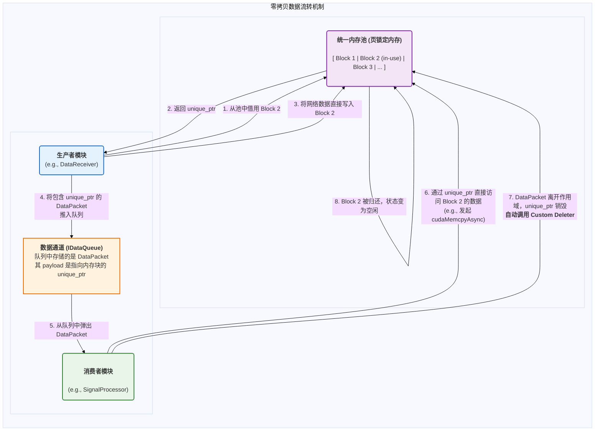
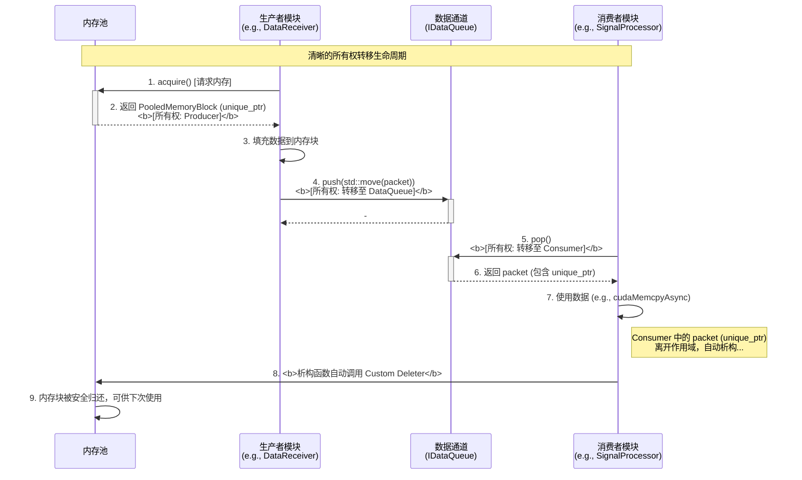
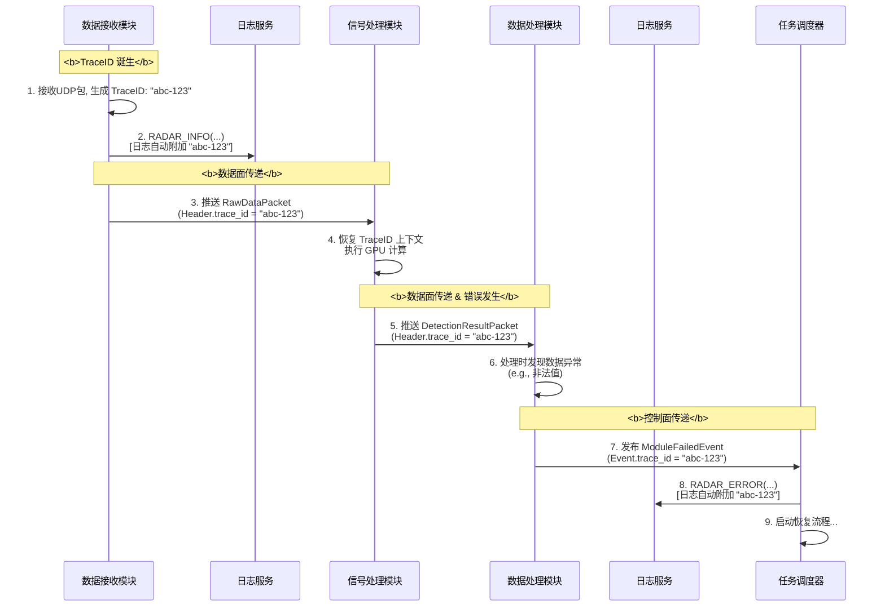
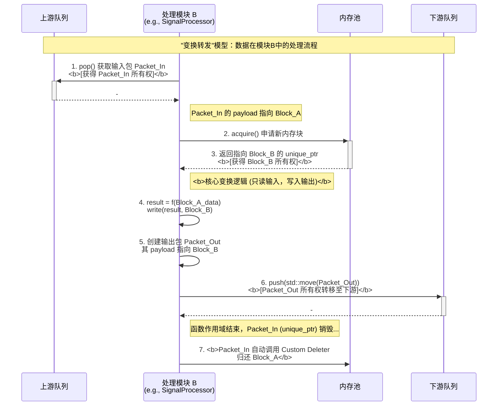
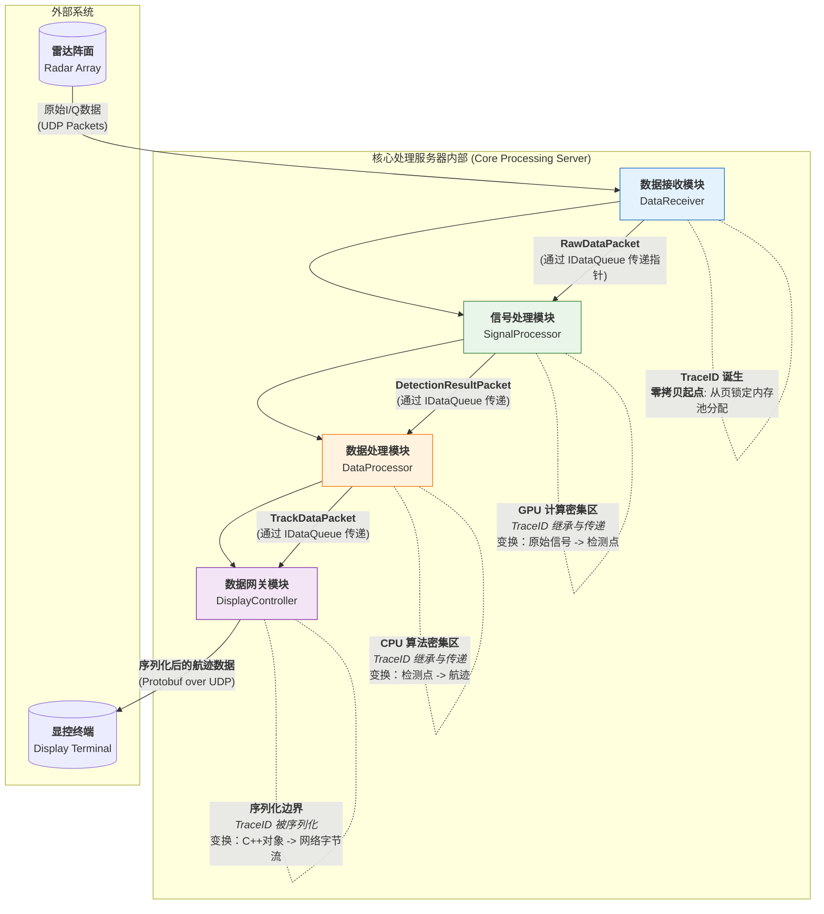
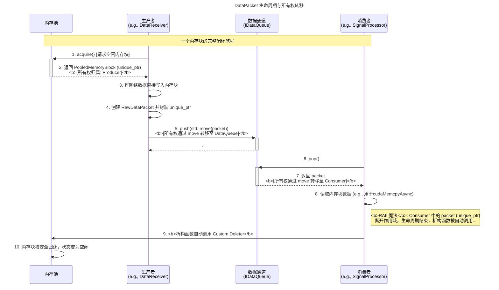
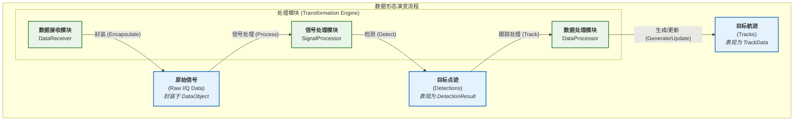

# 00\_数据架构总览与原则

**文档版本**: v1.0.0
**最后更新**: 2025-09-30
**负责人**: Klein

-----

## 概述

本文件是雷达数据处理系统**数据架构设计的最高指导性纲领**。它定义了贯穿整个系统的核心数据处理哲学、设计原则和宏观模型。所有与数据结构、内存管理、数据流转和序列化相关的详细设计，都必须严格遵守本文件所确立的规范。

本文档旨在成为数据架构的“单一事实来源”，为开发者提供一个清晰、一致的框架，以构建一个高性能、高可靠且易于维护的数据处理系统。

-----

## 目录

- [00\_数据架构总览与原则](#00_数据架构总览与原则)
  - [概述](#概述)
  - [目录](#目录)
  - [1. 文档职责](#1-文档职责)
    - [1.1. 文档范围与目标](#11-文档范围与目标)
    - [1.2. 读者引导](#12-读者引导)
  - [2. 核心数据架构原则](#2-核心数据架构原则)
    - [2.1. 第一原则：端到端零拷贝 (End-to-End Zero-Copy)](#21-第一原则端到端零拷贝-end-to-end-zero-copy)
      - [2.1.1. 原则定义](#211-原则定义)
      - [2.1.2. 设计动机 (The "Why")](#212-设计动机-the-why)
      - [2.1.3. 实现机制 (The "How")](#213-实现机制-the-how)
      - [2.1.4. 开发者契约 (Developer's Contract)](#214-开发者契约-developers-contract)
    - [2.2. 第二原则：清晰的所有权与生命周期管理 (Clear Ownership \& Lifecycle)](#22-第二原则清晰的所有权与生命周期管理-clear-ownership--lifecycle)
      - [2.2.1. 原则定义](#221-原则定义)
      - [2.2.2. 设计动机 (The "Why")](#222-设计动机-the-why)
      - [2.2.3. 实现机制 (The "How")](#223-实现机制-the-how)
      - [2.2.4. 所有权流动生命周期](#224-所有权流动生命周期)
      - [2.2.5. 开发者契约 (Developer's Contract)](#225-开发者契约-developers-contract)
    - [2.3. 第三原则：强制的全链路可追踪性 (Mandatory End-to-End Traceability)](#23-第三原则强制的全链路可追踪性-mandatory-end-to-end-traceability)
      - [2.3.1. 原则定义](#231-原则定义)
      - [2.3.2. 设计动机 (The "Why")](#232-设计动机-the-why)
      - [2.3.3. 实现机制 (The "How")](#233-实现机制-the-how)
      - [2.3.4. TraceID 的旅程 (可视化)](#234-traceid-的旅程-可视化)
      - [2.3.5. 开发者契约 (Developer's Contract)](#235-开发者契约-developers-contract)
    - [2.4. 第四原则：数据不可变性 (Immutability)](#24-第四原则数据不可变性-immutability)
      - [2.4.1. 原则定义](#241-原则定义)
      - [2.4.2. 设计动机 (The "Why")](#242-设计动机-the-why)
      - [2.4.3. 实现机制 (The "How")：“变换转发”模型](#243-实现机制-the-how变换转发模型)
      - [2.4.4. 变换转发流程 (可视化)](#244-变换转发流程-可视化)
      - [2.4.5. 开发者契约 (Developer's Contract)](#245-开发者契约-developers-contract)
    - [2.5. 第五原则：面向性能的内存布局 (Performance-Oriented Memory Layout)](#25-第五原则面向性能的内存布局-performance-oriented-memory-layout)
      - [2.5.1. 原则定义](#251-原则定义)
      - [2.5.2. 设计动机 (The "Why")](#252-设计动机-the-why)
      - [2.5.3. 实现机制 (The "How")](#253-实现机制-the-how)
      - [2.5.4. 开发者契约 (Developer's Contract)](#254-开发者契约-developers-contract)
  - [3. 宏观数据模型](#3-宏观数据模型)
    - [3.1. 数据处理流水线概览](#31-数据处理流水线概览)
      - [3.1.1. 宏观视图](#311-宏观视图)
      - [3.1.2. 流水线分阶段详解](#312-流水线分阶段详解)
    - [3.2. 数据包 (DataPacket) 生命周期](#32-数据包-datapacket-生命周期)
      - [3.2.1. 概述](#321-概述)
      - [3.2.2. 生命周期可视化 (时序图)](#322-生命周期可视化-时序图)
      - [3.2.3. 生命周期阶段详解](#323-生命周期阶段详解)
    - [3.3. 数据状态与转换](#33-数据状态与转换)
      - [3.3.1. 概述](#331-概述)
      - [3.3.2. 数据形态演变图](#332-数据形态演变图)
      - [3.3.3. 核心数据形态详解](#333-核心数据形态详解)
  - [4. 横切关注点](#4-横切关注点)
    - [4.1. 并发模型与数据安全](#41-并发模型与数据安全)
    - [4.2. 序列化边界](#42-序列化边界)
    - [4.3. 数据完整性](#43-数据完整性)
  - [5. 术语表](#5-术语表)
  - [6. 相关文档](#6-相关文档)
  - [7. 变更历史](#7-变更历史)


-----

## 1\. 文档职责

### 1.1. 文档范围与目标

本文档的核心目标是确立数据架构的“第一性原理”，它不关注具体的数据结构字段或协议字节，而是聚焦于指导这些具体设计的**思想和规则**。

  * **本文档包含**:

      * 指导整个数据架构设计的核心原则。
      * 系统宏观的数据流动和生命周期模型。
      * 数据在并发、序列化和完整性保障方面的通用策略。

  * **本文档不包含**:

      * 具体的 C++ `struct` 定义 (详见 `02_核心数据结构.md`)。
      * 内存池和并发队列的具体实现 (详见 `03_内存管理与所有权.md`)。
      * Protobuf schema 和网络包格式 (详见 `04_序列化与网络协议.md`)。

### 1.2. 读者引导

  * **架构师/核心开发者**: 应完整阅读并深刻理解本文档，确保所有设计决策都与核心原则保持一致。
  * **模块开发者**: 应重点阅读第 2 章核心原则和第 3 章宏观模型，以理解在开发中需要遵守的数据处理规范。
  * **新成员**: 本文档是理解系统数据处理哲学的最佳起点。

-----

## 2\. 核心数据架构原则

本章节定义的五大原则是数据架构的基石，其优先级和重要性构成了我们设计决策的基础。

### 2.1. 第一原则：端到端零拷贝 (End-to-End Zero-Copy)

#### 2.1.1. 原则定义

**端到端零拷贝**是本系统数据架构的**最高、最核心、不可违背**的第一原则。

它规定：在核心处理服务器的内部数据处理流水线中，从数据进入`数据接收模块`到离开`数据网关模块`的整个过程中，承载核心业务数据（如 I/Q 样本、检测结果、航迹信息）的**内存块负载 (Memory Block Payload) 严禁发生任何形式的深拷贝 (Deep Copy)**。

所有模块间的数据交换，**必须**通过传递指向该内存块的**引用或带有所有权的智能指针**来完成。

#### 2.1.2. 设计动机 (The "Why")

在每秒处理数千兆字节（GB/s）数据的实时系统中，`memcpy` 操作是性能的头号杀手。每一次内存拷贝不仅会消耗宝贵的 CPU 周期，还会污染 CPU 缓存，并给内存总线带来巨大压力。传统的“接收-处理-发送”模型中，数据在每个模块边界都可能发生拷贝，这种累积效应将使系统延迟轻易地超出毫秒级（ms）的严苛限制，并严重制约系统的最大吞吐量。

**零拷贝原则旨在从根本上消除这种开销**，确保数据像在一条无摩擦的轨道上滑行，而非在每个站点都被卸下和重装。这是实现系统极致性能的基石。

#### 2.1.3. 实现机制 (The "How")

端到端零拷贝并非一个单一技术，而是由以下三大机制协同构成的完整体系：

**1. 统一内存池 (Unified Memory Pool)**

系统在启动时会预先分配一个或多个大块的连续内存，形成统一的内存池。所有模块需要存放数据时，都从池中“借用”一块固定大小的内存，使用完毕后“归还”，而非在运行时频繁地向操作系统申请 (`new`/`malloc`) 和释放 (`delete`/`free`)。

  * **页锁定内存 (Pinned Memory)**: 对于需要与 GPU 进行高速数据交换的场景，内存池会直接分配为**页锁定内存**。这使得 GPU 的 DMA 引擎可以直接访问该内存，支持 `cudaMemcpyAsync` 异步传输，是实现 CPU-GPU 数据传输与计算重叠的关键。

**2. 智能指针与所有权契约 (Smart Pointers & The Ownership Contract)**

系统通过 C++ 的智能指针机制，实现了对内存池中内存块生命周期的自动化、安全管理。

  * **唯一所有权 (`std::unique_ptr`)**: 一块从内存池借出的内存，其所有权由一个 `std::unique_ptr` 表示。这确保了在任何时刻，都只有一个“角色”对这块内存负责，杜绝了重复释放或所有权不明的问题。
  * **自定义删除器 (Custom Deleter)**: 这是实现资源自动回收的**核心魔法**。`std::unique_ptr` 在构造时会绑定一个自定义的删除器。当 `unique_ptr` 的生命周期结束时（例如离开作用域），它不会调用 `delete` 去释放内存，而是调用这个自定义删除器，该删除器的逻辑是**将内存块安全地归还给它所属的内存池**。

**3. 数据管道中的指针传递 (Pointer Passing in the Data Pipeline)**

模块之间的数据交换通道（`IDataQueue<T>`）中流转的不是庞大的数据本身，而是轻量级的、包含了上述 `std::unique_ptr` 的 `DataPacket` 对象。



#### 2.1.4. 开发者契约 (Developer's Contract)

为严格遵守零拷贝原则，所有参与数据管道开发的工程师**必须**遵循以下契约：

1.  **严禁拷贝负载**: 在任何情况下，都不得对 `DataPacket` 中 `payload` 指向的内存块进行深拷贝。所有操作都必须基于该指针或其引用进行。

2.  **拥抱所有权转移**: 模块间传递数据**必须**通过移动语义 (`std::move`) 转移 `std::unique_ptr` 的所有权。这确保了所有权链条的完整和清晰。

    ```cpp
    // 正确示例：
    auto packet = data_queue->pop();
    if (packet) {
        process(std::move(*packet)); // 转移所有权给处理函数
    }
    ```

3.  **信赖 RAII**: 开发者**无需也严禁**手动归还内存。`std::unique_ptr` 和自定义删除器已经构成了完美的 RAII (资源获取即初始化) 机制，会自动处理资源的回收。

4.  **从池中创建**: 当一个模块需要产生新的数据（例如 `DataProcessor` 生成 `TrackData`）并向下游传递时，它**必须**从相应的内存池中申请新的内存块来存放结果，而不是在栈上或堆上创建。

当然，非常乐意为您进一步细化并撰写一份“完美”的 **`2.2 第二原则：清晰的所有权与生命周期管理`** 的内容。

这份内容将紧密衔接第一原则“零拷贝”，深入阐述系统如何通过现代 C++ 的核心思想来安全、自动地管理零拷贝机制所依赖的内存资源，从而从根本上杜绝内存泄漏和悬垂指针等经典 C++ 难题。

-----

### 2.2. 第二原则：清晰的所有权与生命周期管理 (Clear Ownership & Lifecycle)

#### 2.2.1. 原则定义

**清晰的所有权与生命周期管理**是支撑“端到端零拷贝”原则得以安全实现的技术基石。

它规定：任何在数据管道中流转的动态分配的数据资源（特指从内存池中获取的内存块），在任何时间点，都**必须有且仅有一个明确的、负有释放责任的所有者**。该资源的所有权可以在不同模块之间进行**显式地、原子地转移**，其生命周期必须与所有者对象的生命周期严格绑定，实现自动化资源回收。

如果说“零拷贝”原则是我们追求性能的“目的”，那么“清晰的所有权”就是我们保障系统稳定性和健壮性的“手段”。

#### 2.2.2. 设计动机 (The "Why")

在C++这样一门赋予开发者巨大内存控制能力的语言中，“能力越大，责任越大”。传统的、手动的内存管理 (`new`/`delete`, `malloc`/`free`) 在一个复杂的、多线程的实时系统中，是不可持续的灾难之源：

  * **内存泄漏 (Memory Leaks)**: 在复杂的逻辑分支或异常路径中，忘记调用 `delete`，导致内存被永久占用。
  * **重复释放 (Double Frees)**: 两个或多个模块都认为自己是某块内存的所有者，并都尝试释放它，导致程序崩溃。
  * **悬垂指针 (Dangling Pointers)**: 一个模块释放了内存，但另一个模块仍然持有指向该内存的指针并尝试使用它，导致未定义行为。

本原则的核心目标，就是通过引入一套**自动化、基于编译期契约**的机制，将开发者从手动管理内存的沉重负担和巨大风险中解放出来，让资源管理如呼吸般自然且正确。

#### 2.2.3. 实现机制 (The "How")

本系统通过一套组合拳，将现代 C++ 的精髓——**RAII (资源获取即初始化)** 思想发挥到极致，构建了坚不可摧的所有权管理体系。

**1. RAII：自动化资源管理的哲学基石**

RAII 是本原则的灵魂。其核心思想是将资源的生命周期与一个栈上对象的生命周期绑定。当对象被创建时，它获取资源；当对象离开作用域被销毁时，它的析构函数会自动释放资源。我们不依赖程序员的记忆力，而是依赖编译器确保析构函数一定会被调用。

**2. `std::unique_ptr`：唯一所有权的强制执行者**

为实现“单一所有者”的铁律，系统规定所有从内存池中获取的内存块，都必须由 `std::unique_ptr` 来管理。

  * **独占性**: `std::unique_ptr` 是**不可拷贝**的。这意味着你无法意外地创造出同一块内存的两个所有者。
  * **所有权转移**: 所有权的交接，**必须**通过 `std::move` 语义进行**显式转移**。这使得所有权的流动在代码中清晰可见，极大地增强了代码的可读性和可维护性。

**3. 自定义删除器 (Custom Deleter)：资源回收的“智能导航员”**

标准 `std::unique_ptr` 在销毁时会默认调用 `delete`，这对于使用内存池的我们是错误的。我们需要的是将内存“归还”给池。**自定义删除器**正是解决此问题的关键。

它是一个小型的函数对象 (Functor)，在创建 `std::unique_ptr` 时作为模板参数传入。它“教会”了 `unique_ptr` 在生命周期结束时，应该执行什么样的“特殊清理动作”。

```cpp
// C++ 代码示例：自定义删除器的定义
// 引用自 `01_模块接口规范.md` 的设计思想

#include <memory>

class MemoryPool; // 前向声明内存池

// 自定义删除器结构体
struct MemoryPoolDeleter {
    MemoryPool* pool; // 指向该内存块来源的内存池

    // 重载 operator()，定义清理动作
    void operator()(uint8_t* ptr) const {
        // 清理动作不是 "delete ptr"，而是 "pool->release(ptr)"
        if (pool && ptr) {
            pool->release(ptr);
        }
    }
};

// 定义一个别名，方便使用
using PooledMemoryBlock = std::unique_ptr<uint8_t[], MemoryPoolDeleter>;
```

**4. `std::move`：所有权转移的显式“交接仪式”**

`std::move` 是执行所有权转移的动词。它本身不移动任何数据，只是进行一次类型转换，告诉编译器“我，作为当前的所有者，自愿放弃所有权，请允许下一个接收者接管它”。

#### 2.2.4. 所有权流动生命周期

下图清晰地展示了所有权在数据管道中的完整流动闭环：



#### 2.2.5. 开发者契约 (Developer's Contract)

为严格遵守清晰的所有权原则，所有开发者**必须**遵循以下契约：

1.  **使用别名**: **必须**使用项目定义的类型别名（如 `PooledMemoryBlock`）来处理从内存池获取的内存，以确保正确的删除器被绑定。

2.  **显式转移**: 在将数据包放入队列或通过函数参数传递所有权时，**必须**使用 `std::move`。

3.  **禁止手动管理**: **严禁**在数据管道中直接使用 `new`/`delete` 或 `malloc`/`free`。**严禁**从 `unique_ptr` 中 `release()` 指针并尝试手动管理其生命周期。

4.  **信赖 RAII**: 相信并依赖 RAII 机制。只需保证 `unique_ptr` 在正确的逻辑作用域内，编译器和我们的设计将保证资源 100% 被正确回收。您的任务是实现业务逻辑，而不是担心内存管理。

-----

### 2.3. 第三原则：强制的全链路可追踪性 (Mandatory End-to-End Traceability)

#### 2.3.1. 原则定义

**强制的全链路可追踪性**是本系统**可观测性 (Observability)** 的核心支柱。

它规定：任何一个始于系统边界的、具有独立业务意义的操作序列（无论是处理一个数据帧，还是一次外部 API 调用），在其穿越系统内部所有模块、线程、队列和进程边界的完整生命周期中，**必须**被一个**全局唯一的追踪标识符 (`TraceID`)** 所标记。所有在此链路上产生的日志、事件、数据包和错误报告，都**必须**携带此 `TraceID`。

`TraceID` 是将系统孤立、并发的行为“缝合”成一个连贯、可理解的“故事”的**唯一线索**。

#### 2.3.2. 设计动机 (The "Why")

在一个由多个解耦模块组成的、高度并发和异步的系统中，传统的调试方法（如单步跟踪）完全失效。当问题发生时，我们将面临一个充满挑战的“黑盒”：

  * **根因分析的噩梦**: `数据处理模块` 报出一个`ALGORITHM_ERROR`，它是由 `信号处理模块` 提供的异常输入数据导致的，而这个异常数据又源于 `数据接收模块` 在 50 毫秒前收到的一个畸形网络包。**如果没有 `TraceID`，我们如何将这三个跨越时间与模块边界的事件关联起来？**
  * **性能瓶颈的迷雾**: 一个数据帧从进入系统到最终输出，总耗时 25 毫秒，远超 10 毫秒的预期。**瓶颈究竟是在数据接收、GPU 计算还是航迹融合？我们如何精确测量并归因每个阶段的耗时？**
  * **异常行为的溯源**: 用户报告一次“重启模块”的 API 调用失败。**我们如何将这次外部 HTTP 请求，与 `任务调度器` 内部的事件处理、目标模块的状态变更以及最终的失败日志完整地关联起来？**

`TraceID` 就是解决以上所有问题的答案。它如同为每一次操作注入的“数字 DNA”，无论这个操作如何演变、传递，我们都能通过这个 DNA 识别其所有相关的“生命活动”，从而获得洞察系统内部运作的“上帝视角”。

#### 2.3.3. 实现机制 (The "How")

本系统围绕 `TraceID` 构建了一个完整的、跨越数据面和控制面的生态系统，确保追踪链的无缝传递。

**1. `TraceID` 的诞生：在系统边界生成**

`TraceID` 总是在一个新业务流的起点被创建。系统的主要边界包括：

  * **数据入口**: `数据接收模块` 在接收到一个新的、独立的外部数据单元（如一个 UDP 包）时，**必须**为其生成一个唯一的 `TraceID`。
  * **外部控制入口**: `外部接口网关` 在接收到一个外部 API 请求时，**必须**为其生成一个唯一的 `TraceID`。
  * **内部定时/自发任务**: `任务调度器` 或 `监控模块` 等在启动一个没有外部触发的内部任务（如定时健康检查）时，**必须**为其生成一个唯一的根 `TraceID`。

**2. `TraceID` 的传递契约：数据面与控制面的双重保障**

`TraceID` 通过两条核心路径在系统中穿行：

  * **数据面传递 (Data Plane Propagation)**: 所有在数据管道中流转的 `DataPacket<T>`，其头部都**强制包含** `TraceID` 字段。当一个模块消费上游的 `DataPacket` 并产生新的 `DataPacket` 输出到下游时，它**必须**将输入的 `TraceID` 完整地拷贝到输出的 `TraceID` 字段中。
  * **控制面传递 (Control Plane Propagation)**: 所有在事件总线中流转的 `BaseEvent`，都**强制包含** `TraceID` 字段。`BaseEvent` 的构造函数被设计为可以自动从当前线程的上下文中捕获 `TraceID`，确保了事件的创建与当前操作的无缝关联。

**3. `TraceContext`：跨越线程边界的“上下文护照”**

为了在异步操作（如向线程池提交任务）中维持 `TraceID` 的传递，系统提供了 `TraceContext` 工具。

  * **线程局部存储 (Thread-Local Storage)**: `TraceContext` 使用 `thread_local` 变量来存储当前线程正在处理的业务流的 `TraceID`。
  * **RAII 守护者 (`TraceContextGuard`)**: 这是一个 RAII 风格的辅助类。当创建一个 `TraceContextGuard` 对象时，它会将指定的 `TraceID` 设置为当前线程的上下文；当它离开作用域被销毁时，会自动恢复之前的 `TraceID`。这是在多任务并发的线程中，保证 `TraceID` 上下文正确的关键机制。

<!-- end list -->

```cpp
// C++ 代码示例：在线程池任务中传递 TraceID
// 引用自 `07_日志服务设计.md` 的设计思想

void DataProcessor::processDataAsync(DataPacket<Input> input_packet) {
    // 捕获当前操作的 TraceID
    const TraceId current_trace_id = input_packet.header.trace_id;

    // 将任务和 TraceID 一同提交给线程池
    thread_pool_->submit([this, input_packet, current_trace_id]() {
        // --- 进入工作线程 ---

        // 使用 TraceContextGuard 在工作线程的作用域内恢复 TraceID 上下文
        TraceContextGuard guard(current_trace_id);

        // 在此作用域内，所有日志和新创建的事件都将自动携带正确的 TraceID
        RADAR_INFO(logger_, "Background task started for processing data.");

        // ... 执行具体的处理逻辑 ...
    });
}
```

#### 2.3.4. TraceID 的旅程 (可视化)

下图展示了一个 `TraceID` 从诞生到贯穿整个系统的典型旅程：



#### 2.3.5. 开发者契约 (Developer's Contract)

为严格遵守全链路可追踪性原则，所有开发者**必须**遵循以下契约：

1.  **在边界生成**: 如果您正在编写的代码位于系统边界（接收外部数据或请求），您**有责任**为新的业务流生成一个 `TraceID`。

2.  **在管道中传递**: 当您的模块是数据处理流水线的一环时，您**有责任**确保从上游数据包中获取的 `TraceID` 被准确无误地传递到您产出的下游数据包中。

3.  **在异步时捕获与恢复**: 当您需要将工作派发到另一个线程（如线程池）时，您**有责任**捕获当前的 `TraceID`，并在新的执行上下文中通过 `TraceContextGuard` 重新建立它。

4.  **无感使用日志**: 您**无需**在调用日志宏时手动传递 `TraceID`。只需确保当前线程的 `TraceContext` 是正确的，日志系统会自动完成注入。

-----

### 2.4. 第四原则：数据不可变性 (Immutability)

#### 2.4.1. 原则定义

**数据不可变性**原则规定：一旦一个数据包 (`DataPacket`) 被创建并进入数据处理流水线，其核心负载 (payload) 就应被所有后续的消费者模块视为**逻辑上不可变的 (Logically Immutable)，即只读 (Read-Only)**。

如果一个模块需要对数据进行修改或变换，它**严禁**在输入的内存块上进行**原地修改 (In-Place Modification)**。取而代之，它**必须**遵循“**变换转发 (Transform-and-Forward)**”模式：为输出结果申请一块全新的内存，在读取输入数据后，将计算结果写入新内存块，然后将这个新内存块的所有权传递给下游。

#### 2.4.2. 设计动机 (The "Why")

在我们的多线程流水线架构中，一个数据块的引用可能会被多个组件或线程同时访问（例如，一个模块的主线程将其分发给多个工作线程）。如果数据是可变的，这将立刻把我们引入并发编程的“万恶之源”——**共享可变状态 (Mutable Shared State)**。

为了保护共享数据，传统的做法是大量使用**互斥锁 (Mutexes)**。然而，这种做法会带来一系列严重的问题：

  * **性能瓶颈**: 锁竞争是高性能系统中的主要性能杀手，它会导致线程阻塞和频繁的上下文切换。
  * **复杂性剧增**: 锁的粒度、顺序和使用方式极难把握，代码会变得复杂且难以推理。
  * **死锁 (Deadlocks)**: 锁的使用极易引入死锁，这种问题难以复现和调试，是系统稳定性的巨大隐患。

**数据不可变性原则通过从根本上消除“共享可变状态”，让我们得以“按设计移除”一整类最棘手的并发编程 Bug**。如果数据永远不会被修改，那么它就可以在任意数量的线程之间被自由、安全地共享读取，**完全无需任何锁的保护**。这使得我们的并发代码变得极其简单、高效和健呈。

#### 2.4.3. 实现机制 (The "How")：“变换转发”模型

“不可变性”听起来似乎与“零拷贝”原则中的“避免数据拷贝”相悖。实际上，两者通过我们设计的“**变换转发 (Transform-and-Forward)**”模型完美地统一起来。我们拷贝的不是数据，而是**所有权**；我们变换的不是原地内存，而是创造新的未来。

该模型包含四个关键步骤：

**1. 视输入数据为只读蓝图 (Treat Input as a Read-Only Blueprint)**
当一个模块从上游队列接收到一个 `DataPacket` 时，它获得的仅仅是对这份数据的**只读权限**。接口设计上会通过 `const` 引用来强制执行这一契约。这份输入数据是模块执行计算的“蓝图”，只能被读取，不能被涂改。

**2. 为输出结果申请全新画布 (Acquire a Fresh Canvas for Output)**
在开始任何计算之前，模块会首先向相应的**内存池** 请求一块新的、干净的内存块。这块内存将成为本次计算结果的“全新画布”。

**3. 执行变换，而非修改 (Perform Transformation, Not Mutation)**
模块的核心业务逻辑本质上是一个纯粹的变换函数：`Output = f(Input)`。它从输入的“蓝图”内存块中读取数据，执行算法，然后将结果写入到刚刚申请的输出“画布”内存块中。

**4. 传递新所有权，释放旧所有权 (Forward New Ownership, Release the Old)**
计算完成后，模块会将指向新输出内存块的 `std::unique_ptr` 封装到一个新的 `DataPacket` 中，然后通过 `std::move` 将其所有权传递给下游队列。

与此同时，包含输入内存块指针的 `unique_ptr` 在离开其作用域后，会**自动销毁**。其绑定的**自定义删除器 (Custom Deleter)** 会被触发，将这块已被读取完毕的输入内存块**安全地归还给内存池**，以供循环使用。

#### 2.4.4. 变换转发流程 (可视化)

下图直观地展示了“变换转发”模型如何在一个处理节点（如 `SignalProcessor`）中工作，完美地融合了零拷贝、所有权和不可变性三大原则。



#### 2.4.5. 开发者契约 (Developer's Contract)

为严格遵守数据不可变性原则，所有开发者**必须**遵循以下契约：

1.  **尊重 `const`**: **必须**将接收输入 `DataPacket` 的函数参数标记为 `const` 引用（例如 `void process(const RawDataPacket& packet)`)，并严格遵守其只读承诺。

2.  **先申请，后计算**: 在执行任何会产生新数据的计算之前，**必须**先从内存池获取用于存放结果的内存块。

3.  **严禁原地修改**: **严禁**尝试获取输入 `DataPacket` 的 `payload` 指针并直接修改其指向的内存内容。这样做会破坏整个并发模型的安全基础。

4.  **清晰的输入输出**: 您的函数或模块应被设计为逻辑上的“纯函数”：接收一个不可变的输入，并产生一个全新的输出，不产生任何“副作用 (Side Effect)”于输入数据之上。

-----

### 2.5. 第五原则：面向性能的内存布局 (Performance-Oriented Memory Layout)

#### 2.5.1. 原则定义

**面向性能的内存布局**原则规定：系统中所有核心数据结构（特别是那些在性能热点路径上被处理的数据传输对象 DTOs）的设计，**必须**超越业务逻辑的简单表达，主动迎合底层硬件（CPU 和 GPU）的体系结构。这包括但不限于**数据对齐、缓存行优化、以及根据访问模式选择最优的数据布局（如 SoA vs. AoS）**。

我们编写的 C++ 代码最终是在物理硬件上运行的。软件与硬件之间的“对话”效率，直接决定了系统的性能上限。本原则的目标就是确保我们的数据结构能够与硬件“友好对话”，最大化地利用其缓存、SIMD 单元和内存总线带宽。

#### 2.5.2. 设计动机 (The "Why")

现代处理器（CPU/GPU）的计算速度与主内存的访问速度之间存在着巨大的鸿沟，通常被称为“**内存墙 (Memory Wall)**”。一次 L1 缓存的命中可能只需要几个时钟周期，而一次主内存的访问则可能需要数百个周期。

这意味着，**我们系统的性能瓶颈，往往不在于计算本身，而在于等待数据从内存中加载**。

一个“天真”的、只考虑业务逻辑的数据结构，可能会在无意中造成：

  * **非对齐内存访问**: 处理器需要进行两次内存读取才能获取一个完整的数据，性能直接减半。
  * **缓存行伪共享**: 在多核环境下，不同核心修改逻辑上独立但物理上相邻的数据，导致缓存一致性协议产生巨大的“颠簸”，性能急剧下降。
  * **不利于向量化 (SIMD)**: 数据在内存中不连续，导致编译器无法生成高效的 SIMD（单指令多数据）指令，错失了将计算性能提升 4-8 倍的机会。

本原则旨在通过开发者**有意识的、前瞻性的布局设计**，将数据“喂”到最适合硬件处理的位置和形态，从而跨越“内存墙”，释放硬件的全部潜力。

#### 2.5.3. 实现机制 (The "How")

为实现面向性能的布局，我们必须采用以下关键技术和设计模式：

**1. 数据对齐 (Data Alignment)：确保赢在“起跑线”**

  * **原理**: 处理器按“块”（即缓存行，通常为 64 字节）从内存中读取数据。如果一个 8 字节的数据跨越了两个缓存行的边界，处理器就需要执行两次内存读取。数据对齐就是确保数据对象的起始地址是其自身大小（或更大2的幂次方）的整数倍，从而避免这种情况。
  * **工具**: C++11 提供的 `alignas` 关键字。
  * **应用**: 对于所有参与高性能计算的 DTO，**必须**进行对齐。特别是那些会被 GPU 或 SIMD 指令处理的数据。

```cpp
// 糟糕的布局 (可能未对齐)
struct DetectionResult_Bad {
    double snr;         // 8 bytes
    float range;        // 4 bytes
    float velocity;     // 4 bytes
};

// 优秀的布局 (强制16字节对齐)
// 引用自 `01_模块接口规范.md` 的设计建议
struct alignas(16) DetectionResult_Good {
    float range;        // 4 bytes
    float velocity;     // 4 bytes
    float snr;          // 4 bytes
    float reserved;     // 4 bytes padding to make it 16 bytes
};
// 这样可以确保一个 DetectionResult_Good 对象不会跨越缓存行边界，
// 并且适合被 SSE/AVX 等128位 SIMD 指令一次性加载。
```

**2. 缓存行与伪共享 (Cache Lines & False Sharing)：并发的“隐形杀手”**

  * **原理**: 当两个不同 CPU 核心上的线程，频繁地修改两个逻辑上独立、但物理上位于**同一个缓存行**的变量时，就会发生伪共享。一个核心的写入会导致另一个核心的缓存行失效，迫使其从更慢的内存层级重新加载。这种来回的缓存失效和同步，会产生巨大的、不易察ึง的性能开销。
  * **解决方案**: 通过**填充 (Padding)** 或 `alignas`，确保被不同线程高频写入的数据（尤其是原子变量、计数器等）位于不同的缓存行上。

```cpp
// 糟糕的布局 (伪共享风险)
struct Stats {
    std::atomic<uint64_t> packets_processed; // Core 1 频繁写入
    std::atomic<uint64_t> bytes_processed;   // Core 2 频繁写入
}; // 这两个变量极有可能在同一个 64 字节的缓存行内

// 优秀的布局 (避免伪共享)
struct alignas(64) AlignedAtomicU64 { // 强制对齐到缓存行大小
    std::atomic<uint64_t> value;
};

struct Stats_Good {
    AlignedAtomicU64 packets_processed;
    AlignedAtomicU64 bytes_processed;
}; // 现在这两个变量保证位于不同的缓存行
```

**3. 数据布局模式 (AoS vs. SoA)：为 SIMD 铺平道路**

这是信号和数据处理领域最核心的布局权衡。

  * **AoS (Array of Structures - 结构体数组)**:
      * `struct Point { float x, y, z; }; Point points[100];`
      * **内存布局**: `[x0, y0, z0], [x1, y1, z1], ...`
      * **优点**: 符合面向对象直觉，访问单个点的所有属性时缓存友好。
      * **缺点**: **SIMD 的噩梦**。`x` 坐标在内存中不连续，无法被向量指令一次性加载多个。

  * **SoA (Structure of Arrays - 数组结构体)**:

      * `struct Points { float x[100]; float y[100]; float z[100]; };`
      * **内存布局**: `[x0, x1, ...], [y0, y1, ...], [z0, z1, ...]`
      * **优点**: **SIMD 的天堂**。所有 `x` 坐标都是连续的，可以被向量指令高效处理。
      * **缺点**: 访问单个点的所有属性时，需要三次内存访问，缓存不友好。

**应用策略**:
我们的系统将采用**混合策略**。

  * 在模块间传递的 DTOs (如 `DetectionResultPacket`) 通常采用 **AoS** 布局，因为它更通用和直观。
  * 在 `SignalProcessor` 和 `DataProcessor` 内部的**性能热点算法**中，应在计算开始前，执行一次从 **AoS 到 SoA 的数据重组**，然后在 SoA 布局上执行高度优化的 SIMD/GPU 计算，计算完成后再将结果重组回 AoS 格式输出。

#### 2.5.4. 开发者契约 (Developer's Contract)

为严格遵守面向性能的内存布局原则，所有开发者**必须**遵循以下契约：

1.  **对齐是默认选项**: 对于所有在数据面流转的、或在计算密集型模块（`SignalProcessor`, `DataProcessor`）内部使用的 `struct`，**必须**主动思考并应用 `alignas`，除非能证明其不需要。

2.  **警惕并发写入**: 在设计被多线程访问的数据结构时，**必须**分析其写入模式，并主动使用填充等手段避免伪共享。

3.  **拥抱 SoA 布局**: 在编写任何对数组进行循环处理的计算密集型代码时（尤其是在 `SignalProcessor` 和 `DataProcessor` 中），**必须**优先考虑将数据重组为 SoA 布局以利用 SIMD 和 GPU 的并行计算能力。

4.  **用剖析说话 (Profile-Guided)**: 内存布局优化是一个充满权衡的领域。任何复杂的布局变更，**必须**有性能剖析 (Profiling) 数据的支持来证明其有效性。**不要进行“想当然”的过早优化或过度优化**。

-----

## 3\. 宏观数据模型

### 3.1. 数据处理流水线概览

#### 3.1.1. 宏观视图

本系统的数据处理核心是一个**单向、分阶段的流水线 (Unidirectional, Staged Pipeline)**。数据从一个模块流向下个模块，在每个阶段被逐步地“提炼”和“加工”，从原始的物理信号最终变为具有业务价值的情报信息。

下图展示了数据从进入核心处理服务器到离开并发送给独立显控终端的完整端到端旅程。



#### 3.1.2. 流水线分阶段详解

**阶段一：原始数据接收与封装 (Raw Data Ingestion & Encapsulation)**

  * **责任模块**: `数据接收模块 (DataReceiver)`。
  * **输入**: 来自雷达阵面的原始 I/Q 数据 UDP 包。
  * **核心变换**:
    1.  **分配内存**: 从**页锁定内存池 (Pinned Memory Pool)** 中获取一个空的内存块。这是**零拷贝原则**的起点。
    2.  **接收数据**: 将网络数据直接读入该内存块，无任何中间拷贝。
    3.  **生成 TraceID**: 为这个新的数据处理流程生成一个全局唯一的 `TraceID`。这是**全链路可追踪性原则**的起点。
    4.  **封装**: 将指向该内存块的 `std::unique_ptr`（带有自定义删除器）封装进一个 `RawDataPacket` 中。这是**所有权原则**的体现。
  * **输出**: `RawDataPacket` 对象，通过 `IDataQueue<T>` 接口推送到下一模块。

**阶段二：信号处理与目标检测 (Signal Processing & Detection)**

  * **责任模块**: `信号处理模块 (SignalProcessor)`。
  * **输入**: `RawDataPacket`。
  * **核心变换**:
    1.  **获取所有权**: 从上游队列 `pop` 出 `RawDataPacket`，获得其 `payload` 的唯一所有权。
    2.  **GPU 传输**: 利用页锁定内存的特性，通过 `cudaMemcpyAsync` 将原始数据高效地异步传输到 GPU 显存。
    3.  **计算**: 在 GPU 上执行一个复杂的算法流水线（如 FFT、滤波、CFAR 检测）。
    4.  **传递 TraceID**: 在处理过程中，将输入的 `TraceID` 传递下去。
    5.  **归还内存**: 输入的 `RawDataPacket` 在离开作用域后，其管理的内存块会自动归还给内存池。
  * **输出**: 一个 `DetectionResultPacket`，其中包含一个 `std::vector<DetectionResult>`，这是在 CPU 端聚合的检测结果。

**阶段三：数据处理与航迹生成 (Data Processing & Track Generation)**

  * **责任模块**: `数据处理模块 (DataProcessor)`。
  * **输入**: `DetectionResultPacket`。
  * **核心变换**:
    1.  **CPU 计算**: 在 CPU 上执行算法（如点迹聚类、数据关联、航迹起始、卡尔曼滤波等），将离散的检测点融合成稳定、连续的航迹。
    2.  **状态管理**: 创建并更新内部的航迹数据库 (`TrackManager`)。
    3.  **传递 TraceID**: 将与输入检测点关联的 `TraceID` 传递给新生成或更新的航迹数据。
  * **输出**: 一个 `TrackDataPacket`，其中包含一个 `std::vector<TrackData>`，代表当前周期内所有更新过的航迹的完整信息。

**阶段四：序列化与网络分发 (Serialization & Network Distribution)**

  * **责任模块**: `数据网关模块 (DisplayController)`。
  * **输入**: `TrackDataPacket`。
  * **核心变换**:
    1.  **系统边界**: 这是数据在核心处理服务器内部流动的最后一站。
    2.  **序列化**: 将 C++ 的 `TrackData` 对象使用 **Protobuf** 序列化为平台无关的、紧凑的二进制字节流。
    3.  **封装 TraceID**: `TraceID` **必须**作为元数据的一部分被一同序列化到网络数据包中，以将追踪链延伸至客户端。
  * **输出**: 包含序列化后航迹数据的 UDP 单播数据包，发送给网络上的独立显控终端。

-----

### 3.2. 数据包 (DataPacket) 生命周期

#### 3.2.1. 概述

数据包的生命周期是本系统数据架构两大核心原则——**“端到端零拷贝”与“清晰的所有权管理”**——在实践中的具体体现。理解一个数据包从被创建、填充、传递、消费到最终回收的完整旅程，是理解本系统高性能与健壮性根源的关键。

这个生命周期并非由开发者手动管理，而是通过 **RAII (资源获取即初始化)** 哲学，由 C++ 的**智能指针 (`std::unique_ptr`)** 和**自定义删除器 (Custom Deleter)** 共同构成的自动化机制来保障。整个过程形成了一个优雅、高效且安全的资源循环利用闭环。

#### 3.2.2. 生命周期可视化 (时序图)

下图详细展示了一个承载原始数据的 `RawDataPacket` 在 `数据接收模块` (生产者) 和 `信号处理模块` (消费者) 之间的完整生命周期。



#### 3.2.3. 生命周期阶段详解

1.  **阶段一：诞生 (Acquisition)**

      * **执行者**: 生产者模块 (例如 `数据接收模块`)。
      * **动作**: 当需要存放新数据时，生产者向 `统一内存池` 请求一个空闲的内存块。
      * **所有权**: 内存池返回一个 `std::unique_ptr`，其包裹了指向内存块的原始指针和 一个**自定义删除器 (Custom Deleter)**。此刻，这块内存的**唯一所有权**属于**生产者**。

2.  **阶段二：填充 (Population)**

      * **执行者**: 生产者模块。
      * **动作**: 生产者通过 `unique_ptr` 访问内存块，并将外部数据（如网络包）直接填充进去。

3.  **阶段三：封装与移交 (Encapsulation & Transfer)**

      * **执行者**: 生产者模块。
      * **动作**: 生产者创建一个 `DataPacket` 对象，将持有内存所有权的 `unique_ptr` 移入 (`std::move`) `DataPacket` 的 `payload` 字段。随后，整个 `DataPacket` 对象被 `std::move` 推入下游的 `IDataQueue`。
      * **所有权**: 在 `push` 调用完成后，内存块的**所有权已从生产者转移至数据通道 `IDataQueue`**。生产者不再拥有该内存块。

4.  **阶段四：消费 (Consumption)**

      * **执行者**: 消费者模块 (例如 `信号处理模块`)。
      * **动作**: 消费者从 `IDataQueue` 中 `pop` 出一个 `DataPacket`。
      * **所有权**: 在 `pop` 调用完成后，内存块的**所有权已从 `IDataQueue` 转移至消费者**。

5.  **阶段五：使用 (Usage)**

      * **执行者**: 消费者模块。
      * **动作**: 消费者通过 `unique_ptr` 读取内存块中的数据，用于其自身的业务逻辑（例如，发起一次到 GPU 的异步内存拷贝）。根据**数据不可变性原则**，消费者应只对该内存块进行只读访问。

6.  **阶段六：自动回收 (Automatic Reclamation)**

      * **执行者**: C++ 运行时 (RAII 机制)。
      * **动作**: 当消费者模块中持有所有权的 `unique_ptr` (通常包裹在 `DataPacket` 中) 离开其作用域时（例如，函数返回、循环进入下一轮），其析构函数会被**自动调用**。
      * **所有权**: 析构函数会触发其绑定的**自定义删除器**。这个删除器的逻辑不是 `delete` 内存，而是调用 `MemoryPool::release()` 方法，将内存块**安全地归还给内存池**。至此，一个完整的生命周期闭环结束，内存可供系统再次使用。

-----

### 3.3. 数据状态与转换

#### 3.3.1. 概述

数据在流经本系统的处理流水线时，其形态并非一成不变。相反，它经历了一个从**原始、海量、低价值密度**到**精炼、稀疏、高价值密度**的逐级转换过程。这个过程如同将原始矿石（Raw Signal）提炼为粗炼金属（Detections），最终精加工为高精度成品（Tracks）。

理解数据在每个阶段的状态和转换逻辑，是理解各个处理模块核心职责的基础。本章节将简要描述数据在流经系统时的三种核心形态演变。

#### 3.3.2. 数据形态演变图

下图直观地展示了数据在核心处理流水线中的状态转换路径。



#### 3.3.3. 核心数据形态详解

**1. `DataObject` - 封装的原始信号 (Encapsulated Raw Signal)**

  * **来源 (Source)**: `数据接收模块 (DataReceiver)`。
  * **本质 (Essence)**: 这是数据最原始的形态，是物理世界雷达回波信号的直接数字采样表示（通常为 I/Q 样本）。它包含了所有潜在的信息，但也混杂着大量的噪声和杂波。其数据本身不包含任何语义，只是一个庞大的数字数组。
  * **封装 (Wrapper)**: 为了在零拷贝管道中流转，这批原始数据被存放在一块从内存池分配的内存中，并由 `DataObject` 结构体通过一个 `std::unique_ptr` 来管理其生命周期。整个 `DataObject` 最终被封装在 `RawDataPacket` 中进行传递。
  * **详细定义**: 其详细的 C++ 结构体定义，请参阅 **`02_核心数据结构.md`**。

**2. `DetectionResult` - 离散的目标点迹 (Discrete Target Detections)**

  * **来源 (Source)**: `信号处理模块 (SignalProcessor)`。
  * **本质 (Essence)**: 这是数据经过第一轮提炼的产物。`信号处理模块` 在 GPU 上对 `DataObject` 中的原始信号执行了复杂的计算（如 FFT, 滤波, CFAR 检测），从中识别出了能量超过背景噪声的“可疑信号点”。每个 `DetectionResult` 代表了在某一时刻，在特定位置（距离、方位、速度等）上的一个潜在目标“点迹”或“量测 (Measurement)”。
  * **封装 (Wrapper)**: 一批 `DetectionResult` 对象通常被聚合在一个 `std::vector` 中，并被封装在 `DetectionResultPacket` 中，传递给下一模块。
  * **详细定义**: 其详细的 C++ 结构体定义，请参阅 **`02_核心数据结构.md`**。

**3. `TrackData` - 稳定连续的航迹 (Stable & Continuous Tracks)**

  * **来源 (Source)**: `数据处理模块 (DataProcessor)`。
  * **本质 (Essence)**: 这是数据价值最高、最精炼的最终形态。`数据处理模块` 对过去一段时间内积累的 `DetectionResult` 进行关联、滤波和融合，将离散、不稳定的“点迹”序列，转变为具有身份标识 (ID)、稳定运动状态（位置、速度、加速度）、历史轨迹和未来预测的“航迹”。`TrackData` 是系统向上层应用或用户交付的核心“产品”。
  * **封装 (Wrapper)**: 在每个处理周期结束后，所有被更新或新创建的 `TrackData` 对象被聚合在一个 `std::vector` 中，并封装在 `TrackDataPacket` 中，传递给数据管道的最后一站——`数据网关模块`。
  * **详细定义**: 其详细的 C++ 结构体定义，请参阅 [**`02_核心数据结构.md`**](02_核心数据结构.md)。

-----

## 4\. 横切关注点

### 4.1. 并发模型与数据安全

  * （简要说明数据在多线程环境下的安全保障机制，核心是**单生产者-单消费者 (SPSC)** 或 **多生产者-单消费者 (MPSC)** 的并发无锁队列。强调数据本身由于不可变性原则，通常不需要加锁。细节链接到 `03_内存管理与所有权.md`。）

### 4.2. 序列化边界

  * （明确定义系统的数据序列化边界。**系统内部**模块间不进行序列化，传递的是原生 C++ 对象（的指针）。**序列化只发生在系统的出口**，即 `DisplayController`（数据网关）在将数据通过网络发送给外部客户端之前。细节链接到 `04_序列化与网络协议.md`。）

### 4.3. 数据完整性

  * （简要提及为保障数据在传输（尤其是外部UDP传输）和处理过程中的准确性所采用的机制，如校验和 (Checksum) 和序列号 (Sequence ID)。细节链接到 `05_数据完整性与可靠性.md`。）

-----

## 5\. 术语表

  * **零拷贝 (Zero-Copy)**: ...
  * **所有权 (Ownership)**: ...
  * **页锁定内存 (Pinned Memory)**: ...
  * **TraceID**: ...
  * ...

-----

## 6\. 相关文档

  * `01_数据流设计.md`
  * `02_核心数据结构.md`
  * `03_内存管理与所有权.md`
  * ... (链接到所有其他数据架构文档)
  * `../01_模块接口规范.md`
  * `../07_日志服务设计.md`

-----

## 7\. 变更历史

| 版本号 | 日期       | 作者  | 变更描述                                               |
| :----- | :--------- | :---- | :----------------------------------------------------- |
| v1.0.0 | 2025-09-30 | Klein | 初始版本创建，确立了数据架构的五大核心原则和宏观模型。 |
