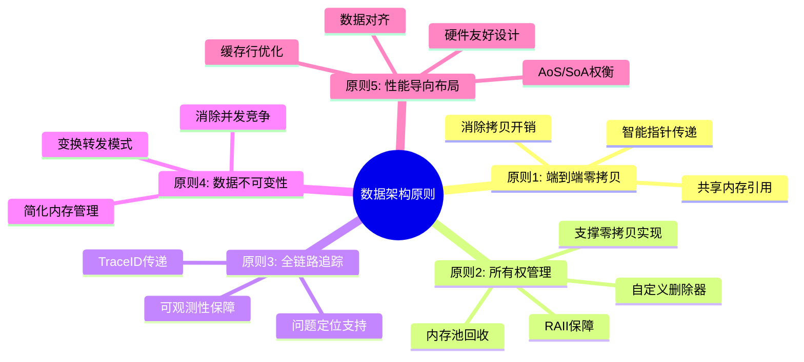
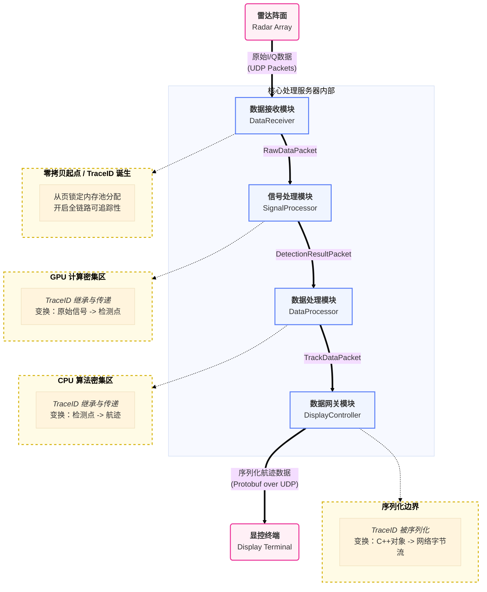
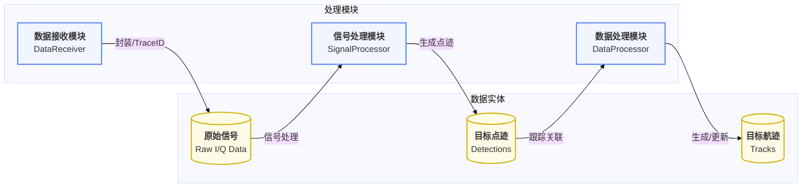

# 00\_数据架构总览与原则

**文档版本**: v1.0.0
**最后更新**: 2025-09-30
**负责人**: Klein

-----

## 概述

本文件是雷达数据处理系统**数据架构设计的最高指导性纲领**。它定义了贯穿整个系统的核心数据处理哲学、设计原则和宏观模型。所有与数据结构、内存管理、数据流转和序列化相关的详细设计，都必须严格遵守本文件所确立的规范。

本文档旨在成为数据架构的“单一事实来源”，为开发者提供一个清晰、一致的框架，以构建一个高性能、高可靠且易于维护的数据处理系统。

-----

## 目录

- [00\_数据架构总览与原则](#00_数据架构总览与原则)
  - [概述](#概述)
  - [目录](#目录)
  - [1 文档职责](#1-文档职责)
    - [1.1 文档范围与目标](#11-文档范围与目标)
    - [1.2 读者引导](#12-读者引导)
  - [2 核心数据架构原则](#2-核心数据架构原则)
    - [2.1 第一原则：端到端零拷贝 (End-to-End Zero-Copy)](#21-第一原则端到端零拷贝-end-to-end-zero-copy)
    - [2.2 第二原则：清晰的所有权与生命周期管理 (Clear Ownership \& Lifecycle)](#22-第二原则清晰的所有权与生命周期管理-clear-ownership--lifecycle)
    - [2.3 第三原则：强制的全链路可追踪性 (Mandatory End-to-End Traceability)](#23-第三原则强制的全链路可追踪性-mandatory-end-to-end-traceability)
    - [2.4 第四原则：数据不可变性 (Immutability)](#24-第四原则数据不可变性-immutability)
    - [2.5 第五原则：面向性能的内存布局 (Performance-Oriented Memory Layout)](#25-第五原则面向性能的内存布局-performance-oriented-memory-layout)
  - [3 宏观数据模型](#3-宏观数据模型)
    - [3.1 数据处理流水线概览](#31-数据处理流水线概览)
    - [3.2 数据包 (DataPacket) 生命周期](#32-数据包-datapacket-生命周期)
    - [3.3 数据状态与转换](#33-数据状态与转换)
  - [4 横切关注点](#4-横切关注点)
    - [4.1 并发模型与数据安全](#41-并发模型与数据安全)
    - [4.2 序列化边界](#42-序列化边界)
    - [4.3 数据完整性](#43-数据完整性)
  - [5 术语表](#5-术语表)
  - [6 相关文档](#6-相关文档)
  - [7 变更历史](#7-变更历史)

-----

## 1 文档职责

### 1.1 文档范围与目标

本文档的核心目标是确立数据架构的“第一性原理”，它不关注具体的数据结构字段或协议字节，而是聚焦于指导这些具体设计的**思想和规则**。

  * **本文档包含**:

      * 指导整个数据架构设计的核心原则。
      * 系统宏观的数据流动和生命周期模型。
      * 数据在并发、序列化和完整性保障方面的通用策略。

  * **本文档不包含**:

      * 具体的 C++ `struct` 定义，详见 [`02_核心数据结构.md`](02_核心数据结构.md)。
      * 内存池和并发队列的具体实现，详见 [`03_内存管理与所有权.md`](03_内存管理与所有权.md)。
      * Protobuf schema 和网络包格式，详见 [`04_序列化与网络协议.md`](04_序列化与网络协议.md)。

### 1.2 读者引导

  * **架构师/核心开发者**: 应完整阅读并深刻理解本文档，确保所有设计决策都与核心原则保持一致。
  * **模块开发者**: 应重点阅读第 2 章核心原则和第 3 章宏观模型，以理解在开发中需要遵守的数据处理规范。
  * **新成员**: 本文档是理解系统数据处理哲学的最佳起点。

-----

## 2 核心数据架构原则

本章节定义的五大原则是数据架构的基石，其优先级和重要性构成了我们设计决策的基础。这些原则共同服务于一个更高层级的系统架构目标：**数据面与控制面的严格分离**。通过构建一个高效、自治的数据面，我们可以将复杂的控制逻辑（如模块生命周期管理、配置更新、故障恢复）与实时数据处理完全解耦，从而提升系统的整体可维护性和可扩展性。所有数据相关的详细设计都必须以这些原则为准绳。

### 2.0 原则关系图

下图展示了五大核心原则之间的内在联系和相互支撑关系。这些原则并非孤立存在，而是共同构筑起高性能数据架构的完整体系。

> **核心洞察**: **原则2（所有权管理）** 是实现 **原则1（零拷贝）** 的技术基础；**原则4（数据不可变性）** 简化了 **原则2** 的复杂性；而 **原则5（性能导向布局）** 和 **原则3（全链路追踪）** 分别从硬件层面和系统层面为整体架构提供支撑。

### 2.1 第一原则：端到端零拷贝 (End-to-End Zero-Copy)

  * **原则定义**: 数据在核心处理服务器的内部流水线中，其核心负载**严禁**发生任何形式的深拷贝。所有模块间的数据交换，**必须**通过传递指向共享内存块的**引用或带有所有权的智能指针**来完成。

  * **设计动机**: 在高吞吐量实时系统中，内存拷贝是主要的性能瓶颈。从根本上消除不必要的拷贝，是达成系统极致性能目标（如毫秒级延迟）的根本性保障。

  * **实现指引**: 本原则通过一个由统一内存池（特别是用于GPU交互的页锁定内存）、智能指针和并发队列共同构成的体系来实现。

    > **详细的内存池设计、所有权模型和零拷贝数据流转机制，请参阅 [`03_内存管理与所有权.md`](03_内存管理与所有权.md)**。

### 2.2 第二原则：清晰的所有权与生命周期管理 (Clear Ownership & Lifecycle)

  * **原则定义**: 任何动态分配的数据资源，在任何时刻都**必须有且仅有一个明确的所有者**。资源生命周期必须与所有者对象的生命周期严格绑定，实现自动化回收 (RAII)。

  * **设计动机**: 从设计上规避 C++ 并发环境中最经典的内存管理问题（内存泄漏、重复释放、悬垂指针），是保障系统长期稳定运行的基石。

  * **实现指引**: 本原则在代码中主要通过 `std::unique_ptr` 结合**自定义删除器 (Custom Deleter)** 的模式来强制执行，确保内存块在使用完毕后能被自动归还给内存池。

    > **所有权在模块间的转移模型和 RAII 的具体应用，请参阅 [`03_内存管理与所有权.md`](03_内存管理与所有权.md)**。

### 2.3 第三原则：强制的全链路可追踪性 (Mandatory End-to-End Traceability)

  * **原则定义**: 任何一个独立业务流程，在其完整生命周期中**必须**被一个全局唯一的 `TraceID` 标记。所有相关的日志、事件和数据包都**必须**携带此 ID。

  * **设计动机**: 这是在复杂异步系统中进行故障排查、性能分析和根因定位的唯一可靠手段，是系统**可观测性 (Observability)** 的核心支柱。

  * **实现指引**: 通过在 `DataPacket` 头部 和 `BaseEvent` 中强制包含 `TraceID` 字段，并利用 `TraceContext` 工具在异步流程中传递来实现。

    > **`TraceID` 在数据面和控制面的具体传递契约，请分别参阅 [`01_模块接口规范.md`](../05_接口设计/01_模块接口规范.md) 和 [`06_事件接口规范.md`](../05_接口设计/06_事件接口规范.md)**。

### 2.4 第四原则：数据不可变性 (Immutability)

  * **原则定义**: 流入模块的数据包应被视为逻辑上不可变的（只读）。模块的计算应遵循“**变换转发 (Transform-and-Forward)**”模式：为输出申请新内存，而非在输入内存上修改。

  * **设计动机**: 通过消除共享可变状态，从设计上规避了绝大多数复杂的并发问题（如数据竞争、死锁），使代码更简单、更安全、性能更高。

  * **实现指引**: 通过接口设计（如函数参数使用 `const` 引用）和“变换转发”的开发模式来实践。

    > **“变换转发”模型的详细流程和其在零拷贝架构下的实现，请参阅 [`03_内存管理与所有权.md`](03_内存管理与所有权.md)**。

### 2.5 第五原则：面向性能的内存布局 (Performance-Oriented Memory Layout)

  * **原则定义**: 核心数据结构的设计**必须**主动考虑硬件特性，通过**数据对齐、缓存行优化**和选择合适的**布局模式（AoS vs. SoA）**来最大化计算性能。

  * **设计动机**: 跨越处理器与主存之间的“内存墙”，是榨干硬件性能、满足 `信号处理` 和 `数据处理` 等计算密集型模块需求的关键。

  * **实现指引**: 在定义 DTOs 时，必须使用 `alignas` 等工具，并根据算法访问模式评估采用 SoA 布局的可能性。

    > **具体的 DTO 字段布局、对齐规范和 AoS/SoA 设计权衡，请参阅 [`02_核心数据结构.md`](02_核心数据结构.md)**。

-----

## 3 宏观数据模型

### 3.1 数据处理流水线概览

本系统的数据处理核心是一个**单向、分阶段的流水线 (Unidirectional, Staged Pipeline)**。数据从一个模块流向下个模块，在每个阶段被逐步地“提炼”和“加工”，从原始的物理信号最终变为具有业务价值的情报信息。

下图展示了数据从进入核心处理服务器到离开并发送给独立显控终端的完整端到端旅程。

> **各模块在流水线中的详细职责，请参阅各自的模块设计文档** ([`01_数据接收模块设计.md`](../02_模块设计/01_数据接收模块设计.md), [`02_信号处理模块设计.md`](../02_模块设计/02_信号处理模块设计.md), [`03_数据处理模块设计.md`](../02_模块设计/03_数据处理模块设计.md)等)。

### 3.2 数据包 (DataPacket) 生命周期

  * **概述**: 数据包的生命周期遵循一个由 RAII 机制自动管理的“**申请-使用-归还**”闭环。这个自动化过程是确保零拷贝安全、无泄漏实现的核心。

> **包含详细所有权转移的生命周期时序图和分步详解，已移至 `03_内存管理与所有权.md`**。

### 3.3 数据状态与转换

  * **概述**: 数据在流经系统时，其形态从原始的物理信号，逐级转换为具有业务价值的目标航迹。下图直观地展示了数据在核心处理流水线中的状态转换路径。

> **每种数据形态的详细 C++ 结构体定义，请参阅 [`02_核心数据结构.md`](02_核心数据结构.md)**。

-----

## 4 横切关注点

### 4.1 并发模型与数据安全

  * **概述**: 本系统的数据安全主要通过**避免共享可变状态**来保障，而非依赖复杂的锁机制。核心机制是**数据不可变性原则**（见2.4节）和用于模块间所有权传递的**线程安全的单生产者/单消费者队列**。
    > **并发队列接口和背压机制的详细设计，请参阅 [`03_内存管理与所有权.md`](03_内存管理与所有权.md)**。

### 4.2 序列化边界

  * **概述**: 序列化是将内存中的 C++ 对象转换为网络字节流的CPU密集型过程。为最大化内部性能，本系统严格定义了序列化边界：**序列化只发生在核心处理服务器的出口**。
  * **边界点**: `数据网关模块 (DisplayController)`。在此之前，所有数据均以原生 C++ 对象（指针）的形式在零拷贝管道中流转。
    > **序列化格式 (Protobuf) 和外部网络协议的详细规范，请参阅 [`04_序列化与网络协议.md`](04_序列化与网络协议.md)**。

### 4.3 数据完整性

  * **概述**: 数据完整性保障分为内部和外部两个层面。内部数据流的完整性由 C++ 的类型系统和所有权模型保证。外部数据流（主要是UDP网络传输）由于其不可靠性，则需要额外的机制来检测数据损坏和丢失。
    > **用于外部传输的校验和 (Checksum) 与序列号 (Sequence ID) 机制，请参阅 [`05_数据完整性与可靠性.md`](05_数据完整性与可靠性.md)**。

-----

## 5 术语表

| 术语             | 英文全称 / 缩写                           | 定义与说明                                                                                                     |
| :--------------- | :---------------------------------------- | :------------------------------------------------------------------------------------------------------------- |
| **零拷贝**       | Zero-Copy                                 | 一种优化技术，指数据在处理管道中通过指针或引用传递，而非进行内存内容的深拷贝。                                 |
| **所有权**       | Ownership                                 | 在 C++ RAII 机制中，指一个对象对一块动态分配的资源负有释放责任的“权利”。                                       |
| **页锁定内存**   | Pinned Memory                             | 一种特殊的系统内存，其物理地址固定，不会被操作系统交换到磁盘，允许GPU进行高效的直接内存访问(DMA)。             |
| **RAII**         | Resource Acquisition Is Initialization    | "资源获取即初始化"，一种 C++ 编程范式，将资源的生命周期与对象的生命周期绑定，以实现自动化资源管理。            |
| **自定义删除器** | Custom Deleter                            | 一个函数对象，可与`std::unique_ptr`等智能指针绑定，用于自定义资源释放时的操作（如将内存归还给池）。            |
| **不可变性**     | Immutability                              | 一种设计原则，指一个对象在创建后其状态不能被修改。有助于简化并发编程。                                         |
| **AoS / SoA**    | Array of Structures / Structure of Arrays | 两种不同的数据内存布局模式。AoS 利于访问单个对象的多个属性，SoA 利于对多个对象的同一属性进行向量化计算(SIMD)。 |
| **背压**         | Back-pressure                             | 在数据流系统中，当下游消费者处理能力饱和时，压力会向上游生产者反向传播，使其减慢或暂停生产的流控机制。         |

-----

## 6 相关文档

  - **数据架构系列**:
      * [`01_数据流设计.md`](01_数据流设计.md)
      * [`02_核心数据结构.md`](02_核心数据结构.md)
      * [`03_内存管理与所有权.md`](03_内存管理与所有权.md)
      * [`04_序列化与网络协议.md`](04_序列化与网络协议.md)
      * [`05_数据完整性与可靠性.md`](05_数据完整性与可靠性.md)
  - **核心接口与模块**:
      * [`../05_接口设计/01_模块接口规范.md`](../05_接口设计/01_模块接口规范.md)
      * [`../05_接口设计/06_事件接口规范.md`](../05_接口设计/06_事件接口规范.md)
      * [`../02_模块设计/01_数据接收模块设计.md`](../02_模块设计/01_数据接收模块设计.md)
      * [`../02_模块设计/04_数据网关模块设计.md`](../02_模块设计/04_数据网关模块设计.md)

-----

## 7 变更历史

| 版本号 | 日期       | 作者  | 变更描述                                               |
| :----- | :--------- | :---- | :----------------------------------------------------- |
| v1.0.0 | 2025-09-30 | Klein | 初始版本创建，确立了数据架构的五大核心原则和宏观模型。 |
