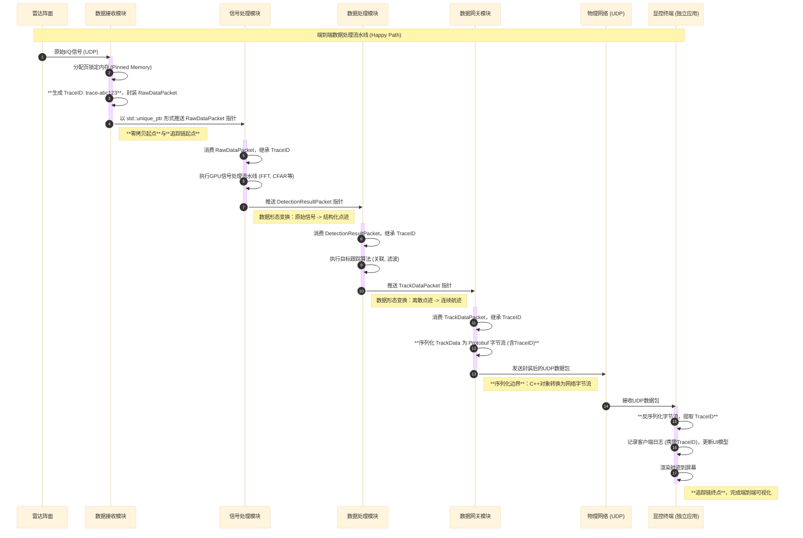
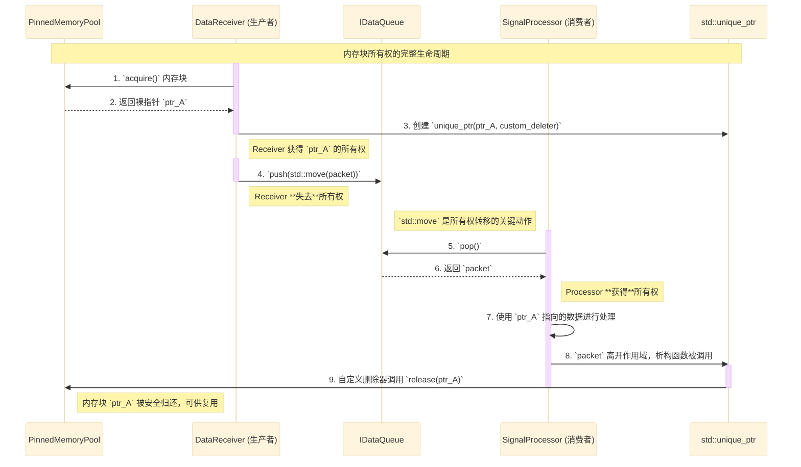
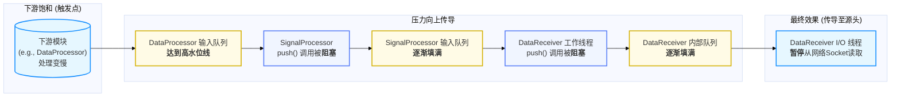

# 数据流设计

  - **当前版本**: v1.0.0
  - **最后更新**: 2025-10-15
  - **负责人**: Klein

-----

## 概述

  - **概要**: 本文件是《00_数据架构总览与原则》的详细实现蓝图，旨在可视化并详细描述一个数据包在系统内部从诞生、处理到离开服务器的完整端到端旅程。它将所有数据面模块的交互串联起来，重点阐述系统如何实现**端到端零拷贝**、**清晰的所有权管理**和**隐式背压**等核心数据架构机制，是理解系统高性能数据面设计的核心文档。

-----

## 目录

- [数据流设计](#数据流设计)
  - [概述](#概述)
  - [目录](#目录)
  - [1 文档职责](#1-文档职责)
    - [1.1 文档目标](#11-文档目标)
    - [1.2 核心原则对齐](#12-核心原则对齐)
  - [2 端到端数据流总览](#2-端到端数据流总览)
    - [2.1 核心处理流水线](#21-核心处理流水线)
    - [2.2 数据旅程详解](#22-数据旅程详解)
  - [3 核心机制深度设计](#3-核心机制深度设计)
    - [3.1 机制一：零拷贝与所有权的生命周期](#31-机制一零拷贝与所有权的生命周期)
      - [3.1.1 核心组件协同](#311-核心组件协同)
      - [3.1.2 所有权转移时序图](#312-所有权转移时序图)
    - [3.2 机制二：流量控制与隐式背压的传导](#32-机制二流量控制与隐式背压的传导)
      - [3.2.1 传导路径分析](#321-传导路径分析)
      - [3.2.2 传导流程图](#322-传导流程图)
    - [3.3 机制三：面向性能的数据布局原理与实践](#33-机制三面向性能的数据布局原理与实践)
      - [3.3.1 `DetectionResult`与SIMD](#331-detectionresult与simd)
      - [3.3.2 `RawIQData`布局与GPU合并访问](#332-rawiqdata布局与gpu合并访问)
  - [4 数据流调试与分析](#4-数据流调试与分析)
    - [4.1 实践案例：利用`TraceID`追踪端到端数据异常](#41-实践案例利用traceid追踪端到端数据异常)
  - [5 术语表](#5-术语表)
  - [6 相关文档](#6-相关文档)
  - [7 变更历史](#7-变更历史)

-----

## 1 文档职责

  - **概要**: 本章定义了本文档自身的“使命”，明确其目标、范围以及设计所遵循的核心架构原则，确保本设计与系统整体架构保持一致。

### 1.1 文档目标

  - **概要**: 本节旨在清晰界定本文档要讲什么、不讲什么，为读者设定正确的预期。
      - **目标**: 本数据流设计旨在成为系统数据架构的**核心实现蓝图**。其核心目标包括：
          - **可视化数据旅程**: 提供一个清晰的、端到端的视图，展示数据在系统内部从诞生、处理到离开服务器的完整生命周期。
          - **深化核心机制**: 详细阐述跨模块的数据协同机制，特别是**零拷贝**、**所有权管理**和**隐式背压**的实现细节。
          - **连接理论与实践**: 作为《00\_数据架构总览与原则》与具体模块设计之间的桥梁，解释“为什么”要如此设计数据结构和交互。
          - **提供调试指南**: 为开发者和运维人员提供利用 `TraceID` 进行端到端问题排查的实践指导。

### 1.2 核心原则对齐

  - **概要**: 本节旨在确保本数据流设计决策与项目已确立的架构原则完全对齐，保证系统整体的一致性。本设计是系统数据架构三大核心原则的直接体现与详细实现：

  - **第一原则：端到端零拷贝**
    本设计将详细展示数据如何在模块间通过传递指针的方式，实现从数据接收到发送前的全程零拷贝。所有核心负载的深拷贝行为都被严格禁止，数据交换必须通过引用或带有所有权的智能指针完成。

  - **第二原则：清晰的所有权与生命周期管理**
    本设计将通过时序图精确描绘数据包（`DataPacket`）的所有权如何通过 `std::unique_ptr` 结合自定义删除器（Custom Deleter）的模式，在模块间进行安全、自动的转移和回收，确保任何动态分配的资源在任何时刻都有且仅有一个明确的所有者。

  - **第三原则：强制的全链路可追踪性**
    本设计将追溯一个 `TraceID` 从在 `DataReceiver` 模块诞生，到封装进 `DataPacket` 头部，再到跨越网络边界被序列化的完整传播路径。这展现了 `TraceID` 作为全链路可观测性核心支柱，在分布式调试中的核心价值。

-----

## 2 端到端数据流总览

  - **概要**: 本章从宏观视角描绘数据流的完整蓝图，将分散在各模块文档中的处理环节串联起来。它以一个数据包的视角，完整地展示了其从物理信号到最终在屏幕上呈现的“Happy Path”全过程。此流程是系统数据面（Data Plane）设计的核心体现，严格遵循单向、分阶段的流水线模型。

### 2.1 核心处理流水线

  - **概要**: 本节使用序列图（Sequence Diagram），精确描绘了数据在系统各模块间的流动、形态变换以及关键元信息（特别是`TraceID`）的传播路径。此图是整个数据面交互的权威视图。

<!-- end list -->



### 2.2 数据旅程详解

  - **概要**: 本节以上述序列图为基础，通过文字分阶段详细描述一个数据包的生命周期，阐明其在每个模块中的核心处理动作和形态变换。

  - **阶段一：数据摄入与上下文创建**

      - **执行者**：`数据接收模块 (DataReceiver)`
      - **核心动作**:
          - 从外部雷达阵面接收原始的UDP I/Q数据流。
          - 调用内部内存管理器，从专为GPU优化的**页锁定内存池 (Pinned Memory Pool)** 中申请一块内存。这是**端到端零拷贝**原则的起点。
          - 为这批数据生成一个全局唯一的 **`TraceID`**。这是**全链路可追踪性**原则的起点。
          - 将原始数据、内存块指针和 `TraceID` 等元信息封装成一个 `RawDataPacket`。
          - 通过 `std::move` 将 `RawDataPacket` 的 `std::unique_ptr` 所有权转移至下游的并发队列中。

  - **阶段二：信号到点迹的变换**

      - **执行者**：`信号处理模块 (SignalProcessor)`
      - **核心动作**:
          - 从上游队列中获取 `RawDataPacket` 的所有权，并继承其 `TraceID`。
          - 利用GPU的并行计算能力，对原始信号执行一系列高强度计算，如快速傅里叶变换(FFT)、恒虚警检测(CFAR)等。
          - 将计算出的高信噪比目标点迹，封装成 `DetectionResultPacket`。
          - 将 `RawDataPacket` 使用的内存块通过其自定义删除器自动归还给内存池，并将新的 `DetectionResultPacket` 指针推送到下游队列。整个过程遵循**数据不可变性**原则，数据经过“变换”而非“修改”。

  - **阶段三：点迹到航迹的聚合**

      - **执行者**：`数据处理模块 (DataProcessor)`
      - **核心动作**:
          - 从上游消费 `DetectionResultPacket`，并继承 `TraceID`。
          - 在CPU上执行复杂的跟踪算法，包括数据关联（将新点迹与现有航迹匹配）、状态估计（如卡尔曼滤波）和航迹生命周期管理。
          - 将更新后的稳定航迹信息封装成 `TrackDataPacket`。
          - 将 `TrackDataPacket` 指针推送到下游队列。

  - **阶段四：数据出口与序列化**

      - **执行者**：`数据网关模块 (DisplayController)`
      - **核心动作**:
          - 从上游消费 `TrackDataPacket`，并继承 `TraceID`。
          - **到达序列化边界**：调用Protobuf库，将内存中的C++ `TrackData` 对象及其 `TraceID` 序列化为紧凑的二进制字节流。这是数据从内部原生格式向外部标准协议转换的关键一步。
          - 通过UDP Socket将序列化后的字节流发送到网络中预先配置好的显控终端地址。

  - **阶段五：外部接收与可视化**

      - **执行者**：`显控终端应用 (ClientApp)`
      - **核心动作**:
          - 独立的客户端应用在其网络线程中监听UDP端口，接收数据包。
          - 对接收到的字节流进行Protobuf反序列化，还原出 `TrackData` 对象和 `TraceID`。
          - **完成追踪闭环**：在记录客户端本地日志时，必须包含接收到的 `TraceID`，从而将一次数据处理的生命周期从服务器延伸至客户端，为端到端问题排查提供了可能。
          - 将航迹数据更新到UI模型，并最终渲染到操作员的屏幕上。

-----

## 3 核心机制深度设计

  - **概要**: 本章是文档的技术核心，旨在针对数据流中那些本质上跨越多个模块、不适合在单一模块文档中完整阐述的系统级机制进行深度剖析。

### 3.1 机制一：零拷贝与所有权的生命周期

  - **概要**: 本节详细拆解系统高性能数据流的基石——端到端零拷贝架构，以及其背后由C++ RAII（资源获取即初始化）机制驱动的所有权自动管理模型。此机制通过“申请-使用-归还”的自动化闭环，从设计上规避了内存拷贝的性能开销与手动内存管理的风险，是系统高性能与内存安全的根本保障。

#### 3.1.1 核心组件协同

  - **概要**: 本节介绍实现零拷贝与自动化生命周期管理的三个核心组件，并阐述它们各自的职责与协同关系。

  - **页锁定内存池 (`Pinned Memory Pool`)**

      - **职责**: 作为系统中所有原始数据缓冲区的**唯一来源**。
      - **实现细节**: 此内存池由 `数据接收模块` 统一管理。它在模块初始化时，预先分配一大块**页锁定内存 (Pinned Memory)**。这种内存的物理地址不会被操作系统交换到磁盘，允许GPU通过直接内存访问（DMA）进行高效、异步的数据传输，是下游 `信号处理模块` 实现高性能计算的关键前提。

  - **`DataPacket`与智能指针 (`DataPacket` & Smart Pointers)**

      - **职责**: 作为承载数据指针并自动化其生命周期的“智能容器”。
      - **实现细节**: 数据包的`payload`字段被定义为 `std::unique_ptr<T, CustomDeleter>`。
          - `std::unique_ptr` 严格实施了**单一所有权**语义，确保任何一个内存块在任何时刻都只有一个管理者，从编译层面防止了悬垂指针和重复释放等问题。
          - **自定义删除器 (`CustomDeleter`)** 是实现自动化回收的核心。当`unique_ptr`生命周期结束时，它不会调用标准的`delete`操作符，而是调用这个自定义删除器，该删除器的逻辑是将内存块安全地“归还”给最初分配它的内存池。

  - **数据通道 (`IDataQueue<T>`)**

      - **职责**: 作为模块间传递数据包所有权的线程安全通道。
      - **实现细节**: `IDataQueue`接口的实现（通常是无锁或有锁的并发队列）负责在生产者和消费者线程之间安全地传递 `std::unique_ptr` 实例。所有权的转移通过C++的移动语义（`std::move`）高效完成，没有任何拷贝开销。

#### 3.1.2 所有权转移时序图

  - **概要**: 本节使用序列图（Sequence Diagram）可视化一个内存块从被申请、在模块间传递、被使用、到最终被自动归还的完整生命周期。此图清晰地展示了所有权如何通过 `std::move` 在不同组件间无缝转移。

<!-- end list -->



### 3.2 机制二：流量控制与隐式背压的传导

  - **概要**: 为防止因下游模块处理能力饱和而导致的数据丢失或内存溢出，系统采用了一套无需中心协调、完全自适应的**隐式背压（Implicit Back-pressure）机制。此机制利用了流水线中有界并发队列**的天然阻塞特性，将处理压力从消费端逐级、安全地反向传导至生产端，是保障系统在极端负载下稳定运行的关键设计。

#### 3.2.1 传导路径分析

  - **概要**: 本节详细描述当系统下游处理能力不足时，阻塞是如何像多米诺骨牌一样，从数据处理流水线的末端逐级反向传导至最前端的网络接收环节。

  - **触发点与传导链**:

    1.  **触发点**: 背压机制的触发点位于数据处理流水线的任意一个环节，其处理速度慢于其上游的生产速度。最常见的情况是下游模块（如`DataProcessor`或`DisplayController`）遇到计算密集型任务导致消费延迟。
    2.  **压力传导**:

        - 当一个消费者模块（例如 `DataProcessor`）的处理速度跟不上生产者模块（`SignalProcessor`）时，连接它们的有界`IDataQueue`会被逐渐填满。
        - 一旦队列已满，生产者（`SignalProcessor`）在调用`push()`方法时将被**阻塞**。
        - `SignalProcessor`的阻塞会导致它停止从其上游（`DataReceiver`）消费数据，进而使其输入队列被动填满。
        - 这个阻塞链条会持续向上游传递，最终传导至`数据接收模块`的内部工作线程。

    3.  **最终效果**: 当`数据接收模块`的所有解析工作线程都被阻塞时，其内部的`RawPacketQueue`将被填满。这最终导致专职的I/O接收线程在尝试向该队列推送新的网络数据包指针时被阻塞，从而**自动地暂停了从网络Socket读取新数据**。此时，处理压力被安全地转移至操作系统内核的网络接收缓冲区，有效防止了应用层面的内存溢出和数据丢失。
    4.  **自动解除**: 一旦下游模块恢复处理能力并开始消费数据，其输入队列出现可用空间，整个阻塞链条便会自动、反向地解除，数据流恢复正常。

  - **背压机制的调优与权衡**:

    背压机制的核心参数是`IDataQueue`的有界队列大小（`capacity`），该配置对系统行为具有重要影响：

    - **大容量队列优势与代价**:
        - **优势**: 能更好地吸收突发流量，提高系统对短时间负载波动的容忍度，减少上游模块被阻塞的频率。
        - **代价**: 可能增加端到端延迟，因为数据包在队列中的停留时间更长。在极端情况下，大队列可能掩盖下游模块的真实处理能力问题。

    - **小容量队列优势与代价**:
        - **优势**: 背压传导更迅速，端到端延迟较低，能快速暴露系统瓶颈，便于性能调优。
        - **代价**: 对流量波动的容忍度较差，可能导致上游更频繁地阻塞，在突发负载下系统吞吐量可能下降。

    - **调优指导**:
        - 对于**延迟敏感**的应用场景，应优先选择较小的队列容量（如16-64个元素）。
        - 对于**吞吐量优先**的应用场景，可适当增加队列容量（如128-512个元素）。
        - 建议通过系统监控指标（队列填充率、端到端延迟）进行动态调优。

#### 3.2.2 传导流程图

  - **概要**: 本节使用流程图（Flowchart）可视化地展示了背压机制从下游向上游的完整传导路径，清晰地描绘了阻塞状态的传递过程。



### 3.3 机制三：面向性能的数据布局原理与实践

  - **概要**: 本节深入探讨**第五数据架构原则：面向性能的内存布局**，旨在连接“数据结构定义”与“模块算法实现”，具体阐释**为什么**核心数据结构要如此设计。通过剖析数据布局如何与底层硬件（CPU的SIMD单元、GPU的内存控制器）协同工作，本节揭示了在软件层面榨干硬件性能、满足计算密集型模块严苛KPI的关键设计决策。

#### 3.3.1 `DetectionResult`与SIMD

  - **概要**: 本节阐述`DetectionResult`结构体的内存对齐规范 如何直接服务于`数据处理模块`中关键算法的向量化计算，从而大幅提升处理性能。

  - **现象**
    在`01_模块接口规范.md`中，`DetectionResult`结构体被强制要求16字节对齐（`alignas(16)`）。

  - **原理与实践**
    - **原因**: `数据处理模块`在执行其核心职责，如数据关联时，需要对包含数千个`DetectionResult`的列表进行批量坐标变换或距离计算。这些操作本质上是数学向量运算。
    - **实现**: 现代CPU支持单指令多数据（SIMD）指令集（如SSE, AVX），允许在单个时钟周期内对多个数据元素（例如，2个`double`或4个`float`）执行相同的操作。然而，为了使编译器能够生成高效的SIMD代码，操作的数据必须在内存中对齐到向量寄存器的边界（通常是16或32字节）。
    - **收益**: 通过`alignas(16)`，我们向编译器保证`DetectionResult`的实例地址是16字节的倍数。这使得在处理`DetectionResult`数组时，编译器可以安全地生成SIMD指令，将多个点迹的计算并行化。相比于逐个处理的标量代码，向量化计算可以将此阶段的性能提升2到4倍，是`数据处理模块`达成其低延迟KPI的关键优化。

#### 3.3.2 `RawIQData`布局与GPU合并访问

  - **概要**: 本节阐述原始I/Q数据的内存布局模式如何与`信号处理模块`中CUDA核函数的内存访问模式相匹配，以触发GPU硬件的**合并内存访问**优化，从而最大化显存带宽利用率。

  - **现象**
    `信号处理模块`消费的原始I/Q数据，其在页锁定内存中的布局被设计为行主序，通常对应于雷达数据立方体的`[通道][脉冲][距离门]`维度。

  - **原理与实践**
    - **原因**: `信号处理模块`的算法流水线第一步通常是沿“距离门 (Range Bins)”维度进行FFT。这意味着计算是按每个脉冲独立进行的。
    - **实现**: GPU的执行模型是SIMT（单指令多线程）。一个Warp（通常为32个线程）内的所有线程同时执行相同的指令。当这些线程访问全局显存时，如果它们访问的地址是连续的、对齐的，GPU的内存控制器可以将这32次独立的访问**合并**为一次或少数几次宽总线事务。这种机制被称为**合并内存访问（Coalesced Memory Access）**。
    - **收益**: `[通道][脉冲][距离门]`的行主序布局，确保了一个脉冲内的所有距离门数据在内存中是**物理连续的**。当`信号处理模块`启动一个1D CUDA Kernel，让每个线程处理一个距离门时，同一个Warp内的32个线程就会自然地访问连续的32个内存位置。这将完美触发合并访问，使得显存带宽利用率接近硬件理论峰值。这是`信号处理模块`达成其高吞-吐量和低延迟KPI的**最重要**的性能优化技巧。反之，如果内存布局不当，导致非合并访问，性能可能会下降一个数量级。

-----

## 4 数据流调试与分析

  - **概要**: 本章提供实践指导，阐述如何利用本数据流设计中内置的全链路可观测性机制，来诊断和分析端到端的复杂数据流问题。理论的健壮性最终体现在其解决实际问题的能力上，本章旨在连接设计与实践。

### 4.1 实践案例：利用`TraceID`追踪端到端数据异常

  - **概要**: 本节通过模拟一个典型的、跨越多个模块乃至跨越网络边界的故障场景——“显控终端未显示预期航迹”，详细描述一名开发者或运维人员如何利用`TraceID`作为“手术刀”，精确、高效地进行全链路问题定位。

  - **故障场景**

      - **现象**: 操作员报告，在特定时间段内，一个已知物理目标（例如，通过其他传感器确认存在）的航迹未能在`显控终端`的态势图上显示。
      - **挑战**: 该问题可能源于数据处理流水线的任何一个环节：从最初的网络接收丢包，到信号处理阶段的检测门限过高，再到数据处理阶段的关联失败，甚至是客户端的渲染逻辑错误。

  - **调试步骤与追溯流程**
    下图展示了利用`TraceID`进行反向追溯的完整流程。

    ```mermaid
    ---
      config:
        theme: base
        flowchart:
          curve: basis
    ---
    flowchart TD
        %% --- 图例 (上下文颜色语义) ---
        %% role_A (浅蓝): 追溯流程的起点/终点
        %% role_D (淡紫): 追溯路径中的核心模块
        %% role_B (浅绿): 关键的调试动作

        subgraph "定位起点 (客户端)"
            A["<b>1.故障现象</b><br/>显控终端未显示航迹"]
            B["<b>2.检查客户端日志</b><br/>grep 故障时间段日志"]
            C["<b>3.识别相关 TraceID</b><br/>从未显示航迹的邻近<br/>正常航迹日志中获取 TraceID"]
        end

        subgraph "反向追踪 (服务器端)"
            D["<b>4.登录服务器</b><br/>执行 grep 'trace-abc123' /var/log/radar/*.log"]
            E["<b>5.分析 DisplayController 日志</b>"]
            F{"是否找到该 TraceID ?"}
            G["<b>6.分析 DataProcessor 日志</b>"]
            H{"航迹是否被生成/过滤?"}
            I["<b>7.分析 SignalProcessor 日志</b>"]
            J{"点迹是否被检测?"}
            K["<b>8.分析 DataReceiver 日志</b>"]
            L{"原始数据包是否接收/有效?"}
        end

        subgraph "根因定位 (结论)"
            M[("<b>9.确定故障环节</b><br/>例如: DataProcessor 中关联门限配置不当")]
        end

        A --> B --> C --> D

        D --> E --> F
        F -- "是" --> G
        F -- "否 (数据未到达网关)" --> G

        G --> H
        H -- "是 (航迹生成但可能被过滤)" --> M
        H -- "否 (数据未形成航迹)" --> I

        I --> J
        J -- "是" --> H
        J -- "否 (信号未形成点迹)" --> K

        K --> L
        L -- "是" --> J
        L -- "否 (数据包从未进入系统)" --> M

        %% --- 标准 classDef 模板 ---
        classDef role_A fill:#e6f7ff,stroke:#1890ff,stroke-width:2px
        classDef role_B fill:#f6ffed,stroke:#52c41a,stroke-width:2px
        classDef role_D fill:#f0f5ff,stroke:#597ef7,stroke-width:2px

        %% --- 样式应用 ---
        class A,M role_A
        class B,C,D,F,H,J,L role_B
        class E,G,I,K role_D

    ```

  - **追溯详解**:

    1.  **定位起点 (客户端)**: 首先，在`显控终端应用`的日志文件中，根据故障发生的时间点，查找相关的日志记录。即使问题航迹不存在，其附近的其他正常航迹日志中也会包含 `TraceID`。选取一个邻近的`TraceID`（例如 `trace-abc123`）作为调查的起点，因为同一批次的数据很可能共享相似的处理路径。

    2.  **反向追踪 (服务器端)**: 登录**核心处理服务器**，使用 `grep` 或日志聚合工具，在所有模块的日志中搜索此 `TraceID`。

        ```bash
        grep "trace-abc123" /var/log/radar/*.log
        ```

        分析搜索结果时，应遵循从下游到上游的顺序：

    3.  **分析`DisplayController`日志**:

          - **若找到日志**: 检查日志是否表明`TrackDataPacket`被成功接收并序列化发送。如果日志存在，说明问题很可能出在客户端的渲染逻辑，而非服务器端。
          - **若未找到日志**: 说明携带此`TraceID`的`TrackDataPacket`从未到达`数据网关模块`。问题在上游。

    4.  **分析`DataProcessor`日志**:

          - **若找到日志**: 检查日志内容。是否因为关联算法门限配置不当，导致点迹未能关联到航迹？是否因为航迹质量过低而被过滤？日志应能明确反映出航迹的生成、更新或丢弃逻辑。这通常是定位“有检测无航迹”问题的关键环节。
          - **若未找到日志**: 说明携带此`TraceID`的`DetectionResultPacket`从未到达`数据处理模块`。问题在上游。

    5.  **分析`SignalProcessor`日志**:

          - **若找到日志**: 检查GPU计算是否成功。CFAR检测的信噪比（SNR）是否过低，导致未能形成有效点迹？日志应记录关键的信号处理参数和结果。
          - **若未找到日志**: 说明携带此`TraceID`的`RawDataPacket`从未到达`信号处理模块`。问题在上游。

    6.  **分析`DataReceiver`日志**:

          - **若找到日志**: 这是`TraceID`的诞生地。检查日志，确认原始UDP包是否被成功接收。是否存在数据包校验和错误、序列号乱序或格式验证失败，导致数据包在进入处理流水线之前就被丢弃？
          - **若未找到日志**: 这表明携带此`TraceID`的数据包（或其原始形态）从未被应用层成功接收。问题可能出在网络层面（防火墙、交换机）或操作系统层面。

    7.  **根因定位**: 通过以上逐级反向排查，可以精确地将问题定位到具体的模块和处理环节。例如，最终可能发现在 `DataProcessor` 的日志中记录了“`Detection with TraceID trace-abc123 dropped due to low confidence`”，从而确定是关联算法的置信度阈值配置不当导致了航迹未能生成。

-----

## 5 术语表

| 术语 / 英文全称 (缩写)            | 定义与说明                                                                                                                                                                                                        |
| :-------------------------------- | :---------------------------------------------------------------------------------------------------------------------------------------------------------------------------------------------------------------- |
| **零拷贝 (Zero-Copy)**            | 一种关键的性能优化技术，指数据在处理管道中流转时，CPU不执行任何内存内容的深拷贝，而是通过传递指针或引用来完成模块间的数据交换。本系统通过传递指向共享内存块的智能指针来实现。                                     |
| **所有权 (Ownership)**            | C++ RAII编程范式中的核心概念，指一个对象对一块动态分配的资源（如内存）负有释放责任的“权利”。本系统利用 `std::unique_ptr` 确保任何内存块在任何时刻都有且仅有一个明确的所有者，从而从设计上杜绝内存泄漏和重复释放。 |
| **页锁定内存 (Pinned Memory)**    | 一种特殊的系统内存，其物理地址被“锁定”在RAM中，不会被操作系统交换到磁盘。这使得GPU等硬件设备可以通过直接内存访问（DMA）高效、异步地从中读写数据，是实现高性能CPU-GPU数据传输的关键前提。                          |
| **自定义删除器 (Custom Deleter)** | 一个可与C++智能指针（如`std::unique_ptr`）绑定的函数对象。在本设计中，它用于自定义资源释放时的操作，确保当数据包生命周期结束时，其占用的内存块不是被`delete`，而是被安全地“归还”给最初分配它的内存池。            |
| **背压 (Back-pressure)**          | 在数据流系统中，一种由下游向上游传递的、自然的流量控制机制。当消费者处理能力饱和时，其输入队列被填满，导致生产者在尝试推送数据时被阻塞，压力逐级反向传播，从而使整个流水线自动适应最慢环节的处理速度。            |
| **数据面 (Data Plane)**           | 系统中专门负责处理高速、大容量业务数据流的部分，与负责管理、协调和控制的“控制面”相对。本系统的数据面由`DataReceiver`、`SignalProcessor`、`DataProcessor`等模块组成的数据处理流水线构成。                          |

-----

## 6 相关文档

- **核心模块设计文档**

  - 必须参考 [01\_数据接收模块设计.md](../02_模块设计/01_数据接收模块设计.md) - 系统数据入口的详细设计
  - 必须参考 [02\_信号处理模块设计.md](../02_模块设计/02_信号处理模块设计.md) - GPU加速信号处理的核心设计
  - 必须参考 [03\_数据处理模块设计.md](../02_模块设计/03_数据处理模块设计.md) - 点迹处理与航迹生成的详细设计
  - 必须参考 [04\_数据网关模块设计.md](../02_模块设计/04_数据网关模块设计.md) - 外部接口与数据推送的设计
  - 必须参考 [05\_任务调度器设计.md](../02_模块设计/05_任务调度器设计.md) - 系统"大脑"的协调机制设计
  - 必须参考 [06\_配置管理模块设计.md](../02_模块设计/06_配置管理模块设计.md) - 配置中枢与热更新机制设计
  - 必须参考 [07\_日志服务设计.md](../02_模块设计/07_日志服务设计.md) - 结构化日志与可观测性基础设计
  - 必须参考 [08\_监控服务设计.md](../02_模块设计/08_监控服务设计.md) - 性能监控与告警机制设计
  - 必须参考 [09\_显控终端应用设计.md](../02_模块设计/09_显控终端应用设计.md) - 前端渲染与交互的设计

- **架构与规范文档**

  - 建议参考 [00\_数据架构总览与原则.md](00_数据架构总览与原则.md) - 数据架构的顶层指导纲领
  - 建议参考 [../05\_接口设计/00\_接口设计总览.md](../05_接口设计/00_接口设计总览.md) - 系统接口设计的顶层视图
  - 建议参考 [../05\_接口设计/01\_模块接口规范.md](../05_接口设计/01_模块接口规范.md) - 模块接口的标准化规范

- **顶层设计文档**

  - 详见 [99\_模块集成策略.md](../02_模块设计/99_模块集成策略.md) - 系统集成的“粘合剂”与“协调宪章”

-----

## 7 变更历史

  - **概要**: 本章记录了本文档自创建以来的所有重要修订历史，是文档版本管理和追溯变更的关键。

| 版本号 | 日期       | 作者  | 变更描述                                                                                                                                   |
| :----- | :--------- | :---- | :----------------------------------------------------------------------------------------------------------------------------------------- |
| v1.0.0 | 2025-10-15 | Klein | **初始版本创建**: 基于“整合并深化”策略及标准模板，确立了以数据旅程为主线的文档结构，并规划了对零拷贝、背压和性能布局等核心机制的深度设计。 |
