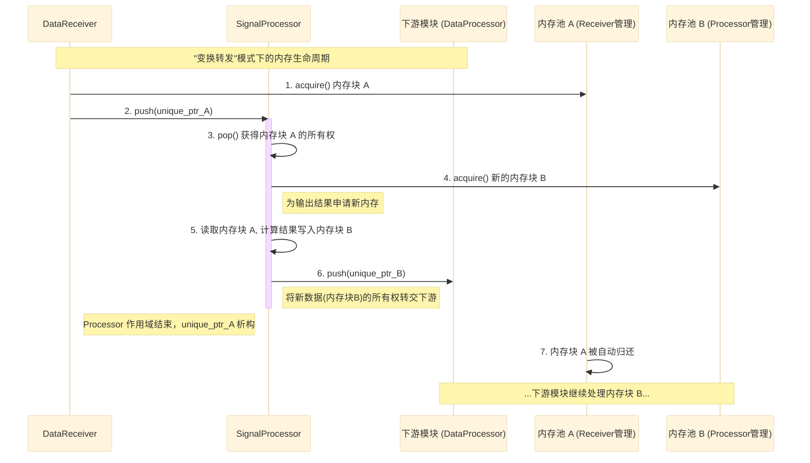

# 内存管理与所有权

  - **当前版本**: v1.0.0
  - **最后更新**: 2025-10-15
  - **负责人**: Klein

-----

## 概述

  - **概要**: 本文件是数据架构系列中技术性最强、最深入底层的核心文档之一。它作为数据架构“第一原则：端到端零拷贝”和“第二原则：清晰的所有权与生命周期管理”的**权威实现蓝图** [00_数据架构总览与原则.md](00_数据架构总览与原则.md)，详细阐述了系统高性能数据面背后的内存管理策略、所有权转移模型和数据交换机制。

-----

## 目录

- [内存管理与所有权](#内存管理与所有权)
  - [概述](#概述)
  - [目录](#目录)
  - [1 文档职责](#1-文档职责)
    - [1.1 文档目标](#11-文档目标)
    - [1.2 核心原则对齐](#12-核心原则对齐)
  - [2 统一内存池设计](#2-统一内存池设计)
    - [2.1 设计目标与职责](#21-设计目标与职责)
    - [2.2 核心实现：页锁定内存](#22-核心实现页锁定内存)
    - [2.3 接口定义 (`IMemoryPool`)](#23-接口定义-imemorypool)
  - [3 所有权模型与自动化回收](#3-所有权模型与自动化回收)
    - [3.1 核心机制：`std::unique_ptr`与自定义删除器](#31-核心机制stdunique_ptr与自定义删除器)
    - [3.2 所有权转移：`std::move`语义的应用](#32-所有权转移stdmove语义的应用)
  - [4 “变换转发”模式的内存流](#4-变换转发模式的内存流)
    - [4.1 设计模式阐述](#41-设计模式阐述)
    - [4.2 内存流转图](#42-内存流转图)
  - [5 缓冲区接口与背压机制](#5-缓冲区接口与背压机制)
    - [5.1 接口契约 (`IDataQueue<T>`)](#51-接口契约-idataqueuet)
    - [5.2 背压机制的调优与权衡](#52-背压机制的调优与权衡)
  - [6 术语表](#6-术语表)
  - [7 相关文档](#7-相关文档)
  - [8 变更历史](#8-变更历史)

-----

## 1 文档职责

  - **概要**: 本章定义了本文档自身的“使命”，明确其目标、范围以及设计所遵循的核心架构原则，确保本设计与系统整体架构保持一致。

### 1.1 文档目标

  - **概要**: 本节旨在清晰界定本文档要讲什么、不讲什么，为读者设定正确的预期。
    - **目标**: 本文档旨在成为数据架构“第一原则：端到端零拷贝”和“第二原则：清晰的所有权与生命周期管理”的**权威实现蓝图**。其核心目标包括：
      - 详细阐述**页锁定内存池**的设计原理、接口及其在优化GPU数据传输中的核心作用。
      - 精确定义基于`std::unique_ptr`和**自定义删除器 (Custom Deleter)** 的自动化所有权管理模型，并提供其C++概念性实现。
      - 可视化地展示**“变换转发 (Transform-and-Forward)”**模式下的内存申请与释放流程，阐明数据不可变性原则在零拷贝架构下的具体实践。
      - 深入解释`IDataQueue<T>`接口的阻塞行为如何构成**隐式背压**机制，并讨论其调优策略。

### 1.2 核心原则对齐

  - **概要**: 本节旨在确保本文档所有设计决策都与项目已确立的架构原则完全对齐。

| 核心原则 | 在本设计中的具体体现 |
| :--- | :--- |
| **第一原则：端到端零拷贝** | 本文档的核心内容——内存池与所有权模型，正是为了实现这一最高性能指令而设计的技术基石。它详细阐述了数据如何通过指针在内部模块间传递，从而避免了任何昂贵的内存深拷贝。 |
| **第二原则：清晰的所有权** | `std::unique_ptr`与自定义删除器的结合，是本原则在C++ RAII范式下的权威、零开销实现。本文档将深入这一机制，确保任何动态分配的内存资源在任何时刻都有且仅有一个明确的所有者，并能被自动、安全地回收。 |
| **第四原则：数据不可变性** | “变换转发”模式一节将详细阐述此原则如何在零拷贝架构下，通过为输出申请新内存而非在原地修改输入内存来实现，从而在设计上规避共享可变状态，保障高并发环境下的数据安全。|

-----

## 2 统一内存池设计

  - **概要**: 本章详细设计作为所有原始数据缓冲区来源的 `PinnedMemoryPool`，它是零拷贝数据流的起点和终点。其核心职责是预先分配并管理一大块专为GPU优化的**页锁定内存**，从而消除运行时动态内存分配的开销，并为整个数据处理流水线的高性能奠定基础。

### 2.1 设计目标与职责

  - **概要**: 本节阐述内存池的设计目标，包括消除运行时`new/delete`开销、集中管理内存资源、以及为GPU DMA优化提供基础。
      - **消除运行时开销**: 在高吞吐量系统中，频繁的`new/delete`调用会带来不可预测的延迟和内存碎片。通过预分配一大块连续内存并从中“借出”内存块，内存池将动态分配的成本平摊到系统启动阶段，确保了数据处理热路径上的性能确定性。
      - **集中化资源管理**: 内存池由`数据接收模块`统一创建和管理，作为单一的内存分配来源。这使得系统对内存的使用情况（如总量、利用率）变得清晰、可控、可监控。
      - **为GPU DMA优化**: 内存池的核心使命是提供**页锁定内存**，这是实现高效异步CPU-GPU数据传输的关键前提，直接服务于**第一原则：端到端零拷贝**。

### 2.2 核心实现：页锁定内存

  - **概要**: 本节深入解释**为什么**必须使用页锁定内存，并阐明其如何使GPU能够通过直接内存访问（DMA）进行异步、高效的数据传输。
      - **工作原理**:
          - 标准的、可分页的（Pageable）内存可以被操作系统自由地在物理RAM和磁盘虚拟内存之间移动。当GPU尝试访问一块已被移出的内存时，会引发严重错误或性能骤降。
          - \*\*页锁定内存（Pinned Memory）\*\*通过操作系统API，将其物理地址“锁定”在RAM中，保证它绝不会被交换到磁盘。
      - **设计收益**:
          - **启用异步DMA**: 只有当源内存是页锁定时，GPU才能通过直接内存访问（DMA）引擎，在**不占用CPU**的情况下，**异步地**执行`cudaMemcpyAsync`操作。
          - **最大化传输带宽**: DMA传输的带宽远高于通过CPU中转的拷贝，这是满足`信号处理模块`高吞吐量KPI的关键。
          - **实现计算与传输重叠**: 异步DMA使得数据从CPU到GPU的传输可以与GPU上正在执行的其他计算任务（通过不同的CUDA流）并行进行，从而掩盖数据传输延迟，最大化GPU利用率。

### 2.3 接口定义 (`IMemoryPool`)

  - **概要**: 本节提供内存池核心接口的C++概念性定义，该接口封装了内存块的申请与归还操作，并规定了其必须保证线程安全。

    ```cpp
    // 概念性定义，非完整头文件

    #include <cstddef> // for size_t
    #include <cstdint> // for uint8_t

    /**
     * @brief 统一内存池的抽象接口。
     * @details 其实现必须是线程安全的，以支持在不同线程中申请和归还内存。
     */
    class IMemoryPool {
    public:
        virtual ~IMemoryPool() = default;

        /**
         * @brief 从池中申请一个固定大小的内存块。
         * @details 此方法应为阻塞式。如果池中暂时没有可用内存块，
         * 它将等待直到有内存块被归还。
         * @return uint8_t* 指向可用内存块起始地址的裸指针。
         */
        virtual uint8_t* acquire() = 0;

        /**
         * @brief 将一个内存块归还给池。
         * @details 此方法由智能指针的自定义删除器自动调用。
         * @param block_ptr 指向要归还的内存块的指针。
         */
        virtual void release(uint8_t* block_ptr) = 0;

        /**
         * @brief 获取池中单个内存块的大小（字节）。
         */
        virtual size_t getBlockSize() const noexcept = 0;

        /**
         * @brief 获取池中当前可用的内存块数量。
         * @details 主要用于监控和调试。
         */
        virtual size_t getAvailableBlocks() const = 0;
    };
    ```

-----

## 3 所有权模型与自动化回收

  - **概要**: 本章是实现**第二原则：清晰的所有权与生命周期管理**的技术核心。它详细阐述了系统如何利用C++的现代特性，构建一个自动化、零开销且从设计上杜绝内存错误的所有权管理模型。此模型是保障系统长期稳定运行和简化并发编程的基石。

### 3.1 核心机制：`std::unique_ptr`与自定义删除器

  - **概要**: 本节详细阐述`std::unique_ptr`的选用理由，并提供`MemoryPoolDeleter`结构体的C++概念性定义，解释其如何与内存池协作，实现资源的自动化回收。

  - **`std::unique_ptr`的选用理由**

      - **单一所有权**: `std::unique_ptr`在编译期强制实施了资源的**单一所有权**语义。它不可拷贝，只能被“移动”（`std::move`），这从C++语言层面根除了悬垂指针、重复释放等经典内存管理问题。
      - **零运行时开销**: 与`std::shared_ptr`不同，当不使用自定义删除器时，`std::unique_ptr`的大小与裸指针完全相同，其方法调用（如`get()`, `release()`, `reset()`）会被编译器内联，不会带来任何额外的运行时性能开销。
      - **自动化回收 (RAII)**: `std::unique_ptr`是RAII范式的完美体现。当其离开作用域时，其析构函数会自动调用所管理资源的删除逻辑，确保资源在任何情况下（包括异常抛出）都能被正确释放。

  - **自定义删除器 (`CustomDeleter`) 的实现**

      - **职责**: 自定义删除器的核心职责是**重载**智能指针的默认删除行为（即调用`delete`），将其替换为将内存块“归还”给内存池的`release()`操作。
      - **C++ 概念性定义**:
        ```cpp
        // 概念性定义，非完整头文件
        #include <memory> // For std::unique_ptr

        // 前向声明内存池接口
        class IMemoryPool;

        /**
         * @brief 用于 unique_ptr 的自定义删除器，负责将内存块归还给内存池。
         */
        struct MemoryPoolDeleter {
            // 成员变量，持有其所属内存池的指针
            IMemoryPool* pool_;

            // 构造函数
            explicit MemoryPoolDeleter(IMemoryPool* pool = nullptr) : pool_(pool) {}

            /**
             * @brief 重载函数调用操作符。
             * @details 当 unique_ptr 被销毁时，此方法会被自动调用。
             * @param ptr 指向要被归还的内存块的裸指针。
             */
            void operator()(uint8_t* ptr) const {
                if (pool_ && ptr) {
                    pool_->release(ptr);
                }
            }
        };

        // 使用示例：定义一个管理内存池中内存块的 unique_ptr 类型
        using PooledMemoryBlock = std::unique_ptr<uint8_t[], MemoryPoolDeleter>;
        ```
      - **设计说明**: `MemoryPoolDeleter`是一个轻量级的函数对象（functor）。通过在其内部包含一个指向`IMemoryPool`的指针，使得`std::unique_ptr`成为一个“胖指针”（大小为两个指针）。这虽然略微增加了智能指针自身的大小，但换来的是在任何地方、任何时间，当`unique_ptr`生命周期结束时，都能准确地将内存归还给其正确的来源内存池，实现了完全自动化和上下文无关的资源回收。

### 3.2 所有权转移：`std::move`语义的应用

  - **概要**: 本节明确指出`std::move`是所有权在`IDataQueue`中进行无开销转移的关键操作，并解释其如何避免拷贝构造，保证了零拷贝数据流的高性能。
  - **工作原理**:
      - `std::move`本身不执行任何代码，它仅仅是一个**类型转换**操作，将其参数强制转换为一个右值引用（rvalue reference）。
      - 当一个持有资源的`std::unique_ptr`被`std::move`后，它就可以被用于调用`std::unique_ptr`的**移动构造函数 (move constructor)** 或 **移动赋值运算符 (move assignment operator)**。
      - 在移动操作中，新的`unique_ptr`实例会“窃取”原始`unique_ptr`实例内部的裸指针，并将原始实例的裸指针设置为`nullptr`。这个过程只涉及几个指针的赋值，不涉及任何底层数据的拷贝。
  - **在数据流中的应用**:
    ```cpp
    // 概念性代码
    void DataReceiver::produceData() {
        // 1. 从内存池获取内存块，并创建持有所有权的 unique_ptr
        uint8_t* block = memory_pool_->acquire();
        PooledMemoryBlock data_packet(block, MemoryPoolDeleter(memory_pool_));

        // ... 填充数据到 data_packet ...

        // 2. 使用 std::move 转移所有权
        // 调用下游队列的 push 方法，该方法参数类型应为 PooledMemoryBlock&&
        // 或按值传递 PooledMemoryBlock 以触发移动构造
        downstream_queue_->push(std::move(data_packet));

        // 3. 此后，data_packet 内部指针为 nullptr，Receiver 不再拥有该内存块
        // 所有权已安全、高效地转移到队列中
        assert(data_packet.get() == nullptr);
    }
    ```

-----

## 4 “变换转发”模式的内存流

  - **概要**: 本章深入阐述**第四原则：数据不可变性** 是如何在严格的零拷贝和所有权模型下具体实现的。通过“变换转发 (Transform-and-Forward)”模式，模块将输入数据视为只读，并将计算结果写入一块全新的内存中。此模式通过消除共享可变状态，从设计上规避了绝大多数复杂的并发问题，是保障系统鲁棒性和简化并发逻辑的关键。

### 4.1 设计模式阐述

  - **概要**: 本节通过一个具体场景（`信号处理模块`的处理流程），详细描述“变换转发”模式的完整内存申请与释放流程，阐明数据不可变性原则在实践中的应用。
  - **工作流程**:
    当一个模块（如`信号处理模块`）执行其计算任务时，它遵循以下步骤，确保输入数据的完整性不受侵犯：
    1.  **消费输入**: 模块从其上游`IDataQueue`中消费一个`RawDataPacket`，从而获得其`payload`中内存块 A 的所有权。
    2.  **申请输出内存**: 模块**不会在内存块 A 上进行任何修改**。相反，它会根据其计算结果的大小，向**自己的**或一个全局的内存池申请一块**新的**内存块 B，用于存放处理后的`DetectionResult`。
    3.  **执行变换**: 模块读取内存块 A 的内容，执行其核心算法（如FFT、CFAR），并将最终结果写入全新的内存块 B。
    4.  **转发输出**: `信号处理模块`创建一个新的`DetectionResultPacket`，其`payload`持有了内存块 B 的所有权，然后将此新数据包推送到下游模块的`IDataQueue`中。
    5.  **自动回收输入**: 当`信号处理模块`的处理函数作用域结束时，它持有的`RawDataPacket`智能指针被析构。其关联的自定义删除器会自动被调用，将最初的内存块 A 安全地归还给`数据接收模块`的内存池。

### 4.2 内存流转图

  - **概要**: 本节使用序列图（Sequence Diagram）可视化“变换转发”模式下的内存申请、使用和释放的完整时序，清晰地展示了输入和输出内存块各自独立的生命周期。

<!-- end list -->



-----

## 5 缓冲区接口与背压机制

  - **概要**: 本章从接口和实现的深层角度，详细阐述模块间数据通道的设计及其如何构成系统的流量控制机制。它解释了数据通道的接口契约如何从根本上保障了隐式背压的实现，并为系统性能调优提供了理论指导。

### 5.1 接口契约 (`IDataQueue<T>`)

  - **概要**: `IDataQueue<T>`是连接上下游模块的数据通道的抽象接口。它的核心契约是作为一个**有界的、线程安全的并发队列**，其`push`操作在队列满时的**阻塞行为**是实现隐式背压的根本。
  - **核心行为**:
    - **有界性 (Bounded)**: 队列必须有一个明确的最大容量。这个容量限制了在任何时刻，模块间可以存在的“在途”数据量，是防止内存无限增长的防火墙。
    - **阻塞式生产 (Blocking Production)**: 当生产者模块尝试向一个已满的队列`push`数据时，其调用线程必须被阻塞，直到队列中至少有一个空位被消费者腾出。正是这个行为，将下游的处理压力反向传导给了上游。
    - **线程安全 (Thread-Safe)**: 接口的所有实现都必须保证其操作（`push`, `pop`等）是线程安全的，允许生产者和消费者在不同的线程中无锁或有锁地安全操作。

### 5.2 背压机制的调优与权衡

  - **概要**: 本节为系统性能调优提供理论指导，讨论队列容量（`capacity`）对系统**延迟 (Latency)**与**吞吐量 (Throughput)**之间的权衡关系。
  - **调优参数**: 系统中每个`IDataQueue`实例的容量，是控制背压行为和流水线性能的关键可调参数。
  - **权衡分析**:
    - **大容量队列 (Large Capacity)**:
      - **优点**: 能够更好地**吸收突发流量**。当上游短时间内产生大量数据时，大队列可以作为有效的缓冲区，避免上游被立即阻塞，从而维持较高的整体吞吐量。
      - **缺点**: 可能**增加端到端的平均延迟**。数据在队列中“排队”等待的时间更长，导致从数据进入系统到最终被处理的整体时延增加。此外，也会占用更多的内存。
    - **小容量队列 (Small Capacity)**:
      - **优点**: 背压传导更迅速，数据在队列中的停留时间极短，从而**降低了端到端延迟**。内存占用也更少。
      - **缺点**: 对流量波动的**容忍度较差**。即使是短暂的下游处理抖动，也可能迅速填满队列，导致上游模块被频繁地、短暂地阻塞，可能会对整体吞吐量产生轻微影响。
  - **调优建议**:
    - 在追求**最低延迟**的场景中，应选择较小的队列容量。
    - 在追求**最高吞吐量**和需要应对不均匀数据输入的场景中，应选择较大的队列容量。
    - 最佳容量通常需要在实际负载测试中，通过观察各模块的阻塞情况和端到端延迟指标来动态调整，以达到延迟与吞吐量之间的最佳平衡。

-----

## 6 术语表

| 术语 / 英文全称 (缩写) | 定义与说明 |
| :--- | :--- |
| **RAII (Resource Acquisition Is Initialization)** | “资源获取即初始化”，一种C++编程范式，将资源的生命周期与对象的生命周期绑定，通过构造函数获取资源，通过析构函数释放资源，以实现自动化、异常安全的资源管理。 |
| **移动语义 (Move Semantics)** | C++11引入的语言特性，其核心是`std::move`。它允许将资源的所有权从一个对象“移动”到另一个对象，而无需进行昂贵的深拷贝。这是实现`std::unique_ptr`高效所有权转移的关键，也是本系统零拷贝数据流的基石。 |
| **DMA (Direct Memory Access)** | 直接内存访问，一种硬件特性，允许外设（如GPU）在不占用CPU的情况下，直接读写系统主存。**页锁定内存**是GPU能够发起高效异步DMA操作的前提。 |

-----

## 7 相关文档

  - **数据架构系列**:
      - `00_数据架构总览与原则.md`
      - `01_数据流设计.md`
      - `02_核心数据结构.md`
  - **核心模块**:
      - `01_数据接收模块设计.md`
      - `02_信号处理模块设计.md`
  - **核心接口**:
      - `01_模块接口规范.md`

-----

## 8 变更历史

| 版本号 | 日期 | 作者 | 变更描述 |
| :--- | :--- | :--- | :--- |
| v1.0.0 | 2025-10-15 | Klein | **初始版本创建**: 确立了以内存池、所有权模型、变换转发和背压机制为核心的文档结构，旨在深入阐述零拷贝架构的底层实现原理。 |
