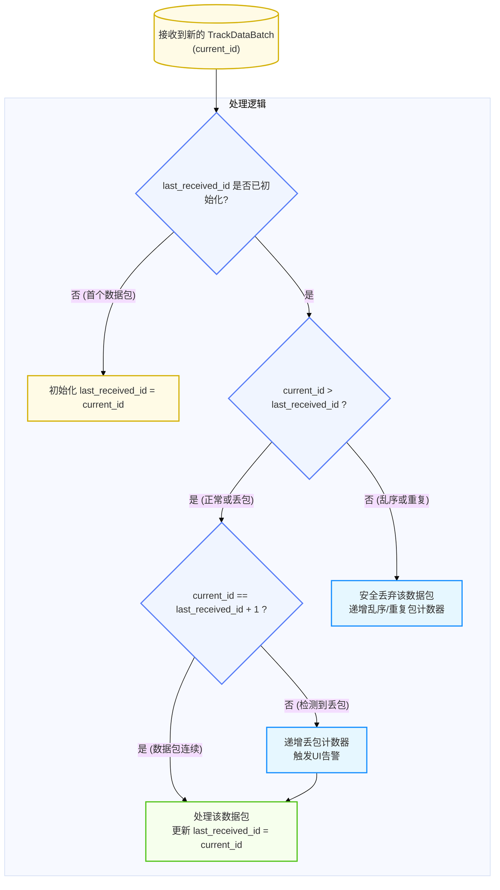

# 数据完整性与可靠性

  - **当前版本**: v1.0.0
  - **最后更新**: 2025-10-15
  - **负责人**: Klein

-----

## 概述

  - **概要**: 本文件是数据架构的“**质量保障手册**”和“**保险单**”。它的核心职责是，在系统选择了以性能优先的UDP协议作为数据面传输方式后，定义一套应用层的机制，来弥补其固有的不可靠性，确保数据的完整性（Integrity）和一定程度的可靠性（Reliability）。本文档为`显控终端应用`实现“网络丢包容忍度”KPI提供了具体的技术实现路径。

-----

## 目录

- [数据完整性与可靠性](#数据完整性与可靠性)
  - [概述](#概述)
  - [目录](#目录)
  - [1 文档职责](#1-文档职责)
    - [1.1 文档目标](#11-文档目标)
    - [1.2 核心原则对齐](#12-核心原则对齐)
  - [2 丢包检测：序列号机制](#2-丢包检测序列号机制)
    - [2.1 职责定义](#21-职责定义)
    - [2.2 客户端实现逻辑](#22-客户端实现逻辑)
    - [2.3 边界情况处理](#23-边界情况处理)
  - [3 数据损坏检测：校验和机制](#3-数据损坏检测校验和机制)
    - [3.1 需求分析](#31-需求分析)
    - [3.2 技术选型](#32-技术选型)
    - [3.3 协议扩展 (`.proto`)](#33-协议扩展-proto)
    - [3.4 实现指南](#34-实现指南)
  - [4 未来演进：可靠性增强策略](#4-未来演进可靠性增强策略)
    - [4.1 场景分析](#41-场景分析)
    - [4.2 NACK机制概念设计](#42-nack机制概念设计)
    - [4.3 复杂性与声明](#43-复杂性与声明)
  - [5 客户端网络质量上报机制](#5-客户端网络质量上报机制)
    - [5.1 上报机制](#51-上报机制)
    - [5.2 服务器端职责](#52-服务器端职责)
  - [6 术语表](#6-术语表)
  - [7 相关文档](#7-相关文档)
  - [8 变更历史](#8-变更历史)

-----

## 1 文档职责

  - **概要**: 本章定义了本文档自身的“使命”，明确其目标、范围以及设计所遵循的核心架构原则，确保本设计与系统整体架构保持一致。

### 1.1 文档目标

  - **概要**: 本节旨在清晰界定本文档要讲什么、不讲什么，为读者设定正确的预期。
      - **目标**:
          - 详细阐述基于`batch_sequence_id`的**应用层丢包检测机制**的服务器端生成与客户端检测逻辑。
          - 设计并引入一种**端到端应用层校验和机制**（如CRC32c），以保障数据在传输过程中免于损坏。
          - 为未来可能需要的更高可靠性传输（如NACK重传）提供**前瞻性的概念设计**和技术储备。

### 1.2 核心原则对齐

  - **概要**: 本节旨在确保本文档所有设计决策都与项目已确立的架构原则完全对齐。

| 核心原则           | 在本设计中的具体体现                                                                                                                                                              |
| :----------------- | :-------------------------------------------------------------------------------------------------------------------------------------------------------------------------------- |
| **数据与控制分离** | 本文档定义的可靠性机制（序列号、校验和）完全封装在**数据面**的`TrackDataBatch`消息中。未来规划的NACK重传请求，则明确通过**控制面**的RESTful API发起，严格遵循了两平面的职责划分。 |
| **全链路可观测性** | 客户端在检测到丢包或校验和错误时，**必须**记录包含源IP、端口等上下文信息的日志。这些日志与服务器端的`TraceID`日志相结合，为网络问题的端到端诊断提供了关键数据。                   |
| **接口驱动开发**   | 本文档对`track_data.proto`的扩展（如增加`checksum`字段），是对服务器与客户端之间**数据契约**的正式修订。双方的实现都必须以此为依据，确保接口的明确性和一致性。                    |

-----

## 2 丢包检测：序列号机制

  - **概要**: 本章是文档的核心和基础，详细阐述已在系统中设计的`batch_sequence_id`机制，它是客户端实现UDP丢包检测的唯一依据。此机制通过在应用层嵌入一个单调递增的计数器，使得本身不可靠的UDP传输具备了可观测的数据连续性，是保障数据流完整性的第一道防线。

### 2.1 职责定义

  - **概要**: 本节明确服务器端与客户端在序列号机制中的各自职责，确保契约的清晰分离。
      - **服务器端 (`DisplayController`)**:
          - **职责**: **必须**在发送每个`TrackDataBatch`之前，为其分配一个全局单调递增的`uint64`序列号，并将其填充到`batch_sequence_id`字段中。
          - **实现**: 此计数器应在`数据网关模块`内部作为原子变量进行维护，以保证其在未来的多线程扩展中的线程安全性。
      - **客户端 (`ClientApp`)**:
          - **职责**: **必须**负责检测`batch_sequence_id`的间隙，并据此判断是否发生了数据包丢失。
          - **实现**: 客户端的网络服务组件需要维护一个状态变量，用于存储上一帧成功接收的序列号，以便与新到达的数据包进行比较。

### 2.2 客户端实现逻辑

  - **概要**: 本节使用流程图和文字描述，清晰地定义了客户端在接收到`TrackDataBatch`后，进行丢包检测与乱序处理的标准逻辑。

<!-- end list -->



  - **实现步骤**:
    1.  客户端网络服务内部维护一个状态变量，例如 `uint64_t last_received_id`，并将其初始化为一个特殊值（如0或`std::nullopt`）。
    2.  当收到一个新的`TrackDataBatch`时，获取其`batch_sequence_id`作为`current_id`。
    3.  **判断逻辑**:
    <!-- end list -->
      - **首个包**: 如果`last_received_id`尚未初始化，则将其设置为`current_id`，并正常处理该数据包。
      - **乱序/重复包**: 如果`current_id <= last_received_id`，则认为这是一个乱序到达的旧数据包或重复包。客户端应**安全地丢弃**该包，并可选择性地递增一个用于监控的“乱序/重复包”计数器。
      - **正常/丢包**: 如果`current_id > last_received_id`：
          - **连续包**: 若`current_id == last_received_id + 1`，则数据包是连续的。正常处理该数据包，然后更新`last_received_id = current_id`。
          - **发生丢包**: 若`current_id > last_received_id + 1`，则表明丢失了 `(current_id - last_received_id - 1)` 个数据包。客户端此时**必须**：
              - 递增一个用于监控的“丢包计数器”。
              - 触发UI状态更新，向操作员提示“数据流不完整”或类似告警，以满足“网络丢包容忍度”KPI的要求。
              - 正常处理**当前**这个数据包，然后更新`last_received_id = current_id`，以从新的序列号基准继续检测。

### 2.3 边界情况处理

  - **概要**: 本节讨论在实现序列号检测时需要考虑的边界情况，以体现设计的严谨性。
      - **客户端首次启动/重连**: 客户端首次启动或从长时间断线中恢复时，它收到的第一个包的`batch_sequence_id`可以是任意值。`2.2`节中的“首个数据包”逻辑已经覆盖了这种情况，即无条件接受第一个包并将其序列号作为新的基准。
      - **`uint64`序列号回绕 (Wrap-around)**: `batch_sequence_id`被定义为`uint64`类型，其最大值约为1.8 x 10^19。即使在极高的发送速率（例如每秒100,000个包）下，也需要超过5800年的时间才会发生回绕。因此，在系统的可预见生命周期内，**无需**为序列号回绕问题设计任何特殊处理逻辑。提及此点是为了表明已对此极限情况进行了评估。

-----

## 3 数据损坏检测：校验和机制

  - **概要**: 本章引入一种端到端的应用层校验和机制，作为数据完整性的最后一道防线。在序列号机制保障了数据包的顺序性和完整性的基础上，校验和机制旨在确保每个独立数据包的内容在从服务器内存到客户端内存的传输过程中，未发生任何比特位的损坏。这是保障数据精确、可靠呈现的关键补充。

### 3.1 需求分析

  - **概要**: 本节解释**为什么**在UDP协议之上，仍有必要引入一个应用层的校验和机制，以体现设计的严谨性和鲁棒性。
      - **UDP校验和的局限性**:
          - **可选性**: 在IPv4协议下，UDP头部的校验和字段是可选的。虽然现代操作系统默认都会计算，但不能保证网络路径上的所有设备都会保留或正确处理它。
          - **覆盖范围有限**: UDP校验和只覆盖UDP头部和数据负载，不覆盖IP头部。在网络传输中，数据包可能会经过路由器等中间设备，存在极小概率下IP头部信息被错误修改而UDP校验和依然正确的情况。
          - **“伪头部”问题**: UDP校验和的计算包含了一个“伪头部”（包含源/目IP地址等），如果中间网络设备（如NAT网关）修改了IP地址而未能正确重新计算校验和，可能会导致数据包被接收端丢弃。
      - **应用层校验和的价值**:
          - **端到端保障**: 一个在`数据网关模块`生成、在`显控终端应用`验证的应用层校验和，提供了真正的**端到端（End-to-End）完整性保障**。它确保了数据从离开服务器应用内存到进入客户端应用内存的整个过程都是完整的，不受中间任何网络设备行为的影响。
          - **明确的故障域**: 如果应用层校验失败，可以100%确定问题出在数据传输链路或服务器/客户端的编解码环节，极大地缩小了故障排查范围。

### 3.2 技术选型

  - **概要**: 本节对校验和算法进行选型，并阐明选择CRC32c的理由，重点在于性能与工业标准之间的平衡。
  - **算法选型**: **CRC32c (Castagnoli)**
  - **选型理由**:
      - **高性能**: 相比于其他校验和算法（如Adler-32或传统的CRC32），CRC32c在现代CPU（如Intel SSE4.2及之后、ARMv8）上拥有**硬件指令加速**。这意味着其计算开销极低，在序列化和反序列化的热路径上不会构成性能瓶颈。
      - **工业标准**: CRC32c被广泛应用于各种工业级存储和网络协议中（如iSCSI, Btrfs, Gzip），其健壮性和错误检测能力已得到充分验证。
      - **优秀的错误检测能力**: CRC算法本身具备优秀的位错误检测能力，特别是对于网络传输中常见的突发性错误（Burst Errors）。

### 3.3 协议扩展 (`.proto`)

  - **概要**: 本节引用权威数据契约，说明`TrackDataBatch`消息中已包含`checksum`字段，以承载校验和的值。关于 TrackDataBatch 的详细Protobuf定义，请参阅《04_序列化与网络协议.md》中的权威数据契约。

### 3.4 实现指南

  - **概要**: 本节为服务器端（生成）和客户端（验证）提供正确计算和校验Checksum的关键步骤指导。**计算顺序的正确性**是保证该机制有效工作的核心。

  - **服务器端实现 (`DisplayController`)**

      - **核心逻辑**: 在发送数据前，必须对除`checksum`字段自身外的所有数据计算校验和。
      - **实现步骤**:
        1.  **填充数据**: 正常填充`TrackDataBatch`消息的所有其他字段（`batch_sequence_id`, `timestamp_ns`, `tracks`）。
        2.  **清零校验位**: **必须**将`checksum`字段临时设置为`0`。这是确保服务器和客户端计算基础一致的关键一步。
        3.  **预序列化**: 对修改后的消息对象（`checksum`为0）进行一次**预序列化**，得到一个临时的二进制字节流。
        4.  **计算校验和**: 对该临时字节流计算CRC32c校验和。
        5.  **回填校验和**: 将计算出的32位校验和值填入`TrackDataBatch`消息的`checksum`字段。
        6.  **最终序列化与发送**: 对**最终的**（包含正确`checksum`值）消息对象进行序列化，并将得到的字节流通过UDP发送。

  - **客户端实现 (`ClientApp`)**

      - **核心逻辑**: 在解析数据后，重新计算校验和并进行比对。
      - **实现步骤**:
        1.  **接收与反序列化**: 正常接收UDP数据包，并将其反序列化为一个`TrackDataBatch`消息对象。
        2.  **提取并保存**: 从消息对象中读取并**保存**`checksum`字段的值。
        3.  **清零校验位**: **必须**将消息对象中的`checksum`字段也置为`0`，以还原服务器端计算校验和时的状态。
        4.  **序列化以获取数据基准**: 对修改后的消息对象（`checksum`为0）进行序列化，得到一个用于校验的二进制字节流。
        5.  **重新计算校验和**: 对这个新生成的字节流计算CRC32c校验和。
        6.  **比对验证**:
        <!-- end list -->
          - **若一致**: 如果重新计算出的校验和与第2步中保存的值完全一致，则数据包被认为是完整的，可以进入后续处理逻辑。
          - **若不一致**: 则认为数据包在传输过程中已损坏。客户端**必须**按照`4.3 错误处理（反序列化失败）`的策略进行处理：记录详细的`ERROR`日志，递增“校验和失败”计数器，并安全地丢弃该数据包。

-----

## 4 未来演进：可靠性增强策略

  - **概要**: 本章遵循项目演进规划，为未来可能需要的、比当前丢包检测机制更高级的可靠性传输提供前瞻性的概念设计和技术储备。它旨在阐明在特定场景下，系统将如何演进以提供更高的数据交付保证，同时明确指出这些增强所带来的复杂性。

### 4.1 场景分析

  - **概要**: 本节讨论在哪些特定的、对业务影响重大的场景下，当前基于UDP的“尽力而为”交付模型可能不足，从而引出对更高可靠性机制的需求。
      - **高价值目标的初始状态同步**: 当一个高价值的新目标首次被确认为航迹时，包含其初始状态的第一个`TrackDataBatch`数据包至关重要。如果此包丢失，`显控终端`可能在一段时间内完全无法感知到该目标的存在，直到后续更新包到达。
      - **关键状态变更通知**: 当一个航迹的状态发生关键变更时（例如，从`CONFIRMED`变为`LOST`），这个信息对于操作员的态势判断和决策至关重要。丢失此信息可能导致操作员基于过时的状态做出错误判断。
      - **高丢包率网络环境**: 在某些部署环境中（如无线链路），网络丢包率可能持续高于预期。在这种情况下，简单的丢包告警可能不足以保证`显控终端`画面的基本连续性和可用性。

### 4.2 NACK机制概念设计

  - **概要**: 本节简要勾勒一个基于否定应答（Negative Acknowledgment, NACK）的应用层重传机制的概念设计。此机制旨在为上述特定场景提供一种按需、精确的数据恢复能力，而非全面替换UDP。

  - **核心工作流**:

    1.  **客户端检测 (Client-side Detection)**: `显控终端应用`通过`batch_sequence_id`的间隙，精确地检测到一个或多个数据包丢失。
    2.  **请求重传 (Requesting Retransmission)**: 客户端**不**使用数据面（UDP）进行请求，而是通过**控制面**的**RESTful API** 向服务器发送一个可靠的重传请求。这确保了重传请求本身不会丢失。
          - **概念性API端点**: `POST /api/v1/data/retransmit`
          - **请求体 (Request Body)**:
            ```json
            {
              "missing_sequence_ids": [101, 102, 105]
            }
            ```
    3.  **服务器端缓冲 (Server-side Buffering)**: `数据网关模块 (DisplayController)`需要为此机制引入一个**短暂的、固定大小的已发送包缓冲区**（例如，一个环形缓冲区或`std::map`）。此缓冲区仅需缓存最近的N个（例如200个）已发送的序列化数据包。
    4.  **执行重传 (Performing Retransmission)**:
          - `数据网关模块`在收到重传请求后，从其缓冲区中查找请求的`sequence_id`对应的数据包。
          - 如果找到，则通过UDP将这些数据包重新发送给请求方。为区分重传包与实时包，可以在`TrackDataBatch`的`.proto`定义中增加一个可选的`bool is_retransmission = 5;`字段。
    5.  **客户端处理 (Client-side Handling)**: `显控终端应用`的网络层需要能够处理这些“迟到”的重传数据包，并将它们与实时数据流进行合并，以填补UI模型中的数据空白。

### 4.3 复杂性与声明

  - **概要**: 本节明确指出，引入NACK等可靠性机制会显著增加系统复杂性，因此在当前及近期版本中**不予实现**，仅作为未来的技术储备。
  - **引入的复杂性**:
      - **服务器端状态维护**: `数据网关模块`从一个无状态的“转发器”变为了一个需要维护已发送包缓冲区的**有状态**服务，增加了内存占用和管理复杂性。
      - **客户端乱序与合并处理**: `显控终端应用`必须实现更复杂的逻辑，以处理乱序到达的重传数据包，并将其与实时数据流进行优雅地合并，避免UI画面出现“回跳”或不一致。
      - **控制面与数据面交互**: 引入了一种新的交互模式，即由控制面的一个API请求来触发数据面的一次数据发送操作，需要谨慎处理其间的协调与安全。
  - **正式声明**:
    鉴于上述复杂性，且当前系统的丢包检测和告警机制已能满足核心业务需求，**NACK重传机制在MVP及后续的v2.0版本中将不会被实现**。本设计仅为系统未来的演进提供一个经过深思熟虑的技术方向。

-----

## 5 客户端网络质量上报机制

  - **概要**: 为实现真正的端到端可观测性，客户端不仅要在本地检测和处理网络问题（丢包、校验和错误），还**有责任**将这些统计信息定期上报给服务器。这使得运维人员能够从服务器侧获得完整的系统健康视图，形成监控闭环。

### 5.1 上报机制

  - **通道**: 客户端应通过**控制面**的 RESTful API 进行上报，以保证上报数据本身的可靠性。
  - **频率**: 默认每 60 秒上报一次。
  - **API端点 (概念性)**: `POST /api/v1/metrics/client`
  - **请求体 (JSON)**:
    ```json
    {
      "client_id": "unique-client-hostname-or-uuid",
      "reporting_interval_s": 60,
      "udp_stats": {
        "packets_received": 59880,
        "packets_lost": 120,
        "packets_out_of_order": 45,
        "checksum_failures": 5
      }
    }
    ```

### 5.2 服务器端职责

  - `API网关` 模块负责接收此请求，并将其转换为内部的 `ClientMetricsUpdateEvent` 事件发布到 `EventBus`。
  - `监控服务` 模块订阅此事件，将客户端网络指标纳入系统总健康状态评估，并能在客户端丢包率等指标超过阈值时触发系统级告警。

**设计收益**: 此机制将客户端从一个被动的“数据接收者”转变为一个主动的“网络探针”，极大地增强了对整个分布式系统健康状况的感知能力。

-----

## 6 术语表

| 术语 / 英文全称 (缩写)               | 定义与说明                                                                                                                                      |
| :----------------------------------- | :---------------------------------------------------------------------------------------------------------------------------------------------- |
| **数据完整性 (Data Integrity)**      | 保证数据在传输、存储和处理过程中保持其准确性、一致性和未被篡改的特性。                                                                          |
| **校验和 (Checksum)**                | 通过对数据块执行一个算法（如CRC32）计算出的一个固定大小的值。接收方可以重新计算并对比该值，以快速检测数据在传输过程中是否发生了错误。           |
| **序列号 (Sequence ID)**             | 一个附加到数据包上的、通常是单调递增的数字。接收方可以利用它来检测数据包的丢失或重新排列数据包的顺序。                                          |
| **否定应答 (NACK)**                  | Negative Acknowledgment                                                                                                                         | 一种在可靠传输协议中使用的反馈信号。当接收方检测到数据丢失时，它会向发送方发送一个NACK消息，明确请求重传丢失的数据包。 |
| **队头阻塞 (Head-of-Line Blocking)** | 在一个有序的传输流中，一个旧数据包的丢失或延迟会阻塞所有后续新数据包的交付和处理，即使那些新数据包已经到达。这是TCP在实时场景下的一个主要缺点。 |

-----

## 7 相关文档

  - **核心依赖**:
      - `04_序列化与网络协议.md`
      - `09_显控终端应用设计.md`
  - **相关参考**:
      - `04_数据网关模块设计.md`
      - `README.md` (for Future Evolution)

-----

## 8 变更历史

| 版本号 | 日期       | 作者  | 变更描述                                                                                                                             |
| :----- | :--------- | :---- | :----------------------------------------------------------------------------------------------------------------------------------- |
| v1.0.0 | 2025-10-15 | Klein | **初始版本创建**: 确立了以序列号机制为核心的丢包检测方案，设计了基于CRC32c的校验和机制，并为未来的NACK可靠性增强策略进行了概念规划。 |
