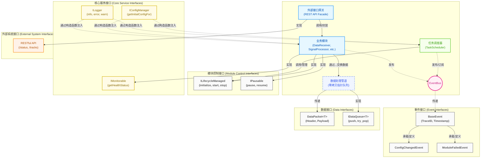
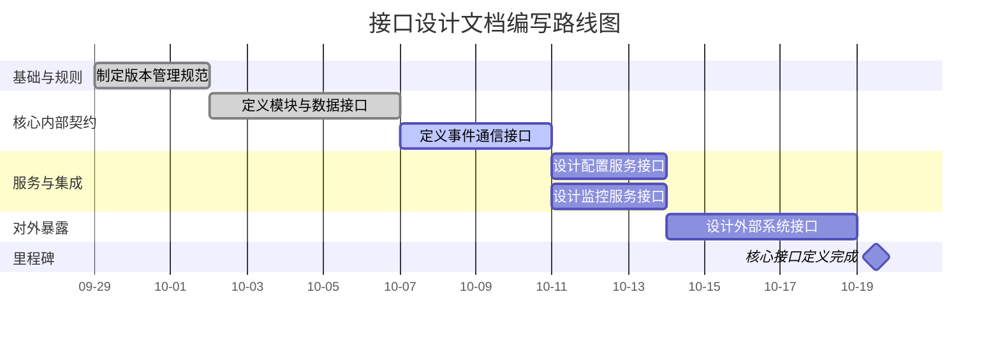

# 00_接口设计总览.md

**文档版本**: v1.0.0
**最后更新**: 2025-09-26
**负责人**: Klein

-----

### 1 文档职责

#### 1.1 文档范围与目标

  - **概要**: 本文件是雷达数据处理系统所有接口设计的**最高层级索引和指导性纲领**。其核心目标是提供一个清晰的接口架构视图，并为团队成员定义一套统一的接口设计原则和文档编写路线图。它将确保所有接口设计在理念上保持一致，在实现上无缝集成。

#### 1.2 读者引导

  - **概要**: 为不同角色的读者（如新成员、模块开发者、架构师、测试工程师）提供建议的阅读路径。例如，新成员应从本总览开始，然后按照推荐的路线图阅读；模块开发者应重点关注`模块接口规范`和`事件接口规范`。

#### 1.3 目录
- [00\_接口设计总览.md](#00_接口设计总览md)
    - [1 文档职责](#1-文档职责)
      - [1.1 文档范围与目标](#11-文档范围与目标)
      - [1.2 读者引导](#12-读者引导)
      - [1.3 目录](#13-目录)
    - [2 核心设计原则](#2-核心设计原则)
      - [2.1 事件驱动架构 (Event-Driven)](#21-事件驱动架构-event-driven)
      - [2.2 数据与控制分离 (Data/Control Plane Separation)](#22-数据与控制分离-datacontrol-plane-separation)
      - [2.3 依赖注入 (Dependency Injection)](#23-依赖注入-dependency-injection)
      - [2.4 全链路可观测性 (End-to-End Observability)](#24-全链路可观测性-end-to-end-observability)
      - [2.5 接口隔离原则 (Interface Segregation)](#25-接口隔离原则-interface-segregation)
    - [3 接口架构总览](#3-接口架构总览)
      - [3.1 接口关系图](#31-接口关系图)
      - [3.2 接口类别说明](#32-接口类别说明)
        - [3.2.1 模块控制接口 (Module Control Interfaces)](#321-模块控制接口-module-control-interfaces)
        - [3.2.2 核心服务接口 (Core Service Interfaces)](#322-核心服务接口-core-service-interfaces)
        - [3.2.3 事件接口 (Event Interfaces)](#323-事件接口-event-interfaces)
        - [3.2.4 数据接口 (Data Interfaces)](#324-数据接口-data-interfaces)
        - [3.2.5 外部系统接口 (External System Interfaces)](#325-外部系统接口-external-system-interfaces)
    - [4 接口文档编写顺序 (路线图)](#4-接口文档编写顺序-路线图)
      - [4.1 可视化路线图 (Visual Roadmap)](#41-可视化路线图-visual-roadmap)
      - [4.2 详细步骤与交付物 (Detailed Steps \& Deliverables)](#42-详细步骤与交付物-detailed-steps--deliverables)
        - [4.2.1 第1步: 接口版本管理 (05\_接口版本管理.md)](#421-第1步-接口版本管理-05_接口版本管理md)
        - [4.2.2 第2步: 模块与数据接口 (01\_模块接口规范.md)](#422-第2步-模块与数据接口-01_模块接口规范md)
        - [4.2.3 第3步: 事件接口 (06\_事件接口规范.md)](#423-第3步-事件接口-06_事件接口规范md)
        - [4.2.4 第4步: 核心服务接口 (03\_配置接口设计.md \& 04\_监控接口设计.md)](#424-第4步-核心服务接口-03_配置接口设计md--04_监控接口设计md)
        - [4.2.5 第5步: 外部接口 (02\_外部接口设计.md)](#425-第5步-外部接口-02_外部接口设计md)
    - [5 关键接口定义预览](#5-关键接口定义预览)
      - [5.1 模块控制接口 (`ILifecycleManaged` \& `IModule`)](#51-模块控制接口-ilifecyclemanaged--imodule)
      - [5.2 基础事件 (`BaseEvent`)](#52-基础事件-baseevent)
      - [5.3 核心服务接口 (`ILogger`)](#53-核心服务接口-ilogger)
      - [5.4 核心数据包 (`DataPacket<T>`)](#54-核心数据包-datapackett)
    - [6 变更历史](#6-变更历史)

-----

### 2 核心设计原则

本章节定义的五大核心原则是整个系统接口设计的基石。所有模块、所有接口的详细设计都必须严格遵守这些原则，以确保系统架构的一致性、高性能和可维护性。这些原则共同构成了我们团队在接口层面的“技术宪法”。

#### 2.1 事件驱动架构 (Event-Driven)

- **原则**: 系统内部模块间的主要通信方式是通过**异步事件**。所有控制流、状态变更通知和错误上报都必须通过统一的 `EventBus` 进行解耦通信。
- **强制约束**:
    - **严禁模块间的直接同步调用**：任何模块（除`main`函数中的初始化注入外）都不应持有其他业务模块的实例指针并直接调用其方法。例如，`DataProcessor` 绝不能直接调用 `SignalProcessor` 的方法。
    - **单向依赖**: 所有模块只依赖于 `EventBus` 接口，用于发布和订阅事件，从而实现生产者和消费者的完全解耦。
- **理由**:
    - **高内聚，低耦合**: 模块只需关注自身业务逻辑和它所关心（订阅）的事件，无需了解事件的来源或有多少消费者，极大地降低了系统的复杂度和模块间的依赖关系。
    - **弹性与可扩展性**: 可以轻松地增加新的事件消费者（如新的监控或日志分析模块）而无需修改任何现有模块代码。
    - **鲁棒性**: 异步通信天然地隔离了故障。单个模块的处理缓慢或失败不会通过同步调用链阻塞或拖垮其他模块。
- **参考实现**: `05_任务调度器设计.md`, `99_模块集成策略.md`

#### 2.2 数据与控制分离 (Data/Control Plane Separation)

- **原则**: 明确区分高性能的**数据流通道**（数据面）与高可靠的**控制/事件流通道**（控制面）。接口设计必须严格反映并维护这种分离。
- **具体体现**:
    - **数据面 (Data Plane)**:
        - **目标**: 极致性能、低延迟、高吞吐。
        - **实现**: 通过**共享内存池**、**并发无锁队列**以及**智能指针**传递数据块引用（而非数据本身）来实现**端到端零拷贝**。
        - **接口规范**: 数据接口（如 `IDataQueue<T>`）应专注于高效的数据推送和获取，并包含明确的背压机制。
    - **控制面 (Control Plane)**:
        - **目标**: 解耦、可靠性、可追踪性。
        - **实现**: 通过 `EventBus` 传递轻量级的控制命令、状态通知和错误事件。
        - **接口规范**: 事件接口 (`BaseEvent`) 负载应尽可能小，不应携带大的数据块。
- **理由**: 将两种不同目标的流量分开，可以让我们为每种场景选择最合适的实现技术和优化策略。在数据面使用无锁队列是为了性能，而在控制面使用事件总线是为了解耦。混用会导致架构混乱，既达不到性能要求，也失去了灵活性。
- **参考实现**: `01_数据接收模块设计.md`, `00_总体架构设计.md`

#### 2.3 依赖注入 (Dependency Injection)

- **原则**: 系统中所有模块和服务间的依赖关系必须通过**构造函数注入**来解决。
- **强制约束**:
    - **严禁使用全局单例**: 代码库中不应出现 `Singleton::getInstance()` 这样的调用。
    - **严禁使用服务定位器模式**: 模块内部不应出现向某个全局注册表查询依赖服务的情况。
    - **面向抽象编程**: 注入的依赖必须是抽象接口类型（如 `std::shared_ptr<ILogger>`），而非具体实现类（`std::shared_ptr<LoggingService>`）。
- **理由**:
    - **依赖关系显式化**: 通过构造函数签名，可以清晰地看到一个模块的所有外部依赖，降低了代码的理解和维护成本。
    - **可测试性**: 在单元测试中，可以轻松地注入模拟（Mock）的依赖对象，实现对模块的隔离测试。
    - **灵活性**: 更换一个服务的实现（例如，从文件日志切换到网络日志）只需在 `main` 函数中修改一行注入代码，而无需改动任何业务模块。
- **参考实现**: `99_模块集成策略.md`, `07_日志服务设计.md`

#### 2.4 全链路可观测性 (End-to-End Observability)

- **原则**: **`TraceID` 是所有接口的一等公民**。系统中的任何一次操作、一个数据流或一个事件链都必须能够被唯一标识和端到端追踪。
- **具体体现**:
    - **数据接口**: 所有在数据面流转的核心数据结构（如 `DataObject`, `DetectionResult`）的头部必须包含 `TraceID` 字段。
    - **事件接口**: 所有在控制面传递的事件（`BaseEvent` 及其派生类）必须包含 `TraceID` 字段。
    - **服务接口**: 所有服务接口（如 `ILogger`）的方法都应自动或显式地支持 `TraceID` 的记录。
    - **跨线程传递**: 在进行异步操作（如向线程池提交任务）时，必须将当前线程的 `TraceID` 一并传递给工作线程。
- **理由**: 在一个复杂的异步、并发系统中，如果没有端到端的 `TraceID`，定位问题（如性能瓶颈、数据丢失、错误根源）将是一场噩梦。`TraceID` 是将分散在不同模块、不同线程中的日志和事件串联成一个完整故事的唯一线索。
- **参考实现**: `07_日志服务设计.md`, `06_配置管理模块设计.md`

#### 2.5 接口隔离原则 (Interface Segregation)

- **原则**: 接口的定义应追求**小而专**，客户端不应被强迫依赖它们不需要的方法。
- **具体体现**:
    - **模块接口拆分**: 将一个大而全的 `IModule` 接口，根据其职责拆分为多个更小的、基于角色的接口。例如：
        - `ILifecycleManaged`: 负责 `initialize`, `start`, `stop` 等生命周期。
        - `IPausable`: 负责 `pause`, `resume` 功能。
        - `IMonitorable`: 负责提供健康状态 `getHealthStatus`。
        - `IConfigurable`: 负责响应配置变更。
    - **模块按需实现**: 具体的业务模块根据自身需要，组合实现一个或多个这样的角色接口。一个简单的计算模块可能只需要实现 `ILifecycleManaged`，而一个复杂的数据处理模块则可能需要实现所有接口。
- **理由**:
    - **降低耦合**: 模块只需了解和实现它真正需要的功能，减少了不必要的依赖。
    - **提升代码清晰度**: 通过模块实现的接口列表，可以一目了然地知道该模块具备哪些“能力”（如“可管理生命周期”、“可暂停”）。
    - **增强灵活性**: 当需要为系统添加一种新的“能力”（例如，`IReloadable`）时，只需定义新接口并让需要的模块实现即可，无需修改所有模块的基类。
- **参考实现**: `99_模块集成策略.md`

-----

### 3 接口架构总览

本章节提供了整个雷达数据处理系统接口架构的宏观视图。它旨在帮助开发者快速理解不同类型的接口（模块、服务、事件、数据、外部）是如何相互作用，共同构成了这个复杂而解耦的系统。

#### 3.1 接口关系图

下图通过组件图的形式，可视化了系统五大类接口的核心角色以及它们与关键架构组件（如业务模块、任务调度器、事件总线）的交互关系。



#### 3.2 接口类别说明

##### 3.2.1 模块控制接口 (Module Control Interfaces)

  - **核心职责**: 定义系统中**可被管理**的业务模块（如`DataReceiver`, `SignalProcessor`）必须遵循的生命周期契约。这些接口是`任务调度器`能够统一、可靠地启动、停止和监控各个模块的基础。
  - **关键接口**:
      - `ILifecycleManaged`: 最基础的接口，提供`initialize`, `start`, `stop`, `cleanup`等方法，确保所有模块都有统一的生命周期管理方式。
      - `IPausable`: 为需要支持暂停和恢复功能的模块（如数据处理流模块）提供`pause`和`resume`方法。
  - **交互模式**: 这些接口由`任务调度器`**调用**，由各个**业务模块实现**。

##### 3.2.2 核心服务接口 (Core Service Interfaces)

  - **核心职责**: 定义系统中跨领域的基础服务（如日志、配置）对外提供的能力。这些接口使得业务模块能够以一种统一、解耦的方式使用这些核心功能，而无需关心其具体实现。
  - **关键接口**:
      - `ILogger`: 提供结构化的日志记录服务。
      - `IConfigManager`: 提供获取初始配置和订阅配置变更的服务。
      - `IMonitorable`: 允许模块暴露其健康状态给`监控服务`。
  - **交互模式**: 这些接口由**核心服务模块提供**，通过**构造函数注入**的方式提供给**所有需要它们的模块**（包括业务模块和任务调度器）使用。

##### 3.2.3 事件接口 (Event Interfaces)

  - **核心职责**: 定义模块间进行**异步、解耦通信**的消息契约。这是系统事件驱动架构的命脉，承载了所有的状态通知、控制命令和告警信息。
  - **关键接口**:
      - `BaseEvent`: 所有事件的基类，强制包含`TraceID`, `Timestamp`, `SourceModule`等元数据，是实现全链路可观测性的关键。
      - 具体事件（如`ConfigChangedEvent`, `ModuleFailedEvent`）：定义特定业务场景下的消息内容。
  - **交互模式**: 事件由发布者（任何模块）创建，通过`EventBus`**发布**，再由`EventBus`**路由**给所有订阅了该事件类型的消费者。

##### 3.2.4 数据接口 (Data Interfaces)

  - **核心职责**: 定义系统**高性能数据面**的数据交换格式和通道规范。这些接口专注于实现最大吞吐量和最低延迟，是端到端零拷贝数据流的基石。
  - **关键接口**:
      - `DataPacket<T>`: 统一的数据包装格式，其头部强制包含`TraceID`，确保数据在处理管道中的可追溯性。
      - `IDataQueue<T>`: 定义了连接数据处理模块的并发队列接口，其实现通常是无锁的，用于传递`DataPacket`的指针。
  - **交互模式**: 生产者模块通过`IDataQueue`的`push`方法将数据包**指针**推入队列，消费者模块通过`try_pop`**获取**，实现高效的数据交换。

##### 3.2.5 外部系统接口 (External System Interfaces)

  - **核心职责**: 定义整个雷达处理系统作为一个**黑盒**，如何与外部世界（如用户界面、第三方分析系统、运维平台）进行交互。它构成了系统的“门面”(Facade)。
  - **关键接口**:
      - **RESTful API**: 为Web或桌面客户端提供查询系统状态、获取航迹数据、下发控制命令等能力。
      - **其他协议**: (未来扩展) 可能包括WebSocket用于实时数据推送，或gRPC用于与其他后端服务的高性能集成。
  - **交互模式**: 外部客户端作为**调用方**，通过HTTP等协议请求外部接口。系统内部的**外部接口网关**模块负责实现这些接口，并将外部请求转换为内部的事件或数据查询。

-----

### 4 接口文档编写顺序 (路线图)

为确保接口设计的系统性和一致性，避免因依赖混乱导致的返工，团队必须遵循以下预定义的文档编写路线图。此路线图按照“先基础后应用，先内部后外部”的原则制定，每一步都为后续步骤奠定坚实的基础。

#### 4.1 可视化路线图 (Visual Roadmap)

下面的甘特图直观地展示了接口文档的编写顺序、依赖关系和建议的时间规划。



#### 4.2 详细步骤与交付物 (Detailed Steps & Deliverables)

##### 4.2.1 第1步: 接口版本管理 (05\_接口版本管理.md)

  - **核心目标**: **先立规矩**。在定义任何具体接口之前，建立一套所有接口都必须遵守的版本迭代和兼容性管理“宪法”，从源头上保证系统的长期可维护性。
  - **关键交付物**:
      - `[x]` **语义化版本规范**: 明确 `vMAJOR.MINOR.PATCH` 版本号的升级规则。
          - `MAJOR` (主版本号): 当发生不兼容的 API 变更时。
          - `MINOR` (次版本号): 当以向后兼容的方式增加新功能时。
          - `PATCH` (修订号): 当进行向后兼容的错误修复时。
      - `[x]` **破坏性变更定义**: 清晰界定哪些变更属于“破坏性变更”（如：删除或重命名方法、修改方法签名、改变现有枚举值等）。
      - `[x]` **接口弃用策略**: 制定标准的接口弃用流程（例如，使用 C++ 的 `[[deprecated("...")]]` 属性标记，提供新的替代方案，并规定在至少一个主版本发布后才能移除旧接口）。
  - **依赖关系**: 无，此为所有其他接口设计文档的元规范。

##### 4.2.2 第2步: 模块与数据接口 (01\_模块接口规范.md)

  - **核心目标**: **定义骨架**。定义系统中核心业务模块的“控制面”和“数据面”两大基础契约，为 `TaskScheduler` 的统一管理和高性能数据管道的构建提供基础。
  - **关键交付物**:
      - `[x]` **模块控制接口**:
          - 提供 `ILifecycleManaged`, `IPausable`, `IMonitorable`, `IDependencyManaged`, `IModule` 等核心接口的 C++ 纯虚基类代码定义。
          - 使用 Mermaid 绘制标准的模块生命周期状态机（`UNINITIALIZED` -\> `INITIALIZING` -\> ... -\> `FAILED`）。
          - **已完成**: 所有核心模块接口定义已集中到 `01_模块接口规范.md`，成为接口定义的唯一真实来源。
      - `[x]` **核心数据结构**:
          - 定义 `DataPacket<T>` 模板，明确其 `Header`（含 `TraceID`）和 `Payload` 的结构。
          - 定义 `DataObject`, `DetectionResult`, `TrackData` 等关键数据传输对象（DTO）的详细字段和所有权模型（如 `std::unique_ptr`）。
          - **已优化**: 添加内存对齐建议和所有权语义说明。
      - `[x]` **数据通道接口**:
          - 定义用于模块间数据交换的并发队列抽象接口，如 `IDataQueue<T>`，并规定其阻塞行为和背压语义。
          - **已增强**: 添加阻塞式 `pop()` 方法，提升消费者实现的灵活性。
  - **依赖关系**: `05_接口版本管理.md`。

##### 4.2.3 第3步: 事件接口 (06\_事件接口规范.md)

  - **核心目标**: **定义血脉**。在定义了模块“器官”后，立即定义它们之间进行异步、解耦通信所使用的“血液”——事件。
  - **关键交付物**:
      - `[x]` **基础事件定义**: 提供 `BaseEvent` 结构体的 C++ 代码定义，明确 `TraceID`, `Timestamp`, `SourceModule` 等强制性公共字段。
      - `[x]` **事件分类**: 将系统事件划分为明确的类别（如：生命周期事件、状态报告事件、控制命令事件、故障与恢复事件等）。
      - `[x]` **核心事件详述**: 为每个分类下的关键事件（如 `ModuleStateChangedEvent`, `ConfigChangedEvent`, `ModuleFailedEvent`）提供详细的结构体定义和字段说明。
  - **依赖关系**: `01_模块接口规范.md` (事件内容常与模块状态相关)。

##### 4.2.4 第4步: 核心服务接口 (03\_配置接口设计.md & 04\_监控接口设计.md)

  - **核心目标**: **定义核心服务交互**。明确业务模块如何消费系统中最重要的两个基础服务：配置和监控。这两份文档可并行编写。
  - **关键交付物**:
      - **`03_配置接口设计.md`**:
          - `[x]` 定义 `IConfigManager` 接口，明确 `getInitialConfigFor()` 方法用于模块启动时获取初始配置。
          - `[x]` 描述模块如何通过订阅 `ConfigChangedEvent` 事件来响应配置热更新，而非通过同步查询接口。
      - **`04_监控接口设计.md`**:
          - `[x]` 定义 `IMonitorable` 接口，包含 `getHealthStatus()` 等方法，供模块实现以暴露自身健康状况。
          - `[x]` 规定业务指标（如吞吐量、延迟）的上报机制，例如通过 `ThreadLocalMetrics` 写入 MPSC 队列的非侵入式方式，而非直接调用监控服务接口。
  - **依赖关系**: `06_事件接口规范.md` (配置和监控的许多交互依赖事件)。

##### 4.2.5 第5步: 外部接口 (02\_外部接口设计.md)

  - **核心目标**: **定义对外的门面**。在所有内部接口和能力都已明确的基础上，设计整个系统作为一个统一实体对外提供服务的最终契约。
  - **关键交付物**:
      - `[x]` **RESTful API 规范**:
          - 使用 OpenAPI (Swagger) 格式定义所有 API 端点（Endpoints），如 `GET /api/v1/system/status`, `GET /api/v1/tracks`。
          - 明确每个端点的 HTTP 方法、URL 参数、请求体（Request Body）和响应体（Response Body）的 JSON Schema。
      - `[x]` **认证与授权**: 定义 API 的安全机制（如 API Key, OAuth 2.0）。
      - `[x]` **错误码与响应格式**: 定义标准的 API 错误响应格式和业务错误码。
  - **依赖关系**: `01_模块接口规范.md`, `04_监控接口设计.md` (外部接口暴露的数据和服务源于内部模块的能力)。

-----

### 5 关键接口定义预览

本章节旨在提供系统中四个最关键接口的C++代码定义快照。这些预览清晰地展示了我们核心设计原则（如接口隔离、全链路追踪、依赖注入）的具体实现方式。详细的接口定义和方法说明将在各自的专项文档中展开。

#### 5.1 模块控制接口 (`ILifecycleManaged` & `IModule`)

模块控制接口体现了**接口隔离原则**。`ILifecycleManaged` 定义了所有可被`任务调度器`管理的模块所必须实现的最小生命周期契约。更复杂的模块则通过组合实现多个角色接口，最终形成 `IModule` 的完整能力。

```cpp
/**
 * @brief 模块生命周期管理接口 (控制面核心)
 * @details 所有由TaskScheduler管理的模块都必须实现此接口，定义了其基础生命周期。
 */
class ILifecycleManaged {
public:
    virtual ~ILifecycleManaged() = default;

    /**
     * @brief 初始化模块，加载配置并准备资源。
     * @param config 模块专属的配置节点。
     * @return ErrorCode 操作结果，成功返回SystemErrors::SUCCESS。
     */
    virtual ErrorCode initialize(const YAML::Node& config) = 0;

    /**
     * @brief 启动模块运行，例如开始监听网络或启动处理线程。
     * @return ErrorCode 操作结果。
     */
    virtual ErrorCode start() = 0;

    /**
     * @brief 停止模块运行，释放活动资源。
     * @return ErrorCode 操作结果。
     */
    virtual ErrorCode stop() = 0;

    /**
     * @brief 清理所有资源，模块将被销毁。
     * @return ErrorCode 操作结果。
     */
    virtual ErrorCode cleanup() = 0;

    /**
     * @brief 获取模块当前状态。
     * @return ModuleState 枚举值。
     */
    virtual ModuleState getState() const = 0;
};

// 组合后的完整模块接口示例
class IModule : public ILifecycleManaged, public IPausable, public IMonitorable {
    // ... 组合了暂停、监控等其他角色接口
};
```

#### 5.2 基础事件 (`BaseEvent`)

`BaseEvent` 是系统中所有事件的基类，是事件驱动架构和**全链路可观测性**的基石。它强制所有事件都携带`TraceId`，确保任何异步流程都能被端到端追踪。

```cpp
/**
 * @brief 基础事件结构体 (控制面血脉)
 * @details 系统中所有事件的基类，封装了通用元数据。
 */
struct BaseEvent {
    EventType type;                 ///< 事件类型枚举
    Timestamp timestamp;            ///< 事件发生的高精度时间戳
    std::string source_module;      ///< 事件发布者模块名称

    /**
     * @brief 全链路追踪ID (强制性)
     * @details 在构造时自动从当前线程上下文继承或生成一个新的根ID。
     * 此ID将在整个事件处理链中传递。
     */
    TraceId trace_id;

    virtual ~BaseEvent() = default;
};

// 派生事件示例
struct ModuleFailedEvent : public BaseEvent {
    std::string failed_module;
    ErrorCode error_code;
    std::string error_message;
};
```

#### 5.3 核心服务接口 (`ILogger`)

`ILogger` 是**依赖注入**原则的典型体现。它定义了日志服务的抽象接口，所有模块通过构造函数注入此接口的实例来使用日志功能，从而与具体的日志实现（如 `LoggingService`）解耦。

```cpp
/**
 * @brief 日志服务接口
 * @details 所有模块通过此抽象接口进行日志记录，支持依赖注入。
 */
class ILogger {
public:
    virtual ~ILogger() = default;

    /**
     * @brief 检查指定日志级别是否启用，用于零开销日志宏。
     * @param level 日志级别。
     * @return true 如果该级别日志被启用。
     */
    virtual bool shouldLog(LogLevel level) const = 0;

    /**
     * @brief 记录结构化日志消息。
     * @details 实际使用中，开发者应调用 RADAR_INFO, RADAR_ERROR 等高性能宏，
     * 而不是直接调用此方法。
     */
    template<typename... Args>
    void log(LogLevel level, const std::string& format, Args&&... args);
};

// 在模块中的使用方式 (构造函数注入)
class DataReceiver : public IModule {
private:
    std::shared_ptr<ILogger> logger_;
public:
    explicit DataReceiver(std::shared_ptr<ILogger> logger)
        : logger_(std::move(logger)) {}

    void processData() {
        // 使用高性能宏，TraceID会被自动注入
        RADAR_INFO(logger_, "New data packet received, size: {}", packet_size);
    }
};
```

#### 5.4 核心数据包 (`DataPacket<T>`)

`DataPacket<T>` 模板是**数据与控制分离**原则在数据面的具体实现。它为所有在高性能数据管道中流转的数据提供了统一的、包含元数据的包装格式，同样强调了`TraceId`的重要性。

```cpp
/**
 * @brief 统一数据包装器 (数据面骨架)
 * @details 所有在模块间数据管道中传递的数据都使用此模板进行包装。
 * 它不拥有数据负载，通常通过指针或引用传递。
 */
template<typename PayloadType>
struct DataPacket {
    /**
     * @brief 数据包头部，包含所有元数据。
     */
    struct Header {
        Timestamp timestamp;        ///< 数据生成时间戳
        uint64_t sequence_id;       ///< 序列号，用于检测丢包

        /**
         * @brief 全链路追踪ID (强制性)
         * @details 从生成此数据的操作继承而来，确保数据处理的每一步都可追溯。
         */
        TraceId trace_id;

        std::string source_module;  ///< 数据源模块
        uint32_t payload_size;      ///< 负载大小（字节）
    } header;

    /**
     * @brief 数据负载
     * @details 为实现零拷贝，这通常是一个指向共享内存块的指针或智能指针。
     * 例如: std::unique_ptr<RawIQData, CustomDeleter>
     */
    PayloadType payload;
};

// 具体数据类型定义
using RawDataPacket = DataPacket<std::unique_ptr<uint8_t[]>>;
using DetectionResultPacket = DataPacket<std::vector<DetectionResult>>;
```

-----

### 6 变更历史

| 版本号 | 日期       | 作者  | 变更描述     |
| ------ | ---------- | ----- | ------------ |
| v1.0.0 | 2025-09-26 | Klein | 初始版本创建 |
