# 01\_模块接口规范.md

**文档版本**: v1.0.0
**最后更新**: 2025-09-26
**负责人**: Klein

-----

## 1\. 文档职责

### 1.1. 文档目标

  - **概要**: 本文件旨在为雷达数据处理系统的核心业务模块（如`DataReceiver`, `SignalProcessor`等）定义一套标准化的控制接口和数据交换契约。它作为模块开发者必须遵守的核心技术规范，确保所有模块都能无缝集成到由`TaskScheduler`管理的生命周期中，并通过统一的数据通道进行高性能通信。

本文档是连接系统架构蓝图与模块具体实现的桥梁，其核心目标在于：

  * **标准化**: 提供一套所有模块都必须遵循的通用接口，降低模块间的集成复杂度和沟通成本。
  * **解耦合**: 通过面向接口而非面向实现的设计，隔离变化，允许各模块独立演进。
  * **高性能**: 定义支持端到端零拷贝的数据交换契约，为系统的整体性能奠定基础。
  * **可管理性**: 确保所有模块都能被任务调度器以统一、可预测的方式进行管理和监控。

### 1.2. 核心原则对齐

  - **概要**: 本文档的设计严格遵循`00_接口设计总览.md`中定义的两大核心原则：**接口隔离原则 (Interface Segregation)** 和 **数据与控制分离 (Data/Control Plane Separation)**。所有接口定义都将体现这两个原则，以实现模块功能的灵活性和系统架构的清晰性。

具体体现如下：

  * **接口隔离原则**: 在 `2. 模块控制接口` 中，我们将一个潜在的庞大`IModule`接口拆分为多个职责单一的角色接口（如 `ILifecycleManaged`, `IPausable`），模块按需实现，避免了不必要的依赖和实现负担。
  * **数据与控制分离**: 文档明确地将接口划分为**控制面（第2章）和数据面（第3章）**。控制面接口负责模块的生命周期管理，而数据面接口则专注于高效、标准化的数据传输。

### 1.3. 目录

- [01\_模块接口规范.md](#01_模块接口规范md)
  - [1. 文档职责](#1-文档职责)
    - [1.1. 文档目标](#11-文档目标)
    - [1.2. 核心原则对齐](#12-核心原则对齐)
    - [1.3. 目录](#13-目录)
  - [3. 数据面接口 (Data Plane)](#3-数据面接口-data-plane)
    - [3.1. 统一数据包装器：`DataPacket<T>`](#31-统一数据包装器datapackett)
      - [3.1.1. 设计目标](#311-设计目标)
      - [3.1.2. C++ 结构体定义](#312-c-结构体定义)
    - [3.2. 核心数据传输对象 (DTOs)](#32-核心数据传输对象-dtos)
      - [3.2.1. `DataObject` (原始数据)](#321-dataobject-原始数据)
      - [3.2.2. `DetectionResult` (检测结果)](#322-detectionresult-检测结果)
      - [3.2.3. `TrackData` (航迹数据)](#323-trackdata-航迹数据)
    - [3.3. 数据通道接口：`IDataQueue<T>`](#33-数据通道接口idataqueuet)
      - [3.3.1. 接口职责](#331-接口职责)
      - [3.3.2. C++ 接口定义](#332-c-接口定义)
  - [4. 模块生命周期状态机](#4-模块生命周期状态机)
    - [4.1. 状态定义](#41-状态定义)
    - [4.2. 状态转移图 (Mermaid)](#42-状态转移图-mermaid)
  - [5. 变更历史](#5-变更历史)

-----

  - ## 2\. 模块控制接口 (Control Plane)

      - **概要**: 本章节定义了模块的“控制面”，即`TaskScheduler`如何对业务模块进行统一的生命周期管理和行为控制。这些接口是**接口隔离原则 (ISP)** 的典范应用，它们被精心拆分为多个职责专一的角色接口。这种设计赋予了模块开发者极大的灵活性，可以像搭积木一样为模块选择并实现其真正需要的能力，从而构建出既强大又简洁的组件。

    ### 2.1. 核心接口：`ILifecycleManaged`

    #### 2.1.1. 接口职责

      - **概要**: 这是所有可被`TaskScheduler`管理的模块**必须**实现的最小、最核心的接口。它定义了模块从初始化到清理的完整生命周期契约，是模块能够被系统统一编排的基础。可以说，实现`ILifecycleManaged`接口是模块获取进入系统“户籍”、接受统一管理和调度的“入场券”。

    其核心职责包括：

      * **定义生命周期**: 明确了`Initializing`, `Running`, `Stopped`, `Failed`等核心状态。
      * **提供控制钩子**: 为`TaskScheduler`提供了`initialize`, `start`, `stop`, `cleanup`等标准化的外部控制入口。
      * **状态可见性**: 通过`getState()`方法，使模块的当前状态对系统透明，为调度器的决策提供依据。

    #### 2.1.2. C++ 接口定义

    ```cpp
    /**
     * @brief 模块生命周期管理接口 - 所有可管理模块的基石
     * @details 遵循接口隔离原则 (ISP)，此接口仅关注模块的生命周期。
     * 所有希望被TaskScheduler管理的模块都必须实现此接口。
     */
    class ILifecycleManaged {
    public:
        virtual ~ILifecycleManaged() = default;

        /**
         * @brief 初始化模块。
         * @details 此阶段应完成配置加载、资源预分配（如内存池）、
         * 依赖验证等准备工作。
         * 方法执行后，模块应进入 `INITIALIZED` 状态。
         * @param config 从ConfigManager获取的模块专属配置节点。
         * @return ErrorCode 操作结果。成功返回 SystemErrors::SUCCESS。
         */
        virtual ErrorCode initialize(const YAML::Node& config) = 0;

        /**
         * @brief 启动模块运行。
         * @details 此阶段应启动内部工作线程、开始监听网络端口或激活数据处理循环。
         * 方法执行后，模块应进入 `RUNNING` 状态。
         * 此方法必须是非阻塞的；如果需要长时间运行的任务，应在内部线程中执行。
         * @return ErrorCode 操作结果。
         */
        virtual ErrorCode start() = 0;

        /**
         * @brief 停止模块运行。
         * @details 此阶段应优雅地停止所有活动，如停止线程、关闭连接、刷新缓冲区。
         * 方法执行后，模块应进入 `STOPPED` 状态。
         * 此方法应在有限时间内完成，以支持系统的快速关闭。
         * @return ErrorCode 操作结果。
         */
        virtual ErrorCode stop() = 0;

        /**
         * @brief 清理模块所有已分配的资源。
         * @details 在模块即将被销毁前调用，确保无任何资源泄露。
         * 执行后，模块回到 `UNINITIALIZED` 状态。
         * @return ErrorCode 操作结果。
         */
        virtual ErrorCode cleanup() = 0;

        /**
         * @brief 获取模块当前状态。
         * @details 此方法必须是线程安全的，且能快速返回。
         * @return ModuleState 模块当前的状态枚举。
         */
        virtual ModuleState getState() const = 0;

        /**
         * @brief 获取模块的唯一名称。
         * @details 用于日志记录、监控和模块间依赖识别。
         * @return const std::string& 模块名称。
         */
        virtual const std::string& getModuleName() const = 0;
    };
    ```

    ### 2.2. 角色接口：`IPausable`

    #### 2.2.1. 接口职责

      - **概要**: 这是一个可选的**角色接口**，专为那些其核心活动可以被临时挂起和恢复的模块设计。典型的应用场景是数据处理流水线中的模块，在系统进行故障恢复或调试时，需要暂停数据流入。不需要此功能的模块（如纯粹的`LoggingService`或`ConfigManager`）则完全无需实现它，从而避免了接口污染和不必要的实现负担。

    #### 2.2.2. C++ 接口定义

    ```cpp
    /**
     * @brief "可暂停"角色接口
     * @details 为需要支持暂停和恢复功能的模块提供标准契约。
     * 一个模块只有在 `RUNNING` 状态时，才能被暂停或恢复。
     */
    class IPausable {
    public:
        virtual ~IPausable() = default;

        /**
         * @brief 暂停模块的核心活动。
         * @details 对于数据处理模块，这通常意味着停止从上游队列获取新数据，
         * 并等待当前正在处理的数据完成。
         * 成功调用后，模块内部状态应切换至 `PAUSED`。
         * @return ErrorCode 操作结果。
         */
        virtual ErrorCode pause() = 0;

        /**
         * @brief 从暂停状态恢复模块的核心活动。
         * @details 模块将重新开始处理数据。
         * 成功调用后，模块内部状态应恢复为 `RUNNING`。
         * @return ErrorCode 操作结果。
         */
        virtual ErrorCode resume() = 0;

        /**
         * @brief 检查模块当前是否处于暂停状态。
         * @details 此方法必须是线程安全的。
         * @return bool 如果模块已暂停，则返回 true。
         */
        virtual bool isPaused() const = 0;
    };
    ```

    ### 2.3. 组合接口：`IModule`

    #### 2.3.1. 接口职责

      - **概要**: 为方便开发，我们提供一个组合了多个常用角色接口的`IModule`接口。它继承自`ILifecycleManaged`, `IPausable`, 以及在`99_模块集成策略.md`中定义的`IMonitorable`和`IDependencyManaged`。大多数功能完备的业务模块（如`DataReceiver`, `SignalProcessor`）可以直接继承此接口。

    这并非对接口隔离原则的违背，而是一种设计上的便利。它清晰地表明：“一个标准的、功能完整的业务模块，应该同时具备生命周期管理、暂停、监控和依赖管理这些能力”。开发者依然可以根据模块的实际简单程度，选择仅实现`ILifecycleManaged`等部分接口。

    #### 2.3.2. C++ 接口定义

    ```cpp
    /**
     * @brief 标准模块接口 - 多个核心角色接口的组合
     * @details 这是一个便利性接口，为功能完备的业务模块提供了一个统一的继承点。
     * 继承此接口的类必须实现所有基类中的纯虚函数。
     */
    class IModule : public ILifecycleManaged,
                    public IPausable,
                    public IMonitorable,        // (定义于 99_模块集成策略.md)
                    public IDependencyManaged   // (定义于 99_模块集成策略.md)
    {
    public:
        virtual ~IModule() = default;

        // 继承了以下所有接口的纯虚方法，需要实现：
        //
        // --- 来自 ILifecycleManaged ---
        // virtual ErrorCode initialize() = 0;
        // virtual ErrorCode start() = 0;
        // ... 等
        //
        // --- 来自 IPausable ---
        // virtual ErrorCode pause() = 0;
        // virtual ErrorCode resume() = 0;
        // ... 等
        //
        // --- 来自 IMonitorable ---
        // virtual HealthStatus getHealthStatus() const = 0;
        // ... 等
        //
        // --- 来自 IDependencyManaged ---
        // virtual void declareDependency(...) = 0;
        // ... 等
    };
    ```

-----

## 3\. 数据面接口 (Data Plane)

  - **概要**: 本章节定义了模块的“数据面”，即承载高吞吐量雷达数据的核心结构和通道。所有设计都围绕**端到端零拷贝 (End-to-End Zero-Copy)** 和**全链路可观测性 (End-to-End Observability)** 这两个核心目标展开。数据面接口是系统高性能的命脉，确保数据在处理管道中高效、安全地流动。

### 3.1. 统一数据包装器：`DataPacket<T>`

#### 3.1.1. 设计目标

  - **概要**: `DataPacket<T>`是系统中所有在数据管道中流转的数据的统一“集装箱”。它的设计目标是为负载数据提供标准化的元数据头部，强制包含`TraceID`和时间戳等关键信息，确保数据在任何处理阶段都具有可追溯性。

`DataPacket<T>`的设计不仅仅是一个数据容器，更是一份**强制性契约**。它确保了：

  * **可观测性**: 每个数据块自诞生起就携带一个唯一的`TraceID`，使得我们可以追踪它在整个复杂异步系统中的完整生命周期，极大地简化了调试和性能分析。
  * **标准化**: 所有模块处理的数据都遵循相同的封装格式，降低了模块间集成的难度。
  * **元数据丰富性**: 头部包含了数据处理所需的所有上下文信息，如时间戳、序列号、源模块等，避免了通过带外方式传递这些信息。

#### 3.1.2. C++ 结构体定义

  - **概要**: `DataPacket<T>`是一个模板结构体，其`Header`部分包含所有元数据，`Payload`部分则通过模板参数`T`承载具体的数据。为实现零拷贝，`Payload`通常被设计为持有指向共享内存块的智能指针。

```cpp
#pragma once

#include "Trace.h"      // 引入TraceID定义
#include "Timestamp.h"  // 引入高精度时间戳定义
#include <memory>       // for std::unique_ptr, std::shared_ptr
#include <string>
#include <vector>

/**
 * @brief 统一数据包装器模板，用于在数据处理管道中传递数据。
 * @details 这是实现数据与控制分离原则在数据面的核心结构。
 * 它不直接拥有数据负载，而是通过智能指针管理所有权，以实现零拷贝。
 * @tparam PayloadType 负载数据的类型。
 */
template<typename PayloadType>
struct DataPacket {
    /**
     * @brief 数据包头部，包含所有元数据。
     */
    struct Header {
        Timestamp timestamp;        ///< 数据生成或捕获的高精度时间戳。
        uint64_t sequence_id;       ///< 序列号，用于检测丢包或乱序。

        /**
         * @brief 全链路追踪ID (强制性)。
         * @details 从生成此数据的操作继承而来，确保数据处理的每一步都可追溯。
         */
        TraceId trace_id;

        std::string source_module;  ///< 数据源模块的名称。
        uint32_t payload_size_bytes;///< 负载的实际大小（以字节为单位）。
    } header;

    /**
     * @brief 数据负载。
     * @details 为实现零拷贝，这通常是一个指向共享内存块的指针或智能指针。
     * 例如: std::unique_ptr<RawIQData, CustomDeleter>
     */
    PayloadType payload;
};

// --- 前向声明核心数据传输对象 ---
struct DataObject;
struct DetectionResult;
struct TrackData;

// --- 为核心数据类型定义具体的DataPacket别名 ---

/// @brief 封装原始数据的包，Payload是一个指向原始数据块的指针。
using RawDataPacket = DataPacket<std::unique_ptr<DataObject>>;

/// @brief 封装检测结果的包，Payload是一个包含多个检测结果的向量。
using DetectionResultPacket = DataPacket<std::vector<DetectionResult>>;

/// @brief 封装航迹数据的包，Payload是一个包含多个航迹数据的向量。
using TrackDataPacket = DataPacket<std::vector<TrackData>>;

```

### 3.2. 核心数据传输对象 (DTOs)

  - **概要**: 本节定义了雷达数据处理流水线中三个关键阶段的数据结构，它们将作为`DataPacket<T>`模板的`PayloadType`。这些结构体被设计为POD (Plain Old Data) 类型或拥有清晰所有权语义的类型，以便于在模块间高效传递。

#### 3.2.1. `DataObject` (原始数据)

  - **概要**: 定义`DataObject`结构体，用于封装从`DataReceiver`输出的原始I/Q数据。它本身不包含庞大的数据数组，而是持有指向**共享内存池**中某个内存块的智能指针，这是整个系统实现零拷贝数据流的起点。

```cpp
#pragma once
#include <memory>
#include <cstdint>

// 假设有一个内存池和自定义删除器用于自动回收内存
class MemoryPool;
struct MemoryPoolDeleter {
    MemoryPool* pool;
    void operator()(uint8_t* ptr) const;
};

/**
 * @brief 原始数据对象，封装来自数据接收模块的原始数据。
 */
struct DataObject {
    // 描述原始数据的元数据
    uint32_t num_samples;   ///< 采样点数
    uint32_t num_channels;  ///< 通道数
    // ... 其他雷达参数

    /**
     * @brief 指向原始I/Q数据的智能指针。
     * @details 这个指针指向一块从共享内存池（通常是页锁定内存）分配的内存，
     * 使用自定义删除器确保在DataObject生命周期结束后内存能自动归还给池。
     */
    std::unique_ptr<uint8_t[], MemoryPoolDeleter> raw_data;
};
```

#### 3.2.2. `DetectionResult` (检测结果)

  - **概要**: 定义`DetectionResult`结构体，用于封装`SignalProcessor`输出的目标检测信息。这是一个相对轻量级的结构体，通常会以`std::vector`的形式被包含在`DetectionResultPacket`中。

```cpp
#pragma once

/**
 * @brief 单个目标检测点的结果。
 */
struct DetectionResult {
    double range;       ///< 距离 (米)
    double velocity;    ///< 速度 (米/秒)
    double azimuth;     ///< 方位角 (度)
    double elevation;   ///< 俯仰角 (度)
    double snr;         ///< 信噪比 (dB)
    // ... 其他检测属性
};
```

#### 3.2.3. `TrackData` (航迹数据)

  - **概要**: 定义`TrackData`结构体，用于封装`DataProcessor`输出的航迹信息。它包含了目标的完整状态估计和身份信息。

```cpp
#pragma once
#include <cstdint>
#include <vector>

/**
 * @brief 描述单个目标航迹的完整信息。
 */
struct TrackData {
    uint64_t track_id;          ///< 唯一的航迹ID。

    // 状态向量 [x, y, z, vx, vy, vz, ...]
    std::vector<double> state_vector;

    // 状态协方差矩阵
    std::vector<double> covariance_matrix;

    enum class TrackStatus { TENTATIVE, CONFIRMED, COAST, DELETED };
    TrackStatus status;         ///< 航迹的生命周期状态。

    // ... 其他航迹属性，如航迹质量、目标分类等
};
```

### 3.3. 数据通道接口：`IDataQueue<T>`

#### 3.3.1. 接口职责

  - **概要**: `IDataQueue<T>`是连接上下游模块的数据通道的抽象接口。它定义了生产者和消费者之间进行数据交换的基本操作（如`push`, `try_pop`）。其具体实现（例如，基于有界缓冲区的无锁并发队列）是系统高性能和稳定性的关键，并天然地实现了**背压 (back-pressure)** 机制。当队列满时，生产者的`push`操作将被阻塞，从而将压力向上游传递，防止下游模块过载。

#### 3.3.2. C++ 接口定义

  - **概要**: `IDataQueue<T>`模板接口定义了数据队列的核心功能。实现该接口的类必须是线程安全的，以支持在不同线程中运行的生产者和消费者模块。

```cpp
#pragma once

#include "ErrorCode.h"
#include <memory>
#include <optional>

/**
 * @brief 模块间数据交换通道的抽象接口。
 * @details 定义了线程安全的生产者-消费者队列的核心功能。
 * 其实现通常是支持并发和背压的有界队列。
 * @tparam T 队列中存储的元素类型，通常是 DataPacket 的智能指针。
 */
template<typename T>
class IDataQueue {
public:
    virtual ~IDataQueue() = default;

    /**
     * @brief 将一个元素推入队列（生产者调用）。
     * @details 如果队列是有界的并且已满，此调用将阻塞，直到队列中有可用空间为止。
     * 这是实现背压机制的关键。
     * @param item 要推入的元素。
     * @return ErrorCode 操作结果。
     */
    virtual ErrorCode push(T item) = 0;

    /**
     * @brief 尝试从队列中弹出一个元素（消费者调用）。
     * @details 这是一个非阻塞操作。如果队列为空，它将立即返回一个空的optional。
     * @return std::optional<T> 如果队列非空，则包含弹出的元素；否则为空。
     */
    virtual std::optional<T> try_pop() = 0;

    /**
     * @brief 检查队列是否已满。
     * @details 对于有界队列，此方法可用于探测是否会触发背压。
     * @return 如果队列已满则返回 true。
     */
    virtual bool is_full() const = 0;

    /**
     * @brief 获取队列中当前的元素数量。
     * @details 返回的是一个近似值，主要用于监控。
     * @return size_t 队列中的元素数量。
     */
    virtual size_t get_size() const = 0;
};
```
-----

好的，我们来完成`01_模块接口规范.md`的最后一部分。我将为您详细阐述“4. 模块生命周期状态机”，提供严谨的状态定义和清晰的可视化状态转移图。

-----

## 4\. 模块生命周期状态机

  - **概要**: 本章节将以图形和文字的形式，正式、严谨地定义所有实现`ILifecycleManaged`接口的模块必须遵循的生命周期状态模型。这个状态机是`TaskScheduler`与各模块之间关于状态管理的**核心契约**。`TaskScheduler`通过调用`getState()`来查询模块状态，并根据此状态机决定下一步可以合法执行的控制操作（如`start()`, `stop()`）。

### 4.1. 状态定义

  - **概要**: 此处将以列表形式详细描述每个状态的明确含义、模块在各状态下的预期行为、以及触发状态转换的条件。

| 状态 (State)        | 描述 (Description) | 模块行为 (Module Behavior)                                                                                              | 触发进入的动作                          | 允许的下一个状态                |
| :------------------ | :----------------- | :---------------------------------------------------------------------------------------------------------------------- | :-------------------------------------- | :------------------------------ |
| **`UNINITIALIZED`** | **未初始化**       | 模块实例已创建，但未进行任何资源分配或配置加载。这是模块的初始和最终状态。                                              | 构造函数调用 / `cleanup()`成功          | `INITIALIZING`                  |
| **`INITIALIZING`**  | **初始化中**       | 正在执行`initialize(config)`方法。这是一个过渡状态，表示模块正在准备其运行所需的所有静态资源。                          | `TaskScheduler`调用`initialize(config)` | `INITIALIZED`, `FAILED`         |
| **`INITIALIZED`**   | **已初始化**       | `initialize()`成功完成。模块已加载配置，分配了内存池等资源，但尚未启动任何活动线程或数据处理。                          | `initialize()`成功返回                  | `STARTING`, `CLEANING_UP`       |
| **`STARTING`**      | **启动中**         | 正在执行`start()`方法。这是一个过渡状态，表示模块正在启动其核心活动，如创建工作线程、打开网络端口等。                   | `TaskScheduler`调用`start()`            | `RUNNING`, `FAILED`             |
| **`RUNNING`**       | **运行中**         | `start()`成功完成。模块正在积极地执行其核心职责，例如接收数据、处理算法、响应事件等。                                   | `start()`成功返回 / `resume()`成功返回  | `PAUSED`, `STOPPING`, `FAILED`  |
| **`PAUSED`**        | **已暂停**         | (可选) 模块活动已通过`pause()`调用被临时挂起。模块保留其内部状态和资源，但暂停处理新任务。                              | `pause()`成功返回                       | `RUNNING`, `STOPPING`, `FAILED` |
| **`STOPPING`**      | **停止中**         | 正在执行`stop()`方法。这是一个过渡状态，表示模块正在优雅地停止其活动，如通知线程退出、刷新缓冲区等。                    | `TaskScheduler`调用`stop()`             | `STOPPED`, `FAILED`             |
| **`STOPPED`**       | **已停止**         | `stop()`成功完成。所有活动线程已安全退出，网络连接已关闭，但初始化时分配的资源仍然保留。                                | `stop()`成功返回                        | `STARTING`, `CLEANING_UP`       |
| **`CLEANING_UP`**   | **清理中**         | 正在执行`cleanup()`方法。这是一个过渡状态，表示模块正在释放其在`initialize()`阶段获取的所有资源。                       | `TaskScheduler`调用`cleanup()`          | `UNINITIALIZED`, `FAILED`       |
| **`FAILED`**        | **失败**           | 模块在任何阶段遇到了无法自我恢复的致命错误。模块的所有活动都应停止，并等待`TaskScheduler`的进一步指令（如重启或关闭）。 | 任何生命周期方法执行失败                | `STOPPING`, `CLEANING_UP`       |

-----

### 4.2. 状态转移图 (Mermaid)

  - **概要**: 下图直观地展示了4.1节中定义的所有合法状态转换路径。箭头上的标签表示触发该转换的方法调用及其结果。任何未在此图中表示的转换路径都应被视为非法操作。

```mermaid
stateDiagram-v2
    direction TB
    classDef failedState fill:#ffcdd2,stroke:#c62828,color:#b71c1c;

    [*] --> UNINITIALIZED: 构造

    UNINITIALIZED --> INITIALIZING: initialize(config)

    INITIALIZING --> INITIALIZED: / success
    INITIALIZING --> FAILED: / failure

    INITIALIZED --> STARTING: start()
    INITIALIZED --> CLEANING_UP: cleanup()

    STARTING --> RUNNING: / success
    STARTING --> FAILED: / failure

    RUNNING --> PAUSED: pause() / success
    RUNNING --> STOPPING: stop()
    RUNNING --> FAILED: / runtime error

    PAUSED --> RUNNING: resume() / success
    PAUSED --> STOPPING: stop()
    PAUSED --> FAILED: / runtime error

    STOPPING --> STOPPED: / success
    STOPPING --> FAILED: / failure

    STOPPED --> STARTING: start()
    STOPPED --> CLEANING_UP: cleanup()

    CLEANING_UP --> UNINITIALIZED: / success
    CLEANING_UP --> FAILED: / failure

    UNINITIALIZED --> [*]: 析构

    FAILED --> STOPPING: stop()
    FAILED --> CLEANING_UP: cleanup()

    class FAILED failedState

    note right of FAILED
      <b>失败状态 (Failed State)</b>
      进入此状态后，模块将停止所有活动。
      它只能响应 `stop()` 或 `cleanup()`
      指令，由 TaskScheduler 决定是
      尝试恢复还是彻底关闭。
    end note
```



> **状态机契约**: 所有模块开发者在实现`ILifecycleManaged`接口时，**必须**确保其内部状态的转换严格遵守此状态机。`TaskScheduler`也将依赖此模型来验证其控制操作的合法性。例如，对一个处于`RUNNING`状态的模块调用`start()`是一个非法操作，`TaskScheduler`会拒绝执行并记录一个错误。

-----

## 5\. 变更历史

| 版本号 | 日期       | 作者  | 变更描述                                                                                                                                       |
| ------ | ---------- | ----- | ---------------------------------------------------------------------------------------------------------------------------------------------- |
| v1.0.0 | 2025-09-26 | Klein | 初始版本创建，正式定义了控制面（ILifecycleManaged, IPausable）和数据面（DataPacket, DTOs, IDataQueue）的核心接口，并建立了模块生命周期状态机。 |
