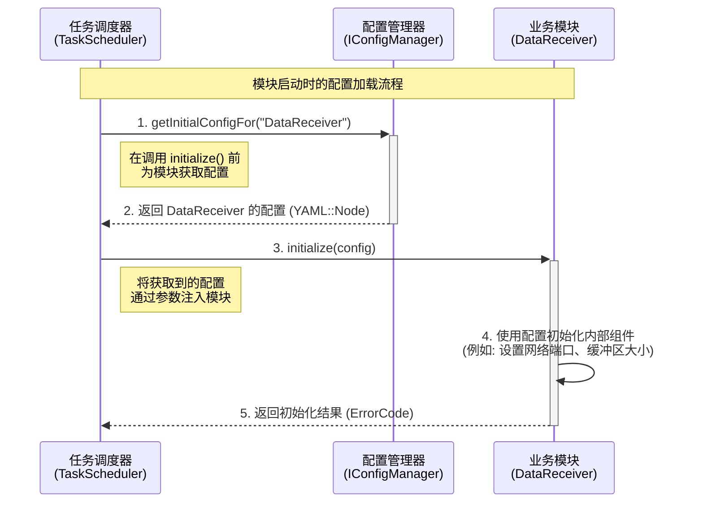
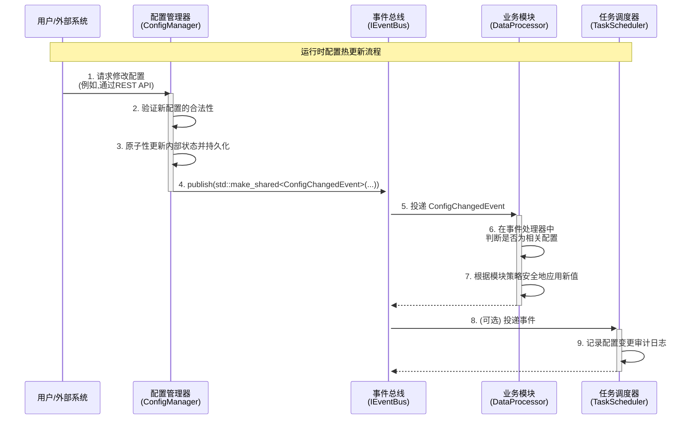

# 03\_配置接口设计

-----

- **标题**: 配置接口设计
- **当前版本**: v1.0.0
- **最后更新**: 2025-09-26
- **负责人**: Klein

-----

## 概述

本文件旨在为雷达数据处理系统定义一套标准化的配置管理接口和交互模式。它详细阐述了`ConfigManager`服务如何向其他模块提供配置数据，以及系统如何实现**运行时配置热更新 (Runtime Hot-Reload)**。本文档是确保系统灵活性、可维护性和支持在线调整的关键规范。

-----

## 目录

- [03\_配置接口设计.md](#03_配置接口设计md)
  - [概述](#概述)
  - [目录](#目录)
  - [1. 文档职责](#1-文档职责)
    - [1.1. 文档目标](#11-文档目标)
    - [1.2. 核心原则对齐](#12-核心原则对齐)
  - [2. 配置服务核心接口 (`IConfigManager`)](#2-配置服务核心接口-iconfigmanager)
    - [2.1. 接口职责](#21-接口职责)
    - [2.2. C++ 接口定义](#22-c-接口定义)
  - [3. 配置交互模式](#3-配置交互模式)
    - [3.1. 模式一：启动时配置加载 (Initialization-Time Loading)](#31-模式一启动时配置加载-initialization-time-loading)
      - [3.1.1. 交互流程 (时序图)](#311-交互流程-时序图)
      - [3.1.2. 职责与契约](#312-职责与契约)
    - [3.2. 模式二：运行时热更新 (Runtime Hot-Reload)](#32-模式二运行时热更新-runtime-hot-reload)
      - [3.2.1. 交互流程 (时序图)](#321-交互流程-时序图)
      - [3.2.2. 模块响应策略](#322-模块响应策略)
  - [4. 配置文件结构规范](#4-配置文件结构规范)
    - [4.1. 分层结构](#41-分层结构)
    - [4.2. 模块化命名空间](#42-模块化命名空间)
    - [4.3. 示例配置文件](#43-示例配置文件)
      - [`configs/base.yaml` (基础配置)](#configsbaseyaml-基础配置)
      - [`configs/modules/signal_processor.yaml` (模块详细配置)](#configsmodulessignal_processoryaml-模块详细配置)
      - [`configs/environments/production.yaml` (生产环境覆盖)](#configsenvironmentsproductionyaml-生产环境覆盖)
  - [5. 术语表](#5-术语表)
  - [6. 变更历史](#6-变更历史)

-----

## 1\. 文档职责

### 1.1. 文档目标

  - **概要**: 本文件旨在为雷达数据处理系统定义一套标准化的配置管理接口和交互模式。它详细阐述了`ConfigManager`服务如何向其他模块提供配置数据，以及系统如何实现**运行时配置热更新 (Runtime Hot-Reload)**。本文档是确保系统灵活性、可维护性和支持在线调整的关键规范。

如果说接口总览是系统的“宪法”，模块接口是“组织法”，事件接口是“通信法”，那么本配置接口设计就是系统的“**行政管理法**”。它规定了系统各个“行政单位”（模块）如何获取其“行政指令”（配置），以及这些指令如何被动态、安全地调整。

其核心目标在于：

  * **定义契约**: 精确定义`IConfigManager`接口，作为所有模块获取配置的唯一、标准化的入口。
  * **规范流程**: 明确并固化两种核心交互模式：模块启动时的一次性配置加载，以及运行时的事件驱动热更新。
  * **保障稳定**: 通过标准化的交互流程和模块响应策略，确保配置的变更不会破坏系统的稳定性和数据一致性。
  * **提升效率**: 使系统参数的调整无需重新编译或重启，极大地提升了开发、测试和运维的效率。

### 1.2. 核心原则对齐

  - **概要**: 本文档的设计严格遵循`00_接口设计总览.md`中定义的核心原则，特别是**事件驱动架构**和**依赖注入**。所有接口的设计和交互模式的定义，都是这些核心原则在配置管理领域的具体体现。

| 核心原则                                                | 在本规范中的具体体现                                                                                                                                                                                                                                 |
| :------------------------------------------------------ | :--------------------------------------------------------------------------------------------------------------------------------------------------------------------------------------------------------------------------------------------------- |
| **事件驱动架构**<br>*(Event-Driven Architecture)*       | **配置热更新完全由事件驱动**。本文档明确规定，运行时的配置变更是通过`ConfigManager`发布`ConfigChangedEvent`事件来实现的。模块作为被动的订阅者响应变更，彻底杜绝了低效且紧耦合的主动轮询（Polling）检查模式。                                         |
| **依赖注入**<br>*(Dependency Injection)*                | **`ConfigManager`是一个可注入的服务**。任何需要获取配置的模块，都必须通过构造函数注入`IConfigManager`的抽象接口。这使得模块与`ConfigManager`的具体实现完全解耦，为单元测试（注入Mock配置）和未来替换配置源（如从文件切换到远程配置中心）提供了可能。 |
| **全链路可观测性**<br>*(End-to-End Observability)*      | **配置操作是可追踪的**。所有由外部触发的配置变更请求，以及由此产生的`ConfigChangedEvent`事件，都必须携带一个`TraceID`。这确保了任何一次配置调整，从用户操作到最终在模块中生效的全过程，都是可以被监控和审计的。                                      |
| **数据与控制分离**<br>*(Data/Control Plane Separation)* | **配置属于控制面**。配置数据本质上是指导模块行为的元数据，属于控制流的一部分。通过`IConfigManager`接口获取配置和通过事件接收更新，都属于控制面的交互，与数据面的高吞吐量数据流完全分离。                                                             |

-----

## 2\. 配置服务核心接口 (`IConfigManager`)

  - **概要**: `IConfigManager`是配置管理服务的**唯一**对外抽象接口。所有模块都通过此接口与配置系统交互，从而实现了对底层配置存储（如YAML文件、未来可能的远程配置中心）的完全隔离。它是**依赖注入**原则在配置管理领域的直接体现，确保了模块与配置服务的低耦合。

### 2.1. 接口职责

  - **概要**: `IConfigManager`的职责被严格限定在**提供配置数据**这一核心功能上。它作为系统配置的“**单一真相来源 (Single Source of Truth)**”，负责在系统启动时为模块提供其初始运行参数。

| 核心职责         | 详细说明                                                                                                                                                               | 设计原则对齐                                                                                 |
| :--------------- | :--------------------------------------------------------------------------------------------------------------------------------------------------------------------- | :------------------------------------------------------------------------------------------- |
| **提供初始配置** | 在模块的`initialize()`阶段，通过`getInitialConfigFor()`方法，向模块提供其专属的、经过验证和合并后的配置数据块。这是模块获取其静态运行参数的**唯一入口**。              | **依赖注入**: 模块不关心配置来自何处，只依赖`IConfigManager`接口提供数据。                   |
| **抽象配置源**   | 接口背后完全隐藏了配置的复杂性，包括配置的来源（是本地文件还是远程服务）、格式（YAML、JSON等）和分层合并逻辑。消费者只获得一个稳定、统一的`YAML::Node`视图。           | **数据与控制分离**: `IConfigManager`提供的是控制面的元数据，与数据面的高性能数据流分离。     |
| **保证只读访问** | `getInitialConfigFor`方法被声明为`const`，明确表示此接口仅用于**读取**配置。任何配置的**写入或变更**都必须通过`06_事件接口规范.md`中定义的事件流进行，而非通过此接口。 | **事件驱动架构**: 强制将配置变更的流程纳入事件驱动体系，确保操作的可追溯性和全系统的一致性。 |

> **重要边界限定**: `IConfigManager`**不负责**配置的修改或热更新通知。
>
>   * **配置修改请求**: 应通过外部机制（如REST API或CLI工具）提交给`ConfigManager`的具体实现。
>   * **配置变更通知**: 由`ConfigManager`的具体实现通过`IEventBus`发布`ConfigChangedEvent`事件来完成。
>
> 这种设计保持了`IConfigManager`接口的纯粹性和稳定性，使其只专注于“提供配置”这一项核心职责。

### 2.2. C++ 接口定义

  - **概要**: `IConfigManager`是一个纯虚基类，其定义简洁明了，只包含一个核心方法。所有需要访问配置的模块都应在其构造函数中注入`std::shared_ptr<IConfigManager>`。

```cpp
#pragma once

#include "ErrorCode.h"      // 引入项目统一的错误码定义
#include <string>           // for std::string
#include <yaml-cpp/yaml.h>  // 使用yaml-cpp库作为配置的数据结构

/**
 * @brief 配置管理服务的核心抽象接口。
 * @details 所有模块通过此接口获取其初始配置信息。
 * 它是通过依赖注入提供给各模块的核心服务之一。
 * 其实现必须是线程安全的。
 */
class IConfigManager {
public:
    virtual ~IConfigManager() = default;

    /**
     * @brief 在模块初始化时，获取其专属的配置。
     * @details TaskScheduler 在调用模块的 initialize() 之前，
     * 会先调用此方法获取配置，然后将其作为参数传递给模块。
     * 此方法被声明为const，表明它是一个只读操作。
     *
     * @param module_name 需要获取配置的模块的唯一名称
     * (应与配置文件中的顶级键名一致)。
     * @return YAML::Node 一个包含了该模块所有配置的YAML节点。
     * 如果该模块没有专属配置或模块名称未找到，
     * 此方法应返回一个类型为 Null 的有效YAML::Node，
     * 而不是`nullptr`或抛出异常。消费者应通过`node.IsNull()`进行检查。
     */
    virtual YAML::Node getInitialConfigFor(const std::string& module_name) const = 0;
};
```

-----

## 3\. 配置交互模式

  - **概要**: 系统中的模块与`ConfigManager`之间存在两种核心的交互模式：**启动时的一次性加载**和**运行时的动态更新**。这两种模式共同构成了一个完整、健壮的配置管理生命周期，确保模块在任何时候都能基于正确、一致的参数运行。

### 3.1. 模式一：启动时配置加载 (Initialization-Time Loading)

  - **概要**: 这是模块获取其运行基础参数的主要方式。在系统启动过程中，`TaskScheduler`扮演协调者，确保每个模块在执行其`initialize`逻辑之前，就已经获得了来自“单一真相来源” (`ConfigManager`) 的、安全正确的配置数据。这个模式是系统稳定启动的基石。

#### 3.1.1. 交互流程 (时序图)



#### 3.1.2. 职责与契约

为了确保此流程的健壮性，各参与方必须遵守以下契约：

  * **`TaskScheduler` 的职责**:

    1.  **协调者**: 负责编排整个配置加载流程。
    2.  **前置调用**: 在调用任何模块的 `initialize(config)` 之前，**必须**先调用 `ConfigManager::getInitialConfigFor()` 获取该模块的配置。
    3.  **参数传递**: **必须**将获取到的 `YAML::Node` 对象作为参数，准确无误地传递给模块的 `initialize(config)` 方法。

  * **`ConfigManager` 的职责**:

    1.  **数据源**: 作为配置的唯一权威来源。
    2.  **线程安全**: **必须**提供一个线程安全的 `getInitialConfigFor` 实现，因为 `TaskScheduler` 可能在自己的管理线程中调用它。
    3.  **永不失败**: **必须**总是返回一个有效的 `YAML::Node` 对象。即使模块没有专属配置或模块名称未找到，也应返回一个 `IsNull()` 为 `true` 的空节点，而不是 `nullptr` 或抛出异常。

  * **业务模块的职责**:

    1.  **消费者**: 在 `initialize(config)` 方法中，**必须**解析传入的 `config` 节点来设置所有必要的内部参数。
    2.  **健壮性**: **必须**具备处理配置缺失或格式错误的能力。推荐的实践是：对关键参数使用合理的默认值，并在配置缺失或无效时记录 `WARN` 级别的日志。

### 3.2. 模式二：运行时热更新 (Runtime Hot-Reload)

  - **概要**: 这是实现系统动态调整和在线维护的关键机制。此模式**完全基于事件驱动**，模块通过订阅`ConfigChangedEvent`来被动地接收配置变更通知，从而实现与`ConfigManager`的完全解耦。模块自身负责判断如何以及何时安全地应用这些变更。

#### 3.2.1. 交互流程 (时序图)



#### 3.2.2. 模块响应策略

  - **概要**: 收到`ConfigChangedEvent`后，模块需要根据变更的性质，采取不同的响应策略，以确保系统稳定。模块的自主决策能力是保证热更新安全性的核心。

| 策略                                | 适用场景                                                                                  | 模块行为                                                                                                                                                   | 设计语言一致性           |
| :---------------------------------- | :---------------------------------------------------------------------------------------- | :--------------------------------------------------------------------------------------------------------------------------------------------------------- | :----------------------- |
| **动态应用**<br>*(Dynamic Apply)*   | 参数变更不影响模块核心结构或数据流（如：日志级别、算法阈值、UI颜色）。                    | 在事件处理器中直接、原子地更新内部成员变量。这是最理想、最常见的策略。                                                                                     | **轻量级、实时**         |
| **延迟应用**<br>*(Delayed Apply)*   | 参数变更影响正在进行的数据处理帧，立即应用会导致数据不一致。                              | 将新配置暂存，并在下一个处理周期的“安全点”（如帧边界）原子性地应用。                                                                                       | **数据一致性优先**       |
| **请求重载**<br>*(Request Reload)*  | 参数变更需要重新加载部分资源，但无需完全重启（如：更新机器学习模型文件、滤波器系数）。    | 模块向`TaskScheduler`发布一个`RequestModuleReloadEvent`事件，由`TaskScheduler`来协调执行模块的`reload()`方法（一个可选接口）。                             | **资源刷新、服务不中断** |
| **请求重启**<br>*(Request Restart)* | 参数变更伤及根本，无法在运行时安全应用（如：更改监听的网络端口、线程池大小、GPU设备ID）。 | 模块发布一个高优先级的`ModuleFailedEvent`，原因代码为`CONFIG_REQUIRES_RESTART`。`TaskScheduler`收到后将对该模块执行完整的“停止-清理-初始化-启动”恢复流程。 | **根本性变更、有损服务** |

-----

## 4\. 配置文件结构规范

  - **概要**: 为了让`ConfigManager`能够有效地解析和分发配置，所有配置文件都**必须**遵循统一的结构规范。本规范的核心是**分层**与**模块化**，它将复杂的系统配置分解为多个逻辑清晰、职责单一的文件，并通过`ConfigManager`的合并机制形成最终的运行时配置。

### 4.1. 分层结构

  - **概要**: 配置采用分层合并的策略，优先级从高到低为：**用户自定义配置 \> 环境特定配置 \> 模块默认配置 \> 系统基础配置**。`ConfigManager`负责在启动时按此顺序加载和**深度合并 (Deep Merge)** 这些文件，后加载的配置会覆盖先加载的同名键值。

**配置加载与覆盖顺序**:

1.  **`base.yaml` (系统基础配置)**

      * **职责**: 提供系统所有参数的默认值，确保即使在没有任何其他配置文件的情况下，系统也能以一种安全、基础的模式启动。
      * **优先级**: **最低**。

2.  **`modules/*.yaml` (模块配置)**

      * **职责**: 各模块在此目录下定义其详细、特定的配置参数。这有助于团队协作，不同模块的负责人可以独立维护自己的配置文件。
      * **优先级**: **高于** `base.yaml`。

3.  **`environments/*.yaml` (环境配置)**

      * **职责**: 定义不同部署环境（如`development`, `testing`, `production`）的特定覆盖参数。例如，在生产环境中，日志级别应更高，数据库地址也应不同。系统启动时会根据环境变量或命令行参数加载其中一个文件。
      * **优先级**: **高于** 模块配置。

4.  **`~/.radar_user.yaml` (用户配置 - 可选)**

      * **职责**: 允许开发者在本地覆盖特定参数以方便调试，而无需修改项目仓库中的任何配置文件。此文件不应被纳入版本控制。
      * **优先级**: **最高**。

**深度合并 (Deep Merge) 规则**:

  * 对于嵌套的对象（Maps），合并是递归的。
  * 对于简单值（字符串、数字、布尔值），后加载的值会完全替换先加载的值。
  * 对于数组（Lists），默认行为是**替换**。未来可根据需求在配置中添加元数据以支持**追加**模式。

### 4.2. 模块化命名空间

  - **概要**: 在YAML文件中，所有模块的配置**必须**位于以该模块`module_name`（与`ILifecycleManaged::getModuleName()`返回的字符串完全一致）命名的顶级键下。这使得`ConfigManager`可以轻松地为每个模块提取其专属的配置“切片”，也是`getInitialConfigFor(module_name)`方法能够工作的组织基础。

> **强制性契约**: 如果一个模块名为`DataReceiver`，那么它所有的配置项都必须位于`DataReceiver:`这个顶级YAML键之下。全局配置（如`system`, `logging`）是此规则的例外。

### 4.3. 示例配置文件

  - **概要**: 以下是一个简化的示例，展示了分层配置和模块化命名空间在实践中的应用。

#### `configs/base.yaml` (基础配置)

```yaml
# ----------------------------------
# 系统基础配置 (提供所有默认值)
# ----------------------------------
system:
  name: "RadarProcessingSystem"
  version: "v2.0.0"

# 全局服务配置
logging:
  level: "DEBUG"
  output: "console"

# 模块默认配置
DataReceiver:
  network:
    bind_address: "127.0.0.1"
    port: 9001
  buffer:
    pool_size_mb: 128

SignalProcessor:
  gpu_device_id: 0
  algorithm_pipeline:
    - name: "fft"
```

#### `configs/modules/signal_processor.yaml` (模块详细配置)

```yaml
# ----------------------------------
# SignalProcessor 模块的详细配置
# ----------------------------------
SignalProcessor:
  # 此处的 gpu_device_id 会覆盖 base.yaml 中的值
  gpu_device_id: 0

  # 详细定义算法流水线
  algorithm_pipeline:
    - name: "fft"
      enabled: true
      params:
        size: 4096
        window: "hanning"
    - name: "cfar"
      enabled: true
      params:
        type: "ca-cfar"
        threshold: 15.5 # 这是一个可热更新的参数
```

#### `configs/environments/production.yaml` (生产环境覆盖)

```yaml
# ----------------------------------
# 生产环境的覆盖配置
# ----------------------------------

# 覆盖全局日志级别
logging:
  level: "INFO"
  output: "file"
  file_path: "/var/log/radar.log"

# 覆盖 DataReceiver 的网络配置以监听所有接口
DataReceiver:
  network:
    bind_address: "0.0.0.0"
  buffer:
    # 增加生产环境的缓冲区大小
    pool_size_mb: 1024

# 覆盖 SignalProcessor 的一个可热更新参数
SignalProcessor:
  algorithm_pipeline:
    - name: "cfar"
      params:
        threshold: 18.0 # 生产环境使用更严格的阈值
```

**最终合并结果 (生产环境)**: 当系统以生产模式启动时，`ConfigManager`内部形成的最终配置视图将是以上文件的深度合并结果。例如，`SignalProcessor`的`threshold`将是`18.0`，而`DataReceiver`的`port`将是`9001`（因为它只在`base.yaml`中定义）。

-----

## 5\. 术语表

  - **概要**: 本节定义文档中使用的关键术语。

| 术语                           | 英文全称                   | 定义                                                                                                    |
| :----------------------------- | :------------------------- | :------------------------------------------------------------------------------------------------------ |
| **配置 (Configuration)**       | -                          | 一组用于定义系统或模块行为的参数集合。                                                                  |
| **配置管理器 (ConfigManager)** | -                          | 负责加载、管理、分发和持久化配置的核心服务。                                                            |
| **热更新 (Hot-Reload)**        | -                          | 在系统不停止运行的情况下，动态应用新的配置参数。                                                        |
| **YAML**                       | YAML Ain't Markup Language | 一种人类可读的数据序列化标准，用作本系统的配置文件格式。                                                |
| **单一真相来源 (SSoT)**        | Single Source of Truth     | 一种设计原则，指系统中的每一份数据都应有单一、权威的来源。在本设计中，`ConfigManager`是所有配置的SSoT。 |

-----

## 6\. 变更历史

| 版本号 | 日期       | 作者  | 变更描述                                                                               |
| :----- | :--------- | :---- | :------------------------------------------------------------------------------------- |
| v1.0.0 | 2025-09-26 | Klein | 初始版本创建，定义了`IConfigManager`接口、两种核心配置交互模式，并规范了配置文件结构。 |
