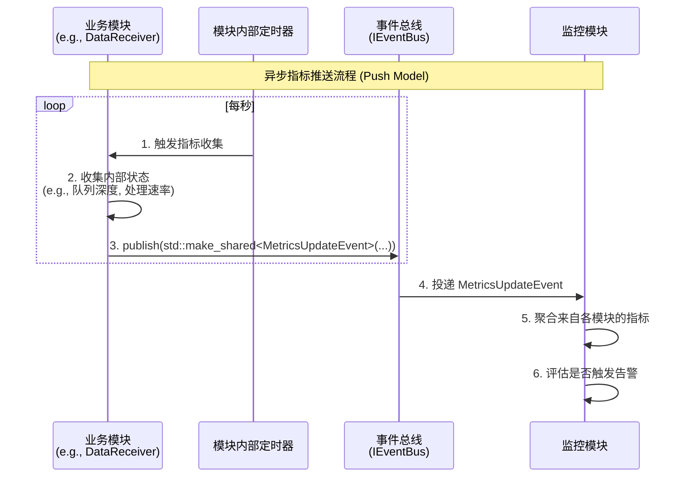
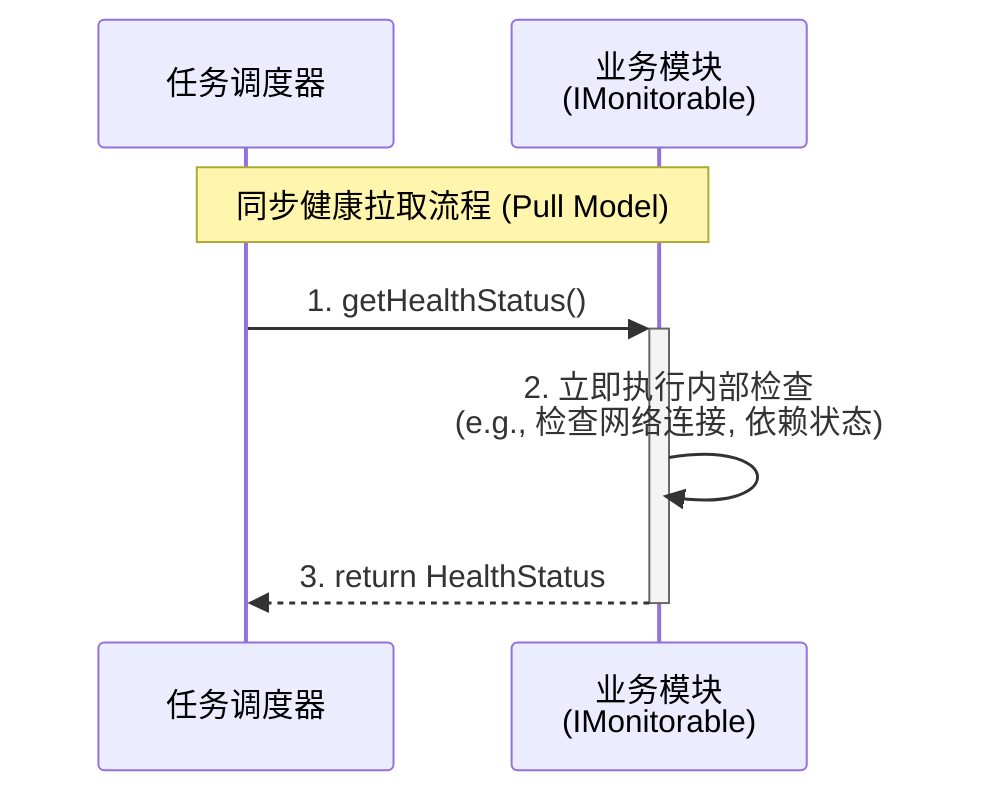

好的，我们严格按照开发计划，在完成配置接口设计后，立即开始进行监控接口的设计工作。

监控是保障系统**可观测性 (Observability)** 和**可靠性 (Reliability)** 的核心。本次设计将遵循我们既定的核心原则，特别是**事件驱动**，建立一个高效、低侵入性且高度解耦的监控体系。

我将为您创建`04_监控接口设计.md`的详细大纲和框架。

-----

# 04\_监控接口设计.md

**文档版本**: v1.0.0
**最后更新**: 2025-09-27
**负责人**: Klein

-----

## 1\. 文档职责

### 1.1. 文档目标

  - **概要**: 本文件旨在为雷达数据处理系统定义一套标准化的监控接口和交互模式。它详细规定了业务模块如何暴露其**健康状态 (Health Status)** 和**性能指标 (Performance Metrics)**，以及`MonitoringModule`如何聚合这些信息并触发告警。本文档是构建系统“免疫系统”和“仪表盘”的设计蓝图，确保系统的运行状态对开发者和运维人员完全透明。

本文档的核心目标在于：

  * **定义契约**: 精确定义`IMonitorable`角色接口和`MetricsUpdateEvent`、`AlertEvent`等核心事件，为模块化监控提供统一的通信语言。
  * **规范交互**: 明确并固化两种互补的监控模式——**以事件“推送”为主的高频性能监控**和**以接口“拉取”为辅的低频健康检查**，确保监控体系的性能与实时性。
  * **促进解耦**: 确保业务模块与`MonitoringModule`之间没有紧密的编译时依赖。业务模块只负责“生产”指标，而`MonitoringModule`负责“消费”，两者通过事件总线这一“交易市场”进行交互。
  * **保障可靠性**: 通过标准化的告警事件，为系统的故障预警和自愈能力提供基础信号，是系统可靠性的重要一环。

### 1.2. 核心原则对齐

  - **概要**: 本文档的设计严格遵循`00_接口设计总览.md`中定义的核心原则，建立一个**以“推送”为主，“拉取”为辅**的混合式监控模型，以兼顾性能与实时性。

| 核心原则 | 在本规范中的具体体现 |
| :--- | :--- |
| **事件驱动架构** *(Event-Driven Architecture)* | **高频性能指标的上报完全由事件驱动**。本文档的核心交互模式是模块主动、定期地“推送”`MetricsUpdateEvent`事件。这种模式避免了`MonitoringModule`对所有业务模块进行侵入式、高频率的同步轮询，极大地降低了监控系统对业务性能的影响，是极致解耦的体现。 |
| **接口隔离原则** *(Interface Segregation Principle)* | **健康检查接口是可选的、职责单一的**。并非所有模块都需要支持同步的健康状态“拉取”。因此，我们将此功能抽象为`IMonitorable`角色接口，只有需要响应此类请求的模块才实现它。这避免了在`ILifecycleManaged`等核心接口中添加非普适性的方法，保持了接口的简洁和专注。 |
| **全链路可观测性** *(End-to-End Observability)* | **告警事件必须与业务流关联**。本文档定义的`AlertEvent`事件，作为监控系统的最终输出，其基类`BaseEvent`强制要求包含`TraceID`。当`MonitoringModule`因某个模块上报的异常指标而触发告警时，应尽力将触发该异常的`TraceID`（如果可得）传递到告警事件中，从而将系统告警与导致它的具体业务流关联起来，实现从“现象”到“根因”的快速定位。 |
| **数据与控制分离** *(Data/Control Plane Separation)* | **监控信息属于控制面**。模块的健康状态和性能指标是描述其运行时行为的元数据，属于控制/管理面。本文档定义的接口和事件，正是控制面交互的一部分，它们与`01_模块接口规范.md`中定义的、承载雷达业务数据的数据面完全分离。 |

### 1.3. 目录

- [04\_监控接口设计.md](#04_监控接口设计md)
  - [1. 文档职责](#1-文档职责)
    - [1.1. 文档目标](#11-文档目标)
    - [1.2. 核心原则对齐](#12-核心原则对齐)
    - [1.3. 目录](#13-目录)
  - [2. 监控交互模式](#2-监控交互模式)
    - [2.1. 模式一：异步指标推送 (主模式)](#21-模式一异步指标推送-主模式)
      - [2.1.1. 交互流程 (时序图)](#211-交互流程-时序图)
    - [2.2. 模式二：同步健康拉取 (辅助模式)](#22-模式二同步健康拉取-辅助模式)
      - [2.2.1. 交互流程 (时序图)](#221-交互流程-时序图)
  - [3. “可监控”角色接口 (`IMonitorable`)](#3-可监控角色接口-imonitorable)
    - [3.1. 接口职责](#31-接口职责)
    - [3.2. C++ 接口定义](#32-c-接口定义)
    - [3.3. `HealthStatus` 结构体定义](#33-healthstatus-结构体定义)
  - [4. 性能指标事件 (`MetricsUpdateEvent`)](#4-性能指标事件-metricsupdateevent)
    - [4.1. 事件职责](#41-事件职责)
    - [4.2. C++ 结构体定义](#42-c-结构体定义)
    - [4.3. 指标命名规范](#43-指标命名规范)
  - [5. 告警事件 (`AlertEvent`)](#5-告警事件-alertevent)
    - [5.1. 事件职责](#51-事件职责)
    - [5.2. C++ 结构体定义](#52-c-结构体定义)
  - [6. 术语表](#6-术语表)
  - [7. 变更历史](#7-变更历史)

-----

## 2\. 监控交互模式

  - **概要**: 系统采用两种互补的监控模式，以适应不同类型和频率的监控需求。

### 2.1. 模式一：异步指标推送 (主模式)

  - **概要**: 这是系统**最主要**的性能数据收集方式。每个业务模块内部集成轻量级的指标收集器，定期（如每秒）将其核心性能指标封装成一个`MetricsUpdateEvent`事件，并“推送”到`EventBus`。`MonitoringModule`作为订阅者，被动接收并聚合这些数据。这种模式对业务模块的性能影响最小。

#### 2.1.1. 交互流程 (时序图)

  - **概要**: 展示一个业务模块如何主动上报其性能数据。

<!-- end list -->

### 2.2. 模式二：同步健康拉取 (辅助模式)

  - **概要**: 这种模式用于**低频**的、**请求-响应式**的健康状态检查。例如，`TaskScheduler`在决定是否重启一个失败模块前，可能需要“拉取”其依赖模块的当前健康状态；或者外部系统（如Kubernetes的Liveness Probe）需要一个HTTP端点来检查系统是否存活。这是通过实现`IMonitorable`接口来完成的。

#### 2.2.1. 交互流程 (时序图)

  - **概要**: 展示`TaskScheduler`如何按需查询一个模块的健康状态。

<!-- end list -->

-----

## 3\. “可监控”角色接口 (`IMonitorable`)

  - **概要**: `IMonitorable`是一个可选的角色接口，为需要响应“拉取”式健康检查的模块提供了标准契约。

### 3.1. 接口职责

  - **概要**: 实现此接口的模块，向系统声明了其具备**立即**提供自身健康快照的能力。这是一种同步的、低频的交互，与异步的指标推送形成互补。

### 3.2. C++ 接口定义

  - **概要**: `IMonitorable`接口的核心是`getHealthStatus()`方法，它必须是一个快速、非阻塞且线程安全的调用。

### 3.3. `HealthStatus` 结构体定义

  - **概要**: `HealthStatus`是一个标准化的结构体，用于封装模块的健康信息，作为`getHealthStatus()`的返回值。

-----

## 4\. 性能指标事件 (`MetricsUpdateEvent`)

  - **概要**: `MetricsUpdateEvent`是“异步指标推送”模式的核心，是承载模块高频性能数据的标准化“集装箱”。

### 4.1. 事件职责

  - **概要**: `MetricsUpdateEvent`的核心职责是让模块能够以一种统一、解耦的方式，定期向系统广播自身的性能快照。

### 4.2. C++ 结构体定义

  - **概要**: 此处将提供`MetricsUpdateEvent`的完整C++代码，并详细说明其基于`std::map<std::string, std::variant>`的灵活负载设计，以支持不同类型的指标。

### 4.3. 指标命名规范

  - **概要**: 为确保`MonitoringModule`能够正确解析和聚合来自不同模块的指标，所有指标的键名（Key）**必须**遵循一个统一的命名规范。

-----

## 5\. 告警事件 (`AlertEvent`)

  - **概要**: `AlertEvent`是监控系统的最终输出。当`MonitoringModule`发现异常时，通过发布此事件来通知系统的其他部分。

### 5.1. 事件职责

  - **概要**: `AlertEvent`的职责是广播一个已发生的、需要被关注的系统异常情况，它本身不包含处理逻辑，仅作为“警报信号”。

### 5.2. C++ 结构体定义

  - **概要**: 此处将提供`AlertEvent`的完整C++代码，并定义`AlertLevel`（如`WARNING`, `CRITICAL`）等关键字段。

-----

## 6\. 术语表

  - **概要**: 本节定义文档中使用的关键术语。

-----

## 7\. 变更历史

  - **概要**: 本章节将记录本文档的所有修订历史。
