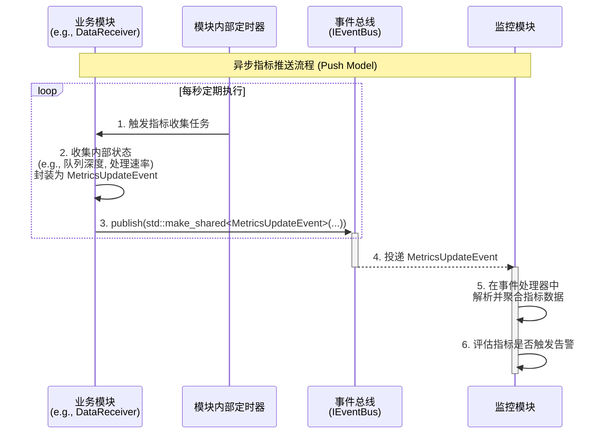
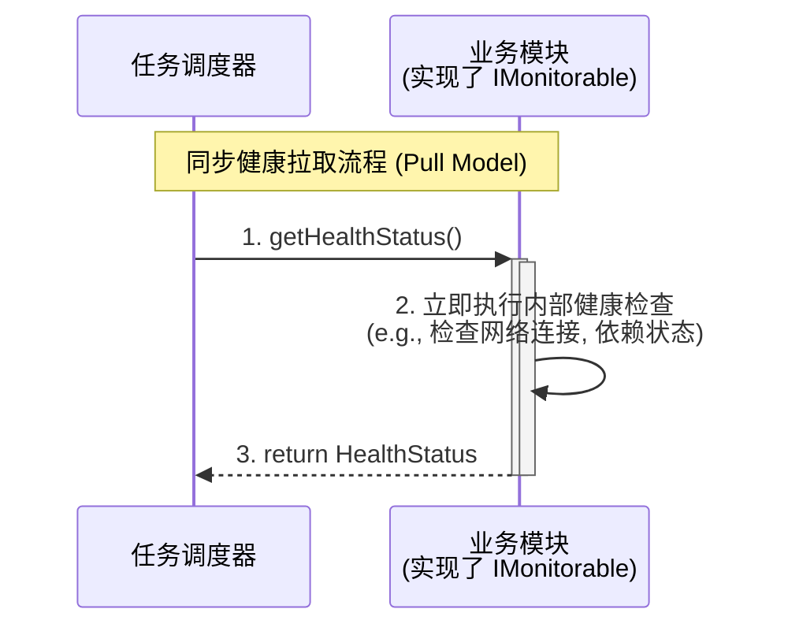

# 04\_监控接口设计.md

-----

- **标题**: 监控接口设计
- **当前版本**: v1.0.0
- **最后更新**: 2025-09-26
- **负责人**: Klein

-----

## 概述

本文件旨在为雷达数据处理系统定义一套标准化的监控接口和交互模式。它详细规定了业务模块如何暴露其**健康状态 (Health Status)** 和**性能指标 (Performance Metrics)**，以及`MonitoringModule`如何聚合这些信息并触发告警。本文档是构建系统“免疫系统”和“仪表盘”的设计蓝图，确保系统的运行状态对开发者和运维人员完全透明。

-----

## 目录

- [04\_监控接口设计.md](#04_监控接口设计md)
  - [概述](#概述)
  - [目录](#目录)
  - [1. 文档职责](#1-文档职责)
    - [1.1. 文档目标](#11-文档目标)
    - [1.2. 核心原则对齐](#12-核心原则对齐)
  - [2. 监控交互模式](#2-监控交互模式)
    - [2.1. 模式一：异步指标推送 (主模式)](#21-模式一异步指标推送-主模式)
      - [2.1.1. 交互流程 (时序图)](#211-交互流程-时序图)
      - [2.1.2. 职责与契约](#212-职责与契约)
    - [2.2. 模式二：同步健康拉取 (辅助模式)](#22-模式二同步健康拉取-辅助模式)
      - [2.2.1. 交互流程 (时序图)](#221-交互流程-时序图)
      - [2.2.2. 职责与契约](#222-职责与契约)
    - [2.3. 模式选择与对比](#23-模式选择与对比)
  - [3. “可监控”角色接口 (`IMonitorable`)](#3-可监控角色接口-imonitorable)
    - [3.1. 接口职责](#31-接口职责)
    - [3.2. C++ 接口定义](#32-c-接口定义)
    - [3.3. `HealthStatus` 结构体定义](#33-healthstatus-结构体定义)
  - [4. 性能指标事件 (`MetricsUpdateEvent`)](#4-性能指标事件-metricsupdateevent)
    - [4.1. 事件职责](#41-事件职责)
    - [4.2. C++ 结构体定义](#42-c-结构体定义)
    - [4.3. 指标命名规范](#43-指标命名规范)
  - [5. 告警事件 (`AlertEvent`)](#5-告警事件-alertevent)
    - [5.1. 事件职责](#51-事件职责)
    - [5.2. C++ 结构体定义](#52-c-结构体定义)
  - [6. 术语表](#6-术语表)
  - [7. 变更历史](#7-变更历史)


-----

## 1\. 文档职责

### 1.1. 文档目标

  - **概要**: 本文件旨在为雷达数据处理系统定义一套标准化的监控接口和交互模式。它详细规定了业务模块如| **触发响应动作** | 作为触发下游模块响应动作的信号。例如，`DisplayController`（数据网关）可以维护活跃告警列表供API查询，独立的显控终端则可以根据告警级别在UI上显示不同颜色的警示灯。 | **解耦合**: 告警的"响应"逻辑位于订阅者模块中，未来可以轻松添加新的响应机制（如短信通知模块），而无需修改`MonitoringModule`。 |暴露其**健康状态 (Health Status)** 和**性能指标 (Performance Metrics)**，以及`MonitoringModule`如何聚合这些信息并触发告警。本文档是构建系统“免疫系统”和“仪表盘”的设计蓝图，确保系统的运行状态对开发者和运维人员完全透明。

本文档的核心目标在于：

  * **定义契约**: 精确定义`IMonitorable`角色接口和`MetricsUpdateEvent`、`AlertEvent`等核心事件，为模块化监控提供统一的通信语言。
  * **规范交互**: 明确并固化两种互补的监控模式——**以事件“推送”为主的高频性能监控**和**以接口“拉取”为辅的低频健康检查**，确保监控体系的性能与实时性。
  * **促进解耦**: 确保业务模块与`MonitoringModule`之间没有紧密的编译时依赖。业务模块只负责“生产”指标，而`MonitoringModule`负责“消费”，两者通过事件总线这一“交易市场”进行交互。
  * **保障可靠性**: 通过标准化的告警事件，为系统的故障预警和自愈能力提供基础信号，是系统可靠性的重要一环。

### 1.2. 核心原则对齐

  - **概要**: 本文档的设计严格遵循`00_接口设计总览.md`中定义的核心原则，建立一个**以“推送”为主，“拉取”为辅**的混合式监控模型，以兼顾性能与实时性。

| 核心原则                                                | 在本规范中的具体体现                                                                                                                                                                                                                                                                                                          |
| :------------------------------------------------------ | :---------------------------------------------------------------------------------------------------------------------------------------------------------------------------------------------------------------------------------------------------------------------------------------------------------------------------- |
| **事件驱动架构**<br>*(Event-Driven Architecture)*       | **高频性能指标的上报完全由事件驱动**。本文档的核心交互模式是模块主动、定期地“推送”`MetricsUpdateEvent`事件。这种模式避免了`MonitoringModule`对所有业务模块进行侵入式、高频率的同步轮询，极大地降低了监控系统对业务性能的影响，是极致解耦的体现。                                                                              |
| **接口隔离原则**<br>*(Interface Segregation Principle)* | **健康检查接口是可选的、职责单一的**。并非所有模块都需要支持同步的健康状态“拉取”。因此，我们将此功能抽象为`IMonitorable`角色接口，只有需要响应此类请求的模块才实现它。这避免了在`ILifecycleManaged`等核心接口中添加非普适性的方法，保持了接口的简洁和专注。                                                                   |
| **全链路可观测性**<br>*(End-to-End Observability)*      | **告警事件必须与业务流关联**。本文档定义的`AlertEvent`事件，作为监控系统的最终输出，其基类`BaseEvent`强制要求包含`TraceID`。当`MonitoringModule`因某个模块上报的异常指标而触发告警时，应尽力将触发该异常的`TraceID`（如果可得）传递到告警事件中，从而将系统告警与导致它的具体业务流关联起来，实现从“现象”到“根因”的快速定位。 |
| **数据与控制分离**<br>*(Data/Control Plane Separation)* | **监控信息属于控制面**。模块的健康状态和性能指标是描述其运行时行为的元数据，属于控制/管理面。本文档定义的接口和事件，正是控制面交互的一部分，它们与`01_模块接口规范.md`中定义的、承载雷达业务数据的数据面完全分离。                                                                                                           |

-----

## 2\. 监控交互模式

  - **概要**: 系统采用两种互补的监控模式，以适应不同类型和频率的监控需求。这两种模式分别是**异步指标推送**和**同步健康拉取**。前者是系统性能监控的主力，保证了低耦合和高性能；后者作为辅助，提供了按需查询的灵活性。

### 2.1. 模式一：异步指标推送 (主模式)

  - **概要**: 这是系统**最主要**的性能数据收集方式。每个业务模块内部集成轻量级的指标收集器，定期（例如每秒）将其核心性能指标封装成一个`MetricsUpdateEvent`事件，并“推送”到`EventBus`。`MonitoringModule`作为订阅者，被动接收并聚合这些数据。这种模式对业务模块的性能影响最小，是构建可扩展、低侵入性监控体系的基石。

#### 2.1.1. 交互流程 (时序图)

  - **概要**: 此图展示了一个业务模块（如`DataReceiver`）如何通过其内部定时器，主动、定期地向`MonitoringModule`上报其性能数据。整个过程是单向、异步的。




#### 2.1.2. 职责与契约

  * **业务模块 (发布者)**:
      * **职责**: 负责定期、准确地上报自身的性能指标。
      * **契约**: 发布的`MetricsUpdateEvent`**必须**遵循`4.3. 指标命名规范`。上报逻辑**不得**阻塞核心业务线程。
  * **MonitoringModule (订阅者)**:
      * **职责**: 负责订阅、接收和聚合来自全系统所有模块的指标。
      * **契约**: 其事件处理器**必须**是高效且非阻塞的，以应对可能的大量指标事件流入。

### 2.2. 模式二：同步健康拉取 (辅助模式)

  - **概要**: 这种模式用于**低频**的、**请求-响应式**的健康状态检查。例如，`TaskScheduler`在决定是否重启一个失败模块前，可能需要“拉取”其依赖模块的当前健康状态；或者外部系统（如Kubernetes的Liveness Probe）需要一个HTTP端点来检查系统是否存活。这是通过实现`IMonitorable`接口来完成的。

#### 2.2.1. 交互流程 (时序图)

  - **概要**: 此图展示了`TaskScheduler`等管理模块，如何在需要时主动查询一个业务模块的健康状况。这是一个同步的、双向的交互过程。



#### 2.2.2. 职责与契约

  * **管理模块 (调用者)**:
      * **职责**: 在需要获取模块即时健康快照时，调用`getHealthStatus()`方法。
      * **契约**: **不应**过于频繁地调用此方法，以避免对业务模块造成不必要的性能负担。
  * **业务模块 (实现者)**:
      * **职责**: 提供一个`getHealthStatus()`的实现，该实现能够快速返回模块当前的健康状况。
      * **契约**: `getHealthStatus()`的实现**必须**是**线程安全**且**非阻塞**的。它应该通过读取内部的原子状态变量或非阻塞查询来完成，而**不应**执行任何耗时的操作。

### 2.3. 模式选择与对比

  - **概要**: 为了帮助开发者做出正确的技术选择，下表对两种监控模式进行了详细对比。

| 对比维度          | 模式一：异步指标推送 (Push)                  | 模式二：同步健康拉取 (Pull)                  |
| :---------------- | :------------------------------------------- | :------------------------------------------- |
| **适用场景**      | 高频、连续的性能指标监控                     | 低频、按需的健康状态检查                     |
| **数据类型**      | 性能指标 (Metrics)：吞吐量、延迟、队列深度等 | 健康状态 (Health)：HEALTHY, DEGRADED, FAILED |
| **交互方式**      | 异步、单向 (发布-订阅)                       | 同步、双向 (请求-响应)                       |
| **性能开销**      | **极低** (业务模块仅需发布事件)              | **低** (但调用方需等待返回)                  |
| **实时性**        | 准实时 (取决于发布间隔，如1秒)               | **实时** (返回调用时刻的快照)                |
| **耦合度**        | **极低** (完全通过事件总线解耦)              | **低** (通过`IMonitorable`接口解耦)          |
| **核心接口/事件** | `MetricsUpdateEvent`                         | `IMonitorable::getHealthStatus()`            |

**结论**: **“推送”模式是常态，用于构建系统性能的全景视图；“拉取”模式是例外，用于特定场景下的精确诊断。** 这种组合设计确保了监控系统在拥有强大能力的同时，对主业务系统的性能影响降至最低。

-----

## 3\. “可监控”角色接口 (`IMonitorable`)

  - **概要**: `IMonitorable`是一个可选的**角色接口**，为需要响应“拉取”式健康检查的模块提供了标准契约。它遵循**接口隔离原则 (ISP)**，将同步健康检查的功能从核心的`ILifecycleManaged`接口中分离出来，使得只有真正需要提供此功能的模块才需要实现它。

### 3.1. 接口职责

  - **概要**: 实现此接口的模块，向系统声明了其具备**立即**提供自身健康快照的能力。这是一种同步的、低频的交互，与`2.1`节中描述的异步指标推送形成互补。

`IMonitorable`接口的核心职责是：

  * **提供即时快照**: 响应调用方（如`TaskScheduler`或外部探针）的请求，立即返回一个代表其当前健康状况的`HealthStatus`对象。
  * **封装内部状态**: `getHealthStatus()`方法应封装模块内部复杂的健康检查逻辑，对外只暴露一个标准化的、易于理解的结果。
  * **定义健康契约**: `HealthStatus`结构体本身定义了系统对“健康”的标准化度量，包括状态级别、分数和描述信息。

> **性能契约**: 实现`getHealthStatus()`方法的模块**必须**保证该方法是一个**快速、非阻塞且线程安全**的操作。它不应执行任何耗时的计算或I/O，而应主要通过读取内部的、由业务线程维护的原子状态变量来构造返回值。

### 3.2. C++ 接口定义

  - **概要**: `IMonitorable`接口的核心是`getHealthStatus()`方法。该方法被声明为`const`，表明它是一个只读操作，不应改变模块的任何状态。

```cpp
#pragma once

#include "HealthStatus.h" // 引入下文定义的HealthStatus结构体

/**
 * @brief "可监控"角色接口。
 * @details 为需要响应同步、按需健康检查的模块提供了标准契约。
 * 其实现必须是线程安全且非阻塞的。
 */
class IMonitorable {
public:
    virtual ~IMonitorable() = default;

    /**
     * @brief 获取模块当前的健康状态快照。
     * @details 此方法用于“拉取”模式的监控。调用方（如TaskScheduler）
     * 可以随时调用此方法来获取模块的即时健康状况。
     * @return HealthStatus 一个包含了当前健康信息的结构体。
     */
    virtual HealthStatus getHealthStatus() const = 0;
};
```

### 3.3. `HealthStatus` 结构体定义

  - **概要**: `HealthStatus`是一个标准化的结构体，用于封装模块的健康信息，作为`getHealthStatus()`的返回值。它不仅提供了一个定性的状态级别，还提供了一个定量的健康分数，并允许附加详细的诊断信息。

```cpp
#pragma once

#include <string>
#include <vector>
#include <map>
#include <variant>

/**
 * @brief 封装了模块健康状态的标准化数据结构。
 */
struct HealthStatus {
    /**
     * @brief 定义健康状态的严重级别。
     */
    enum class Level {
        HEALTHY,    ///< 健康: 所有内部检查通过，模块正常运行。
        DEGRADED,   ///< 降级: 出现非致命问题，核心功能仍可用，但性能或功能受损。
        UNHEALTHY   ///< 不健康: 出现致命问题，模块无法正常工作。
    };

    /// @brief 当前的健康级别。
    Level current_level = Level::HEALTHY;

    /**
     * @brief 健康分数 (0.0 - 1.0)。
     * @details 一个标准化的、量化的健康指标。1.0代表完全健康，0.0代表完全失效。
     * 可用于计算系统的总体健康加权平均分。
     */
    double health_score = 1.0;

    /// @brief 对当前状态的简明文字描述。
    /// @details 例如 "正常运行" 或 "数据库连接丢失"。
    std::string message;

    /**
     * @brief (可选) 包含详细的内部检查项及其状态的键值对。
     * @details 用于提供更深入的诊断信息。
     * e.g., {"database_connection": "HEALTHY", "buffer_usage_percent": 85.4}
     */
    std::map<std::string, std::variant<std::string, double, int64_t>> details;
};
```

**健康状态级别说明**:

| 级别 (Level)    | 含义       | `TaskScheduler`的典型响应                                                                                |
| :-------------- | :--------- | :------------------------------------------------------------------------------------------------------- |
| **`HEALTHY`**   | **健康**   | 一切正常，模块功能完整且性能达标。                                                                       | 继续正常调度。                                                             |
| **`DEGRADED`**  | **降级**   | 模块遇到可恢复或非关键性错误（如丢失了一个冗余连接），核心功能仍在运行，但可能性能下降或部分功能不可用。 | 记录警告日志，可能触发告警，但通常不采取恢复动作，等待模块自愈或运维介入。 |
| **`UNHEALTHY`** | **不健康** | 模块遇到严重错误，无法执行其核心职责（如网络端口无法监听、关键依赖丢失）。                               | 触发`ModuleFailedEvent`事件，启动故障恢复流程（如重启模块）。              |

-----

## 4\. 性能指标事件 (`MetricsUpdateEvent`)

  - **概要**: `MetricsUpdateEvent`是“异步指标推送”模式的核心，是承载模块高频性能数据的标准化“集装箱”。它允许任何业务模块以一种统一、解耦的方式，定期向系统广播自身的性能快照，是`MonitoringModule`构建全景性能视图的数据基础。

### 4.1. 事件职责

  - **概要**: `MetricsUpdateEvent`的核心职责是让模块能够以一种**低侵入、高性能**的方式，定期向系统广播其内部状态和性能快照。

| 核心职责         | 详细说明                                                                                                   | 设计原则对齐                                                                                           |
| :--------------- | :--------------------------------------------------------------------------------------------------------- | :----------------------------------------------------------------------------------------------------- |
| **承载性能数据** | 作为一个灵活的数据容器，封装来自单个模块在一个时间点上的多个性能指标（如队列深度、处理速率、错误计数等）。 | **数据与控制分离**: 性能指标作为描述模块行为的元数据，通过控制面的事件总线传递。                       |
| **实现推送模型** | 模块作为数据的“生产者”，主动将性能快照“推送”到事件总线，无需等待任何消费者。                               | **事件驱动架构**: `MonitoringModule`等消费者被动地订阅和响应这些事件，实现了生产者和消费者的完全解耦。 |
| **支持异构指标** | 事件的负载设计必须足够灵活，能够同时承载整数、浮点数、字符串等不同类型的指标值。                           | **可扩展性**: 新增一种监控指标，无需修改事件本身的结构，只需遵循命名规范即可。                         |

### 4.2. C++ 结构体定义

  - **概要**: `MetricsUpdateEvent`的负载核心是一个`std::map`，其键是遵循规范的指标名称，值则使用`std::variant`来支持多种数据类型。这种设计提供了极大的灵活性和可扩展性。

```cpp
#pragma once

#include "BaseEvent.h"
#include <map>
#include <string>
#include <variant>

/**
 * @brief 模块定期发布自身性能指标的事件。
 * @details MonitoringModule 订阅此事件来构建全系统的性能视图。
 * 模块应定期（例如每秒）创建并发布此事件的一个实例。
 */
struct MetricsUpdateEvent : public BaseEvent {
    /**
     * @brief 定义指标值可以接受的类型。
     * @details 支持64位整数（用于计数器）、双精度浮点数（用于速率或百分比）
     * 和字符串（用于状态描述等）。
     */
    using MetricVariant = std::variant<int64_t, double, std::string>;

    /**
     * @brief 一个包含多个指标键值对的映射。
     * @details
     * - key (std::string): 指标的唯一名称，必须遵循指标命名规范。
     * - value (MetricVariant): 指标的当前值。
     */
    std::map<std::string, MetricVariant> metrics;

    /**
     * @brief 构造函数。
     * @param source_module 发布此事件的模块名称。
     */
    explicit MetricsUpdateEvent(const std::string& source_module)
        : BaseEvent(source_module) {}

    /**
     * @brief 便捷方法，用于向事件中添加一个指标。
     */
    void addMetric(const std::string& name, MetricVariant value) {
        metrics[name] = std::move(value);
    }

    const char* getEventType() const override {
        return "MetricsUpdateEvent";
    }
};
```

### 4.3. 指标命名规范

  - **概要**: 为确保`MonitoringModule`能够正确解析、聚合和展示来自不同模块的指标，所有指标的键名（Key）**必须**遵循一个统一的、分层的命名规范。这套规范有助于避免命名冲突，并使得指标具有自描述性。

**命名格式**:
`module_name.subsystem.metric_name[.{unit}]`

  * **`module_name`**: 模块的唯一名称（与`getModuleName()`一致），小写。例如: `datareceiver`。
  * **`subsystem`**: (可选) 模块内部的子系统或组件。例如: `network`, `buffer`。
  * **`metric_name`**: 指标的描述性名称。例如: `packets_processed`, `queue_depth`。
  * **`unit`**: (可选) 单位，用于描述数值的类型。例如: `bytes`, `percent`, `ms`。

**命名示例**:

| 模块                  | 指标示例                                    | 描述                                        |
| :-------------------- | :------------------------------------------ | :------------------------------------------ |
| **`DataReceiver`**    | `datareceiver.network.packets_received`     | 接收到的数据包总数 (计数器, int64\_t)       |
|                       | `datareceiver.network.bytes_received.bytes` | 接收到的总字节数 (计数器, int64\_t)         |
|                       | `datareceiver.buffer.queue_depth.percent`   | 内部原始数据包队列的使用率 (浮点数, double) |
| **`SignalProcessor`** | `signalprocessor.gpu.utilization.percent`   | GPU核心使用率 (浮点数, double)              |
|                       | `signalprocessor.gpu.memory_used.bytes`     | GPU显存使用量 (整数, int64\_t)              |
|                       | `signalprocessor.processing.latency.ms`     | 平均处理延迟（毫秒） (浮点数, double)       |
|                       | `signalprocessor.processing.errors_total`   | 处理过程中发生的错误总数 (计数器, int64\_t) |
| **`TaskScheduler`**   | `taskscheduler.recovery.actions_total`      | 执行的故障恢复动作总数 (计数器, int64\_t)   |
|                       | `taskscheduler.eventbus.queue_size`         | 事件总线待处理事件数量 (整数, int64\_t)     |

-----

## 5\. 告警事件 (`AlertEvent`)

  - **概要**: `AlertEvent`是监控系统的最终输出。当`MonitoringModule`在分析指标后发现异常情况（如某个指标持续超出阈值），它会通过发布此事件来通知系统的其他部分。这是将“问题发现”与“问题响应”解耦的关键机制。

### 5.1. 事件职责

  - **概要**: `AlertEvent`的职责是广播一个已发生的、需要被关注的系统异常情况。它本身不包含处理逻辑，仅作为“警报信号”，通知所有感兴趣的订阅者（如UI、日志系统、或未来的自动恢复模块）有异常发生。

| 核心职责           | 详细说明                                                                                              | 设计原则对齐                                                                                                                 |
| :----------------- | :---------------------------------------------------------------------------------------------------- | :--------------------------------------------------------------------------------------------------------------------------- |
| **广播异常状态**   | 作为标准化的告警信号，在系统范围内广播一个已确认的、需要关注的问题。                                  | **事件驱动架构**: `MonitoringModule`只负责发布告警，不关心谁会处理它，实现了职责分离。                                       |
| **提供告警上下文** | 负载中包含了告警的严重级别、名称、描述以及触发该告警的关键指标，为后续的处理提供了充足的上下文信息。  | **可观测性**: `TraceID`的传递使得可以将一个告警事件追溯到引起该问题的具体数据流或操作流。                                    |
| **触发响应动作**   | 作为触发下游模块响应动作的信号。例如，`DisplayController`可以根据告警级别在UI上显示不同颜色的警示灯。 | **解耦合**: 告警的“响应”逻辑位于订阅者模块中，未来可以轻松添加新的响应机制（如短信通知模块），而无需修改`MonitoringModule`。 |

### 5.2. C++ 结构体定义

  - **概要**: `AlertEvent`结构体封装了描述一次告警所需的所有信息，包括严重性、来源和上下文。

```cpp
#pragma once

#include "BaseEvent.h"
#include <string>
#include <map>
#include <variant>

/**
 * @brief 当系统发生需要关注的告警时发布。
 * @details 由 MonitoringModule 发布，由 DisplayController（数据网关）、LoggingService
 * 或其他需要响应系统异常的模块订阅。
 */
struct AlertEvent : public BaseEvent {
    /**
     * @brief 定义告警的严重级别。
     */
    enum class AlertLevel {
        INFO,       ///< 信息: 一般性通知，用于记录。
        WARNING,    ///< 警告: 潜在问题，需要关注，但系统仍可正常运行。
        CRITICAL    ///< 严重: 严重问题，可能影响系统核心功能，需要立即处理。
    };

    /// @brief 告警的严重级别。
    AlertLevel level;

    /// @brief 告警的唯一名称/类型（例如 "CPU_OVERLOAD", "PACKET_LOSS_HIGH"）。
    std::string alert_name;

    /// @brief 对告警的详细文字描述，供人类阅读。
    std::string description;

    /**
     * @brief (可选) 触发此次告警的相关指标上下文。
     * @details e.g., {"cpu_utilization.percent": 95.4, "threshold.percent": 95.0}
     */
    std::map<std::string, std::variant<int64_t, double, std::string>> context;

    /**
     * @brief 构造函数。
     */
    AlertEvent(const std::string& source_module, AlertLevel lvl, std::string name, std::string desc)
        : BaseEvent(source_module), level(lvl), alert_name(std::move(name)), description(std::move(desc)) {}

    const char* getEventType() const override {
        return "AlertEvent";
    }
};
```

-----

## 6\. 术语表

| 术语                         | 定义                                                                           |
| :--------------------------- | :----------------------------------------------------------------------------- |
| **监控 (Monitoring)**        | 对系统运行时状态、性能和健康状况进行持续观察和数据收集的过程。                 |
| **指标 (Metric)**            | 用于量化系统某个方面性能或状态的数值。例如：CPU使用率、队列深度。              |
| **健康状态 (Health Status)** | 对模块或系统整体功能完好性的定性评估，如`HEALTHY`, `DEGRADED`。                |
| **告警 (Alert)**             | 当某个指标达到预设的异常条件时，由监控系统发出的通知信号。                     |
| **推送模型 (Push Model)**    | 一种监控数据收集模式，由被监控的业务模块主动、定期地将指标数据发送给监控中心。 |
| **拉取模型 (Pull Model)**    | 一种监控数据收集模式，由监控中心主动、按需地向被监控的业务模块请求其当前状态。 |
| **可观测性 (Observability)** | 系统可以通过其外部输出（日志、指标、追踪）来推断其内部状态的能力。             |

-----

## 7\. 变更历史

| 版本号 | 日期       | 作者  | 变更描述                                                                                                                 |
| :----- | :--------- | :---- | :----------------------------------------------------------------------------------------------------------------------- |
| v1.0.0 | 2025-09-27 | Klein | 初始版本创建，定义了“推送”和“拉取”两种监控交互模式，规范了`IMonitorable`接口以及`MetricsUpdateEvent`和`AlertEvent`事件。 |
