
# 05\_接口版本管理.md

-----

- **标题**: 接口版本管理
- **当前版本**: v1.0.0
- **最后更新**: 2025-09-26
- **负责人**: Klein

-----

## 概述

本文件为雷达数据处理系统的所有接口（包括模块、服务、事件、数据及外部接口）建立一套统一的版本管理和兼容性维护规范。它是所有接口设计的元规范，旨在从源头上保证系统的长期可维护性和平滑升级能力。所有开发者在设计、修改或废弃任何接口时，都必须严格遵守本规范。

-----

## 目录 (Table of Contents)

- [05\_接口版本管理.md](#05_接口版本管理md)
  - [概述](#概述)
  - [目录 (Table of Contents)](#目录-table-of-contents)
  - [1. 文档职责](#1-文档职责)
    - [1.1. 文档目标](#11-文档目标)
    - [1.2. 适用范围](#12-适用范围)
  - [2. 版本号规范 (Semantic Versioning)](#2-版本号规范-semantic-versioning)
    - [2.1. 核心规范: vMAJOR.MINOR.PATCH](#21-核心规范-vmajorminorpatch)
    - [2.2. 版本号升级规则](#22-版本号升级规则)
      - [2.2.1. 主版本号 (MAJOR)](#221-主版本号-major)
      - [2.2.2. 次版本号 (MINOR)](#222-次版本号-minor)
      - [2.2.3. 修订号 (PATCH)](#223-修订号-patch)
  - [3. 变更类型定义](#3-变更类型定义)
    - [3.1. 破坏性变更 (Breaking Change)](#31-破坏性变更-breaking-change)
      - [3.1.1. 接口签名变更](#311-接口签名变更)
      - [3.1.2. 接口实体移除](#312-接口实体移除)
      - [3.1.3. 行为与语义变更](#313-行为与语义变更)
    - [3.2. 非破坏性变更 (Non-Breaking Change)](#32-非破坏性变更-non-breaking-change)
      - [3.2.1. 新增接口实体](#321-新增接口实体)
      - [3.2.2. 错误修复与性能优化](#322-错误修复与性能优化)
  - [4. 接口生命周期策略](#4-接口生命周期策略)
    - [4.0 可视化总览](#40-可视化总览)
    - [4.1. 接口弃用 (Deprecation) 策略](#41-接口弃用-deprecation-策略)
      - [4.1.1. 弃用标记](#411-弃用标记)
      - [4.1.2. 过渡周期](#412-过渡周期)
      - [4.1.3. 文档与通知](#413-文档与通知)
    - [4.2. 实验性接口 (Experimental) 策略](#42-实验性接口-experimental-策略)
      - [4.2.1. 命名与命名空间](#421-命名与命名空间)
      - [4.2.2. 版本豁免](#422-版本豁免)
  - [5. 实践与工具](#5-实践与工具)
    - [5.1. 变更日志 (Changelog)](#51-变更日志-changelog)
    - [5.2. 代码审查 (Code Review)](#52-代码审查-code-review)
    - [5.3. 静态分析与自动化](#53-静态分析与自动化)
  - [6. 变更历史](#6-变更历史)

-----

## 1\. 文档职责

### 1.1. 文档目标

  - **概要**: 本文件为雷达数据处理系统的所有接口（包括模块、服务、事件、数据及外部接口）建立一套统一的版本管理和兼容性维护规范。它是所有接口设计的元规范，旨在从源头上保证系统的长期可维护性和平滑升级能力。所有开发者在设计、修改或废弃任何接口时，都必须严格遵守本规范。

本文件的核心目标是成为团队在接口层面的“技术宪法”，确保：

  * **一致性**：所有接口遵循相同的版本迭代逻辑和兼容性承诺。
  * **可预测性**：接口的消费者可以通过版本号清晰地预知升级带来的影响。
  * **稳定性**：为系统的长期演进和模块化开发提供稳定的契约基础，避免因无序的接口变更导致集成灾难。

### 1.2. 适用范围

  - **概要**: 本规范适用于系统代码库中定义的所有接口，涵盖C++头文件中的类和结构体、事件定义、数据交换格式（DTOs）以及对外暴露的RESTful API等。它约束了从接口的诞生、演进到废弃的整个生命周期。

具体来说，受本规范约束的接口实体包括但不限于：

  * **模块控制接口**：如`ILifecycleManaged`, `IPausable`等。
  * **核心服务接口**：如`ILogger`, `IConfigManager`等。
  * **事件接口**：`BaseEvent`及其所有派生类。
  * **数据接口**：`DataPacket<T>`模板及其具体化实例，以及`IDataQueue<T>`等数据通道接口。
  * **外部系统接口**：对外暴露的RESTful API端点、请求/响应体结构。

-----

## 2\. 版本号规范 (Semantic Versioning)

### 2.1. 核心规范: vMAJOR.MINOR.PATCH

  - **概要**: 系统所有接口和模块都必须遵循\*\*语义化版本控制2.0.0 (SemVer)\*\*规范。版本号格式为`vMAJOR.MINOR.PATCH`，例如`v1.2.1`。这种格式通过版本号本身清晰地传达了变更的性质和影响范围，是实现可靠依赖管理的基础。

**强制性约束**:

  * 每个独立的模块（如`DataReceiver`, `SignalProcessor`）和核心库（如`EventBus`）都应维护自己的版本号。
  * 版本号必须在模块的头文件或构建脚本中明确定义。
  * 版本号标签必须严格遵循`vX.Y.Z`的格式，例如`v2.0.1`。

### 2.2. 版本号升级规则

#### 2.2.1. 主版本号 (MAJOR)

  - **概要**: 当您做出**不兼容的API变更**时，必须递增主版本号。这标志着一次重大的、可能需要消费者修改代码的升级。主版本号为0（如`v0.x.y`）表示尚处于初始开发阶段，任何变更都可能是不兼容的。

**触发条件示例**:

  * 删除或重命名一个公共函数或方法。
  * 更改一个方法的参数数量、类型或顺序。
  * 更改一个已发布的数据结构（如`TrackData`）的字段名或数据类型。
  * 改变一个枚举的现有值。

**重要提示**: 递增`MAJOR`版本号时，`MINOR`和`PATCH`版本号必须归零（例如，从`v1.7.2`升级到`v2.0.0`）。对于初始开发阶段的主版本号为零（`v0.x.y`）的接口，其API被认为是不稳定的。此时，即使是`MINOR`或`PATCH`版本的升级也可能包含破坏性变更。

#### 2.2.2. 次版本号 (MINOR)

  - **概要**: 当您以**向后兼容的方式**添加新功能时，必须递增次版本号。这表示接口增加了新的能力，但现有的消费者代码无需修改即可继续工作。

**触发条件示例**:

  * 新增一个公共函数或方法。
  * 为一个方法新增一个带有默认值的可选参数。
  * 新增一个事件类型。
  * 为一个已发布的数据结构新增一个字段，且不影响现有消费者的解析。

**重要提示**: 递增`MINOR`版本号时，`PATCH`版本号必须归零（例如，从`v1.7.2`升级到`v1.8.0`）。

#### 2.2.3. 修订号 (PATCH)

  - **概要**: 当您进行**向后兼容的错误修复**时，必须递增修订号。这通常用于修复接口现有功能中的缺陷，而不引入任何新功能或破坏性变更。

**触发条件示例**:

  * 修复一个函数在特定边界条件下返回错误结果的bug。
  * 优化一个方法的内部实现以提升性能，但其外部行为和签名保持不变。
  * 修正文档注释中的错误。

**重要提示**: `PATCH`版本用于修复问题，不应包含任何新功能。

-----

## 3\. 变更类型定义

本章节旨在为所有接口变更提供一个精确的分类标准。正确地识别变更类型是严格遵循语义化版本控制（SemVer）的前提。所有接口的修改都必须先在本章节中找到其对应的分类，然后根据分类决定应如何调整版本号。

### 3.1. 破坏性变更 (Breaking Change)

  - **概要**: **破坏性变更是指任何可能导致现有接口消费者在升级后编译失败或运行时出错的修改。** 此类变更**必须**在递增`MAJOR`主版本号时进行，并且需要在变更日志中有明确、醒目的说明。任何破坏性变更都意味着接口契约发生了改变，消费者需要适配其代码才能正常工作。

> **核心原则**: 如果一项变更需要接口的消费者修改哪怕一行代码才能兼容，那么它就是破坏性变更。

-----

#### 3.1.1. 接口签名变更

  - **概要**: 任何对函数或方法签名的修改都属于破坏性变更。这包括重命名、更改参数类型、数量或顺序，以及更改返回值类型。这些变更是最常见也是最明显的破坏性变更，因为它们会直接导致编译失败。

| 变更类别             | C++ 示例 (变更前)                         | C++ 示例 (变更后)                          | 破坏原因                                                 |
| :------------------- | :---------------------------------------- | :----------------------------------------- | :------------------------------------------------------- |
| **重命名方法**       | `ErrorCode processDetections(..);`        | `ErrorCode processTargets(..);`            | 消费者代码中的`processDetections`调用将无法找到定义。    |
| **更改参数类型**     | `void setThreshold(double value);`        | `void setThreshold(float value);`          | 传入`double`类型的调用可能会失败或发生非预期的隐式转换。 |
| **移除参数**         | `void updateTrack(Track* t, bool force);` | `void updateTrack(Track* t);`              | 所有两个参数的调用都将编译失败。                         |
| **新增无默认值参数** | `ErrorCode start();`                      | `ErrorCode start(Priority p);`             | 所有无参数的`start()`调用都将编译失败。                  |
| **更改参数顺序**     | `void setRange(int min, int max);`        | `void setRange(int max, int min);`         | 编译可能通过，但在运行时产生严重的逻辑错误。             |
| **更改返回值**       | `Track* getTrack(int id);`                | `std::shared_ptr<Track> getTrack(int id);` | 消费者接收和处理返回值的方式需要完全重写。               |

-----

#### 3.1.2. 接口实体移除

  - **概要**: 删除任何已发布的接口元素（如类、方法、枚举值、事件字段等）都是破坏性变更。对于需要移除的元素，必须遵循`4.1. 接口弃用策略`中定义的流程。

| 移除类别         | 示例说明                                           | 破坏原因                                                      |
| :--------------- | :------------------------------------------------- | :------------------------------------------------------------ |
| **移除公有方法** | 从`TrackManager`类中移除`getTrackCount()`方法。    | 任何调用`getTrackCount()`的代码都将编译失败。                 |
| **移除公有字段** | 从`TrackData`结构体中移除`double confidence`字段。 | 任何访问`track.confidence`的代码都将编译失败。                |
| **移除枚举值**   | 从`ModuleState`枚举中移除`PAUSED`状态。            | 依赖`ModuleState::PAUSED`的`switch`语句或逻辑判断将编译失败。 |
| **移除整个接口** | 删除`IClassifier`类或`ConfigChangedEvent`结构体。  | 所有依赖该类型定义、继承或使用该事件的代码都将编译失败。      |

-----

#### 3.1.3. 行为与语义变更

  - **概要**: 即使接口签名未变，但其行为或语义发生了根本性改变（例如，一个函数原先允许`nullptr`参数，现在不再允许并会导致崩溃），也应被视为破坏性变更。这类变更是最隐蔽但同样危险的。

| 变更类别              | 示例说明                                                                                                           | 破坏原因                                                              |
| :-------------------- | :----------------------------------------------------------------------------------------------------------------- | :-------------------------------------------------------------------- |
| **收紧输入验证**      | 一个函数原先接受`nullptr`并返回`ErrorCode::INVALID_ARGUMENT`，现在改为直接触发断言或崩溃。                         | 消费者代码中依赖错误码返回的防御性编程逻辑将失效，导致程序崩溃。      |
| **改变副作用**        | 一个`get...()`方法原先是纯读取操作，现在增加了修改内部状态的副作用（例如，每次调用都会使内部计数器加一）。         | 破坏了消费者对`const`方法或查询方法的预期，可能导致非预期的状态变化。 |
| **改变错误码语义**    | 一个方法原先在“找不到目标”时返回`ErrorCode::NOT_FOUND`，现在改为返回`ErrorCode::SUCCESS`和一个空的`optional`对象。 | 消费者的错误处理逻辑将完全失效。                                      |
| **改变单位或坐标系**  | 一个返回速度的方法，返回值单位从“米/秒”变更为“公里/小时”。                                                         | 消费者的计算逻辑将产生严重错误，但编译器无法发现。                    |
| **同步/异步行为变更** | 一个`saveConfig()`方法原先是阻塞式同步执行，现在改为非阻塞的异步执行。                                             | 消费者代码在调用后立即依赖于配置已保存的逻辑将失效。                  |

-----

### 3.2. 非破坏性变更 (Non-Breaking Change)

  - **概要**: **非破坏性变更是指向后兼容的、不会破坏现有消费者代码的修改。** 这类变更对应于`MINOR`或`PATCH`版本号的升级。消费者升级到新版本后，无需修改任何代码即可正常编译和运行。

-----

#### 3.2.1. 新增接口实体

  - **概要**: 添加新的、独立的接口元素（如新的函数、可选的参数、新的事件类型）通常是非破坏性的，因为现有代码不会调用它们。

| 新增类别              | C++ 示例 (变更前)                        | C++ 示例 (变更后)                                                   | 兼容性说明                                                                                             |
| :-------------------- | :--------------------------------------- | :------------------------------------------------------------------ | :----------------------------------------------------------------------------------------------------- |
| **新增公有方法**      | `class TrackManager { ... };`            | `class TrackManager { ... public: int getTentativeTrackCount(); };` | 现有代码不了解新方法，不会调用，因此不受影响。                                                         |
| **新增可选参数**      | `ErrorCode start();`                     | `ErrorCode start(bool force_restart = false);`                      | 所有现有的`start()`调用依然有效，它们将使用`force_restart`的默认值`false`。                            |
| **新增枚举值**        | `enum class State { RUNNING, STOPPED };` | `enum class State { RUNNING, STOPPED, DEGRADED };`                  | 现有代码中的`switch`语句如果没有`default`分支，可能会产生编译器警告，但不会导致编译失败。 **(需谨慎)** |
| **新增事件/数据字段** | `struct TrackData { int id; };`          | `struct TrackData { int id; Timestamp last_update; };`              | 只要消费者不依赖于`sizeof(TrackData)`或严格的内存布局，通常是安全的。 **(需谨慎)**                     |

> **谨慎处理**: 新增枚举值和数据字段虽然通常被视为向后兼容，但可能破坏那些编写不当的消费者代码。
>
>   * **新增枚举值**: 所有处理该枚举的`switch`语句**必须**包含`default`分支来处理未知的未来值。没有`default`分支的`switch`语句在代码审查中应被视为一个潜在的兼容性风险。
>   * **新增数据字段**: 只要消费者不依赖于`sizeof(struct)`或严格的内存布局，通常是安全的。
>
> 在发布说明中应明确指出这类变更。

-----

#### 3.2.2. 错误修复与性能优化

  - **概要**: 修正接口现有功能的内部实现错误或提升其性能，只要不改变其预期的输入输出和核心行为，就是非破坏性的。

**示例 1: 性能优化 (非破坏性)**

```cpp
// 变更前：使用线性搜索
Track* TrackManager::findTrackById(int id) {
    for (auto& track : tracks_) {
        if (track.id == id) return &track;
    }
    return nullptr;
}

// 变更后：使用哈希表加速，但外部签名和行为完全一致
Track* TrackManager::findTrackById(int id) {
    auto it = track_index_.find(id);
    return (it != track_index_.end()) ? it->second : nullptr;
}
```

**示例 2: 行为修正 (非破坏性)**

  * **场景**: `getTrackCount()`方法原先错误地包含了`Tentative`状态的航迹，而文档规定只应计算`Confirmed`和`Coast`状态的航迹。
  * **修复**: 修正内部逻辑以符合文档规定。
  * **分析**: 这是一个`PATCH`级别的变更。虽然返回值可能改变，但这是在修正一个**Bug**，使其行为符合**预期的契约**。这种修正不被视为破坏性变更。

-----

## 4\. 接口生命周期策略

接口如同系统中的细胞，有其自身的生命周期。建立一套明确的生命周期管理策略，是确保系统能够健康、可持续演进的关键。本策略旨在为新功能的引入提供灵活性，同时为旧功能的淘汰提供平滑、安全的过渡路径。

### 4.0 可视化总览
这个图清晰地展示了一个接口从诞生到消亡可能经历的各种状态和路径，完美地总结了“4. 接口生命周期策略”中的核心概念。

```mermaid
stateDiagram-v2
    direction LR
    classDef yellowNote fill:#fff9db,stroke:#e6c200,color:#333;

    [*] --> Introduced: 接口诞生

    state Introduced {
        [*] --> Experimental: <b>作为实验性接口</b>
        note right of Experimental
            位于 `experimental` 命名空间
            不受SemVer严格约束
            允许快速迭代和破坏性变更
        end note
        [*] --> Stable: <b>作为稳定接口</b>
        note left of Stable
            直接发布的稳定功能
            必须严格遵循SemVer
        end note
    }

    Experimental --> Stable: <b>晋升 (Promotion)</b>
    Experimental --> Removed: <b>移除</b> (验证失败)

    Stable --> Stable: <b>演进 (Evolution)</b> <br>非破坏性变更<br>(MINOR/PATCH版本)
    Stable --> Deprecated: <b>弃用 (Deprecation)</b> <br>标记[[deprecated]]

    Deprecated --> Deprecated: <b>维持 (In Transition)</b><br>在整个主版本的<br>生命周期内
    Deprecated --> Removed: <b>移除 (Removal)</b>

    Removed --> [*]

    note right of Deprecated
        <b>弃用过渡期开始</b>
        (例如: 在 v2.5.0 中标记)
        <b>必须</b>提供:
        1. 替代方案
        2. 计划移除的版本
    end note

    note right of Removed
        <b>生命周期结束</b>
        (例如: 在 v3.0.0 中移除)
        <b>必须</b>是新的 MAJOR 版本
    end note
```



**这个状态图展示了接口生命周期的两种主要路径：**

1.  **稳定路径 (Stable Path)**:

      * **诞生 (Introduced -\> Stable)**: 接口被设计为稳定功能直接发布。从此刻起，它必须严格遵循语义化版本（SemVer）的所有规则。
      * **演进 (Stable -\> Stable)**: 在其生命周期中，通过增加向后兼容的功能（`MINOR`版本升级）或修复Bug（`PATCH`版本升级）来不断演进。
      * **弃用 (Stable -\> Deprecated)**: 当接口需要被淘汰时，它进入弃用状态。开发者会收到编译警告，并被明确告知迁移方案和最后期限。
      * **移除 (Deprecated -\> Removed)**: 在至少一个主版本的过渡期后，接口在一个新的主版本（`MAJOR`）中被正式移除，此时生命周期结束。

2.  **实验性路径 (Experimental Path)**:

      * **诞生 (Introduced -\> Experimental)**: 接口作为一项实验性功能被引入，它不稳定且API随时可能改变。
      * **晋升 (Experimental -\> Stable)**: 如果实验成功，接口将被“晋升”为稳定接口，从此开始遵循严格的SemVer规则。
      * **移除 (Experimental -\> Removed)**: 如果实验不成功，该接口可能会在任何版本中被直接移除，无需经过弃用流程。

### 4.1. 接口弃用 (Deprecation) 策略

  - **概要**: 为确保系统的平滑演进，任何计划移除的接口都必须经历一个标准的弃用过渡期。**严禁在没有预先警告的情况下直接删除接口**。弃用策略的核心是“通知而非破坏”，它为接口的消费者提供了充足的时间来适应变化，从而将升级带来的风险和成本降至最低。

-----

#### 4.1.1. 弃用标记

  - **概要**: C++接口应使用`[[deprecated("...")]]`属性进行标记。属性的说明文本中**必须**包含三个关键信息：**替代方案**、**计划移除的版本号**以及**弃用原因**。这为开发者提供了所有必要的上下文信息，以理解并执行迁移。

**标准实现示例**:

```cpp
// 变更前：一个普通的函数
ErrorCode calculateLegacyMetrics(const DataSet& data);

// 变更后：标记为弃用，并提供完整的迁移信息
[[deprecated("Use the new processMetricsV2() function which offers better performance and more features. This function will be removed in v3.0.0.")]]
ErrorCode calculateLegacyMetrics(const DataSet& data);
```

> **代码审查要点**: 任何`[[deprecated]]`标记的合并请求（Pull Request）都必须检查其说明文本是否包含了上述三个要素。不完整的弃用信息将被视为不合规并被拒绝合并。使用此属性会在编译时产生警告，持续提醒开发者迁移代码。

-----

#### 4.1.2. 过渡周期

  - **概要**: 被标记为`[[deprecated]]`的接口必须在至少**一个`MAJOR`主版本**的生命周期内保持存在并正常工作。例如，一个在`v2.5.0`版本被弃用的接口，最早只能在`v3.0.0`版本中被正式移除。这个过渡期为所有依赖该接口的内部模块和外部系统提供了充足的迁移窗口。

**版本演进时间表示例**:

| 版本发布    | `calculateLegacyMetrics()` 状态 | 消费者应采取的行动                                     |
| :---------- | :------------------------------ | :----------------------------------------------------- |
| **v2.5.0**  | **`[[deprecated]]`** (首次标记) | 开始规划迁移到`processMetricsV2()`。编译时会看到警告。 |
| **v2.6.0**  | 保持 `[[deprecated]]`           | 继续进行迁移工作。                                     |
| ...         | ...                             | ...                                                    |
| **v2.9.0**  | 保持 `[[deprecated]]`           | 这是在 v2 版本线中进行迁移的最后机会。                 |
| **v3.0.0**  | **已移除**                      | 如果代码仍在使用旧函数，此时编译将失败。               |
| **v3.0.1+** | 不存在                          | -                                                      |

-----

#### 4.1.3. 文档与通知

  - **概要**: 接口的弃用必须在发布说明（Release Notes）和变更日志（Changelog）中作为重要事项进行通告，以确保所有消费者都能及时了解变更并规划迁移。仅仅在代码中添加标记是不够的，必须通过正式的文档渠道进行广播。

**操作流程**:

1.  **Changelog**: 在发布该版本的`CHANGELOG.md`文件中，必须有一个`### Deprecated`部分，清晰地列出所有被弃用的接口。
    ```markdown
    ### Deprecated
    - `ErrorCode calculateLegacyMetrics(const DataSet&)`: 已弃用，请改用 `processMetricsV2()`。此函数计划在 v3.0.0 中移除。
    ```
2.  **API文档**: 在Doxygen或其他API文档系统中，该接口的页面必须醒目地标记为“已弃用”，并提供指向新接口文档的链接。

-----

### 4.2. 实验性接口 (Experimental) 策略

  - **概要**: 对于尚不稳定、未来可能发生重大变更的新接口，应明确标记为“实验性”。这为API的早期使用者设立了正确的预期，并允许我们在不影响稳定版兼容性的前提下快速迭代。实验性接口是一种“沙盒”机制，用于探索新的设计思想。

-----

#### 4.2.1. 命名与命名空间

  - **概要**: 实验性接口应放置在专门的`experimental`命名空间下（如`radar::experimental`），或在其命名中包含`Experimental`后缀，以示区分。**推荐使用命名空间的方式**，因为它能更清晰地隔离实验性代码。

**示例1: 使用命名空间 (推荐)**

```cpp
namespace radar {
namespace experimental {

// 实验性的新数据处理器
class NewDataProcessor {
public:
    // API 可能会在未来版本中发生重大变化
    ErrorCode process(InputData& in, OutputData& out);
};

} // namespace experimental
} // namespace radar
```

**示例2: 使用命名后缀**

```cpp
namespace radar {

class NewDataProcessorExperimental {
    // ...
};

} // namespace radar
```

-----

#### 4.2.2. 版本豁免

  - **概要**: **实验性接口不受语义化版本控制（SemVer）的严格约束**，允许在`MINOR`甚至`PATCH`版本中进行破坏性变更。消费者使用实验性接口时，即表示他们已接受这种不稳定性。

**生命周期**:

1.  **引入**: 在`experimental`命名空间中引入新接口。
2.  **迭代**: 在后续的`MINOR`或`PATCH`版本中，可以自由地修改、重构甚至删除该接口，无需提升`MAJOR`版本。
3.  **最终决策**: 经过充分的测试和反馈后，实验性接口会面临两种结局：
      * **晋升 (Promotion)**: 如果接口设计被证明是成功的，它将被移出`experimental`命名空间，成为稳定的公共API。**一旦晋升，它就必须开始严格遵循SemVer规范**。这次晋升本身应在`CHANGELOG.md`中作为一项新功能（Added）进行记录。
      * **移除 (Removal)**: 如果接口设计不理想，它可以被直接移除，同样无需提升`MAJOR`版本。

这个策略为团队提供了一个安全的创新空间，鼓励尝试新想法，而不会给系统的核心稳定性带来风险。

-----

## 5\. 实践与工具

理论规范的成功落地离不开强大的实践流程和工具支持。本章节旨在将前述的版本管理原则转化为团队日常开发中的具体、可执行的行动指南，并通过工具化思想提升规范执行的效率和准确性。

### 5.1. 变更日志 (Changelog)

  - **概要**: 所有代码库都**必须**维护一个`CHANGELOG.md`文件。每一次发布，无论是`MAJOR`, `MINOR`, 还是`PATCH`，都必须在此文件中记录所有面向用户的变更。日志条目应按“新增(Added)”、“变更(Changed)”、“弃用(Deprecated)”、“移除(Removed)”、“修复(Fixed)”等类别进行组织。

**核心要求**:

  * **格式标准**: 遵循 [Keep a Changelog](https://keepachangelog.com/zh-CN/1.0.0/) 格式。
  * **实时更新**: 每个引入接口变更的合并请求（Pull Request）都应同步更新`CHANGELOG.md`的`[Unreleased]`部分，而不是等到发布前才集中补录。
  * **清晰易懂**: 日志条目应面向接口的“消费者”编写，使用清晰、简洁的语言描述变更内容及其影响，并链接到相关的任务或问题单。

**`CHANGELOG.md` 格式示例**:

```markdown
# 变更日志

所有此项目的 উল্লেখযোগ্য变更都将记录在此文件中。

本项目遵循 [语义化版本 2.0.0](https://semver.org/spec/v2.0.0.html)。

## [Unreleased]

### 新增 (Added)
- 新增 `radar::experimental::AdvancedTracker` 实验性接口，用于探索多假设跟踪算法。(#PR-123)

### 弃用 (Deprecated)
- `ErrorCode calculateLegacyMetrics(const DataSet&)`: 已弃用，请改用 `processMetricsV2()`。此函数计划在 v3.0.0 中移除。(#PR-125)

## [v2.5.0] - 2025-09-29

### 新增 (Added)
- 为 `ITrackFilter` 接口新增 `reset()` 方法，用于重置滤波器内部状态。(#PR-118)
- 新增 `ModuleHealthChangedEvent` 事件，用于模块健康状态变更的通知。(#PR-119)

### 修复 (Fixed)
- 修正 `getTrackCount()` 方法错误地包含了 `Tentative` 状态航迹的问题，现在其行为与文档描述一致。(#PR-121)
```

### 5.2. 代码审查 (Code Review)

  - **概要**: 所有对公共接口的修改都**必须**经过严格的代码审查流程。审查者（Reviewer）的核心职责之一就是充当版本管理规范的“守护者”，根据本规范检查变更是否恰当地更新了版本号，以及是否遵循了兼容性策略。

**接口变更审查清单 (Review Checklist)**:

| 检查项              | 审查要点                                                                                                                     |
| :------------------ | :--------------------------------------------------------------------------------------------------------------------------- |
| **1. 变更类型识别** | 这项变更属于破坏性变更还是非破坏性变更？作者的判断是否正确？                                                                 |
| **2. 版本号更新**   | 作者是否根据变更类型，在构建脚本或头文件中正确地更新了模块的版本号？（例如，破坏性变更是`MAJOR`升级，新增功能是`MINOR`升级） |
| **3. 弃用策略**     | 如果有接口被移除，它是否经历了完整的弃用流程？`[[deprecated]]`标记是否包含了所有必需信息？                                   |
| **4. 实验性接口**   | 新增的接口是否应该被标记为`experimental`？如果是，它是否位于正确的命名空间？                                                 |
| **5. 变更日志**     | `CHANGELOG.md`是否已同步更新？描述是否清晰、准确？                                                                           |
| **6. API文档**      | Doxygen等API文档注释是否已同步更新，特别是对于新增、变更或弃用的接口？                                                       |

> **强制性流程**: 包含接口变更的合并请求，其描述中必须包含一个“接口影响评估”部分，主动说明以上清单的各项内容，以帮助审查者快速、准确地进行判断。

### 5.3. 静态分析与自动化

  - **概要**: （未来规划）探索使用静态分析工具来自动检测API的破坏性变更。这可以集成到CI/CD流水线中，作为防止意外破坏兼容性的最后一道防线，将规范从“人治”提升到“法治”。

**潜在方案**:

  * **工具选型**: 探索如 `libclang`、`doxygen --xml` 结合自定义比对脚本，或者社区中的API差异分析工具（如`abi-compliance-checker`）。
  * **CI集成**: 在持续集成（CI）流程中增加一个“API兼容性检查”步骤。
    1.  CI服务器检出当前分支和目标主干分支（`main`或`develop`）。
    2.  对两个分支的接口定义进行提取和分析。
    3.  工具自动比对两个版本的API，并生成差异报告。
    4.  如果检测到未在版本号中正确反映的破坏性变更（例如，`MINOR`版本升级中出现了破坏性变更），CI流程将自动失败，并阻止代码合并。
  * **收益**:
      * **减少人为错误**: 自动捕获疏忽导致的兼容性破坏。
      * **提升审查效率**: 让审查者可以更专注于逻辑和设计，而非机械地检查签名变更。
      * **强化规范执行**: 将版本管理规范固化为自动化流程，确保其得到100%的遵守。

-----

## 6\. 变更历史

| 版本号 | 日期       | 作者  | 变更描述                                                         |
| :----- | :--------- | :---- | :--------------------------------------------------------------- |
| v1.0.0 | 2025-09-26 | Klein | 初始版本创建，定义了核心的版本管理规范、变更类型和生命周期策略。 |
