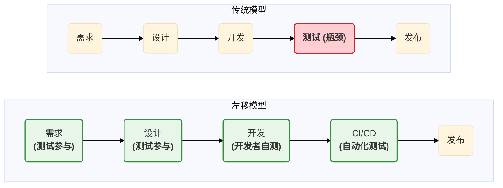
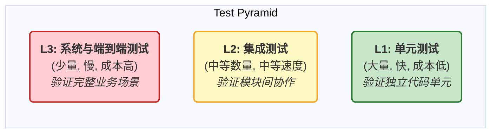
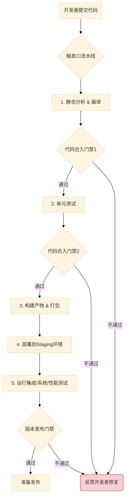

# 00\_测试策略总览

- **标题**: 测试策略总览
- **当前版本**: v1.0.0
- **最后更新**: 2025-09-29
- **负责人**: Klein

-----

## 概述

**概要**: 本文件是雷达数据处理系统所有质量保障活动的**最高指导纲领**，旨在通过建立一套系统化、可度量的测试策略，确保最终交付的产品在功能上完整无缺（健壮性），在异常情况下能稳定运行并自我恢复（可靠性），同时满足所有关键性能指标（高性能）。它将作为所有测试活动（从单元测试到可靠性测试）的设计、执行和评估的唯一依据，是团队在质量保障方面的“技术宪法”。

-----

## 目录

- [00\_测试策略总览.md](#00_测试策略总览md)
  - [概述](#概述)
  - [目录](#目录)
  - [1 文档职责与目标](#1-文档职责与目标)
    - [1.1 文档定位](#11-文档定位)
    - [1.2 核心目标](#12-核心目标)
    - [1.3 读者引导与文档索引](#13-读者引导与文档索引)
      - [1.3.1 读者角色与阅读路径](#131-读者角色与阅读路径)
      - [1.3.2 文档索引](#132-文档索引)
  - [2 核心测试哲学与原则](#2-核心测试哲学与原则)
    - [2.1 自动化优先 (Automation-First)](#21-自动化优先-automation-first)
    - [2.2 质量内建与左移测试 (Quality Built-in \& Shift-Left)](#22-质量内建与左移测试-quality-built-in--shift-left)
      - [2.2.1 开发者自测](#221-开发者自测)
      - [2.2.2 代码审查 (Code Review)](#222-代码审查-code-review)
    - [2.3 缺陷预防优于检测 (Prevention over Detection)](#23-缺陷预防优于检测-prevention-over-detection)
  - [3 测试分层策略：测试金字塔](#3-测试分层策略测试金字塔)
    - [3.1 测试金字塔模型总览](#31-测试金字塔模型总览)
    - [3.2 各层级定义与详解](#32-各层级定义与详解)
      - [3.2.1 L1 - 单元测试 (Unit Tests)](#321-l1---单元测试-unit-tests)
      - [3.2.2 L2 - 集成测试 (Integration Tests)](#322-l2---集成测试-integration-tests)
      - [3.2.3 L3 - 系统与端到端测试 (System \& E2E Tests)](#323-l3---系统与端到端测试-system--e2e-tests)
      - [3.2.4 非功能性测试 (Non-Functional Tests)](#324-非功能性测试-non-functional-tests)
  - [4 质量保障与流程](#4-质量保障与流程)
    - [4.1 质量门禁 (Quality Gates)](#41-质量门禁-quality-gates)
      - [4.1.1 代码合入(Merge)门禁](#411-代码合入merge门禁)
      - [4.1.2 版本发布(Release)门禁](#412-版本发布release门禁)
    - [4.2 CI/CD 集成策略](#42-cicd-集成策略)
  - [5 附录](#5-附录)
    - [5.1 术语表](#51-术语表)
    - [5.2 变更历史](#52-变更历史)
-----

## 1 文档职责与目标

**概要**: 本章确立了本文档的权威性、核心目标和适用范围，并为项目中的不同角色（如开发、测试、运维）提供了清晰的阅读路径和文档依赖关系，确保所有团队成员对测试策略有一致的理解。

### 1.1 文档定位

**概要**: 本文档是整个测试体系的最高指导纲领和所有测试活动的“宪法”。它作为项目质量保障的**单一事实来源 (Single Source of Truth)**，其定义的原则、策略和标准，其权威性高于任何特定模块的局部或临时测试计划。

本文档的核心定位在于：

  * **建立基准**: 为所有测试活动提供统一的基准和语言，确保无论团队如何扩展、项目如何演进，对质量的理解和追求始终保持一致。
  * **指导决策**: 当面临关于测试投入、风险评估和发布决策的权衡时，本文档中定义的原则和质量门禁将作为决策的核心依据。
  * **凝聚共识**: 它是团队成员之间关于“什么是高质量软件”以及“如何实现高质量”的共同承诺和契约。

### 1.2 核心目标

**概要**: 本文档的最终使命是通过建立一套系统化、可度量的测试策略，确保最终交付的产品在功能上完整无缺（**健壮性**），在异常情况下能稳定运行并自我恢复（**可靠性**），同时满足所有关键性能指标（**高性能**）。

具体来说，本文档旨在达成以下目标：

  * **保障健壮性 (Robustness)**: 确保系统能正确处理所有规格说明内的有效输入，并能优雅地拒绝和处理所有无效或异常的输入。这主要通过**单元测试、集成测试和系统功能测试**来验证。
  * **保障可靠性 (Reliability)**: 确保系统在规定的环境条件下和指定的时间内，能够持续无故障地执行其核心功能。这需要通过**故障注入测试、恢复性测试和长时间的稳定性（浸泡）测试**来验证系统在面对模块崩溃、网络异常等问题时的容错和自愈能力。
  * **保障高性能 (High Performance)**: 确保系统的各项关键性能指标（KPIs），如数据吞吐量、处理延迟、UI刷新率和资源利用率，完全满足或优于设计要求。这需要通过**负载测试、压力测试和剖析 (Profiling)** 来验证。
  * **管理风险与建立信心**: 通过系统化的测试活动，主动识别和量化技术风险，并为每次版本发布提供充足的质量数据支持，从而为团队和利益相关者建立发布信心。

### 1.3 读者引导与文档索引

**概要**: 为了帮助不同角色的团队成员高效地理解和应用本测试策略，本节提供了建议的阅读路径和到其他详细测试文档的索引链接。

#### 1.3.1 读者角色与阅读路径

| 角色 (Role)           | 建议阅读重点                                                                                                        | 核心目标 (Core Objective)                                                                        |
| :-------------------- | :------------------------------------------------------------------------------------------------------------------ | :----------------------------------------------------------------------------------------------- |
| **开发工程师**        | **`00_测试策略总览.md`** (重点: 第2、3章) **`01_单元测试规范.md`** (精读) **`05_测试环境与工具链.md`** (参考) | 理解并遵循测试原则，编写高质量、高可测性的代码，并为其配备完整的单元测试。                       |
| **测试/QA工程师**     | **通读所有文档** (重点: `02` 至 `06` 的方案文档)                                                                    | 深入理解整体测试策略，负责设计、实现和执行集成、系统、性能及可靠性测试用例，并保障最终产品质量。 |
| **架构师/技术负责人** | **`00_测试策略总览.md`** (精读) `03` 至 `06` 的方案文档 (评审)                                                   | 确保测试策略与系统架构设计保持一致，评估技术选型的可测试性，并从宏观上把控质量风险。             |
| **项目/产品经理**     | **`00_测试策略总览.md`** (重点: 第1、4章) **`07_测试报告与缺陷管理规范.md`** (理解)                              | 理解项目的质量保障流程、客观的发布标准（质量门禁）和缺陷管理机制，以支持项目规划和发布决策。     |

#### 1.3.2 文档索引

本总览文件是`06_测试设计`目录的入口，以下是该目录下其他核心设计文档的链接及其职责：

  * **[ `01_单元测试规范.md` ](/docs/01_项目设计/06_测试设计/01_单元测试规范.md)**: 定义了编写单元测试的规则、工具和最佳实践。
  * **[ `02_集成测试方案.md` ](/docs/01_项目设计/06_测试设计/02_集成测试方案.md)**: 描述了如何测试服务器内部多个模块的协同工作。
  * **[ `03_系统与端到端测试方案.md` ](/docs/01_项目设计/06_测试设计/03_系统与端到端测试方案.md)**: 规划了如何从用户视角测试整个分布式系统的完整业务流程。
  * **[ `04_性能测试方案.md` ](/docs/01_项目设计/06_测试设计/04_性能测试方案.md)**: 定义了如何验证系统的各项性能KPI。
  * **[ `05_测试环境与工具链.md` ](/docs/01_项目设计/06_测试设计/05_测试环境与工具链.md)**: 规定了所有测试活动所依赖的环境、库和工具。
  * **[ `06_可靠性与恢复性测试方案.md` ](/docs/01_项目设计/06_测试设计/06_可靠性与恢复性测试方案.md)**: 阐述了如何通过故障注入等手段测试系统的稳定性和容错能力。
  * **[ `07_测试报告与缺陷管理规范.md` ](/docs/01_项目设计/06_测试设计/07_测试报告与缺陷管理规范.md)**: 规范了测试结果的呈现方式和缺陷的处理流程。

-----

## 2 核心测试哲学与原则

**概要**: 本章定义了指导我们所有测试活动的根本思想和准则。这些原则不仅仅是口号，而是将融入代码审查、CI/CD流程和日常开发实践中的可执行信条，是团队在质量保障方面的共同信念。

### 2.1 自动化优先 (Automation-First)

**概要**: 确立所有可重复的、确定性的测试（单元、集成、部分系统测试）都必须自动化的核心原则，以提高效率、减少人为错误并支持高频次的CI/CD集成。

- 自动化是本测试策略的基石。其核心价值在于构建一个快速、可靠且可重复的反馈循环。每一次代码提交都应触发一系列自动化测试，为开发者提供即时的质量反馈，这使得团队能够自信地进行代码重构和功能迭代，而不必担心引入回归性缺陷。

- 此原则并非要完全取代手动测试，而是要优化其价值。通过将回归测试、接口验证等重复性工作交由机器完成，我们可以将宝贵的人力资源投入到更具创造性的**探索性测试**、**可用性测试**以及无法被有效自动化的复杂业务场景验证中。最终目标是达到一种高度自动化的状态，使得任何版本的软件都能通过CI/CD流水线得到充分验证，从而具备随时按需发布的能力。

### 2.2 质量内建与左移测试 (Quality Built-in & Shift-Left)

**概要**: 强调质量是每个开发者的责任，测试活动应尽可能在开发流程中提早进行（“左移”），而不是作为开发结束后的一个独立阶段。

- “左移测试”是将质量保障活动从传统开发流程的末端（右侧）向前端（左侧）迁移的核心思想。它倡导质量是**内建于**开发过程中的，而非在事后**检验出来**的。这意味着从需求分析、架构设计到编码实现的每一个环节，都必须融入质量的考量。

下面的图表演示了从传统测试模型到“左移”模型的转变：

这种转变将质量责任分散到整个团队，使每个成员都成为质量的守护者。

#### 2.2.1 开发者自测

**概要**: 规定开发者在提交代码前，有责任为其新功能编写并执行通过的单元测试。

- 开发者自测是“左移”理念最基础的实践。它要求单元测试不再是可选的“附加品”，而是与功能代码同等重要的**核心交付物**。对于任何一项功能开发或缺陷修复，其“完成的定义 (Definition of Done)”必须包含编写并通过了相应的单元测试。这些测试不仅验证了代码的正确性，更成为了代码意图的“可执行文档”，极大地提升了代码的可维护性和未来重构的安全性。

#### 2.2.2 代码审查 (Code Review)

**概要**: 将测试用例的覆盖度和质量作为代码审查的关键环节之一，确保代码的可测试性。

代码审查是保障内建质量的另一个关键实践。审查者不仅需要关注代码的业务逻辑和风格，更需要从质量和可维护性的角度，扮演“代码质量守门员”的角色。所有代码合入请求的审查清单必须包括以下关于测试的检查点：

  - **可测试性 (Testability)**: 代码设计是否易于测试？例如，是否遵循了依赖注入原则，以方便模拟依赖项？是否存在难以测试的庞大类或函数？
  - **测试覆盖度 (Coverage)**: 提交的单元测试是否充分覆盖了新代码的逻辑分支和边界条件？
  - **测试质量 (Quality)**: 测试用例自身是否清晰、健壮？断言是否准确有力？是否存在脆弱的（brittle）测试？
  - **文档一致性**: 代码和测试中的注释是否与实际行为一致？

### 2.3 缺陷预防优于检测 (Prevention over Detection)

**概要**: 阐述测试活动的核心目标不仅是发现缺陷，更重要的是通过建立规范、使用静态分析工具等手段，从源头上预防缺陷的产生。

在软件工程中，缺陷被发现得越晚，其修复成本就越高。本原则的核心思想是将投资更多地放在**预防**上，而非昂贵的**检测和修复**上。我们的系统设计和开发流程中集成了多种缺陷预防机制：

  * **严格的接口规范**: 通过在 `01_模块接口规范.md` 和 `06_事件接口规范.md` 中定义清晰的、类型安全的接口契约，从根本上消除了大量因误解或误用接口而导致的集成问题。
  * **依赖注入架构**: 整个系统采用依赖注入模式，降低了模块间的耦合度，使得每个模块的逻辑更简单、更独立，从而减少了因复杂依赖关系而产生的缺陷。
  * **静态代码分析**: 在CI/CD流水线中集成静态分析工具（如Clang-Tidy），可以在代码运行前就自动发现潜在的bug、内存泄漏和不规范的编码实践。
  * **设计评审**: 在编码开始前，对架构和模块设计文档进行深入评审，能够发现并修正顶层的设计缺陷，避免其在实现阶段被放大，造成巨大的返工成本。

-----

## 3 测试分层策略：测试金字塔

**概要**: 本章正式引入并阐述项目的核心测试分层模型——测试金字塔。它是一种经过业界验证的、平衡测试成本、执行速度和覆盖范围的最佳实践，用于指导测试资源的战略性投入。

### 3.1 测试金字塔模型总览

**概要**: 通过标准金字塔图表，直观展示“底层单元测试多而快，顶层端到端测试少而精”的核心思想。该模型是一种测试组合的**投资策略**，它倡导将大部分测试精力投入到快速、稳定且成本低的单元测试上，从而以最高的效率和最低的成本获得对代码质量的信心。

该模型的战略价值在于，它清晰地揭示了不同测试类型在**反馈速度、维护成本和集成范围**之间的权衡。位于金字塔底层的测试反馈最快、成本最低，应占据最大比例；而顶层的测试最接近真实用户场景，但成本高昂且执行缓慢，应只覆盖最关键的业务流程。

### 3.2 各层级定义与详解

**概要**: 详细描述金字塔每一层的职责、测试范围、关键技术和预期目标，为开发者和测试工程师提供清晰的执行指引。

#### 3.2.1 L1 - 单元测试 (Unit Tests)

  - **核心目标**: 验证系统中最小的可测试单元（通常是单个类或函数）的逻辑是否正确。
  - **测试范围**: 独立的算法策略实现、工具类、ViewModel的逻辑转换、配置解析逻辑等。
  - **关键实践**:
      - **白盒测试**: 测试者完全了解被测代码的内部结构，并据此设计测试用例以覆盖所有重要的代码路径和边界条件。
      - **完全隔离**: **必须**使用Mock框架（如GoogleMock）模拟所有外部依赖（如`ILogger`, `IEventBus`等），确保测试只关注被测单元自身逻辑，不受外部环境影响。
      - **快速执行**: 单个测试的执行时间应在**毫秒级**，所有单元测试应在几分钟内运行完毕，以便在每次代码提交时都能快速得到反馈。
  - **文档引用**: 详细的编码规范和实践指南，请参阅 **[ `01_单元测试规范.md` ](/docs/01_项目设计/06_测试设计/01_单元测试规范.md)**。

#### 3.2.2 L2 - 集成测试 (Integration Tests)

  - **核心目标**: 验证多个模块组合在一起时，它们之间的交互和接口契约是否按预期工作。
  - **测试范围**:
      - **数据面管道**: 测试从`DataReceiver`的输入队列到`DataProcessor`输出队列的完整数据流，验证数据格式、内容和零拷贝机制的正确性。
      - **控制面协调**: 测试`TaskScheduler`与业务模块之间的生命周期管理，以及基于`EventBus`的事件发布与订阅是否能正确触发协调动作。
  - **关键实践**:
      - **灰盒测试**: 测试者了解模块间的接口和交互协议，但不关心每个模块的内部实现细节。
      - **桩(Stub)与驱动(Driver)**: 使用模拟的入口（如模拟的`DataReceiver`）和出口（如模拟的`DisplayController`）来驱动和验证中间的真实模块组合。
  - **文档引用**: 详细的测试场景和搭建方案，请参阅 **[ `02_集成测试方案.md` ](/docs/01_项目设计/06_测试设计/02_集成测试方案.md)**。

#### 3.2.3 L3 - 系统与端到端测试 (System & E2E Tests)

  - **核心目标**: 从最终用户的视角，将整个已部署的分布式系统（包括核心服务器和显控终端）作为一个**黑盒**，验证其是否满足完整的业务需求。
  - **测试范围**: 覆盖最关键的用户场景，例如“启动系统 -\> 接收数据 -\> 屏幕显示航迹 -\> 发送控制命令 -\> 系统状态变更”。
  - **关键实践**:
      - **黑盒测试**: 完全不关心系统内部实现，只通过公开的外部接口（REST API、UDP端口）和用户界面(UI)进行交互和验证。
      - **自动化脚本**: 主要通过外部自动化测试脚本（如Python脚本）来驱动，模拟雷达数据源和用户操作。
  - **文档引用**: 核心业务场景的测试用例，请参阅 **[ `03_系统与端到端测试方案.md` ](/docs/01_项目设计/06_测试设计/03_系统与端到端测试方案.md)**。

#### 3.2.4 非功能性测试 (Non-Functional Tests)

  - **核心目标**: 验证系统的运行质量，即“它工作得好不好”，而非“它能否工作”。
  - **测试范围**: 这是一个贯穿整个测试体系的正交维度，专注于系统的性能、可靠性、安全性等方面。
  - **关键实践**:
      - **性能测试**: 通过负载和压力测试，验证系统的各项KPI（如吞吐量、延迟）是否达标。
      - **可靠性测试**: 通过故障注入和长时间浸泡测试，验证系统的稳定性和自愈能力。
  - **文档引用**: 详细的测试方案，请参阅 **[ `04_性能测试方案.md` ](/docs/01_项目设计/06_测试设计/04_性能测试方案.md)** 和 **[ `06_可靠性与恢复性测试方案.md` ](/docs/01_项目设计/06_测试设计/06_可靠性与恢复性测试方案.md )**。

-----

## 4 质量保障与流程

**概要**: 本章将测试策略具体化为可执行的流程和可量化的标准，通过自动化的质量门禁，将质量标准固化到开发流程中，使其成为不可逾越的“防火墙”。

### 4.1 质量门禁 (Quality Gates)

**概要**: 定义代码在开发生命周期中从一个阶段流向下一个阶段前，必须**自动**满足的客观质量标准。它是质量内建原则的强制执行机制，是确保软件质量不会因迭代而退化的关键防线。

#### 4.1.1 代码合入(Merge)门禁

  - **目标**: 确保`main`或`develop`等主干分支在任何时候都保持**健康、稳定且可发布**的状态。
  - **自动化检查项**:
      - `[x]` **静态代码分析**: 使用Clang-Tidy等工具进行检查，确保没有新增的`高/中`优先级问题。
      - `[x]` **成功编译**: 代码必须在所有目标平台上成功编译，无任何错误和高风险警告。
      - `[x]` **单元测试全数通过**: 所有单元测试用例的通过率必须为**100%**。
      - `[x]` **代码覆盖率达标**: 新增或修改代码的单元测试覆盖率**不得低于85%**，且不得拉低项目总体覆盖率。

#### 4.1.2 版本发布(Release)门禁

  - **目标**: 确保准备发布的版本在功能、性能和稳定性上都已达到可交付给最终用户的标准。
  - **自动化与手动检查项**:
      - `[x]` **关键用例通过**: 所有P0/P1级别的**集成和系统测试用例通过率必须为100%**。
      - `[x]` **性能达标**: 在预发布环境中，关键性能指标（如处理延迟）必须满足设计要求。
      - `[x]` **无严重缺陷**: 在缺陷管理系统中，不得存在任何状态为“未解决”的`Blocker`或`Critical`级别的缺陷。
      - `[x]` **文档完备**: 所有面向用户的变更必须有对应的文档更新。

### 4.2 CI/CD 集成策略

**概要**: 描述各层级自动化测试如何无缝集成到持续集成/持续部署(CI/CD)流水线中，实现从代码提交到生成质量报告的全流程自动化。流水线将强制执行`4.1`节中定义的质量门禁，任何不满足条件的构建都将被自动阻止。

**CI/CD 流水线示意图**:

-----

## 5 附录

### 5.1 术语表

| 术语           | 英文全称 / 缩写                                | 定义与说明                                                                                   |
| :------------- | :--------------------------------------------- | :------------------------------------------------------------------------------------------- |
| **Mock对象**   | Mock Object                                    | 在单元测试中，用于模拟真实依赖行为的“伪造”对象。它可以被编程以返回特定的值或验证特定的调用。 |
| **桩 (Stub)**  | Stub                                           | 为测试提供固定数据的简单对象，通常用于替换那些难以访问或状态不稳定的依赖。                   |
| **故障注入**   | Fault Injection                                | 一种可靠性测试技术，通过在系统中故意引入错误（如网络中断、模块崩溃）来测试其容错和恢复能力。 |
| **浸泡测试**   | Soak Testing                                   | 一种长时间的稳定性测试，通过让系统在正常负载下持续运行（如48小时），以检测内存泄漏等问题。   |
| **回归测试**   | Regression Testing                             | 在代码发生变更后，重新运行已有的测试用例，以确保新代码没有破坏现有功能的正确性。             |
| **CI/CD**      | Continuous Integration / Continuous Deployment | 持续集成/持续部署，一种通过自动化来频繁地交付应用的软件开发实践。                            |
| **测试覆盖率** | Test Coverage                                  | 一种度量代码被测试用例执行程度的指标，通常用百分比表示。                                     |

### 5.2 变更历史

| 版本号 | 日期       | 作者  | 变更描述                                                   |
| :----- | :--------- | :---- | :--------------------------------------------------------- |
| v1.0.0 | 2025-09-29 | Klein | 初始版本创建，基于项目整体架构，制定了全面的测试策略总览。 |
