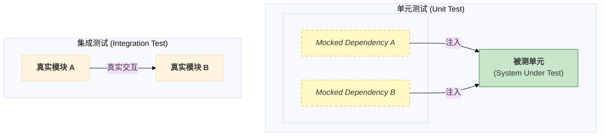

# 01\_单元测试规范

- **标题**: 单元测试规范
- **当前版本**: v1.0.0
- **最后更新**: 2025-09-29
- **负责人**: Klein

-----

## 概述

**概要**: 本文档是面向每一位系统开发工程师的**编码级测试指南**和**强制性操作手册**。它将 [ **`00_测试策略总览.md`** ](/docs/01_项目设计/06_测试设计/00_测试策略总览.md) 中定义的“质量内建”和“开发者自测”原则，转化为具体、可执行的编码实践。本文档的核心使命是确保项目中所有单元测试在**思想上保持一致**，在**结构上保持清晰**，在**质量上达到高标准**，从而共同构筑起测试金字塔最坚实、最宽广的基座。

-----

## 目录

- [01\_单元测试规范](#01_单元测试规范)
  - [概述](#概述)
  - [目录](#目录)
  - [1. 文档职责与目标](#1-文档职责与目标)
    - [1.1. 文档定位](#11-文档定位)
    - [1.2. 核心目标](#12-核心目标)
  - [2. 核心原则与工具链](#2-核心原则与工具链)
    - [2.1. 单元测试的定义与范围](#21-单元测试的定义与范围)
    - [2.2. FIRST 原则](#22-first-原则)
    - [2.3. 官方工具链](#23-官方工具链)
  - [3. 测试用例编写规范](#3-测试用例编写规范)
    - [3.1. 结构：Arrange-Act-Assert](#31-结构arrange-act-assert)
      - [3.1.1 设计原理](#311-设计原理)
      - [3.1.2 代码实现规范](#312-代码实现规范)
    - [3.2. 命名约定](#32-命名约定)
      - [3.2.1. 测试用例命名详解](#321-测试用例命名详解)
      - [3.2.2. 设计原理](#322-设计原理)
    - [3.3. 断言最佳实践](#33-断言最佳实践)
      - [3.3.1. 选择断言宏：`ASSERT_*` vs. `EXPECT_*`](#331-选择断言宏assert_-vs-expect_)
      - [3.3.2. 单一逻辑断言原则](#332-单一逻辑断言原则)
      - [3.3.3. 使用专用断言与匹配器](#333-使用专用断言与匹配器)
      - [3.3.4. 浮点数比较的强制规范](#334-浮点数比较的强制规范)
  - [4. 隔离与模拟](#4-隔离与模拟)
    - [4.1. 隔离的核心地位](#41-隔离的核心地位)
      - [4.1.1. 精确的故障定位](#411-精确的故障定位)
      - [4.1.2. 可重复性与确定性](#412-可重复性与确定性)
      - [4.1.3. 极速的反馈循环](#413-极速的反馈循环)
    - [4.2. 使用 GoogleMock 进行模拟](#42-使用-googlemock-进行模拟)
      - [4.2.1. 模拟对象范围](#421-模拟对象范围)
      - [4.2.2. 核心 API 与实践 (`EXPECT_CALL`)](#422-核心-api-与实践-expect_call)
      - [4.2.3. 验证交互而非状态](#423-验证交互而非状态)
  - [5. 代码示例：测试一个算法策略](#5-代码示例测试一个算法策略)
    - [5.1. 被测代码](#51-被测代码)
    - [5.2. Mock 依赖](#52-mock-依赖)
    - [5.3. 测试代码](#53-测试代码)
      - [5.3.1. 测试夹具设置](#531-测试夹具设置)
      - [5.3.2. 测试用例 1：确认航迹](#532-测试用例-1确认航迹)
      - [5.3.3. 测试用例 2：删除航迹](#533-测试用例-2删除航迹)
      - [5.3.4. 测试用例 3：忽略非试探性航迹](#534-测试用例-3忽略非试探性航迹)
  - [6. 附录](#6-附录)
    - [6.1. 术语表](#61-术语表)
    - [6.2. 变更历史](#62-变更历史)

-----

## 1\. 文档职责与目标

### 1.1. 文档定位

**概要**: 本文档是项目中关于单元测试的**唯一权威编码标准**。它不仅规定了“用什么工具”，更核心的是定义了“如何正确地用”。本文档是每一位开发者在编写单元测试时的**首要参考**，也是代码审查 (Code Review) 过程中衡量单元测试质量的**客观标尺**。

本文档的定位是**战术执行手册**，它将 [ **`00_测试策略总览.md`** ](/docs/01_项目设计/06_测试设计/00_测试策略总览.md) 中提出的高层战略转化为开发者日常工作中可遵循、可衡量的具体行动。

| 范畴     | 本文档**是**...                                                  | 本文档**不是**...                                  |
| :------- | :--------------------------------------------------------------- | :------------------------------------------------- |
| **职责** | 一份面向开发者的**编码与实践指南**，专注于代码单元的正确性验证。 | 一份集成或系统测试计划，不关心模块间的真实交互。   |
| **目标** | 确保代码的**微观质量**，为重构和持续集成提供基础安全保障。       | 验证完整的端到端业务流程或非功能性指标（如性能）。 |
| **产物** | 高质量、可维护的**单元测试代码**本身。                           | 详尽的测试报告或缺陷分析。                         |

### 1.2. 核心目标

**概要**: 本规范的最终目标是构建一个全面、快速、可靠的单元测试套件，以此作为整个质量保障体系的基石。

  - **保障逻辑正确性**:

      - **目标**: 确保系统中最小的代码单元（类、函数）在各种输入和边界条件下都能按预期工作。
      - **实践**: 测试用例必须覆盖**正常逻辑路径**、所有重要的**边界条件**（例如，缓冲区满/空、指针为空、索引越界）以及可预见的**错误处理路径**。

  - **驱动高质量设计**:

      - **目标**: 通过对“可测试性”的强制要求，反向驱动开发者写出**高内聚、低耦合**的健壮代码。
      - **实践**: 如果一个类难以被单元测试，这通常是其设计存在问题的明确信号（例如，职责过多、依赖过紧）。本规范鼓励开发者将“易于测试”作为代码设计的重要衡量标准，这与系统架构坚持的**依赖注入 (Dependency Injection)** 原则相辅相成。

  - **提供安全网 (Safety Net)**:

      - **目标**: 创建一套全面的回归测试集，使团队能够自信地进行代码重构、性能优化和功能迭代，而无需担心引入意外的副作用。
      - **实践**: 每一次代码合入前，CI流水线都会完整运行所有单元测试。这个快速反馈循环是实现**持续集成**和保障主干分支稳定性的关键。

  - **创建“活文档” (Living Documentation)**:

      - **目标**: 单元测试本身应作为被测代码最清晰、最准确的**使用示例文档**。
      - **实践**: 遵循本规范的命名和结构约定，一个测试用例的名称和代码就能清晰地表达出被测方法在特定场景下的预期行为。与静态注释不同，这份“文档”是可执行的，因此永远不会过时。

-----

## 2\. 核心原则与工具链

### 2.1. 单元测试的定义与范围

**概要**: 在本项目中，一个**单元测试**被严格定义为针对单个C++类或一小组紧密协作的类的行为验证。其核心特征是**完全隔离**——被测单元必须与其真实的依赖项（如其他模块、文件系统、网络）完全隔离开来。



  - **测试对象**:
      - **是什么**: 独立的算法策略类 (`IConfirmer`的实现)、ViewModel的逻辑转换、配置解析器、工具类等。
      - **不是什么**: 两个真实模块的交互（`DataReceiver` -\> `SignalProcessor`）、`TaskScheduler`对模块的生命周期管理等。
  - **隔离要求**:
      - **禁止与外部世界交互**: 单元测试严禁依赖任何外部环境，包括文件系统、网络、数据库或系统时间。
      - **必须模拟内部依赖**: 所有通过依赖注入传入的内部服务接口，都**必须**使用模拟框架伪造。

### 2.2. FIRST 原则

**概要**: 所有单元测试都必须遵循业界公认的**FIRST**原则，这是衡量单元测试质量的黄金标准。

| 原则       | 英文                | 描述                                                             | 在本项目的具体体现                                                                                       |
| :--------- | :------------------ | :--------------------------------------------------------------- | :------------------------------------------------------------------------------------------------------- |
| **快速**   | **F**ast            | 单元测试应该运行得非常快。                                       | CI流水线要求所有单元测试在**5分钟内**运行完毕，为开发者提供即时反馈。                                    |
| **独立**   | **I**ndependent     | 每个测试用例都应能独立运行，并且可以按任何顺序运行。             | 测试夹具 (`Test Fixture`) 的`SetUp()`/`TearDown()`方法确保每个测试都在纯净的环境中开始和结束。           |
| **可重复** | **R**epeatable      | 测试应能在任何环境中重复执行，并产生相同的结果。                 | 通过**完全模拟**所有外部依赖和使用**容器化的CI环境**，消除了环境差异。                                   |
| **自验证** | **S**elf-Validating | 测试的输出应该是布尔型的（通过或失败），无需人工干预来解读结果。 | 所有验证逻辑都必须封装在`ASSERT_*`/`EXPECT_*`断言中，测试运行器 (`ctest`) 的返回码是唯一的结果判定依据。 |
| **及时**   | **T**imely          | 单元测试应该在编写生产代码的同时或之前（TDD）编写。              | 这是“**左移测试**” 的核心实践。包含新功能的合并请求**必须**同时包含对应的单元测试。                      |

### 2.3. 官方工具链

**概要**: 为保证项目内所有单元测试的一致性和集成效率，我们规定了统一的测试工具栈，该工具栈已在 [ **`05_测试环境与工具链.md`** ](/docs/01_项目设计/06_测试设计/05_测试环境与工具链.md) 中详细定义。

| 类别         | 工具选型       | 版本    | 选型理由 (Rationale)                                                                                                        |
| :----------- | :------------- | :------ | :-------------------------------------------------------------------------------------------------------------------------- |
| **测试框架** | **GoogleTest** | `1.12+` | 功能完备，提供丰富的断言库、测试夹具和参数化测试能力。能够生成CI/CD工具链兼容的JUnit XML报告。                              |
| **模拟框架** | **GoogleMock** | `1.12+` | 与GoogleTest无缝集成。提供了强大的语法来创建和配置Mock对象，是测试基于**依赖注入**和**抽象接口** 的系统架构的关键使能技术。 |

-----

## 3\. 测试用例编写规范

**概要**: 本章是单元测试的**战术实施手册**，旨在将抽象的测试原则转化为具体、可执行的编码标准。遵循本章规范是编写出**清晰、健壮、可维护**测试用例的前提，也是保障代码审查效率和测试套件长期价值的关键。

### 3.1. 结构：Arrange-Act-Assert

**概要**: 所有测试用例的内部逻辑**必须**严格遵循**准备-行动-断言 (Arrange-Act-Assert, AAA)** 模式。这是一种业界公认的最佳实践，它通过将测试代码强制划分为三个逻辑清晰的阶段，极大地提升了测试的**可读性**和**意图的明确性**。

| 阶段               | 英文        | 核心职责                                                                                                                             |
| :----------------- | :---------- | :----------------------------------------------------------------------------------------------------------------------------------- |
| **准备 (Arrange)** | **Arrange** | 初始化并设置测试所需的所有前提条件。这包括创建被测对象 (SUT - System Under Test)、创建并配置其所有依赖的Mock对象、以及准备输入数据。 |
| **行动 (Act)**     | **Act**     | 执行被测单元的**那一个**核心动作。此阶段通常只有一行代码，即对被测方法的调用。                                                       |
| **断言 (Assert)**  | **Assert**  | 验证“行动”阶段产生的结果是否符合预期。这包括检查返回值、验证对象的最终状态，以及通过GoogleMock隐式验证与依赖项的交互是否正确。       |

#### 3.1.1 设计原理

> AAA模式强制实现**关注点分离 (Separation of Concerns)**。它使测试的意图一目了然：读者可以快速区分测试的“准备工作”、“执行动作”和“结果验证”，从而极大地降低了理解和维护测试代码的认知负荷。

#### 3.1.2 代码实现规范

在测试代码中，**必须**使用注释 `// Arrange`、`// Act`、`// Assert` 来明确标识这三个部分。

```cpp
TEST_F(MyClassTest, MyMethod_StateUnderTest_ExpectedBehavior) {
    // Arrange
    // - 创建被测对象 (SUT)。
    // - 创建并设置其所有依赖的Mock对象。
    // - 定义输入数据和Mock对象的预期行为 (EXPECT_CALL)。

    // Act
    // - 调用被测对象的那个需要被测试的方法。

    // Assert
    // - 使用GoogleTest的断言宏 (EXPECT_* 或 ASSERT_*) 验证结果。
}
```

### 3.2. 命名约定

**概要**: 清晰的命名是实现测试作为\*\*“活文档” (Living Documentation)\*\* 这一核心目标的关键。测试的名称应像一个完整的句子，让读者在不查看实现的情况下就能精确理解该测试的**上下文、行为和预期结果**。

| 实体 (Entity)             | 命名格式 (Format)                            | 示例 (Example)                                    |
| :------------------------ | :------------------------------------------- | :------------------------------------------------ |
| **测试文件**              | `<class_name>_test.cpp`                      | `simple_confirmer_test.cpp`                       |
| **测试套件 (Test Suite)** | `ClassNameTest`                              | `SimpleConfirmerTest`                             |
| **测试用例 (Test Case)**  | `MethodName_StateUnderTest_ExpectedBehavior` | `ShouldConfirm_TrackMeetsAllCriteria_ReturnsTrue` |

#### 3.2.1. 测试用例命名详解

  - **`MethodName`**: 被测方法的名称。
  - **`StateUnderTest`**: 被测对象或环境所处的特定状态（例如 `BufferIsEmpty`, `InvalidInput`）。
  - **`ExpectedBehavior`**: 在此状态下调用该方法后预期的行为（例如 `ReturnsFalse`, `ThrowsException`）。

**示例**: `TEST_F(DataReceiverTest, Initialize_PortInUse_ReturnsError)` 这个名称清晰地传达了：

  - **测试对象**: `DataReceiver` 类的 `Initialize` 方法。
  - **测试场景**: 当网络端口已被占用时。
  - **预期结果**: 该方法应返回一个错误。

#### 3.2.2. 设计原理

> `MethodName_StateUnderTest_ExpectedBehavior` 这种结构化的命名格式，虽然稍长，但其价值巨大。当测试失败时，CI/CD系统或测试运行器输出的失败报告（例如 `[ FAILED ] SimpleConfirmerTest.ShouldConfirm_SnrIsTooLow_ReturnsFalse`）本身就成为一条**信息极其丰富**的缺陷报告，极大地加速了问题定位过程。它强制开发者在编写测试前就想清楚这三个核心要素，从而提升测试设计的质量。

### 3.3. 断言最佳实践

**概要**: 断言是测试的“心脏”，它负责执行最终的验证。正确、精确地使用断言是编写出稳定、可靠、无歧义测试的关键。

#### 3.3.1. 选择断言宏：`ASSERT_*` vs. `EXPECT_*`

  - **原则**: **永远优先使用 `EXPECT_*`**。
  - **对比**:

| 宏类型         | 行为                                                                       | 适用场景                                                                                                                               |
| :------------- | :------------------------------------------------------------------------- | :------------------------------------------------------------------------------------------------------------------------------------- |
| **`EXPECT_*`** | 断言失败时，记录失败信息，但**继续执行**当前测试用例的剩余部分。           | **绝大多数情况**。这有助于在一次测试运行中发现多个不相关的失败点，提升调试效率。                                                       |
| **`ASSERT_*`** | 断言失败时，记录失败信息，并**立即中止**当前测试用例的执行，产生致命失败。 | **仅用于**后续代码的正确执行**严重依赖**于当前断言结果的场景。例如，必须先 `ASSERT_NE(ptr, nullptr)`，后续代码才能安全地解引用 `ptr`。 |

#### 3.3.2. 单一逻辑断言原则

  - **原则**: **一个测试用例应只验证一个核心的逻辑概念**。

  - **说明**: 这并不意味着一个测试只能有一个 `EXPECT_*` 语句，而是指所有的断言都应服务于同一个验证目标。如果一个方法有多个**相互独立**的行为需要验证，应为每个行为编写**独立的测试用例**。

  - **正例 (Good Example)**:

    ```cpp
    // 测试用例1: 验证返回值
    TEST_F(QueueTest, Pop_FromNonEmptyQueue_ReturnsCorrectValue) {
        // Arrange
        my_queue.push(10);
        my_queue.push(20);
        // Act
        auto result = my_queue.pop();
        // Assert
        EXPECT_EQ(result, 10);
    }

    // 测试用例2: 验证队列大小变化
    TEST_F(QueueTest, Pop_FromNonEmptyQueue_DecrementsSize) {
        // Arrange
        my_queue.push(10);
        // Act
        my_queue.pop();
        // Assert
        EXPECT_EQ(my_queue.size(), 0);
    }
    ```

#### 3.3.3. 使用专用断言与匹配器

  - **原则**: **尽可能使用GoogleTest提供的专用断言和匹配器 (Matchers)**，而不是通用的 `ASSERT_TRUE`。
  - **理由**: 专用断言在失败时能提供**信息量远比 `true is not false` 更丰富**的诊断信息。

| 场景           | 不推荐的做法                 | 推荐的做法                                         | 失败信息对比                                            |
| :------------- | :--------------------------- | :------------------------------------------------- | :------------------------------------------------------ |
| **字符串比较** | `ASSERT_TRUE(str1 == str2);` | `ASSERT_EQ(str1, str2);`                           | 前者报告"false"，后者报告"str1='hello' vs str2='world'" |
| **容器比较**   | `ASSERT_TRUE(vec1 == vec2);` | `ASSERT_THAT(vec1, ::testing::ContainerEq(vec2));` | 后者能清晰指出哪个元素在哪个位置不匹配。                |

#### 3.3.4. 浮点数比较的强制规范

  - **原则**: **严禁 (Strictly Forbidden)** 对浮点数（`float`, `double`）使用 `ASSERT_EQ` 或 `ASSERT_NE`。
  - **理由**: 由于浮点数的二进制表示精度问题，直接比较几乎总是会因为微小的误差而失败，导致测试变得非常脆弱 (Brittle)。
  - **强制性规范**: **必须**使用以下专用宏进行比较：
      - `ASSERT_FLOAT_EQ(val1, val2);`
      - `ASSERT_DOUBLE_EQ(val1, val2);`
      - `EXPECT_NEAR(val1, val2, absolute_error);` (当需要自定义容忍误差时)

-----

## 4\. 隔离与模拟

**概要**: 本章深入探讨单元测试的**核心灵魂——隔离**。隔离是将单元测试与更高层级的集成测试区分开来的根本特征。本章将阐述隔离的必要性，并详细规定如何使用官方指定的 **GoogleMock** 框架来创建模拟对象 (Mock Objects)，从而将被测单元 (SUT) 与其所有外部依赖完全解耦，构建一个稳定、可控且无副作用的测试环境。

### 4.1. 隔离的核心地位

**概要**: **隔离**是确保单元测试满足 **FIRST** 原则 中 **F** (快速)、**I** (独立) 和 **R** (可重复) 的**唯一技术手段**。一个不能将其测试对象与真实依赖完全隔离开的测试，本质上是一个小型的集成测试，它会继承集成测试的所有缺点：执行缓慢、结果不稳定、以及故障定位困难。

> **设计原理 (Rationale)**:
> 我们强制要求单元测试的完全隔离，旨在达成以下三个关键目标，从而最大化单元测试的投资回报率。

#### 4.1.1. 精确的故障定位

  - **目标**: 当一个单元测试失败时，我们必须能够 100% 确定问题**仅存在于被测单元 (SUT) 的内部逻辑中**，而非其任何依赖项。
  - **实现**: 通过将所有依赖项（如 `ILogger`, `IEventBus`）替换为行为完全可预测的 Mock 对象，我们消除了所有外部不确定性。测试失败的唯一可能原因就是 SUT 的代码存在缺陷，这使得开发者能够像外科手术般精确地定位并修复问题，无需在复杂的依赖调用链中进行猜测。

#### 4.1.2. 可重复性与确定性

  - **目标**: 确保一个测试用例在任何时间、任何环境（开发者本地、CI 服务器）下运行，都必须产生完全相同的结果。
  - **实现**: 真实的依赖项是不可靠的测试“污染源”：数据库可能宕机，网络可能超时，文件系统权限可能变更。通过模拟，我们将这些不确定因素替换为**确定性的内存中对象**，其行为由测试代码在**准备 (Arrange)** 阶段精确定义，从而保证了测试结果的绝对可重复性。

#### 4.1.3. 极速的反馈循环

  - **目标**: 保证整个单元测试套件能够在几分钟内执行完毕，为开发者提供近乎即时的反馈。
  - **实现**: 与真实的依赖项交互（尤其是文件 I/O 和网络通信）是极其缓慢的操作，耗时通常在毫秒甚至秒级。而与内存中的 Mock 对象交互则在纳秒级完成。完全隔离的单元测试套件因此可以实现极高的执行速度，使其能够被频繁地、无痛地在开发者本地和每一次代码提交的 CI 流水线 中运行。

### 4.2. 使用 GoogleMock 进行模拟

**概要**: 鉴于系统架构完全基于**依赖注入 (Dependency Injection)**，我们利用 **GoogleMock** 框架的强大功能来创建所有依赖接口的 Mock 对象，并在测试时将其注入被测单元。

#### 4.2.1. 模拟对象范围

  - **原则**: 任何通过构造函数或方法参数注入的**抽象接口**，都**必须**在单元测试中被模拟。
  - **核心模拟对象清单**:

| 接口             | 规范文档                                                                   | 模拟目的                                   |
| :--------------- | :------------------------------------------------------------------------- | :----------------------------------------- |
| `ILogger`        | [ `07_日志服务设计.md` ](/docs/01_项目设计/02_模块设计/07_日志服务设计.md) | 验证是否记录了正确的日志消息               |
| `IConfigManager` | [ `03_配置接口设计.md` ](/docs/01_项目设计/05_接口设计/03_配置接口设计.md) | 提供确定的、伪造的配置值                   |
| `IEventBus`      | [ `06_事件接口规范.md` ](/docs/01_项目设计/05_接口设计/06_事件接口规范.md) | 验证是否发布了正确的事件                   |
| `IDataQueue<T>`  | [ `01_模块接口规范.md` ](/docs/01_项目设计/05_接口设计/01_模块接口规范.md) | 模拟上游数据源或验证向下游推送了正确的数据 |
| 模块策略接口     | (如 `IAssociator`, `ITrackFilter`)                                         | 隔离被测算法与其他算法阶段的交互           |

#### 4.2.2. 核心 API 与实践 (`EXPECT_CALL`)

  - **原则**: 使用 `EXPECT_CALL` 宏来设定在**行动 (Act)** 阶段对 Mock 对象方法的预期调用。
  - **核心组件**:

| API 组件                                    | 用途                             | 示例                                         |
| :------------------------------------------ | :------------------------------- | :------------------------------------------- |
| **`EXPECT_CALL(mock_object, Method(...))`** | 声明对某个方法调用的预期。       | `EXPECT_CALL(*mock_logger_, log(_, _));`     |
| **`.Times(cardinality)`**                   | 设定预期被调用的次数。           | `.Times(1)` (恰好一次), `.Times(AtLeast(1))` |
| **`.With(matchers...)`**                    | 设定对方法参数的预期值。         | `.With(LogLevel::INFO, "Expected message")`  |
| **`.WillOnce(action)`**                     | 设定第一次被调用时要执行的动作。 | `.WillOnce(Return(true));`                   |
| **`.WillRepeatedly(action)`**               | 设定后续所有调用要执行的动作。   | `.WillRepeatedly(Return(false));`            |

#### 4.2.3. 验证交互而非状态

  - **原则**: Mock 对象的核心价值在于**验证被测单元 (SUT) 是否以正确的方式与其依赖项进行了交互**，而不是验证依赖项自身的内部状态。
  - **实践**: 我们的测试断言应主要集中在 SUT 的返回值和最终状态上。对 Mock 对象的 `EXPECT_CALL` 设置本身就是一种交互验证。测试结束后，GoogleMock 框架会自动检查所有这些预期是否被满足，无需额外的断言。

> **示例**: 在测试一个 `save` 方法时，我们应 `EXPECT_CALL` 依赖的 `database->write(data)` 方法被用正确的 `data` 调用了一次。我们**不关心** `database` 对象内部是否真的保存了数据，那是 `database` 模块自己的单元测试需要负责的事情。

-----

## 5\. 代码示例：测试一个算法策略

**概要**: 本章是一个完整的、端到端的演练，旨在将前面章节中定义的所有理论规范（**FIRST原则**、**AAA结构**、**命名约定**、**断言实践**和**隔离与模拟**）付诸于实践。我们将以一个典型的、依赖`ILogger`的算法策略类 `SimpleLifecycleManager` 为例，从零开始为其编写一套高质量的单元测试。这个示例将作为项目中所有单元测试的**“样板代码” (Boilerplate)** 和**黄金标准**。

### 5.1. 被测代码

**概要**: 我们将要测试的组件是一个简单的航迹生命周期管理器 `SimpleLifecycleManager`。它的职责是根据一组固定的业务规则，决定一个**试探性 (Tentative)**  的航迹应该被**确认 (Confirmed)** 还是**删除 (Deleted)**。该类遵循了**依赖注入** **\(Dependency Injection)**原则，通过构造函数接收一个`ILogger`接口的实例。

  - **`interfaces/ITrackLifecycleManager.h`** (接口定义)

    ```cpp
    #pragma once

    #include "data_types/TrackData.h" // 假设TrackData定义于此

    /**
     * @brief 航迹生命周期管理策略的抽象接口。
     */
    class ITrackLifecycleManager {
    public:
        virtual ~ITrackLifecycleManager() = default;

        /**
         * @brief 根据规则更新单个航迹的生命周期状态。
         * @param track 要更新的航迹对象的引用。状态将被直接修改。
         */
        virtual void updateTrackStatus(TrackData& track) const = 0;
    };
    ```

  - **`strategies/SimpleLifecycleManager.h`** (具体实现)

    ```cpp
    #pragma once

    #include "interfaces/ITrackLifecycleManager.h"
    #include "interfaces/ILogger.h" // 依赖日志服务接口
    #include <memory>

    /**
     * @brief 一个简单的航迹生命周期管理实现。
     */
    class SimpleLifecycleManager : public ITrackLifecycleManager {
    public:
        /**
         * @brief 构造函数，注入ILogger依赖。
         */
        explicit SimpleLifecycleManager(std::shared_ptr<ILogger> logger);

        void updateTrackStatus(TrackData& track) const override;

    private:
        std::shared_ptr<ILogger> logger_;

        // 业务规则常量
        static constexpr int CONFIRMATION_MIN_HITS = 5;
        static constexpr int DELETION_MAX_AGE_FRAMES = 10;
    };
    ```

  - **`strategies/SimpleLifecycleManager.cpp`** (实现文件)

    ```cpp
    #include "SimpleLifecycleManager.h"

    SimpleLifecycleManager::SimpleLifecycleManager(std::shared_ptr<ILogger> logger)
        : logger_(std::move(logger)) {}

    void SimpleLifecycleManager::updateTrackStatus(const TrackData& track) const {
        // 只处理试探性航迹
        if (track.status != TrackData::TrackStatus::TENTATIVE) {
            return;
        }

        // 确认规则: 命中次数达标
        if (track.hit_count >= CONFIRMATION_MIN_HITS) {
            track.status = TrackData::TrackStatus::CONFIRMED;
            RADAR_INFO(logger_, "Track {} confirmed based on hit count.", track.track_id);
            return;
        }

        // 删除规则: 年龄过大且未被确认
        if (track.age_frames > DELETION_MAX_AGE_FRAMES) {
            track.status = TrackData::TrackStatus::DELETED;
            RADAR_DEBUG(logger_, "Track {} deleted due to excessive age.", track.track_id);
            return;
        }
    }
    ```

### 5.2. Mock 依赖

**概要**: 为了将被测单元 `SimpleLifecycleManager` 与其依赖项 `ILogger` 完全隔离，我们**必须**使用 **GoogleMock** 为 `ILogger` 接口创建一个 Mock 类。

  - **`tests/mocks/MockLogger.h`**
    ```cpp
    #pragma once

    #include "gmock/gmock.h"
    #include "interfaces/ILogger.h"
    #include <fmt/core.h> // 用于格式化字符串

    class MockLogger : public ILogger {
    public:
        // 使用MOCK_METHOD宏来模拟ILogger中的非模板方法
        MOCK_METHOD(bool, shouldLog, (LogLevel level), (const, override));

        // --- 模拟模板方法的标准模式 ---
        // 1. 创建一个非模板的、同名的公有虚函数，用于被MOCK_METHOD宏绑定。
        //    我们通常称之为“模拟代理”或“桩函数”。
        virtual void logProxy(LogLevel level, const std::string& msg) = 0;

        // 2. 使用MOCK_METHOD宏来模拟这个代理函数。
        MOCK_METHOD(void, logProxy, (LogLevel level, const std::string& msg), (override));

        // 3. 实现原始的模板方法，其内部将参数格式化后，调用模拟的代理函数。
        //    这样，我们就可以通过对logProxy的预期设置来间接测试模板方法。
        template<typename... Args>
        void log(LogLevel level, const std::string& format, Args&&... args) override {
            if (shouldLog(level)) {
                logProxy(level, fmt::format(format, std::forward<Args>(args)...));
            }
        }
    };
    ```

### 5.3. 测试代码

**概要**: 这是最终的测试代码文件，它完整地展示了如何应用**测试夹具 (Test Fixture)**、**AAA结构**、**命名约定**和\*\*``EXPECT_CALL``\*\* 来构建一个健壮、清晰的测试套件。

#### 5.3.1. 测试夹具设置

  - **`tests/strategies/simple_lifecycle_manager_test.cpp`**
    ```cpp
    #include "gtest/gtest.h"
    #include "gmock/gmock.h"
    #include "strategies/SimpleLifecycleManager.h"
    #include "tests/mocks/MockLogger.h"

    // 使用GoogleTest的 "using ::testing::..." 别名以简化代码
    using ::testing::_; // 通配符，匹配任何参数
    using ::testing::Return;

    /**
     * @brief SimpleLifecycleManager的测试套件。
     * 使用测试夹具来避免在每个测试用例中重复创建SUT和Mock对象。
     */
    class SimpleLifecycleManagerTest : public ::testing::Test {
    protected:
        // SetUp() 在每个TEST_F执行前都会被调用
        void SetUp() override {
            mock_logger_ = std::make_shared<::testing::NiceMock<MockLogger>>();
            // 创建被测对象 (SUT)，并注入Mock依赖
            manager_ = std::make_unique<SimpleLifecycleManager>(mock_logger_);
        }

        // TearDown() 在每个TEST_F执行后调用，这里我们不需要，但可以用于清理
        // void TearDown() override {}

        // 成员变量，供测试用例访问
        std::shared_ptr<MockLogger> mock_logger_;
        std::unique_ptr<ITrackLifecycleManager> manager_;
        TrackData sample_track_; // 一个可复用的航迹对象
    };
    ```

> **最佳实践**: 使用 `::testing::NiceMock<T>` 可以抑制关于“未设置预期的意外调用”的警告，使测试输出更干净，只关注我们明确设置了 `EXPECT_CALL` 的那些交互。

#### 5.3.2. 测试用例 1：确认航迹

```cpp
// 严格遵循命名约定: MethodName_StateUnderTest_ExpectedBehavior
TEST_F(SimpleLifecycleManagerTest, UpdateTrackStatus_TentativeTrackMeetsConfirmationCriteria_BecomesConfirmedAndLogs) {
    // Arrange
    sample_track_.track_id = 101;
    sample_track_.status = TrackData::TrackStatus::TENTATIVE;
    sample_track_.hit_count = 5; // 命中次数满足条件
    sample_track_.age_frames = 3;

    // 设置对Mock Logger的预期：INFO级别的日志将被记录一次
    EXPECT_CALL(*mock_logger_, logProxy(LogLevel::INFO, "Track 101 confirmed based on hit count.")).Times(1);

    // Act
    manager_->updateTrackStatus(sample_track_);

    // Assert
    // 1. 验证航迹状态是否被正确修改
    ASSERT_EQ(sample_track_.status, TrackData::TrackStatus::CONFIRMED);
    // 2. 对Mock的交互验证由GoogleMock在测试结束时自动完成
}
```

#### 5.3.3. 测试用例 2：删除航迹

```cpp
TEST_F(SimpleLifecycleManagerTest, UpdateTrackStatus_TentativeTrackIsTooOld_BecomesDeletedAndLogs) {
    // Arrange
    sample_track_.track_id = 102;
    sample_track_.status = TrackData::TrackStatus::TENTATIVE;
    sample_track_.hit_count = 3; // 命中次数不满足确认条件
    sample_track_.age_frames = 11; // 年龄超过删除阈值

    // 设置预期：DEBUG级别的日志将被记录一次
    EXPECT_CALL(*mock_logger_, logProxy(LogLevel::DEBUG, "Track 102 deleted due to excessive age.")).Times(1);
    // 确保没有INFO级别的日志
    EXPECT_CALL(*mock_logger_, logProxy(LogLevel::INFO, _)).Times(0);

    // Act
    manager_->updateTrackStatus(sample_track_);

    // Assert
    ASSERT_EQ(sample_track_.status, TrackData::TrackStatus::DELETED);
}
```

#### 5.3.4. 测试用例 3：忽略非试探性航迹

```cpp
TEST_F(SimpleLifecycleManagerTest, UpdateTrackStatus_TrackIsAlreadyConfirmed_NoStatusChangeAndNoLogs) {
    // Arrange
    sample_track_.track_id = 103;
    sample_track_.status = TrackData::TrackStatus::CONFIRMED; // 状态不符
    sample_track_.hit_count = 10;
    sample_track_.age_frames = 20;

    // 预期：任何级别的日志都不会被记录
    EXPECT_CALL(*mock_logger_, logProxy(_, _)).Times(0);

    // Act
    manager_->updateTrackStatus(sample_track_);

    // Assert
    // 验证状态保持不变
    ASSERT_EQ(sample_track_.status, TrackData::TrackStatus::CONFIRMED);
}
```

-----

## 6\. 附录

### 6.1. 术语表

| 术语         | 英文                    | 定义与说明                                                         |
| :----------- | :---------------------- | :----------------------------------------------------------------- |
| **单元测试** | Unit Test               | 针对程序中最小可测试单元（如类或函数）的、隔离的自动化测试。       |
| **被测系统** | System Under Test (SUT) | 在一个测试用例中，正在被测试的那个类或对象。                       |
| **模拟对象** | Mock Object             | 在测试中用来模拟真实依赖行为的“伪造”对象，可以验证交互。           |
| **桩对象**   | Stub Object             | 为测试提供固定返回值的简单对象，不关心交互。                       |
| **测试夹具** | Test Fixture            | 用于为一组测试用例提供共享的上下文环境（`SetUp` 和 `TearDown`）。  |
| **断言**     | Assertion               | 在测试中用于检查某个条件是否为真的语句。如果条件为假，测试就失败。 |

### 6.2. 变更历史

| 版本号 | 日期       | 作者  | 变更描述                                                                               |
| :----- | :--------- | :---- | :------------------------------------------------------------------------------------- |
| v1.0.0 | 2025-09-29 | Klein | 初始版本创建，基于项目测试策略，为开发者定义了详细的单元测试编码规范、原则和最佳实践。 |
