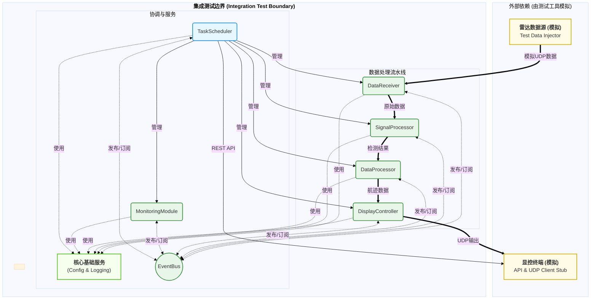
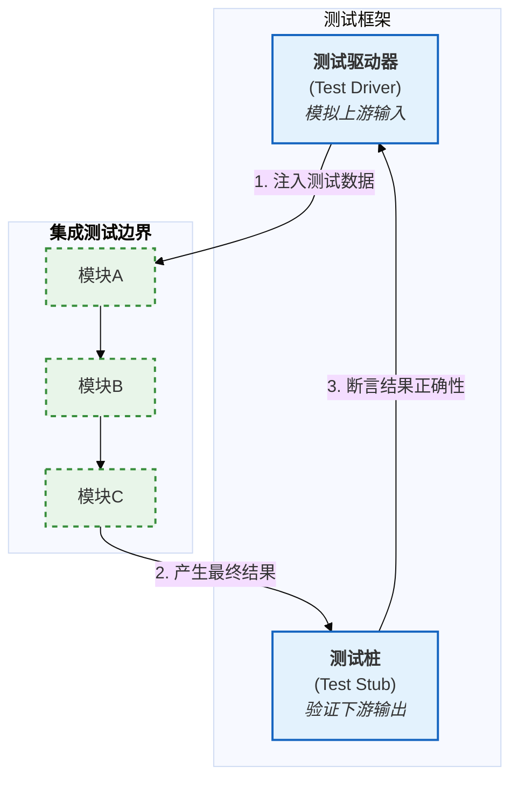
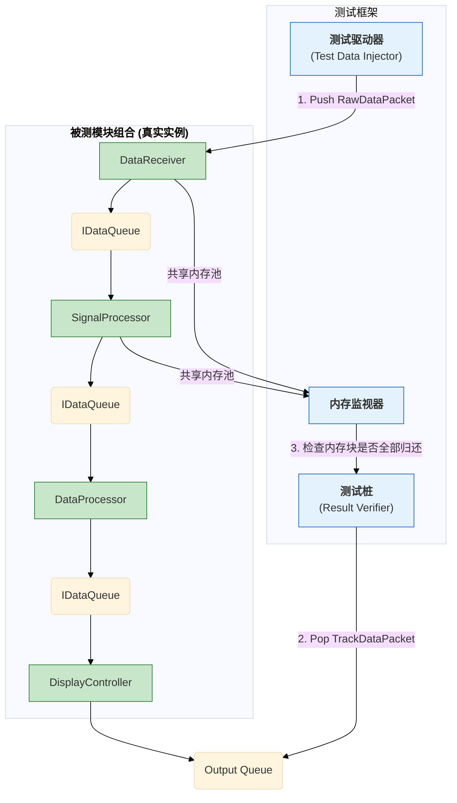
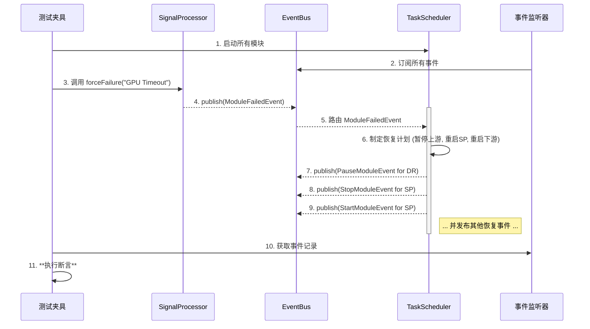
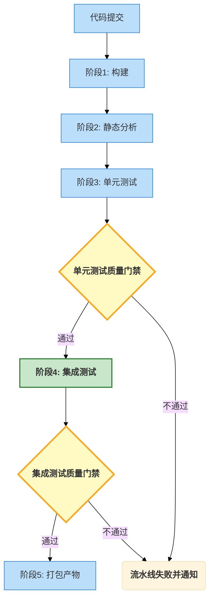

# 02\_集成测试方案

- **标题**: 集成测试方案
- **当前版本**: v1.0.0
- **最后更新**: 2025-09-29
- **负责人**: Klein

-----

## 概述

**概要**: 本文件是雷达数据处理系统 **L2 集成测试 (Integration Tests)** 的官方技术蓝图与执行纲领。它详细阐述了如何验证系统内部多个核心模块组合在一起时，其接口契约、数据交换和协同行为的正确性。本文档是连接 [ **`01_单元测试规范.md`** ](/docs/01_项目设计/06_测试设计/01_单元测试规范.md) 中孤立的单元验证与 [ **`03_系统与端到端测试方案.md`** ](/docs/01_项目设计/06_测试设计/03_系统与端到端测试方案.md) 中完整的黑盒系统验证之间的关键桥梁，是保障模块化架构成功的核心质量活动。

-----

## 目录

- [02\_集成测试方案](#02_集成测试方案)
  - [概述](#概述)
  - [目录](#目录)
  - [1 文档职责与目标](#1-文档职责与目标)
    - [1.1 文档定位](#11-文档定位)
    - [1.2 核心目标](#12-核心目标)
    - [1.3 测试范围与边界](#13-测试范围与边界)
  - [2 测试环境与测试框架](#2-测试环境与测试框架)
    - [2.1 测试环境搭建](#21-测试环境搭建)
      - [2.1.1 核心组件实例化](#211-核心组件实例化)
      - [2.1.2 外部依赖模拟](#212-外部依赖模拟)
      - [2.1.3 配置与资源管理](#213-配置与资源管理)
    - [2.2 测试框架选型与应用](#22-测试框架选型与应用)
      - [2.2.1 主测试框架：GoogleTest](#221-主测试框架googletest)
      - [2.2.2 模拟工具：GoogleMock 的有限使用](#222-模拟工具googlemock-的有限使用)
      - [2.2.3 辅助测试工具：Python](#223-辅助测试工具python)
  - [3 核心集成测试场景](#3-核心集成测试场景)
    - [3.1 数据面：数据处理流水线测试](#31-数据面数据处理流水线测试)
      - [3.1.1 测试目标](#311-测试目标)
      - [3.1.2 测试设置](#312-测试设置)
      - [3.1.3 执行步骤与断言](#313-执行步骤与断言)
    - [3.2 控制面：故障恢复协调测试](#32-控制面故障恢复协调测试)
      - [3.2.1 测试目标](#321-测试目标)
      - [3.2.2 测试设置](#322-测试设置)
      - [3.2.3 执行步骤与断言](#323-执行步骤与断言)
    - [3.3 混合场景：配置热更新测试](#33-混合场景配置热更新测试)
      - [3.3.1 测试目标](#331-测试目标)
      - [3.3.2 测试设置](#332-测试设置)
      - [3.3.3 执行步骤与断言 (动态应用场景)](#333-执行步骤与断言-动态应用场景)
  - [4 执行策略与质量门禁](#4-执行策略与质量门禁)
    - [4.1 测试执行时机](#41-测试执行时机)
      - [4.1.1 合并请求触发](#411-合并请求触发)
      - [4.1.2 每日构建触发](#412-每日构建触发)
      - [4.1.3 本地手动执行](#413-本地手动执行)
    - [4.2 持续集成 (CI) 集成](#42-持续集成-ci-集成)
      - [4.2.1 CI 流水线阶段](#421-ci-流水线阶段)
      - [4.2.2 测试环境准备](#422-测试环境准备)
      - [4.2.3 测试执行与报告](#423-测试执行与报告)
    - [4.3 质量门禁](#43-质量门禁)
  - [5 测试用例设计与实现](#5-测试用例设计与实现)
    - [5.1 测试数据管理](#51-测试数据管理)
      - [5.1.1 数据来源与格式](#511-数据来源与格式)
      - [5.1.2 数据生成策略](#512-数据生成策略)
    - [5.2 测试夹具的应用](#52-测试夹具的应用)
      - [5.2.1 `SetUp` 与 `TearDown` 职责](#521-setup-与-teardown-职责)
      - [5.2.2 共享资源与上下文](#522-共享资源与上下文)
    - [5.3 编写集成断言](#53-编写集成断言)
      - [5.3.1 验证最终状态](#531-验证最终状态)
      - [5.3.2 验证异步事件](#532-验证异步事件)
      - [5.3.3 避免脆弱的断言](#533-避免脆弱的断言)
  - [6 附录](#6-附录)
    - [6.1 术语表](#61-术语表)
    - [6.2 变更历史](#62-变更历史)


-----

## 1 文档职责与目标

### 1.1 文档定位

**概要**: 本文档是项目中关于L2集成测试的**唯一权威方案**。它承上启下，向上对齐 [ **`00_测试策略总览.md`** ](/docs/01_项目设计/06_测试设计/00_测试策略总览.md) 中定义的测试金字塔模型，向下为测试工程师和开发者提供具体、可执行的测试场景、环境搭建和用例设计指导。

| 范畴         | 本文档**是**...                                                                                     | 本文档**不是**...                                                        |
| :----------- | :-------------------------------------------------------------------------------------------------- | :----------------------------------------------------------------------- |
| **测试类型** | **灰盒测试 (Grey-box Testing)**。测试者了解模块间的接口和交互协议，但不关心每个模块的内部实现细节。 | **白盒测试**（这是单元测试的范畴）或**黑盒测试**（这是系统测试的范畴）。 |
| **测试对象** | 核心处理服务器内部**多个模块的组合**，通过其C++接口 (`IDataQueue`, `IEventBus`) 进行交互验证。      | 单个类的逻辑、外部REST API的HTTP协议正确性、或显控终端的UI行为。         |
| **目标**     | 确保模块作为团队开发的“零件”能够被正确地“组装”在一起，协同工作。                                    | 验证单个“零件”的内部功能是否正确无误。                                   |

### 1.2 核心目标

**概要**: 本集成测试方案的核心使命是通过系统化的验证，在模块化开发的早期阶段发现并修复那些只有在模块交互时才会暴露的深层次缺陷。

  - **验证接口契约**
      - **目标**: 确保各个模块对 [ **`01_模块接口规范.md`** ](/docs/01_项目设计/05_接口设计/01_模块接口规范.md) 和 [ **`06_事件接口规范.md`** ](/docs/01_项目设计/05_接口设计/06_事件接口规范.md) 中定义的接口契约，有着完全一致的理解和实现。
      - **示例**: 验证`DataReceiver`推送到`IDataQueue`的数据包 (`DataPacket`)，其格式和所有权模型 (`std::unique_ptr`) 能被`SignalProcessor`正确无误地消费。

  - **测试协作行为**
      - **目标**: 验证由多个模块参与的复杂工作流（特别是基于事件的异步流程）能够产生正确的最终结果。
      - **示例**: 验证当`SignalProcessor`因GPU错误发布`ModuleFailedEvent`时，`TaskScheduler`能够正确地接收该事件，并根据依赖关系向`DataReceiver`发布`PauseProducingEvent`，整个协调流程是否符合预期。

  - **验证数据流转**
      - **目标**: 端到端地测试核心处理服务器内部的**数据面 (Data Plane)**，确保数据从进入到送出的完整性和正确性。
      - **示例**: 注入一个模拟的原始数据包到`DataReceiver`的输入端，验证其能顺畅流经`SignalProcessor`和`DataProcessor`，并最终在`DisplayController`（数据网关）的输出端生成符合预期的、经过处理的`TrackData`。同时，验证**背压 (Back-pressure)** 机制能否在下游阻塞时正确地向上传播。

  - **发现集成缺陷**
      - **目标**: 主动暴露那些无法通过单元测试发现的、仅在模块交互时才出现的缺陷。
      - **示例**: 发现因模块间对共享资源（如内存池）的同步机制理解不一致而导致的**竞态条件 (Race Conditions)**；或者因事件处理顺序的假设不一致而导致的逻辑错误。

### 1.3 测试范围与边界

**概要**: 为确保集成测试的**专注性**和**有效性**，我们必须明确定义其测试边界。集成测试的核心是验证**核心处理服务器内部**的模块交互，所有外部依赖（如雷达数据源、显控终端）都将被模拟。



| 类别                            | 具体内容                                                                                                                                                                                                                                                                                                                                                                   |
| :------------------------------ | :------------------------------------------------------------------------------------------------------------------------------------------------------------------------------------------------------------------------------------------------------------------------------------------------------------------------------------------------------------------------- |
| **测试范围之内 (In Scope)**     | - `DataReceiver` -\> `SignalProcessor` -\> `DataProcessor` -\> `DisplayController` 的完整数据管道。<br>- `TaskScheduler` 对业务模块的生命周期管理和故障恢复协调。<br>- `ConfigManager` 的配置加载及热更新事件对业务模块的影响。<br>- `MonitoringModule` 对业务模块指标事件的接收和告警事件的发布。<br>- 所有模块通过内部 C++ 接口 (`IDataQueue`, `IEventBus`) 的直接交互。 |
| **模拟与桩 (Mocked / Stubbed)** | - **雷达数据源**: 由测试框架（如Python脚本）通过网络注入模拟的UDP数据包。<br>- **显控终端**: 由测试框架模拟，通过REST客户端调用API，并通过UDP套接字接收数据网关的输出进行验证。<br>- **GPU硬件**: 在CI环境中，可以使用CPU算法模拟器替代真实的GPU依赖，以进行逻辑验证。在预发布环境中则使用真实GPU。<br>- **文件系统**: 日志和配置文件可重定向到临时目录或内存文件系统。    |
| **测试范围之外 (Out of Scope)** | - **单个算法的内部逻辑正确性**: 这是**单元测试**的职责。<br>- **REST API的协议级健壮性**: 例如HTTP头的解析、认证的安全性等，这是**系统测试**的职责。<br>- **显控终端的UI行为**: 例如按钮是否可点击、渲染是否流畅等，这是**系统/E2E测试**的职责。<br>- **系统的长期稳定性与性能极限**: 这是**性能与可靠性测试**的职责。                                                     |

-----

## 2 测试环境与测试框架

**概要**: 本章旨在定义集成测试的**实践基础**。它详细阐述了如何在一个受控的、可复现的“内存中”环境中，搭建一个微缩版的**核心处理服务器**，并规定了用于编排测试、驱动模块交互和验证最终结果的官方软件框架。本章是连接**测试方案 (The "What")** 与**测试执行 (The "How")** 的桥梁。

### 2.1 测试环境搭建

**概要**: 集成测试环境的核心是一个“无头”的、在单个进程内运行的微型系统。它通过实例化真实的业务模块并将它们“连接”在一起，来模拟服务器的真实运行状态，同时使用**测试替身 (Test Doubles)** 来取代所有外部依赖，从而实现一个封闭、确定性的测试回路。

#### 2.1.1 核心组件实例化

  - **原则**: 集成测试的**核心价值**在于验证**真实模块**之间的交互。因此，在测试环境中，所有处于“测试范围之内”的模块都**必须**使用其生产代码的真实实例。
  - **实现**: 在测试夹具的 `SetUp()` 阶段，测试框架将以编程方式创建以下核心组件的实例：
      - **业务模块**: `DataReceiver`, `SignalProcessor`, `DataProcessor`, `DisplayController`, `MonitoringModule` 等。
      - **协调与服务**: `TaskScheduler`, `ConfigManager`, `LoggingService`, `EventBus`。
  - **依赖注入**: 这些实例将通过**依赖注入 (Dependency Injection)** 的方式相互连接，其连接逻辑与系统在 `main.cpp` 中的真实启动流程完全一致。这确保了我们的测试环境在模块拓扑结构上与生产环境保持一致。

#### 2.1.2 外部依赖模拟

**概要**: 为了确保测试的**独立性**和**可重复性**，所有在[ **`1.3 测试范围与边界`** ](#13-测试范围与边界)中定义的外部依赖，都必须被**测试驱动器 (Test Driver)** 和**测试桩 (Test Stub)** 所取代。



  - **测试驱动器 (Test Driver)**
      - **职责**: 模拟系统的上游输入，扮演“发动机”的角色。
      - **实现**:
          - **数据面**: 一个 C++ 类，负责生成 `DataPacket` 对象，并直接 `push` 到 `DataReceiver` 的输入 `IDataQueue` 中。
          - **控制面**: 直接获取 `EventBus` 的实例，并 `publish` 模拟的控制事件（如 `ConfigChangedEvent`）。
  - **测试桩 (Test Stub)**
      - **职责**: 接收并验证被测模块组合的最终输出。
      - **实现**:
          - **数据面**: 一个 C++ 类，通过 `try_pop` 从 `DisplayController` 的输出 `IDataQueue` 中获取 `TrackData`，并对其内容进行断言。
          - **控制面**: 一个实现了 `IEventBus` 订阅功能的 C++ 类，用于验证 `MonitoringModule` 等模块是否发布了预期的告警事件。

#### 2.1.3 配置与资源管理

  - **原则**: 每个集成测试套件都必须在**完全隔离**的配置和资源环境中运行。
  - **实现**:
      - **测试配置**: 测试将加载一套专用的 `test_config.yaml` 文件，其中可能包含为测试场景特意简化的参数（例如，更短的航迹生命周期，更低的告警阈值）。
      - **资源重定向**: 所有文件 I/O（尤其是日志）**必须**被重定向到一个在测试开始时创建、在测试结束时销毁的临时目录中，以避免污染开发环境或产生持久化的测试垃圾。

### 2.2 测试框架选型与应用

**概要**: 为了高效地编写、组织和执行集成测试，我们将在单元测试的工具链基础上进行扩展和适配。核心思想是复用成熟的工具，但根据集成测试的特点调整其使用策略。

#### 2.2.1 主测试框架：GoogleTest

  - **设计原理 (Rationale)**: 我们继续采用 **GoogleTest** 作为集成测试的主框架。其强大的**测试夹具 (Test Fixture)** 机制，是管理复杂的多模块测试环境 `SetUp` (搭建) 和 `TearDown` (销毁) 流程的理想工具。
  - **应用实践**:
      - 将为每个核心测试场景（如“数据处理管道测试”、“故障恢复测试”）创建一个专属的测试夹具类。
      - `SetUp()` 方法将负责实例化所有相关模块、服务和测试替身，并完成它们之间的依赖注入。
      - `TearDown()` 方法将负责以正确的顺序停止和清理所有模块，确保测试之间不会相互影响。

#### 2.2.2 模拟工具：GoogleMock 的有限使用

  - **原则**: 与单元测试中“**万物皆可 Mock**”的原则相反，集成测试的原则是“**尽可能少地 Mock**”。我们的目标是测试真实模块间的交互，因此过度使用 Mock 会削弱集成测试的价值。
  - **使用场景**:

| 场景                   | 是否使用 Mock | 理由                                                                                                                                                                           |
| :--------------------- | :------------ | :----------------------------------------------------------------------------------------------------------------------------------------------------------------------------- |
| **被测模块组合内部**   | **严禁使用**  | 这是集成测试的核心验证对象，必须使用真实实现。                                                                                                                                 |
| **被测组合的邻近依赖** | **有限使用**  | 当一个被测组合依赖另一个复杂的、非本次测试焦点的模块时，可以使用 `NiceMock` 来简化测试搭建。例如，在测试数据管道时，我们可以模拟`MonitoringModule`来避免处理它发出的无关事件。 |
| **验证异步事件发布**   | **推荐使用**  | 当需要验证被测组合是否向`EventBus`正确发布了某个事件时，可以创建一个 `MockEventSubscriber` 来订阅并断言该事件的接收。                                                          |

#### 2.2.3 辅助测试工具：Python

  - **设计原理 (Rationale)**: 对于需要模拟复杂外部网络行为的场景（例如，模拟雷达数据源以特定速率和模式发送UDP包），使用C++进行脚本编写既繁琐又低效。**Python** 以其简洁的语法和强大的网络编程库 (`socket`, `scapy`)，成为驱动这类测试场景的理想**辅助工具**。
  - **应用实践 (混合模式)**:
    1.  **C++ 端**: 启动一个包含了完整集成测试环境的 C++ GoogleTest 可执行文件。该程序会绑定真实的UDP端口并等待数据。
    2.  **Python 端**: 启动一个 `pytest` 脚本。该脚本负责构造复杂的、符合协议的二进制UDP数据包，并按照预设的场景（如模拟突发流量、乱序、丢包）将其发送到C++测试程序监听的端口。
    3.  **验证**: C++ 端的测试桩负责接收最终的处理结果并执行断言。测试的成功或失败状态由C++程序返回。

> 这种**C++ (执行环境) + Python (场景驱动)** 的混合测试模式，充分利用了两种语言各自的优势，实现了测试环境的保真度与测试脚本编写效率的最佳平衡。

-----

## 3 核心集成测试场景

**概要**: 本章将理论付诸实践，详细定义了必须覆盖的**三大核心集成测试场景**。这些场景并非简单的功能列表，而是精心挑选的、能够全面检验系统“任督二脉”——即**数据面 (Data Plane)**、**控制面 (Control Plane)** 以及两者交互——正确性的关键工作流。通过这些测试，我们将确保系统的核心功能不仅在理想路径下工作正常，更在异常和变更条件下表现出预期的**鲁棒性**和**可靠性**。

### 3.1 数据面：数据处理流水线测试

**概要**: 此场景是集成测试的**重中之重**，旨在端到端地验证**核心处理服务器内部**的数据处理流水线。它将作为一个整体，检验从数据进入`DataReceiver`到最终由`DisplayController`（数据网关）输出的全过程，确保数据流的**功能正确性**、**性能完整性**和**可观测性**。

#### 3.1.1 测试目标

  - **功能正确性**: 验证一个预先定义的、标准的输入原始数据包，在流经完整的处理管道（`DataReceiver` -\> `SignalProcessor` -\> `DataProcessor` -\> `DisplayController`）后，能够在输出端生成符合数学预期的、正确的`TrackData`。
  - **零拷贝完整性**: 验证在整个数据流转过程中，承载原始数据的内存块被正确地以**指针/引用**形式传递，并在使用完毕后被安全地**归还**给上游内存池，确保不存在**内存泄漏 (Memory Leaks)**。
  - **TraceID 传递**: 验证由`DataReceiver`在数据包入口处生成的\*\*`TraceID`**，能够被完整无缺地传递，并最终出现在`DisplayController`输出的`TrackDataPacket`头部，确保**全链路可观测性\*\*的实现。
  - **背压机制**: 验证当测试桩 (Test Stub) 阻塞并停止从`DisplayController`的输出队列消费数据时，压力能够**反向传播**，最终导致`DataReceiver`暂停从输入队列拉取数据，检验系统的流量控制能力。

#### 3.1.2 测试设置



#### 3.1.3 执行步骤与断言

1.  **准备 (Arrange)**:
      - 使用测试夹具实例化数据管道中的所有真实模块 (`DataReceiver` 至 `DisplayController`) 及它们依赖的核心服务。
      - 实例化`TestDataInjector`、`ResultVerifier`和`MemMonitor`。
      - `ResultVerifier`订阅`DisplayController`的输出队列。
      - `MemMonitor`记录`DataReceiver`内存池的初始状态（如，空闲块数量）。
2.  **行动 (Act)**:
      - `TestDataInjector`创建一个包含已知模式数据的`RawDataPacket`（并记录其`TraceID`），然后将其推送到`DataReceiver`的输入队列。
      - 测试线程等待，直到`ResultVerifier`从输出队列中接收到处理结果，或等待超时。
3.  **断言 (Assert)**:
      - `ResultVerifier`对接收到的`TrackDataPacket`执行断言：
          - `ASSERT_EQ(output_packet.header.trace_id, input_packet.header.trace_id);`
          - 断言`output_packet.payload`中的航迹数据（如位置、速度）与基于输入数据计算的预期值在误差范围内相等。
      - `MemMonitor`执行断言：
          - `ASSERT_EQ(memory_pool.get_free_blocks(), initial_free_blocks);`

### 3.2 控制面：故障恢复协调测试

**概要**: 此场景用于验证系统的**自愈能力 (Self-healing)**。它通过模拟一个核心模块的运行时失败，来检验`TaskScheduler`的**故障恢复引擎 (Recovery Engine)** 是否能够正确地检测问题、制定并执行一个**依赖感知 (Dependency-aware)** 的、**影响范围最小**的恢复流程。

#### 3.2.1 测试目标

  - **故障上报**: 验证当一个模块（例如`SignalProcessor`）被强制进入失败状态时，它能够正确地、及时地向`EventBus`发布一个携带准确上下文的`ModuleFailedEvent`。
  - **依赖感知恢复**: 验证`TaskScheduler`在收到`ModuleFailedEvent`后，能够利用其维护的**模块依赖图**，制定并执行一个精确的恢复工作流。
    > **例如**: `SignalProcessor`失败，恢复流程应包括：1) 暂停上游的`DataReceiver`；2) 重启`SignalProcessor`；3) 重启依赖它的下游`DataProcessor`；4) 恢复`DataReceiver`。
  - **熔断器机制**: 验证当一个模块在短时间内**连续多次**失败时，`TaskScheduler`内置的**熔断器 (Circuit Breaker)** 能够被正确触发，暂停对该模块的自动恢复，并发布一个需要**人工干预**的告警，以防止“恢复风暴”。

#### 3.2.2 测试设置

  - **被测组件**: `TaskScheduler`、`EventBus`，以及数据管道中的所有真实模块 (`DataReceiver`, `SignalProcessor`, `DataProcessor`等)。
  - **测试辅助**:
      - **可注入故障的模块**: `SignalProcessor`将提供一个仅在测试中暴露的`forceFailure()`方法。
      - **事件监听器 (Event Listener)**: 一个测试桩，订阅`EventBus`上的所有事件，并将其记录下来供后续断言。

#### 3.2.3 执行步骤与断言



1.  **准备 (Arrange)**:
      - 启动由`TaskScheduler`管理的完整模块集合。
      - `EventListener`订阅`EventBus`。
2.  **行动 (Act)**:
      - 调用`SignalProcessor`的`forceFailure()`方法。
3.  **断言 (Assert)**:
      - `EventListener`记录的事件序列**必须**包含：
        1.  一个来自`SignalProcessor`的`ModuleFailedEvent`。
        2.  一系列来自`TaskScheduler`的、符合**依赖感知恢复**逻辑的控制事件（`PauseModuleEvent`, `StopModuleEvent`, `StartModuleEvent`等）。
        3.  最终，所有受影响模块的`ModuleStateChangedEvent`，显示其状态恢复为`RUNNING`。
      - 对于**熔断器测试**，重复**行动 (Act)** 步骤三次，并断言`TaskScheduler`在第三次失败后发布了`RecoveryHaltedEvent`，且不再发布恢复指令。

### 3.3 混合场景：配置热更新测试

**概要**: 此场景用于验证**运行时配置热更新**的完整、异步流程。它测试的是`ConfigManager`、`EventBus`、目标业务模块和`TaskScheduler`之间的复杂协同，确保配置变更能够被安全、正确地应用，且模块能够根据变更的严重性做出恰当的响应。

#### 3.3.1 测试目标

  - **事件驱动流程**: 验证从外部请求到模块最终应用的完整事件链（`CONFIG_CHANGE_REQUEST` -\> `VALIDATE_CONFIG_CHANGE` -\> `VALIDATE_SUCCESS` -\> `CONFIG_CHANGED` -\> `CONFIG_APPLIED`）的正确性。
  - **模块自主决策**: 验证业务模块在收到`CONFIG_CHANGED`事件后，能够根据变更的参数，正确地执行**四种响应策略**之一：**动态应用**、**延迟应用**、**请求重载**或**请求重启**。
  - **原子性与一致性**: 确保配置只有在通过所有验证后才会被应用，并且在整个变更过程中，系统始终保持数据和状态的一致性。

#### 3.3.2 测试设置

  - **被测组件**: `ConfigManager`, `EventBus`, `TaskScheduler`, 以及一个支持多种配置更新策略的目标模块（如 `SignalProcessor`）。
  - **测试辅助**:
      - **配置变更驱动器**: 一个测试类，负责向`ConfigManager`模拟外部的配置变更请求。
      - **事件监听器**: 与3.2节中相同，用于记录和验证事件流。

#### 3.3.3 执行步骤与断言 (动态应用场景)

1.  **准备 (Arrange)**:
      - 启动所有被测组件。
      - `EventListener`开始监听。
2.  **行动 (Act)**:
      - 配置变更驱动器向`ConfigManager`请求修改`SignalProcessor`的一个**可动态应用**的参数（例如，CFAR算法的告警阈值）。
3.  **断言 (Assert)**:
      - `EventListener`捕获的事件序列**必须**精确匹配设计文档中定义的“配置热更新”事件流。
      - **最终状态验证**: 通过一个测试专用的接口或状态查询，断言`SignalProcessor`内部的告警阈值确实已经被更新为新值。
      - `TaskScheduler`**不应**收到任何来自`SignalProcessor`的重启或重载请求。

> **扩展测试**: 需额外编写独立的测试用例，分别验证当变更一个需要**重载**或**重启**的参数时，`SignalProcessor`能够正确地向`TaskScheduler`发出`RequestModuleReloadEvent`或`ModuleFailedEvent`，并且`TaskScheduler`能够正确地执行相应的恢复流程。

-----

## 4 执行策略与质量门禁

**概要**: 本章旨在将前述的集成测试场景转化为**可执行、可度量**的工程实践。它详细规定了集成测试在开发生命周期中的**执行时机**，如何将其无缝融入**持续集成 (Continuous Integration, CI)** 流水线，并最终定义了用以衡量测试结果、决定代码能否进入下一阶段的**客观质量标准——质量门禁 (Quality Gate)**。本章是确保集成测试能够真正落地并持续产生价值的**程序性保障**。

### 4.1 测试执行时机

**概要**: 与瞬时完成的单元测试不同，集成测试的执行相对耗时。因此，必须对其执行时机进行战略性规划，以在**快速反馈**与**资源消耗**之间取得最佳平衡。

#### 4.1.1 合并请求触发

  - **原则**: **这是集成测试最主要的、强制性的触发点**。所有集成测试**必须**在为`develop`或`main`等主干分支创建或更新**合并请求 (Merge Request)** 时自动运行。
  - **设计原理 (Rationale)**:
    > 此举是防止集成缺陷合入主干分支的**核心防线**，是“质量左移”和“质量内建”理念的关键实践。它强制要求所有新功能或修复在合入前，都必须证明其能够与现有系统的其他部分正确协同工作，从而从根本上保障主干分支的稳定性和健康度。

#### 4.1.2 每日构建触发

  - **原则**: 完整的集成测试套件，特别是那些因耗时过长而被排除在合并请求流程之外的**探索性或穷举性**测试场景，将在**每日构建 (Nightly Build)** 中，于`main`分支上执行。
  - **设计原理 (Rationale)**:
    > 每日构建是对合并请求检查的有力补充。它有助于发现那些由多次合入累积产生的、或需要更长时间运行才能暴露的**非确定性缺陷**（例如，偶发的竞态条件、资源缓慢泄露等），并为项目的长期健康度提供一个每日的、一致的基线报告。

#### 4.1.3 本地手动执行

  - **原则**: 开发者**应该**能够在自己的本地开发环境中，通过简单的命令（如 `ctest -L INTEGRATION`）选择性地运行一部分或全部集成测试。
  - **设计原理 (Rationale)**:
    > 授权开发者在提交代码前于本地运行集成测试，是缩短**反馈循环 (Feedback Loop)** 的有效手段。这使得开发者可以在本地完成大部分集成问题的发现与修复，从而减少对CI服务器资源的占用，并降低因简单集成错误导致CI流水线失败的次数，提升整个团队的开发效率。

### 4.2 持续集成 (CI) 集成

**概要**: 本节详细描述了集成测试如何被技术性地编排进 [ **`05_测试环境与工具链.md`** ](05_测试环境与工具链.md) 中定义的自动化CI流水线中，成为一个自动化的、强制执行的质量检查站。

#### 4.2.1 CI 流水线阶段

  - **原则**: 集成测试在CI流水线中拥有一个独立的阶段，该阶段严格位于“**构建与单元测试**”阶段之后，“**打包与部署**”阶段之前。
  - **依赖关系**: 本阶段的执行，以前一阶段（单元测试）的**完全成功**为前提，并依赖其生成的**构建产物 (Build Artifacts)**，即可执行的测试文件。



#### 4.2.2 测试环境准备

  - **环境一致性**: CI流水线中的集成测试作业 (Job) **必须**在官方 `Dockerfile` 定义的容器化环境中运行，以确保与本地开发环境和最终生产环境的高度一致性。
  - **数据与配置**:
      - **测试配置**: 作业启动时，将从代码库中检出专用的`test_config.yaml`文件，并通过依赖注入的方式传递给被测系统。
      - **测试数据**: 如果测试需要依赖外部数据文件，这些文件应与测试代码一同存放在代码库中，并在作业开始时被复制到可访问的路径。

#### 4.2.3 测试执行与报告

  - **执行命令**: CI脚本将通过 `ctest` 命令来自动发现并执行所有被标记为“集成测试”的测试用例。
  - **结果报告**: `ctest` **必须**被配置为生成 **JUnit XML** 格式的测试报告。
  - **设计原理 (Rationale)**:
    > JUnit XML 是一种行业标准格式，几乎所有的CI平台（如GitLab CI, Jenkins）都能原生解析。这使得CI系统能够自动地、结构化地展示测试结果：包括**总运行数、成功数、失败数、跳过数**，并能将失败用例的**错误日志和堆栈跟踪**直接关联到合并请求的Web界面上，极大地提升了失败诊断的效率。

### 4.3 质量门禁

**概要**: **质量门禁**是集成测试阶段的**唯一通行证**。它是一组自动化的、不可协商的、客观的衡量标准。任何合并请求，如果其触发的集成测试运行未能满足以下所有条件，将被**自动阻止合并**，并标记为失败。

  - **测试通过率**:

      - **标准**: **100%**。
      - **说明**: 所有被执行的集成测试用例都必须通过。任何一个失败的测试都表明存在一个必须被修复的集成缺陷。不允许存在“已知失败”的测试被合入主干。

  - **关键场景覆盖**:
      - **标准**: **100% 覆盖**。
      - **说明**: 所有在[ **`3 核心集成测试场景`** ](#3-核心集成测试场景)中被定义为P0优先级的测试用例，都**必须**被包含在CI的执行范围内。不允许为了加速流水线而临时禁用或跳过任何关键场景的测试。
      
  - **无内存泄漏**:

      - **标准**: **零新增泄露**。
      - **说明**: 在每日构建中，数据处理流水线相关的集成测试**必须**在内存分析工具（如 `Valgrind` 或 **地址消毒器 (AddressSanitizer, ASan)**）的监控下运行。与基线相比，任何新增的内存泄漏都将导致流水线失败。

  - **无竞态条件**:

      - **标准**: **零竞态条件**。
      - **说明**: 在每日构建中，涉及多线程交互的集成测试**必须**在**线程消毒器 (ThreadSanitizer, TSan)** 的监控下运行。任何被检测到的数据竞争都将导致流水线失败。

-----

## 5 测试用例设计与实现

**概要**: 本章为测试工程师和开发者提供编写集成测试用例的**具体战术指南和最佳实践**。它将前述章节中定义的抽象场景和策略，转化为可执行的代码结构和设计模式。本章的核心是确保所有集成测试用例不仅功能正确，而且在结构上**清晰、健壮、可维护**，能够作为项目长期的、可靠的质量保障资产。

### 5.1 测试数据管理

**概要**: **测试数据的质量直接决定了测试用例的质量**。一套精心管理的测试数据是创建稳定、可重复且有意义的集成测试的基石。本节规定了测试数据的来源、格式和生成策略。

#### 5.1.1 数据来源与格式

  - **原则**: 所有用于断言的测试数据都**必须**与测试代码一同检入版本控制系统。**严禁**从外部数据库、网络服务或本地不固定路径加载测试数据，以保证测试的**可重复性**。

  - **数据格式**:

      - **输入数据**: 对于需要模拟外部UDP包的场景，应在测试目录下创建一个`test_data`文件夹，其中包含用**YAML或JSON格式**定义的、人类可读的输入数据。Python测试驱动器负责在运行时读取这些文件，并将其序列化为最终的二进制格式进行注入。
      - **期望输出**: 对于复杂的断言，可以将预先计算好的“黄金”输出结果同样以YAML或JSON格式存储，测试桩在收到真实输出后，将其与“黄金”结果进行结构化对比。

  - **设计原理 (Rationale)**:

    > 将测试数据代码化（Test Data as Code）并纳入版本控制，确保了测试环境的完全自包含。任何开发者在任何时间点检出项目的任何版本，都能获得与之匹配的、正确的测试数据，从而根除了因数据不一致导致的测试失败。使用人类可读的格式（如YAML）也使得审查测试数据的意图变得更加容易。

#### 5.1.2 数据生成策略

  - **最小化原则**: 每个测试用例**必须**使用能够验证其目标的**最小数据集**。

    > **例如**: 测试单个航迹确认的场景，只需注入能够生成一个检测点的原始数据，而非注入一个包含数百个检测点的完整数据帧。这使得测试意图更清晰，失败时定位问题也更快。

  - **“黄金”数据集**: 对于核心的“Happy Path”数据流水线测试，应创建并维护一个“**黄金 (Golden)**”数据集。该数据集包含一个标准的、具有代表性的输入文件和其对应的、经过人工验证的、已知正确的输出文件。该测试的核心断言就是 `ASSERT_EQ(actual_output, golden_output)`。

  - **边界与异常数据**: 必须专门设计用于触发边界条件和异常流程的数据集。

      - **空数据集**: 注入一个空的 `DataPacket` 批次，验证系统不会崩溃且能优雅处理。
      - **格式错误数据**: 注入一个头部校验和错误或字段不完整的数据包，验证`DataReceiver`的错误处理逻辑。
      - **高负载数据**: 注入远超常规数量的检测点，以初步探测数据关联等算法的性能瓶颈。

### 5.2 测试夹具的应用

**概要**: **测试夹具 (Test Fixture)** 是管理复杂集成测试环境生命周期的核心机制。我们将利用GoogleTest的测试夹具，为一组相关的测试用例提供一个共享的、一致的“微缩版系统”实例。

#### 5.2.1 `SetUp` 与 `TearDown` 职责

  - **原则**: 测试夹具的 `SetUp()` 和 `TearDown()` 方法封装了所有与环境搭建和清理相关的复杂逻辑，使得测试用例本身可以专注于**行动 (Act)** 和**断言 (Assert)**。

| 方法             | 核心职责                                                                                                                                                                                                                                                                                                                                                                    |
| :--------------- | :-------------------------------------------------------------------------------------------------------------------------------------------------------------------------------------------------------------------------------------------------------------------------------------------------------------------------------------------------------------------------- |
| **`SetUp()`**    | - **实例化**: 创建所有被测模块和核心服务的真实实例 (`ConfigManager`, `EventBus`, `TaskScheduler` 等)。<br>- **依赖注入**: 按照生产代码 (`main.cpp`) 的逻辑，将服务和模块相互“连接”起来。<br>- **启动系统**: 调用`TaskScheduler`的`start()`方法，使整个“微缩版系统”进入`RUNNING`状态。<br>- **初始化测试替身**: 创建并准备好`TestDataInjector`和`ResultVerifier`等测试替身。 |
| **`TearDown()`** | - **优雅关闭**: 调用`TaskScheduler`的`stop()`方法，并等待所有模块线程安全退出。<br>- **资源清理**: 释放所有在`SetUp()`中分配的资源，清理临时文件和目录，确保测试之间完全独立。                                                                                                                                                                                              |

#### 5.2.2 共享资源与上下文

  - **实现**: 测试夹具的**成员变量**用于在所有测试用例之间共享对核心组件的访问。这避免了在每个测试用例中重复进行环境搭建，并确保了测试上下文的一致性。

  - **代码示例**:

    ```cpp
    class DataPipelineTest : public ::testing::Test {
    protected:
        // SetUp() 中实例化的核心组件，作为成员变量暴露给测试用例
        std::shared_ptr<IConfigManager> config_manager_;
        std::shared_ptr<IEventBus> event_bus_;
        std::shared_ptr<ITaskScheduler> task_scheduler_;
        std::shared_ptr<IDataQueue<RawDataPacket>> input_queue_;
        std::shared_ptr<IDataQueue<TrackDataPacket>> output_queue_;
    
        // 测试替身
        std::unique_ptr<TestDataInjector> injector_;
        std::unique_ptr<ResultVerifier> verifier_;
    
        void SetUp() override {
            // ... 此处执行详细的实例化和注入逻辑 ...
            task_scheduler_->start();
        }
    
        void TearDown() override {
            task_scheduler_->stop();
        }
    };
    
    TEST_F(DataPipelineTest, HappyPath_SingleTarget_GeneratesCorrectTrack) {
        // 在这里可以直接使用 injector_ 和 verifier_ 等成员变量
        injector_->pushData(...);
        auto result = verifier_->waitForResult();
        ASSERT_EQ(...);
    }
    ```

### 5.3 编写集成断言

**概要**: 集成测试的断言与单元测试有本质区别。它不关心模块的内部状态，而是专注于验证模块组合后**可观测的外部行为**和**最终结果**。

#### 5.3.1 验证最终状态

  - **原则**: **优先断言数据管道末端的最终输出**。这是对整个被测系统最有效的、端到端的验证。
  - **实践**: 在数据处理流水线测试中，核心断言**必须**在`ResultVerifier`中，对从`DisplayController`输出队列中获取的`TrackDataPacket`进行。断言应检查其内容是否与“黄金”数据集匹配。

#### 5.3.2 验证异步事件

  - **挑战**: 在多线程、事件驱动的系统中，直接测试异步事件的发布可能会导致**测试不稳定 (Flaky Tests)**。

  - **解决方案**:

      - **引入`EventCollector`**: 创建一个测试专用的辅助类`EventCollector`。它在`SetUp()`阶段订阅一个或多个感兴趣的事件类型。
      - **线程安全收集**: `EventCollector`内部使用一个线程安全的队列来存储接收到的所有事件。
      - **带超时的断言**: 在**断言 (Assert)** 阶段，测试用例会调用`EventCollector::waitForEvent(timeout)`等方法，在给定的超时时间内等待预期的事件。如果事件在超时内到达，则对其内容进行断言；如果超时，则测试失败。

  - **代码示例**:

    ```cpp
    TEST_F(FaultRecoveryTest, SignalProcessorFailure_TriggersCorrectRecoveryEvents) {
        // Arrange
        EventCollector collector(event_bus_);
        collector.subscribe<ModuleFailedEvent>();
        collector.subscribe<PauseModuleEvent>();
        // ...
    
        // Act
        signal_processor_->forceFailure();
    
        // Assert
        auto failed_event = collector.waitForEvent<ModuleFailedEvent>(5s);
        ASSERT_TRUE(failed_event.has_value());
        EXPECT_EQ(failed_event->source_module, "SignalProcessor");
    
        auto pause_event = collector.waitForEvent<PauseModuleEvent>(1s);
        ASSERT_TRUE(pause_event.has_value());
        EXPECT_EQ(pause_event->target_module, "DataReceiver");
    }
    ```

#### 5.3.3 避免脆弱的断言

  - **原则**: 集成测试的断言**必须**是健壮的，不应依赖于代码的内部实现细节或不确定的时序。

| 类别         | 不推荐的脆弱断言 (Brittle Assertion)                    | 推荐的健壮断言 (Robust Assertion)                                                                  |
| :----------- | :------------------------------------------------------ | :------------------------------------------------------------------------------------------------- |
| **内部状态** | `ASSERT_EQ(module->getIntermediateBufferSize(), 10);`   | `ASSERT_EQ(output_packet.payload.size(), 1);` (断言最终输出)                                       |
| **具体时序** | `ASSERT_LT(event_time - start_time, 10ms);`             | 使用带超时的 `waitForEvent` 检查事件是否在合理时间内发生。                                         |
| **日志内容** | `ASSERT_TRUE(log_file.contains("Processing started"));` | `EXPECT_CALL(*mock_logger_, log(LogLevel::INFO, "..."));` (在单元测试中验证日志)，或断言最终结果。 |

-----

## 6 附录

### 6.1 术语表

| 术语             | 英文             | 定义与说明                                                                                                                                       |
| :--------------- | :--------------- | :----------------------------------------------------------------------------------------------------------------------------------------------- |
| **集成测试**     | Integration Test | 位于单元测试和系统测试之间的一个测试层级，专注于验证多个独立开发的软件模块组合在一起时，能否按预期协同工作。                                     |
| **灰盒测试**     | Grey-box Testing | 一种介于白盒测试和黑盒测试之间的测试方法。测试者了解（但不必关心）系统的内部结构，主要通过已知的接口和数据结构来设计测试用例，验证模块间的交互。 |
| **测试夹具**     | Test Fixture     | 为一组相关的测试用例提供一个共享的、一致的上下文环境。在本项目中，它负责在`SetUp()`中搭建“微缩版系统”，并在`TearDown()`中进行清理。              |
| **测试驱动器**   | Test Driver      | 一种测试替身，用于模拟被测系统**上游**的组件，向被测系统“驱动”或注入测试数据和控制信号。                                                         |
| **测试桩**       | Test Stub        | 一种测试替身，用于模拟被测系统**下游**的组件，它接收被测系统的输出，并可提供固定的响应或用于最终结果的验证。                                     |
| **测试替身**     | Test Double      | 是所有用于替换生产对象的测试专用对象的总称，包括Mocks, Stubs, Drivers等。                                                                        |
| **“黄金”数据集** | Golden Dataset   | 指一组预先定义好的、已知正确的“输入-输出”数据对。测试时，将“黄金”输入送入系统，并断言其产生的输出与“黄金”输出完全一致。                          |
| **背压**         | Back-pressure    | 在数据流系统中，当下游消费者的处理速度慢于上游生产者时，压力会反向传播，从而自然地减缓上游生产速度的一种流量控制机制。                           |

### 6.2 变更历史

| 版本号 | 日期       | 作者  | 变更描述                                                                                                 |
| :----- | :--------- | :---- | :------------------------------------------------------------------------------------------------------- |
| v1.0.0 | 2025-09-29 | Klein | 初始版本创建，基于项目测试策略总览，详细定义了集成测试的目标、范围、环境、核心场景、执行策略和质量门禁。 |
