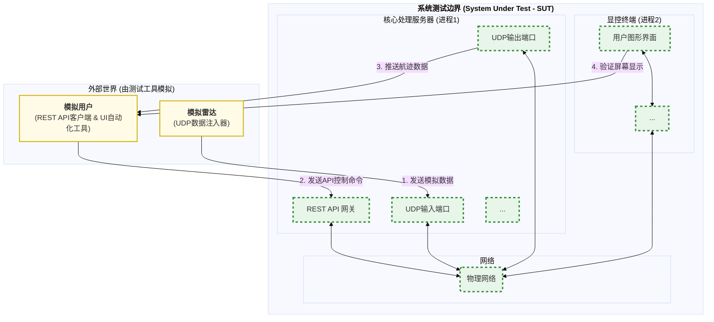
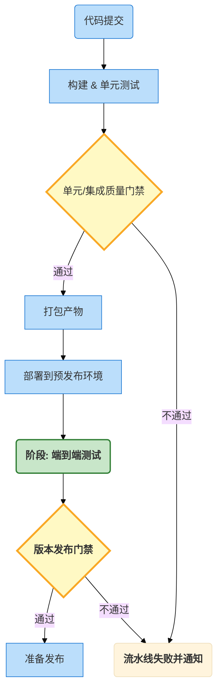

#### **`03_系统与端到端测试方案.md`**

  * **概要内容**:
      * **定位**: 将整个系统（包括独立的**显控终端**）视为一个黑盒，从最终用户的角度验证其是否满足业务需求。
      * **核心内容**:
        1.  **范围定义**: 覆盖从外部输入（模拟雷达UDP包，模拟用户API操作）到外部输出（显控终端UI显示，API响应）的完整链路。
        2.  **测试方法**:
              * 主要通过**外部测试脚本**（例如使用Python）来驱动。
              * 脚本将负责：1) 启动核心处理服务器和显控终端进程；2) 模拟雷达阵面，发送UDP数据包；3) 模拟用户，调用RESTful API发送控制命令；4) 验证API响应是否正确；5) (可选) 通过UI自动化框架（如Squish）验证显控终端的显示是否符合预期。
        3.  **核心测试场景**:
              * 直接将`99_模块集成策略.md`中定义的**端到端序列图**（如“Happy Path数据处理流程”、“故障恢复协调流程”）转化为可执行的自动化测试用例。


好的，遵照您的指示。我将开始 `03_系统与端到端测试方案.md` 的编写工作，并严格遵循您已确立的所有设计与文档规范，包括最新的三级标题和术语格式要求。

以下是该文档第一章 **“文档职责与目标”** 的完整内容。

-----

# 03\_系统与端到端测试方案

- **标题**: 系统与端到端测试方案
- **当前版本**: v1.0.0
- **最后更新**: 2025-09-29
- **负责人**: Klein

-----

## 概述

**概要**: 本文件是雷达数据处理系统 **L3 系统与端到端测试**的官方技术蓝图与执行纲领。它位于测试金字塔的顶端，旨在从**最终用户**的视角，将整个已部署的**分布式系统**（包括核心处理服务器和独立的显控终端）作为一个完整的**黑盒**进行验证。本文档的核心使命是确保系统作为一个整体，能够正确、可靠地交付其核心业务价值，并满足所有关键的用户场景需求。

-----

## 目录

- [03\_系统与端到端测试方案](#03_系统与端到端测试方案)
  - [概述](#概述)
  - [目录](#目录)
  - [1 文档职责与目标](#1-文档职责与目标)
    - [1.1 文档定位](#11-文档定位)
    - [1.2 核心目标](#12-核心目标)
    - [1.3 测试范围与边界](#13-测试范围与边界)
      - [1.3.1. 系统边界定义](#131-系统边界定义)
      - [1.3.2 测试范围之内](#132-测试范围之内)
      - [1.3.3 测试范围之外](#133-测试范围之外)
  - [2 测试环境与核心工具链](#2-测试环境与核心工具链)
    - [2.1 预发布测试环境](#21-预发布测试环境)
      - [2.1.1 硬件配置对标](#211-硬件配置对标)
      - [2.1.2 分布式网络拓扑](#212-分布式网络拓扑)
      - [2.1.3 部署方式一致性](#213-部署方式一致性)
    - [2.2 核心测试工具链](#22-核心测试工具链)
      - [2.2.1 自动化测试框架：Python \& Pytest](#221-自动化测试框架python--pytest)
      - [2.2.2 核心库与应用](#222-核心库与应用)
      - [2.2.3 工具链协作模式](#223-工具链协作模式)
  - [3 核心测试场景](#3-核心测试场景)
    - [3.1 场景一：“Happy Path“ 数据处理全链路验证](#31-场景一happy-path-数据处理全链路验证)
      - [3.1.1 业务目标](#311-业务目标)
      - [3.1.2 参与者与系统边界](#312-参与者与系统边界)
      - [3.1.3 执行步骤 (Gherkin 风格)](#313-执行步骤-gherkin-风格)
      - [3.1.4 关键断言点](#314-关键断言点)
    - [3.2 场景二：控制面与故障恢复验证](#32-场景二控制面与故障恢复验证)
      - [3.2.1 业务目标](#321-业务目标)
      - [3.2.2 参与者与系统边界](#322-参与者与系统边界)
      - [3.2.3 执行步骤 (Gherkin 风格)](#323-执行步骤-gherkin-风格)
      - [3.2.4 关键断言点](#324-关键断言点)
    - [3.3 场景三：配置热更新影响验证](#33-场景三配置热更新影响验证)
      - [3.3.1 业务目标](#331-业务目标)
      - [3.3.2 参与者与系统边界](#332-参与者与系统边界)
      - [3.3.3 执行步骤 (Gherkin 风格)](#333-执行步骤-gherkin-风格)
      - [3.3.4 关键断言点](#334-关键断言点)
  - [4. 执行策略与质量门禁](#4-执行策略与质量门禁)
    - [4.1. 测试执行时机](#41-测试执行时机)
      - [4.1.1. 合并到主干分支前](#411-合并到主干分支前)
      - [4.1.2. 每日构建](#412-每日构建)
      - [4.1.3. 发布候选验证](#413-发布候选验证)
    - [4.2. 持续集成 (CI) 集成](#42-持续集成-ci-集成)
      - [4.2.1. CI 流水线阶段](#421-ci-流水线阶段)
      - [4.2.2. 自动化部署](#422-自动化部署)
      - [4.2.3. 测试执行与报告](#423-测试执行与报告)
    - [4.3. 质量门禁](#43-质量门禁)
      - [4.3.1. 版本发布门禁](#431-版本发布门禁)
  - [5. 测试用例设计与实现](#5-测试用例设计与实现)
    - [5.1. 测试套件结构](#51-测试套件结构)
      - [5.1.1. 目录组织](#511-目录组织)
      - [5.1.2. Pytest Fixture 的应用](#512-pytest-fixture-的应用)
    - [5.2. 测试脚本编写最佳实践](#52-测试脚本编写最佳实践)
      - [5.2.1. 封装业务操作](#521-封装业务操作)
      - [5.2.2. Gherkin 风格注释](#522-gherkin-风格注释)
      - [5.2.3. 处理异步与时序](#523-处理异步与时序)
    - [5.3. 结果验证与断言](#53-结果验证与断言)
      - [5.3.1. 验证 API 响应](#531-验证-api-响应)
      - [5.3.2. 验证 UDP 数据输出](#532-验证-udp-数据输出)
      - [5.3.3. 验证系统状态](#533-验证系统状态)
  - [6. 附录](#6-附录)
    - [6.1. 术语表](#61-术语表)
    - [6.2. 变更历史](#62-变更历史)


-----

## 1 文档职责与目标

### 1.1 文档定位

**概要**: 本文档是项目中关于L3系统与端到端测试的**唯一权威方案**。它位于测试体系的最高层，其验证的不再是孤立的模块或模块组合，而是**整个产品**作为一个有机的、可交付的整体。

| 范畴         | 本文档**是**...                                                                                                                           | 本文档**不是**...                                                              |
| :----------- | :---------------------------------------------------------------------------------------------------------------------------------------- | :----------------------------------------------------------------------------- |
| **测试类型** | **黑盒测试 (Black-box Testing)**。测试者完全不关心系统的内部实现，仅通过其公开的外部接口（REST API, UDP）和用户界面 (UI) 进行交互和验证。 | **灰盒测试**或**白盒测试**。不涉及任何对内部代码、接口或模块间交互的直接测试。 |
| **测试对象** | **完整的分布式系统**，包括在准生产环境中独立部署的**核心处理服务器**和**显控终端**两个进程。                                              | 服务器内部的模块组合或显控终端内部的UI组件。                                   |
| **目标**     | 确保系统作为一个整体，能够为最终用户提供稳定、可靠且符合预期的服务。                                                                      | 发现单个模块的逻辑缺陷或模块间的集成错误（这些是单元和集成测试的职责）。       |

### 1.2 核心目标

**概要**: 系统与端到端测试的核心使命，是在最接近真实世界的使用场景中，对系统的**业务价值**进行最终的、全面的确认。

  - **验证业务流程 (Validate Business Workflows)**

      - **目标**: 确保最关键的用户场景和业务流程能够端到端地顺畅运行。
      - **实践**: 设计并执行覆盖核心业务的端到端测试用例，例如，从“模拟雷达数据注入”开始，到“显控终端屏幕上正确显示航迹”，再到“通过UI发送控制命令并观察到系统状态变更”的完整闭环。

  - **保障外部契约 (Ensure External Contracts)**

      - **目标**: 验证系统对外暴露的所有接口（特别是 [ **`02_外部接口设计.md`** ](/docs/01_项目设计/05_接口设计/02_外部接口设计.md) 中定义的REST API）的行为是否严格符合其文档规范。
      - **实践**: 编写自动化测试脚本，对所有API端点进行调用，验证其认证机制、请求/响应格式、HTTP状态码和业务逻辑的正确性。

  - **评估用户体验 (Assess User Experience)**

      - **目标**: 从用户的角度，评估系统的可用性、响应性和交互的流畅性。
      - **实践**:  যদিও自动化测试是主要手段，本阶段也包含**探索性手动测试**，由测试工程师模拟真实用户的操作习惯，发现那些自动化脚本难以覆盖的、与用户体验相关的缺陷。

  - **确认环境兼容性 (Confirm Environmental Compatibility)**

      - **目标**: 确保系统能够在[ **`05_测试环境与工具链.md`** ](05_测试环境与工具链.md) 中定义的、与生产环境高度相似的**预发布环境**中正确部署和稳定运行。
      - **实践**: 所有系统测试都**必须**在预发布环境中执行，以提前暴露因操作系统、网络拓扑、硬件配置等环境因素导致的潜在问题。

### 1.3 测试范围与边界

#### 1.3.1. 系统边界定义

**概要**: 系统与端到端测试将整个“产品”——即**核心处理服务器**加上**显控终端**——视为一个黑盒。测试的交互点仅限于这个黑盒的**最外层边界**。



#### 1.3.2 测试范围之内

  - **核心业务流程**: 覆盖从数据输入到最终输出的完整业务流。
  - **外部API接口**: 对所有`GET`, `POST`, `PUT`, `PATCH`, `DELETE`端点的功能、参数和响应格式进行全面测试。
  - **UDP数据接口**: 验证服务器与客户端之间通过UDP传输的数据（使用Protobuf序列化）的正确性和（有限的）可靠性。
  - **用户界面 (有限)**: 通过UI自动化工具，验证关键的用户交互流程（如登录、启动系统、查看航迹详情）能够触发正确的后端行为，并正确地更新UI状态。
  - **跨组件交互**: 验证服务器和客户端这两个独立进程之间的网络通信和协同工作。

#### 1.3.3 测试范围之外

  - **模块内部逻辑**: 单个模块的内部算法、状态机和错误处理。这是**单元测试**的职责。
  - **模块间内部接口**: 服务器内部模块之间的C++接口调用（如`IDataQueue`, `IEventBus`）。这是**集成测试**的职责。
  - **代码级覆盖率**: 系统测试不关心代码覆盖率，其覆盖率是基于**需求和业务场景**的。
  - **极限性能和长期稳定性**: 虽然会进行基本的性能评估，但详尽的负载、压力和浸泡测试将在专门的**性能与可靠性测试**阶段进行。

好的，遵照您的指示。我将严格遵循我们已确立的所有设计与文档规范，包括最新的三级标题、Mermaid图表头和术语格式要求，为您完成 `03_系统与端到端测试方案.md` 的第二章。

以下是该文档第二章 **“测试环境与核心工具链”** 的完整内容。

-----

## 2 测试环境与核心工具链

**概要**: 本章旨在定义执行L3系统与端到端测试的**物理与软件基础**。它详细阐述了用于承载测试的**预发布环境**必须满足的硬件、网络和部署要求，并规定了用于驱动、编排和验证端到端业务流程的**核心自动化测试工具链**。一个标准化的、与生产环境高度一致的测试环境，是获得可信、有价值的测试结果的根本保障。

### 2.1 预发布测试环境

**概要**: 所有系统与端到端测试**必须**在**预发布环境 (Staging Environment)** 中执行。该环境的核心目标是**最大限度地模拟**最终的生产部署环境，以确保测试结果能够真实地反映系统在实际运行中的行为，提前暴露那些只有在真实环境中才会出现的问题。

#### 2.1.1 硬件配置对标

  - **原则**: 测试环境的硬件规格**必须**与最终用户的典型部署环境对标或等效。
  - **核心要求**:

| 组件     | 最低要求                   | 设计原理 (Rationale)                                                                       |
| :------- | :------------------------- | :----------------------------------------------------------------------------------------- |
| **CPU**  | 8 物理核心, \>3.0 GHz      | 确保足够的并行处理能力，以验证系统在多线程环境下的调度和协作。                             |
| **内存** | 32 GB DDR4                 | 支持大规模数据缓存和处理，验证系统在高负载下的内存管理能力。                               |
| **GPU**  | NVIDIA RTX 3070 或同等级别 | **必须**支持 **CUDA Compute Capability 8.0+**，以确保所有GPU加速算法能够被正确执行和验证。 |
| **存储** | 512 GB NVMe SSD            | 确保高速的日志写入和（未来可能的）数据回放，避免I/O成为测试瓶颈。                          |
| **网络** | 10 GbE                     | 满足高吞吐量数据注入的需求，验证系统在高速网络环境下的数据接收和处理能力。                 |

> **重要提示**: 在不满足上述硬件规格的环境中执行的性能相关端到端测试，其结果不具有参考价值，不能作为版本发布的性能门禁依据。

#### 2.1.2 分布式网络拓扑

  - **原则**: 测试环境**必须**能够模拟**核心处理服务器**与**显控终端**之间的真实物理网络隔离。
  - **实现**:
      - **物理隔离**: 核心处理服务器和显控终端应用**必须**部署在两台独立的物理机器上。
      - **真实网络**: 两台机器**必须**通过一个标准的、可配置的物理以太网交换机连接。
  - **设计原理 (Rationale)**:
    > 只有通过真实的物理网络，我们才能有效地测试和验证系统的**双通道通信模型**。这包括：
    > 1.  **TCP/IP 栈的真实行为**: 验证基于`requests`的REST API调用的可靠性。
    > 2.  **UDP 的不可靠特性**: 验证系统在面对真实网络的延迟、抖动甚至丢包时的鲁棒性。
    > 3.  **网络配置问题**: 提前暴露因防火墙、路由或端口配置错误导致的服务不可达问题。

#### 2.1.3 部署方式一致性

  - **原则**: 应用程序在预发布环境中的安装、配置和运行方式，**必须**与最终的生产部署方案保持一致。
  - **实践**:
      - **服务管理**: 核心处理服务器应通过`systemd`或等效的服务管理工具进行部署和管理，以验证其作为后台服务的启停、重启和日志记录行为。
      - **配置文件**: 系统的配置文件 (`config.yaml`) 应放置在`/etc/radar_system/`等标准路径下，验证系统的配置加载逻辑。
      - **权限模型**: 应用运行的用户和文件权限**必须**与生产环境相匹配，以提前发现权限不足导致的问题。

### 2.2 核心测试工具链

**概要**: 与使用C++框架的单元和集成测试不同，系统与端到端测试需要更高层次的、能够模拟外部世界交互的工具。我们选择以**Python**为核心，构建一个灵活、强大的黑盒测试自动化工具链。

#### 2.2.1 自动化测试框架：Python & Pytest

  - **设计原理 (Rationale)**:
    > **Python** 以其简洁的语法、强大的标准库和无与伦比的第三方生态系统，成为编写高层自动化测试脚本的**行业标准**。**Pytest** 框架则在此基础上提供了模块化的测试用例组织、强大的断言、灵活的`fixture`机制和丰富的插件生态，是构建可扩展、可维护的测试套件的理想选择。

#### 2.2.2 核心库与应用

| 工具/库                | 职责                    | 在测试中的具体应用                                                                                                                                                                                |
| :--------------------- | :---------------------- | :------------------------------------------------------------------------------------------------------------------------------------------------------------------------------------------------ |
| **`requests`**         | **REST API 客户端**     | 模拟显控终端，向核心服务器的[ **`02_外部接口设计.md`** ]()发送`POST /system/control`等控制命令，并轮询`GET /system/status`来验证系统状态变更。                                                    |
| **`socket` / `scapy`** | **UDP 数据注入器**      | 模拟雷达数据源，构造符合协议的二进制UDP数据包，并将其发送到`DataReceiver`监听的数据输入端口。`scapy`库在需要构造复杂网络包头时尤为有用。                                                          |
| **`protobuf`**         | **数据序列化/反序列化** | - **序列化**: 在发送UDP数据包前，使用Protobuf库将测试数据（如航迹）编码为二进制格式。<br>- **反序列化**: 在接收到`DisplayController`的UDP输出后，使用Protobuf库将其解码为Python对象以便进行断言。 |
| **(未来) UI自动化库**  | **UI行为验证**          | 例如`SikuliX`, `Playwright`等，用于模拟真实用户在显控终端GUI上的点击、拖拽等操作，并验证UI元素的响应。                                                                                            |

#### 2.2.3 工具链协作模式

**概要**: 在一个典型的端到端测试场景中，Python测试脚本将扮演**总指挥**的角色，同时模拟系统的**上游 (模拟雷达)** 和**下游 (模拟用户/显控终端)**，对处于中间的、完整的被测系统 (SUT) 进行驱动和验证。

```mermaid
---
  config:
    theme: base
    flowchart:
      curve: basis
---
graph TD
    subgraph "测试执行机 (Python & Pytest)"
        direction TB
        TestScript["<b>Pytest 测试脚本</b>"]
        subgraph " "
            direction LR
            ApiClient[REST API 客户端<br/>(requests)]
            UdpClient[UDP 客户端<br/>(socket/scapy)]
        end
        TestScript --> ApiClient
        TestScript --> UdpClient
    end

    subgraph "<b>被测系统 (SUT) - 预发布环境</b>"
        direction LR
        Server["核心处理服务器"]
        Client["显控终端"]
    end

    ApiClient -- "2. 发送控制命令 (POST, GET)" --> Server
    UdpClient -- "1. 注入模拟雷达数据 (UDP)" --> Server
    Server -- "3. 推送航迹数据 (UDP)" --> UdpClient
    Server -- "4. UI状态变更 (间接)" --> Client

    classDef test_harness fill:#fffbe6,stroke:#d4b106
    classDef sut fill:#e8f5e9,stroke:#388e3c

    class TestScript,ApiClient,UdpClient test_harness
    class Server,Client sut
```

-----

## 3 核心测试场景

**概要**: 本章旨在将[ **`第1章`** ](#1-文档职责与目标)中定义的抽象测试目标，转化为一组具体的、可执行的**端到端测试场景**。这些场景是根据系统的核心用户故事和关键业务流程精心设计的，它们构成了版本发布前**回归测试套件 (Regression Suite)** 的骨干。每一个场景的通过，都代表着系统某一个核心价值维度的成功交付。

### 3.1 场景一：“Happy Path“ 数据处理全链路验证

**概要**: 这是最基础也最重要的端到端测试，旨在验证系统在**理想条件下**的核心功能闭环。它将检验一条已知、有效的模拟雷达数据，能否被核心服务器成功处理，并通过网络准确无误地传输给显控终端。

#### 3.1.1 业务目标

验证一个定义清晰的、在可预测轨迹上移动的模拟目标，其数据流能够被系统完整地处理，并在最终的输出端（模拟的显控终端）得到符合物理规律的、精确的航迹描述。

#### 3.1.2 参与者与系统边界

  - **参与者 (Actors)**: Python 测试脚本 (同时扮演**模拟雷达**和**验证客户端**两个角色)。
  - **被测系统 (SUT)**: 独立部署的**核心处理服务器**和**显控终端**应用。

#### 3.1.3 执行步骤 (Gherkin 风格)

  - **假如 (Given)**: 核心处理服务器和显控终端应用都已成功启动，并通过`GET /api/v1/system/status`接口确认为`HEALTHY`状态。
  - **当 (When)**: Python测试脚本开始通过UDP，向服务器的数据输入端口注入一系列\*\*“黄金”数据集\*\*，该数据集描述了一个目标沿直线匀速运动。
  - **那么 (Then)**: Python测试脚本应该能在其UDP监听端口上，从服务器接收到一系列对应的`TrackData`数据包。
  - **并且 (And)**: 解码后的`TrackData`数据，其位置和速度向量，**必须**能够精确地拟合出与输入数据一致的直线匀速运动轨迹（允许在卡尔曼滤波器收敛过程中的合理误差）。
  - **并且 (And)**: 在整个测试过程中，系统的`overallStatus`应始终保持`HEALTHY`。

#### 3.1.4 关键断言点

  - **数据正确性**:
      - **断言**: 输出航迹的位置、速度与“黄金”输出文件中的预期值相比，其**均方根误差 (RMSE)** 小于预设阈值。
  - **TraceID 完整性**:
      - **断言**: 从输入到输出，与该目标相关的所有日志和数据包都应能通过\*\*同一个`TraceID`\*\*进行关联。
  - **端到端延迟**:
      - **断言**: 从测试脚本发送最后一个输入UDP包，到接收到包含该数据处理结果的第一个输出UDP包，其时间差（即**端到端延迟**）应稳定地低于`33ms`的KPI要求。

### 3.2 场景二：控制面与故障恢复验证

**概要**: 此场景用于验证系统的**可操作性**与**可靠性**。它将检验操作员能否通过外部API对系统进行有效的生命周期控制，以及系统在遭遇模拟的核心模块崩溃后，能否实现自动化的、优雅的故障恢复。

#### 3.2.1 业务目标

验证系统能够正确响应外部的启停控制命令，并在核心计算模块（如`SignalProcessor`）发生可恢复的失败后，能够自动完成**故障隔离**和**服务重启**，最终恢复到健康运行状态，整个过程对用户透明。

#### 3.2.2 参与者与系统边界

  - **参与者 (Actors)**: Python 测试脚本 (扮演**系统操作员**的角色)。
  - **被测系统 (SUT)**: 独立部署的核心处理服务器。

#### 3.2.3 执行步骤 (Gherkin 风格)

  - **假如 (Given)**: 一个`HEALTHY`的运行中系统。
  - **当 (When)**: 测试脚本向`POST /api/v1/system/control`发送`{"action": "STOP"}`命令。
  - **那么 (Then)**: API应返回`202 Accepted`，且后续轮询`GET /api/v1/system/status`应确认系统状态最终变为`STOPPED`。
  - **并且当 (And when)**: 测试脚本发送`{"action": "START"}`使系统恢复`RUNNING`后，再向一个**仅供测试使用的调试接口**（例如`POST /api/v1/debug/fail_module/SignalProcessor`）发送请求，以模拟`SignalProcessor`模块的崩溃。
  - **那么 (Then)**: 轮询`GET /api/v1/system/status`应观察到`overallStatus`短暂地变为`DEGRADED`或`UNHEALTHY`。
  - **并且 (And)**: 在系统设计的标准恢复时间内（例如30秒），`overallStatus`**必须**自动恢复为`HEALTHY`。

#### 3.2.4 关键断言点

  - **API 契约**:
      - **断言**: 所有API调用的响应状态码、JSON结构和错误码**必须**与[ **`02_外部接口设计.md`** ](../05_接口设计/02_外部接口设计.md)中定义的OpenAPI规范完全一致。
  - **状态机转换**:
      - **断言**: 系统的宏观状态机转换（`RUNNING` -\> `STOPPING` -\> `STOPPED`）符合预期。
  - **自愈能力**:
      - **断言**: 系统在模拟故障后，无需任何人工干预，即可在规定时间内自行恢复到`HEALTHY`状态。这端到端地验证了[ **`05_任务调度器设计.md`** ](../02_模块设计/05_任务调度器设计.md)中设计的故障恢复机制的有效性。

### 3.3 场景三：配置热更新影响验证

**概要**: 此场景用于验证系统的**动态适应性**。它将检验一个通过外部API发起的**运行时配置变更**，能否被系统正确应用，并最终导致其数据处理行为发生符合预期的、可观测的变化。

#### 3.3.1 业务目标

验证当操作员动态调整一个关键算法参数（例如，目标检测的信噪比阈值）时，系统的输出会实时地、可预测地反映这一变化，且整个变更过程不会中断服务。

#### 3.3.2 参与者与系统边界

  - **参与者 (Actors)**: Python 测试脚本 (同时扮演**系统操作员**和**数据验证客户端**)。
  - **被测系统 (SUT)**: 独立部署的核心处理服务器。

#### 3.3.3 执行步骤 (Gherkin 风格)

  - **假如 (Given)**: 一个`HEALTHY`的系统正在处理一个包含两个目标（一个高信噪比，一个低信噪比）的连续数据流。
  - **并且 (And)**: Python测试脚本在UDP输出端口上确认，两个目标的航迹都被稳定输出。
  - **当 (When)**: 测试脚本通过一个（未来规划的）`PATCH /api/v1/system/config`接口，将`signal_processor.cfar.snr_threshold`参数从`10.0`动态修改为`20.0`。
  - **那么 (Then)**: API应返回成功响应。
  - **并且 (And)**: 在短暂的生效延迟后，Python测试脚本在UDP输出端口上**必须**观察到，只有**高信噪比**目标的航迹在持续更新，而低信噪比目标的航迹已终止。

#### 3.3.4 关键断言点

  - **行为变更**:
      - **断言**: 系统的**可观测外部行为**（此处指输出的航迹数据）发生了与配置变更内容完全一致的变化。这是对[ **`06_配置管理模块设计.md`** ](../02_模块设计/06_配置管理模块设计.md)中复杂的热更新流程最有效的端到端验证。
  - **系统稳定性**:
      - **断言**: 在整个配置变更及生效过程中，轮询`GET /api/v1/system/status`和`GET /api/v1/system/alerts`接口不应返回任何异常状态或告警。

-----

## 4\. 执行策略与质量门禁

**概要**: 本章旨在将前述的端到端测试场景转化为**可执行、可度量**的工程实践。它详细规定了系统与端到端测试在开发生命周期中的**执行时机**，如何将其无缝融入**持续集成**流水线，并最终定义了用以衡量测试结果、决定代码能否进入下一阶段的**客观质量标准——质量门禁**。本章是确保端到端测试能够真正落地并持续产生价值的**程序性保障**。

### 4.1. 测试执行时机

**概要**: 作为测试金字塔的顶端，系统与端到端测试的执行最为耗时且消耗资源最多。因此，必须对其执行时机进行战略性规划，以在**获取高保真反馈**与**保持开发迭代速度**之间取得最佳平衡。

#### 4.1.1. 合并到主干分支前

  - **原则**: 一个经过精心筛选的、覆盖核心“Happy Path”场景的**端到端冒烟测试 (Smoke Test) 套件**，**必须**在向`develop`或`main`等主干分支的**合并请求 (Merge Request)** 中自动运行。
  - **设计原理 (Rationale)**:
    > 虽然完整的端到端测试套件对于每个合并请求来说过于缓慢，但一个快速的冒烟测试（例如，只运行[ **`场景一`** ](#31-场景一happy-path-数据处理全链路验证)）能够以相对较低的时间成本（例如5-10分钟），提供关于系统最核心链路是否被破坏的**高价值信号**。这是防止灾难性的、破坏整个系统基本功能的代码合入主干分支的最后一道防线。

#### 4.1.2. 每日构建

  - **原则**: **完整**的系统与端到端测试套件，包含[ **`第3章`** ](#3-核心测试场景)中定义的所有场景，将在**每日构建 (Nightly Build)** 中，于最新的`main`分支上执行。
  - **设计原理 (Rationale)**:
    > 这是进行全面端到端功能回归的**主要执行点**。它允许运行那些耗时较长的、覆盖更多边缘情况的测试用例，而不会阻塞开发者的日常工作流程。每日构建的报告将作为项目端到端质量的一个权威的、每日更新的“健康快报”。

#### 4.1.3. 发布候选验证

  - **原则**: 在任何一个软件版本被正式标记为**发布候选 (Release Candidate)** 并准备交付给最终用户之前，**必须**在预发布环境中手动触发一次完整的端到端测试套件，并获得**100%通过**的结果。
  - **设计原理 (Rationale)**:
    > 这是版本发布的**最终签核 (Final Sign-off)** 步骤。它确保了即将发布的不仅是一个功能完整的版本，更是一个在与生产环境高度一致的环境中得到了最终验证的、稳定可靠的版本，是向利益相关者传递发布信心的关键依据。

### 4.2. 持续集成 (CI) 集成

**概要**: 本节详细描述了端到端测试如何被技术性地编排进自动化CI流水线中，成为一个自动化的、强制执行的质量检查站。

#### 4.2.1. CI 流水线阶段

  - **原则**: 端到端测试在CI流水线中位于**最后**的验证阶段，它依赖于前面所有阶段（构建、单元测试、集成测试、打包、部署）的完全成功。
  - **可视化**:


#### 4.2.2. 自动化部署

  - **原则**: CI流水线中的端到端测试阶段，其第一个步骤**必须**是**自动化部署**。
  - **实现**: CI作业将调用预先编写好的部署脚本（如Ansible, Shell脚本），将最新的构建产物（核心服务器、显控终端）分别部署到预发布环境中的对应物理机上，并启动服务。
  - **设计原理 (Rationale)**:
    > 将部署过程本身作为测试的一部分，能够持续地验证部署脚本的正确性，确保软件的可部署性，这在复杂的分布式系统中至关重要。

#### 4.2.3. 测试执行与报告

  - **执行命令**: 部署成功后，CI作业将在一台独立的测试执行机上，调用`pytest`命令来运行整个测试套件。
  - **结果报告**: `pytest`**必须**被配置为生成两种格式的报告：
      - **JUnit XML**: 用于CI平台（如GitLab CI）的机器解析，以判断该阶段的通过/失败状态。
      - **HTML报告**: 生成一份详细的、人类可读的HTML测试报告，其中应包含每个测试用例的执行日志、失败时的截图（对于UI测试）以及详细的断言信息，并作为构建产物归档。

### 4.3. 质量门禁

**概要**: **质量门禁**是系统与端到端测试阶段的**唯一通行证**，是决定一个版本能否发布的最终、客观的衡量标准。任何构建版本，如果其端到端测试运行未能满足以下所有条件，将被视为**发布失败**。

#### 4.3.1. 版本发布门禁

  - **测试通过率**:

      - **标准**: **100%**。
      - **说明**: 所有被执行的端到端测试用例都**必须**通过。任何一个失败的测试都代表一个影响用户体验的、未被解决的缺陷，**不接受**任何形式的豁免。

  - **关键业务流程覆盖**:

      - **标准**: **100% 覆盖**。
      - **说明**: 所有在[ **`第3章`** ](#3-核心测试场景)中被定义为核心的业务流程测试用例，都**必须**被包含在本次测试运行中并成功通过。

  - **性能指标达标**:

      - **标准**: **关键KPI达标**。
      - **说明**: 在“Happy Path”等关键场景测试中收集的性能数据（如端到端延迟），其**P99**值**必须**满足[ **`09_显控终端应用设计.md`** ](../02_模块设计/09_显控终端应用设计.md)中定义的KPI要求。

  - **无严重缺陷**:

      - **标准**: **零新增严重缺陷**。
      - **说明**: 在本次测试运行中发现的任何**严重等级 (Blocker, Critical)** 的新缺陷，都**必须**在版本发布前被修复并验证。

-----

## 5\. 测试用例设计与实现

**概要**: 本章为测试工程师和开发者提供编写系统与端到端测试用例的**具体战术指南和代码级最佳实践**。它旨在将[ **`第3章`** ](#3-核心测试场景)中定义的宏观业务场景，转化为结构清晰、健壮可靠、可长期维护的自动化测试脚本。本章是确保端到端测试套件能够高效开发并稳定运行的工程基础。

### 5.1. 测试套件结构

**概要**: 一个良好组织的测试套件结构是可维护性的基石。我们采用模块化的、按功能划分的目录结构来管理所有端到端测试资产，包括测试脚本、辅助工具和测试数据。

#### 5.1.1. 目录组织

  - **原则**: 所有与端到端测试相关的代码和资源都**必须**存放在代码库顶层的`tests/e2e/`目录下。

  - **标准目录结构**:

```
tests/
└── e2e/
      ├── scenarios/
      │   ├── test_happy_path_pipeline.py       # 场景一的测试脚本
      │   ├── test_fault_recovery.py          # 场景二的测试脚本
      │   └── test_config_hot_reload.py       # 场景三的测试脚本
      ├── helpers/
      │   ├── api_client.py                   # 封装REST API调用的客户端
      │   ├── udp_client.py                   # 封装UDP收发的客户端
      │   ├── data_models.py                  # Protobuf消息的Python定义
      │   └── __init__.py
      ├── test_data/
      │   ├── happy_path_input.yaml           # 场景一的输入数据
      │   └── happy_path_golden_output.yaml   # 场景一的期望输出数据
      └── conftest.py                         # Pytest共享测试夹具
```

#### 5.1.2. Pytest Fixture 的应用

  - **原则**: 所有跨测试用例共享的、复杂的**准备 (Arrange)** 和**清理 (Teardown)** 逻辑，都**必须**封装在`conftest.py`的**Pytest Fixture**中。

  - **设计原理 (Rationale)**:

    > Fixture 是 Pytest 的核心特性，它允许我们将测试环境的搭建与测试用例的业务逻辑完全解耦。通过定义如`deployed_system`这样的Fixture，我们可以确保每个测试用例都在一个干净、一致的环境中运行，同时极大地减少了代码的重复。

  - **核心Fixture示例 (`conftest.py`)**:

    ```python
    import pytest

    @pytest.fixture(scope="session")
    def system_environment():
        """
        一个会话级的Fixture，负责自动化部署和销毁整个SUT。
        """
        # Arrange: 在所有测试开始前执行
        print("Deploying Core Server and Display Terminal to Staging...")
        # ... 调用自动化部署脚本 ...

        yield # 将控制权交给测试用例

        # Teardown: 在所有测试结束后执行
        print("Tearing down the system environment...")
        # ... 调用清理脚本 ...

    @pytest.fixture
    def api_client(system_environment):
        """
        为每个测试用例提供一个已初始化的API客户端实例。
        """
        from helpers.api_client import ApiClient
        # 使用从配置文件读取的服务器地址
        return ApiClient(host="10.0.1.100", port=8080)
    ```

### 5.2. 测试脚本编写最佳实践

**概要**: 本节规定了编写端到端测试脚本时必须遵循的核心编码规范，旨在提升测试代码的**可读性、健壮性和可维护性**。

#### 5.2.1. 封装业务操作

  - **原则**: **严禁**在测试用例函数中直接编写原始的网络请求或数据包构造代码。所有与外部接口的交互都**必须**被封装在`helpers/`目录下的高层语义函数中。
  - **设计原理 (Rationale)**:
    > 这种封装将\*\*“做什么” (What)\*\* 与 **“怎么做” (How)** 分离开来。测试用例本身应像一个清晰的业务故事，只描述高层的业务操作；而所有实现细节（如HTTP头的设置、UDP包的二进制打包）则被隐藏在辅助模块中。当底层接口发生变化时，我们只需要修改辅助模块，而无需触及成百上千的测试用例。

| 不推荐的做法 (在测试用例中)                                                 | 推荐的做法 (封装后)                                                                 |
| :-------------------------------------------------------------------------- | :---------------------------------------------------------------------------------- |
| `import requests`<br>`requests.post("http://...", json={"action": "STOP"})` | `from helpers.api_client import ApiClient`<br>`api_client.stop_system()`            |
| `import socket`<br>`sock.sendto(b'\x08\x01...', ("...", 8888))`             | `from helpers.udp_client import UdpClient`<br>`udp_client.send_track_packet(track)` |

#### 5.2.2. Gherkin 风格注释

  - **原则**: 在Python测试用例函数内部，推荐使用`# Given`, `# When`, `# Then`注释来划分**AAA结构**，使其与[ **`第3章`** ](#3-核心测试场景)中的Gherkin风格描述保持一致。

  - **代码示例**:

    ```python
    def test_happy_path_pipeline(api_client, udp_client):
        # Given: 一个健康运行的系统
        assert api_client.get_system_status() == "HEALTHY"

        # When: 注入一个直线运动的目标
        input_data = load_test_data("happy_path_input.yaml")
        udp_client.inject_trajectory(input_data)

        # Then: 接收到的输出航迹应与黄金数据匹配
        output_data = udp_client.collect_output(timeout=10)
        golden_data = load_test_data("happy_path_golden_output.yaml")
        assert trajectories_match(output_data, golden_data, tolerance=0.5)
    ```

#### 5.2.3. 处理异步与时序

  - **原则**: **严禁**在测试脚本中使用固定的、武断的延迟（如`time.sleep(5)`）来等待异步操作完成。这种做法是导致**测试不稳定 (Flaky Tests)** 的首要原因。

  - **强制性规范**: **必须**使用**带超时的轮询 (Polling with Timeout)** 机制来等待系统达到预期状态。

  - **实现模式**:

    ```python
    import time

    def wait_for_status(api_client, expected_status, timeout_seconds=30):
        """
        轮询系统状态，直到达到预期状态或超时。
        """
        start_time = time.time()
        while time.time() - start_time < timeout_seconds:
            current_status = api_client.get_system_status()
            if current_status == expected_status:
                return True
            time.sleep(1) # 轮询间隔
        raise TimeoutError(f"System did not reach '{expected_status}' within {timeout_seconds}s.")

    # 在测试用例中使用
    def test_stop_command(api_client):
        # When
        api_client.stop_system()
        # Then
        assert wait_for_status(api_client, "STOPPED", timeout_seconds=15)
    ```

### 5.3. 结果验证与断言

**概要**: 端到端测试的断言专注于验证系统的**外部可观测行为**，确保其严格遵守已发布的接口契约和业务需求。

#### 5.3.1. 验证 API 响应

  - **断言点**:
      - **HTTP 状态码**: `assert response.status_code == 200`
      - **响应体 `success` 字段**: `assert response.json()["success"] is True`
      - **JSON Schema**: 验证响应体的数据结构符合[ **`02_外部接口设计.md`** ](../05_接口设计/02_外部接口设计.md)中定义的规范。可以使用`jsonschema`等库进行自动化校验。
      - **业务数据内容**: 对响应体`data`字段中的关键业务数据进行精确断言。

#### 5.3.2. 验证 UDP 数据输出

  - **断言点**:
      - **数据完整性**: 验证接收到的数据包数量是否在预期范围内（考虑到UDP可能的少量丢包）。
      - **数据反序列化**: 确认接收到的二进制数据能够被Python `protobuf`库成功解码。
      - **数据内容**: 对解码后的Python对象中的关键字段（如位置、速度）进行断言。对于浮点数比较，**必须**使用`pytest.approx`来处理精度误差。
        ```python
        from pytest import approx

        # 错误的做法
        # assert output_track.position.x == 1234.5678

        # 正确的做法
        assert output_track.position.x == approx(1234.5678, abs=1e-2)
        ```

#### 5.3.3. 验证系统状态

  - **主要验证方式**: 通过`helpers/api_client.py`中封装的`get_system_status()`和`get_system_alerts()`等函数，轮询系统的API端点，并对返回的状态、模块健康度和告警信息进行断言。
  - **深度调试 (可选)**: 在CI环境中，对于失败的测试用例，可以设计一个**自动化的诊断步骤**：
    1.  测试失败后，自动触发一个脚本。
    2.  该脚本通过`ssh`登录到核心处理服务器。
    3.  使用`grep`和测试中使用的`TraceID`，从`/var/log/radar/`目录中拉取相关的日志片段。
    4.  将这些日志作为测试失败的附加“证据”，归档到测试报告中。这能极大地加速开发人员对端到端测试失败的根因定位。

------

## 6. 附录

### 6.1. 术语表

| 术语             | 英文                | 定义与说明                                                                                                                   |
| :--------------- | :------------------ | :--------------------------------------------------------------------------------------------------------------------------- |
| **系统测试**     | System Test         | 将整个系统作为一个集成实体，对照需求规格说明书进行测试，以验证其是否满足所有功能和非功能性要求。                             |
| **端到端测试**   | End-to-End Test     | 一种验证完整业务流程是否符合预期的测试方法。它从头到尾模拟真实的用户场景，跨越多个模块、进程甚至网络边界。                   |
| **黑盒测试**     | Black-box Testing   | 一种不关心被测系统内部结构和实现细节的测试方法，仅通过其公开的外部接口和用户界面进行输入和输出的验证。                       |
| **预发布环境**   | Staging Environment | 一个在硬件、软件和网络拓扑上与真实生产环境高度一致的、专用于最终测试和发布验证的独立环境。                                   |
| **冒烟测试**     | Smoke Test          | 一种宽泛的、非详尽的测试，旨在快速验证系统最核心、最关键的功能是否能够正常工作，以确定一个构建版本是否值得进行更深入的测试。 |
| **回归测试套件** | Regression Suite    | 一组在代码发生变更后重复运行的测试用例，旨在确保新的修改没有意外地破坏（即“回归”）现有的功能。                               |
| **测试不稳定**   | Flaky Test          | 指那些在代码没有变化的情况下，运行时可能随机通过或失败的测试。这通常是由异步操作、时序问题或环境依赖引起的。                 |

### 6.2. 变更历史

| 版本号 | 日期       | 作者  | 变更描述                                                                                                         |
| :----- | :--------- | :---- | :--------------------------------------------------------------------------------------------------------------- |
| v1.0.0 | 2025-09-29 | Klein | 初始版本创建，基于项目测试策略总览，详细定义了系统与端到端测试的目标、范围、环境、核心场景、执行策略和质量门禁。 |
