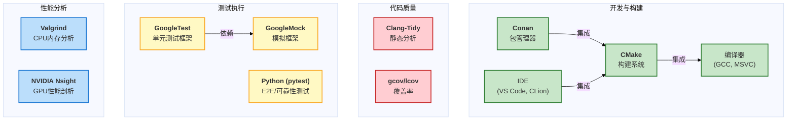
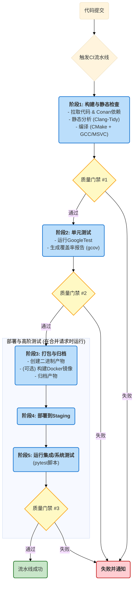

# 05_测试环境与工具链

- **标题**: 测试环境与工具链
- **当前版本**: v1.0.0
- **最后更新**: 2025-09-29
- **负责人**: Klein

-----

## 概述

**概要**: 本文件是雷达数据处理系统所有测试活动的**基础设施蓝图**和**技术栈配置手册**。它旨在通过定义一套统一、标准且可复现的测试环境和工具链，消除“在我机器上可以运行”的问题，确保从开发者本地到持续集成服务器的每一环都具备一致的行为。本文档是连接**测试策略 (Testing Strategy)** 与**测试执行 (Test Execution)** 的桥梁，是实现高效、可靠的自动化测试和质量保障流程的基石。

-----

## 目录

- [05\_测试环境与工具链](#05_测试环境与工具链)
  - [概述](#概述)
  - [目录](#目录)
  - [1. 文档职责与目标](#1-文档职责与目标)
    - [1.1. 文档定位](#11-文档定位)
    - [1.2. 核心目标](#12-核心目标)
  - [2. 测试环境定义](#2-测试环境定义)
    - [2.1. 本地开发环境 (Local Development Environment)](#21-本地开发环境-local-development-environment)
    - [2.2. 持续集成环境 (Continuous Integration Environment)](#22-持续集成环境-continuous-integration-environment)
    - [2.3. 预发布/性能测试环境 (Staging / Performance Environment)](#23-预发布性能测试环境-staging--performance-environment)
  - [3. 核心工具链选型](#3-核心工具链选型)
    - [3.1. 构建与依赖管理](#31-构建与依赖管理)
      - [3.1.1. 构建系统](#311-构建系统)
      - [3.1.2. 包管理器](#312-包管理器)
    - [3.2. 单元测试工具链](#32-单元测试工具链)
      - [3.2.1. 测试框架](#321-测试框架)
      - [3.2.2. 模拟框架 (Mocking Framework)](#322-模拟框架-mocking-framework)
    - [3.3. 代码质量与覆盖率](#33-代码质量与覆盖率)
      - [3.3.1. 静态代码分析](#331-静态代码分析)
      - [3.3.2. 代码覆盖率工具](#332-代码覆盖率工具)
    - [3.4. 系统与性能测试工具链](#34-系统与性能测试工具链)
      - [3.4.1. 自动化测试脚本](#341-自动化测试脚本)
      - [3.4.2. API测试工具](#342-api测试工具)
      - [3.4.3. 性能剖析与监控](#343-性能剖析与监控)
  - [4. 持续集成(CI)流水线设计](#4-持续集成ci流水线设计)
    - [4.1. 流水线触发机制](#41-流水线触发机制)
    - [4.2. 流水线核心阶段](#42-流水线核心阶段)
      - [4.2.1. 阶段一：构建与静态检查](#421-阶段一构建与静态检查)
      - [4.2.2. 阶段二：单元测试与覆盖率分析](#422-阶段二单元测试与覆盖率分析)
      - [4.2.3. 阶段三：打包与产物归档](#423-阶段三打包与产物归档)
    - [4.3. 流水线通知与报告](#43-流水线通知与报告)
  - [5. 附录](#5-附录)
    - [5.1. 完整工具链清单](#51-完整工具链清单)
    - [5.2. 变更历史](#52-变更历史)

-----

## 1. 文档职责与目标
**概要**: 本章确立了本文档的范围、核心使命以及其在项目中的权威地位。它旨在为所有团队成员提供一个关于测试基础设施的共同理解，确保所有测试活动都建立在一个稳定、可靠且一致的基础之上。

### 1.1. 文档定位
**概要**: 本文档是项目测试体系中关于**“基础设施即代码” (Infrastructure as Code)** 的核心说明书和技术契约。它并非一份理论性的策略文件，而是一份**可执行的工程指南**，详细规定了从开发者个人电脑到自动化CI服务器，再到准生产环境的每一处技术细节。本文档是连接 [ **`00_测试策略总览.md`** ](/docs/01_项目设计/06_测试设计/00_测试策略总览.md) 中高层战略与开发测试日常实践的纽带。

### 1.2. 核心目标
**概要**: 本文档的最终使命是通过对测试环境和工具链的严格标准化，达成以下四个核心目标，从而为高质量、高效率的软件交付流程提供底层技术保障。

- **一致性与可复现性 (Consistency & Reproducibility)**:
    - **目标**: 根除由于环境差异导致的构建失败或测试结果不一致的问题。
    - **实现**: 确保每一位开发者的本地环境、CI服务器的构建环境，都使用完全相同的编译器、库版本和工具链配置，保证任何测试结果都是**可信且可复现的**。

- **效率与自动化 (Efficiency & Automation)**:
    - **目标**: 最大化开发与测试流程的自动化程度，缩短从代码提交到获得质量反馈的时间。
    - **实现**: 定义一套支持**持续集成 (Continuous Integration)** 的工具链，实现编译、测试、分析的自动化，让开发者能专注于业务逻辑本身，而非繁琐的环境配置。

- **标准化与规范 (Standardization & Governance)**:
    - **目标**: 建立一套官方认可的、统一的技术栈，避免因工具滥用或版本混乱带来的技术债和安全风险。
    - **实现**: 将所有依赖项通过**包管理器 (Package Manager)** 进行统一管理，确保所有第三方库的版本都是经过审查和批准的，便于进行统一的许可证合规性检查和安全漏洞扫描。

- **清晰度与透明度 (Clarity & Transparency)**:
    - **目标**: 为新成员入职、新环境搭建提供一份清晰、权威的指导手册。
    - **实现**: 作为项目中关于环境和工具的**单一事实来源 (Single Source of Truth)**，降低沟通成本，提升团队协作效率。

-----

## 2\. 测试环境定义

**概要**: 本章详细定义了项目生命周期中涉及的三种关键测试环境：**本地开发环境**、**持续集成环境**和**预发布/性能测试环境**。对这些环境进行严格的标准化和隔离，是确保测试结果**一致性 (Consistency)** 和**可复现性 (Reproducibility)** 的根本保障。

### 2.1. 本地开发环境 (Local Development Environment)

**概要**: 这是每一位开发工程师进行日常编码、调试和执行单元测试的工作环境。其核心目标是**最大化开发效率**和**提供快速反馈**，同时与CI环境保持高度一致，以避免“在我机器上可以运行”的问题。

  - **2.1.1. 操作系统与编译器**

      - **操作系统 (Operating Systems)**:
          - **主要开发平台**: Ubuntu 22.04 LTS (64-bit)
          - **兼容性支持平台**: Windows 10/11 (64-bit) with Visual Studio 2022
      - **编译器 (Compilers)**:
          - **Linux**: GCC 11.x 或更高版本
          - **Windows**: MSVC v143 (Visual Studio 2022 toolset)

    > 严格统一编译器主版本号是避免因编译器差异导致细微运行时错误和**应用二进制接口 (Application Binary Interface)** 不兼容问题的关键。

  - **2.1.2. 核心依赖库**

      - **概要**: 项目所有第三方依赖库均通过 **Conan 包管理器**进行统一管理，开发者无需手动下载或编译。
      - **获取方式**: 开发者只需在项目根目录运行 `conan install . --build=missing` 命令，即可自动下载预编译的二进制包或在本地构建所有依赖项，确保版本的一致性。

  - **2.1.3. IDE与调试工具**

      - **推荐集成开发环境 (IDE)**:
          - **跨平台**: CLion 或 Visual Studio Code (配合CMake, C++, Conan插件)
          - **Windows**: Visual Studio 2022
      - **调试与剖析工具**:
          - **CPU调试**: `GDB` (Linux), `Visual Studio Debugger` (Windows)
          - **内存分析**: `Valgrind` (Linux)
          - **GPU调试与剖析**: **NVIDIA Nsight Systems / Compute** (跨平台)

### 2.2. 持续集成环境 (Continuous Integration Environment)

**概要**: 这是执行自动化构建和测试的核心环境，旨在为每次代码提交提供一个**纯净、隔离且完全可复现**的验证平台。它是保障主干分支质量和实现快速迭代的“自动化质量中枢”。

  - **2.2.1. 容器化方案**

      - **技术选型**: **Docker**
      - **实现**:
          - 项目将提供一个官方的`Dockerfile`，该文件精确定义了CI环境所需的一切：基础操作系统 (Ubuntu 22.04)、编译器、所有版本的构建工具和第三方依赖库。
          - 每次CI流水线运行时，都会基于此`Dockerfile`启动一个全新的、无任何缓存和历史状态的容器来执行构建和测试任务。
      - **核心优势**:
          - **环境一致性**: 彻底解决了因环境不一致导致的构建或测试失败。
          - **依赖隔离**: 所有依赖都封装在容器内，不污染CI服务器的宿主环境。

  - **2.2.2. CI服务器配置**

      - **平台选型**: GitLab CI / Jenkins (或其他支持Docker的CI平台)。
      - **执行逻辑**: CI服务器（Runner）将负责执行项目根目录下的CI配置文件（如 `.gitlab-ci.yml`），该文件定义了构建、单元测试、集成测试等所有自动化阶段。

### 2.3. 预发布/性能测试环境 (Staging / Performance Environment)

**概要**: 这是一个与真实生产环境**高度相似**的独立物理环境，专门用于执行系统与端到端测试、性能测试和可靠性测试。在此环境中获得的测试结果最能代表软件在真实部署后的表现。

  - **2.3.1. 硬件配置对标**

      - **目标**: 硬件配置必须能代表最终用户的典型部署环境。
      - **关键要求**:
        | 组件     | 最低要求                   | 备注                                      |
        | :------- | :------------------------- | :---------------------------------------- |
        | **CPU**  | 8 物理核心, \>3.0 GHz      | 确保足够的并行处理能力                    |
        | **内存** | 32 GB DDR4                 | 支持大规模数据缓存和处理                  |
        | **GPU**  | NVIDIA RTX 3070 或同等级别 | 必须支持 **CUDA Compute Capability 8.0+** |
        | **存储** | 512 GB NVMe SSD            | 确保高速的日志写入和数据加载              |
        | **网络** | 10 GbE                     | 满足高吞吐量数据注入需求                  |

  - **2.3.2. 网络拓扑模拟**

      - **要求**: 该环境必须能模拟**核心处理服务器**与**显控终端**之间的真实网络隔离。两部分应部署在不同的物理机器或虚拟机上，通过真实的物理网络连接，以便测试网络延迟、抖动和丢包对系统的影响。

  - **2.3.3. 部署方式**

      - **要求**: 应用程序的部署方式必须与生产环境的最终部署方案保持一致，例如使用`systemd`服务进行管理、配置文件位于`/etc/radar_system`等，以提前发现部署和运维阶段可能遇到的问题。

-----

## 3\. 核心工具链选型

**概要**: 本章详细阐述并论证了构成我们项目开发与测试流程的**核心技术栈**。每一个工具的选择都基于其在C++社区的**成熟度、性能、跨平台能力以及与我们架构设计的契合度**。

**工具链生态系统概览**:

> 本图表描绘了从开发编码到测试分析的完整工具链生态。它清晰地展示了构建系统、包管理器、测试框架和质量工具之间如何协同工作，共同支撑我们的高质量软件交付流程。

### 3.1. 构建与依赖管理

**概要**: 构建与依赖管理是所有开发活动的基础。我们选择的工具旨在实现**跨平台的一致性**和**依赖获取的自动化**，为开发者提供一个稳定、可预测的构建环境。

#### 3.1.1. 构建系统

  - **工具选型**: **CMake**
  - **选型理由**:
      - **行业标准**: 作为C++项目跨平台构建的**事实标准 (de facto standard)**，CMake提供了无与伦比的灵活性和生态系统支持。它能与所有主流IDE、编译器和包管理器无缝集成，是构建我们复杂模块化项目的唯一合理选择。
      - **项目契合度**: 我们需要在Linux和Windows上进行开发和部署，CMake的跨平台能力完美满足了这一需求。

#### 3.1.2. 包管理器

  - **工具选型**: **Conan**
  - **选型理由**:
      - **二进制包管理**: 这是Conan相较于其他工具的核心优势。它允许我们为所有依赖预构建二进制包，使**持续集成 (Continuous Integration)** 服务器无需每次都从源码编译（尤其是Qt、Protobuf等大型库），能将依赖准备时间从小时级缩短至分钟级，极大地提升了CI/CD效率。
      - **灵活性与私有化**: Conan基于Python的配方 (`conanfile.py`) 提供了极致的灵活性，可以处理复杂的构建逻辑。同时，团队可以轻松搭建私有Conan服务器来管理内部开发的库或对第三方库的修改版，这在企业级项目中是刚需。

### 3.2. 单元测试工具链

**概要**: 单元测试是**测试金字塔 (Test Pyramid)** 的基石。我们选择的工具链旨在让开发者能够轻松、高效地编写高质量的单元测试。

#### 3.2.1. 测试框架

  - **工具选型**: **GoogleTest**
  - **选型理由**:
      - **功能完备**: 提供了丰富的断言库、**测试夹具 (Test Fixtures)**、参数化测试和死亡测试等高级功能，能满足各种复杂的测试场景需求。
      - **CI/CD友好**: 能够生成行业标准的JUnit XML报告，便于与GitLab CI、Jenkins等CI/CD工具集成和展示。

#### 3.2.2. 模拟框架 (Mocking Framework)

  - **工具选型**: **GoogleMock**
  - **选型理由**:
      - **无缝集成**: 作为GoogleTest的一部分，它与测试框架的集成天衣无缝。
      - **架构契合**: 提供了表达力极强的语法来创建和配置**Mock对象 (Mock Object)**。鉴于我们系统**依赖注入 (Dependency Injection)** 的核心架构原则，GoogleMock是我们实现单元测试隔离、模拟`ILogger`、`IEventBus`等接口依赖的**关键工具**。

### 3.3. 代码质量与覆盖率

**概要**: 遵循**缺陷预防优于检测 (Prevention over Detection)** 的原则，我们利用自动化工具在编码阶段和集成阶段持续监控代码质量。

#### 3.3.1. 静态代码分析

  - **工具选型**: **Clang-Tidy**
  - **选型理由**:
      - **深度分析**: 基于Clang的强大前端，能够进行深度、精确的代码分析，发现从潜在bug、内存泄漏到编码风格不一致的各类问题。
      - **左移实践**: 将其集成到CI流程和开发者的IDE中，可以在代码合入前自动拦截大量低级错误，是**左移测试 (Shift-Left Testing)** 的有力保障。

#### 3.3.2. 代码覆盖率工具

  - **工具选型**: **gcov / lcov**
  - **选型理由**:
      - **原生集成**: 作为GCC/Clang工具链的原生组成部分，gcov能提供精准的行和分支覆盖率数据。
      - **可视化报告**: 通过`lcov`工具，我们可以将这些数据生成直观的HTML报告，便于分析测试的覆盖情况，并将其作为**质量门禁 (Quality Gate)** 的量化指标。

### 3.4. 系统与性能测试工具链

**概要**: 针对金字塔顶层的测试，我们需要能够模拟外部系统、驱动完整业务流程并进行深度性能剖析的工具。

#### 3.4.1. 自动化测试脚本

  - **工具选型**: **Python** (配合 **pytest**)
  - **选型理由**:
      - **生态系统**: Python拥有强大的生态系统和简洁的语法，是编写高层测试脚本的理想选择。
      - **专用库**: `pytest`框架提供了模块化的测试用例组织方式，而`requests`、`scapy`等库则能让我们轻松地模拟REST API客户端和UDP数据源，完美契合我们**系统与端到端测试 (System & E2E Tests)** 的需求。

#### 3.4.2. API测试工具

  - **工具选型**: **Postman / Insomnia**
  - **选型理由**:
      - **开发效率**: 在开发和调试阶段，为开发者提供一个图形化的界面来交互式地探索和测试RESTful API，极大地提升了API的调试效率和接口文档的验证效率。

#### 3.4.3. 性能剖析与监控

  - **工具选型**:
      - **CPU/内存**: **Valgrind** (Linux)
      - **GPU**: **NVIDIA Nsight Systems/Compute**
  - **选型理由**:
      - `Valgrind`是检测内存泄漏和进行CPU缓存分析的经典权威工具。
      - 对于我们项目中至关重要的GPU性能，**NVIDIA Nsight** 是分析CUDA应用性能的**行业标准**，能够提供从系统级到单个CUDA核心的深度剖析视图，是我们优化GPU性能不可或缺的工具。

-----

## 4\. 持续集成(CI)流水线设计

**概要**: 本章定义了项目的自动化**持续集成 (Continuous Integration)** 流水线。这条流水线是**自动化优先 (Automation-First)** 和**质量内建 (Quality Built-in)** 理念的工程实践核心，它将代码质量检查、编译、测试和打包过程完全自动化，为开发团队提供快速、可靠的反馈，并强制执行我们在 [ **`00_测试策略总览.md`** ](/docs/01_项目设计/06_测试设计/00_测试策略总览.md) 中定义的**质量门禁 (Quality Gates)**。

### 4.1. 流水线触发机制

**概要**: 流水线的设计旨在对代码库的每一次变更都进行验证，同时兼顾效率和资源利用。我们定义了三种核心触发机制，以应对不同的开发场景。

  - **每次推送 (On Push)**:

      - **触发分支**: 任何对`feature/*`、`fix/*`或`refactor/*`等开发分支的`git push`操作。
      - **执行阶段**: 运行**快速反馈**流水线，仅包含**构建、静态检查和单元测试**。
      - **核心目标**: 在5-10分钟内为开发者提供关于代码基本质量的快速反馈，确保提交的代码不会破坏主干分支的稳定性。

  - **合并请求 (On Merge Request)**:

      - **触发事件**: 当创建或更新一个指向`develop`或`main`主干分支的**合并请求 (Merge Request)** 时。
      - **执行阶段**: 运行**完整验证**流水线，包括构建、静态检查、单元测试、打包，以及耗时较长的**集成测试和系统测试**。
      - **核心目标**: 作为合入主干前最全面的**质量门禁**，确保新代码与现有代码能够正确集成，并满足端到端的业务需求。

  - **每日构建 (Nightly Build)**:

      - **触发机制**: 每天凌晨定时在`main`分支上触发。
      - **执行阶段**: 运行完整验证流水线，并额外执行通常耗时过长的**性能基准测试**和**长时间稳定性（浸泡）测试**。
      - **核心目标**: 监控项目的长期健康度，及时发现性能衰减、内存泄漏等隐蔽问题。

### 4.2. 流水线核心阶段

**概要**: 我们的CI流水线被设计为一系列**串行阶段 (Sequential Stages)**，遵循**快速失败 (Fail Fast)** 原则。前一阶段的成功是后一阶段执行的前提，任何阶段的失败都会立即中止整个流水线并向开发者报告失败。

**CI流水线核心流程图**:

> 下图描绘了在“合并请求”场景下触发的完整CI流水线。它清晰地展示了从代码提交到准备发布的各个自动化阶段，以及每个阶段后设置的质量门禁。

#### 4.2.1. 阶段一：构建与静态检查

  - **目标**: 确保代码的**语法正确性**和**编码规范符合性**。
  - **核心步骤**:
      - **1. 依赖解析**: 运行`conan install`下载所有预编译的第三方库二进制包。
      - **2. 静态分析**: 运行`Clang-Tidy`对新增和修改的代码进行静态分析，检查潜在的bug和风格问题。
      - **3. 编译**: 使用`CMake`生成构建系统，并调用`make`或`MSBuild`进行编译。
  - **质量门禁**: **编译必须成功**，且静态分析**不得引入新的高/中优先级问题**。

#### 4.2.2. 阶段二：单元测试与覆盖率分析

  - **目标**: 验证代码单元的**逻辑正确性**。
  - **核心步骤**:
      - **1. 运行测试**: 执行所有通过CMake的`CTest`模块管理的单元测试（底层调用GoogleTest可执行文件）。
      - **2. 生成报告**:
          - GoogleTest生成JUnit XML格式的测试结果报告。
          - 使用`gcov`和`lcov`工具生成HTML格式的代码覆盖率报告。
  - **质量门禁**: **单元测试必须100%通过**，且代码覆盖率**不得低于85%**。

#### 4.2.3. 阶段三：打包与产物归档

  - **目标**: 生成可部署的二进制文件和用于调试的信息。
  - **核心步骤**:
      - **1. 打包**: 使用`CMake`的`install`目标，将可执行文件、库和必要的配置文件打包到一个干净的目录结构中。
      - **2. 归档**: 将打包好的目录和调试符号文件（`.pdb`, `-g`编译的ELF）压缩并作为**构建产物 (Build Artifacts)** 进行归档，以便后续阶段的部署和问题追溯。
  - **质量门禁**: 打包步骤必须成功完成。

### 4.3. 流水线通知与报告

**概要**: 快速、清晰的反馈是CI/CD的核心价值之一。流水线必须能将执行结果及时通知给相关人员。

  - **即时通知 (Instant Notifications)**:

      - **目标**: 开发团队。
      - **工具**: 集成**Slack**或**Microsoft Teams**。
      - **规则**: 当流水线**失败**或**从失败恢复到成功**时，立即向相关代码提交者和团队频道发送通知。通知内容应包含提交信息、流水线状态以及直达失败日志的链接。

  - **摘要报告 (Summary Reports)**:

      - **目标**: 项目经理、QA负责人。
      - **工具**: 邮件或CI平台仪表盘。
      - **规则**: 对于**每日构建**和**合并到主干**的流水线，无论成功与否，都自动生成并发布一份摘要报告，包含关键质量指标：测试通过率、代码覆盖率变化趋势、性能基准测试结果对比等。

  - **集成化报告 (Integrated Reporting)**:

      - **目标**: 为所有团队成员提供一个集中的、可交互的质量数据视图。
      - **实现**: 所有测试报告（JUnit、覆盖率、静态分析）都应直接集成在CI平台的Web界面中（如GitLab CI的“测试”标签页），方便开发者直接在线查看失败详情、覆盖率报告和代码质量问题，无需在多个系统之间切换。

好的，我们继续进行文档的细化工作。

我将严格遵循我们已确立的文档结构、格式规范和专业、详实的风格，对 `05_测试环境与工具链.md` 文档的第五章进行全文细化和内容丰富化。

-----

## 5. 附录

### 5.1. 完整工具链清单

本清单是项目中所有关键开发与测试工具及其**强制性版本**的权威列表，是搭建所有测试环境的**唯一参考**。

| 类别           | 工具名称            | 强制版本       | 职责                |
| :------------- | :------------------ | :------------- | :------------------ |
| **构建系统**   | CMake               | `3.22+`        | C++项目构建         |
| **包管理器**   | Conan               | `1.50+`        | 第三方依赖管理      |
| **编译器**     | GCC                 | `11.x`         | Linux平台编译器     |
|                | MSVC                | `143`          | Windows平台编译器   |
| **测试框架**   | GoogleTest          | `1.12+`        | C++单元测试         |
| **模拟框架**   | GoogleMock          | `1.12+`        | C++单元测试模拟     |
| **静态分析**   | Clang-Tidy          | `14+`          | 代码质量检查        |
| **覆盖率**     | gcov/lcov           | `(GCC自带)`    | 代码覆盖率生成      |
| **自动化脚本** | Python              | `3.9+`         | 端到端/系统测试     |
| **性能剖析**   | NVIDIA Nsight       | `2022+`        | GPU性能分析         |
|                | Valgrind            | `3.18+`        | CPU内存分析 (Linux) |
| **CI/CD平台**  | GitLab CI / Jenkins | `(最新稳定版)` | 自动化流水线服务器  |

### 5.2. 变更历史

| 版本号 | 日期       | 作者  | 变更描述                                                         |
| :----- | :--------- | :---- | :--------------------------------------------------------------- |
| v1.0.0 | 2025-09-29 | Klein | 初始版本创建，定义了三层测试环境、核心工具链选型和CI流水线设计。 |
