# 信号处理模块设计

**文档版本**: v1.2.0
**最后更新**: 2025-09-25
**负责人**: Klein
**适用阶段**: MVP及向 V2.0 性能优化过渡阶段

---

## 1 文档职责

### 1.1 文档范围
本文件定义雷达数据处理系统中**信号处理模块**的设计蓝图，覆盖：
1) GPU加速的信号处理算法实现策略
2) CUDA并行计算的架构设计和资源管理
3) 算法模拟器的设计原理和扩展机制
4) 数据并行和任务并行的协调策略
5) GPU内存管理和数据传输优化
6) 模块内部组件协作和性能监控

### 1.2 目录
- [信号处理模块设计](#信号处理模块设计)
  - [1 文档职责](#1-文档职责)
    - [1.1 文档范围](#11-文档范围)
    - [1.2 目录](#12-目录)
  - [2 模块总体设计](#2-模块总体设计)
    - [2.1 模块职责定义](#21-模块职责定义)
    - [2.2 模块边界和约束](#22-模块边界和约束)
    - [2.3 职责原则](#23-职责原则)
  - [3 内部架构设计](#3-内部架构设计)
    - [3.1 组件组织结构](#31-组件组织结构)
    - [3.2 组件职责分工](#32-组件职责分工)
    - [3.3 组件协作机制](#33-组件协作机制)
  - [4 GPU计算架构](#4-gpu计算架构)
    - [4.1 GPU资源管理架构](#41-gpu资源管理架构)
    - [4.2 CUDA计算流水线](#42-cuda计算流水线)
    - [4.3 内存管理策略](#43-内存管理策略)
  - [5 算法实现规划](#5-算法实现规划)
    - [5.1 MVP v1.0算法范围](#51-mvp-v10算法范围)
    - [5.2 完整算法总览](#52-完整算法总览)
    - [5.3 算法演进路线表](#53-算法演进路线表)
    - [5.4 算法演进与兼容性策略](#54-算法演进与兼容性策略)
  - [6 算法策略与工厂设计](#6-算法策略与工厂设计)
    - [6.1 算法策略接口](#61-算法策略接口)
    - [6.2 算法工厂设计](#62-算法工厂设计)
    - [6.3 算法流水线配置](#63-算法流水线配置)
  - [6.4 DataContext 设计](#64-datacontext-设计)
  - [7 并行计算设计](#7-并行计算设计)
    - [7.1 数据并行策略](#71-数据并行策略)
    - [7.2 任务并行协调](#72-任务并行协调)
  - [8 性能优化设计](#8-性能优化设计)
    - [8.1 计算优化策略](#81-计算优化策略)
    - [8.2 数据传输优化](#82-数据传输优化)
  - [9 错误处理设计](#9-错误处理设计)
    - [9.1 错误分类与处理策略](#91-错误分类与处理策略)
    - [9.2 恢复策略：协同与上报](#92-恢复策略协同与上报)
  - [10 模块约束说明](#10-模块约束说明)
  - [11 相关文档](#11-相关文档)
  - [12 变更历史](#12-变更历史)

---

## 2 模块总体设计

### 2.1 模块职责定义

信号处理模块作为系统的计算核心，承担高性能信号处理算法的执行和GPU资源的管理职责：

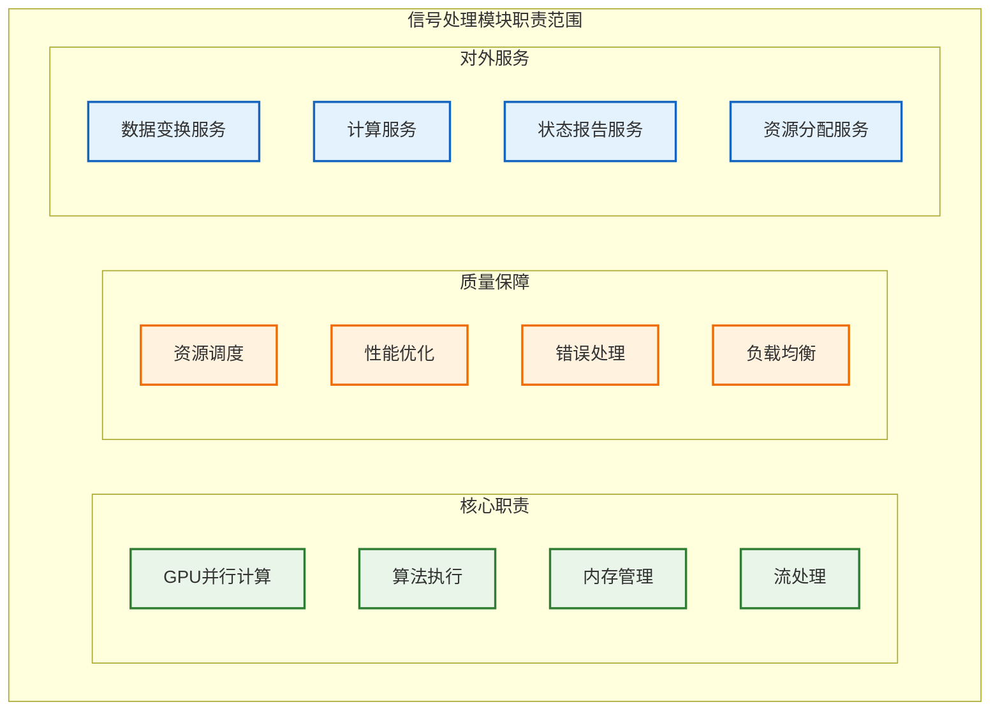

### 2.2 模块边界和约束

**输入边界**：
- **来自数据接收模块的 `DataObject`**:
  - **数据来源**: 从上游的 `raw_data_buffer` (一个并发队列) 中获取。
  - **数据结构**: 每个 `DataObject` 包含一个指向**页锁定内存 (Pinned Memory)** 的指针，该内存由 `DataReceiver` 的内存池管理。
  - **核心要求**: 本模块是零拷贝数据流的**消费者**，严禁对 `DataObject` 中的数据进行任何形式的拷贝。必须直接使用其指针发起异步 `cudaMemcpyAsync` 操作。
- **来自任务调度器的指令**: 计算任务分配、优先级指令、模块启停控制等。
- **来自配置管理器的配置**: 算法流水线定义、算法参数、GPU设备ID等。

**输出边界**：
- **处理结果**:
  - **数据结构**: `DetectionResult` 结构体或其他定义好的结果数据类型。
  - **目标**: 推送到下游模块的输入缓冲区 (例如 `detection_result_buffer`)。
- **内存块归还**:
  - **机制**: 在完成从 `DataObject` 的页锁定内存到GPU的异步拷贝后，**必须立即将该内存块归还给 `DataReceiver` 的内存池**。
  - **重要性**: 这是确保端到端零拷贝数据流正常工作的关键，否则将导致内存泄漏和系统崩溃。
- **状态与指标**:
  - **目标**: 推送到 `日志监控模块` 或 `任务调度器`。
  - **内容**: GPU资源使用状态、算法执行性能指标、模块健康状态等。

**性能约束**：
- 单批次数据处理延迟 < 5ms
- GPU利用率保持在 80% 以上
- 内存带宽利用率 > 70%
- 支持 1000 MB/s 的数据吞吐量

**技术约束**：
- 仅支持NVIDIA CUDA计算平台
- 需要GPU计算能力 6.0 或更高版本
- 依赖CUDA Toolkit 12.x运行环境
- 单GPU配置，预留多GPU扩展接口

### 2.3 职责原则
作为“执行者”角色，信号处理模块的核心职责是高效、准确地完成信号处理任务。它**不参与系统级的决策**。

- **执行**:
  - 从上游缓冲区获取包含页锁定内存指针的 `DataObject`。
  - 执行配置好的信号处理算法链（如脉冲压缩、FFT、CFAR等）。
  - 将处理结果（如`DetectionResult`）输出到下游模块。
  - **归还内存**: 在数据拷贝到GPU后，立即将 `DataObject` 使用的内存块归还给上游内存池。
- **报告**:
  - **状态报告**: 定期向`任务调度器`报告自身运行状态和关键性能指标。
  - **事件上报**: 当发生无法在模块内部恢复的严重错误时（如GPU致命错误），必须立即将事件上报给`任务调度器`，由其决定后续处理策略。

---

## 3 内部架构设计

### 3.1 组件组织结构

信号处理模块内部采用分层计算架构。下图为“功能分组视图”，仅展示层次与组件归属，不表示组件之间的直接调用、依赖或数据流；实际处理/调度与数据流请参考 3.3 协作时序图及 4.x GPU 架构章节：

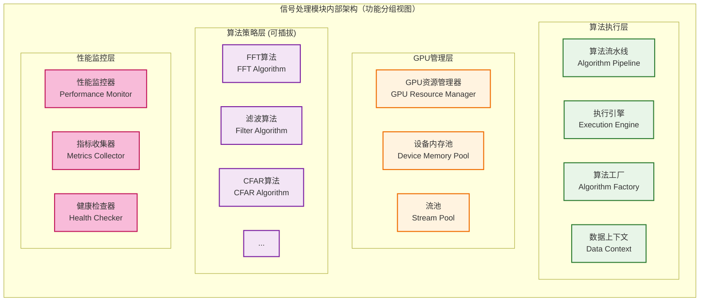
> 注：本图不表示执行顺序、资源调度或数据流向；执行/数据流参考 3.3、4.2、7.x 相关时序与流水线图。

### 3.2 组件职责分工

| 组件名称          | 主要职责                                                     | 关键功能                               | 性能特征       |
| :---------------- | :----------------------------------------------------------- | :------------------------------------- | :------------- |
| **执行引擎**      | **核心驱动**：从上游获取数据，执行算法流水线，将结果送往下游 | 主循环、与上下游缓冲区交互、调用流水线 | 高吞吐、低延迟 |
| **算法流水线**    | **业务逻辑编排**：持有按顺序排列的算法策略实例               | 根据配置构建、按顺序执行算法           | 可配置、可扩展 |
| **算法工厂**      | **策略实例化**：根据配置创建具体的算法策略实例               | 工厂模式、自注册机制、参数化创建       | 灵活、解耦     |
| **数据上下文**    | **数据载体**：在流水线各阶段间传递数据和状态                 | 封装GPU内存指针、中间结果、元数据      | 高效数据交换   |
| **GPU资源管理器** | GPU设备和资源管理                                            | 设备选择、资源分配                     | 资源优化       |
| **设备内存池**    | **Device端内存管理**：高效分配和回收GPU显存                  | 内存池化、避免`cudaMalloc`开销         | 内存效率       |
| **流池**          | **并行流管理**：提供一组可复用的CUDA流                       | 流的获取与归还、支持任务并行           | 并行计算       |
| **算法策略组**    | **具体计算实现**：实现`IAlgorithm`接口的具体算法             | 数学运算、并行CUDA核函数               | 计算密集型     |
| **性能监控器**    | **可观测性**：监控模块关键性能指标                           | `cudaEvent`计时、指标聚合、状态上报    | 可观测性       |

### 3.3 组件协作机制

在新的架构下，组件协作流程被大大简化，以执行引擎为核心，围绕算法流水线展开：

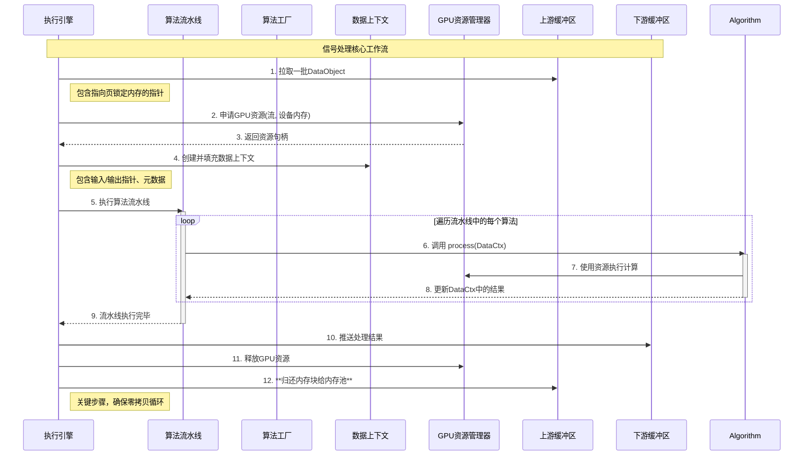

---

## 4 GPU计算架构

### 4.1 GPU资源管理架构

为支持高性能的算法流水线，GPU资源管理架构必须具体且高效，专注于提供可复用的核心资源：

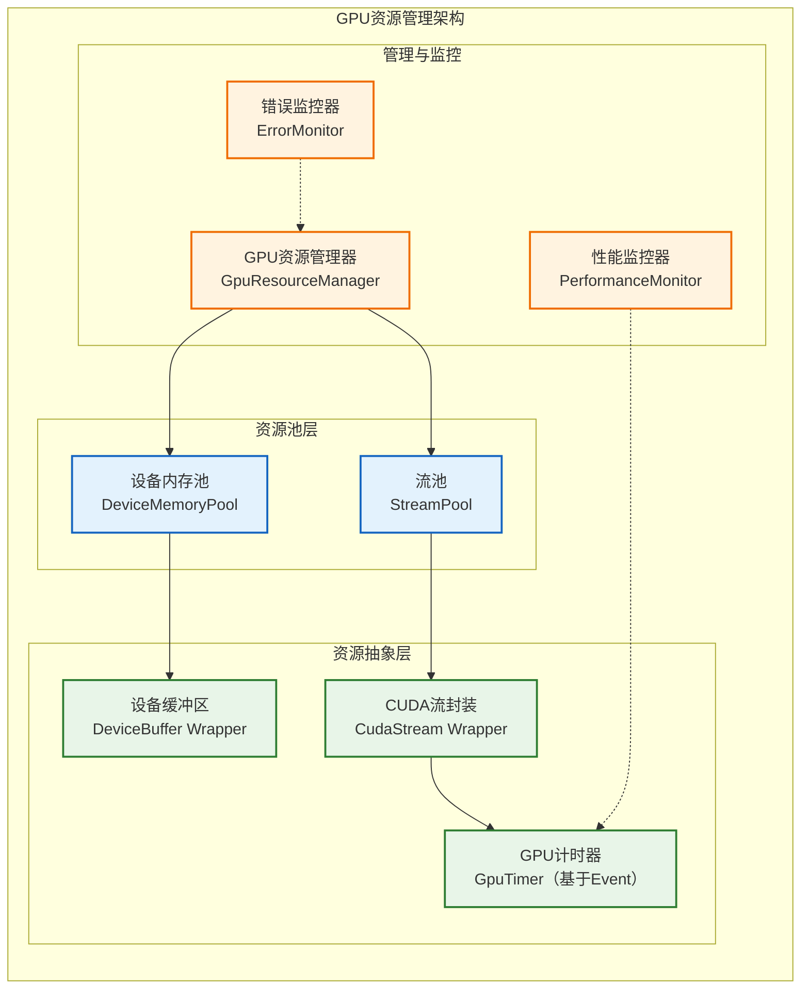
**核心组件职责** (基于架构深度评审报告改进):
- **GpuResourceManager**: 作为统一入口，负责初始化和管理下层的资源池，**新增支持抢占式CUDA流优先级控制**。
- **DeviceMemoryPool**: 预先分配一大块GPU显存，并将其分割成固定大小的块进行管理。提供 `acquire()` 和 `release()` 方法，避免频繁调用 `cudaMalloc` 带来的开销。
- **StreamPool**: 预先创建一组CUDA流，**新增支持双优先级流架构**：HighPriorityComputeStream 和 LowPriorityComputeStream。
- **GpuTimer**: 使用 `cudaEvent` 精确测量GPU上异步操作的耗时，是性能监控的基础。

**抢占式CUDA流架构** (新增 - 基于架构深度评审):
```cpp
/**
 * @brief 抢占式CUDA流管理器 (新增组件)
 * @details 支持双优先级CUDA流，响应DisplayController的优先级控制事件
 */
class PreemptiveStreamManager {
public:
    /**
     * @brief CUDA流优先级枚举
     */
    enum class StreamPriority {
        HIGH = 0,    // 高优先级流，默认使用
        LOW = 1      // 低优先级流，UI让出资源时使用
    };

    /**
     * @brief 初始化双优先级CUDA流
     * @return 初始化结果
     */
    ErrorCode initialize();

    /**
     * @brief 获取指定优先级的CUDA流
     * @param priority 流优先级
     * @return CUDA流句柄
     */
    cudaStream_t getStream(StreamPriority priority);

    /**
     * @brief 设置当前计算优先级 (响应SET_COMPUTE_PRIORITY事件)
     * @param priority 目标优先级
     * @param trace_id 操作追踪ID
     */
    void setComputePriority(ComputePriority priority, const TraceId& trace_id);

    /**
     * @brief 获取当前计算优先级
     * @return 当前使用的优先级
     */
    StreamPriority getCurrentPriority() const { return current_priority_; }

private:
    cudaStream_t high_priority_stream_;    ///< 高优先级CUDA流
    cudaStream_t low_priority_stream_;     ///< 低优先级CUDA流
    std::atomic<StreamPriority> current_priority_{StreamPriority::HIGH};
    EventBus& event_bus_;                  ///< 用于订阅优先级控制事件
};
```

### 4.2 CUDA计算流水线

CUDA计算流水线设计实现计算与数据传输的重叠，最大化GPU利用率。为达到极致性能，系统采用**三重缓冲（Triple Buffering）**模型，利用多个CUDA流来并行化H2D（Host-to-Device）拷贝、Kernel计算和D2H（Device-to-Host）拷贝。

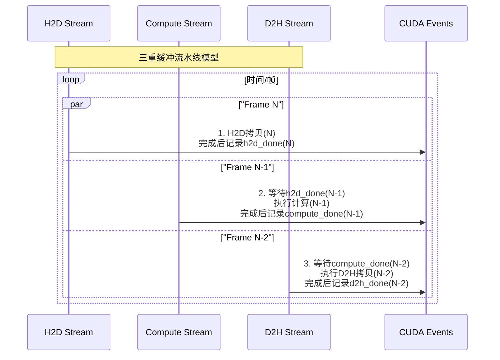
**流水线说明**:
- **H2D Stream**: 专用于将数据从主机页锁定内存异步拷贝到设备内存。
- **Compute Stream**: 专用于执行CUDA核函数计算，**现在支持双优先级切换**。
- **D2H Stream**: 专用于将计算结果从设备内存异步拷贝回主机内存。它必须等待当前帧的计算完成后才能开始。
- **CUDA Events**: 用于在不同流之间创建精确的依赖关系和同步点，是实现计算/传输重叠的关键。

**抢占式流水线优化** (基于架构深度评审):
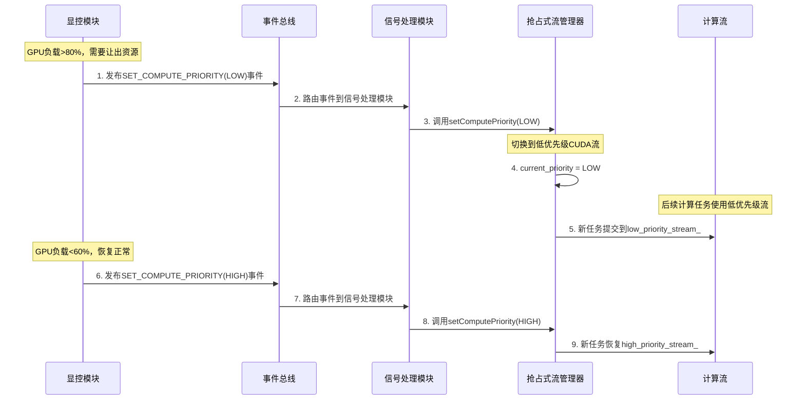

**SignalProcessor事件处理支持** (新增):
```cpp
class SignalProcessor : public IModule {
public:
    /**
     * @brief 处理SET_COMPUTE_PRIORITY事件
     * @param event 优先级控制事件
     */
    void onSetComputePriorityEvent(const SetComputePriorityEvent& event) {
        TraceContextGuard guard(event.trace_id);

        RADAR_INFO("Received compute priority change request: {} -> {}, trace_id: {}",
                   getCurrentPriorityString(),
                   (event.priority == ComputePriority::HIGH) ? "HIGH" : "LOW",
                   event.trace_id);

        // 委托给抢占式流管理器
        preemptive_stream_manager_->setComputePriority(event.priority, event.trace_id);

        // 记录优先级变更历史
        recordPriorityChange(event);
    }

private:
    std::unique_ptr<PreemptiveStreamManager> preemptive_stream_manager_;

    // 在模块初始化时订阅SET_COMPUTE_PRIORITY事件
    void subscribeToEvents() {
        event_bus_.subscribe<SetComputePriorityEvent>(
            [this](const SetComputePriorityEvent& event) {
                this->onSetComputePriorityEvent(event);
            }
        );
    }
};
```

**任务切分支持** (基于架构深度评审要求):
```cpp
/**
 * @brief 可切分CUDA任务接口
 * @details 长耗时计算任务必须实现此接口，支持优先级变更时的及时响应
 */
class ISegmentableTask {
public:
    /**
     * @brief 将大任务分解为小任务段
     * @param segment_size 每个段的大小
     * @return 任务段列表
     */
    virtual std::vector<TaskSegment> segmentTask(size_t segment_size) = 0;

    /**
     * @brief 检查是否需要优先级切换
     * @return 如果需要切换则返回true
     */
    virtual bool shouldCheckPrioritySwitch() const = 0;
};
```

### 4.3 内存管理策略

GPU内存管理采用分级策略，支持高效的内存分配和数据传输：

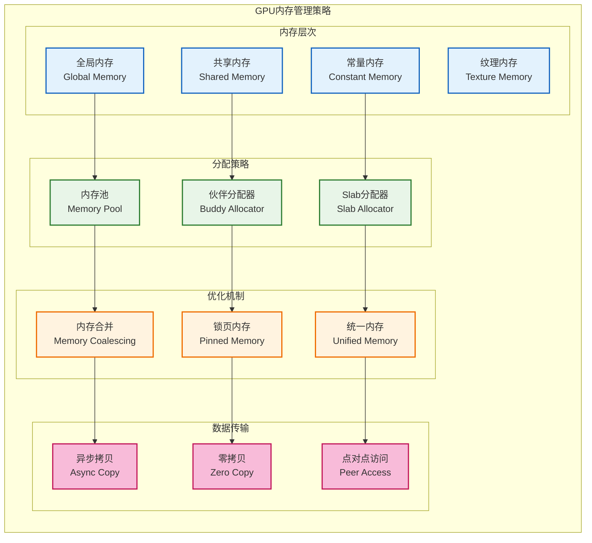

---

## 5 算法实现规划

### 5.1 MVP v1.0算法范围

MVP v1.0阶段聚焦于核心信号处理算法的模拟实现，验证GPU计算架构的可行性：

**基础信号处理算法**
用于将原始 I/Q 数据转换到频域并做窗口与插值等预处理，作为后续处理输入。

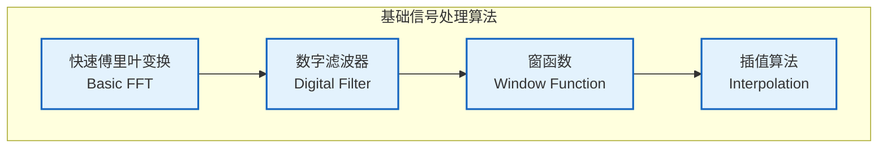

**波束成形算法**
基于相位移位与幅度加权构造方向性波束，用于空间滤波与增益控制。

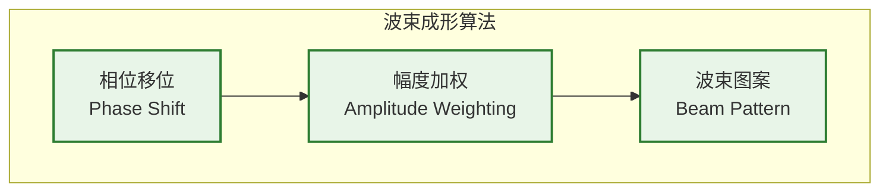

**脉冲压缩算法**
通过匹配滤波和脉冲压缩提升距离分辨率并改善目标检测性能。

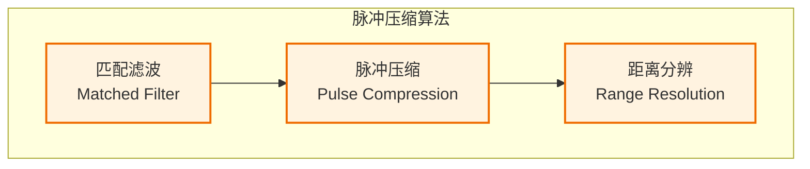

**数据预处理**
噪声抑制、增益控制与校准保证输入数据质量和算法稳定性。

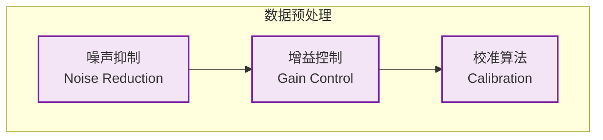

**MVP v1.0 算法特征**：
- **简化实现**：采用基础算法模拟，避免复杂的优化策略
- **验证性质**：重点验证GPU计算架构和数据流转机制
- **模块化设计**：每个算法都实现为独立的策略组件
- **性能基线**：建立性能测试基线，为后续优化提供参考

### 5.2 完整算法总览

完整的雷达信号处理算法体系，为后续版本演进提供路线图：

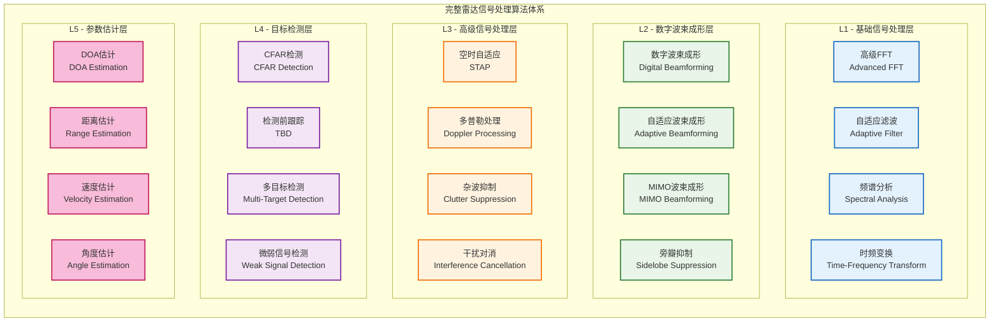

### 5.3 算法演进路线表

分阶段的算法实现和优化路线表：

| 阶段         | 版本 | 主要算法                         | 实现特征               | GPU优化程度  |
| ------------ | ---- | -------------------------------- | ---------------------- | ------------ |
| **MVP验证**  | v1.0 | 基础FFT、简单滤波、相位波束成形  | 模拟实现、架构验证     | 基础CUDA     |
| **核心功能** | v2.0 | 匹配滤波、脉冲压缩、多通道处理   | 完整实现、性能优化     | 中级CUDA优化 |
| **高级处理** | v3.0 | 自适应滤波、CFAR检测、杂波抑制   | 实用算法、实时处理     | 高级GPU优化  |
| **智能处理** | v4.0 | 空时自适应、干扰对消、弱信号检测 | 智能算法、自适应优化   | 专家级优化   |
| **完整系统** | v5.0 | DOA估计、多目标跟踪、参数估计    | 完整算法体系、生产就绪 | 极致性能优化 |

### 5.4 算法演进与兼容性策略

为确保 `5.3 算法演进路线表` 的平稳实现，避免每次升级都成为破坏性重构，必须遵循严格的接口和配置兼容性策略。

**核心原则**: **保证API的向后兼容性，并提供清晰的配置迁移路径。**

1.  **接口版本化与兼容性 (Interface Versioning & Compatibility)**:
    *   **`IAlgorithm` 接口稳定性**: `IAlgorithm` 的核心方法签名，特别是 `ErrorCode process(DataContext& context)`，在主版本号（MAJOR）不变的情况下**必须保持稳定**。
    *   **通过 `DataContext` 扩展**: 当新算法需要额外的输入或产生额外的输出时，应优先通过扩展 `DataContext` 来实现。例如，在 `DataContext` 中增加一个 `std::any` 类型的成员或新的数据指针，而不是改变 `process` 的签名。
    *   **可选接口查询**: 如果需要引入与核心 `process` 无关的全新功能（例如，一个用于调试的 `dump_internal_state()` 方法），可以定义一个新的接口 `IDebuggableAlgorithm`，让算法类同时继承 `IAlgorithm` 和 `IDebuggableAlgorithm`。使用者通过 `dynamic_cast` 来查询该接口，实现可选功能的调用。

2.  **配置兼容性 (Configuration Compatibility)**:
    *   **参数的向后兼容**: 新版本的算法实现**必须**能处理旧版本的配置文件。当新版本增加参数时，代码中必须为这些新参数提供合理的**默认值**。
    *   **参数的向前兼容**: 当算法的某个参数被废弃时，代码应能**忽略**配置文件中存在的多余参数，并打印一条 `WARNING` 级别的日志，提示用户该参数已失效。
    *   **配置迁移工具**: 对于涉及重大配置结构变更的大版本升级（例如 `v1.x` -> `v2.0`），应考虑提供一个简单的Python脚本，用于自动将旧的 `config.yaml` 文件转换为新格式。

3.  **严格的语义化版本控制 (Strict Semantic Versioning)**:
    *   所有算法模块的变更都必须遵循 `vMAJOR.MINOR.PATCH` 的语义化版本规范。
    *   **`MAJOR`**: 当做出不兼容的API变更时（例如，`process` 方法签名改变），必须递增主版本号。
    *   **`MINOR`**: 当以向后兼容的方式添加新功能或新算法时（例如，增加一个新的可选参数），递增次版本号。
    *   **`PATCH`**: 当进行向后兼容的错误修正或性能优化时，递增修订号。

通过以上策略，可以确保算法库在不断演进和功能增强的同时，保持系统的稳定性和可维护性，保护已有的开发投资。

---

## 6 算法策略与工厂设计

为实现可配置、可扩展的算法流水线，算法的处理必须遵循“策略模式”，并由一个强大的工厂来统一管理。

### 6.1 算法策略接口

所有信号处理算法（无论是FFT、滤波还是CFAR）都必须实现统一的 `IAlgorithm` 接口。

```cpp
// In "include/modules/signal_processor/ialgorithm.h"

class DataContext; // Fwd declaration

/**
 * @brief The interface for all signal processing algorithm strategies.
 */
class IAlgorithm {
public:
    virtual ~IAlgorithm() = default;

    /**
     * @brief Configures the algorithm with parameters from a config node.
     * @param params The YAML node containing parameters for this instance.
     * @return SystemErrors::SUCCESS on success.
     */
    virtual ErrorCode configure(const YAML::Node& params) = 0;

    /**
     * @brief Processes the data within the given context.
     * @param context The data context containing input/output buffers and metadata.
     * @return SystemErrors::SUCCESS on success.
     */
    virtual ErrorCode process(DataContext& context) = 0;

    /**
     * @brief Returns the name of the algorithm.
     * @return The name of the algorithm strategy.
     */
    virtual const char* getName() const = 0;
};
```

### 6.2 算法工厂设计

算法工厂采用**自注册机制**，允许新的算法实现在不修改工厂代码的情况下被系统发现和使用，这彻底解决了硬编码带来的扩展性问题。

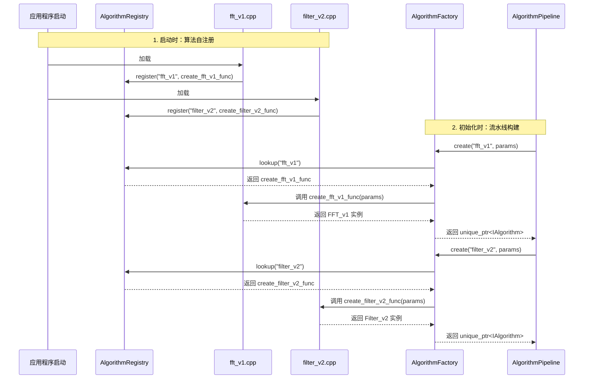

**设计要点**:
1.  **AlgorithmRegistry**: 一个全局单例，内部有一个 `std::map<std::string, CreateFunc>`，用于存储算法类型名到其创建函数的映射。
2.  **自注册宏**: 提供一个宏，使得每个算法实现文件只需一行代码即可完成自注册。
    ```cpp
    // In a new file, e.g., fft_v1.cpp
    #include "algorithm_registry.h"
    REGISTER_ALGORITHM(FFT_v1, "fft_v1");
    ```
3.  **参数化创建**: 工厂的 `create` 方法接受类型名和 `YAML::Node` 参数，将参数透传给具体的算法构造函数或`configure`方法，实现灵活配置。

### 6.3 算法流水线配置

有了新的架构，`config.yaml` 中的配置变得直观且强大。`ExecutionEngine` 在初始化时读取此配置，并使用 `AlgorithmFactory` 构建 `AlgorithmPipeline`。

```yaml
# In configs/config.yaml
signal_processor:
  # ... other settings
  pipeline:
    - type: fft_v1
      name: "MainFFT"
      params:
        size: 4096
        direction: "forward"
        window: "hanning"

    - type: bandpass_filter_v2
      name: "ClutterFilter"
      params:
        low_cutoff: 100.0
        high_cutoff: 5000.0
        order: 5

    - type: cfar_ca_v1
      name: "PrimaryDetector"
      params:
        guard_cells: 4
        training_cells: 16
        pfa: 1.0e-6
```

## 6.4 DataContext 设计

`DataContext` 是在算法流水线中流动的核心数据结构。它本身不拥有资源，而是作为GPU资源（内存、流）和元数据的**视图或句柄**，由 `Execution Engine` 创建和管理其生命周期。

**核心设计原则**:
- **非所有权**: `DataContext` 不负责分配或释放GPU内存。所有权归属于 `Execution Engine` 和 `DeviceMemoryPool`。
- **生命周期**: 每个 `DataContext` 实例的生命周期与一次`Execution Engine`的主循环（即处理一个数据批次）绑定。
- **可扩展性**: 设计为可扩展的结构体，便于未来增加新的上下文信息。

**建议的数据结构**:
```cpp
// This is a conceptual representation, not for a source file.
struct DataContext {
    // Core Resources (provided by Execution Engine)
    cudaStream_t stream;                // The CUDA stream for this pipeline execution.

    // Data Pointers (non-owning pointers to memory from DeviceMemoryPool)
    const void* d_input_data;           // Pointer to input data on the device.
    void* d_output_data;                // Pointer to output data buffer on the device.
    void* d_intermediate_buffer_1;      // Pointers to temporary buffers for multi-stage algorithms.
    void* d_intermediate_buffer_2;

    // Metadata
    size_t input_data_size;
    size_t output_data_size;
    Timestamp timestamp;
    uint64_t trace_id;

    // Extensibility for complex pipelines
    std::map<std::string, void*> named_buffers; // For named intermediate results
};
```

---

## 7 并行计算设计

### 7.1 数据并行策略

数据并行策略必须紧密结合雷达数据立方体（通常维度为 `[通道][脉冲][距离门]`）的物理含义和算法特性，以实现最优的GPU性能。笼统地“将数据分块”是远远不够的，必须在正确的维度上进行并行化，以确保合并的内存访问和高效的计算。

**核心原则**：并行化的维度选择取决于当前算法阶段正在处理的数据维度。

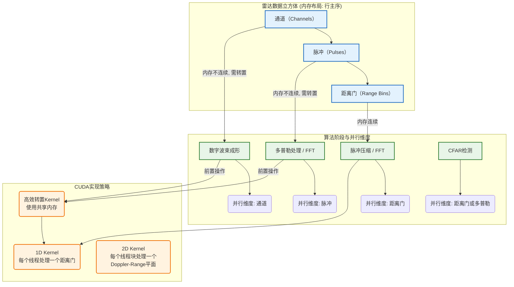

**各阶段并行策略详解**:

1.  **脉冲压缩 / 距离维FFT**:
    *   **并行维度**: **距离门 (Range Bins)**。
    *   **原因**: 在内存布局中，一个脉冲内的所有距离门数据是**连续存储**的。
    *   **CUDA实现**: 启动一个1D的CUDA Kernel。每个线程负责处理一个或多个距离门的计算。这种方式可以实现完美的**合并内存访问 (Coalesced Memory Access)**，最大化利用内存带宽。

2.  **多普勒处理 / 脉冲维FFT**:
    *   **并行维度**: **脉冲 (Pulses)**。
    *   **挑战**: 在原始数据布局中，一个距离门对应的所有脉冲数据是**非连续的（跨步的）**。直接在此维度上并行会导致极差的内存访问性能。
    *   **CUDA实现**:
        1.  **数据转置 (Transpose)**: 在进行计算前，必须先执行一次高效的**核外（out-of-place）矩阵转置**。这个转置操作本身是一个并行的CUDA Kernel，它利用**共享内存 (Shared Memory)** 来避免全局内存的访问惩罚，将 `[通道][脉冲][距离门]` 的数据块重排为 `[通道][距离门][脉冲]`。
        2.  **执行计算**: 在转置后的数据上，再次使用1D Kernel，此时脉冲维度的数据已经变为连续，可以实现合并访问。

3.  **数字波束成形 (Digital Beamforming)**:
    *   **并行维度**: **通道 (Channels)**。
    *   **挑战**: 与多普勒处理类似，通道维度在内存中也是非连续的。
    *   **CUDA实现**: 同样需要在计算前进行数据转置，将数据布局调整为以通道为最内层维度。

**结论**:
数据并行策略的设计不能一概而论。它是一个与**数据内存布局**和**算法计算需求**紧密相关的、分阶段的优化过程。必须将高效的**数据转置**作为算法流水线中的一个标准、可配置的步骤，以在不同计算阶段前，准备好最优的数据布局。

### 7.2 任务并行协调

任务并行通过多个CUDA流实现不同算法的并行执行：

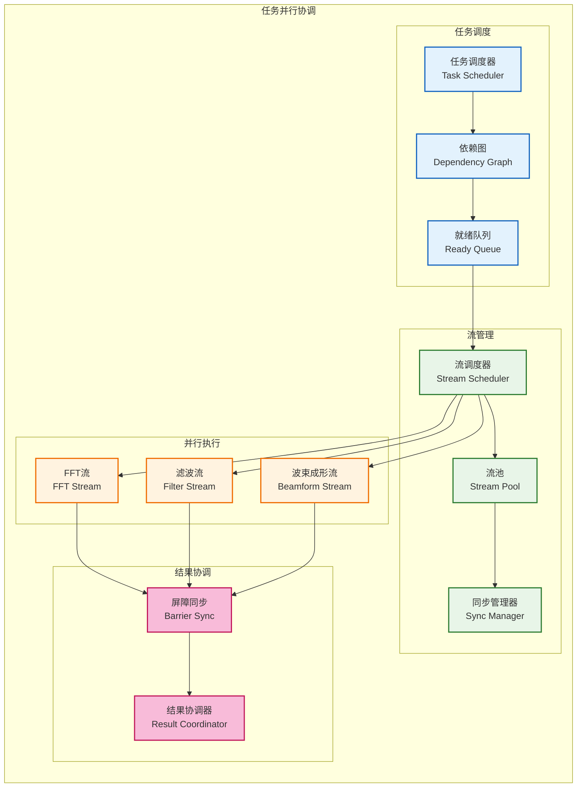

---

## 8 性能优化设计

### 8.1 计算优化策略

**GPU占用率优化**：
- **线程块大小优化**：根据GPU架构调整线程块大小，最大化占用率
- **寄存器使用优化**：平衡寄存器使用和线程并行度
- **共享内存优化**：合理使用共享内存减少全局内存访问
- **分支发散优化**：减少线程束内的分支发散

**算法优化策略**：
- **数据重用**：最大化数据在缓存中的重用
- **计算强度优化**：提高计算与内存访问的比率
- **融合核函数**：合并相关计算减少数据传输
- **异步执行**：重叠计算和数据传输

### 8.2 数据传输优化

**内存访问优化**：
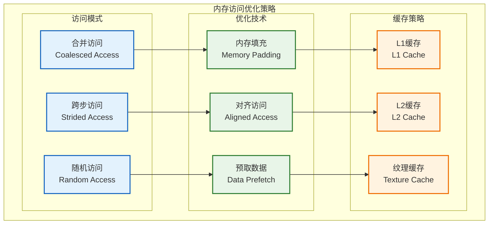

**数据传输流水线**：
- **双缓冲机制**：在GPU计算时准备下一批数据
- **异步传输**：使用异步内存拷贝重叠传输和计算
- **批量传输**：合并小数据传输减少调用开销
- **零拷贝优化**：对于频繁访问的数据使用零拷贝技术

---

## 9 错误处理设计

### 9.1 错误分类与处理策略

GPU编程中的错误处理至关重要。错误的恢复策略必须现实、可靠，并与系统级的容错机制紧密联动。简单的“重试”往往是无效甚至有害的。

| 类别               | 错误码示例                     | 描述                           | **V2.0 恢复策略 (严禁重试)**                                                                            |
| :----------------- | :----------------------------- | :----------------------------- | :------------------------------------------------------------------------------------------------------ |
| **配置错误**       | (自定义)                       | `config.yaml`中参数无效        | 模块初始化失败，上报`CONFIG_ERROR`，终止启动。                                                          |
| **资源分配失败**   | `CUDA_ERROR_OUT_OF_MEMORY`     | GPU显存不足                    | **致命错误**。这不是临时问题。立即停止模块，上报`GPU_FATAL_ERROR`，附带内存申请大小和当前已用内存信息。 |
| **Kernel执行错误** | `CUDA_ERROR_LAUNCH_TIMEOUT`    | Kernel执行超时（可能死循环）   | **致命错误**。重试毫无意义。立即停止模块，上报`GPU_FATAL_ERROR`，附带Kernel名称。                       |
|                    | `CUDA_ERROR_INVALID_HANDLE`    | 无效的句柄（如event, stream）  | **致命错误**。通常是编程逻辑错误。立即停止模块，上报`GPU_FATAL_ERROR`。                                 |
|                    | `CUDA_ERROR_ILLEGAL_ADDRESS`   | Kernel访问了无效内存地址       | **致命错误**。典型的段错误。立即停止模块，上报`GPU_FATAL_ERROR`，附带Kernel名称。                       |
| **硬件/驱动错误**  | `CUDA_ERROR_ECC_UNCORRECTABLE` | GPU硬件ECC校验发现不可恢复错误 | **最高级别致命错误**。立即停止模块，上报`GPU_FATAL_ERROR`，建议系统安全关闭。                           |
|                    | `CUDA_ERROR_UNKNOWN`           | 未知的驱动/硬件错误            | **最高级别致命错误**。同上，立即停止并上报，建议系统安全关闭。                                          |

### 9.2 恢复策略：协同与上报

模块的恢复策略遵循单一职责原则：**模块自身不决策，只执行和上报**。所有恢复决策由`任务调度器`统一做出。

1.  **捕获与包装 (Catch & Wrap)**:
    *   所有调用CUDA API的地方都必须用一个宏 `CHECK_CUDA_ERROR(...)` 来包装。
    *   该宏一旦检测到非 `cudaSuccess` 的返回码，立即将CUDA错误码转换为系统统一的 `ErrorCode`，并附加上下文信息（文件名、行号、函数名）后返回。

2.  **紧急停止与上报 (Stop & Report)**:
    *   **适用场景**: 模块的任何一个组件（特别是`ExecutionEngine`和`Algorithm`实现）收到了一个被判定为致命的 `ErrorCode`。
    *   **核心策略**:
        1.  **立即停止**: 模块应立即停止主循环，不再从上游拉取新数据。
        2.  **设置状态**: 将模块内部状态原子地设置为 `State::FAILED`。
        3.  **记录日志**: 记录一条`FATAL`级别的日志，包含完整的错误信息和上下文。
        4.  **发布事件**: 通过系统的**事件总线**，发布一个 `ModuleFailedEvent`。事件负载应包含：
            *   `module_name`: "SignalProcessor"
            *   `error_code`: 具体的 `ErrorCode`
            *   `details`: 详细的错误描述字符串。
        5.  **等待指令**: 模块进入失败状态后，应放弃所有活动，等待`任务调度器`通过其`IModule`接口下达指令（如 `stop()` 或 `shutdown()`)。

3.  **任务调度器的决策 (Scheduler's Decision)**:
    *   `任务调度器`监听 `ModuleFailedEvent`。
    *   当收到来自 `SignalProcessor` 的失败事件后，调度器根据错误类型和系统配置，执行相应的恢复预案：
        *   **预案A (重启)**: 对于某些非硬件相关的错误，可尝试停止并重启该模块。
        *   **预案B (降级)**: (V2.0+ 规划) 如果系统配置了CPU备用算法，调度器可命令所有相关模块切换到“CPU降级模式”继续运行。
        *   **预案C (关闭)**: 对于明确的硬件错误或无法恢复的故障，调度器应执行有序的系统关闭流程，并发出告警。

这种设计将错误处理的职责清晰地划分开，使模块实现更简单、更健壮，同时赋予了系统层面灵活、强大的容错能力。

---

## 10 模块约束说明

**硬件约束**：
- 仅支持NVIDIA GPU，计算能力6.0或更高
- 最大GPU内存使用不超过75%
- CUDA核心使用率保持在80%以上
- 支持单GPU配置，预留多GPU扩展

**软件约束**：
- 依赖CUDA Toolkit 12.x环境
- 使用cuBLAS、cuFFT等CUDA库
- 算法实现限制在模拟级别
- 不支持动态算法加载

**性能约束**：
- 单次算法调用延迟 < 5ms
- 数据传输带宽利用率 > 70%
- GPU内存带宽利用率 > 80%
- 支持最大1GB/s数据吞吐量

**扩展约束**：
- 算法接口支持策略模式扩展
- GPU资源管理支持多设备扩展
- 内存管理器支持不同分配策略
- 不支持运行时算法热插拔

---

## 11 相关文档

- [数据接收模块设计](01_数据接收模块设计.md)
- [数据处理模块设计](03_数据处理模块设计.md)
- [任务调度器设计](05_任务调度器设计.md)
- [日志服务设计](07_日志服务设计.md)
- [监控服务设计](08_监控服务设计.md)
- [GPU资源管理](../03_并发与调度/05_GPU资源管理.md)
- [性能优化策略](../03_并发与调度/06_性能优化策略.md)

---

## 12 变更历史

| 版本   | 日期       | 作者    | 变更描述                                                                                                                                                                                                                                                                                                                                                                                                                                                                                            |
| ------ | ---------- | ------- | --------------------------------------------------------------------------------------------------------------------------------------------------------------------------------------------------------------------------------------------------------------------------------------------------------------------------------------------------------------------------------------------------------------------------------------------------------------------------------------------------- |
| v1.2.0 | 2025-09-27 | Copilot | **关键架构改进**: 基于架构设计深度评审报告支持抢占式GPU优先级控制<br/>- **双优先级CUDA流**: 引入PreemptiveStreamManager支持HighPriorityComputeStream和LowPriorityComputeStream<br/>- **事件响应机制**: 新增onSetComputePriorityEvent处理DisplayController的优先级控制命令<br/>- **任务切分接口**: 定义ISegmentableTask接口，要求长耗时计算支持切分以响应优先级变更<br/>- **抢占式流水线**: 更新计算流水线支持运行时优先级切换，防止GPU超时<br/>- **可观测性增强**: 添加优先级变更历史记录和追踪支持 |
| v1.1.0 | 2025-09-24 | Copilot | **重大重构**: 根据问题汇总进行全面修复，统一设计语言，解决核心架构问题。                                                                                                                                                                                                                                                                                                                                                                                                                            |
| v1.0.2 | 2025-09-23 | Klein   | 增加了相关文档的链接和说明；3.1 组件组织结构图改为纯功能分组视图，移除箭头/监控虚线；补充说明文字以统一图表语义。                                                                                                                                                                                                                                                                                                                                                                                   |
| v1.0.1 | 2025-09-23 | Klein   | 修正模块职责架构图表：将不合理的组件箭头关系改为功能分组说明，确保图表正确表达分层设计而非直接依赖关系。                                                                                                                                                                                                                                                                                                                                                                                            |
| v1.0.0 | 2025-09-23 | Klein   | 基于MVP设计文档创建信号处理模块设计，包含完整的GPU计算架构和算法模拟器设计                                                                                                                                                                                                                                                                                                                                                                                                                          |

---

*本信号处理模块设计为雷达数据处理系统的高性能计算核心提供详细的架构指导，确保GPU资源的高效利用和算法的灵活扩展。*
